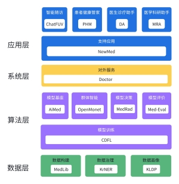

## [研究体系](https://bt7cezha1x.feishu.cn/docx/IgcDdcVwSoQ94vxjJMMcHXfJnwf?from=from_copylink)

## 研究课题

- ### 主要研究：大数据+自然语言处理（大模型）

###### 面向医疗大数据分析与利用的自然语言处理技术研究（博士课题）

负责选择课题、课题调研、文献综述、理论创新、相关实验和论文书写

| **电子病历的命名实体识别**                                   | 子课题     |
| ------------------------------------------------------------ | ---------- |
| **论文**《面向中文电子病历命名实体识别的深度学习模型研究》   | 北京市优毕 |
| **论文**《中文电子病历命名实体识别的研究与进展》             | 北大核心   |
| **论文**《MoNER：A Novel Medical-Oriented Named Entity Recognition Method Based on Remote Supervision》 | CCF-B      |

| **支持卫生健康数据要素的医疗知识图谱**                    | 子课题 |
| --------------------------------------------------------- | ------ |
| **论文**《PoKG：Patient Sketch based on knowledge graph》 | CCF-B  |

| **面向数据和知识双轮驱动的智慧医疗大模型研究**               | 子课题     |
| ------------------------------------------------------------ | ---------- |
| **报告**《ChatGPT创造了AI狂潮》                              | 微软邀约   |
| **论文**《AiMed: Artificial Intelligence large language model for chinese Medicine》 | **CCF-A**  |
| **论文**《ChatFUV：Chat Chain for Follow-Up Visit》          | **CCF-A**  |
| **系统**《AiMed医学知识大模型应用服务系统》                  | 软件著作权 |
| **论文**《MedRad : A Framework for Reliable Assisted Decision Making in a Medical LargeLanguage Model》 | **CCF-A**  |
| **论文**《NewMed：Large Language Modeling Technology Enables Full Process Digital Intelligence in Medical Care》 | **CCF-A**  |
| **论文**《Doctor：The Most Reliable Digital Intelligence Healthcare Large Language Model System》 | **CCF-A**  |
| **论文**《MedLib: Research on the construction of a knowledge library for medical large language modeling》 | **CCF-A**  |

- ### 参与研究：医工交叉+网络

###### 大模型与区块链（子课题）

负责专业技术交叉研究、相关理论创新与应用落地、论文书写

| **区块链链上链下数据可信交互关键技术研究**                   | 纵向-科技部 |
| ------------------------------------------------------------ | ----------- |
| **网站**《[Open Data Entry 数据开放入口](https://www.opende.org.cn/)》 | 公共服务    |
| **论文**《Med-Eval: Blockchain Assessment Platform for Medical Large Language Model》 | **CCF-A**   |
| **论文**《OpenMonet：Open Model Orchestration Network 》     | **CCF-A**   |

###### 数智涌现的新一代智慧医疗（子课题）

负责医工学科交叉研究、相关场景创新与应用落地、论文书写

| **老年肾功能减退临床综合评估管理及早期预警体系建立**         | 纵向-科技部 |
| ------------------------------------------------------------ | ----------- |
| **论文**《Research of Client Selection Algorithm in Cross-device Federated Learning》 | 北大核心    |
| 医疗数据标注**系统**、中文分词处理**系统**                   | 相关服务    |

## 学习情况

| 类型     | 具体方向                                 | 主要技能   | 相关成果                                                     |
| -------- | ---------------------------------------- | ---------- | ------------------------------------------------------------ |
| 机器学习 | 高级机器学习（A）                        | ML         | MedRad : 一个医学大模型的可靠辅助决策框架                    |
|          | 数智安全与标准化（A）                    | 科技法律   | AI算法透明性实现与评估——以推荐系统为例                       |
|          | 计算语言学（A）                          | NLP-Base   | 微调中⽂预训练模型进⾏⽂本分类                               |
|          | 信息检索的前沿研究（A）                  | IR         | 面向多源异构健康大数据的数智医疗搜索引擎                     |
|          | 大数据分析与处理（A）                    | 大数据分析 | 多模态对话场景与话题切换理解                                 |
|          | 数据挖掘：原理与算法                     | 数据挖掘   | 在线新闻热度预测 糖尿病患者入院数据聚类分析             |
|          | 知识工程                                 | NLP-KG     | 基于 MAVEN 数据集实现事件抽取 跨语言知识图谱            |
|          | 人工智能原理                             | AI         | 基于机器学习的中英机器翻译                                   |
|          | 并行计算、算法与算法复杂性理论、组合数学 | 高性能计算 | Π求解的并行化研究 组合数学在人工智能领域的应用          |
| 其他     | 相关技能学习                             | 综合       | 中国马克思主义与当代（A）、自然辩证法概论（A），大数据分析、大数据与生物统计学、大数据实践、博士生英语（免修）、职业能力扩展训练 |

## 学术论著

[14] Jinhua Du. ChatFUV：Chat Chain for Follow-Up Visit (CCF-A在投)   

[13] Jinhua Du. NewMed：Large Language Modeling Technology Enables Full Process Digital Intelligence in Medical Care (CCF-A在投)

[12] Jinhua Du. Doctor：The Most Reliable Digital Intelligence Healthcare Large Language Model System (在研)

[11] Jinhua Du. AiMed: Artificial Intelligence large language model for chinese Medicine (CCF-A在投)

[10] Jinhua Du. OpenMonet：Open Model Orchestration Network (在研)

[9] Jinhua Du. MedRed： A Framework for Reliable Assisted Decision Making in a Medical Large Model (CCF-A在投) 

[8] Jinhua Du. Med-Eval: Benchmarks for the Medical Large Language Model (CCF-A在投) 

[7] Jinhua Du. MedLib: Research on the construction of a knowledge library for medical large language modeling (在研) 

[6] Yuyang Liu,Xiaoying Li,Yan Luo,Jinhua Du,Huiling Ren,Junhui Wang,Hao Yin,Xiaoli Tang,and Hui Liu. Towards a Large Language Models-driven Medical Literature Retrieval and QA System: Framework Design and Evaluation[J]. Journal of the American Medical Informatics Association(JAMIA). 2023. (SCI在投)  

[5] 医学知识大模型训练用语料数据集构建研究 (中文核心在投)

[4] 张瑞麟, 杜晋华, 尹浩. [Research of Client Selection Algorithm in Cross-device Federated Learning (jos.org.cn)](https://www.jos.org.cn/josen/article/abstract/nb023)[J]. Journal of Software.

[3] Jinhua Du and Hao Yin. KLDP: A Data Profiling Technique Based on Knowledge Graph and Large Language Modeling，2023 IEEE 22nd International Conference on Trust, Security and Privacy in Computing and Communications (TrustCom)，2023.11（DOI 10.1109/TrustCom60117.2023.00329）

[2] Jinhua Du and Hao Yin. KrNER：A Novel Named Entity Recognition Method Based on Knowledge Enhancement and Remote Supervision[C]. 2023 IEEE 22nd International Conference on Trust, Security and Privacy in Computing and Communications (TrustCom), 2023.11.（DOI 10.1109/TrustCom60117.2023.00328）

[1]杜晋华, 尹浩, 冯嵩. [中文电子病历命名实体识别的研究与进展 ](https://www.ejournal.org.cn/CN/abstract/abstract13029.shtml)[J]. 电子学报, 2022, 50(12): 3030-3053.

## 媒体报道

- [第三届中国医学信息学学科发展大会](https://mp.weixin.qq.com/s/RDQUcnGLRciSwub1HuOh4Q) (2023.11.25) 作为第一完成人的AiMed大模型[发布](https://bt7cezha1x.feishu.cn/wiki/Bu3YwOsyyixkswkYGS1cjbXPnMf?from=from_copylink)，同名github代码和hugging face参数已开源，之后相应论文会同步更新. 

## 评奖评优

| 项目 | 内容                                                         | 单位             | 时间    |
| ---- | ------------------------------------------------------------ | ---------------- | ------- |
| 评优 | 计算机系研团优秀部员                                         | 清华大学计算机系 | 2023.05 |
|      | 探臻科技部优秀部员                                           | 清华大学         | 2022.12 |
|      | 第十六届研究生新生骨干培训班暨第三十七期团校（研究生班）优秀学员 | 清华大学         | 2022.08 |

## 工作实践

| 分类   | 地点                                                         | 职位                     | 时间            |
| ------ | ------------------------------------------------------------ | ------------------------ | --------------- |
| 实验室 | 北京信息科学与技术国家研究中心-大数据驱动的知识管理和决策团队 | 实验室助理研究           | 2021.09-至今    |
| 实习   | 湖南网数科技有限公司                                         | AI算法岗                 | 2022.08         |
| 社工   | 计研五二班                                                   | 团支书                   | 2022.08-至今    |
| 社工   | 清华大学计算机系团委                                         | 实践部书记               | 2022.08-至今    |
| 社工   | 清华大学探臻科技评论社                                       | 采编部干事：AI社群负责人 | 2022.08-2023.08 |
| 社工   | 清华大学研究生学生会                                         | 体育部                   | 2022.08-2023.08 |

#### 2022年9月至今

- 担任计算机系团委实践部骨干，负责暑期研究生社会实践评奖材料整理、新闻稿撰写以及高校企业行的策划、外联、组织活动，在清华大学新闻网上**以第一通讯员身份发表一篇文章**，协助发布若干实践推送
- 担任校学生会体育部骨干，负责现场宣传材料收集，参加并获得**2022年校园马拉松10km奖牌，2023年校园马拉松半马奖牌**
- 担任校学生会探臻科技评论社采编部骨干，负责**科技热点查新与评论**工作以及**采访院士**与新闻稿撰写工作，负责一周科技咨询相关工作6次，对应发表6篇推送
- **担任计算机系研团实践副书记**，参与全部的“喜迎二十大，产业新力量”七系联合产业行活动，2023.03.16字节跳动OpenDay队长、联络宣传带队；2023.04.13腾讯OpenDay队长、联络宣传带队；2023.04.24美团OpenDay队长、联络宣传带队；2023.04.27九坤投资OpenDay副队长；2023.06.17网易有道Open Day队长、联络宣传带队；2023.07.10-12	杭州地域行：13家企业走访 队长、联络宣传带队，共计发表1份5W字报告，23篇主稿推送
- **参加2次社工课程与培训**，包括：2022.09 清华大学博士生讲师团“立言计划”第六期（秋季学期），2022.08 清华大学第十六届研究生新生骨干培训班暨第三十七期团校（研究生班）

 

