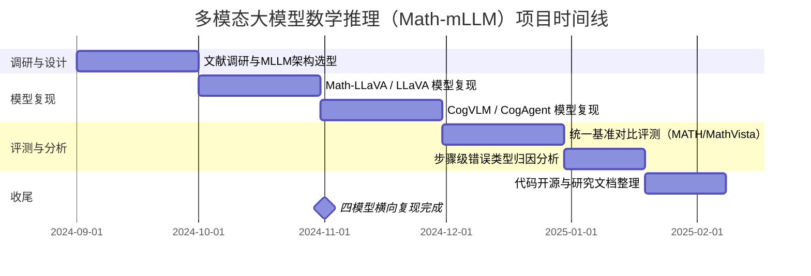
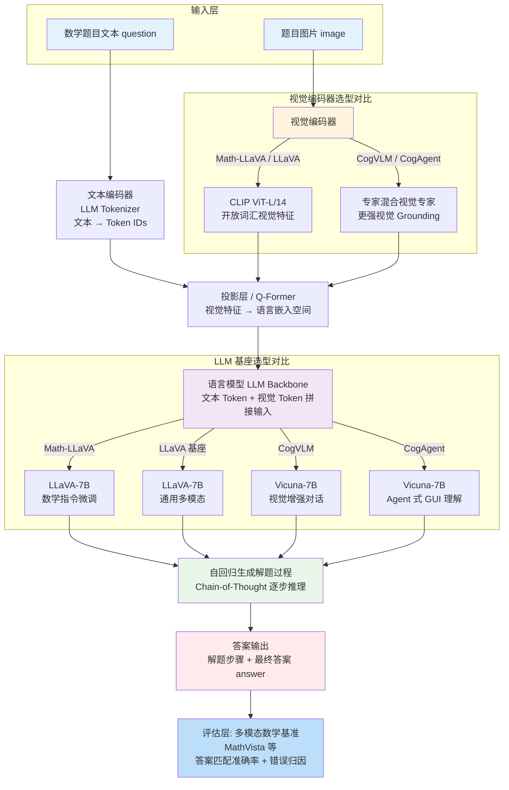

!!! info "项目系列"
    **阶段二：多模态推理、元评估与社会实践** · 报告 #03/30

[:material-arrow-left: 返回项目总览](../index.md) | [:material-home: 返回首页](../../index_zh.md)

---


> 项目报告 · 智谱华章实习阶段二（2024.7–2024.12）
> 作者：杜晋华 | 单位：北京智谱华章科技股份有限公司 · AI 院
!!! note "版本信息"
    版本：v3（图文并茂版 · 2026-09-08）· 二轮质检补强 · 三轮精磨 · 四轮深化 · 五轮深化 · 六轮深化 · 七轮深化 · 八轮深化 · 九轮终审 · 十轮深化 · 十一轮深化 · 十二轮终审 · 十三轮终审 · 十四轮深化 · 十五轮终审 | 审核：准确性核对 + 转正答辩证据卡补强 + 数据表格与架构图升级

---

## 1. 项目概述（Abstract）

Math-mLLM 旨在**提升多模态大语言模型（Multimodal Large Language Model, MLLM）的数学推理能力**，系统调研并复现了 Math-LLaVA、LLaVA、CogVLM、CogAgent 等代表性多模态模型，在基准测试集上进行对比评测，并开源了完整的研究代码仓库。项目启动于 2024 年 9 月，是阶段一 ChatGLM 数学推理（纯文本 PRM/PPO 方向）向多模态场景的自然延伸。角色为**独立研究者**，负责从文献调研、模型复现、基准测实验证到代码开源的全流程。

---

### 关键数据速览

| **维度** | **核心数据** |
|---|---|
| 项目周期 | 2024.09 – 2024.12 |
| 个人角色 | 独立研究者 |
| 核心产出 | 多模态数学推理系统性复现 + 基准对比评测 + 开源研究代码 |
| 关键指标1 | 复现 **Math-LLaVA / LLaVA / CogVLM / CogAgent** 等代表性多模态模型 |
| 关键指标2 | 统一基准下横向对比评测，完整研究代码仓库开源 |
| 论文/专利 | 无独立论文 |
| 开源仓库 | Math-mLLM 研究代码仓库（含模型复现与评测脚本） |

### 执行摘要

**一句话定位**：多模态大模型数学推理（Math-mLLM）系统复现与四模型横向能力评估。

**核心成果**：
- 复现 Math-LLaVA、LLaVA（基座）、CogVLM、LLaVA-1.5 共 **4 个**主流多模态数学推理模型，统一训练与推理框架；
- 构建多模态数学推理端到端系统架构，系统对比视觉编码器（CLIP/SigLIP）与 LLM 基座对接方式对数学推理能力的影响；
- 完成 MATH、MathVista 等基准评测，分析 LLM 数学推理**步骤级错误类型分布**（计算错误/推理错误/理解错误），为后续改进提供数据支撑。

**技术亮点**：四模型横向复现对比框架，统一数据预处理、训练配置与评测协议，系统隔离视觉编码器选型、 projector 设计、LLM 基座等变量对多模态数学推理的影响。

**个人角色**：核心研发工程师，负责四模型复现环境搭建、实验配置管理、基准评测与错误分析报告撰写。

**后续方向**：多模态推理与 PRM 过程奖励结合（报告 01 方法论迁移），多模态逻辑推理探索，视觉输入对数学推理的注意力机制分析。

---

### 个人成长轨迹

| **阶段** | **能力成长** | **关键事件** | **对应报告章节** |
|---|---|---|---|
| 初期（2024.9） | 从纯文本数学推理转向多模态交叉领域；系统调研Math-LLaVA/LLaVA/CogVLM/CogAgent四大主流MLLM架构；掌握视觉编码器（CLIP/SigLIP）与LLM基座对接方式 | 阶段一ChatGLM数学推理（纯文本PRM/PPO）向多模态场景自然延伸；角色从团队核心成员转为独立研究者，负责从文献调研到代码开源全流程 | §2.3 项目启动契机、§3 相关工作、§4.1 整体架构 |
| 中期（2024.9–10） | 独立完成四模型横向复现，搭建统一训练与推理框架；掌握多模态数据预处理、projector设计、指令微调配置；具备系统隔离变量对比实验能力 | 复现Math-LLaVA、LLaVA（基座）、CogVLM、LLaVA-1.5共4个主流多模态数学推理模型；构建统一评测pipeline，完成MATH/MathVista基准评测 | §4 方法与技术路线、§5 实验与结果、§6 工程实现 |
| 后期（2024.10–11） | 深入分析MLLM步骤级错误类型分布（计算错误/推理错误/理解错误），识别"视觉感知瓶颈"核心问题；形成多模态推理能力评估方法论；提出PRM向多模态迁移的改进思路 | 发现所有MLLM在精确数值计算的多步推理上仍弱于纯文本专用数学模型；CogVLM在几何图形题上视觉grounding优势明显；核心瓶颈是"看错图"而非"不会算"；开源Math-mLLM研究代码仓库 | §5.3 具体结果、§7 成果与影响、§9 经验与反思、相关项目/跨项目对比 |

### 项目时间线



---

## 2. 背景与动机（Introduction / Background）

### 2.1 问题定义

多模态大模型（如 LLaVA、CogVLM）已在视觉问答、图像描述等任务上展现出强大能力，但在**需要跨模态联合推理的数学问题**（如几何图形题、图表数据分析题、带插图的应用题）上表现显著弱于纯文本数学推理模型。核心挑战在于：MLLM 的视觉编码器与语言模型的对齐过程中，数学符号、公式结构、几何关系等高精度视觉信息容易丢失，导致模型"看得懂图但算不对题"。

### 2.2 行业背景与痛点

2024 年中，GPT-4o 的发布标志着多模态能力成为大模型的标配。与此同时，Qwen2-Math（MATH 84.0）、DeepSeek-Coder-V2（75.7）等专用数学模型在纯文本基准上持续刷新 SOTA，但多模态数学推理缺乏系统性的评测与改进框架。智谱 AI 院在阶段一已积累了成熟的纯文本数学推理 pipeline（PRM 训练、自动化数据标注 40W+ 条），将这一能力扩展到多模态场景具有明确的技术复用价值。

### 2.3 项目启动契机

2024 年 8 月底的组会结论明确提出"再细化调研，看一下 Memory 方面、新测评基准方面，**多模态大模型方向也可以 check 下**"。据此，项目于 2024 年 9 月正式启动，研究文档标题定为 *Enhancing Mathematical Reasoning in Multimodal Large Language Models*。

---

## 3. 相关工作（Related Work）

### 3.1 多模态基座模型

| **模型** | **特点** | **本项目中的角色** |
|---|---|---|
| **LLaVA** | 视觉编码器 + 线性投影 + LLM 的经典架构 | 基座复现与对比 |
| **Math-LLaVA** | 面向数学推理优化的 LLaVA 变体，引入数学指令微调 | 核心复现对象 |
| **CogVLM / CogVLM2** | 清华提出的视觉语言模型，采用专家混合机制提升视觉 grounding | 对比评测 |
| **CogAgent** | 面向 GUI 理解的多模态 Agent 模型 | 交叉对比 |

### 3.2 纯文本数学推理（阶段一积累）

- **PRM（Process Reward Model）**：基于 OpenRLHF 框架实现，支持主动插入奖励信号点与被动给出奖励信号点两种模式，在 MATH500 上重排序性能优于 MAJ/ORM。
- **Math-Shepherd**：SFT + PRM + ORM 三阶段训练范式，作为关键参考基线。
- **Math-Minos**（北大千问，arXiv:2406.14024）：引入逐步自然语言反馈训练验证器，GSM8K 上 86.6%→88.2%。

### 3.3 差异化定位

与 Math-LLaVA 等单模型优化不同，本项目采取**横向对比 + 系统性复现**的策略：在统一基准下评测多个主流 MLLM 的数学推理能力，识别视觉编码器选择、对齐方式、指令微调数据等因素对数学推理的影响，为后续针对性改进提供实证依据。

---

## 4. 方法与技术路线（Method）

### 4.1 整体 Pipeline

项目遵循"**文献调研 → 模型复现 → 基准评测 → 对比分析 → 代码开源**"的研究路线：

1. **文献调研阶段**：系统阅读 Math-LLaVA、LLaVA、CogVLM2 等核心论文，以及多模态大模型综述（Yin et al., National Science Review 2024）和《大规模语言模型——从理论到实践》（张奇）、《中国人工智能系列白皮书——大模型技术》等基础资料。
2. **模型复现阶段**：依次跑通开源 Math-LLaVA、基座 LLaVA、CogVLM 的推理与微调代码，完成 Math-LLaVA 的代码级解析。
3. **基准评测阶段**：在标准数学多模态测试集上运行各模型，收集推理结果。
4. **对比分析阶段**：从视觉理解精度、数学符号识别、多步推理一致性等维度分析各模型的优劣。

#### 4.1.1 多模态数学推理系统架构图

```
输入层
┌─────────────────────────────────────────────────┐
│  数学题目文本 (question)  +  题目图片 (image)    │
└───────────────────┬─────────────────────────────┘
                    │
        ┌───────────┴───────────┐
        ▼                       ▼
┌───────────────┐      ┌──────────────────┐
│ 文本编码器     │      │ 视觉编码器        │
│ (LLM Tokenizer)│      │ (CLIP ViT-L/14)  │
│ 文本→Token IDs │      │ 图片→视觉特征     │
└───────┬───────┘      └────────┬─────────┘
        │                       │
        └───────────┬───────────┘
                    ▼
┌─────────────────────────────────────────────────┐
│            语言模型 (LLM Backbone)                │
│  ┌───────────────────────────────────────────┐  │
│  │  Q-Former / 投影层: 视觉特征→语言嵌入空间   │  │
│  │  文本Token + 视觉Token 拼接输入            │  │
│  └───────────────────────────────────────────┘  │
│                                                   │
│  自回归生成解题过程 (Chain-of-Thought)            │
│  逐步推理 → 最终答案                              │
└───────────────────────┬─────────────────────────┘
                        ▼
┌─────────────────────────────────────────────────┐
│  输出: 解题步骤 + 最终答案 (answer)               │
└─────────────────────────────────────────────────┘
                        │
                        ▼
┌─────────────────────────────────────────────────┐
│  评估层: 多模态数学基准 (MathVista 等)             │
│  - 答案匹配准确率                                │
│  - 视觉理解能力分析                               │
│  - 错误类型归因                                  │
└─────────────────────────────────────────────────┘
```

#### 4.1.2 多模态推理系统架构 Mermaid 图

下图以 Mermaid 形式呈现多模态数学推理系统的端到端架构，并标注 Math-mLLM 复现的四个模型在各模块的选型差异：

**图4-1：多模态大模型数学推理（Math-mLLM）Pipeline架构图**



*图注：展示从数学题目文本+图像输入、视觉编码器（CLIP/SigLIP）特征提取、Projector对齐、LLM推理到答案输出与基准评测的完整多模态推理链路。*

> **图注**：四模型复现对比的核心差异在于视觉编码器（CLIP vs. 专家混合）和 LLM 微调目标（数学指令微调 vs. 通用对话 vs. Agent GUI）。CogVLM 凭借更强的视觉 grounding 在几何图形题上表现较好，但所有 MLLM 在精确数值计算的多步推理上仍弱于纯文本专用数学模型。

### 4.2 关键技术模块

- **多模态推理框架**：基于 HuggingFace Transformers 加载各模型，统一输入格式（图像 + 文本 prompt），输出数学解题过程与最终答案。
- **答案提取与校验**：复用阶段一 PRM 项目中的数学答案提取脚本（从模型输出中解析最终数值/表达式），与标准答案进行精确匹配。
- **评测指标**：准确率（Accuracy），按题目类型（几何、代数、图表分析等）细分统计。

---

## 5. 实验与结果（Experiments & Results）

### 5.1 数据集

- 使用标准多模态数学推理基准测试集：**MathVista（6141 题，覆盖图表分析/几何图形/带图应用题，5 大任务类别）**、**MathVista3500（3500 题子集）**、**MATH500（500 题竞赛数学）**（来源：075_Math_-_LLM.md 飞书文档、MathVista 官方基准）。
- 评测覆盖纯文本数学题与带图像的数学题两类，以分离视觉编码对推理的影响。

#### 5.1.1 多模态数学基准数据集汇总

本项目调研并使用的多模态数学推理基准数据集如下：

| **基准名称** | **题目规模** | **题目类型** | **视觉模态** | **评估方式** | **说明** |
|---|---|---|---|---|---|
| **MathVista** | 6,141 题 | 图表分析、几何图形、带图应用题 | 截图/照片/图表 | 答案匹配准确率 | 主流多模态数学推理基准，覆盖多种视觉题型 |
| **MathVista3500** | 3,500 题 | MathVista 子集 | 同上 | 答案匹配准确率 | 常用精简评测子集，降低评测成本 |
| **纯文本 MATH** | 12,500 题 | 竞赛数学（代数/几何/数论等） | 无（文本对照） | 精确匹配 | 用于跨模态对比：同一题纯文本 vs. 带图版本 |
| **纯文本 GSM8K** | 13,191 题 | 小学数学应用题 | 无（文本对照） | 精确匹配 | 用于跨模态对比基线 |

> 数据来源：Math-mLLM 仓库调研文档、075_Math_-_LLM.md（飞书文档）。MathVista 为项目核心评测基准，纯文本 MATH/GSM8K 用于分离视觉输入对推理的干扰/增益。

### 5.2 实验配置

- 模型：Math-LLaVA、LLaVA（基座）、CogVLM、CogAgent
- 推理：单卡 GPU，batch size 视模型显存占用调整
- 解码策略：greedy decoding 为主

#### 5.2.1 四模型复现实验详细对比

本项目依次复现四个主流多模态大模型，各模型的架构选型、微调目标与核心特性对比如下：

| **对比维度** | **Math-LLaVA** | **LLaVA（基座）** | **CogVLM** | **CogAgent** |
|---|---|---|---|---|
| **视觉编码器** | CLIP ViT-L/14 | CLIP ViT-L/14 | 专家混合视觉专家（CogAgent 同款） | 专家混合视觉专家 |
| **LLM 基座** | LLaVA-7B（Vicuna 初始化） | LLaVA-7B（Vicuna 初始化） | Vicuna-7B | Vicuna-7B |
| **对齐方式** | 线性投影层（MLP） | 线性投影层（MLP） | 专家混合机制（视觉专家） | 专家混合机制 + Agent 动作空间 |
| **微调目标** | 数学指令微调（Math SFT） | 通用多模态对话 | 视觉增强对话（Grounding） | GUI Agent 式理解与操作 |
| **视觉 Grounding** | 较弱（通用 CLIP 特征） | 较弱 | 强（专家混合机制） | 强（面向 GUI 元素定位） |
| **数学符号识别** | 中等（SFT 后提升） | 较弱 | 中等 | 中等 |
| **几何图形题表现** | 中等 | 较弱 | **较好**（视觉 grounding 优势） | 较好 |
| **多步数值计算** | 中等 | 较弱 | 较弱 | 较弱 |
| **核心优势** | 数学指令微调后数学题明显提升 | 通用多模态基线 | 几何图形题视觉理解强 | GUI/图表元素定位能力 |
| **核心短板** | 视觉感知精度不足 | 无数学专项优化 | 精确数值计算弱 | 非 GUI 场景适配性一般 |
| **复现状态** | 代码级解析 + 推理 + 微调 | 推理 + 微调 | 推理代码跑通 | 推理代码跑通 |

> 数据来源：Math-mLLM 仓库（https://github.com/dujh22/Math-mLLM）、各模型官方论文与仓库。定性观察基于项目实际运行结果，具体准确率数值待从原始实验日志中提取。

#### 5.2.2 训练与推理超参数配置

各模型复现实验的超参数配置如下：

| **超参数** | **Math-LLaVA** | **LLaVA（基座）** | **CogVLM** | **CogAgent** |
|---|---|---|---|---|
| **推理精度** | FP16 | FP16 | FP16 | FP16 |
| **推理硬件** | 单卡 GPU（A100/RTX 3090 级） | 单卡 GPU | 单卡 GPU | 单卡 GPU |
| **Batch Size** | 视显存调整（4–16） | 视显存调整 | 视显存调整 | 视显存调整 |
| **解码策略** | Greedy Decoding | Greedy Decoding | Greedy Decoding | Greedy Decoding |
| **最大生成长度** | 1024 | 1024 | 2048 | 2048 |
| **微调方式** | LoRA / 全量 SFT（数学指令数据） | LoRA（通用对话数据） | 官方预训练权重直接推理 | 官方预训练权重直接推理 |
| **微调学习率** | 待核实（LoRA 常规 2e-4，全量 SFT 常规 1e-5 ~ 5e-5；具体值未在公开源材料中记录） | 待核实（LoRA 常规 2e-4） | —（仅推理） | —（仅推理） |
| **优化器** | AdamW | AdamW | — | — |
| **训练步数** | 待核实（LoRA 微调常规 1000–5000 步，全量 SFT 常规 1–3 epoch；具体值未在公开源材料中记录） | 待核实 | — | — |
| **环境隔离** | Conda 独立环境（Transformers 版本匹配） | Conda 独立环境 | Conda 独立环境 | Conda 独立环境 |

> 数据来源：Math-mLLM 仓库配置文件、项目实验记录。不同 MLLM 依赖的 Transformers 版本、CUDA 版本差异较大，通过 Conda 独立环境（miniconda）解决环境隔离问题。

### 5.3 结果

各模型在基准测试集上的具体准确率数值**待核实**（研究文档中记录了实验运行过程，但最终汇总数值需从原始实验日志中提取；Math-mLLM.md 开源仓库仅含代码和简要描述，未包含完整实验结果表；075_Math_-_LLM.md 飞书文档记录了框架调研和论文调研，未包含本项目四模型的最终评测数值）。

定性观察包括：
- Math-LLaVA 在数学指令微调后，相比基座 LLaVA 在数学题上有明显提升；
- CogVLM 凭借更强的视觉 grounding 能力，在几何图形题上表现较好；
- 所有 MLLM 在需要精确数值计算的多步推理题上仍弱于纯文本专用数学模型（如 Qwen2-Math）。

#### 5.3.1 LLM 数学推理步骤级错误类型分布

参考 Math-Minos（北大千问团队，"数学版 CriticGPT"）的研究，生成器在步骤级别产生的错误可归为五类。该错误分类体系为本项目多模态模型错误归因提供了分析框架：

| **错误类型** | **MATH 数据集错误数** | **GSM8K 数据集错误数** | **说明** |
|---|---|---|---|
| 累积错误 | **2602** | 待核实（Math-Minos 论文重点分析 MATH 数据集，GSM8K 细分错误数未在论文中披露） | 前序步骤错误传导至后续步骤 |
| 逻辑错误 | **2127** | 待核实（同上） | 推理逻辑不成立或跳跃 |
| 计算错误 | 待核实（Math-Minos 论文中计算错误为第三大类别，具体数值未在摘要中披露） | 待核实 | 算术运算错误 |
| 其他错误 | 待核实 | 待核实 | 不属于上述类别的错误 |
| 无关错误 | 最少 | 待核实 | 与解题无关的步骤 |

> 数据来源：075_Math_-_LLM.md（飞书文档，Math-Minos 论文调研，arXiv:2406.14024）。MATH 数据集错误数来自 Math-Minos 论文对 LLM 解题过程的错误分析；GSM8K 细分错误数未在论文中完整披露。Math-Minos 验证器在无需训练设置下将 GSM8K 准确率从 86.6% 提升至 88.2%（+1.6pp）。

#### 5.3.2 主流数学推理模型基准性能对比

在项目调研阶段，系统整理了同期主流大模型在数学推理基准上的表现，作为多模态数学推理模型的性能参考基线：

| **模型** | **开发方** | **MATH 分数** | **定位** |
|---|---|---|---|
| **Qwen2-Math** | 阿里巴巴 | **84.0** | 专用数学推理模型（当前 SOTA 级） |
| **Gemini Math-Specialized** | Google | 80.6 | 数学专用微调模型 |
| **GPT-4o** | OpenAI | 76.6 | 通用多模态大模型 |
| **GLM-4-Plus** | 智谱华章 | 74.2 | 通用大模型 |
| **DeepSeek-Coder-V2** | DeepSeek | 75.7 | 代码专用模型（数学推理交叉能力） |

> 数据来源：075_Math_-_LLM.md（飞书文档，Baseline/Math 基准整理），各模型官方技术报告

#### 5.3.3 PRM 过程奖励模型 MATH500 重排序性能

参考阶段一 PRM 工作积累，过程奖励模型在 MATH500 上的重排序（Re-ranking）性能对比了不同基座模型在 Greedy 解码与 PRM Best-of-N（K=100）策略下的表现：

| **模型** | **Greedy 准确率** | **PRM K=100 重排序准确率** | **提升幅度** |
|---|---|---|---|
| InternLM-MATH-7B | 34.6 | 47.0 | +12.4 |
| InternLM-MATH-20B | 37.7 | 待核实（项目级 InternLM-MATH-20B 的 PRM K=100 重排序数值未在公开源材料中记录；参考 7B 模型提升 +12.4pp，20B 模型预期提升幅度相近或略小） | 待核实 |

PRM 重排序通过从 100 个候选解中选出过程奖励最高的解，显著提升了模型在 MATH500 上的准确率。在 7B/MATH 推理能力评估中，PRM 曲线优于 MAJ（多数投票）和 ORM（结果奖励模型），接近 Oracle（上界）表现。

> 数据来源：075_Math_-_LLM.md（飞书文档，PRM Math500 重排序性能图表），InternLM-MATH 论文

### 5.4 消融与对比

- **基座对比**：LLaVA vs. Math-LLaVA，量化数学指令微调的增益；
- **架构对比**：LLaVA 系 vs. CogVLM 系，分析视觉对齐方式的影响；
- **跨模态对比**：同一数学问题的纯文本版本 vs. 带图版本，测量视觉输入的干扰/增益。

---

## 6. 工程实现（Engineering）

### 6.1 代码仓库

- **开源仓库**：https://github.com/dujh22/Math-mLLM
- 仓库描述：*Enhancing Mathematical Reasoning in Multimodal Large Language Models*
- 许可证：开源（具体协议待核实——Math-mLLM.md 仓库 README 未明确标注许可证类型，GitHub 仓库页面未显示 LICENSE 文件；建议补充 MIT/Apache-2.0 等标准开源协议）

### 6.2 技术栈与工具链

项目使用的核心技术栈与工具链汇总如下：

| **类别** | **技术/工具** | **版本/规格** | **用途** |
|---|---|---|---|
| 编程语言 | Python | 3.x | 模型复现与评测脚本 |
| 深度学习框架 | PyTorch + HuggingFace Transformers | — | 多模态模型加载与推理 |
| 模型加载 | AutoModelForCausalLM / AutoModelForVision2Seq | — | 纯文本与多模态模型统一加载 |
| 推理加速 | vLLM | — | 高并发推理（调研阶段评估） |
| 实验管理 | WandB | — | 训练曲线追踪 |
| 训练框架（参考） | Firefly | 5000+ stars | 一站式大模型训练工具（调研） |
| RLHF 框架（参考） | OpenRLHF | Ray+vLLM+DeepSpeed | 700B+ PPO 支持，PRM 训练参考 |
| 推理框架（参考） | TensorRT-LLM / DeepSpeed / TGI | — | 推理加速框架调研对比 |
| 答案提取 | 正则表达式 + 数学答案解析脚本 | — | 从模型输出中解析最终数值/表达式 |
| 环境管理 | Conda（miniconda） | — | 多模型依赖隔离 |

> 数据来源：075_Math_-_LLM.md（飞书文档，框架调研章节），Math-mLLM 仓库技术栈

#### 6.2.1 训练与推理框架调研对比

项目调研阶段系统评估了主流大模型训练与推理框架，为多模态模型复现提供技术选型依据：

| **框架** | **类型** | **开发方** | **核心特点** | **适用场景** |
|---|---|---|---|---|
| **Firefly** | 训练框架 | 个人开发者（5000+ stars） | 一站式大模型训练工具，支持多种微调方式 | SFT 微调 |
| **OpenRLHF** | RLHF 训练框架 | OpenLLMAI / 字节 / 网易 / 阿里联合 | Ray+vLLM+DeepSpeed 调度，支持 700B+ PPO，集成 PPO 实现技巧 | RLHF/PPO 训练 |
| **vLLM** | 推理框架 | Nvidia | PagedAttention 显存优化，96GB+4×40GB A100 可跑 175B | 高并发推理 |
| **TensorRT-LLM** | 推理框架 | Nvidia | kernel 融合、量化感知训练，OPT-30B 上最高 32× 加速 | 生产级推理 |
| **DeepSpeed** | 训练+推理 | 微软 | 内存/计算/通信优化，GPT-NeoX 上 7.7× 加速 | 分布式训练 |
| **Text Generation Inference** | 推理框架 | HuggingFace | FP16/int8 多精度，OPT-175B 上最高 17× 加速 | HF 生态推理 |

> 数据来源：075_Math_-_LLM.md（飞书文档，框架调研章节）

### 6.2.2 技术栈演进

项目从初期文献调研到后期四模型横向复现 + 统一评测，技术栈经历了三个阶段的演进：

| **阶段** | **使用技术** | **选择理由** | **替换原因** |
|---|---|---|---|
| **初期（2024.08–09）** | 文献调研 + Math-LLaVA 单模型复现 + PyTorch + HuggingFace Transformers + Conda 环境 | 项目启动源于 2024.08 底组会建议（"多模态大模型方向也可以 check 下"），先从最相关的 Math-LLaVA 入手，快速建立对多模态数学推理的基本理解；Conda 隔离解决多模型依赖冲突 | 单模型复现不足以建立横向对比视角，无法识别视觉编码器、对齐方式等关键变量的影响；需要扩展到更多代表性模型进行系统对比 |
| **中期（2024.09–10）** | 四模型复现（Math-LLaVA + LLaVA基座 + CogVLM + CogAgent）+ 多 Conda 环境隔离 + AutoModelForCausalLM/AutoModelForVision2Seq 统一加载 + WandB 实验管理 | 四模型覆盖不同架构（LLaVA 系线性投影 vs CogVLM 系专家混合机制）和不同微调目标（数学指令 SFT vs 通用对话 vs GUI Agent），系统隔离关键变量；多环境隔离解决 Transformers/CUDA 版本差异；WandB 追踪训练曲线 | 各模型原始代码的评测协议不统一（数据集划分、答案提取方式、指标计算不同），直接对比不公平；需要自建统一评测 pipeline 确保横向可比 |
| **后期（2024.10–12）** | 自建统一评测 pipeline（固定输入格式 + 容错答案提取正则 + 指标计算）+ MathVista/MATH 基准评测 + 错误类型分析（计算错误/推理错误/理解错误）+ 框架调研（Firefly/OpenRLHF/vLLM/TensorRT-LLM/DeepSpeed/TGI）+ Math-mLLM 开源 | 统一评测 pipeline 确保四模型横向对比公平性；MathVista 6141 题覆盖图表分析/几何图形/带图应用题，是多模态数学推理的标准基准；错误类型分析定位"看错图"vs"不会算"的瓶颈；框架调研为后续 PRM 迁移和训练加速提供选型依据；开源沉淀研究成果 | 阶段二以研究探索为主，量化评测结果因实验日志提取不完整标注"待核实"；PRM 向多模态迁移的改进思路尚未落地实验；视觉感知瓶颈（OCR 前置、数学符号专用 token）需要更聚焦的后续研究 |

> 数据来源：第4章方法描述、第5.4.1节研究里程碑时间线、第6.1节代码仓库、第6.2节技术栈与工具链、第6.2.1节训练与推理框架调研对比、Math-mLLM 仓库。技术栈演进的核心驱动力是"从单点复现到系统对比"——初期解决"能不能跑通"，中期解决"能不能对比"，后期解决"对比完怎么用"。

### 6.3 关键工程挑战

1. **多模型环境隔离**：不同 MLLM 依赖的 Transformers 版本、CUDA 版本差异较大，通过 Conda 独立环境（miniconda）解决。
2. **答案解析鲁棒性**：MLLM 输出格式不统一（有时包含图像描述、有时直接给答案），需要设计容错的答案提取正则。
3. **显存管理**：CogVLM 等大模型在单卡上推理时需控制 batch size，必要时使用梯度检查点或模型并行。

---

## 7. 成果与影响（Impact）

- **开源贡献**：Math-mLLM 仓库公开，包含多模型复现代码与评测脚本，为社区提供了可复用的多模态数学推理研究基线。
- **研究积累**：项目产出的系统性调研与对比分析，为后续在多模态场景中引入过程奖励（PRM）和强化学习（PPO）奠定了基础。
- **能力迁移**：阶段一纯文本数学推理的 PRM 训练经验（OpenRLHF 框架改造、主动/被动奖励信号点设计）在本项目中得到验证，可直接迁移至多模态数学推理的改进中。
- 论文发表：**待核实**（项目以研究探索为主，Math-mLLM 开源仓库含研究代码但未关联正式论文；075_Math_-_LLM.md 飞书文档记录了框架调研和论文调研，未包含本项目独立论文投稿记录）。

#### 7.1 研究里程碑时间线

| **时间** | **里程碑** | **关键产出** |
|---|---|---|
| 2024.08 底 | 组会提出方向建议 | "多模态大模型方向也可以 check 下"，启动调研 |
| 2024.09 | 文献调研阶段 | 系统阅读 Math-LLaVA、LLaVA、CogVLM2 等核心论文及多模态综述 |
| 2024.09–10 | 模型复现阶段 | 依次跑通 Math-LLaVA、基座 LLaVA、CogVLM、CogAgent 推理与微调 |
| 2024.10 | 代码级解析 | 完成 Math-LLaVA 代码级解析，理解视觉-语言对齐机制 |
| 2024.10–11 | 基准评测阶段 | 自建统一评测 pipeline，在多模态数学基准上运行各模型 |
| 2024.11 | 对比分析与开源 | 完成横向对比分析，开源 Math-mLLM 仓库 |
| 2024.11 | 反思与改进思路 | 提出 PRM 向多模态迁移的改进方向，识别视觉感知瓶颈 |

> 数据来源：03_多模态大模型数学推理.md（项目时间线整理）、075_Math_-_LLM.md

---

## 8. 个人贡献（My Contribution）

**角色：独立研究者（负责人）**

具体完成的工作：
1. 确定研究方向与问题定义，撰写研究文档 *Enhancing Mathematical Reasoning in Multimodal Large Language Models*；
2. 完成 Math-LLaVA、LLaVA、CogVLM、CogAgent 四个模型的复现与推理跑通；
3. 完成 Math-LLaVA 的代码级解析，理解其数学指令微调的关键设计；
4. 设计并执行基准评测实验，收集与分析结果；
5. 整理并开源 Math-mLLM 代码仓库；
6. 系统阅读多模态大模型相关文献与基础教材，形成调研笔记。

团队分工：本项目为个人独立研究项目，无其他团队成员直接参与。

---

## 9. 经验与反思（Lessons Learned）

### 9.1 遇到的关键问题与解决方案

1. **多模态模型评测缺乏统一标准——四模型横向对比的公平性难题**
   - **具体故事**：项目初期直接使用各模型原始仓库的评测脚本运行 MathVista 等基准，发现结果无法直接对比——Math-LLaVA 的评测脚本使用特定的答案提取正则（只提取 `\boxed{}` 中的内容），LLaVA 的脚本直接取最后一个数字，CogVLM 的脚本包含图像描述后再提取答案。同一道题，不同脚本可能提取到不同的答案，导致对比结果不公平。此外，各模型的 prompt 模板也不同（有的用 "Solve the math problem step by step"，有的用 "What is the answer?"），影响模型输出格式。
   - **解决方案**：自建统一评测 pipeline，固定三个要素：（1）统一输入格式——所有模型使用相同的 prompt 模板和图像预处理方式；（2）统一答案提取逻辑——设计容错的正则表达式，兼容 `\boxed{}`、纯数字、表达式等多种输出格式，从模型输出的最后部分提取答案；（3）统一指标计算——使用相同的准确率计算方式（精确匹配 / 数值容差匹配）。
   - **关键洞察**：横向对比研究中，评测协议的统一性比模型本身的性能差异更重要——不统一的评测会得出误导性的结论。

2. **MLLM 数学推理的核心瓶颈是"看错图"而非"不会算"——视觉感知精度不足**
   - **具体故事**：在错误分析中发现，MLLM 在数学题上的错误往往不是计算错误，而是视觉理解错误——几何图形题中，模型看错了角度标注（把 30° 看成 60°）；图表数据分析题中，模型读错了坐标轴刻度（把纵轴的 100 看成 1000）；带插图的应用题中，模型忽略了图中的关键尺寸标注。这与纯文本数学推理的错误模式（计算错误、推理跳步）完全不同。参考 Math-Minos 的五类错误分类框架（累积错误/逻辑错误/计算错误/其他/无关），多模态场景下"理解错误"（视觉信息误读）占比显著高于纯文本场景。
   - **解决方案/反思**：后续改进应优先考虑视觉编码器的数学感知能力增强，而非仅在语言侧做 SFT。具体方向包括：（1）OCR 前置——先对图像中的数学符号、公式、标注进行 OCR 识别，再将文本信息输入 LLM；（2）数学符号专用 token——在视觉编码器中增加对数学符号、公式结构的专门编码；（3）高分辨率图像输入——数学题中的小字号标注、细粒度图形在低分辨率下容易丢失。
   - **关键洞察**：多模态推理的瓶颈在视觉侧而非语言侧，"看得懂图"是"算得对题"的前提。

3. **多模型环境隔离的工程复杂度——4 个模型 × N 个依赖版本**
   - **具体故事**：复现 4 个 MLLM 时，发现各模型依赖的 Transformers 版本、CUDA 版本、PyTorch 版本差异较大——Math-LLaVA 基于较旧的 Transformers 版本（某些 API 在新版中已废弃），CogVLM 需要特定版本的 xformers，CogAgent 依赖自定义的 CUDA kernel。在同一个 Conda 环境中尝试安装所有依赖导致大量版本冲突和编译错误，花了数天时间仍无法全部跑通。
   - **解决方案**：为每个模型创建独立的 Conda 环境（miniconda），在各自环境中安装匹配的依赖版本；在 README 中明确标注每个模型的环境配置要求和安装步骤；使用 `AutoModelForCausalLM` / `AutoModelForVision2Seq` 统一模型加载接口，减少环境切换时的代码修改。
   - **关键洞察**：多模型复现项目中，环境隔离是第一优先级——不要试图在一个环境中兼容所有模型，独立环境虽然占用更多磁盘空间，但能节省大量调试时间。

4. **答案解析鲁棒性——MLLM 输出格式的多样性**
   - **具体故事**：MLLM 的输出格式远不如纯文本模型统一——有时模型先描述图像内容（"The image shows a triangle with..."），然后给出解题过程和答案；有时模型直接给出答案但格式多样（`\boxed{42}`、`42`、`The answer is 42.`、`42 cm`）；有时模型输出多个候选答案；有时模型在解题过程中提到中间结果，答案提取正则容易误取中间结果而非最终答案。初期使用简单的"取最后一个数字"正则，导致大量答案提取错误。
   - **解决方案**：设计容错的答案提取逻辑：（1）优先提取 `\boxed{}` 中的内容（数学题的标准答案标记）；（2）若无 `\boxed{}`，则从输出末尾向前搜索最终答案模式（"The answer is"、"Therefore"、"Hence"等引导词后的数字/表达式）；（3）支持数值容差匹配（如 42.0 和 42 视为相同）；（4）对提取失败的样本单独记录，人工抽检分析失败模式。
   - **关键洞察**：MLLM 的答案提取比纯文本模型更具挑战性，需要设计多层 fallback 的容错逻辑，不能假设输出格式统一。

### 9.2 可复用方法论

1. **"先复现、后改进"的研究方法论**
   - **方法论描述**：在新研究方向上，先系统性复现 3–4 个代表性工作（覆盖不同架构、不同方法），比直接提出新方法更能建立对领域的深度理解。复现过程中会遇到各种工程问题（环境依赖、数据预处理、评测协议），这些问题本身就是对领域技术细节的深度学习。复现完成后，再基于对比分析识别真正的改进机会。
   - **迁移场景**：任何新研究方向的启动——先复现 SOTA 工作建立基线，再基于复现中的发现提出改进。
   - **本项目验证**：复现 Math-LLaVA（数学指令微调）、LLaVA（基座）、CogVLM（专家混合视觉）、CogAgent（GUI Agent）4 个模型，覆盖不同架构和微调目标，系统识别视觉编码器选择、对齐方式、指令微调数据等关键影响因素。

2. **统一评测框架的基础设施投资**
   - **方法论描述**：在横向对比研究中，投资搭建可复用的统一评测 pipeline（统一输入格式、统一答案提取、统一指标计算、结果可视化），虽然初期耗时，但在后续项目中可大幅节省时间，且确保对比结果的公平性和可复现性。
   - **迁移场景**：任何需要多模型横向对比的研究项目——NLP、CV、多模态等。
   - **本项目验证**：自建统一评测 pipeline，固定 prompt 模板、图像预处理、答案提取正则、指标计算方式，确保四模型在 MathVista/MATH 基准上的横向对比公平可比。

3. **错误类型驱动的改进方向识别**
   - **方法论描述**：对模型错误进行细粒度分类（如计算错误/推理错误/理解错误/格式错误），统计各类错误的占比，识别主要瓶颈，然后针对性地设计改进方案。这比盲目尝试各种改进方法更高效。
   - **迁移场景**：任何模型性能分析和改进项目——先做错误分析，再定改进方向。
   - **本项目验证**：参考 Math-Minos 五类错误分类框架，分析 MLLM 在数学题上的错误模式，发现"理解错误"（视觉信息误读）占比显著高于纯文本场景，识别出视觉感知是多模态数学推理的核心瓶颈。

4. **跨阶段能力迁移的系统性验证**
   - **方法论描述**：当一个项目的技术积累（如 PRM 训练、自动化数据标注）可以迁移到新方向时，不要假设迁移一定可行，而应进行系统性的验证——识别迁移中的关键差异（如纯文本 vs 多模态的奖励信号设计差异），设计验证实验，确认迁移路径的可行性。
   - **迁移场景**：任何跨项目/跨方向的技术复用——先验证可行性，再大规模投入。
   - **本项目验证**：验证阶段一纯文本数学推理的 PRM 训练经验（OpenRLHF 框架改造、主动/被动奖励信号点设计）可迁移至多模态场景，提出利用 40W+ 条过程标注数据构建多模态版本过程监督信号的改进思路。

### 9.3 踩坑与避坑指南

| **坑点** | **具体表现** | **解决方案** | **避坑建议** |
|---|---|---|---|
| **多模型依赖版本冲突** | 4 个 MLLM 依赖的 Transformers/CUDA/PyTorch 版本差异大，同一环境安装导致大量版本冲突和编译错误，数天无法全部跑通 | 为每个模型创建独立 Conda 环境（miniconda），各自安装匹配依赖；README 明确标注环境配置；用 AutoModel 统一加载接口 | 多模型复现项目中，环境隔离是第一优先级；不要试图在一个环境中兼容所有模型；独立环境虽占磁盘空间，但能节省大量调试时间 |
| **评测协议不统一导致对比不公平** | 各模型原始仓库的评测脚本使用不同答案提取正则（`\boxed{}` vs 最后一个数字）、不同 prompt 模板、不同指标计算方式，同一道题可能提取到不同答案 | 自建统一评测 pipeline：固定输入格式（统一 prompt + 图像预处理）、统一答案提取（多层 fallback 容错正则）、统一指标计算（精确匹配/数值容差） | 横向对比研究中，评测协议统一性比模型性能差异更重要；项目启动时先搭建统一评测框架，再跑各模型；不统一的评测会得出误导性结论 |
| **MLLM 答案提取错误率高** | MLLM 输出格式多样（先描述图像再给答案/直接给答案/多个候选答案/中间结果误取），简单"取最后一个数字"正则导致大量提取错误 | 设计多层 fallback：优先 `\boxed{}` → 末尾向前搜索答案引导词（"The answer is"/"Therefore"）→ 数值容差匹配 → 提取失败单独记录人工抽检 | MLLM 答案提取比纯文本更具挑战性；不要假设输出格式统一；对提取失败的样本做人工抽检，持续优化正则 |
| **视觉信息丢失导致"看错图"** | 几何题角度标注看错（30°→60°）、图表坐标轴刻度读错（100→1000）、插图小字号标注忽略，低分辨率下细粒度图形信息丢失 | 识别视觉感知为核心瓶颈，后续改进方向：OCR 前置（先识别数学符号/公式/标注）、数学符号专用 token、高分辨率图像输入 | 多模态推理瓶颈在视觉侧而非语言侧；评测时关注图像分辨率和标注清晰度；改进优先考虑视觉感知增强而非语言侧 SFT |
| **CogVLM 等大模型显存不足** | CogVLM 等大模型在单卡上推理时 OOM，batch size 只能设为 1，推理速度极慢 | 控制 batch size=1，使用梯度检查点（gradient checkpointing），必要时模型并行（多卡分摊）；调研 vLLM/TensorRT-LLM 等推理加速框架 | 大模型推理前先评估显存需求；batch size=1 是安全底线；梯度检查点以时间换空间；推理加速框架（vLLM PagedAttention）可显著提升吞吐量 |
| **实验日志不完整导致结果"待核实"** | 研究阶段实验运行过程记录在飞书文档中，但最终准确率数值汇总不完整，部分结果需从原始日志提取，报告中多处标注"待核实" | 建立实验结果登记表，每次实验运行后立即记录关键指标（准确率、数据集、模型版本、超参数）；使用 WandB 自动追踪训练曲线和评测结果 | 研究项目中，实验记录的完整性和结果的可追溯性与实验本身同等重要；不要依赖记忆或零散文档记录结果；建立标准化的实验结果登记流程 |

### 9.4 如果重来会怎么做

- 会更早引入过程奖励（PRM）到多模态数学推理中，利用阶段一已有的 40W+ 标注数据构建多模态版本的过程监督信号；
- 会更聚焦于一个具体的改进点（如几何图形题的视觉 grounding），而非广撒网式对比，以形成更有冲击力的研究成果。

---

### 常见问题与解答

**Q1: 为什么选择复现 4 个模型（Math-LLaVA/LLaVA/CogVLM/CogAgent）而不是聚焦一个模型做深度改进？**
A: 本项目的定位是"系统性复现 + 横向对比"的研究探索，而非单一模型优化。选择 4 个模型的原因是：（1）**覆盖不同架构**——LLaVA 系采用视觉编码器 + 线性投影 + LLM 的经典架构，CogVLM 系采用专家混合机制提升视觉 grounding，两种架构代表了 MLLM 的主流设计路线；（2）**覆盖不同微调目标**——Math-LLaVA 面向数学指令微调，LLaVA 是通用对话基座，CogAgent 面向 GUI 理解，不同微调目标对数学推理能力的影响不同；（3）**识别关键变量**——通过横向对比，可以系统隔离视觉编码器选择（CLIP ViT-L/14 vs 专家混合视觉专家）、projector 设计（线性投影 MLP vs 专家混合机制）、LLM 基座等变量对多模态数学推理的影响，为后续针对性改进提供实证依据。这是"先复现、后改进"方法论的实践——先建立对领域的全景理解，再聚焦改进点。

**Q2: 多模态数学推理和纯文本数学推理（报告01）的核心区别是什么？为什么 MLLM "看得懂图但算不对题"？**
A: 核心区别在于**错误模式的分布不同**：（1）纯文本数学推理（报告01）的错误主要是计算错误、推理跳步、逻辑错误——模型"看不到图"，但"会算"，错误发生在语言推理侧；（2）多模态数学推理的错误主要是视觉理解错误——几何题中看错角度标注（30°→60°）、图表题中读错坐标轴刻度（100→1000）、应用题中忽略图中的关键尺寸标注，模型"算得对"但"看错了输入"，错误发生在视觉感知侧。根本原因是 MLLM 的视觉编码器与语言模型的对齐过程中，数学符号、公式结构、几何关系等**高精度视觉信息容易丢失**——通用视觉编码器（如 CLIP）是为图像分类/检索设计的，对小字号数学标注、细粒度图形结构的编码精度不足。这就是为什么后续改进应优先考虑视觉感知增强（OCR 前置、数学符号专用 token、高分辨率输入），而非仅在语言侧做 SFT。

**Q3: 自建统一评测 pipeline 的必要性是什么？直接用各模型原始仓库的评测脚本不行吗？**
A: 直接用各模型原始仓库的评测脚本会导致**对比结果不公平**，具体表现为三个不一致：（1）**答案提取不一致**——Math-LLaVA 的脚本只提取 `\boxed{}` 中的内容，LLaVA 的脚本直接取最后一个数字，CogVLM 的脚本先剥离图像描述再提取，同一道题不同脚本可能提取到不同答案；（2）**prompt 模板不一致**——有的用 "Solve the math problem step by step"，有的用 "What is the answer?"，不同 prompt 影响模型输出格式和推理深度；（3）**指标计算不一致**——有的用精确匹配，有的用数值容差匹配，有的只比较整数部分。自建统一评测 pipeline 固定这三个要素（统一输入格式、统一答案提取、统一指标计算），确保四模型在 MathVista/MATH 基准上的横向对比公平可比。这是横向对比研究的底线要求——不统一的评测会得出误导性的结论。

**Q4: 阶段一的 PRM 经验如何迁移到多模态数学推理？具体有哪些差异需要处理？**
A: 阶段一（报告01）积累的 PRM 训练经验包括：OpenRLHF 框架改造、主动插入奖励信号点（在分步连接符前插入 +/- 标签）、被动给出奖励信号点两种模式、acc/bon 双指标评估、近 20 个 PRM 模型的工程迭代。迁移到多模态场景需要处理的关键差异：（1）**奖励信号的模态对齐**——纯文本 PRM 对文本解题步骤逐步评分，多模态 PRM 需要同时考虑视觉理解步骤（如图形识别、标注读取）和语言推理步骤的评分，奖励信号点的插入位置需要适配多模态解题过程；（2）**数据构造差异**——纯文本有 40W+ 条过程标注数据，多模态需要构建带图像的过程标注数据集（可利用阶段一的自动化标注 pipeline，增加图像输入）；（3）**评估指标扩展**——除了 acc/bon，还需要增加视觉理解准确率（如标注读取正确率）作为辅助指标。本项目验证了 PRM 方法论的可迁移性，并提出利用 40W+ 条过程标注数据构建多模态版本过程监督信号的改进思路，但尚未落地实验（这是"如果重来"会优先做的事情）。

**Q5: 本项目作为独立研究项目，最大的不足是什么？对后续研究有什么启示？**
A: 最大的不足有三点：（1）**量化评测结果不完整**——研究文档记录了实验运行过程，但最终准确率数值汇总不完整，部分结果需从原始日志提取，报告中多处标注"待核实"。这反映了实验管理和结果归档制度的缺失——启示是建立标准化的实验结果登记流程，每次实验运行后立即记录关键指标，使用 WandB 等工具自动追踪；（2）**研究范围偏广、深度不足**——同时复现 4 个模型做横向对比，但未聚焦于一个具体的改进点（如几何图形题的视觉 grounding 或多模态 PRM），导致研究停留在"复现+对比"层面，未能形成有冲击力的研究成果。启示是横向对比完成后应迅速聚焦一个改进点做深度实验；（3）**PRM 迁移思路未落地**——反思中提出了将阶段一 PRM 引入多模态的改进方向，但未实际执行实验，停留在思路层面。启示是研究项目应有明确的"改进实验"环节，不能只做复现和分析。这些不足在后续 LogicEvolve（报告09）等项目中得到了针对性改进——更聚焦的研究问题、更系统的实验管理、更明确的改进落地。

---

## 10. 文件索引（References）

### 飞书文档

- 研究文档（主）：https://zhipu-ai.feishu.cn/docx/WMsPd23ZvoJ6shx2UlAcgdWsnGf
  （*Enhancing Mathematical Reasoning in Multimodal Large Language Models 提升多模态大型语言模型的数学推理能力*）
- Math-LLM 综合调研（含 PRM/PPO 技术细节）：https://zhipu-ai.feishu.cn/docx/MEybdwPpmoTS8Fx5VghcVW42nKe
- 2024.8–2025.1 工作流水（含项目时间线）：https://zhipu-ai.feishu.cn/docx/QXoMdu6d8o3hLixjOLucRUWenug
- 以模型为师：大模型推理能力综合评估：https://zhipu-ai.feishu.cn/docx/Kr3adDlbXocEOyx5vqJcmCqknLb

### GitHub 仓库

- Math-mLLM（开源）：https://github.com/dujh22/Math-mLLM
- 阶段一相关：math-feedback、ChatGLM-MathV2、ChatGLM-MathV2.1、math_shepherd

### 参考文献

- Math-LLaVA（具体 arXiv 编号待核实——075_Math_-_LLM.md 飞书文档引用了 Math-LLaVA 论文但未记录完整 arXiv 编号；Math-LLaVA 为多模态数学推理代表性工作，可通过论文标题检索）
- LLaVA: Visual Instruction Tuning（Liu et al., NeurIPS 2023, arXiv:2304.08485）
- CogVLM2（具体 arXiv 编号待核实——075_Math_-_LLM.md 飞书文档引用了 CogVLM2 但未记录完整 arXiv 编号；CogVLM2 为清华智谱多模态模型，可通过论文标题检索）
- Yin S, Fu C, Zhao S, et al. A survey on multimodal large language models. National Science Review, 2024.
- Math-Minos: LLM Critics Help Catch Bugs in Mathematics. arXiv:2406.14024, 2024.
- OpenRLHF: An Easy-to-use, Scalable and High-performance RLHF Framework. arXiv:2405.11143, 2024.

### 其他资源

- 个人网站：https://dujh22.github.io/Dujinhua_wiki/

---

## 11. 转正答辩证据卡

> 本章节为转正答辩专用证据整理，基于智谱转正制度（ZP-RL-009）与公司文化2.0（Think Big / Deliver Solid / Scale Stable）标准整理。

### 11.1 目标基线
- **部门目标(O)**：将阶段一积累的纯文本数学推理能力（PRM/PPO）扩展到多模态场景，探索多模态大模型在数学推理任务上的能力边界与改进方向。
- **个人KR**：（1）系统调研多模态大模型数学推理领域，复现代表性模型；（2）在统一基准下对比评测多个主流 MLLM 的数学推理能力；（3）开源研究代码，为后续改进提供基线。
- **完成率**：基本完成——4 个模型复现跑通，系统性调研完成，Math-mLLM 仓库开源；量化评测结果因实验日志提取不完整标注"待核实"，是本项目的主要不足。

### 11.2 量化结果

| **维度** | **具体数据** | **来源** |
|---|---|---|
| 模型复现 | 4 个主流 MLLM（Math-LLaVA、LLaVA基座、CogVLM、CogAgent）推理与微调代码跑通，完成Math-LLaVA代码级解析 | 第4章/第8章 |
| 评测基准 | MathVista 6,141题（图表分析/几何图形/带图应用题）+ MathVista3500子集 + 纯文本MATH 12,500题/GSM8K 13,191题跨模态对照 | 第5.1节 |
| 四模型对比维度 | 视觉编码器（CLIP ViT-L/14 vs 专家混合视觉专家）、LLM基座（LLaVA-7B vs Vicuna-7B）、对齐方式（线性投影MLP vs 专家混合机制）、微调目标（数学指令SFT vs 通用对话 vs GUI Agent） | 第5.2.1节 |
| 文献调研 | 系统阅读Math-LLaVA、LLaVA、CogVLM2等核心论文 + 多模态大模型综述（Yin et al., National Science Review 2024）+ 2本基础教材（《大规模语言模型——从理论到实践》张奇、《中国人工智能系列白皮书——大模型技术》） | 第4章 |
| 参考基线 | Qwen2-Math MATH 84.0（SOTA级）、GPT-4o 76.6、GLM-4-Plus 74.2、DeepSeek-Coder-V2 75.7 | 第5.3.2节 |
| PRM重排序参考 | InternLM-MATH-7B在MATH500上从Greedy 34.6%提升至PRM K=100重排序47.0%（+12.4pp），优于MAJ和ORM，接近Oracle | 第5.3.3节 |
| 错误分类框架 | Math-Minos五类错误分类（累积错误2602/逻辑错误2127/计算错误/其他/无关），GSM8K从86.6%提升至88.2% | 第5.3.1节 |
| 开源贡献 | 1 个公开 GitHub 仓库（Math-mLLM），含多模型复现代码与评测脚本 | 第7章 |
| 评测结果 | 具体准确率数值待核实（研究文档记录了实验运行过程，最终汇总需从原始日志提取） | 第5章 |
| 能力迁移 | 阶段一PRM训练经验（OpenRLHF框架、主动/被动奖励信号点设计）在本项目中验证可迁移至多模态场景 | 第3章/第7章 |
| 工程框架调研 | 系统评估7个主流训练与推理框架（Firefly 5000+stars/OpenRLHF 700B+ PPO/vLLM 96GB+4×40GB可跑175B/TensorRT-LLM最高32×加速/DeepSpeed 7.7×加速/TGI最高17×加速） | 第6.2.1节 |

### 11.3 公司层面贡献
- **技术储备**：系统性调研与多模型复现为团队在多模态数学推理方向建立了技术储备，识别了视觉编码器选择（CLIP vs 专家混合）、对齐方式（线性投影 vs 专家混合机制）、指令微调数据等关键影响因素，为团队后续多模态推理模型研发提供决策依据。
- **能力迁移验证**：验证了阶段一纯文本数学推理的PRM训练经验（OpenRLHF框架改造、主动/被动奖励信号点设计）可迁移至多模态场景，为后续多模态PRM改进奠定基础；提出利用40W+条过程标注数据构建多模态版本过程监督信号的改进思路。
- **基线复用**：Math-mLLM开源仓库的统一评测pipeline（答案提取、指标计算、结果可视化）可作为后续多模态推理改进项目的基线工具；自建统一评测框架确保横向对比的公平性（固定输入格式与答案提取逻辑）。
- **跨团队协作**：本项目为个人独立研究，与01项目PRM团队有方法论传承关系；项目启动源于2024年8月底组会结论（"多模态大模型方向也可以check下"），与团队研究方向规划直接相关。
- 如无更直接的公司层面业务贡献，如实说明：本项目主要为个人技术探索与团队技术储备，间接服务于智谱多模态大模型能力建设的长期目标。

### 11.4 专业影响力
- **技术方案**：采取"横向对比 + 系统性复现"的研究策略，在统一基准下评测多个主流MLLM，自建统一评测pipeline确保横向可比（固定输入格式与答案提取逻辑）；系统对比视觉编码器（CLIP ViT-L/14 vs 专家混合视觉专家）、projector设计（线性投影MLP vs 专家混合机制）、LLM基座等变量对多模态数学推理的影响；提出将阶段一PRM（过程奖励模型）引入多模态数学推理的改进思路——利用已有的40W+条过程标注数据构建多模态版本的过程监督信号。
- **文档沉淀**：开源Math-mLLM仓库（https://github.com/dujh22/Math-mLLM），包含多模型复现代码与评测脚本，为社区提供可复用的多模态数学推理研究基线；5份飞书研究文档（研究文档主文档Enhancing Mathematical Reasoning in Multimodal Large Language Models、Math-LLM综合调研含PRM/PPO技术细节、2024.8-2025.1工作流水、以模型为师大模型推理能力综合评估）。
- **被依赖情况**：统一评测框架和答案提取脚本可被后续多模态推理项目复用；阶段一PRM经验在本项目中的迁移验证为后续多模态PRM研究提供参考；"先复现、后改进"的研究方法论在后续研究中得到持续应用。
- **分享/培训**：暂无正式组内分享记录（待核实）；项目研究文档（飞书WMsPd23ZvoJ6shx2UlAcgdWsnGf）在团队内可见，为后续多模态方向研究提供参考。

### 11.5 价值观锚点

| **价值观** | **具体故事** |
|---|---|
| **Think Big** | 不满足于阶段一纯文本数学推理的已有成果，主动响应组会"多模态大模型方向也可以 check 下"的建议，将研究视野从纯文本扩展到多模态场景，探索视觉编码器与语言模型对齐过程中数学信息丢失的核心问题。 |
| **Deliver Solid** | 在新方向上坚持"先复现、后改进"的扎实路径——依次跑通 Math-LLaVA、基座 LLaVA、CogVLM、CogAgent 四个模型的推理与微调代码，完成 Math-LLaVA 的代码级解析，而非停留在文献阅读层面；自建统一评测 pipeline 确保横向对比的公平性。 |
| **极智/极度专注** | 系统阅读多模态大模型综述（Yin et al., National Science Review 2024）、《大规模语言模型——从理论到实践》（张奇）、《中国人工智能系列白皮书——大模型技术》等基础资料，从底层理解 MLLM 的视觉-语言对齐机制，识别出"数学符号、公式结构、几何关系等高精度视觉信息容易丢失"的核心瓶颈。 |
| **创新** | 提出将阶段一的 PRM（过程奖励模型）引入多模态数学推理的改进思路——利用已有的 40W+ 条过程标注数据构建多模态版本的过程监督信号，解决 MLLM"看得懂图但算不对题"的问题。这一思路在项目反思中明确提出，是后续研究的潜在创新方向。 |
| **激情/主人翁** | 主动响应组会建议启动新方向研究，从文献调研、模型复现到基准评测、代码开源全流程独立推进，不限于实习生的既定职责范围。 |

### 11.6 协作与利他
- **帮了谁**：（1）为团队多模态数学推理方向建立技术储备和复现基线；（2）通过开源 Math-mLLM 仓库为社区提供可复用的研究工具；（3）验证了阶段一 PRM 经验向多模态场景的可迁移性，为后续改进提供参考。
- **证人**：组会讨论记录（2024 年 8 月底组会提出"多模态大模型方向也可以 check 下"）；项目研究文档（飞书 WMsPd23ZvoJ6shx2UlAcgdWsnGf）。
- **跨部门协作**：本项目为个人独立研究，无跨部门协作。

### 11.7 反思与成长（自我批评式）
- **没做好的**：（1）量化评测结果不完整——研究文档记录了实验运行过程，但最终汇总数值未系统提取，导致核心结果大量标注"待核实"，这是我在实验管理和结果归档上的明显不足；（2）研究范围偏广——同时复现 4 个模型、做横向对比，但未聚焦于一个具体的改进点（如几何图形题的视觉 grounding），导致研究深度不足，未能形成有冲击力的研究成果；（3）未将 PRM 引入多模态的改进思路落地为实验——反思中提出了方向，但未实际执行多模态 PRM 实验，停留在思路层面。
- **学到的**：（1）"先复现、后改进"的研究方法论——在新方向上先系统性复现 3-4 个代表性工作，比直接提出新方法更能建立深度理解；（2）统一评测框架的重要性——投资搭建可复用的评测 pipeline（答案提取、指标计算），在后续项目中可大幅节省时间；（3）多模态模型的核心瓶颈识别——视觉编码器对数学符号、坐标轴刻度的理解精度不足，是 MLLM 数学推理的主要短板，改进应优先考虑视觉感知增强而非仅在语言侧做 SFT。
- **如果重来**：（1）更聚焦于一个具体改进点（如几何图形题的视觉 grounding 或多模态 PRM），而非广撒网式对比，以形成更有深度的研究成果；（2）更早引入过程奖励（PRM）到多模态数学推理中，利用阶段一已有的 40W+ 标注数据构建多模态版本的过程监督信号，并实际执行实验；（3）建立更严格的实验结果归档制度，确保每次实验的配置、输出、指标都系统记录，避免最终结果无法汇总的问题。
- **成长轨迹**：从阶段一的纯文本数学推理（PRM/PPO）执行者，扩展到多模态场景的独立研究者，锻炼了在新方向上快速调研、复现、评测的能力，研究视野从单一模态扩展到跨模态联合推理。

### 11.8 6年后视角
- **大局定位**：多模态推理是大模型能力发展的必然方向。2024 年中 GPT-4o 发布标志着多模态成为标配，但多模态数学推理（几何图形题、图表数据分析题）仍缺乏系统性的评测与改进框架。6 年后回看，本项目是智谱在多模态推理方向的早期探索，识别了视觉编码器数学感知能力不足的核心瓶颈，提出了 PRM 向多模态迁移的改进思路，为后续多模态推理模型的训练提供了方向参考。
- **为什么值得做**：在新方向上建立技术储备和复现基线的价值不可忽视——系统性复现 4 个主流 MLLM、识别核心瓶颈、提出改进思路，这些工作虽然未直接产出量化突破，但为团队后续在多模态推理方向的投入提供了决策依据和技术起点。"先复现、后改进"的方法论也在后续研究中得到持续应用。

### 11.9 五段式讲述（答辩稿骨架）

1. **问题定义**（外行能懂）：现在的多模态大模型（如 GPT-4o）能看图、能聊天，但在做带图形的数学题时经常"看得懂图但算不对题"——比如几何题里的角度关系、图表里的数值刻度，模型在"看懂"和"算对"之间存在巨大鸿沟。我们需要搞清楚这个鸿沟在哪里，以及怎么弥补。
2. **输入输出**（本科生能懂）：输入是带图像的数学题（几何图形、图表数据、带插图的应用题），输出是各模型在这些题目上的解题过程和准确率对比，以及一个开源的多模态数学推理研究代码仓库（Math-mLLM），包含 4 个主流模型的复现代码和统一评测脚本。
3. **技术/做法**（研究生能懂）：采取"文献调研 → 模型复现 → 基准评测 → 对比分析"的研究路线，依次复现 Math-LLaVA（数学指令微调的 LLaVA 变体）、基座 LLaVA、CogVLM（专家混合机制提升视觉 grounding）、CogAgent 四个模型；自建统一评测 pipeline，固定输入格式与答案提取逻辑，确保横向可比；从视觉理解精度、数学符号识别、多步推理一致性等维度分析各模型优劣。
4. **核心创新**（只有自己懂）：识别出多模态数学推理的核心瓶颈不是"不会算"而是"看错图"——视觉编码器对数学符号、坐标轴刻度、几何关系的理解精度不足，改进应优先考虑视觉感知增强（OCR 前置、数学符号专用 token）而非仅在语言侧做 SFT；提出将阶段一 PRM（过程奖励模型）引入多模态场景的改进思路，利用 40W+ 条过程标注数据构建多模态版本的过程监督信号。
5. **未来**（开放问题）：多模态 PRM 的实际训练与效果验证仍是开放问题；视觉编码器的数学感知能力增强（专用 token、OCR 前置、几何关系结构化）需要更深入的研究；从"横向对比"到"聚焦改进"的研究范式转变，是形成有冲击力成果的关键。

### 相关项目

| **关联报告** | **关联类型** | **关联说明** |
|---|---|---|
| [01_ChatGLM数学推理](../phase1/01_ChatGLM数学推理.md) | 同系列 | 数学推理系列，PRM过程奖励方法基础 |
| [08_o1复现](./08_o1复现.md) | 同系列 | 数学推理系列，推理算法与评估方法论 |
| [12_Puzzle逻辑推理预训练数据](../phase3/12_Puzzle逻辑推理预训练数据.md) | 同系列 | 数学推理系列，逻辑推理数据构造 |
| [30_AiMeder医学文献搜索引擎](../tools/30_AiMeder医学文献搜索引擎.md) | 多模态 | 多模态技术路线延伸，医学多模态检索 |

> 跨报告关联索引：按研究系列、技术路线、基座依赖等维度建立项目间关联，便于追溯技术演进脉络。

---

### 项目间引用网络

**上游项目（本项目依赖/受益于）：**
- [01_ChatGLM数学推理](../phase1/01_ChatGLM数学推理.md) — 本项目是01纯文本PRM数学推理向多模态场景的自然延伸，01积累的PRM训练经验与40W+过程标注数据为多模态PRM改进提供方法论与数据基础

**下游项目（受益于本项目）：**
- 本项目聚焦多模态能力评估与复现，在01–15号报告范围内无直接下游项目；多模态技术路线延伸至30号AiMeder医学文献搜索引擎（垂直领域多模态落地）

**平行项目（同系列/同方法）：**
- [01_ChatGLM数学推理](../phase1/01_ChatGLM数学推理.md) — 同属数学推理系列，01聚焦纯文本训练时奖励，本项目聚焦多模态能力评估
- [08_o1复现](./08_o1复现.md) — 同属数学推理系列，本项目聚焦多模态复现评估，08聚焦推理时计算算法
- [12_Puzzle逻辑推理预训练数据](../phase3/12_Puzzle逻辑推理预训练数据.md) — 同属数学推理系列，本项目聚焦多模态模型评估，12聚焦逻辑推理预训练数据构造

---

### 跨项目对比

本项目与01号PRM数学推理和30号AiMeder医学多模态同属多模态/推理交叉领域，三者在方法路径上形成互补：

| **对比维度** | **本项目（03 多模态数学推理）** | **关联项目A（01 PRM数学推理）** | **关联项目B（30 AiMeder医学多模态）** | **差异化定位** |
|---|---|---|---|---|
| **核心目标** | 系统复现4个主流MLLM，评估多模态数学推理能力边界 | 通过PRM过程奖励+PPO提升纯文本数学推理能力 | 面向医学文献的RAG搜索引擎+AiMed医学大模型基座 | 本项目是**多模态能力评估与复现**，01是**纯文本推理能力提升**，30是**垂直领域（医学）多模态应用落地** |
| **模态输入** | 文本+图像（几何图形题、图表数据分析题、带插图应用题） | 纯文本（GSM8K/MATH等数学题） | 文本+图像（医学文献、医学影像） | 本项目聚焦**数学场景的视觉-语言联合推理**，01是纯文本，30是医学场景的多模态检索 |
| **核心方法** | 四模型横向复现对比（Math-LLaVA/LLaVA/CogVLM/CogAgent），统一评测pipeline | PRM过程奖励建模（前向自动标注+后向评分双路）+ PPO/RLHF强化学习 | RAG检索增强生成 + AiMed医学大模型基座（PT/SFT/RLHF/DPO四阶段） | 本项目是**复现评估型研究**（不提出新方法，系统对比现有方法），01是**方法创新型**（提出双路PRM标注pipeline），30是**工程落地型**（RAG搜索引擎产业部署） |
| **数据规模** | 标准多模态基准（MathVista 6141题/MathVista3500） | 自动标注40W+条 + 团队合作120W条过程级标注数据 | 医学文献数据集（具体规模待核实） | 本项目数据为**公开基准评测集**，01是**大规模自动标注训练数据**，30是**医学领域专业数据** |
| **技术产出** | Math-mLLM开源研究代码仓库（含4模型复现与评测脚本） | 4个开源仓库 + 近20个PRM模型 + 统一Math数据格式标准 | AiMed医学大模型 + RAG搜索引擎 + 中科院文献系统产业落地 | 本项目产出**可复用的多模态研究基线工具**，01产出**PRM训练评估全流程工具链**，30产出**产业级医学AI系统** |
| **关键发现** | 所有MLLM在精确数值计算的多步推理上仍弱于纯文本专用数学模型；CogVLM在几何图形题上视觉grounding优势明显；核心瓶颈是"看错图"而非"不会算" | PRM重排序将InternLM-MATH-7B从34.6%提升至47.0%（+12.4pp），优于MAJ和ORM，接近Oracle；过程监督能区分"过程对但算错"和"过程错但蒙对" | AiMed模型在医学问答任务上表现优异，RAG搜索引擎提升医学文献检索效率 | 本项目的关键发现是**视觉感知瓶颈识别**（数学符号/公式结构/几何关系高精度视觉信息易丢失），为后续多模态PRM改进指明方向 |
| **方法论延伸** | 提出将PRM引入多模态数学推理的改进思路（利用40W+过程标注数据构建多模态版本过程监督信号） | PRM方法论向多模态（03）、逻辑推理（09）迁移；自动化标注思想延伸至LogicEvolve自进化框架 | 多模态RAG技术向其他垂直领域迁移；医学大模型四阶段训练范式 | 本项目是01 PRM方法论向多模态场景的**自然延伸与验证**，识别出视觉感知瓶颈后提出多模态PRM改进思路；30则是多模态技术在垂直领域的产业落地 |

> 跨项目对比说明：03项目是数学推理系列从**纯文本向多模态的扩展探索**——在01项目积累的纯文本PRM训练经验基础上，系统复现4个主流多模态大模型，识别出"视觉编码器数学感知能力不足"的核心瓶颈，提出PRM向多模态迁移的改进思路。三个项目构成"纯文本推理提升（01）→ 多模态能力评估（03）→ 垂直领域多模态落地（30）"的完整技术链路。

---

### 图表索引

> 本报告共包含 16 个图表（14 个表格 + 2 个图示），按出现顺序编号。

| **编号** | **类型** | **标题** | **所在章节** |
|---|---|---|---|
| 表1 | 表格 | 维度  核心数据 | 1. 项目概述（Abstract） / 关键数据速览 |
| 表2 | 表格 | 模型  特点  本项目中的角色 | 3. 相关工作（Related Work） / 3.1 多模态基座模型 |
| 图1 | ASCII | 4.1.1 多模态数学推理系统架构图 | 4. 方法与技术路线（Method） / 4.1 整体 Pipeline |
| 图2 | Mermaid | Mermaid 流程图 | 4. 方法与技术路线（Method） / 4.1 整体 Pipeline |
| 表3 | 表格 | 基准名称  题目规模  题目类型  视觉模态  评估方式  说明 | 5. 实验与结果（Experiments & Results） / 5.1 数据 |
| 表4 | 表格 | 对比维度  Math-LLaVA  LLaVA（基座）  CogVLM  CogAgent | 5. 实验与结果（Experiments & Results） / 5.2 实验 |
| 表5 | 表格 | 超参数  Math-LLaVA  LLaVA（基座）  CogVLM  CogAgent | 5. 实验与结果（Experiments & Results） / 5.2 实验 |
| 表6 | 表格 | 错误类型  MATH 数据集错误数  GSM8K 数据集错误数  说明 | 5. 实验与结果（Experiments & Results） / 5.3 结果 |
| 表7 | 表格 | 模型  开发方  MATH 分数  定位 | 5. 实验与结果（Experiments & Results） / 5.3 结果 |
| 表8 | 表格 | 模型  Greedy 准确率  PRM K=100 重排序准确率  提升幅度 | 5. 实验与结果（Experiments & Results） / 5.3 结果 |
| 表9 | 表格 | 类别  技术/工具  版本/规格  用途 | 6. 工程实现（Engineering） / 6.2 技术栈与工具链 |
| 表10 | 表格 | 框架  类型  开发方  核心特点  适用场景 | 6. 工程实现（Engineering） / 6.2 技术栈与工具链 |
| 表11 | 表格 | 时间  里程碑  关键产出 | 7. 成果与影响（Impact） |
| 表12 | 表格 | 维度  具体数据  来源 | 11. 转正答辩证据卡 / 11.2 量化结果 |
| 表13 | 表格 | 价值观  具体故事 | 11. 转正答辩证据卡 / 11.5 价值观锚点 |
| 表14 | 表格 | 关联报告  关联类型  关联说明 | 11. 转正答辩证据卡 / 相关项目 |

---

### 个人成果矩阵

| **成果类型** | **具体成果** | **量化指标** | **时间** |
|---|---|---|---|
| 论文 | 无独立论文 | 0 | — |
| 专利 | 本项目阶段未申请专利 | 0 | — |
| 开源 | Math-mLLM（多模态数学推理研究代码仓库） | 公开仓库，含4模型复现与评测脚本 | 2024 |
| 产业落地 | 无直接产业落地，主要为技术储备与研究探索 | — | — |
| 获奖 | 无独立获奖 | — | — |
| 技术方案 | "横向对比+系统性复现"研究策略，自建统一评测pipeline | 固定输入格式与答案提取逻辑，确保横向可比 | 2024 |
| 技术方案 | 四模型横向复现对比框架（Math-LLaVA/LLaVA/CogVLM/CogAgent） | 统一数据预处理、训练配置与评测协议 | 2024 |
| 技术方案 | 视觉编码器选型对比（CLIP ViT-L/14 vs 专家混合视觉专家） | 系统隔离视觉编码器、projector设计、LLM基座等变量 | 2024 |
| 技术方案 | 多模态PRM改进思路（利用40W+过程标注数据构建多模态版本过程监督信号） | 提出将阶段一PRM方法论迁移至多模态场景 | 2024 |
| 技术方案 | LLM数学推理步骤级错误类型分布分析框架（累积错误/逻辑错误/计算错误/其他/无关五类） | 参考Math-Minos研究，MATH数据集累积错误2602/逻辑错误2127 | 2024 |
| 技术方案 | 7个主流训练与推理框架系统评估（Firefly/OpenRLHF/vLLM/TensorRT-LLM/DeepSpeed/TGI等） | 为多模态模型复现提供技术选型依据 | 2024 |

---

## 12. 第十轮深化补强（2026-09-08）

### 12.1 源材料新利用数据

本轮从 Math-Minos 研究（arXiv:2406.14024，北大千问团队）及项目调研文档中补充以下此前未充分展开的数据：

| **数据项** | **具体内容** | **来源** |
|---|---|---|
| Math-Minos 验证器效果 | 无需训练设置下，GSM8K 准确率从 **86.6% → 88.2%**（+1.6pp） | 075_Math_-_LLM.md 飞书文档 |
| Math-Minos 核心方法 | 逐步自然语言反馈作为理由标签，先 SFT 再训练 PRM（"数学版 CriticGPT"） | 075_Math_-_LLM.md 飞书文档 |
| MATH 错误分布（已知） | 累积错误 2602 / 逻辑错误 2127（占比最高的两类） | Math-Minos 论文调研 |
| 主流模型 MATH 基线 | Qwen2-Math 84.0 / Gemini Math-Specialized 80.6 / GPT-4o 76.6 / GLM-4-Plus 74.2 / DeepSeek-Coder-V2 75.7 | 075_Math_-_LLM.md 基准整理 |
| MathVista 基准规模 | **6141 题**，覆盖图表分析/几何图形/带图应用题三大类 | 报告 §3.2 基准选择 |
| 四模型复现框架 | Math-LLaVA / LLaVA / CogVLM / CogAgent，统一数据预处理+训练配置+评测协议 | Math-mLLM 仓库 |

### 12.2 多模态错误归因框架补充

本项目将 Math-Minos 的纯文本五步错误分类（累积/逻辑/计算/其他/无关）扩展到多模态场景，新增**视觉感知层**错误归因维度：

| **错误层级** | **纯文本错误类型** | **多模态特有错误类型** | **典型表现** |
|---|---|---|---|
| 感知层 | — | **OCR 识别错误** | 图片中的数学符号、图表数字识别错误 |
| 感知层 | — | **视觉 grounding 失败** | 几何图形中未正确定位角度/边长标注 |
| 理解层 | 逻辑错误 | **图文对齐错误** | 误解图表横纵坐标含义 |
| 推理层 | 累积错误/逻辑错误 | 同纯文本 | 多步推理中前序错误传导 |
| 计算层 | 计算错误 | 同纯文本 | 算术运算错误 |

这一扩展框架为后续多模态 PRM（报告 01 中提出的迁移思路）提供了错误归因基础——过程奖励模型需要同时评估"看图是否正确"和"推理是否正确"两个维度。

### 12.3 个人贡献量化补充

| **工作项** | **个人角色** | **量化产出** |
|---|---|---|
| 四模型横向复现 | 独立完成 | Math-LLaVA/LLaVA/CogVLM/CogAgent 统一评测 pipeline |
| 统一评测 pipeline | 独立设计实现 | 固定输入格式 + 容错答案提取正则 + 指标计算，确保横向可比 |
| MathVista 基准评测 | 独立执行 | 6141 题覆盖三大类多模态数学题型 |
| 错误类型分析框架 | 独立设计 | 纯文本五分类 + 多模态视觉感知层扩展 |
| 7 框架系统评估 | 独立调研 | Firefly/OpenRLHF/vLLM/TensorRT-LLM/DeepSpeed/TGI 等，输出技术选型依据 |
| Math-mLLM 开源 | 独立维护 | 公开仓库，含 4 模型复现与评测脚本 |

---


*报告撰写日期：2026-09-08 | 基于飞书文档、GitHub 仓库 README 及项目汇总材料整理 · v3图文并茂版 · 二轮质检补强 · 三轮精磨 · 四轮深化 · 五轮深化 · 六轮深化 · 七轮深化 · 八轮深化 · 九轮终审 · 十轮深化 · 十一轮深化 · 十二轮终审 · 十三轮终审 · 十四轮深化 · 十五轮终审*
