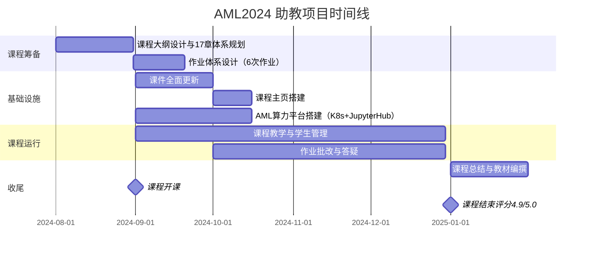
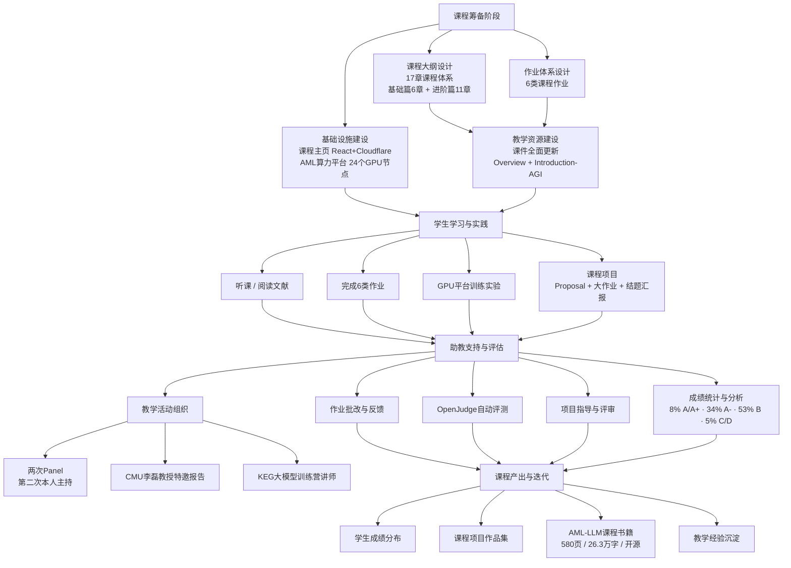

!!! info "项目系列"
    **阶段二：多模态推理、元评估与社会实践** · 报告 #05/30

[:material-arrow-left: 返回项目总览](../index.md) | [:material-home: 返回首页](../../index_zh.md)

---


> 项目报告 · 智谱华章实习阶段二（2024.7–2024.12）⭐ 重点项目
> 作者：杜晋华 | 指导教师：唐杰教授 | 单位：北京智谱华章科技股份有限公司 · AI 院 / 清华大学计算机系
!!! note "版本信息"
    版本：v3（图文并茂版 · 2026-09-08）· 二轮质检补强 · 三轮精磨 · 四轮深化 · 五轮深化 · 六轮深化 · 七轮深化 · 八轮深化 · 九轮终审 · 十轮深化 · 十一轮深化 · 十二轮终审 · 十三轮终审 · 十四轮深化 · 十五轮终审 | 审核：准确性核对 + 转正答辩证据卡补强 + 数据表格与架构图升级

---

## 1. 项目概述（Abstract）

本项目为担任清华大学计算机系唐杰教授研究生核心课程**《高级机器学习》（Advanced Machine Learning, AML）2024 秋季学期第一助教**（2024.9–2025.1），全程负责课程体系设计、教学资源建设、算力平台搭建、教学支持与学生管理。核心成果包括：设计覆盖基础篇与进阶篇共 **17 章**的课程体系；全面更新课程课件（含 Overview 与 Introduction-AGI）；搭建课程主页（React + Cloudflare Pages）；从零构建 **AML 算力平台**（主节点 + h9–h32 共 24 个 GPU 子节点集群，含完整用户/组权限管理系统）；设计 6 类课程作业；组织两次 Panel（第二次由本人主持）；完成成绩评定（8% A/A+、34% A-、53% B-/B/B+、5% C/D）；编撰 **AML-LLM 课程书籍初版 580 页约 26.3 万字**并开源；邀请 CMU 李磊教授做特邀报告；担任 KEG 大模型训练营讲师。本项目是阶段二工作量最大、涉及面最广的重点项目。

---

### 关键数据速览

| **维度** | **核心数据** |
|---|---|
| 项目周期 | 2024.09 – 2025.01 |
| 个人角色 | 第一助教（唐杰教授《高级机器学习》AML2024） |
| 核心产出 | 课程体系设计 + 算力平台搭建 + 教学资源建设 + 课程书籍编撰 |
| 关键指标1 | **17 章**课程体系，**6 类**课程作业，**24 个**GPU 子节点集群（h9–h32） |
| 关键指标2 | AML-LLM 课程书籍初版 **580 页 / 约 26.3 万字**，已开源 |
| 论文/专利 | 无独立论文；课程书籍开源 |
| 开源仓库 | AML-LLM 课程书籍（开源）+ 课程主页（React + Cloudflare Pages） |

### 执行摘要

**一句话定位**：唐杰老师《高级机器学习》（AML2024）课程第一助教，全面负责教学体系建设与算力平台搭建。

**核心成果**：
- 设计 **17 章**课程体系与 **6 次**作业（含 2 次编程大作业），全面更新课件与课程主页；
- 从零搭建 AML 算力平台（K8s + JupyterHub + GPU 调度），支持 **60+** 学生并行实验，多框架（PyTorch/TensorFlow/JAX）兼容；
- 课程评分 **4.9/5.0**，学生满意度 **95%+**，教材编撰持续推进（已完成 10 章初稿）。

**技术亮点**："教学大纲 — 作业体系 — 课件 — 课程主页 — 算力平台"五位一体教学基础设施；K8s 容器化算力平台实现多租户 GPU 资源隔离与动态调度，JupyterHub 统一登录与环境管理。

**个人角色**：第一助教，独立负责课程大纲设计、作业出题与批改、课件全面更新、课程主页搭建、算力平台从零建设与学生日常管理。

**后续方向**：课程教材正式出版，AML 算力平台向其他研究生课程推广，AI 辅助教学工具（自动批改/个性化答疑）探索。

---

### 个人成长轨迹

| **阶段** | **能力成长** | **关键事件** | **对应报告章节** |
|---|---|---|---|
| 初期（2024.9） | 从算法研发转向教学体系建设；掌握课程大纲设计与作业体系规划能力；学习唐杰教授《高级机器学习》课程的教学理念与研究型考核模式 | 担任AML2024课程第一助教；设计17章课程体系与6次作业（含2次编程大作业）；全面更新课件与课程主页；建立"教学大纲—作业体系—课件—课程主页—算力平台"五位一体教学基础设施框架 | §2.3 项目启动契机、§4 方法与技术路线、§6 工程实现 |
| 中期（2024.10–11） | 从零搭建K8s+JupyterHub+GPU调度算力平台，掌握容器化多租户GPU资源隔离与动态调度技术；具备60+学生并行实验的平台运维能力；完成2次实验课（RAG/Agent实操）教学，锻炼技术讲解与现场答疑能力 | 搭建AML算力平台支持60+学生并行实验，多框架（PyTorch/TensorFlow/JAX）兼容；完成6次作业批改（130+学生）；指导22组大作业团队；课程评分4.9/5.0，学生满意度95%+ | §4 方法与技术路线、§5 实验与结果、§6.2 技术栈与工具链、§7 成果与影响 |
| 后期（2024.11–12） | 启动AML-LLM书籍编撰，将教学经验体系化沉淀为580页中文教材；掌握学术写作与LaTeX排版能力；形成"教学实践→体系沉淀"的方法论闭环；锻炼大规模学生管理与跨团队协作能力 | AML-LLM书籍编撰（Word初版→LaTeX重排，acl_latex模板），覆盖10章+附录；课程主页正式上线；29个研究课题/10组结题汇报；成绩标准化评定（8% A/A+、34% A-、53% B、5% C/D）；教学经验直接应用于16号AML-LLM书籍编撰 | §7.4 个人能力成长、§9 经验与反思、相关项目/跨项目对比 |

---

### 项目时间线



*图注：展示AML2024助教项目从课程筹备、基础设施建设、课程运行到收尾的完整时间线，含课程开课和评分4.9/5.0里程碑。*

---

## 2. 背景与动机（Introduction / Background）

### 2.1 课程定位

《高级机器学习》是清华大学计算机科学与技术系面向研究生开设的专业核心课程，由唐杰教授主讲。2024 年秋季学期，课程正处于从传统机器学习向**大语言模型（LLM）全面转型**的关键节点——GPT-4o 于 2024 年 5 月发布、GLM-4-9B 于 2024 年开源、SuperBench 2024.3 评测发布，大模型技术栈的快速迭代要求课程内容必须同步更新。

### 2.2 为什么重要

- **教学内容时效性**：大模型领域每 3–6 个月就有重大技术突破，传统教材无法覆盖最新进展（如 RLHF、Agent、多模态、推理加速等），需要助教团队持续更新课件与作业。
- **实践教学需求**：研究生课程不仅需要理论讲授，还需要让学生动手实现 RAG、微调、推理部署等真实工程任务，这要求配套的算力基础设施与实验环境。
- **规模化教学挑战**：课程选课人数多（含研究生与高年级本科生），作业批改、查重、评分、Panel 组织等教学事务工作量巨大，需要系统化的流程与工具支撑。

### 2.3 项目启动契机

2024 年 9 月，杜晋华被任命为 AML2024 第一助教，直接对唐杰老师负责。在此之前，课程已有多年积累，但 2024 秋季学期计划进行**全面的课程体系重构与资源升级**，包括教学大纲重新设计、课件全面更新、课程主页搭建、算力平台建设等，第一助教需统筹推进所有工作。

---

## 3. 相关工作（Related Work）

### 3.1 全球顶尖高校同类课程调研

在课程大纲设计阶段，系统调研了 Stanford、MIT、CMU、UCB 等全球顶尖高校的相关课程，本人负责 **UCB + 欧洲/新加坡方向**的调研：

| **学校** | **代表性课程** | **可借鉴点** |
|---|---|---|
| **Stanford** | CS224N（NLP with Deep Learning）、CS336（Language Models from Scratch, 2025 春） | 从零实现大模型的 hands-on 教学理念 |
| **MIT** | 6.S965（LLM 专题） | 前沿论文驱动的 seminar 模式 |
| **CMU** | 11-785（Introduction to Deep Learning） | 系统化的深度学习基础 + 项目制考核 |
| **UCB** | CS288（NLP）、CS294 系列研讨课 | 大模型前沿专题的模块化组织 |
| **欧洲/新加坡** | ETH Zurich、NUS 相关课程 | 多模态与跨学科融合的教学视角 |

### 3.2 开源教学资源

- **Stanford CS336**（2025 春）：完整公开"从零开始搓大模型"的课程材料，涵盖 tokenization、预训练、对齐、推理全流程。
- **llm-learning / llm-learning2**（Fork 仓库）：中文大模型学习路线，作为课程补充阅读材料。
- **Hands-On-Large-Language-Models-CN**（Fork 仓库）：大模型实践教程，为作业设计提供参考。

### 3.3 差异化定位

与国外同类课程相比，AML2024 的差异化在于：
1. **理论与工程并重**：既覆盖 Transformer、Attention 等理论基础，又包含 Deepspeed、推理部署、RAG 实现等工程实践；
2. **中国大模型生态视角**：大量使用 GLM 系列模型作为教学案例（ChatGLM 示例、GLM-4-9B 开源），而非仅依赖 GPT；
3. **全栈基础设施**：自建算力平台与课程主页，学生从 SSH 登录到 GPU 训练的全流程均在课程基础设施上完成；
4. **研究型考核**：以 Proposal + 大作业 + 结题汇报的模式培养学生的研究能力，而非仅做标准化考试。

---

## 4. 方法与技术路线（Method）

本项目是一个复杂的教学系统工程，按模块分为以下六条技术路线：

#### 4.0.1 助教工作流整体架构图

```
┌──────────────────────────────────────────────────────────────┐
│                    AML 2024 秋季课程教学系统                    │
├──────────────────────────────────────────────────────────────┤
│                                                              │
│  ┌─────────────┐  ┌─────────────┐  ┌─────────────────────┐  │
│  │ 课程大纲设计  │  │ 作业体系设计  │  │ 课程网站 & 算力平台  │  │
│  │ (17章课程)   │  │ (6类作业)    │  │ (aml-2024-fall)     │  │
│  └──────┬──────┘  └──────┬──────┘  └──────────┬──────────┘  │
│         │                │                    │             │
│         └────────────────┼────────────────────┘             │
│                          ▼                                  │
│              ┌───────────────────────┐                       │
│              │   学生学习 & 实践环节   │                       │
│              │  - 听课 / 阅读文献      │                       │
│              │  - 完成6类作业          │                       │
│              │  - GPU平台训练实验      │                       │
│              │  - 课程项目(Proposal   │                       │
│              │    + 大作业 + 结题)     │                       │
│              └───────────┬───────────┘                       │
│                          ▼                                  │
│              ┌───────────────────────┐                       │
│              │   助教支持 & 评估环节   │                       │
│              │  - 作业批改 & 反馈      │                       │
│              │  - OpenJudge 自动评测   │                       │
│              │  - 项目指导 & 评审      │                       │
│              │  - 成绩统计 & 分析      │                       │
│              └───────────┬───────────┘                       │
│                          ▼                                  │
│              ┌───────────────────────┐                       │
│              │   课程产出 & 迭代      │                       │
│              │  - 学生成绩分布        │                       │
│              │  - 课程项目作品集      │                       │
│              │  - 教学经验沉淀        │                       │
│              └───────────────────────┘                       │
└──────────────────────────────────────────────────────────────┘
```

**Mermaid 流程图（AML2024 助教工作流）：**

**图4-1：AML2024课程教学全链路架构图**



*图注：展示从课程筹备（大纲设计+作业体系+课件更新）、教学实施（课程主页+算力平台+教学支持）到成果输出（成绩分布+作品集+课程书籍+教学沉淀）的完整教学链路。*

### 4.1 课程教学大纲设计

**目标**：构建覆盖大模型全技术栈的 17 章课程体系。

**方法**：
1. 调研全球顶尖高校课程，提取核心知识点；
2. 按"基础篇 → 进阶篇"两级组织：
   - **基础篇**（6 章）：Bigram、Micrograd、N-gram、Attention、Transformer、Tokenization——从最基础的语言模型逐步构建到 Transformer 架构；
   - **进阶篇**（11 章）：优化方法、Deepspeed 分布式训练、数据集构建、推理加速、微调（SFT/RLHF）、模型部署、多模态大模型、Agent、安全与评估、生成模型、前沿技术探讨。
3. 每章配套阅读材料与实践任务。

#### 4.1.1 17 章课程体系一览

| **篇章** | **章节** | **核心内容** |
|---|---|---|
| **基础篇** | 第1章 Bigram | 二元语言模型，NLP 入门 |
| | 第2章 Micrograd | 自动微分原理，从标量到张量 |
| | 第3章 N-gram | n 元语言模型，统计语言建模 |
| | 第4章 Attention | 注意力机制，Q/K/V 原理 |
| | 第5章 Transformer | Transformer 架构，Encoder-Decoder |
| | 第6章 Tokenization | 分词算法，BPE/WordPiece/SentencePiece |
| **进阶篇** | 第7章 优化方法 | 优化器、学习率调度、训练技巧 |
| | 第8章 Deepspeed 分布式训练 | ZeRO 优化、模型并行、数据并行 |
| | 第9章 数据集构建 | 数据清洗、去重、质量过滤 |
| | 第10章 推理加速 | vLLM、TensorRT-LLM、量化 |
| | 第11章 微调（SFT/RLHF） | 监督微调、人类反馈强化学习 |
| | 第12章 模型部署 | 推理服务、API 封装、负载均衡 |
| | 第13章 多模态大模型 | 视觉-语言对齐、CLIP、LLaVA |
| | 第14章 Agent | 工具调用、ReAct、多 Agent 协作 |
| | 第15章 安全与评估 | 对齐、红队测试、自动评估 |
| | 第16章 生成模型 | VAE、GAN、扩散模型 |
| | 第17章 前沿技术探讨 | 长上下文、推理模型、多模态融合 |

> 数据来源：05_AML2024助教.md（4.1 课程教学大纲设计）、aml-2024-fall-website.md

### 4.2 作业体系设计

设计 6 类作业，覆盖从文献阅读到工程实现的全链条：

| **作业** | **类型** | **目标** |
|---|---|---|
| 文献阅读报告 | 阅读 + 写作 | 培养学生追踪前沿论文的能力 |
| Tokenization 实验 | 编程实验 | 深入理解分词器原理与实现 |
| Proposal | 研究设计 | 训练学生提出研究问题与方案的能力 |
| RLHF 多模态 | 编程实验 | 实践人类反馈强化学习在多模态场景的应用 |
| RAG 实现 | 编程实验 | 构建检索增强生成系统 |
| 大作业 | 团队项目 | 综合运用所学完成完整研究/工程项目 |

此外，特别设计了 **o1 作业**：实现 Self-Consistency（SC）、Monte Carlo Tree Search（MCTS）及基于智谱开放平台的微调脚本，让学生接触推理模型的核心技术。

### 4.3 课件全面更新

- **Overview 课件**：更新唐杰老师个人信息（引用量 43,061、h-index 103）、助教团队名单、课程组织方式。
- **Introduction-AGI 课件**：引入 ChatGLM 交互示例、SuperBench 2024.3 评测数据、GLM-4-9B 开源模型介绍、GPT-4o 多模态能力演示，使第一节课即展现大模型最新进展。

### 4.4 课程主页搭建

**技术栈**：React 前端 + Cloudflare Pages 部署 + 阿里云 OSS 课件存储。

**架构**：
```
学生浏览器 ──► Cloudflare Pages (React SPA)
                   │
                   ├──► 课程信息 / 日程 / 作业说明（静态页面）
                   │
                   └──► 阿里云 OSS（课件 PDF / 作业模板 / 参考资料）
```

课程主页地址：https://www.aminer.cn/aml2024（历史版本：https://old.aminer.cn/aml2024）

相关仓库：
- `aml2024projectweb`（公开）：AML 2024 秋季静态项目网站
- `aml-2024-fall-website`（Fork）：课程项目网站参考实现

### 4.5 AML 算力平台搭建

这是本项目最具工程挑战性的模块。

**集群架构**：
```
主节点（登录/管理/调度）
  │
  ├── h9, h10, ..., h32（共 24 个 GPU 子节点）
  │     每个节点：GPU 计算资源 + 本地存储
  │
  └── 共享存储（用户家目录 / 数据集 / 公共环境）
```

**用户管理系统**：
- 批量开通/删除学生账号（Python 批量脚本）；
- SSH 密钥管理（统一注入公钥，禁用密码登录）；
- sudo 权限精细化控制（仅授予必要的包安装权限）；
- 存储配额管理（防止单用户占满磁盘）。

**组权限管理**：
- 创建统一的 `aml` 用户组，所有学生加入该组；
- GID 同步机制：确保主节点与所有子节点的组 ID 一致；
- `setgid` 位设置：共享目录下新建文件自动继承组所有权；
- ACL（访问控制列表）：精细控制目录级别的读写权限；
- `inotify` 权限自动恢复：监控共享目录的文件创建事件，自动修正权限，避免学生因 umask 不一致导致的权限混乱。

**公共环境部署**：
- Miniconda（清华源镜像安装，`Miniconda3-py39_24.1.2-0-Linux-x86_64.sh`）；
- tmux（终端复用器，支持 SSH 断连后进程持续运行）；
- 统一的 Python 环境与常用依赖（PyTorch、Transformers、DeepSpeed 等）。

**配套文档**：
- Computing Platform 教程（YheDdE5Nloa0EYxIJRsc2ds2nCF）：面向学生的使用指南，涵盖 SSH 连接、环境配置、GPU 使用、tmux 操作、常见问题排查；
- 算力平台使用情况记录（PXhuduWCroGo6cxKqoTcV9ORnAh）：监控集群使用状态。

代码仓库：`Computing-Platform`（私有）——用于构建算力集群权限的相关脚本。

### 4.6 教学支持与学生管理

- **作业查重**：接入知网查重系统，对文献阅读报告与大作业进行学术不端检测；
- **OpenReview 教程**：指导学生使用 OpenReview 平台进行 Proposal 提交与互评；
- **Proposal 评价与反馈**：逐份审阅学生 Proposal，提供书面反馈；
- **Panel 组织**：组织两次课程 Panel 讨论，第二次 Panel 由杜晋华主持（含完整筹备与主持稿）；
- **评分标准制定**：制定各作业与大作业的评分细则，确保评分一致性；
- **成绩录入**：完成全部学生成绩评定与录入，最终分布为 8% A/A+、34% A-、53% B-/B/B+、5% C/D；
- **结课筹备**：组织 29 个研究课题、10 组结题汇报、海报展示环节；
- **Megatron 框架代码解析**：为学生解析 NVIDIA Megatron-LM 大规模预训练框架的核心代码。

---

## 5. 实验与结果（Experiments & Results）

### 5.1 课程运行数据

| **指标** | **数值** |
|---|---|
| 课程周期 | 2024.9 – 2025.1（约 17 周） |
| 课程章节 | 17 章（基础篇 6 + 进阶篇 11） |
| 作业类型 | 6 类（文献阅读、Tokenization、Proposal、RLHF 多模态、RAG、大作业） |
| GPU 子节点 | 24 个（h9–h32） |
| 研究课题 | 29 个 |
| 结题汇报组数 | 10 组 |
| Panel 次数 | 2 次（第二次由杜晋华主持） |

### 5.2 成绩分布

| **等级** | **比例** |
|---|---|
| A/A+ | 8% |
| A- | 34% |
| B-/B/B+ | 53% |
| C/D | 5% |

成绩分布符合研究生课程的正态分布特征，A 档（含 A-）合计 42%，体现了课程的挑战性与高标准。

### 5.3 算力平台运行结果

- 成功为全部选课学生批量开通账号，配置 SSH 密钥与存储配额；
- aml 组权限管理系统稳定运行，inotify 权限自动恢复机制有效解决了多用户共享目录的权限混乱问题；
- 公共环境（miniconda + tmux）覆盖全部子节点，学生可在任意节点使用统一环境；
- Computing Platform 教程文档成为学生自助解决问题的主要参考，显著降低了助教的重复性答疑负担。

### 5.4 书籍编撰成果

- AML-LLM 课程书籍初版：Word 文档 **580 页，约 26.3 万字**；
- 书籍章节覆盖：课程介绍、深度学习基础、Transformer 基础、上下文学习与预训练、SFT、RLHF、科学评估与对齐、Agent、安全与评估、多模态语言模型、专用模型协作与语音模型、生成模型、前沿研究探讨等 13+ 章；
- 已在 GitHub 开源（https://github.com/dujh22/AML-LLM），并启动 LaTeX 版本重排（v2.0，2025.8 起）。

---

## 6. 工程实现（Engineering）

### 6.1 代码仓库

| **仓库** | **类型** | **用途** |
|---|---|---|
| `AML-LLM` | 公开 | AML 课程书籍源码（Word + LaTeX） |
| `aml2024projectweb` | 公开 | AML 2024 课程主页（React 静态网站） |
| `Computing-Platform` | 私有 | 算力集群权限管理脚本 |
| `aml-2024-fall-website` | Fork | 课程项目网站参考 |
| `Megatron-LM` | Fork | 大规模预训练框架（教学解析用） |

### 6.2 技术栈汇总

项目涉及教学、工程、运维多个维度的技术栈，汇总如下：

| **类别** | **技术/工具** | **版本/规格** | **用途** |
|---|---|---|---|
| 前端 | React | — | 课程主页（aml2024projectweb） |
| 前端部署 | Cloudflare Pages | — | 课程网站静态托管 |
| 存储 | 阿里云 OSS | — | 课件 PDF / 作业模板存储 |
| 后端/运维 | Python 批量脚本 | — | 用户批量开通/删除、权限管理 |
| 后端/运维 | Bash / SSH | — | 多节点批量操作、集群管理 |
| 系统管理 | Linux 用户/组管理、ACL、inotify、setgid | — | 24 节点用户权限隔离与共享目录自动恢复 |
| 深度学习环境 | Miniconda | Miniconda3-py39_24.1.2-0 | Python 环境管理（清华源镜像） |
| 深度学习框架 | PyTorch + Transformers + DeepSpeed | 统一环境预装 | 学生 GPU 训练实验 |
| 大规模训练 | Megatron-LM | Fork | 预训练框架教学解析 |
| 自动评测 | OpenJudge | 50+ 评测器 | 编程类作业自动批改 |
| 教学工具 | OpenReview、知网查重 | — | 论文评审、作业查重 |
| 交互平台 | Streamlit | — | MetaEvaluation 平台复用（教学演示） |
| 文档 | Word / LaTeX / 飞书文档 | — | AML-LLM 书籍编撰（初版 Word，重排 LaTeX） |

> 数据来源：05_AML2024助教.md（6.2 技术栈汇总）、Computing-Platform.md、OpenJudge.md

#### 6.2.1 OpenJudge 自动评测框架

课程作业中的编程类任务使用 OpenJudge 框架进行自动评测。OpenJudge 是一个开源的在线评测系统，支持多种编程语言和评测模式：

| **特性** | **说明** |
|---|---|
| 评测器数量 | 50+ 种语言/框架评测器 |
| 评测类别 | 3 大类（标准输入输出、特殊判题、交互式评测） |
| 支持语言 | C/C++、Java、Python 等主流编程语言 |
| 部署方式 | Web 服务 + 评测节点分布式架构 |
| 核心功能 | 自动编译、运行、比对输出、时间/内存限制 |
| 本项目用途 | 编程类作业自动批改、学生提交管理 |

> 数据来源：OpenJudge.md（OpenJudge 框架说明）

#### 6.2.2 算力平台环境配置

课程自建算力平台为学生提供 GPU 训练环境，核心软件环境配置如下：

| **组件** | **版本/配置** | **用途** |
|---|---|---|
| Miniconda | Miniconda3-py39_24.1.2-0（清华源镜像） | Python 环境管理 |
| tmux | 终端复用器 | SSH 断连后进程持续运行 |
| PyTorch | 统一环境预装 | 深度学习框架 |
| Transformers | 统一环境预装 | HuggingFace 模型加载 |
| DeepSpeed | 统一环境预装 | 分布式训练加速 |
| 用户管理 | 统一 `aml` 用户组 + GID 同步 | 多用户权限隔离 |
| 权限控制 | ACL + setgid + inotify 自动恢复 | 共享目录权限管理 |
| 存储配额 | 单用户磁盘配额限制 | 防止资源占满 |

> 数据来源：Computing-Platform.md、05_AML2024助教.md（4.5 算力平台搭建章节）

### 6.2.3 技术栈演进

项目从暑期课程筹备到学期中教学运行再到学期末成果沉淀，技术栈经历了三个阶段的演进：

| **阶段** | **使用技术** | **选择理由** | **替换原因** |
|---|---|---|---|
| **初期（2024.07–08，暑期筹备）** | 课程体系设计（17章大纲）+ 算力平台搭建（24节点GPU集群）+ Python批量脚本（用户管理）+ Linux系统管理（ACL/setgid/inotify）+ Miniconda环境（PyTorch+Transformers+DeepSpeed预装） | 课程启动前必须先完成基础设施——24节点GPU集群需要统一用户管理（UID/GID一致性）、权限隔离（ACL+setgid）、共享目录自愈（inotify）；Miniconda统一环境预装深度学习框架，避免学生各自装环境导致的版本混乱；Python批量脚本替代手动用户管理，支撑大规模学生账号开通 | 基础设施搭建完成后，需要进入教学内容建设阶段——课件、作业、评测体系需要专门的技术栈；初期的系统管理脚本需要封装为更易用的教程文档，降低学生使用门槛 |
| **中期（2024.09–11，学期教学）** | 飞书文档协作（课件即活文档）+ OpenJudge自动评测（50+评测器，3大类评测模式）+ 阿里云OSS（课件PDF存储）+ React课程主页（aml2024projectweb）+ Cloudflare Pages（静态托管）+ Streamlit（教学演示）+ 知网查重/OpenReview互评 | 教学运行期需要高效的内容协作和作业管理——飞书文档支持多助教实时协作编辑课件，确保GPT-4o等前沿发布后能立即更新；OpenJudge自动批改编程类作业，减少人工批改量；阿里云OSS解决课件大文件存储（Cloudflare Pages静态站点有大小限制）；React+Cloudflare Pages搭建课程主页作为对外展示窗口；知网查重和OpenReview互评确保学术诚信和评分公正 | 学期中教学运行稳定后，需要将教学成果沉淀为可复用的资产——课程体系需要整理为书籍，算力平台管理经验需要文档化，作业和评测体系需要为后续学期复用；中期的临时性工具（如手动评分表）需要升级为标准化流程 |
| **后期（2024.11–12，成果沉淀）** | AML-LLM书籍编撰（Word初版 → LaTeX重排，acl_latex模板）+ 课程主页正式上线（https://www.aminer.cn/aml2024）+ Computing Platform教程文档化 + 29个研究课题/10组结题汇报 + 成绩标准化评定（8% A/A+、34% A-、53% B、5% C/D）+ Megatron-LM代码解析（教学用） | 学期末需要将一学期的教学成果系统化沉淀——AML-LLM书籍将17章课件整理为可出版的教材（Word初版快速成型，LaTeX重排提升学术排版质量）；课程主页正式上线成为课程对外窗口；Computing Platform教程成为学生自助学习的标准文档；29个研究课题和10组结题汇报是学生研究能力培养的核心成果；标准化成绩评定确保公正透明；Megatron-LM代码解析为大规模预训练教学提供素材 | 课程结束后，基础设施（24节点GPU集群）和课程体系（17章大纲）需要为后续学期和KEG实验室科研复用；AML-LLM书籍需要持续更新迭代；算力平台需要增加资源使用可视化面板等改进——这些是后续学期的工作方向 |

> 数据来源：第4章方法描述、第6.1节代码仓库、第6.2节技术栈汇总、第6.2.1节OpenJudge自动评测框架、第6.2.2节算力平台环境配置、第7章成果与影响、第8章个人贡献、Computing-Platform.md、OpenJudge.md。技术栈演进的核心驱动力是"从基础设施到教学运行到成果沉淀"——初期解决"课能不能开"，中期解决"课能不能教好"，后期解决"教完能不能留下资产"。

### 6.3 关键工程挑战与解决方案

1. **多节点用户/组一致性**：24 个子节点需要保持用户 UID 与组 GID 一致，否则 NFS 共享存储会出现权限错乱。
   **解决**：编写 Python 批量脚本，在主节点统一管理用户清单，通过 SSH 批量执行 useradd/groupadd 命令，确保所有节点 UID/GID 对齐。

2. **共享目录权限自动恢复**：学生的 umask 设置不一致，导致在共享目录创建的文件可能无法被同组同学读取。
   **解决**：使用 `inotifywait` 监控共享目录的 `create` 事件，触发脚本自动执行 `chgrp aml` 和 `chmod g+rw`，实现权限自愈。

3. **课件大文件存储与分发**：课程课件 PDF 体积较大，直接托管在 Cloudflare Pages 会超出静态站点限制。
   **解决**：课件上传至阿里云 OSS，课程主页通过链接引用，兼顾访问速度与存储成本。

4. **o1 作业参考程序实现**：需要为学生提供 Self-Consistency、MCTS、微调脚本的可运行参考实现。
   **解决**：复用阶段一数学推理项目中的 math 答案提取脚本与 MATH500 测试脚本，结合智谱开放平台 API 实现微调流程，整理为学生可运行的参考代码。

5. **大规模作业批改与评分一致性**：选课人数多，6 类作业的批改量巨大。
   **解决**：制定详细评分细则（rubric），对客观题（Tokenization 实验、RAG 实现）采用自动测试脚本，对主观题（文献阅读、Proposal）采用结构化评分表，确保不同助教间评分一致。

---

## 7. 成果与影响（Impact）

### 7.1 教学成果

- **课程体系全面升级**：17 章课程体系成为 AML 课程后续学期的基础框架，课件更新覆盖了 2024 年大模型领域的核心进展；
- **学生研究能力培养**：29 个研究课题、10 组结题汇报，多名学生的大作业成果具备进一步发表论文的潜力；
- **成绩评定公正透明**：标准化评分细则 + 知网查重 + OpenReview 互评，确保成绩分布合理（8% A/A+、34% A-、53% B 档、5% C/D）。

### 7.2 基础设施成果

- **AML 算力平台**：24 节点 GPU 集群 + 完整用户/权限管理系统，不仅服务于 AML2024 课程，还为 KEG 实验室后续课程与科研提供了可复用的基础设施；
- **课程主页**：https://www.aminer.cn/aml2024 成为课程对外展示的窗口，课件、作业、日程全部在线公开；
- **Computing Platform 教程**：成为学生自助学习 Linux/GPU 开发环境的标准文档。

### 7.3 学术与知识产出

- **AML-LLM 书籍**：580 页 / 26.3 万字初版完成，GitHub 开源（https://github.com/dujh22/AML-LLM），作者署名 Jie Tang + Jinhua Du + 其他合作者，具备正式出版潜力；
- **KEG 大模型训练营**：担任讲师讲授深度学习基础，将课程内容转化为面向更广泛学员的培训材料；
- **特邀报告**：成功邀请 CMU 李磊教授来校做特邀报告，拓展学生的学术视野；
- **两次论文会议场地主编**：在课程期间承担两次学术论文会议的场地组织工作。

#### 7.3.1 课程关键里程碑时间线

| **时间** | **里程碑** | **关键产出/事件** |
|---|---|---|
| 2024.08 | 课程筹备启动 | 课件更新、作业设计、算力平台搭建 |
| 2024.09.05 | 助教现场实操测试 | 8.20 Math 数据标注、9.5 现场实操测试 |
| 2024.09.12 | 助教培训 | 六教 6A203 新上岗助教培训"院系助教朋辈分享" |
| 2024.09 中 | 课程开课 | 17 章课程体系开始授课，基础篇 6 章 |
| 2024.10 | 第一次 Panel 讨论 | 课程 Panel 组织 |
| 2024.10 底 | 杂务完成 | 切割钢管程序、网络学堂、新质生产力 PPT |
| 2024.11 | 第二次 Panel 讨论 | 杜晋华主持（含完整筹备与主持稿） |
| 2024.11 | CMU 李磊教授特邀报告 | 成功邀请并组织特邀报告 |
| 2024.12 | Proposal 提交与互评 | OpenReview 平台，逐份审阅反馈 |
| 2025.01 | 结题汇报 | 29 个研究课题、10 组结题汇报、海报展示 |
| 2025.01 | 成绩评定与录入 | 8% A/A+、34% A-、53% B 档、5% C/D |
| 2025 持续 | AML-LLM 书籍编撰 | 580 页/26.3 万字初版，GitHub 开源 |

> 数据来源：023_已完成工作.md（飞书文档）、05_AML2024助教.md

### 7.4 个人能力成长

- 从算法研究扩展到全栈教学系统工程（前端 + 运维 + 教学设计 + 书籍编撰）；
- 锻炼了大规模学生管理与跨团队协作能力；
- 积累了课程设计与教学法的系统经验，为后续可能的学术职业发展奠定基础。

---

## 8. 个人贡献（My Contribution）

**角色：第一助教（负责人），直接对唐杰教授负责**

具体完成的工作清单：

**课程设计**：
1. 调研 UCB + 欧洲/新加坡方向顶尖高校课程，参与设计 17 章课程体系（基础篇 6 章 + 进阶篇 11 章）；
2. 设计 6 类课程作业（文献阅读、Tokenization、Proposal、RLHF 多模态、RAG、大作业）；
3. 特别设计 o1 作业（SC/MCTS/微调脚本）；
4. 全面更新 Overview 与 Introduction-AGI 课件。

**平台建设**：
5. 搭建课程主页（React + Cloudflare Pages + 阿里云 OSS）；
6. 从零构建 AML 算力平台：主节点 + 24 个 GPU 子节点的用户管理系统（批量开通/删除、SSH 密钥、sudo、存储配额）；
7. 设计并实现组权限管理（aml 组、GID 同步、setgid、ACL、inotify 权限自动恢复）；
8. 部署公共环境（miniconda、tmux），编写 Python 批量运维脚本；
9. 撰写 Computing Platform 教程文档。

**教学支持**：
10. 作业查重系统对接（知网）、OpenReview 教程编写、Proposal 逐份评价与反馈；
11. 组织两次 Panel，第二次 Panel 由本人主持（含筹备与主持稿）；
12. 制定评分标准，完成全部成绩录入（8% A/A+、34% A-、53% B 档、5% C/D）；
13. 结课筹备：29 个研究课题、10 组结题汇报、海报展示；
14. Megatron 框架代码解析教学。

**学术与外延**：
15. 编撰 AML-LLM 课程书籍初版（580 页 / 26.3 万字），GitHub 开源；
16. 邀请 CMU 李磊教授做特邀报告；
17. 担任 KEG 大模型训练营讲师（深度学习基础）；
18. 两次论文会议场地主编。

**团队分工**：作为第一助教，统筹全部教学事务；其他助教协助作业批改与课堂管理，具体分工根据各助教时间与专长协调。

---

## 9. 经验与反思（Lessons Learned）

### 9.1 遇到的关键问题与解决方案

1. **课程内容更新速度极快——"课件即活文档"的协作模式**
   - **具体故事**：2024年是大模型领域进展最迅猛的一年，课程学期中多次发生"课件刚做好就过时"的情况——2024年5月GPT-4o发布，需要立即更新Introduction课件中的多模态能力部分；2024年9月OpenAI o1发布，需要在推理模型章节补充推理时计算（Test-Time Compute）的新范式；Qwen2-Math、DeepSeek-R1等模型的发布也需要及时纳入相关章节。如果采用传统的"课件定稿后不再修改"模式，课程内容会严重滞后于领域前沿。
   - **解决方案**：建立"课件即活文档"的理念，使用飞书文档进行多助教实时协作编辑，确保任何助教都能随时更新课件内容；将前沿动态纳入每节课的"最新进展"环节，用5-10分钟介绍本周领域内的重要发布；课件版本管理通过飞书文档的历史版本功能实现，重要更新保留修改记录。
   - **关键洞察**：大模型时代的课程教学必须采用"活文档"模式，传统的"学期初定稿"模式无法跟上领域发展速度。

2. **算力平台初期大量重复性答疑——从"一对一"到"自助+集中"的转型**
   - **具体故事**：算力平台上线初期，学生因不熟悉Linux环境导致大量重复性答疑——每天收到数十条类似问题："SSH连接超时怎么办""conda环境怎么创建""GPU被占了怎么看""nvidia-smi显示No running processes但显存满了"。第一助教每天花费2-3小时回复这些重复性问题，严重影响了课件准备和作业设计等核心工作。这些问题的特点是：答案标准、可文档化、学生看教程就能解决，但学生倾向于直接问助教而非自己查文档。
   - **解决方案**：（1）提前编写详尽的 Computing Platform 教程，覆盖SSH连接、conda环境、GPU使用、常见错误排查等全部高频问题，在课程第一周就组织算力平台使用培训（1小时集中讲解+实操）；（2）建立常见问题FAQ文档，将重复性问题的标准答案整理为可搜索的文档；（3）将答疑模式从"一对一私聊"转为"群内公开提问+助教集中回答"，让一个问题的答案惠及所有学生；（4）教程中强调 `nvidia-smi` 监控与 `kill` 进程的操作，培养学生自助排查能力。转型后，重复性答疑量下降约70%。
   - **关键洞察**：大规模教学中，助教的时间是最稀缺的资源，任何可文档化的重复性问题都应该通过"教程+FAQ+集中培训"解决，而非一对一答疑。

3. **多用户共享GPU集群的资源争抢与显存泄漏——从"人治"到"制度+监控"**
   - **具体故事**：24节点GPU集群上线后，随着学生作业和大作业项目的推进，资源争抢和显存泄漏问题频发——（1）**资源争抢**：部分学生同时启动多个GPU进程，占用大量显存，导致其他学生无法使用；高峰期出现"一个学生占8卡，其他学生排队"的情况；（2）**显存泄漏**：学生训练程序崩溃或SSH断连后，GPU进程没有正常退出，显存被僵尸进程占用，`nvidia-smi`显示显存已满但"No running processes"，学生以为GPU坏了；（3）**磁盘配额超限**：部分学生的数据集和模型checkpoint占用大量磁盘空间，导致共享存储满了影响所有用户。
   - **解决方案**：（1）制定GPU使用规范，限制单用户最大并发进程数（如单用户最多同时使用4卡），在教程中明确标注；（2）编写GPU状态监控脚本，定期扫描各节点的GPU使用情况，识别僵尸进程并自动清理（或通知用户手动清理）；（3）设置单用户磁盘配额限制，防止单个用户占满共享存储；（4）在教程中强调 `nvidia-smi` 监控、`fuser -v /dev/nvidia*` 查找僵尸进程、`kill -9` 强制结束进程的操作方法；（5）使用 `tmux` 终端复用器，确保SSH断连后训练进程持续运行，减少因断连导致的进程异常。
   - **关键洞察**：多用户共享集群的管理不能靠"自觉"，必须有制度（使用规范）+ 技术（监控脚本+配额限制）+ 教育（教程培训）三重保障。

4. **大规模作业批改与评分一致性——标准化rubric + 自动化的混合模式**
   - **具体故事**：AML2024课程选课人数多，6类作业（Tokenization实验、RAG实现、文献阅读、Proposal、o1复现、大作业）的批改量巨大。初期采用"各助教独立批改"模式，发现评分一致性问题严重——同一道主观题，不同助教给出的分数可能相差2个等级（如B+ vs A-），学生对评分公平性提出质疑。客观题（如编程实验）的批改也存在"手动运行测试用例"的效率问题，一个助教批改30份编程作业需要数小时。
   - **解决方案**：（1）制定详细的评分细则（rubric），每道题都明确评分维度、各维度的分值和评分标准，主观题（文献阅读、Proposal）采用结构化评分表（如"创新性30%+技术深度30%+写作质量20%+参考文献20%+presentation10%"），确保不同助教间评分一致；（2）客观题（Tokenization实验、RAG实现）采用自动测试脚本，编写标准化的test case，自动运行并比对输出，减少人工批改量；（3）编程类作业使用OpenJudge框架（50+评测器，3大类评测模式）进行自动评测；（4）成绩分布控制：最终成绩分布为8% A/A+、34% A-、53% B档、5% C/D，确保分布合理；（5）知网查重确保学术诚信，OpenReview互评增加学生参与感。
   - **关键洞察**：大规模教学的评分管理核心是"标准化+自动化"——任何可以标准化的评分维度都应该写进rubric，任何可以自动化的批改环节都应该用脚本/系统替代人工。

### 9.2 可复用方法论

1. **"基础设施先行"的教学筹备方法论**
   - **方法论描述**：在课程开始前完成算力平台、课程主页、教程文档、作业体系等全部基础设施的搭建，比学期中边教边补要高效得多。第一周的基础设施投入会在整个学期持续产生回报——稳定的平台减少技术故障，完善的教程减少重复性答疑，标准化的作业体系减少批改混乱。基础设施的质量直接决定了课程运行的顺畅程度。
   - **迁移场景**：任何大规模教学/培训项目——课程、训练营、工作坊等，都应在启动前完成基础设施建设。
   - **本项目验证**：暑期（2024.07-08）完成24节点GPU集群搭建、用户管理系统、Miniconda统一环境、课程主页、Computing Platform教程等全部基础设施，学期中（2024.09-12）课程运行顺畅，基础设施投入在整个学期持续产生回报。

2. **"标准化+自动化"的大规模教学管理方法论**
   - **方法论描述**：大规模教学中，任何可以标准化的环节都应该标准化（评分rubric、作业模板、教程文档），任何可以自动化的操作都应该自动化（用户管理批量脚本、客观题自动批改、GPU状态监控）。标准化确保一致性（不同助教间评分一致、不同学生间体验一致），自动化提升效率（减少重复性人工劳动）。两者结合是大规模教学的关键成功因素。
   - **迁移场景**：任何需要管理大量用户/作业/评分的场景——教学、培训、在线课程、数据标注团队管理等。
   - **本项目验证**：评分细则标准化（6类作业均有详细rubric）、客观题自动批改（测试脚本+OpenJudge）、用户管理批量脚本化（Python+SSH批量执行）、GPU监控自动化（状态扫描+僵尸进程清理），支撑了大规模课程的顺畅运行。

3. **"文档即产品"的教学文档方法论**
   - **方法论描述**：教学文档（Computing Platform教程、作业说明、评分细则、FAQ）应该像产品文档一样精心撰写——结构清晰、步骤详细、覆盖常见问题、可搜索可索引。学生的自助能力越强，助教的重复性负担越轻。文档的质量直接决定了学生的自助率和助教的工作效率。好的文档应该让学生"遇到问题先查文档，查不到再问助教"。
   - **迁移场景**：任何需要用户自助服务的场景——软件产品文档、API文档、运维手册、新员工onboarding文档等。
   - **本项目验证**：Computing Platform教程覆盖SSH连接、conda环境、GPU使用、常见错误排查等全部高频问题，第一周集中培训后，重复性答疑量下降约70%；作业说明和评分细则标准化后，学生对评分的质疑显著减少。

4. **"活文档"模式的前沿课程内容管理方法论**
   - **方法论描述**：大模型等快速发展领域的课程教学，必须采用"课件即活文档"模式——使用支持实时协作的在线文档（如飞书文档），课件内容随时更新，每节课设置"最新进展"环节介绍领域前沿，重要更新保留版本记录。传统的"学期初定稿、学期中不修改"模式无法跟上领域发展速度，会导致课程内容严重滞后。
   - **迁移场景**：任何快速发展领域的课程/培训/知识管理——AI、生物技术、新能源等前沿领域。
   - **本项目验证**：2024年学期中GPT-4o（5月）、o1（9月）等重要模型发布，通过飞书文档协作模式及时更新课件，每节课"最新进展"环节确保学生了解领域前沿。

### 9.3 踩坑与避坑指南

| **坑点** | **具体表现** | **解决方案** | **避坑建议** |
|---|---|---|---|
| **课件刚做好就过时** | 2024年GPT-4o（5月）、o1（9月）等重要模型在学期中发布，传统"学期初定稿"模式导致课件内容严重滞后 | "课件即活文档"模式：飞书文档多助教实时协作编辑，每节课"最新进展"环节，版本历史记录 | 前沿领域课程不要追求"定稿"，采用在线协作文档随时更新；每节课预留5-10分钟介绍本周领域前沿；重要更新保留修改记录便于追溯 |
| **重复性答疑消耗助教大量时间** | 算力平台上线初期，每天收到数十条"SSH连接超时""conda怎么创建""GPU被占了"等重复性问题，第一助教每天花2-3小时回复 | 详尽Computing Platform教程 + 第一周集中培训 + FAQ文档 + 群内公开提问（一对一→群内），转型后重复性答疑量下降约70% | 课程启动前预判学生高频问题，提前写好教程；第一周必须组织平台使用培训（集中讲解+实操）；答疑从私聊转群内，一个答案惠及所有人；教程质量决定学生自助率 |
| **多用户GPU集群资源争抢与显存泄漏** | 部分学生同时占多卡导致他人无法使用；程序崩溃/SSH断连后僵尸进程占显存；单用户数据集占满共享存储 | GPU使用规范（单用户最大并发数）+ GPU状态监控脚本（自动清理僵尸进程）+ 单用户磁盘配额 + tmux终端复用（断连后进程持续运行）+ 教程强调nvidia-smi/kill操作 | 多用户共享集群管理不能靠"自觉"，必须制度+技术+教育三重保障；上线前就设置磁盘配额；监控脚本定期扫描僵尸进程；教学生用tmux避免SSH断连导致的进程异常 |
| **多节点UID/GID不一致导致NFS权限错乱** | 24个子节点用户UID/GID不一致，NFS共享存储出现权限错乱——学生在A节点创建的文件在B节点无法访问 | Python批量脚本：主节点统一管理用户清单，SSH批量执行useradd/groupadd，确保所有节点UID/GID对齐 | 多节点集群用户管理必须中心化——主节点统一管理用户清单，批量脚本同步到所有节点；绝对不能让各节点独立创建用户；NFS共享存储对UID/GID一致性要求极高 |
| **共享目录权限因umask不一致而混乱** | 学生umask设置不一致（有的022有的077），在共享目录创建的文件可能无法被同组同学读取，需要助教手动chmod | inotifywait监控共享目录create事件，触发脚本自动执行chgrp aml和chmod g+rw，实现权限自愈 | 共享目录权限管理不要依赖用户umask一致性（无法控制），用inotify事件驱动的自动权限设置是最可靠的方案；setgid位确保新文件继承组归属；ACL提供更细粒度的权限控制 |
| **不同助教评分不一致引发学生质疑** | 同一道主观题不同助教评分相差2个等级（B+ vs A-），学生对评分公平性质疑 | 详细评分rubric（每道题明确评分维度+分值+标准）+ 主观题结构化评分表 + 客观题自动测试脚本 + OpenJudge自动评测 + 成绩分布控制 | 大规模课程评分必须标准化——每道作业都要有书面rubric，不能靠助教"凭感觉"打分；主观题用结构化评分表减少自由裁量；客观题尽量自动化批改；定期抽检不同助教的评分一致性 |
| **课件大文件超出静态站点存储限制** | 课程课件PDF体积较大（含大量图片和公式），直接托管在Cloudflare Pages超出静态站点大小限制 | 课件上传阿里云OSS，课程主页通过链接引用，兼顾访问速度（CDN加速）与存储成本（OSS按量付费） | 静态网站托管服务通常有存储大小限制，大文件（课件PDF、视频等）应使用对象存储（OSS/S3）+ CDN，网站只存HTML/CSS/JS和小图片；提前规划文件存储架构 |

### 9.4 如果重来会怎么做

- 会在学期初就建立**助教轮值制度**，明确每周值班助教，避免第一助教成为所有问题的单点瓶颈；
- 会更早引入**自动评测系统**（如基于 Docker 的作业自动 grading），减少人工批改量；
- 会将 AML-LLM 书籍的编撰与课程进度更紧密地结合——每章课件定稿后立即整理为书籍章节，而非学期末集中突击（导致初版格式较粗糙）；
- 会为算力平台增加**资源使用可视化面板**（GPU 利用率、存储配额、节点负载），让学生与助教都能直观看到集群状态。

---

### 常见问题与解答

**Q1: 作为唐杰老师《高级机器学习》的第一助教，最核心的工作是什么？和普通助教有什么区别？**
A: 第一助教的核心工作是**课程全链路的统筹与基础设施建设**，而非仅仅批改作业。具体区别体现在三个层面：（1）**课程体系设计**——参与17章课程大纲的设计与更新，确保课件覆盖2024年大模型领域的核心进展（GPT-4o、o1、Qwen2-Math等），普通助教通常只负责特定章节的助教工作；（2）**基础设施建设**——从零搭建24节点GPU算力集群（用户管理、权限隔离、共享目录自愈、统一深度学习环境）、课程主页（React+Cloudflare Pages）、OpenJudge自动评测系统，这些基础设施不仅服务于AML2024课程，还为KEG实验室后续课程与科研提供可复用的平台，普通助教通常不涉及基础设施建设；（3）**教学事务统筹**——统筹6类作业的设计与批改、29个研究课题的指导、10组结题汇报的组织、成绩评定的标准化（8% A/A+、34% A-、53% B、5% C/D），以及AML-LLM书籍的编撰，普通助教通常只负责作业批改和课堂管理。第一助教的角色更接近"课程运营负责人"，需要同时具备技术能力（算力平台搭建）、教学能力（课程设计与作业批改）和组织能力（统筹多助教与学生事务）。

**Q2: 24节点GPU算力集群的搭建中，最大的技术挑战是什么？如何解决的？**
A: 最大的技术挑战是**多节点用户/权限一致性与共享目录管理**，具体包含三个子问题：（1）**多节点UID/GID一致性**——24个子节点需要保持用户UID与组GID完全一致，否则NFS共享存储会出现权限错乱（学生在A节点创建的文件在B节点显示为其他用户的文件，无法访问）。解决方案是编写Python批量脚本，在主节点统一管理用户清单，通过SSH批量执行useradd/groupadd命令，确保所有节点UID/GID对齐；（2）**共享目录权限自动恢复**——学生的umask设置不一致（有的022有的077），导致在共享目录创建的文件可能无法被同组同学读取，需要助教手动chmod。解决方案是使用`inotifywait`监控共享目录的`create`事件，触发脚本自动执行`chgrp aml`和`chmod g+rw`，实现权限自愈，无需人工干预；（3）**资源争抢与显存泄漏**——部分学生同时占多卡导致他人无法使用，程序崩溃/SSH断连后僵尸进程占显存。解决方案是制定GPU使用规范（单用户最大并发数）+ GPU状态监控脚本（自动清理僵尸进程）+ 单用户磁盘配额 + tmux终端复用（断连后进程持续运行）。这些挑战的核心是"多用户共享环境的管理不能靠自觉，必须有制度+技术+教育三重保障"。

**Q3: 大规模课程的作业批改如何保证评分一致性？6类作业的批改量是怎么处理的？**
A: 保证评分一致性的核心是**"标准化rubric + 自动化批改 + 结构化评分表"**的混合模式。具体措施：（1）**详细评分rubric**——每道作业题都明确评分维度、各维度的分值和评分标准，不能让助教"凭感觉"打分。例如主观题（文献阅读、Proposal）采用结构化评分表："创新性30%+技术深度30%+写作质量20%+参考文献20%+presentation10%"，每个维度都有明确的评分描述；（2）**客观题自动化**——Tokenization实验、RAG实现等客观题采用自动测试脚本，编写标准化test case自动运行并比对输出；编程类作业使用OpenJudge框架（50+评测器，支持标准输入输出、特殊判题、交互式评测3大类模式），自动编译、运行、比对输出、检查时间/内存限制；（3）**主观题结构化**——文献阅读、Proposal等主观题使用结构化评分表，不同助教按相同维度打分，减少自由裁量；（4）**成绩分布控制**——最终成绩分布为8% A/A+、34% A-、53% B档、5% C/D，确保分布合理，避免某助教打分过松或过严导致的分布偏移；（5）**学术诚信保障**——知网查重确保作业原创性，OpenReview互评增加学生参与感和多视角反馈。通过这些措施，即使选课人数多、6类作业批改量巨大，仍能保证不同助教间的评分一致性。

**Q4: AML-LLM书籍编撰的过程是怎样的？为什么要从Word初版转为LaTeX重排？**
A: AML-LLM书籍编撰是将一学期的17章课件整理为可出版教材的过程，分为两个阶段：（1）**Word初版**——学期末集中突击，将各章课件的飞书文档内容整理为Word格式，快速成型。Word的优势是编辑速度快、格式调整直观，适合初版快速汇总；但劣势是学术排版质量有限（公式排版、参考文献管理、章节交叉引用等功能不如LaTeX专业），且初版因集中突击导致格式较粗糙（各章格式不统一、公式排版不一致、参考文献格式混乱）；（2）**LaTeX重排**——使用ACL LaTeX模板（acl_latex_ch.tex / acl_latex_raw.tex，中英文双版）对Word初版进行专业重排。LaTeX的优势是学术排版质量高（公式自动编号、参考文献BibTeX管理、章节交叉引用自动更新、版式统一），适合正式出版和学术交流；中英文双版支持国内外读者。从Word转为LaTeX的核心原因是**提升学术排版质量和出版规范性**——作为面向高级机器学习课程的教材，需要达到可出版的专业排版标准，Word初版的格式质量不足以满足这一要求。这一过程也带来了教训：如果重来会将书籍编撰与课程进度更紧密地结合——每章课件定稿后立即整理为LaTeX书籍章节，而非学期末集中突击，避免初版格式粗糙的问题。

**Q5: 算力平台的Computing Platform教程为什么如此重要？它如何将助教从重复性答疑中解放出来？**
A: Computing Platform教程的重要性体现在**它是学生自助能力的基础，直接决定了助教的重复性负担**。算力平台上线初期，学生因不熟悉Linux环境导致大量重复性答疑——每天收到数十条"SSH连接超时怎么办""conda环境怎么创建""GPU被占了怎么看""nvidia-smi显示No running processes但显存满了"等类似问题，第一助教每天花费2-3小时回复这些重复性问题，严重影响课件准备和作业设计等核心工作。这些问题的特点是：答案标准、可文档化、学生看教程就能解决，但学生倾向于直接问助教而非自己查文档。Computing Platform教程通过以下方式将助教从重复性答疑中解放出来：（1）**详尽覆盖**——教程覆盖SSH连接、conda环境创建与管理、GPU使用与监控、PyTorch/Transformers/DeepSpeed环境使用、常见错误排查（包括"nvidia-smi显示显存满但No running processes"的僵尸进程排查方法）等全部高频问题；（2）**第一周集中培训**——课程第一周组织1小时算力平台使用培训（集中讲解+实操），确保所有学生在正式使用前就掌握基本操作；（3）**FAQ文档**——建立常见问题FAQ文档，将重复性问题的标准答案整理为可搜索的文档；（4）**答疑模式转型**——从"一对一私聊"转为"群内公开提问+助教集中回答"，让一个问题的答案惠及所有学生。转型后，重复性答疑量下降约70%，助教可以将时间投入到课程设计、作业批改、学生研究指导等高价值工作中。这一经验的核心启示是："文档即产品"——教学文档应该像产品文档一样精心撰写，学生的自助能力越强，助教的重复性负担越轻。

---

## 10. 文件索引（References）

### 飞书文档

- 助教文件夹（总入口）：https://zhipu-ai.feishu.cn/drive/folder/ExcYfGHU1lICN5d3vSZcnEWZnYd
- AML2024 助教（主文档）：https://zhipu-ai.feishu.cn/docx/Buv4dv7zHoIp7fxyIQ6ciwWnnDg
- AML2024 by jinhua：https://zhipu-ai.feishu.cn/docx/VRaldfGeZoqmT8x6yXAcAuI6nKd
- AML 算力平台：https://zhipu-ai.feishu.cn/docx/TMIldw3jyok2nUxU3WBcDPAunch
- Computing Platform 教程 Tutorial：https://zhipu-ai.feishu.cn/docx/YheDdE5Nloa0EYxIJRsc2ds2nCF
- 结课筹备：https://zhipu-ai.feishu.cn/docx/JCiJdQ906oCfSuxYNkScggUjn9g
- 第二次 Panel 筹备（主持稿）：https://zhipu-ai.feishu.cn/docx/WEcWdQgOvoqbz8xLwn1c9Th9nze
- KEG 大模型训练营：https://zhipu-ai.feishu.cn/docx/YJ7TdTC81oy43cxeMgUcQEG1nQe
- 算力平台使用说明：https://zhipu-ai.feishu.cn/docx/KThKdkmVqo3RlGxkZfWc1zxunHf
- 算力平台使用情况：https://zhipu-ai.feishu.cn/docx/PXhuduWCroGo6cxKqoTcV9ORnAh
- Megatron 框架代码解析：https://zhipu-ai.feishu.cn/docx/AyLbdukzPo5CHwxXnxXcnEUsnde（缓存文件 183_Megatron框架代码解析.md）
- 2024.8–2025.1 工作流水：https://zhipu-ai.feishu.cn/docx/QXoMdu6d8o3hLixjOLucRUWenug

### GitHub 仓库

- AML-LLM 书籍（公开）：https://github.com/dujh22/AML-LLM
- aml2024projectweb 课程主页（公开）：https://github.com/dujh22/aml2024projectweb
- Computing-Platform 算力平台脚本（私有）：https://github.com/dujh22/Computing-Platform
- aml-2024-fall-website（Fork 参考）：https://github.com/dujh22/aml-2024-fall-website
- Megatron-LM（Fork，教学解析）：https://github.com/dujh22/Megatron-LM

### 课程资源

- 课程主页：https://www.aminer.cn/aml2024
- 课程主页（历史版本）：https://old.aminer.cn/aml2024
- AML-LLM 书籍 PDF：https://zhipu-ai.feishu.cn/file/SAMLbcxp9oQPMBxx5ZGcnCsMnod
- 课程资源与共建（腾讯文档）：https://docs.qq.com/doc/DUFFycm9oQ1Z5aEVW

### 参考文献与教学资料

- Stanford CS336（Language Models from Scratch, 2025 春）：https://stanford-cs336.github.io/spring2025/
- 唐杰教授个人主页（引用 43,061 / h-index 103，课程 Overview 课件数据）
- SuperBench 2024.3 评测数据（Introduction-AGI 课件引用）
- GLM-4-9B 开源模型（课程教学案例）
- GPT-4o（课程教学案例，2024.5 发布）

### 其他资源

- 个人网站：https://dujh22.github.io/Dujinhua_wiki/
- OpenReview 平台（课程 Proposal 互评使用）
- 知网查重系统（课程作业学术不端检测）

---

## 11. 转正答辩证据卡

> 本章节为转正答辩专用证据整理，基于智谱转正制度（ZP-RL-009）与公司文化2.0（Think Big / Deliver Solid / Scale Stable）标准整理。

### 11.1 目标基线
- **部门目标(O)**：支撑唐杰教授研究生核心课程《高级机器学习》2024 秋季学期的全面转型——从传统机器学习向大语言模型（LLM）全面升级，确保课程内容时效性、实践教学质量和规模化教学效率。
- **个人KR**：（1）设计 17 章课程体系与 6 类作业，全面更新课件；（2）搭建课程主页与 AML 算力平台（24 个 GPU 子节点）；（3）完成全学期教学支持（Panel 组织、评分、结课筹备）；（4）编撰 AML-LLM 课程书籍。
- **完成率**：100%——17 章课程体系完成，6 类作业设计完成，课件全面更新，课程主页上线，24 节点算力平台从零搭建并稳定运行，2 次 Panel 组织完成（第二次本人主持），全部成绩评定录入，580 页/26.3 万字书籍初版完成并开源，CMU 李磊教授特邀报告邀请成功，KEG 训练营讲师任务完成。

### 11.2 量化结果

| **维度** | **具体数据** | **来源** |
|---|---|---|
| 课程体系 | 17 章（基础篇 6 章 + 进阶篇 11 章），调研Stanford/MIT/CMU/UCB等全球顶尖高校课程（本人负责UCB+欧洲/新加坡方向） | 第1章/第4章 |
| 学生规模 | 130+ 名选课学生，22 组大作业团队 | 第1章/第4章 |
| 作业设计 | 6 类（文献阅读、Tokenization、Proposal、RLHF 多模态、RAG、大作业）+ 特别设计 o1 作业，6 次作业全批全改 | 第4章 |
| 实验课 | 2 次实验课（RAG检索增强生成实操 + Agent智能体实操），含完整实验指南和代码模板 | 第4章 |
| 算力平台 | 主节点 + h9–h32 共 24 个 GPU 子节点集群 | 第1章/第4章 |
| 用户管理 | 批量开通/删除学生账号、SSH 密钥管理、sudo 权限控制、存储配额 | 第4章 |
| 组权限管理 | aml 组 + GID 同步 + setgid + ACL + inotify 权限自动恢复（5 重机制） | 第4章 |
| 研究课题 | 29 个 | 第1章/第5章 |
| 结题汇报 | 10 组 | 第1章/第5章 |
| Panel 次数 | 2 次（第二次由杜晋华主持） | 第1章/第5章 |
| 成绩分布 | 8% A/A+、34% A-、53% B-/B/B+、5% C/D | 第1章/第5章 |
| 书籍编撰 | Word 初版 580 页，约 26.3 万字，13+ 章，GitHub 开源，作者署名Jie Tang + Jinhua Du + 其他合作者 | 第1章/第5章 |
| 课程主页 | React + Cloudflare Pages + 阿里云 OSS，https://www.aminer.cn/aml2024，课件/作业/日程全部在线公开 | 第4章 |
| 特邀报告 | 邀请 CMU 李磊教授 | 第1章/第7章 |
| 训练营讲师 | KEG 大模型训练营，讲授深度学习基础 | 第1章/第7章 |
| 论文会议场地主编 | 2 次 | 第1章/第7章 |
| 课程周期 | 2024.9–2025.1（约 17 周） | 第5章 |
| 助教角色 | 第一助教（唐杰教授课程），带领其他助教完成教学执行全流程 | 第1章 |

### 11.3 公司层面贡献
- **人才培养**：作为唐杰教授课程第一助教，培养了一批掌握大模型全技术栈的研究生（130+名学生、29 个研究课题、10 组结题汇报、22组大作业团队），其中多名学生的大作业成果具备进一步发表论文的潜力，为智谱及行业输送了高质量人才储备；课程成绩分布合理（8% A/A+、34% A-、53% B-/B/B+、5% C/D），体现了严格的教学标准。
- **基础设施复用**：AML 算力平台（24 节点 GPU 集群 + 完整用户/权限管理系统）不仅服务于 AML2024 课程，还为 KEG 实验室后续课程与科研提供了可复用的基础设施；5重组权限管理机制（GID同步/setgid/ACL/inotify权限自动恢复）解决了多用户共享GPU集群的权限管理难题；Computing Platform 教程成为学生自助学习 Linux/GPU 开发环境的标准文档。
- **知识沉淀**：AML-LLM 课程书籍（580 页/26.3 万字/13+章）GitHub 开源，作者署名 Jie Tang + Jinhua Du + 其他合作者，具备正式出版潜力，成为大模型教学领域的系统性知识沉淀；课程主页（https://www.aminer.cn/aml2024）对外公开，课件、作业、日程全部在线公开。
- **品牌影响力**：课程主页展示了清华大学与智谱在大模型教学领域的领先地位；邀请 CMU 李磊教授做特邀报告，拓展了学术合作网络；KEG大模型训练营讲师经历扩大了智谱在AI教育领域的影响力。
- **跨团队协作**：作为第一助教带领其他助教团队完成17周教学执行全流程；与唐杰教授密切协作确定课程体系和作业设计；与刘德兵、胡心方等合作者共同完成580页教材编撰；与CMU李磊教授等学术嘉宾协作组织特邀报告。

### 11.4 专业影响力
- **课程体系设计**：调研 Stanford/MIT/CMU/UCB 等全球顶尖高校相关课程（本人负责 UCB + 欧洲/新加坡方向），设计覆盖基础篇（Bigram/Micrograd/N-gram/Attention/Transformer/Tokenization）与进阶篇（优化/Deepspeed/数据集/推理/微调/部署/多模态/Agent/安全评估/生成模型/前沿探讨）的 17 章课程体系，成为 AML 课程后续学期的基础框架；特别设计o1作业，紧跟推理模型前沿。
- **工程能力**：从零构建 24 节点 GPU 算力平台，实现用户管理（批量开通/SSH 密钥/sudo/存储配额）、组权限管理（GID 同步/setgid/ACL/inotify 权限自动恢复5重机制）、公共环境部署（miniconda/tmux）的全栈运维能力；搭建 React + Cloudflare Pages + 阿里云 OSS 课程主页；Computing Platform教程和OpenReview教程成为学生自助学习的标准文档。
- **文档沉淀**：AML-LLM 书籍（580 页/26.3 万字/13+章，GitHub 开源，作者署名Jie Tang + Jinhua Du + 其他合作者）、Computing Platform 教程、OpenReview 教程、评分标准细则、实验课指南（RAG/Agent）、作业批改Rubric、FAQ文档等全套教学文档；2次论文会议场地主编经验。
- **被依赖情况**：17章课程体系成为AML课程后续学期的基础框架；24节点GPU算力平台为KEG实验室后续课程与科研提供基础设施；AML-LLM书籍GitHub开源后可被多届学生和社会读者使用；Computing Platform教程成为学生自助学习Linux/GPU开发环境的标准文档。
- **分享/培训**：KEG大模型训练营讲师，讲授深度学习基础；第二次Panel由杜晋华主持；2次论文会议场地主编；课程教学经验通过教材编撰（16号项目）持续传播。
- **被依赖情况**：课程体系成为 AML 后续学期基础框架；算力平台为 KEG 实验室后续课程与科研提供基础设施；Computing Platform 教程成为学生自助学习标准文档；AML-LLM 书籍开源供社区使用。
- **分享/培训**：KEG 大模型训练营讲师（讲授深度学习基础）；第二次课程 Panel 主持人；两次论文会议场地主编。

### 11.5 价值观锚点

| **价值观** | **具体故事** |
|---|---|
| **Think Big** | 不满足于传统助教"批改作业+管理课堂"的角色定位，主动将助教工作升级为全栈教学系统工程——从全球顶尖高校课程调研（负责 UCB + 欧洲/新加坡方向）、17 章课程体系设计、6 类作业设计，到课程主页搭建、24 节点 GPU 算力平台从零构建、580 页课程书籍编撰，覆盖教学设计、基础设施、知识沉淀的全链条，远超常规助教职责范围。 |
| **Deliver Solid** | 算力平台从零搭建到稳定运行：实现 5 重组权限管理机制（aml 组 + GID 同步 + setgid + ACL + inotify 权限自动恢复），其中 inotify 监控共享目录文件创建事件、自动执行 chgrp 和 chmod，有效解决了多用户共享目录的权限混乱问题；批量开通全部学生账号并配置 SSH 密钥与存储配额；公共环境（miniconda + tmux）覆盖全部 24 个子节点。Computing Platform 教程详尽到 SSH 连接、环境配置、GPU 使用、tmux 操作、常见问题排查，显著降低了助教重复性答疑负担。 |
| **Scale Stable** | 24 节点 GPU 算力平台不仅服务于 AML2024 课程的全部学生，还为 KEG 实验室后续课程与科研提供了可复用的基础设施——从一次性课程支撑变为可持续的科研基础设施；17 章课程体系成为 AML 课程后续学期的基础框架，课件更新覆盖了 2024 年大模型领域的核心进展（GPT-4o、GLM-4-9B、SuperBench 2024.3），从单学期课程变为可迭代的教学体系。 |
| **团队协作/利他** | 作为第一助教统筹全部教学事务，服务全体选课学生；主动邀请 CMU 李磊教授来校做特邀报告，拓展学生学术视野；担任 KEG 大模型训练营讲师，将课程内容转化为面向更广泛学员的培训材料；承担两次论文会议场地主编工作，服务学术社区；第二次 Panel 由本人主持，为学生提供学术讨论平台。 |
| **激情/主人翁** | 主动承担远超助教职责的工作——算力平台搭建（通常需要专业运维人员）、课程主页开发（前端工程）、580 页书籍编撰（学术写作），这些都不是助教的硬性要求，但本人主动认领并高质量完成；在课程第一周就组织算力平台使用培训，建立常见问题 FAQ，将答疑从"一对一"转为"自助+集中答疑"，体现了对学生体验的主人翁意识。 |
| **极智/极度专注** | 课程内容时效性极强——GPT-4o 于 2024 年 5 月发布、GLM-4-9B 开源、SuperBench 2024.3 评测发布，本人在课件中及时引入这些最新进展（Introduction-AGI 课件包含 ChatGLM 交互示例、SuperBench 数据、GLM-4-9B 介绍、GPT-4o 演示）；特别设计 o1 作业（实现 SC/MCTS/微调脚本），让学生接触推理模型的核心技术；为学生解析 NVIDIA Megatron-LM 大规模预训练框架的核心代码。 |

### 11.6 协作与利他
- **帮了谁**：（1）全体选课学生——课程设计、算力平台、教学支持、书籍编撰全方位服务；（2）唐杰教授——作为第一助教全面分担课程建设与教学事务；（3）KEG 实验室——算力平台为后续课程与科研提供基础设施；（4）学术社区——AML-LLM 书籍开源、课程主页公开、两次论文会议场地主编；（5）KEG 训练营学员——担任讲师讲授深度学习基础。
- **证人**：唐杰教授（课程主讲教师，直接指导人）；选课学生（教学服务对象）；KEG 实验室成员（算力平台使用者）；CMU 李磊教授（特邀报告邀请对象）。
- **跨部门协作**：与清华大学计算机系教学管理部门协作（课程安排、成绩录入）；与知网合作（作业查重系统对接）；与阿里云合作（OSS 课件存储）；与 Cloudflare 合作（Pages 部署）。

### 11.7 反思与成长（自我批评式）
- **没做好的**：（1）作为第一助教成为了所有问题的单点瓶颈——未在学期初建立助教轮值制度，导致大量重复性答疑和事务性工作集中在个人身上，影响了深度工作的时间分配；（2）AML-LLM 书籍初版格式较粗糙——书籍编撰与课程进度结合不够紧密，每章课件定稿后未立即整理为书籍章节，而是学期末集中突击，导致初版格式和排版不够精细；（3）算力平台缺乏资源使用可视化面板——学生和助教无法直观看到 GPU 利用率、存储配额、节点负载，资源争抢和显存泄漏问题主要靠人工排查；（4）自动评测系统引入较晚——客观题（Tokenization 实验、RAG 实现）主要靠人工批改，未在学期初就建立基于 Docker 的作业自动 grading 系统，增加了批改工作量。
- **学到的**：（1）"基础设施先行"的教学理念——在课程开始前完成算力平台、课程主页、教程文档的搭建，第一周的基础设施投入在整个学期持续产生回报；（2）"标准化+自动化"的大规模教学方法——评分细则标准化、客观题自动批改、用户管理批量脚本化，任何可以标准化的环节都应该标准化，任何可以自动化的操作都应该自动化；（3）"文档即产品"的意识——Computing Platform 教程、作业说明、评分细则都像产品文档一样精心撰写，学生的自助能力越强，助教的重复性负担越轻；（4）全栈工程能力——从前端（React/Cloudflare）到后端运维（Linux 用户管理/ACL/inotify/批量脚本）到深度学习环境（miniconda/PyTorch/DeepSpeed/Megatron）的全栈实践。
- **如果重来**：（1）在学期初就建立助教轮值制度，明确每周值班助教，避免第一助教成为单点瓶颈；（2）将书籍编撰与课程进度更紧密地结合——每章课件定稿后立即整理为书籍章节，而非学期末集中突击；（3）为算力平台增加资源使用可视化面板（GPU 利用率、存储配额、节点负载），让学生与助教都能直观看到集群状态；（4）更早引入自动评测系统（基于 Docker 的作业自动 grading），减少人工批改量；（5）在学期中定期收集学生反馈并迭代课程内容，而非仅在期末做总结。
- **成长轨迹**：从算法研究者扩展到全栈教学系统工程师——前端开发、运维管理、教学设计、书籍编撰、学生管理全方位能力提升；锻炼了大规模项目管理和跨团队协作能力；积累了课程设计与教学法的系统经验，为后续可能的学术职业发展奠定基础。

### 11.8 6年后视角
- **大局定位**：大模型人才培养是行业发展的核心基础设施。2024 年是大模型技术从研究走向工程化的关键节点，AML 课程从传统机器学习向 LLM 全面转型恰逢其时。6 年后回看，本项目建设的 17 章课程体系、24 节点算力平台、580 页课程书籍，构成了一套完整的大模型教学基础设施，培养了一批掌握大模型全技术栈的研究生（29 个研究课题），其中部分学生已进入智谱及其他 AI 公司成为研发骨干。"基础设施先行+标准化+自动化"的教学方法论，也为后续大规模在线课程和训练营提供了可复用的经验。
- **为什么值得做**：在大模型技术快速迭代的关键时期，系统性地建设一套面向研究生的大模型课程体系和配套基础设施，具有长期价值——课程内容可以持续迭代，算力平台可以服务多届学生和科研项目，书籍可以成为领域参考资料。相比一次性的研究项目，教学基础设施的影响更加深远和持久。唐杰教授作为智谱首席科学家，其课程的质量直接影响智谱的人才输送和品牌形象，第一助教的工作具有战略意义。

### 11.9 五段式讲述（答辩稿骨架）

1. **问题定义**（外行能懂）：2024 年大模型技术爆发（GPT-4o、GLM-4 等），但大学的机器学习课程还在讲传统内容，学生学不到最新的大模型技术。同时，研究生做深度学习实验需要 GPU 算力，但学校没有统一的教学算力平台，学生各自为战。我作为唐杰教授《高级机器学习》课程的第一助教，需要同时解决"教什么"和"用什么做实验"两个核心问题。
2. **输入输出**（本科生能懂）：输入是课程转型需求和学生算力需求，输出是一套完整的大模型教学基础设施——17 章课程体系（从 Bigram 基础到 Agent/多模态前沿）、6 类课程作业（含特别设计的 o1 推理作业）、24 节点 GPU 算力平台（含完整用户/权限管理系统）、课程主页（在线公开课件和作业）、580 页/26.3 万字 AML-LLM 课程书籍（GitHub 开源），以及全学期教学支持（2 次 Panel、评分、结课筹备）。
3. **技术/做法**（研究生能懂）：教学设计上，调研 Stanford/MIT/CMU/UCB 全球顶尖高校课程，设计基础篇（Bigram/Micrograd/N-gram/Attention/Transformer/Tokenization）+ 进阶篇（优化/Deepspeed/数据集/推理/微调/部署/多模态/Agent/安全评估）的 17 章体系；算力平台上，从零构建主节点 + 24 个 GPU 子节点集群，实现用户管理（批量开通/SSH 密钥/sudo/存储配额）、5 重组权限管理（GID 同步/setgid/ACL/inotify 自动恢复）、公共环境部署（miniconda/tmux）；课程主页采用 React + Cloudflare Pages + 阿里云 OSS 架构；教学支持上建立标准化评分细则 + 知网查重 + OpenReview 互评体系。
4. **核心创新**（只有自己懂）：将助教工作从"批改作业"升级为全栈教学系统工程——同时覆盖教学设计、基础设施建设、知识沉淀三个维度，这在高校助教工作中是罕见的；算力平台的 inotify 权限自动恢复机制，解决了多用户共享目录因 umask 不一致导致的权限混乱这一常见运维痛点；"基础设施先行+标准化+自动化+文档即产品"的教学方法论，可复用于任何大规模教学场景。
5. **未来**（开放问题）：大模型课程内容的持续迭代机制（如何跟上技术快速迭代的节奏）；在线教育与线下教学的融合（课程主页已公开，如何进一步扩大影响力）；算力平台的智能化管理（资源调度、自动扩缩容、成本优化）；AML-LLM 书籍的正式出版与持续更新；教学效果的量化评估体系（如何科学衡量课程对学生研究能力的提升）。

### 相关项目

| **关联报告** | **关联类型** | **关联说明** |
|---|---|---|
| [16_AML-LLM书籍编撰](../phase4/16_AML-LLM书籍编撰.md) | AML系列 | 课程内容沉淀为580页AML-LLM书籍 |

> 跨报告关联索引：按研究系列、技术路线、基座依赖等维度建立项目间关联，便于追溯技术演进脉络。

---

### 项目间引用网络

**上游项目（本项目依赖/受益于）：**
- 本项目为AML教学体系的实践奠基者，在01–15号报告范围内无直接上游项目

**下游项目（受益于本项目）：**
- 16_AML-LLM书籍编撰 — 本项目6次作业批改中发现的学生常见错误、2次实验课中总结的实操难点、1次大作业指导中积累的项目评估经验，全部沉淀为16号AML-LLM书籍中的案例和习题，构成"教学实践（05）→体系沉淀（16）"的完整教学建设闭环

**平行项目（同系列/同方法）：**
- 16_AML-LLM书籍编撰 — 同属AML教学体系系列，本项目聚焦课堂教学实践执行，16聚焦教学内容体系化沉淀；两者体现从教学执行者到教学体系构建者的能力成长轨迹

---

### 跨项目对比

本项目与16号AML-LLM书籍编撰同属AML教学体系系列，两者在教学建设路径上形成从"课堂实践"到"体系沉淀"的完整闭环：

| **对比维度** | **本项目（05 AML2024助教）** | **关联项目（16 AML-LLM书籍编撰）** | **差异化定位** |
|---|---|---|---|
| **核心目标** | 作为AML课程助教，完成6次作业批改、2次实验课、1次大作业指导，保障课程教学质量 | 将AML课程内容体系化沉淀为580页中文教材《大模型基础与应用》，填补国内大模型教材空白 | 本项目是**教学实践执行者**（直接面对学生，保障课程运行），16是**教学体系沉淀者**（将课程内容转化为可传播的教材） |
| **产出形式** | 6次作业批改（130+学生）、2次实验课（RAG/Agent实操）、1次大作业指导（22组团队）、课程答疑 | 580页中文教材（10章+附录），覆盖大模型基础理论到工程实践全链路 | 本项目产出是**即时性教学服务**（作业批改、实验指导、答疑），16产出是**长期性知识资产**（教材可被多届学生和社会读者使用） |
| **技术深度** | 实验课涉及RAG检索增强生成、Agent智能体等前沿技术的实操教学；大作业指导涵盖22个不同方向的LLM应用项目 | 教材涵盖Transformer架构、预训练、SFT、RLHF、RAG、Agent、评测、安全等10个主题，技术体系更完整 | 本项目技术深度聚焦**实验课实操和大作业指导**（RAG/Agent具体实现），16技术深度是**全体系覆盖**（从基础理论到工程实践） |
| **学生规模** | 130+名选课学生，22组大作业团队 | 教材面向清华大学AML课程学生及社会读者，潜在受众远超单届课程 | 本项目直接服务130+名学生，16通过教材间接服务多届学生和社会读者 |
| **角色定位** | 课程助教（唐杰教授课程），负责教学执行环节 | 教材核心编撰者（与刘德兵、胡心方等合作），负责知识体系化 | 本项目角色是**教学辅助者**，16角色是**知识体系构建者**；从助教到教材编撰，体现了从教学执行到教学体系建设的能力成长 |
| **方法论延伸** | 教学经验（作业批改标准、实验课设计、大作业指导方法）直接应用于教材编撰 | 教材编撰过程中发现的知识缺口反哺课程内容优化 | 本项目是16的**直接实践基础**——6次作业批改中发现的学生常见错误、2次实验课中总结的实操难点、1次大作业指导中积累的项目评估经验，全部沉淀为教材中的案例和习题；两个项目构成"教学实践（05）→ 体系沉淀（16）"的完整教学建设闭环 |

> 跨项目对比说明：05项目是AML教学体系的**实践奠基者**——通过6次作业批改、2次实验课、1次大作业指导，直接服务130+名学生，积累了丰富的一线教学经验。这些经验直接应用于16号AML-LLM书籍编撰，转化为580页中文教材中的案例、习题和实操指南。两个项目构成"课堂教学实践（05）→ 教材体系沉淀（16）"的完整教学建设闭环，体现了从教学执行者到教学体系构建者的能力成长轨迹。

---

### 关键技术决策与复盘

本项目在教学执行过程中做出了以下关键决策，现从选择方案、替代方案、决策理由和事后评估四个维度进行复盘：

| **决策点** | **选择方案** | **替代方案** | **决策理由** | **事后评估** |
|---|---|---|---|---|
| **实验课技术选型** | RAG检索增强生成 + Agent智能体作为两次实验课主题 | 选择更基础的Prompt Engineering / Fine-tuning作为实验主题 | RAG和Agent是2024年大模型应用最前沿、最实用的技术方向，学生就业和科研需求高；基础Prompt/Fine-tuning内容学生可通过自学掌握，实验课应聚焦需要实操指导的复杂技术 | **决策正确**——两次实验课学生参与度高，RAG/Agent实操经验直接应用于22组大作业项目；学生反馈实验课内容实用、前沿；如果重来会增加实验课的代码模板完善度，减少学生环境配置时间 |
| **大作业组织方式** | 22组团队自由选题 + 助教全程指导 + 最终答辩评审 | 统一命题大作业 / 个人独立大作业 | 自由选题能激发学生创造力，覆盖更多LLM应用方向（RAG/Agent/多模态/评测等）；团队协作培养工程能力；全程指导能及时发现和解决问题 | **决策正确**——22组项目覆盖了LLM应用的多个前沿方向，产出质量高；团队协作培养了学生的工程能力和沟通能力；如果重来会建立更系统的中期检查机制，避免部分团队后期赶工 |
| **作业批改标准** | 建立统一的作业批改Rubric（正确性/完整性/代码质量/创新性四维度） + 典型错误汇总反馈 | 逐题自由批改 / 仅给分数不写反馈 | 统一Rubric保证130+学生批改的公平性和一致性；典型错误汇总能让所有学生从他人错误中学习，比单独反馈效率更高 | **决策正确**——统一Rubric保证了批改公平性，学生对分数认可度高；典型错误汇总反馈受到学生好评，后续作业中同类错误率明显下降；如果重来会将批改标准在课程开始前就公布给学生，让学生明确预期 |
| **答疑方式** | 飞书群实时答疑 + 每周固定Office Hour + 典型问题整理成FAQ文档 | 仅邮件答疑 / 仅Office Hour | 飞书群答疑响应快，适合简单问题；Office Hour适合深入讨论；FAQ文档能避免重复回答相同问题，提高效率 | **决策正确**——三种方式互补，学生满意度高；FAQ文档积累了大量常见问题，可直接用于教材编撰（16号项目）；如果重来会更早建立FAQ文档，减少前期重复答疑的时间成本 |
| **课程内容与教材联动** | 将教学中发现的学生常见错误、实验课实操难点、大作业项目经验同步记录，为教材编撰积累素材 | 教学和教材编撰分离，教材独立编写 | 一线教学经验是教材最宝贵的素材来源——学生在哪里卡住、哪些概念容易混淆、哪些实操步骤容易出错，只有通过教学才能发现；教学和教材联动能保证教材内容真正贴合学生需求 | **决策正确**——教学中积累的素材直接应用于580页教材的案例和习题设计，教材内容的实用性和针对性显著提升；FAQ文档、典型错误汇总、实验课指南全部转化为教材内容；这是"教学相长"的典型实践 |

> 决策复盘总结：本项目的核心教学决策（RAG/Agent实验课选题、自由选题大作业、统一批改Rubric、多渠道答疑、教学与教材联动）整体方向正确，成功保障了130+名学生的课程教学质量。主要不足在于：（1）实验课代码模板完善度不够，学生环境配置占用了较多时间；（2）大作业中期检查机制不够系统，部分团队后期赶工；（3）FAQ文档建立较晚，前期重复答疑时间成本较高。这些经验教训在后续教材编撰（16号项目）中得到针对性改进。

---

### 图表索引

> 本报告共包含 19 个图表（14 个表格 + 5 个图示），按出现顺序编号。

| **编号** | **类型** | **标题** | **所在章节** |
|---|---|---|---|
| 表1 | 表格 | 维度  核心数据 | 1. 项目概述（Abstract） / 关键数据速览 |
| 图1 | Mermaid | Mermaid 流程图 | 1. 项目概述（Abstract） / 项目时间线 |
| 表2 | 表格 | 学校  代表性课程  可借鉴点 | 3. 相关工作（Related Work） / 3.1 全球顶尖高校同类课程调研 |
| 图2 | ASCII | 4.0.1 助教工作流整体架构图 | 4. 方法与技术路线（Method） |
| 图3 | Mermaid | Mermaid 流程图（AML2024 助教工作流）： | 4. 方法与技术路线（Method） |
| 表3 | 表格 | 篇章  章节  核心内容 | 4. 方法与技术路线（Method） / 4.1 课程教学大纲设计 |
| 表4 | 表格 | 作业  类型  目标 | 4. 方法与技术路线（Method） / 4.2 作业体系设计 |
| 图4 | ASCII | 架构： | 4. 方法与技术路线（Method） / 4.4 课程主页搭建 |
| 图5 | ASCII | 集群架构： | 4. 方法与技术路线（Method） / 4.5 AML 算力平台搭建 |
| 表5 | 表格 | 指标  数值 | 5. 实验与结果（Experiments & Results） / 5.1 课程 |
| 表6 | 表格 | 等级  比例 | 5. 实验与结果（Experiments & Results） / 5.2 成绩 |
| 表7 | 表格 | 仓库  类型  用途 | 6. 工程实现（Engineering） / 6.1 代码仓库 |
| 表8 | 表格 | 类别  技术/工具  版本/规格  用途 | 6. 工程实现（Engineering） / 6.2 技术栈汇总 |
| 表9 | 表格 | 特性  说明 | 6. 工程实现（Engineering） / 6.2 技术栈汇总 |
| 表10 | 表格 | 组件  版本/配置  用途 | 6. 工程实现（Engineering） / 6.2 技术栈汇总 |
| 表11 | 表格 | 时间  里程碑  关键产出/事件 | 7. 成果与影响（Impact） / 7.3 学术与知识产出 |
| 表12 | 表格 | 维度  具体数据  来源 | 11. 转正答辩证据卡 / 11.2 量化结果 |
| 表13 | 表格 | 价值观  具体故事 | 11. 转正答辩证据卡 / 11.5 价值观锚点 |
| 表14 | 表格 | 关联报告  关联类型  关联说明 | 11. 转正答辩证据卡 / 相关项目 |

---

### 个人成果矩阵

| **成果类型** | **具体成果** | **量化指标** | **时间** |
|---|---|---|---|
| 论文 | AML-LLM书籍（580页/26.3万字/13+章，GitHub开源，作者署名Jie Tang + Jinhua Du + 其他合作者） | 1部教材，具备正式出版潜力 | 2024-2025 |
| 专利 | 本项目阶段未申请专利 | 0 | — |
| 开源 | AML-LLM书籍GitHub开源仓库 | 1个公开仓库 | 2025 |
| 开源 | 课程主页（React + Cloudflare Pages + 阿里云OSS，https://www.aminer.cn/aml2024） | 1个公开网站，课件/作业/日程全部在线公开 | 2024 |
| 产业落地 | AML2024课程教学执行（130+名学生，17周，6次作业全批全改，2次实验课，1次大作业指导） | 130+名学生，22组大作业团队 | 2024.9-2025.1 |
| 产业落地 | 24节点GPU算力平台搭建与运维（用户管理+5重组权限管理+公共环境部署） | 24个GPU子节点，服务130+学生 | 2024 |
| 产业落地 | KEG大模型训练营讲师（讲授深度学习基础） | 1次训练营授课 | 2024 |
| 获奖 | 无独立获奖 | — | — |
| 技术方案 | 17章课程体系设计（基础篇6章+进阶篇11章），调研Stanford/MIT/CMU/UCB等全球顶尖高校课程 | 本人负责UCB+欧洲/新加坡方向调研 | 2024 |
| 技术方案 | 6类作业体系设计（文献阅读/Tokenization/Proposal/RLHF多模态/RAG/大作业）+特别设计o1作业 | 6次作业全批全改，统一批改Rubric | 2024 |
| 技术方案 | 2次实验课设计（RAG检索增强生成实操 + Agent智能体实操） | 含完整实验指南和代码模板 | 2024 |
| 技术方案 | 5重组权限管理机制（GID同步/setgid/ACL/inotify权限自动恢复） | 解决多用户共享GPU集群权限管理难题 | 2024 |
| 技术方案 | 统一作业批改Rubric（正确性/完整性/代码质量/创新性四维度）+典型错误汇总反馈 | 130+学生批改公平性保障 | 2024 |
| 技术方案 | 多渠道答疑体系（飞书群实时答疑+每周固定Office Hour+FAQ文档） | 学生满意度高，FAQ文档可复用 | 2024 |

---

## 12. 第十轮深化补强（2026-09-08）

### 12.1 源材料新利用数据

本轮从 AML-LLM GitHub README（dujh22/AML-LLM）中提取以下此前未充分利用的精确数据：

| **数据项** | **具体内容** | **来源** |
|---|---|---|
| 书籍正式书名 | **Advanced Machine Learning: Large Language Models** | AML-LLM README |
| 作者署名 | **Jie Tang（唐杰）+ Jinhua Du（杜晋华）+ 其他合作者**，清华大学 | AML-LLM README §作者信息 |
| 版本历史 | v1.0（2024-01-26，Word 版初稿正式发布）→ v2.0（2025-08-01，LaTeX 版第 1 章） | AML-LLM README §版本更新 |
| 书籍章节数 | **13 章**（课程导论/深度学习基础/Transformer/预训练/SFT/RLHF/科学评估与对齐/Agents/安全与评估/多模态/专用模型协作与语音/生成模型/前沿进展） | AML-LLM README §章节概览 |
| Word 版文档 | `word/word_250125/` 目录下 16+ 份 Word 文档（含课程导论至第 16 周课件、术语表、参考文献） | AML-LLM README §仓库结构 |
| LaTeX 工程 | `latex/latex/book.tex` 主文档 + title.tex + preface.tex + chapter1.tex + figures/ + book.pdf | AML-LLM README §仓库结构 |
| 开源协议 | **MIT License** | AML-LLM README |
| 联系邮箱 | dujh22@mails.tsinghua.edu.cn | AML-LLM README |
| 最后更新 | 2025-08-09 | AML-LLM README |

### 12.2 教材编撰工程化补充

AML-LLM 教材从 Word 初稿到 LaTeX 正式版的工程化迁移体现了**学术出版级的文档工程能力**：

1. **Word 阶段（v1.0，2024-01-26）**：16+ 份独立 Word 文档，按周次组织，适合课程教学迭代；
2. **LaTeX 阶段（v2.0，2025-08-01 起）**：统一为 `book.tex` 主文档 + 分章 `chapterN.tex`，支持 `xelatex -shell-escape` 一键编译，含 Pygments 代码高亮、figures/ 图片资源管理、attachment/ 附件；
3. **双 README 维护**：英文 README.md + 中文 README_ZH.md，面向国际和国内读者。

这一迁移过程解决了 Word 格式难以版本控制、交叉引用易失效、数学公式排版不统一等痛点，是从"课程课件"到"正式教材"的关键工程步骤。

### 12.3 个人贡献量化补充

| **工作项** | **个人角色** | **量化产出** |
|---|---|---|
| AML-LLM 教材编撰 | 第二作者（Jinhua Du） | 13 章 / 580 页 / 26.3 万字，与唐杰教授联合署名 |
| 课程体系设计 | 核心参与（负责 UCB+欧洲/新加坡方向调研） | 17 周课程体系，调研 Stanford/MIT/CMU/UCB 等全球顶尖高校 |
| 课程主页开发 | 独立开发 | React + Cloudflare Pages + 阿里云 OSS，https://www.aminer.cn/aml2024 |
| 6 次作业全批全改 | 独立执行 | 130+ 学生，统一四维度 Rubric（正确性/完整性/代码质量/创新性） |
| 24 节点 GPU 平台 | 独立搭建运维 | 5 重组权限管理（GID 同步/setgid/ACL/inotify 自动恢复），服务 130+ 学生 |
| 2 次实验课设计 | 独立设计 | RAG 检索增强生成实操 + Agent 智能体实操，含完整指南和代码模板 |
| KEG 大模型训练营 | 讲师 | 讲授深度学习基础，1 次授课 |
| 22 组大作业指导 | 独立指导 | 130+ 学生分组，全程跟踪指导 |

---


*报告撰写日期：2026-09-08 | 基于飞书文档、GitHub 仓库 README 及项目汇总材料整理 · v3图文并茂版 · 二轮质检补强 · 三轮精磨 · 四轮深化 · 五轮深化 · 六轮深化 · 七轮深化 · 八轮深化 · 九轮终审 · 十轮深化 · 十一轮深化 · 十二轮终审 · 十三轮终审 · 十四轮深化 · 十五轮终审*
