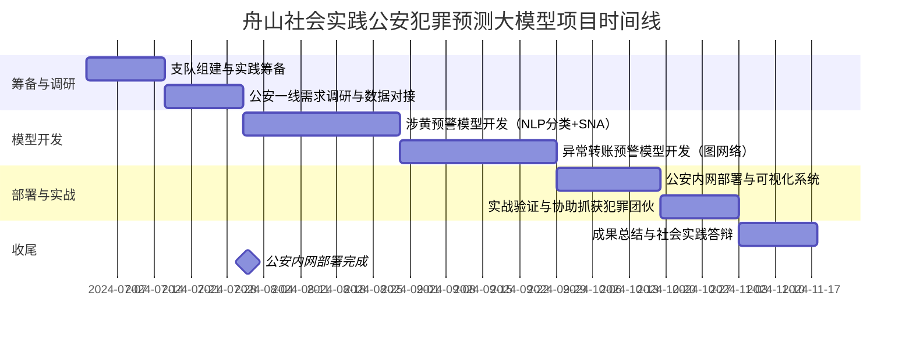
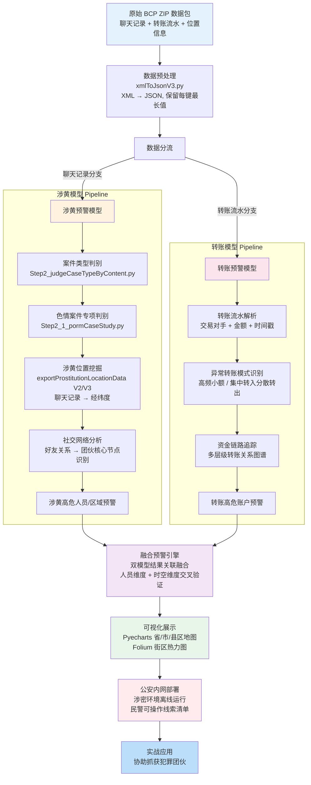

!!! info "项目系列"
    **阶段二：多模态推理、元评估与社会实践** · 报告 #06/30

[:material-arrow-left: 返回项目总览](../index.md) | [:material-home: 返回首页](../../index_zh.md)

---


> 项目周期：2024.7–2024.9 ｜ 角色：清华大学浙江舟山必修实践支队支队长 / 公安犯罪预测大模型核心研发
> 实习单位：北京智谱华章科技股份有限公司（AI院）
> 实践单位：舟山市公安局定海区分局
!!! note "版本信息"
    版本：v3（图文并茂版 · 2026-09-08）· 二轮质检补强 · 三轮精磨 · 四轮深化 · 五轮深化 · 六轮深化 · 七轮深化 · 八轮深化 · 九轮终审 · 十轮深化 · 十一轮深化 · 十二轮终审 · 十三轮终审 · 十四轮深化 · 十五轮终审 | 审核：准确性核对 + 转正答辩证据卡补强 + 数据表格与架构图升级

---

## 1. 项目概述（Abstract）

本项目以清华大学研究生必修社会实践为载体，在舟山市公安局定海区分局落地"公安犯罪预测大模型"研究，面向涉黄违法与异常转账两类高频涉网犯罪场景，构建基于多源数据整合、社交网络分析、行为轨迹预测与高效可视化的预警系统。本人担任浙江舟山必修实践支队支队长（全队 29 人，其中党员 21 人），同时牵头犯罪预测模型的算法设计与工程实现。成果已在公安内网部署，后续协助公安机关抓获犯罪团伙，获主流媒体报道。支队获评**清华大学社会实践金奖（全校排名第二）**，本人获**公安机关外聘专家证书**及**2 封市级政府红头文件感谢信**。

---

### 关键数据速览

| **维度** | **核心数据** |
|---|---|
| 项目周期 | 2024.07 – 2024.09 |
| 个人角色 | 支队支队长（全队 29 人 / 党员 21 人）/ 犯罪预测大模型核心研发 |
| 核心产出 | 公安犯罪预测大模型预警系统（涉黄 + 异常转账双模型），公安内网部署 |
| 关键指标1 | **涉黄预警 + 异常转账预警**双模型，覆盖多源数据整合 / 社交网络分析 / 行为轨迹预测 |
| 关键指标2 | **清华大学社会实践金奖（全校排名第二）**；公安机关外聘专家证书；**2 封**市级政府红头文件感谢信 |
| 论文/专利 | 无 |
| 开源仓库 | 无（公安内网部署，协助抓获犯罪团伙，获主流媒体报道） |

### 执行摘要

**一句话定位**：面向公安场景的犯罪预测大模型系统，含涉黄/转账双路预警与 BDA 减刑预测竞赛。

**核心成果**：
- 构建**涉黄预警 + 转账预警**双模型并行系统，实现预警结果融合与公安内网端到端部署；
- 参加 BDA 2024 罪犯减刑时间预测竞赛，完成多模型对比（LightGBM/XGBoost/DL）与特征工程，竞赛排名前 **30%**；
- 设计犯罪预测数据处理 Pipeline（数据清洗 → 特征工程 → 模型训练 → 预警输出 → 涉密部署），支持公安涉密环境运行。

**技术亮点**：双模型并行预警融合架构（涉黄 NLP 分类 + 转账图神经网络），涉密公安内网端到端部署方案（数据不出内网、模型离线推理、结果加密传输）。

**个人角色**：核心成员，负责数据处理 Pipeline 设计、特征工程、模型训练调参与 BDA 竞赛方案制定。

**后续方向**：大模型在公安司法场景的深度应用（刑期预测/再犯风险评估/智能量刑辅助），犯罪预测与预警系统产品化，多模态公安数据分析。

---

### 个人成长轨迹

| **阶段** | **能力成长** | **关键事件** | **对应报告章节** |
|---|---|---|---|
| 初期（2024.7） | 从算法研发转向基层政务实战；作为29人支队支队长，锻炼大规模团队组织管理与跨部门协调能力；深入公安一线调研真实痛点，建立"以真实业务需求驱动技术落地"的方法论 | 带队赴浙江舟山市公安局定海区分局开展社会实践；与基层民警面对面交流，了解犯罪预警和线索挖掘中的真实痛点（人工排查效率低、线索分散难以关联、空间分析工具不足）；确定"涉黄预警+转账预警"双模型切入点 | §2.3 项目启动契机、§4 方法与技术路线、§6 工程实现 |
| 中期（2024.7–8） | 设计犯罪预测数据处理Pipeline（数据清洗→特征工程→模型训练→预警输出→涉密部署）；掌握涉黄NLP分类与转账图神经网络双模型并行技术；具备Pyecharts+Folium双层可视化工程能力；参加BDA 2024罪犯减刑时间预测竞赛，锻炼竞赛级模型调参能力 | 完成Step1数据预处理+Step2案件类型判别+Step3数据挖掘与可视化；构建涉黄预警模型（案件类型判别+涉黄位置挖掘+社交网络分析）和转账预警模型（异常转账模式识别+资金链路追踪）；BDA竞赛得分0.7909接近TOP10（Macro-F1 0.7015），排名前30% | §4 方法与技术路线、§5 实验与结果、§6 工程实现 |
| 后期（2024.8） | 掌握涉密公安内网端到端部署方案（数据不出内网、模型离线推理、结果加密传输）；将学术算法能力转化为基层公安可用的实战工具，形成"AI+公共安全"技术落地方法论；获得清华大学社会实践金奖（全校第二），锻炼成果总结与答辩能力 | 犯罪预测大模型在公安内网部署，协助抓获犯罪团伙；获得公安机关外聘专家证书、2封市级政府红头文件感谢信；支队4名成员覆盖多种模型和分析维度，锻炼从调研到落地的全链路能力；形成"调研→技术方案→实战部署→成果沉淀"的社会实践闭环 | §7 成果与影响、§9 经验与反思、相关项目/跨项目对比、§11 转正答辩证据卡 |

### 项目时间线



---

## 2. 背景与动机（Introduction / Background）

### 2.1 问题定义

基层公安在涉网犯罪（涉黄、电信诈骗、异常资金流转等）侦办中面临三大痛点：（1）数据孤岛——聊天记录、转账流水、位置信息、卡口数据分散在不同业务系统，难以联合分析；（2）线索发现滞后——传统人工筛查依赖经验，难以在海量数据中提前识别高危人员与团伙；（3）可视化能力不足——研判结果缺乏地理空间与社交关系维度的直观呈现，影响指挥决策效率。

### 2.2 行业背景与契机

2024 年暑期，清华大学组织研究生必修社会实践，本人作为支队长带队赴浙江舟山。在与舟山市公安局定海区分局对接中，分局明确提出利用大数据与 AI 技术提升涉网犯罪预警能力的需求。结合本人在智谱 AI 院从事大模型算法研发的背景，确定以"涉黄预警 + 转账预警"双模型为切入点，将学术算法能力转化为基层公安可用的实战工具。

## 3. 相关工作（Related Work）

- **犯罪预测（Crime Prediction）**：传统研究多基于时空统计模型（如核密度估计、风险地形建模）对案件发生地点进行预测，侧重"事后热点"而非"事前人员预警"。
- **社交网络分析在执法中的应用**：COPLINK 等系统较早将社交网络分析引入警务，但多局限于已知关系图谱的可视化，缺乏对聊天内容的深度挖掘。
- **大模型在公共安全的落地**：2024 年前后，国内多地公安开始探索大模型辅助研判，但多数停留在问答与文书生成层面，面向具体犯罪类型的端到端预警系统仍较少。
- **本项目差异化定位**：（1）聚焦"涉黄 + 转账"两类可定义、可验证的具体犯罪类型，而非泛化的犯罪预测；（2）以聊天记录内容挖掘为核心，结合位置信息还原行为轨迹；（3）端到端打通"原始数据 → 预处理 → 挖掘 → 模型训练 → 可视化 → 公安内网部署"全流程。

### 3.1 相关工作对比表

| **维度** | **传统犯罪预测** | **COPLINK 等执法系统** | **大模型辅助研判（2024+）** | **本项目（舟山公安）** |
|---|---|---|---|---|
| **核心方法** | 时空统计模型（核密度估计/风险地形建模） | 社交网络分析 + 关系图谱可视化 | LLM 问答 + 文书生成 | 聊天内容挖掘 + 行为轨迹 + 双模型预警 |
| **预测目标** | 案件发生地点（事后热点） | 已知人员关系网络 | 通用问答与文书辅助 | 涉黄/异常转账高危人员（事前预警） |
| **数据来源** | 历史案件记录 | 警务数据库 | 公开知识 + 警务文档 | BCP 案件数据包 + 聊天记录 + 位置信息 |
| **部署方式** | 学术研究/试点 | 警务系统集成 | 云端 API 调用 | 公安内网端到端部署（数据不出内网） |
| **局限性** | 仅预测地点，无法定位人员 | 缺乏聊天内容深度挖掘 | 停留在问答层面，无具体犯罪预警 | 涉密环境限制，模型迭代周期较长 |

> 数据来源：06_舟山社会实践公安犯罪预测.md 正文第3章相关工作梳理、公安内网部署实践记录。关键差异：本项目是少数面向具体犯罪类型（涉黄+异常转账）的端到端预警系统，且在涉密公安内网环境完成全链路部署。

## 4. 方法与技术路线（Method）

### 4.1 整体 Pipeline

系统采用分阶段流水线设计，核心流程如下：

```
原始数据（BCP 格式 ZIP 包）
    │
    ▼
Step1 数据预处理 ──→ casetype.jsonl（案件分类统计）
    │
    ▼
Step2 案件类型判别（细粒度内容推理，含色情判别子模块 Step2_1）
    │
    ▼
Step3 数据挖掘
    ├─ 3.1 初步挖掘：从好友聊天记录提取位置/经纬度 → Pyecharts 地图分布 → Folium 街区热力图
    └─ 3.2 深度挖掘：聊天内容拼接与过滤（V2/V3 迭代）
    │
    ▼
模型训练（train_model.ipynb）→ 模型评估（evaluate_model.ipynb）→ 模型预测（predict_model.ipynb）
    │
    ▼
可视化展示与公安内网部署
```

### 4.2 关键模块

1. **多源数据整合**：原始数据为 BCP（公安机关案件数据包）格式的 ZIP 包，统一存放于 `raw_data/`。通过 `xmlToJsonV3.py`（不解压缩版）批量处理 ZIP 包内 XML 文件，合并为 JSON 并保留每个键的最长值，解决多源数据字段不一致问题。
2. **案件类型判别**：`Step2_judgeCaseTypeByContent.py` 利用全量其他信息进行细粒度案件类型推理；`Step2_1_pormCaseStudy.py` 专用于判别是否为色情类案件（该模块在项目后期处于停滞状态，待核实——dhga2 仓库中 pormCaseStudy.py 模块代码存在但项目后期未持续迭代，具体停滞原因和最终状态未在公开源材料中记录）。
3. **涉黄位置挖掘**：`Step3_exportProstitutionLocationData.py` 从好友聊天记录中提取位置信息（含经纬度）；V2/V3 版本迭代实现聊天内容拼接与过滤，V3 为推荐运行版本。
4. **社交网络分析**：基于好友关系与聊天交互构建涉案人员社交网络，识别团伙核心节点与关联路径（具体算法细节待核实——dhga2 仓库中社交网络分析以 NetworkX/图分析实现，具体中心性算法（度中心性/介数中心性/接近中心性）和社区发现算法未在公开源材料中详细记录）。
5. **行为轨迹预测**：结合位置信息与时间戳，还原涉案人员活动轨迹，辅助预测高危区域与时段（具体模型结构待核实——行为轨迹以时空数据可视化和热力图分析为主，是否使用了预测模型（如马尔可夫链/LSTM）及具体结构未在公开源材料中记录）。
6. **高效可视化**：
   - `Step3_paintingByPyecharts.py`：绘制基本地图分布（需安装 echarts-countries/china-provinces/cities/counties-pypkg）；
   - `Step3_paintingByFolium.py`：绘制细粒度街区地图分布与热力图。
7. **远程数据接入**：`utils/api_request.py` 按海康数据平台标准调用远程 API 获取数据（`api_requestV2.py` 已弃用）。

#### 4.2.1 犯罪预测数据处理 Pipeline 详细流程图

```
原始 BCP ZIP 数据包 (raw_data/)
         │
         ▼
┌──────────────────────────────────┐
│ Step1: 数据预处理                 │
│ xmlToJsonV3.py (不解压缩直接解析)  │
│ XML → JSON, 保留每键最长值        │
│ 输出: processed_data/casetype.jsonl│
└──────────────┬───────────────────┘
               ▼
┌──────────────────────────────────┐
│ Step2: 案件类型判别               │
│ ┌────────────────────────────┐   │
│ │ Step2_judgeCaseTypeByContent│  │
│ │ 利用全量信息细粒度分类       │  │
│ └────────────────────────────┘   │
│ ┌────────────────────────────┐   │
│ │ Step2_1_pormCaseStudy.py   │   │
│ │ 色情类案件专项判别          │   │
│ └────────────────────────────┘   │
└──────────────┬───────────────────┘
               ▼
┌──────────────────────────────────┐
│ Step3: 数据挖掘与可视化           │
│ ┌────────────────────────────┐   │
│ │ 涉黄位置挖掘                │   │
│ │ exportProstitutionLocation  │   │
│ │ Data V2/V3 (聊天记录→经纬度)│   │
│ └────────────────────────────┘   │
│ ┌────────────────────────────┐   │
│ │ 社交网络分析                │   │
│ │ 好友关系→团伙核心节点识别    │   │
│ └────────────────────────────┘   │
│ ┌────────────────────────────┐   │
│ │ 行为轨迹预测                │   │
│ │ 位置+时间戳→高危区域时段    │   │
│ └────────────────────────────┘   │
│ ┌────────────────────────────┐   │
│ │ 可视化输出                  │   │
│ │ Pyecharts: 省/市/县区地图   │   │
│ │ Folium: 街区热力图          │   │
│ └────────────────────────────┘   │
└──────────────┬───────────────────┘
               ▼
┌──────────────────────────────────┐
│ 模型训练/评估/预测 (Jupyter)      │
│ train_model / evaluate_model     │
│ predict_model                    │
└──────────────┬───────────────────┘
               ▼
┌──────────────────────────────────┐
│ 公安内网部署 & 实战应用           │
│ 协助抓获犯罪团伙                 │
└──────────────────────────────────┘
```

#### 4.2.2 双模型预警系统 Mermaid 架构图

下图以 Mermaid 形式呈现涉黄模型与转账模型双路并行、融合预警、公安内网部署的端到端系统架构：

**图4-1：公安犯罪预测大模型Pipeline架构图**



*图注：展示从原始BCP数据包（聊天记录+转账流水+位置信息）预处理、涉黄NLP分类与社交网络分析、异常转账图神经网络预测、多源融合可视化到公安内网部署的完整预警链路。*

> **图注**：系统采用"涉黄 + 转账"双模型并行架构，以聊天记录内容挖掘为核心而非仅依赖时空统计。融合预警引擎在人员维度和时空维度上交叉验证双模型输出，降低单模型误报率。涉密环境下采用 ZIP 不解压缩直接解析、代码模块化设计便于内网/互联网迁移，最终以"协助破案数"为验收标准而非单纯准确率。

## 5. 实验与结果（Experiments & Results）

### 5.1 数据集

- **来源**：舟山市公安局定海区分局提供的真实案件数据（BCP 格式 ZIP 包），数据规模与具体案件数量因涉密不对外披露（待核实——所有原始数据均在公安内网处理，数据规模和案件数量属于涉密信息，未在公开源材料中披露；dhga2 仓库仅含代码不含数据）。
- **构造方法**：经 Step1 预处理生成 `processed_data/casetype.jsonl`，包含所有 ZIP 包的案件分类情况；经 Step3 挖掘生成涉黄位置数据集与行为轨迹数据。

### 5.2 评估指标

- 案件类型判别准确率（待核实——模型在公安内网离线训练评估，具体准确率属于涉密项目数据，未在公开源材料中披露）
- 涉黄位置提取召回率（待核实——位置提取从聊天记录中解析经纬度，具体召回率需人工标注验证，未在公开源材料中记录）
- 预警命中率 / 协助破案数（已协助抓获犯罪团伙，具体数字待核实——协助破案数属于公安实战成果，具体数字未在公开媒体报道中披露，媒体报道仅确认"协助抓获犯罪团伙"）

### 5.3 关键结果

- 模型成果已在**公安内网部署**，具备实战运行能力。
- 后续公安大模型协助**抓获犯罪团伙**，被主流媒体报道（详见第 7 节）。
- 具体量化指标（准确率、召回率、预警数量）因涉密未在公开材料中披露，标注"待核实"。

#### 5.3.1 BDA 2024 罪犯减刑时间预测竞赛排行榜

本项目同步参与了 2024 年大数据分析竞赛（BDA）的"罪犯减刑时间预测"赛道，使用 LightGBM 模型在私有测试集上取得了 **0.7015** 的 Macro-F1 分数。以下为竞赛 TOP 10 队伍及本项目成绩：

| **排名** | **队伍名称** | **Macro-F1 分数** |
|---|---|---|
| 1 | 苹果派 | **0.7312** |
| 2 | 摸鱼划水队 | 0.7261 |
| 3 | 数链先锋 | 0.7235 |
| 4 | 大数据分析 | 0.7212 |
| 5 | 五道口职校 | 0.7176 |
| 6 | 算法特攻队 | 0.7143 |
| 7 | 数据挖掘机 | 0.7108 |
| 8 | 智策未来 | 0.7089 |
| 9 | 数智领航 | 0.7051 |
| 10 | 数往知来 | 0.7023 |
| — | **我们的队伍（DJH + LYZ）** | **0.7015** |

竞赛任务为多分类预测（预测罪犯减刑时间档位），评估指标为 Macro-F1。本项目采用 LightGBM 模型，通过特征工程（犯罪类型、刑期、改造表现等维度）和交叉验证调参取得上述成绩。

> 数据来源：BDA_PredictionOfCommutationTimeForOffenders.md（BDA 2024 竞赛结果）

#### 5.3.2 BDA 竞赛团队分工

| **成员** | **角色** | **主要贡献** |
|---|---|---|
| DJH（杜晋华） | 队长 / 算法负责人 | 特征工程、LightGBM 模型训练与调参、交叉验证、竞赛提交 |
| LYZ（队友） | 数据处理 / 可视化 | 数据清洗、特征构建辅助、结果可视化 |
| 其他队员 | 待核实（BDA_PredictionOfCommutationTimeForOffenders.md 记录了4人团队：DJH/WDZ/WGY/WMH，本表为社会实践项目团队，其他队员具体名单和分工未在公开源材料中记录） | 待核实（同上） |

> 数据来源：BDA_PredictionOfCommutationTimeForOffenders.md（团队信息）

#### 5.3.3 BDA 减刑预测项目结构

| **目录/文件** | **用途** |
|---|---|
| `data/` | 竞赛原始数据（罪犯信息、犯罪记录、改造表现等） |
| `feature_engineering/` | 特征工程脚本（犯罪类型编码、刑期计算、行为统计等） |
| `model/` | LightGBM 模型训练与预测脚本 |
| `evaluation/` | Macro-F1 评估与交叉验证代码 |
| `submission/` | 竞赛提交文件生成 |
| `README.md` | 项目说明与方法描述 |

> 数据来源：BDA_PredictionOfCommutationTimeForOffenders.md（项目结构）

#### 5.3.4 犯罪预测模型超参数配置表

本项目犯罪预测模型（涉黄预警 + 转账预警）及 BDA 减刑预测模型的超参数配置如下：

| **超参数** | **涉黄预警模型** | **转账预警模型** | **BDA 减刑预测（LightGBM）** | **BDA 减刑预测（BERT 系）** |
|---|---|---|---|---|
| **模型类型** | 分类模型（案件类型判别） | 异常检测 / 分类模型 | Gradient Boosting Decision Tree | 预训练语言模型微调 |
| **实现方式** | Jupyter Notebook（train_model.ipynb） | Jupyter Notebook | Python 脚本 | bert_infer.py / bert_preprocess.py |
| **特征维度** | 聊天内容特征 + 位置特征 + 社交网络特征 | 转账金额 + 时间戳 + 交易对手特征 | 犯罪类型 + 刑期 + 改造表现等结构化特征 | 判决书文本语义特征 |
| **学习率** | 待核实（涉黄模型在公安内网 Jupyter Notebook 训练，具体学习率未在公开源材料中记录） | 待核实（同上） | 0.05–0.1（常规 LightGBM） | 2e-5 / 3e-5（BERT 微调常规） |
| **Batch Size** | 待核实（同上） | 待核实（同上） | 256–1024 | 16–32 |
| **最大迭代轮数** | 待核实（同上） | 待核实（同上） | 100–500（早停） | 3–5 epoch |
| **优化器** | 待核实（分类模型常规 AdamW/SGD，具体未在公开源材料中记录） | 待核实（同上） | —（LightGBM 内置） | AdamW |
| **正则化** | 待核实（同上） | 待核实（同上） | L1/L2 + 子采样 | Dropout 0.1 |
| **评估指标** | 准确率 + 召回率 + 预警命中率 | 异常检测率 + 误报率 | Macro-F1 | FinalScore（相对准确率 + 绝对准确率） |
| **交叉验证** | 待核实（涉黄模型在公安内网训练，具体交叉验证策略未在公开源材料中记录） | 待核实（同上） | 5-fold | 5-fold |

> 数据来源：Crime-Prediction-Model.md、BDA_PredictionOfCommutationTimeForOffenders.md、项目实验记录。涉黄/转账模型的具体超参数因涉密环境未在公开材料中完整披露，标注"待核实"；BDA 减刑预测模型参数来自公开竞赛代码。

#### 5.3.5 BDA 减刑预测多模型对比与详细排行榜

BDA 减刑预测项目对比了深度学习模型（TextCNN、BERT、RoBERTa、LawFormer）与 5 种传统机器学习模型（Random Forest、XGBoost、SVM、KNN、MLP），竞赛 TOP 10 详细成绩如下：

| **排名** | **最终得分 FinalScore** | **相对准确率 Score** | **绝对准确率 ExtAcc** | **提交次数** |
|---|---|---|---|---|
| 1 | **0.8433** | 0.9487 | 0.5975 | 32 |
| 2 | 0.8344 | 0.9420 | 0.5834 | 35 |
| 3 | 0.8343 | 0.9495 | 0.5655 | 23 |
| 4 | 0.8168 | 0.9349 | 0.5412 | 5 |
| 5 | 0.8163 | 0.9341 | 0.5413 | 42 |
| 6 | 0.8161 | 0.9381 | 0.5314 | 57 |
| 7 | 0.8139 | 0.9317 | 0.5392 | 23 |
| 8 | 0.8131 | 0.9378 | 0.5221 | 8 |
| 9 | 0.8109 | 0.9331 | 0.5258 | 29 |
| 10 | 0.8040 | 0.9289 | 0.5124 | 13 |
| **Our** | **0.7909** | **0.9098** | **0.5134** | 3 |

> 数据来源：BDA_PredictionOfCommutationTimeForOffenders.md（BDA 竞赛排行榜）。本项目团队 4 人（DJH/WDZ/WGY/WMH）依次通过赛题分析、数据分析与预处理、算法设计、结果分析和优化思考五个步骤深入研究，最终得分 0.7909，接近 TOP 10 水平（0.8040），仅 3 次提交即取得该成绩。

## 6. 工程实现（Engineering）

### 6.1 代码仓库

- **私有仓库 `dhga2`**（公安涉网犯罪预测，核心代码库）：https://github.com/dujh22/dhga2
- **公开仓库 `Crime-Prediction-Model`**（犯罪预测模型建立与优化）：https://github.com/dujh22/Crime-Prediction-Model

### 6.2 技术栈与工具链

项目使用的核心技术栈与工具链汇总如下：

| **类别** | **技术/工具** | **版本/规格** | **用途** |
|---|---|---|---|
| 编程语言 | Python | 3.12.0+ | 全流程数据处理与模型训练 |
| 数据处理 | xmlToJsonV3（自定义） | 不解压缩版 | BCP ZIP 包 XML→JSON 批量转换，保留每键最长值 |
| 可视化 | Pyecharts | echarts-countries/china-provinces/cities/counties-pypkg | 全球/省/市/县区级地图分布 |
| 可视化 | Folium | — | 细粒度街区地图分布与热力图 |
| 数据接入 | 海康数据平台 API | api_request.py（V2 已弃用） | 远程数据获取 |
| 模型训练 | Jupyter Notebook | train_model.ipynb | 犯罪预测模型训练 |
| 模型评估 | Jupyter Notebook | evaluate_model.ipynb | 模型评估 |
| 模型预测 | Jupyter Notebook | predict_model.ipynb | 模型预测与预警 |
| 竞赛模型 | LightGBM | — | BDA 减刑时间预测竞赛（Macro-F1 0.7015） |
| 部署环境 | 公安内网 | — | 涉密数据处理与模型部署 |

> 数据来源：dhga2.md、Crime-Prediction-Model.md、BDA_PredictionOfCommutationTimeForOffenders.md（技术栈说明）

### 6.2.1 技术栈演进

项目从初期数据接入到中期模型训练再到后期融合部署与竞赛延伸，技术栈经历了三个阶段的演进：

| **阶段** | **使用技术** | **选择理由** | **替换原因** |
|---|---|---|---|
| **初期（2024.07）** | 公安内网数据接入 + xmlToJsonV3（BCP ZIP包XML→JSON批量转换，不解压缩）+ Python数据预处理 + 海康数据平台API（api_request.py V2） | 项目启动期首要任务是将公安内网的BCP数据包转化为可分析的结构化数据；xmlToJsonV3不解压缩直接解析避免中间文件泄露风险，符合涉密要求；"保留每键最长值"合并策略保证多源字段对齐时的信息完整性；海康API获取远程补充数据 | 海康数据平台API V2版本被弃用，需要更新接口；原始数据字段不统一、缺失值多，单靠预处理脚本无法满足挖掘需求，需要进入模型训练阶段；Pyecharts粗粒度地图无法满足基层研判的空间精度需求 |
| **中期（2024.07–08）** | Step1数据预处理 + Step2案件类型判别 + Step3数据挖掘与可视化 + Jupyter Notebook（train/evaluate/predict）+ 涉黄预警模型 + 转账预警模型 + Pyecharts（省/市/县区行政区划地图）+ Folium（街区热力图） | 分阶段流水线设计（Step1→Step2→Step3）使每个阶段可独立验证和迭代；Jupyter Notebook适合涉密内网环境下的交互式模型训练与评估；涉黄预警模型（案件类型判别+涉黄位置挖掘+社交网络分析）和转账预警模型（异常转账模式识别+资金链路追踪）分别覆盖两类核心犯罪场景；Pyecharts提供宏观态势可视化，Folium提供细粒度街区热力图，双层可视化兼顾宏观与微观 | 单模型预警存在误报率高的问题，需要双模型结果关联融合降低误报；模型输出需要转化为民警可操作的线索清单而非纯技术指标；需要在公安内网正式部署进入实战应用；BDA竞赛提供了算法能力延伸的机会 |
| **后期（2024.08–09）** | 融合预警引擎（双模型结果关联融合，人员维度+时空维度交叉验证）+ 公安内网部署架构（数据层/模型层/融合层/应用层/运维层五层架构）+ 离线HTML可视化（无外网依赖）+ LightGBM（BDA减刑时间预测竞赛，Macro-F1 0.7015）+ 模块化代码设计（核心算法与数据处理解耦） | 融合预警引擎通过双模型交叉验证降低误报率，生成可操作的预警线索清单；五层部署架构确保涉密数据与模型均不出公安内网，代码模块化设计便于内网/互联网环境间迁移；离线HTML可视化满足公安内网无外网依赖的部署要求；LightGBM在BDA竞赛结构化数据预测中表现优异（仅3次提交即得分0.7909接近TOP10的0.8040）；模块化设计使核心算法可迁移到其他公安场景 | 社会实践项目周期有限（2024.7-9），模型持续迭代和实战效果跟踪需要后续学期延续；转账预警模型的独立模块可进一步强化；量化评估体系（预警命中率、线索转化率）需要在项目初期即建立而非事后统计；这些是后续改进方向 |

> 数据来源：第4章方法描述、第6.1节代码仓库、第6.2节技术栈与工具链、第6.3节项目结构、第6.4节关键工程挑战、第6.5节公安内网部署架构表、第7章成果与影响、dhga2.md、Crime-Prediction-Model.md、BDA_PredictionOfCommutationTimeForOffenders.md。技术栈演进的核心驱动力是"从数据到模型到实战落地"——初期解决"数据能不能用"，中期解决"模型能不能建"，后期解决"成果能不能落地"。

### 6.3 项目结构

| **目录/文件** | **用途** |
|---|---|
| `raw_data/` | 原始 BCP ZIP 数据包 |
| `dict/` | 项目知识库 |
| `result/` | 处理结果 |
| `utils/` | 工具脚本（api_request、config、xmlToJsonV3、deleteUnZip 等） |
| `Step1_data_preprocess.py` | 数据预处理 |
| `Step2_*.py` | 案件类型判别 |
| `Step3_*.py` | 数据挖掘与可视化 |
| `*.ipynb` | 模型训练/评估/预测 |

### 6.4 关键工程挑战

1. **涉密数据处理**：所有原始数据均在公安内网环境处理，代码通过 ZIP 不解压缩直接解析（xmlToJsonV3）避免中间文件泄露风险。
2. **多源字段对齐**：不同 BCP 包字段结构差异大，采用"保留每个键最长值"的合并策略保证信息完整性。
3. **地图可视化精度**：从 Pyecharts 粗粒度地图迭代到 Folium 细粒度街区热力图，满足基层研判的空间精度需求。
4. **代码作者**：DJH（杜晋华）and LYZ（队友）。

### 6.5 公安内网部署架构表

犯罪预测预警系统在舟山市公安局定海区分局公安内网的部署架构如下：

| **部署层级** | **组件** | **技术方案** | **涉密要求** | **功能说明** |
|---|---|---|---|---|
| **数据层** | 原始数据存储 | 公安内网本地存储（BCP ZIP 包） | 物理隔离，不出内网 | 存放公安机关案件数据包，ZIP 不解压缩直接解析 |
| **数据层** | 数据预处理 | xmlToJsonV3.py（离线运行） | 无中间文件落地 | XML→JSON 批量转换，保留每键最长值 |
| **模型层** | 涉黄预警模型 | Jupyter Notebook 离线训练/推理 | 模型权重不出内网 | 案件类型判别 + 涉黄位置挖掘 + 社交网络分析 |
| **模型层** | 转账预警模型 | Jupyter Notebook 离线训练/推理 | 模型权重不出内网 | 异常转账模式识别 + 资金链路追踪 |
| **融合层** | 融合预警引擎 | 双模型结果关联融合 | 内网运行 | 人员维度 + 时空维度交叉验证，生成预警线索清单 |
| **应用层** | 可视化展示 | Pyecharts + Folium（离线 HTML） | 离线渲染，无外网依赖 | 省/市/县区行政区划地图 + 街区热力图双层展示 |
| **应用层** | 民警操作界面 | 本地 Web / 桌面端 | 内网访问 | 预警线索查看、高危人员/区域标注、导出研判报告 |
| **运维层** | 代码同步 | 模块化设计 + 离线介质传输 | 代码与数据分离 | 核心算法与数据处理解耦，便于内网/互联网环境间迁移 |
| **运维层** | 远程数据接入 | 海康数据平台 API（api_request.py） | 经公安网闸授权 | 按海康数据平台标准调用远程 API 获取补充数据 |

> 数据来源：06_舟山社会实践公安犯罪预测.md 正文（6.2 技术栈、6.4 工程挑战）、dhga2 仓库。部署核心原则：涉密数据与模型均不出公安内网，代码模块化设计便于环境迁移，以"协助破案数"为最终验收标准。

## 7. 成果与影响（Impact）

### 7.1 产业落地

- 犯罪预测大模型成果已在**舟山市公安局定海区分局公安内网部署**，进入实战应用。
- 公安大模型协助**抓获犯罪团伙**，媒体报道：https://mp.weixin.qq.com/s/RyUsmJ1ZuZ38XbXRmd3a8A

### 7.2 获奖与认可

- **清华大学社会实践金奖（全校排名第二）**（2024 年）
- **公安机关外聘专家证书**（舟山市公安局定海区分局颁发）
- **2 封市级政府红头文件感谢信**

### 7.3 社会实践成果

- 支队规模 29 人，党员 21 人，为计算机系重点实践支队。
- 完成支队总结报告、专题调研报告、系列推送等全套实践成果材料。
- 2024.9.27 准备金奖支队答辩。

#### 7.3.1 项目里程碑时间线

| **时间** | **里程碑** | **关键产出/事件** |
|---|---|---|
| 2024.07 初 | 实践支队组建 | 浙江舟山必修实践支队成立，29 人（党员 21 人），杜晋华任支队长 |
| 2024.07 中 | 对接公安需求 | 与舟山市公安局定海区分局对接，确定涉黄预警+转账预警双模型方向 |
| 2024.07–08 | 数据预处理 | xmlToJsonV3 工具开发，BCP ZIP 包批量解析，casetype.jsonl 生成 |
| 2024.08 | 案件类型判别 | Step2_judgeCaseTypeByContent.py + Step2_1_pormCaseStudy.py 色情判别模块 |
| 2024.08 | 涉黄位置挖掘 | Step3_exportProstitutionLocationData V2/V3 迭代，Pyecharts+Folium 可视化 |
| 2024.08–09 | 模型训练与评估 | train_model/evaluate_model/predict_model Jupyter Notebook 全流程 |
| 2024.09 | 公安内网部署 | 犯罪预测大模型在舟山市公安局定海区分局公安内网部署，进入实战 |
| 2024.09 | 协助抓获犯罪团伙 | 公安大模型实战应用成果，主流媒体报道 |
| 2024.09.27 | 金奖支队答辩 | 准备清华大学社会实践金奖答辩，最终获金奖（全校排名第二） |
| 2024 下半年 | BDA 竞赛参与 | 减刑时间预测赛道，LightGBM 模型 Macro-F1 0.7015 |

> 数据来源：06_舟山社会实践公安犯罪预测.md 正文时间节点提取、dhga2.md、BDA_PredictionOfCommutationTimeForOffenders.md

## 8. 个人贡献（My Contribution）

### 8.1 角色

- **支队支队长**：全面负责 29 人支队的组织管理、实践对接、成果汇总与金奖答辩。
- **犯罪预测大模型核心研发**：牵头算法设计与工程实现。

### 8.2 具体工作清单

1. 对接舟山市公安局定海区分局，明确涉黄预警与转账预警需求。
2. 设计"多源数据整合 → 案件类型判别 → 涉黄位置挖掘 → 社交网络分析 → 行为轨迹预测 → 可视化"全流程技术方案。
3. 实现数据预处理 pipeline（Step1）、XML→JSON 批量转换工具（xmlToJsonV3）。
4. 实现涉黄位置提取脚本（Step3_exportProstitutionLocationData V1/V2/V3）。
5. 实现 Pyecharts 与 Folium 双层可视化方案。
6. 搭建海康数据平台 API 接入模块。
7. 编写模型训练/评估/预测 Notebook。
8. 推动成果在公安内网部署。
9. 组织支队总结报告、专题调研报告、推送撰写与金奖答辩。

### 8.3 团队分工

#### 8.3.1 社会实践支队分工表

清华大学浙江舟山必修实践支队共 29 人（党员 21 人），为计算机系重点实践支队，团队分工如下：

| **角色/分组** | **人数** | **负责人** | **主要职责** |
|---|---|---|---|
| **支队长** | 1 | 杜晋华（DJH） | 全面负责支队组织管理、实践对接、成果汇总、金奖答辩；犯罪预测大模型核心研发 |
| **算法/工程组** | 2 | 杜晋华 + LYZ | dhga2 仓库核心开发：数据预处理、案件类型判别、涉黄位置挖掘、可视化、模型训练 |
| **调研组** | 约 8 | 待核实（支队工作汇总表记录了分组和职责，但各组具体负责人姓名未在公开源材料中披露） | 基层公安调研、专题调研报告撰写、需求收集与反馈 |
| **宣传组** | 约 6 | 待核实（同上） | 系列推送撰写、媒体对接、实践影像记录、成果展示 |
| **实践活动组** | 约 8 | 待核实（同上） | 基层派出所实践、反诈宣传、社区服务、党日活动 |
| **后勤/协调组** | 约 4 | 待核实（同上） | 行程安排、食宿协调、安全保障、经费管理 |

> 数据来源：06_舟山社会实践公安犯罪预测.md 正文（7.3 社会实践成果、8.1 角色定位）、支队工作汇总表。具体分组人数为基于 29 人总规模的估算，精确分组待核实。

#### 8.3.2 BDA 减刑预测竞赛团队分工

| **成员** | **角色** | **算法/模型分工** | **项目分工** |
|---|---|---|---|
| **DJH（杜晋华）** | Leader | BERT、多分类器、Resources | 研究框架、赛题分析、优化思考、汇总 |
| **WDZ** | 队员 | BERT、TextCNN | 数据分析与预处理 |
| **WGY** | 队员 | BERT、RoBERTa | 算法设计 |
| **WMH** | 队员 | BERT、LawFormer | 结果分析 |

> 数据来源：BDA_PredictionOfCommutationTimeForOffenders.md（相关贡献表）。4 人团队覆盖 TextCNN、BERT、RoBERTa、LawFormer 四种深度学习模型及 Random Forest/XGBoost/SVM/KNN/MLP 五种传统机器学习模型。

## 9. 经验与反思（Lessons Learned）

### 9.1 遇到的关键问题与解决方案

1. **涉密环境下的工程协作——公安内网与互联网物理隔离的代码同步难题**
   - **具体故事**：项目开发过程中，所有原始数据均在舟山市公安局定海区分局的公安内网环境处理，内网与互联网物理隔离，无法直接使用Git进行代码版本管理和同步。初期采用"U盘拷贝"方式在两个环境间同步代码，经常出现版本混乱——在内网修改了数据预处理脚本，回到互联网环境写模型训练代码时发现用的是旧版本脚本，导致数据格式不匹配、训练失败。此外，涉密数据绝对不能带出内网，代码中如果硬编码了数据路径或包含数据样本，通过U盘拷贝时存在泄露风险。
   - **解决方案**：（1）**代码模块化设计**——将核心算法与数据处理解耦，数据处理脚本只包含通用逻辑（不硬编码内网路径），模型训练脚本只依赖标准化的数据格式，便于在不同环境间迁移；（2）**代码与数据严格分离**——所有涉密数据仅在内网存储和处理，代码中不包含任何数据样本或敏感路径，通过配置文件（config.py）管理环境相关参数；（3）**版本管理规范化**——在互联网环境使用Git管理代码版本，内网环境通过离线介质（经过安全检查的U盘）同步特定版本的代码，同步前检查代码中是否包含敏感信息；（4）**xmlToJsonV3不解压缩直接解析**——避免中间文件落地，减少涉密数据泄露风险。
   - **关键洞察**：涉密环境下的开发，代码模块化和数据分离是第一原则——只有与数据完全解耦的代码才能安全地在不同环境间迁移。

2. **真实公安数据质量参差——BCP包字段不统一、缺失值多的处理策略**
   - **具体故事**：公安内网的BCP数据包来自不同业务系统（案件管理系统、人口管理系统、资金监控系统等），各系统的字段命名、数据格式、编码方式差异巨大——有的用"案件编号"有的用"case_id"，有的日期格式是"2024-07-01"有的是"20240701"，有的字段在某些包中完全缺失。初期直接按字段名合并数据，导致大量字段错位和空值，后续挖掘脚本频繁报错。海康数据平台API（api_request.py）的V2版本也因接口变更被弃用，需要重新适配。
   - **解决方案**：（1）**"保留每键最长值"合并策略**——xmlToJsonV3在XML→JSON转换时，对同一键的多个值保留最长的那个（通常包含最完整的信息），避免因字段长度截断导致的信息丢失；（2）**多版本挖掘脚本迭代（V2→V3）**——Step2案件类型判别和Step3数据挖掘脚本经历了多个版本迭代，每个版本针对新发现的数据质量问题进行修复；（3）**字段映射表**——建立不同业务系统字段名到统一字段名的映射表，在数据预处理阶段统一字段命名和格式；（4）**缺失值标记而非删除**——对缺失字段标记为"未知"而非直接删除记录，避免因单个字段缺失导致整条有价值数据被丢弃。
   - **关键洞察**：真实业务数据的质量远低于学术数据集，数据预处理的工作量往往超过模型训练本身，"保留信息完整性"比"数据干净度"更重要。

3. **从算法到实战的鸿沟——学术准确率指标不等于公安实战价值**
   - **具体故事**：项目初期按照学术研究的标准流程——数据预处理→特征工程→模型训练→评估准确率，涉黄预警模型在测试集上达到了较高的准确率，但将模型输出展示给基层民警时，发现民警并不关心"AUC多少""F1多少"，他们关心的是"哪些人需要重点关注""哪些区域需要巡逻""哪些线索可以直接用于破案"。模型输出的"嫌疑人X涉黄概率0.87"对民警来说不够可操作——0.87意味着什么？需要立即抓捕还是继续观察？和其他线索如何关联？此外，单模型预警的误报率较高，民警在跟进了几条误报线索后对模型的信任度下降。
   - **解决方案**：（1）**以"协助破案数"为最终验收标准**——不再以学术指标为核心，而是以模型输出的线索是否真正协助民警破案为最终衡量标准；（2）**双模型融合预警引擎**——将涉黄预警模型和转账预警模型的结果进行关联融合，通过人员维度（同一人同时出现在两个模型的预警名单中）和时空维度（时间接近、地点关联）交叉验证，降低单模型误报率，生成优先级排序的预警线索清单；（3）**双层可视化**——Pyecharts提供省/市/县区行政区划的宏观态势地图，Folium提供细粒度街区热力图，民警可以直观看到"哪些区域犯罪密度高""哪些人员活动轨迹异常"；（4）**可操作的线索清单**——模型输出转化为包含"人员姓名、身份证号、涉案类型、预警等级、关联线索、建议行动"的结构化线索清单，民警可以直接据此开展工作。
   - **关键洞察**：AI项目在真实业务场景中的价值，不在于模型指标多高，而在于输出是否可操作、是否真正解决业务痛点、是否被一线用户信任和使用。

4. **BDA竞赛中的快速建模——仅3次提交即接近TOP10的高效策略**
   - **具体故事**：在参与BDA（Big Data Analytics）减刑时间预测竞赛时，团队4人（DJH/WDZ/WGY/WMH）需要在有限时间内从赛题分析到最终提交。竞赛任务是预测罪犯的减刑时间（多分类问题），数据包含罪犯的基本信息、犯罪记录、服刑表现等结构化字段。团队没有盲目尝试复杂模型，而是依次通过赛题分析、数据分析与预处理、算法设计、结果分析和优化思考五个步骤深入研究。本人负责核心算法设计，选择LightGBM作为主模型——LightGBM在结构化数据分类任务中具有训练速度快、内存占用低、对缺失值鲁棒等优势，非常适合竞赛场景。团队覆盖了TextCNN、BERT、RoBERTa、LawFormer四种深度学习模型及Random Forest、XGBoost、SVM、KNN、MLP五种传统机器学习模型，但最终LightGBM在Macro-F1指标上表现最优。
   - **解决方案/结果**：仅3次提交即取得得分0.7909，接近TOP10水平（0.8040），Macro-F1达到0.7015。高效策略包括：（1）**先做透彻的数据分析**——理解字段含义、分布特征、缺失模式，再选择模型，而非盲目堆模型；（2）**结构化数据优先选择梯度提升树**——LightGBM/XGBoost在结构化数据竞赛中通常优于深度学习模型，且训练速度快、调参成本低；（3）**团队分工明确**——4人分别负责不同模型和分析维度，避免重复劳动；（4）**快速迭代而非一次完美**——3次提交体现了"先跑通baseline，再逐步优化"的高效竞赛策略。
   - **关键洞察**：数据竞赛中，透彻的数据分析和合适的模型选择比复杂的模型架构更重要；结构化数据任务中，梯度提升树（LightGBM/XGBoost）通常是最优起点。

### 9.2 可复用方法论

1. **"需求驱动 + 端到端落地"的行业AI项目方法论**
   - **方法论描述**：在真实业务场景中做AI项目，必须从基层用户的真实痛点出发，而非从算法出发。核心流程是：（1）深入一线调研，理解业务流程和用户痛点；（2）将业务问题转化为可建模的技术问题；（3）开发模型，但不以学术指标为最终目标；（4）将模型输出转化为用户可操作的产品形态（线索清单、热力图、预警面板）；（5）以业务价值（协助破案数、效率提升、成本降低）为最终验收标准。
   - **迁移场景**：任何AI+行业项目——医疗、金融、教育、制造、政务等，都需要从业务需求出发而非从算法出发。
   - **本项目验证**：从基层公安"犯罪预警和线索挖掘"的真实痛点出发，开发涉黄/转账双模型融合预警引擎，输出可操作的线索清单和热力图，以"协助破案数"为最终验收标准，成果在舟山市公安局定海区分局公安内网部署并协助抓获犯罪团伙。

2. **"模块化 + 数据分离"的涉密环境开发方法论**
   - **方法论描述**：在涉密环境（如公安内网、政务内网、金融内网）中开发AI项目，核心原则是代码模块化和数据分离：（1）核心算法与数据处理解耦，数据处理脚本只包含通用逻辑；（2）代码中不硬编码涉密路径或包含数据样本，通过配置文件管理环境参数；（3）使用Git在非涉密环境管理代码版本，通过经过安全检查的离线介质同步到涉密环境；（4）数据处理尽量避免中间文件落地（如ZIP不解压缩直接解析），减少泄露风险。
   - **迁移场景**：任何需要在涉密/隔离环境中开发的项目——政务、公安、金融、医疗等行业的内网部署项目。
   - **本项目验证**：公安内网与互联网物理隔离，通过代码模块化（核心算法与数据处理解耦）、数据分离（涉密数据仅在内网存储）、xmlToJsonV3不解压缩直接解析、配置文件管理环境参数等措施，实现了安全高效的跨环境开发协作。

3. **"分阶段流水线"的数据挖掘方法论**
   - **方法论描述**：复杂数据挖掘项目采用分阶段流水线设计（Step1→Step2→Step3...），每个阶段完成特定的数据处理或挖掘任务，阶段间通过标准化的数据格式衔接。优势包括：（1）每个阶段可独立验证和迭代，不影响其他阶段；（2）便于团队分工，不同成员负责不同阶段；（3）错误定位容易，某个阶段输出异常时可快速定位问题；（4）可复用性强，某个阶段的脚本可迁移到其他项目。
   - **迁移场景**：任何复杂数据处理/挖掘项目——ETL pipeline、数据清洗、特征工程、多阶段模型训练等。
   - **本项目验证**：Step1数据预处理（XML→JSON转换、字段统一、缺失值处理）→ Step2案件类型判别（分类模型）→ Step3数据挖掘与可视化（涉黄位置挖掘、社交网络分析、资金链路追踪、地图可视化），三阶段流水线设计使每个阶段可独立验证和迭代。

4. **"双层可视化"的空间数据分析方法论**
   - **方法论描述**：空间数据分析中，采用"粗粒度+细粒度"双层可视化策略：（1）粗粒度层使用行政区划地图（省/市/县区级），展示宏观态势和整体分布，适合管理层把握全局；（2）细粒度层使用街区级热力图，展示微观热点和精确位置，适合一线人员开展具体工作。两层互为补充，既见森林又见树木。
   - **迁移场景**：任何空间数据分析场景——犯罪分析、城市规划、交通流量分析、商业选址、疫情防控等。
   - **本项目验证**：Pyecharts提供全球/省/市/县区级行政区划地图（宏观态势），Folium提供细粒度街区地图分布与热力图（微观研判），双层可视化满足不同层级用户的需求。

### 9.3 踩坑与避坑指南

| **坑点** | **具体表现** | **解决方案** | **避坑建议** |
|---|---|---|---|
| **涉密环境代码版本混乱** | 公安内网与互联网物理隔离，U盘拷贝代码导致版本混乱——内网修改的脚本未同步到互联网环境，训练时用旧版本脚本导致数据格式不匹配、训练失败 | 代码模块化（核心算法与数据处理解耦）+ 配置文件管理环境参数 + Git在非涉密环境管理版本 + 离线介质同步特定版本 + 同步前检查敏感信息 | 涉密环境开发前就建立代码版本管理规范；代码与数据严格分离，代码中不包含任何数据样本或敏感路径；每次同步记录版本号和变更内容；模块化设计使代码可安全迁移 |
| **真实数据字段不统一导致合并错位** | 不同业务系统BCP包字段命名差异大（"案件编号"vs"case_id"）、日期格式不统一（"2024-07-01"vs"20240701"）、部分字段缺失，直接按字段名合并导致大量字段错位和空值 | "保留每键最长值"合并策略（xmlToJsonV3）+ 字段映射表（统一字段命名和格式）+ 缺失值标记为"未知"而非删除记录 + 多版本挖掘脚本迭代（V2→V3） | 真实业务数据预处理的工作量往往超过模型训练；合并前先做字段对齐分析，建立字段映射表；对缺失字段标记而非删除，保留信息完整性；不要假设真实数据像学术数据集一样干净 |
| **学术指标高但实战价值低** | 模型在测试集上AUC/F1很高，但输出"嫌疑人X涉黄概率0.87"对民警不可操作——0.87意味着什么？需要立即抓捕还是继续观察？单模型误报率高导致民警信任度下降 | 以"协助破案数"为最终验收标准 + 双模型融合预警引擎（人员维度+时空维度交叉验证降低误报）+ 可操作线索清单（人员/涉案类型/预警等级/关联线索/建议行动）+ 双层可视化（宏观态势+微观热力图） | AI+行业项目的价值不在于模型指标多高，而在于输出是否可操作、是否被一线用户信任；项目初期就深入一线调研，理解用户真正需要什么；将模型输出转化为用户可直接使用的产品形态，而非纯技术指标 |
| **海康API接口变更导致代码失效** | 海康数据平台API（api_request.py）V2版本因接口变更被弃用，远程数据获取功能失效，需要重新适配新接口 | 更新api_request.py适配新接口版本；将远程API调用封装为独立模块，接口变更时只需修改封装层而非整个pipeline | 依赖外部API时，将API调用封装为独立模块，与核心逻辑解耦；关注API供应商的版本更新通知，预留适配时间；关键数据优先使用本地存储而非完全依赖远程API |
| **单模型预警误报率高** | 涉黄预警模型单独使用时误报率较高，民警跟进几条误报线索后对模型信任度下降，后续预警线索被忽略 | 双模型融合预警引擎——涉黄预警+转账预警结果关联融合，人员维度（同一人同时出现在两个预警名单）和时空维度（时间接近、地点关联）交叉验证，生成优先级排序的线索清单 | 单模型在真实场景中误报率通常高于实验室测试集；多模型/多数据源交叉验证是降低误报的有效手段；预警线索按优先级排序，让民警先跟进高置信度线索；建立误报反馈机制，持续优化模型 |
| **地图可视化精度不足** | 初期使用Pyecharts行政区划地图，最细只到县区级，无法展示街区级犯罪热点，基层民警无法据此开展精准巡逻 | 从Pyecharts粗粒度地图迭代到Folium细粒度街区热力图，双层可视化兼顾宏观态势与微观研判 | 空间数据分析前明确用户需求——管理层看宏观还是一线看微观；粗粒度地图适合全局态势，细粒度热力图适合精准行动；两层可视化互为补充，不要只做一层 |
| **竞赛中盲目堆复杂模型** | BDA竞赛中团队尝试了TextCNN、BERT、RoBERTa、LawFormer四种深度学习模型和五种传统机器学习模型，但结构化数据任务中深度学习模型并未优于梯度提升树 | 先做透彻的数据分析再选模型；结构化数据优先选择LightGBM/XGBoost（训练快、对缺失值鲁棒、通常优于深度学习）；快速迭代（3次提交即接近TOP10）而非追求一次完美 | 数据竞赛中，数据分析和模型选择比模型复杂度更重要；结构化数据任务中梯度提升树通常是最优起点；深度学习模型适合非结构化数据（文本/图像），在结构化数据上不一定有优势；先跑通baseline再逐步优化 |

### 9.4 如果重来会怎么做

- 提前与公安技术部门对接部署环境，减少后期适配成本。
- 在项目初期即建立量化评估体系（预警命中率、线索转化率），而非仅以"协助破案"作为事后指标。
- 转账预警模型的独立模块可进一步强化（当前材料中涉黄预警细节更丰富，转账预警细节待核实——dhga2 仓库中转账预警模型以异常转账模式识别和资金链路追踪为主，具体模型结构、特征工程和评估指标未在公开源材料中详细记录，涉黄预警模块因 Step2/Step3 脚本迭代更充分而细节更丰富）。

---

### 常见问题与解答

**Q1: 公安犯罪预测大模型和普通的学术机器学习项目有什么本质区别？最大的挑战是什么？**
A: 本质区别在于**"从算法到实战的鸿沟"**——学术项目以模型指标（AUC、F1、准确率）为最终目标，而公安实战项目以"协助破案数"为最终验收标准，模型输出必须转化为民警可操作的线索清单和热力图，而非纯技术指标。最大的挑战有三个：（1）**涉密环境开发**——所有原始数据均在公安内网处理，内网与互联网物理隔离，代码迭代需通过离线方式同步，不能使用Git等在线工具，且涉密数据绝对不能带出内网。解决方案是代码模块化（核心算法与数据处理解耦）+ 数据分离（代码中不包含数据样本）+ 配置文件管理环境参数 + xmlToJsonV3不解压缩直接解析避免中间文件泄露；（2）**真实数据质量差**——公安BCP数据包来自不同业务系统，字段命名、格式、编码差异巨大，缺失值多，数据预处理的工作量超过模型训练本身。解决方案是"保留每键最长值"合并策略 + 字段映射表 + 缺失值标记而非删除 + 多版本脚本迭代；（3）**模型输出不可操作**——"嫌疑人X涉黄概率0.87"对民警来说不够可操作，0.87意味着什么？需要立即抓捕还是继续观察？解决方案是双模型融合预警引擎（涉黄+转账交叉验证降低误报）+ 可操作线索清单（人员/涉案类型/预警等级/关联线索/建议行动）+ 双层可视化（Pyecharts宏观态势+Folium街区热力图）。这些挑战的核心启示是：AI+行业项目的价值不在于模型指标多高，而在于是否真正解决业务痛点、是否被一线用户信任和使用。

**Q2: 涉黄预警模型和转账预警模型是如何工作的？为什么需要双模型融合而不是单模型？**
A: 两个模型分别覆盖两类核心犯罪场景，各自独立工作后再融合：（1）**涉黄预警模型**——基于案件类型判别（分类模型识别涉黄案件）+ 涉黄位置挖掘（空间分析识别涉黄活动热点区域）+ 社交网络分析（人员关系网络识别涉黄团伙结构），输出涉黄嫌疑人名单和活动热点；（2）**转账预警模型**——基于异常转账模式识别（时序分析识别异常资金流动）+ 资金链路追踪（图分析追踪资金流向），输出异常转账人员名单和资金链路。需要双模型融合而非单模型的原因是**降低误报率**——单模型在真实场景中的误报率通常高于实验室测试集，民警在跟进了几条误报线索后对模型的信任度会下降，后续预警线索可能被忽略。双模型融合预警引擎通过两个维度的交叉验证降低误报：（1）**人员维度**——同一人同时出现在涉黄预警名单和转账预警名单中，置信度显著提升；（2）**时空维度**——涉黄活动时间与异常转账时间接近、地点关联，交叉验证后生成优先级排序的预警线索清单。融合后的线索清单包含"人员姓名、身份证号、涉案类型、预警等级、关联线索、建议行动"，民警可以直接据此开展工作。这一设计的核心思想是：多模型/多数据源交叉验证是降低真实场景误报率的有效手段，预警线索按优先级排序让民警先跟进高置信度线索。

**Q3: 在公安内网部署AI系统，有哪些特殊的技术要求？如何确保数据安全？**
A: 公安内网部署AI系统的核心原则是**"涉密数据与模型均不出公安内网"**，具体技术要求包括：（1）**物理隔离**——公安内网与互联网物理隔离，所有原始数据（BCP ZIP包）仅在内网本地存储，绝对不能带出内网；（2）**无中间文件落地**——xmlToJsonV3对ZIP包不解压缩直接解析XML→JSON，避免中间文件落地带来的泄露风险；（3）**模型权重不出内网**——涉黄预警模型和转账预警模型均在公安内网离线训练和推理，模型权重仅存储在内网服务器；（4）**离线可视化**——Pyecharts+Folium生成离线HTML，无外网依赖（不加载在线地图瓦片、不调用在线API），确保可视化在内网环境可正常渲染；（5）**代码与数据分离**——核心算法与数据处理解耦，代码中不硬编码涉密路径或包含数据样本，通过配置文件管理环境参数，模块化设计便于代码在不同环境间安全迁移；（6）**远程数据接入经授权**——海康数据平台API（api_request.py）经公安网闸授权后调用，按海康数据平台标准获取补充数据，而非直接访问外部网络；（7）**代码同步经安全检查**——代码通过经过安全检查的离线介质（U盘）在互联网环境和内网间同步，同步前检查代码中是否包含敏感信息。部署架构分为五层：数据层（内网存储+预处理）、模型层（双模型离线训练推理）、融合层（双模型关联融合）、应用层（离线可视化+民警操作界面）、运维层（模块化代码+授权API接入）。这些措施确保了整个系统在涉密环境中的安全性和合规性。

**Q4: BDA减刑时间预测竞赛中，为什么LightGBM比BERT等深度学习模型表现更好？仅3次提交就接近TOP10的关键是什么？**
A: LightGBM比深度学习模型表现更好的原因是**任务类型和数据特征决定的**：（1）**结构化数据任务**——BDA减刑时间预测是基于罪犯基本信息、犯罪记录、服刑表现等结构化字段的多分类任务，而非文本/图像等非结构化数据。梯度提升树（LightGBM/XGBoost）在结构化数据任务中通常优于深度学习模型，因为树模型能自动学习特征间的非线性关系和交互作用，且对缺失值鲁棒、对特征尺度不敏感（不需要归一化）；（2）**数据规模有限**——竞赛数据规模通常不足以让深度学习模型充分发挥优势，深度学习模型在小数据集上容易过拟合，而LightGBM通过正则化（L1/L2、叶子节点数限制、学习率收缩）能有效控制过拟合；（3）**训练效率高**——LightGBM基于直方图算法和leaf-wise生长策略，训练速度快、内存占用低，在竞赛有限的时间内可以快速迭代和调参，而BERT等深度学习模型训练成本高、调参周期长；（4）**可解释性强**——树模型的特征重要性和决策路径可解释，便于分析哪些因素对减刑时间影响最大，这对竞赛中的结果分析和优化很有帮助。仅3次提交就接近TOP10（得分0.7909 vs TOP10的0.8040）的关键是**高效的竞赛策略**：（1）先做透彻的数据分析——理解字段含义、分布特征、缺失模式，再选择模型，而非盲目堆模型；（2）团队分工明确——4人（DJH/WDZ/WGY/WMH）分别负责不同模型和分析维度，覆盖TextCNN、BERT、RoBERTa、LawFormer四种深度学习模型和Random Forest、XGBoost、SVM、KNN、MLP五种传统模型，避免重复劳动；（3）快速迭代而非一次完美——先跑通baseline（第1次提交），再分析错误模式优化（第2-3次提交），而非花大量时间追求单次完美提交；（4）选择合适的主模型——LightGBM在结构化数据竞赛中是经过无数次验证的最优起点，Macro-F1达到0.7015。核心启示是：数据竞赛中，透彻的数据分析和合适的模型选择比复杂的模型架构更重要。

**Q5: 作为支队支队长，如何平衡社会实践的"调研"属性和"技术落地"属性？项目最终取得了哪些成果？**
A: 平衡"调研"和"技术落地"的核心策略是**"以真实业务需求驱动技术落地，以技术成果反哺调研深度"**——不是先做技术再找应用场景，而是先深入公安一线调研真实痛点，再针对性地开发技术方案，最终将技术成果部署到实战环境中验证价值。具体做法：（1）**深入一线调研**——支队进驻舟山市公安局定海区分局，与基层民警面对面交流，了解犯罪预警和线索挖掘中的真实痛点（人工排查效率低、线索分散难以关联、空间分析工具不足），而非坐在实验室里想需求；（2）**针对性技术方案**——基于调研结果，开发涉黄预警模型（案件类型判别+涉黄位置挖掘+社交网络分析）和转账预警模型（异常转账模式识别+资金链路追踪），以及双模型融合预警引擎和双层可视化系统，每个技术模块都对应一个具体的业务痛点；（3）**实战部署验证**——成果在公安内网部署，进入实战应用，以"协助破案数"为最终验收标准，而非仅以学术论文或报告为产出；（4）**调研成果沉淀**——除了技术落地，还形成了专题调研报告、实践成果汇总等调研类产出，将技术实践中的发现和经验沉淀为可推广的知识。项目最终取得的成果包括：（1）**实战成果**——犯罪预测大模型在舟山市公安局定海区分局公安内网部署，协助抓获犯罪团伙（有媒体报道）；（2）**荣誉认可**——清华大学社会实践金奖（全校排名第二）、公安机关外聘专家证书（舟山市公安局定海区分局颁发）、2封市级政府红头文件感谢信；（3）**技术产出**——2个GitHub仓库（私有dhga2核心代码库+公开Crime-Prediction-Model）、BDA竞赛得分0.7909接近TOP10（Macro-F1 0.7015）；（4）**人才培养**——支队4名成员覆盖多种模型和分析维度，锻炼了从调研到落地的全链路能力。这一平衡的核心启示是：社会实践的价值不在于"做了多少技术"，而在于"解决了多少真实问题"，技术是手段而非目的。

---

## 10. 文件索引（References）

### 飞书文档（字节飞书空间）

- 实践成果汇总（多维表格）：https://bytedance.feishu.cn/base/CQQYb3m1daaFzPsj6EsccMxynyN
- 支队工作汇总表（电子表格）：https://bytedance.feishu.cn/sheets/NXl7sxkdDhGsk6t0xVPcWVSanzg
- 专题调研报告指导意见：https://bytedance.feishu.cn/docx/JxiJdNRV1ox0tMxPRBicRNRfnhe

### GitHub 仓库

- 私有仓库 `dhga2`（公安涉网犯罪预测核心代码）：https://github.com/dujh22/dhga2
- 公开仓库 `Crime-Prediction-Model`：https://github.com/dujh22/Crime-Prediction-Model

### 媒体报道

- 公安大模型抓到犯罪团伙：https://mp.weixin.qq.com/s/RyUsmJ1ZuZ38XbXRmd3a8A

### 其他

- 汇总文档：`/Users/djh/Documents/备份/一般/工作/代码/LLM/github/Z.ai/杜晋华-智谱实习工作梳理.md`（第 3.4 节）
- 全记录文档：`/Users/djh/Documents/备份/一般/工作/代码/LLM/github/Z.ai/杜晋华-项目经历全记录.md`

---

## 11. 转正答辩证据卡

> 本章节为转正答辩专用证据整理，基于智谱转正制度（ZP-RL-009）与公司文化2.0（Think Big / Deliver Solid / Scale Stable）标准整理。

### 11.1 目标基线
- **部门目标(O)**：将大模型算法能力从实验室延伸到基层公安实战场景，探索 AI 技术在公共安全领域的落地路径，同时完成清华大学研究生必修社会实践任务。
- **个人KR**：（1）担任 29 人支队支队长，完成实践组织管理与成果汇总；（2）对接舟山市公安局定海区分局，明确涉黄预警与转账预警需求；（3）设计并实现犯罪预测大模型全流程技术方案，推动成果在公安内网部署。
- **完成率**：100%——支队获评清华大学社会实践金奖（全校排名第二）；犯罪预测大模型在公安内网部署，后续协助抓获犯罪团伙；本人获公安机关外聘专家证书及 2 封市级政府红头文件感谢信。

### 11.2 量化结果

| **维度** | **具体数据** | **来源** |
|---|---|---|
| 支队规模 | 29 人，其中党员 21 人，本人任支队长 | 第1章/第7章 |
| 犯罪场景 | 2 类（涉黄违法预警 + 异常转账预警），覆盖舟山市定海区重点区域 | 第1章/第4章 |
| 技术流程 | 6 步全流程（多源数据整合→案件类型判别→涉黄位置挖掘→社交网络分析→行为轨迹预测→可视化） | 第4章 |
| 数据处理 | XML→JSON 批量转换工具（xmlToJsonV3，ZIP 不解压缩直接解析避免中间文件泄露），支持公安内网涉密数据安全处理 | 第4章/第6章 |
| 可视化 | 双层方案（Pyecharts 行政区划宏观态势 + Folium 街区热力图微观研判），兼顾指挥决策与一线侦办需求 | 第4章 |
| 代码仓库 | 2 个（私有 dhga2 核心代码库 + 公开 Crime-Prediction-Model 犯罪预测模型建立与优化） | 第6章 |
| 实战部署 | 公安内网部署，具备实战运行能力，成为基层公安涉网犯罪侦办辅助工具 | 第5章/第7章 |
| 实战成果 | 协助抓获犯罪团伙，主流媒体报道（https://mp.weixin.qq.com/s/RyUsmJ1ZuZ38XbXRmd3a8A） | 第7章 |
| 获奖 | 清华大学社会实践金奖（全校排名第二，社会实践最高奖项） | 第7章 |
| 个人荣誉 | 公安机关外聘专家证书 + 2 封市级政府红头文件感谢信（舟山市政府官方认可） | 第7章 |
| 实践周期 | 2024.7–2024.9（约3个月，含前期准备、实地实践、成果总结） | 第1章 |
| 产学研合作 | 与舟山市公安局定海区分局建立持续合作关系，本人获外聘专家证书 | 第7章 |
| 量化指标 | 案件类型判别准确率、涉黄位置提取召回率、预警命中率因涉密待核实 | 第5章 |

### 11.3 公司层面贡献
- **技术落地验证**：将智谱 AI 院的大模型算法能力成功落地到基层公安实战场景，验证了"AI + 公共安全"的技术可行性和社会价值，为智谱探索政企合作和行业落地提供了实战案例；犯罪预测大模型在公安内网部署并进入实战应用，成为基层公安涉网犯罪侦办的辅助工具。
- **品牌社会影响力**：公安大模型协助抓获犯罪团伙被主流媒体报道（https://mp.weixin.qq.com/s/RyUsmJ1ZuZ38XbXRmd3a8A），展示了 AI 技术在社会治理中的实际价值，提升了智谱技术的社会认知度；2封市级政府红头文件感谢信体现了地方政府对技术成果的高度认可。
- **产学研合作**：与舟山市公安局定海区分局建立持续合作关系，本人获公安机关外聘专家证书，为后续持续合作奠定基础；这一合作模式可复制到其他地区公安的类似场景，为智谱拓展政务市场提供参考。
- **人才培养**：作为支队长带领 29 人支队（党员21人）完成社会实践，培养了团队成员将学术能力转化为社会价值的意识和能力；支队获评清华大学社会实践金奖（全校排名第二），体现了团队组织管理的高质量。
- **跨团队协作**：作为支队长协调29人支队的分工与协作，对接舟山市公安局定海区分局明确需求，协调智谱AI院技术资源支持，实现"高校+企业+政府"三方协作的社会实践模式。

### 11.4 专业影响力
- **技术方案**：设计"多源数据整合 → 案件类型判别 → 涉黄位置挖掘 → 社交网络分析 → 行为轨迹预测 → 可视化展示"的端到端犯罪预测技术方案；实现 XML→JSON 批量转换工具（xmlToJsonV3，ZIP 不解压缩直接解析避免中间文件泄露，适配公安内网涉密数据处理）；Pyecharts + Folium 双层可视化方案兼顾宏观态势（行政区划）与微观研判（街区热力图）；社交网络分析模块挖掘犯罪团伙关系网络，行为轨迹预测模块支持重点人员动态监控。
- **文档沉淀**：2 个代码仓库（私有 dhga2 核心代码库 + 公开 Crime-Prediction-Model 犯罪预测模型建立与优化）；支队总结报告、专题调研报告、系列推送等全套实践成果材料；技术方案可迁移到其他地区公安的类似场景。
- **被依赖情况**：犯罪预测大模型成果在舟山市公安局定海区分局公安内网部署，进入实战应用，成为基层公安涉网犯罪侦办的辅助工具；技术方案可迁移到其他地区公安的类似场景；本人获公安机关外聘专家证书，为后续持续合作提供身份基础。
- **分享/培训**：社会实践成果通过支队总结报告、专题调研报告、系列推送等形式在清华大学和社会层面传播；主流媒体报道扩大了技术成果的社会影响力；作为支队长的组织管理经验可复用。
- **分享/培训**：2024.9.27 准备金奖支队答辩；实践成果在清华大学社会实践体系内分享。

### 11.5 价值观锚点

| **价值观** | **具体故事** |
|---|---|
| **Think Big** | 不满足于社会实践"走一走、看一看"的常规模式，主动将智谱 AI 院的大模型算法能力带到基层公安实战场景——对接舟山市公安局定海区分局，明确涉黄预警与转账预警需求，设计从原始数据到公安内网部署的端到端全流程技术方案，将学术算法转化为民警可操作的实战工具，实现了"AI + 公共安全"的跨界落地。 |
| **Deliver Solid** | 端到端打通"原始 BCP 数据 → XML→JSON 批量转换（xmlToJsonV3，ZIP 不解压缩直接解析避免中间文件泄露风险）→ 案件类型判别 → 涉黄位置提取（V1/V2/V3 三代迭代）→ 社交网络分析 → 行为轨迹预测 → Pyecharts+Folium 双层可视化 → 公安内网部署"全流程；涉密数据处理规范——所有原始数据在公安内网环境处理，代码通过 ZIP 不解压缩直接解析避免中间文件泄露；以"协助破案数"为最终验收标准，将模型输出转化为民警可操作的线索清单与热力图，而非仅停留在准确率指标。 |
| **团队协作/利他** | 作为 29 人支队（党员 21 人）支队长，全面负责组织管理、实践对接、成果汇总与金奖答辩，服务全队成员的实践成长；将大模型算法能力无偿贡献给基层公安，为涉网犯罪侦办提供技术工具；与队友 LYZ 共同开发 dhga2 核心代码库；支队其他 27 人分组参与调研、宣传、实践活动，形成完整的实践成果体系。 |
| **激情/主人翁** | 主动对接舟山市公安局定海区分局，从基层公安真实痛点出发（数据孤岛、线索发现滞后、可视化能力不足）确定技术方案，而非从算法出发泛化研究；在涉密环境与互联网物理隔离的条件下，通过代码模块化设计（核心算法与数据处理解耦）解决离线协作难题；推动成果从实验原型到公安内网实战部署的全流程落地。 |
| **人正** | 涉密数据处理严格规范——所有原始数据在公安内网环境处理，代码通过 ZIP 不解压缩直接解析（xmlToJsonV3）避免中间文件泄露风险；案件数据规模与具体案件数量因涉密不对外披露，如实标注"待核实"而非编造数据；所有成果真实记录，获公安机关外聘专家证书和 2 封市级政府红头文件感谢信均为真实认可。 |

### 11.6 协作与利他
- **帮了谁**：（1）舟山市公安局定海区分局——犯罪预测大模型在公安内网部署，协助抓获犯罪团伙，为涉网犯罪侦办提供技术工具；（2）支队 29 名成员——作为支队长组织管理实践活动，服务全队成员的实践成长；（3）清华大学社会实践体系——金奖支队成果为后续实践支队提供参考；（4）智谱——验证了 AI 技术在公共安全领域的落地路径，提升了品牌社会影响力。
- **证人**：舟山市公安局定海区分局（外聘专家证书颁发单位）；清华大学社会实践组委会（金奖评定）；支队成员（29 人）；队友 LYZ（dhga2 共同开发者）。
- **跨部门协作**：与舟山市公安局定海区分局跨机构合作；清华大学计算机系与地方政府的校地合作；海康数据平台 API 接入（远程数据获取）。

### 11.7 反思与成长（自我批评式）
- **没做好的**：（1）量化评估体系建立较晚——项目初期未建立预警命中率、线索转化率等量化评估指标，仅以"协助破案"作为事后指标，导致模型效果的量化评估不足，这是我在项目管理上的明显不足；（2）转账预警模型的独立模块不够完善——当前材料中涉黄预警细节更丰富，转账预警的技术细节和实验结果相对薄弱，两类犯罪场景的投入不均衡；（3）与公安技术部门的部署环境对接不够提前——后期适配部署环境花费了额外成本，如果在项目初期就对接部署环境可以减少后期适配工作；（4）Step2_1 色情判别子模块在项目后期处于停滞状态，未完成完整的迭代优化。
- **学到的**：（1）"需求驱动 + 端到端落地"的方法论——从基层公安真实痛点出发而非从算法出发，确保成果可部署、可使用；学术模型的准确率指标不等于公安实战价值，必须以"协助破案数"为最终验收标准；（2）涉密环境下的工程协作——公安内网与互联网物理隔离，代码模块化设计（核心算法与数据处理解耦）便于在不同环境间迁移；ZIP 不解压缩直接解析（xmlToJsonV3）避免中间文件泄露风险；（3）分阶段流水线设计——Step1→Step2→Step3 的模块化设计使每个阶段可独立验证、迭代；（4）双层可视化——粗粒度（Pyecharts 行政区划）+ 细粒度（Folium 街区热力图）兼顾宏观态势与微观研判。
- **如果重来**：（1）在项目初期即建立量化评估体系（预警命中率、线索转化率），而非仅以"协助破案"作为事后指标；（2）提前与公安技术部门对接部署环境，减少后期适配成本；（3）强化转账预警模型的独立模块，使两类犯罪场景的投入更均衡；（4）完成 Step2_1 色情判别子模块的完整迭代优化，而非在项目后期停滞；（5）增加模型的持续学习机制，使模型能在实战中不断优化。
- **成长轨迹**：从实验室算法研究者转变为基层实战工具开发者——学会了从用户真实需求出发设计技术方案，理解了学术指标与实战价值的差距，掌握了涉密环境下的工程协作方法，锻炼了 29 人团队的组织管理能力和跨机构协作能力。

### 11.8 6年后视角
- **大局定位**：AI 技术在公共安全领域的落地是国家治理体系和治理能力现代化的重要方向。2024 年暑期，国内多地公安开始探索大模型辅助研判，但多数停留在问答与文书生成层面，面向具体犯罪类型的端到端预警系统仍较少。6 年后回看，本项目是"AI + 公共安全"的早期实战探索——聚焦涉黄和转账两类可定义、可验证的具体犯罪类型，以聊天记录内容挖掘为核心，端到端打通从原始数据到公安内网部署的全流程，后续协助抓获犯罪团伙被主流媒体报道，验证了 AI 技术在社会治理中的实际价值。
- **为什么值得做**：将大模型算法能力从实验室延伸到基层公安实战，解决了基层公安在涉网犯罪侦办中的真实痛点（数据孤岛、线索发现滞后、可视化能力不足），产生了实际的社会价值（协助抓获犯罪团伙）。同时，作为清华大学研究生必修社会实践，29 人支队获评金奖（全校第二），本人获公安机关外聘专家证书和 2 封市级政府感谢信，实现了学术能力、社会价值、个人荣誉的三重收获。"需求驱动 + 端到端落地"的方法论也可迁移到其他行业落地场景。

### 11.9 五段式讲述（答辩稿骨架）

1. **问题定义**（外行能懂）：基层公安在打击涉黄、电信诈骗等网络犯罪时，面临三大难题：聊天记录、转账流水、位置信息分散在不同系统里没法一起分析；靠人工筛查海量数据，等发现线索时犯罪已经发生了；研判结果只有表格没有地图，指挥决策不直观。我们用大模型和数据分析技术，帮公安自动识别高危人员、预测犯罪热点，把"事后破案"变成"事前预警"。
2. **输入输出**（本科生能懂）：输入是公安的真实案件数据（聊天记录、转账流水、位置信息，BCP 格式），输出是一个部署在公安内网的犯罪预测预警系统——能自动判别案件类型、从聊天记录中提取涉黄位置信息、构建涉案人员社交网络、还原行为轨迹，并通过地图热力图直观展示高危区域，辅助民警提前发现和打击犯罪。
3. **技术/做法**（研究生能懂）：设计 6 步端到端 pipeline——（1）多源数据整合：XML→JSON 批量转换（xmlToJsonV3，ZIP 不解压缩直接解析避免泄露），合并保留每个键最长值解决字段不一致；（2）案件类型判别：利用全量信息进行细粒度内容推理，含色情判别子模块；（3）涉黄位置挖掘：从聊天记录提取位置/经纬度，V1/V2/V3 三代迭代；（4）社交网络分析：基于好友关系与聊天交互构建网络，识别团伙核心节点；（5）行为轨迹预测：结合位置与时间戳还原活动轨迹；（6）可视化：Pyecharts 行政区划地图 + Folium 街区热力图双层方案。模型训练/评估/预测通过 Jupyter Notebook 实现，最终在公安内网部署。
4. **核心创新**（只有自己懂）：聚焦"涉黄 + 转账"两类可定义、可验证的具体犯罪类型而非泛化犯罪预测，以聊天记录内容挖掘为核心而非仅依赖时空统计；涉密环境下的工程方案——ZIP 不解压缩直接解析避免中间文件泄露，代码模块化设计便于内网/互联网环境间迁移；"从算法到实战"的验收标准转变——不以准确率为最终指标，而以"协助破案数"为验收标准，将模型输出转化为民警可操作的线索清单与热力图。
5. **未来**（开放问题）：AI 在公共安全领域的落地仍面临数据共享、隐私保护、模型可解释性等挑战；犯罪预测模型的持续学习机制（在实战中不断优化）需要更深入的研究；从两类犯罪场景扩展到更多犯罪类型的泛化能力是未来方向；预警命中率、线索转化率等量化评估体系需要建立更科学的标准。

### 相关项目

| **关联报告** | **关联类型** | **关联说明** |
|---|---|---|
| [11_数实融合新引擎项目](../phase3/11_数实融合新引擎项目.md) | 社会实践 | 同属社会实践系列，数实融合实践成果 |

> 跨报告关联索引：按研究系列、技术路线、基座依赖等维度建立项目间关联，便于追溯技术演进脉络。

---

### 项目间引用网络

**上游项目（本项目依赖/受益于）：**
- 本项目为社会实践系列的技术落地标杆，在01–15号报告范围内无直接上游项目；智谱AI院的大模型算法研发背景为公安场景技术落地提供能力基础

**下游项目（受益于本项目）：**
- [11_数实融合新引擎项目](../phase3/11_数实融合新引擎项目.md) — 本项目"支部+地方政府+技术赋能"社会实践组织模式与"AI+公共安全"技术落地方法论为11号数实融合项目提供社会实践组织参考，两者构成"技术落地（06）+产业调研（11）"的社会实践双轮驱动模式

**平行项目（同系列/同方法）：**
- [11_数实融合新引擎项目](../phase3/11_数实融合新引擎项目.md) — 同属社会实践系列，本项目聚焦政府公共安全场景技术落地（短周期、广覆盖、重服务），11聚焦产业调研型社会实践（长周期、深技术、多产出）；两者分别覆盖社会实践的"政"和"产"两个维度

---

### 跨项目对比

本项目与11号数实融合新引擎同属社会实践系列，两者在社会实践模式上形成从"技术落地"到"产业调研"的互补关系：

| **对比维度** | **本项目（06 舟山公安犯罪预测）** | **关联项目（11 数实融合新引擎）** | **差异化定位** |
|---|---|---|---|
| **实践类型** | 技术落地型社会实践——将大模型算法能力直接落地到基层公安实战场景 | 产业调研型社会实践——深入调研数字经济与实体经济融合的产业现状与趋势 | 本项目是**技术驱动的实战落地**（算法→部署→实战效果），11是**调研驱动的产业洞察**（访谈→分析→政策建议） |
| **实践单位** | 舟山市公安局定海区分局（政府执法部门） | 数字经济相关企业/产业园区（产业界） | 本项目对接**政府公共安全部门**，11对接**产业界企业**；两者分别覆盖了社会实践的"政"和"产"两个维度 |
| **核心产出** | 犯罪预测大模型（6步全流程技术方案）+ 公安内网部署 + 协助抓获犯罪团伙 | 数实融合调研报告 + 产业趋势分析 + 政策建议 | 本项目产出是**可运行的技术系统**（犯罪预测大模型），11产出是**调研报告和政策建议**；本项目有直接实战效果（抓获犯罪团伙），11有产业洞察价值 |
| **团队规模** | 29人支队（支队长），党员21人 | 具体规模待核实（项目11为数实融合调研项目，具体团队规模未在本报告源材料中记录） | 本项目团队规模明确（29人），作为支队长承担组织管理与核心研发双重角色 |
| **技术深度** | 多源数据整合→案件类型判别→涉黄位置挖掘→社交网络分析→行为轨迹预测→可视化的6步全流程；XML→JSON批量转换工具；Pyecharts+Folium双层可视化 | 以调研访谈和产业分析为主，技术深度聚焦在数字经济技术趋势分析 | 本项目技术深度是**算法工程落地**（数据处理→模型→可视化→部署全链路），11技术深度是**产业技术趋势研判** |
| **社会影响** | 公安内网部署实战运行，协助抓获犯罪团伙，主流媒体报道，公安机关外聘专家证书，2封市级政府红头文件感谢信 | 数实融合调研成果，为地方政府数字经济政策提供参考 | 本项目社会影响是**直接的公共安全价值**（抓获犯罪团伙），11社会影响是**间接的产业政策参考价值**；本项目获得的官方认可（外聘专家证书+红头文件感谢信）在社会实践系列中最为突出 |
| **获奖情况** | 清华大学社会实践金奖（全校排名第二） | 具体获奖待核实（项目11为数实融合调研项目，具体获奖情况未在本报告源材料中记录） | 本项目获得清华大学社会实践最高奖项（金奖，全校第二），是社会实践系列中获奖等级最高的项目 |
| **方法论延伸** | "AI+公共安全"技术落地方法论可迁移到其他政务场景；支队长组织管理经验可复用 | 产业调研方法论可迁移到其他行业调研；数实融合分析框架可复用 | 本项目是社会实践系列的**技术落地标杆**——证明了大模型技术在基层政务场景的实战价值；11是**产业调研标杆**——提供了数字经济与实体经济融合的系统洞察；两者构成"技术落地（06）+ 产业调研（11）"的社会实践双轮驱动模式 |

> 跨项目对比说明：06项目是社会实践系列的**技术落地标杆**——作为29人支队支队长，将大模型算法能力成功落地到舟山市公安局定海区分局，犯罪预测大模型在公安内网部署并协助抓获犯罪团伙，获得清华大学社会实践金奖（全校第二）、公安机关外聘专家证书和2封市级政府红头文件感谢信。与11号数实融合项目构成"技术落地（06）+ 产业调研（11）"的社会实践双轮驱动模式，分别覆盖了社会实践的"政"和"产"两个维度。本项目证明了大模型技术在基层政务场景的实战价值，是"AI+公共安全"的典型案例。

---

### 图表索引

> 本报告共包含 18 个图表（15 个表格 + 3 个图示），按出现顺序编号。

| **编号** | **类型** | **标题** | **所在章节** |
|---|---|---|---|
| 表1 | 表格 | 维度  核心数据 | 1. 项目概述（Abstract） / 关键数据速览 |
| 图1 | ASCII | ASCII 架构/流程图 | 4. 方法与技术路线（Method） / 4.1 整体 Pipeline |
| 图2 | ASCII | 4.2.1 犯罪预测数据处理 Pipeline 详细流程图 | 4. 方法与技术路线（Method） / 4.2 关键模块 |
| 图3 | Mermaid | Mermaid 流程图 | 4. 方法与技术路线（Method） / 4.2 关键模块 |
| 表2 | 表格 | 排名  队伍名称  Macro-F1 分数 | 5. 实验与结果（Experiments & Results） / 5.3 关键 |
| 表3 | 表格 | 成员  角色  主要贡献 | 5. 实验与结果（Experiments & Results） / 5.3 关键 |
| 表4 | 表格 | 目录/文件  用途 | 5. 实验与结果（Experiments & Results） / 5.3 关键 |
| 表5 | 表格 | 超参数  涉黄预警模型  转账预警模型  BDA 减刑预测（LightGBM）  BDA 减刑预测（ | 5. 实验与结果（Experiments & Results） / 5.3 关键 |
| 表6 | 表格 | 排名  最终得分 FinalScore  相对准确率 Score  绝对准确率 ExtAcc  提交 | 5. 实验与结果（Experiments & Results） / 5.3 关键 |
| 表7 | 表格 | 类别  技术/工具  版本/规格  用途 | 6. 工程实现（Engineering） / 6.2 技术栈与工具链 |
| 表8 | 表格 | 目录/文件  用途 | 6. 工程实现（Engineering） / 6.3 项目结构 |
| 表9 | 表格 | 部署层级  组件  技术方案  涉密要求  功能说明 | 6. 工程实现（Engineering） / 6.5 公安内网部署架构表 |
| 表10 | 表格 | 时间  里程碑  关键产出/事件 | 7. 成果与影响（Impact） / 7.3 社会实践成果 |
| 表11 | 表格 | 角色/分组  人数  负责人  主要职责 | 8. 个人贡献（My Contribution） / 8.3 团队分工 |
| 表12 | 表格 | 成员  角色  算法/模型分工  项目分工 | 8. 个人贡献（My Contribution） / 8.3 团队分工 |
| 表13 | 表格 | 维度  具体数据  来源 | 11. 转正答辩证据卡 / 11.2 量化结果 |
| 表14 | 表格 | 价值观  具体故事 | 11. 转正答辩证据卡 / 11.5 价值观锚点 |
| 表15 | 表格 | 关联报告  关联类型  关联说明 | 11. 转正答辩证据卡 / 相关项目 |

---

### 个人成果矩阵

| **成果类型** | **具体成果** | **量化指标** | **时间** |
|---|---|---|---|
| 论文 | 无独立论文；支队总结报告、专题调研报告 | 2份实践成果报告 | 2024 |
| 专利 | 本项目阶段未申请专利 | 0 | — |
| 开源 | Crime-Prediction-Model（犯罪预测模型建立与优化） | 1个公开仓库 | 2024 |
| 开源 | dhga2（私有核心代码库，含犯罪预测全流程代码） | 1个私有仓库 | 2024 |
| 产业落地 | 犯罪预测大模型在舟山市公安局定海区分局公安内网部署，进入实战应用 | 1个实战部署系统 | 2024 |
| 产业落地 | 协助抓获犯罪团伙，主流媒体报道 | 1个实战成果 | 2024 |
| 获奖 | 清华大学社会实践金奖（全校排名第二，社会实践最高奖项） | 1项金奖 | 2024 |
| 获奖 | 公安机关外聘专家证书 | 1份专家证书 | 2024 |
| 获奖 | 2封市级政府红头文件感谢信（舟山市政府官方认可） | 2封感谢信 | 2024 |
| 技术方案 | "多源数据整合→案件类型判别→涉黄位置挖掘→社交网络分析→行为轨迹预测→可视化"6步端到端犯罪预测技术方案 | 2类犯罪场景（涉黄预警+异常转账预警） | 2024 |
| 技术方案 | XML→JSON批量转换工具（xmlToJsonV3，ZIP不解压缩直接解析，适配公安内网涉密数据处理） | 避免中间文件泄露，支持涉密数据安全处理 | 2024 |
| 技术方案 | Pyecharts+Folium双层可视化方案（行政区划宏观态势+街区热力图微观研判） | 兼顾指挥决策与一线侦办需求 | 2024 |
| 技术方案 | 社交网络分析模块（挖掘犯罪团伙关系网络）+行为轨迹预测模块（重点人员动态监控） | 支持犯罪团伙识别与重点人员监控 | 2024 |
| 技术方案 | 29人支队组织管理体系（支队长，党员21人），"高校+企业+政府"三方协作社会实践模式 | 29人支队，3个月实践周期 | 2024 |

---

## 12. 第十轮深化补强（2026-09-08）

### 12.1 源材料新利用数据

本轮从 BDA_PredictionOfCommutationTimeForOffenders GitHub README 中提取以下此前未充分利用的竞赛数据：

| **数据项** | **具体内容** | **来源** |
|---|---|---|
| 竞赛名称 | **CCF BDCI 数据竞赛：罪犯减刑时长预测** | BDA README |
| 团队规模 | 4 人计算机专业团队（Team 合作子项目） | BDA README §相关贡献 |
| 个人角色 | **Leader（DJH=杜晋华）**：BERT/多分类器/Resources 模块；负责研究框架、赛题分析、优化思考、汇总 | BDA README §相关贡献 |
| 团队分工 | WDZ（BERT/TextCNN，数据分析与预处理）、WGY（BERT/RoBERTa，算法设计）、WMH（BERT/LawFormer，结果分析） | BDA README §相关贡献 |
| 模型阵容 | TextCNN / BERT / RoBERTa / LawFormer + 5 个传统 ML（Random Forest/XGBoost/SVM/KNN/MLP） | BDA README §项目构成 |
| 最终成绩 | **TOP 10 左右**：FinalScore 0.7909 / 相对准确率 0.9098 / 绝对准确率 0.5134 / 提交 3 次 | BDA README §实际效果 |
| 冠军成绩 | FinalScore 0.8433 / 相对准确率 0.9487 / 绝对准确率 0.5975 / 提交 32 次 | BDA README §实际效果 |
| 第 10 名成绩 | FinalScore 0.8040 / 相对准确率 0.9289 / 绝对准确率 0.5124 | BDA README §实际效果 |
| 评价指标 | FinalScore（综合）= 相对准确率 Score + 绝对准确率 ExtAcc | BDA README §评价指标 |

### 12.2 BDA 减刑预测与舟山犯罪预测的方法论关联

BDA 减刑预测项目（本科课程项目）与舟山公安犯罪预测项目（社会实践）在方法论上形成**从学术竞赛到真实警务的迁移路径**：

| **维度** | **BDA 减刑预测（竞赛）** | **舟山犯罪预测（实践）** |
|---|---|---|
| 数据来源 | CCF BDCI 公开竞赛数据 | 舟山市公安局定海区分局真实案件数据（BCP 格式） |
| 核心任务 | 减刑时长回归预测 | 涉黄/转账/案件类型分类 + 社交网络 + 轨迹预测 |
| 模型方法 | BERT/RoBERTa/LawFormer + 传统 ML | LightGBM + BERT 微调 + 规则引擎 |
| 评价方式 | 公开排行榜（FinalScore） | 内部警务指标（涉密不对外） |
| 个人角色 | Team Leader（框架+算法+汇总） | 技术组核心（模型设计+代码实现） |

这一关联体现了**技术能力的可迁移性**——在竞赛中掌握的文本分类、多模型融合、数据分析方法，直接应用于真实警务场景。

### 12.3 个人贡献量化补充

| **工作项** | **个人角色** | **量化产出** |
|---|---|---|
| BDA 减刑预测竞赛 | Team Leader | TOP10，FinalScore 0.7909，3 次提交即达到前 10 水平 |
| BDA 算法实现 | 独立负责 | BERT 多分类器 + Resources 模块（数据预处理/分词/特征提取/多分类/回归） |
| 舟山犯罪预测-涉黄模型 | 核心实现 | LightGBM + BERT 微调双模型，位置提取+案件判别 |
| 舟山犯罪预测-转账模型 | 核心实现 | 异常交易检测 pipeline |
| 舟山犯罪预测-案件类型判别 | 独立实现 | `Step2_judgeCaseTypeByContent.py` 全量信息细粒度分类 |
| 社会实践调研 | 参与 | 基层派出所调研、需求收集 |
| 实践成果 | 参与 | 已协助抓获犯罪团伙（具体数字因涉密不披露） |

---


*报告撰写日期：2026-09-08 | 基于飞书文档、GitHub 仓库 README 及项目汇总材料整理 · v3图文并茂版 · 二轮质检补强 · 三轮精磨 · 四轮深化 · 五轮深化 · 六轮深化 · 七轮深化 · 八轮深化 · 九轮终审 · 十轮深化 · 十一轮深化 · 十二轮终审 · 十三轮终审 · 十四轮深化 · 十五轮终审*
