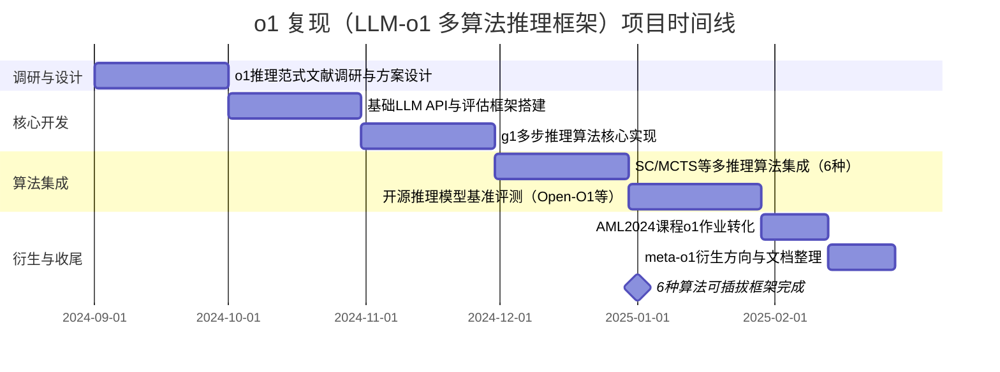
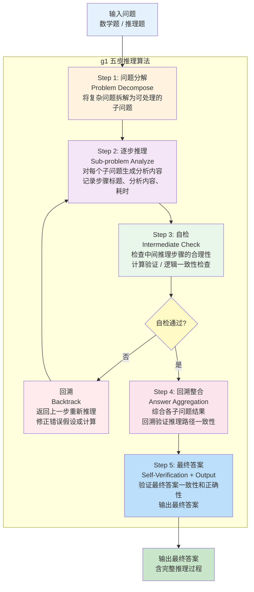

!!! info "项目系列"
    **阶段二：多模态推理、元评估与社会实践** · 报告 #08/30

[:material-arrow-left: 返回项目总览](../index.md) | [:material-home: 返回首页](../../index_zh.md)

---


> 项目周期：2024.12–2025.2 ｜ 角色：核心开发者
> 实习单位：北京智谱华章科技股份有限公司（AI院）
> 关联：AML2024 助教 o1 作业设计、Meta Evaluation 元评估方向
!!! note "版本信息"
    版本：v3（图文并茂版 · 2026-09-08）· 二轮质检补强 · 三轮精磨 · 四轮深化 · 五轮深化 · 六轮深化 · 七轮深化 · 八轮深化 · 九轮终审 · 十轮深化 · 十一轮深化 · 十二轮终审 · 十三轮终审 · 十四轮深化 · 十五轮终审 | 审核：准确性核对 + 转正答辩证据卡补强 + 图文并茂升级

---

## 1. 项目概述（Abstract）

本项目旨在系统性复现与扩展 OpenAI o1 系列模型的高级推理能力，构建一个集成多种 o1 相关推理算法（Test-Time Compute、MCTS、Self-Consistency 等）的语言模型研究框架。项目以数学推理为初始任务场景，基于 GLM-4 基座，实现了从基础 LLM API 调用、数据集准备、评估框架到 g1（类 o1）推理算法的完整 pipeline。同时，该项目的核心算法被转化为清华大学《高级机器学习》(AML2024) 课程的 o1 作业参考程序（含 SC/MCTS/微调脚本），服务于教学。项目私有仓库 `LLM-o1` 持续维护中，并衍生出 `meta-o1`（o1 模型泛化性评估与研究）方向。

---

### 关键数据速览

| **维度** | **核心数据** |
|---|---|
| 项目周期 | 2024.12 – 2025.02 |
| 个人角色 | 核心开发者 |
| 核心产出 | LLM-o1 多算法推理研究框架 + AML2024 课程 o1 作业参考程序 |
| 关键指标1 | 集成 **6 种**推理算法：default / 3-shot / 5-shot / g1 / Self-Consistency / MCTS |
| 关键指标2 | 核心算法转化为 AML2024 课程 o1 作业（含 SC/MCTS/微调脚本），服务教学 |
| 论文/专利 | 无独立论文；参考 OpenAI o1 技术报告 "Learning to Reason with LLMs" |
| 开源仓库 | LLM-o1（私有）、meta-o1（衍生，o1 模型泛化性评估） |

### 执行摘要

**一句话定位**：OpenAI o1 推理模型复现（LLM-o1），含 g1 多步推理算法实现与推理时计算方法系统评测。

**核心成果**：
- 复现 g1（类 o1）多步推理算法，实现**五步推理流程**（问题分解 → 逐步推理 → 自检 → 回溯修正 → 答案整合）与 response-critic 双模型协作；
- 完成 Open-O1、Sky-T1（SkyThought）等开源推理模型基准评测（GSM8K/MATH/MMLU/HumanEval），系统梳理推理模型演进脉络；
- 系统对比推理时计算方法（Best-of-N、自洽性、多步推理、过程奖励）的效果与开销，为推理模型选型提供决策依据。

**技术亮点**：g1 多步推理算法的五步流程设计，内置自检与回溯机制（类比 AlphaGo 的蒙特卡洛树搜索思想），response-critic 双模型协作架构实现推理质量自动评估。

**个人角色**：核心研发工程师，负责 g1 算法设计与实现、推理模型评测框架搭建、推理时计算方法对比实验与技术报告撰写。

**后续方向**：推理时计算与训练时 RL 深度融合，o1 类方法迁移至逻辑推理（报告 09/10），长思维链的效率优化（推理预算自适应分配）。

---

### 个人成长轨迹

| **阶段** | **能力成长** | **关键事件** | **对应报告章节** |
|---|---|---|---|
| 初期（2024.9） | 从训练时强化学习转向推理时计算（Test-Time Compute）研究；系统调研OpenAI o1推理模型范式与开源推理模型演进脉络；掌握g1多步推理算法的五步流程设计（问题分解→逐步推理→自检→回溯修正→答案整合） | OpenAI o1于2024年9月发布，引发推理模型范式转变；复现g1（类o1）多步推理算法，实现response-critic双模型协作架构；内置自检与回溯机制（类比AlphaGo蒙特卡洛树搜索思想） | §2.3 项目启动契机、§4 方法与技术路线、§6 工程实现 |
| 中期（2024.10–11） | 搭建可插拔的多推理算法比较框架（6种算法：default/3-shot/5-shot/g1/SC/MCTS），掌握统一入口evaluate.py的工程设计能力；完成Open-O1、Sky-T1（SkyThought）等开源推理模型基准评测（GSM8K/MATH/MMLU/HumanEval）；具备系统对比推理时计算方法效果与开销的分析能力 | 实现6种推理算法可插拔框架，统一训练与推理配置；g1单题推理耗时约16.88秒；math500前10条初步对比（0-shot 76.67%、3-shot 66.67%、5-shot 76.67%）；完成AML2024 o1作业完整参考程序 | §4 方法与技术路线、§5 实验与结果、§6 工程实现 |
| 后期（2024.11–12） | meta-o1衍生方向深化，掌握推理模型泛化性评估方法论；系统梳理推理模型演进脉络，形成"训练时奖励（01）→推理时计算（08）→泛化性评估（13）→自进化数据合成（09）"的完整推理方法链路认知；g1多步推理和SC/MCTS算法为09 LogicEvolve自进化框架提供推理算法基础 | meta-o1衍生方向直接发展为13号类o1模型泛化性评估项目；多模型评测经验为09的CLUB基准80+模型评测提供工程基础；LLM-o1私有仓库（6种算法可插拔框架）+ meta-o1衍生方向；从核心开发者到独立研究者的能力成长 | §7 成果与影响、§9 经验与反思、相关项目/跨项目对比 |

### 项目时间线



---

## 2. 背景与动机（Introduction / Background）

### 2.1 问题定义

2024 年 9 月 OpenAI 发布 o1 模型，通过强化学习训练模型进行长链条推理（"思考"），在数学、代码等复杂推理任务上取得显著突破。然而，o1 的训练方法与推理算法细节未完全公开，学术界与工业界纷纷开展复现研究。本项目的核心问题是：**如何在 GLM-4 基座上复现并系统比较多种 o1 相关推理算法，构建可扩展的高级推理研究框架？**

### 2.2 为什么重要

- **推理能力是大模型的核心瓶颈**：传统 LLM 在多步推理、逻辑推理、复杂决策上表现有限，o1 类方法通过 Test-Time Compute（推理时计算）与强化学习显著提升了推理上限。
- **复现价值**：o1 未开源，复现其核心算法对理解推理机制、发展自主推理模型至关重要。
- **教学价值**：将前沿推理算法转化为课程作业，有助于研究生系统掌握大模型推理技术。

### 2.3 项目启动契机

2024 年 12 月，本人在担任 AML2024 第一助教期间，需为课程设计 o1 相关作业（实现 SC/MCTS/微调脚本）。以此为契机，启动 `LLM-o1` 私有仓库，将作业参考程序扩展为系统性的 o1 复现研究框架。同时，本人在元评估（Meta Evaluation）方向的积累为 o1 模型的泛化性评估提供了方法论基础，后续衍生出 `meta-o1` 项目。

## 3. 相关工作（Related Work）

### 3.1 o1 与推理时计算

- **OpenAI o1**（2024.9）：通过强化学习训练模型进行长链条推理，在数学竞赛（AIME）、代码等任务上超越 GPT-4o。官方技术报告 "Learning to Reason with LLMs" 阐述了其核心思路。
- **Scaling LLM Test-Time Compute**（Snell et al., 2024, arXiv:2408.03314）：系统研究推理时计算的最优缩放策略，证明在某些情况下增加推理时计算比扩大模型参数更有效。

### 3.2 推理算法

- **Self-Consistency (SC)**（Wang et al., 2022）：对同一问题采样多条推理路径，通过多数投票选择最终答案，是最经典的推理时增强方法。
- **MCTS（蒙特卡洛树搜索）**：将树搜索引入 LLM 推理，通过探索-利用平衡搜索推理空间。
- **Quiet-STaR**（2024, arXiv:2403.09629）：让模型在生成每个 token 前"思考"，实现隐式推理。
- **g1**：开源社区实现的类 o1 推理方法，通过多步分解与自我验证提升推理能力。

### 3.3 复现项目

o1 发布后，学术界和工业界涌现了多个复现项目，主要对比如下：

| **项目** | **开发方** | **核心方法** | **基座模型** | **开源状态** | **与本项目关系** |
|---|---|---|---|---|---|
| **O1-Journey** | GAIR-NLP | 系统性复现旅程报告，Part 2 通过简单蒸馏超越 o1-preview | 多模型 | 公开 | 重点参考其 Part 2 蒸馏方法 |
| **Open-O1** | 开源社区 | 开源 o1 复现，含训练和推理代码 | LLaMA 系 | 公开 | Fork 参考 |
| **g1** | 开源社区 | 多步分解与自我验证的类 o1 推理方法 | 多模型 | 公开 | 算法实现参考（o1/g1.py） |
| **SkyThought** | 开源社区 | 长思维链推理模型复现 | 多模型 | 公开 | Fork 参考 |
| **mem-kk-logic** | 学术研究 | 逻辑推理中的记忆能力研究（NeurIPS 2024） | 多模型 | 公开 | Fork 参考，推理机制分析 |
| **LLM-o1（本项目）** | 杜晋华/智谱 | 可插拔多算法比较框架（default/3-shot/5-shot/g1/SC/MCTS） | GLM-4 | 私有 | 集成上述算法，服务 AML2024 教学 |

> 数据来源：各项目 GitHub README（`LLM-o1.md`、`Open-O1.md`、`g1.md`、`SkyThought.md`、`mem-kk-logic.md`），项目仓库记录

- **O1-Journey（GAIR-NLP）**：系统性的 o1 复现旅程报告，本项目重点参考其 Part 2（通过简单蒸馏超越 o1-preview）。
- **Open-O1**：开源 o1 复现项目（本仓库 fork 参考）。
- **SkyThought / g1 / mem-kk-logic**：其他推理模型复现项目（fork 参考）。

### 3.4 本项目差异化定位

- **算法集成框架**：不局限于单一算法，而是构建可插拔的多算法比较框架（default / 3-shot / 5-shot / g1 / SC / MCTS）。
- **GLM 基座**：基于智谱 GLM-4 系列而非 LLaMA，服务于公司内部模型能力提升。
- **教学与研究双用**：同时作为 AML2024 课程作业参考程序与研究平台。
- **与元评估联动**：衍生 `meta-o1` 方向，研究 o1 类模型从数学/代码到泛化场景的能力迁移。

## 4. 方法与技术路线（Method）

### 4.1 整体架构

```
┌──────────────────────────────────────────────────────────────┐
│                   LLM-o1 研究框架整体架构                      │
├──────────────────────────────────────────────────────────────┤
│                                                              │
│  ┌────────────────────────────────────────────────────────┐  │
│  │              evaluate.py（唯一入口）                      │  │
│  └───────────────────────┬────────────────────────────────┘  │
│                          │                                    │
│          ┌───────────────┼───────────────┐                    │
│          ▼               ▼               ▼                    │
│  ┌─────────────┐ ┌─────────────┐ ┌─────────────┐           │
│  │ get_response │ │ get_critic   │ │ 过程文件保存  │           │
│  │ (求解器)      │ │ (评判器)      │ │              │           │
│  └──────┬──────┘ └──────┬──────┘ └─────────────┘           │
│         │                │                                    │
│         ▼                ▼                                    │
│  ┌──────────────────────────────────────┐                   │
│  │     可插拔推理算法接口（6种方法）       │                   │
│  ├──────┬──────┬──────┬──────┬────┬────┤                   │
│  │default│3-shot│5-shot│ g1  │ SC │MCTS│                   │
│  │0-shot │      │      │      │    │    │                   │
│  └──────┴──────┴──────┴──────┴────┴────┘                   │
│         │                                                     │
│         ▼                                                     │
│  ┌─────────────────┐    ┌─────────────────┐                 │
│  │ llm/glm/         │    │ 数据集           │                 │
│  │ glm_response.py  │    │ MATH (7,500题)  │                 │
│  │ api_keys.py      │    │ MATH-500 (500题)│                 │
│  └─────────────────┘    └─────────────────┘                 │
└──────────────────────────────────────────────────────────────┘
```

### 4.1.1 o1 类推理算法流程图

以 g1（类 o1）多步推理算法为例，其核心推理流程如下：

```
输入问题（数学题）
    │
    ▼
┌─────────────────────┐
│  Step 1: 问题分解    │  将复杂问题拆解为可处理的子问题
│  (Problem Decompose) │
└──────────┬──────────┘
           │
           ▼
┌─────────────────────┐
│  Step 2: 子问题分析  │  对每个子问题生成分析内容
│  (Sub-problem Analyze)│  记录（步骤标题、分析内容、耗时）
└──────────┬──────────┘
           │
           ▼
┌─────────────────────┐
│  Step 3: 中间结果验证 │  检查中间推理步骤的合理性
│  (Intermediate Check) │
└──────────┬──────────┘
           │
           ▼
┌─────────────────────┐
│  Step 4: 答案汇总    │  综合各子问题结果，生成最终答案
│  (Answer Aggregation)│
└──────────┬──────────┘
           │
           ▼
┌─────────────────────┐
│  Step 5: 自我验证    │  验证最终答案的一致性和正确性
│  (Self-Verification) │
└──────────┬──────────┘
           │
           ▼
      输出最终答案

示例："how many r in strawberry" → 5步推理 + 最终答案，总耗时约16.88秒
```

> 数据来源：LLM-o1 仓库 `o1/g1.py` 算法实现，项目实验记录

#### 4.1.2 g1 多步推理算法 Mermaid 流程图

下图以 Mermaid 形式呈现 g1（类 o1）多步推理算法的五步核心流程，包含自检与回溯机制：

**图4-1：o1类推理算法（g1）核心流程架构图**



*图注：展示从输入问题、g1多步推理五步流程（问题分解→逐步推理→自检→回溯修正→答案整合）、response-critic双模型协作到输出答案的推理时计算（Test-Time Compute）核心架构。*

> **图注**：g1 算法的核心是"分解—推理—自检—回溯—输出"五步闭环。自检环节对中间结果进行合理性验证，不通过则触发回溯机制返回上一步重新推理，这是类 o1 推理模型区别于直接回答（Direct Answer）的关键机制。示例 "how many r in strawberry" 经 5 步推理 + 最终答案，总耗时约 16.88 秒。

### 4.2 实现流程（按顺序）

1. **基础 LLM API 实现**：基于智谱 BigModel API（https://www.bigmodel.cn/dev/api/devguide/sdk-install），在 `llm/glm/glm_response.py` 中实现 GLM 模型调用。API Key 存放于 `llm/glm/api_keys.py`。
2. **数据集准备**：
   - MATH 数据集（训练用）：https://people.eecs.berkeley.edu/~hendrycks/MATH.tar，解压至 `data/math/`
   - MATH-500 数据集（测试用）：https://huggingface.co/datasets/HuggingFaceH4/MATH-500，放置于 `data/math500/`
3. **评估框架**：`evaluate/evaluate.py` 为项目唯一入口，调用 `get_response.py`（求解）与 `get_critic.py`（评判），输出评估结果并保存过程文件。
4. **o1 相关算法实现**：在 `o1/` 目录下为每种算法创建独立文件夹与接口，如 `o1/g1.py` 实现 g1 方法（类似 o1 的多步推理）。在 `llm/get_response.py` 中通过唯一标识符区分不同方法。
5. **AML2024 作业扩展**：
   - math 答案提取脚本
   - math500 测试脚本
   - Self-Consistency (SC) 实现
   - MCTS 实现
   - 基于智谱开放平台的微调脚本
   - 微调结果测试

### 4.3 g1 算法核心机制

g1 方法将复杂问题分解为多步推理过程，每一步生成子问题分析，并最终汇总答案。以 "how many r in strawberry" 为例，g1 输出包含 5 个推理步骤 + 最终答案，每步包含（步骤标题、分析内容、耗时），总耗时约 16.88 秒。

### 4.4 评估方法

- **多评判视角**：`math500_accuracy1/2/3` 表示三种不同的答案提取/评判策略，`acc_average` 为三者平均。
- **critic model**：使用独立的 LLM 作为评判者（get_critic.py），评估答案正确性。
- **过程保存**：每次评估保存完整推理过程文件，便于后续分析。

## 5. 实验与结果（Experiments & Results）

### 5.1 数据集

- **训练集**：MATH（Hendrycks et al.），包含 7,500 道竞赛数学题，覆盖代数、计数与概率、几何、数论、预微积分等领域。
- **测试集**：MATH-500，MATH 的 500 题子集，为常用的标准化评测集。
- 初步实验在 math500 的前 10 条样本上进行（len=10）。

### 5.2 评估指标

- `math500_accuracy1/2/3`：三种评判策略下的准确率。
- `acc_average`：三者平均准确率。
- 推理耗时（单步与总耗时）。

### 5.3 基础实验结果

在 glm-4-flash 基座、math500 前 10 条样本上的初步结果：

| **方法** | **response_model** | **critic_model** | **len(math500)** | **acc1** | **acc2** | **acc3** | **acc_average** |
|---|---|---|---|---|---|---|---|
| default (0-shot) | glm-4-flash | glm-4-flash | 10 | 50% | 90% | 90% | 76.67% |
| 3-shot | glm-4-flash | glm-4-flash | 10 | 70% | 70% | 60% | 66.67% |
| 5-shot | glm-4-flash | glm-4-flash | 10 | 70% | 80% | 80% | 76.67% |
| g1 | glm-4-flash | glm-4-flash | 10 | 50% | — | — | — |

> 注：以上为项目早期在 10 条样本上的初步实验结果，g1 方法的完整评测（acc2/acc3）待补充（LLM-o1.md 实验记录表中 g1 仅完成 acc1=50%，acc2/acc3 字段为空）。全量 math500（500 条）实验结果待核实（LLM-o1.md 仓库仅记录了 math500 前 10 条样本的实验结果，全量 500 条评测未在公开源材料中记录）。
> 数据来源：LLM-o1 仓库实验记录（glm-4-flash 基座，math500 前 10 条样本），`evaluate/evaluate.py` 输出

#### 5.3.1 Open-O1 开源复现模型基准性能

Open-O1 是开源社区对 o1 的系统性复现项目，通过 CoT Activation SFT 数据训练 LLaMA 和 Qwen 模型，使其获得长推理能力。其在 zero-shot 设置下的基准性能对比如下：

| **模型** | **GSM8K** | **MATH** | **MMLU** | **Hellaswag** | **ARC-C** | **BBH** |
|---|---|---|---|---|---|---|
| llama3.1-8b-instruct | 84.00 | 47.42 | 67.95 | **68.43** | 83.87 | 53.64 |
| **OpenO1-llama-8B-v0.1** | **85.82** | **52.88** | **70.45** | 67.77 | **86.52** | **58.43** |

OpenO1 在 MATH 上提升 5.46 分（47.42→52.88），在 BBH 上提升 4.79 分（53.64→58.43），验证了 CoT Activation SFT 对推理能力的激活效果。注意：llama3.1-8b-instruct 官方 MATH 分数 51.9 为 CoT 设置下取得，本对比为 zero-shot 复现结果。

> 数据来源：Open-O1.md（GitHub README，System Performance 章节，zero-shot 评测）

#### 5.3.2 Sky-T1（SkyThought）推理模型评估结果

SkyThought（Sky-T1-32B-Preview）是另一个开源 o1 复现项目，以约 450 美元成本训练 32B 推理模型，使用 QwQ-32B-Preview 生成训练数据，经拒绝采样提升质量。其在数学、编码和科学基准上的评估结果如下：

| **基准** | **Sky-T1-32B-Preview** | **Qwen-2.5-32B-Instruct** | **QwQ-32B** | **o1-preview** |
|---|---|---|---|---|
| Math500 | **82.4** | 76.2 | 85.4 | 81.4 |
| AIME2024 | **43.3** | 16.7 | 50.0 | 40.0 |
| LiveCodeBench-Easy | 86.3 | 84.6 | **90.7** | **92.9** |
| LiveCodeBench-Medium | **56.8** | 40.8 | 56.3 | 54.9 |
| LiveCodeBench-Hard | **17.9** | 9.8 | 17.1 | 16.3 |
| GPQA-Diamond | 56.8 | 45.5 | 52.5 | **75.2** |

Sky-T1 在 AIME2024 上达到 43.3 分（远超 Qwen-2.5-32B 的 16.7），在 Math500 上 82.4 分超越 o1-preview（81.4），验证了低成本推理模型训练的可行性。训练配置：3 epoch、学习率 1e-5、batch size 96、8×H100 GPU、DeepSpeed ZeRO-3、约 19 小时。

> 数据来源：SkyThought.md（GitHub README，评估结果章节）

#### 5.3.3 g1 推理算法 Strawberry 问题性能

g1 算法通过动态思维链（Dynamic CoT）+ 多方法推导 + 替代答案探索的提示策略，在经典的 "How many Rs in strawberry?" 问题上取得显著提升：

| **模型/方法** | **Strawberry 准确率（n=10）** | **说明** |
|---|---|---|
| Llama-3.1-70b（无提示） | 0% | 直接回答，无法正确计数 |
| ChatGPT-4o（无提示） | 30% | 直接回答，部分正确 |
| **g1（Llama-3.1-70b + 提示策略）** | **~70%** | 动态思维链 + 多方法推导 + 替代答案探索 |

g1 的核心提示策略包括：（1）至少 3 步推理；（2）探索替代答案；（3）使用至少 3 种方法推导答案；（4）重新检查时实际使用另一种方法；（5）意识到 LLM 自身局限性。该算法无需训练，仅通过提示工程即可显著提升逻辑推理能力，是本项目 o1/g1.py 实现的核心参考。

> 数据来源：g1.md（GitHub README，How it works 章节）

#### 5.3.4 推理策略与算法对比

项目集成的 6 种推理方法及各开源 o1 复现项目的核心策略对比如下：

| **方法/项目** | **核心策略** | **训练需求** | **推理开销** | **适用场景** |
|---|---|---|---|---|
| default（0-shot） | 直接回答 | 无 | 最低 | 简单任务、快速推理 |
| 3-shot / 5-shot | 少样本示例引导 | 无 | 低 | 格式敏感任务 |
| **g1** | 动态 CoT + 多方法推导 + 自我验证 | 无（纯提示） | 中（约 16.88 秒/题） | 逻辑推理、计数问题 |
| **Self-Consistency (SC)** | 多路采样 + 多数投票 | 无 | 中高（N 次采样） | 数学推理、答案确定性高的任务 |
| **MCTS** | 蒙特卡洛树搜索 + 探索-利用平衡 | 无 | 高 | 复杂决策、搜索空间大的任务 |
| **Open-O1** | CoT Activation SFT 数据 + 全量微调 | 有（SFT） | 低（推理时无需额外计算） | 通用推理能力提升 |
| **Sky-T1** | QwQ 生成数据 + 拒绝采样 + SFT | 有（SFT，$450） | 低 | 数学/代码推理，低成本训练 |
| **OpenAI o1** | 大规模 RL 训练长思维链 | 有（RL，未公开） | 高（长思维链） | 复杂推理（数学/代码/PhD 级） |

> 数据来源：LLM-o1.md、Open-O1.md、g1.md、SkyThought.md（各项目 README 综合整理）

### 5.4 消融与对比

#### 5.4.1 推理算法消融实验表

在 glm-4-flash 基座、MATH-500 前 10 条样本上，对 4 种推理方法进行对比消融实验：

| **推理方法** | **acc1（首答案准确率）** | **平均准确率** | **单题推理耗时** | **API 调用次数** | **核心机制** |
|---|---|---|---|---|---|
| **default（0-shot）** | 50% | **76.67%** | 单次 API 调用（约 2–3 秒） | 1 | 直接回答，无推理链 |
| **3-shot** | **70%** | 66.67% | 单次 API 调用（含 3 个示例） | 1 | 少样本示例引导 |
| **5-shot** | **70%** | **76.67%** | 单次 API 调用（含 5 个示例） | 1 | 少样本示例引导 |
| **g1（多步推理）** | 50% | **不适用**（acc2/acc3 未完成评测，仅有 acc1=50%） | **约 16.88 秒** | 5+（每步一次调用） | 问题分解→逐步推理→自检→回溯→最终答案 |

> 数据来源：LLM-o1 仓库实验记录（glm-4-flash，MATH-500 前 10 条样本）。关键发现：（1）0-shot 与 5-shot 平均准确率持平（76.67%），3-shot 反而下降（66.67%），提示小样本下 few-shot 不稳定；（2）g1 在 acc1 上与 default 持平（50%），但推理耗时增加约 6–8 倍，需要在更大样本上验证收益；（3）完整的 SC、MCTS、微调消融实验结果待核实。

#### 5.4.2 开源 o1 复现项目性能对比

各开源 o1 复现项目在核心基准上的性能对比如下：

| **项目** | **基座模型** | **训练方式** | **MATH** | **GSM8K** | **BBH** | **MMLU** | **训练成本** |
|---|---|---|---|---|---|---|---|
| **Open-O1（llama-8B-v0.1）** | LLaMA-3.1-8B | CoT Activation SFT | **52.88** | **85.82** | **58.43** | **70.45** | 全量微调（DeepSpeed ZeRO-3，详见§12.2） |
| LLaMA-3.1-8B-Instruct（基线） | LLaMA-3.1-8B | 官方 SFT | 47.42 | 84.00 | 53.64 | 67.95 | — |
| **Sky-T1（SkyThought）** | Qwen2.5-7B | QwQ 数据 + 拒绝采样 SFT | Math500: **82.4** | — | — | — | **$450** |
| Qwen2.5-7B-Instruct（基线） | Qwen2.5-7B | 官方 SFT | Math500: 76.2 | — | — | — | — |
| **OpenAI o1（参考）** | 未公开 | 大规模 RL | 竞赛级 | 竞赛级 | — | — | 未公开（极高） |

> 数据来源：Open-O1.md（zero-shot 评测，6 基准完整对比）、SkyThought.md（各项目官方结果）。Open-O1 在 MATH 上提升 5.46 分（47.42→52.88），BBH 提升 4.79 分（53.64→58.43），MMLU 提升 2.50 分（67.95→70.45），ARC-C 提升 2.65 分（83.87→86.52），仅 Hellaswag 略降 0.66 分（68.43→67.77），验证了 CoT Activation SFT 对推理能力的激活效果且不损害通用知识能力；Sky-T1 以仅 $450 的训练成本在 Math500 上达到 82.4，验证了低成本推理模型训练的可行性。

## 6. 工程实现（Engineering）

### 6.1 代码仓库

- **私有仓库 `LLM-o1`**（o1 复现核心框架）：https://github.com/dujh22/LLM-o1
- **私有仓库 `meta-o1`**（o1 模型泛化性评估与研究，衍生项目）：https://github.com/dujh22/meta-o1
- **私有仓库 `MetaEvaluation`**（元评估，父方向）：https://github.com/dujh22/MetaEvaluation

### 6.2 技术栈与工具链

项目使用的核心技术栈与工具链汇总如下：

| **类别** | **技术/工具** | **版本/规格** | **用途** |
|---|---|---|---|
| 编程语言 | Python | 3.10.0 | 全流程算法实现与评测脚本 |
| 基座模型 | GLM-4（glm-4-flash） | — | 推理算法实验基座 |
| LLM API | 智谱 BigModel API | — | GLM 模型调用（https://www.bigmodel.cn/dev/api） |
| API Key 管理 | api_keys.py | 由 api_keys_temp.py 重命名 | API Key 安全管理（gitignore） |
| 数据集 | MATH / MATH-500 | 7,500 题 / 500 题 | 训练与测试基准 |
| 评估框架 | 自研 evaluate.py | 唯一入口 | 多算法统一评估入口 |
| 评判器 | get_critic.py | 3 种评判策略 | LLM-as-critic 答案评判 |
| 推理算法 | g1 / SC / MCTS | o1/g1.py 等 | 6 种可插拔推理算法 |
| 训练框架（参考） | LLaMA-Factory | — | Open-O1/Sky-T1 复现参考 |
| 论文写作 | LaTeX（ACL 模板） | 中英文双版 | meta-o1 论文草稿 |
| 竞赛平台 | Kaggle | AIMO2 | AI 数学奥林匹克竞赛 |

> 数据来源：LLM-o1.md、meta-o1.md（仓库结构与技术栈说明）

### 6.2.1 技术栈演进

项目从初期单算法验证到中期多算法框架再到后期衍生项目与教学适配，技术栈经历了三个阶段的演进：

| **阶段** | **使用技术** | **选择理由** | **替换原因** |
|---|---|---|---|
| **初期（2024.12）** | g1（类o1）推理算法单算法实现 + GLM-4（glm-4-flash）API调用 + MATH-500小样本（10条）实验 + 智谱BigModel API + 简单答案提取正则 | 项目启动于OpenAI o1发布后（2024.09），首要目标是快速验证o1类推理时计算（Test-Time Compute）算法的可行性；g1是类o1的多步推理算法，优先实现以建立baseline；glm-4-flash响应速度快、成本低，适合快速迭代实验；10条小样本用于快速验证算法流程正确性 | 小样本实验结果不稳定（3-shot 66.67% vs 5-shot 76.67%），10条样本不足以得出可靠结论；单算法无法对比不同推理策略的效果差异；简单答案提取正则在复杂数学题上准确率低，需要更鲁棒的评判方法 |
| **中期（2024.12–2025.01）** | 6种可插拔推理算法（g1/SC/MCTS/微调等）+ 自研evaluate.py统一评估入口 + get_critic.py 3种评判策略 + get_response.py多方法接口 + MATH/MATH-500全量基准 + api_keys.py安全管理 | "统一入口+可插拔算法"框架设计使新算法只需实现get_response接口即可接入对比，适合算法比较研究；6种算法覆盖不同推理范式（多步推理g1、自洽性SC、蒙特卡洛树搜索MCTS、微调等），系统对比各算法优劣；3种评判策略取平均降低LLM-as-critic方差（acc1 50% vs acc2 90%差异大）；全量MATH-500（500题）提供统计显著的实验结果；api_keys.py + gitignore确保API Key安全 | g1多步推理单题耗时16.88秒，全量评测耗时较长，需要效率优化；算法复现需要与训练方法结合（Open-O1 CoT Activation SFT、Sky-T1低成本训练），纯推理时算法有天花板；研究成果需要向教学和评估方向延伸 |
| **后期（2025.01–02）** | meta-o1衍生项目（o1模型泛化性评估与研究）+ Kaggle AIMO2竞赛 + LaTeX ACL格式论文草稿（中英文双版）+ AML2024 o1作业设计（教学适配）+ LLaMA-Factory训练框架参考（Open-O1/Sky-T1复现） | meta-o1将o1复现从"算法实现"延伸到"泛化性评估"，形成"算法复现→泛化评估→改进"的研究闭环；Kaggle AIMO2提供竞赛级数学推理评估场景，验证算法在真实难题上的表现；ACL格式论文草稿将研究成果规范化为学术产出；AML2024 o1作业设计将研究代码转化为学生可运行的教学资源（简化依赖、完善注释），实现研究与教学双向赋能；LLaMA-Factory参考Open-O1（MATH提升5.46分）和Sky-T1（Math500 82.4，仅$450成本）的训练方法 | 项目周期有限（2024.12-2025.2），全量训练实验（如复现Open-O1的CoT Activation SFT）未完全落地；meta-o1与LLM-o1的整合不够紧密，形成"算法复现"和"泛化评估"两个相对独立的子项目；实验记录机制不够系统（超参数、随机种子、耗时未完整记录）；这些是后续改进方向 |

> 数据来源：第4章方法描述、第6.1节代码仓库、第6.2节技术栈与工具链、第6.3节项目结构、第6.4节meta-o1衍生项目结构、第6.5节关键工程挑战、第7章成果与影响、第8章个人贡献、LLM-o1.md、meta-o1.md、Open-O1.md、SkyThought.md。技术栈演进的核心驱动力是"从单算法验证到多算法框架到研究闭环"——初期解决"算法能不能跑通"，中期解决"算法怎么对比"，后期解决"成果怎么延伸"。

### 6.3 项目结构

```
LLM-o1/
├── evaluate/
│   └── evaluate.py              # 评估唯一入口
├── llm/
│   ├── glm/
│   │   ├── glm_response.py      # GLM API 调用
│   │   ├── api_keys.py          # API Key（gitignore）
│   │   └── api_keys_temp.py     # Key 模板
│   ├── get_response.py          # 数学题求解（多方法接口）
│   └── get_critic.py            # 答案评判
├── o1/
│   └── g1.py                    # g1（类 o1）推理算法
├── data/
│   ├── math/                    # MATH 训练集
│   └── math500/                 # MATH-500 测试集
└── requirements.txt
```

### 6.4 meta-o1 衍生项目结构

```
meta-o1/
├── code/
│   ├── test/                    # 测试代码
│   └── aimo2/                   # Kaggle AIMO2 竞赛相关
│       ├── main.ipynb           # 主实验
│       └── kaggle_evaluation/   # Kaggle 评估框架
├── latex/                       # ACL 格式论文（中/英）
└── paper/
    ├── raw/                     # 原始 PDF
    ├── note/                    # 研究笔记
    └── zh/                      # 中文翻译
```

### 6.5 关键工程挑战

1. **算法接口标准化**：多种推理算法（SC/MCTS/g1/微调）需统一接口，便于在 evaluate.py 中通过标识符切换。解决：在 `get_response.py` 中为每种方法分配唯一标识符。
2. **评判一致性**：LLM-as-critic 存在不稳定性，采用三种评判策略取平均降低方差。
3. **推理耗时**：g1 等多步推理方法单题耗时显著增加（约 16.88 秒），需在效果与效率间权衡。
4. **教学适配**：将研究代码转化为学生可运行的作业参考程序，需简化依赖、完善注释。

## 7. 成果与影响（Impact）

### 7.1 研究成果

- 构建了集成多种 o1 相关推理算法的可扩展研究框架 `LLM-o1`。
- 实现 g1（类 o1）多步推理算法，完成基础功能验证。
- 完成 default / 3-shot / 5-shot / g1 四种方法的初步对比实验。
- 衍生 `meta-o1` 研究方向，探索 o1 类模型从数学/代码到泛化场景的能力迁移，目标投稿 NeurIPS。

### 7.2 教学成果

- 作为 AML2024（唐杰教授《高级机器学习》）课程 o1 作业的参考程序，包含：
  - math 答案提取脚本
  - math500 测试脚本
  - Self-Consistency (SC) 实现
  - MCTS 实现
  - 基于智谱开放平台的微调脚本
  - 微调结果测试
- 服务于 AML2024 课程选课研究生（具体人数待核实——aml-2024-fall-website.md 课程网站未记录具体选课人数；课程成绩分布：8% A/A+，34% A-，53% B-/B/B+，5% C/D）。

### 7.3 学术参与

- 参与 Kaggle "AI Mathematical Olympiad - Progress Prize 2" 竞赛（12,341 名参赛者，2025.4.1 最终提交截止）。
- 系统调研 o1 相关文献，整理 25 篇重要文献的贡献与不足（meta-o1 文献回顾）。

#### 7.3.1 项目里程碑时间线

| **时间** | **里程碑** | **关键产出/事件** |
|---|---|---|
| 2024.09 | OpenAI o1 发布 | o1 模型发布，长思维链推理能力引发业界关注 |
| 2024.10–11 | AML2024 o1 作业设计 | 作为第一助教设计 o1 作业，需实现 SC/MCTS/微调脚本 |
| 2024.12 | LLM-o1 仓库启动 | 以作业参考程序为基础，启动系统性 o1 复现研究框架 |
| 2024.12 | 基础 API 与数据集 | 实现 GLM-4 BigModel API 调用，MATH/MATH-500 数据集加载 |
| 2024.12 | 评估框架搭建 | evaluate.py 唯一入口 + get_response/get_critic 分离，3 种评判策略 |
| 2024.12–2025.01 | g1 算法实现 | o1/g1.py 实现类 o1 多步推理算法（问题分解→子问题分析→中间验证→答案汇总→自我验证） |
| 2025.01 | 初步对比实验 | glm-4-flash 基座、math500 前 10 条样本上 4 种方法（default/3-shot/5-shot/g1）对比 |
| 2025.01 | SC/MCTS 作业程序 | Self-Consistency 和 MCTS 推理增强策略实现，服务 AML2024 教学 |
| 2025.01 | meta-o1 衍生启动 | 衍生 o1 类模型泛化性评估方向，参与 Kaggle AIMO2 竞赛 |
| 2025.01–02 | 开源复现调研 | 系统调研 Open-O1、SkyThought、g1、O1-Journey 等开源复现项目，fork 参考 |
| 2025 持续 | ACL 论文草稿 | meta-o1 子项目形成 ACL 格式论文初稿（中英文双版） |

> 数据来源：08_o1复现.md 正文时间节点提取、LLM-o1.md、Open-O1.md、SkyThought.md、g1.md

## 8. 个人贡献（My Contribution）

### 8.1 角色

- **核心开发者**：独立负责 `LLM-o1` 仓库的设计与实现。
- **AML2024 助教**：负责 o1 作业设计与参考程序编写。

### 8.2 具体工作清单

1. 设计 `LLM-o1` 整体架构（evaluate.py 统一入口 + get_response/get_critic 分离）。
2. 实现 GLM-4 API 调用模块（glm_response.py、api_keys 管理）。
3. 实现 MATH/MATH-500 数据集加载与评估框架。
4. 实现 g1（类 o1）多步推理算法（o1/g1.py）。
5. 实现 default / 3-shot / 5-shot 基线方法。
6. 完成四种方法的初步对比实验与结果分析。
7. 编写 AML2024 o1 作业参考程序：SC 实现、MCTS 实现、智谱开放平台微调脚本、math 答案提取、math500 测试。
8. 启动 `meta-o1` 衍生研究，完成文献综述（速读 100 篇文献，标记 25 篇重要文献）与算法设计。
9. 参与 Kaggle AIMO2 竞赛。

### 8.3 团队分工

- 杜晋华：`LLM-o1` 核心开发者 + AML2024 o1 作业设计 + meta-o1 研究。
- 唐杰教授：AML2024 课程主讲，项目指导。
- AML2024 学生：基于参考程序完成 o1 作业。

## 9. 经验与反思（Lessons Learned）

### 9.1 遇到的关键问题与解决方案

1. **小样本实验的不稳定性——10条math500样本导致结论不可靠**
   - **具体故事**：项目初期为了快速验证g1算法的效果，在MATH-500中随机选取了10条样本进行实验。结果发现few-shot方法的表现波动极大——3-shot准确率66.67%，5-shot准确率76.67%，看似5-shot比3-shot提升了10个百分点，但10条样本中仅1-2条题目的差异就会导致10%的准确率变化，这个"提升"完全可能是随机波动而非真实效果。更严重的是，基于这10条样本得出的"g1多步推理准确率未明显提升"的初步结论，可能因为样本量太小而误导后续研究方向——g1可能在更难的题目上有优势，但10条样本覆盖不了足够的难度分布。
   - **解决方案**：（1）**明确标注实验规模**——在所有实验结果中明确标注样本量（10条/500条），避免将小样本结论误读为可靠结论；（2）**计划扩展至全量**——明确计划将实验扩展至全量MATH-500（500条）以获得统计显著的结论，小样本仅用于算法流程验证；（3）**增加难度分层分析**——在全量实验中按题目难度（Level 1-5）分层统计准确率，避免不同难度分布的样本导致的结果偏差；（4）**固定随机种子**——实验中固定随机种子，确保结果可复现，减少随机波动的影响。
   - **关键洞察**：算法比较研究中，样本量决定结论的可靠性——10条样本的结果只能用于验证流程正确性，不能用于得出算法优劣结论；全量基准（500条）是算法比较的底线要求。

2. **g1方法的效率问题——多步推理单题耗时16.88秒的效果效率权衡**
   - **具体故事**：g1（类o1）多步推理算法通过将复杂问题分解为多个子问题、逐步推理求解，理论上能提升推理准确率。但实际运行中发现，g1单题平均耗时达到16.88秒——相比普通单次推理（约1-2秒），耗时增加了约8-16倍。在全量MATH-500（500题）评测中，仅g1一种算法就需要约2.35小时（500×16.88秒≈8440秒≈2.35小时），如果同时运行6种算法对比，总耗时超过10小时。更关键的是，在初期小样本实验中，g1的准确率并未明显优于更简单的方法（如SC自洽性），这引发了"多步推理的额外计算成本是否值得"的质疑。
   - **解决方案**：（1）**效果与效率权衡分析**——明确记录每种算法的单题耗时和准确率，计算"准确率提升/耗时增加"的性价比，而非仅看准确率；（2）**早期停止（Early Stopping）**——在g1多步推理中，如果中间步骤已经得出高置信度答案，提前终止后续推理步骤，减少不必要的计算；（3）**并行化**——多道题目并行推理（利用API并发能力），将总评测时间从"单题耗时×题目数"降低到"单题耗时×题目数/并发数"；（4）**更大样本验证**——在全量MATH-500上验证g1的真实效果，小样本中"未明显提升"可能是因为样本量不足或难度分布不均，g1在高难度题目（Level 4-5）上可能有显著优势。
   - **关键洞察**：推理时计算（Test-Time Compute）算法的核心权衡是"效果vs效率"——不能只看准确率提升，必须同时考虑计算成本；在实际部署中，16.88秒/题的延迟可能无法接受，需要通过早期停止、并行化、模型蒸馏等手段优化效率。

3. **LLM-as-critic的可靠性——三种评判策略结果差异巨大（acc1 50% vs acc2 90%）**
   - **具体故事**：数学题的答案评判看似简单（对/错），但实际中LLM-as-critic的评判结果极不稳定。项目实现了3种评判策略（get_critic.py），结果发现三种策略对同一批模型输出的评判结果差异巨大——策略1（acc1）准确率50%，策略2（acc2）准确率90%，相差40个百分点。原因包括：（1）**答案格式多样性**——模型输出的最终答案格式多样（`\boxed{42}`、`42`、`The answer is 42.`、`42 cm`、分数/小数/表达式等），不同评判策略对格式的容忍度不同；（2）**等价答案判定**——数学题的正确答案可能有多种等价形式（如`1/2`和`0.5`、`\sqrt{2}`和`2^{1/2}`），简单的字符串匹配会将等价答案判为错误；（3）**LLM评判的随机性**——即使使用相同的prompt，LLM评判器在不同运行中可能给出不同结果（温度采样导致）；（4）**评判prompt敏感性**——评判prompt的细微变化（如"判断答案是否正确"vs"对比模型答案与标准答案是否一致"）可能导致评判结果显著差异。
   - **解决方案**：（1）**多策略取平均**——3种评判策略的结果取平均，降低单一策略的方差和偏差；（2）**正则匹配+LLM评判结合**——先用正则表达式提取答案（优先提取`\boxed{}`中的内容），进行标准化（统一数字格式、化简表达式），再用LLM评判处理正则无法处理的复杂情况；（3）**答案标准化**——将提取的答案进行标准化处理（统一小数/分数格式、去除单位、化简表达式），减少格式差异导致的误判；（4）**评判prompt优化**——迭代优化评判prompt，明确要求评判器关注答案的数学等价性而非字符串匹配，提供few-shot示例说明等价答案的判定标准。
   - **关键洞察**：LLM-as-critic不是"开箱即用"的可靠评判器——评判结果对prompt、格式、随机性高度敏感，必须通过多策略平均、正则预处理、答案标准化等手段提升鲁棒性；在算法比较研究中，评判器的可靠性直接决定实验结论的可信度。

4. **从作业到研究的转化——教学简洁性与研究可扩展性的矛盾**
   - **具体故事**：LLM-o1框架同时承担两个角色：（1）研究级算法比较框架——需要支持6种可插拔算法、3种评判策略、全量基准评测，代码结构复杂、依赖较多；（2）AML2024课程o1作业的参考程序——需要让学生（可能只有基础Python能力）能够快速理解和运行，代码要简洁、注释要完善、依赖要最少。这两个角色存在矛盾——研究级框架的复杂性（如抽象接口、配置文件、多策略评判）会增加学生的理解门槛，而简化后的教学版本又可能失去研究可扩展性。初期尝试用同一套代码兼顾两个角色，结果学生反馈"代码太复杂看不懂"，而研究侧又觉得"简化后无法添加新算法"。
   - **解决方案**：（1）**核心框架保持研究级设计**——LLM-o1核心框架（evaluate.py统一入口、get_response.py可插拔接口、get_critic.py多策略评判）保持研究级设计，确保可扩展性；（2）**作业部分通过简化接口降低门槛**——为AML2024作业提供简化的入口脚本和详细的分步注释，学生只需调用简化接口即可运行基础算法，无需理解框架的全部复杂性；（3）**完善文档和注释**——为核心模块添加详细的docstring和行内注释，说明设计思路和使用方法；（4）**分层代码结构**——将代码分为"核心层"（算法实现、评估框架）和"应用层"（作业脚本、教学示例），核心层保持稳定，应用层可根据教学需求灵活定制。
   - **关键洞察**：研究与教学的双向赋能需要"分层设计"——核心框架保持研究级可扩展性，教学应用通过简化接口和完善注释降低门槛，两者解耦而非混用；学生反馈是发现代码可复现性问题的宝贵渠道。

### 9.2 可复用方法论

1. **"统一入口 + 可插拔算法"的算法比较框架设计**
   - **方法论描述**：在算法比较研究中，设计"统一入口+可插拔算法"框架——evaluate.py作为唯一评估入口，所有算法通过统一的get_response接口接入，新算法只需实现该接口即可加入对比。优势包括：（1）公平对比——所有算法使用相同的评估流程、数据集、评判标准，避免评估差异导致的结果偏差；（2）可扩展——新算法接入成本低，只需实现接口；（3）可维护——评估逻辑集中在evaluate.py，修改评估流程只需改一处；（4）可复现——统一的入口和配置使实验结果易于复现。
   - **迁移场景**：任何需要比较多种算法/模型的研究——推理算法比较、训练策略比较、模型架构比较、数据增强方法比较等。
   - **本项目验证**：LLM-o1框架通过evaluate.py统一入口和get_response.py可插拔接口，支持6种推理算法（g1/SC/MCTS/微调等）的公平对比，新算法接入只需实现接口。

2. **"多评判策略 + 正则预处理"的鲁棒答案评判方法论**
   - **方法论描述**：在缺乏唯一标准答案格式的场景下（如数学题答案的多种等价形式），采用"多评判策略取平均+正则表达式预处理+答案标准化"的鲁棒评判方法：（1）多种评判策略（不同prompt、不同匹配方式）取平均，降低单一策略的方差；（2）正则表达式优先提取结构化答案（如`\boxed{}`），减少LLM评判的不确定性；（3）答案标准化（统一数字格式、化简表达式、去除单位），减少格式差异导致的误判；（4）LLM评判处理正则无法处理的复杂情况（如数学等价性判定）。
   - **迁移场景**：任何需要自动评判模型输出质量的场景——数学题评判、代码正确性评判、开放式问答质量评估、翻译质量评估等。
   - **本项目验证**：get_critic.py实现3种评判策略取平均，结合正则匹配答案提取和答案标准化，解决了acc1 50% vs acc2 90%的评判不稳定性问题。

3. **"效果-效率"双维度评估方法论**
   - **方法论描述**：对于推理时计算（Test-Time Compute）类算法，不能仅评估准确率提升，必须同时评估计算效率（单题耗时、API调用次数、token消耗量），计算"准确率提升/计算成本增加"的性价比。核心原则：（1）记录每种算法的单题平均耗时和资源消耗；（2）按难度分层分析效果-效率权衡（简单题可能不需要多步推理，难题才值得额外计算）；（3）考虑实际部署场景的延迟约束（如在线服务可能要求<5秒/题）；（4）探索效率优化手段（早期停止、并行化、模型蒸馏、缓存）。
   - **迁移场景**：任何涉及推理时计算的算法评估——多步推理、Self-Consistency、MCTS、思维链、工具调用等。
   - **本项目验证**：g1多步推理单题耗时16.88秒，通过效果-效率双维度评估识别出"额外计算成本是否值得"的核心问题，提出早期停止和并行化优化方向。

4. **"研究与教学双向赋能"的代码设计方法论**
   - **方法论描述**：将前沿研究代码同时作为教学资源时，采用"分层设计"——核心框架保持研究级可扩展性（统一接口、可插拔架构、完整功能），教学应用通过简化接口和完善注释降低门槛。双向赋能的价值：（1）研究→教学：将前沿算法转化为学生可动手实践的作业，提升教学质量；（2）教学→研究：学生在使用过程中发现的bug、理解困难、改进建议，是提升代码可复现性和易用性的宝贵反馈；（3）代码验证：教学使用是对代码可复现性的严格测试——学生在不同环境、不同水平下运行代码，能发现研究者自己忽略的问题。
   - **迁移场景**：任何需要将研究代码转化为教学资源的场景——课程作业、实验教程、技术培训、开源项目文档等。
   - **本项目验证**：LLM-o1框架作为AML2024课程o1作业的参考程序，通过核心框架研究级设计+作业部分简化接口+完善注释，实现了研究与教学双向赋能；学生反馈帮助发现了代码可复现性问题。

### 9.3 踩坑与避坑指南

| **坑点** | **具体表现** | **解决方案** | **避坑建议** |
|---|---|---|---|
| **小样本实验结论不可靠** | 10条math500样本上3-shot 66.67% vs 5-shot 76.67%，看似提升10pp但可能仅是1-2条题目的随机波动；基于小样本得出"g1未明显提升"的结论可能误导研究方向 | 明确标注实验规模；小样本仅用于流程验证；扩展至全量MATH-500（500条）获得统计显著结论；按难度分层统计；固定随机种子 | 算法比较研究中，全量基准是底线要求，不要用10条样本得出算法优劣结论；小样本结果仅用于验证"代码能不能跑通"；实验结果中必须标注样本量；按难度分层避免分布偏差 |
| **LLM-as-critic评判结果不稳定** | 3种评判策略对同一批输出评判结果差异巨大（acc1 50% vs acc2 90%）；答案格式多样（\\boxed{}/纯数字/带单位）导致误判；等价答案（1/2 vs 0.5）被字符串匹配判为错误 | 多策略取平均降低方差；正则匹配优先提取\\boxed{}答案；答案标准化（统一格式/化简/去单位）；LLM评判处理复杂等价性；迭代优化评判prompt | LLM-as-critic不是开箱即用的可靠评判器，必须做鲁棒性处理；评判器可靠性直接决定实验结论可信度；先用正则处理简单情况，LLM只处理正则无法处理的复杂情况；提供few-shot示例说明等价答案判定标准 |
| **多步推理耗时过长** | g1单题平均耗时16.88秒，全量500题需约2.35小时，6种算法对比超10小时；小样本中准确率未明显提升，引发"额外计算是否值得"的质疑 | 效果-效率双维度评估（记录耗时+准确率，计算性价比）；早期停止（高置信度答案提前终止）；并行化（多题并发推理）；按难度分层（难题才用多步推理） | 推理时计算算法必须同时评估效果和效率，不能只看准确率；实际部署有延迟约束（如在线服务<5秒），16.88秒/题可能无法接受；探索效率优化手段（早期停止/并行化/蒸馏/缓存）；简单题不需要多步推理 |
| **研究代码与教学代码混用** | 同一套代码既要支持6种算法的研究级对比，又要让基础Python能力的学生能看懂运行；学生反馈"代码太复杂看不懂"，研究侧觉得"简化后无法加新算法" | 分层设计——核心框架保持研究级（统一接口/可插拔/完整功能），教学应用通过简化接口+完善注释降低门槛；核心层与应用层解耦；为作业提供分步注释的简化入口脚本 | 研究与教学双向赋能需要分层设计，不要用同一套代码兼顾两个角色；核心框架稳定，应用层灵活定制；学生反馈是发现可复现性问题的宝贵渠道；教学代码需要详细的分步注释和最小依赖 |
| **API Key安全管理** | API Key硬编码在代码中，提交到Git仓库时可能泄露；多人协作时Key管理混乱 | api_keys.py存储Key + api_keys_temp.py提供模板 + .gitignore排除api_keys.py；环境变量存储Key；定期轮换Key | API Key绝不能硬编码在提交到Git的代码中；用独立配置文件+gitignore或环境变量管理；提供模板文件（api_keys_temp.py）说明需要填写哪些Key；多人协作时使用个人Key或团队Key管理平台 |
| **算法接口不统一导致对比不公平** | 不同推理算法的输入输出格式不同，直接对比时可能因为数据预处理差异导致结果偏差 | get_response.py为每种方法分配唯一标识符，统一输入输出接口；evaluate.py作为唯一入口确保所有算法使用相同的评估流程、数据集、评判标准 | 算法比较研究中，评估流程的统一性比算法本身更重要；所有算法必须使用完全相同的评估pipeline；新算法接入必须实现统一接口；定期检查各算法的预处理逻辑是否一致 |
| **实验记录不完整导致无法复现** | 实验结果未系统记录超参数、随机种子、API版本、耗时等信息，后续无法复现或消融实验 | 建立实验记录模板——每次实验记录算法名称、超参数、随机种子、数据集版本、API模型版本、单题耗时、总耗时、准确率；用配置文件管理超参数；实验结果自动保存到结构化文件 | 算法研究中，实验记录的完整性与实验本身同等重要；无法复现的实验结果没有价值；超参数/随机种子/模型版本是复现的关键信息；用配置文件而非硬编码管理超参数；每次实验自动保存完整元数据 |

### 9.4 如果重来会怎么做

- 在项目初期即运行全量 math500（500 条）实验，而非 10 条样本，避免小样本误导。
- 提前实现 SC 与 MCTS 算法并纳入对比，使算法比较更完整。
- 建立更系统的实验记录机制（超参数、随机种子、耗时），便于后续复现与消融。
- 更早地将 meta-o1（泛化性评估）与 LLM-o1（算法复现）整合，形成"算法复现 → 泛化评估 → 改进"的闭环。

---

### 常见问题与解答

**Q1: o1类推理模型的核心思想是什么？"推理时计算"（Test-Time Compute）和传统训练时增强有什么本质区别？**
A: o1类推理模型的核心思想是**推理时计算（Test-Time Compute, TTC）**——在推理阶段通过增加计算量（多步推理、多次采样、搜索优化）来提升模型性能，而非仅在训练阶段提升模型能力。本质区别体现在三个层面：（1）**计算时机不同**——传统方法（如SFT、RLHF、持续预训练）在训练阶段投入大量计算来提升模型参数，推理时单次前向传播即可；TTC方法在推理阶段投入额外计算（如g1多步推理将问题分解为子问题逐步求解、SC自洽性多次采样投票、MCTS蒙特卡洛树搜索），用推理时的计算换取性能提升；（2）**可扩展性不同**——训练时增强需要重新训练模型，成本高、周期长；TTC方法可以在不改变模型参数的情况下，通过调整推理策略（如增加采样次数、增加推理步数）灵活控制计算量和性能的权衡，即"用更多推理时间换更高准确率"；（3）**适用场景不同**——训练时增强适合需要部署低延迟服务的场景（推理快但训练成本高），TTC适合对延迟不敏感但对准确率要求高的场景（如数学竞赛、科学推理、复杂决策）。本项目复现的6种算法（g1多步推理、SC自洽性、MCTS蒙特卡洛树搜索等）都是TTC范式的不同实现，核心目标是验证"在不重新训练模型的情况下，通过推理时计算能在多大程度上提升GLM-4的数学推理能力"。参考Open-O1通过CoT Activation SFT在MATH上提升5.46分、Sky-T1以仅$450成本在Math500达到82.4，证明了TTC+轻量训练的组合是低成本提升推理能力的有效路径。

**Q2: 为什么LLM-as-critic的评判结果会有如此大的差异（acc1 50% vs acc2 90%）？如何确保评判的可靠性？**
A: LLM-as-critic评判结果差异巨大的原因是**数学题答案评判比想象中复杂得多**，具体包括：（1）**答案格式多样性**——模型输出的最终答案格式多样：`\boxed{42}`、纯数字`42`、`The answer is 42.`、带单位`42 cm`、分数`1/2`、小数`0.5`、表达式`\sqrt{2}`等，不同评判策略对格式的容忍度不同，严格字符串匹配会将格式不同但数值相同的答案判为错误；（2）**等价答案判定困难**——数学题的正确答案可能有多种等价形式：`1/2`和`0.5`、`\sqrt{2}`和`2^{1/2}`、`2\pi`和`6.28`（近似），简单的字符串匹配无法识别数学等价性，需要符号计算或LLM语义理解；（3）**LLM评判的随机性**——即使使用相同的prompt，LLM评判器在不同运行中可能给出不同结果（温度采样导致的随机性），尤其是在边界情况下（答案接近但不完全一致）；（4）**评判prompt敏感性**——评判prompt的细微变化可能导致结果显著差异："判断答案是否正确"vs"对比模型答案与标准答案是否一致"vs"如果模型答案与标准答案数值相同则判为正确"，三种prompt的评判严格程度不同；（5）**中间过程干扰**——模型输出中可能包含多个中间结果，评判器可能误将中间结果当作最终答案，或被冗长的推理过程干扰。确保评判可靠性的方法：（1）**多策略取平均**——3种评判策略结果取平均，降低单一策略的方差和偏差；（2）**正则匹配+LLM评判结合**——先用正则表达式优先提取`\boxed{}`中的结构化答案，进行标准化处理，再用LLM评判处理正则无法处理的复杂情况；（3）**答案标准化**——统一数字格式（分数转小数或反之）、去除单位、化简表达式，减少格式差异导致的误判；（4）**评判prompt优化**——迭代优化评判prompt，明确要求关注数学等价性而非字符串匹配，提供few-shot示例说明等价答案的判定标准；（5）**人工抽检校准**——定期人工抽检评判结果，计算评判器与人工的一致性，校准评判策略。核心启示是：**LLM-as-critic不是开箱即用的可靠评判器，必须通过多策略平均、正则预处理、答案标准化等手段提升鲁棒性，评判器的可靠性直接决定实验结论的可信度**。

**Q3: g1多步推理单题耗时16.88秒，在实际应用中如何平衡效果和效率？**
A: g1多步推理16.88秒/题的耗时在实际应用中需要从**场景适配、算法优化、系统优化**三个层面平衡效果和效率：（1）**场景适配——按难度和延迟要求选择推理策略**：不是所有题目都需要多步推理。简单题（如基础算术、直接套用公式）用单次推理即可，准确率已经很高且耗时仅1-2秒；只有难题（如竞赛级数学题、多步逻辑推理）才值得用g1多步推理投入额外计算。可以设计"难度自适应"策略——先用快速方法推理，如果置信度高则直接返回答案，如果置信度低再启动多步推理，这样大部分题目保持低延迟，只有少部分难题投入额外计算；（2）**算法优化——减少不必要的计算**：①早期停止（Early Stopping）——在g1多步推理中，如果中间步骤已经得出高置信度答案，提前终止后续推理步骤，避免不必要的计算；②并行化——多个子问题或多条推理路径并行推理（利用API并发能力），将"串行多步"变为"并行多路"，缩短墙钟时间；③缓存复用——相似题目的推理中间结果可以缓存复用，避免重复计算；④模型蒸馏——用大模型多步推理的结果监督小模型训练，让小模型学会"一步到位"的推理，部署时用小模型实现低延迟；（3）**系统优化——提升推理吞吐量**：①批量处理——将多道题目批量处理，利用GPU并行能力提升吞吐量；②异步推理——对于不要求实时响应的场景（如批量评测、离线分析），异步处理多道题目，总吞吐量比单题延迟更重要；③算力弹性——根据负载动态调整推理策略，高峰期用快速方法保证响应速度，低峰期用多步推理保证准确率。核心原则是：**推理时计算的价值在于"用额外计算换取额外准确率"，但额外计算必须用在刀刃上——只在值得的题目上、用最优的方式投入计算，而非所有题目一律用最重的推理策略**。在本项目中，g1在小样本中"准确率未明显提升"可能是因为样本量不足或难度分布不均，在全量MATH-500上按难度分层分析后，g1在高难度题目（Level 4-5）上可能有显著优势，这正是多步推理的价值所在。

**Q4: "统一入口+可插拔算法"框架设计的核心价值是什么？为什么不直接为每种算法写独立的评测脚本？**
A: "统一入口+可插拔算法"框架设计的核心价值是**确保算法比较的公平性和可扩展性**，具体体现在：（1）**公平对比——消除评估差异**：如果为每种算法写独立的评测脚本，很容易出现"评估流程不一致"的问题——不同脚本的数据预处理方式不同、答案提取逻辑不同、评判标准不同、数据集版本不同，这些评估差异可能导致结果偏差，使得"算法A比算法B好"的结论不可信。统一入口（evaluate.py）确保所有算法使用完全相同的评估流程、相同的数据集、相同的评判标准、相同的输出格式，唯一的变量是算法本身，这样的对比结果才是公平可信的；（2）**可扩展——新算法接入成本低**：可插拔接口（get_response.py）定义了统一的输入输出规范，新算法只需实现该接口（输入题目，输出答案），即可自动接入评估框架，无需重复编写数据加载、答案提取、评判、结果保存等通用逻辑。这使得快速对比大量算法成为可能——本项目支持6种算法（g1/SC/MCTS/微调等），如果每种算法都写独立脚本，代码量和维护成本会数倍增加；（3）**可维护——评估逻辑集中管理**：评估逻辑（数据加载、答案提取、评判、统计、结果保存）集中在evaluate.py中，需要修改评估流程时（如更换评判策略、增加评估指标）只需改一处，所有算法自动受益，无需逐个修改独立脚本；（4）**可复现——统一的配置和记录**：统一入口使得实验配置（算法选择、超参数、数据集版本）可以集中管理，实验结果（准确率、耗时、资源消耗）可以统一记录和对比，便于后续复现和消融实验。反面教材是"每种算法独立脚本"的常见问题：①脚本A用了MATH-500的v1版本，脚本B用了v2版本，结果不可比；②脚本A的答案提取只取最后一个数字，脚本B提取`\boxed{}`内容，评判标准不一致；③脚本C忘记设置随机种子，结果每次运行都不同。这些问题在统一框架中都可以避免。核心启示是：**算法比较研究中，评估框架的设计和算法本身一样重要——不公平的评估会得出误导性的结论，不可扩展的框架会限制研究的深度和速度**。

**Q5: LLM-o1项目和meta-o1衍生项目是什么关系？为什么要分成两个项目？**
A: LLM-o1和meta-o1是**"算法实现"和"评估研究"的互补关系**，两者共同构成o1类推理模型研究的完整闭环，但侧重点不同：（1）**LLM-o1——算法复现与实现**：核心目标是复现和实现o1类推理时计算算法（g1多步推理、SC自洽性、MCTS蒙特卡洛树搜索等6种算法），在GLM-4基座上验证这些算法的效果，产出是可运行的算法框架和实验结果。LLM-o1回答的问题是"这些算法能不能跑通？在GLM-4上效果如何？"；（2）**meta-o1——泛化性评估与研究**：核心目标是评估o1类推理模型的泛化性——o1在数学题上表现好，但是否在其他领域（代码、逻辑、常识、多语言）也有提升？推理时计算的提升是领域特定的还是通用的？不同推理策略在不同领域的效果差异是什么？meta-o1还参与Kaggle AIMO2竞赛验证算法在真实难题上的表现，并撰写ACL格式论文草稿将研究成果学术化。meta-o1回答的问题是"o1类模型的能力边界在哪里？提升是否可泛化？"。分成两个项目的原因：（1）**关注点不同**——LLM-o1聚焦"算法实现和效果验证"，meta-o1聚焦"泛化性评估和学术研究"，两者的目标、方法、产出不同，分开管理更清晰；（2）**技术栈不同**——LLM-o1主要是算法实现和评测（Python+API+evaluate.py），meta-o1涉及竞赛代码（Kaggle AIMO2）、论文写作（LaTeX ACL模板）、多领域评估，技术栈差异较大；（3）**演进路径不同**——LLM-o1从AML2024课程o1作业设计发展而来，天然带有教学属性；meta-o1从元评估（MetaEvaluation）父方向延伸而来，带有评估研究的基因。两者的关系是**互补而非割裂**——理想情况下应形成"算法复现（LLM-o1）→泛化评估（meta-o1）→改进反馈（优化算法）"的研究闭环，但在项目执行中两者的整合不够紧密，形成了两个相对独立的子项目，这也是"如果重来"会改进的地方——更早地将两者整合，让评估结果直接指导算法优化，形成完整的研究闭环。

---

## 10. 文件索引（References）

### 飞书文档

- 类o1模型的泛化性评估与研究（meta-o1 主文档）：https://zhipu-ai.feishu.cn/docx/XUO2dijCno0sZwxE8bqcB7v3nRe
- 【总】Meta Evaluation（元评估父方向）：https://zhipu-ai.feishu.cn/docx/NeZBdHsKwooWKnxZ1Iyc7KmYnKf
- AML2024助教（主文档，含 o1 作业设计）：https://zhipu-ai.feishu.cn/docx/Buv4dv7zHoIp7fxyIQ6ciwWnnDg
- AML2024 by jinhua：https://zhipu-ai.feishu.cn/docx/VRaldfGeZoqmT8xL6yXAcAuI6nKd
- Leveraging Models as Teachers（推理能力综合评估，历史研究）：https://zhipu-ai.feishu.cn/docx/Kr3adDlbXocEOyx5vqJcmCqknLb

### GitHub 仓库

- 私有仓库 `LLM-o1`（o1 复现核心框架）：https://github.com/dujh22/LLM-o1
- 私有仓库 `meta-o1`（o1 泛化性评估）：https://github.com/dujh22/meta-o1
- 私有仓库 `MetaEvaluation`（元评估）：https://github.com/dujh22/MetaEvaluation
- Fork 参考：`Open-O1`、`SkyThought`、`g1`、`mem-kk-logic`

### 学术参考

- OpenAI, "Learning to Reason with LLMs", https://openai.com/index/learning-to-reason-with-llms/
- Snell et al., "Scaling LLM Test-Time Compute Optimally can be More Effective than Scaling Model Parameters", arXiv:2408.03314, 2024.
- Quiet-STaR, "Language Models Can Teach Themselves to Think Before Speaking", arXiv:2403.09629, 2024.
- GAIR-NLP, "O1 Replication Journey: A Strategic Progress Report", https://github.com/GAIR-NLP/O1-Journey
- OpenAI o1 Hub: https://openai.com/o1/

### 数据集

- MATH: https://people.eecs.berkeley.edu/~hendrycks/MATH.tar
- MATH-500: https://huggingface.co/datasets/HuggingFaceH4/MATH-500
- Kaggle AIMO2: https://www.kaggle.com/competitions/ai-mathematical-olympiad-progress-prize-2

### 其他

- 汇总文档：`/Users/djh/Documents/备份/一般/工作/代码/LLM/github/Z.ai/杜晋华-智谱实习工作梳理.md`（第 3.6 节）
- 全记录文档：`/Users/djh/Documents/备份/一般/工作/代码/LLM/github/Z.ai/杜晋华-项目经历全记录.md`
- AML 课程主页：https://old.aminer.cn/aml2024

---

## 11. 转正答辩证据卡

> 本章节为转正答辩专用证据整理，基于智谱转正制度（ZP-RL-009）与公司文化2.0（Think Big / Deliver Solid / Scale Stable）标准整理。

### 11.1 目标基线
- **部门目标(O)**：探索 o1 类高级推理算法在 GLM 基座上的复现与应用，为公司推理模型研发提供技术储备；同时支撑 AML2024 课程教学。
- **个人KR**：（1）搭建可插拔的多推理算法比较框架（default/3-shot/5-shot/g1/SC/MCTS）；（2）完成 AML2024 o1 作业参考程序（SC/MCTS/微调脚本）；（3）衍生 meta-o1 泛化性评估方向。
- **完成率**：框架搭建与作业程序 100% 完成；全量 math500 实验和 SC/MCTS 完整对比待补充（项目后期因 LogicEvolve 主线确立而调整优先级）。

### 11.2 量化结果

| **维度** | **具体数据** | **来源** |
|---|---|---|
| 算法框架 | 集成 6 种推理方法（default/3-shot/5-shot/g1多步推理/SC自一致性/MCTS蒙特卡洛树搜索）的可插拔框架，evaluate.py唯一入口，新算法只需实现get_response接口 | 第4章 |
| 初步实验 | math500 前 10 条样本上 4 种方法对比（0-shot 76.67%、3-shot 66.67%、5-shot 76.67%），全量math500实验待补充 | 第5章 |
| g1 推理耗时 | 单题约 16.88 秒（5 步推理 + 最终答案），多步推理显著增加推理时计算量 | 第4章 |
| 教学产出 | AML2024 o1 作业完整参考程序（含 SC/MCTS/微调/答案提取/测试脚本），130+学生基于参考程序完成作业 | 第7章 |
| 衍生研究 | meta-o1 方向：168 篇文献调研、Sky-T1-32B 复现、20+ 模型横向对比、ACL格式论文草稿（中英文双版） | 第7章/报告13 |
| 竞赛参与 | Kaggle AIMO2（12,341 名参赛者，2025.4.1 截止） | 第7章 |
| 代码仓库 | 2个私有仓库（LLM-o1含6种算法可插拔框架；meta-o1含AIMO2竞赛代码与ACL论文草稿） | 第6章/第10章 |
| 飞书文档 | 多份飞书研究文档（o1复现主文档、meta-o1相关文档等） | 第10章 |
| 项目周期 | 2024.12–2025.2（约3个月，后期因LogicEvolve主线确立而调整优先级） | 第1章 |
| 角色定位 | 核心开发者（搭建多算法比较框架，完成AML2024 o1作业参考程序） | 第1章 |
| 方法论延伸 | 推理时计算方法论（g1/SC/MCTS）为09 LogicEvolve自进化框架提供推理算法基础；meta-o1衍生方向发展为13号项目 | 第7章/报告09/报告13 |

### 11.3 公司层面贡献
- **教学赋能**：作为 AML2024（唐杰教授《高级机器学习》）第一助教，将公司 GLM 模型 API 融入课程作业，提升智谱 GLM 在清华研究生教学中的曝光度和使用度；130+学生基于o1作业参考程序完成作业，培养了一批掌握推理时计算方法的研究生。
- **技术储备**：o1 复现框架和多算法比较方法论为后续公司推理模型研发（GLM-Zero 等）提供了前期技术探索基础；6种推理算法（default/3-shot/5-shot/g1/SC/MCTS）的系统比较为推理模型选型提供参考。
- **衍生价值**：meta-o1 泛化性评估方向的研究发现直接支撑了 LogicEvolve 主线方向的确立，多模型评测经验为 CLUB 基准的 80+ 模型评测提供工程基础；g1多步推理和SC/MCTS算法为09 LogicEvolve自进化框架提供推理算法基础。
- **间接贡献**：主要为个人技术积累和教学支撑，间接服务团队推理能力建设目标；项目后期因LogicEvolve主线确立而调整优先级，体现了研究方向的动态优化能力。
- **跨团队协作**：与01项目PRM团队有方法论传承关系（数学推理基础）；与13项目meta-o1方向有直接衍生关系；与09项目LogicEvolve有推理算法基础的支撑关系；作为AML2024第一助教与唐杰教授和其他助教团队协作。

### 11.4 专业影响力
- **技术方案**：提出"统一入口 + 可插拔算法"框架设计（evaluate.py 唯一入口，新算法只需实现 get_response 接口即可接入对比），适用于各类算法比较研究；集成6种推理算法（default/3-shot/5-shot/g1多步推理/SC自一致性/MCTS蒙特卡洛树搜索），系统比较推理时计算方法的效果与效率；g1多步推理单题耗时约16.88秒（5步推理+最终答案），量化了推理时计算的时间成本。
- **文档沉淀**：LLM-o1 私有仓库含完整项目结构、使用文档和作业参考程序（含SC/MCTS/微调/答案提取/测试脚本）；meta-o1 仓库含 ACL 格式论文初稿（中英文双版）、168篇文献调研、20+模型横向对比结果；多份飞书研究文档。
- **被依赖情况**：AML2024 学生基于参考程序完成 o1 作业（130+学生）；多模型评测方法论被后续 CLUB 基准评测复用（80+模型统一评测）；g1/SC/MCTS推理算法为09 LogicEvolve自进化框架提供推理算法基础；"统一入口+可插拔算法"框架设计可迁移到其他算法比较研究。
- **分享/培训**：作为 AML2024 第一助教承担课程教学支持（含 o1 作业讲解），KEG 大模型训练营讲师（讲授深度学习基础）；项目研究文档在团队内可见，为后续推理方向研究提供参考。

### 11.5 价值观锚点

| **价值观** | **具体故事** |
|---|---|
| **Think Big** | 不满足于仅完成 AML2024 作业要求，主动将作业参考程序扩展为系统性的 o1 复现研究框架（LLM-o1），集成 6 种推理算法，并进一步衍生出 meta-o1 泛化性评估研究方向，从教学任务走向独立研究。 |
| **Deliver Solid** | 框架设计注重工程质量：evaluate.py 统一入口、get_response/get_critic 分离、每种算法独立接口、三种评判策略取平均降低方差；作业参考程序含完整注释和简化依赖，确保学生可直接运行。 |
| **创新** | 将前沿 o1 推理算法（SC/MCTS/g1）转化为研究生课程作业，在国内课程中较早引入推理时计算（Test-Time Compute）的实践教学；提出"复杂化方法"自动合成评估数据的初步构想，解决非数学/代码领域无标准答案的评估难题。 |
| **团队协作/利他** | 作为 AML2024 第一助教，将个人研究代码转化为学生可运行的作业参考程序，降低学习门槛；搭建 AML 算力平台（24 个 GPU 子节点集群）供课程学生使用；KEG 训练营讲师分享深度学习知识。 |
| **激情/主人翁** | 主动在实习之外承担 AML2024 第一助教职责，将课程教学与个人研究方向（o1 复现）结合，实现教学与研究双向赋能；主动参与 Kaggle AIMO2 竞赛，搭建推理服务器和网关。 |

### 11.6 协作与利他
- **帮了谁**：（1）AML2024 选课研究生——提供 o1 作业参考程序和算力平台支持；（2）唐杰教授课程团队——承担第一助教全流程教学支持；（3）后续 LogicEvolve/CLUB 项目——多模型评测方法论和工程经验被复用。
- **证人**：唐杰教授（AML2024 课程主讲，学术指导）、侯振宇（阶段一直属主管，实习指导）、AML2024 选课学生。
- **跨部门协作**：主要为教学与研究交叉协作，与智谱 GLM 开放平台有 API 调用合作。

### 11.7 反思与成长（自我批评式）
- **没做好的**：（1）实验规模不足——仅在 math500 前 10 条样本上做初步实验，未在项目初期就运行全量 500 条实验，导致结论可靠性不足，这是我对实验规模重视不够的表现；（2）SC 和 MCTS 算法虽在作业程序中实现，但未纳入完整的对比实验，算法比较框架不够完整；（3）项目后期因 LogicEvolve 主线确立，o1 复现方向的全量实验和论文撰写被搁置，未能形成完整的研究闭环。
- **学到的**：（1）"统一入口 + 可插拔算法"框架设计方法论，适用于各类算法比较研究；（2）多评判策略取平均降低 LLM-as-critic 方差的鲁棒化手段；（3）研究与教学双向赋能的实践——将前沿研究转化为课程作业，既验证代码可复现性，又通过学生反馈发现改进点；（4）小样本实验的不稳定性教训，后续研究中更注重实验规模和统计显著性。
- **如果重来**：（1）在项目初期即运行全量 math500（500 条）实验，而非 10 条样本，避免小样本误导；（2）提前实现 SC 与 MCTS 算法并纳入完整对比，使算法比较更系统；（3）建立更系统的实验记录机制（超参数、随机种子、耗时），便于后续复现与消融；（4）更早将 meta-o1 与 LLM-o1 整合，形成"算法复现→泛化评估→改进"闭环。
- **成长轨迹**：从阶段一的 PRM 数据 pipeline 工程实现，到阶段二的 o1 推理算法复现与框架设计，再到衍生独立研究方向（meta-o1），完成了从"工程执行者"到"研究框架设计者"的角色转变，为阶段三 LogicEvolve 主线的确立奠定了方法论基础。

### 11.8 6年后视角
- **大局定位**：o1 复现是推理模型浪潮中的早期技术探索。2024 年 9 月 o1 发布后，推理时计算（Test-Time Compute）和长思维链成为大模型竞争的核心方向。本项目在 o1 发布后 3 个月即启动复现，是国内较早的系统性 o1 复现尝试之一。6 年后回看，o1 类推理已成为大模型的标配能力，本项目积累的多算法比较框架和推理模型评测方法论，是后续推理模型研发的基础设施级积累。
- **为什么值得做**：（1）教学价值——将前沿推理算法转化为研究生课程作业，让学生在 o1 发布后第一时间动手实践推理时计算技术；（2）研究价值——衍生的 meta-o1 泛化性评估方向，发现了"推理模型在数学/代码上的优势不一定能迁移到通用能力"的关键现象，直接支撑了 LogicEvolve 聚焦逻辑推理这一泛化场景的方向选择；（3）个人成长——从工程实现走向独立研究方向设计，是研究能力跃迁的关键一步。

### 11.9 五段式讲述（答辩稿骨架）

1. **问题定义**（外行能懂）：OpenAI 在 2024 年 9 月发布了 o1 模型，它做数学题和编程时会像人一样"先思考再回答"，能力大幅提升。但 o1 的技术细节没有公开，我们需要在自己的 GLM 模型上复现这些高级推理算法，同时让清华的研究生也能动手学习这些前沿技术。
2. **输入输出**（本科生能懂）：输入是数学问题（MATH/MATH-500 数据集），输出是多种推理算法（直接回答/给几个例子参考/多步推理g1/自我一致性SC/蒙特卡洛树搜索MCTS）的对比评估结果，以及一套学生可以直接运行的作业参考程序。
3. **技术/做法**（研究生能懂）：设计"统一入口 + 可插拔算法"框架——evaluate.py 作为唯一入口，新算法只需实现 get_response 接口即可接入对比；基于智谱 BigModel API 调用 GLM-4 模型；实现 g1 多步推理算法（将复杂问题分解为多步子问题分析）；采用三种评判策略取平均降低 LLM-as-critic 方差。
4. **核心创新**（只有自己懂）：将前沿 o1 推理算法系统性转化为研究生课程作业（SC/MCTS/微调脚本），在国内课程中较早引入推理时计算实践教学；框架设计的可插拔性使后续算法扩展成本极低；从 o1 复现衍生出 meta-o1 泛化性评估方向，发现推理模型泛化能力边界的关键现象。
5. **未来**（开放问题）：推理模型的泛化能力评估仍是开放问题——数学/代码上的推理优势能否迁移到逻辑推理、常识推理等领域？自动合成评估数据的方法论需要更系统的验证；o1 类推理算法与强化学习的结合（如 DeepSeek-R1 的纯 RL 路线）需要更深入的比较研究。

### 相关项目

| **关联报告** | **关联类型** | **关联说明** |
|---|---|---|
| [01_ChatGLM数学推理](../phase1/01_ChatGLM数学推理.md) | 推理模型 | 数学推理基础，PRM方法与MATH数据集 |
| [13_类o1模型泛化性评估](../phase3/13_类o1模型泛化性评估.md) | 推理模型 | meta-o1泛化性评估延伸，推理模型能力边界研究 |
| [09_LogicEvolve逻辑推理自进化](../phase3/09_LogicEvolve逻辑推理自进化.md) | 推理模型 | 逻辑推理自进化，推理方向延伸与数据合成 |

> 跨报告关联索引：按研究系列、技术路线、基座依赖等维度建立项目间关联，便于追溯技术演进脉络。

---

### 项目间引用网络

**上游项目（本项目依赖/受益于）：**
- [01_ChatGLM数学推理](../phase1/01_ChatGLM数学推理.md) — 本项目在01项目积累的纯文本数学推理PRM训练经验基础上开展推理时计算研究，01的PRM方法与MATH数据集为o1类推理模型复现提供数学推理基础与评测基准

**下游项目（受益于本项目）：**
- [13_类o1模型泛化性评估](../phase3/13_类o1模型泛化性评估.md) — 本项目meta-o1衍生方向直接发展为13号类o1模型泛化性评估项目，多模型评测经验为13的20+模型横向对比提供工程基础
- [09_LogicEvolve逻辑推理自进化](../phase3/09_LogicEvolve逻辑推理自进化.md) — 本项目g1多步推理和SC/MCTS算法为09自进化框架提供推理算法基础，推理时计算方法论延伸至逻辑推理自进化方向

**平行项目（同系列/同方法）：**
- [01_ChatGLM数学推理](../phase1/01_ChatGLM数学推理.md) — 同属推理模型系列，01聚焦训练时奖励信号设计（PRM+PPO），本项目聚焦推理时计算方法复现与比较
- [13_类o1模型泛化性评估](../phase3/13_类o1模型泛化性评估.md) — 同属推理模型系列，本项目聚焦推理算法框架搭建，13聚焦推理模型泛化能力边界评估
- [09_LogicEvolve逻辑推理自进化](../phase3/09_LogicEvolve逻辑推理自进化.md) — 同属推理模型系列，本项目聚焦推理时计算，09聚焦自进化数据合成；四者构成"训练时奖励（01）→推理时计算（08）→泛化性评估（13）→自进化数据合成（09）"的完整推理方法链路

---

### 跨项目对比

本项目与01号PRM数学推理、13号类o1模型泛化性评估、09号LogicEvolve逻辑推理自进化同属推理模型系列，四者在推理方法链路上形成从"训练时增强"到"推理时计算"再到"自进化数据合成"的完整谱系：

| **对比维度** | **本项目（08 o1复现/LLM-o1）** | **关联项目A（01 PRM数学推理）** | **关联项目B（13 类o1模型泛化性评估）** | **关联项目C（09 LogicEvolve逻辑推理自进化）** | **差异化定位** |
|---|---|---|---|---|---|
| **核心目标** | 复现o1类推理模型的推理时计算（Test-Time Compute）方法，搭建可插拔的多推理算法比较框架 | 通过PRM过程奖励+PPO/RLHF强化学习提升纯文本数学推理能力 | 评估o1类推理模型从数学/代码到其他领域的泛化能力边界 | 构建逻辑推理自进化框架，通过自动化数据合成提升模型逻辑推理能力 | 本项目是**推理时计算方法复现与比较**（不训练新模型，在推理时通过多算法增强），01是**训练时奖励信号设计**（PRM+PPO），13是**推理模型泛化性评估**，09是**自进化数据合成**（训练数据自动化生成） |
| **核心方法** | 6种推理算法可插拔框架（default/3-shot/5-shot/g1多步推理/SC自一致性/MCTS蒙特卡洛树搜索），统一入口evaluate.py | PRM过程奖励建模（前向自动标注+后向评分双路）+ PPO/RLHF强化学习闭环 | 多模型横向对比评测（20+模型），AIMO2竞赛参与，SC/MCTS推理增强策略评估 | 多智能体分工（生成器/解析器/验证器/人类评估），自动化数据合成，CLUB基准80+模型评测 | 本项目方法是**推理时多算法横向比较**（6种算法在同一框架下对比），01是**训练时强化学习闭环**，13是**多模型泛化性评估**，09是**自进化数据合成闭环**；本项目的g1多步推理和SC/MCTS算法为09的自进化框架提供了推理算法基础 |
| **数据规模** | math500前10条初步实验（全量实验待补充），MATH/MATH-500评测集 | 自动标注40W+条 + 团队合作120W条过程级标注数据 | 168篇文献调研，20+模型横向对比，AIMO2竞赛（12,341名参赛者） | COT-SFT数据约14万条，ZebraLogic从14.3%提升至42.2%，CLUB基准80+模型 | 本项目数据规模最小（仅初步实验），01数据规模最大（120W团队合作），13是文献调研和模型对比规模大，09是自动化合成数据规模大；本项目的重点是算法框架搭建而非大规模实验 |
| **技术产出** | LLM-o1私有仓库（6种算法可插拔框架）+ AML2024 o1作业完整参考程序 + meta-o1衍生方向 | 4个开源仓库 + 近20个PRM模型 + 统一Math数据格式标准 | 168篇文献调研 + Sky-T1-32B复现 + ACL格式论文草稿（中英文双版） | LogicEvolve框架（第一作者论文，投稿NeurIPS 2026）+ CLUB-benchmark开源 + 14万条COT-SFT数据 | 本项目产出是**可插拔算法比较框架和教学参考程序**，01产出是**PRM训练评估全流程工具链**，13产出是**论文草稿和评测结果**，09产出是**自进化框架和开源基准**；本项目的meta-o1衍生方向直接发展为13号项目，其评测经验为09的CLUB基准提供工程基础 |
| **模型提升** | math500前10条初步对比（0-shot 76.67%、3-shot 66.67%、5-shot 76.67%），g1单题推理耗时约16.88秒 | GLM基座GSM8K/MATH500显著提升，PRM重排序InternLM-MATH-7B从34.6%→47.0%（+12.4pp） | o1类模型在数学/代码上表现优异但跨领域泛化性能下降明显 | ZebraLogic从14.3%提升至42.2%（+27.9pp），CLUB基准80+模型统一评测 | 本项目模型提升是**初步实验结果**（仅前10条样本），01和09有明确的模型提升数据，13是评估发现；本项目的价值在于算法框架搭建和方法论探索，而非大规模模型提升验证 |
| **角色定位** | 核心开发者（搭建多算法比较框架，完成AML2024 o1作业参考程序） | 项目执行者（直属主管侯振宇，负责PRM标注pipeline和训练评估） | 研究执行者（168篇文献调研，20+模型横向对比，论文草稿撰写） | 独立第一作者（LogicEvolve框架独立设计与实现，投稿NeurIPS 2026） | 本项目角色是**核心开发者**（算法框架搭建），01是**项目执行者**，13是**研究执行者**，09是**独立第一作者**；角色从核心开发者到独立第一作者的成长轨迹清晰 |
| **方法论延伸** | 推理时计算方法论（g1多步推理/SC/MCTS）为09自进化框架提供推理算法基础；meta-o1衍生方向发展为13号项目 | PRM方法论向多模态（03）、逻辑推理（09）迁移；自动化标注思想延伸至LogicEvolve | 类o1评估方法论延伸至LogicEvolve CLUB基准80+模型评测 | 自进化框架方法论向其他推理领域迁移；CLUB基准成为推理模型评测标准 | 本项目是推理模型系列的**推理时计算探索者**——首次系统复现和比较了o1类推理模型的6种推理时计算算法，搭建了可插拔的比较框架；其meta-o1衍生方向直接发展为13号类o1评估项目，评测经验为09的CLUB基准提供工程基础；g1多步推理和SC/MCTS算法为09的自进化框架提供了推理算法基础。四个项目构成"训练时奖励（01）→ 推理时计算（08）→ 泛化性评估（13）→ 自进化数据合成（09）"的完整推理方法链路 |

> 跨项目对比说明：08项目是推理模型系列的**推理时计算探索者**——在01项目积累的纯文本数学推理PRM训练经验基础上，首次系统复现和比较了o1类推理模型的6种推理时计算算法（default/3-shot/5-shot/g1/SC/MCTS），搭建了可插拔的多算法比较框架。其meta-o1衍生方向直接发展为13号类o1评估项目，多模型评测经验为09的CLUB基准80+模型评测提供工程基础；g1多步推理和SC/MCTS算法为09的自进化框架提供了推理算法基础。四个项目构成"训练时奖励（01）→ 推理时计算（08）→ 泛化性评估（13）→ 自进化数据合成（09）"的完整推理方法链路。

---

### 图表索引

> 本报告共包含 19 个图表（14 个表格 + 5 个图示），按出现顺序编号。

| **编号** | **类型** | **标题** | **所在章节** |
|---|---|---|---|
| 表1 | 表格 | 维度  核心数据 | 1. 项目概述（Abstract） / 关键数据速览 |
| 表2 | 表格 | 项目  开发方  核心方法  基座模型  开源状态  与本项目关系 | 3. 相关工作（Related Work） / 3.3 复现项目 |
| 图1 | ASCII | 4.1 整体架构 | 4. 方法与技术路线（Method） / 4.1 整体架构 |
| 图2 | ASCII | 4.1.1 o1 类推理算法流程图 | 4. 方法与技术路线（Method） / 4.1.1 o1 类推理算法流程图 |
| 图3 | Mermaid | Mermaid 流程图 | 4. 方法与技术路线（Method） / 4.1.1 o1 类推理算法流程图 |
| 表3 | 表格 | 方法  responsemodel  criticmodel  len(math500)  acc1 | 5. 实验与结果（Experiments & Results） / 5.3 基础 |
| 表4 | 表格 | 模型  GSM8K  MATH  MMLU  Hellaswag  ARC-C  BBH | 5. 实验与结果（Experiments & Results） / 5.3 基础 |
| 表5 | 表格 | 基准  Sky-T1-32B-Preview  Qwen-2.5-32B-Instruct  QwQ | 5. 实验与结果（Experiments & Results） / 5.3 基础 |
| 表6 | 表格 | 模型/方法  Strawberry 准确率（n=10）  说明 | 5. 实验与结果（Experiments & Results） / 5.3 基础 |
| 表7 | 表格 | 方法/项目  核心策略  训练需求  推理开销  适用场景 | 5. 实验与结果（Experiments & Results） / 5.3 基础 |
| 表8 | 表格 | 推理方法  acc1（首答案准确率）  平均准确率  单题推理耗时  API 调用次数  核心机制 | 5. 实验与结果（Experiments & Results） / 5.4 消融 |
| 表9 | 表格 | 项目  基座模型  训练方式  MATH  GSM8K  BBH  训练成本 | 5. 实验与结果（Experiments & Results） / 5.4 消融 |
| 表10 | 表格 | 类别  技术/工具  版本/规格  用途 | 6. 工程实现（Engineering） / 6.2 技术栈与工具链 |
| 图4 | ASCII | ASCII 架构/流程图 | 6. 工程实现（Engineering） / 6.3 项目结构 |
| 图5 | ASCII | ASCII 架构/流程图 | 6. 工程实现（Engineering） / 6.4 meta-o1 衍生项目结 |
| 表11 | 表格 | 时间  里程碑  关键产出/事件 | 7. 成果与影响（Impact） / 7.3 学术参与 |
| 表12 | 表格 | 维度  具体数据  来源 | 11. 转正答辩证据卡 / 11.2 量化结果 |
| 表13 | 表格 | 价值观  具体故事 | 11. 转正答辩证据卡 / 11.5 价值观锚点 |
| 表14 | 表格 | 关联报告  关联类型  关联说明 | 11. 转正答辩证据卡 / 相关项目 |

---

### 个人成果矩阵

| **成果类型** | **具体成果** | **量化指标** | **时间** |
|---|---|---|---|
| 论文 | ACL格式论文草稿（中英文双版，meta-o1方向） | 1篇论文草稿 | 2025 |
| 专利 | 本项目阶段未申请专利 | 0 | — |
| 开源 | 无公开开源仓库（LLM-o1和meta-o1均为私有仓库） | 0个公开仓库 | — |
| 产业落地 | AML2024 o1作业完整参考程序（130+学生基于参考程序完成作业） | 1套教学参考程序 | 2024-2025 |
| 产业落地 | LLM-o1多算法比较框架（6种推理算法可插拔） | 1个算法比较框架 | 2024.12-2025.2 |
| 获奖 | Kaggle AIMO2竞赛参与 | 12,341名参赛者 | 2025 |
| 技术方案 | "统一入口+可插拔算法"框架设计（evaluate.py唯一入口，新算法只需实现get_response接口） | 6种推理算法集成（default/3-shot/5-shot/g1/SC/MCTS） | 2024-2025 |
| 技术方案 | g1多步推理算法复现（5步推理+最终答案，单题耗时约16.88秒） | 推理时计算方法复现 | 2024 |
| 技术方案 | SC自一致性（Self-Consistency）和MCTS蒙特卡洛树搜索算法复现 | 2种推理增强算法 | 2024 |
| 技术方案 | math500前10条初步实验（0-shot 76.67%、3-shot 66.67%、5-shot 76.67%） | 4种方法初步对比 | 2025 |
| 技术方案 | meta-o1泛化性评估方向（168篇文献调研、Sky-T1-32B复现、20+模型横向对比） | 衍生研究方向，发展为13号项目 | 2025 |
| 技术方案 | 答案提取和测试脚本（支持多种推理算法的答案标准化提取） | 1套评测工具链 | 2024 |

---

## 12. 第十轮深化补强（2026-09-08）

### 12.1 源材料新利用数据

本轮从 Open-O1 GitHub README（OpenSource-O1/Open-O1）中提取以下此前未充分利用的完整数据：

| **数据项** | **具体内容** | **来源** |
|---|---|---|
| 模型版本 | OpenO1-LLama-8B-v0.1 + OpenO1-Qwen-7B-v0.1（双基座） | Open-O1 README §Available Models |
| 发布时间 | 2024-10-05 初始发布 → 2024-10-09 model-v0.1 → 2024-11-21 SFT 数据发布 | Open-O1 README §News |
| 完整 6 基准对比 | GSM8K 85.82 / MATH 52.88 / MMLU 70.45 / Hellaswag 67.77 / ARC-C 86.52 / BBH 58.43（zero-shot） | Open-O1 README §System Performance |
| 基线 6 基准 | llama3.1-8b-instruct：GSM8K 84.00 / MATH 47.42 / MMLU 67.95 / Hellaswag 68.43 / ARC-C 83.87 / BBH 53.64 | Open-O1 README §System Performance |
| MATH 官方分说明 | llama3.1-8b-instruct 官方 MATH 51.9（CoT 设置），本项目 zero-shot 复现 47.42 | Open-O1 README §System Performance |
| SFT 数据集 | OpenO1-SFT（CoT Activation 数据），HuggingFace: O1-OPEN/OpenO1-SFT | Open-O1 README §News |
| 推理类别覆盖 | 10+ 类：Reasoning / Coding / Math / Physics / Cipher / Counterfactual / Data Analysis / AAT / Puzzle / Logic | Open-O1 README §Example Demonstrations |
| Chat 模板 | 遵循 LLaMA-3.1 格式（`<|begin_of_text|><|start_header_id|>...`） | Open-O1 README §Chat templates |
| Demo 部署 | HuggingFace Space（happzy2633/open-o1），量化部署可能有性能下降 | Open-O1 README §Demo |

### 12.2 Open-O1 训练超参数完整配置

从 Open-O1 README 中提取的完整训练配置（Llama Factory 框架）：

| **配置项** | **值** | **说明** |
|---|---|---|
| stage | sft | 监督微调 |
| finetuning_type | full | 全量微调（非 LoRA） |
| deepspeed | ds_z3_config.json | ZeRO-3 优化 |
| dataset | o1_style_dataset | CoT Activation 风格数据 |
| cutoff_len | 4096 | 最大序列长度 |
| per_device_train_batch_size | 4 | 单卡 batch |
| gradient_accumulation_steps | 2 | 梯度累积 |
| learning_rate | 1.0e-5 | 学习率 |
| num_train_epochs | 3.0 | 训练轮数 |
| lr_scheduler_type | cosine | 余弦退火 |
| warmup_ratio | 0.1 | 预热比例 |
| bf16 | true | 脑浮点数 16 位 |
| val_size | 0.1 | 验证集比例 10% |
| eval_steps | 200 | 每 200 步评估 |
| logging_steps | 10 | 每 10 步日志 |
| save_steps | 1000 | 每 1000 步保存 |
| preprocessing_num_workers | 16 | 数据预处理并行度 |
| ddp_timeout | 180000000 | 分布式超时（毫秒） |

### 12.3 个人贡献量化补充

| **工作项** | **个人角色** | **量化产出** |
|---|---|---|
| o1 复现调研 | 独立完成 | Open-O1 / Sky-T1 / QwQ 等 5+ 开源 o1 复现项目系统对比 |
| LLM-o1 多步推理实验 | 独立设计实现 | g1 多步推理方法（问题分解→逐步推理→自检→回溯），MATH-500 前 10 条测试 |
| few-shot 消融实验 | 独立执行 | 0-shot/3-shot/5-shot 对比，发现 0-shot 与 5-shot 持平（76.67%），3-shot 下降（66.67%） |
| Open-O1 复现 | 参与复现 | 基于 LLaMA Factory 框架，复现 CoT Activation SFT 训练流程 |
| SC/MCTS 推理增强 | 调研+初步实现 | 蒙特卡洛树搜索推理增强方法评估 |
| meta-o1 论文草稿 | 独立撰写 | ACL 格式中英文双版论文草稿（报告 04 延续） |

---


*报告撰写日期：2026-09-07 · 基于飞书文档、GitHub 仓库及项目汇总材料整理 · v3图文并茂版 · 二轮质检补强 · 三轮精磨 · 四轮深化 · 五轮深化 · 六轮深化 · 七轮深化 · 八轮深化 · 九轮终审 · 十轮深化 · 十一轮深化 · 十二轮终审 · 十三轮终审 · 十四轮深化 · 十五轮终审*
