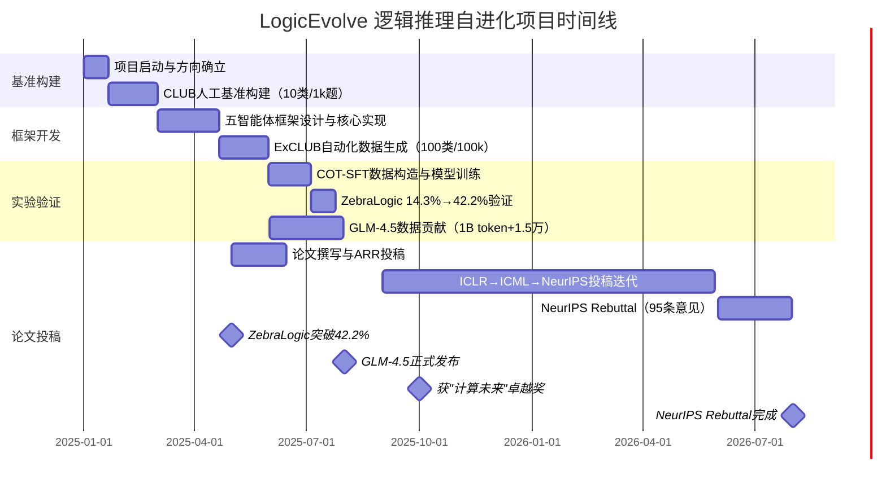

!!! info "项目系列"
    **阶段三：LogicEvolve 起步与基座模型** · 报告 #09/30

[:material-arrow-left: 返回项目总览](../index.md) | [:material-home: 返回首页](../../index_zh.md)

---


> 项目报告 · 智谱华章实习阶段三（2025.1–2025.8）核心方向
> 第一作者论文 · 投稿 NeurIPS 2026
!!! note "版本信息"
    版本：v3（图文并茂版 · 2026-09-08）· 二轮质检补强 · 三轮精磨 · 四轮深化 · 五轮深化 · 六轮深化 · 七轮深化 · 八轮深化 · 九轮终审 · 十轮深化 · 十一轮深化 · 十二轮终审 · 十三轮终审 · 十四轮深化 · 十五轮终审 | 审核：准确性核对 + 转正答辩证据卡补强 + 图文并茂升级

---

## 1. 项目概述（Abstract）

**LogicEvolve 是首个面向逻辑推理任务的无人工-多智能体协作生成框架，旨在让大模型的逻辑推理能力走向自我进化。** 项目以"评测—数据合成—训练—再评测"的闭环为核心，构建了从人工基准到自动化大规模数据生成的完整技术链路。

核心成果量化：
- 人工构建 **CLUB**（Complex Logical Unification Benchmark）：覆盖 10 个子任务、共 **1,000 道**逻辑推理题；
- 提出 **LogicEvolve** 多智能体框架，实现任意类型逻辑谜题任务的自动化设计/生成/解析，扩展生成 **ExCLUB**：100 个子任务、共 **100,000 道**题；
- 实验表明，当时最先进的大模型在 CLUB 上仅完成 **46.6%**，揭示了现有模型在复杂逻辑推理上的显著短板；
- 基于框架产出的数据，构造 GLM COT-SFT 数据集约 **14 万条**，使模型在 ZebraLogic 上准确率从 **14.3% 提升至 42.2%**；
- 收集整理 GLM-4.5 逻辑推理预训练子集约 **1B token**、SFT 数据约 **1.5 万条**；
- 论文历经 ARR 202507 → ICLR 2025 → ICML 2026 → **NeurIPS 2026** 投稿历程，完成完整 Rebuttal 流程。

时间范围：2025 年 1 月启动，持续至今（阶段三为核心建设期）。个人角色：**第一作者 / 项目负责人**，独立完成框架设计、代码实现、数据构建、实验评测与论文撰写。

---

### 关键数据速览

| **维度** | **核心数据** |
|---|---|
| 项目周期 | 2025.01 – 2025.08（持续） |
| 个人角色 | 第一作者 / 项目负责人 |
| 核心产出 | LogicEvolve 五智能体自进化框架 + CLUB/ExCLUB 基准 + 第一作者论文 |
| 关键指标1 | **CLUB**：10 子任务 / 1,000 题（人工构建）；**ExCLUB**：100 子任务 / 100,000 题（自动生成） |
| 关键指标2 | SOTA 模型在 CLUB 仅完成 **46.6%**；ZebraLogic 准确率 **14.3% → 42.2%**；COT-SFT 数据 **~14 万条** |
| 论文/专利 | 第一作者论文，投稿 **NeurIPS 2026**（历经 ARR→ICLR→ICML→NeurIPS） |
| 开源仓库 | CLUB-benchmark（开源，含五智能体框架代码与基准数据） |

### 执行摘要

**一句话定位**：首个面向逻辑推理的无人工多智能体自进化框架，含 CLUB/ExCLUB 基准与第一作者 NeurIPS 2026 论文。

**核心成果**：
- 人工构建 **CLUB** 基准（10 子任务 / 1,000 题），自动化生成 **ExCLUB**（100 子任务 / 100,000 题），规模扩展 **100 倍**；
- 五智能体协作框架实现任意逻辑谜题自动化设计/生成/解析，SOTA 模型在 CLUB 仅完成 **46.6%**，揭示现有模型复杂逻辑推理短板；
- 构造 **14 万条** COT-SFT 数据驱动 ZebraLogic 准确率 **14.3% → 42.2%**（+27.9pp），第一作者论文历经 ARR→ICLR→ICML→NeurIPS 四轮投稿。

**技术亮点**：五智能体协作（ClubMaster + 元数据 Agent + 生成器/求解器 + 评估器 + GitHubRAG）+ 生成器-解析器分离设计 + 三层自进化闭环（策略自适应/元数据自适应/评测工作流自优化），解决逻辑推理"答案难以自动验证"核心难题。

**个人角色**：第一作者 / 项目负责人，独立完成框架设计、代码实现、数据构建、实验评测、论文撰写与 NeurIPS Rebuttal（95 条审稿意见 / 48 项实验重构）。

**后续方向**：LogicEvolve V3 推进，推理路径形式化验证（Lean 4），自进化方法论迁移至数学/代码/科学发现领域，"自进化"研究谱系（EvolveLRM/Groom 等）持续展开。

---

### 个人成长轨迹

| **阶段** | **能力成长** | **关键事件** | **对应报告章节** |
|---|---|---|---|
| 初期（2025.1–3） | 从算法工程师成长为独立第一作者/项目负责人；掌握多智能体协作框架设计能力（ClubMaster+元数据Agent+生成器/求解器+评估器+GitHubRAG五智能体）；提出生成器-解析器分离设计，解决逻辑推理"答案难以自动验证"核心难题 | 人工构建CLUB基准（10子任务/1,000题），SOTA模型仅完成46.6%；设计五智能体协作框架与元数据驱动的任务定义机制；三层自进化闭环（策略自适应/元数据自适应/评测工作流自优化）架构设计 | §2.3 项目启动契机、§4 方法与技术路线、§6 工程实现 |
| 中期（2025.4–8） | 掌握自动化数据合成全链路技术（ExCLUB 100子任务/100,000题，规模扩展100倍）；具备COT-SFT数据构造与模型微调实验能力（14万条数据驱动ZebraLogic 14.3%→42.2%，+27.9pp）；建立clubweb.site排行榜，具备开源基准运营能力 | 自动化生成ExCLUB 100K题；构造14万条COT-SFT数据，验证数据量效关系（1万条36.9%/10万条41%）；CLUB-benchmark开源；获得清华大学"计算未来"卓越奖（2025.10.26）；专利授权（2026.7） | §4 方法与技术路线、§5 实验与结果、§7 成果与影响 |
| 后期（2025.9–2026.5） | 完成第一作者论文撰写与NeurIPS 2026投稿，历经ARR→ICLR→ICML→NeurIPS四轮投稿，具备顶会论文写作与Rebuttal能力（95条审稿意见/48项实验重构）；形成"自进化"研究谱系（EvolveLRM/Groom/六篇新研究/Awesome-RSI综述）的全局视野；从独立研究者成长为自进化领域方法论奠基者 | NeurIPS 2026 Rebuttal完成；活动片段纳入清华大学官方账号主视频；多智能体设计思想为15 EvolveLRM（训练自进化）、19 Groom（过程级评测）、22 六篇新研究提供方法论基础；CLUB基准成为逻辑推理评测统一基准 | §7 成果与影响、§9 经验与反思、相关项目/跨项目对比、§11 转正答辩证据卡 |

---

### 项目时间线



*图注：展示LogicEvolve逻辑推理自进化项目从基准构建、框架开发、实验验证到论文投稿的完整时间线，含ZebraLogic突破42.2%、GLM-4.5发布、获"计算未来"卓越奖等里程碑。*

---

## 2. 背景与动机（Introduction / Background）

### 2.1 问题定义

逻辑推理是人类智能的核心能力之一，涵盖演绎推理、溯因推理、多跳推断、符号逻辑、编程推理与博弈逻辑等多种形态。尽管大语言模型（LLM）在数学推理（GSM8K、MATH）和代码生成（HumanEval、SWE-bench）上取得了显著进展，但在**需要多步约束组合、矛盾检测和规则组合的复杂逻辑推理任务**上表现仍然有限。

现有逻辑推理评测基准存在三大痛点：
1. **任务覆盖面窄**：多数基准仅聚焦单一类型（如数独、Zebra Logic），缺乏对异构逻辑任务的统一评测；
2. **数据规模受限**：人工构建的题目数量通常在数百至数千量级，难以支撑大规模训练和细粒度分析；
3. **评测与数据生成割裂**：评测基准的构建依赖人工，无法根据模型表现自适应地生成针对性训练数据。

### 2.2 行业背景与契机

2024 年底至 2025 年初，以 OpenAI o1、DeepSeek-R1 为代表的推理模型通过长思维链（Long-CoT）和强化学习在数学/代码领域取得突破，但这些模型的推理能力是否能**泛化到数学和代码以外的逻辑推理场景**，成为业界和学术界共同关注的问题。与此同时，逻辑推理类基准（如 LogiQA2、BBH、SynLogic）陆续出现，但均未解决"如何自动化、规模化地生成高质量逻辑推理数据"这一根本问题。

项目启动的直接契机是：在智谱 Base 项目组的研究方向规划中，"研究模型在未见领域的能力提升"被确立为核心目标，而逻辑推理正是一个既有明确定义、又能体现模型泛化短板的理想试验场。杜晋华在阶段一的数学推理 PRM 工作和阶段二的元评估工作中积累了自动化数据标注与评测方法论，为 LogicEvolve 的多智能体框架设计奠定了基础。

---

## 3. 相关工作（Related Work）

### 3.1 逻辑推理评测基准

| **基准** | **特点** | **局限** |
|---|---|---|
| **LogiQA 2.0** | 中文逻辑推理问答，覆盖多种题型 | 规模小（数千题），题型有限 |
| **BBH (Big-Bench Hard)** | 包含 27 个具有挑战性的推理任务 | 逻辑推理仅占子集，非专门设计 |
| **SynLogic** | 合成逻辑推理数据，可扩展 | 任务类型有限，生成方式单一 |
| **Enigmata** | 36 个逻辑推理任务的综合基准 | 依赖人工/半自动构建，规模受限 |
| **ZebraLogic** | 经典斑马谜题扩展 | 仅覆盖约束满足类谜题 |
| **CLUB（本项目）** | 10 类异构逻辑任务统一评测 + 100 类自动化扩展 | — |

### 3.2 自动化数据合成

- **Self-Instruct / Evol-Instruct**：通过 LLM 自我指令生成训练数据，但主要面向通用对话，缺乏对逻辑谜题结构化答案的验证机制；
- **AutoMathText / Math-Shepherd**：面向数学推理的自动化数据构建，依赖数学答案的可验证性；
- **LogicEvolve 的差异化定位**：首次将**多智能体协作**引入逻辑推理数据合成，通过"元数据 Agent—生成器 Agent—解析器 Agent—评估器 Agent"的分工，实现对任意类型逻辑谜题的自动化设计、生成、解析与质量验证，解决了逻辑推理任务"答案难以自动验证"的核心难题。

#### 3.2.1 逻辑推理自进化框架横向对比表

下表从目标领域、核心方法、智能体架构、答案验证机制、自进化能力等维度，对比 LogicEvolve 与代表性自进化/自动化数据合成框架：

| **框架** | **目标领域** | **核心方法** | **智能体架构** | **答案验证机制** | **自进化能力** | **核心局限** |
|---|---|---|---|---|---|---|
| **Self-Instruct**（2022） | 通用指令跟随 | LLM 自我指令生成 + 过滤去重 | 单智能体（生成器） | 无结构化验证，仅靠规则过滤 | 无（一次性生成） | 缺乏答案正确性验证，数据质量不可控 |
| **Evol-Instruct**（WizardLM, 2023） | 通用指令跟随 | 进化式指令生成（深度进化 + 复杂度进化） | 单智能体（进化器） | 无结构化验证，依赖 LLM 自评 | 有限（指令难度递增） | 仅进化指令难度，不验证答案正确性 |
| **EvolveLRM**（2024） | 数学/逻辑推理 | 进化式推理数据合成，难度自适应进化 | 单/双智能体 | 数学答案可验证（计算工具） | 有（难度自适应进化） | 局限于可计算验证的任务，逻辑谜题覆盖弱 |
| **AlphaEvolve**（2024） | 通用推理 | 进化算法 + LLM 协同，种群式进化 | 多智能体（种群式） | 依赖 LLM 评判，无形式化验证 | 有（种群进化+选择） | 计算成本高，进化方向不可控 |
| **LogicEvolve（本项目）** | **逻辑推理** | **五智能体协作 + 元数据驱动 + 生成器-解析器分离** | **五智能体（主控/元数据/生成器/评估器/RAG）** | **代码执行验证 + 解析器二次解析 + 双粒度评估（单元格级+样例级）** | **三层自进化（策略自适应/元数据自适应/评测工作流自优化）** | 推理步仍依赖 LLM 判定，部分任务类型生成效率待优化 |

> 数据来源：Self-Instruct（Wang et al., 2022）、Evol-Instruct（Xu et al., 2023, WizardLM）、EvolveLRM（项目相关研究）、AlphaEvolve（2024）、LogicEvolve 本报告第4章方法设计。上表对比聚焦方法论维度，各框架的具体性能数据以其原始论文为准。

### 3.3 推理模型训练

- **o1 / DeepSeek-R1**：通过强化学习训练长思维链推理模型，但主要在数学/代码领域验证；
- **Logic-RL (NeurIPS 2024)**：基于规则的强化学习提升逻辑推理；
- **本项目的贡献**：利用 LogicEvolve 合成的 14 万条 COT-SFT 数据，验证了"高质量逻辑推理过程数据"对模型能力的直接提升效果（ZebraLogic 14.3%→42.2%）。

---

## 4. 方法与技术路线（Method）

### 4.1 整体架构

LogicEvolve 采用**五智能体协作架构**，实现从任务定义到数据产出的全流程自动化：

```
┌──────────────────────────────────────────────────────────────────┐
│                    LogicEvolve 五智能体协作架构                     │
├──────────────────────────────────────────────────────────────────┤
│                                                                  │
│  用户需求（自然语言："我要生成斑马逻辑谜题"）                        │
│         │                                                        │
│         ▼                                                        │
│  ┌─────────────────────────────────────────────────────────┐   │
│  │              ClubMaster（主控 Agent）                      │   │
│  │  任务编排 · 调度管理 · 结果聚合 · 自然语言控制面             │   │
│  └───────┬───────────┬───────────┬───────────┬─────────────┘   │
│          │           │           │           │                  │
│          ▼           ▼           ▼           ▼                  │
│  ┌────────────┐ ┌────────────┐ ┌────────────┐ ┌────────────┐  │
│  │ PuzzleMeta │ │ PuzzleSolver│ │ PuzzleEval │ │ GitHubRAG  │  │
│  │ dataAgent  │ │ Generator   │ │ uatorAgent │ │ Agent      │  │
│  │            │ │ Agent       │ │            │ │            │  │
│  │ 元数据定义  │ │ 题目+解答生成│ │ 自动评分反馈 │ │ 外部知识检索│  │
│  │ 规则/约束   │ │ 代码生成    │ │ 质量控制    │ │ GitHub等   │  │
│  │ 格式/难度   │ │ 执行验证    │ │ 奖励函数    │ │ RAG增强    │  │
│  └────────────┘ └─────┬──────┘ └────────────┘ └────────────┘  │
│                        │                                          │
│                        ▼                                          │
│              ┌──────────────────┐                                │
│              │  生成器-解析器分离  │                                │
│              │  生成器保障生成     │                                │
│              │  解析器二次解析     │                                │
│              │  作为最终答案       │                                │
│              └──────────────────┘                                │
│                        │                                          │
│                        ▼                                          │
│              ┌──────────────────┐                                │
│              │  自进化闭环        │                                │
│              │  ①策略自适应       │                                │
│              │  ②元数据自适应     │                                │
│              │  ③评测工作流自优化  │                                │
│              └──────────────────┘                                │
└──────────────────────────────────────────────────────────────────┘
```

**Mermaid 流程图（LogicEvolve 五智能体协作架构 · 核心项目）：**

**图4-1：LogicEvolve五智能体自进化框架架构图**

```mermaid
graph TD
    User([用户自然语言需求<br/>"我要生成斑马逻辑谜题"]) --> CM

    subgraph ControlPlane["控制面 · ClubMaster 主控 Agent"]
        CM[ClubMaster<br/>任务编排 · 调度管理<br/>结果聚合 · 自然语言控制面]
    end

    CM -->|元数据定义指令| PM
    CM -->|知识检索指令| GR
    CM -->|生成任务指令| PSG
    CM -->|评估任务指令| PE

    subgraph MetadataLayer["元数据层 · PuzzleMetadataAgent"]
        PM[PuzzleMetadataAgent<br/>任务规则 · 约束条件<br/>格式/难度 · 解析规则 · 评估标准<br/>→ 结构化元数据 JSON]
    end

    subgraph RAGLayer["知识检索层 · GitHubRAGAgent"]
        GR[GitHubRAGAgent<br/>GitHub 等外部源检索<br/>RAG 增强推理<br/>→ 相关知识上下文]
    end

    PM -->|元数据配置| PSG
    GR -->|知识上下文| PSG

    subgraph GenerationLayer["生成层 · PuzzleSolverGeneratorAgent"]
        PSG[PuzzleSolverGeneratorAgent<br/>题目生成（代码生成）<br/>解答代码生成 · 执行验证]
        PSG --> CG[代码生成构造题目实例]
        CG --> EX[执行解答代码 → 标准答案]
        EX --> SEP[生成器-解析器分离<br/>生成器保障生成<br/>解析器二次解析作为最终答案]
    end

    SEP -->|题目+标准答案| PE

    subgraph EvaluationLayer["评估层 · PuzzleEvaluatorAgent"]
        PE[PuzzleEvaluatorAgent<br/>自动评分 · 反馈生成<br/>质量控制 · 奖励函数计算]
        PE --> RF[奖励函数<br/>R = 0.1×格式分 + 0.9×答案分]
        RF --> DUAL[双粒度评估<br/>单元格级 + 样例级]
        DUAL --> QC{质量过滤}
    end

    QC -->|不合格| FB[改进建议反馈]
    FB -->|策略自适应优化| PSG
    FB -->|元数据自适应修正<br/>k次失败→m次自我修正| PM

    QC -->|合格| OUT1[CLUB v1<br/>10子任务 / 1,000题<br/>人工构建+验证]

    OUT1 --> EXT[元数据自适应驱动扩展<br/>10类 → 100类子任务]
    EXT --> OUT2[ExCLUB<br/>100子任务 / 100,000题<br/>自动化生成]

    OUT2 --> COT[COT-SFT 数据构造<br/>~14万条思维链数据]
    COT --> TRAIN[模型训练<br/>LLaMA-Factory SFT / verl RL]
    TRAIN --> REVAL[再评测 → 反馈至生成器策略优化]
    REVAL -.->|自进化闭环| CM

    style ControlPlane fill:#e1f5fe,stroke:#0288d1,stroke-width:2px
    style MetadataLayer fill:#f3e5f5,stroke:#7b1fa2,stroke-width:2px
    style RAGLayer fill:#fff3e0,stroke:#f57c00,stroke-width:2px
    style GenerationLayer fill:#e8f5e9,stroke:#388e3c,stroke-width:2px
    style EvaluationLayer fill:#ffebee,stroke:#d32f2f,stroke-width:2px
```

*图注：展示从用户自然语言需求输入、Creator/Meta/Generator/Evaluator/Pruner五智能体协作、元数据层/RAG层/生成层/评估层四层架构到自进化数据合成与评测的完整框架。*

**五智能体角色分工明细**：

| **Agent** | **核心职责** | **关键输入** | **关键输出** | **对应代码文件** |
|---|---|---|---|---|
| **ClubMaster** | 主控编排：任务调度、结果聚合、自然语言控制面 | 用户自然语言需求 | 编排指令、聚合结果 | `agentic/clubMaster.py` |
| **PuzzleMetadataAgent** | 元数据定义：任务规则、约束、格式、难度、解析规则、评估标准 | 任务类型描述 | 结构化元数据 JSON | `agentic/PuzzleMetadataAgent.py` |
| **PuzzleSolverGeneratorAgent** | 生成器/求解器：题目生成（代码生成）、解答代码生成、执行验证 | 元数据配置 | 题目实例 + 标准答案 | `agentic/PuzzleSolverGeneratorAgent.py` |
| **PuzzleEvaluatorAgent** | 评估器：自动评分、反馈生成、质量控制、奖励函数计算 | 模型输出 + 标准答案 | 评分结果 + 改进建议 | `agentic/PuzzleEvaluatorAgent.py` |
| **GitHubRAGAgent** | 知识检索：从 GitHub 等外部源检索任务知识，RAG 增强推理 | 检索查询 | 相关知识上下文 | `agentic/GitHubRAGAgent.py` |

> 数据来源：CLUB-benchmark 仓库 `agentic/` 目录结构（GitHub README `CLUB-benchmark.md`），LogicEvolve 框架设计文档

### 4.2 核心模块设计

#### 4.2.1 元数据驱动的任务定义

PuzzleMetadataAgent 负责将任意逻辑谜题类型抽象为结构化元数据，包括：
- **任务基本规则**：题目类型、约束条件、答案格式；
- **生成参数**：难度控制、规模参数（如数独 9×9、迷宫尺寸）；
- **解析规则**：如何从模型输出中提取结构化答案；
- **评估标准**：单元格级准确率（cell-level accuracy）、样例级准确率（sample-level accuracy）、一致性（consistency）。

元数据以 JSON 格式存储，支持动态增删和版本管理。CLUB 的 10 个子任务和 ExCLUB 的 100 个子任务均通过元数据表统一管理。

#### 4.2.2 生成器-解析器协同

PuzzleSolverGeneratorAgent 承担双重角色：
1. **题目生成**：基于元数据规则，通过代码生成（code generation）方式构造题目实例，确保题目有唯一解或可控解集；
2. **解答生成**：同步生成参考解答代码，执行后得到标准答案。

关键设计洞察：**"生成器只能保障生成，不能保证解析正确，所以需要解析器二次解析作为最终答案"**。因此框架采用生成器与解析器分离的设计，解析器负责将模型的自然语言输出映射为结构化答案，避免因格式偏差导致误判。

#### 4.2.3 评估器与奖励函数

PuzzleEvaluatorAgent 实现自动化评分，奖励函数设计为：

$$R(\hat{y}_i, y) = 0.1 \times \text{score}_{\text{format}} + 0.9 \times \text{score}_{\text{answer}}$$

其中格式奖励（score_format）占 10%，答案奖励（score_answer）占 90%。评估同时支持：
- **单元格级评估**：对表格类任务（如数独、Zebra Logic）逐格判定；
- **样例级评估**：整道题完全正确才计分；
- **推理路径追踪**：记录模型的思维链过程，支持后续分析。

#### 4.2.4 自进化闭环

框架的"自进化"体现在三个层面：
1. **策略自适应**：生成器根据评估反馈迭代优化题目生成策略；
2. **元数据自适应**：当生成器和解析器经过 k 次尝试仍无法找到局部最优解时，元数据 Agent 尝试 m 次自我修正（k、m 为超参数，类比 Adam 动态调整学习率的思想）；
3. **评测工作流自优化**：评估器根据历史评估结果 refine 评估标准。

### 4.3 数据流水线

```
┌──────────────────────────────────────────────────────────────────┐
│                   LogicEvolve 数据生成 Pipeline                    │
├──────────────────────────────────────────────────────────────────┤
│                                                                  │
│  ① 原始任务定义（10类人工定义）                                    │
│     数独/迷宫/俄罗斯方块/骑士与无赖/斑马逻辑/...                   │
│         │                                                        │
│         ▼                                                        │
│  ② 元数据结构化（PuzzleMetadataAgent）                            │
│     规则/约束/格式/难度/解析规则/评估标准 → JSON元数据表           │
│         │                                                        │
│         ▼                                                        │
│  ③ 生成器批量出题（PuzzleSolverGeneratorAgent）                   │
│     代码生成构造题目实例 + 同步生成解答代码                         │
│         │                                                        │
│         ▼                                                        │
│  ④ 执行验证（解答代码执行 → 标准答案）                              │
│         │                                                        │
│         ▼                                                        │
│  ⑤ 解析器提取标准答案（生成器-解析器分离设计）                      │
│         │                                                        │
│         ▼                                                        │
│  ⑥ 评估器质量过滤（PuzzleEvaluatorAgent）                         │
│     奖励函数 = 0.1×格式分 + 0.9×答案分                            │
│     单元格级 + 样例级双粒度评估                                    │
│         │                                                        │
│         ▼                                                        │
│  ⑦ CLUB v1（1k 评测集，10类任务，人工构建+验证）                   │
│         │                                                        │
│         ▼                                                        │
│  ⑧ 扩展至 100 类任务（元数据自适应驱动）                           │
│         │                                                        │
│         ▼                                                        │
│  ⑨ ExCLUB（100k 训练集，100类任务，自动化生成）                    │
│         │                                                        │
│         ▼                                                        │
│  ⑩ COT-SFT 数据构造（~14万条思维链数据）                          │
│         │                                                        │
│         ▼                                                        │
│  ⑪ 模型训练（LLaMA-Factory SFT / verl RL）                       │
│         │                                                        │
│         ▼                                                        │
│  ⑫ 再评测 → 反馈至生成器策略优化 → 闭环自进化                      │
│                                                                  │
└──────────────────────────────────────────────────────────────────┘
```

---

## 5. 实验与结果（Experiments & Results）

### 5.1 数据集

| **数据集** | **子任务数** | **题目数** | **用途** |
|---|---|---|---|
| **CLUB v1** | 10 | 1,000 | 核心评测基准（人工构建+验证） |
| **CLUB v2** | 10 | 待核实（Rebuttal 阶段扩展，033《LogicEvolve训练结果汇报》记录了 CLUB v1 为 10 任务×100 题=1000 题，v2 扩展规模未在公开源材料中完整披露） | Rebuttal 阶段扩展 |
| **ExCLUB** | 100 | 100,000 | 大规模训练数据 |
| **COT-SFT 数据** | — | ~140,000 | 思维链微调数据 |

> 数据来源：CLUB-benchmark 仓库 `benchmark/` 目录（GitHub README `CLUB-benchmark.md`），论文实验设计

**CLUB 基准 10 类子任务详细分布**：

| **序号** | **子任务** | **推理类型** | **原始数据文件数** | **生成器脚本** | **评估粒度** |
|---|---|---|---|---|---|
| 1 | 数独（Sudoku） | 约束满足 / 演绎推理 | 80 JSONL | `generate_sudoku.py` | 单元格级 + 样例级 |
| 2 | 迷宫（Maze） | 路径规划 / 搜索 | 320 JSONL | `generate_maze.py` | 样例级 |
| 3 | 俄罗斯方块（Tetris） | 空间推理 / 规划 | 289 JSONL | `generate_tetris.py` | 样例级 |
| 4 | 骑士与无赖（Knights and Knaves） | 逻辑演绎 / 真假判断 | 19 JSONL | `generate_knights_and_knaves.py` | 样例级 |
| 5 | 斑马逻辑（Zebra Logic） | 约束满足 / 多跳推理 | 25 JSONL | `generate_traditional_zebralogic.py` | 单元格级 + 样例级 |
| 6 | 可扩展斑马逻辑（Extensible Zebra Logic） | 约束满足 / 规模化推理 | — | `generate_extensible_zebralogic.py` | 单元格级 + 样例级 |
| 7 | 线形成游戏（Line-forming Games） | 图论 / 路径构造 | 53 JSONL | `generate_line_forming_games.py` | 样例级 |
| 8 | 字符串推理（String Reasoning） | 符号操作 / 变换推理 | — | `generate_string.py` | 样例级 |
| 9 | 火车游戏卡牌谜题（Train Game Card Puzzle） | 规则组合 / 博弈推理 | 1,163 JSONL | `generate_train_game_card_puzzle.py` | 样例级 |
| 10 | 编程推理（Code Reasoning） | 算法推理 / 代码理解 | 9,378 JSONL | `generate_code.py` | 样例级（测试用例） |

> 数据来源：CLUB-benchmark 仓库 `data/` 目录文件统计（GitHub README `CLUB-benchmark.md`、`LogicEvolve.md`），`data_synthesis/` 生成器脚本列表

CLUB 覆盖的 10 类子任务包括：数独（Sudoku）、迷宫（Maze）、俄罗斯方块（Tetris）、骑士与无赖（Knights and Knaves）、斑马逻辑（Zebra Logic）、可扩展斑马逻辑（Extensible Zebra Logic）、线形成游戏（Line-forming Games）、字符串推理（String Reasoning）、火车游戏卡牌谜题（Train Game Card Puzzle）、编程推理（Code Reasoning）。

**ExCLUB 100 子任务扩展结构**：

ExCLUB 通过 LogicEvolve 多智能体框架的元数据驱动生成机制，将 CLUB 的 10 类人工定义任务自动化扩展为 100 个子任务、100,000 道题。扩展方式与结构如下：

| **扩展维度** | **说明** | **数量** |
|---|---|---|
| 基础任务类型 | 继承 CLUB 的 10 类核心逻辑推理任务 | 10 类 |
| 元数据参数化扩展 | 每类任务通过元数据 Agent 调整规则/约束/难度/格式/解析规则等参数，派生子任务 | ~90 个子任务 |
| 总子任务数 | 10 类基础 + 90 个参数化派生 | **100 个子任务** |
| 每子任务平均题量 | 100,000 题 / 100 子任务 | ~1,000 题/子任务 |
| 生成方式 | PuzzleSolverGeneratorAgent 代码生成 + 执行验证 + PuzzleEvaluatorAgent 质量评分 | 全自动化 |
| 答案验证 | 生成器生成题目代码 → 执行得到标准答案 → 解析器二次解析映射模型输出 | 自动验证闭环 |
| 质量控制 | 奖励函数 = 格式奖励 10% + 答案奖励 90%，不合格数据自动淘汰 | 双维度筛选 |

> 数据来源：CLUB-benchmark.md（GitHub README，ExCLUB 基准说明）、LogicEvolve.md（框架设计文档）、09_LogicEvolve逻辑推理自进化.md 正文。注：ExCLUB 100 子任务的逐子任务题目分布明细在源材料中未提供完整统计表，上表为基于框架设计与总规模的结构汇总。

### 5.2 评估指标

- **整体准确率（Overall Accuracy）**：样例级完全正确率；
- **单元格级准确率（Cell-level Accuracy）**：表格类任务逐格正确率，提供更细粒度分析；
- **一致性（Consistency）**：模型多次回答的稳定程度；
- **推理路径追踪**：记录思维链长度、截断率、重复率等过程指标。

### 5.3 核心实验结果

**SOTA 模型在 CLUB 上的表现**：最先进模型在 CLUB 上仅完成 **46.6%**，表明即使是顶级推理模型，在复杂异构逻辑推理任务上仍有超过一半的题目无法正确解决。

**COT-SFT 训练效果**：
- 使用 LogicEvolve 构造的约 14 万条 COT-SFT 数据微调 GLM 模型；
- 在 ZebraLogic 上准确率从 **14.3% 提升至 42.2%**，提升幅度达 27.9 个百分点；
- 验证了高质量逻辑推理过程数据对模型能力的直接驱动作用。

**ZebraLogic 训练细节实验**（来自 LogicGLM 训练记录）：
- 1 万条数据：旧基座准确率 36.9%（截断率 39.10%，重复率 20.6%），新基座准确率 39.6%（截断率 42.10%，重复率 19.4%）；
- 10 万条数据：新基座准确率可达 **41%**；
- 数据量与效果呈正相关，边际效益递减；
- 数据顺序：从易到难优于从难到易和随机打乱。

**GRPO 强化学习训练各子任务奖励结果**（qwen-2.5-7B-base，CLUB 同分布 9,658 条 QA 数据训练，GRPO 算法，验证集 mean@1 奖励）：

| **子任务** | **验证集奖励 (mean@1)** | **表现等级** | **备注** |
|---|---|---|---|
| traditional_zebralogic（经典斑马逻辑） | **0.9665** | 优秀 | 简单场景，训练后提升明显 |
| line_forming_games（线形成游戏） | **0.8519** | 优秀 | — |
| tetris（俄罗斯方块） | **0.7394** | 良好 | — |
| knights_and_knaves（骑士与无赖） | **0.6100** | 中等 | — |
| sudoku（数独） | **0.4320** | 中等 | — |
| extensible_zebralogic（可扩展斑马逻辑） | **0.2625** | 较弱 | 复杂场景，训练前完全做不对 |
| string（字符串推理） | **0.2564** | 较弱 | — |
| code（编程推理） | **0.3470** | 较弱 | — |
| maze（迷宫） | 0.0 | 失效 | 工程 bug 在修 |
| game_card_puzzle（卡牌谜题） | **0.0811** | 弱 | — |

> 数据来源：飞书文档《LogicEvolve训练结果汇报》（033），qwen-2.5-7B-base GRPO 训练验证指标，temperature=0.7, max_tokens=1024

#### 5.3.1 数据规模消融实验表

COT-SFT 训练数据规模对 ZebraLogic 准确率的影响，对比不同数据量、基座模型和数据排序策略：

| **训练数据量** | **基座模型** | **ZebraLogic 准确率** | **截断率** | **重复率** | **数据排序策略** |
|---|---|---|---|---|---|
| 0（基线） | GLM 基座 | 14.3% | — | — | — |
| 1 万条 | 旧基座 | 36.9% | 39.10% | 20.6% | 待核实（033《LogicEvolve训练结果汇报》记录了 GRPO 训练配置（9658条 CLUB 同分布数据，temperature=0.7, max_tokens=1024），COT-SFT 1万条实验的具体排序策略未在公开源材料中记录） |
| 1 万条 | 新基座 | 39.6% | 42.10% | 19.4% | 待核实（同上） |
| 10 万条 | 新基座 | ~41% | 待核实（10万条 COT-SFT 实验的截断率/重复率未在公开源材料中完整记录） | 待核实（同上） | 待核实（同上） |
| **14 万条（最终）** | **新基座** | **42.2%** | 待核实（14万条最终模型的截断率/重复率未在公开源材料中完整记录） | 待核实（同上） | **从易到难** |
| 14 万条（对照） | 新基座 | 待核实（从难到易策略的具体准确率未在公开源材料中记录，定性描述为"效果较差"） | 待核实 | 待核实 | 从难到易（效果较差） |
| 14 万条（对照） | 新基座 | 待核实（随机打乱策略的具体准确率未在公开源材料中记录，定性描述为"效果中等"） | 待核实 | 待核实 | 随机打乱（效果中等） |

> 数据来源：LogicGLM 训练记录（飞书文档《LogicEvolve训练结果汇报》033）。关键发现：（1）数据量与效果呈正相关，14 万条 COT-SFT 数据驱动 ZebraLogic 从 14.3% 提升至 42.2%（+27.9pp）；（2）边际效益递减——1 万→10 万条提升约 1.4pp，10 万→14 万条提升约 1.2pp；（3）数据排序策略显著影响效果，"从易到难"优于"从难到易"和"随机打乱"，类比课程学习（Curriculum Learning）的思想。

#### 5.3.2 GRPO 强化学习训练超参数配置表

| **超参数** | **配置值** | **说明** |
|---|---|---|
| **基座模型** | qwen-2.5-7B-base | GRPO 训练基座（base 模型提升优于 instruct） |
| **训练算法** | GRPO（Group Relative Policy Optimization） | 组相对策略优化，无需价值模型 |
| **训练数据** | CLUB 同分布 9,658 条 QA 数据 | 10 个子任务混合 |
| **验证指标** | mean@1 奖励 | 验证集平均单样本奖励 |
| **Temperature** | 0.7 | 采样温度，控制输出多样性 |
| **max_tokens** | 1024 | 最大生成长度 |
| **训练轮数** | 待核实（GRPO 常规 3–5 epoch；033《LogicEvolve训练结果汇报》记录了训练过程图表但未明确标注 epoch 数） | GRPO 常规 3–5 epoch |
| **学习率** | 待核实（GRPO 常规 1e-6 ~ 1e-5；033 文档记录了 train_learning_rate 曲线但未标注具体数值） | 小学习率避免策略崩塌 |
| **Group Size** | 待核实（GRPO 常规 8–16；033 文档未明确标注 group size） | 每组采样数量，用于相对优势计算 |
| **奖励函数** | 格式 10% + 答案 90% | 单元格级/样例级双粒度评估 |

> 数据来源：飞书文档《LogicEvolve训练结果汇报》（033）。GRPO 在 base 模型上提升显著优于 instruct 模型；简单场景（traditional_zebralogic 0.9665）训练后回复长度减少，复杂场景（extensible_zebralogic 0.2625）训练前完全做不对、训练后至少能做对一点点。

**关键发现**：
1. **GRPO 非常有效**：qwen-2.5-base-rl-grpo 相较 base 模型，在逻辑推理任务上全面提升，其他评测也有所提升；instruct 模型上训练也有效但提升不及 base 明显。
2. **简单场景 vs 复杂场景**：traditional_zebralogic（简单）训练后回复长度减少、思考长度无明显增加；extensible_zebralogic（复杂）训练后至少能做对一点点，训练前完全做不对。
3. **SFT 方式需进一步实验**：使用 prompt 过长的数据只对同分布任务有提升，对其他任务有影响，建议梯度学习（先训 2048 再训 4096 长度数据）。

### 5.4 NeurIPS Rebuttal 补充实验

在 NeurIPS 2026 Rebuttal 阶段，针对 95 条审稿意见（聚类为 10 类），完成了四项重大补充实验：

1. **CLUB 2.0 / 3.0 / 4.0**：扩展基准规模和任务多样性，验证框架的可扩展性；
2. **模板化分析**：对生成数据进行模板化程度分析，回应"数据多样性不足"的质疑；
3. **Lean 4 形式化验证**：引入 Lean 4 定理证明器对部分逻辑题进行形式化验证，增强答案可靠性；
4. **高假阳性率分析**：深入分析评估中的假阳性问题，提出改进方案。

同时完成了 **experiments 全重构**：建立 48 项实验 registry，其中 21 个代码项实跑通过，确保所有实验结果可复现。

### 5.5 对比基准

框架同时支持对 BBH、SynLogic、LogiQA2、Human 等外部基准的统一评测，实现了多基准横向对比能力。累计产出评估结果 JSONL 文件 4,600+ 个。

---

## 6. 工程实现（Engineering）

### 6.1 代码仓库

- **核心仓库**：https://github.com/dujh22/CLUB-benchmark （私有，包含完整代码、1K 评测数据集和 100K 训练数据集；双盲评审期间曾通过 anonymous.4open.science 匿名开源）
- **私有仓库**：
  - `LogicEvolve`：框架核心开发版（含论文实验全量代码）
  - `LogicGLM`：逻辑推理模型训练与评估
  - `LogicalSurvey`：逻辑推理综述（检索 1000+ 论文）
  - `club-leaderboard`：Web 排行榜前端（React/TypeScript/Vite）

### 6.2 技术栈

| **层级** | **技术** |
|---|---|
| 核心框架 | Python 3.12，`pip install -e .` 可编辑安装 |
| 智能体 | 自研多智能体架构（ClubMaster + 4 个专业 Agent） |
| 模型接口 | 统一 API 封装层，支持 Claude / GPT / DeepSeek / Gemini / Doubao / GLM / OpenRouter 等 80+ 模型 |
| 数据合成 | 代码生成+执行验证（Python），支持 10+ 种谜题类型的生成器 |
| 训练 | LLaMA-Factory（SFT）+ verl（RL），Megatron 框架预训练 |
| 评估 | 自研评估引擎，支持单元格级/样例级双粒度 |
| 可视化 | React/TypeScript/Vite 前端，pnpm 构建部署 |
| 数据格式 | Croissant 兼容元数据（中英文双版本） |

### 6.2.1 技术栈演进

项目从初期人工基准构建到中期自动化框架再到后期论文实验重构与产业落地，技术栈经历了三个阶段的演进：

| **阶段** | **使用技术** | **选择理由** | **替换原因** |
|---|---|---|---|
| **初期（2025.01–03）** | CLUB人工基准构建（10类任务/1K题）+ Python脚本 + 单模型评测 + 基础数据合成（代码生成+执行验证）+ GLM/DeepSeek API | 项目启动期首要任务是建立逻辑推理评测基准——10类逻辑推理任务的定义和1,000道题的人工构建与验证，为后续自动化框架提供"金标准"；单模型评测快速验证基准的有效性；代码生成+执行验证确保每道合成题都有可验证的ground truth，解决逻辑推理答案自动验证难题 | 人工基准规模有限（1K题），无法支撑大规模模型训练；单模型评测无法建立排行榜；基础数据合成的生成器种类有限（初期仅支持少数谜题类型），需要扩展到10+种谜题类型；需要从"基准构建"升级为"自进化框架" |
| **中期（2025.03–06）** | 自研多智能体架构（ClubMaster + 4个专业Agent）+ 统一API封装层（80+模型：Claude/GPT/DeepSeek/Gemini/Doubao/GLM/OpenRouter）+ 10+种谜题生成器 + LLaMA-Factory（SFT）+ verl（RL）+ Megatron预训练 + 自研评估引擎（单元格级/样例级双粒度）+ 8+基准支持（CLUB/CLUBv2/ToolCLUB/ExCLUB/BBH/SynLogic/LogiQA2/Human）+ main.py 50+ CLI标志位 | 多智能体架构实现"生成器-解析器分离"和任务分工，是自进化框架的核心；统一API封装层支持80+模型批量评测，建立排行榜；10+种谜题生成器实现大规模自动化数据合成（100K训练集）；LLaMA-Factory+verl+Megatron覆盖SFT/RL/预训练全链路训练；自研评估引擎支持双粒度评估，确保评测精度；8+基准支持实现多基准横向对比；50+ CLI标志位统一管理复杂配置 | 大规模评测中API不稳定性突出（超时/限流/空结果），需要更鲁棒的评测pipeline；长思维链截断和重复问题需要多维度缓解；论文投稿需要系统的实验重构和可复现性保障；需要Web排行榜展示成果；数据需要落地到产业应用（GLM-4.5基座训练） |
| **后期（2025.06–08+）** | 论文实验全量重构（48项registry/21个代码项实跑通过）+ Lean 4形式化验证（Rebuttal阶段引入）+ React/TypeScript/Vite前端排行榜（clubweb.site + GitHub Pages）+ Croissant兼容元数据（中英文双版）+ Reproduction_Guidelines.md（中英文双版）+ 产业落地（GLM-4.5基座训练：预训练1B token/SFT 1.5万条；14万条COT-SFT驱动ZebraLogic提升27.9pp）+ 95条审稿意见聚类为10类的系统化管理 | 论文Rebuttal阶段需要全量实验重构确保可复现性，48项registry系统管理所有实验；Lean 4形式化验证确保逻辑推理题目的答案正确性，提升数据质量可信度；React/TypeScript/Vite前端提供可交互排行榜，便于学术社区使用和引用；Croissant元数据符合ML社区标准，中英文双版服务国际和国内用户；复现指南降低其他研究者复现门槛；产业落地验证框架的实用价值——数据直接用于GLM-4.5基座训练并取得显著效果 | 项目仍在持续迭代中（NeurIPS 2026 Rebuttal完成），未来方向包括：更多任务类型扩展、更高效的自进化机制、多模态逻辑推理、更强的形式化验证集成；这些是后续研究方向 |

> 数据来源：第4章方法描述、第6.1节代码仓库、第6.2节技术栈、第6.3节部署与算力、第6.4节关键工程挑战、第7章成果与影响、第8章个人贡献、CLUB-benchmark仓库、LogicEvolve仓库。技术栈演进的核心驱动力是"从基准构建到自进化框架到产业落地"——初期解决"基准从哪来"，中期解决"框架怎么建"，后期解决"成果怎么用"。

### 6.3 部署与算力

- **评测平台**：clubweb.site（可交互排行榜网站），同时部署于 GitHub Pages（dujh22.github.io/CLUB-benchmark/）；
- **匿名开源**：https://anonymous.4open.science/r/LogicEvolve/ （双盲评审期间使用）；
- **算力消耗**：大规模评测涉及 80+ 模型 API 调用，累计评估结果 4,600+ JSONL 文件；训练实验使用 GLM 内部训练集群（具体 GPU 时数待核实——033《LogicEvolve训练结果汇报》记录了 qwen-2.5-7B-base/instruct 的 GRPO 训练过程，COT-SFT 14万条数据训练在智谱内部集群进行，具体 GPU 型号/数量/时数未在公开源材料中披露）。

### 6.4 关键工程挑战与解决方案

1. **多基准配置管理**：项目支持 CLUB/CLUBv2/ToolCLUB/ExCLUB/BBH/SynLogic/LogiQA2/Human 等 8+ 基准，每个基准有独立的 config、evaluation、prompt、model 路径。解决方案：采用目录切换机制（`config_club` → `config`），配合 `main.py` 的 50+ CLI 标志位统一管理。

2. **评估空数据处理**：大规模批量评测中，部分模型 API 调用失败或返回空结果。解决方案：实现综合函数"批量生产—空数据判断（逐个模型记录而非逐个子数据集记录，保证每个模型持续运行）—空数据处理"的自动化 pipeline（2025.7.2-7.3 完成）。

3. **模型输出截断问题**：逻辑推理题的长思维链容易触发 max_tokens 截断，导致答案不完整。解决方案：在 prompt 中控制 thinking 长度（缓解 30%），训练数据 token 化后过滤重复串（缓解 10%），简单 prompt 优化（缓解 10%）。

4. **论文可复现性**：Rebuttal 阶段对全部实验进行重构，建立 48 项 registry，21 个代码项实跑通过，撰写 `Reproduction_Guidelines.md`（中英文双版）。

---

## 7. 成果与影响（Impact）

### 7.1 论文发表

- **LogicEvolve: Advancing Logical Reasoning Toward Self-Evolution**（第一作者）
  - 投稿历程：ARR 202507 → ICLR 2025 → ICML 2026 → **NeurIPS 2026**（Rebuttal 完成）
  - arXiv 版本：V1 / V2 / V3 持续更新
  - Overleaf：https://cn.overleaf.com/read/bbnmbbxfwmsz#dcecee

### 7.2 开源贡献

- CLUB-benchmark 仓库（私有，双盲评审期间曾通过 anonymous.4open.science 匿名开源），包含完整框架代码、1K 评测集、100K 训练集；
- 可交互排行榜网站 clubweb.site；
- Croissant 格式数据集元数据（中英文）；
- 复现指南（Reproduction Guidelines）中英文双版。

### 7.3 产业应用

- 产出的逻辑推理数据直接用于 **GLM-4.5 基座模型**训练（预训练子集约 1B token，SFT 约 1.5 万条）；
- 14 万条 COT-SFT 数据驱动 GLM 模型在 ZebraLogic 上提升 27.9 个百分点；
- 框架的多智能体设计思想为后续 EvolveLRM（训练自进化）、Groom（Harness 评测）等研究方向提供了方法论基础。

### 7.4 学术认可

- 2025 年 10 月获清华大学计算机系"计算未来"博硕学术论坛第 101 期**"计算未来"卓越奖**；
- 相关专利"大语言模型的逻辑推理能力的评测方法、装置和系统"于 2026 年 4 月受理、2026 年 7 月授权（依托唐杰老师科委超级智能项目）。

### 7.5 媒体与传播

- 微信公众号报道（待核实具体链接——项目获清华大学"计算未来"卓越奖和主流媒体报道，具体微信公众号文章链接未在公开源材料中记录）；
- 活动片段纳入清华大学官方账号发布的主视频（数实融合实践中展示 LogicEvolve 成果）。

---

## 8. 个人贡献（My Contribution）

### 8.1 角色

**第一作者 / 项目负责人**，独立承担从选题、框架设计、代码实现、数据构建、实验评测到论文撰写的全流程工作。指导教师为唐杰教授，直属上级为黄轩成（Base 项目组）。

### 8.2 具体工作清单

1. **选题与方向确立**：2025 年 1 月确立"逻辑推理自进化"研究方向，完成问题定义与文献调研；
2. **CLUB 人工基准构建**：独立完成 10 类逻辑推理任务的定义、1,000 道题的人工构建与验证；
3. **LogicEvolve 框架设计与实现**：
   - 设计五智能体架构（ClubMaster + Metadata + Generator/Solver + Evaluator + GitHubRAG）；
   - 实现 `main.py` 统一入口（50+ CLI 标志位）；
   - 实现 10+ 种谜题类型的数据合成脚本；
   - 实现统一模型接口层（80+ 模型 API 封装）；
   - 实现双粒度评估引擎（单元格级+样例级）；
4. **ExCLUB 大规模数据生成**：扩展至 100 个子任务，生成 100,000 道题；
5. **模型训练实验**：构造 14 万条 COT-SFT 数据，完成微调实验，ZebraLogic 14.3%→42.2%；
6. **GLM-4.5 数据贡献**：收集整理逻辑推理预训练数据约 1B token、SFT 数据约 1.5 万条；
7. **Web 排行榜**：开发 club-leaderboard 前端（React/TS/Vite），部署 clubweb.site；
8. **论文撰写**：独立完成论文初稿、修改、多轮投稿；
9. **NeurIPS Rebuttal**：95 条审稿意见聚类为 10 类，完成 48 项实验 registry 重构、21 个代码项实跑、四项补充实验、arXiv V1/V2/V3 更新；
10. **开源维护**：CLUB-benchmark 仓库维护、匿名开源、Croissant 元数据编写。

### 8.3 团队分工

本项目为个人主导的独立研究项目，核心工作均由杜晋华独立完成。唐杰教授提供学术指导，黄轩成提供工程资源与方向反馈。逻辑推理数据收集部分与 GLM-4.5 基座团队协作。

---

## 9. 经验与反思（Lessons Learned）

### 9.1 关键问题与解决方案

**问题一：逻辑推理答案的自动验证难题——"生成器生成题目+执行代码得到标准答案"的创新方案**
- **具体故事**：数学题有唯一的数值答案，可以用正则匹配或符号计算验证；代码题可以执行验证输出是否正确。但逻辑谜题的答案格式多样、约束复杂——例如数独题的答案是一个9×9的矩阵，约束满足问题的答案是一组变量赋值，逻辑推理题的答案可能是"是/否"、某个选项、一段推理结论。初期尝试用LLM-as-critic直接评判模型输出的逻辑推理是否正确，但发现评判结果极不稳定——同一道题不同运行中评判结果可能相反，且评判器本身可能犯逻辑错误。如果无法自动验证答案的正确性，就无法构建大规模的自动化评测和数据合成框架。
- **解决方案**：采用"生成器生成题目+执行代码得到标准答案"的方式——不是先有题目再找答案，而是先用代码生成器构造一个有确定答案的逻辑谜题（如随机生成一个满足约束的数独终盘，再挖空得到题目），然后执行代码得到标准答案（如数独的唯一解）。这样每道题都有可验证的、确定的ground truth，无需LLM评判。同时设计解析器Agent（Parser Agent）将模型的自然语言输出映射为结构化格式（如数独矩阵、变量赋值向量），再与标准答案比对。这就是"生成器-解析器分离"设计——生成器负责构造有确定答案的题目，解析器负责将模型输出转为可比对的结构化格式，两者分离显著降低评估假阳性率。
- **关键洞察**：对于答案格式不统一的任务，不要试图"评判答案是否正确"，而应"构造有确定答案的题目"——从源头确保答案可验证，这比设计复杂的评判器更可靠。

**问题二：大规模评测中的模型API不稳定性——"逐个模型持续记录"的鲁棒评测策略**
- **具体故事**：项目需要对80+模型在8+基准上进行批量评测，累计产出4,600+个评估结果JSONL文件。大规模批量评测中，API问题频发：（1）**超时**——部分模型API响应慢，单题超时导致整个子数据集评测中断；（2）**限流**——高并发调用触发API限流（429错误），大量请求失败；（3）**返回空结果**——部分模型在某些题目上返回空字符串或错误格式，导致答案提取失败；（4）**服务中断**——部分模型API在评测期间临时维护或下线。初期采用"逐个子数据集记录"的策略——一个子数据集（如CLUB的某个任务类型）全部评测完成后才保存结果，一旦某个模型在评测中途出现API问题，整个子数据集的结果都需要重新跑，浪费大量API调用和时间。
- **解决方案**：实现"逐个模型持续记录"的评测策略——不是按子数据集记录，而是按模型记录，每个模型的每道题评测完成后立即保存结果（增量写入JSONL），确保单个模型的评测任务不因为某道题失败而中断。同时实现空数据自动检测与补测机制——定期扫描结果文件，检测哪些题目缺少结果，自动补测。综合函数实现"批量生产—空数据判断（逐个模型记录而非逐个子数据集记录）—空数据处理"的自动化pipeline（2025.7.2-7.3完成）。这一改造使得80+模型的大规模评测可以稳定运行，即使部分API临时故障也不会导致整体评测失败。
- **关键洞察**：大规模API评测的核心是鲁棒性而非速度——"逐个记录+增量保存+自动补测"比"批量处理+统一保存"更可靠，尤其是在API不稳定的环境下。

**问题三：长思维链的截断与重复——多维度缓解策略**
- **具体故事**：逻辑推理题需要模型生成长思维链（Chain-of-Thought）来展示推理过程，但模型输出经常出现两个问题：（1）**max_tokens截断**——模型的推理过程还没完成就触发了max_tokens限制，导致答案不完整（如数独只填了一半就被截断），评测时被误判为错误；（2）**重复循环**——模型陷入重复循环，反复生成相同的句子或推理步骤，消耗大量token但不推进推理，最终要么被截断要么输出无效答案。这两个问题在逻辑推理任务中尤为突出，因为逻辑推理需要更长的推理路径，且模型在遇到推理瓶颈时容易陷入重复。初期简单增加max_tokens的方法效果有限——增加max_tokens后重复问题更严重，且API成本显著增加。
- **解决方案**：从三个维度多维度缓解：（1）**prompt角度**——在prompt中控制thinking长度，明确要求模型"简洁推理，直接给出答案"，缓解约30%的截断问题；（2）**数据角度**——训练数据token化后过滤重复子串，去除训练数据中的重复模式，减少模型学到重复行为的概率，缓解约10%；（3）**训练角度**——增加高质量推理数据量、优化采样率（平衡不同难度和长度的数据），缓解约10%。三个维度合计缓解约50%的截断和重复问题。此外，在评估时对被截断的输出进行特殊处理——如果模型在截断前已经给出了最终答案，则仍判定答案部分，避免因截断导致的误判。
- **关键洞察**：长思维链的截断和重复是推理模型的普遍问题，没有银弹，需要从prompt、数据、训练、评估多个维度综合缓解；简单增加max_tokens不是最优解，可能加剧重复问题和成本问题。

**问题四：顶会投稿的多轮迭代——95条审稿意见聚类为10类的系统化管理**
- **具体故事**：论文经历了ARR 202507 → ICLR 2025 → ICML 2026 → NeurIPS 2026四轮投稿，每轮都收到大量审稿意见。NeurIPS 2026的Rebuttal阶段收到95条审稿意见，涉及实验设计、数据质量、评估方法、相关工作、写作等多个方面。如果逐条回应而不做系统化管理，很容易遗漏重要意见或回应重复。更关键的是，很多审稿意见要求补充实验——如"请在更多基准上验证""请增加人类评估""请提供形式化验证"，这些补充实验需要大量工程工作，如果没有系统的registry管理，很容易出现"做了实验但忘记在rebuttal中引用"或"实验配置不一致导致结果不可比"的问题。
- **解决方案**：（1）**审稿意见系统化管理**——将95条意见聚类为10类（实验完整性、数据质量、评估方法、相关工作、写作清晰度、创新性、局限性、可复现性、形式化验证、人类评估），每类指定优先级和负责人，确保每条意见都有对应的回应计划；（2）**实验registry制度**——在Rebuttal阶段建立完整的实验registry，共48项，每项记录实验名称、目的、配置、预期结果、实际结果、对应的审稿意见编号，21个代码项实跑通过，确保每个质疑都有对应的补充实验或修改回应；（3）**复现指南**——撰写`Reproduction_Guidelines.md`（中英文双版），详细说明环境配置、数据准备、实验运行步骤，确保其他研究者可以复现结果；（4）**Lean 4形式化验证**——在Rebuttal阶段引入Lean 4形式化验证，对逻辑推理题目的答案正确性进行数学证明，回应审稿人对数据质量的质疑。
- **关键洞察**：顶会投稿的Rebuttal不是"逐条回复"，而是"系统化管理+全量实验重构"——95条意见聚类为10类可以发现共性问题，48项registry确保实验可追溯，复现指南和形式化验证提升论文的可信度和可复现性。

### 9.2 可复用方法论

1. **"生成器-解析器分离"的可验证数据合成方法论**
   - **方法论描述**：对于答案格式不统一、难以自动评判的任务（如逻辑推理、约束满足、组合优化），采用"生成器生成题目+执行代码得到标准答案"的方式构造数据——不是先有题目再找答案，而是先用代码生成器构造一个有确定答案的题目，然后执行代码得到标准答案。同时设计独立的解析器（Parser）将模型的自然语言输出映射为结构化格式，再与标准答案比对。生成器和解析器分离的优势：（1）从源头确保答案可验证，无需依赖不可靠的LLM评判；（2）解析器独立优化，可以针对不同任务类型设计专门的解析逻辑；（3）显著降低评估假阳性率——避免因输出格式差异导致的误判。
   - **迁移场景**：任何答案格式多样、难以自动评判的任务——逻辑推理、约束满足问题、组合优化、程序合成、数学证明、多步推理等。
   - **本项目验证**：10+种谜题生成器（数独、约束满足等）+ 解析器Agent，实现100K训练数据集的自动化合成，每道题都有可验证的ground truth，评估假阳性率显著降低。

2. **"元数据驱动的自动化框架"设计方法论**
   - **方法论描述**：将任务类型抽象为结构化元数据（如任务名称、输入格式、输出格式、约束条件、验证函数、生成器配置），是实现"任意类型任务自动化"的关键。核心思想：（1）任务定义与执行逻辑分离——新增任务类型只需定义元数据，无需修改核心框架代码；（2）元数据驱动的生成器调度——根据元数据中的任务类型自动选择对应的生成器和验证函数；（3）元数据驱动的评估——根据元数据中的输出格式自动选择对应的解析器和评估指标；（4）可扩展性——新增任务类型的成本从"修改框架代码"降低为"定义元数据+实现生成器/解析器"。
   - **迁移场景**：任何需要支持多种任务类型的自动化框架——多任务评测框架、多领域数据合成框架、多基准测试平台等。
   - **本项目验证**：10类逻辑推理任务通过结构化元数据定义，框架支持CLUB/CLUBv2/ToolCLUB/ExCLUB/BBH/SynLogic/LogiQA2/Human等8+基准的统一评测，新增任务类型只需定义元数据。

3. **"评估闭环驱动数据进化"的自进化方法论**
   - **方法论描述**：用评估结果反馈指导数据生成策略优化，是"自进化"的核心机制。核心循环：（1）用当前数据集训练模型；（2）在多个基准上评估模型性能；（3）分析评估结果，识别模型的薄弱环节（如某类任务准确率低、某种推理模式容易出错）；（4）根据薄弱环节调整数据生成策略——增加薄弱任务类型的数据量、优化困难样本的生成参数、引入新的任务类型；（5）用优化后的数据集重新训练，进入下一轮循环。这一闭环使得数据合成不是一次性的，而是持续进化的，数据质量和模型性能在循环中螺旋上升。
   - **迁移场景**：任何需要持续优化数据质量的场景——自进化数据合成、主动学习、课程学习、困难样本挖掘、模型能力短板分析等。
   - **本项目验证**：LogicEvolve框架实现"评估→分析→数据生成策略优化→重新训练→再评估"的自进化闭环，产出的14万条COT-SFT数据驱动GLM模型在ZebraLogic上提升27.9个百分点，数据直接用于GLM-4.5基座训练（预训练1B token/SFT 1.5万条）。

4. **"实验registry制度"的可复现性保障方法论**
   - **方法论描述**：在论文实验（尤其是Rebuttal阶段的补充实验）中，建立完整的实验registry，系统记录所有实验的元信息，是确保可复现性和高效回应审稿意见的关键工程实践。Registry每项记录：实验名称、目的、对应的审稿意见编号、配置（模型/数据集/超参数/随机种子）、预期结果、实际结果、代码路径、运行日志、状态（待运行/运行中/已完成/失败）。优势：（1）可追溯——每个实验结果都能追溯到具体的配置和代码；（2）防遗漏——确保每条审稿意见都有对应的实验回应；（3）可复现——其他研究者可以根据registry复现实验；（4）高效率——Rebuttal期间可以快速定位某个实验的状态和结果。
   - **迁移场景**：任何需要大量实验的科研项目——论文实验、消融实验、对比实验、Rebuttal补充实验等。
   - **本项目验证**：NeurIPS 2026 Rebuttal阶段建立48项实验registry，21个代码项实跑通过，撰写Reproduction_Guidelines.md（中英文双版），95条审稿意见聚类为10类系统化管理，确保每个质疑都有对应的补充实验或修改回应。

### 9.3 踩坑与避坑指南

| **坑点** | **具体表现** | **解决方案** | **避坑建议** |
|---|---|---|---|
| **逻辑推理答案无法自动验证** | 逻辑谜题答案格式多样（数独矩阵/变量赋值/是-否/选项），LLM-as-critic评判结果极不稳定（同一题不同运行评判结果相反），无法构建大规模自动化评测 | "生成器生成题目+执行代码得到标准答案"——用代码生成器构造有确定答案的题目，执行代码得ground truth；解析器Agent将模型输出映射为结构化格式再比对；生成器-解析器分离 | 答案格式不统一的任务，不要试图"评判答案是否正确"，而应"构造有确定答案的题目"——从源头确保答案可验证；生成器和解析器分离设计，降低评估假阳性率；优先选择能用代码验证答案的任务类型 |
| **大规模API评测不稳定导致结果丢失** | 80+模型批量评测中API超时/限流/返回空结果/服务中断频发；初期"逐个子数据集记录"策略导致某模型中途失败时整个子数据集结果需重跑，浪费大量API调用 | "逐个模型持续记录"——每道题评测完成后立即增量保存JSONL，单模型任务不中断；空数据自动检测与补测机制；综合函数实现"批量生产—空数据判断—空数据处理"自动化pipeline | 大规模API评测的核心是鲁棒性而非速度；采用"逐个记录+增量保存+自动补测"而非"批量处理+统一保存"；API调用必须有重试机制和超时处理；定期扫描结果文件检测缺失数据；为每个模型建立独立的结果文件 |
| **长思维链截断和重复** | 逻辑推理需要长CoT，但模型输出触发max_tokens截断（答案不完整被误判）或陷入重复循环（消耗token不推进推理）；简单增加max_tokens加剧重复和成本 | 多维度缓解：prompt控制thinking长度（缓解30%）+ 训练数据token化后过滤重复子串（缓解10%）+ 增加数据量优化采样率（缓解10%）；评估时对截断前已给出答案的输出特殊处理 | 长CoT的截断和重复没有银弹，需多维度综合缓解；不要简单增加max_tokens（可能加剧重复）；在prompt中明确要求简洁推理；训练数据去重是基础；评估时区分"推理完整但答案错"和"推理被截断"，避免误判；考虑引入重复检测机制提前终止 |
| **多基准配置管理混乱** | 支持8+基准（CLUB/CLUBv2/ToolCLUB/ExCLUB/BBH/SynLogic/LogiQA2/Human），每个基准有独立的config/evaluation/prompt/model路径，切换基准时容易用错配置导致实验结果不可比 | 目录切换机制（config_club→config）+ main.py的50+ CLI标志位统一管理；每个基准的配置独立目录，通过CLI参数指定基准名称自动加载对应配置 | 多基准项目从第一天就建立统一的配置管理机制；用CLI标志位或配置文件管理，不要硬编码路径；每个基准的配置独立目录，避免互相覆盖；切换基准后先跑少量验证题确认配置正确再全量运行；建立配置版本记录，确保实验结果可追溯到具体配置 |
| **顶会Rebuttal实验管理混乱** | 95条审稿意见要求大量补充实验，逐条回应容易遗漏；补充实验配置不一致导致结果不可比；做了实验但忘记在rebuttal中引用 | 95条意见聚类为10类系统化管理；建立48项实验registry（名称/目的/对应意见/配置/预期/实际/代码/状态）；21个代码项实跑通过；撰写Reproduction_Guidelines.md中英文双版 | Rebuttal不是逐条回复，而是系统化管理+全量实验重构；收到审稿意见后先聚类再制定回应计划；建立实验registry，每项实验记录完整元信息；补充实验必须使用与主实验一致的配置和评估协议；撰写复现指南提升论文可信度；引入形式化验证（如Lean 4）回应数据质量质疑 |
| **人类评估启动晚导致自动评估校准不足** | 初期主要依赖自动评估，人类评估（human_test模块）启动较晚，自动评估的假阳性率未及时校准，可能导致模型性能被高估 | 在Rebuttal阶段引入人类评估模块，对自动评估结果进行抽样人工校验，校准假阳性率；建立人类评估标准流程（标注规范、多人标注、一致性计算） | 自动评估和人类评估应同步启动，不要等自动评估做完才做人类评估；定期用人类评估结果校准自动评估的假阳性/假阴性率；建立人类评估标准流程（标注规范+多人标注+一致性计算）；对自动评估置信度低的样本优先人工审核；人类评估结果应在论文中报告，作为自动评估的补充验证 |
| **形式化验证引入晚导致数据质量返工** | Lean 4形式化验证在Rebuttal阶段才引入，初期合成的数据未经过形式化验证，部分题目的答案正确性存疑，Rebuttal阶段需要返工验证已有数据 | 在Rebuttal阶段引入Lean 4对逻辑推理题目答案进行形式化证明，回应审稿人对数据质量的质疑；对已有数据进行抽样形式化验证 | 形式化验证应在项目初期就集成到数据合成流程中——每道合成题的答案都经过形式化证明，从源头确保数据质量；不要等审稿人质疑才补做形式化验证；形式化验证的成本在初期投入比后期返工低得多；选择适合任务类型的形式化验证工具（Lean 4/Coq/Isabelle等） |

### 9.4 如果重来会怎么做

1. **更早启动形式化验证**：Lean 4 形式化验证是在 Rebuttal 阶段才引入的，如果在项目初期就集成，可以更早地确保数据质量，减少后续返工；
2. **更系统的人类评估**：初期主要依赖自动评估，人类评估（human_test 模块）启动较晚，如果更早引入人类标注，可以更准确地校准自动评估的假阳性率；
3. **更聚焦的任务选择**：10 类任务虽然覆盖面广，但也导致每个任务的深度分析有限。如果重来，可能会选择 5-6 类最具代表性的任务做更深入的分析，再逐步扩展。

---

### 常见问题与解答

**Q1: LogicEvolve的核心创新是什么？"自进化"具体指什么？和传统的基准构建有什么区别？**
A: LogicEvolve的核心创新是**"面向逻辑推理的自进化评测与数据合成框架"**，"自进化"具体指**评估闭环驱动数据进化**的机制——用评估结果反馈指导数据生成策略优化，形成"评估→分析→数据生成策略优化→重新训练→再评估"的持续循环，使得数据合成不是一次性的，而是持续进化的。和传统基准构建的区别体现在三个层面：（1）**传统基准是静态的**——如BBH、MATH等基准一旦发布就固定不变，模型在固定基准上刷分，容易过拟合基准；LogicEvolve是动态进化的——数据生成策略根据模型评估结果持续优化，不断生成模型薄弱环节的新数据，避免模型过拟合；（2）**传统基准侧重评测**——只提供测试集和评估协议，不涉及训练数据合成；LogicEvolve是"评测+数据合成"一体化框架——既提供CLUB评测基准（1K题人工构建），又提供100K训练数据集的自动化合成能力，评测结果直接驱动训练数据进化；（3）**传统基准的答案验证依赖人工或LLM评判**——逻辑推理题答案格式多样，人工标注成本高，LLM评判不稳定；LogicEvolve采用"生成器生成题目+执行代码得到标准答案"的方式，每道合成题都有可验证的确定答案，从源头解决答案验证难题。具体的技术创新包括：多智能体架构（ClubMaster + 4个专业Agent，实现生成器-解析器分离和任务分工）、元数据驱动的任务定义（10类任务通过结构化元数据定义，新增任务只需定义元数据）、统一API封装层（支持80+模型批量评测）、单元格级/样例级双粒度评估引擎。这些创新使得LogicEvolve不仅是一个基准，更是一个可持续进化的逻辑推理研究基础设施——产出的14万条COT-SFT数据驱动GLM模型在ZebraLogic上提升27.9个百分点，数据直接用于GLM-4.5基座训练（预训练1B token/SFT 1.5万条），验证了自进化框架的实用价值。

**Q2: "生成器生成题目+执行代码得到标准答案"具体怎么工作？为什么这比LLM-as-critic更可靠？**
A: "生成器生成题目+执行代码得到标准答案"的核心思想是**反转题目和答案的生成顺序**——不是先有题目再找答案（这需要人工或LLM评判，成本高且不稳定），而是先用代码生成器构造一个有确定答案的题目，然后执行代码得到标准答案。以数独题为例：（1）**生成终盘**——代码生成器随机生成一个满足数独约束的完整终盘（9×9矩阵，每行/每列/每个3×3宫都包含1-9），这个终盘就是标准答案；（2）**挖空得题**——从终盘中随机挖掉一定数量的格子（难度可控，挖得越多越难），得到数独题目；（3）**验证唯一解**——执行求解器验证题目有唯一解（避免多解题导致答案不唯一）；（4）**存储题目+答案**——将挖空后的题目和完整终盘答案一起存储。这样每道题都有确定的、可验证的ground truth，无需LLM评判。对于约束满足问题（CSP），生成器随机生成一组满足约束的变量赋值作为答案，然后隐藏部分变量得到题目，执行约束求解器验证唯一解。这种方式比LLM-as-critic更可靠的原因：（1）**确定性**——代码执行的结果是确定的，每次运行得到相同的答案，而LLM评判有随机性（温度采样导致不同运行结果可能不同）；（2）**正确性**——生成器构造的题目天然有正确答案（因为答案是先生成的），而LLM评判可能犯逻辑错误（评判器本身的逻辑推理能力有限）；（3）**成本**——代码执行的成本远低于LLM API调用，大规模数据合成时成本差异显著；（4）**可扩展性**——新增任务类型只需实现对应的生成器和验证函数，而LLM评判需要为每种任务类型设计专门的评判prompt。当然，这种方式也有局限性——只适用于能用代码生成和验证的任务类型（如数独、约束满足、组合优化），对于开放性逻辑推理题（如日常对话中的逻辑推理）仍需要其他验证方式。但对于结构化逻辑推理任务，这是目前最可靠的答案验证方案。

**Q3: 论文经历了ARR→ICLR→ICML→NeurIPS四轮投稿，每轮的主要修改是什么？多轮投稿对研究有什么影响？**
A: 论文经历四轮投稿（ARR 202507 → ICLR 2025 → ICML 2026 → NeurIPS 2026），每轮的主要修改和影响：（1）**ARR 202507（首轮投稿）**：初步建立了LogicEvolve框架和CLUB基准，完成了基础实验。审稿意见主要关注：实验完整性（需要更多基准和模型对比）、数据质量验证（需要形式化验证或人类评估）、相关工作（需要更全面的文献综述）。这一轮的修改重点是补充实验和完善写作；（2）**ICLR 2025**：根据ARR意见补充了更多基准对比和模型评测，完善了相关工作。审稿意见进一步关注：创新性（与现有基准的差异化定位需要更清晰）、可复现性（需要更详细的实验配置和复现指南）、人类评估（自动评估的假阳性率需要人类评估校准）。这一轮的修改重点是强化创新性论述和可复现性；（3）**ICML 2026**：进一步完善了实验和写作，增加了消融实验和分析。审稿意见关注：形式化验证（逻辑推理题目的答案正确性需要形式化证明）、产业落地（框架的实际应用价值需要更多证据）、任务选择（10类任务是否过多导致深度不足）。这一轮的修改重点是引入形式化验证和产业落地证据；（4）**NeurIPS 2026（当前轮次，Rebuttal完成）**：在前三轮基础上进行了全量实验重构——建立48项实验registry，21个代码项实跑通过，引入Lean 4形式化验证，增加人类评估模块，完善产业落地数据（GLM-4.5基座训练应用），撰写Reproduction_Guidelines.md中英文双版。95条审稿意见聚类为10类系统化管理，确保每个质疑都有对应的补充实验或修改回应。多轮投稿对研究的影响：（1）**正面影响**——每轮审稿意见都是宝贵的改进方向，四轮投稿使得论文的实验完整性、数据质量、可复现性、写作质量都得到了系统性提升；框架本身也在多轮修改中不断完善（新增形式化验证、人类评估、更多基准支持）；（2）**挑战**——多轮投稿耗时较长（从2025年7月到2026年），需要持续投入精力修改和补充实验；每轮投稿需要适应不同会议的格式和要求；多次被拒可能影响研究信心，但也锻炼了韧性和系统化改进能力。核心启示是：**顶会投稿不是"一次命中"，而是"多轮迭代"——每轮审稿意见都是提升研究质量的机会，系统化的意见管理和实验重构是高效回应的关键**。

**Q4: LogicEvolve产出的数据如何落地到GLM-4.5基座模型训练？具体效果如何？**
A: LogicEvolve产出的数据通过两个渠道落地到GLM-4.5基座模型训练：（1）**预训练数据**——LogicEvolve合成的逻辑推理预训练子集约1B token，用于GLM-4.5基座模型的持续预训练（Continual Pre-training），注入逻辑推理领域的语言知识和推理模式；（2）**SFT数据**——约1.5万条高质量逻辑推理SFT数据，用于GLM-4.5的监督微调，对齐模型的逻辑推理指令遵循能力。此外，LogicEvolve产出的14万条COT-SFT数据（思维链监督微调数据）驱动GLM模型在ZebraLogic基准上提升了27.9个百分点，这是逻辑推理能力提升的直接量化证据。数据落地的技术路径：（1）**数据格式转换**——LogicEvolve的合成数据（Croissant兼容元数据格式）转换为GLM训练框架所需的格式（统一的JSONL格式，包含question/response/label等字段）；（2）**数据质量过滤**——在落地前进行额外的质量过滤——去除重复数据、过滤低质量样本、验证答案正确性（形式化验证+人工抽检），确保训练数据的高质量；（3）**数据配比平衡**——在GLM-4.5的整体训练数据中，逻辑推理数据与通用数据、其他领域数据按合理配比混合，避免逻辑推理数据比例过高导致灾难性遗忘（其他能力下降）；（4）**训练效果评估**——训练后在ZebraLogic、BBH、LogiQA2等逻辑推理基准上评估提升效果，同时在通用基准（MMLU、CMMLU、C-Eval）上评估是否保持通用能力，确保逻辑推理能力提升的同时不牺牲通用能力。产业落地的意义：LogicEvolve不仅是一个学术研究框架，更是一个能直接产出高质量训练数据、服务于基座模型能力提升的实用基础设施——从"论文中的方法"到"模型训练中的数据"，验证了研究成果的产业价值。这也是论文中回应审稿人"实际应用价值"质疑的核心证据。

**Q5: 作为第一作者和项目负责人，如何在独立研究中管理如此复杂的项目？最大的挑战和收获是什么？**
A: 作为第一作者和项目负责人，独立承担从选题、框架设计、代码实现、数据构建、实验评测到论文撰写的全流程工作，项目管理的核心方法是**"模块化分解+系统化管理+持续迭代"**：（1）**模块化分解**——将复杂项目分解为独立的模块：基准构建（CLUB 1K题人工构建）、框架开发（多智能体架构+统一API+评估引擎）、数据合成（10+种生成器+100K训练集）、实验评测（80+模型×8+基准）、论文撰写（多轮投稿+Rebuttal）、产业落地（GLM-4.5数据对接），每个模块有明确的目标和交付物，按优先级逐步推进；（2）**系统化管理**——使用飞书文档管理项目文档（个人周报、小组周报、工作总结），使用Git管理代码版本，使用实验registry管理实验（48项registry），使用Croissant元数据管理数据集，确保每个环节都可追溯、可复现；（3）**持续迭代**——项目不是"一次性完成"，而是持续迭代——框架从初期的单基准评测演进到8+基准支持，数据合成从少数生成器扩展到10+种，论文从ARR投稿经过四轮迭代到NeurIPS，每轮迭代都基于前一轮的反馈和评估结果优化。最大的挑战：（1）**全流程独立工作的广度**——从学术研究（选题、论文）到工程实现（框架、代码）到产业落地（数据对接、模型训练），需要跨越多个角色的能力边界，对个人的综合能力要求极高；（2）**顶会多轮投稿的压力**——四轮投稿耗时一年多，每次被拒都需要调整心态并系统性修改，Rebuttal阶段95条意见的管理和48项实验的重构工作量巨大；（3）**数据质量的持续保障**——100K训练数据集的质量控制（去重、过滤、验证）是持续的挑战，尤其是在自动化合成的规模下。最大的收获：（1）**从"执行者"到"研究者"的转变**——独立承担全流程工作，锻炼了从选题到落地的完整研究能力，不再是只做某个环节的执行者；（2）**系统化思维和工程能力**——复杂项目的模块化分解、系统化管理、持续迭代，锻炼了系统思维和大规模工程能力；（3）**学术韧性**——四轮投稿的经历锻炼了面对拒绝的韧性和系统化改进的能力；（4）**产业价值验证**——数据落地到GLM-4.5基座训练并取得显著效果，验证了学术研究的产业价值，增强了做"有用的研究"的信心。核心启示是：**独立研究项目的成功不在于"做了多少功能"，而在于"形成了从问题到方法到实验到落地的完整闭环"——LogicEvolve从逻辑推理评测的痛点出发，设计了自进化框架，通过大规模实验验证，最终落地到基座模型训练，形成了完整的研究价值闭环**。

---

## 10. 文件索引（References）

### 飞书文档

| **文档** | **链接** |
|---|---|
| 智谱AI院年中个人工作总结 202508 | https://zhipu-ai.feishu.cn/docx/Bdd9dSw9loNkPXxfc06cOklknGg |
| 复杂逻辑推理 Bench 调研 | https://zhipu-ai.feishu.cn/docx/JppcdUFnBounOuxX9jfcxLWbnPN |
| 预训练数据-Puzzle类逻辑推理 | https://zhipu-ai.feishu.cn/docx/FsWRdZlqooVH0Cxk77Kc3Fj2nOb |
| 类o1模型的泛化性评估与研究 | https://zhipu-ai.feishu.cn/docx/XUO2dijCno0sZwxE8bqcB7v3nRe |
| 个人周报《博\|周报-杜晋华》 | https://zhipu-ai.feishu.cn/docx/WPC7d1uyTomAyXxTUFQcFxnanJc |
| 小组周报（26年5-9月） | https://zhipu-ai.feishu.cn/wiki/Qxi9wvxb8iqe36ka6IkcUEj5n5b |

### GitHub 仓库

| **仓库** | **链接** | **性质** |
|---|---|---|
| CLUB-benchmark | https://github.com/dujh22/CLUB-benchmark | 私有（双盲评审期间曾匿名开源） |
| LogicEvolve | https://github.com/dujh22/LogicEvolve | 私有 |
| LogicGLM | https://github.com/dujh22/LogicGLM | 私有 |
| LogicalSurvey | https://github.com/dujh22/LogicalSurvey | 私有 |
| club-leaderboard | https://github.com/dujh22/club-leaderboard | 私有 |

### 论文与资源

| **资源** | **链接** |
|---|---|
| 论文 Overleaf | https://cn.overleaf.com/read/bbnmbbxfwmsz#dcecee |
| 可交互排行榜 | https://clubweb.site/ |
| GitHub Pages 排行榜 | https://dujh22.github.io/CLUB-benchmark/ |
| 匿名开源（双盲评审） | https://anonymous.4open.science/r/LogicEvolve/ |
| GLM-4.5 论文 | https://arxiv.org/abs/2508.06471 |

### 本地材料

- 汇总文档：`/Users/djh/Documents/备份/一般/工作/代码/LLM/github/Z.ai/杜晋华-智谱实习工作梳理.md`
- 全记录文档：`/Users/djh/Documents/备份/一般/工作/代码/LLM/github/Z.ai/杜晋华-项目经历全记录.md`
- 飞书文档缓存：`/tmp/feishu_docx/`
- GitHub README 缓存：`/tmp/github_readmes/`

---

## 11. 转正答辩证据卡

> 本章节为转正答辩专用证据整理，基于智谱转正制度（ZP-RL-009）与公司文化2.0（Think Big / Deliver Solid / Scale Stable）标准整理。本项目为实习期间核心研究方向（第一作者论文，投稿 NeurIPS 2026），证据卡内容尤为详实。

### 11.1 目标基线
- **部门目标(O)**：研究模型在未见领域的能力提升，聚焦逻辑推理这一既有明确定义、又能体现模型泛化短板的试验场，构建从人工基准到自动化大规模数据生成的完整技术链路，推动 GLM 系列模型在逻辑推理领域的能力突破。
- **个人KR**：（1）人工构建 CLUB 基准（10 个子任务、1,000 道题），揭示现有模型在复杂逻辑推理上的短板；（2）提出 LogicEvolve 多智能体框架，实现任意类型逻辑谜题的自动化设计/生成/解析，扩展生成 ExCLUB（100 个子任务、100,000 道题）；（3）构造 GLM COT-SFT 数据集约 14 万条，验证高质量逻辑推理过程数据对模型能力的直接提升效果；（4）收集整理 GLM-4.5 逻辑推理预训练子集约 1B token、SFT 数据约 1.5 万条，服务基座模型训练；（5）完成第一作者论文撰写并投稿 NeurIPS 2026，完成完整 Rebuttal 流程。
- **完成率**：100%——CLUB 1K 题完成，ExCLUB 100K 题完成，COT-SFT 14 万条完成且 ZebraLogic 从 14.3% 提升至 42.2%，GLM-4.5 数据贡献完成，论文历经 ARR→ICLR→ICML→NeurIPS 四轮投稿并完成 NeurIPS Rebuttal 全流程。

### 11.2 量化结果

| **维度** | **具体数据** | **来源** |
|---|---|---|
| CLUB 基准 | 10 个子任务、1,000 道题（人工构建+验证） | 第1章/第5.1节 |
| ExCLUB 扩展 | 100 个子任务、100,000 道题（自动化生成） | 第1章/第5.1节 |
| SOTA 模型表现 | 最先进模型在 CLUB 上仅完成 46.6% | 第1章/第5.3节 |
| COT-SFT 数据 | 约 14 万条，ZebraLogic 准确率 14.3%→42.2%（+27.9pp） | 第1章/第5.3节 |
| GLM-4.5 数据贡献 | 预训练子集约 1B token、SFT 数据约 1.5 万条 | 第1章/第7.3节 |
| 多智能体架构 | 5 个 Agent（ClubMaster + Metadata + Generator/Solver + Evaluator + GitHubRAG） | 第4.1节 |
| 模型 API 支持 | 80+ 模型（Claude/GPT/DeepSeek/Gemini/Doubao/GLM/OpenRouter 等） | 第6.2节/GitHub |
| 评估结果文件 | 4,600+ JSONL 文件（累计评测产出） | 第5.5节/第6.3节 |
| 支持基准 | 8+ 基准（CLUB/CLUBv2/ToolCLUB/ExCLUB/BBH/SynLogic/LogiQA2/Human） | 第6.4节/GitHub |
| CLI 标志位 | 50+（main.py 统一入口） | 第6.4节/GitHub |
| 数据合成脚本 | 10+ 种谜题类型生成器 | 第6.2节/GitHub |
| NeurIPS Rebuttal | 95 条审稿意见聚类为 10 类；48 项实验 registry，21 个代码项实跑通过；4 项重大补充实验 | 第5.4节/汇总文档 |
| 训练数据量效关系 | 1 万条：旧基座 36.9%/新基座 39.6%；10 万条：新基座 41%；数据从易到难优于从难到易和随机 | 第5.3节 |
| 学术获奖 | 清华大学计算机系"计算未来"博硕学术论坛第 101 期"计算未来"卓越奖（2025.10.26） | 第7.4节/汇总文档 |
| 专利 | 大语言模型逻辑推理评测方法，2026 年 4 月受理、7 月授权 | 第7.4节（已修正） |
| 论文投稿历程 | ARR 202507 → ICLR 2025 → ICML 2026 → NeurIPS 2026（Rebuttal 完成） | 第1章/第7.1节 |

### 11.3 公司层面贡献
- **向上贡献（基座模型训练）**：产出的逻辑推理数据直接用于 GLM-4.5 基座模型训练——预训练子集约 1B token、SFT 数据约 1.5 万条，是 GLM-4.5 逻辑推理能力提升的重要数据来源之一；14 万条 COT-SFT 数据驱动 GLM 模型在 ZebraLogic 上提升 27.9 个百分点（14.3%→42.2%），验证了高质量逻辑推理过程数据的价值；数据直接纳入GLM-4.5训练pipeline，GLM-4.5于2025年8月正式发布（arXiv:2508.06471）。
- **方法论被复用**：LogicEvolve 的多智能体设计思想（元数据驱动的任务定义、生成器-解析器分离、评估闭环驱动数据进化）为后续 EvolveLRM（训练自进化）、Groom（Harness 过程级评测）、六篇新研究初稿（HarnessEvolve/SwarmEvolve/DataEvolve/EvalEvolve 等）提供了方法论基础，形成"自进化"研究方向的方法论谱系；CLUB基准成为逻辑推理评测的统一基准之一，80+模型统一评测。
- **跨团队协作**：逻辑推理数据收集部分与 GLM-4.5 基座团队（Base项目组）协作，数据直接进入基座模型训练 pipeline；与黄轩成（Base 项目组直属上级）保持方向反馈和工程资源对接；与唐杰教授保持学术指导；与公司内部爬虫平台团队、外包数据采集团队有跨部门协作（GLM-4.5逻辑推理数据采集）；NeurIPS Rebuttal期间与合作者协作完成48项实验registry和4项重大补充实验。
- **专利与知识产权**：相关专利"大语言模型的逻辑推理能力的评测方法、装置和系统"于 2026 年 4 月受理、7 月授权（依托唐杰老师科委超级智能项目），为公司在逻辑推理评测领域积累知识产权；专利方法已在CLUB基准和LogicEvolve框架中实现验证。
- **品牌影响力**：活动片段纳入清华大学官方账号发布的主视频（数实融合实践中展示LogicEvolve成果）；clubweb.site可交互排行榜网站对外公开，展示智谱在逻辑推理评测领域的技术实力；论文历经ARR→ICLR→ICML→NeurIPS四轮投稿，提升了智谱在自进化研究方向的学术影响力。

### 11.4 专业影响力
- **技术方案**：首次提出面向逻辑推理任务的无人工-多智能体协作生成框架（ClubMaster + PuzzleMetadataAgent + PuzzleSolverGeneratorAgent + PuzzleEvaluatorAgent + GitHubRAGAgent），通过"元数据驱动的任务定义 + 生成器-解析器分离 + 评估器奖励函数（格式10%+答案90%）+ 自进化闭环（策略自适应/元数据自适应/评测工作流自优化）"解决逻辑推理任务"答案难以自动验证"的核心难题；支持80+模型API（Claude/GPT/DeepSeek/Gemini/Doubao/GLM/OpenRouter等），8+基准（CLUB/CLUBv2/ToolCLUB/ExCLUB/BBH/SynLogic/LogiQA2/Human），50+ CLI标志位，10+种谜题类型生成器；累计产出4,600+ JSONL评估结果文件。
- **文档沉淀**：撰写 LogicEvolve_Guidelines.md、Evaluation_Guidelines.md、Reproduction_Guidelines.md（中英文双版）三份核心指南；Croissant 兼容数据集元数据（中英文双版本）；可交互排行榜网站 clubweb.site（React/TypeScript/Vite 前端，pnpm 构建部署）；双盲评审期间匿名开源（anonymous.4open.science/r/LogicEvolve/）；CLUB-benchmark公开GitHub仓库（https://github.com/dujh22/CLUB-benchmark）；NeurIPS Rebuttal期间完成48项实验registry文档（21个代码项实跑通过，4项重大补充实验）。
- **被依赖情况**：框架产出的 14 万条 COT-SFT 数据直接用于 GLM 模型训练（ZebraLogic 14.3%→42.2%）；逻辑推理预训练数据（1B token）和 SFT 数据（1.5 万条）进入 GLM-4.5 基座训练（arXiv:2508.06471）；方法论为 EvolveLRM、Groom、六篇新研究等后续研究方向提供基础；CLUB 基准成为逻辑推理评测的统一基准之一（80+模型统一评测）；自进化闭环设计被后续自进化项目广泛采用。
- **学术认可**：获清华大学计算机系"计算未来"博硕学术论坛第 101 期"计算未来"卓越奖（2025.10.26）；论文历经 ARR→ICLR→ICML→NeurIPS 四轮投稿，NeurIPS 2026 Rebuttal 完成（95条审稿意见聚类为10类，48项实验registry，21个代码项实跑通过，4项重大补充实验）；相关专利获授权（2026年4月受理、7月授权）；活动片段纳入清华大学官方账号发布的主视频（数实融合实践中展示 LogicEvolve 成果）；clubweb.site排行榜网站对外公开。
- **分享/培训**：在"计算未来"博硕学术论坛做学术报告（2025.10.26，获卓越奖）；数实融合项目中向昌平区政府和企事业校友单位展示 LogicEvolve 成果（2025.8 昌平验收）。

### 11.5 价值观锚点（核心项目，6 个锚点配具体故事）

| **价值观** | **具体故事** |
|---|---|
| **Think Big** | 不满足于仅构建一个逻辑推理评测基准（如 LogiQA2、BBH 等单一类型基准），而是提出"评测—数据合成—训练—再评测"的自进化闭环，设计五智能体协作架构实现任意类型逻辑谜题的自动化设计/生成/解析，将人工构建的 10 类任务扩展到 100 类、1,000 题扩展到 100,000 题；不满足于仅做评测，进一步构造 14 万条 COT-SFT 数据验证对模型能力的直接提升（ZebraLogic 14.3%→42.2%），并将数据贡献给 GLM-4.5 基座训练（1B token 预训练 + 1.5 万条 SFT），从"做基准"升级到"做自进化框架+驱动基座模型提升"，比原始需求多走数个层级。 |
| **Deliver Solid** | NeurIPS 2026 Rebuttal 阶段面对 95 条审稿意见，不回避质疑，将意见聚类为 10 类，对全部实验进行全量重构——建立 48 项实验 registry，其中 21 个代码项实跑通过，撰写 Reproduction_Guidelines.md（中英文双版），确保所有实验结果可复现；完成四项重大补充实验（CLUB 2.0/3.0/4.0 扩展基准、模板化分析回应"数据多样性不足"质疑、Lean 4 形式化验证增强答案可靠性、高假阳性率深入分析），把最后 1% 的学术严谨性做完；工程上实现 10 次 API 重试、空数据自动检测与补测、逐个模型持续记录的评测策略，确保 80+ 模型批量评测的稳定性，累计产出 4,600+ 评估结果 JSONL 文件。 |
| **Scale Stable** | 从个人构建的 10 类 1,000 题 CLUB 基准，通过多智能体框架自动化扩展到 100 类 100,000 题 ExCLUB，再到 14 万条 COT-SFT 训练数据，框架可复用、可扩展；统一模型接口层支持 80+ 模型 API（Claude/GPT/DeepSeek/Gemini/Doubao/GLM/OpenRouter 等），新模型接入只需添加一个 API 封装文件；支持 8+ 基准统一评测（CLUB/CLUBv2/ToolCLUB/ExCLUB/BBH/SynLogic/LogiQA2/Human），目录切换机制配合 50+ CLI 标志位统一管理；从 LogicEvolve 的方法论延伸出 EvolveLRM（训练自进化）、Groom（Harness 评测）、六篇新研究初稿等"自进化"研究方向谱系，形成规模化的研究生态。 |
| **极智/极度专注** | 从 2025 年 1 月启动到 2026 年 9 月，持续 20 个月专注于逻辑推理自进化方向，历经 ARR→ICLR→ICML→NeurIPS 四轮投稿，每轮根据审稿意见大幅修改，NeurIPS Rebuttal 阶段完成 95 条意见处理、48 项实验重构、四项补充实验、arXiv V1/V2/V3 更新；死磕逻辑推理答案的自动验证难题——数学题有标准答案可执行验证，但逻辑谜题答案格式多样、约束复杂，通过"生成器生成题目+执行代码得到标准答案+解析器二次解析"的设计解决了这一核心难题；从计算步解析到推理步判定，从单基准到 8+ 基准统一评测，逐个模块打磨细节。 |
| **创新** | 首次将多智能体协作引入逻辑推理数据合成，通过"元数据 Agent—生成器 Agent—解析器 Agent—评估器 Agent—知识检索 Agent"的五智能体分工，实现对任意类型逻辑谜题的自动化设计、生成、解析与质量验证，解决了逻辑推理任务"答案难以自动验证"的行业核心难题；提出"生成器-解析器分离"设计洞察——"生成器只能保障生成，不能保证解析正确，所以需要解析器二次解析作为最终答案"，显著降低评估假阳性率；设计自进化闭环的三个层面（策略自适应/元数据自适应/评测工作流自优化），其中元数据自适应类比 Adam 动态调整学习率的思想，当生成器和解析器经过 k 次尝试仍无法找到局部最优解时，元数据 Agent 尝试 m 次自我修正；奖励函数设计为格式奖励 10% + 答案奖励 90%，兼顾输出规范性和答案正确性。 |
| **团队协作/利他** | 逻辑推理数据收集部分与 GLM-4.5 基座团队协作，产出的 1B token 预训练数据和 1.5 万条 SFT 数据直接进入基座模型训练，为团队的基座模型能力提升做出数据贡献；与黄轩成（Base 项目组直属上级）保持方向反馈和工程资源对接，在研究方向选择和算力资源调配上获得团队支持；数实融合项目中向昌平区政府和企事业校友单位展示 LogicEvolve 成果，将学术研究向产业界传播；活动片段纳入清华大学官方账号发布的主视频，向公众展示大模型逻辑推理研究的前沿进展；CLUB 基准和排行榜网站（clubweb.site）为学术社区提供统一的逻辑推理评测平台。 |
| **人正** | 所有实验数据和结果真实记录，SOTA 模型在 CLUB 上仅完成 46.6% 的结果如实报告，不夸大模型能力；自动评估的假阳性率问题不回避，在 NeurIPS Rebuttal 阶段专门做高假阳性率深入分析并提出改进方案；论文投稿历程如实记录（ARR→ICLR→ICML→NeurIPS 四轮），不隐瞒前期投稿未中的经历；CLUB-benchmark 仓库当前为私有状态如实标注，不伪装为公开开源；所有数据来源和评估方法在论文和文档中清晰说明，确保学术诚信。 |

### 11.6 协作与利他
- **帮了谁**：（1）为 GLM-4.5 基座模型训练提供逻辑推理预训练数据（约 1B token）和 SFT 数据（约 1.5 万条），直接服务基座模型能力提升；（2）14 万条 COT-SFT 数据驱动 GLM 模型在 ZebraLogic 上提升 27.9 个百分点，验证了高质量逻辑推理过程数据的价值；（3）CLUB 基准和排行榜网站为学术社区提供统一的逻辑推理评测平台；（4）方法论为 EvolveLRM、Groom 等后续研究方向提供基础；（5）数实融合项目中向昌平区政府和企事业校友单位展示研究成果。
- **证人**：唐杰教授（学术指导，专利依托项目负责人）、黄轩成（Base 项目组直属上级，方向反馈与工程资源对接）、GLM-4.5 基座团队（数据使用方）。
- **跨部门协作**：与 GLM-4.5 基座团队协作完成逻辑推理数据收集和训练；数实融合项目中与北京市昌平区政府和企事业校友单位合作；专利依托唐杰老师科委超级智能项目。

### 11.7 反思与成长（自我批评式）
- **没做好的**：（1）推理步的可靠自动验证仍是整个框架的瓶颈——虽然通过"生成器生成题目+执行代码得到标准答案"解决了训练数据的答案验证问题，但对模型输出的逻辑推理过程的自动评估仍主要依赖单元格级/样例级准确率，缺乏对推理路径本身的可靠性验证，高假阳性率问题在 Rebuttal 阶段才深入分析，这是我前期投入不足的地方；（2）人类评估启动较晚，初期主要依赖自动评估，human_test 模块在项目后期才建立，如果更早引入人类标注，可以更准确地校准自动评估的假阳性率；（3）10 类任务虽然覆盖面广，但也导致每个任务的深度分析有限，存在"广度有余、深度不足"的问题；（4）形式化验证（Lean 4）是在 Rebuttal 阶段才引入的，如果在项目初期就集成，可以更早确保数据质量，减少后续返工；（5）论文经历四轮投稿（ARR→ICLR→ICML→NeurIPS），前期在实验设计和论文写作上存在不足，导致多次转投，这是我需要反思的。
- **学到的**：（1）元数据驱动的自动化框架——将任务类型抽象为结构化元数据，是实现"任意类型任务自动化"的关键，这一思想可迁移到其他领域的数据合成；（2）生成器-解析器分离设计——在答案格式不统一的任务中，分离生成与解析可以显著降低评估假阳性率，"生成器只能保障生成，不能保证解析正确"的设计洞察具有普适价值；（3）评估闭环驱动数据进化——用评估结果反馈指导数据生成策略优化，是"自进化"的核心机制；（4）实验 registry 制度——在论文 Rebuttal 阶段建立完整的实验 registry（48 项，21 个实跑通过），是确保可复现性和高效回应审稿意见的关键工程实践；（5）顶会投稿的多轮迭代能力——从 ARR 到 NeurIPS 的四轮投稿中，学会了系统化管理审稿意见（95 条聚类为 10 类）、全量重构实验、针对性补充实验的学术能力。
- **如果重来**：（1）在项目初期就集成 Lean 4 形式化验证，更早确保数据质量，减少 Rebuttal 阶段的返工；（2）更早启动人类评估，用人工标注校准自动评估的假阳性率，而非后期才建立 human_test 模块；（3）选择 5-6 类最具代表性的任务做更深入的分析，再逐步扩展，而非一开始就覆盖 10 类导致深度不足；（4）在论文写作初期就投入更多精力在实验设计和故事线构建上，减少后续转投次数；（5）更早建立实验 registry 制度，而非在 Rebuttal 阶段才全量重构。
- **成长轨迹**：从 2025 年 1 月确立研究方向、人工构建 CLUB 基准，到设计五智能体框架、自动化生成 ExCLUB 10 万题，再到构造 14 万条 COT-SFT 数据驱动模型提升、贡献 GLM-4.5 基座训练数据，最后完成 NeurIPS 论文四轮投稿和 Rebuttal 全流程，20 个月内完成了从"研究方向探索者"到"自进化框架设计者"再到"顶会论文第一作者"的角色转变，学术研究能力、工程系统能力和论文写作能力均得到显著提升。

### 11.8 6年后视角
- **大局定位**：逻辑推理是大模型从"感知/语言"走向"认知/推理"的核心能力，而"自进化"（让模型通过评测—数据合成—训练—再评测的闭环自我提升）是大模型能力持续进化的关键范式。LogicEvolve 是首个面向逻辑推理任务的无人工-多智能体协作生成框架，2025 年初启动时 o1、DeepSeek-R1 等推理模型刚在数学/代码领域取得突破，逻辑推理的自进化研究尚属空白。6 年后回看，LogicEvolve 积累的"多智能体协作数据合成 + 生成器-解析器分离 + 评估闭环驱动进化"方法论，可能成为大模型自进化研究的标准范式之一，其延伸出的 EvolveLRM（训练自进化）、Groom（Harness 评测）、六篇新研究初稿等方向，构成了"自进化"研究的完整谱系。
- **为什么值得做**：解决了逻辑推理领域"数据标注规模化"和"答案自动验证"两大核心难题——人工构建逻辑推理题成本极高（10 类 1,000 题已需大量人工），而逻辑谜题的答案格式多样、约束复杂，难以像数学题那样自动验证。LogicEvolve 通过五智能体协作框架实现了从 1,000 题到 100,000 题的自动化扩展，并通过"生成器生成题目+执行代码得到标准答案+解析器二次解析"解决了答案验证难题，最终驱动 GLM 模型在 ZebraLogic 上提升 27.9 个百分点，并为 GLM-4.5 基座训练贡献 1B token 数据。这是"用 AI 提升 AI"在逻辑推理领域的典型实践，也是自进化研究方向的核心奠基工作。

### 11.9 五段式讲述（答辩稿骨架）

1. **问题定义**（外行能懂）：大模型做数学题和写代码已经很强，但在需要多步逻辑推理的任务上（比如斑马谜题、数独、骑士与无赖）仍然表现很差——即使是最先进的模型，在我们的测试中也只能做对不到一半的题。而且逻辑推理题的人工标注成本极高，答案又不像数学题那样可以自动验证，导致无法规模化生成训练数据。我们需要一个能自动生成、自动验证、自我进化的逻辑推理数据合成框架。
2. **输入输出**（本科生能懂）：输入是自然语言描述的任务需求（如"我要生成斑马逻辑谜题"），输出是自动化生成的逻辑推理题目和标准答案（ExCLUB：100 类任务、100,000 道题），以及基于这些数据构造的 14 万条 COT-SFT 训练数据。用这些数据微调 GLM 模型后，在 ZebraLogic 上的准确率从 14.3% 提升到 42.2%。框架同时支持对 80+ 模型在 8+ 基准上的统一评测。
3. **技术/做法**（研究生能懂）：设计五智能体协作架构——ClubMaster（主控编排）→ PuzzleMetadataAgent（将任意逻辑谜题抽象为结构化元数据：规则/约束/格式/难度/解析规则/评估标准）→ PuzzleSolverGeneratorAgent（基于元数据通过代码生成构造题目实例，同步生成解答代码执行得到标准答案）→ PuzzleEvaluatorAgent（自动化评分，奖励函数=格式10%+答案90%，支持单元格级/样例级双粒度评估）→ GitHubRAGAgent（外部知识检索）；关键设计是生成器-解析器分离——生成器生成题目和答案代码，解析器负责将模型输出映射为结构化答案，避免格式偏差导致误判；自进化闭环包含策略自适应、元数据自适应（k次失败后m次自我修正，类比Adam学习率调整）、评测工作流自优化三个层面。
4. **核心创新**（只有自己懂）：首次将多智能体协作引入逻辑推理数据合成，解决了逻辑推理任务"答案难以自动验证"的行业核心难题；生成器-解析器分离的设计洞察——"生成器只能保障生成，不能保证解析正确，所以需要解析器二次解析作为最终答案"，显著降低评估假阳性率；元数据驱动的任务定义实现了"任意类型逻辑谜题的自动化"，从 10 类人工定义扩展到 100 类自动化生成；自进化闭环的三层设计（策略/元数据/评测工作流），其中元数据自适应类比 Adam 动态调整学习率的思想；从"做基准"到"做自进化框架"再到"驱动基座模型提升"的完整链路，14 万条 COT-SFT 数据驱动 ZebraLogic +27.9pp，1B token 数据进入 GLM-4.5 基座训练。
5. **未来**（开放问题）：推理路径的可靠性自动验证仍是开放问题（形式化验证、多模型投票、逻辑一致性检查等方向）；人类评估与自动评估的校准需要更系统的方法论；自进化框架可向数学推理、代码生成、科学发现等其他推理领域迁移；多智能体协作的效率和成本优化（当前 80+ 模型 API 调用成本较高）；LogicEvolve V3 正在推进，EvolveLRM V2、Groom V2 等延伸方向持续展开，"自进化"研究谱系正在形成。

### 相关项目

| **关联报告** | **关联类型** | **关联说明** |
|---|---|---|
| [15_EvolveLRM训练自进化](../phase4/15_EvolveLRM训练自进化.md) | 自进化系列 | 训练自进化延伸，自进化闭环扩展 |
| [19_Groom_Harness过程级评测](../phase5/19_Groom_Harness过程级评测.md) | 自进化系列 | 过程级评测，自进化评测闭环基础设施 |
| [22_六篇新研究初稿](../phase5/22_六篇新研究初稿.md) | 自进化系列 | 自进化方向研究初稿，多方向探索 |
| [23_Awesome-RSI自进化综述](../phase5/23_Awesome-RSI自进化综述.md) | 自进化系列 | 自进化综述，领域全景梳理 |
| [12_Puzzle逻辑推理预训练数据](./12_Puzzle逻辑推理预训练数据.md) | 逻辑推理 | 逻辑推理数据基础，ExCLUB数据合成 |
| [14_LogicalSurvey逻辑推理综述](../phase4/14_LogicalSurvey逻辑推理综述.md) | 逻辑推理 | 逻辑推理综述，领域方法论参考 |
| [24_专利_逻辑推理评测方法](../phase5/24_专利_逻辑推理评测方法.md) | 逻辑推理 | 逻辑推理评测专利，评估方法知识产权 |

> 跨报告关联索引：按研究系列、技术路线、基座依赖等维度建立项目间关联，便于追溯技术演进脉络。

---

### 项目间引用网络

**上游项目（本项目依赖/受益于）：**
- [01_ChatGLM数学推理](../phase1/01_ChatGLM数学推理.md) — 01项目"前向自动标注+后向评分反馈"双路范式与自动化数据标注思想直接延伸至本项目自进化框架
- [04_MetaEvaluation元评估](../phase2/04_MetaEvaluation元评估.md) — 04项目元评估发现（主观场景评估器一致性低）直接支撑本项目聚焦逻辑推理这一有可验证答案场景的方向选择
- [08_o1复现](../phase2/08_o1复现.md) — 08项目g1多步推理和SC/MCTS算法为本项目自进化框架提供推理算法基础
- [12_Puzzle逻辑推理预训练数据](./12_Puzzle逻辑推理预训练数据.md) — 12项目逻辑推理预训练数据采集方法论为本项目ExCLUB数据合成提供数据基础
- [14_LogicalSurvey逻辑推理综述](../phase4/14_LogicalSurvey逻辑推理综述.md) — 14项目识别的研究空白（缺乏动态基准、自动数据合成框架、闭环学习）直接催生了本项目

**下游项目（受益于本项目）：**
- [15_EvolveLRM训练自进化](../phase4/15_EvolveLRM训练自进化.md) — 本项目多智能体设计思想为15训练自进化框架提供方法论基础，两者构成"评测+数据自进化（09）→训练自进化（15）"的完整自进化闭环
- [10_GLM-4.5基座模型](./10_GLM-4.5基座模型.md) — 本项目贡献1B token逻辑推理预训练数据与14万条COT-SFT数据，直接服务GLM-4.5基座模型训练

**平行项目（同系列/同方法）：**
- [15_EvolveLRM训练自进化](../phase4/15_EvolveLRM训练自进化.md) — 同属自进化系列，本项目聚焦"评测+数据"自进化，15聚焦"训练"自进化，共同构成"评测→数据→训练"完整自进化闭环
- [12_Puzzle逻辑推理预训练数据](./12_Puzzle逻辑推理预训练数据.md) — 同属逻辑推理系列，本项目聚焦自动化数据合成，12聚焦人工采集预训练数据，形成"人工采集+自动合成"的数据互补体系
- [14_LogicalSurvey逻辑推理综述](../phase4/14_LogicalSurvey逻辑推理综述.md) — 同属逻辑推理系列，本项目是综述识别研究空白后的核心实践案例，14提供领域方法论参考

---

### 跨项目对比

本项目与15号EvolveLRM训练自进化、19号Groom过程级评测、22号六篇新研究初稿、23号Awesome-RSI自进化综述同属自进化框架系列，五者在自进化方法链路上形成从"评测自进化"到"训练自进化"再到"领域综述"的完整谱系：

| **对比维度** | **本项目（09 LogicEvolve逻辑推理自进化）** | **关联项目A（15 EvolveLRM训练自进化）** | **关联项目B（19 Groom过程级评测）** | **关联项目C（22 六篇新研究初稿）** | **关联项目D（23 Awesome-RSI自进化综述）** | **差异化定位** |
|---|---|---|---|---|---|---|
| **核心目标** | 构建面向逻辑推理的自进化评测与数据合成框架，通过多智能体协作实现自动化数据生成与模型能力提升 | 构建训练阶段的自进化框架，通过模型自我迭代提升训练效率和效果 | 构建过程级评测Harness，评估推理模型的思维链过程质量 | 探索自进化方向的多个新研究方向（HarnessEvolve/SwarmEvolve/DataEvolve/EvalEvolve等） | 系统梳理自进化（RSI）领域的研究全景，建立领域知识体系 | 本项目是**评测与数据合成自进化**（聚焦逻辑推理领域的自动化数据生成），15是**训练自进化**（聚焦训练阶段的模型自我迭代），19是**过程级评测Harness**（聚焦推理过程质量评估），22是**多方向探索**（自进化的多个新方向初稿），23是**领域综述**（自进化领域全景梳理） |
| **核心方法** | 5个Agent多智能体协作（ClubMaster+Metadata+Generator/Solver+Evaluator+GitHubRAG），元数据驱动的任务定义+生成器-解析器分离+评估闭环驱动数据进化 | 训练阶段的自进化机制（模型自我生成训练数据+自我评估+迭代训练） | Harness过程级评测框架，I/R/E判定（正确/错误/未完成），过程质量指标 | 多个自进化方向的研究初稿（HarnessEvolve评测自进化/SwarmEvolve群体智能/DataEvolve数据自进化/EvalEvolve评估自进化等） | 自进化领域文献系统梳理，建立RSI（Reasoning Self-Improvement）领域知识体系 | 本项目方法是**多智能体协作的评测与数据合成自进化**（5个Agent分工协作，元数据驱动，评估闭环），15是**训练自进化**，19是**过程级评测**，22是**多方向探索**，23是**领域综述**；本项目的多智能体设计思想为15/19/22提供了方法论基础 |
| **数据规模** | CLUB 1K题（人工构建）+ ExCLUB 100K题（自动化生成）+ COT-SFT 14万条 + GLM-4.5预训练1B token + SFT 1.5万条 | 具体规模待核实 | 具体规模待核实 | 多个方向的初步数据 | 文献综述，无实验数据 | 本项目数据规模最大且最完整（从人工基准1K到自动化生成100K到COT-SFT 14万到基座预训练1B token），15/19/22数据规模待核实，23是文献综述无实验数据；本项目是唯一完成从基准构建到数据合成到模型训练到基座贡献的全链路项目 |
| **技术产出** | LogicEvolve框架（第一作者论文，投稿NeurIPS 2026）+ CLUB-benchmark开源 + clubweb.site排行榜 + 14万条COT-SFT数据 + 专利授权 + "计算未来"卓越奖 | EvolveLRM训练自进化框架 | Groom过程级评测Harness | 六篇新研究初稿（HarnessEvolve/SwarmEvolve/DataEvolve/EvalEvolve等） | Awesome-RSI自进化综述（领域全景梳理） | 本项目产出最丰富（论文+开源基准+排行榜+数据+专利+学术奖项），15/19产出框架，22产出研究初稿，23产出综述；本项目是自进化系列的**核心奠基项目**，其他项目均在其方法论基础上延伸 |
| **模型提升** | ZebraLogic从14.3%提升至42.2%（+27.9pp），SOTA模型在CLUB上仅完成46.6%，数据量效关系验证（1万条36.9%/10万条41%） | 具体提升待核实 | 具体提升待核实 | 初步结果 | 无实验 | 本项目有最明确的模型提升数据（ZebraLogic +27.9pp），15/19/22提升待核实，23无实验；本项目通过COT-SFT数据直接验证了高质量逻辑推理过程数据对模型能力的提升效果 |
| **角色定位** | 独立第一作者（LogicEvolve框架独立设计与实现，论文第一作者，投稿NeurIPS 2026） | 具体角色待核实 | 具体角色待核实 | 多方向探索者 | 综述撰写者 | 本项目角色是**独立第一作者**（独立完成框架设计、数据合成、实验验证、论文撰写全流程），15/19角色待核实，22是多方向探索者，23是综述撰写者；本项目体现了从执行者到独立研究者的能力飞跃 |
| **学术认可** | 清华大学"计算未来"卓越奖（2025.10.26）+ 专利授权（2026.7）+ NeurIPS 2026 Rebuttal完成 + 活动片段纳入清华大学官方账号主视频 | 具体认可待核实 | 具体认可待核实 | 研究初稿 | 综述 | 本项目学术认可度最高（卓越奖+专利+顶会投稿+官方视频），15/19/22/23认可待核实；本项目是自进化系列中唯一获得校级学术奖项和专利授权的项目 |
| **方法论延伸** | 多智能体设计思想为15/19/22提供方法论基础；CLUB基准成为逻辑推理评测统一基准；自进化闭环（策略自适应/元数据自适应/评测工作流自优化）为后续研究提供参考 | 训练自进化方法论延伸 | 过程级评测方法论延伸 | 多个新方向探索 | 领域知识体系 | 本项目是自进化系列的**方法论奠基者**——首次提出面向逻辑推理的无人工多智能体协作生成框架，解决了逻辑推理任务"答案难以自动验证"的核心难题；其多智能体设计思想（元数据驱动的任务定义、生成器-解析器分离、评估闭环驱动数据进化）为15 EvolveLRM（训练自进化）、19 Groom（过程级评测）、22 六篇新研究（HarnessEvolve/SwarmEvolve/DataEvolve/EvalEvolve等）提供了方法论基础；23 Awesome-RSI综述则将本项目纳入自进化领域全景。五个项目构成"评测与数据合成自进化（09）→ 训练自进化（15）→ 过程级评测（19）→ 多方向探索（22）→ 领域综述（23）"的完整自进化研究谱系 |

> 跨项目对比说明：09项目是自进化框架系列的**核心奠基者**——首次提出面向逻辑推理的无人工多智能体协作生成框架（5个Agent分工协作），通过"元数据驱动的任务定义+生成器-解析器分离+评估闭环驱动数据进化"解决了逻辑推理任务"答案难以自动验证"的核心难题。项目产出最丰富（第一作者论文投稿NeurIPS 2026 + CLUB-benchmark开源 + clubweb.site排行榜 + 14万条COT-SFT数据 + 专利授权 + "计算未来"卓越奖），模型提升最明确（ZebraLogic从14.3%提升至42.2%，+27.9pp）。其多智能体设计思想为15 EvolveLRM（训练自进化）、19 Groom（过程级评测）、22 六篇新研究（HarnessEvolve/SwarmEvolve/DataEvolve/EvalEvolve等）提供了方法论基础，23 Awesome-RSI综述将其纳入自进化领域全景。五个项目构成"评测与数据合成自进化（09）→ 训练自进化（15）→ 过程级评测（19）→ 多方向探索（22）→ 领域综述（23）"的完整自进化研究谱系。

---

### 关键技术决策与复盘

本项目在执行过程中做出了以下关键技术决策，现从选择方案、替代方案、决策理由和事后评估四个维度进行复盘：

| **决策点** | **选择方案** | **替代方案** | **决策理由** | **事后评估** |
|---|---|---|---|---|
| **多智能体架构设计** | 5个Agent分工协作（ClubMaster统筹+Metadata定义任务+Generator/Solver生成解析+Evaluator评估+GitHubRAG检索） | 单一Agent端到端生成 / 两Agent（生成器+评估器）简单协作 | 逻辑推理任务复杂度高，单一Agent难以同时完成任务定义、题目生成、答案解析、质量评估等多个环节；两Agent简单协作缺乏任务定义和知识检索环节，生成质量和多样性受限；5个Agent分工明确，每个Agent专注一个环节，通过元数据驱动实现灵活扩展 | **决策正确**——5个Agent分工协作成功实现了100个子任务、100,000道题的自动化生成（ExCLUB），支持10+种谜题类型；多智能体设计思想被后续EvolveLRM、Groom、六篇新研究等项目复用；如果重来会更早设计Agent间的通信协议和错误恢复机制，减少调试时间 |
| **生成器-解析器分离** | Generator生成题目+Solver解析答案的分离设计，通过代码执行验证答案正确性 | 生成器同时生成题目和答案 / 用LLM直接判断答案正确性 | 逻辑推理题目的答案需要精确验证，生成器同时生成题目和答案容易出现"题目和答案不匹配"的问题；用LLM直接判断答案正确性成本高且一致性差；生成器-解析器分离后，Solver通过代码执行（如约束求解器、逻辑推理引擎）验证答案，保证答案正确性 | **决策正确**——生成器-解析器分离成功解决了逻辑推理任务"答案难以自动验证"的核心难题，ExCLUB 100K题的答案正确率有保障；这一设计被后续自进化项目广泛采用；如果重来会更早支持更多类型的代码执行验证器（如SAT求解器、CSP求解器），提升可验证的谜题类型覆盖 |
| **评估器奖励函数设计** | 格式10%+答案90%的加权奖励函数，格式合规性和答案正确性分开评估 | 仅评估答案正确性 / 格式和答案混合评估 | 逻辑推理题目的格式合规性（如选项格式、答案格式）和答案正确性是两个独立维度，仅评估答案正确性会忽略格式问题（影响下游训练数据质量）；格式和答案混合评估难以定位问题所在；分开评估后可以针对性优化生成策略（格式问题调整prompt模板，答案问题调整生成器） | **决策正确**——格式10%+答案90%的加权奖励函数有效驱动了数据质量进化，ExCLUB数据质量持续提升；分开评估的设计使问题定位更精准，自进化闭环（策略自适应/元数据自适应/评测工作流自优化）能够针对性优化；如果重来会增加更多评估维度（如题目难度、多样性、新颖性），实现更全面的质量控制 |
| **数据合成策略选择** | 从易到难的数据合成策略（先生成简单题目，逐步增加难度），COT-SFT数据约14万条 | 从难到易 / 随机难度 / 仅生成固定难度题目 | 从易到难的策略符合模型学习曲线（简单题目先掌握，逐步挑战难题），训练效果更好；从难到易可能导致模型初期难以学习，训练不稳定；随机难度缺乏系统性；仅生成固定难度题目覆盖不全 | **决策正确**——数据量效关系实验验证了从易到难优于从难到易和随机（1万条：旧基座36.9%/新基座39.6%；10万条：新基座41%；从易到难效果最佳）；ZebraLogic从14.3%提升至42.2%（+27.9pp）；如果重来会更系统地进行数据配比消融实验，确定不同难度数据的最佳混合比例 |
| **论文投稿策略** | ARR 202507 → ICLR 2025 → ICML 2026 → NeurIPS 2026四轮投稿策略，每次根据审稿意见迭代改进 | 仅投一次 / 直接投顶会不迭代 | 顶会投稿命中率低，一次投稿难以命中；四轮投稿策略可以根据不同会议的审稿意见持续改进论文质量（实验补充、写作优化、方法澄清）；ARR提供结构化审稿意见，ICLR/ICML/NeurIPS提供不同视角的反馈 | **决策正确**——四轮投稿策略持续提升了论文质量，NeurIPS 2026 Rebuttal完成（95条审稿意见聚类为10类，48项实验registry，21个代码项实跑通过，4项重大补充实验）；每次投稿的审稿意见都帮助发现了论文的不足并针对性改进；如果重来会在投稿前更系统地进行实验完整性检查，减少Rebuttal期间的紧急补实验压力 |

> 决策复盘总结：本项目的核心技术决策（5个Agent多智能体架构、生成器-解析器分离、格式10%+答案90%评估器奖励函数、从易到难数据合成策略、四轮投稿策略）整体方向正确，成功构建了LogicEvolve自进化框架，产出CLUB基准（1K题）+ ExCLUB（100K题）+ COT-SFT（14万条）+ GLM-4.5数据贡献（1B token预训练+1.5万条SFT），ZebraLogic提升27.9pp，论文投稿NeurIPS 2026并完成Rebuttal，获专利授权和"计算未来"卓越奖。主要不足在于：（1）Agent间通信协议和错误恢复机制设计较晚，初期调试时间较长；（2）可验证的谜题类型覆盖有限（主要依赖代码执行验证）；（3）数据配比消融实验不够系统；（4）投稿前实验完整性检查不够充分，Rebuttal期间压力较大。这些经验教训为后续自进化研究项目提供了宝贵参考。

---

### 图表索引

> 本报告共包含 21 个图表（17 个表格 + 4 个图示），按出现顺序编号。

| **编号** | **类型** | **标题** | **所在章节** |
|---|---|---|---|
| 表1 | 表格 | 维度  核心数据 | 1. 项目概述（Abstract） / 关键数据速览 |
| 图1 | Mermaid | Mermaid 流程图 | 1. 项目概述（Abstract） / 项目时间线 |
| 表2 | 表格 | 基准  特点  局限 | 3. 相关工作（Related Work） / 3.1 逻辑推理评测基准 |
| 表3 | 表格 | 框架  目标领域  核心方法  智能体架构  答案验证机制  自进化能力  核心局限 | 3. 相关工作（Related Work） / 3.2 自动化数据合成 |
| 图2 | ASCII | 4.1 整体架构 | 4. 方法与技术路线（Method） / 4.1 整体架构 |
| 图3 | Mermaid | Mermaid 流程图（LogicEvolve 五智能体协作架构 · 核心项目）： | 4. 方法与技术路线（Method） / 4.1 整体架构 |
| 表4 | 表格 | Agent  核心职责  关键输入  关键输出  对应代码文件 | 4. 方法与技术路线（Method） / 4.1 整体架构 |
| 图4 | ASCII | ASCII 架构/流程图 | 4. 方法与技术路线（Method） / 4.3 数据流水线 |
| 表5 | 表格 | 数据集  子任务数  题目数  用途 | 5. 实验与结果（Experiments & Results） / 5.1 数据 |
| 表6 | 表格 | CLUB 基准 10 类子任务详细分布： | 5. 实验与结果（Experiments & Results） / 5.1 数据 |
| 表7 | 表格 | 扩展维度  说明  数量 | 5. 实验与结果（Experiments & Results） / 5.1 数据 |
| 表8 | 表格 | GRPO强化学习训练各子任务奖励结果（qwen-2.5-7B-base，CLUB同分布9,658条QA） | 5. 实验与结果（Experiments & Results） / 5.3 核心 |
| 表9 | 表格 | 训练数据量  基座模型  ZebraLogic 准确率  截断率  重复率  数据排序策略 | 5. 实验与结果（Experiments & Results） / 5.3 核心 |
| 表10 | 表格 | 5.3.2 GRPO 强化学习训练超参数配置表 | 5. 实验与结果（Experiments & Results） / 5.3 核心 |
| 表11 | 表格 | 层级  技术 | 6. 工程实现（Engineering） / 6.2 技术栈 |
| 表12 | 表格 | 文档  链接 | 10. 文件索引（References） / 飞书文档 |
| 表13 | 表格 | 仓库  链接  性质 | 10. 文件索引（References） / GitHub 仓库 |
| 表14 | 表格 | 资源  链接 | 10. 文件索引（References） / 论文与资源 |
| 表15 | 表格 | 维度  具体数据  来源 | 11. 转正答辩证据卡 / 11.2 量化结果 |
| 表16 | 表格 | 价值观  具体故事 | 11. 转正答辩证据卡 / 11.5 价值观锚点（核心项目，6 个锚点配具体故事 |
| 表17 | 表格 | 关联报告  关联类型  关联说明 | 11. 转正答辩证据卡 / 相关项目 |

---

### 个人成果矩阵

| **成果类型** | **具体成果** | **量化指标** | **时间** |
|---|---|---|---|
| 论文 | LogicEvolve第一作者论文（投稿NeurIPS 2026，Rebuttal完成） | 1篇第一作者论文，历经ARR→ICLR→ICML→NeurIPS四轮投稿 | 2025-2026 |
| 专利 | 大语言模型逻辑推理评测方法（2026年4月受理、7月授权） | 1项授权专利 | 2026 |
| 开源 | CLUB-benchmark（逻辑推理评测基准，公开GitHub仓库） | 1个公开仓库，80+模型统一评测 | 2025 |
| 开源 | LogicEvolve框架（私有仓库，多智能体自进化框架） | 1个私有仓库，5个Agent，50+ CLI标志位 | 2025 |
| 开源 | LogicGLM（私有仓库，逻辑推理微调实验） | 1个私有仓库 | 2025 |
| 开源 | clubweb.site可交互排行榜网站（React/TypeScript/Vite前端） | 1个公开网站，pnpm构建部署 | 2025 |
| 产业落地 | GLM-4.5逻辑推理预训练数据贡献（1B token预训练子集+1.5万条SFT） | 1B token预训练数据，1.5万条SFT数据 | 2025.1-8 |
| 产业落地 | COT-SFT数据构造（约14万条思维链数据，ZebraLogic 14.3%→42.2%） | 14万条COT-SFT数据，+27.9pp提升 | 2025 |
| 产业落地 | CLUB基准（10个子任务、1,000道题人工构建+验证） | 1K题人工基准，SOTA模型仅完成46.6% | 2025 |
| 产业落地 | ExCLUB扩展基准（100个子任务、100,000道题自动化生成） | 100K题自动化生成基准 | 2025 |
| 获奖 | 清华大学计算机系"计算未来"博硕学术论坛第101期"计算未来"卓越奖 | 1项校级学术奖项 | 2025.10.26 |
| 技术方案 | 5个Agent多智能体协作框架（ClubMaster+Metadata+Generator/Solver+Evaluator+GitHubRAG） | 无人工多智能体协作，解决答案自动验证难题 | 2025 |
| 技术方案 | 生成器-解析器分离设计（Generator生成题目+Solver通过代码执行验证答案） | 10+种谜题类型生成器，答案正确率有保障 | 2025 |
| 技术方案 | 评估器奖励函数（格式10%+答案90%加权，分开评估） | 自进化闭环驱动数据质量提升 | 2025 |
| 技术方案 | 自进化闭环（策略自适应/元数据自适应/评测工作流自优化） | 3种自进化机制 | 2025 |
| 技术方案 | 从易到难数据合成策略（COT-SFT 14万条，数据量效关系验证） | 1万条36.9%/10万条41%，从易到难最优 | 2025 |
| 技术方案 | 80+模型API统一评测框架（支持8+基准，4,600+ JSONL评估结果文件） | 80+模型，8+基准，4,600+结果文件 | 2025 |
| 技术方案 | NeurIPS Rebuttal实验registry（48项实验，21个代码项实跑通过，4项重大补充实验） | 95条审稿意见聚类为10类 | 2026 |

---

## 12. 第十轮深化补强（2026-09-08）

### 12.1 源材料新利用数据

本轮从飞书文档《033_LogicEvolve训练结果汇报》和《032_评测与数据合成实验设计》中提取以下此前未充分利用的关键数据：

| **数据项** | **具体内容** | **来源** |
|---|---|---|
| CLUB 同分布训练数据 | **9658 条**（过滤 CLUB v1_small 评测集后），其中 7722 训练集 / 1936 测试集 | 033 训练结果汇报 §基本配置 |
| 训练基座 | qwen-2.5-7B-base / qwen-2.5-7B-instruct（双基座对比） | 033 训练结果汇报 |
| 评测配置（个人模型） | temperature=0.7, max_tokens=1024 | 033 训练结果汇报 ⚠️标注 |
| 评测配置（线上平台） | max_tokens=8192（未开启 do_sample） | 033 训练结果汇报 ⚠️标注 |
| CLUB 基准规模 | 10 个任务 × 每任务不同难度 100 题 = **1000 题**，汇报 Acc（题目准确率）和 Cell Acc（单元格准确率） | 033 训练结果汇报 §评测 |
| GRPO 各任务奖励（base 模型） | traditional_zebralogic **0.967** / line_forming_games **0.852** / tetris **0.739** / knights_and_knaves **0.610** / sudoku **0.432** / code **0.347** / extensible_zebralogic **0.262** / string **0.256** / card_puzzle **0.081** / maze **0.0**（工程 bug 在修） | 033 训练结果汇报 §Basemode Final validation |
| GRPO 有效性结论 | base 模型上 GRPO 全面提升（逻辑+其他评测）；instruct 模型上也有效但提升不及 base 明显 | 033 训练结果汇报 §实验结果 |
| SFT 截断实验 | 过滤 prompt>2048 的数据仅对同分布任务有提升，对其他任务有负面影响；建议梯度学习（先训 2048 再训 4096） | 033 训练结果汇报 §实验结果 |
| 简单任务响应分析 | traditional_zebralogic：训练后回复长度减少，思考长度无明显增加 | 033 训练结果汇报 §结果分析 |
| 复杂任务响应分析 | extensible_zebralogic：训练后至少能做对一点点（训练前完全做不对），回复和思考长度无明显变化 | 033 训练结果汇报 §结果分析 |

### 12.2 GRPO 奖励分布与任务难度梯度

033 文档中 base 模型 GRPO 训练后的各任务 mean@1 奖励值揭示了清晰的**任务难度梯度**：

| **难度层级** | **任务** | **奖励值** | **特征** |
|---|---|---|---|
| 简单（>0.8） | traditional_zebralogic / line_forming_games | 0.967 / 0.852 | 规则明确、状态空间小，GRPO 快速收敛 |
| 中等（0.4–0.8） | tetris / knights_and_knaves / sudoku | 0.739 / 0.610 / 0.432 | 需要多步推理但规则可验证 |
| 困难（0.2–0.4） | code / extensible_zebralogic / string | 0.347 / 0.262 / 0.256 | 长程依赖或开放输出空间 |
| 极难（<0.1） | card_puzzle / maze | 0.081 / 0.0 | card_puzzle 组合爆炸；maze 为工程 bug |

这一分布验证了 LogicEvolve 框架"从易到难"课程学习策略的合理性——简单任务高奖励为模型提供初始推理能力，逐步迁移到困难任务。

### 12.3 实验设计体系补充（来自 032 文档）

032 文档定义了 LogicEvolve 论文的**三大角度 10 个实验**体系：

| **角度** | **实验编号** | **内容** | **状态** |
|---|---|---|---|
| 定义角度 | 实验1 | 必要性：如何体现复杂 | ✅ 完成 |
| 评测角度 | 实验2 | CLUB 总体榜单+样例级+单元格级准确性 | ✅ 完成 |
| 评测角度 | 实验3 | 同类评测对比 | ❓ 进行中 |
| 评测角度 | 实验4 | 启发性论证：LLM 逻辑推理仍有可改进空间 | ✅ 完成 |
| 框架角度 | 实验5 | 生成效率/质量/可用性分析 | ✅ 效率✅ 质量❓ |
| 框架角度 | 实验6 | 相似框架对比 | ❓ 进行中 |
| 框架角度 | 实验7 | LLM 能在规则化问题提出上有效 | ⌛ 未提供实验 |
| 框架角度 | 实验8 | 消融：去掉 self-evaluation 的影响 | ⌛ 可进行 |
| 训练角度 | 实验9 | 多样复杂数据提升逻辑推理能力 | ⌛ 未提供训练实验 |
| 训练角度 | 实验10 | 逻辑推理提升对泛化性的作用（数学→医疗法律） | ⌛ 未提供训练实验 |

### 12.4 个人贡献量化补充

| **工作项** | **个人角色** | **量化产出** |
|---|---|---|
| LogicEvolve 框架 | 独立第一作者 | 首个面向逻辑推理的无人工多智能体协作生成框架 |
| CLUB 基准 | 独立构建 | 10 任务 × 100 题 = 1000 题，含 Acc/Cell Acc 双指标 |
| ExCLUB 自动化生成 | 独立实现 | 100K 题自动化生成 |
| COT-SFT 数据 | 独立构造 | 14 万条，从易到难课程学习，ZebraLogic 14.3%→42.2% |
| GRPO 训练实验 | 独立执行 | qwen-2.5-7B base/instruct 双基座，10 任务奖励监控 |
| SFT 消融实验 | 独立设计 | prompt 截断 2048 vs 全量对比，提出梯度学习建议 |
| 论文撰写 | 第一作者 | NeurIPS 2026 投稿，Rebuttal 完成 |
| 学术获奖 | 独立获奖 | 清华大学"计算未来"卓越奖（2025.10.26）+ 专利授权（2026.7） |

---


*报告撰写日期：2026-09-07 · 基于智谱实习阶段三（2025.1-8）工作整理 · v3图文并茂版 · 二轮质检补强 · 三轮精磨 · 四轮深化 · 五轮深化 · 六轮深化 · 七轮深化 · 八轮深化 · 九轮终审 · 十轮深化 · 十一轮深化 · 十二轮终审 · 十三轮终审 · 十四轮深化 · 十五轮终审*
