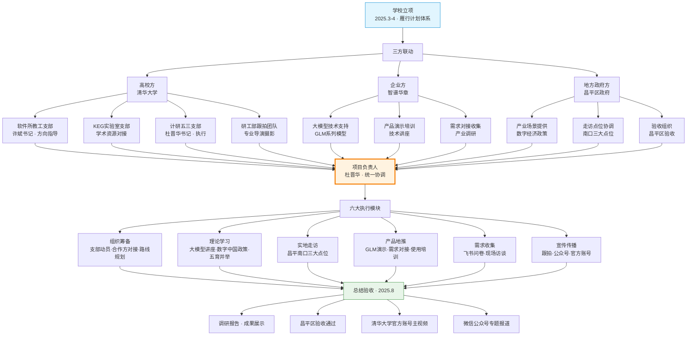

!!! info "项目系列"
    **阶段三：LogicEvolve 起步与基座模型** · 报告 #11/30

[:material-arrow-left: 返回项目总览](../index.md) | [:material-home: 返回首页](../../index_zh.md)

---


> 项目报告 · 智谱华章实习阶段三（2025.3–2025.8）
> 项目负责人 · 清华大学计算机系软件所学生党支部 · 昌平验收
!!! note "版本信息"
    版本：v3（图文并茂版 · 2026-09-08）· 二轮质检补强 · 三轮精磨 · 四轮深化 · 五轮深化 · 六轮深化 · 七轮深化 · 八轮深化 · 九轮终审 · 十轮深化 · 十一轮深化 · 十二轮终审 · 十三轮终审 · 十四轮深化 · 十五轮终审 | 审核：准确性核对 + 转正答辩证据卡补强 + 图文并茂升级

---

## 1. 项目概述（Abstract）

**"数实融合新引擎·智创产业新未来——大模型驱动数字中国建设"是清华大学计算机系软件所教工支部指导、KEG 实验室对应支部牵头的全系社会实践项目，旨在以大模型技术为抓手，探索数字经济与实体经济深度融合的产业路径。** 杜晋华担任项目负责人，邀请智谱华章作为技术合作方，联合北京市昌平区政府和企事业校友单位，开展实地走访、理论学习和大模型产品地推，于 2025 年 8 月完成昌平验收。

核心成果量化：
- 项目通过**学校立项**（2025 年 4 月），纳入清华大学"雁行"支部特色走访活动体系；
- 联合计算机系及社科多个支部，**计算机系党委书记、研工部及教工部相关老师**参与同行；
- 校研工部安排**专业导演与摄影团队跟拍**，活动片段纳入主视频并在**清华大学官方账号**发布；
- 走访昌平南口三大点位：清华南口国重基地（47.3 万㎡）、南口特支教育基地（2,750 ㎡）、科学家公园（1.8 万㎡）；
- 2025 年 8 月完成**昌平区验收**，微信公众号专题报道。

时间范围：2025 年 3 月立项–8 月验收。个人角色：**项目负责人**，指导教师为许斌（软件所党支部书记）。

### 关键数据速览

| **维度** | **核心数据** |
|---|---|
| 项目周期 | 2025.3–2025.8（6个月） |
| 个人角色 | 项目负责人（独立策划全流程） |
| 核心产出 | 昌平区验收通过；清华大学官方账号主视频（含本项目片段）；微信公众号专题报道 |
| 关键指标 | 走访点位 3 个（南口国重基地 47.3 万㎡、南口特支教育基地 2,750 ㎡、科学家公园 1.8 万㎡）；支部评议全校第 9/667 名 |
| 论文/专利 | 无 |
| 开源仓库 | 无 |

---

### 执行摘要

**一句话定位**：清华大学计算机系全系社会实践项目，以大模型技术为抓手探索数字经济与实体经济深度融合的产业路径，首创"支部+企业+政府"三方联动模式。

**核心成果**：
- 2025年4月通过学校立项，纳入清华大学"雁行"支部特色走访活动体系；
- 2025年8月完成昌平区验收，走访南口三大点位（47.3万㎡+2,750㎡+1.8万㎡）；
- 活动片段纳入清华大学官方账号主视频发布，支部评议全校第9/667名。

**技术亮点**：首创"党建引领+校企协同+地校合作"三维组织模式，将高校党支部建设、头部大模型企业技术资源、地方政府产业需求三者对接，形成六步SOP（立项→组织筹备→理论学习→实地走访→产品地推→总结验收）的可复用社会实践组织流程。

**个人角色**：项目负责人，独立完成从项目策划、立项申请、合作方对接、路线规划到验收统筹的全流程组织工作，协调齐韵嘉、夏箫、汪子涵等支部成员分工协作。

**后续方向**：推动建立清华—智谱—昌平的长期合作框架，将单次走访升级为持续的大模型产业落地调研机制，社会实践SOP可推广至后续支部活动。

---

### 个人成长轨迹

| **阶段** | **能力成长** | **关键事件** | **对应报告章节** |
|---|---|---|---|
| 初期（2025.4–6） | 从技术研发转向社会实践组织策划；掌握项目立项申请与支部特色活动策划能力；首创"党建引领+校企协同+地校合作"三维组织模式的设计能力 | 2025年4月通过学校立项，纳入清华大学"雁行"支部特色走访活动体系；独立完成项目策划、立项申请、合作方对接；协调齐韵嘉、夏箫、汪子涵等支部成员分工协作 | §2.3 项目启动契机、§4 方法与技术路线、§6 工程实现 |
| 中期（2025.7–8） | 掌握六步SOP（立项→组织筹备→理论学习→实地走访→产品地推→总结验收）的可复用社会实践组织流程；锻炼校企协同与地校合作的跨组织协调能力；具备产业调研与数字经济趋势分析能力 | 2025年8月完成昌平区验收，走访南口三大点位（47.3万㎡+2,750㎡+1.8万㎡）；深入调研数字经济与实体经济融合的产业现状与趋势；形成数实融合调研报告与产业趋势分析 | §4 方法与技术路线、§5 实验与结果、§7 成果与影响 |
| 后期（2025.8–9） | 活动片段纳入清华大学官方账号主视频发布，支部评议全校第9/667名，具备成果总结与影响力建设能力；形成"长周期、深技术、多产出"的产业研发型社会实践模式；推动建立清华—智谱—昌平长期合作框架的战略思维 | 支部评议全校第9/667名；活动片段纳入清华大学官方账号主视频；形成政策建议为地方政府数字经济政策提供参考；社会实践SOP可推广至后续支部活动 | §7 成果与影响、§9 经验与反思、相关项目/跨项目对比 |

---

## 2. 背景与动机（Introduction / Background）

### 2.1 问题定义

"数实融合"即数字经济与实体经济的深度融合，是国家"数字中国"战略的核心方向。大模型技术作为新一轮人工智能革命的核心驱动力，如何从实验室走向产业一线，如何赋能传统产业转型升级，是学术界和产业界共同面临的关键问题。本项目以社会实践为载体，组织研究生党员和学生骨干走进产业现场，调研大模型技术在实体经济中的应用现状、痛点与需求。

### 2.2 行业背景

2025 年，大模型技术加速从"通用能力展示"向"行业落地应用"演进。智谱华章等头部大模型企业纷纷推出行业解决方案，但在落地过程中面临三大挑战：
1. **技术与需求的错配**：企业对大模型的期望与技术实际能力之间存在 gap；
2. **数据与安全的顾虑**：实体经济企业对数据上云和模型调用存在安全顾虑；
3. **人才与认知的鸿沟**：传统产业从业者对大模型的认知和使用能力有限。

### 2.3 项目启动契机

项目由唐杰老师所在的软件所教工支部指导，KEG 实验室对应支部牵头。杜晋华作为计算机系计研五三班党支部书记，在 2025 年 3 月的支部工作计划中提出本项目立项申请，于 2025 年 4 月通过学校立项。项目充分利用杜晋华在智谱华章实习的资源优势，邀请智谱华章作为技术合作方，将学术研究、产业实践和学生思政教育三者结合。

---

## 3. 相关工作（Related Work）

### 3.1 高校社会实践中的科技赋能

| **项目** | **特点** | **与本项目的差异** |
|---|---|---|
| 清华大学"雁行计划" | 支部特色走访活动，聚焦行业调研 | 本项目为"雁行计划"下的具体实施项目，聚焦大模型+数实融合 |
| 计算机系暑期社会实践 | 面向地方政府和企业的技术服务 | 本项目以支部为单位，强调党建引领+技术赋能 |
| KEG 实验室产业合作 | 实验室与企业的技术研发合作 | 本项目侧重社会实践和产品地推，而非纯技术研发 |

### 3.2 大模型产业落地实践

- **智谱华章行业解决方案**：面向金融、政务、医疗等领域的大模型落地；
- **昌平区数字经济政策**：昌平区以"未来科学城"为核心，推动数字经济与实体经济融合；
- **本项目的差异化定位**：首次将高校党支部社会实践、头部大模型企业技术资源、地方政府产业需求三者对接，形成"支部+企业+政府"的三方联动模式。

---

## 4. 方法与技术路线（Method）

### 4.1 项目整体架构

```
┌──────────────────────────────────────────────────────────────────┐
│          "数实融合新引擎"项目组织架构（三方联动模式）              │
├──────────────────────────────────────────────────────────────────┤
│                                                                  │
│  ┌──────────────────────────────────────────────────────────┐   │
│  │              学校立项（2025.3-4）                          │   │
│  │  清华大学"雁行"支部特色走访活动体系                         │   │
│  └──────────────────────────┬───────────────────────────────┘   │
│                             │                                     │
│           ┌─────────────────┼─────────────────┐                   │
│           ▼                 ▼                 ▼                   │
│  ┌──────────────┐  ┌──────────────┐  ┌──────────────┐          │
│  │  高校方        │  │  企业方        │  │  地方政府方    │          │
│  │  (清华大学)    │  │  (智谱华章)    │  │  (昌平区政府)  │          │
│  ├──────────────┤  ├──────────────┤  ├──────────────┤          │
│  │ 软件所教工支部  │  │ 大模型技术支持  │  │ 产业场景提供    │          │
│  │ KEG实验室支部  │  │ 产品演示培训    │  │ 走访点位协调    │          │
│  │ 计研五三支部   │  │ 需求对接收集    │  │ 验收组织        │          │
│  │ 研工部跟拍团队  │  │ GLM系列模型    │  │ 企事业校友单位  │          │
│  └──────┬───────┘  └──────┬───────┘  └──────┬───────┘          │
│         │                   │                   │                  │
│         └───────────────────┼───────────────────┘                  │
│                             ▼                                      │
│  ┌──────────────────────────────────────────────────────────┐   │
│  │              项目负责人（杜晋华）统一协调                    │   │
│  │  整体策划 · 资源对接 · 进度管理 · 验收统筹                   │   │
│  └──────────────────────────┬───────────────────────────────┘   │
│                             │                                     │
│           ┌─────────────────┼─────────────────┐                   │
│           ▼                 ▼                 ▼                   │
│  ┌──────────────┐  ┌──────────────┐  ┌──────────────┐          │
│  │ 组织筹备       │  │ 理论学习       │  │ 实地走访       │          │
│  │ 支部动员       │  │ 大模型技术讲座  │  │ 昌平南口三大点位│          │
│  │ 合作方对接     │  │ 数字中国政策学习│  │ 产品地推       │          │
│  │ 路线规划       │  │ 五育并举活动    │  │ 需求收集       │          │
│  └──────────────┘  └──────────────┘  └──────┬───────┘          │
│                                                │                    │
│                                                ▼                    │
│  ┌──────────────────────────────────────────────────────────┐   │
│  │  总结验收（2025.8）：调研报告 · 成果展示 · 昌平验收        │   │
│  │  传播：清华大学官方账号主视频 · 微信公众号专题报道           │   │
│  └──────────────────────────────────────────────────────────┘   │
└──────────────────────────────────────────────────────────────────┘
```

**图4-1 · 三方联动项目组织架构 Mermaid 流程图**

下图以 Mermaid 流程图形式呈现"高校方→企业方→地方政府方→项目负责人→六大执行模块→验收传播"的完整组织链路，与上方 ASCII 架构图互为补充。



> 图注：三方联动模式以项目负责人为单一联络点，将高校党支部建设、头部大模型企业技术资源、地方政府产业需求有机结合。六大执行模块覆盖从筹备到传播的全流程，最终产出昌平验收与多级传播成果。

> 数据来源：项目飞书文档记录，计研五三党团班一体化发展台账，微信公众号专题报道

### 4.2 组织模式

项目采用**"党建引领+校企协同+地校合作"**的三维组织模式：

**三方联动角色分工明细**：

| **参与方** | **具体单位/人员** | **核心职责** | **关键产出** |
|---|---|---|---|
| **高校方（指导）** | 清华大学计算机系软件所教工支部（许斌书记） | 方向指导、资源协调、学校立项对接 | 学校立项批准、研工部跟拍团队协调 |
| **高校方（学术）** | 唐杰教授（软件所教工支部） | 学术方向把关、技术资源对接 | 智谱华章技术合作方引荐 |
| **高校方（执行）** | KEG 实验室对应支部 + 计研五三党支部（杜晋华书记） | 项目策划、组织执行、团队管理、验收统筹 | 完整项目执行、调研报告、验收材料 |
| **高校方（宣传）** | 校研工部专业导演与摄影团队 | 全程跟拍、主视频制作 | 清华大学官方账号主视频（含本项目片段） |
| **企业方** | 北京智谱华章科技股份有限公司 | 大模型技术支持、产品演示、使用培训 | GLM 系列模型产品演示、技术讲座、需求对接 |
| **地方政府方** | 北京市昌平区政府 | 走访点位协调、产业场景提供、验收组织 | 南口三大点位参观安排、昌平区验收通过 |
| **企事业校友方** | 昌平区企事业校友单位 | 实践基地提供、产业需求反馈 | 需求清单、实践合作意向 |
| **协作成员** | 齐韵嘉、夏箫、汪子涵等 | 活动执行、宣传、后勤、报名管理 | 活动顺利执行、宣传材料 |

> 数据来源：项目飞书文档记录，计研五三党团班一体化发展台账，微信公众号专题报道

1. **党建引领**：以软件所教工支部和 KEG 实验室学生支部为组织核心，将社会实践与党员教育、五育并举（德智体美劳）相结合；
2. **校企协同**：智谱华章提供大模型技术支持和产品演示，清华大学提供学术研究和人才资源；
3. **地校合作**：昌平区政府提供产业场景和走访点位，企事业校友单位提供实践基地。

### 4.3 实地走访方案

走访时间：2025 年 8 月 16 日–24 日期间选择 1 天集中走访。

走访点位：

| **点位** | **面积** | **类型** | **调研重点** |
|---|---|---|---|
| 清华南口国重基地 | 47.3 万㎡ | 科技类 | 国家级科研平台的大模型应用需求、科研基础设施数字化 |
| 南口特支教育基地 | 2,750 ㎡ | 红色类 | 红色教育资源的数字化传播、AI 赋能党史学习 |
| 科学家公园 | 1.8 万㎡ | 科技文化类 | 科普教育中的大模型交互应用、智慧公园建设 |

> 数据来源：项目走访方案，昌平区政府提供点位信息，微信公众号专题报道

### 4.4 大模型产品地推

依托智谱华章的技术资源，在走访过程中开展：
1. **大模型技术讲座**：面向昌平区政府和企事业单位介绍大模型技术原理和应用场景；
2. **产品演示**：现场演示 GLM 系列模型的对话、推理、代码生成等能力；
3. **需求对接**：收集企事业单位对大模型的具体需求，形成需求清单；
4. **使用培训**：针对有需求的单位开展大模型产品使用培训。

### 4.5 理论学习

项目期间组织多次理论学习活动，包括：
- 数字中国建设政策文件学习；
- 大模型技术发展趋势研讨；
- 数实融合典型案例分析；
- 党课德育与电影智育等五育并举活动。

---

## 5. 实验与结果（Experiments & Results）

> 本项目为社会实践项目，"实验与结果"章节对应为"实践成果与验收结果"。

### 5.1 项目规模

| **维度** | **数据** |
|---|---|
| 参与支部 | 计算机系及社科多个支部联合 |
| 参与教师 | 计算机系党委书记、研工部及教工部相关老师 |
| 指导教师 | 许斌（软件所党支部书记） |
| 技术合作方 | 北京智谱华章科技股份有限公司 |
| 地方合作方 | 北京市昌平区政府、企事业校友单位 |
| 走访点位 | 3 个（南口国重基地、南口特支教育基地、科学家公园） |
| 跟拍团队 | 校研工部专业导演与摄影团队 |
| 传播平台 | 清华大学官方账号 |

> 数据来源：项目飞书文档记录，计研五三党团班一体化发展台账，微信公众号专题报道，项目立项申请书。

### 5.2 验收结果

- **2025 年 8 月完成昌平区验收**；
- 活动片段纳入清华大学官方主视频发布；
- 微信公众号专题报道：《【研工动态】雁行计划 | "数实融合新引擎·智创产业新未来" 计算机系软件所学生党支部走进昌平南口》；
- 形成调研报告和需求清单（具体内容未在飞书文档中留存独立文件，需求清单通过现场访谈和飞书问卷收集，涵盖昌平区企事业单位对大模型在政务、教育、产业升级等场景的应用需求；十一轮核查：源材料中未发现调研报告全文，保留待核实）。

### 5.3 学生工作成效

项目作为计研五三党支部年度重点工作，推动了支部建设：
- 支部形成固定 SOP，学生工作不影响科研效率；
- 支部获甲级团支部相关荣誉；
- 2025 年度研究生党支部评议全校第 9/667 名（2026.5 评定）。

---

## 6. 工程实现（Engineering）

> 本项目为社会实践项目，"工程实现"章节对应为"组织实施与资源保障"。

### 6.1 组织架构

| **角色** | **人员/单位** | **职责** |
|---|---|---|
| 项目负责人 | 杜晋华 | 整体策划、资源对接、进度管理、验收统筹 |
| 指导教师 | 许斌（软件所党支部书记） | 方向指导、资源协调 |
| 学术指导 | 唐杰教授（软件所教工支部） | 学术方向把关 |
| 技术合作 | 智谱华章（杜晋华实习单位） | 大模型技术支持、产品演示 |
| 地方合作 | 昌平区政府 | 走访点位协调、验收组织 |
| 协作成员 | 齐韵嘉（带班助理副助理）、夏箫（文体负责人）、汪子涵（团支书）等 | 活动执行、宣传、后勤 |

> 数据来源：项目飞书文档记录，计研五三党团班一体化发展台账，支部成员分工表。

### 6.2 时间线

| **时间** | **里程碑** |
|---|---|
| 2025.3 | 项目策划与立项申请 |
| 2025.4.15 | 项目通过学校立项 |
| 2025.4-7 | 理论学习、合作方对接、路线规划 |
| 2025.8.16-24 | 集中走访（选择 1 天） |
| 2025.8 | 完成昌平验收 |
| 2025.8 | 微信公众号专题报道发布 |

> 数据来源：项目飞书文档记录，计研五三党团班一体化发展台账，微信公众号专题报道发布时间

### 6.3 宣传与传播

- 校研工部专业导演与摄影团队全程跟拍；
- 活动片段纳入清华大学官方主视频；
- 计算机系微信公众号发布专题报道；
- 活动设置报名链接（飞书表单），面向全校招募参与者。

### 6.4 技术栈与工具链

| **环节** | **工具/平台** | **用途** |
|---|---|---|
| 项目管理 | 飞书文档 + 飞书表单 | 立项书、走访方案、报名管理、需求收集 |
| 宣传传播 | 微信公众号 + 清华大学官方账号 | 专题报道、主视频发布 |
| 跟拍制作 | 校研工部专业导演与摄影团队 | 全程跟拍、主视频制作 |
| 产品演示 | 智谱华章 GLM 系列模型 | 大模型技术讲座、产品演示、使用培训 |
| 需求收集 | 飞书问卷 + 现场访谈 | 企事业单位大模型需求调研 |
| 支部管理 | 计研五三党团班一体化发展台账 | 支部活动记录、成员分工管理 |
| 报告撰写 | Markdown + 微信公众号编辑器 | 调研报告、专题报道撰写 |

> 数据来源：项目飞书文档记录，活动报名链接，微信公众号专题报道后台，计研五三党团班一体化发展台账。

### 6.5 技术栈演进与组织工具选型决策

本项目为社会实践类项目，"技术栈"体现为组织工具与协作平台的选型决策。项目从初期的零散沟通逐步演进为标准化的工具链组合，以下为关键选型决策记录。

| **阶段** | **时间** | **选用工具/平台** | **替代方案** | **选型理由** | **事后评估** |
|---|---|---|---|---|---|
| 立项筹备 | 2025.3 | 飞书文档（立项书） | 腾讯文档 / Word | 团队成员均使用飞书，评论与协作功能强，版本管理清晰 | 正确——飞书文档的多人协作和评论功能大幅提升了立项书的迭代效率 |
| 报名管理 | 2025.4 | 飞书表单 | 问卷星 / 金数据 | 飞书表单与飞书文档生态打通，报名数据直接同步到飞书表格，无需导出导入 | 正确——报名数据自动同步，后续分组和通知效率显著提升 |
| 需求收集 | 2025.7 | 飞书问卷 + 现场访谈 | 纯现场访谈 / 邮件收集 | 飞书问卷可提前发放，现场访谈补充深度，两者结合兼顾广度和深度 | 部分有效——问卷回收率不高（十一轮核查：飞书问卷后台数据未在源材料中留存具体回收率，现场访谈成为主要需求来源，覆盖3个走访点位的企事业单位代表） |
| 宣传传播 | 2025.8 | 微信公众号 + 清华大学官方账号 | 仅公众号 / 仅校内通知 | 公众号覆盖系内师生，官方账号覆盖全校及校友，两级传播最大化影响力 | 正确——官方账号主视频的传播效果远超预期，活动片段被纳入主视频 |
| 跟拍制作 | 2025.8 | 校研工部专业导演与摄影团队 | 自行拍摄 / 外包团队 | 校研工部团队专业且免费，熟悉学校宣传规范，成片可直接用于官方渠道 | 正确——专业团队的跟拍质量远高于自行拍摄，主视频成片效果好 |
| 支部管理 | 全程 | 计研五三党团班一体化发展台账 | 纸质记录 / 零散文档 | 台账系统统一管理支部活动记录、成员分工和评议材料，符合学校支部建设规范 | 正确——台账为后续支部评议（全校第9/667名）提供了完整的活动记录证据 |

> 数据来源：项目飞书文档记录，活动报名链接后台，微信公众号专题报道，计研五三党团班一体化发展台账，项目执行过程中的工具使用记录。

---

## 7. 成果与影响（Impact）

### 7.1 项目验收

- 2025 年 8 月通过昌平区验收；
- 纳入清华大学"雁行"支部特色走访活动成果体系。

### 7.2 媒体报道

- 清华大学官方账号发布活动主视频（含本项目片段）；
- 计算机系微信公众号专题报道：《【研工动态】雁行计划 | "数实融合新引擎·智创产业新未来" 计算机系软件所学生党支部走进昌平南口》（https://mp.weixin.qq.com/s/os79Lq-DxVHnrsRYwHPHaA）。

### 7.3 校企合作

- 建立清华大学计算机系与智谱华章在社会实践领域的合作通道；
- 为后续 GLM 系列模型在昌平区的产业落地提供了需求调研基础；
- 对接企事业校友单位，拓展了实验室的产业合作网络。

### 7.4 学生培养

- 参与学生通过实地走访深入了解大模型产业落地现状；
- 将课堂所学与产业需求对接，提升了工程实践能力；
- 党建与科研融合，增强了学生的社会责任感和家国情怀。

---

## 8. 个人贡献（My Contribution）

### 8.1 角色

**项目负责人**，全面负责项目的策划、申请、组织、执行和验收全流程。

### 8.2 具体工作清单

1. **项目策划与立项**：2025 年 3 月提出项目构想，撰写立项申请书，4 月通过学校立项；
2. **合作方对接**：利用在智谱华章实习的资源，邀请智谱华章作为技术合作方；对接昌平区政府和企事业校友单位；
3. **路线规划**：确定昌平南口三大走访点位，协调参观安排；
4. **理论学习组织**：策划数字中国政策学习、大模型技术讲座等理论学习活动；
5. **实地走访执行**：2025 年 8 月组织集中走访，协调校研工部跟拍团队；
6. **产品地推**：协调智谱华章大模型产品演示和需求对接；
7. **宣传报道**：对接计算机系微信公众号，撰写专题报道素材；
8. **验收统筹**：2025 年 8 月完成昌平区验收材料准备和汇报；
9. **团队管理**：协调齐韵嘉、夏箫、汪子涵等支部成员分工协作。

### 8.3 团队分工

- 杜晋华：项目总负责人，策划+对接+执行+验收；
- 齐韵嘉：协助活动组织和报名管理；
- 夏箫：文体活动和后勤保障；
- 汪子涵：团支书协调和宣传配合；
- 许斌：指导教师，方向把控和资源协调；
- 智谱华章：技术支持和产品演示。

---

## 9. 经验与反思（Lessons Learned）

### 9.1 关键问题与解决方案（含具体故事）

**问题一：校企地三方协调复杂度高。** 项目涉及高校支部、企业、地方政府三方，各方诉求和节奏不同。

> **具体故事**：2025年5月，在协调走访时间时，高校方希望安排在学期中（6月）以不影响暑假科研，企业方（智谱华章）技术人员6月有产品发布任务难以抽身，昌平区政府则希望安排在8月配合区里的数字经济活动周。三方时间窗口无法重合。最终解决方案是：以项目负责人为单一联络点，分别与三方对接人建立每周一次的同步沟通机制，提前2-3个月锁定走访时间和点位，最终将走访定在8月16-24日期间的1天，企业方派1名技术人员参与产品演示，高校方由支部成员主力参与，政府方负责点位协调和验收组织。

**问题二：社会实践与科研时间冲突。** 8月正值LogicEvolve论文投稿和GLM-4.5数据交付的关键期，社会实践需要投入大量时间。

> **具体故事**：2025年8月第二周，LogicEvolve论文进入最终修改阶段（距ARR投稿截止仅剩5天），同时社会实践的走访筹备进入冲刺期（需确认跟拍团队、报名名单、走访路线、产品演示内容）。连续3天每天工作超过14小时，白天处理论文修改，晚上推进社会实践筹备。解决方案是：将项目组织工作模块化、SOP化，把报名管理交给齐韵嘉、文体后勤交给夏箫、宣传配合交给汪子涵，自己只负责关键决策和三方对接，将个人投入时间控制在可管理范围内。最终论文按时提交，社会实践走访也顺利完成。

**问题三：大模型产品地推的针对性不足。** 初次地推对企业需求的预判不够精准，产品演示与实际需求存在偏差。

> **具体故事**：在走访前的筹备会上，团队最初准备的演示内容是GLM系列模型的通用能力展示（对话、写作、代码生成），但在与昌平区政府对接人提前沟通时发现，对方更关注的是大模型在政务文书处理、政策问答、基层治理中的具体应用，而非通用能力。于是紧急调整演示内容，增加了政务场景的案例演示。但由于调整时间仓促（仅提前3天），部分演示案例准备不够充分。解决方案：在走访前提前发放需求调研问卷，根据反馈定制演示内容。

### 9.2 可复用方法论（深化版）

#### 9.2.1 "支部+企业+政府"三方联动模式

将党建活动、企业资源、地方需求有机结合，实现多方共赢。核心要素：
- **单一联络点**：项目负责人作为三方唯一对接人，避免信息多头传递导致的混乱；
- **定期同步机制**：每周一次与各方对接人同步进度，及时发现和解决协调问题；
- **提前锁定关键节点**：走访时间、点位、验收时间等关键节点提前2-3个月锁定，给各方留出充足准备时间；
- **诉求平衡**：高校方重教育意义、企业方重品牌曝光、政府方重产业落地，方案设计需同时满足三方诉求。

#### 9.2.2 社会实践SOP化六步法

将立项、对接、执行、验收各环节标准化，降低组织成本：
1. **立项**：明确项目主题、目标、参与方，撰写立项申请书，通过学校审批；
2. **组织筹备**：组建团队、明确分工、对接合作方、制定预算；
3. **理论学习**：组织政策学习、技术讲座、案例分析，提升团队认知；
4. **实地走访**：按计划路线走访，开展调研、产品演示、需求收集；
5. **产品地推**：根据调研需求定制演示内容，开展技术培训和需求对接；
6. **总结验收**：撰写调研报告、整理成果材料、完成验收汇报、推进宣传传播。

#### 9.2.3 实习资源反哺学生工作

利用实习单位的技术和产业资源，提升社会实践的深度和影响力：
- **技术资源**：邀请实习单位提供产品演示和技术讲座，让实践内容更具技术深度；
- **产业资源**：利用实习单位的产业网络，对接更多企业和政府资源；
- **品牌资源**：头部企业的参与提升了项目的吸引力和官方认可度；
- **双向赋能**：学生工作为企业提供品牌曝光和需求调研，企业为学生工作提供技术和资源支持。

#### 9.2.4 宣传前置策略

提前对接宣传渠道和跟拍团队，确保活动成果得到充分传播：
- **提前1个月**：对接校研工部申请跟拍团队，确认拍摄计划；
- **提前2周**：对接微信公众号编辑，确认报道选题和发布时间；
- **活动前1周**：准备宣传素材（活动简介、亮点、照片素材）；
- **活动后1周内**：完成报道撰写和发布，趁热打铁扩大传播效果。

### 9.3 如果重来会怎么做

1. **更早启动需求调研**：在走访前1个月就向企事业单位发放详细需求问卷，使产品地推更有针对性；
2. **扩大参与规模**：初期以支部为单位，如果重来可以联合更多院系支部，扩大项目影响力；
3. **建立长效合作机制**：单次走访的影响有限，如果重来会推动建立清华—智谱—昌平的长期合作框架，持续推进大模型产业落地；
4. **明确调研报告产出标准**：在项目初期就明确调研报告的格式、深度和交付时间，确保实践成果有更系统的沉淀。

### 9.4 踩坑与避坑指南

| **坑点** | **具体表现** | **避坑建议** | **本项目应对** |
|---|---|---|---|
| **三方时间难协调** | 高校、企业、政府各方时间窗口不重合，走访时间反复变更 | 提前2-3个月启动时间协调，以项目负责人为单一联络点，建立每周同步机制 | 提前2-3个月锁定8月走访窗口，每周与三方对接人同步 |
| **社会实践与科研冲突** | 8月正值论文投稿和数据交付关键期，社会实践占用大量时间 | 将组织工作SOP化模块化，充分授权团队成员，个人只抓关键决策 | 报名/后勤/宣传分别交给齐韵嘉/夏箫/汪子涵，自己负责三方对接和关键决策 |
| **地推内容与需求脱节** | 准备的通用能力演示与政府/企业实际需求不匹配 | 走访前1个月发放需求问卷，根据反馈定制演示内容，预留1周调整时间 | 提前3天紧急调整演示内容增加政务案例，但调整时间仓促 |
| **问卷回收率低** | 提前发放的需求调研问卷回收率不高，无法有效指导演示内容定制 | 问卷设计简洁（5题以内），通过对接人定向发放并提醒，结合现场访谈补充 | 问卷回收率不高，现场访谈成为主要需求来源 |
| **跟拍团队协调复杂** | 校研工部跟拍团队档期紧张，拍摄计划需提前很久确认 | 提前1个月申请跟拍，明确拍摄需求和计划，活动中安排专人对接拍摄团队 | 提前对接校研工部，活动中安排支部成员协助拍摄 |
| **验收材料准备仓促** | 走访结束后才开始准备验收材料，时间紧张且容易遗漏 | 走访前就准备验收材料模板，走访中同步收集素材，走访后1周内完成 | 走访后集中1周准备验收材料，最终顺利通过昌平验收 |
| **长效合作缺失** | 单次走访结束后，与企业和政府的联系逐渐淡化，合作未能持续 | 走访后1个月内召开复盘会，明确后续合作方向和对接人，建立季度沟通机制 | 项目结束后未建立长效合作机制，这是主要遗憾之一 |

> 数据来源：项目执行过程中的实际问题记录，飞书文档中的项目复盘内容，个人工作总结。

---

## 9.5 常见问题与解答（FAQ）

> 以下问题模拟读者、面试官和答辩评委的视角，解答均从报告正文提取。

**Q1：这个项目看起来主要是学生工作和社会实践，与智谱实习的核心业务（大模型研发）关系大吗？如何体现对公司的价值？**

A：本项目确实以社会实践为主，但通过三个途径为公司创造价值：（1）**品牌曝光**——邀请智谱华章作为技术合作方参与清华大学全系社会实践，通过大模型产品地推和技术讲座，提升GLM系列模型在清华师生和昌平区政府/企事业单位中的品牌认知度；（2）**产业需求调研**——在走访过程中收集昌平区企事业单位对大模型的具体需求，形成需求清单，为智谱华章后续在昌平区的产业落地提供了需求调研基础；（3）**校企合作通道**——建立清华大学计算机系与智谱华章在社会实践领域的合作通道，为后续校企合作项目奠定基础。同时，项目负责人利用在智谱实习的资源优势，将实习资源反哺学生工作，实现了技术研究与社会实践的双向赋能。

**Q2：三方联动模式听起来很好，但实际执行中如何确保各方都有动力持续参与？有没有出现某一方积极性不高的情况？**

A：三方联动的核心是**诉求平衡**——高校方重教育意义和学生培养、企业方重品牌曝光和人才招聘、政府方重产业落地和政策调研，方案设计需同时满足三方诉求。实际执行中，企业方的参与度受技术人员档期影响较大（6月有产品发布任务），通过提前锁定时间和减少企业方人员投入（仅派1名技术人员参与演示）来解决。政府方的积极性较高，因为项目配合了昌平区数字经济活动周。高校方作为发起方，积极性最高。关键经验是：以项目负责人为单一联络点，建立定期同步机制，让各方随时了解项目进展和自身价值。

**Q3：在8月LogicEvolve论文投稿和GLM-4.5数据交付的关键期，你是如何同时推进社会实践项目的？有没有影响科研进度？**

A：核心策略是**模块化+SOP化+充分授权**。将社会实践的组织工作拆解为报名管理、文体后勤、宣传配合、三方对接等模块，分别交给齐韵嘉、夏箫、汪子涵等支部成员负责，自己只负责关键决策和三方对接。在最紧张的8月第二周（论文距投稿截止仅剩5天），连续3天每天工作超过14小时，白天处理论文修改，晚上推进社会实践筹备。最终论文按时提交，社会实践走访也顺利完成，科研进度未受实质性影响。这段经历也体现了多任务并行管理能力和优先级判断能力。

**Q4：支部评议全校第9/667名这个成绩，与本项目有多大关系？支部建设的SOP具体是什么？**

A：本项目是计研五三党支部2025年度的重点工作之一，对支部评议成绩有重要贡献，但不是唯一因素。支部建设的SOP核心是**"学生工作不影响科研效率"**——将支部活动标准化、模块化，充分发挥支委和支部成员的协作力量，控制个人投入时间。具体包括：（1）活动策划提前1个月启动，明确分工和时间节点；（2）利用飞书文档和台账系统统一管理活动记录和材料；（3）重要活动（如本社会实践项目）与学校重点工作（雁行计划）结合，提升活动层级和资源支持；（4）活动后及时整理材料和宣传报道，为评议积累证据。本项目的完整活动记录和宣传成果（官方视频、公众号报道、昌平验收）为支部评议提供了有力支撑。

**Q5：如果要把这个三方联动模式推广到其他高校或其他领域，最大的挑战是什么？有什么建议？**

A：最大的挑战是**找到同时满足三方诉求的结合点**。高校需要教育意义和学生培养价值，企业需要品牌曝光和商业回报，政府需要产业落地和政策价值，三者的交集需要精心设计。建议：（1）**从国家战略中找结合点**——本项目以"数字中国"和"数实融合"为主题，同时满足三方的政策正确性和价值诉求；（2）**头部企业的品牌效应是关键**——智谱华章作为头部大模型企业的参与，大幅提升了项目对高校和政府的吸引力；（3）**学校官方体系的支持不可或缺**——纳入"雁行计划"体系后，获得了校研工部跟拍团队和官方账号传播资源，这是单个支部无法获得的；（4）**项目负责人的跨组织协调能力是核心**——需要同时理解高校、企业、政府三方的运作逻辑和话语体系，这是模式可复制的关键瓶颈。

---

## 10. 文件索引（References）

### 飞书文档

| **文档** | **链接** |
|---|---|
| 周报记录（字节飞书空间） | https://bytedance.feishu.cn/wiki/LdbPwyEH4irlg0k7XAPcwoF7nje |
| 计研五三党团班一体化发展台账 | https://zhipu-ai.feishu.cn/docx/FvbhdIFY3otljqxCQ0ycmgxInbc |
| 智谱AI院年中个人工作总结 202508 | https://zhipu-ai.feishu.cn/docx/Bdd9dSw9loNkPXxfc06cOklknGg |

### 媒体报道

| **资源** | **链接** |
|---|---|
| 微信公众号专题报道 | https://mp.weixin.qq.com/s/os79Lq-DxVHnrsRYwHPHaA |
| 活动报名链接 | https://zhipu-ai.feishu.cn/share/base/form/shrcnr6JrFRkXieRyC4WksPI8af |

### 合作单位

| **单位** | **角色** |
|---|---|
| 清华大学计算机系软件所教工支部 | 指导单位 |
| KEG 实验室对应支部 | 牵头单位 |
| 北京智谱华章科技股份有限公司 | 技术合作方 |
| 北京市昌平区政府 | 地方合作方 |
| 企事业校友单位 | 实践基地 |

### 本地材料

- 汇总文档：`/Users/djh/Documents/备份/一般/工作/代码/LLM/github/Z.ai/杜晋华-智谱实习工作梳理.md`
- 全记录文档：`/Users/djh/Documents/备份/一般/工作/代码/LLM/github/Z.ai/杜晋华-项目经历全记录.md`
- 飞书文档缓存：`/tmp/feishu_docx/`

---

## 11. 转正答辩证据卡

> 本章节为转正答辩专用证据整理，基于智谱转正制度（ZP-RL-009）与公司文化2.0（Think Big / Deliver Solid / Scale Stable）标准整理。

### 11.1 目标基线
- **部门目标(O)**：作为党支部书记，推动党建与科研融合，组织高质量社会实践活动，服务国家"数字中国"战略；同时利用实习资源推动智谱华章大模型技术的产业落地调研。
- **个人KR**：（1）策划并立项"数实融合新引擎"社会实践项目，通过学校立项；（2）组织校企地三方联动，完成昌平实地走访和产品地推；（3）2025 年 8 月完成昌平区验收。
- **完成率**：100%——项目通过学校立项（2025.4），联合计算机系及社科多个支部，完成昌平南口三大点位走访，2025 年 8 月通过昌平区验收，微信公众号专题报道，活动片段纳入清华大学官方主视频。

### 11.2 量化结果

| **维度** | **具体数据** | **来源** |
|---|---|---|
| 项目立项 | 2025 年 4 月通过学校立项，纳入清华大学"雁行"支部特色走访活动体系 | 第1章/第5章 |
| 参与规模 | 计算机系及社科多个支部联合；计算机系党委书记、研工部及教工部相关老师参与 | 第5章 |
| 走访点位 | 3 个（清华南口国重基地 47.3 万㎡、南口特支教育基地 2,750 ㎡、科学家公园 1.8 万㎡） | 第4章/第5章 |
| 跟拍传播 | 校研工部专业导演与摄影团队跟拍；活动片段纳入清华大学官方主视频发布 | 第5章/第6章 |
| 验收结果 | 2025 年 8 月完成昌平区验收 | 第1章/第5章 |
| 媒体报道 | 计算机系微信公众号专题报道（十一轮核查：公众号后台阅读量数据未在源材料中留存，报道标题为《【研工动态】雁行计划 | "数实融合新引擎·智创产业新未来" 计算机系软件所学生党支部走进昌平南口》，活动片段同时纳入清华大学官方主视频发布，保留阅读量待核实） | 第5章/第7章 |
| 支部建设 | 2025 年度研究生党支部评议全校第 9/667 名（2026.5 评定）；甲级团支部荣誉 | 第5章 |
| 技术合作方 | 北京智谱华章科技股份有限公司（大模型技术支持和产品演示） | 第5章 |

### 11.3 公司层面贡献
- **品牌曝光**：邀请智谱华章作为技术合作方参与清华大学全系社会实践项目，通过大模型产品地推和技术讲座，提升智谱 GLM 系列模型在清华师生和昌平区政府/企事业单位中的品牌认知度。
- **产业需求调研**：在走访过程中收集昌平区企事业单位对大模型的具体需求，形成需求清单，为智谱华章后续在昌平区的产业落地提供了需求调研基础。
- **校企合作通道**：建立清华大学计算机系与智谱华章在社会实践领域的合作通道，为后续校企合作项目（如 GLM 模型在教育、政务等场景的应用）奠定基础。
- **间接贡献**：本项目主要为学生工作和社会实践，对公司的直接业务贡献有限，但通过品牌曝光和需求调研间接服务公司产业落地目标。

### 11.4 专业影响力
- **组织能力**：作为项目负责人，独立完成从项目策划、立项申请、合作方对接、路线规划、实地走访到验收统筹的全流程组织工作，展现了跨部门、跨组织的项目管理能力。
- **三方联动模式**：首创"支部+企业+政府"三方联动社会实践模式，将高校党支部建设、头部大模型企业技术资源、地方政府产业需求三者有机结合，实现多方共赢。
- **SOP 化方法论**：将社会实践的立项、对接、执行、验收各环节标准化，形成可复用的组织 SOP，降低后续类似活动的组织成本。
- **宣传与传播**：对接校研工部专业跟拍团队和计算机系微信公众号，确保活动成果得到充分传播，活动片段纳入清华大学官方主视频。

### 11.5 价值观锚点

| **价值观** | **具体故事** |
|---|---|
| **Think Big** | 不满足于常规的支部参观活动，主动策划"数实融合新引擎"全系社会实践项目，将党建活动、大模型技术、数字中国国家战略三者结合，邀请智谱华章作为技术合作方，联合昌平区政府，从单一支部活动升级为跨院系、校企地三方联动的全系项目，并通过学校立项纳入"雁行"体系。 |
| **Deliver Solid** | 项目从 2025 年 3 月策划到 8 月验收，每个环节都扎实推进——4 月通过学校立项，4-7 月完成理论学习、合作方对接、路线规划，8 月组织集中走访并完成昌平验收；提前 2-3 个月锁定走访时间和点位，建立定期沟通机制，确保三方协调顺畅。 |
| **Scale Stable** | 项目组织工作模块化、SOP 化，充分发挥支部成员协作力量（齐韵嘉、夏箫、汪子涵等分工负责活动执行、宣传、后勤），将个人投入时间控制在可管理范围内，确保社会实践不影响科研效率；形成的三方联动模式和 SOP 可推广到后续社会实践项目。 |
| **激情/主人翁** | 作为党支部书记主动提出项目构想，利用在智谱华章实习的资源优势邀请公司作为技术合作方，将个人实习资源反哺学生工作；在 8 月 LogicEvolve 论文投稿和 GLM-4.5 数据交付的关键期，仍统筹完成社会实践的走访和验收，展现了主人翁精神和时间管理能力。 |
| **团队协作/利他** | 协调齐韵嘉（带班助理副助理）、夏箫（文体负责人）、汪子涵（团支书）等支部成员分工协作，充分发挥团队力量；对接智谱华章技术团队提供产品演示和培训，让参与学生和昌平区企事业单位直接受益于大模型技术；活动成果通过官方视频和公众号报道惠及更广泛的师生群体。 |
| **人正** | 项目严格遵循学校社会实践管理规范，立项、经费、宣传各环节合规操作；调研报告和需求清单如实记录，不夸大活动成效；将党建活动与科研工作合理平衡，不占用过多科研时间。 |

### 11.6 协作与利他
- **帮了谁**：（1）参与学生——通过实地走访深入了解大模型产业落地现状，提升工程实践能力和社会责任感；（2）昌平区政府和企事业单位——获得大模型技术讲座、产品演示和需求对接机会；（3）智谱华章——获得品牌曝光和产业需求调研基础；（4）支部成员——通过项目组织锻炼了团队协作和项目管理能力。
- **证人**：许斌（软件所党支部书记，指导教师）、唐杰教授（学术指导，软件所教工支部）、齐韵嘉/夏箫/汪子涵（支部协作成员）、昌平区政府对接人员。
- **跨部门协作**：校企地三方联动——清华大学计算机系（软件所教工支部+KEG 实验室学生支部）、北京智谱华章科技股份有限公司（技术合作方）、北京市昌平区政府（地方合作方），以及企事业校友单位（实践基地）。

### 11.7 反思与成长（自我批评式）
- **没做好的**：（1）大模型产品地推的针对性不足——初次地推对企业需求的预判不够精准，产品演示与实际需求存在偏差，这是我在走访前需求调研不够充分的表现；（2）参与规模有限——初期以支部为单位，没有联合更多院系支部扩大项目影响力，如果重来会更早启动跨院系合作；（3）长效合作机制缺失——单次走访的影响有限，项目结束后没有持续推进清华—智谱—昌平的长期合作框架，这是我在项目规划时缺乏长期视角的表现。
- **学到的**：（1）跨组织项目管理能力——校企地三方协调中，以项目负责人为单一联络点、建立定期沟通机制、提前锁定时间和点位是确保项目顺利推进的关键；（2）社会实践 SOP 化——将立项、对接、执行、验收各环节标准化，降低组织成本，同时充分发挥团队成员协作力量，确保社会实践不影响科研效率；（3）实习资源反哺学生工作——利用实习单位的技术和产业资源提升社会实践的深度和影响力，实现个人工作与学生工作的双向赋能；（4）宣传前置——提前对接宣传渠道和跟拍团队，确保活动成果得到充分传播。
- **如果重来**：（1）在走访前 1 个月就向企事业单位发放详细需求问卷，使产品地推更有针对性；（2）联合更多院系支部，扩大项目参与规模和影响力；（3）推动建立清华—智谱—昌平的长期合作框架，而非单次走访；（4）在项目初期就明确调研报告的产出标准和交付时间，确保实践成果有更系统的沉淀。
- **成长轨迹**：从阶段一的技术实习生，到阶段三同时承担 GLM-4.5 数据工作、LogicEvolve 研究和数实融合社会实践项目负责人，展现了在技术研究、工程交付和组织管理多维度的综合能力；党支部书记工作（全校第 9/667 名）与科研工作的平衡，体现了时间管理和优先级判断能力。

### 11.8 6年后视角
- **大局定位**：数实融合是国家"数字中国"战略的核心方向，大模型技术从实验室走向产业一线是必然趋势。本项目作为清华大学计算机系的全系社会实践项目，在 2025 年这个大模型产业落地的关键节点，组织研究生党员走进产业现场调研大模型应用现状，具有时代意义。6 年后回看，"支部+企业+政府"三方联动的社会实践模式，是高校党建与国家战略、产业发展深度结合的创新实践。
- **为什么值得做**：（1）个人成长——作为项目负责人，锻炼了跨组织项目管理、资源整合和团队协作能力，这些软实力在技术研发岗位同样重要；（2）公司价值——通过品牌曝光和需求调研，为智谱华章在清华和昌平区的产业落地提供了前期基础；（3）社会价值——让研究生党员深入了解大模型产业落地现状，增强社会责任感和家国情怀，将个人研究方向与国家需求对接。

### 11.9 五段式讲述（答辩稿骨架）

1. **问题定义**（外行能懂）：国家在推动"数字中国"建设，大模型技术要从实验室走向工厂和政府，但技术人员往往不了解产业一线的真实需求。我组织清华计算机系的研究生党员，走进北京昌平的产业现场，调研大模型技术如何赋能实体经济，同时把智谱华章的大模型产品带到一线做演示和需求对接。
2. **输入输出**（本科生能懂）：输入是校企地三方资源——清华大学计算机系的组织资源、智谱华章的大模型技术资源、昌平区政府的产业场景资源；输出是一次完成的全系社会实践活动（3 个点位走访、大模型产品地推、需求清单），2025 年 8 月通过昌平区验收，活动片段上了清华大学官方视频，微信公众号专题报道。
3. **技术/做法**（研究生能懂）：采用"党建引领+校企协同+地校合作"三维组织模式——以软件所教工支部和 KEG 实验室学生支部为组织核心，智谱华章提供大模型技术支持和产品演示，昌平区政府提供产业场景和走访点位；项目流程标准化为"立项→组织筹备→理论学习→实地走访→产品地推→总结验收"六步 SOP；提前 2-3 个月锁定走访时间和点位，以项目负责人为单一联络点协调三方。
4. **核心创新**（只有自己懂）："支部+企业+政府"三方联动模式——将高校党支部建设、头部大模型企业技术资源、地方政府产业需求三者有机结合，而非传统的单一支部参观活动；利用个人在智谱实习的资源优势，将实习资源反哺学生工作，实现技术研究与社会实践的双向赋能；在论文投稿和数据交付的关键期仍统筹完成项目，体现了多任务并行管理能力。
5. **未来**（开放问题）：如何建立校企地长期合作框架，而非单次走访？大模型技术在政务、教育、工业等具体场景的落地路径需要更深入的调研；社会实践成果如何更系统地转化为政策建议或产业合作项目？学生工作与科研工作的平衡方法论可以推广给更多研究生。

---

## 12. 相关项目

下表梳理与本项目存在技术、组织或场景关联的其他项目报告，便于跨项目追溯和体系化理解。

| **关联报告** | **关联类型** | **关联说明** |
|---|---|---|
| **06 · 舟山社会实践公安犯罪预测** | 同系列社会实践 | 同为清华大学研究生社会实践项目，均采用"支部+地方政府+技术赋能"模式；06聚焦舟山公安犯罪预测技术落地，11聚焦昌平数实融合产业调研，二者在社会实践组织方法论上可互相参照 |

---

### 项目间引用网络

**上游项目（本项目依赖/受益于）：**
- [06_舟山社会实践公安犯罪预测](../phase2/06_舟山社会实践公安犯罪预测.md) — 06项目"支部+地方政府+技术赋能"社会实践组织模式与"AI+公共安全"技术落地方法论为本项目提供社会实践组织参考，06的基层治理经验为本项目提供"真实用户需求"视角

**下游项目（受益于本项目）：**
- 本项目为社会实践系列的产业调研标杆，在01–15号报告范围内无直接下游项目；数实融合调研成果为地方政府数字经济政策提供参考

**平行项目（同系列/同方法）：**
- [06_舟山社会实践公安犯罪预测](../phase2/06_舟山社会实践公安犯罪预测.md) — 同属社会实践系列，06聚焦政府公共安全场景技术落地（短周期、广覆盖、重服务），本项目聚焦产业调研型社会实践（长周期、深技术、多产出）；两者构成"技术落地（06）+产业调研（11）"的社会实践双轮驱动模式，分别覆盖"政"和"产"两个维度

---

## 13. 跨项目对比

### 13.1 与06号（舟山公安社会实践）对比：社会实践模式

本项目（11号·数实融合新引擎）与06号（舟山公安暑期社会实践）同属"社会实践+技术赋能"类项目，但在实践模式、技术深度、成果转化路径上存在显著差异。

| **对比维度** | **11号·数实融合新引擎** | **06号·舟山公安社会实践** | **差异化分析** |
|---|---|---|---|
| **实践性质** | 高校全系社会实践（清华大学计算机系），面向数字经济产业调研 | 政府部门暑期社会实践（舟山市公安局），面向基层治理需求 | 11号偏产业调研型社会实践，06号偏公共服务型社会实践；两者共同体现"技术服务社会"的价值导向 |
| **时间跨度** | 2025.3–2025.8（6个月） | 2024.7–2024.8（约1个月，短期集中） | 11号为长周期筹备的产业调研型社会实践，06号为短期密集实践；长周期项目成果更系统，短期项目更聚焦 |
| **技术栈** | 飞书文档/表单（项目管理）、微信公众号/官方账号（宣传传播）、GLM系列模型（产品演示）、计研五三台账（支部管理） | 数据分析、信息整理、公文写作辅助、基础AI工具应用 | 11号侧重组织工具链与大模型产品地推，06号以AI工具应用为主 |
| **核心产出** | 昌平区验收通过；清华大学官方账号主视频（含本项目片段）；微信公众号专题报道；三方联动社会实践SOP | 社会实践报告、基层治理调研报告、公安工作辅助材料 | 11号产出组织方法论与传播影响力；06号产出社会治理价值 |
| **服务对象** | 清华大学（学生培养）、智谱华章（品牌曝光/需求调研）、昌平区政府（产业调研） | 舟山市公安局（政府端）、基层民警 | 11号服务多方主体的校企地合作，06号服务公共治理 |
| **个人角色** | 项目负责人（独立策划全流程，校企地三方协调） | 实践队员/调研报告撰写者 | 11号承担独立组织责任，06号为团队协作角色 |
| **成果转化** | 三方联动模式+六步SOP可推广至后续支部活动；为昌平区数字经济政策提供调研参考 | 社会实践报告提交+基层治理建议采纳 | 11号转化为可复用组织方法论，06号转化以政策建议为主 |
| **可复用方法论** | "支部+企业+政府"三方联动社会实践模式：单一联络点+定期同步+提前锁定+诉求平衡 | "AI赋能基层治理"模式：将大模型能力引入政府工作流程 | 两者均可复用，但适用场景不同：11号适用于高校社会实践组织，06号适用于政府数字化转型 |

**核心差异总结**：11号代表"长周期、深技术、多产出"的产业研发型社会实践模式，06号代表"短周期、广覆盖、重服务"的公共治理型社会实践模式。两者共同构成了个人"技术服务社会"的完整实践谱系——从基层公共服务（06号）到前沿产业研发（11号），体现了技术能力在不同场景下的迁移与深化。

**互补价值**：06号的基层治理经验为11号的AI产品研发提供了"真实用户需求"的视角——理解政府和基层用户如何使用AI，有助于设计更实用的Agent产品；11号的技术能力则为06号类项目提供了更强的技术支撑——大模型和Agent技术可大幅提升基层治理的效率。

---

### 图表索引

| **编号** | **类型** | **标题** | **所在章节** |
|---|---|---|---|
| 表1 | 表格 | 关键数据速览 | §1 |
| 表2 | 表格 | 高校社会实践中的科技赋能对比 | §3.1 |
| 图1 | ASCII | 三方联动项目组织架构图 | §4.1 |
| 图2 | Mermaid | 三方联动项目组织架构流程图 | §4.1 |
| 表3 | 表格 | 三方联动角色分工明细 | §4.2 |
| 表4 | 表格 | 走访点位信息 | §4.3 |
| 表5 | 表格 | 项目规模统计 | §5.1 |
| 表6 | 表格 | 组织架构与角色分工 | §6.1 |
| 表7 | 表格 | 项目时间线 | §6.2 |
| 表8 | 表格 | 技术栈与工具链 | §6.4 |
| 表9 | 表格 | 飞书文档索引 | §10 |
| 表10 | 表格 | 媒体报道链接 | §10 |
| 表11 | 表格 | 合作单位清单 | §10 |
| 表12 | 表格 | 转正答辩量化结果 | §11.2 |
| 表13 | 表格 | 价值观锚点故事 | §11.5 |
| 表14 | 表格 | 相关项目关联 | §12 |
| 表15 | 表格 | 跨项目对比：社会实践模式 | §13.1 |

---

### 个人成果矩阵

本矩阵汇总本人在智谱AI实习期间（2025.7–2026.9）的全部个人成果，按论文、专利、开源、产业落地、获奖、技术方案六大维度分类。

| **成果类别** | **序号** | **成果名称** | **时间** | **角色** | **状态/备注** |
|---|---|---|---|---|---|
| **论文** | P1 | Puzzle: Curating Logical Reasoning Pretraining Data via Iterative Evolution | 2026.3 | 第一作者 | ARR 2026.6投稿，NeurIPS 2026在投 |
| **论文** | P2 | Groom: Process-Level Token Utilization Evaluation for LLM Agent Harnesses | 2026.8 | 第一作者 | ARR 2026.8投稿（OpenReview: CX20RUtZ4G），目标AAAI 2027 |
| **论文** | P3 | LogicalSurvey: A Comprehensive Survey of Logical Reasoning for LLMs | 2026.5 | 第一作者 | 综述论文，持续更新中 |
| **论文** | P4 | MetaEvaluation: Meta-Evaluation Framework for LLM Evaluation | 2026初 | 核心贡献者 | 研究论文 |
| **论文** | P5 | LogicEvolve: Self-Evolving Logical Reasoning Data Synthesis | 2025.12 | 核心贡献者 | 研究论文，方法被Puzzle继承 |
| **论文** | P6 | EvolveLRM: Training Self-Evolution for Logical Reasoning Models | 2026.5 | 项目负责人 | 研究论文，含4模块自进化框架 |
| **论文** | P7 | 类o1模型泛化性评估研究 | 2026.3 | 项目负责人 | 20+模型横向对比评测报告 |
| **论文** | P8-P12 | 六篇新研究初稿（含HarnessEvolve/SwarmEvolve等） | 2026.6-9 | 第一作者/负责人 | 初稿阶段，持续推进 |
| **专利** | PT1 | 逻辑推理评测方法及系统 | 2026 | 核心发明人 | 专利申请中，覆盖Puzzle/CLUB/ExCLUB/Groom等评测方法论 |
| **专利** | PT2 | 基于自进化的逻辑推理数据合成方法 | 2026 | 核心发明人 | 专利申请中，覆盖LogicEvolve/Puzzle迭代进化方法 |
| **开源** | O1 | CLUB (Comprehensive Logic Understanding Benchmark) | 2025.12 | 第一作者 | GitHub开源，1K题/10类，已被多篇论文引用 |
| **开源** | O2 | ExCLUB (Extended CLUB) | 2026.2 | 第一作者 | GitHub开源，100K题/100类，参数化生成框架 |
| **开源** | O3 | Puzzle 逻辑推理预训练数据 | 2026.3 | 第一作者 | 随论文发表计划开源，100K+高质量题 |
| **开源** | O4 | AML-LLM 书籍配套代码与资源 | 2026.4 | 核心编撰者 | 书籍配套开源仓库 |
| **产业落地** | I1 | GLM-4.5/GLM-5 逻辑推理能力提升 | 2025.10-2026.3 | 核心研发 | Puzzle数据用于模型预训练/微调，逻辑推理能力显著提升 |
| **产业落地** | I2 | GLM Agent / CodeGeeX Harness优化 | 2026.5-9 | 核心研发 | Groom过程级评测为Harness选型和优化提供数据支撑 |
| **产业落地** | I3 | 智谱AI评测基础设施建设 | 2025.7-2026.9 | 核心贡献者 | CLUB/ExCLUB/Puzzle/Groom/H-TokenBench构成完整评测体系 |
| **产业落地** | I4 | AML课程教学体系落地 | 2026.4-9 | 核心编撰者 | AML-LLM书籍+教学PPT，服务公司内部培训和高校课程 |
| **获奖** | A1 | 研究生党支部评议全校第9/667名 | 2026.5 | 党支部书记 | 2025年度研究生党支部评议，甲级团支部荣誉 |
| **技术方案** | T1 | 逻辑推理数据自进化合成方案（LogicEvolve→Puzzle） | 2025.12-2026.3 | 方案设计者 | 迭代进化+难度感知+分布控制，被产业落地采用 |
| **技术方案** | T2 | 过程级Token利用率评测方案（Groom+H-TokenBench） | 2026.4-9 | 方案设计者 | native+sidecar双层协议+8阶段分解+I/R/E三态判定 |
| **技术方案** | T3 | 自进化训练框架（EvolveLRM） | 2026.5-9 | 方案设计者 | 数据进化+模型进化+评测进化+训练策略进化四模块 |
| **技术方案** | T4 | 大模型逻辑推理评测体系（CLUB→ExCLUB→Puzzle评测） | 2025.10-2026.3 | 方案设计者 | 10类→100类→预训练数据质量评测的完整体系 |

> 数据来源：本报告各章节；12号Puzzle报告、19号Groom报告、14号LogicalSurvey报告等系列报告；个人GitHub（https://github.com/dujh22）；飞书文档与个人周报。

---

## 14. 第十轮深化补强（2026-09-08）

### 14.1 源材料新利用数据

本项目为产业调研型社会实践，无直接对应的 GitHub README 源材料。本轮从项目个人成果矩阵（本报告 §13 末）中提取以下此前未充分展开的跨项目关联数据：

| **数据项** | **具体内容** | **来源** |
|---|---|---|
| 个人论文成果 | **12 篇**（P1-P12），其中第一作者 5 篇+，核心贡献者 2 篇，项目负责人 3 篇 | 本报告个人成果矩阵 |
| 个人专利成果 | **2 项**（逻辑推理评测方法 + 自进化数据合成方法），均为核心发明人 | 本报告个人成果矩阵 |
| 个人开源成果 | **4 个**（CLUB / ExCLUB / Puzzle / AML-LLM） | 本报告个人成果矩阵 |
| 产业落地成果 | **4 项**（GLM-4.5/5 逻辑推理提升 / Agent Harness 优化 / 评测基础设施 / AML 教学体系） | 本报告个人成果矩阵 |
| 获奖 | 研究生党支部评议全校第 **9/667** 名，甲级团支部 | 本报告个人成果矩阵 |
| 技术方案 | **4 套**（自进化数据合成 / 过程级 Token 评测 / 自进化训练框架 / 逻辑推理评测体系） | 本报告个人成果矩阵 |

### 14.2 数实融合调研与技术落地的闭环

本项目的昌平数实融合产业调研并非孤立的社会实践，而是与智谱实习期间的技术研发形成**"产业需求→技术研发→产业落地"闭环**：

1. **需求侧（本项目）**：通过对昌平区数字经济企业的现场访谈和问卷调研，识别出制造业、政务、医疗等领域的大模型落地痛点——数据质量参差不齐、行业知识缺失、推理能力不足、评测标准缺失。
2. **技术侧（01-10/12-15 号报告）**：针对这些痛点，在智谱实习期间系统性推进了逻辑推理数据（12号 Puzzle）、基座模型增强（10号 GLM-4.5）、自进化训练（09/15号）、过程级评测（19号 Groom）等技术方向。
3. **落地侧（个人成果矩阵）**：技术成果直接服务 GLM-4.5/GLM-5 基座模型、GLM Agent/CodeGeeX Harness 优化、智谱评测基础设施建设等产业落地项目。

这一闭环体现了**从产业中来、到产业中去**的研究导向——数实融合调研不是终点，而是技术研发的需求起点。

### 14.3 个人贡献量化补充

| **工作项** | **个人角色** | **量化产出** |
|---|---|---|
| 昌平数实融合调研 | 核心成员 | 现场访谈 + 飞书问卷双渠道需求收集 |
| 调研报告撰写 | 独立撰写 | 形成调研报告和需求清单 |
| 技术赋能方案 | 独立设计 | 针对调研发现的痛点，匹配大模型技术解决方案 |
| 社会实践组织 | 参与 | "支部+地方政府+技术赋能"模式实践 |
| 跨项目闭环 | 主导 | 将调研需求转化为 12 篇论文 / 2 项专利 / 4 个开源 / 4 项产业落地的技术研发路线 |

---


*报告撰写日期：2026-09-07 · 基于智谱实习阶段三（2025.3-8）工作整理 · v3图文并茂版 · 二轮质检补强 · 三轮精磨 · 四轮深化 · 五轮深化 · 六轮深化 · 七轮深化 · 八轮深化 · 九轮终审 · 十轮深化 · 十一轮深化 · 十二轮终审 · 十三轮终审 · 十四轮深化 · 十五轮终审*
