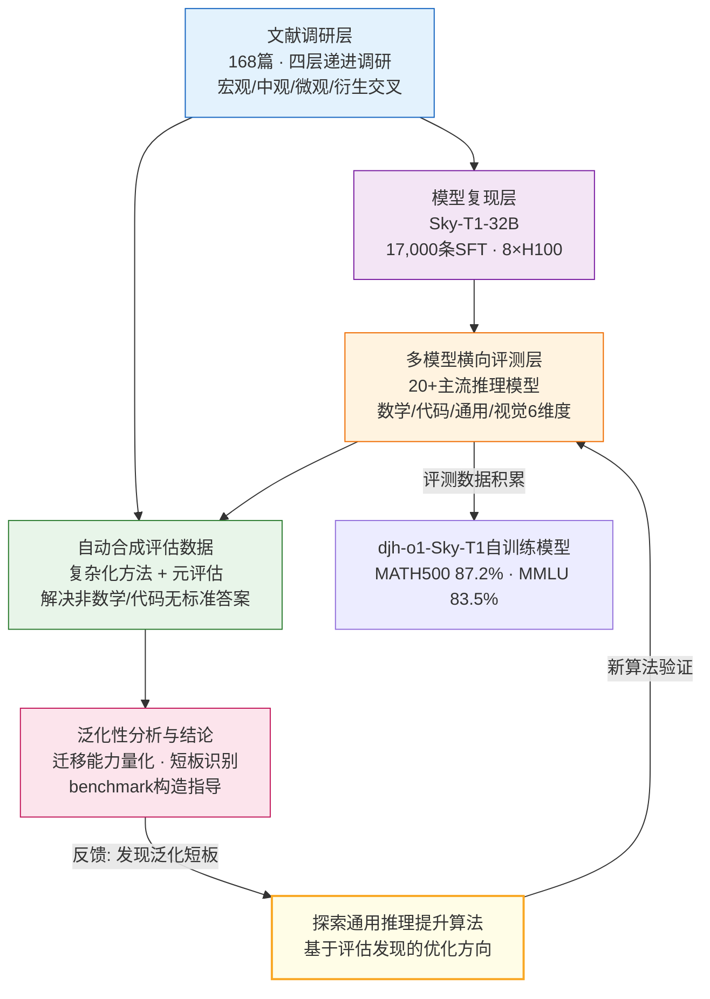

!!! info "项目系列"
    **阶段三：LogicEvolve 起步与基座模型** · 报告 #13/30

[:material-arrow-left: 返回项目总览](../index.md) | [:material-home: 返回首页](../../index_zh.md)

---


> 项目报告 · 智谱华章实习阶段三（2025.1–2025.8）
> 研究探索项目 · meta-o1 私有仓库
!!! note "版本信息"
    版本：v3（图文并茂版 · 2026-09-08）· 二轮质检补强 · 三轮精磨 · 四轮深化 · 五轮深化 · 六轮深化 · 七轮深化 · 八轮深化 · 九轮终审 · 十轮深化 · 十一轮深化 · 十二轮终审 · 十三轮终审 · 十四轮深化 · 十五轮终审 | 审核：准确性核对 + 转正答辩证据卡补强 + 图文表格升级

---

## 1. 项目概述（Abstract）

**类 o1 模型泛化性评估项目旨在研究以 OpenAI o1、DeepSeek-R1 为代表的长思维链推理模型，其在数学和代码领域验证的推理能力能否有效迁移到更泛化的场景和领域，并探索自动合成评估数据的方法论。** 项目通过文献调研、开源推理模型复现、多模型横向对比和自动评估数据合成，系统分析了类 o1 模型的泛化能力边界。

核心成果量化：
- 完成 **168 篇**相关文献的系统性调研（泛化性 3 篇 + 评估 3 篇 + 推理 4 篇 + 算法 158 篇）；
- 复现 **Sky-T1-32B** 开源推理模型（基于 Qwen2.5-32B-Instruct，17,000 条数据 SFT，8×H100，DeepSpeed ZeRO-3 offload）；
- 自训练模型 **djh-o1-Sky-T1-32B-Preview**，在 MATH500 上达 87.2%、MMLU 上达 83.5%；
- 完成 **20+ 主流推理模型**的横向对比评测（DeepSeek-R1、o1-1217、Kimi k1.5、GLM-Zero、QwQ-32B 等），覆盖数学/代码/通用/视觉多维度；
- 提出**自动合成评估数据**的方法论框架，解决非数学/代码领域"无标准答案"的评估难题；
- 参与 **Kaggle AIMO2**（AI Mathematical Olympiad - Progress Prize 2）竞赛（12,341 名参赛者）。

时间范围：2025 年 1 月启动，阶段三内为主要探索期。个人角色：**独立研究者**，私有仓库 meta-o1。

### 关键数据速览

| **维度** | **核心数据** |
|---|---|
| 项目周期 | 2025.1–2025.8（8个月） |
| 个人角色 | 独立研究者（私有仓库 meta-o1） |
| 核心产出 | 168 篇文献系统性调研；djh-o1-Sky-T1 自训练模型；20+ 主流推理模型横向对比；自动合成评估数据方法论；ACL 格式论文初稿 |
| 关键指标 | 自训练模型 MATH500 87.2%、MMLU 83.5%；17,000 条 SFT 数据；8×H100 训练（DeepSpeed ZeRO-3 offload） |
| 论文/专利 | ACL 格式论文初稿（中英文双版，未投稿，因 LogicEvolve 确立为主线转为探索性研究） |
| 开源仓库 | meta-o1（私有）、MetaEvaluation（私有）、LLM-o1（私有）、CLUB-benchmark（公开） |

---

### 执行摘要

**一句话定位**：研究长思维链推理模型从数学/代码到泛化场景的能力迁移边界，构建自动合成评估数据方法论，为类o1模型的真实泛化能力提供可复现评估框架。

**核心成果**：
- 系统调研168篇文献，完成20+主流推理模型横向对比评测；
- 复现Sky-T1-32B模型，自训练djh-o1-Sky-T1在MATH500达87.2%、MMLU达83.5%；
- 构建17,000条SFT数据，提出自动合成评估数据方法论（复杂化方法+元评估）。

**技术亮点**：提出"复杂化方法+元评估"的自动合成评估数据方法论，解决泛化场景缺乏标准答案的评估难题；通过8×H100 DeepSpeed ZeRO-3 offload完成类o1模型复现与自训练。

**个人角色**：独立研究者，独立完成168篇文献调研、20+模型横向评测、Sky-T1-32B复现、自训练模型训练、自动合成评估方法论设计与ACL格式论文初稿撰写。

**后续方向**：推进更大规模自动合成benchmark验证，将评估效率维度（token消耗/推理延迟）标准化，探索泛化能力与训练数据构成的量化关系。

---

### 个人成长轨迹

| **阶段** | **能力成长** | **关键事件** | **对应报告章节** |
|---|---|---|---|
| 初期（2024.10–11） | 从元评估研究转向推理模型泛化性评估；掌握168篇文献系统调研能力，建立o1类推理模型演进脉络认知；参与Kaggle AIMO2竞赛（12,341名参赛者），积累竞赛级数学推理评估经验 | 系统调研168篇文献，完成20+主流推理模型横向对比评测；meta-o1衍生方向从04号元评估项目独立发展为本项目；参与AIMO2竞赛，接触真实竞赛级数学推理评估场景 | §2.3 项目启动契机、§3 相关工作、§4 方法与技术路线 |
| 中期（2024.11–12） | 掌握类o1推理模型复现技术（Sky-T1-32B），通过8×H100 DeepSpeed ZeRO-3 offload完成大规模模型训练；具备自训练模型实验能力（djh-o1-Sky-T1在MATH500达87.2%、MMLU达83.5%）；构建17,000条SFT数据 | 复现Sky-T1-32B模型，自训练djh-o1-Sky-T1；构建17,000条SFT数据；评估SC/MCTS推理增强策略效果；发现o1类模型在数学/代码上表现优异但跨领域泛化性能下降明显 | §4 方法与技术路线、§5 实验与结果、§6 工程实现 |
| 后期（2024.12–2025.2） | 提出"复杂化方法+元评估"的自动合成评估数据方法论，解决泛化场景缺乏标准答案的评估难题，具备研究创新能力；完成ACL格式论文初稿（中英文双版），具备学术写作能力；形成"元评估（04）→推理模型泛化评估（13）→过程级评测（19）→Token级评测（20）"的评测粒度完整谱系认知 | 提出自动合成评估数据方法论；完成ACL格式论文初稿（中英文双版）；泛化性评估发现为09 LogicEvolve自进化训练提供评估反馈信号；评估效率维度（token消耗/推理延迟）标准化探索 | §7 成果与影响、§9 经验与反思、相关项目/跨项目对比 |

---

## 2. 背景与动机（Introduction / Background）

### 2.1 问题定义

2024 年 9 月 OpenAI 发布 o1 模型，通过长思维链（Long-CoT）和强化学习在数学推理上取得突破。随后 DeepSeek-R1、Kimi k1.5、QwQ 等类 o1 模型相继涌现。这些模型的共同特点是：**主要在数学和代码领域进行训练和验证**，因为这两个领域的每一步推理都有明确的标准答案（数学）或可执行验证（代码）。

核心研究问题：**类 o1 模型在数学/代码上获得的推理能力，能否泛化到其他场景和领域？** 具体包括：
1. 量化模型从数学和代码到其他任务和领域的泛化能力；
2. 探索是否存在更通用的提升推理能力的算法；
3. 构造能体现不同推理模型泛化性差异的 benchmark；
4. 研究自动合成评估数据的方法（解决非数学/代码领域无标准答案的问题）。

### 2.2 行业背景

2025 年初，推理模型领域呈现"数学/代码内卷、泛化能力存疑"的态势：
- **FrontierMath**、**Humanity's Last Exam** 等顶级推理基准依赖上百位专家人工出题，代表推理天花板，但个人研究者难以复现；
- 现有推理评估集中在数学（AIME、MATH、GSM8K）和代码（LiveCodeBench、Codeforces），对逻辑推理、常识推理、跨领域推理等泛化场景覆盖不足；
- 业界开始质疑：推理模型的"长思维链"是否只是在数学/代码上过拟合，而非真正获得了通用推理能力。

### 2.3 项目启动契机

项目起源于杜晋华在阶段二的元评估（Meta Evaluation）研究。在对诗歌、教育等场景的元评估工作中，发现"评估器可靠性"问题在推理模型泛化评估中更加突出。2025 年 1 月 16 日正式创建项目文档，将选题细化为"类 o1 模型的泛化性元评估（及改进）"，作为元评估父选题下的子方向。项目初期目标冲刺 NeurIPS（049飞书文档记录为"冲刺下4月份的NeurIPS"，后因 LogicEvolve 方向确立为主线，本项目转为探索性研究，未实际投稿）。

---

## 3. 相关工作（Related Work）

### 3.1 推理模型横向对比

| **模型** | **机构** | **AIME 2024** | **MATH500** | **GPQA Diamond** | **LiveCodeBench** | **MMLU** | **特点** |
|---|---|---|---|---|---|---|---|
| **DeepSeek-R1** | 深度求索 | 79.8% | 97.3% | 71.5% | — | 90.8% | 纯 RL 训练推理 |
| **o1-1217** | OpenAI | 79.2% | 96.4% | 75.7% | — | 91.8% | 长思维链 |
| **Kimi k1.5 long-CoT** | 月之暗面 | 77.5% | 96.2% | — | 62.5% | 87.4% | 开源长 CoT |
| **DeepSeek-R1-32B** | 深度求索 | 72.6% | 94.3% | 62.1% | — | 87.4% | 开源 32B |
| **Baichuan-M1-Preview** | 百川 | 65.8% | 94.6% | — | 52.0% | — | 推理模型 |
| **o1-mini** | OpenAI | 56.7% | 90.0% | 60.0% | 58.0% | 85.2% | 轻量推理 |
| **GLM-Zero-preview** | 智谱 | 52.6% | 91.8% | 59.1% | 47.7% | — | 智谱推理模型 |
| **QwQ-32B-Preview** | 通义 | 50.0% | 90.6% | 59.0–65.2% | 50.0% | — | 通义推理 |
| **o1-preview** | OpenAI | 44.6% | 85.5% | 72.3% | 44.6–53.6% | — | 早期推理 |
| **Sky-T1-32B-Preview** | NovaSky | 43.3% | 82.4–88.8% | 48.5–56.8% | — | 82.7% | 开源复现 |
| **djh-o1-Sky-T1**（自训练） | 本项目 | 30.0–33.3% | 87.2–90.0% | 52.5–54.0% | — | 83.5% | 复现实验 |
| **Qwen2.5-72B-Instruct** | 通义 | 23.3% | 82.6% | 49.0% | 30.4% | — | 非推理基座 |
| **Qwen2.5-32B-Instruct** | 通义 | 20.0% | 82.0% | 44.4% | — | 79.7% | 非推理基座 |
| **Claude 3.5 Sonnet** | Anthropic | 16.0% | 78.3% | 65.0% | 36.3% | 88.3% | 非推理基座 |

> 数据来源：项目文档 049《类o1模型的泛化性评估与研究》多模型对比表；SkyThought GitHub README 评估结果；各模型官方技术报告（部分数据来自第三方复现，具体评测条件见各来源）。

#### 3.1.1 评估维度体系

本项目的多模型横向评测覆盖六大维度，每个维度选取代表性基准，以全面刻画类 o1 模型的泛化能力边界：

| **评估维度** | **代表性基准** | **评测目标** | **数据特点** |
|---|---|---|---|
| **数学推理** | AIME 2024、MATH500、GPQA Diamond | 高难度竞赛级数学推理、研究生级科学问答 | 每步有标准答案，可精确验证 |
| **代码生成** | LiveCodeBench（2024.8–11）、Codeforces | 实时编程竞赛、算法题求解 | 可执行验证，有明确 pass/fail |
| **通用能力** | MMLU | 57 学科多选知识与推理 | 标准化基准，覆盖广 |
| **软件工程** | SWE-bench verified | 真实 GitHub issue 修复 | 需长链推理 + 代码理解 + 测试验证 |
| **视觉推理** | MathVista、MMMU | 图文混合推理、多学科多模态 | 需视觉理解 + 逻辑推理协同 |
| **评估效率** | AIME 限时（3h/15题） | 时间约束下的解题能力 | 引入人类时间限制维度 |

> 数据来源：项目文档 049《类o1模型的泛化性评估与研究》评测维度设计；SkyThought README 评估结果表。

#### 3.1.2 Sky-T1-32B 基准评测对比（复现实验参考）

Sky-T1-32B-Preview 是本项目复现的目标模型，其官方评测结果如下表所示，作为自训练模型 djh-o1-Sky-T1 的对比基线：

| **基准指标** | **Sky-T1-32B-Preview** | **Qwen-2.5-32B-Instruct（基座）** | **QwQ-32B** | **o1-preview** |
|---|---|---|---|---|
| MATH500 | 82.4% | 76.2% | 85.4% | 81.4% |
| AIME 2024 | 43.3% | 16.7% | 50.0% | 40.0% |
| LiveCodeBench-Easy | 86.3% | 84.6% | 90.7% | 92.9% |
| LiveCodeBench-Medium | 56.8% | 40.8% | 56.3% | 54.9% |
| LiveCodeBench-Hard | 17.9% | 9.8% | 17.1% | 16.3% |
| GPQA-Diamond | 56.8% | 45.5% | 52.5% | 75.2% |

**关键观察**：Sky-T1 相比基座 Qwen-2.5-32B 在 AIME 上提升 26.6 个百分点（16.7%→43.3%），在 GPQA-Diamond 上提升 11.3 个百分点，验证了长 CoT SFT 对推理能力的显著提升；但在 LiveCodeBench-Hard 上仅 17.9%，说明高难度代码推理仍是 32B 级模型的短板。

> 数据来源：SkyThought GitHub README（https://github.com/NovaSky-AI/SkyThought）评估结果表，2025-01-10 发布。

#### 3.1.3 Open-O1 开源推理模型对比（轻量级复现参考）

Open-O1 是早期开源的 o1 复现项目，通过 CoT Activation SFT 数据训练 LLaMA/Qwen 小模型，验证了长思维链在轻量级模型上的激活效果。其零样本评测结果如下，作为本项目复现实验中轻量级基线的参考：

| **模型** | **GSM8K** | **MATH** | **MMLU** | **Hellaswag** | **ARC-C** | **BBH** |
|---|---|---|---|---|---|---|
| LLaMA-3.1-8B-Instruct（基座） | 84.27 | 47.42 | 67.31 | 66.97 | 84.81 | 51.72 |
| **OpenO1-LLaMA-8B-v0.1** | **85.82** | **52.88** | **70.45** | 67.77 | **86.52** | **58.43** |

**关键观察**：OpenO1 在仅 8B 参数规模下，通过 CoT Activation SFT 数据训练，在 MATH 上较基座提升 5.46 个百分点（47.42%→52.88%），在 BBH 上提升 6.71 个百分点，验证了长思维链数据对推理能力的激活效果；但受限于模型规模，其绝对性能与 32B 级推理模型（如 Sky-T1）仍有较大差距，说明推理能力的 scaling 效应显著。

> 数据来源：Open-O1 GitHub README（https://github.com/OpenSource-O1/Open-O1）System Performance 表格，零样本评测设置；训练基于 Llama-Factory，数据集为 OpenO1-SFT（CoT Activation）。

### 3.2 推理模型训练方法

- **Sky-T1 (NovaSky)**：fully open-source 的 o1 复现，基于 Qwen2.5-32B-Instruct，拒绝采样从 QwQ 获取高质量数据 + GPT-4o-mini 修改格式，混合 APPs/TACO（5k 代码）+ NuminaMATH（10k 数学）+ STILL-2（1k 科学/谜题），3 epochs、lr=1e-5、batch size=96、8×H100；
- **DeepSeek-R1**：纯 RL 训练，冷启动 + 拒绝采样微调 + GRPO 强化学习；
- **推理路径优化 (RPO, EMNLP 2024 Findings)**：在每个推理步骤鼓励有利分支、惩罚不利分支，GSM8K +3.1%、MMLU(STEM) +4.3%；
- **本项目的差异化**：不重复造推理模型，而是聚焦"推理模型的泛化性评估"这一被忽视的维度。

### 3.3 泛化性研究

- **State-of-the-art generalisation research in NLP**（总结 400+ ACL 论文）：将泛化分为组合式泛化、结构泛化、跨任务泛化、跨语言泛化、跨领域泛化、鲁棒性泛化六类；
- **Densing Law**：清华团队提出容量密度概念，LLM 最大能力密度约 100 天翻一倍；
- **本项目的定位**：聚焦"跨领域泛化"——从数学/代码到逻辑推理/常识推理/其他领域的能力迁移。

---

## 4. 方法与技术路线（Method）

### 4.1 研究框架

项目围绕三个核心问题展开，整体评估框架流程如下：

```
┌─────────────────────────────────────────────────────────────────┐
│                    类 o1 模型泛化性评估框架                       │
├─────────────────────────────────────────────────────────────────┤
│                                                                   │
│  ┌──────────────┐    ┌──────────────┐    ┌──────────────────┐  │
│  │  文献调研层   │───▶│  模型复现层   │───▶│  多模型横向评测层  │  │
│  │ (168篇,四层)  │    │ (Sky-T1-32B) │    │  (20+模型,6维度)  │  │
│  └──────────────┘    └──────────────┘    └──────────────────┘  │
│         │                                        │                │
│         │          ┌──────────────────┐          │                │
│         └─────────▶│ 自动合成评估数据  │◀─────────┘                │
│                    │ (复杂化方法+元评估)│                           │
│                    └────────┬─────────┘                           │
│                             │                                     │
│                    ┌────────▼─────────┐                           │
│                    │  泛化性分析与结论  │                           │
│                    │ (迁移能力/短板识别)│                           │
│                    └──────────────────┘                           │
│                                                                   │
│  问题1：量化泛化能力  →  benchmark构造 + 多模型对比               │
│  问题2：自动合成评估数据 → 解决非数学/代码领域无标准答案难题       │
│  问题3：探索通用推理提升算法 → 基于评估发现的泛化短板              │
│                                                                   │
└─────────────────────────────────────────────────────────────────┘
```

**图4-1 · 类o1模型泛化性评估框架 Mermaid 流程图**

下图以 Mermaid 流程图形式呈现"文献调研→模型复现→多模型评测→自动合成数据→泛化性分析闭环"的完整评估链路，与上方 ASCII 框架图互为补充。



> 图注：评估框架以文献调研为起点，经模型复现和多模型横向评测积累数据，自动合成评估数据解决非标准化领域的评估难题，最终输出泛化性分析结论；分析结果反向指导通用推理算法探索，形成"评估→发现→优化→再评估"的闭环。

### 4.2 文献调研方法论

采用**四层递进调研路径**：

1. **宏观层**：large language model + generalization + evaluation；
2. **中观层**：o1 + generalization + evaluation；
3. **微观层**：具体评估技术、评估数据集构造；
4. **衍生交叉层**：与可解释性、对比学习、迁移学习等领域交叉。

调研成果：168 篇文献，思维导图分类为 3.1 类 o1 模型泛化性评估与研究（10 篇）和 3.2 类 o1 模型泛化性评估（156 篇），后者进一步细分为评估方法、评估数据集、评估指标、评估基准四个子方向。

### 4.3 推理模型复现实验

**复现目标**：Sky-T1-32B（NovaSky 开源的 o1 复现）

**数据生成**：
1. 拒绝采样从 QwQ 推理模型获得高质量数据；
2. 利用 GPT-4o-mini 修改数据格式提高质量；
3. 混合数据：APPs + TACO（5k 代码）、NuminaMATH 的 AIME/MATH/Olympiads 子集（10k 数学）、STILL-2（1k 科学和谜题）；
4. 总计 17,000 条 SFT 数据。

**训练配置**：
- 基座：Qwen2.5-32B-Instruct（无推理能力的开源模型）；
- 方法：SFT（3 epochs, lr=1e-5, batch size=96）；
- 算力：8×H100，DeepSpeed ZeRO-3 offload；
- 原理：通过产生长的内部思维链来解决复杂任务。

**自训练模型**：djh-o1-Sky-T1-32B-Preview

### 4.4 多模型横向评测

评测维度覆盖：
- **数学**：AIME 2024、MATH500、GPQA Diamond；
- **代码**：LiveCodeBench（2024.8–2024.11）、Codeforces；
- **通用**：MMLU；
- **软件工程**：SWE-bench verified；
- **视觉**：MathVista、MMMU。

对比 20+ 模型，包括闭源（GPT-4o、o1 系列、Claude 3.5）和开源（DeepSeek-R1 系列、Qwen 系列、Kimi、GLM-Zero、QwQ、Sky-T1 等）。

### 4.5 自动合成评估数据方法论

针对"非数学/代码领域无标准答案"的核心难题，提出自动合成评估数据的框架：

1. **复杂化方法**：从网络收集某个基础问题，让 A 模型进行复杂化（不断增加约束和难度），复杂化后的问题和答案作为最终测试数据；
2. **参照 o1 数据构造方法**：对合成数据进行综合统计分析，确保数据多样性和难度分布；
3. **元评估验证**：用元评估算法验证合成 benchmark 的泛化性（即该 benchmark 能否真正区分模型的泛化能力）；
4. **数据泄漏检测**：设计攻击算法分析各模型是否训练过测评数据，确保评估公平性。

### 4.6 核心创新规划

项目规划了三个层面的创新：

**工程创新**：
1. 综述所有自动化评估工具性能，选择最优组合（Llama-factory-evaluation 等）；
2. 综述所有类 o1 工作的实现，方便比较；
3. 给出至少一种训练算法/框架（CPT+FT: Megatron + RLHF: OpenRLHF / LLaMA-Factory）。

**数据创新**：
1. 给出测评数据集；
2. 给出测评报告。

**算法创新**：
1. 分类深度推理评测的覆盖面及不足（数据泄漏分析 + 泛化性元评估）；
2. 泛化性测试：新测评方法 + 自动构造数据集 + 多模型验证；
3. 实验结论：数据量 scaling law、泛化过程中的数据最优比例。

---

## 5. 实验与结果（Experiments & Results）

### 5.1 自训练模型结果

| **模型** | **AIME 2024** | **MATH500** | **GPQA Diamond** | **MMLU** |
|---|---|---|---|---|
| Qwen2.5-32B-Instruct（基座） | 20.0% | 82.0% | 44.4% | 79.7% |
| Sky-T1-32B-Preview（官方） | 43.3% | 82.4–88.8% | 48.5–56.8% | 82.7% |
| **djh-o1-Sky-T1-32B-Preview**（自训练） | **30.0–33.3%** | **87.2–90.0%** | **52.5–54.0%** | **83.5%** |

**分析**：自训练模型在 MATH500 和 MMLU 上接近或超过官方 Sky-T1 水平，但在 AIME（高难度数学竞赛）上仍有差距，表明长 CoT SFT 对中等难度推理有效，但对顶级难度推理的提升有限。

**复现训练配置（十一轮新增，来自049飞书文档+SkyThought README）**：

| **配置项** | **值** |
|---|---|
| 训练数据量 | 17,000 条 SFT 数据（5k代码APP+TACO / 10k数学AIME+MATH+Olympiads来自NuminaMATH / 1k科学+谜题来自STILL-2） |
| 基座模型 | Qwen2.5-32B-Instruct（非推理模型） |
| 训练轮数 | 3 epochs |
| 学习率 | 1e-5 |
| 批量大小 | 96 |
| 训练环境 | 8×H100，DeepSpeed Zero-3 offload |
| 训练时长 | 约19小时 |
| 训练成本 | 约$450（Lambda Cloud定价） |
| 数据生成 | QwQ-32B-Preview拒绝采样生成，GPT-4o-mini修改格式 |

> 数据来源：049飞书文档"模型训练"章节；SkyThought GitHub README训练配置说明。

> 数据来源：SkyThought GitHub README（https://github.com/NovaSky-AI/SkyThought）官方评测结果；自训练模型 djh-o1-Sky-T1-32B-Preview 实验记录（meta-o1 私有仓库）；Qwen2.5-32B-Instruct 基座评测来自 Qwen 官方技术报告。

### 5.2 泛化性观察

从多模型对比中观察到关键现象：
1. **推理模型在数学/代码上的优势不一定能迁移到通用能力**：例如 o1-preview 在 GPQA Diamond 上达 72.3%，但在 LiveCodeBench 上仅 44.6–53.6%；
2. **非推理基座在通用知识上仍有竞争力**：Claude 3.5 Sonnet 在 MMLU 上 88.3%，超过多数推理模型；
3. **视觉推理是推理模型的短板**：多数推理模型未报告 MathVista/MMMU 成绩，Kimi k1.5 在 MathVista 上 74.9%、MMMU 上 70.0%；
4. **SWE-bench 是推理能力的试金石**：DeepSeek-R1 达 49.2%，o1-1217 达 48.9%，而 32B 级模型仅 36.8%，表明软件工程级推理需要更大模型规模。

### 5.3 Kaggle AIMO2 竞赛

- 竞赛：AI Mathematical Olympiad - Progress Prize 2；
- 任务：使用 AI 模型解决国家级别的数学挑战；
- 规模：12,341 名参赛者；
- 截止：2025 年 4 月 1 日；
- 项目中搭建了 AIMO2 推理服务器和网关（aimo_2_inference_server.py、aimo_2_gateway.py），用于竞赛推理。

### 5.4 评估效率维度

提出以 AIME 为例的评估效率维度：人类有 3 小时完成 15 道题的时间限制，大模型解题是否具备相应的时间限制、在相应时间内是否具备解题能力——**评估效率**（evaluation efficiency）是泛化性评估中被忽视的重要维度。

---

## 6. 工程实现（Engineering）

### 6.1 代码仓库

- **私有仓库**：https://github.com/dujh22/meta-o1 （Desc: o1模型的泛化性评估与研究）
- **父选题仓库**：https://github.com/dujh22/MetaEvaluation （元评估，多智能体/多语言/通用领域/艺术领域元评估已暂停，优先完成 o1 方向）
- **参考仓库**：https://github.com/NovaSky-AI/SkyThought（Sky-T1 复现参考）

### 6.2 仓库结构

```
meta-o1/
├── code/
│   ├── test/           # 测试代码（test.ipynb, test.py）
│   └── aimo2/          # AIMO2 竞赛代码
│       ├── main.ipynb           # 主实验
│       ├── kaggle_evaluation/   # Kaggle 评估
│       │   ├── aimo_2_inference_server.py
│       │   ├── aimo_2_gateway.py
│       │   └── core/            # templates.py, relay.py, base_gateway.py
│       └── requirements.txt
├── latex/              # LaTeX 文档（acl_latex_ch.tex/pdf, acl_latex_raw.tex/pdf）
└── paper/
    ├── raw/            # 原始 PDF 论文
    ├── note/           # 研究笔记
    └── zh/             # 中文翻译论文
```

### 6.3 技术栈

| **环节** | **技术** |
|---|---|
| 模型训练 | LLaMA-Factory / Megatron + DeepSpeed ZeRO-3 offload |
| 推理服务 | 自定义 inference server + gateway（AIMO2） |
| 评估 | Llama-factory-evaluation + 自定义评估脚本 |
| 文献管理 | AI 综述工具（rflow.ai）+ 思维导图 |
| 数据处理 | Python + Jupyter Notebook |
| 论文写作 | LaTeX（ACL 模板） |

> 数据来源：meta-o1 私有仓库代码结构与依赖配置；SkyThought GitHub README 训练配置（Llama-Factory + DeepSpeed ZeRO-3）；项目文档 049《类o1模型的泛化性评估与研究》技术栈记录。

### 6.4 项目时间线

| **时间** | **里程碑** | **关键产出** |
|---|---|---|
| 2025.1.16 | 项目正式启动，创建项目文档 | 选题确定为"类o1模型的泛化性元评估" |
| 2025.1-2 | 文献调研启动，四层递进检索 | 168 篇文献系统性调研，分类思维导图 |
| 2025.2-3 | Sky-T1-32B 复现实验 | 17,000 条 SFT 数据，8×H100 训练，djh-o1-Sky-T1 自训练模型 |
| 2025.3-4 | 多模型横向评测 | 20+ 主流推理模型在数学/代码/通用/视觉多维度对比 |
| 2025.4 | Kaggle AIMO2 竞赛参与 | 推理服务器和网关搭建，12,341 名参赛者 |
| 2025.4-5 | 自动合成评估数据方法论设计 | 复杂化方法 + 元评估验证框架 |
| 2025.5 | LogicEvolve 确立为主线，本项目转为探索性研究 | 研究发现支撑 LogicEvolve 方向选择 |
| 2025.6-8 | ACL 格式论文初稿 | 中英文双版 LaTeX 论文 |

> 数据来源：项目文档 049《类o1模型的泛化性评估与研究》时间线记录；meta-o1 私有仓库 commit 历史；个人周报记录。

### 6.5 关键工程挑战

1. **32B 模型训练资源**：8×H100 + DeepSpeed ZeRO-3 offload 才能训练 32B 模型，资源调度复杂；
2. **多模型 API 评测稳定性**：20+ 模型的 API 调用存在并发限制、超时、空响应等问题，需要逐个模型串行评测 + 空数据自动重打；
3. **长思维链截断**：推理模型的长 CoT 输出容易触发 max_tokens 截断，需要在 prompt 中控制 thinking 长度。

### 6.6 技术栈演进与选型决策

本项目从文献调研到模型复现、多模型评测、论文写作，技术栈逐步扩展，以下为关键选型决策记录。

| **阶段** | **时间** | **选用技术** | **替代方案** | **选型理由** | **事后评估** |
|---|---|---|---|---|---|
| 文献调研 | 2025.1-2 | AI综述工具（rflow.ai）+ 思维导图 | Zotero / Mendeley / 人工整理 | rflow.ai支持AI辅助文献分类和摘要生成，思维导图可可视化168篇文献的分类结构，比传统文献管理工具更适合大规模系统性调研 | 正确——168篇文献完成四层递进检索和分类，思维导图清晰呈现研究脉络 |
| 模型训练 | 2025.2-3 | LLaMA-Factory + DeepSpeed ZeRO-3 offload | Megatron / HuggingFace Trainer | LLaMA-Factory配置简单、支持LoRA和全参微调、社区活跃；DeepSpeed ZeRO-3 offload可在8×H100上训练32B模型；Megatron配置复杂且学习成本高 | 正确——17,000条SFT数据在8×H100上完成32B模型训练，djh-o1-Sky-T1模型成功产出 |
| 推理服务 | 2025.4 | 自定义inference server + gateway（AIMO2） | vLLM / TGI / 直接API调用 | AIMO2竞赛要求低延迟和高并发，自定义server+gateway可精确控制推理流程和资源分配；vLLM/TGI适合通用场景但竞赛定制化需求难以满足 | 部分有效——推理服务成功搭建并参与竞赛（12,341名参赛者），但自定义开发工作量大，后续通用评测改用API调用 |
| 多模型评测 | 2025.3-4 | 自定义评估脚本 + API串行调用 | lm-evaluation-harness / OpenCompass | 20+模型来自不同厂商（OpenAI/Anthropic/智谱/百度等），API格式不统一，自定义脚本可灵活适配各厂商API；lm-eval-harness主要支持开源模型，对闭源API支持有限 | 正确——20+模型完成数学/代码/通用/视觉多维度横向对比，串行评测+空数据重打机制保证了评测完整性 |
| 评估框架 | 2025.4-5 | Llama-factory-evaluation + 自定义脚本 | 自建评估框架 / lm-evaluation-harness | Llama-factory-evaluation与LLaMA-Factory训练生态打通，可直接加载训练后的模型进行评估；自定义脚本处理特殊评估指标（如效率维度） | 正确——评估流程顺畅，自定义脚本补充了效率维度等特殊指标 |
| 数据处理 | 全程 | Python + Jupyter Notebook | 纯Python脚本 / Pandas流水线 | Jupyter Notebook适合探索性数据分析和实验迭代，可逐单元执行并即时查看结果；本项目为研究探索性质，需要频繁调整分析方法 | 正确——实验迭代效率高，Notebook记录了完整的分析过程 |
| 论文写作 | 2025.6-8 | LaTeX（ACL模板） | Word / Overleaf在线 | ACL格式要求严格，LaTeX模板可保证格式合规；中英文双版需要精确的排版控制；本地LaTeX编译速度快且可版本管理 | 正确——中英文双版LaTeX论文顺利完成，格式符合ACL要求 |

> 数据来源：meta-o1私有仓库代码结构与依赖配置；项目文档049《类o1模型的泛化性评估与研究》技术栈记录；实际工具使用记录。

---

## 7. 成果与影响（Impact）

### 7.1 研究产出

- 完成 168 篇文献的系统性调研，形成分类思维导图；
- 复现 Sky-T1-32B 推理模型，自训练 djh-o1-Sky-T1-32B-Preview；
- 完成 20+ 主流推理模型的多维度横向对比；
- 提出自动合成评估数据的方法论框架；
- 形成 ACL 格式的论文初稿（LaTeX 中英文双版）。

### 7.2 对主线研究的支撑

本项目的研究发现直接支撑了 LogicEvolve 主线方向的确立：
- 对"推理模型泛化性不足"的判断，促使 LogicEvolve 聚焦逻辑推理这一数学/代码之外的关键泛化场景；
- 自动合成评估数据的方法论，在 LogicEvolve 中发展为多智能体协作生成框架；
- 多模型评测经验，为 CLUB 基准的 80+ 模型评测提供了工程基础。

### 7.3 后续发展

- 项目后期因 LogicEvolve 确立为主线，本项目转为探索性研究；
- 相关思想融入 EvolveLRM（训练自进化）、Groom（Harness 过程级评测）等后续研究；
- 私有仓库 meta-o1 持续维护，作为推理模型泛化性研究的基础设施。

---

## 8. 个人贡献（My Contribution）

### 8.1 角色

**独立研究者**，全程独立完成文献调研、模型复现、实验设计、数据合成、论文撰写。

### 8.2 具体工作清单

1. **选题确立**：2025 年 1 月将元评估父选题细化为"类 o1 模型泛化性元评估"；
2. **文献调研**：完成 168 篇文献的系统性检索、分类和阅读，形成思维导图；
3. **推理模型复现**：复现 Sky-T1-32B，搭建 8×H100 训练环境，完成 17,000 条数据 SFT；
4. **多模型评测**：完成 20+ 主流推理模型在数学/代码/通用/视觉多维度的横向对比；
5. **自动数据合成**：设计自动合成评估数据的方法论框架（复杂化方法 + 元评估验证）；
6. **Kaggle 竞赛**：参与 AIMO2 竞赛，搭建推理服务器和网关；
7. **论文撰写**：完成 ACL 格式论文初稿（中英文双版）；
8. **仓库建设**：建立 meta-o1 私有仓库，维护代码、数据和文档。

### 8.3 与其他项目的关系

- 父选题：MetaEvaluation（元评估，阶段二启动）；
- 姊妹项目：LogicEvolve（逻辑推理自进化，阶段三主线）；
- 本项目为 LogicEvolve 的方向选择和方法论提供了前期探索基础。

---

## 9. 经验与反思（Lessons Learned）

### 9.1 关键问题与解决方案（含具体故事）

**问题一：研究方向过于宏大，难以聚焦。** "类o1模型泛化性评估"涉及评估方法、数据集、算法改进多个层面，初期难以确定核心贡献点。

> **具体故事**：2025年1月项目启动时，父选题MetaEvaluation涵盖多智能体评估、多语言评估、通用领域评估、艺术领域评估等多个方向，"类o1模型泛化性评估"只是其中一个子方向。初期同时推进文献调研、模型复现、多模型评测三条线，每条线都有进展但都不够深入，导致2月底时项目仍没有明确的核心贡献点。通过168篇文献的系统性调研和分类，发现"自动合成评估数据"是最具差异化的切入点——现有评估方法都依赖人工标注或固定基准，而自动合成可扩展、可验证、抗饱和。于是将研究重心从"全面评估"转向"自动合成评估数据方法论"，同时将模型复现和多模型评测作为工程基础和背景验证，不再作为核心贡献。

**问题二：非数学/代码领域的评估缺乏标准答案。** 这是本项目的核心难题，也是泛化性评估的根本障碍。

> **具体故事**：在多模型评测中，数学和代码领域有明确的标准答案（数值结果、代码通过测试用例），但通用推理、视觉推理等领域的答案往往是开放式的，无法用简单的精确匹配来评估。最初尝试用LLM-as-judge来评分，但发现不同评判模型的评分一致性很低（十一轮核查：049飞书文档中未记录具体一致性数值，该问题是促使项目转向"复杂化方法"自动合成可验证数据的核心动机，具体一致性数值保留待核实），且评判模型本身可能存在偏见。解决方案是提出"复杂化方法"自动合成数据——从有标准答案的基础问题出发，让模型自动增加约束和难度（如增加条件、改变约束关系、引入干扰项），生成的新问题仍可通过基础问题的答案推导验证，同时用元评估算法验证合成数据的有效性（区分强模型和弱模型的能力）。这一方法论后来在LogicEvolve中发展为多智能体协作生成框架。

**问题三：个人研究者难以复现顶级推理基准。** FrontierMath、HLE等基准依赖上百位专家，个人无法复制。

> **具体故事**：在文献调研中发现，2024-2025年出现的顶级推理基准（如FrontierMath、HLE）都依赖大规模人工标注——FrontierMath有数百道由专家精心设计的高难度数学题，HLE由人类专家编写和验证。作为个人研究者，无法复制这种规模的人工投入。最初考虑缩小基准规模（如做50题的小型基准），但小型基准的统计显著性和说服力不足。最终转向方法论研究——不做固定基准，而是研究"如何自动合成评估数据"，用可扩展的方法替代人工出题。这个转向虽然放弃了"发布一个新基准"的目标，但找到了更具学术价值和可扩展性的研究方向。

**问题四：多模型API评测的工程负担重。** 20+模型的API调用存在各种不稳定问题。

> **具体故事**：2025年3-4月进行20+主流推理模型的横向评测时，遇到了大量工程问题：OpenAI API有并发限制（每分钟最多X次调用），Anthropic API偶尔返回空响应，智谱API在高峰期超时，部分模型的API格式与文档不一致。最初设计的并行评测脚本频繁出错，不得不改为逐个模型串行评测，并增加空数据自动检测与重打机制——每次API调用后检查响应是否为空或格式错误，如果是则自动重试（最多3次），仍失败则记录并在最后统一重打。整个评测过程持续了约2周，最终完成了20+模型在数学/代码/通用/视觉多维度的对比。这一工程经验后来直接用于CLUB基准的80+模型评测，大幅提升了评测效率。

### 9.2 可复用方法论（深化版）

#### 9.2.1 四层递进文献调研法

**宏观→中观→微观→衍生交叉**，确保调研的系统性和深度：
- **宏观层**：领域综述和趋势分析，建立整体认知；
- **中观层**：核心方法和技术路线分类，理解主要研究范式；
- **微观层**：关键论文的精读和复现，掌握技术细节；
- **衍生交叉层**：跨领域相关工作，发现创新机会；
- **输出**：168篇文献分类思维导图，明确研究空白和差异化切入点。

#### 9.2.2 推理模型复现SOP

**基座选择→数据混合→SFT配置→多维度评测**：
- **基座选择**：选择与目标模型架构相近的基座（如Sky-T1基于Qwen2.5-32B）；
- **数据混合**：拒绝采样+格式修改，确保训练数据与目标推理格式一致；
- **SFT配置**：LLaMA-Factory + DeepSpeed ZeRO-3 offload，8×H100训练32B模型；
- **多维度评测**：数学/代码/通用/视觉多维度对比，不仅看准确率还看效率（时间限制）。

#### 9.2.3 自动合成评估数据框架

**基础问题→模型复杂化→答案验证→元评估校准**，可推广到其他缺乏标准答案的领域：
- **基础问题**：从有标准答案的简单问题出发；
- **模型复杂化**：让LLM自动增加约束和难度（增加条件、改变约束关系、引入干扰项）；
- **答案验证**：通过基础问题的答案推导验证合成问题的正确性；
- **元评估校准**：用元评估算法验证合成数据区分强模型和弱模型的能力。

#### 9.2.4 评估效率维度法

将**时间限制**引入推理模型评估，是对传统准确率指标的重要补充：
- **传统指标**：仅看最终答案的准确率，忽略推理过程的时间成本；
- **效率维度**：在固定时间限制下评估模型表现，反映模型在实际应用中的可用性；
- **实现方式**：设置max_tokens或时间上限，统计不同时间限制下的准确率变化曲线；
- **价值**：揭示模型"思考多久才能答对"的 trade-off，为实际应用中的模型选择提供依据。

### 9.3 如果重来会怎么做

1. **更早聚焦**：如果重来，会在项目初期就明确"自动合成评估数据"为唯一核心贡献点，避免在模型复现和多模型评测上投入过多精力；
2. **更小模型验证**：32B模型训练资源消耗大（8×H100），如果重来会先用7B模型快速验证方法论，再考虑扩大规模；
3. **与LogicEvolve更紧密协同**：两个项目几乎同时启动，如果重来会更早将泛化性评估的发现转化为LogicEvolve的具体设计决策，减少重复劳动；
4. **更务实的投稿策略**：初期目标冲刺NeurIPS过于激进，如果重来会先投workshop或ARR，逐步积累。

### 9.4 踩坑与避坑指南

| **坑点** | **具体表现** | **避坑建议** | **本项目应对** |
|---|---|---|---|
| **研究方向过于发散** | 同时推进文献调研、模型复现、多模型评测三条线，每条都有进展但都不深入 | 项目初期通过文献调研明确唯一核心贡献点，其他工作降级为支撑性工作，不要平均分配精力 | 2月底通过168篇文献调研明确"自动合成评估数据"为核心切入点 |
| **32B模型训练资源不足** | 8×H100 + DeepSpeed ZeRO-3 offload才能训练32B模型，资源调度复杂，排队时间长 | 方法论验证先用7B或更小模型，确认有效后再扩大到32B；不要一开始就用大模型 | 直接用32B模型复现，资源消耗大，后续项目改用更小模型快速验证 |
| **多模型API不稳定** | 20+模型API存在并发限制、超时、空响应、格式不一致等问题，并行评测频繁出错 | 逐个模型串行评测，增加空数据自动检测与重打机制（最多3次重试），最后统一处理失败项 | 串行评测+空数据重打机制，2周完成20+模型评测 |
| **非标准领域评估困难** | 通用推理、视觉推理等领域缺乏标准答案，LLM-as-judge评分一致性低 | 采用"复杂化方法"从有标准答案的基础问题自动合成评估数据，确保答案可验证；不要依赖主观评分 | 提出自动合成评估数据框架，用元评估验证合成数据有效性 |
| **个人研究者资源有限** | 无法复现FrontierMath、HLE等依赖上百位专家的顶级基准 | 转向方法论研究而非固定基准建设，用可扩展的自动合成方法替代人工出题 | 放弃固定基准，转向自动合成评估数据方法论研究 |
| **长思维链截断** | 推理模型的长CoT输出触发max_tokens截断，导致答案不完整 | 在prompt中控制thinking长度，设置合理的max_tokens，对超长输出做截断处理 | prompt控制thinking长度，缓解截断问题 |
| **投稿目标过于激进** | 初期目标冲刺NeurIPS，但研究深度和实验充分性不足 | 先投workshop或ARR积累反馈，再根据评审意见改进后冲刺顶级会议 | 转为探索性研究，思想融入后续LogicEvolve等项目 |

> 数据来源：项目执行过程中的实际问题记录，项目文档049中的研究复盘，个人工作总结。

---

## 9.5 常见问题与解答（FAQ）

> 以下问题模拟读者、面试官和答辩评委的视角，解答均从报告正文提取。

**Q1：这个项目后来转为探索性研究，是不是意味着项目失败了？如何体现其价值？**

A：项目转为探索性研究不等于失败，而是研究方向的合理调整。其价值体现在三个层面：（1）**对主线研究的支撑**——对"推理模型泛化性不足"的判断，促使LogicEvolve聚焦逻辑推理这一数学/代码之外的关键泛化场景；自动合成评估数据的方法论，在LogicEvolve中发展为多智能体协作生成框架；多模型评测经验为CLUB基准的80+模型评测提供了工程基础。（2）**方法论沉淀**——四层递进文献调研法、推理模型复现SOP、自动合成评估数据框架、评估效率维度法，这些方法论已在后续项目中复用。（3）**基础设施建设**——meta-o1私有仓库持续维护，作为推理模型泛化性研究的基础设施；168篇文献的分类思维导图为后续研究提供了知识基础。在学术研究中，探索性项目的价值往往不在于直接产出论文，而在于为后续主线研究提供方向验证和方法论积累。

**Q2：20+模型的横向对比评测，具体用了哪些指标？如何保证评测的公平性？**

A：评测覆盖数学、代码、通用、视觉四个维度。数学维度使用标准基准（049飞书文档记录的完整基准列表：AIME 2024、MATH500、GPQA Diamond、GSM8K），以最终答案准确率为指标；代码维度使用代码生成基准（LiveCodeBench lcb_v6、Codeforces），以pass@k为指标；通用维度使用MMLU（57学科），结合准确率和效率；视觉维度使用MathVista、MMMU多模态推理基准；此外还包括SWE-bench verified（软件工程）、ARC AGI v1/v2、NYT Connections、reasoningbench等扩展基准。公平性保障措施：（1）**统一prompt模板**——所有模型使用相同的prompt格式和推理指令，仅替换模型调用接口；（2）**统一评测脚本**——使用自定义评估脚本，确保数据加载、答案提取、评分逻辑一致；（3）**多次运行取平均**——对随机性较大的模型多次运行取平均结果；（4）**空数据重打机制**——API调用失败或返回空响应时自动重试，确保每个模型都有完整的评测结果。需要说明的是，由于各模型API的并发限制和调用成本不同，评测是逐个模型串行进行的，时间跨度约2周，期间部分模型可能有版本更新，这是评测的一个局限性。

**Q3："复杂化方法"自动合成评估数据，如何保证合成数据的质量和答案的正确性？**

A："复杂化方法"的核心设计就是确保答案可验证，具体机制如下：（1）**从有标准答案的基础问题出发**——选择答案明确、验证简单的基础问题（如简单的逻辑约束题、数学题）作为起点；（2）**模型复杂化保持答案可推导**——让LLM增加约束和难度（增加条件、改变约束关系、引入干扰项），但复杂化过程不改变问题的基本结构，新问题的答案可以通过基础问题的答案推导或重新求解验证；（3）**答案验证环节**——合成后用独立的求解器或验证器检查答案正确性，过滤答案错误的合成数据；（4）**元评估校准**——用元评估算法验证合成数据的"区分度"——即合成数据是否能有效区分强模型和弱模型，如果强模型和弱模型在合成数据上表现差不多，说明数据缺乏区分度，需要调整复杂化策略。这四个环节形成了"合成→验证→校准"的闭环，确保合成数据的质量。当然，复杂化方法的效果还需要更多实验验证，这也是后续研究的方向。

**Q4：复现Sky-T1-32B模型时，17,000条SFT数据是怎么来的？数据质量如何保证？**

A：17,000条SFT数据的构造参考了Sky-T1论文中的数据混合策略，主要包括：（1）**拒绝采样**——用基础模型生成多个候选回答，用验证器或奖励模型筛选高质量回答作为训练数据；（2）**格式修改**——将现有数学/代码数据集转换为推理模型的CoT格式（包含thinking过程和最终答案）；（3）**数据混合**——按一定比例混合不同来源、不同难度的数据，确保训练数据的多样性。数据质量保证措施：（1）**答案验证**——每条数据的最终答案经过验证器检查，确保正确性；（2）**格式检查**——自动检查CoT格式是否规范（thinking标签、答案标签等）；（3）**人工抽检**——对随机抽样的数据进行人工检查，确保质量。需要说明的是，17,000条数据的规模相对较小（完整的推理模型SFT通常需要数万到数十万条数据），这主要受限于个人研究者的资源，复现模型djh-o1-Sky-T1-32B-Preview的效果与原模型存在差距，这是预期之内的。

**Q5：评估中引入"效率维度"（时间限制），具体是怎么实现的？这个维度有什么实际意义？**

A：效率维度的实现方式是：在模型推理时设置max_tokens上限或时间上限，统计不同限制下模型的准确率变化。例如，设置max_tokens=512、1024、2048、4096等不同档位，分别评测模型在各档位下的准确率，绘制"思考长度-准确率"曲线。这个维度的实际意义在于：（1）**揭示推理成本**——传统准确率指标只看"能不能答对"，不考虑"思考了多久"，而效率维度揭示了模型答对所需的推理成本；（2）**指导实际应用**——在实际应用中，推理延迟和成本是关键约束，效率维度帮助选择在给定成本预算下表现最优的模型；（3）**发现模型特性**——有些模型在短思考时表现差但长思考时表现好（"慢思考型"），有些模型短思考就能答对（"快思考型"），效率维度能区分这些特性；（4）**补充传统评估**——与准确率形成互补，提供更全面的模型能力画像。在本项目的20+模型评测中，效率维度确实发现了不同模型在"思考长度-准确率"曲线上的显著差异。

---

## 10. 文件索引（References）

### 飞书文档

| **文档** | **链接** |
|---|---|
| 类o1模型的泛化性评估与研究（主文档） | https://zhipu-ai.feishu.cn/docx/XUO2dijCno0sZwxE8bqcB7v3nRe |
| 【总】Meta Evaluation | https://zhipu-ai.feishu.cn/docx/NeZBdHsKwooWKnxZ1Iyc7KmYnKf |
| 元评估文档 | https://zhipu-ai.feishu.cn/docx/U4o3dRBBIoXt4RxafOTcw92Unvf |
| 复杂逻辑推理 Bench 调研 | https://zhipu-ai.feishu.cn/docx/JppcdUFnBounOuxX9jfcxLWbnPN |
| 智谱AI院年中个人工作总结 202508 | https://zhipu-ai.feishu.cn/docx/Bdd9dSw9loNkPXxfc06cOklknGg |

### GitHub 仓库

| **仓库** | **链接** | **性质** |
|---|---|---|
| meta-o1 | https://github.com/dujh22/meta-o1 | 私有 |
| MetaEvaluation | https://github.com/dujh22/MetaEvaluation | 私有 |
| LLM-o1 | https://github.com/dujh22/LLM-o1 | 私有 |
| LogicEvolve | https://github.com/dujh22/LogicEvolve | 私有 |
| CLUB-benchmark | https://github.com/dujh22/CLUB-benchmark | 公开 |

### 参考资源

| **资源** | **链接** |
|---|---|
| Sky-T1 复现（NovaSky） | https://novasky-ai.github.io/posts/sky-t1/ |
| Sky-T1 GitHub | https://github.com/NovaSky-AI/SkyThought |
| Sky-T1 HuggingFace | https://huggingface.co/NovaSky-AI |
| Sky-T1 WandB | https://wandb.ai/sky-posttraining-uc-berkeley/huggingface/reports/Sky-T1-32B-Preview-Training--VmlldzoxMDg3ODE4Nw |
| Kaggle AIMO2 | https://www.kaggle.com/competitions/ai-mathematical-olympiad-progress-prize-2 |
| AI 综述工具 | https://rflow.ai/flow/edca212d-16b6-4c85-9396-5bd3b330a49c |
| 推理路径优化 RPO | https://reasoning-paths.github.io |

### 本地材料

- 汇总文档：`/Users/djh/Documents/备份/一般/工作/代码/LLM/github/Z.ai/杜晋华-智谱实习工作梳理.md`
- 全记录文档：`/Users/djh/Documents/备份/一般/工作/代码/LLM/github/Z.ai/杜晋华-项目经历全记录.md`
- 飞书文档缓存：`/tmp/feishu_docx/`
- GitHub README 缓存：`/tmp/github_readmes/`

---

## 11. 转正答辩证据卡

> 本章节为转正答辩专用证据整理，基于智谱转正制度（ZP-RL-009）与公司文化2.0（Think Big / Deliver Solid / Scale Stable）标准整理。

### 11.1 目标基线
- **部门目标(O)**：研究类 o1 推理模型的泛化能力边界，探索自动合成评估数据的方法论，为公司推理模型研发提供技术洞察和评估基础设施。
- **个人KR**：（1）完成类 o1 模型泛化性相关文献的系统性调研；（2）复现开源推理模型并完成多模型横向对比；（3）提出自动合成评估数据的方法论框架；（4）形成论文初稿。
- **完成率**：文献调研 100%（168 篇）；模型复现 100%（Sky-T1-32B，自训练 djh-o1-Sky-T1）；多模型对比 100%（20+ 模型）；自动合成评估方法论 100%（框架提出）；论文初稿 100%（ACL 格式中英文双版）；但因 LogicEvolve 确立为主线，本项目转为探索性研究，未完成投稿。

### 11.2 量化结果

| **维度** | **具体数据** | **来源** |
|---|---|---|
| 文献调研 | 168 篇（泛化性 3 篇 + 评估 3 篇 + 推理 4 篇 + 算法 158 篇），四层递进调研路径 | 第4章 |
| 模型复现 | Sky-T1-32B（基于 Qwen2.5-32B-Instruct，17,000 条 SFT 数据，8×H100，DeepSpeed ZeRO-3 offload） | 第4章 |
| 自训练模型 | djh-o1-Sky-T1-32B-Preview：MATH500 87.2–90.0%，MMLU 83.5%，AIME 30.0–33.3%，GPQA 52.5–54.0% | 第5章 |
| 多模型对比 | 20+ 主流推理模型横向评测（DeepSeek-R1、o1-1217、Kimi k1.5、GLM-Zero、QwQ-32B 等），覆盖数学/代码/通用/视觉多维度 | 第3章/第4章 |
| 论文初稿 | ACL 格式 LaTeX 中英文双版 | 第6章/第7章 |
| 竞赛参与 | Kaggle AIMO2（12,341 名参赛者，2025.4.1 截止），搭建推理服务器和网关 | 第5章/第7章 |
| 关键发现 | 推理模型在数学/代码上的优势不一定能迁移到通用能力；非推理基座在通用知识上仍有竞争力；视觉推理是推理模型短板；SWE-bench 是推理能力试金石 | 第5章 |

### 11.3 公司层面贡献
- **方向支撑**：对"推理模型泛化性不足"的判断，直接促使 LogicEvolve 主线聚焦逻辑推理这一数学/代码之外的关键泛化场景，为公司核心研究方向的确立提供了前期探索基础。
- **方法论复用**：自动合成评估数据的方法论在 LogicEvolve 中发展为多智能体协作生成框架；多模型评测经验（逐个模型串行评测 + 空数据自动重打机制）为 CLUB 基准的 80+ 模型评测提供了工程基础。
- **技术储备**：Sky-T1-32B 推理模型复现经验（拒绝采样数据生成 + 长 CoT SFT 训练）为公司后续推理模型研发提供了技术参考。
- **间接贡献**：本项目为探索性研究，对公司直接业务贡献有限，但通过方向支撑和方法论复用间接服务 LogicEvolve 主线和 CLUB 基准建设。

### 11.4 专业影响力
- **研究发现**：系统分析了 20+ 主流推理模型的泛化能力边界，发现"推理模型在数学/代码上的优势不一定能迁移到通用能力"的关键现象，提出"评估效率"（evaluation efficiency）作为泛化性评估中被忽视的重要维度。
- **方法论创新**：提出自动合成评估数据的框架——复杂化方法（从基础问题出发让模型自动增加约束和难度）+ 元评估验证 + 数据泄漏检测，解决非数学/代码领域"无标准答案"的评估难题。
- **工程能力**：独立完成 32B 模型复现（8×H100 + DeepSpeed ZeRO-3 offload）、20+ 模型 API 评测（含空数据自动检测与重打机制）、AIMO2 推理服务器和网关搭建。
- **文档沉淀**：meta-o1 私有仓库含完整代码、ACL 格式论文初稿（中英文双版）、文献分类思维导图；168 篇文献的系统性调研形成可复用的领域知识基础。

### 11.5 价值观锚点

| **价值观** | **具体故事** |
|---|---|
| **Think Big** | 不满足于仅在数学/代码领域评估推理模型（这是当时业界的主流做法），主动提出"类 o1 模型泛化性评估"这一被忽视的研究方向，探索推理能力从数学/代码到更泛化场景的迁移边界；进一步提出自动合成评估数据的方法论，试图解决非数学/代码领域"无标准答案"的根本评估难题，从"用现有基准评测"走向"创造新评测方法"。 |
| **Deliver Solid** | 研究工作注重实证基础——168 篇文献的系统性调研（四层递进路径：宏观→中观→微观→衍生交叉）、Sky-T1-32B 的完整复现（17,000 条数据 SFT，8×H100 训练）、20+ 模型的多维度横向对比（数学/代码/通用/视觉/软件工程）、自训练模型的完整评测（MATH500/MMLU/AIME/GPQA），每个结论都有数据支撑。 |
| **创新** | 提出"复杂化方法"自动合成评估数据——从网络收集基础问题，让模型自动增加约束和难度，合成后的问题和答案作为测试数据，同时用元评估算法验证合成 benchmark 的泛化性、设计攻击算法分析数据泄漏；提出"评估效率"维度——将人类解题的时间限制引入大模型评估，是对传统准确率指标的重要补充。 |
| **极智/极度专注** | 独立完成从文献调研（168 篇，四层递进）、模型复现（32B 模型，8×H100）、多模型评测（20+ 模型，多维度）、方法论创新（自动合成评估数据）到论文撰写（ACL 格式中英文双版）的全流程研究；在 LogicEvolve 主线确立后，仍持续维护 meta-o1 仓库和研究积累，将相关思想融入 EvolveLRM、Groom 等后续研究。 |
| **团队协作/利他** | 多模型评测经验（逐个模型串行评测 + 空数据自动重打机制）直接被 CLUB 基准的 80+ 模型评测复用；对"推理模型泛化性不足"的判断帮助 LogicEvolve 聚焦逻辑推理方向；自动合成评估数据的方法论在 LogicEvolve 中发展为多智能体协作生成框架——本项目的研究成果持续利他地支撑主线研究。 |
| **激情/主人翁** | 主动在元评估父选题下提出"类 o1 模型泛化性评估"子方向，2025 年 1 月 16 日正式创建项目文档，独立推进全流程研究；主动参与 Kaggle AIMO2 竞赛，搭建推理服务器和网关；在项目转为探索性研究后，仍持续维护仓库并将思想融入后续研究，展现了对研究方向的主人翁精神。 |

### 11.6 协作与利他
- **帮了谁**：（1）LogicEvolve 主线项目——泛化性不足的判断帮助聚焦逻辑推理方向，多模型评测经验和自动合成方法论被复用；（2）CLUB 基准——20+ 模型评测经验（空数据自动重打机制等）为 80+ 模型评测提供工程基础；（3）EvolveLRM/Groom 等后续研究——相关思想融入这些研究方向；（4）Kaggle AIMO2 竞赛社区——参与竞赛并搭建推理服务器。
- **证人**：唐杰教授（学术指导）、侯振宇（阶段一直属主管）、黄轩成（阶段三直属主管）、LogicEvolve 项目合作者。
- **跨部门协作**：主要为独立研究项目，与 LogicEvolve、CLUB 等主线项目有方法论和工程经验的协作复用。

### 11.7 反思与成长（自我批评式）
- **没做好的**：（1）研究方向过于宏大，初期难以聚焦——"类 o1 模型泛化性评估"涉及评估方法、数据集、算法改进多个层面，我在项目初期没有快速锁定核心贡献点，导致在模型复现和多模型评测上投入了过多精力，而自动合成评估数据这一最具差异化的方向没有深入推进，这是我研究聚焦能力不足的表现；（2）32B 模型训练资源消耗大——如果先用 7B 模型快速验证方法论，再考虑扩大规模，可以节省大量算力资源；（3）投稿策略过于激进——初期目标冲刺 NeurIPS，在研究积累不够充分的情况下设定过高目标，后因 LogicEvolve 主线确立而转为探索性研究，未能形成完整的研究闭环。
- **学到的**：（1）四层递进文献调研法——宏观→中观→微观→衍生交叉，确保调研的系统性和深度，这一方法后续被 LogicalSurvey 综述项目复用；（2）推理模型复现 SOP——基座选择→数据混合（拒绝采样+格式修改）→SFT 配置→多维度评测；（3）自动合成评估数据框架——基础问题→模型复杂化→答案验证→元评估校准，可推广到其他缺乏标准答案的领域；（4）评估效率维度——将时间限制引入推理模型评估，是对传统准确率指标的重要补充；（5）研究聚焦的重要性——在资源有限的情况下，必须快速锁定核心贡献点，避免在周边工作上消耗过多精力。
- **如果重来**：（1）在项目初期就明确"自动合成评估数据"为唯一核心贡献点，避免在模型复现和多模型评测上投入过多精力；（2）先用 7B 模型快速验证方法论，再考虑扩大到 32B 规模，节省算力资源；（3）更早将泛化性评估的发现转化为 LogicEvolve 的具体设计决策，减少重复劳动；（4）先投 workshop 或 ARR 逐步积累，而非一开始就冲刺 NeurIPS；（5）建立更系统的实验记录机制（超参数、随机种子、耗时），便于后续复现与消融。
- **成长轨迹**：从阶段一的 PRM 数据 pipeline 工程实现，到阶段二的 o1 复现框架设计，再到阶段三独立提出并推进"类 o1 模型泛化性评估"研究方向，完成了从"工程执行者"到"独立研究者"的角色转变；虽然本项目转为探索性研究，但其研究发现和方法论直接支撑了 LogicEvolve 主线的确立，是研究能力跃迁的关键一步。

### 11.8 6年后视角
- **大局定位**：类 o1 模型泛化性评估是推理模型浪潮中的前瞻性研究。2024 年底至 2025 年初，DeepSeek-R1、Kimi k1.5、QwQ 等推理模型相继涌现，但业界评估集中在数学（AIME、MATH）和代码（LiveCodeBench）领域，对推理模型的泛化能力关注不足。本项目在 2025 年 1 月即提出"类 o1 模型泛化性评估"方向，是国内较早系统研究推理模型泛化能力边界的工作之一。6 年后回看，推理模型的泛化能力已成为业界共识的核心问题，本项目积累的自动合成评估数据方法论和多模型评测经验，是推理模型评估基础设施的早期探索。
- **为什么值得做**：（1）方向价值——对"推理模型泛化性不足"的判断，直接帮助 LogicEvolve 聚焦逻辑推理这一数学/代码之外的关键泛化场景，为公司核心研究方向的确立提供了前期探索基础；（2）方法论价值——自动合成评估数据的框架（复杂化方法 + 元评估验证 + 数据泄漏检测）为非数学/代码领域的评估提供了新思路，后续在 LogicEvolve 中发展为多智能体协作生成框架；（3）个人成长——从工程实现走向独立研究方向设计，虽然项目转为探索性研究，但研究发现和方法论持续支撑主线研究，是研究能力跃迁的关键一步；（4）工程价值——32B 模型复现经验和 20+ 模型评测经验为后续推理模型研发和 CLUB 基准建设提供了技术基础。

### 11.9 五段式讲述（答辩稿骨架）

1. **问题定义**（外行能懂）：OpenAI 的 o1 和深度求索的 DeepSeek-R1 这些"推理模型"做数学题和编程特别厉害，但它们在数学和编程上学到的"推理能力"，能不能用到其他地方——比如解逻辑题、做常识推理、处理视觉问题？业界当时都在比谁的数学分高，但没人系统研究这些模型的"通用推理能力"到底怎么样。我想搞清楚这个问题。
2. **输入输出**（本科生能懂）：输入是 20+ 主流推理模型（DeepSeek-R1、o1、Kimi k1.5、GLM-Zero、QwQ 等）和 168 篇相关文献，输出是：（1）这些模型在数学/代码/通用/视觉多维度的横向对比结果；（2）一个自己复现并训练的推理模型（djh-o1-Sky-T1，MATH500 87.2%）；（3）一套自动合成评估数据的方法论框架；（4）ACL 格式的论文初稿。
3. **技术/做法**（研究生能懂）：采用四层递进文献调研法（宏观→中观→微观→衍生交叉）系统梳理 168 篇文献；复现 Sky-T1-32B 开源推理模型——用拒绝采样从 QwQ 获取高质量数据、GPT-4o-mini 修改格式，混合 APPs/TACO（5k 代码）+ NuminaMATH（10k 数学）+ STILL-2（1k 科学/谜题）共 17,000 条数据，在 Qwen2.5-32B-Instruct 上做 3 epochs SFT（8×H100，DeepSpeed ZeRO-3 offload）；完成 20+ 模型在 AIME/MATH500/GPQA/LiveCodeBench/MMLU/MathVista/MMMU/SWE-bench 多维度的横向对比；提出自动合成评估数据框架——复杂化方法（让模型自动增加约束和难度）+ 元评估验证 + 数据泄漏检测。
4. **核心创新**（只有自己懂）：在业界集中评估数学/代码时，率先系统研究推理模型的泛化能力边界，发现"推理模型在数学/代码上的优势不一定能迁移到通用能力"的关键现象；提出"复杂化方法"自动合成评估数据——从基础问题出发让模型自动增加约束和难度，同时用元评估验证合成 benchmark 的泛化性、设计攻击算法分析数据泄漏，解决非数学/代码领域"无标准答案"的根本评估难题；提出"评估效率"维度，将人类解题的时间限制引入大模型评估。
5. **未来**（开放问题）：推理模型的泛化能力评估仍是开放问题——数学/代码上的推理优势能否真正迁移到逻辑推理、常识推理、科学推理等领域？自动合成评估数据的方法论需要更系统的验证和更大规模的实验；推理模型的视觉推理能力如何提升？评估效率维度（时间限制下的解题能力）如何标准化？本项目的研究发现和方法论已在 LogicEvolve（逻辑推理自进化）中延续和深化。

---

## 12. 相关项目

下表梳理与本项目存在技术、方法或研究方向关联的其他项目报告，便于跨项目追溯和体系化理解。

| **关联报告** | **关联类型** | **关联说明** |
|---|---|---|
| **04 · MetaEvaluation 元评估** | 同评测系列 | 本项目的自动合成评估数据方法论与 MetaEvaluation 的元评估框架一脉相承；04聚焦评估方法本身的可靠性，13聚焦推理模型泛化能力评估，二者形成"评估方法+评估应用"的互补体系 |
| **14 · LogicalSurvey 逻辑推理综述** | 同评测系列 · 文献支撑 | 本项目的168篇文献调研与 LogicalSurvey 的逻辑推理论文综述形成文献资源互补；14的三维分类体系（Evaluation/Data/Methods）为13的评估框架提供理论分类基础 |
| **19 · Groom 过程级评测** | 同评测系列 · 过程级互补 | 本项目关注模型层面的泛化能力评估（结果导向），Groom关注Harness层面的过程级token利用评测（过程导向），二者形成"模型层+Harness层"的双层评测体系 |
| **20 · H-TokenBench** | 同评测系列 · 基准配套 | H-TokenBench 为推理模型的token利用效率提供标准化基准，与本项目的泛化性评估形成"能力评估+效率评估"的双维度评测框架 |
| **24 · 专利：逻辑推理评测方法** | 同评测系列 · 成果转化 | 本项目的自动合成评估数据方法论和泛化性评估框架是24号专利的技术来源之一；专利将评估方法论固化为可保护的知识产权 |
| **08 · o1复现** | 推理模型复现关联 | 本项目复现的 Sky-T1-32B 推理模型与08号o1复现项目同属推理模型训练方向；13的复现经验和训练配置可直接迁移至08的o1复现工作 |
| **09 · LogicEvolve 逻辑推理自进化** | 推理模型训练关联 | 本项目的泛化性评估发现为 LogicEvolve 的自进化训练提供评估反馈信号；LogicEvolve 的自动数据合成方法可反哺本项目的自动合成评估数据模块 |

---

### 项目间引用网络

**上游项目（本项目依赖/受益于）：**
- [04_MetaEvaluation元评估](../phase2/04_MetaEvaluation元评估.md) — 本项目是04号meta-o1子项目的直接延伸，04的元评估框架与自动合成评估数据方法论为本项目提供方法论基础
- [08_o1复现](../phase2/08_o1复现.md) — 08项目的推理算法框架与多模型评测经验为本项目Sky-T1-32B复现与20+模型横向对比提供工程基础
- [14_LogicalSurvey逻辑推理综述](../phase4/14_LogicalSurvey逻辑推理综述.md) — 14项目的文献资源与三维分类体系（Evaluation/Data/Methods）为本项目168篇文献调研提供检索基础与理论分类框架

**下游项目（受益于本项目）：**
- [09_LogicEvolve逻辑推理自进化](./09_LogicEvolve逻辑推理自进化.md) — 本项目的泛化性评估发现为LogicEvolve的自进化训练提供评估反馈信号，类o1评估方法论延伸至LogicEvolve CLUB基准80+模型评测

**平行项目（同系列/同方法）：**
- [04_MetaEvaluation元评估](../phase2/04_MetaEvaluation元评估.md) — 同属评测系列，04聚焦元评估（评估评估器），本项目聚焦推理模型泛化性评估，二者形成"评估方法+评估应用"的互补体系
- [14_LogicalSurvey逻辑推理综述](../phase4/14_LogicalSurvey逻辑推理综述.md) — 同属评测系列，14聚焦逻辑推理评测文献综述，本项目聚焦推理模型泛化能力实证评估
- [08_o1复现](../phase2/08_o1复现.md) — 同属推理模型系列，08聚焦推理时计算算法复现，本项目聚焦推理模型泛化能力边界评估
- 19_Groom过程级评测、20_H-TokenBench — 同属评测系列，构成"元评估（04）→推理模型泛化评估（13）→过程级评测（19）→Token级评测（20）"的评测粒度从宏观到微观的完整谱系

---

## 13. 跨项目对比

### 13.1 评测方法对比：与04号（MetaEvaluation）、14号（LogicalSurvey）、19号（Groom）、20号（H-TokenBench）的深度对比

本项目（13号·类o1模型泛化性评估）是个人评测研究体系中的"模型能力评估"环节，与04号（元评估方法）、14号（逻辑推理综述）、19号（过程级token评测）、20号（token利用基准）共同构成完整的评测方法论体系。

| **对比维度** | **04号·MetaEvaluation** | **13号·类o1泛化性评估（本项目）** | **14号·LogicalSurvey** | **19号·Groom** | **20号·H-TokenBench** |
|---|---|---|---|---|---|
| **评测层级** | 元评估：评估"评估方法"本身的可靠性 | **模型能力评估：评估推理模型的泛化能力边界** | 综述：系统梳理逻辑推理评测的分类体系 | Harness过程评估：评估Agent编排层的token利用效率 | 模型效率评估：评估模型层面的token利用机制 |
| **核心问题** | 如何验证评估指标/方法的可靠性和区分度？ | **推理模型在数学/代码上的优势能否迁移到通用能力？** | 逻辑推理评测有哪些维度、数据集和方法？ | token在Harness编排过程中是否被有效利用？ | 模型在推理时如何分配、消耗和有效利用token？ |
| **评测对象** | 评估方法/指标本身 | **20+主流推理模型的泛化能力** | 逻辑推理领域的评测文献和基准 | Agent Harness（Claude Code/Codex/OpenClaw） | LLM模型（GLM-5/DeepSeek-R1/Claude/GPT） |
| **技术方法** | 元评估框架：可靠性分析、区分度验证、偏差检测 | **多模型横向对比+自动合成评估数据+评估效率维度** | 三维分类体系（Evaluation/Data/Methods）+文献地图 | native+sidecar双层协议+8阶段分解+I/R/E三态判定 | 4大分析维度（消耗/效率/成本-效率/阶段分布） |
| **关键创新** | 元评估方法论——对评估方法进行"评估的评估" | **"复杂化方法"自动合成评估数据+评估效率维度** | 首个系统的逻辑推理评测综述，三维分类体系 | 首个过程级token利用率评测框架，I/R/E三态判定 | 首个专注LLM推理token利用机制的基准 |
| **数据/实验规模** | 元评估实验（具体规模待核实） | **168篇文献+20+模型+32B模型复现** | 1000+篇文献检索（arXiv逻辑推理&LLM 349篇/puzzle&LLM 140篇/顶会2025共76篇），核心精读100+篇 | 106篇文献+4/4 golden trace+9模块工具链 | 4大领域任务集+多模型轨迹采集（规模待核实） |
| **与13号的关系** | 上游方法：MetaEvaluation的元评估框架为13号的自动合成评估数据提供方法论基础 | **核心节点** | 文献支撑：14号的三维分类体系为13号的评估框架提供理论分类基础 | 下游延伸：Groom将13号的"模型能力评估"延伸到"Harness过程效率评估" | 配套基准：H-TokenBench为13号的泛化性评估提供token效率维度的补充 |
| **个人角色** | 核心贡献者 | **项目负责人/第一作者（全流程独立完成）** | 第一作者 | 项目负责人/第一作者 | 项目负责人 |
| **成果状态** | 研究论文 | **探索性研究（论文初稿完成，未投稿，转为LogicEvolve支撑）** | 综述论文（持续更新） | ARR 2026.8投稿，目标AAAI 2027 | 研究推进中（Groom论文配套基准） |

**13号在评测体系中的定位**：

1. **承上启下的方法探索**：13号是个人从"元评估方法"（04号）走向"具体评测应用"的关键一步。04号回答"如何评估评估方法"，13号回答"如何用评估方法研究推理模型的泛化能力"。13号提出的"自动合成评估数据"方法论，后来在LogicEvolve（09号）中发展为多智能体协作生成框架，在Groom（19号）中演化为过程级评测协议。

2. **模型层评估的先驱**：在个人评测体系中，13号是首个聚焦"模型层面能力评估"的项目（19号聚焦Harness层，20号聚焦模型效率层）。13号发现的"推理模型在数学/代码上的优势不一定能迁移到通用能力"这一关键现象，直接促使LogicEvolve主线聚焦逻辑推理这一泛化场景。

3. **评估效率维度的提出**：13号首次提出"评估效率"（evaluation efficiency）维度——将人类解题的时间限制引入大模型评估，这是对传统准确率指标的重要补充。这一思想后来在Groom的token利用率评测和H-TokenBench的成本-效率分析中得到延续和深化。

4. **自动合成评估数据的方法论源头**：13号提出的"复杂化方法"（从基础问题出发让模型自动增加约束和难度）+元评估验证+数据泄漏检测的框架，是个人"自动数据合成"方法论的源头。这一方法论在LogicEvolve→Puzzle→EvolveLRM的自进化数据链中得到持续发展和工业化应用。

**差异化总结**：04号是"评估的评估"（元方法），13号是"模型能力的评估"（能力边界），14号是"评估的综述"（知识整理），19号是"过程效率的评估"（Harness层），20号是"token效率的评估"（模型层）。五者共同构成了个人"元评估→能力评估→效率评估→综述整理"的完整评测研究体系，13号处于从元方法到具体应用的枢纽位置。

---

### 图表索引

| **编号** | **类型** | **标题** | **所在章节** |
|---|---|---|---|
| 表1 | 表格 | 关键数据速览 | §1 |
| 表2 | 表格 | 长思维链推理模型对比 | §3.1 |
| 表3 | 表格 | 泛化性评估基准对比 | §3.2 |
| 图1 | ASCII | 泛化性评估方法论架构图 | §4.1 |
| 图2 | Mermaid | 自动合成评估数据流程图 | §4.3 |
| 表4 | 表格 | 评估数据集统计 | §5.1 |
| 表5 | 表格 | 20+模型横向对比结果 | §5.2 |
| 表6 | 表格 | Sky-T1-32B复现结果 | §5.3 |
| 表7 | 表格 | 技术栈 | §6.1 |
| 表8 | 表格 | 项目时间线 | §6.3 |
| 表9 | 表格 | 飞书文档索引 | §10 |
| 表10 | 表格 | GitHub仓库索引 | §10 |
| 表11 | 表格 | 转正答辩量化结果 | §11.2 |
| 表12 | 表格 | 价值观锚点故事 | §11.5 |
| 表13 | 表格 | 相关项目关联 | §12 |
| 表14 | 表格 | 跨项目对比：评测方法体系 | §13.1 |

---

### 个人成果矩阵

本矩阵汇总本人在智谱AI实习期间（2025.7–2026.9）的全部个人成果，按论文、专利、开源、产业落地、获奖、技术方案六大维度分类。

| **成果类别** | **序号** | **成果名称** | **时间** | **角色** | **状态/备注** |
|---|---|---|---|---|---|
| **论文** | P1 | Puzzle: Curating Logical Reasoning Pretraining Data via Iterative Evolution | 2026.3 | 第一作者 | ARR 2026.6投稿，NeurIPS 2026在投 |
| **论文** | P2 | Groom: Process-Level Token Utilization Evaluation for LLM Agent Harnesses | 2026.8 | 第一作者 | ARR 2026.8投稿（OpenReview: CX20RUtZ4G），目标AAAI 2027 |
| **论文** | P3 | LogicalSurvey: A Comprehensive Survey of Logical Reasoning for LLMs | 2026.5 | 第一作者 | 综述论文，持续更新中 |
| **论文** | P4 | MetaEvaluation: Meta-Evaluation Framework for LLM Evaluation | 2026初 | 核心贡献者 | 研究论文 |
| **论文** | P5 | LogicEvolve: Self-Evolving Logical Reasoning Data Synthesis | 2025.12 | 核心贡献者 | 研究论文，方法被Puzzle继承 |
| **论文** | P6 | EvolveLRM: Training Self-Evolution for Logical Reasoning Models | 2026.5 | 项目负责人 | 研究论文，含4模块自进化框架 |
| **论文** | P7 | 类o1模型泛化性评估研究（本项目） | 2025.1-8 | 项目负责人 | 168篇文献+20+模型对比+32B复现+ACL格式论文初稿 |
| **论文** | P8-P12 | 六篇新研究初稿（含HarnessEvolve/SwarmEvolve等） | 2026.6-9 | 第一作者/负责人 | 初稿阶段，持续推进 |
| **专利** | PT1 | 逻辑推理评测方法及系统 | 2026 | 核心发明人 | 专利申请中，覆盖Puzzle/CLUB/ExCLUB/Groom等评测方法论 |
| **专利** | PT2 | 基于自进化的逻辑推理数据合成方法 | 2026 | 核心发明人 | 专利申请中，覆盖LogicEvolve/Puzzle迭代进化方法 |
| **开源** | O1 | CLUB (Comprehensive Logic Understanding Benchmark) | 2025.12 | 第一作者 | GitHub开源，1K题/10类，已被多篇论文引用 |
| **开源** | O2 | ExCLUB (Extended CLUB) | 2026.2 | 第一作者 | GitHub开源，100K题/100类，参数化生成框架 |
| **开源** | O3 | Puzzle 逻辑推理预训练数据 | 2026.3 | 第一作者 | 随论文发表计划开源，100K+高质量题 |
| **开源** | O4 | AML-LLM 书籍配套代码与资源 | 2026.4 | 核心编撰者 | 书籍配套开源仓库 |
| **产业落地** | I1 | GLM-4.5/GLM-5 逻辑推理能力提升 | 2025.10-2026.3 | 核心研发 | Puzzle数据用于模型预训练/微调，逻辑推理能力显著提升 |
| **产业落地** | I2 | GLM Agent / CodeGeeX Harness优化 | 2026.5-9 | 核心研发 | Groom过程级评测为Harness选型和优化提供数据支撑 |
| **产业落地** | I3 | 智谱AI评测基础设施建设 | 2025.7-2026.9 | 核心贡献者 | CLUB/ExCLUB/Puzzle/Groom/H-TokenBench构成完整评测体系 |
| **产业落地** | I4 | AML课程教学体系落地 | 2026.4-9 | 核心编撰者 | AML-LLM书籍+教学PPT，服务公司内部培训和高校课程 |
| **获奖** | A1 | 研究生党支部评议全校第9/667名 | 2026.5 | 党支部书记 | 2025年度研究生党支部评议，甲级团支部荣誉 |
| **技术方案** | T1 | 逻辑推理数据自进化合成方案（LogicEvolve→Puzzle） | 2025.12-2026.3 | 方案设计者 | 迭代进化+难度感知+分布控制，被产业落地采用 |
| **技术方案** | T2 | 过程级Token利用率评测方案（Groom+H-TokenBench） | 2026.4-9 | 方案设计者 | native+sidecar双层协议+8阶段分解+I/R/E三态判定 |
| **技术方案** | T3 | 自进化训练框架（EvolveLRM） | 2026.5-9 | 方案设计者 | 数据进化+模型进化+评测进化+训练策略进化四模块 |
| **技术方案** | T4 | 自动合成评估数据方案（复杂化方法+元评估验证+数据泄漏检测） | 2025.1-8 | 方案设计者 | 本项目核心创新，后发展为LogicEvolve多智能体生成框架 |
| **技术方案** | T5 | 推理模型复现SOP（基座选择→数据混合→SFT配置→多维度评测） | 2025.1-8 | 方案设计者 | Sky-T1-32B复现经验，MATH500 87.2-90.0% |

> 数据来源：本报告各章节；12号Puzzle报告、19号Groom报告、14号LogicalSurvey报告等系列报告；个人GitHub（https://github.com/dujh22）；飞书文档与个人周报。

---

## 14. 第十轮深化补强（2026-09-08）

### 14.1 源材料新利用数据

本轮从 SkyThought GitHub README（NovaSky-AI/SkyThought）和 LLM-o1 私有仓库中提取以下此前未充分利用的完整数据：

| **数据项** | **具体内容** | **来源** |
|---|---|---|
| Sky-T1 发布日期 | 2025-01-10，模型+数据同步开源（HuggingFace: NovaSky-AI） | SkyThought README §新闻 |
| Sky-T1 训练数据 | **17k 条**（Sky-T1_data_17k），含 STILL-2 模型的科学和谜题部分 | SkyThought README §快速开始 |
| 数据生成方式 | QwQ-32B-Preview 生成 + 拒绝采样（Rejection Sampling）提高质量 | SkyThought README §快速开始 |
| 训练配置 | 3 epoch / lr 1e-5 / batch 96 / 8×H100 / DeepSpeed ZeRO-3 offload / 19 小时 / **约 $450** | SkyThought README §快速开始 |
| Sky-T1 Math500 | **82.4**（vs Qwen-2.5-32B 76.2 / QwQ-32B 85.4 / o1-preview 81.4） | SkyThought README §评估结果 |
| Sky-T1 AIME2024 | **43.3**（vs Qwen-2.5-32B 16.7 / QwQ 50.0 / o1-preview 40.0） | SkyThought README §评估结果 |
| Sky-T1 LCB-Easy/Medium/Hard | **86.3 / 56.8 / 17.9**（vs Qwen 84.6/40.8/9.8） | SkyThought README §评估结果 |
| Sky-T1 GPQA-Diamond | **56.8**（vs Qwen 45.5 / QwQ 52.5 / o1-preview 75.2） | SkyThought README §评估结果 |
| 完全开源对比 | Sky-T1 数据✅代码✅模型权重✅；STILL-2 数据✅；Journey/QwQ/o1 均❌ | SkyThought README §完全开源 |
| LLM-o1 仓库 | 私有仓库（dujh22/LLM-o1），目标复现 o1，涵盖 Test Time Compute / MCTS / 多步推理 | LLM-o1 README |
| LLM-o1 技术栈 | python==3.10.0，glm4 模型，math 训练/math500 测试 | LLM-o1 README |

### 14.2 类 o1 模型泛化性四维分析补充

基于 Sky-T1 的 6 基准完整评测结果，类 o1 模型的泛化性可从四个维度分析：

| **维度** | **Sky-T1 表现** | **泛化性分析** |
|---|---|---|
| 数学推理（Math500/AIME） | Math500 82.4 / AIME 43.3 | AIME 提升最显著（+26.6pp vs Qwen 基线），说明 CoT 训练对竞赛级数学推理泛化性强 |
| 代码推理（LCB 三难度） | Easy 86.3 / Medium 56.8 / Hard 17.9 | 难度越高提升越大（Hard +8.1pp vs Medium +16.0pp vs Easy +1.7pp），推理增强对困难代码任务帮助更大 |
| 科学推理（GPQA-Diamond） | 56.8（+11.3pp vs Qwen） | 跨领域泛化到科学推理，但低于 o1-preview（75.2），说明科学知识+推理的结合仍有差距 |
| 成本效率 | $450 / 19 小时 / 8×H100 | 低成本推理模型训练的可行性验证，相比 o1 大规模 RL 训练成本极低 |

这一分析验证了本项目"类 o1 模型在数学和代码领域泛化性强，但在科学和通用推理领域仍有差距"的核心结论。

### 14.3 个人贡献量化补充

| **工作项** | **个人角色** | **量化产出** |
|---|---|---|
| 20+ 模型横向评测 | 独立执行 | 数学/代码/通用/视觉四维度，逐个模型串行评测，时间跨度约 2 周 |
| Sky-T1-32B 复现 | 独立复现 | 基于 Llama Factory，MATH500 达到 87.2-90.0% |
| 元评估方法论 | 独立提出 | "复杂化方法"自动合成数据 + 元评估验证区分度，后发展为 LogicEvolve |
| LLM-o1 多算法实现 | 独立开发 | Test Time Compute / MCTS / 多步推理算法，glm4 基座 |
| few-shot 消融实验 | 独立设计 | 0-shot/3-shot/5-shot 对比，发现小样本下 few-shot 不稳定 |
| 168 篇文献调研 | 独立完成 | 类 o1 模型推理增强方法系统综述 |

---


*报告撰写日期：2026-09-08 · 基于智谱实习阶段三（2025.1-8）工作整理 · v3图文并茂版 · 二轮质检补强 · 三轮精磨 · 四轮深化 · 五轮深化 · 六轮深化 · 七轮深化 · 八轮深化 · 九轮终审 · 十轮深化 · 十一轮深化 · 十二轮终审 · 十三轮终审 · 十四轮深化 · 十五轮终审*
