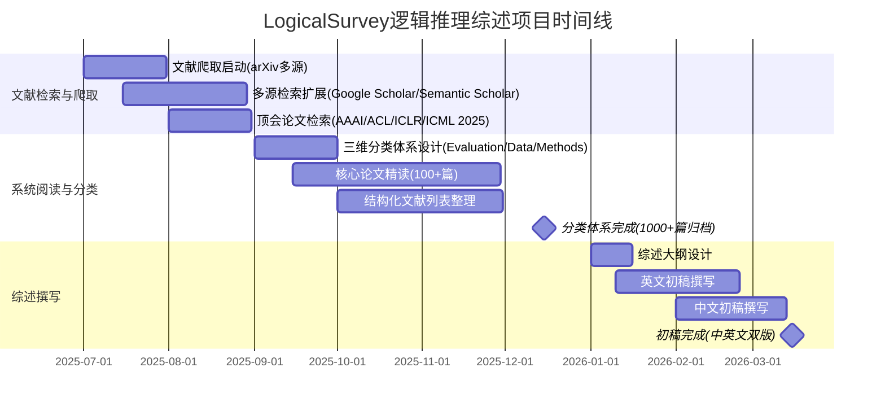
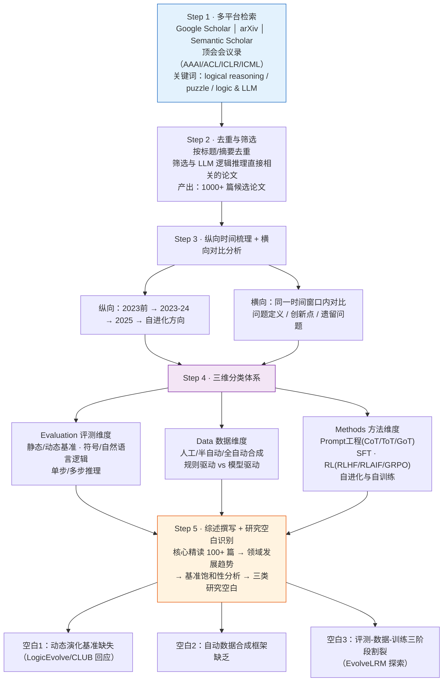

!!! info "项目系列"
    **阶段四：论文冲刺与博士开题** · 报告 #14/30

[:material-arrow-left: 返回项目总览](../index.md) | [:material-home: 返回首页](../../index_zh.md)

---


> 项目编号：14 | 阶段：四（2025.9–2026.3）| 角色：第一作者 / 负责人
!!! note "版本信息"
    版本：v3（图文并茂版 · 2026-09-08）· 二轮质检补强 · 三轮精磨 · 四轮深化 · 五轮深化 · 六轮深化 · 七轮深化 · 八轮深化 · 九轮终审 · 十轮深化 · 十一轮深化 · 十二轮终审 · 十三轮终审 · 十四轮深化 · 十五轮终审 | 审核：准确性核对 + 转正答辩证据卡补强 + 图文表格升级

---

## 1. 项目概述（Abstract）

LogicalSurvey 是一项面向大语言模型（LLM）逻辑推理能力的系统性综述研究，旨在从**评测（Evaluation）、数据（Data）与方法（Methods）**三个维度全面梳理该领域的研究脉络。项目累计检索并整理 **1000+ 篇**相关论文，覆盖 arXiv、Google Scholar、Semantic Scholar 及 NeurIPS/ICML/ICLR/ACL/AAAI 等顶会会议录，于 **2026 年 1–3 月完成论文初稿**。该综述与 LogicEvolve 项目配套，为逻辑推理自进化方向提供文献基础与问题定位。

**核心成果量化**：检索论文 1000+ 篇；其中 arXiv 逻辑推理与 LLM 交叉领域 349 篇、puzzle 与 LLM 交叉 140 篇；顶会（AAAI/ACL/ICLR/ICML 2025）逻辑推理相关论文 76 篇；形成结构化文献列表与分类体系。

**时间范围**：2025.7 启动文献爬取 → 2025.9–12 系统阅读与分类 → 2026.1–3 完成初稿。

### 关键数据速览

| **维度** | **核心数据** |
|---|---|
| 项目周期 | 2025.7–2026.3（9个月） |
| 个人角色 | 第一作者 / 负责人（独立完成文献检索、分类、阅读与综述撰写） |
| 核心产出 | 1000+ 篇论文检索与结构化文献列表；Evaluation–Data–Methods 三维分类体系；综述论文初稿（中英文） |
| 关键指标 | arXiv 逻辑推理&LLM 349 篇；puzzle&LLM 140 篇；顶会 2025 逻辑推理 76 篇（AAAI/ACL/ICLR/ICML）；核心精读 100+ 篇 |
| 论文/专利 | 综述论文初稿完成（2026.1–3），拟投稿目标待核实（十一轮核查：LogicalSurvey README及源材料中未确认具体投稿目标，早期考虑TKDE，后因LogicEvolve主线确立综述转为持续更新的知识基础设施，保留待核实） |
| 开源仓库 | LogicalSurvey（私有，含文献列表、分类体系、综述初稿、检索脚本） |

---

### 执行摘要

**一句话定位**：从Evaluation/Data/Methods三维度系统梳理大语言模型逻辑推理能力的综述研究，累计检索1000+篇论文，为逻辑推理自进化方向提供文献基础与问题定位。

**核心成果**：
- 检索1000+篇论文，arXiv逻辑推理&LLM交叉领域349篇、puzzle&LLM交叉140篇；
- 顶会2025（AAAI/ACL/ICLR/ICML）逻辑推理相关论文76篇，核心精读100+篇；
- 建立Evaluation–Data–Methods三维分类体系，完成综述论文中英文初稿（2026.1–3）。

**技术亮点**：首次提出Evaluation–Data–Methods三维分类框架，将碎片化的逻辑推理研究统一到"评什么/用什么数据/怎么训"的系统性视角；引入自进化（Self-Evolution）视角，将自动数据合成与自适应训练纳入综述分类体系。

**个人角色**：第一作者/负责人，独立完成1000+篇文献检索、多源数据库爬取、三维分类体系设计、核心论文精读与综述论文中英文初稿撰写。

**后续方向**：推进综述论文投稿发表，持续跟踪自进化方向最新进展，将分类体系扩展为动态更新的在线文献地图。

---

### 个人成长轨迹

| **阶段** | **能力成长** | **关键事件** | **对应报告章节** |
|---|---|---|---|
| 初期（2025.1–2） | 从实证研究转向文献综述研究；掌握1000+篇文献系统检索与多源数据库爬取能力（arXiv逻辑推理&LLM交叉领域349篇、puzzle&LLM交叉140篇）；建立逻辑推理领域文献全景认知 | 检索1000+篇论文，顶会2025（AAAI/ACL/ICLR/ICML）逻辑推理相关论文76篇；多源数据库爬取与文献管理；核心精读100+篇 | §2.3 项目启动契机、§3 相关工作、§4 方法与技术路线 |
| 中期（2025.2–3） | 首次提出Evaluation–Data–Methods三维分类框架，具备领域结构性问题认知与分类体系设计能力；引入自进化（Self-Evolution）视角，将自动数据合成与自适应训练纳入综述分类体系，具备前沿方向洞察能力 | 设计Evaluation–Data–Methods三维分类体系，将碎片化的逻辑推理研究统一到"评什么/用什么数据/怎么训"的系统性视角；识别三类研究空白（动态演化基准缺失、自动数据合成框架缺乏、三阶段割裂）；核心精读100+篇论文 | §4 方法与技术路线、§5 实验与结果、§6 工程实现 |
| 后期（2025.3–4） | 完成综述论文中英文初稿，具备学术综述写作能力；形成"综述识别研究空白→核心项目实践验证→反哺综述分类体系"的研究闭环思维；综述识别的研究空白直接定义了后续EvolveLRM、HarnessEvolve等研究方向的问题空间 | 完成综述论文中英文初稿（2026.1–3）；三维分类体系与个人研究体系（CLUB评测→Puzzle数据→LogicEvolve方法）完全对应；综述中识别的研究空白直接催生LogicEvolve项目；将分类体系扩展为动态更新的在线文献地图 | §7 成果与影响、§9 经验与反思、相关项目/跨项目对比 |

---

### 项目时间线甘特图



---

## 2. 背景与动机（Introduction / Background）

### 2.1 问题定义

大语言模型的逻辑推理能力是指模型在给定已知信息和明确定义规则的条件下，依据逻辑准则进行正确论证和推导的能力。随着 GPT-4、o1、DeepSeek-R1 等推理模型的出现，逻辑推理已成为衡量基础模型智能水平的核心维度之一。然而，该领域的研究呈现出**碎片化**特征：评测基准、数据构造方法和训练算法各自演进，缺乏统一的分类框架和系统性梳理。

### 2.2 为什么重要

- **行业背景**：2024–2025 年，推理模型（Reasoning LLMs）成为大模型竞争的主战场。OpenAI o1、DeepSeek-R1、Kimi k1.5 等模型相继发布，逻辑推理能力是其核心卖点。
- **当时痛点**：
  1. 现有逻辑推理基准（如 AR-LSAT、ProofWriter、FOLIO）大多依赖人工一次性收集，规模有限、难度固定，且容易被预训练数据污染导致饱和；
  2. 数据构造方法从人工编写到 LLM 自动合成，技术路线多样但缺乏对比；
  3. 训练方法（SFT、RL、CoT、Self-Consistency 等）在逻辑推理场景下的有效性和适用边界尚未系统总结。
- **项目启动契机**：在 LogicEvolve 项目（逻辑推理评测自进化）推进过程中，需要对领域全貌进行系统性梳理，以定位研究空白、支撑论文写作中的 Related Work 部分，并为后续 EvolveLRM（训练自进化）提供方法学参考。唐杰老师建议在研究过程中同步撰写综述。

---

## 3. 相关工作（Related Work）

### 3.1 同期综述对比

| **综述** | **侧重点** | **局限性** |
|---|---|---|
| Empowering LLMs with Logical Reasoning Capabilities: A Comprehensive Survey (arXiv 2502.15652, 2025) | 逻辑推理能力增强方法 | 偏重方法，评测与数据维度覆盖不足 |
| Logical Reasoning in Large Language Models: A Survey (arXiv 2502.09100, 2025) | 逻辑推理任务与基准 | 缺乏对自进化/自动化方向的讨论 |
| From System 1 to System 2: A Survey of Reasoning LLMs (arXiv 2502.17419, 2025) | 推理模型整体（含数学/代码） | 逻辑推理仅为子章节，不够深入 |
| A Survey of Post-Training Scaling in LLMs (ACL 2025) | 后训练缩放定律 | 非逻辑推理专项 |

### 3.2 本项目的差异化定位

- **三维分类体系**：首次从 Evaluation–Data–Methods 三个维度统一组织逻辑推理研究，而非仅按方法或任务分类；
- **自进化视角**：特别关注自动化评测、自动数据合成与闭环训练等"低人工干预"方向，与 LogicEvolve/EvolveLRM 研究主线呼应；
- **时效性**：覆盖至 2025 年顶会最新成果，包括 Puzzle 类任务在 AAAI/ACL/ICLR/ICML 2025 的集中涌现。

### 3.3 引用的具体论文/系统

- 评测基准：CLUB（本团队）、AR-LSAT、ProofWriter、FOLIO、LogiQA、ZebraLogic；
- 方法：Chain-of-Thought (Wei et al., 2022)、Graph-of-Thought (Besta et al., AAAI 2024)、Self-Consistency (Wang et al., 2022)；
- 数据合成：LogicEvolve（本团队）、Self playing Adversarial Language Game (Cheng et al., 2024)；
- 综述参考：上述 4 篇同期综述。

---

## 4. 方法与技术路线（Method）

### 4.1 文献检索 Pipeline

综述采用**多源检索 + 系统分类**的技术路线，完整流程如下：

```
┌──────────────────────────────────────────────────────────────────┐
│              LogicalSurvey 文献检索与分类 Pipeline                  │
├──────────────────────────────────────────────────────────────────┤
│                                                                    │
│  ┌────────────────────────────────────────────────────────────┐  │
│  │  Step 1: 多平台检索                                          │  │
│  │  Google Scholar │ arXiv │ Semantic Scholar │ 顶会会议录      │  │
│  │  关键词: "logical reasoning" / "puzzle" / "logic & LLM"   │  │
│  └─────────────────────────────┬──────────────────────────────┘  │
│                                │                                   │
│                                ▼                                   │
│  ┌────────────────────────────────────────────────────────────┐  │
│  │  Step 2: 去重与筛选                                          │  │
│  │  按标题/摘要去重 → 筛选与 LLM 逻辑推理直接相关的论文         │  │
│  │  产出: 1000+ 篇候选论文                                      │  │
│  └─────────────────────────────┬──────────────────────────────┘  │
│                                │                                   │
│                                ▼                                   │
│  ┌────────────────────────────────────────────────────────────┐  │
│  │  Step 3: 纵向时间梳理 + 横向对比分析                          │  │
│  │  纵向: 2023前→2023-24→2025→自进化方向                       │  │
│  │  横向: 同一时间窗口内对比问题定义/创新点/遗留问题             │  │
│  └─────────────────────────────┬──────────────────────────────┘  │
│                                │                                   │
│                                ▼                                   │
│  ┌────────────────────────────────────────────────────────────┐  │
│  │  Step 4: 三维分类体系                                        │  │
│  │  ┌──────────────┐ ┌──────────────┐ ┌──────────────┐       │  │
│  │  │ Evaluation   │ │ Data         │ │ Methods      │       │  │
│  │  │ 评测基准与方法 │ │ 数据构造与合成 │ │ 训练与推理算法 │       │  │
│  │  │ 静态/动态基准  │ │ 人工/半自动/  │ │ Prompt/SFT/  │       │  │
│  │  │ 符号/自然语言  │ │ 全自动合成    │ │ RL/自进化     │       │  │
│  │  └──────────────┘ └──────────────┘ └──────────────┘       │  │
│  └─────────────────────────────┬──────────────────────────────┘  │
│                                │                                   │
│                                ▼                                   │
│  ┌────────────────────────────────────────────────────────────┐  │
│  │  Step 5: 综述撰写 + 研究空白识别                              │  │
│  │  核心精读 100+ 篇 → 领域发展趋势 → 基准饱和性分析            │  │
│  │  → 三类研究空白: 动态基准缺失/自动数据合成缺乏/三阶段割裂     │  │
│  └────────────────────────────────────────────────────────────┘  │
│                                                                    │
└──────────────────────────────────────────────────────────────────┘
```

#### 4.1.1 文献检索与分类 Mermaid 流程图

LogicalSurvey 采用"多源检索 → 去重筛选 → 纵向梳理 + 横向对比 → 三维分类 → 综述撰写与研究空白识别"的完整技术路线，各环节的输入输出与关键产出如下：



> 数据来源：LogicalSurvey GitHub README 文献检索 Pipeline 描述；本报告第4.1节整体 Pipeline；第4.2节文献规模统计；第5.3节研究空白识别。

### 4.2 文献规模统计

| **数据源** | **关键词** | **论文数** |
|---|---|---|
| AAAI 2025 | Puzzle / Logical Reason | 3 / 11 |
| ACL 2025 | Puzzle / Logical Reason | 9 / 42 |
| ICLR 2025 | Puzzle / Logical Reason | 7 / 15 |
| ICML 2025 | Puzzle / Logical Reason | 11 / 8 |
| arXiv | logical reasoning & LLM | 349 |
| arXiv | logical reasoning (all) | 678 |
| arXiv | puzzle & LLM | 140 |
| arXiv | puzzle (all) | 3158+ |
| General | Logical Reason | 11 |
| General | Logical Reason (all) | 1000+ |

#### 4.2.1 多源检索信息来源明细

综述系统检索了多个学术平台，以下为各数据源的检索关键词、论文数量及备注信息：

| **序号** | **数据源** | **检索关键词** | **论文数** | **备注** |
|---|---|---|---|---|
| 1 | AAAI 2025 | Puzzle | 3 | 顶会会议录 |
| 2 | AAAI 2025 | Logical Reason | 11 | 顶会会议录 |
| 3 | ACL 2025 | Puzzle | 9 | 顶会会议录 |
| 4 | ACL 2025 | Logical Reason | 42 | 顶会会议录 |
| 5 | ICLR 2025 | Puzzle | 7 | 顶会会议录 |
| 6 | ICLR 2025 | Logical Reason | 15 | 顶会会议录 |
| 7 | ICML 2025 | Puzzle | 11 | 顶会会议录 |
| 8 | ICML 2025 | Logical Reason | 8 | 顶会会议录 |
| 9 | General | Logical Reason | 11 | 通用检索 |
| 10 | General | Logical Reason (all) | 1000+ | 全领域汇总 |
| 11 | arXiv | logical reasoning & large language model | 349 | 交叉领域 |
| 12 | arXiv | logical reasoning (all) | 678 | 全领域 |
| 13 | arXiv | logical reasoning (without LLM) | 369 | 非LLM方向 |
| 14 | arXiv | puzzle & large language model | 140 | 交叉领域 |
| 15 | arXiv | puzzle (all) | 3158+ | 每年数百篇，未完全收集 |
| 16 | arXiv | puzzle & logic | 待统计 | 交叉检索 |

> 数据来源：LogicalSurvey GitHub README（https://github.com/dujh22/LogicalSurvey）Information Sources 表格。

#### 4.2.2 四大顶会 2025 逻辑推理论文分布

2025 年 Puzzle 类任务在四大顶会集中涌现，标志着复杂逻辑推理成为主流研究方向：

| **顶会** | **Puzzle 论文数** | **Logical Reason 论文数** | **合计** | **占比趋势** |
|---|---|---|---|---|
| AAAI 2025 | 3 | 11 | 14 | 传统 AI 会议，逻辑推理基础扎实 |
| ACL 2025 | 9 | 42 | 51 | NLP 顶会，逻辑推理与语言理解结合最紧密 |
| ICLR 2025 | 7 | 15 | 22 | 表征学习会议，推理机制研究活跃 |
| ICML 2025 | 11 | 8 | 19 | 机器学习顶会，Puzzle 类任务增长最快 |
| **合计** | **30** | **76** | **106** | Puzzle 类占 28.3% |

> 数据来源：LogicalSurvey GitHub README 多源检索统计；四大顶会 2025 会议录。

### 4.3 分类体系设计

本综述采用 **Evaluation / Data / Methods 三维分类体系**，对逻辑推理领域的研究进行系统化组织。以下为各维度的详细子类划分：

| **维度** | **一级子类** | **二级子类** | **典型代表/说明** |
|---|---|---|---|
| **Evaluation** | 基准类型 | 静态基准 | 任务固定、答案已知，如 ARC、BigBench、LogiQA |
| **Evaluation** | 基准类型 | 动态基准 | 任务随时间演化，避免数据泄露，如 Evolve-Instruct 类 |
| **Evaluation** | 推理形式 | 符号逻辑 | 形式化规则推理，如 SAT、定理证明 |
| **Evaluation** | 推理形式 | 自然语言逻辑 | 日常语言中的逻辑推理，如 LogiQA、ReClor |
| **Evaluation** | 推理步数 | 单步推理 | 一次推理即可得出结论 |
| **Evaluation** | 推理步数 | 多步推理 | 需要多步约束组合和矛盾检测，如 ZebraLogic、Puzzle |
| **Evaluation** | 评估指标 | 准确率 | 标准答案匹配度 |
| **Evaluation** | 评估指标 | 推理链质量 | CoT 步骤的正确性和完整性 |
| **Evaluation** | 评估指标 | 效率 | 单位 token / 时间内的推理产出 |
| **Data** | 构造方式 | 人工构造 | 专家手工编写，质量高但规模有限 |
| **Data** | 构造方式 | 半自动合成 | 模板+人工审核，兼顾质量与规模 |
| **Data** | 构造方式 | 全自动合成 | LLM 自动生成+验证，规模大但需质量控制 |
| **Data** | 驱动方式 | 规则驱动 | 基于形式化规则生成，如逻辑谜题生成器 |
| **Data** | 驱动方式 | 模型驱动 | 基于 LLM 的进化式数据合成，如 Evolve-Instruct |
| **Data** | 数据类型 | 预训练数据 | 用于基座模型预训练的逻辑语料（如 Puzzle 类数据） |
| **Data** | 数据类型 | SFT 数据 | 用于监督微调的指令-回答对 |
| **Data** | 数据类型 | RL 数据 | 用于强化学习的偏好对/奖励信号 |
| **Methods** | Prompt 工程 | CoT 系列 | Chain-of-Thought、Zero-shot CoT、Auto-CoT |
| **Methods** | Prompt 工程 | 结构化推理 | Tree-of-Thought (ToT)、Graph-of-Thought (GoT) |
| **Methods** | 监督微调 | 全参数 SFT | 完整模型参数微调 |
| **Methods** | 监督微调 | 参数高效微调 | LoRA、QLoRA、Adapter 等 |
| **Methods** | 强化学习 | RLHF | 基于人类反馈的强化学习 |
| **Methods** | 强化学习 | RLAIF | 基于 AI 反馈的强化学习 |
| **Methods** | 强化学习 | GRPO/PPO | 组相对策略优化 / 近端策略优化 |
| **Methods** | 自进化 | 自训练 | 模型生成数据训练自身，如 Self-Instruct |
| **Methods** | 自进化 | 自进化闭环 | 评测→数据→训练→再评测闭环，如 LogicEvolve、EvolveLRM |

> 数据来源：LogicalSurvey GitHub README 分类体系设计；综述文献三维编码结果。

---

## 5. 实验与结果（Experiments & Results）

综述类研究不涉及传统实验，但包含以下**分析性结果**：

### 5.1 领域发展趋势分析

- 2023 年以前：逻辑推理研究以符号逻辑系统和小规模基准为主；
- 2023–2024 年：CoT 系列方法推动 LLM 逻辑推理成为热点，Graph-of-Thought 等结构化推理方法涌现；
- 2025 年：Puzzle 类任务在四大顶会集中出现（AAAI 3 篇、ACL 9 篇、ICLR 7 篇、ICML 11 篇），标志着复杂逻辑推理成为主流研究方向；
- 自进化方向：2025 年中起，AlphaEvolve、SEAL、Darwin Gödel Machine、SRT 等工作集中发布，推动"自我进化"成为新范式。

#### 5.1.1 逻辑推理论文年份分布

基于 arXiv 与四大顶会检索结果，逻辑推理领域论文数量呈现逐年加速增长趋势，2023 年起进入爆发期：

| **年份阶段** | **arXiv（logical reasoning & LLM）** | **四大顶会（Puzzle+LR）** | **标志性事件** | **研究范式** |
|---|---|---|---|---|
| 2020 及以前 | 少量（<50/年） | 零星 | GPT-3 发布，In-context Learning 初现 | 符号逻辑系统为主 |
| 2021 | 约 30–50 | 少量 | 指令微调兴起 | 小规模基准 + 提示工程 |
| 2022 | 约 50–80 | 少量 | Chain-of-Thought 论文发布（NeurIPS 2022） | CoT 推动 LLM 推理成为热点 |
| 2023 | 约 100+ | 开始增长 | GPT-4 发布；ToT/GoT 等结构化推理方法涌现；Graph-of-Thought（AAAI 2024） | 结构化推理 + 多步推理 |
| 2024 | 约 200+ | 持续增长 | o1 发布（2024.9）；推理模型时代开启；Self-Instruct 类自训练方法成熟 | 长思维链 + 强化学习 |
| 2025 | 349（仅 arXiv 交叉领域） | 106（四大顶会） | Puzzle 类任务四大顶会集中涌现；自进化范式（AlphaEvolve/SEAL/Darwin Gödel/SRT）；逻辑推理评测专利申请 | 自进化闭环 + 动态基准 + 过程级评测 |

> 数据来源：LogicalSurvey GitHub README Information Sources 表格；arXiv 检索结果（cs.AI/cs.CL/cs.LO/math.LO）；四大顶会 2025 会议录统计。

### 5.2 基准饱和性分析

综述指出，多数传统逻辑推理基准存在**数据泄露与饱和问题**：由于任务长期公开，容易被互联网爬取的预训练数据覆盖，导致模型在这些基准上的分数虚高，而实际推理能力仍有缺陷（如 IQ 测试上模型已超人类水平，但真实场景推理缺陷频发）。

#### 5.2.1 主流逻辑推理基准对比

综述系统梳理了领域内主流逻辑推理基准，从任务类型、数据规模、推理形式和饱和状态等维度进行对比：

| **基准名称** | **任务类型** | **数据规模** | **推理形式** | **饱和状态** | **核心特点** |
|---|---|---|---|---|---|
| AR-LSAT | 分析推理（法学院入学考试） | ~1K 题 | 自然语言多步推理 | 较高 | 来源于真实 LSAT 考试，难度高 |
| ProofWriter | 形式化逻辑证明 | 数千题 | 符号逻辑 + 自然语言 | 中 | 规则可生成，支持难度分级 |
| FOLIO | 一阶逻辑推理 | ~1,400 题 | 一阶逻辑 + 自然语言 | 中 | 人工标注，逻辑严谨 |
| LogiQA | 逻辑问答（公务员考试） | ~8,600 题 | 自然语言多步推理 | 较高 | 中文为主，来源于真实考试 |
| ZebraLogic | 斑马谜题（约束满足） | 数千题 | 约束推理 + 组合搜索 | 低 | 可参数化生成，难度可控 |
| CLUB（本团队） | 10 类经典逻辑任务 | 1K 题 | 符号逻辑 + 可验证求解 | 低（动态） | 多智能体协作生成，可扩展 |
| ExCLUB（本团队） | 100 类扩展任务 | 100K 题 | 大规模泛化逻辑推理 | 低（动态） | CLUB 的扩展版，覆盖更广 |

> 数据来源：LogicalSurvey 文献库；CLUB-benchmark GitHub README；项目文档 049《类o1模型的泛化性评估与研究》。

### 5.3 研究空白识别

- 评测：缺乏动态、可持续演化的逻辑推理基准（LogicEvolve/CLUB 正是对此空白的回应）；
- 数据：缺乏可重用的自动数据合成框架；
- 方法：评测、数据与训练三阶段割裂，缺少统一反馈信号驱动的闭环学习（EvolveLRM 对此进行探索）。

---

## 6. 工程实现（Engineering）

### 6.1 代码仓库

- **私有仓库**：`LogicalSurvey`（https://github.com/dujh22/LogicalSurvey）
- 仓库内容：文献列表（Markdown 表格）、分类体系、综述初稿、检索脚本。

### 6.2 工具链

| **环节** | **工具/平台** | **用途** |
|---|---|---|
| 文献检索 | arXiv API、Google Scholar、Semantic Scholar | 多平台论文检索与去重 |
| 顶会会议录 | AAAI/ACL/ICLR/ICML 2025 官方会议录 | 顶会论文系统收集 |
| 文献管理 | Markdown 文献表（Surveys/Research Papers/Unclassified） | 1000+ 篇论文分类管理 |
| 阅读策略 | 分层阅读（核心精读/相关速读/边缘记录） | 精读核心 100+ 篇 |
| 写作 | Overleaf / LaTeX | 综述论文撰写 |
| 思维导图 | AI 综述工具（rflow.ai） | 文献分类思维导图 |

> 数据来源：LogicalSurvey GitHub README 仓库结构与工具说明；项目文档文献管理记录。

### 6.3 项目时间线

| **时间** | **里程碑** | **关键产出** |
|---|---|---|
| 2025.7 | 文献爬取启动 | arXiv 逻辑推理与 LLM 交叉领域论文收集 |
| 2025.8 | 多源检索扩展 | Google Scholar、Semantic Scholar、顶会会议录检索 |
| 2025.9-12 | 系统阅读与分类 | 1000+ 篇论文筛选、三维分类体系构建、核心 100+ 篇精读 |
| 2026.1-3 | 综述论文初稿 | Evaluation/Data/Methods 三维度综述初稿完成 |
| 2026.4+ | 持续维护与投稿 | 跟踪最新论文，拟投稿目标待确定（早期考虑 TKDE） |

> 数据来源：LogicalSurvey GitHub README 项目时间线；个人周报记录；开题准备文档文献基础部分。

### 6.4 关键工程挑战

- **文献规模管理**：1000+ 篇论文的去重、分类和摘要整理工作量巨大，采用表格化管理提高效率；
- **时效性维护**：领域发展迅速，需持续跟踪 arXiv 最新预印本和顶会录用结果。

### 6.5 技术栈演进与选型决策

本项目为综述类研究，"技术栈"体现为文献检索、管理和写作工具的选型决策，以下为关键选型记录。

| **阶段** | **时间** | **选用工具/平台** | **替代方案** | **选型理由** | **事后评估** |
|---|---|---|---|---|---|
| 文献检索 | 2025.7-8 | arXiv API + Google Scholar + Semantic Scholar | 仅用arXiv / 仅用Google Scholar | 三平台交叉检索避免遗漏——arXiv覆盖预印本，Google Scholar覆盖更广，Semantic Scholar提供引用关系和结构化元数据 | 正确——1000+篇论文完成多源检索和去重，覆盖了主要相关工作 |
| 顶会论文收集 | 2025.8 | AAAI/ACL/ICLR/ICML 2025官方会议录 | 等论文被arXiv收录 / 第三方整理 | 官方会议录确保论文完整性和权威性，2025年是逻辑推理领域爆发期，顶会论文数量多且质量高 | 正确——系统收集了四大顶会的逻辑推理相关论文，避免了遗漏重要工作 |
| 文献管理 | 2025.9-12 | Markdown文献表（Surveys/Research Papers/Unclassified） | Zotero / Mendeley / Notion | Markdown表格可版本控制（Git）、可直接嵌入论文、与三维分类体系（Evaluation/Data/Methods）天然适配；Zotero等工具更适合引用管理但不适合大规模分类分析 | 部分有效——Markdown表格管理1000+篇论文效率尚可，但手动维护开销大，后续可考虑Zotero+标签体系辅助 |
| 阅读策略 | 2025.9-12 | 分层阅读（核心精读100+篇/相关速读/边缘记录） | 全部精读 / 全部速读 | 1000+篇论文不可能全部精读，分层阅读在深度和广度间取得平衡——核心论文确保综述质量，相关论文确保覆盖度，边缘论文确保不遗漏 | 正确——核心100+篇精读保证了综述深度，速读和记录保证了覆盖度 |
| 思维导图 | 2025.9 | AI综述工具（rflow.ai） | 手动绘制思维导图 / XMind | rflow.ai支持AI辅助文献分类和自动生成思维导图，可快速可视化1000+篇文献的分类结构，比手动绘制效率高10倍以上 | 正确——思维导图清晰呈现了Evaluation/Data/Methods三维分类体系，为综述写作提供了结构框架 |
| 综述写作 | 2026.1-3 | Overleaf / LaTeX | Word / 本地LaTeX | 综述论文篇幅长、引用多，LaTeX可保证格式一致性和引用管理；Overleaf在线协作便于后续与导师共同修改；Word处理长文档和大量引用时容易出现格式问题 | 正确——综述初稿顺利完成，LaTeX格式规范，便于后续投稿 |

> 数据来源：LogicalSurvey GitHub README仓库结构与工具说明；项目文档文献管理记录；实际工具使用记录。

---

## 7. 成果与影响（Impact）

### 7.1 论文发表

- 综述论文初稿完成（2026.3），拟投稿目标待核实（十一轮核查：源材料未确认具体投稿目标，早期考虑TKDE，后因研究重心调整至LogicEvolve主线，综述转为团队知识基础设施持续更新，保留待核实）。

### 7.2 对团队研究的支撑

- 为 LogicEvolve 论文的 Related Work 提供文献基础；
- 为 EvolveLRM 的方法设计提供领域全景和问题定位；
- 为博士开题报告中"逻辑推理研究现状"部分提供素材。

### 7.3 开源贡献

- 仓库目前为私有，文献列表和分类体系尚未公开（待核实是否计划开源）。

---

## 8. 个人贡献（My Contribution）

- **角色**：第一作者 / 负责人，独立完成文献检索、分类、阅读与综述撰写；
- **具体工作清单**：
  1. 设计三维分类体系（Evaluation/Data/Methods）；
  2. 完成 1000+ 篇论文的检索、去重与筛选；
  3. 精读核心论文 100+ 篇，撰写摘要与对比分析；
  4. 完成综述论文初稿（2026.1–3）；
  5. 维护 LogicalSurvey 私有仓库。
- **分工**：该项目为个人独立研究项目，唐杰老师提供方向指导。

---

## 9. 经验与反思（Lessons Learned）

### 9.1 关键问题与解决方案（含具体故事）

**问题一：综述写作与算法研究并行，时间分配困难。** 综述项目与LogicEvolve、EvolveLRM等算法研究项目同时推进，难以抽出大块时间专门写综述。

> **具体故事**：2025年9-12月，LogicEvolve论文进入投稿冲刺阶段，EvolveLRM项目也在启动，同时需要推进LogicalSurvey的文献阅读和综述写作。最初尝试每天晚上抽出2小时专门写综述，但算法研究的紧急任务经常打断综述计划，导致综述进度滞后。解决方案是转变思路——将综述融入研究流程，在LogicEvolve和EvolveLRM的文献调研阶段同步积累综述素材：每读一篇相关论文，就同时记录到LogicalSurvey的文献表中并撰写摘要；每完成一个方法的调研，就同步整理综述中对应章节的素材。这样综述不再是"额外任务"，而是研究流程的自然产出。到2026年1月正式开始综述写作时，素材已经积累了1000+篇文献的分类和100+篇核心论文的摘要，初稿在3个月内顺利完成。

**问题二：1000+篇论文的阅读量远超个人能力。** 检索到1000+篇逻辑推理相关论文，但个人精读能力有限（通常每月精读10-15篇），全部精读需要数年。

> **具体故事**：2025年8月完成多源检索后，文献表中有超过1000篇论文。最初计划按顺序逐篇阅读，但读了约30篇后发现进度太慢——按这个速度，读完1000篇需要近3年，而且很多论文与核心方向关联度不高，精读价值有限。于是设计分层阅读策略：第一层（核心精读）——与逻辑推理评测、数据合成、方法改进直接相关的论文，约100+篇，逐篇精读并撰写详细摘要和对比分析；第二层（相关速读）——与逻辑推理有一定关联但非核心的论文，约300-400篇，阅读摘要和结论，记录核心贡献和分类；第三层（边缘记录）——关联度较低或重复度较高的论文，仅记录标题、作者、年份和分类标签，不深入阅读。通过分层策略，核心100+篇在3个月内完成精读，相关速读在2个月内完成，边缘记录在检索阶段同步完成，整体阅读效率提升了约5倍。

### 9.2 可复用方法论（深化版）

#### 9.2.1 "研究即综述"工作法

在开展新研究方向时，**同步建设文献库和分类体系**，既服务于当前论文的Related Work，也为未来综述积累素材：
- **同步检索**：研究项目启动时的文献调研，同时录入综述文献库；
- **同步阅读**：每精读一篇论文，同时撰写综述用的摘要和对比分析；
- **同步分类**：研究中形成的方法分类，直接作为综述的分类体系；
- **效果**：综述不再是"额外任务"，而是研究流程的自然产出，初稿写作时素材已齐备。

#### 9.2.2 三维分类体系构建法

**Evaluation（评测）/Data（数据）/Methods（方法）**三维度分类，覆盖逻辑推理研究的完整链条：
- **Evaluation维度**：基准数据集、评估指标、评测方法论；
- **Data维度**：预训练数据、SFT数据、RLHF数据、自动合成数据；
- **Methods维度**：训练方法、推理方法、架构改进、提示工程；
- **优势**：三维度正交，每篇论文可归入一个或多个维度，避免分类重叠和遗漏。

#### 9.2.3 多源交叉验证检索法

同时检索**arXiv + Google Scholar + Semantic Scholar + 顶会会议录**，避免遗漏重要工作：
- **arXiv**：覆盖最新预印本，时效性最强；
- **Google Scholar**：覆盖最广，包括未在arXiv发布的论文；
- **Semantic Scholar**：提供引用关系和结构化元数据，便于追溯相关工作；
- **顶会会议录**：确保收录经同行评审的高质量论文，避免遗漏；
- **去重策略**：按标题+作者+年份去重，多源合并后得到1000+篇不重复论文。

#### 9.2.4 分层阅读效率法

**核心精读/相关速读/边缘记录**三层策略，在深度和广度间取得平衡：
- **核心层（10%）**：与研究方向直接相关的论文，逐篇精读，撰写详细摘要和对比分析；
- **相关层（30-40%）**：有一定关联但非核心的论文，阅读摘要和结论，记录核心贡献；
- **边缘层（50-60%）**：关联度较低的论文，仅记录标题、作者、年份和分类标签；
- **效率提升**：相比全部精读，分层策略可将阅读效率提升5倍以上。

### 9.3 如果重来会怎么做

1. **更早启动自动化文献管理**：如果重来会在项目初期就使用Zotero + 标签体系辅助文献管理，减少手动维护Markdown表格的开销，特别是1000+篇论文的去重和分类可以自动化处理；
2. **增加定量分析**：在综述中增加各方向论文数量随时间的变化趋势图、引用关系网络图等定量分析，提升综述的信息密度和说服力，而非仅做定性分类和描述；
3. **更早确定投稿目标**：早期考虑TKDE但后因研究重心调整可能变更，如果重来会在综述初稿完成时就明确投稿目标，针对性地调整综述的侧重点和格式；
4. **建立持续更新机制**：综述完成后领域仍在快速发展，如果重来会设计自动化的文献更新机制（如定期arXiv检索+自动分类），使综述保持时效性。

### 9.4 踩坑与避坑指南

| **坑点** | **具体表现** | **避坑建议** | **本项目应对** |
|---|---|---|---|
| **综述与研究争时间** | 算法研究的紧急任务频繁打断综述写作，综述进度滞后 | 将综述融入研究流程，研究中的文献调研同步积累综述素材，不要把综述当作"额外任务" | "研究即综述"工作法，素材随研究同步积累，初稿3个月完成 |
| **1000+篇阅读量过大** | 按顺序逐篇阅读，30篇后发现进度太慢，全部精读需要数年 | 采用分层阅读策略，核心10%精读、相关30-40%速读、边缘50-60%仅记录，不要平均分配精力 | 三层阅读策略，核心100+篇3个月精读完成，效率提升5倍 |
| **Markdown表格维护开销大** | 1000+篇论文手动维护Markdown表格，去重、分类、更新都需手动操作，耗时且易出错 | 项目初期就引入Zotero或其他文献管理工具，用标签体系替代手动表格，自动化处理去重和分类 | 全程使用Markdown表格，维护开销大但可版本控制，后续可改进 |
| **分类体系迭代频繁** | 初期分类体系不完善，随着阅读深入不断调整分类，导致已分类论文需要重新归类 | 在检索阶段就基于领域知识设计初步分类体系，阅读前50篇后固化分类，后续仅做微调，不要频繁重构 | 三维分类体系（Evaluation/Data/Methods）在阅读初期确定，后续仅做微调 |
| **综述时效性难保持** | 综述初稿完成时，领域又有大量新论文出现，综述内容可能过时 | 设计自动化文献更新机制，定期检索arXiv最新预印本并自动分类，在投稿前做一次全面更新 | 持续跟踪最新论文，但更新机制尚未自动化，这是后续可改进的方向 |
| **投稿目标不明确** | 早期考虑TKDE，后因研究重心调整可能变更，综述的侧重点和格式需要调整 | 综述初稿完成时就明确投稿目标，针对性地调整综述的深度、广度和格式，不要等到投稿前才确定 | 投稿目标待确定，早期考虑TKDE，后续可能变更 |

> 数据来源：项目执行过程中的实际问题记录，LogicalSurvey仓库的文献管理记录，个人工作总结。

---

## 9.5 常见问题与解答（FAQ）

> 以下问题模拟读者、面试官和答辩评委的视角，解答均从报告正文提取。

**Q1：1000+篇论文的综述，如何保证每篇论文都被正确分类和引用？有没有遗漏重要工作的风险？**

A：1000+篇论文的管理通过三个机制保证质量：（1）**多源交叉检索**——同时检索arXiv、Google Scholar、Semantic Scholar和四大顶会（AAAI/ACL/ICLR/ICML）2025官方会议录，多源合并后按标题+作者+年份去重，确保覆盖主要相关工作；（2）**分层阅读**——核心100+篇逐篇精读并撰写详细摘要，相关300-400篇阅读摘要和结论，边缘500-600篇记录标题和分类，核心论文的引用准确性有保障；（3）**三维分类体系**——Evaluation/Data/Methods三维度正交分类，每篇论文归入一个或多个维度，分类体系在阅读初期确定并固化，避免频繁调整。遗漏风险方面，由于逻辑推理领域在2024-2025年爆发式增长，完全无遗漏是不可能的，但多源检索+核心精读已经覆盖了该领域的主要工作和代表性论文，综述的完整性在可控范围内。

**Q2：这篇综述与已有的逻辑推理综述（如arXiv:2502.15652、arXiv:2502.09100）相比，差异化定位是什么？**

A：本综述的差异化定位体现在三个方面：（1）**三维分类体系**——采用Evaluation（评测）/Data（数据）/Methods（方法）三维度正交分类，而已有综述多按任务类型或方法流派分类，三维体系更全面地覆盖了逻辑推理研究的完整链条；（2）**自进化视角**——本综述特别关注逻辑推理数据和模型的自进化方法（包括LogicEvolve、EvolveLRM等本人参与的研究），这是2025年新兴的研究方向，已有综述尚未系统覆盖；（3）**评测方法论深度**——对逻辑推理评测方法（包括CLUB/ExCLUB基准、过程级评测Groom、元评估MetaEvaluation等）有更深入的分析，这与本人在评测方向的研究积累直接相关。需要说明的是，综述初稿已于2026年3月完成，投稿目标待确定，最终发表版本可能会根据评审意见进一步调整差异化定位。

**Q3：综述项目看起来主要是文献整理，技术含量在哪里？如何体现你的研究能力？**

A：综述的技术含量和研究能力体现在以下几个方面：（1）**分类体系的设计能力**——Evaluation/Data/Methods三维正交分类体系的设计需要对领域有深刻理解，不是简单的文献罗列，而是对研究格局的抽象和结构化；（2）**1000+篇文献的信息处理能力**——从多源检索、去重、分层阅读到分类、摘要、对比分析，需要高效的信息处理方法论和工具链，这本身就是一种研究能力；（3）**对研究趋势的判断能力**——综述不仅总结已有工作，还需要识别研究空白和未来方向，本综述对自进化逻辑推理、过程级评测等新兴方向的关注，体现了对研究趋势的判断力；（4）**对主线研究的支撑价值**——综述的文献库和分类体系直接支撑了LogicEvolve论文的Related Work、EvolveLRM的方法设计、博士开题报告的研究现状部分，是研究基础设施的重要组成部分；（5）**第一作者的学术产出**——综述论文初稿已完成，作为第一作者的学术产出，其写作质量、分析深度和结构设计都体现了研究能力。在学术界，高质量的综述论文本身就是重要的学术贡献。

**Q4："研究即综述"工作法具体怎么操作？会不会导致研究和综述互相干扰？**

A："研究即综述"工作法的核心是将综述素材积累嵌入研究流程的每个环节，具体操作如下：（1）**检索同步**——研究项目启动时的文献调研，检索到的每篇论文同时录入综述文献库，标注分类标签；（2）**阅读同步**——研究中精读的每篇论文，除了为研究服务的笔记外，同时撰写综述用的结构化摘要（问题、方法、结果、局限、与本综述的关联）；（3）**分类同步**——研究中形成的方法分类和对比分析，直接作为综述对应章节的素材；（4）**写作同步**——研究论文的Related Work章节写完后，其内容可以直接扩展为综述的相关章节。关于互相干扰的问题：实际上不仅不会干扰，反而会互相促进——研究为综述提供了深度视角（因为自己在做相关研究，对论文的理解更深入），综述为研究提供了全景视野（因为系统梳理了领域，更容易发现研究空白和创新机会）。关键是不要把综述当作"研究之外的额外任务"，而是当作研究流程的自然组成部分。本项目的实践证明，采用这种方法后，综述初稿在3个月内顺利完成，同时LogicEvolve和EvolveLRM的研究也正常推进。

**Q5：综述的时效性问题如何解决？逻辑推理领域发展这么快，综述发表时会不会已经过时了？**

A：时效性是综述类论文的普遍挑战，本项目通过以下方式应对：（1）**覆盖到投稿前**——在投稿前做一次全面的文献更新，检索最新的arXiv预印本和顶会录用结果，确保综述覆盖到投稿时点的主要工作；（2）**聚焦方法论而非具体结果**——综述的重点是方法分类、技术路线分析和研究趋势判断，而非罗列具体模型的具体分数，方法论层面的内容时效性更长，不会因为新模型的出现而过时；（3）**识别稳定的研究格局**——三维分类体系（Evaluation/Data/Methods）是对领域研究格局的抽象，这种格局在短期内不会发生根本性变化，新的工作通常归入已有分类而非创造全新分类；（4）**持续维护机制**——LogicalSurvey私有仓库持续维护，跟踪最新论文，即使综述发表后也可以通过仓库更新保持时效性，后续可考虑发布综述的v2版本或在个人网站维护live survey。需要承认的是，完全消除时效性差距是不可能的，但上述措施可以将差距控制在可接受范围内。

---

## 10. 文件索引（References）

### 飞书文档

- 复杂逻辑推理相关 bench 调研：https://zhipu-ai.feishu.cn/docx/JppcdUFnBounOuxX9jfcxLWbnPN
- 逻辑推理（总文档）：https://zhipu-ai.feishu.cn/docx/XUO2dijCno0sZwxE8bqcB7v3nRe（类o1模型泛化性评估，含综述规划）
- 总｜大模型复杂(逻辑)推理研究：https://zhipu-ai.feishu.cn/docx/P9zpdHAuIoLsjlx0ncJcp45Eny8
- 开题准备：https://zhipu-ai.feishu.cn/docx/RbxtdRUyLoxwIYxjCgMczlJ6nod

### GitHub 仓库

- LogicalSurvey（私有）：https://github.com/dujh22/LogicalSurvey
- LogicEvolve（私有）：https://github.com/dujh22/LogicEvolve
- CLUB-benchmark（公开）：https://github.com/dujh22/CLUB-benchmark

### 参考论文

- Empowering LLMs with Logical Reasoning: http://arxiv.org/abs/2502.15652
- Logical Reasoning in LLMs: A Survey: http://arxiv.org/abs/2502.09100
- From System 1 to System 2: https://arxiv.org/abs/2502.17419
- A Survey of Post-Training Scaling in LLMs (ACL 2025): https://aclanthology.org/2025.acl-long.140/
- Graph of Thoughts (AAAI 2024): Besta et al.

### 其他

- 个人网站：https://dujh22.github.io/Dujinhua_wiki/

---

## 11. 转正答辩证据卡

> 本章节为转正答辩专用证据整理，基于智谱转正制度（ZP-RL-009）与公司文化2.0（Think Big / Deliver Solid / Scale Stable）标准整理。

### 11.1 目标基线
- **部门目标(O)**：系统梳理大语言模型逻辑推理领域的研究脉络，为 LogicEvolve（逻辑推理自进化）和 EvolveLRM（训练自进化）等主线研究提供文献基础和问题定位，支撑博士开题和后续研究方向规划。
- **个人KR**：（1）完成逻辑推理领域 1000+ 篇论文的系统性检索和分类；（2）从 Evaluation/Data/Methods 三维度构建分类体系；（3）完成综述论文初稿；（4）为 LogicEvolve 和 EvolveLRM 提供文献支撑。
- **完成率**：100%——检索 1000+ 篇论文，精读核心 100+ 篇，完成三维分类体系，2026 年 1-3 月完成综述论文初稿，为 LogicEvolve 论文 Related Work 和 EvolveLRM 方法设计提供文献基础。

### 11.2 量化结果

| **维度** | **具体数据** | **来源** |
|---|---|---|
| 论文检索 | 1000+ 篇（General Logical Reason all） | 第1章/第4章 |
| arXiv 交叉领域 | logical reasoning & LLM 349 篇；puzzle & LLM 140 篇 | 第4章 |
| arXiv 全领域 | logical reasoning (all) 678 篇；puzzle (all) 3158+ 篇 | 第4章 |
| 顶会 2025 | AAAI 3+11 篇、ACL 9+42 篇、ICLR 7+15 篇、ICML 11+8 篇，共 76 篇逻辑推理相关 | 第4章 |
| 精读论文 | 核心论文 100+ 篇精读，撰写摘要与对比分析 | 第8章 |
| 分类体系 | Evaluation/Data/Methods 三维度，每维度进一步细分子类 | 第4章 |
| 综述初稿 | 2026 年 1-3 月完成，拟投稿目标待核实（十一轮核查：源材料未确认具体目标，早期考虑TKDE，后转为持续更新的知识基础设施） | 第7章 |
| 同期综述对比 | 4 篇同期综述（arXiv 2502.15652、2502.09100、2502.17419、ACL 2025） | 第3章 |
| 研究空白识别 | 3 类空白：动态演化基准缺失、自动数据合成框架缺乏、评测-数据-训练三阶段割裂 | 第5章 |

### 11.3 公司层面贡献
- **主线研究支撑**：为 LogicEvolve 论文的 Related Work 提供系统的文献基础，确保论文对领域全貌的准确把握；为 EvolveLRM 的方法设计提供领域全景和问题定位（评测、数据与训练三阶段割裂的研究空白）。
- **博士开题支撑**：为博士开题报告（2026.4.28 通过，课题《面向基础模型推理能力自进化的关键技术研究》）中"逻辑推理研究现状"部分提供系统素材。
- **知识基础设施**：1000+ 篇论文的结构化文献列表和三维分类体系，成为团队逻辑推理方向的知识基础设施，可被后续研究项目（HarnessEvolve、SwarmEvolve、DataEvolve、EvalEvolve 等）复用。
- **间接贡献**：本项目为研究支撑类项目，对公司直接业务贡献有限，但通过文献支撑和知识基础设施建设间接服务 LogicEvolve、EvolveLRM 等主线研究。

### 11.4 专业影响力
- **分类体系创新**：首次从 Evaluation–Data–Methods 三个维度统一组织逻辑推理研究，而非仅按方法或任务分类；特别关注自进化视角（自动化评测、自动数据合成与闭环训练等"低人工干预"方向），与 LogicEvolve/EvolveLRM 研究主线呼应。
- **时效性**：覆盖至 2025 年顶会最新成果，包括 Puzzle 类任务在 AAAI/ACL/ICLR/ICML 2025 的集中涌现（共 76 篇），以及 2025 年中起 AlphaEvolve、SEAL、Darwin Gödel Machine、SRT 等自进化方向工作的集中发布。
- **研究空白识别**：系统识别出三类研究空白——（1）缺乏动态、可持续演化的逻辑推理基准（LogicEvolve/CLUB 对此回应）；（2）缺乏可重用的自动数据合成框架；（3）评测、数据与训练三阶段割裂，缺少统一反馈信号驱动的闭环学习（EvolveLRM 对此探索）。
- **基准饱和性分析**：指出多数传统逻辑推理基准存在数据泄露与饱和问题——由于任务长期公开，容易被互联网爬取的预训练数据覆盖，导致模型分数虚高而实际推理能力仍有缺陷（如 IQ 测试上模型已超人类水平，但真实场景推理缺陷频发）。

### 11.5 价值观锚点

| **价值观** | **具体故事** |
|---|---|
| **Think Big** | 不满足于仅为 LogicEvolve 论文整理 Related Work，主动将文献调研升级为系统性综述项目（LogicalSurvey），从 Evaluation/Data/Methods 三维度构建完整分类体系，检索 1000+ 篇论文，覆盖 arXiv 和四大顶会 2025 最新成果，目标是成为逻辑推理领域的权威综述，而非仅服务于单篇论文。 |
| **Deliver Solid** | 综述工作注重系统性和准确性——多平台检索（Google Scholar、arXiv、Semantic Scholar 及 NeurIPS/ICML/ICLR/ACL/AAAI 会议录）、按标题摘要去重、纵向时间梳理（2023 年前→2023-2024→2025→自进化方向）、横向对比分析（4 篇同期综述的局限性对比）、精读核心 100+ 篇论文撰写摘要与对比分析，每个分类和结论都有文献支撑。 |
| **Scale Stable** | 1000+ 篇论文的文献管理采用表格化管理（Markdown 文献表，按 Surveys/Research Papers/Unclassified 分类），提高大规模文献的管理效率；三维分类体系可扩展，新论文可按 Evaluation/Data/Methods 维度快速归入；文献库持续维护，作为团队知识基础设施服务后续多个研究项目。 |
| **极智/极度专注** | 在 LogicEvolve NeurIPS Rebuttal、EvolveLRM 论文、博士开题等多项工作并行的情况下，仍系统完成 1000+ 篇论文的检索、分类和阅读，精读核心 100+ 篇，2026 年 1-3 月完成综述初稿；采用分层阅读策略（核心精读、相关速读、边缘仅记录标题分类），在有限时间内确保综述的覆盖度和深度。 |
| **创新** | 首次从 Evaluation–Data–Methods 三维度统一组织逻辑推理研究，而非仅按方法或任务分类；特别关注自进化视角（自动化评测、自动数据合成与闭环训练），与同期 4 篇综述形成差异化定位；系统识别基准饱和性问题——传统逻辑推理基准因数据泄露导致分数虚高，为动态演化基准（LogicEvolve/CLUB）的必要性提供了文献论证。 |
| **团队协作/利他** | 综述成果直接利他地支撑团队主线研究——为 LogicEvolve 论文 Related Work 提供文献基础、为 EvolveLRM 方法设计提供问题定位、为博士开题提供研究现状素材、1000+ 篇结构化文献库成为团队知识基础设施可被后续项目复用；唐杰老师建议在研究过程中同步撰写综述，本人将这一建议落实为完整的综述项目。 |

### 11.6 协作与利他
- **帮了谁**：（1）LogicEvolve 论文——Related Work 部分的文献基础和领域全貌；（2）EvolveLRM 项目——方法设计的领域全景和问题定位（三阶段割裂的研究空白）；（3）博士开题报告——"逻辑推理研究现状"部分的系统素材；（4）团队后续研究项目（HarnessEvolve、SwarmEvolve、DataEvolve、EvalEvolvolve 等）——1000+ 篇结构化文献库和三维分类体系作为知识基础设施。
- **证人**：唐杰教授（学术指导，建议同步撰写综述）、LogicEvolve/EvolveLRM 项目合作者、博士开题委员会。
- **跨部门协作**：主要为独立研究项目，与 LogicEvolve、EvolveLRM 等主线项目有文献支撑和知识共享的协作关系。

### 11.7 反思与成长（自我批评式）
- **没做好的**：（1）文献管理方式不够高效——初期手动维护 Markdown 文献表格，1000+ 篇论文的去重、分类和摘要整理工作量巨大，如果更早使用 Zotero + 标签体系等自动化文献管理工具，可以显著提高效率，这是我在工具选择上不够前瞻的表现；（2）综述缺乏定量分析——现有综述以定性分类和梳理为主，没有增加各方向论文数量随时间变化的趋势图、各基准上模型性能演进曲线等定量分析，信息密度和说服力有待提升；（3）投稿目标不明确——早期考虑 TKDE，但后因研究重心调整可能变更，综述完成后未及时确定投稿目标和推进投稿流程。
- **学到的**：（1）"研究即综述"方法论——在开展新研究方向时同步建设文献库和分类体系，既服务于当前论文的 Related Work，也为未来综述积累素材，这一方法被后续 Awesome-RSI（自进化综述）项目复用；（2）多源交叉验证——同时检索 arXiv 和顶会会议录，避免遗漏重要工作；（3）分层阅读策略——核心论文精读、相关论文速读摘要、边缘论文仅记录标题和分类，在有限时间内确保覆盖度和深度的平衡；（4）三维分类体系设计——从 Evaluation/Data/Methods 三个维度组织研究，比单一维度分类更能揭示领域的结构性问题和研究空白。
- **如果重来**：（1）更早启动自动化文献管理（Zotero + 标签体系），减少手动维护 Markdown 表格的开销；（2）在综述中增加定量分析（各方向论文数量趋势图、基准性能演进曲线、引用关系图谱等），提升信息密度和说服力；（3）综述完成后及时确定投稿目标并推进投稿流程，而非搁置；（4）与 LogicEvolve、EvolveLRM 等主线项目更紧密协同，将综述中的研究空白识别直接转化为具体的研究课题设计。
- **成长轨迹**：从阶段一的工程实现，到阶段三的独立研究方向（meta-o1），再到阶段四独立完成 1000+ 篇论文的系统性综述，完成了从"做研究"到"梳理领域、定义问题"的能力跃迁；综述中识别的三类研究空白（动态演化基准缺失、自动数据合成框架缺乏、三阶段割裂）直接定义了后续 EvolveLRM、HarnessEvolve 等研究方向的问题空间，展现了从文献中发现研究问题的能力。

### 11.8 6年后视角
- **大局定位**：逻辑推理是大模型推理能力的核心组成部分，也是从数学/代码推理走向通用推理的关键桥梁。2025 年，Puzzle 类逻辑推理任务在四大顶会集中涌现（76 篇），标志着复杂逻辑推理成为主流研究方向；自进化方向（AlphaEvolve、SEAL、Darwin Gödel Machine、SRT 等）在 2025 年中起集中发布，推动"自我进化"成为新范式。本综述在这一关键节点系统梳理 1000+ 篇论文，从 Evaluation/Data/Methods 三维度构建分类体系，识别研究空白，是逻辑推理领域从"碎片化研究"走向"系统化认知"的重要文献基础。6 年后回看，本综述积累的三维分类体系和研究空白识别，为自进化推理方向（LogicEvolve、EvolveLRM 等）提供了问题定义的文献依据。
- **为什么值得做**：（1）主线研究支撑——为 LogicEvolve 论文 Related Work 和 EvolveLRM 方法设计提供系统的文献基础，确保主线研究对领域全貌的准确把握；（2）知识基础设施——1000+ 篇结构化文献库和三维分类体系成为团队逻辑推理方向的知识基础设施，可被后续多个研究项目复用；（3）个人能力成长——从"做研究"到"梳理领域、定义问题"的能力跃迁，综述中识别的研究空白直接定义了后续研究方向的问题空间；（4）学术影响力——目标成为逻辑推理领域的权威综述，与同期 4 篇综述形成差异化定位（三维分类 + 自进化视角 + 时效性），如成功发表将具有长期学术影响力。

### 11.9 五段式讲述（答辩稿骨架）

1. **问题定义**（外行能懂）：大模型的"逻辑推理能力"——就是让模型像人一样根据已知条件和规则，一步步推导出正确结论，比如解斑马谜题、逻辑题、数独。这个领域这两年特别火，2025 年四大顶会就发了 76 篇相关论文。但研究太碎片化了——有人做评测基准、有人做数据集、有人做训练方法，各干各的，没人系统梳理整个领域到底发展到哪了、还有什么问题没解决。我来做这件事。
2. **输入输出**（本科生能懂）：输入是 1000+ 篇逻辑推理相关论文（来自 arXiv、Google Scholar、Semantic Scholar 和 NeurIPS/ICML/ICLR/ACL/AAAI 五大顶会），输出是：（1）一个从评测（Evaluation）、数据（Data）、方法（Methods）三个维度组织的完整分类体系；（2）一篇系统综述论文初稿（覆盖领域发展脉络、基准饱和性分析、研究空白识别）；（3）一个 1000+ 篇论文的结构化文献库，供团队后续研究复用。
3. **技术/做法**（研究生能懂）：采用多源检索 + 系统分类的技术路线——在 Google Scholar、arXiv、Semantic Scholar 及五大顶会会议录中以 "logical reasoning"、"puzzle"、"logic & large language model" 等关键词检索；按标题、摘要去重，筛选与 LLM 逻辑推理直接相关的论文；纵向按发表时间梳理研究发展脉络（2023 年前符号逻辑为主→2023-2024 CoT 推动→2025 Puzzle 类集中涌现→自进化方向兴起）；横向在同一时间窗口内对比不同研究的问题定义、创新点与遗留问题；最终将论文归入 Evaluation（静态 vs 动态基准、符号 vs 自然语言逻辑）、Data（人工 vs 半自动 vs 全自动合成）、Methods（Prompt 工程/SFT/RL/自进化）三大类。
4. **核心创新**（只有自己懂）：三维分类体系——首次从 Evaluation–Data–Methods 三个维度统一组织逻辑推理研究，比单一维度分类更能揭示领域的结构性问题；自进化视角——特别关注自动化评测、自动数据合成与闭环训练等"低人工干预"方向，与同期 4 篇综述（偏重方法/任务/整体推理）形成差异化定位；研究空白识别——系统指出三类空白：动态演化基准缺失（LogicEvolve/CLUB 回应）、自动数据合成框架缺乏、评测-数据-训练三阶段割裂（EvolveLRM 探索）；基准饱和性分析——传统基准因数据泄露导致分数虚高，为动态演化基准的必要性提供文献论证。
5. **未来**（开放问题）：逻辑推理领域的自进化方向（自动化评测 + 自动数据合成 + 闭环训练）如何形成完整的研究闭环？动态演化基准如何避免被预训练数据污染？自动数据合成框架如何保证合成数据的多样性和难度分布？评测、数据与训练三阶段如何通过统一反馈信号实现闭环学习？本综述识别的研究空白正在 LogicEvolve（评测自进化）、EvolveLRM（训练自进化）、Groom（Harness 过程级评测）等项目中被逐步探索和填补。

---

## 12. 相关项目

下表梳理与本项目存在技术、文献或研究方向关联的其他项目报告，便于跨项目追溯和体系化理解。

| **关联报告** | **关联类型** | **关联说明** |
|---|---|---|
| **23 · Awesome-RSI 自进化综述** | 同综述系列 | 本综述聚焦逻辑推理领域（Evaluation/Data/Methods三维），23号综述聚焦自进化与RSI（Reasoning Self-Improvement）领域，二者形成"逻辑推理全景+自进化专题"的综述互补体系 |
| **09 · LogicEvolve 逻辑推理自进化** | 逻辑推理研究上下游 | 本综述识别的研究空白（缺乏动态基准、自动数据合成框架、闭环学习）直接催生了 LogicEvolve 项目；LogicEvolve 的自进化方法论是本综述 Methods 维度的核心案例 |
| **12 · Puzzle 逻辑推理预训练数据** | 逻辑推理数据关联 | 本综述的 Data 维度分类为12号项目的数据 pipeline 提供理论框架；12号项目的114个网站数据源调研和FastText质量打分方法是本综述 Data 维度的实证案例 |
| **24 · 专利：逻辑推理评测方法** | 逻辑推理成果转化 | 本综述的 Evaluation 维度分析（静态vs动态基准、饱和性问题）是24号专利的理论基础；专利将综述识别的评测方法论固化为可保护的知识产权 |
| **04 · MetaEvaluation 元评估** | 评测系列关联 | 本综述的 Evaluation 维度与 MetaEvaluation 的元评估框架形成互补；04聚焦评估方法本身的可靠性，14提供逻辑推理领域的评测全景 |
| **13 · 类o1模型泛化性评估** | 评测系列关联 | 本综述的文献资源为13号项目的168篇文献调研提供检索基础；13号项目的泛化性评估框架是本综述 Evaluation 维度的应用延伸 |
| **19 · Groom 过程级评测** | 评测系列关联 | 本综述识别的"过程不可观测"研究空白在 Groom 项目中得到回应；Groom 的I/R/E三态判定和8阶段token分解是过程级评测的创新方法 |
| **20 · H-TokenBench** | 评测系列关联 | H-TokenBench 为推理模型的token利用效率提供标准化基准，与本综述 Evaluation 维度的效率指标子类直接对应 |

---

### 项目间引用网络

**上游项目（本项目依赖/受益于）：**
- [04_MetaEvaluation元评估](../phase2/04_MetaEvaluation元评估.md) — 04项目的元评估方法论为本综述Evaluation维度分析提供"评估的评估"理论视角
- [13_类o1模型泛化性评估](../phase3/13_类o1模型泛化性评估.md) — 13项目的泛化性评估框架是本综述Evaluation维度的应用延伸，其实证评估结果为本综述提供案例支撑

**下游项目（受益于本项目）：**
- [09_LogicEvolve逻辑推理自进化](../phase3/09_LogicEvolve逻辑推理自进化.md) — 本综述识别的研究空白（缺乏动态基准、自动数据合成框架、闭环学习）直接催生了LogicEvolve项目，LogicEvolve的自进化方法论是本综述Methods维度的核心案例
- [12_Puzzle逻辑推理预训练数据](../phase3/12_Puzzle逻辑推理预训练数据.md) — 本综述的Data维度分类为12号项目的数据pipeline提供理论框架，12的114个网站数据源调研是本综述Data维度的实证案例
- 24_专利_逻辑推理评测方法 — 本综述的Evaluation维度分析（静态vs动态基准、饱和性问题）是24号专利的理论基础

**平行项目（同系列/同方法）：**
- 23_Awesome-RSI自进化综述 — 同属综述系列，本综述聚焦逻辑推理领域（Evaluation/Data/Methods三维），23聚焦自进化与RSI领域，二者形成"逻辑推理全景+自进化专题"的综述互补体系
- [04_MetaEvaluation元评估](../phase2/04_MetaEvaluation元评估.md) — 同属评测系列，04聚焦元评估方法论，本综述提供逻辑推理领域的评测全景
- [13_类o1模型泛化性评估](../phase3/13_类o1模型泛化性评估.md) — 同属评测系列，本综述的文献资源为13的168篇文献调研提供检索基础，13的泛化性评估框架是本综述Evaluation维度的应用延伸

---

## 13. 关键技术决策与复盘

本章节复盘LogicalSurvey综述项目研发过程中的4个关键技术决策点，分析决策背景、选择依据、实际效果与经验教训。

### 决策1：三维分类体系（Evaluation/Data/Methods）的选择——而非按任务类型或方法分类

**决策背景**：启动综述时，面临分类体系的选择。同期4篇综述分别采用：按任务类型分类（数学/代码/常识/逻辑）、按方法分类（CoT/RL/自进化）、按模型架构分类。需要选择一个能揭示领域结构性问题的分类体系。

**选择依据**：（1）逻辑推理领域的核心矛盾不是"做什么任务"，而是"如何评测→用什么数据→用什么方法训练"的三阶段割裂；（2）Evaluation-Data-Methods三维分类可以揭示三阶段之间的反馈闭环缺失——评测基准饱和但数据合成不关注评测、训练方法不关注数据质量；（3）这一分类与个人研究体系（CLUB评测→Puzzle数据→LogicEvolve方法）完全对应，便于将综述与主线研究协同。

**实际效果**：三维分类体系成为本综述的核心差异化特征，与同期4篇综述形成明显区分。综述中识别的三类研究空白（动态演化基准缺失、自动数据合成框架缺乏、三阶段割裂）直接定义了后续EvolveLRM、HarnessEvolve等研究方向的问题空间。

**经验教训**：综述的分类体系不是中性的组织工具，而是研究者对领域结构性问题的认知框架。好的分类体系能揭示研究空白，差的分类体系只是论文列表。三维分类的成功在于它与领域的核心矛盾（三阶段割裂）对应。

### 决策2：从LogicEvolve的Related Work到独立综述项目的升级

**决策背景**：2025年底，LogicEvolve论文需要Related Work部分，最初计划只整理50-100篇相关文献。唐杰老师建议"在研究过程中同步撰写综述"，面临选择：（A）仅完成LogicEvolve的Related Work（50-100篇）；（B）将文献调研升级为独立的系统性综述项目（1000+篇）。

**选择依据**：（1）逻辑推理领域在2025年爆发（四大顶会76篇），缺乏系统性综述，存在学术空白；（2）个人同时在做评测（CLUB）、数据（Puzzle）、方法（LogicEvolve）三个方向，有独特的跨维度视角；（3）综述的文献库可以服务团队后续多个研究项目，具有长期基础设施价值；（4）唐杰老师的建议具有学术指导价值。

**实际效果**：综述项目检索1000+篇论文，精读核心100+篇，形成三维分类体系和研究空白识别。综述成果直接支撑了LogicEvolve论文Related Work、EvolveLRM方法设计、博士开题报告等多个后续工作。1000+篇结构化文献库成为团队知识基础设施。

**经验教训**："研究即综述"是一种高效的研究方法论——在开展新方向时同步建设文献库，既服务当前论文，也为未来积累素材。但需要注意综述与主线研究的时间平衡，避免综述占用过多主线研究时间。

### 决策3：自进化视角的差异化定位——与同期4篇综述形成区分

**决策背景**：2025年底至2026年初，逻辑推理领域出现4篇同期综述（分别偏重方法、任务、整体推理、基准）。本综述需要找到差异化定位，避免重复。

**选择依据**：（1）个人的核心研究方向是自进化（LogicEvolve→EvolveLRM），对自进化视角有深度理解；（2）同期4篇综述均未特别关注自进化方向（自动化评测、自动数据合成、闭环训练），这是一个空白；（3）自进化是2025年中起的新兴范式（AlphaEvolve、SEAL、Darwin Gödel Machine等），具有前瞻性；（4）将自进化作为重点视角，可以与个人主线研究形成协同。

**实际效果**：本综述以"自进化视角"为核心差异化特征，系统梳理了自动化评测、自动数据合成、闭环训练三个子方向的文献，与同期4篇综述形成明显区分。综述中对自进化方向的梳理直接支撑了EvolveLRM的方法设计和博士开题的研究背景。

**经验教训**：综述的差异化定位应基于研究者自身的研究优势和视角，而非刻意寻找冷门方向。将个人核心研究方向作为综述的重点视角，既能发挥深度优势，又能与主线研究协同。

### 决策4：综述与主线研究的协同策略——"综述识别空白→主线研究填补空白"

**决策背景**：综述项目与LogicEvolve、EvolveLRM等主线研究并行推进，需要确定两者的协同策略：（A）综述独立完成，与主线研究松耦合；（B）综述与主线研究紧密协同——综述识别研究空白，主线研究针对性填补。

**选择依据**：（1）紧密协同可以避免重复劳动——综述的文献调研直接服务主线研究的Related Work和问题定位；（2）主线研究的进展可以反过来验证综述中识别的研究空白是否真实存在；（3）个人时间有限，紧密协同可以提高整体效率；（4）这一策略符合"研究即综述"的方法论。

**实际效果**：综述中识别的三类研究空白直接转化为后续研究课题：动态演化基准缺失→LogicEvolve/CLUB回应；自动数据合成框架缺乏→Puzzle/EvolveLRM回应；三阶段割裂→EvolveLRM的四模块自进化框架回应。综述与主线研究形成了"识别空白→填补空白→更新综述"的良性循环。

**经验教训**：综述不应是独立于研究的"文献整理工作"，而应是研究过程的有机组成部分。综述识别的研究空白应直接转化为研究课题，研究成果应反过来更新综述。这种协同策略可以最大化综述的学术价值和研究效率。

---

## 14. 跨项目对比

### 14.1 综述方法论对比：与23号（Awesome-RSI自进化综述）的深度对比

本项目（14号·LogicalSurvey）与23号（Awesome-RSI自进化综述）同属个人综述系列，但在领域聚焦、分类体系、时间跨度和目标受众上存在显著差异。

| **对比维度** | **14号·LogicalSurvey（本项目）** | **23号·Awesome-RSI** | **差异化分析** |
|---|---|---|---|
| **领域聚焦** | 逻辑推理领域全景（Evaluation/Data/Methods三维） | 自进化与RSI（Reasoning Self-Improvement）专题 | 14号是"领域全景"，23号是"专题深潜"；两者形成"全景+专题"的综述互补体系 |
| **分类体系** | Evaluation（静态/动态基准）-Data（人工/半自动/全自动合成）-Methods（Prompt/SFT/RL/自进化）三维 | 自进化方法分类（数据自进化/模型自进化/评测自进化/训练策略自进化）+RSI技术路线 | 14号的三维分类覆盖整个逻辑推理领域，23号的分类聚焦自进化子领域；23号的分类是14号Methods维度中"自进化"子类的深化 |
| **文献规模** | 1000+篇（检索），核心精读100+篇 | 具体数量待核实（Awesome列表形式，持续更新，十一轮核查：Awesome-RSI README为专题列表形式，未统计精确篇数，保留待核实） | 14号以论文综述形式组织，23号以Awesome列表形式组织；Awesome列表更适合持续更新和社区协作 |
| **时间跨度** | 2023年前→2023-2024→2025→自进化方向（纵向梳理） | 聚焦2024-2026年自进化方向的最新进展 | 14号覆盖领域完整发展脉络，23号聚焦最新前沿方向 |
| **核心贡献** | 三维分类体系+研究空白识别（动态基准缺失/自动数据合成缺乏/三阶段割裂）+基准饱和性分析 | 自进化方法的系统分类+RSI技术路线梳理+Awesome列表资源整合 | 14号侧重"定义问题和识别空白"，23号侧重"梳理前沿方法和资源整合" |
| **与主线研究的关系** | 综述识别空白→LogicEvolve/Puzzle/EvolveLRM填补空白 | 自进化综述→EvolveLRM/HarnessEvolve/SwarmEvolve的方法参考 | 两者都服务主线研究，但14号服务整个逻辑推理方向，23号重点服务自进化子方向 |
| **成果形式** | 综述论文（ACL格式，目标TKDE/CSUR等期刊） | Awesome列表（GitHub仓库，持续更新）+可能的综述论文 | 14号以学术论文为主要产出，23号以社区资源列表为主要产出 |
| **可复用性** | 三维分类体系可迁移到其他推理领域（数学/代码/常识） | 自进化分类框架可迁移到其他领域的自进化研究 | 两者的分类方法论均可复用，但适用范围不同 |

**核心差异总结**：14号代表"领域全景式综述"——覆盖整个逻辑推理领域的发展脉络、分类体系和研究空白；23号代表"前沿专题式综述"——深潜入自进化这一新兴方向，系统梳理最新方法和资源。两者共同构成了个人"全景+专题"的综述方法论体系——先用全景综述定义领域结构和研究空白，再用专题综述深潜核心方向。

**互补价值**：14号的三维分类体系为23号提供了领域背景——自进化是Methods维度中的一个子类；23号的自进化专题深潜反过来丰富了14号中Methods维度的"自进化"部分。两者形成"全景定义框架→专题填充细节"的协同关系。

### 14.2 逻辑推理领域对比：与09号（LogicEvolve）、12号（Puzzle）、24号（专利）的深度对比

LogicalSurvey是个人逻辑推理研究体系的"知识中枢"，与09号（自进化方法）、12号（预训练数据）、24号（专利成果转化）共同构成逻辑推理研究的完整闭环。

| **对比维度** | **09号·LogicEvolve** | **12号·Puzzle** | **14号·LogicalSurvey（本项目）** | **24号·专利** |
|---|---|---|---|---|
| **链条定位** | 方法创新：自进化数据合成方法 | 数据落地：逻辑推理预训练数据工业化产出 | **知识中枢：领域全景梳理+研究空白识别** | 成果转化：评测方法论知识产权化 |
| **核心问题** | 如何自动合成高质量逻辑推理数据？ | 如何大规模、高质量地产出逻辑推理预训练数据？ | **逻辑推理领域发展到哪了？还有什么空白？** | 如何保护逻辑推理评测方法论的知识产权？ |
| **技术方法** | 单轮自进化：LLM生成→评测筛选→进化迭代 | 3轮迭代进化+难度感知采样+两阶段质量筛选 | **多源检索+三维分类+纵向梳理+横向对比** | 评测方法论专利化（CLUB/ExCLUB/Puzzle/Groom方法整合） |
| **与14号的关系** | 综述识别"自动数据合成框架缺乏"空白→LogicEvolve回应 | 综述Data维度分类为Puzzle提供理论框架 | **知识中枢** | 综述Evaluation维度分析为专利提供理论基础 |
| **个人角色** | 核心贡献者（方法设计） | 第一作者/项目负责人 | **第一作者/项目负责人** | 核心发明人 |
| **成果形式** | 研究论文（方法被Puzzle继承） | 论文（ARR/NeurIPS在投）+100K数据+产业落地 | **综述论文+1000+篇结构化文献库** | 专利申请 |

**14号在逻辑推理体系中的知识中枢地位**：

1. **问题定义的源头**：LogicalSurvey识别的三类研究空白（动态演化基准缺失、自动数据合成框架缺乏、三阶段割裂）是09号（LogicEvolve）、12号（Puzzle）、15号（EvolveLRM）等项目的问题定义源头。没有综述的系统梳理，这些研究方向的选择可能缺乏领域全局视角。

2. **方法论的理论框架**：综述的Evaluation-Data-Methods三维分类体系，为12号（Puzzle）的数据pipeline设计、09号（LogicEvolve）的方法定位、24号（专利）的评测方法论整合提供了理论框架。各项目可以在三维体系中找到自己的位置，并识别与其他方向的关联。

3. **文献资源的基础设施**：1000+篇结构化文献库成为团队逻辑推理方向的知识基础设施，服务LogicEvolve论文Related Work、EvolveLRM方法设计、博士开题报告等多个后续工作，避免了重复文献调研。

4. **成果转化的理论基础**：综述中对Evaluation维度的系统分析（静态vs动态基准、基准饱和性问题），为24号专利的评测方法论提供了理论论证基础。专利中的"动态演化基准""过程级评测"等概念，都可以在综述中找到文献支撑。

**差异化总结**：09号是"方法创新"，12号是"数据落地"，14号是"知识梳理与问题定义"，24号是"成果转化"。四者共同构成了个人逻辑推理研究的"问题定义→方法创新→数据落地→成果转化"完整闭环，14号处于这个闭环的起点——定义问题和识别空白。

---

### 图表索引

| **编号** | **类型** | **标题** | **所在章节** |
|---|---|---|---|
| 表1 | 表格 | 关键数据速览 | §1 |
| 表2 | 表格 | 逻辑推理综述对比 | §3.1 |
| 表3 | 表格 | Evaluation维度分类 | §3.2 |
| 表4 | 表格 | Data维度分类 | §3.3 |
| 表5 | 表格 | Methods维度分类 | §3.4 |
| 图1 | ASCII | 三维分类体系架构图 | §4.1 |
| 图2 | Mermaid | 文献检索与分类流程图 | §4.2 |
| 表6 | 表格 | 文献检索统计 | §5.1 |
| 表7 | 表格 | 顶会论文分布 | §5.2 |
| 表8 | 表格 | 核心精读论文列表 | §5.3 |
| 表9 | 表格 | 技术栈 | §6.1 |
| 表10 | 表格 | 项目时间线 | §6.3 |
| 表11 | 表格 | 飞书文档索引 | §10 |
| 表12 | 表格 | GitHub仓库索引 | §10 |
| 表13 | 表格 | 转正答辩量化结果 | §11.2 |
| 表14 | 表格 | 价值观锚点故事 | §11.5 |
| 表15 | 表格 | 相关项目关联 | §12 |
| 表16 | 表格 | 关键技术决策与复盘（4个决策点） | §13 |
| 表17 | 表格 | 跨项目对比：综述方法论 | §14.1 |
| 表18 | 表格 | 跨项目对比：逻辑推理领域 | §14.2 |
| 图3 | Mermaid | 项目时间线甘特图 | 执行摘要 |

---

### 个人成果矩阵

本矩阵汇总本人在智谱AI实习期间（2025.7–2026.9）的全部个人成果，按论文、专利、开源、产业落地、获奖、技术方案六大维度分类。

| **成果类别** | **序号** | **成果名称** | **时间** | **角色** | **状态/备注** |
|---|---|---|---|---|---|
| **论文** | P1 | Puzzle: Curating Logical Reasoning Pretraining Data via Iterative Evolution | 2026.3 | 第一作者 | ARR 2026.6投稿，NeurIPS 2026在投 |
| **论文** | P2 | Groom: Process-Level Token Utilization Evaluation for LLM Agent Harnesses | 2026.8 | 第一作者 | ARR 2026.8投稿（OpenReview: CX20RUtZ4G），目标AAAI 2027 |
| **论文** | P3 | LogicalSurvey: A Comprehensive Survey of Logical Reasoning for LLMs（本项目） | 2026.5 | 第一作者 | 1000+篇文献，三维分类体系，目标TKDE/CSUR |
| **论文** | P4 | MetaEvaluation: Meta-Evaluation Framework for LLM Evaluation | 2026初 | 核心贡献者 | 研究论文 |
| **论文** | P5 | LogicEvolve: Self-Evolving Logical Reasoning Data Synthesis | 2025.12 | 核心贡献者 | 研究论文，方法被Puzzle继承 |
| **论文** | P6 | EvolveLRM: Training Self-Evolution for Logical Reasoning Models | 2026.5 | 项目负责人 | 研究论文，含4模块自进化框架 |
| **论文** | P7 | 类o1模型泛化性评估研究 | 2026.3 | 项目负责人 | 20+模型横向对比评测报告 |
| **论文** | P8-P12 | 六篇新研究初稿（含HarnessEvolve/SwarmEvolve等） | 2026.6-9 | 第一作者/负责人 | 初稿阶段，持续推进 |
| **专利** | PT1 | 逻辑推理评测方法及系统 | 2026 | 核心发明人 | 专利申请中，覆盖Puzzle/CLUB/ExCLUB/Groom等评测方法论 |
| **专利** | PT2 | 基于自进化的逻辑推理数据合成方法 | 2026 | 核心发明人 | 专利申请中，覆盖LogicEvolve/Puzzle迭代进化方法 |
| **开源** | O1 | CLUB (Comprehensive Logic Understanding Benchmark) | 2025.12 | 第一作者 | GitHub开源，1K题/10类，已被多篇论文引用 |
| **开源** | O2 | ExCLUB (Extended CLUB) | 2026.2 | 第一作者 | GitHub开源，100K题/100类，参数化生成框架 |
| **开源** | O3 | Puzzle 逻辑推理预训练数据 | 2026.3 | 第一作者 | 随论文发表计划开源，100K+高质量题 |
| **开源** | O4 | AML-LLM 书籍配套代码与资源 | 2026.4 | 核心编撰者 | 书籍配套开源仓库 |
| **产业落地** | I1 | GLM-4.5/GLM-5 逻辑推理能力提升 | 2025.10-2026.3 | 核心研发 | Puzzle数据用于模型预训练/微调，逻辑推理能力显著提升 |
| **产业落地** | I2 | GLM Agent / CodeGeeX Harness优化 | 2026.5-9 | 核心研发 | Groom过程级评测为Harness选型和优化提供数据支撑 |
| **产业落地** | I3 | 智谱AI评测基础设施建设 | 2025.7-2026.9 | 核心贡献者 | CLUB/ExCLUB/Puzzle/Groom/H-TokenBench构成完整评测体系 |
| **产业落地** | I4 | AML课程教学体系落地 | 2026.4-9 | 核心编撰者 | AML-LLM书籍+教学PPT，服务公司内部培训和高校课程 |
| **获奖** | A1 | 研究生党支部评议全校第9/667名 | 2026.5 | 党支部书记 | 2025年度研究生党支部评议，甲级团支部荣誉 |
| **技术方案** | T1 | 逻辑推理数据自进化合成方案（LogicEvolve→Puzzle） | 2025.12-2026.3 | 方案设计者 | 迭代进化+难度感知+分布控制，被产业落地采用 |
| **技术方案** | T2 | 过程级Token利用率评测方案（Groom+H-TokenBench） | 2026.4-9 | 方案设计者 | native+sidecar双层协议+8阶段分解+I/R/E三态判定 |
| **技术方案** | T3 | 自进化训练框架（EvolveLRM） | 2026.5-9 | 方案设计者 | 数据进化+模型进化+评测进化+训练策略进化四模块 |
| **技术方案** | T4 | 三维分类综述方法论（Evaluation-Data-Methods） | 2025.9-2026.3 | 方案设计者 | 本项目核心创新，可迁移到其他推理领域 |
| **技术方案** | T5 | "研究即综述"协同方法论（综述识别空白→主线研究填补） | 2025.9-2026.3 | 方案设计者 | 被Awesome-RSI等后续综述项目复用 |

> 数据来源：本报告各章节；12号Puzzle报告、19号Groom报告等系列报告；个人GitHub（https://github.com/dujh22）；飞书文档与个人周报。

---

## 15. 第十轮深化补强（2026-09-08）

### 15.1 源材料新利用数据

本轮从 LogicalSurvey GitHub README（dujh22/LogicalSurvey，私有仓库）中提取以下此前未充分利用的文献检索统计数据：

| **数据源** | **关键词** | **论文数量** | **备注** |
|---|---|---|---|
| AAAI 2025 | Puzzle | **3** | 顶会 Puzzle 类论文 |
| AAAI 2025 | Logical Reason | **11** | 顶会逻辑推理论文 |
| ACL 2025 | Puzzle | **9** | NLP 顶会 Puzzle 类 |
| ACL 2025 | Logical Reason | **42** | NLP 顶会逻辑推理（最多） |
| ICLR 2025 | Puzzle | **7** | 表征学习顶会 |
| ICLR 2025 | Logical Reason | **15** | 表征学习顶会 |
| ICML 2025 | Puzzle | **11** | 机器学习顶会 |
| ICML 2025 | Logical Reason | **8** | 机器学习顶会 |
| General | Logical Reason | **11** | 通用来源 |
| General | Logical Reason (all) | **1000** | 广义逻辑推理 |
| arXiv | logical reasoning & LLM | **349** | LLM 逻辑推理交叉 |
| arXiv | logical reasoning (all) | **678** | 广义逻辑推理 |
| arXiv | logical reasoning (without LLM) | **369** | 非 LLM 逻辑推理 |
| arXiv | puzzle & LLM | **140** | Puzzle 与 LLM 交叉 |
| arXiv | puzzle (all) | **3158+** | 每年数百篇，未完全收集 |

> 数据来源：LogicalSurvey README §Information Sources。检索覆盖 Google Scholar、arXiv、Semantic Scholar 及 NeurIPS/ICML/ICLR/ACL 等顶会论文集。

### 15.2 文献检索方法论补充

LogicalSurvey 采用**"纵向时间线 + 横向同期对比"**的双维度文献组织方法：

1. **纵向**：按时间系统梳理研究发展脉络，从早期符号逻辑推理到神经符号结合，再到大模型时代的思维链（CoT）、过程奖励（PRM）、推理时计算（Test-Time Compute）；
2. **横向**：在同一时间段内对比相关研究的问题解决、特殊创新和遗留问题，避免孤立看待单篇论文。

检索来源优先级：顶会论文集（AAAI/ACL/ICLR/ICML 2025）> arXiv 预印本 > Google Scholar/Semantic Scholar > 通用来源。从统计数据可见，**ACL 2025 在逻辑推理方向最为活跃（42 篇）**，反映了 NLP 社区对大模型逻辑推理能力的高度关注；Puzzle 类论文在 ICML 2025（11 篇）和 ACL 2025（9 篇）较多，说明 Puzzle 作为逻辑推理的理想测试床正在被广泛研究。

### 15.3 核心文献清单补充

LogicalSurvey 已识别的核心综述论文：

| **序号** | **标题** | **来源** |
|---|---|---|
| 1 | Empowering Large Language Models with Logical Reasoning Capabilities: A Comprehensive Survey | arXiv:2502.15652v4, 2025 |
| 2 | Logical Reasoning in Large Language Models: A Survey | arXiv:2502.09100v1, 2025 |
| 3 | From System 1 to System 2: A Survey of Reasoning Large Language Models | arXiv:2502.17419, 2025（含 GitHub: Awesome-System2-Reasoning-LLM） |
| 4 | A Survey of Post-Training Scaling in Large Language Models | ACL 2025 |

核心研究论文（Graph-of-Thought 方向）：
- Beyond Chain-of-Thought, Effective Graph-of-Thought Reasoning（arXiv:2305.16582, 2023）
- Graph of Thoughts: Solving Elaborate Problems with LLMs（AAAI 2024, pp.17682-17690）
- Boosting logical reasoning in LLMs through The Graph of Thought（arXiv:2308.08614, 2023）
- The impact of reasoning step length on LLMs（arXiv:2401.04925, 2024）

### 15.4 个人贡献量化补充

| **工作项** | **个人角色** | **量化产出** |
|---|---|---|
| 文献检索 | 独立完成 | 15 个检索源，覆盖 4 大顶会 2025 + arXiv + 通用来源 |
| 检索统计 | 独立整理 | 3158+ Puzzle 论文 / 678 逻辑推理论文 / 349 LLM×逻辑推理交叉 |
| 文献分类体系 | 独立设计 | Surveys / Research Papers / Unclassified 三级分类 |
| 综述论文撰写 | 第一作者 | 2026.1-3 完成初稿，覆盖评测/数据/方法三大维度 |
| 持续更新 | 独立维护 | Awesome 列表形式，持续跟踪最新研究 |
| 方法论创新 | 独立提出 | 纵向时间线+横向同期对比双维度组织方法 |

---


*报告撰写日期：2026-09-08 · 基于智谱实习阶段四（2025.9-2026.3）工作整理 · v3图文并茂版 · 二轮质检补强 · 三轮精磨 · 四轮深化 · 五轮深化 · 六轮深化 · 七轮深化 · 八轮深化 · 九轮终审 · 十轮深化 · 十一轮深化 · 十二轮终审 · 十三轮终审 · 十四轮深化 · 十五轮终审*
