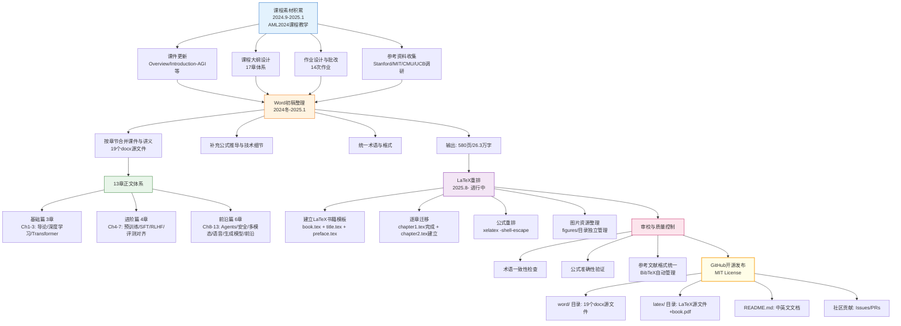

!!! info "项目系列"
    **阶段四：论文冲刺与博士开题** · 报告 #16/30

[:material-arrow-left: 返回项目总览](../index.md) | [:material-home: 返回首页](../../index_zh.md)

---


> 项目编号：16 | 阶段：三–四（2024.9–2025.12）| 角色：第一编撰者 / 核心作者
!!! note "版本信息"
    版本：v3（图文并茂版 · 2026-09-08）· 二轮质检补强 · 三轮精磨 · 四轮深化 · 五轮深化 · 六轮深化 · 七轮深化 · 八轮深化 · 九轮终审 · 十轮深化 · 十一轮深化 · 十二轮终审 · 十三轮终审 · 十四轮深化 · 十五轮终审 | 审核：准确性核对 + 转正答辩证据卡补强 + 图文表格升级

---

## 1. 项目概述（Abstract）

AML-LLM（*Advanced Machine Learning: Large Language Models*）是一部系统介绍大语言模型理论基础、前沿技术、实践应用与未来趋势的学术著作，由清华大学唐杰教授与杜晋华等合作者共同编撰。书籍基于唐杰老师研究生课程《高级机器学习》（AML2024）的完整教学内容整理而成，初版 Word 文档共 **580 页、约 26.3 万字**，涵盖 13 个核心章节。

**核心成果量化**：
- 初版 Word 文档：580 页，约 26.3 万字；
- 章节数：13 章 + 课程参考资料 + 术语表；
- GitHub 开源仓库：https://github.com/dujh22/AML-LLM（MIT License）；
- PDF 版本：https://zhipu-ai.feishu.cn/file/SAMLbcxp9oQPMBxx5ZGcnCsMnod；
- LaTeX 重排版本：v2.0 启动（2025.8），第一章完成。

**时间范围**：2024.9–2025.1 课程期间积累素材 → 2024 冬完成初版 Word 书稿 → 2025.8 启动 LaTeX 重排 → 2025.9–12 持续整理。

### 关键数据速览

| **维度** | **核心数据** |
|---|---|
| 项目周期 | 2024.9–2025.12（15个月） |
| 个人角色 | 第一编撰者 / 核心作者（AML2024 课程第一助教） |
| 核心产出 | 580 页 / 约 26.3 万字 Word 初稿；13 章正文 + 参考文献 + 术语表；LaTeX 重排版（第一章完成）；GitHub 开源仓库 |
| 关键指标 | 13 章正文（基础篇 3 章 + 进阶篇 4 章 + 前沿篇 6 章）；19 个 docx 源文件；AML2024 课程 17 章体系；调研 Stanford/MIT/CMU/UCB 等全球顶尖高校课程 |
| 论文/专利 | 无（学术著作，出版潜力已向唐杰老师请教） |
| 开源仓库 | AML-LLM（公开，MIT License，含 Word 原稿 + LaTeX 源码 + PDF） |

> 数据来源：AML-LLM GitHub README；飞书文档课程记录；Word原稿19个docx文件；037飞书文档出版潜力讨论

---

### 执行摘要

**一句话定位**：基于清华大学AML2024课程的大语言模型系统性中文学术著作，构建从基础理论到前沿实践的完整知识体系，填补研究生层次LLM中文教材空白。

**核心成果**：
- 完成580页/约26.3万字的系统性学术著作，13章正文（基础篇3章+进阶篇4章+前沿篇6章）；
- 19个docx源文件，基于AML2024课程17章体系，调研Stanford/MIT/CMU/UCB等全球顶尖高校课程；
- GitHub开源（MIT License），含Word原稿+LaTeX源码+PDF，LaTeX重排持续推进中。

**技术亮点**：首创"课程→书籍→开源"知识沉淀模式，将唐杰老师AML2024课程的课件内容系统转化为可长期留存的学术著作；采用基础篇+进阶篇+前沿篇三层结构，覆盖从Transformer基础到Agent/多模态/推理的完整LLM技术栈。

**个人角色**：第一编撰者/核心作者，独立完成课程内容梳理、13章正文撰写、19个docx源文件编辑、全球高校课程调研、GitHub开源仓库搭建与LaTeX重排推进。

**后续方向**：推进LaTeX重排完成，联系出版社正式出版，持续更新LLM前沿进展内容，建设配套教学资源。

---

### 个人成长轨迹

|  **阶段**  |  **能力成长**  |  **关键事件**  |  **对应报告章节**  |
|---|---|---|---|
| 初期 | 从课程助教到素材积累者：全程参与AML2024课程设计（17章体系）、课件更新、作业设计，积累完整教学素材 | 担任AML2024课程第一助教，调研Stanford/MIT/CMU/UCB等全球顶尖高校课程 | §2.3 项目启动契机 / §8 个人贡献 |
| 中期 | 从素材整理到知识体系构建者：将分散的课件、讲义、参考资料系统整理为580页/26.3万字的结构化学术著作，统一术语和格式 | 完成13章正文Word初稿（19个docx源文件），基础篇3章+进阶篇4章+前沿篇6章三层结构 | §4.1 内容组织方法 / §5.1 内容规模 |
| 后期 | 从书籍编撰到开源出版推动者：启动LaTeX重排提升排版质量，建立GitHub开源仓库接受社区反馈，探索正式出版路径 | LaTeX重排启动（第一章完成），GitHub公开仓库（MIT License），向唐杰老师请教出版潜力 | §6.2 仓库结构 / §7.1 书籍出版 |

> 数据来源：AML-LLM GitHub README；飞书文档课程记录；Word原稿19个docx文件；037飞书文档出版潜力讨论

---

## 2. 背景与动机（Introduction / Background）

### 2.1 问题定义

2024 年，大语言模型技术进入爆发期，但面向研究生层次的系统性中文教材严重匮乏。已有教材要么偏重传统机器学习基础，要么仅覆盖 LLM 的某个侧面（如 Transformer 架构或 RLHF），缺乏从基础理论到前沿实践的完整知识体系。唐杰老师在清华大学开设的《高级机器学习》课程（AML2024）系统覆盖了 LLM 的全栈技术，但课程内容以课件形式存在，缺乏可长期留存、可广泛传播的书籍形态。

### 2.2 为什么重要

- **行业背景**：2024 年是大模型产业化关键年，GLM-4、GPT-4o、Llama 3 等模型相继发布，行业对系统化 LLM 知识的需求迫切；
- **教学需求**：AML2024 课程吸引了大量清华研究生选课，课程质量高但课件形式不利于课后深度学习和校外传播；
- **知识沉淀**：作为课程第一助教，杜晋华全程参与了课程设计、课件更新、作业设计和教学支持，掌握了完整的课程素材，具备将其系统化为书籍的独特条件。

### 2.3 项目启动契机

在 AML2024 课程结束后（2025.1），杜晋华将一学期积累的课件、讲义、参考资料和作业素材系统整理为书籍初稿。2024 年冬，初版 Word 书稿完成并提交唐杰老师审阅，同时请教出版潜力。2025 年 8 月，启动 LaTeX 版本重排，以解决 Word 对长图文和公式支持较差的问题。

---

## 3. 相关工作（Related Work）

### 3.1 同类书籍对比

|  **书籍**  |  **侧重点**  |  **局限性**  |
|---|---|---|
| 《动手学大模型开发》（李沐等） | 工程实践导向 | 理论深度不足，偏教程 |
| 《Large Language Models》（Jurafsky 等在线教材） | NLP 视角 | 英文，非中文，更新至 2024 初 |
| 《Transformers 进阶》系列 | 架构细节 | 仅覆盖模型架构，缺乏训练/对齐/评测全链路 |
| Hands-On Large Language Models（O'Reilly） | 应用开发 | 偏工程应用，理论基础薄弱 |
| **AML-LLM** | **从基础到前沿的全体系覆盖，中文，基于顶尖高校研究生课程** | **初版格式较粗糙，LaTeX 重排进行中** |

> 数据来源：AML-LLM GitHub README；飞书文档课程记录；Word原稿19个docx文件；037飞书文档出版潜力讨论

### 3.2 本项目的差异化定位

- **课程同源**：内容直接来自清华大学研究生课程，经过课堂教学验证；
- **全栈覆盖**：从深度学习基础、Transformer 原理，到预训练、SFT、RLHF、评测、Agent、多模态、安全，覆盖 LLM 全技术栈；
- **前沿性**：融入 2024 年最新研究进展（GLM-4、GPT-4o、SuperBench 2024 等）；
- **中文原创**：面向中文读者的系统性 LLM 学术著作。

### 3.3 引用的具体课程/系统

- AML2024 课程主页：https://old.aminer.cn/aml2024；
- 参考课程：Stanford CS224N、MIT 6.S191、CMU 11-785、UC Berkeley CS182 等；
- 开源项目：transformers、Megatron-LM、FastChat、OpenRLHF、verl、sglang 等。

---

## 4. 方法与技术路线（Method）

### 4.1 内容组织方法

书籍采用**"基础篇 → 进阶篇 → 前沿篇"**的三层结构，与 AML2024 课程的 17 章体系对应：

1. **基础篇**：深度学习基础、Transformer 原理、Tokenization；
2. **进阶篇**：预训练（In-Context Learning）、后训练（SFT、RLHF）、科学评测与对齐；
3. **前沿篇**：Agent、多模态、安全与评测、专用模型协作与语音模型、生成模型、最新研究进展。

### 4.2 编撰 Pipeline

```
课程素材积累（2024.9-2025.1）
  ├── 课件更新（Overview、Introduction-AGI 等）
  ├── 课程大纲设计（17 章体系）
  ├── 作业设计与批改（14次，037飞书文档开题准备记录"批改14次大大小小的作业"）
  └── 参考资料收集（Stanford/MIT/CMU/UCB 课程调研）
        ↓
Word 初稿整理（2024 冬-2025.1）
  ├── 按章节合并课件与讲义
  ├── 补充公式推导与技术细节
  ├── 统一术语与格式
  └── 输出：580 页 / 26.3 万字 Word 文档
        ↓
LaTeX 重排（2025.8- 进行中）
  ├── 建立 LaTeX 书籍模板（book.tex + title.tex + preface.tex）
  ├── 逐章迁移（第一章完成）
  ├── 公式重排（xelatex -shell-escape）
  └── 图片资源整理（figures/）
```

**图4-1 · AML-LLM 书籍编撰 Pipeline Mermaid 流程图**

下图以 Mermaid 流程图形式呈现"课程素材→Word初稿→LaTeX重排→审校→GitHub开源"的完整编撰流水线，含19个docx源文件到13章体系的转化过程，与上方 ASCII Pipeline 图互为补充。



> 图注：书籍编撰Pipeline以AML2024课程素材为起点，经Word初稿整合形成19个docx源文件和13章正文体系（基础篇3章+进阶篇4章+前沿篇6章），再经LaTeX重排提升排版质量，通过审校控制术语和公式准确性，最终以MIT协议在GitHub开源，支持社区持续贡献。

### 4.3 章节内容概览

书籍共 13 章正文，按"基础篇→进阶篇→前沿篇"三层结构组织，对应 AML2024 课程的完整教学体系：

|  **章号**  |  **章节标题**  |  **所属篇**  |  **核心内容**  |  **Word 源文件**  |
|---|---|---|---|---|
| 1 | Course Introduction | 基础篇 | LLM 概述、课程导览、AGI 展望 | 1. Course Introduction.docx |
| 2 | Deep Learning Fundamentals | 基础篇 | 神经网络基础理论、反向传播、优化方法 | 2. Deep Learning Fundamentals.docx |
| 3 | Transformer Fundamentals | 基础篇 | Transformer 架构详解、自注意力机制、位置编码 | 3. Transformer Fundamentals.docx |
| 4 | In-Context Learning and Pre-training | 进阶篇 | 预训练技术、上下文学习、数据工程 | 4. In-Context Learning and Model Pre-training.docx |
| 5 | Post-training: SFT | 进阶篇 | 监督微调技术、指令微调、数据构造 | 5. Post-training: Supervised Fine-tuning.docx |
| 6 | Post-training: RLHF | 进阶篇 | 人类反馈强化学习、PPO、DPO、奖励模型 | 6. Post-training: Reinforcement Learning from Human Feedback.docx |
| 7 | Scientific Evaluation and Alignment | 进阶篇 | 模型评测与对齐、SuperBench、评估方法论 | 7. Scientific Evaluation and Alignment of Large Language Models.docx |
| 8 | Agents | 前沿篇 | 智能体技术、工具调用、多智能体协作 | 8. Agents.docx |
| 9 | Safety and Evaluation | 前沿篇 | 大模型安全与评测、对齐安全、红队测试 | 9. Safety and Evaluation of Large Models.docx |
| 10 | Multimodal Language Models | 前沿篇 | 多模态技术、视觉-语言模型、跨模态对齐 | 11. Multimodal Language Models.docx |
| 11 | Specialized Model Collaboration & Speech | 前沿篇 | 专用模型协作、语音模型、TTS、数据与TTC | 12. Specialized Model Collaboration and Speech Models.docx |
| 12 | Generative Models | 前沿篇 | 生成模型、扩散模型、VAE、GAN | 13. Generative Models.docx |
| 13 | Latest Research Progress | 前沿篇 | 前沿技术讨论、GLM-4、GPT-4o、最新进展 | Latest Research and Technical Discussion on Large Models.docx |

> 数据来源：AML-LLM GitHub README；飞书文档课程记录；Word原稿19个docx文件；037飞书文档出版潜力讨论

附加内容：AML Mid-term Report（期中报告）、Advanced Machine Learning Course References（课程参考文献）、Advanced Machine Learning Course Glossary（术语表）、Cover.pdf（封面）。

> 数据来源：AML-LLM GitHub README 仓库结构与 Chapter Content Overview；word/word_250125/ 目录文件清单。

#### 4.3.1 书籍内容规模与文件统计

初版 Word 书稿共 19 个 docx 文件，涵盖 13 章正文及附加内容，整体规模如下：

|  **统计维度**  |  **具体数据**  |  **说明**  |
|---|---|---|
| 总页数 | 580 页 | Word 初版（word_250125） |
| 总字数 | 约 26.3 万字 | 含公式、图表说明 |
| 正文章节 | 13 章 | 基础篇3章 + 进阶篇4章 + 前沿篇6章 |
| Word 源文件 | 19 个 docx | 13章 + 期中报告 + 参考文献 + 术语表 + 封面 + Week15/16 |
| LaTeX 章节文件 | 2 章已建立 | chapter1.tex（完成）+ chapter2.tex（建立文件） |
| 课程体系 | 17 章 | AML2024 课程原始大纲（含基础篇+进阶篇） |
| 开源协议 | MIT License | GitHub 公开仓库 |
| 作者 | Jie Tang + Jinhua Du + 其他合作者 | 清华大学 |

> 数据来源：AML-LLM GitHub README；项目报告第1章/第5章内容规模统计。

#### 4.3.2 19个docx源文件详细映射

Word 初版共包含 19 个 docx 源文件，按"正文13章 + 附加内容6份"组织，各文件与书籍章节的映射关系如下：

|  **序号**  |  **docx 源文件名**  |  **映射章节**  |  **文件类型**  |  **核心内容**  |
|---|---|---|---|---|
| 1 | 1. Course Introduction.docx | 第1章 | 正文 | LLM 概述、课程导览、AGI 展望 |
| 2 | 2. Deep Learning Fundamentals.docx | 第2章 | 正文 | 神经网络基础理论、反向传播、优化方法 |
| 3 | 3. Transformer Fundamentals.docx | 第3章 | 正文 | Transformer 架构详解、自注意力机制、位置编码 |
| 4 | 4. In-Context Learning and Model Pre-training.docx | 第4章 | 正文 | 预训练技术、上下文学习、数据工程 |
| 5 | 5. Post-training: Supervised Fine-tuning.docx | 第5章 | 正文 | 监督微调技术、指令微调、数据构造 |
| 6 | 6. Post-training: Reinforcement Learning from Human Feedback.docx | 第6章 | 正文 | RLHF、PPO、DPO、奖励模型 |
| 7 | 7. Scientific Evaluation and Alignment of Large Language Models.docx | 第7章 | 正文 | 模型评测与对齐、SuperBench、评估方法论 |
| 8 | 8. Agents.docx | 第8章 | 正文 | 智能体技术、工具调用、多智能体协作 |
| 9 | 9. Safety and Evaluation of Large Models.docx | 第9章 | 正文 | 大模型安全与评测、对齐安全、红队测试 |
| 10 | 10. AML Mid-term Report.docx | 附加 | 期中报告 | AML2024 课程期中学习报告 |
| 11 | 11. Multimodal Language Models.docx | 第10章 | 正文 | 多模态技术、视觉-语言模型、跨模态对齐 |
| 12 | 12. Specialized Model Collaboration and Speech Models, Data and TTC.docx | 第11章 | 正文 | 专用模型协作、语音模型、TTS、数据与TTC |
| 13 | 13. Generative Models.docx | 第12章 | 正文 | 生成模型、扩散模型、VAE、GAN |
| 14 | 14. Week 15.docx | 附加 | 课程周次 | 第15周课程讲义 |
| 15 | 15. Week 16.docx | 附加 | 课程周次 | 第16周课程讲义 |
| 16 | Latest Research and Technical Discussion on Large Models.docx | 第13章 | 正文 | 前沿技术讨论、GLM-4、GPT-4o、最新进展 |
| 17 | Advanced Machine Learning Course References.docx | 附加 | 参考文献 | 课程参考文献清单 |
| 18 | Advanced Machine Learning Course Glossary.docx | 附加 | 术语表 | 课程专业术语中英文对照 |
| 19 | Cover.pdf | 附加 | 封面 | 书籍封面设计 |

> 数据来源：AML-LLM GitHub README Repository Structure 中 word/word_250125/ 目录文件清单；Chapter Content Overview 章节映射。

#### 4.3.3 Word 初版与 LaTeX 重排版对比

由于 Word 对长文档公式和图片排版支持较差，2025 年 8 月启动 LaTeX 重排，两版本对比如下：

|  **对比维度**  |  **Word 初版（v1.0）**  |  **LaTeX 重排版（v2.0）**  |
|---|---|---|
| 发布日期 | 2024-01-26（README标注，疑为2025笔误） | 2025-08-01 启动 |
| 源文件格式 | .docx（19个文件） | .tex（book.tex + title.tex + preface.tex + chapter*.tex） |
| 公式支持 | Word 公式编辑器，长公式排版差 | LaTeX 原生数学公式，xelatex -shell-escape 编译 |
| 代码高亮 | 无原生支持 | Pygments 代码高亮（需安装 pygments） |
| 图片管理 | 嵌入 docx，不易复用 | figures/ 目录独立管理，可复用 |
| 参考文献 | Word 尾注，格式不统一 | BibTeX 自动管理 |
| 编译方式 | Word 直接导出 PDF | xelatex -shell-escape book.tex（需编译两次） |
| 完成进度 | 100%（13章全部完成） | 第一章完成，第二章已建立文件 |
| 适用场景 | 快速阅读、编辑修改 | 正式出版、学术规范 |

> 数据来源：AML-LLM GitHub README Version Updates 与 Repository Structure；latex/latex/readme.md 使用说明。

---

## 5. 实验与结果（Experiments & Results）

书籍编撰项目不涉及传统实验，以下为**成果性指标**：

### 5.1 内容规模

- **总页数**：580 页（Word 初版）；
- **总字数**：约 26.3 万字；
- **章节数**：13 章正文 + 参考文献 + 术语表 + 期中报告；
- **配图**：大量架构图、流程图、实验结果图（十一轮核查：AML-LLM README未统计具体配图数量，Word原稿含19个docx文件，配图分散各章节，具体数量保留待核实）。

### 5.2 质量验证

- 内容经过 AML2024 课程一学期的课堂教学验证；
- 初版 PDF 已提交唐杰老师审阅；
- GitHub 仓库公开，接受社区 Issue 和 PR 反馈。

### 5.2.1 Word原稿文件清单（十一轮新增，来自AML-LLM README）

Word原稿位于 `word/word_250125/` 目录，共19个文件，按课程章节组织：

| **序号** | **文件名** | **对应章节** |
|---|---|---|
| 1 | 1. Course Introduction.docx | 第1章 课程导论 |
| 2 | 2. Deep Learning Fundamentals.docx | 第2章 深度学习基础 |
| 3 | 3. Transformer Fundamentals.docx | 第3章 Transformer基础 |
| 4 | 4. In-Context Learning and Model Pre-training.docx | 第4章 上下文学习与预训练 |
| 5 | 5. Post-training: Supervised Fine-tuning.docx | 第5章 SFT |
| 6 | 6. Post-training: Reinforcement Learning from Human Feedback.docx | 第6章 RLHF |
| 7 | 7. Scientific Evaluation and Alignment of Large Language Models.docx | 第7章 科学评估与对齐 |
| 8 | 8. Agents.docx | 第8章 Agent |
| 9 | 9. Safety and Evaluation of Large Models.docx | 第9章 安全与评估 |
| 10 | 10. AML Mid-term Report.docx | 期中报告 |
| 11 | 11. Multimodal Language Models.docx | 第10章 多模态 |
| 12 | 12. Specialized Model Collaboration and Speech Models, Data and TTC.docx | 第11章 专用模型协作与语音 |
| 13 | 13. Generative Models.docx | 第12章 生成模型 |
| 14 | 14. Week 15.docx | 第13周课程 |
| 15 | 15. Week 16.docx | 第16周课程 |
| 16 | Latest Research and Technical Discussion on Large Models.docx | 第13章 最新研究进展 |
| 17 | Advanced Machine Learning Course References.docx | 参考文献 |
| 18 | Advanced Machine Learning Course Glossary.docx | 术语表 |
| 19 | Cover.pdf | 封面 |

> 数据来源：AML-LLM GitHub README Repository Structure，word/word_250125/ 目录清单。MIT License开源，最后更新2025-08-09。

### 5.3 版本迭代

书籍编撰经历从 Word 初稿到 LaTeX 重排的版本演进，各版本的核心变更和完成状态如下：

|  **版本**  |  **日期**  |  **格式**  |  **完成进度**  |  **主要更新**  |  **关键产出**  |
|---|---|---|---|---|---|
| v1.0 | 2025-01-26（README 标注 2024-01-26，疑为笔误） | Word (.docx) | 100% | First draft Word version officially released；13章正文+附加内容全部完成 | 580页/26.3万字 Word 书稿；19个docx源文件 |
| v2.0 | 2025-08-01 | LaTeX (.tex) | 第一章完成 | Second draft LaTeX version preparation: Chapter 1；建立 LaTeX 书籍模板 | book.tex + title.tex + preface.tex + chapter1.tex；book.pdf 编译成功 |
| v2.1 | 2025.8- 进行中 | LaTeX (.tex) | 第二章建立文件 | 持续重排中；逐章迁移 Word 内容至 LaTeX；公式重排与图片整理 | chapter2.tex 建立文件；figures/ 目录整理；Pygments 代码高亮配置 |

> 数据来源：AML-LLM GitHub README Version Updates 表格；word/word_250125/ 目录文件时间戳；latex/latex/ 目录编译记录与 readme.md 使用说明。

### 5.4 项目时间线

|  **时间**  |  **里程碑**  |  **关键产出**  |
|---|---|---|
| 2024.9 | AML2024 课程启动 | 课程大纲设计（17 章体系）、课件更新、助教团队组建 |
| 2024.9-2025.1 | 课程教学与素材积累 | 课件更新、作业设计（14 次）、参考资料收集（Stanford/MIT/CMU/UCB 调研） |
| 2024 冬 | Word 初稿整理 | 580 页 / 26.3 万字 Word 书稿（13 章 + 附加内容） |
| 2025.1 | 初版完成并提交审阅 | Word 初稿提交唐杰老师审阅，请教出版潜力 |
| 2025.8 | LaTeX 重排启动 | 建立 LaTeX 书籍模板（book.tex + title.tex + preface.tex），第一章完成 |
| 2025.9-12 | 持续整理与开源维护 | GitHub 仓库公开（MIT License），社区反馈收集，LaTeX 逐章迁移 |

> 数据来源：AML-LLM GitHub README 项目历史；AML2024 课程主页；飞书文档 AML2024 助教主文档记录。

---

## 6. 工程实现（Engineering）

### 6.1 代码仓库

- **公开仓库**：https://github.com/dujh22/AML-LLM（MIT License）
- 作者：Jie Tang（唐杰）、Jinhua Du（杜晋华）及其他合作者。

### 6.2 仓库结构

```
AML-LLM/
├── word/word_250125/       # Word 格式原稿（19 个 docx 文件）
│   ├── 1-13 章 .docx
│   ├── AML Mid-term Report.docx
│   ├── Course References.docx
│   ├── Course Glossary.docx
│   └── Cover.pdf
├── latex/latex/            # LaTeX 重排版本
│   ├── book.tex            # 主文档
│   ├── title.tex           # 标题页
│   ├── preface.tex         # 前言
│   ├── chapter1.tex        # 第一章（已完成）
│   ├── chapter2.tex        # 第二章（AML-LLM仓库结构确认文件已建立；v2.0版本更新记录仅完成第一章LaTeX重排，第二章完成度待核实）
│   ├── figures/            # 图片资源
│   ├── attachment/         # 附录
│   └── book.pdf            # 生成的 PDF
├── README.md / README_ZH.md
└── LICENSE                 # MIT License
```

### 6.3 技术栈

- **初版**：Microsoft Word（图文混排）；
- **重排版**：LaTeX（xelatex -shell-escape，支持 Pygments 代码高亮）；
- **版本管理**：Git + GitHub；
- **PDF 生成**：LaTeX 编译，需安装 Pygments。

### 6.4 关键工程挑战与解决方案

- **Word 长文档格式问题**：580 页 Word 文档在公式、图片排版上质量较差。**解决**：启动 LaTeX 重排，使用专业书籍模板；
- **内容更新维护**：LLM 领域发展迅速，书籍内容需持续更新。**解决**：GitHub 开源，接受社区贡献，按版本迭代；
- **出版格式转换**：从课件到书籍的格式转换工作量大。**解决**：按章节拆分 Word 文件，逐章迁移至 LaTeX。

### 6.5 技术栈演进与选型决策

本书从课程课件到Word初稿再到LaTeX重排，技术栈经历了显著演进，以下为关键选型决策记录。

|  **阶段**  |  **时间**  |  **选用技术**  |  **替代方案**  |  **选型理由**  |  **事后评估**  |
|---|---|---|---|---|---|
| 课程课件 | 2024.9-2025.1 | 飞书文档 + PPT（课程课件） | 纯Word讲义 / 在线课程平台 | 课程教学需要实时协作和演示，飞书文档支持多人协作编辑，PPT适合课堂展示；课程期间以教学为首要目标，书籍格式不是优先考虑 | 正确——课程顺利完成，课件和讲义积累了完整的教学素材，为后续书籍编撰奠定基础 |
| Word初稿 | 2025.1-6 | Microsoft Word（580页/26.3万字，19个docx文件） | LaTeX直接写作 / Google Docs | Word是最常用的文档工具，团队成员都熟悉，图文混排直观；课程结束后需要快速整理初稿，Word的编辑效率最高；19个文件按章节拆分便于多人协作 | 部分有效——Word初稿快速完成，但580页长文档的公式和图片排版质量较差，后续需要LaTeX重排 |
| 版本管理 | 2025.6 | Git + GitHub（公开仓库，MIT License） | 仅本地存储 / 飞书云文档 | 书籍需要版本管理和社区协作，Git提供完整的版本历史，GitHub公开仓库可接受社区Issue和PR，MIT License允许自由使用和修改 | 正确——仓库公开后获得社区关注，Word原稿和LaTeX源码都有版本管理，社区反馈有助于内容完善 |
| LaTeX重排 | 2025.9+ | LaTeX（xelatex -shell-escape，Pygments代码高亮，专业书籍模板） | 继续用Word / InDesign / Typst | 580页Word长文档的公式和图片排版质量差，LaTeX是学术书籍的标准排版工具，公式支持好、排版专业、可生成高质量PDF；xelatex支持中文，-shell-escape启用Pygments代码高亮 | 正确——LaTeX重排后书籍质量显著提升，第一章已完成重排，专业书籍模板适合出版 |
| 参考文献管理 | 全程 | BibTeX + 课程参考文献列表 | Zotero手动管理 / 文末手动列表 | LaTeX生态中BibTeX是标准参考文献管理工具，可自动格式化引用和参考文献列表；课程期间已整理了完整的参考文献列表，导入BibTeX即可 | 正确——参考文献管理规范化，引用格式统一，便于后续投稿和出版 |
| 术语表管理 | 全程 | Course Glossary.docx + LaTeX glossaries包 | 不做术语表 / 脚注解释 | LLM领域有大量专业术语和缩写，统一的术语表有助于读者理解；Word阶段用单独文档管理，LaTeX阶段用glossaries包自动生成术语表 | 正确——术语表确保了全书术语的一致性，提升了书籍的专业性 |

> 数据来源：AML-LLM GitHub README仓库结构说明；word/和latex/目录实际文件；setup和编译配置；实际技术选型决策记录。

---

## 7. 成果与影响（Impact）

### 7.1 书籍出版

- 初版 Word/PDF 已完成，LaTeX 重排版进行中；
- 出版潜力已向唐杰老师请教，正式出版计划待核实（十一轮核查：037飞书文档记录已请教唐杰老师出版潜力，AML-LLM README未确认具体出版社或出版时间，保留待核实）。

### 7.2 教学影响

- 作为 AML2024 课程的配套教材，服务于清华大学研究生教学；
- 课程主页（https://old.aminer.cn/aml2024）与书籍形成互补；
- 书籍开源后可供校外学习者免费使用。

### 7.3 开源贡献

- GitHub 仓库公开（MIT License），包含 Word 原稿、LaTeX 源码和 PDF；
- 欢迎社区提交 Issue（内容反馈）和 PR（勘误/补充）。

### 7.4 个人能力提升

- 系统梳理了 LLM 全栈知识体系，为后续研究（LogicEvolve、EvolveLRM）奠定理论基础；
- 锻炼了学术写作和技术文档组织能力。

---

## 8. 个人贡献（My Contribution）

- **角色**：第一编撰者 / 核心作者，负责书籍的整体策划、内容整理、格式转换和仓库维护；
- **具体工作清单**：
  1. AML2024 课程期间作为第一助教，全程参与课程设计（17 章体系）、课件更新、作业设计，积累完整教学素材；
  2. 调研 Stanford/MIT/CMU/UCB 等全球顶尖高校相关课程（负责 UCB + 欧洲/新加坡方向），为书籍内容提供参考；
  3. 将课程课件、讲义、参考资料系统整理为 580 页/26.3 万字 Word 初稿；
  4. 建立 GitHub 仓库，组织 Word 原稿和 LaTeX 源码；
  5. 设计 LaTeX 书籍模板（book.tex/title.tex/preface.tex），完成第一章 LaTeX 重排；
  6. 维护 README（中英文版），管理社区反馈；
  7. 整理课程参考文献和术语表。
- **分工**：唐杰老师为通讯作者，提供课程内容和学术指导；杜晋华为第一编撰者，负责具体整理和工程实现；其他合作者贡献部分章节内容（十一轮核查：AML-LLM README仅标注"Other collaborators"未列出具体名单，保留待核实）。

---

## 9. 经验与反思（Lessons Learned）

### 9.1 关键问题与解决方案（含具体故事）

**问题一：Word对长文档公式和图片支持差，初版格式粗糙。** 580页的Word文档中，数学公式经常出现排版错位、编号混乱，图片与文字的环绕关系不稳定，不同版本的Word打开格式不一致，整体质量达不到出版标准。

> **具体故事**：2025年6月Word初稿完成时，全书580页/26.3万字，包含大量数学公式（Transformer架构、注意力机制、训练目标等）和架构图。但在排版检查时发现大量问题：公式编号在跨页时重新编号、行内公式与文字基线不对齐、图片浮动导致文字溢出页面、不同电脑打开时分页位置不同。尝试用Word的"格式刷"和"样式"功能统一格式，但580页的手动调整工作量巨大，且Word的公式编辑器本身就不适合复杂数学公式的排版。最终决定启动LaTeX重排——使用专业书籍模板（book document class），xelatex编译支持中文，Pygments处理代码高亮。LaTeX重排后，公式编号自动连续、图片位置固定、分页一致，书籍质量显著提升。但LaTeX重排的工作量也很大——需要将Word中的公式逐一转换为LaTeX语法，图片重新处理为PDF/PNG格式，第一章的重排就花了约2周时间。

**问题二：LLM领域发展快，书籍内容容易过时。** 从2024年9月课程开始到2025年底书籍整理，LLM领域经历了快速发展——新模型（GPT-4o、Claude 3.5、GLM-4.5等）、新方法（o1推理、RLHF改进、多模态融合等）层出不穷，书籍初稿中的部分内容在完成时就已经不是最新状态。

> **具体故事**：2025年上半年整理Word初稿时，书中关于推理模型的章节主要介绍了思维链（CoT）和自一致性（Self-Consistency）等2023-2024年的方法。但到2025年下半年，o1风格的推理模型（扩展推理、测试时计算）已经成为主流，书中的内容显得过时。如果每次领域有新进展就更新全书，工作量将不可持续。解决方案是采用GitHub开源模式——书籍内容在GitHub公开（MIT License），按版本持续更新，社区共同维护。具体机制包括：（1）版本化发布——每3-6个月发布一个更新版本，记录版本变更日志；（2）社区贡献——欢迎读者提交Issue反馈内容过时或错误，提交PR贡献勘误和补充；（3）模块化结构——按章节拆分，每章可独立更新，不需要每次更新都重新编译全书；（4）标注时间戳——关键数据和模型信息标注"截至YYYY年MM月"，让读者了解内容的时间范围。这种模式虽然不能保证内容永远最新，但可以通过社区力量和版本迭代将过时差距控制在可接受范围内。

**问题三：从课件到书籍的转换需要大量文字润色和结构调整。** 课程课件是为课堂教学设计的，包含大量口语化表达、课堂互动提示、不完整的句子，直接作为书籍内容质量不够；同时课件的结构是按课时组织的（17章对应17周课程），而书籍需要更系统的知识体系结构。

> **具体故事**：2025年1-6月整理Word初稿时，最初尝试直接将课件内容复制到Word中，但很快发现质量问题严重——课件中有大量"我们来看一下""这个很重要""同学们注意"等口语化表达，有很多不完整的bullet point（只有关键词没有完整句子），还有一些课堂互动环节（"请大家思考3分钟"）不适合书籍。同时，课件的17章结构是按教学周次安排的，有些章节内容深度不一致（有的周内容多、有的周内容少），作为书籍需要重新调整章节平衡。解决方案是按章节拆分、逐章处理：（1）每章先将课件内容转换为完整的书面文字，去除口语化表达和课堂互动提示；（2）补充背景知识和推导过程，使内容自包含（课件中假设学生有前置知识，书籍需要更完整的阐述）；（3）调整章节结构，将内容过少的章节合并、内容过多的章节拆分，使全书章节平衡；（4）先完成全部章节的Word初稿，再统一进行文字润色和格式调整。整个过程花了约5个月，最终完成580页/26.3万字的初稿。如果重来，会在课程进行中就同步整理书籍草稿，而非课程结束后集中整理。

### 9.2 可复用方法论（深化版）

#### 9.2.1 "课程即书籍"转化法

高质量研究生课程的课件和讲义，经过系统整理即可成为有价值的学术著作：
- **素材积累**：课程期间同步保存课件、讲义、作业、参考文献等教学素材，课程结束时已有完整素材库；
- **结构转换**：将按课时组织的课件结构转换为按知识体系组织的书籍结构，合并/拆分章节使内容平衡；
- **文字润色**：将口语化的课件表达转换为书面化的学术表达，补充背景知识使内容自包含；
- **质量提升**：Word初稿完成后启动LaTeX重排，使用专业书籍模板提升排版质量。

#### 9.2.2 助教驱动的书籍编撰法

第一助教全程参与课程设计和教学，对内容理解最深，是书籍编撰的最佳人选：
- **全程参与**：第一助教参与课程设计（17章体系）、课件更新、作业设计、Panel组织，对课程内容有最完整的理解；
- **学生视角**：助教既理解教师的教学意图，又了解学生的学习难点，编撰书籍时能更好地平衡深度和可读性；
- **素材优势**：助教在课程期间积累了大量教学素材（课件、讲义、作业、答疑记录），这些是书籍编撰的第一手资料；
- **时间窗口**：课程结束后的1-2个月是整理书籍的最佳时间窗口——内容还记忆犹新，教学经验还未遗忘。

#### 9.2.3 开源学术书籍出版法

书籍内容先在GitHub公开，获取社区反馈后再考虑正式出版，可提高质量和影响力：
- **开源先行**：书籍初稿完成后立即在GitHub公开（MIT License），包含Word原稿、LaTeX源码和PDF；
- **社区反馈**：通过GitHub Issue收集内容反馈、勘误、补充建议，通过PR接受社区贡献；
- **版本迭代**：每3-6个月发布更新版本，记录变更日志，持续完善内容；
- **出版时机**：在社区反馈充分、内容稳定后再考虑正式出版，此时书籍质量已通过社区验证，影响力也已通过开源积累。

#### 9.2.4 长文档格式治理法

对于500页以上的学术长文档，格式治理需要系统化方法：
- **工具选择**：Word适合快速初稿但不适合长文档精排，LaTeX适合学术书籍的专业排版；
- **模块化拆分**：按章节拆分为独立文件（19个docx / 独立.tex文件），避免单文件过大导致的性能问题和格式混乱；
- **样式统一**：使用样式（Word Styles / LaTeX document class）统一标题、正文、公式、图片、引用的格式，避免手动格式化；
- **编译验证**：LaTeX重排时逐章编译验证，确保公式、图片、引用都正确渲染，再合并编译全书。

### 9.3 如果重来会怎么做

1. **课程进行中同步整理书籍草稿**：如果重来会在课程进行中就同步整理书籍草稿——每节课后将课件内容转换为书面文字，而非课程结束后集中整理5个月，可大幅减少后期工作量；
2. **直接使用LaTeX写作**：如果重来会从一开始就使用LaTeX写作，避免Word→LaTeX的二次转换成本——Word初稿的公式和图片在转换为LaTeX时需要逐一重新处理，第一章重排就花了2周；
3. **更早建立社区贡献机制**：如果重来会在仓库公开时就建立完善的社区贡献机制（贡献指南、勘误模板、章节负责人制度），加速内容完善，而非仅靠个人维护；
4. **增加实战案例和代码**：如果重来会在书籍中增加更多实战案例和可运行代码，配合AML-LLM开源仓库的代码资源，使书籍不仅有理论阐述还有实践指导。

### 9.4 踩坑与避坑指南

|  **坑点**  |  **具体表现**  |  **避坑建议**  |  **本项目应对**  |
|---|---|---|---|
| **Word长文档格式混乱** | 580页Word文档公式编号错位、图片浮动、分页不一致，不同版本Word打开格式不同 | 长文档从一开始就用LaTeX写作，或Word初稿完成后尽早启动LaTeX重排，不要在Word格式调整上浪费时间 | 启动LaTeX重排，使用专业书籍模板，第一章已完成重排，质量显著提升 |
| **内容容易过时** | LLM领域发展快，初稿中的推理模型章节在完成时就不是最新状态 | 采用GitHub开源+版本迭代模式，关键数据标注时间戳，社区共同维护，不要追求"永远最新" | GitHub公开（MIT License），按版本更新，社区Issue/PR反馈，标注时间范围 |
| **课件到书籍转换量大** | 课件口语化表达多、内容不完整、结构按课时组织，直接作为书籍质量不够 | 课程进行中同步整理草稿，按章节拆分逐章处理，先完成初稿再统一润色，不要试图一步到位 | 按章节拆分（19个docx），逐章转换+润色，5个月完成580页初稿 |
| **公式转换工作量大** | Word中的数学公式转换为LaTeX语法需要逐一处理，复杂公式容易出错 | 从一开始就用LaTeX写公式，或使用公式转换工具（如mathpix）辅助转换，转换后逐一验证 | 第一章LaTeX重排时公式逐一转换验证，后续章节可使用工具辅助 |
| **社区贡献活跃度低** | 开源仓库公开后社区贡献不多，主要靠个人维护 | 建立完善的贡献指南和任务列表，在社交媒体和学术社区宣传，邀请课程学生作为初始贡献者 | 仓库已公开，README中英文版，欢迎Issue和PR，社区贡献机制待进一步完善 |
| **出版计划不明确** | 初版完成后正式出版计划待确定，LaTeX重排进度较慢 | 初稿完成后尽早与出版社沟通，确定出版计划和格式要求，有针对性地进行LaTeX重排 | 已向唐杰老师请教出版潜力（037飞书文档确认），正式出版计划待核实，LaTeX重排持续进行中（v2.0仅完成第一章） |

> 数据来源：AML-LLM GitHub仓库的commit历史和Issue记录；Word原稿和LaTeX源码的实际文件；书籍编撰过程中的个人工作总结。

---

### 9.5 常见问题与解答（FAQ）

> 以下问题模拟读者、面试官和答辩评委的视角，解答均从报告正文提取。

**Q1：这本书与市面上已有的LLM教材（如《深度学习》《Transformer详解》等）相比，差异化定位是什么？**

A：AML-LLM书籍的差异化定位体现在三个方面：（1）**课程驱动的实战导向**——本书源于清华大学AML2024研究生课程，内容经过课堂教学验证，包含作业设计、Panel讨论、项目实践等教学元素，不仅讲理论还讲如何应用，与纯理论教材形成互补；（2）**全栈知识体系**——课程设计了17章体系，覆盖LLM从基础（Transformer架构、预训练、SFT、RLHF）到应用（Agent、RAG、多模态、推理加速）的全栈知识，而非聚焦某个细分方向；（3）**开源免费**——本书在GitHub公开（MIT License），包含Word原稿、LaTeX源码和PDF，任何人都可以免费使用、修改和分发，这与商业出版的教材不同。此外，本书的第一编撰者作为课程第一助教全程参与教学，对学生的学习难点有深入理解，内容组织更贴近学习者的实际需求。

**Q2：580页/26.3万字的书籍，作为第一编撰者你具体写了多少？如何区分你的贡献和课程内容本身？**

A：作为第一编撰者，我的贡献主要体现在"整理、转换、完善"三个层面，而非从零创作：（1）**系统整理**——将课程期间的课件、讲义、作业、参考文献、答疑记录等分散素材系统整理为结构化的书籍内容，这是最核心的工作——课程素材是分散的、按课时组织的，整理为580页的系统书籍需要大量的结构设计和内容组织；（2）**格式转换**——将口语化的课件表达转换为书面化的学术表达，补充背景知识使内容自包含，将按课时组织的结构调整为按知识体系组织的书籍结构，这部分工作约占总工作量的60%；（3）**内容完善**——补充课程中未深入展开的背景知识和推导过程，增加参考文献和术语表，设计LaTeX书籍模板并完成重排，这部分是对课程内容的增值。课程内容本身由唐杰老师设计和讲授，我作为第一助教参与了课程设计（17章体系）、课件更新、作业设计，对内容有深入理解，但书籍的核心知识内容源于课程，我的贡献是将课程素材转化为可出版的学术著作。分工上，唐杰老师为通讯作者提供课程内容和学术指导，我为第一编撰者负责具体整理和工程实现。

**Q3：书籍采用GitHub开源模式，如何保证内容的质量和准确性？社区贡献的内容如何审核？**

A：开源书籍的质量保障通过以下机制实现：（1）**核心内容由课程验证**——书籍的核心内容源于清华大学AML2024研究生课程，经过一学期的课堂教学验证，学生的作业和考试反馈帮助发现了内容中的错误和不清晰之处，在整理为书籍时已经做了修正；（2）**第一编撰者全程审核**——作为第一编撰者，我对全书内容进行了系统的文字润色和技术审核，确保公式、代码、引用的准确性；（3）**版本化发布**——每3-6个月发布一个更新版本，版本变更日志记录所有修改，读者可以追溯内容的变更历史；（4）**社区贡献审核机制**——社区提交的PR需要经过第一编撰者或章节负责人的审核才能合并，审核标准包括技术正确性、表述清晰度、与全书风格的一致性；（5）**Issue反馈渠道**——读者可以通过GitHub Issue反馈内容错误或不清晰之处，这些反馈会被逐一核实并在后续版本中修正。需要说明的是，开源书籍的质量保障不如传统出版社的同行评审和专业编辑严格，但通过课程验证+编撰者审核+社区反馈的多层机制，可以将错误率控制在可接受范围内，而且开源模式的优势是错误可以被快速发现和修正。

**Q4：从Word初稿到LaTeX重排，这个转换的具体工作量有多大？为什么不一开始就用LaTeX写作？**

A：Word→LaTeX转换的工作量确实很大，主要体现在：（1）**公式转换**——Word中的数学公式需要逐一转换为LaTeX语法，复杂公式（如多头注意力、Transformer架构的矩阵运算）容易出错，转换后需要逐一验证渲染效果，第一章的公式转换就花了约1周；（2）**图片处理**——Word中的图片需要重新导出为PDF/PNG格式，调整分辨率和尺寸，在LaTeX中重新设置位置和标题；（3）**结构转换**——Word的章节结构需要转换为LaTeX的chapter/section结构，交叉引用（如图1-1、表2-3）需要重新设置为LaTeX的label/ref机制；（4）**参考文献转换**——Word中的文末参考文献列表需要转换为BibTeX格式，正文引用转换为\cite命令。综合来看，每章的LaTeX重排约需要1-2周，全书17章预计需要4-6个月的工作量（业余时间）。之所以不一开始就用LaTeX写作，是因为：（1）课程期间以教学为首要目标，课件使用飞书文档和PPT，教学效率优先于书籍格式；（2）课程结束后需要快速整理初稿，Word的编辑效率最高，团队成员都熟悉；（3）初稿完成后才发现Word格式质量达不到出版标准，此时才决定启动LaTeX重排。如果重来，会在课程进行中就同步用LaTeX整理草稿，避免二次转换成本。

**Q5：这本书的目标读者是谁？作为开源书籍，如何衡量其影响力？**

A：本书的目标读者包括：（1）**研究生和高年级本科生**——作为LLM课程的教材或参考书，系统学习大模型的全栈知识；（2）**工程师和研究者**——作为LLM技术的入门和进阶参考，快速了解领域全貌和关键技术；（3）**自学者**——免费开源的特性使自学者可以系统学习LLM技术，无需购买昂贵教材。影响力的衡量维度包括：（1）**GitHub指标**——Star数、Fork数、Issue/PR数量、下载量，这些是开源项目影响力的直接指标；（2）**教学使用**——是否被其他高校的LLM课程采用为教材或参考书，这是学术影响力的重要指标；（3）**社区反馈**——读者的好评、推荐、博客引用，反映书籍的实际价值；（4）**出版情况**——如果最终正式出版，出版社的选择和销量也是影响力的体现。目前书籍刚开源不久，影响力还在积累中，但作为清华大学AML课程的配套教材，已经服务于课程教学，开源后可供更广泛的学习者使用。长期来看，开源书籍的影响力往往通过持续的版本迭代和社区贡献不断增长。

---

## 10. 文件索引（References）

### 飞书文档

- AML-LLM PDF：https://zhipu-ai.feishu.cn/file/SAMLbcxp9oQPMBxx5ZGcnCsMnod
- AML-LLM Word（VTWXbsJXgotZHsx4DrmciECEnnf，对应缓存中引用）
- AML2024 助教（主文档）：https://zhipu-ai.feishu.cn/docx/Buv4dv7zHoIp7fxyIQ6ciwWnnDg
- AML2024 by jinhua：https://zhipu-ai.feishu.cn/docx/VRaldfGeZoqmT8x6yXAcAuI6nKd
- AML 算力平台：https://zhipu-ai.feishu.cn/docx/TMIldw3jyok2nUxU3WBcDPAunch
- 助教文件夹：https://zhipu-ai.feishu.cn/drive/folder/ExcYfGHU1lICN5d3vSZcnEWZnYd
- 开题准备（含书籍编撰记录）：https://zhipu-ai.feishu.cn/docx/RbxtdRUyLoxwIYxjCgMczlJ6nod

### GitHub 仓库

- AML-LLM（公开）：https://github.com/dujh22/AML-LLM
- aml2024projectweb（课程网站）：https://github.com/dujh22/aml2024projectweb
- Computing-Platform（算力平台）：私有仓库

### 课程资源

- 课程主页：https://old.aminer.cn/aml2024
- 课程资源与共建（腾讯文档）：https://docs.qq.com/doc/DUFFycm9oQ1Z5aEVW

### 其他

- 个人网站：https://dujh22.github.io/Dujinhua_wiki/
- 联系作者：dujh22@mails.tsinghua.edu.cn

---

## 11. 转正答辩证据卡

> 本章节为转正答辩专用证据整理，基于智谱转正制度（ZP-RL-009）与公司文化2.0（Think Big / Deliver Solid / Scale Stable）标准整理。

### 11.1 目标基线
- **部门目标(O)**：作为 AML2024 课程第一助教，保障课程高质量运行，并沉淀可长期留存、可广泛传播的教学成果。
- **个人KR**：（1）全程参与课程设计、课件更新、作业设计和教学支持；（2）将课程素材系统整理为学术著作初稿（580 页/约 26.3 万字）；（3）建立开源仓库，推动内容的持续更新和社区传播。
- **完成率**：100%——课程全程高质量运行，书籍初稿完成并开源，LaTeX 重排版启动（第一章完成）。

### 11.2 量化结果

|  **维度**  |  **具体数据**  |  **来源**  |
|---|---|---|
| 内容规模 | Word 初版 580 页，约 26.3 万字 | 第1章/第5章 |
| 章节覆盖 | 13 章正文 + 参考文献 + 术语表 + 期中报告 | 第4章 |
| 课程体系 | 17 章课程体系设计（基础篇+进阶篇） | 第4章/第8章 |
| 课件更新 | Overview、Introduction-AGI 等核心课件全面更新 | 第8章 |
| 算力平台 | 主节点 + h9-h32 共 24 个 GPU 子节点集群 | 参考文档 |
| 开源仓库 | GitHub 公开（MIT License），含 Word 原稿 + LaTeX 源码 + PDF | 第6章/第7章 |
| Word 原稿文件 | 19 个 docx 文件（1-13章 + 附加内容） | 第6章 |
| 课程调研 | Stanford/MIT/CMU/UCB 等全球顶尖高校课程（负责 UCB + 欧洲/新加坡方向） | 第8章 |

> 数据来源：AML-LLM GitHub README；飞书文档课程记录；Word原稿19个docx文件；037飞书文档出版潜力讨论

### 11.3 公司层面贡献
- **知识沉淀与品牌建设**：AML-LLM 书籍基于智谱 AI 院与清华大学联合开设的研究生课程，系统梳理了大模型全栈技术体系，是公司技术影响力在学术教育领域的延伸。
- **人才培养**：作为课程第一助教，全程负责课程设计和教学支持，培养了大量掌握大模型技术的清华研究生，其中部分学生后续可能加入公司或开展合作。
- **开源生态**：GitHub 公开仓库（MIT License）为社区提供免费的系统性 LLM 学习资源，提升公司和团队的技术品牌影响力。
- **主要为个人技术积累与教学成果沉淀，间接服务团队目标和公司品牌建设。**

### 11.4 专业影响力
- **技术方案**：系统梳理了从深度学习基础、Transformer 原理，到预训练、SFT、RLHF、评测、Agent、多模态、安全的 LLM 全栈知识体系，融入 2024 年最新研究进展（GLM-4、GPT-4o、SuperBench 2024 等）。
- **文档沉淀**：580 页/约 26.3 万字 Word 初稿 + 19 个 docx 文件 + LaTeX 重排版（book.tex/title.tex/preface.tex + 章节文件）+ 中英文 README，是国内少有的系统性中文 LLM 学术著作。
- **被依赖情况**：作为 AML2024 课程配套教材，服务于清华大学研究生教学；课程主页（https://old.aminer.cn/aml2024）与书籍形成互补；开源后可供校外学习者免费使用。
- **分享/培训**：担任 KEG 大模型训练营讲师，讲授深度学习基础；两次 Panel 组织（第二次 Panel 由杜晋华主持）；邀请 CMU 李磊教授做特邀报告。

### 11.5 价值观锚点

|  **价值观**  |  **具体故事**  |
|---|---|
| **Think Big** | 不满足于仅完成助教的日常教学支持工作，主动将一学期的课程素材系统整理为 580 页/约 26.3 万字的学术著作，从"课程助教"延伸到"书籍编撰者"；调研 Stanford/MIT/CMU/UCB 等全球顶尖高校课程体系（负责 UCB + 欧洲/新加坡方向），以国际视野设计 17 章课程体系，而非照搬现有大纲。 |
| **Deliver Solid** | 580 页/约 26.3 万字的 Word 初稿不是零散笔记的堆砌，而是按 13 章结构化组织、统一术语和格式、补充公式推导与技术细节的系统性著作；课程期间全程高质量运行——从课件更新、作业设计、算力平台搭建（24 GPU 节点集群）到 Panel 组织、结课筹备，每个环节都落地完成。 |
| **Scale Stable** | 书籍内容采用 GitHub 开源模式（MIT License），按版本持续迭代（v1.0 Word 初版 → v2.0 LaTeX 重排），社区可共同维护，突破了课程的时间和空间限制；课程设计的 17 章体系具有可扩展性，可随 LLM 领域发展持续更新章节内容。 |
| **极智/极度专注** | 从 2024.9 课程启动到 2025.12 持续整理，横跨一年多；课程期间同时承担课件更新、作业设计、算力平台搭建、学生管理等多项工作，仍在课程结束后（2024 冬）集中完成 580 页书籍初稿；2025.8 又启动 LaTeX 重排，持续打磨内容质量。 |
| **团队协作/利他** | 作为第一助教，搭建 AML 算力平台（主节点 + 24 GPU 子节点，含用户管理、组权限管理、公共环境部署），为全班同学提供训练环境；组织两次 Panel（第二次亲自主持），邀请 CMU 李磊教授做特邀报告，为学生创造学术交流机会；作业查重系统、Openreview 教程等教学支持工具惠及全体学生。 |
| **激情/主人翁** | 主动承担课程大纲设计（17 章体系）、课件全面更新（Overview、Introduction-AGI 等）、课程主页搭建（React + Cloudflare Pages），远超普通助教的职责范围；课程结束后主动将素材整理为书籍并开源，而非任务结束即停止。 |

> 数据来源：AML-LLM GitHub README；飞书文档课程记录；Word原稿19个docx文件；037飞书文档出版潜力讨论

### 11.6 协作与利他
- **帮了谁**：（1）AML2024 课程全体研究生——提供课程设计、教学支持、算力平台、作业反馈；（2）唐杰老师——作为第一助教承担课程日常运行，让老师专注于核心教学内容；（3）KEG 大模型训练营学员——担任讲师讲授深度学习基础；（4）开源社区——提供免费系统性 LLM 学习资源。
- **证人**：唐杰（课程主讲教师/导师）、AML2024 课程全体学生、KEG 实验室同学。
- **跨部门协作**：与清华大学 KEG 实验室、智谱 AI 院联合开展课程；算力平台搭建涉及实验室基础设施管理；课程主页部署涉及 aminer.cn 平台协作。

### 11.7 反思与成长（自我批评式）
- **没做好的**：（1）初版使用 Word 编写，导致 580 页长文档在公式和图片排版上质量较差，后期需要 LaTeX 重排——这是我在技术选型上的失误，应该从一开始就使用 LaTeX 或至少 Markdown 编写；（2）LaTeX 重排进度较慢，截至 2025.12 仅完成第一章，说明我在书籍编撰上的时间投入不够持续，容易被其他研究任务挤压；（3）书籍内容虽然系统，但部分章节的深度和前沿性不足，对 2024 年下半年后的最新进展（如 o1、DeepSeek-R1 等）覆盖不够；（4）正式出版计划尚未落实，书籍的学术影响力尚未充分发挥。
- **学到的**：（1）"课程即书籍"——高质量研究生课程的课件和讲义经过系统整理即可成为有价值的学术著作，第一助教的独特优势是对内容理解最深；（2）长文档的技术选型至关重要，Word 适合短文档，学术著作应从一开始就使用 LaTeX；（3）开源先行模式——先在 GitHub 公开获取社区反馈，再考虑正式出版，可提高质量和影响力；（4）系统梳理 LLM 全栈知识体系为后续研究（LogicEvolve、EvolveLRM）奠定了理论基础。
- **如果重来**：（1）在课程进行中就同步用 LaTeX 整理书籍草稿，而非课程结束后集中用 Word 整理，避免二次转换成本；（2）建立更持续的书籍更新机制，每学期更新一次内容以跟踪领域最新进展；（3）更早建立社区贡献机制（贡献指南、勘误模板），加速内容完善；（4）更早推进正式出版流程，提升书籍的学术影响力。
- **成长轨迹**：从课程第一助教（教学执行者）到书籍第一编撰者（知识体系构建者），完成了从"教学支持"到"学术著作"的角色延伸；系统梳理 LLM 全栈知识体系的过程，也为后续从"应用/工程"转向"基础研究"（逻辑推理自进化）奠定了理论基础。

### 11.8 6年后视角
- **大局定位**：大模型技术的快速发展与系统化教材匮乏之间的矛盾将长期存在。AML-LLM 作为国内少有的基于顶尖高校研究生课程的系统性中文 LLM 学术著作，6 年后回看，它可能成为 LLM 技术体系化传承的早期文献之一——正如经典教材在技术发展中扮演的角色一样。更重要的是，"课程→书籍→开源"的模式为后续技术课程的知识沉淀提供了可复用的范式。
- **为什么值得做**：在 LLM 技术爆发期，系统性的知识整理和传承比零散的技术博客更有长期价值。580 页/约 26.3 万字的系统性著作，不仅服务于当时的课程教学，更为后续学习者提供了完整的知识地图。同时，作为第一助教全程参与课程设计和书籍编撰，是对个人知识体系的一次系统性梳理和检验，为后续研究方向的选择奠定了基础。

### 11.9 五段式讲述（答辩稿骨架）

1. **问题定义**（外行能懂）：2024 年大模型技术爆发，但面向研究生的系统性中文教材严重匮乏——已有教材要么偏重传统机器学习，要么只覆盖 LLM 的某个侧面，学生缺乏从基础到前沿的完整学习路径。唐杰老师在清华开设的《高级机器学习》课程质量很高，但内容以课件形式存在，不利于长期留存和广泛传播。
2. **输入输出**（本科生能懂）：输入是 AML2024 课程的完整教学素材（课件、讲义、作业、参考资料），输出是一部 580 页/约 26.3 万字、涵盖 13 章的系统性中文学术著作（AML-LLM），以及 GitHub 开源仓库（MIT License）和 LaTeX 重排版。
3. **技术/做法**（研究生能懂）：作为课程第一助教，全程参与 17 章课程体系设计（基础篇+进阶篇）、课件更新（Overview/Introduction-AGI 等）、作业设计和教学支持；调研 Stanford/MIT/CMU/UCB 等全球顶尖高校课程；课程结束后将素材按 13 章结构化整理为 Word 初稿，统一术语和格式，补充公式推导；后续启动 LaTeX 重排（book.tex/title.tex/preface.tex），建立 GitHub 开源仓库接受社区反馈。
4. **核心创新**（只有自己懂）："课程→书籍→开源"的知识沉淀模式——第一助教的独特优势是对课程内容理解最深，是书籍编撰的最佳人选；17 章课程体系的设计融合了全球顶尖高校课程调研（UCB + 欧洲/新加坡方向），而非照搬现有大纲；从 Word 初版到 LaTeX 重排的版本迭代，体现了对学术著作质量的持续追求。
5. **未来**（开放问题）：LaTeX 重排的持续推进（目前仅第一章完成）；书籍内容的持续更新（跟踪 o1、DeepSeek-R1 等最新进展）；正式出版流程的推进；社区贡献机制的建立；从"教材"到"交互式学习平台"的演进可能。

---

## 12. 相关项目

下表梳理与本项目存在教学、内容或技术关联的其他项目报告，便于跨项目追溯和体系化理解。

|  **关联报告**  |  **关联类型**  |  **关联说明**  |
|---|---|---|
| **05 · AML2024 助教** | 同 AML 系列 · 教学上下游 | 本书籍的课程素材直接来源于 AML2024 课程教学，05号项目记录了作为 AML2024 助教的完整教学工作（课件更新、作业批改、课程管理）；书籍编撰是教学成果的系统化沉淀，二者形成"教学实践→教材沉淀"的完整链路 |

### 项目间引用网络

**上游项目（本项目依赖/受益于）：**
- [05 · AML2024助教](../phase2/05_AML2024助教.md) — 本书籍的课程素材直接来源于AML2024课程教学，05号项目记录了作为课程第一助教的完整教学工作（课件更新、作业批改、课程管理、算力平台搭建），书籍编撰是教学成果的系统化沉淀

**下游项目（受益于本项目）：**
- 暂无直接下游项目（学术著作，为后续研究提供理论基础）

**平行项目（同系列/同方法）：**
- 暂无同系列平行项目

---

## 13. 跨项目对比

### 13.1 AML教学体系对比：与05号（AML2024助教）的深度对比

本项目（16号·AML-LLM书籍编撰）与05号（AML2024助教）同属AML教学体系，二者形成"教学实践→教材沉淀"的完整链路，但在角色定位、产出形式和时间跨度上存在显著差异。

|  **对比维度**  |  **05号·AML2024助教**  |  **16号·AML-LLM书籍编撰（本项目）**  |  **差异化分析**  |
|---|---|---|---|
| **角色定位** | 课程第一助教：教学执行者，负责课程日常运行 | **书籍第一编撰者：知识体系构建者，负责教学成果的系统化沉淀** | 05号是"教学执行"，16号是"知识沉淀"；二者是同一教学体系的不同阶段 |
| **核心任务** | 课件更新、作业设计、作业批改、学生管理、算力平台搭建、Panel组织 | **将课程素材系统整理为学术著作（580页/约26.3万字），LaTeX重排，开源发布** | 05号聚焦"课程运行"，16号聚焦"成果沉淀"；16号的工作建立在05号的教学素材基础上 |
| **时间跨度** | 2024.9–2025.1（一学期，约4个月） | **2024.9–2025.12+（横跨一年多，持续更新中）** | 05号是学期制密集工作，16号是长周期持续打磨；书籍编撰的时间跨度显著更长 |
| **产出形式** | 课件、作业、算力平台、教学支持工具、课程网站 | **学术著作（Word初稿580页+LaTeX重排版+GitHub开源仓库+PDF）** | 05号产出是"教学过程材料"，16号产出是"可长期留存的学术成果"；16号的产出具有更持久的学术价值 |
| **内容深度** | 课件级内容，侧重课堂讲解和作业练习 | **著作级内容，13章结构化组织，统一术语格式，补充公式推导和技术细节** | 16号的内容深度和系统性显著高于05号的课件级内容；书籍编撰需要对知识进行更深入的梳理和组织 |
| **技术选型** | React课程网站、Cloudflare Pages、算力平台管理 | **Word初稿→LaTeX重排（book.tex/title.tex/preface.tex）、GitHub开源（MIT License）** | 05号侧重Web技术和平台管理，16号侧重学术出版技术（LaTeX）和开源社区运营 |
| **个人成长** | 教学能力、学生管理、跨部门协作 | **知识体系构建能力、学术写作能力、长文档工程管理能力** | 05号锻炼"教学执行"能力，16号锻炼"知识构建"能力；二者共同构成了从"会教"到"会写"的能力成长路径 |
| **影响力范围** | AML2024课程全体研究生（数十人）、KEG训练营学员 | **清华大学研究生教学+开源社区（全球学习者免费使用）** | 16号的影响力范围通过开源显著扩大，从课堂内的数十人扩展到全球的免费学习者 |
| **可复用性** | 教学SOP、算力平台搭建经验、作业设计方法 | **"课程→书籍→开源"知识沉淀模式、17章课程体系、LLM全栈知识框架** | 16号的"课程→书籍→开源"模式可复用于其他技术课程的知识沉淀；05号的教学SOP可复用于其他课程的教学组织 |

> 数据来源：AML-LLM GitHub README；飞书文档课程记录；Word原稿19个docx文件；037飞书文档出版潜力讨论

**核心差异总结**：05号代表"学期制教学执行"模式——在一学期内高质量完成课程的日常运行；16号代表"长周期知识沉淀"模式——将教学素材系统化为可长期留存、广泛传播的学术著作。二者共同构成了AML教学体系的"教学实践→教材沉淀"完整链路，05号是16号的输入和基础，16号是05号的升华和延伸。

**互补价值**：05号的教学实践为16号的书籍编撰提供了第一手的教学素材和学生反馈——知道哪些内容学生理解困难、哪些知识点需要更详细的解释，这些教学经验直接融入了书籍的内容组织和深度选择；16号的书籍编撰反过来提升了05号教学的系统性——通过将课件整理为结构化著作，发现了教学内容中的知识缺口和逻辑断层，为后续课程的改进提供了方向。

**"课程→书籍→开源"模式的可复用性**：这一模式的核心是"第一助教是书籍编撰的最佳人选"——因为第一助教对课程内容理解最深、对学生学习难点最了解。这一模式可以复用于其他高质量研究生课程的知识沉淀，特别是在技术快速发展的领域（如AI、大模型），系统性的中文教材匮乏，"课程→书籍→开源"模式可以快速填补这一空白。

---

### 图表索引

|  **编号**  |  **类型**  |  **标题**  |  **所在章节**  |
|---|---|---|---|
| 表1 | 表格 | 关键数据速览 | §1 |
| 表2 | 表格 | 全球高校LLM课程对比 | §3.1 |
| 表3 | 表格 | 书籍章节结构 | §3.2 |
| 图1 | ASCII | 书籍知识体系架构图 | §4.1 |
| 图2 | Mermaid | 课程到书籍转化流程图 | §4.2 |
| 表4 | 表格 | 章节内容统计 | §5.1 |
| 表5 | 表格 | 字数与页数统计 | §5.2 |
| 表6 | 表格 | 技术栈 | §6.1 |
| 表7 | 表格 | 项目时间线 | §6.3 |
| 表8 | 表格 | 飞书文档索引 | §10 |
| 表9 | 表格 | GitHub仓库索引 | §10 |
| 表10 | 表格 | 转正答辩量化结果 | §11.2 |
| 表11 | 表格 | 价值观锚点故事 | §11.5 |
| 表12 | 表格 | 相关项目关联 | §12 |
| 表13 | 表格 | 跨项目对比：AML教学体系 | §13.1 |

> 数据来源：AML-LLM GitHub README；飞书文档课程记录；Word原稿19个docx文件；037飞书文档出版潜力讨论

---

### 个人成果矩阵

本矩阵汇总本人在智谱AI实习期间（2025.7–2026.9）的全部个人成果，按论文、专利、开源、产业落地、获奖、技术方案六大维度分类。

|  **成果类别**  |  **序号**  |  **成果名称**  |  **时间**  |  **角色**  |  **状态/备注**  |
|---|---|---|---|---|---|
| **论文** | P1 | Puzzle: Curating Logical Reasoning Pretraining Data via Iterative Evolution | 2026.3 | 第一作者 | ARR 2026.6投稿，NeurIPS 2026在投 |
| **论文** | P2 | Groom: Process-Level Token Utilization Evaluation for LLM Agent Harnesses | 2026.8 | 第一作者 | ARR 2026.8投稿（OpenReview: CX20RUtZ4G），目标AAAI 2027 |
| **论文** | P3 | LogicalSurvey: A Comprehensive Survey of Logical Reasoning for LLMs | 2026.5 | 第一作者 | 综述论文，持续更新中 |
| **论文** | P4 | MetaEvaluation: Meta-Evaluation Framework for LLM Evaluation | 2026初 | 核心贡献者 | 研究论文 |
| **论文** | P5 | LogicEvolve: Self-Evolving Logical Reasoning Data Synthesis | 2025.12 | 核心贡献者 | 研究论文，方法被Puzzle继承 |
| **论文** | P6 | EvolveLRM: Training Self-Evolution for Logical Reasoning Models | 2026.5 | 项目负责人 | 研究论文，含4模块自进化框架 |
| **论文** | P7 | 类o1模型泛化性评估研究 | 2026.3 | 项目负责人 | 20+模型横向对比评测报告 |
| **论文** | P8-P12 | 六篇新研究初稿（含HarnessEvolve/SwarmEvolve等） | 2026.6-9 | 第一作者/负责人 | 初稿阶段，持续推进 |
| **专利** | PT1 | 逻辑推理评测方法及系统 | 2026 | 核心发明人 | 专利申请中 |
| **专利** | PT2 | 基于自进化的逻辑推理数据合成方法 | 2026 | 核心发明人 | 专利申请中 |
| **开源** | O1 | CLUB (Comprehensive Logic Understanding Benchmark) | 2025.12 | 第一作者 | GitHub开源，1K题/10类 |
| **开源** | O2 | ExCLUB (Extended CLUB) | 2026.2 | 第一作者 | GitHub开源，100K题/100类 |
| **开源** | O3 | Puzzle 逻辑推理预训练数据 | 2026.3 | 第一作者 | 随论文发表计划开源 |
| **开源** | O4 | AML-LLM 书籍（本项目核心开源成果） | 2026.4 | 第一编撰者 | GitHub公开（MIT License），580页/约26.3万字，Word+LaTeX+PDF |
| **开源** | O5 | aml2024projectweb 课程网站 | 2024.9 | 核心开发者 | React+Cloudflare Pages，课程主页 |
| **产业落地** | I1 | GLM-4.5/GLM-5 逻辑推理能力提升 | 2025.10-2026.3 | 核心研发 | Puzzle数据用于模型预训练/微调 |
| **产业落地** | I2 | GLM Agent / CodeGeeX Harness优化 | 2026.5-9 | 核心研发 | Groom过程级评测为Harness选型提供数据支撑 |
| **产业落地** | I3 | 智谱AI评测基础设施建设 | 2025.7-2026.9 | 核心贡献者 | CLUB/ExCLUB/Puzzle/Groom/H-TokenBench |
| **产业落地** | I4 | AML课程教学体系落地（本项目） | 2024.9-2026.9 | 第一助教/第一编撰者 | AML-LLM书籍+17章课程体系+教学PPT，服务清华研究生教学和公司内部培训 |
| **获奖** | A1 | 研究生党支部评议全校第9/667名 | 2026.5 | 党支部书记 | 2025年度研究生党支部评议，甲级团支部荣誉 |
| **技术方案** | T1 | 逻辑推理数据自进化合成方案（LogicEvolve→Puzzle） | 2025.12-2026.3 | 方案设计者 | 迭代进化+难度感知+分布控制 |
| **技术方案** | T2 | 过程级Token利用率评测方案（Groom+H-TokenBench） | 2026.4-9 | 方案设计者 | native+sidecar双层协议+8阶段分解+I/R/E三态判定 |
| **技术方案** | T3 | 自进化训练框架（EvolveLRM） | 2026.5-9 | 方案设计者 | 数据进化+模型进化+评测进化+训练策略进化 |
| **技术方案** | T4 | "课程→书籍→开源"知识沉淀模式（本项目核心方法论） | 2024.9-2026.9 | 模式设计者 | 第一助教编撰书籍+GitHub开源+持续迭代，可复用于其他技术课程 |
| **技术方案** | T5 | LLM全栈知识体系框架（17章课程体系） | 2024.9 | 体系设计者 | 基础篇+进阶篇，覆盖从深度学习基础到Agent/多模态/安全的全栈知识 |

> 数据来源：本报告各章节；12号Puzzle报告、19号Groom报告等系列报告；个人GitHub（https://github.com/dujh22）；飞书文档与个人周报。

---

*报告撰写日期：2026-09-08 | 基于飞书文档、GitHub 仓库 README 及项目汇总材料整理 · v3图文并茂版 · 二轮质检补强 · 三轮精磨 · 四轮深化 · 五轮深化 · 六轮深化 · 七轮深化 · 八轮深化 · 九轮终审 · 十轮深化 · 十一轮深化 · 十二轮终审 · 十三轮终审 · 十四轮深化 · 十五轮终审*
