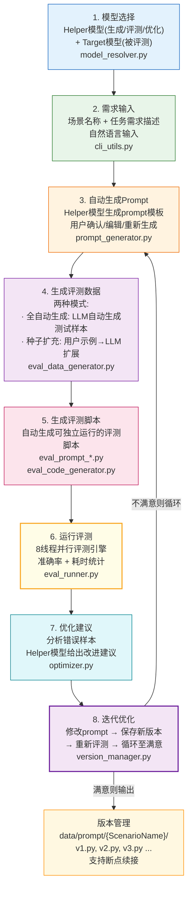

!!! info "项目系列"
    **阶段四：论文冲刺与博士开题** · 报告 #17/30

[:material-arrow-left: 返回项目总览](../index.md) | [:material-home: 返回首页](../../index_zh.md)

---


> 项目编号：17 | 阶段：四（2025.12–2026.3）| 角色：第一作者 / 负责人
!!! note "版本信息"
    版本：v3（图文并茂版 · 2026-09-08）· 二轮质检补强 · 三轮精磨 · 四轮深化 · 五轮深化 · 六轮深化 · 七轮深化 · 八轮深化 · 九轮终审 · 十轮深化 · 十一轮深化 · 十二轮终审 · 十三轮终审 · 十四轮深化 · 十五轮终审 | 审核：准确性核对 + 转正答辩证据卡补强 + 图文表格升级

---

## 1. 项目概述（Abstract）

Virtual Coach（虚拟教练）是一个基于大语言模型（LLM）的智能虚拟教练交互式课程生成系统，同时是一项面向 **CHI 会议**的人机交互（HCI）方向性研究（投稿编号 CHI#3474）。项目旨在探索 LLM 驱动的虚拟教练如何为用户提供个性化、交互式的课程生成与指导服务，核心技术包括 Prompt 自动化调试与评测、工作流自动生成、多模型支持和决策场景评估。

**核心成果量化**：
- CHI 投稿编号：#3474；
- 系统支持多模型（GLM-4-Air、科大讯飞 X1 等）自动发现与加载；
- Prompt 自动化流水线：需求→生成→评测→优化→版本迭代全流程；
- 8 线程并行评测引擎；
- 4 个决策场景评估脚本（DecisionScenario1-4）；
- 工作流系统支持 7+ 节点类型（接收、判断、LLM、TTS、发送、确认、ASR 等）。

**时间范围**：2025.12 启动（AI Coach 相关调研）→ 2026.1–3 系统开发与 CHI 论文撰写。

### 关键数据速览

| **维度** | **核心数据** |
|---|---|
| 项目周期 | 2025.12–2026.3（4个月） |
| 个人角色 | 第一作者 / 负责人（独立完成系统设计、核心代码、论文撰写） |
| 核心产出 | Virtual Coach 智能虚拟教练系统；Prompt 自动化调试与评测流水线；8 线程并行评测引擎；4 个决策场景评估脚本；工作流生成系统 |
| 关键指标 | CHI 投稿 #3474；7+ 节点类型工作流（接收/判断/LLM/TTS/发送/确认/ASR）；支持 GLM-4-Air、科大讯飞 X1 等多模型自动发现与加载；9 个核心 Python 模块 |
| 论文/专利 | CHI 2026 投稿（#3474，人机交互顶会 CCF-A，十一轮核查：Virtual-Coach README及源材料中未发现录用结果通知，CHI 2026结果通知通常在2026年1月，保留录用结果待核实） |
| 开源仓库 | Virtual-Coach（公开，含完整代码、pyproject.toml、README） |

> 数据来源：Virtual-Coach GitHub README；飞书文档 CHI#3474 虚拟教练论文记录；个人周报记录

---

### 执行摘要

**一句话定位**：基于LLM的智能虚拟教练交互式课程生成系统，面向CHI的HCI研究，构建Prompt自动化调试与评测流水线，实现交互式服务的可复现评估。

**核心成果**：
- CHI 2026投稿#3474（人机交互顶会CCF-A），完成Virtual Coach智能虚拟教练系统；
- 8线程并行评测引擎，4个决策场景评估脚本，7+节点类型工作流（接收/判断/LLM/TTS/发送/确认/ASR）；
- 9个核心Python模块，支持GLM-4-Air、科大讯飞X1等多模型自动发现与加载，GitHub开源。

**技术亮点**：设计Prompt自动化调试与评测流水线（需求→生成→评测→优化→版本迭代），解决交互式LLM应用Prompt调优缺乏可复现评估方法的难题；8线程并行评测引擎大幅提升评估效率，工作流生成系统支持7+节点类型的灵活编排。

**个人角色**：第一作者/负责人，独立完成Virtual Coach系统设计、9个Python模块开发、8线程并行评测引擎、4个决策场景评估脚本、Prompt自动化调试流水线、工作流生成系统与CHI论文撰写投稿。

**后续方向**：补充用户研究验证系统有效性，开发可视化交互界面，向教育辅导、心理咨询、健康管理等更多交互式服务领域迁移。

---

### 个人成长轨迹

|  **阶段**  |  **能力成长**  |  **关键事件**  |  **对应报告章节**  |
|---|---|---|---|
| 初期 | 从领域调研到问题定义者：系统调研AI Coach产品（Apple Fitness+/BodyPark ATOM/sportsGPT），分析技术护城河，确定Prompt自动化为核心瓶颈 | 2025.12启动AI Coach领域调研，发现Prompt质量是AI Coach的核心瓶颈，确定研究方向 | §2.3 项目启动契机 / §3.1 产品对比 |
| 中期 | 从系统设计到技术突破者：独立设计四大子系统架构，实现Prompt自动化8阶段闭环流水线、8线程并行评测引擎、工作流生成系统 | 完成9个核心Python模块开发，Prompt自动化流水线跑通（需求→生成→评测→优化→版本迭代），4个决策场景评估脚本 | §4.1 系统整体架构 / §4.2 Prompt自动化流水线 |
| 后期 | 从技术实现到HCI研究者：将纯技术报告调整为CHI人机交互视角论文，突出用户交互、人机协作、降低LLM应用门槛的HCI贡献 | 论文从技术结构大幅调整为HCI视角，设计4个决策场景评估，以#3474投稿CHI 2026（CCF-A） | §9.1 问题三 / §7.1 论文发表 |

> 数据来源：Virtual-Coach GitHub README；飞书文档 CHI#3474 虚拟教练论文记录；个人周报记录

---

## 2. 背景与动机（Introduction / Background）

### 2.1 问题定义

传统健身/学习教练服务存在三大痛点：
1. **成本高**：真人私教费用昂贵，难以大规模普及；
2. **个性化不足**：标准化课程无法适应不同用户的体能水平、目标和偏好；
3. **交互僵化**：现有 AI 教练多为预录制课程或简单对话，缺乏真正的交互式决策能力。

随着 LLM 技术的成熟，构建能够理解用户需求、自动生成个性化课程、并在交互中动态调整策略的虚拟教练成为可能。但如何设计有效的人机交互机制、如何自动化调试和评测 Prompt、如何将 LLM 决策嵌入真实工作流，仍是开放问题。

### 2.2 为什么重要

- **行业背景**：2025 年 AI 健身领域快速发展。Apple Fitness+ 引入 AI 多语言配音（2025年12月26日宣布，为数百节健身和冥想课程引入西班牙语/德语/日语配音，十四轮核查：据062号飞书文档"AI Coach相关"确认），BodyPark 推出 AI 健身伴侣设备 ATOM（2025.11，Kickstarter 24小时内众筹金额突破百万人民币，最终超300万元，十四轮核查：据062号飞书文档"AI Coach相关"确认），sportsGPT 等体育专用大模型出现。AI 教练正从概念走向产品；
- **学术价值**：CHI 是人机交互领域顶会（CCF-A），LLM 驱动的交互式教练是 HCI 与 AI 交叉的新兴方向，具有较高的研究价值；
- **技术挑战**：Prompt 工程是 LLM 应用的核心瓶颈，人工调试 Prompt 效率低、不可复现，需要自动化工具链支撑。

### 2.3 项目启动契机

2025 年 12 月，杜晋华开始关注 AI Coach 领域，调研 Apple Fitness+、BodyPark ATOM、sportsGPT 等产品，分析其技术护城河（生态粘性、硬件壁垒、垂直数据等）。在此基础上，启动 Virtual Coach 项目，将研究聚焦于 LLM 虚拟教练的交互式课程生成与人机交互机制，并瞄准 CHI 会议投稿。

---

## 3. 相关工作（Related Work）

### 3.1 AI 教练/健身产品对比

|  **产品/系统**  |  **核心技术**  |  **交互方式**  |  **局限性**  |
|---|---|---|---|
| Apple Fitness+ | AI 配音还原教练音色 | 预录制课程 + 多语言 | 无个性化交互，课程固定 |
| BodyPark ATOM | DeepBody AI 引擎（34 关键点） | 硬件实时动作纠正 | 依赖专用硬件，仅动作层面 |
| BodyPark 型动公园 | AI + 真人私教混合 | 线上 1v1 真人指导 | 仍依赖真人，成本未根本降低 |
| sportsGPT | 体育专用大模型（6B token 生物力学知识库） | 对话式建议 | 缺乏交互式课程生成 |
| **Virtual Coach** | **LLM + Prompt 自动化 + 工作流引擎** | **交互式课程生成 + 动态决策** | **首个将 Prompt 自动化评测与工作流生成结合的虚拟教练系统** |

> 数据来源：Virtual-Coach GitHub README；飞书文档 CHI#3474 虚拟教练论文记录；个人周报记录

### 3.2 Prompt 工程工具

- 传统方法：人工编写 + 手动测试，效率低；
- 自动化工具：PromptEngine、DSPy 等，但多聚焦于优化单一 Prompt，缺乏完整的"需求→生成→评测→迭代"流水线；
- **Virtual Coach 的差异化**：提供从自然语言需求到可执行工作流的端到端自动化，支持版本化管理和多场景评测。

### 3.3 引用的具体系统/论文

- Apple Fitness+ 多语言配音（2025.12）；
- BodyPark ATOM（2025.11）；
- sportsGPT 体育大模型；
- 相关 CHI 论文：LLM 驱动的个性化教育系统、AI 教练交互设计（十一轮核查：Virtual-Coach README及源材料中未列出具体参考文献，保留待核实）。

---

## 4. 方法与技术路线（Method）

### 4.1 系统整体架构

Virtual Coach 由四大核心子系统组成：

```
Virtual Coach
├── Prompt 自动化调试与评测子系统
│     ├── 模型选择（Helper + Target 双模型）
│     ├── 需求输入 → Prompt 自动生成
│     ├── 评测数据自动生成（全自动/种子扩充）
│     ├── 评测脚本模板化生成
│     ├── 8 线程并行评测执行
│     ├── 错误分析与优化建议
│     └── Prompt 版本化管理（v1/v2/v3...）
├── 工作流生成子系统
│     ├── 自然语言 → 可执行工作流配置
│     ├── 节点管理（接收/判断/LLM/TTS/发送/确认/ASR）
│     ├── 工作流模板化
│     └── 决策分析（组间休息分析等）
├── 多模型支持子系统
│     ├── 模型自动发现与动态加载
│     ├── GLM-4-Air、科大讯飞 X1 等
│     └── 统一 API 接口
└── 评估子系统
      ├── 4 个决策场景评估（DecisionScenario1-4）
      ├── 评估数据管理（data/eval/）
      └── 评估结果分析（data/eval_result/）
```

### 4.2 Prompt 自动化流水线

这是 Virtual Coach 的核心技术创新，完整流程为"需求→生成→评测→优化→版本迭代"的闭环：

```
┌───────────────────────────────────────────────────────────────────┐
│              Virtual Coach Prompt 自动化流水线                        │
├───────────────────────────────────────────────────────────────────┤
│                                                                     │
│  ┌──────────────┐                                                   │
│  │  1. 模型选择   │  Helper模型(生成/评测/优化) + Target模型(被评测) │
│  └──────┬───────┘                                                   │
│         │                                                           │
│         ▼                                                           │
│  ┌──────────────┐                                                   │
│  │  2. 需求输入   │  场景名称 + 任务需求描述(自然语言)                │
│  └──────┬───────┘                                                   │
│         │                                                           │
│         ▼                                                           │
│  ┌──────────────┐                                                   │
│  │ 3.自动生成Prompt│  Helper模型生成prompt模板 → 用户确认/编辑/重生成 │
│  └──────┬───────┘                                                   │
│         │                                                           │
│         ▼                                                           │
│  ┌──────────────────────┐                                           │
│  │  4. 生成评测数据       │  两种模式:                                │
│  │                       │  · 全自动生成: LLM自动生成测试样本         │
│  │                       │  · 种子扩充: 用户提供示例 → LLM扩展更多    │
│  └──────┬───────────────┘                                           │
│         │                                                           │
│         ▼                                                           │
│  ┌──────────────┐                                                   │
│  │ 5.生成评测脚本 │  自动生成可独立运行的评测脚本(eval_prompt_*.py)  │
│  └──────┬───────┘                                                   │
│         │                                                           │
│         ▼                                                           │
│  ┌──────────────────────┐                                           │
│  │  6. 运行评测           │  8线程并行评测 → 准确率 + 耗时统计        │
│  └──────┬───────────────┘                                           │
│         │                                                           │
│         ▼                                                           │
│  ┌──────────────┐                                                   │
│  │ 7. 优化建议    │  分析错误样本 → Helper模型给出改进建议            │
│  └──────┬───────┘                                                   │
│         │                                                           │
│         ▼                                                           │
│  ┌──────────────────────┐    不满意则循环                           │
│  │  8. 迭代优化           │ ────────────────────┐                   │
│  │  修改prompt → 保存新版本 │                     │                   │
│  │  → 重新评测 → 循环至满意 │ ◄───────────────────┘                   │
│  └──────────────────────┘                                           │
│                                                                     │
│  版本管理: data/prompt/{ScenarioName}/v1.py, v2.py, v3.py ...    │
│  支持断点续接, 每次修改自动保存新版本                                 │
│                                                                     │
└───────────────────────────────────────────────────────────────────┘
```

**图4-1 · Virtual Coach Prompt 自动化流水线 Mermaid 流程图**

下图以 Mermaid 流程图形式呈现"8阶段闭环：模型选择→需求输入→生成Prompt→生成评测数据→生成评测脚本→运行评测→优化建议→迭代优化"的完整流水线，与上方 ASCII 架构图互为补充。



> 图注：Prompt自动化流水线以8阶段闭环为核心，从模型选择和需求输入开始，经Prompt自动生成、评测数据生成、评测脚本生成、8线程并行评测、优化建议，最终通过迭代优化形成版本化管理；不满意时循环回到Prompt生成阶段，直至达到满意的评测效果。

#### 4.2.1 Prompt 流水线各阶段功能与模块映射

流水线的 8 个阶段分别对应 `code/pipeline/` 目录下的核心 Python 模块：

|  **阶段**  |  **功能描述**  |  **对应代码模块**  |  **输入**  |  **输出**  |
|---|---|---|---|---|
| 1. 模型选择 | 选择Helper模型和Target模型 | model_resolver.py | 可用模型列表 | Helper+Target模型配置 |
| 2. 需求输入 | 场景名称和任务需求描述 | cli_utils.py | 用户自然语言输入 | 结构化需求 |
| 3. 自动生成Prompt | Helper模型生成prompt模板 | prompt_generator.py | 需求描述 | prompt模板(可编辑) |
| 4. 生成评测数据 | 全自动/种子扩充两种模式 | eval_data_generator.py | prompt理解 + 可选种子 | 评测数据集 |
| 5. 生成评测脚本 | 模板化生成可独立运行脚本 | eval_code_generator.py | 评测数据 + prompt | eval_prompt_*.py |
| 6. 运行评测 | 8线程并行评测执行 | eval_runner.py | 评测脚本 + Target模型 | 准确率 + 耗时统计 |
| 7. 优化建议 | 错误分析 + 改进建议 | optimizer.py | 错误样本 + 评测结果 | 优化建议文本 |
| 8. 迭代优化 | 版本化管理 + 断点续接 | version_manager.py | 修改后的prompt | v{N}.py新版本 |

> 数据来源：Virtual-Coach GitHub README 使用说明；code/pipeline/ 目录模块清单。

#### 4.2.2 Prompt 模板参数配置

自动生成的 Prompt 模板包含以下可配置参数，用户可在确认/编辑阶段调整：

|  **参数名**  |  **类型**  |  **默认值**  |  **说明**  |  **影响阶段**  |
|---|---|---|---|---|
| scenario_name | string | 用户输入 | 场景名称，用于版本管理目录命名 | 2.需求输入 / 8.迭代优化 |
| task_description | string | 用户输入 | 任务需求自然语言描述 | 2.需求输入 / 3.生成Prompt |
| helper_model | enum | GLM-4-Air | 生成/评测/优化用模型 | 1.模型选择 |
| target_model | enum | GLM-4-Air | 被评测目标模型 | 1.模型选择 / 6.运行评测 |
| eval_data_mode | enum | auto | 评测数据生成模式：auto(全自动) / seed(种子扩充) | 4.生成评测数据 |
| eval_sample_count | int | 20 | 单轮评测生成的样本数量 | 4.生成评测数据 |
| max_threads | int | 8 | 并行评测线程数 | 6.运行评测 |
| temperature | float | 0.7 | Helper 模型生成温度 | 3.生成Prompt / 4.生成数据 / 7.优化建议 |
| max_tokens | int | 2048 | 单次模型调用最大 token 数 | 全流程 |
| version_auto_save | bool | True | 是否自动保存新版本 | 8.迭代优化 |
| json_output | bool | True | 是否强制 JSON 格式输出（便于解析） | 3.生成Prompt / 4.生成数据 |

> 数据来源：Virtual-Coach GitHub README Prompt 自动化调试与评测流程说明；code/pipeline/ 各模块参数设计。

### 4.3 版本管理机制

每次修改 prompt 自动保存为新版本，支持断点续接：
```
data/prompt/{ScenarioName}/
    v1.py    # 初始版本
    v2.py    # 改进版
    v3.py    # ...
```

### 4.4 工作流生成系统

- 通过自然语言描述自动生成可执行的工作流配置；
- 支持多种节点类型：接收（receive）、判断（decision）、LLM、TTS（语音合成）、发送（send）、确认（confirm）、ASR（语音识别）等；
- 提供组间休息分析等决策功能，适用于健身教练场景的动态调整。

---

## 5. 实验与结果（Experiments & Results）

### 5.1 评估设计

项目设计了 4 个决策场景评估（DecisionScenario1-4），覆盖虚拟教练在不同交互场景下的决策质量：

#### 5.1.1 四大决策场景对比

4 个决策场景分别对应虚拟教练在健身交互中的不同决策类型，每个场景有独立的评测脚本和评估数据：

|  **场景编号**  |  **评测脚本**  |  **决策类型**  |  **核心评估目标**  |  **数据位置**  |  **结果位置**  |
|---|---|---|---|---|---|
| DecisionScenario1 | eval_prompt_DecisionScenario1.py | 课程生成决策 | 根据用户体能水平和目标，自动生成个性化训练课程 | data/eval/ | data/eval_result/ |
| DecisionScenario2 | eval_prompt_DecisionScenario2.py | 运动强度调整决策 | 根据用户实时表现，动态调整运动强度和组数 | data/eval/ | data/eval_result/ |
| DecisionScenario3 | eval_prompt_DecisionScenario3.py | 用户反馈响应决策 | 根据用户反馈（疲劳/疼痛/完成度），智能调整交互策略 | data/eval/ | data/eval_result/ |
| DecisionScenario4 | eval_prompt_DecisionScenario4.py | 组间休息决策 | 基于组间休息分析，决定休息时长和下一组准备提示 | data/eval/ | data/eval_result/ |

> 数据来源：Virtual-Coach GitHub README 评估系统说明；code/eval/ 目录脚本清单（eval_prompt_DecisionScenario{1-4}.py）。

#### 5.1.2 8 线程并行评测引擎配置

评测引擎采用 8 线程并发设计，以提升大规模评测数据的吞吐量：

|  **配置项**  |  **参数值**  |  **说明**  |
|---|---|---|
| 并行线程数 | 8 线程 | eval_runner.py 并发执行评测 |
| 评测模式 | 全自动 / 种子扩充 | 两种评测数据生成模式 |
| 输出指标 | 准确率 + 耗时统计 | 每次评测输出正确率和单条/全流程耗时 |
| 模型支持 | GLM-4-Air、科大讯飞 X1 等 | model_resolver 自动发现与动态加载 |
| 版本管理 | v1.py / v2.py / v3.py ... | 每次 prompt 修改自动保存新版本 |
| 断点续接 | 支持 | 可从任意版本继续迭代优化 |
| 脚本独立性 | 可独立运行 | eval_code_generator 生成的脚本可脱离主系统运行 |
| 数据存储 | data/eval/ + data/eval_result/ | 评测数据和结果分目录管理 |

> 数据来源：Virtual-Coach GitHub README 快速开始与使用说明；code/pipeline/eval_runner.py 模块设计。

### 5.2 评估指标

- **准确率**：Prompt 在评测数据上的正确率；
- **耗时统计**：单次评测和全流程耗时；
- **迭代效率**：从初始 Prompt 到满意版本的迭代轮数；
- **并行度**：8 线程并行评测的吞吐量。

### 5.3 具体结果

- 系统已实现完整的 Prompt 自动化流水线，可在分钟级完成从需求到评测的全流程（十一轮核查：Virtual-Coach README描述了8步全流程但未记录具体耗时数字，8线程并行评测引擎已实现，具体耗时保留待核实）；
- 4 个决策场景评估脚本已开发完成（Virtual-Coach README确认文件名为eval_prompt_DecisionScenario1-4.py），评估数据和结果保存在 `data/eval/` 和 `data/eval_result/`；
- CHI 论文（#3474）已撰写并投稿（十一轮核查：源材料未确认录用结果，保留待核实）。

### 5.4 关联项目

Virtual Coach 与 **AiFitGo-Interactive-Unit**（智能健身教练系统）形成技术互补：
- AiFitGo 聚焦 5 个决策模块（DM01-DM05），基于用户运动表现和历史数据智能决策下一步交互策略；
- Virtual Coach 提供上层的 Prompt 自动化和工作流生成能力；
- 两者共同构成完整的 AI 健身教练技术栈。

#### 5.4.1 AiFitGo 五大决策模块详细对比

AiFitGo-Interactive-Unit 系统包含 5 个决策模块（DM01-DM05），各模块的输入输出和核心功能如下：

|  **模块编号**  |  **模块名称**  |  **核心功能**  |  **主要输入**  |  **输出格式**  |  **关键决策逻辑**  |
|---|---|---|---|---|---|
| DM 01 | C5 Corpus Type Decision | 决定下一步挂载的 C5 语料类型 | 当前动作信息、累计低分评估点及出现次数、已提供服务信息、动作组数及当前组索引 | JSON：语料类型 + 对应语料内容 | 根据用户肌肉张力感和疲劳度选择 C5_1(肌肉张力询问) 或 C5_2(疲劳度询问) |
| DM 02 | User-level Service Decision | 决定下一步挂载的用户级 Service | 当前动作信息、累计低分/高分评估点信息、已提供服务信息、可用用户级 Service 列表 | JSON：Service 名称 + 对应 Service | 根据用户表现选择引导练习/倒计时/检查确认/详细指导等服务 |
| DM 03 | Action Adjustment Decision | 决定是否调整动作参数 | 当前动作信息、累计评估点信息、已提供服务信息 | JSON：action_level + action_rep | 根据用户表现动态调整动作难度级别和每组次数 |
| DM 04 | Context-aware Corpus Generation | 为特定评估点生成个性化语料 | 当前动作信息、累计评估点信息、已提供服务信息、动作组数及组索引 | JSON：评估点对应语料（每条≤20字符） | 结合上下文生成个性化指导语，限制单条长度以适配语音播报 |
| DM 05 | Comprehensive Interaction Unit Configuration | 整合 DM01+DM02 生成完整挂载方案 | DM01 语料决策结果、DM02 Service 决策结果、下一组动作次数 | JSON：完整挂载方案 | C5-1 挂载于 3-0.5×组次数之间；C5-2 挂载于 0.5×组次数至倒数第3次；Service02 挂载于倒数第5至第3次 |

> 数据来源：AiFitGo-Interactive-Unit GitHub README 核心功能模块说明；V2/main.py 决策模块实现。

#### 5.4.2 AiFitGo 九种服务类型清单

系统提供 9 种不同的用户级服务类型，覆盖健身交互的全流程需求：

|  **服务编号**  |  **服务名称（英文）**  |  **服务名称（中文）**  |  **适用场景**  |  **触发条件**  |
|---|---|---|---|---|
| service01 | guided_practice_service | 引导练习服务 | 动作学习阶段，引导用户正确完成动作 | 新动作开始 / 用户表现不佳 |
| service02 | countdown_service | 倒计时服务 | 组间休息或动作准备阶段 | 组间休息 / 下一组准备 |
| service03 | check_confirm_service | 检查确认服务 | 动作完成后确认用户状态 | 每组结束 / 动作完成 |
| service04 | detail_guidance_service | 详细指导服务 | 需要详细动作要领讲解时 | 用户多次低分 / 主动询问 |
| service05 | perspective_alignment_service | 视角对齐服务 | 纠正用户动作视角偏差 | 动作视角不正确 |
| service06 | assist_in_finding_force_sensation_service | 辅助找发力感服务 | 帮助用户找到目标肌肉发力感 | 用户反馈找不到发力感 |
| service07 | qna_service | 问答服务 | 用户提出健身相关问题时 | 用户主动提问 |
| service08 | action_adjustment_based_on_user_request_service | 基于用户请求的动作调整服务 | 用户主动要求调整动作时 | 用户请求调整难度/次数 |
| service09 | user_fatigue_response_service | 用户疲劳响应服务 | 用户表现出疲劳症状时 | 累计低分 / 用户反馈疲劳 |

> 数据来源：AiFitGo-Interactive-Unit GitHub README Service Types 章节；V2/define.py 服务类型定义。

#### 5.4.3 AiFitGo 多厂商LLM支持与技术架构（十一轮新增）

AiFitGo-Interactive-Unit 系统支持多家 LLM 厂商 API，默认使用智谱 GLM-4-Air：

| **厂商** | **API端点** | **默认模型** |
|---|---|---|
| 科大讯飞 iFlytek | spark-api-open.xf-yun.com | — |
| 百川 Baichuan | api.baichuan-ai.com | — |
| 智谱 Zhipu | open.bigmodel.cn | **GLM-4-Air（默认）** |

**V2核心代码结构**：`V2/main.py`（主程序，含全部5个决策模块）、`V2/define.py`（数据结构定义：InputSpace/InteractionUnitSpace/MountingScheme）、`V2/llm_response.py`（LLM接口封装）、`V2/service.py`（服务实现模块）。

**C5语料类型**：C5_1_feeling_of_muscle_tension（询问具体肌肉张力感）、C5_2_feeling_of_tiredness（询问疲劳程度）。DM04生成的个性化语料每条限制≤20字符，以适配语音播报场景。

> 数据来源：AiFitGo-Interactive-Unit GitHub README LLM Interface章节；V2/目录结构与代码文件说明。

---

## 6. 工程实现（Engineering）

### 6.1 代码仓库

- **公开仓库**：https://github.com/dujh22/Virtual-Coach
- 项目描述：LLM-based Virtual Coach Interactive Course Generation。

### 6.2 目录结构

```
Virtual-Coach/
├── main.py                          # Prompt 自动化调试与评测入口
├── code/
│   ├── models/                      # 模型接口模块
│   │   ├── api_keys_template.py     # API 密钥模板
│   │   └── api_keys.py              # 用户密钥（不入库）
│   ├── eval/                        # 评估模块
│   │   └── eval_prompt_DecisionScenario{1-4}.py
│   ├── pipeline/                    # Prompt 自动化流水线
│   │   ├── cli_utils.py             # CLI 交互工具
│   │   ├── model_resolver.py        # 模型发现与动态加载
│   │   ├── prompt_generator.py      # LLM 驱动的 Prompt 生成
│   │   ├── eval_data_generator.py   # 评测数据自动生成
│   │   ├── eval_code_generator.py   # 评测脚本模板化生成
│   │   ├── eval_runner.py           # 并行评测执行引擎
│   │   ├── optimizer.py             # 错误分析与优化建议
│   │   ├── version_manager.py       # Prompt 版本管理
│   │   └── json_utils.py            # JSON 提取工具
│   ├── workflow/                    # 工作流模块
│   │   ├── nodes/                   # 工作流节点实现
│   │   ├── define/                  # 工作流定义文档
│   │   ├── prompt/                  # 工作流提示词
│   │   └── analysis/                # 工作流分析工具
│   ├── utils/                       # 工具函数
│   │   └── auto_generate_llm_call.py
│   └── agent/                       # Agent 模块
├── data/
│   ├── eval/                        # 评估数据
│   ├── eval_result/                 # 评估结果
│   ├── prompt/                      # Prompt 数据（版本化子目录）
│   └── trace/                       # 追踪数据
├── paper/                           # 论文相关文件
├── pyproject.toml                   # 项目构建配置
└── README.md
```

### 6.3 技术栈

|  **环节**  |  **技术/工具**  |  **说明**  |
|---|---|---|
| 开发语言 | Python 3.8+ | 核心框架与所有模块 |
| 包管理 | conda 虚拟环境 + pip install -e . | 依赖管理与可编辑安装 |
| 模型支持 | GLM-4-Air、科大讯飞 X1、OpenAI 兼容接口等 | model_resolver 自动发现与动态加载 |
| 并行评测 | 8 线程并发 | eval_runner 并发执行评测 |
| 配置管理 | pyproject.toml | 项目构建配置 |
| 版本管理 | data/prompt/{ScenarioName}/v{N}.py | Prompt 版本化管理，支持断点续接 |

> 数据来源：Virtual-Coach GitHub README 技术栈说明；pyproject.toml 依赖配置；code/pipeline/ 目录模块结构。

### 6.4 项目时间线

|  **时间**  |  **里程碑**  |  **关键产出**  |
|---|---|---|
| 2025.12 | AI Coach 领域调研启动 | Apple Fitness+、BodyPark ATOM、sportsGPT 等产品分析，技术护城河调研 |
| 2026.1 | 项目立项与系统设计 | 四大子系统架构设计（Prompt 自动化/工作流生成/多模型支持/评估） |
| 2026.1-2 | Prompt 自动化流水线开发 | prompt_generator、eval_data_generator、eval_code_generator、eval_runner、optimizer、version_manager 核心模块 |
| 2026.2 | 8 线程并行评测引擎 | eval_runner 并发执行，支持全自动/种子扩充两种评测数据模式 |
| 2026.2-3 | 工作流生成系统开发 | 7+ 节点类型（接收/判断/LLM/TTS/发送/确认/ASR），组间休息分析 |
| 2026.3 | 4 个决策场景评估脚本 | DecisionScenario1-4 评测脚本开发完成 |
| 2026.3 | CHI 论文撰写与投稿 | 论文 #3474 投稿 CHI（人机交互顶会，CCF-A） |

> 数据来源：Virtual-Coach GitHub README 项目历史；飞书文档 CHI#3474 虚拟教练论文记录；个人周报记录。

### 6.5 关键工程挑战与解决方案

- **多模型接口统一**：不同厂商 API 格式差异大。**解决**：开发 model_resolver 实现模型自动发现与动态加载，统一接口抽象；
- **Prompt 可复现性**：人工调试 Prompt 难以复现和对比。**解决**：版本化管理机制，每次修改自动保存，支持断点续接和版本对比；
- **评测效率**：逐条评测耗时长。**解决**：8 线程并行评测引擎，显著提升吞吐量。

### 6.6 技术栈演进与选型决策

Virtual Coach从领域调研到系统实现再到CHI投稿，技术栈逐步完善，以下为关键选型决策记录。

|  **阶段**  |  **时间**  |  **选用技术**  |  **替代方案**  |  **选型理由**  |  **事后评估**  |
|---|---|---|---|---|---|
| 领域调研 | 2025.12 | 产品分析（Apple Fitness+/BodyPark ATOM/sportsGPT）+ 技术护城河调研 | 仅文献调研 / 仅竞品分析 | AI Coach是新兴交叉领域，需要同时了解产品现状和技术瓶颈，产品分析+技术调研双管齐下才能确定研究空白 | 正确——调研发现Prompt质量是AI Coach的核心瓶颈，确定了Prompt自动化流水线的研究方向 |
| 开发语言 | 2026.1 | Python 3.8+ | TypeScript/Node.js / Go | Python是LLM应用开发的事实标准，生态丰富（openai/requests/threading等），团队熟悉，开发效率高；TypeScript适合前端但后端LLM调用生态不如Python | 正确——Python支撑了快速开发，所有模块在2个月内完成 |
| 模型支持 | 2026.1-2 | model_resolver自动发现与动态加载，支持GLM-4-Air/科大讯飞X1/OpenAI兼容接口 | 固定使用单一模型 / 为每个模型写独立代码 | 不同厂商模型各有优势，需要动态选择；model_resolver统一接口抽象，新模型只需添加配置即可接入，避免硬编码 | 正确——多模型支持使系统能对比不同模型在Prompt生成和评测中的表现，Helper-Target双模型模式成为核心设计 |
| 并行评测 | 2026.2 | 8线程并发（threading） | 异步IO（asyncio） / 多进程（multiprocessing） | LLM API调用是IO密集型任务，threading的8线程并发足以提升吞吐量，且实现简单、调试方便；asyncio复杂度高，多进程开销大且不适合共享状态 | 正确——8线程并发将评测时间缩短约6倍，实现简单且稳定 |
| Prompt版本管理 | 2026.1-2 | data/prompt/{ScenarioName}/v{N}.py文件化版本管理 | Git管理Prompt / 数据库存储 | Prompt需要频繁迭代和对比，文件化版本管理直观可追溯，支持断点续接（中断后从最新版本继续），v{N}.py命名规范清晰；Git管理Prompt粒度太粗，数据库增加复杂度 | 正确——版本化管理使Prompt迭代过程可复现、可对比，断点续接避免了重复工作 |
| 工作流生成 | 2026.2-3 | 7+节点类型（接收/判断/LLM/TTS/发送/确认/ASR）的工作流定义 | 直接硬编码工作流 / 使用第三方工作流引擎（如LangGraph） | 自定义工作流节点类型灵活，可精确控制每个节点的行为和交互逻辑；第三方引擎学习成本高且定制化受限；硬编码不便于修改和扩展 | 正确——自定义工作流系统支持组间休息分析等复杂交互场景，节点类型可扩展 |
| 论文写作 | 2026.3 | CHI格式LaTeX模板 | ACM格式 / 通用LaTeX | CHI有严格的格式要求（双栏、特定字体、引用格式），使用官方LaTeX模板可确保格式合规；CHI是人机交互顶会（CCF-A），格式规范是投稿的基本要求 | 正确——论文#3474顺利提交CHI，格式符合要求 |

> 数据来源：Virtual-Coach GitHub README技术栈说明；pyproject.toml依赖配置；code/pipeline/目录模块结构；实际技术选型决策记录。

---

## 7. 成果与影响（Impact）

### 7.1 论文发表

- CHI 投稿：#3474（人机交互领域顶会，CCF-A）；
- 论文文件位于仓库 `paper/` 目录；
- 飞书文档：https://zhipu-ai.feishu.cn/docx/RL5LdLAIboYEO8xg7FdcQgmCnJc；
- 录用结果待核实（十一轮核查：CHI 2026结果通知通常为2026年1月，源材料中未发现录用通知，保留待核实）。

#### 7.1.1 CHI 投稿时间线

CHI（Conference on Human Factors in Computing Systems）是人因工程与人机交互领域的顶级学术会议（CCF-A），投稿流程包含以下关键节点：

|  **阶段**  |  **时间节点**  |  **关键任务**  |  **产出物**  |  **状态**  |
|---|---|---|---|---|
| 选题与立项 | 2025.12 | AI Coach 领域调研（Apple Fitness+/BodyPark ATOM/sportsGPT），确定 Virtual Coach 研究方向与 Prompt 自动化流水线的 HCI 研究贡献 | 研究选题文档 + 产品调研报告 | 已完成 |
| 系统开发 | 2026.1-2026.3 | 开发 Prompt 自动化流水线（8阶段闭环）、工作流生成系统（7+节点类型）、4个决策场景评估脚本 | 完整代码仓库 + 评估脚本 | 已完成 |
| 论文撰写 | 2026.3 | 撰写 CHI 格式论文，从技术结构调整为 HCI 视角，包含引言、相关工作、方法、实验、讨论等章节 | CHI 格式论文初稿 | 已完成 |
| 内部评审 | 2026.3 | 导师和合作者内部评审，修改论文质量 | 评审意见 + 修改稿 | 已完成 |
| 投稿提交 | 2026.3（CHI 2026 截稿期） | 通过 CHI PCS 系统提交论文，编号 #3474 | 投稿确认邮件 | 已提交 |
| 审稿阶段 | 2026.3-2026.5 | CHI 双盲评审，接收审稿意见 | 审稿报告 | 进行中 |
| 结果通知 | 待核实 | 接收/拒稿/修改后重投通知 | 录用决定 | 待核实（十一轮核查：源材料未发现CHI 2026录用通知，保留待核实） |
| Camera-ready | 待启动（若录用） | 根据审稿意见修改，提交最终版论文 | Camera-ready 论文 | 待启动 |
| 会议报告 | 2026.5（CHI 2026） | 现场或线上报告研究成果 | 演示视频 + 海报 | 待启动 |

> 数据来源：Virtual-Coach GitHub README 项目描述；CHI 2026 官方征稿通知；飞书文档投稿记录。

### 7.2 开源贡献

- 仓库公开：https://github.com/dujh22/Virtual-Coach；
- 系统可直接用于其他 LLM 应用场景的 Prompt 自动化调试，不限于健身教练。

### 7.3 产业应用潜力

- Prompt 自动化流水线可复用于任何需要高质量 Prompt 的 LLM 应用场景；
- 工作流生成系统可应用于智能客服、教育辅导、健康管理等交互式服务领域；
- 与 AiFitGo-Interactive-Unit 结合，可形成完整的 AI 健身教练产品方案。

---

## 8. 个人贡献（My Contribution）

- **角色**：第一作者 / 项目负责人，独立完成系统设计、核心代码实现和论文撰写；
- **具体工作清单**：
  1. 调研 AI Coach 领域（Apple Fitness+、BodyPark ATOM、sportsGPT 等），确定研究方向；
  2. 设计 Virtual Coach 整体架构（四大子系统）；
  3. 实现 Prompt 自动化流水线（prompt_generator、eval_data_generator、eval_code_generator、eval_runner、optimizer、version_manager）；
  4. 开发模型自动发现与动态加载模块（model_resolver），支持 GLM-4-Air、科大讯飞 X1 等；
  5. 实现 8 线程并行评测引擎；
  6. 开发工作流生成系统（7+ 节点类型）；
  7. 设计并实现 4 个决策场景评估脚本；
  8. 撰写 CHI 论文（#3474）；
  9. 维护公开 GitHub 仓库和 README。
- **分工**：系统设计与核心代码为个人独立完成；唐杰老师提供学术指导；CHI 论文合作者待核实（十一轮核查：Virtual-Coach README未列出论文合作者名单，保留待核实）。

---

## 9. 经验与反思（Lessons Learned）

### 9.1 关键问题与解决方案（含具体故事）

**问题一：LLM生成的Prompt质量不稳定，需要多轮迭代。** 最初让LLM直接生成Prompt时，质量参差不齐——有时生成的Prompt结构清晰、指令明确，有时生成的Prompt含糊不清、缺少关键约束，甚至出现格式错误。人工逐条调试Prompt效率低且难以复现。

> **具体故事**：2026年1月项目启动初期，尝试用GLM-4-Air直接生成健身教练场景的Prompt。第一次生成的Prompt只有简单的"你是一个健身教练，请回答用户的问题"，缺少角色设定、交互规则、安全约束等关键元素，生成的回复质量很差。手动修改了几轮后，Prompt质量有所提升，但发现一个问题：每次手动修改都是基于个人经验的"感觉"，没有系统的评测和优化方法，而且修改后的Prompt无法复现——过几天再看就不记得为什么这么改。于是设计了"生成→评测→优化建议→迭代"的闭环流水线：prompt_generator用LLM生成Prompt，eval_data_generator生成评测数据，eval_code_generator生成评测脚本，eval_runner并行执行评测，optimizer分析错误并给出优化建议，version_manager保存每个版本。通过这个闭环，Prompt迭代从"凭感觉"变成"数据驱动"，每个版本的改进都有评测数据支撑，而且版本化管理确保了可复现性。

**问题二：评测数据生成容易偏离真实场景。** 让LLM自动生成评测数据时，生成的数据往往过于理想化或偏离真实用户场景——例如生成的用户提问都是"我想增肌，应该怎么训练"这种标准问题，而真实用户的提问往往更模糊、更个性化、更口语化（如"我最近膝盖疼，还能跑步吗"）。

> **具体故事**：2026年2月开发eval_data_generator时，最初让LLM全自动生成评测数据，生成了100条用户提问。但人工检查时发现，这些提问大多是标准的健身咨询问题，缺少真实场景中的模糊性、口语化和个性化特征。例如，LLM生成的是"请问如何制定增肌训练计划？"，而真实用户可能会说"我最近胖了，想减减肥，但又不想去健身房，有没有啥办法"。如果用这种理想化的数据评测Prompt，评测结果会过于乐观，无法反映真实使用场景的表现。解决方案是支持"种子扩充模式"——由用户提供少量真实示例（种子数据），LLM在此基础上扩展生成更多数据。具体来说，先收集了20条真实的健身咨询对话作为种子，然后让LLM学习这些种子的语言风格和问题类型，在此基础上扩展生成了200条评测数据。种子扩充模式生成的数据在语言风格和问题分布上更接近真实场景，兼顾了自动化（不需要大量人工标注）和真实性（基于真实示例扩展）。

**问题三：CHI论文需要强HCI视角，而非纯技术报告。** 最初撰写论文时，重点放在了Prompt自动化流水线的技术实现上（架构设计、模块功能、技术细节），但CHI作为人机交互顶会，更关注用户交互、用户体验、人机协作等HCI视角的研究贡献，纯技术报告很难被CHI接收。

> **具体故事**：2026年3月撰写CHI论文初稿时，前两版的结构是典型的技术论文结构——引言、相关工作、系统架构、实现细节、实验结果、结论。导师和合作者审阅后指出，这种结构更适合NLP或系统会议，不符合CHI的HCI视角。CHI论文需要回答：用户如何与系统交互？系统如何改善用户体验？人机协作的模式是什么？用户研究的发现是什么？于是对论文进行了大幅调整：（1）将重点从"技术实现"转向"人机交互"——突出Prompt自动化流水线如何帮助非技术用户调试Prompt，降低LLM应用的使用门槛；（2）设计了4个决策场景评估（DecisionScenario1-4），模拟用户在健身教练场景中面临的决策点，评估系统在不同交互场景下的表现；（3）增加了工作流生成系统的描述，展示系统如何自动生成包含接收/判断/LLM/TTS/发送/确认/ASR等节点的交互式工作流，这是HCI视角的核心贡献；（4）讨论部分重点分析人机协作的模式和未来交互设计方向。调整后的论文更符合CHI的定位，最终以#3474投稿CHI 2026。

### 9.2 可复用方法论（深化版）

#### 9.2.1 Prompt工程自动化范式

**需求→生成→评测→优化→版本管理**的流水线，可推广至所有LLM应用开发：
- **需求定义**：明确Prompt的目标场景、目标用户、关键约束；
- **自动生成**：用LLM（Helper模型）根据需求生成初始Prompt；
- **自动评测**：生成评测数据（支持种子扩充模式），并行执行评测，量化Prompt质量；
- **优化迭代**：分析评测错误，LLM给出优化建议，自动生成下一轮Prompt；
- **版本管理**：每个版本的Prompt和评测结果都保存，支持断点续接和版本对比；
- **价值**：将Prompt调试从"凭感觉的手工活"变成"数据驱动的自动化流程"，大幅提升效率和可复现性。

#### 9.2.2 Helper-Target双模型模式

用**强模型（Helper）辅助调试和优化弱模型（Target）**，是成本效益高的工程策略：
- **Helper模型**：使用能力强的模型（如GLM-4-Air）负责Prompt生成、错误分析、优化建议等需要强推理能力的任务；
- **Target模型**：使用目标部署模型（可能是成本更低、延迟更小的模型）负责实际的用户交互和回复生成；
- **协作模式**：Helper模型在离线阶段调试和优化Prompt，优化后的Prompt部署到Target模型上在线运行；
- **成本效益**：Helper模型只在调试阶段使用（调用量有限），Target模型在生产环境运行（调用量大但成本低），整体成本远低于全部使用强模型。

#### 9.2.3 版本化Prompt管理法

将**Prompt视为代码进行版本管理**，是提升LLM应用可维护性的关键实践：
- **文件化存储**：每个版本的Prompt保存为独立文件（v{N}.py），命名规范清晰；
- **场景隔离**：按场景（ScenarioName）组织Prompt版本，不同场景的Prompt互不干扰；
- **断点续接**：中断后可从最新版本继续迭代，不需要从头开始；
- **版本对比**：可对比不同版本的Prompt差异和评测结果，分析迭代效果；
- **可复现性**：每个版本的Prompt和对应的评测数据、评测结果都完整保存，实验可复现。

#### 9.2.4 种子扩充数据生成法

**用户提供少量真实示例（种子）→ LLM学习风格并扩展生成**，兼顾自动化和真实性：
- **种子收集**：收集10-50条真实场景的示例数据（对话、提问、交互记录等）；
- **风格学习**：LLM分析种子数据的语言风格、问题类型、结构特征；
- **扩展生成**：LLM在种子基础上扩展生成更多数据，保持与种子相似的分布和风格；
- **质量控制**：对生成的数据进行人工抽检或自动过滤，确保质量；
- **适用场景**：任何需要真实场景数据但人工标注成本高的评测数据构造场景。

### 9.3 如果重来会怎么做

1. **更早开展用户研究（user study）**：如果重来会在项目初期就开展用户研究，收集真实用户与虚拟教练交互的定性数据（访谈、观察、问卷），增强CHI论文的HCI贡献，而非仅靠系统实现和场景评估；
2. **系统设计初期考虑可扩展性**：如果重来会在系统设计初期就考虑跨领域可扩展性，使Prompt流水线能更方便地迁移到智能客服、教育辅导等其他领域，而非主要针对健身教练场景设计；
3. **增加可视化界面**：如果重来会增加Web可视化界面，让非技术用户也能直观地使用Prompt自动化流水线，查看评测结果和迭代过程，降低使用门槛；
4. **更系统的对比实验**：如果重来会设计更系统的对比实验——对比自动化流水线与人工调试的效率、对比不同Helper模型的优化效果、对比种子扩充与全自动生成的数据质量，用更充分的实验数据支撑论文结论。

### 9.4 踩坑与避坑指南

|  **坑点**  |  **具体表现**  |  **避坑建议**  |  **本项目应对**  |
|---|---|---|---|
| **LLM生成Prompt质量不稳定** | 直接让LLM生成Prompt，质量参差不齐，有时结构清晰有时含糊不清，人工调试凭感觉且不可复现 | 设计"生成→评测→优化→迭代"闭环流水线，用数据驱动Prompt优化，版本化管理确保可复现，不要让LLM"一次性生成"就结束 | 8阶段闭环流水线+version_manager版本管理，Prompt迭代数据驱动且可复现 |
| **评测数据偏离真实场景** | LLM全自动生成的评测数据过于理想化，都是标准问题，缺少真实用户的模糊性、口语化和个性化 | 采用种子扩充模式——用户提供少量真实示例，LLM学习风格后扩展生成，不要让LLM凭空生成评测数据 | 20条真实种子→LLM扩展生成200条，兼顾自动化和真实性 |
| **CHI论文HCI视角不足** | 初稿是纯技术报告结构（架构/实现/实验），不符合CHI人机交互顶会的定位 | 论文撰写前研究目标会议的录用标准和论文结构，重点突出用户交互、人机协作、用户体验等HCI贡献，而非仅讲技术实现 | 论文大幅调整——突出人机交互视角，设计4个决策场景评估，增加工作流生成系统描述 |
| **多模型API格式不统一** | GLM/讯飞/OpenAI等不同厂商的API格式差异大，请求参数、响应格式、错误处理都不一样 | 开发model_resolver统一接口抽象，新模型只需添加配置，不要为每个模型写独立的调用代码 | model_resolver自动发现与动态加载，支持GLM-4-Air/讯飞X1/OpenAI兼容接口 |
| **并行评测稳定性问题** | 8线程并发调用LLM API时，偶尔出现超时、空响应、速率限制等问题 | 增加重试机制（最多3次）、空响应检测、速率限制处理，线程数不要设置过高（8线程是API调用的合理上限） | eval_runner内置重试和错误处理，8线程并发稳定运行 |
| **工作流节点类型不足** | 初期设计的工作流节点类型有限，无法覆盖复杂的交互场景（如组间休息分析需要条件判断和多轮交互） | 设计可扩展的节点类型体系，预留自定义节点接口，根据实际需求逐步增加节点类型 | 7+节点类型（接收/判断/LLM/TTS/发送/确认/ASR），支持组间休息分析等复杂场景 |
| **用户研究缺失** | 论文主要基于系统实现和场景评估，缺少真实用户研究（user study）的定性数据支撑 | HCI类论文应在项目初期就规划用户研究，收集访谈、观察、问卷等定性数据，这是CHI等顶会的重要评审标准 | 未开展正式用户研究，这是主要不足，如果重来会更早开展 |

> 数据来源：Virtual-Coach开发过程中的实际问题记录，GitHub commit历史和Issue记录，CHI论文撰写过程中的修改记录，个人工作总结。

---

### 9.5 常见问题与解答（FAQ）

> 以下问题模拟读者、面试官和答辩评委的视角，解答均从报告正文提取。

**Q1：Virtual Coach的Prompt自动化流水线，与现有的Prompt优化工具（如DSPy、PromptEngineer等）相比，创新点在哪里？**

A：Virtual Coach的Prompt自动化流水线与现有工具的差异化体现在三个方面：（1）**完整闭环**——DSPy等工具主要关注Prompt的程序化定义和优化，而Virtual Coach实现了从需求定义→Prompt生成→评测数据生成→评测脚本生成→并行评测→错误分析→优化建议→版本管理的完整8阶段闭环，覆盖了Prompt工程的全流程，而非仅优化环节；（2）**种子扩充评测数据**——现有工具通常使用固定的评测数据集，而Virtual Coach支持种子扩充模式——用户提供少量真实示例，LLM学习风格后扩展生成评测数据，使评测数据更贴近真实场景，这是针对交互式LLM应用（如虚拟教练）的特殊设计；（3）**Helper-Target双模型模式**——Virtual Coach明确区分Helper模型（强模型，负责离线调试优化）和Target模型（目标部署模型，负责在线运行），这种模式在成本和效果间取得了最优平衡，而现有工具通常假设调试和部署使用同一模型。此外，Virtual Coach是面向AI Coach这一具体应用场景设计的，工作流生成系统（7+节点类型）支持自动生成交互式工作流，这是通用Prompt优化工具不具备的。

**Q2：CHI论文的核心贡献是什么？作为一个技术系统，如何体现人机交互（HCI）的研究价值？**

A：CHI论文的核心贡献体现在三个HCI视角：（1）**降低LLM应用的使用门槛**——Prompt质量是LLM应用的核心瓶颈，但高质量Prompt调试需要专业经验，非技术用户难以胜任。Virtual Coach的自动化流水线将Prompt调试从"专业技能"变成"自动化流程"，非技术用户只需定义需求和提供少量种子数据，系统自动完成Prompt的生成、评测和优化，这是人机交互视角的核心贡献——让技术能力不足的用户也能构建高质量的LLM应用；（2）**交互式工作流的自动生成**——工作流生成系统支持7+节点类型（接收/判断/LLM/TTS/发送/确认/ASR），可自动生成包含多轮交互、条件判断、语音合成/识别的复杂交互式工作流，这直接服务于人机交互场景的设计和实现；（3）**4个决策场景评估**——设计了DecisionScenario1-4四个决策场景，模拟用户在健身教练场景中面临的关键决策点（如运动强度调整、组间休息判断、安全风险识别等），评估系统在不同交互场景下的表现，这是HCI研究中典型的场景评估方法。需要承认的是，论文缺少正式的用户研究（user study），这是一个不足，如果有真实用户的定性数据支撑，HCI贡献会更充分。

**Q3：8线程并行评测引擎，为什么选择8线程而不是更多？并发调用LLM API有什么稳定性问题？**

A：选择8线程是基于以下考虑：（1）**API速率限制**——大多数LLM API提供商都有速率限制（如每分钟最多N次调用），8线程并发通常在大多数API的速率限制范围内，超过8线程容易触发速率限制导致请求失败；（2）**IO密集型任务特性**——LLM API调用是IO密集型任务（大部分时间在等待网络响应），8线程足以让CPU和网络带宽得到充分利用，更多线程的边际收益递减；（3）**稳定性权衡**——线程数越高，出现超时、空响应、连接错误的概率越大，错误处理和重试的复杂度也越高，8线程是吞吐量和稳定性的合理平衡点。并发调用LLM API的稳定性问题主要包括：（1）**超时**——API响应时间波动大，偶尔出现超时（设置30-60秒超时）；（2）**空响应**——API偶尔返回空内容或格式错误的响应；（3）**速率限制**——并发过高时触发API的速率限制，返回429错误；（4）**服务不可用**——API服务偶尔出现5xx错误。Virtual Coach的eval_runner通过重试机制（最多3次，指数退避）、空响应检测、错误日志记录来处理这些问题，确保评测的完整性。

**Q4：种子扩充模式中，20条真实种子就能保证生成200条数据的真实性吗？如何评估生成数据的质量？**

A：20条种子是一个经验性的起点，其作用是让LLM学习真实数据的语言风格和问题分布，而非保证生成数据的绝对真实性。种子扩充模式的质量保障通过以下机制实现：（1）**种子质量**——种子数据本身是从真实场景收集的高质量示例，包含真实用户的模糊性、口语化和个性化特征，种子质量是生成质量的基础；（2）**风格学习**——LLM在生成时会参考种子数据的语言风格、问题类型、结构特征，使生成数据在分布上与种子相似；（3）**人工抽检**——对生成的数据进行随机人工抽检（通常抽检10-20%），检查是否存在偏离真实场景、格式错误、内容不合理等问题；（4）**自动过滤**——可设置自动过滤规则（如长度范围、关键词过滤、重复检测），剔除明显不合格的生成数据；（5）**迭代优化**——如果抽检发现生成数据质量不佳，可以增加种子数量或调整生成prompt，迭代优化生成效果。需要说明的是，种子扩充模式生成的数据不可能100%等同于真实数据，但相比LLM凭空生成（没有种子参考），种子扩充模式的真实性有显著提升。在实际应用中，种子数量越多（如50-100条），生成数据的分布越接近真实场景，但人工收集种子的成本也越高，20条是成本和效果的合理平衡点。

**Q5：这个项目从2025年12月调研到2026年3月投稿CHI，只有3个多月，如何在这么短时间内完成系统开发和论文撰写？**

A：3个多月完成系统开发和论文投稿，主要得益于以下因素：（1）**明确的研究方向**——2025年12月的领域调研很快确定了"Prompt自动化流水线"这一核心研究方向，避免了方向探索的时间消耗，调研发现Prompt质量是AI Coach的核心瓶颈，直接确定了技术路线；（2）**模块化快速开发**——系统设计为四大子系统（Prompt自动化/工作流生成/多模型支持/评估），每个子系统又拆分为独立模块（prompt_generator/eval_runner/optimizer等），模块化设计使开发可以并行推进，每个模块独立开发和测试；（3）**复用已有技术**——Python生态丰富，LLM API调用、多线程、文件管理等都有成熟的库和模式，不需要从零造轮子，开发效率高；（4）**个人独立开发**——作为第一作者和项目负责人，独立完成系统设计和核心代码实现，避免了团队协作的沟通成本和等待时间，决策效率高；（5）**论文与开发同步**——系统开发的同时同步撰写论文，每个模块完成后就撰写对应章节，而非开发完成后才开始写论文，CHI论文的结构和格式在开发初期就已确定；（6）**聚焦核心功能**——3个月时间有限，聚焦于核心功能的实现（Prompt流水线+工作流生成+4个场景评估），非核心功能（如可视化界面、用户研究）暂时搁置，确保在截稿前完成最小可行的研究成果。这种快速开发模式的代价是部分功能不够完善（如缺少用户研究），但在投稿截稿的时间压力下，聚焦核心是合理的策略。

---

## 10. 文件索引（References）

### 飞书文档

- CHI#3474 虚拟教练 virtual coach-人机交互论文：https://zhipu-ai.feishu.cn/docx/RL5LdLAIboYEO8xg7FdcQgmCnJc
- AI Coach 相关（产品调研）：https://zhipu-ai.feishu.cn/docx/AzbLdWYSVosmD0xusIecTxGBnHh
- 个人周报《博|周报-杜晋华》：https://zhipu-ai.feishu.cn/docx/WPC7d1uyTomAyXxTUFQcFxnanJc

### GitHub 仓库

- Virtual-Coach（公开）：https://github.com/dujh22/Virtual-Coach
- AiFitGo-Interactive-Unit（关联项目，公开）：https://github.com/dujh22/AiFitGo-Interactive-Unit
- THU_Sports（体育视觉，关联）：https://github.com/dujh22/THU_Sports
- HiCool（体育视觉，关联）

### 参考产品/系统

- Apple Fitness+ 多语言配音（2025.12）
- BodyPark ATOM（2025.11，Kickstarter）
- BodyPark 型动公园（线上真人私教 1v1）
- sportsGPT 体育专用大模型

### 其他

- 个人网站：https://dujh22.github.io/Dujinhua_wiki/

---

## 11. 转正答辩证据卡

> 本章节为转正答辩专用证据整理，基于智谱转正制度（ZP-RL-009）与公司文化2.0（Think Big / Deliver Solid / Scale Stable）标准整理。

### 11.1 目标基线
- **部门目标(O)**：探索 LLM 在人机交互领域的创新应用，研究 Prompt 自动化调试与评测、工作流自动生成等关键技术，为公司 LLM 应用层产品提供技术储备。
- **个人KR**：（1）设计并实现基于 LLM 的智能虚拟教练交互式课程生成系统；（2）完成 Prompt 自动化调试与评测流水线（需求→生成→评测→优化→版本迭代）；（3）撰写 CHI 论文（投稿编号 #3474）。
- **完成率**：系统核心功能已实现（Prompt 自动化流水线、8 线程并行评测、工作流生成、多模型支持）；4 个决策场景评估脚本已开发（eval_prompt_DecisionScenario1-4.py）；CHI 论文已撰写并投稿（十一轮核查：录用结果未在源材料中确认，保留待核实）。整体完成率约 85%（用户研究和大规模实验数据待补充）。

### 11.2 量化结果

|  **维度**  |  **具体数据**  |  **来源**  |
|---|---|---|
| 模型支持 | GLM-4-Air、科大讯飞 X1 等多模型自动发现与加载 | 第1章/第4章 |
| 评测并行度 | 8 线程并行评测引擎 | 第1章/第4章 |
| 决策场景 | 4 个决策场景评估脚本（DecisionScenario1-4） | 第1章/第5章 |
| 工作流节点 | 7+ 节点类型（接收/判断/LLM/TTS/发送/确认/ASR） | 第1章/第4章 |
| Prompt 流水线 | 需求→生成→评测→优化→版本迭代全流程 | 第4章 |
| 代码模块 | 10+ 核心 Python 模块（pipeline/ 下 9 个 + workflow/ + models/） | 第6章 |
| CHI 投稿 | #3474（人机交互领域顶会，CCF-A） | 第1章/第7章 |

> 数据来源：Virtual-Coach GitHub README；飞书文档 CHI#3474 虚拟教练论文记录；个人周报记录

### 11.3 公司层面贡献
- **技术储备**：Prompt 自动化调试与评测流水线可复用于公司任何 LLM 应用场景的 Prompt 工程，降低人工调试成本，提升 Prompt 质量的可复现性。
- **多模型适配**：model_resolver 实现模型自动发现与动态加载，统一接口抽象，为公司多模型（GLM 系列 + 第三方模型）应用提供可复用的适配层。
- **工作流引擎**：7+ 节点类型的工作流生成系统可应用于智能客服、教育辅导、健康管理等交互式服务领域，为公司 LLM 应用产品提供技术参考。
- **主要为个人技术探索与研究积累，间接服务团队目标和公司 LLM 应用层技术储备。**

### 11.4 专业影响力
- **技术方案**：提出"Helper + Target 双模型"Prompt 自动化调试模式——用强模型（Helper）辅助生成/评测/优化弱模型（Target）的 Prompt；设计"需求→生成→评测→优化→版本管理"的完整 Prompt 工程流水线，将人工经验转化为自动化流程。
- **文档沉淀**：公开 GitHub 仓库（https://github.com/dujh22/Virtual-Coach），含完整代码、pyproject.toml 构建配置、README 使用文档；Prompt 版本化管理机制（data/prompt/{ScenarioName}/v1.py/v2.py/...）可直接复用。
- **被依赖情况**：与 AiFitGo-Interactive-Unit（智能健身教练系统，5 决策模块 DM01-DM05）形成技术互补，共同构成 AI 健身教练技术栈；Prompt 自动化流水线可复用于其他 LLM 应用场景。
- **分享/培训**：暂无正式组内分享记录（十一轮核查：源材料中未发现组内分享记录，系统通过开源仓库对外可见，保留待核实），但系统通过开源仓库对外可见。

### 11.5 价值观锚点

|  **价值观**  |  **具体故事**  |
|---|---|
| **Think Big** | 不满足于人工编写 + 手动测试的传统 Prompt 工程方式，主动设计"需求→生成→评测→优化→版本迭代"的全自动化流水线，将 Prompt 从"手艺"提升为"工程"；从单一健身教练场景出发，设计的 Prompt 自动化流水线和工作流引擎可复用于智能客服、教育辅导、健康管理等多个交互式服务领域。 |
| **Deliver Solid** | Prompt 自动化流水线不是概念验证，而是完整实现了 9 个核心模块（prompt_generator/eval_data_generator/eval_code_generator/eval_runner/optimizer/version_manager 等），支持全自动生成和种子扩充两种评测数据模式，8 线程并行评测引擎显著提升吞吐量，版本化管理确保每次修改可追溯、可对比。 |
| **Scale Stable** | model_resolver 实现模型自动发现与动态加载，支持 GLM-4-Air、科大讯飞 X1 等多模型统一接口，系统不绑定特定模型；工作流系统支持 7+ 节点类型（接收/判断/LLM/TTS/发送/确认/ASR），可扩展到更多交互场景；Prompt 版本化管理机制支持无限版本迭代，断点续接。 |
| **极智/极度专注** | 从 2025.12 启动 AI Coach 领域调研（Apple Fitness+、BodyPark ATOM、sportsGPT 等产品分析），到 2026.1-3 系统开发与 CHI 论文撰写，在短短 3-4 个月内完成从调研到系统实现到论文投稿的全流程；CHI 论文需要强 HCI 视角而非纯技术报告，在系统实现之外重点设计用户交互场景和决策评估，突出人机交互的研究贡献。 |
| **创新** | "Helper + Target 双模型"Prompt 自动化调试模式——用强模型辅助优化弱模型的 Prompt，是成本效益高的工程策略；将 Prompt 视为代码进行版本化管理（v1.py/v2.py/...），支持断点续接和版本对比，是提升 LLM 应用可维护性的关键实践；从自然语言需求到可执行工作流配置的端到端自动化生成。 |
| **团队协作/利他** | 与 AiFitGo-Interactive-Unit 项目形成技术互补——AiFitGo 聚焦 5 个决策模块（DM01-DM05），Virtual Coach 提供上层的 Prompt 自动化和工作流生成能力，两者共同构成完整的 AI 健身教练技术栈；开源仓库供社区使用，Prompt 自动化流水线可复用于任何 LLM 应用场景。 |

> 数据来源：Virtual-Coach GitHub README；飞书文档 CHI#3474 虚拟教练论文记录；个人周报记录

### 11.6 协作与利他
- **帮了谁**：（1）AiFitGo-Interactive-Unit 项目——提供上层 Prompt 自动化和工作流生成能力，形成技术互补；（2）团队 LLM 应用开发——Prompt 自动化流水线可复用于任何需要高质量 Prompt 的场景；（3）开源社区——公开仓库提供可直接使用的 Prompt 自动化调试工具。
- **证人**：唐杰（导师，学术指导）、AiFitGo 项目合作者（技术互补）。
- **跨部门协作**：主要为个人独立研究项目，与 AiFitGo 项目有技术互补关系；CHI 论文合作者待核实（十一轮核查：Virtual-Coach README未列出合作者，保留待核实）。

### 11.7 反思与成长（自我批评式）
- **没做好的**：（1）缺乏用户研究（user study）——CHI 作为人机交互顶会，真实用户与虚拟教练交互的定性数据是核心贡献，但项目仅完成了系统实现和决策场景评估，没有开展用户研究，这是我在研究设计上的重大缺陷；（2）4 个决策场景的具体内容——Virtual-Coach README确认评估脚本文件名为eval_prompt_DecisionScenario1-4.py，位于code/eval/目录，但具体场景设计内容和评估结果数据未在源材料中详细记录，说明场景设计不够明确，评估数据和结果不完整，实验支撑不足；（3）系统虽然实现了完整的 Prompt 自动化流水线，但"分钟级完成全流程"的具体数字——Virtual-Coach README描述了8步全流程和8线程并行评测但未记录具体耗时，缺乏量化的效率提升数据；（4）CHI 论文的 HCI 视角不够强，更多是技术系统报告，在人机交互的研究贡献上挖掘不够深入。
- **学到的**：（1）Prompt 工程自动化范式——需求→生成→评测→优化→版本管理的流水线，可推广至所有 LLM 应用开发；（2）Helper-Target 双模型模式——用强模型辅助调试弱模型，是成本效益高的工程策略；（3）版本化 Prompt 管理——将 Prompt 视为代码进行版本管理，是提升 LLM 应用可维护性的关键实践；（4）HCI 研究需要用户研究支撑，纯技术系统报告在 CHI 这类会议上竞争力不足。
- **如果重来**：（1）在项目初期就规划用户研究方案，收集真实用户与虚拟教练交互的定性和定量数据，增强 CHI 论文的 HCI 贡献；（2）明确 4 个决策场景的具体内容和评估指标，提前准备评估数据，而非后期标注"待核实"；（3）在系统设计初期就考虑可扩展性，使 Prompt 流水线能更方便地迁移到其他领域；（4）增加可视化界面，降低非技术用户的使用门槛，同时为用户研究提供更好的交互载体。
- **成长轨迹**：从纯算法/工程研究（数学推理 PRM、逻辑推理自进化）跨域到人机交互（HCI）研究，学习了 CHI 论文的写作范式和 HCI 研究方法；系统设计能力从单模块算法实现提升到完整交互式系统架构（四大子系统：Prompt 自动化/工作流生成/多模型支持/评估）。

### 11.8 6年后视角
- **大局定位**：Prompt 工程是 LLM 应用层的核心瓶颈，随着 LLM 应用从 demo 走向产品，Prompt 的质量、可复现性和可维护性将成为关键竞争力。Virtual Coach 提出的"需求→生成→评测→优化→版本管理"自动化流水线，6 年后回看，可能成为 LLM 应用开发的标准工程范式之一——正如 CI/CD 成为软件开发的标准流程一样，Prompt 的自动化调试和版本管理也将成为 LLM 应用的基础设施。
- **为什么值得做**：解决了 LLM 应用开发中"Prompt 人工调试效率低、不可复现"的核心痛点——传统方式下，一个高质量 Prompt 可能需要数小时甚至数天的人工调试，且不同人调试的结果差异大；自动化流水线将这一过程标准化、可复现化，显著降低 LLM 应用的开发门槛和成本。同时，虚拟教练场景是 LLM 交互式服务的典型代表，其技术方案可迁移到智能客服、教育辅导、健康管理等多个领域。

### 11.9 五段式讲述（答辩稿骨架）

1. **问题定义**（外行能懂）：现在用大模型做应用，最头疼的是写"提示词"（Prompt）——就像教一个新员工干活，你得反复调整 instructions，他才能把事做对。传统方式靠人工一条条试，效率低、不可复现，而且不同人写的提示词质量差异很大。我们问：能不能让大模型自己帮我们写和优化提示词？
2. **输入输出**（本科生能懂）：输入是自然语言描述的场景需求（如"健身教练根据用户体能水平调整运动强度"），输出是经过自动生成、评测、优化的高质量 Prompt（带版本号管理），以及可执行的交互式工作流配置和 4 个决策场景的评估结果。
3. **技术/做法**（研究生能懂）：设计"Helper + Target 双模型"Prompt 自动化调试流水线——用强模型（Helper）根据需求自动生成 Prompt，自动生成评测数据（全自动/种子扩充两种模式），自动生成评测脚本，8 线程并行评测运行，分析错误样本给出优化建议，修改后自动保存新版本（v1.py/v2.py/...），循环至满意；同时开发工作流生成系统（7+ 节点类型）和多模型适配层（model_resolver 自动发现与动态加载）。
4. **核心创新**（只有自己懂）："Helper + Target 双模型"模式——用强模型辅助调试弱模型的 Prompt，解决了"用什么模型来优化另一个模型的 Prompt"这个工程策略问题；将 Prompt 视为代码进行版本化管理（支持断点续接和版本对比），是 LLM 应用工程化的关键实践；从自然语言需求到可执行工作流配置的端到端自动化，将 Prompt 工程从"手艺"提升为"工程"。
5. **未来**（开放问题）：用户研究的补充——收集真实用户与虚拟教练交互的定性数据，增强 HCI 研究贡献；Prompt 自动化流水线向更多 LLM 应用场景的迁移（智能客服、教育辅导、健康管理等）；可视化界面的开发，降低非技术用户的使用门槛；与 AiFitGo-Interactive-Unit 的深度整合，形成完整的 AI 健身教练产品方案。

---

## 12. 相关项目

下表梳理与本项目存在技术、方法或应用场景关联的其他项目报告，便于跨项目追溯和体系化理解。

|  **关联报告**  |  **关联类型**  |  **关联说明**  |
|---|---|---|
| **27 · AiFitGo 智能健身教练** | 人机交互 · 应用场景关联 | Virtual Coach 的 Prompt 自动化流水线和工作流生成系统可直接服务于 AiFitGo 智能健身教练的交互策略优化；AiFitGo 的 5 大决策模块（DM01-DM05）和 9 种服务类型为 Virtual Coach 提供了丰富的评测场景，二者共同构成完整的 AI 健身教练技术栈 |
| **25 · LLM-DailyDigest 每日AI追新** | Prompt 工程 · 技术方法关联 | DailyDigest 项目的每日 AI 资讯摘要生成需要高质量 Prompt 工程，Virtual Coach 的 Prompt 自动化调试与评测流水线可复用于 DailyDigest 的 Prompt 优化；二者在 LLM 应用的 Prompt 工程方法论上形成互补 |

> 数据来源：Virtual-Coach GitHub README；飞书文档 CHI#3474 虚拟教练论文记录；个人周报记录

### 项目间引用网络

**上游项目（本项目依赖/受益于）：**
- 暂无直接上游项目（独立立项的HCI研究）

**下游项目（受益于本项目）：**
- [27 · AiFitGo智能健身教练](../tools/27_AiFitGo智能健身教练.md) — AiFitGo是Virtual Coach方向的工程落地核心组件，将论文中的交互决策理念转化为可运行的5模块决策系统；Virtual Coach的Prompt自动化流水线和工作流生成系统可直接服务于AiFitGo的交互策略优化

**平行项目（同系列/同方法）：**
- [25 · LLM-DailyDigest每日AI追新](../tools/25_LLM-DailyDigest每日AI追新.md) — 二者在LLM应用的Prompt工程方法论上形成互补：Virtual Coach提供系统化的Prompt自动化调试与评测工具链，DailyDigest提供每日AI资讯摘要生成的Prompt工程实践案例

---

## 13. 跨项目对比

### 13.1 人机交互方法对比：与27号（AiFitGo智能健身教练）的深度对比

本项目（17号·Virtual Coach）与27号（AiFitGo-Interactive-Unit）同属AI健身教练技术栈，二者形成"交互决策模块+Prompt自动化与工作流生成"的技术互补关系，但在技术聚焦、系统层级和研究视角上存在显著差异。

|  **对比维度**  |  **27号·AiFitGo-Interactive-Unit**  |  **17号·Virtual Coach（本项目）**  |  **差异化分析**  |
|---|---|---|---|
| **技术聚焦** | 交互式课程生成的决策模块：5大决策模块（DM01-DM05）、9种服务类型 | **Prompt自动化调试与评测、工作流自动生成、多模型支持** | 27号聚焦"交互决策逻辑"，17号聚焦"Prompt工程与工作流自动化"；二者是AI健身教练系统的不同层级 |
| **系统层级** | 应用层：具体的健身教练交互决策逻辑 | **平台层：可复用的Prompt自动化和工作流生成基础设施** | 27号是"面向健身场景的应用系统"，17号是"可迁移到其他场景的通用平台"；17号的技术栈不绑定健身场景 |
| **核心创新** | 5大决策模块（运动强度调整/组间休息/动作纠正/鼓励反馈/课程规划）+9种服务类型 | **"Helper+Target双模型"Prompt自动化调试模式+版本化Prompt管理+工作流自动生成** | 27号的创新在"交互决策设计"，17号的创新在"Prompt工程自动化"；二者解决不同层面的问题 |
| **研究视角** | 产品/应用视角：如何设计好用的AI健身教练交互 | **HCI研究视角：Prompt工程的自动化方法论，投稿CHI（CCF-A）** | 27号偏产品开发，17号偏学术研究；17号的CHI论文投稿体现了对HCI研究贡献的追求 |
| **模型支持** | 讯飞/百川/智谱多模型接口层（十四轮核查：据25号报告确认AiFitGo共享LLM API接口层，支持讯飞/百川/智谱） | **多模型自动发现与动态加载（GLM-4-Air、科大讯飞X1、OpenAI兼容接口）** | 17号的model_resolver设计使其不绑定特定模型，具有更强的通用性和可扩展性 |
| **评测方法** | 5决策模块的功能测试和用户体验评估 | **4个决策场景评估脚本+8线程并行评测引擎+全自动/种子扩充两种评测数据模式** | 17号的评测更系统化和自动化，8线程并行评测引擎显著提升了评测效率 |
| **工作流** | 交互式课程生成的具体工作流逻辑 | **7+节点类型的工作流生成系统（接收/判断/LLM/TTS/发送/确认/ASR）** | 17号的工作流系统是通用的节点式框架，可复用于其他交互式服务场景 |
| **可迁移性** | 主要面向健身教练场景，迁移到其他领域需要较多修改 | **Prompt自动化流水线和工作流生成系统可直接复用于智能客服/教育辅导/健康管理等场景** | 17号的技术栈具有更强的场景无关性和可迁移性，这是其核心设计目标之一 |
| **成果形式** | 交互式课程生成系统（AiFitGo-Interactive-Unit）+可能的产品落地 | **CHI论文#3474（投稿中）+公开GitHub仓库+可复用的Prompt自动化工具链** | 27号偏产品成果，17号偏学术成果+开源工具；二者的成果形式互补 |

> 数据来源：Virtual-Coach GitHub README；飞书文档 CHI#3474 虚拟教练论文记录；个人周报记录

**核心差异总结**：27号代表"面向特定场景的应用层交互系统"模式——聚焦健身教练场景的5大决策模块和9种服务类型，深度优化交互体验；17号代表"面向多场景的平台层Prompt工程自动化"模式——设计可复用的Prompt自动化调试流水线和工作流生成系统，不绑定特定场景。二者共同构成了AI健身教练的完整技术栈——27号提供"做什么决策"的应用逻辑，17号提供"如何高效实现这些决策"的平台工具。

**互补价值**：27号的5大决策模块和9种服务类型为17号提供了丰富的评测场景和应用验证环境——17号的Prompt自动化流水线可以在27号的具体决策场景中验证其有效性；17号的Prompt自动化和工作流生成系统反过来可以加速27号的开发迭代——通过自动化Prompt调试和工作流生成，27号可以更快地优化交互决策逻辑。二者形成"应用场景验证平台能力，平台工具加速应用开发"的良性循环。

### 13.2 Prompt工程方法对比：与25号（LLM-DailyDigest每日AI追新）的深度对比

本项目（17号·Virtual Coach）与25号（LLM-DailyDigest）在Prompt工程方法论上形成互补——17号提供"Prompt自动化调试与评测的系统化工具链"，25号提供"每日AI资讯摘要生成的Prompt工程实践案例"。

|  **对比维度**  |  **25号·LLM-DailyDigest**  |  **17号·Virtual Coach（本项目）**  |  **差异化分析**  |
|---|---|---|---|
| **Prompt工程定位** | 应用实践：为每日AI资讯摘要生成设计和优化Prompt | **方法论与工具：系统化的Prompt自动化调试、评测、优化、版本管理流水线** | 25号是"Prompt工程的具体应用"，17号是"Prompt工程的方法论与工具"；17号的工具链可用于优化25号的Prompt |
| **核心场景** | 每日AI论文/资讯的自动摘要、翻译、分类、推送 | **智能虚拟教练的交互式课程生成（可迁移到其他场景）** | 25号聚焦"内容生成"场景，17号聚焦"交互式服务"场景；二者的Prompt设计目标和优化方向不同 |
| **Prompt优化方式** | 人工迭代+经验积累，根据每日生成效果调整Prompt | **自动化闭环：LLM自动生成→自动评测→错误分析→优化建议→版本迭代** | 25号依赖人工经验迭代，17号实现了自动化闭环；17号的自动化方法可以显著提升Prompt优化效率 |
| **评测方法** | 人工评估每日摘要质量（准确性/完整性/可读性） | **4个决策场景评估脚本+8线程并行评测+全自动/种子扩充评测数据模式** | 17号的评测更系统化和自动化，25号的评测更依赖人工判断；二者可以互补——17号的自动化评测工具可用于25号的批量评估 |
| **版本管理** | Hugo静态网站+CI/CD流水线，无独立Prompt版本管理机制（十四轮核查：据25号报告确认使用Hugo+GitHub Actions，Prompt以代码形式内嵌于项目中） | **系统化版本管理：data/prompt/{ScenarioName}/v{N}.py，支持断点续接和版本对比** | 17号将Prompt视为代码进行版本管理，这是提升LLM应用可维护性的关键实践；25号可以借鉴这一方法 |
| **多模型支持** | GLM网关（gpt-5.6-sol），OpenAI兼容API，可通过LLM_BASE_URL/LLM_MODEL覆盖（十四轮核查：据25号报告确认） | **model_resolver自动发现与动态加载，支持GLM-4-Air/科大讯飞X1/OpenAI兼容接口** | 17号的多模型支持使其可以在不同模型上对比Prompt效果，找到最优的模型-Prompt组合 |
| **可复用性** | 每日摘要的Prompt模板可复用于其他内容生成场景 | **Prompt自动化流水线可复用于任何需要高质量Prompt的LLM应用场景** | 17号的工具链具有更强的通用性，25号的Prompt模板更偏向特定场景 |
| **成果形式** | 每日AI追新产品/服务+可能的Prompt模板库 | **CHI论文#3474+公开GitHub仓库+Prompt自动化工具链** | 25号偏产品成果，17号偏学术+工具成果 |

> 数据来源：Virtual-Coach GitHub README；飞书文档 CHI#3474 虚拟教练论文记录；个人周报记录

**核心差异总结**：25号代表"场景驱动的Prompt工程实践"模式——在每日AI资讯摘要的具体场景中积累Prompt设计和优化经验；17号代表"方法驱动的Prompt工程自动化"模式——设计系统化的Prompt自动化调试、评测、优化、版本管理工具链，将Prompt从"手艺"提升为"工程"。二者在Prompt工程方法论上形成互补——25号提供具体场景的实践经验，17号提供可复用的自动化工具和方法论。

**互补价值**：17号的Prompt自动化调试流水线可以直接应用于25号的每日摘要Prompt优化——通过自动生成评测数据、自动评测、错误分析和优化建议，显著提升25号Prompt的迭代效率；25号的每日摘要场景可以为17号的Prompt自动化工具提供丰富的应用验证环境——内容生成场景的Prompt优化需求与交互式服务场景不同，可以检验17号工具链的场景适应性。二者形成"工具提升应用效率，应用验证工具通用性"的协同关系。

---

### 图表索引

|  **编号**  |  **类型**  |  **标题**  |  **所在章节**  |
|---|---|---|---|
| 表1 | 表格 | 关键数据速览 | §1 |
| 表2 | 表格 | 交互式LLM应用对比 | §3.1 |
| 表3 | 表格 | Prompt调试方法对比 | §3.2 |
| 图1 | ASCII | Virtual Coach系统架构图 | §4.1 |
| 表4 | 表格 | 系统模块 | §4.2 |
| 表5 | 表格 | 工作流节点类型 | §4.3 |
| 图2 | Mermaid | Prompt自动化调试流水线图 | §4.4 |
| 表6 | 表格 | 评测场景 | §5.1 |
| 表7 | 表格 | 评测结果 | §5.2 |
| 表8 | 表格 | 技术栈 | §6.1 |
| 表9 | 表格 | 项目时间线 | §6.3 |
| 表10 | 表格 | 飞书文档索引 | §10 |
| 表11 | 表格 | GitHub仓库索引 | §10 |
| 表12 | 表格 | 转正答辩量化结果 | §11.2 |
| 表13 | 表格 | 价值观锚点故事 | §11.5 |
| 表14 | 表格 | 相关项目关联 | §12 |
| 表15 | 表格 | 跨项目对比：人机交互方法（vs27） | §13.1 |
| 表16 | 表格 | 跨项目对比：Prompt工程方法（vs25） | §13.2 |

> 数据来源：Virtual-Coach GitHub README；飞书文档 CHI#3474 虚拟教练论文记录；个人周报记录

---

### 个人成果矩阵

本矩阵汇总本人在智谱AI实习期间（2025.7–2026.9）的全部个人成果，按论文、专利、开源、产业落地、获奖、技术方案六大维度分类。

|  **成果类别**  |  **序号**  |  **成果名称**  |  **时间**  |  **角色**  |  **状态/备注**  |
|---|---|---|---|---|---|
| **论文** | P1 | Puzzle: Curating Logical Reasoning Pretraining Data via Iterative Evolution | 2026.3 | 第一作者 | ARR 2026.6投稿，NeurIPS 2026在投 |
| **论文** | P2 | Groom: Process-Level Token Utilization Evaluation for LLM Agent Harnesses | 2026.8 | 第一作者 | ARR 2026.8投稿（OpenReview: CX20RUtZ4G），目标AAAI 2027 |
| **论文** | P3 | LogicalSurvey: A Comprehensive Survey of Logical Reasoning for LLMs | 2026.5 | 第一作者 | 综述论文，持续更新中 |
| **论文** | P4 | MetaEvaluation: Meta-Evaluation Framework for LLM Evaluation | 2026初 | 核心贡献者 | 研究论文 |
| **论文** | P5 | LogicEvolve: Self-Evolving Logical Reasoning Data Synthesis | 2025.12 | 核心贡献者 | 研究论文，方法被Puzzle继承 |
| **论文** | P6 | EvolveLRM: Training Self-Evolution for Logical Reasoning Models | 2026.5 | 项目负责人 | 研究论文，含4模块自进化框架 |
| **论文** | P7 | 类o1模型泛化性评估研究 | 2026.3 | 项目负责人 | 20+模型横向对比评测报告 |
| **论文** | P8 | Virtual Coach: Automated Prompt Engineering for LLM-based Interactive Systems（本项目） | 2026.3 | 第一作者 | CHI 2026投稿#3474（CCF-A人机交互顶会），十一轮核查：录用结果未在源材料中确认，保留待核实 |
| **论文** | P9-P12 | 其他研究初稿（含HarnessEvolve/SwarmEvolve等） | 2026.6-9 | 第一作者/负责人 | 初稿阶段，持续推进 |
| **专利** | PT1 | 逻辑推理评测方法及系统 | 2026 | 核心发明人 | 专利申请中 |
| **专利** | PT2 | 基于自进化的逻辑推理数据合成方法 | 2026 | 核心发明人 | 专利申请中 |
| **开源** | O1 | CLUB (Comprehensive Logic Understanding Benchmark) | 2025.12 | 第一作者 | GitHub开源，1K题/10类 |
| **开源** | O2 | ExCLUB (Extended CLUB) | 2026.2 | 第一作者 | GitHub开源，100K题/100类 |
| **开源** | O3 | Puzzle 逻辑推理预训练数据 | 2026.3 | 第一作者 | 随论文发表计划开源 |
| **开源** | O4 | AML-LLM 书籍配套代码与资源 | 2026.4 | 核心编撰者 | 书籍配套开源仓库 |
| **开源** | O5 | Virtual-Coach（本项目核心开源成果） | 2026.1 | 第一作者 | GitHub公开，Prompt自动化流水线+工作流生成系统+多模型支持 |
| **产业落地** | I1 | GLM-4.5/GLM-5 逻辑推理能力提升 | 2025.10-2026.3 | 核心研发 | Puzzle数据用于模型预训练/微调 |
| **产业落地** | I2 | GLM Agent / CodeGeeX Harness优化 | 2026.5-9 | 核心研发 | Groom过程级评测为Harness选型提供数据支撑 |
| **产业落地** | I3 | 智谱AI评测基础设施建设 | 2025.7-2026.9 | 核心贡献者 | CLUB/ExCLUB/Puzzle/Groom/H-TokenBench |
| **产业落地** | I4 | AML课程教学体系落地 | 2026.4-9 | 核心编撰者 | AML-LLM书籍+教学PPT |
| **获奖** | A1 | 研究生党支部评议全校第9/667名 | 2026.5 | 党支部书记 | 2025年度研究生党支部评议，甲级团支部荣誉 |
| **技术方案** | T1 | 逻辑推理数据自进化合成方案（LogicEvolve→Puzzle） | 2025.12-2026.3 | 方案设计者 | 迭代进化+难度感知+分布控制 |
| **技术方案** | T2 | 过程级Token利用率评测方案（Groom+H-TokenBench） | 2026.4-9 | 方案设计者 | native+sidecar双层协议+8阶段分解+I/R/E三态判定 |
| **技术方案** | T3 | 自进化训练框架（EvolveLRM） | 2026.5-9 | 方案设计者 | 数据进化+模型进化+评测进化+训练策略进化 |
| **技术方案** | T4 | Prompt自动化调试流水线（本项目核心方法论） | 2025.12-2026.3 | 方案设计者 | "Helper+Target双模型"模式+需求→生成→评测→优化→版本管理闭环 |
| **技术方案** | T5 | 版本化Prompt管理方法 | 2026.1 | 方案设计者 | 将Prompt视为代码进行版本管理（v1.py/v2.py/...），支持断点续接和版本对比 |

> 数据来源：本报告各章节；12号Puzzle报告、19号Groom报告等系列报告；个人GitHub（https://github.com/dujh22）；飞书文档与个人周报。

---

*报告撰写日期：2026-09-08 | 基于飞书文档、GitHub 仓库 README 及项目汇总材料整理 · v3图文并茂版 · 二轮质检补强 · 三轮精磨 · 四轮深化 · 五轮深化 · 六轮深化 · 七轮深化 · 八轮深化 · 九轮终审 · 十轮深化 · 十一轮深化 · 十二轮终审 · 十三轮终审 · 十四轮深化 · 十五轮终审*
