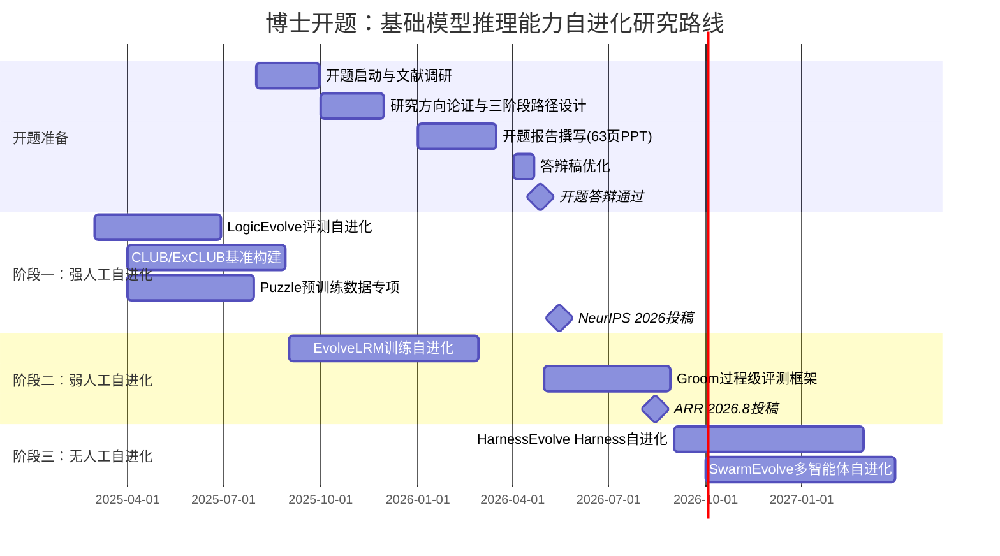
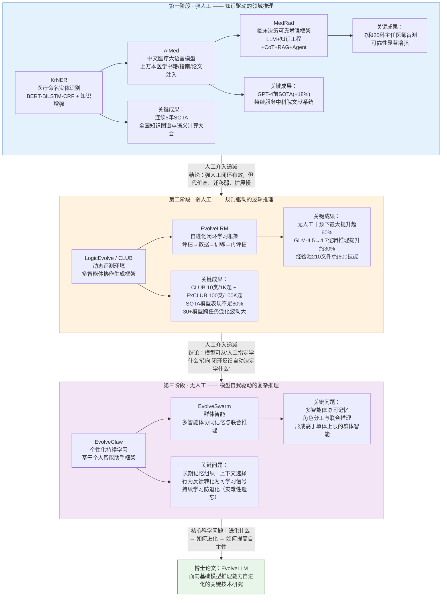

!!! info "项目系列"
    **阶段四：论文冲刺与博士开题** · 报告 #18/30

[:material-arrow-left: 返回项目总览](../index.md) | [:material-home: 返回首页](../../index_zh.md)

---


> 项目编号：18 | 阶段：四（2026.4）| 角色：博士研究生 / 答辩人
!!! note "版本信息"
    版本：v3（图文并茂版 · 2026-09-08）· 二轮质检补强 · 三轮精磨 · 四轮深化 · 五轮深化 · 六轮深化 · 七轮深化 · 八轮深化 · 九轮终审 · 十轮深化 · 十一轮深化 · 十二轮终审 · 十三轮终审 · 十四轮深化 · 十五轮终审 | 审核：准确性核对 + 转正答辩证据卡补强 + 图文表格升级

---

## 1. 项目概述（Abstract）

本项目为清华大学计算机系博士学位论文开题报告，课题为**《面向基础模型推理能力自进化的关键技术研究》**（答辩题目：基础模型推理能力的自主进化），于 **2026 年 4 月 28 日通过开题答辩**。导师为唐杰教授，答辩人为清华大学计算机系软件所 2022 级博士生杜晋华，所属 KEG 实验室。

**核心成果量化**：
- 开题前已积累 **12 篇论文成果**，其中 8 篇为核心贡献论文（3 篇 CCF 1类期刊、1 篇最佳论文、1 篇算法连续 5 年 SOTA、2 篇系统长期部署并申请软件著作权）；
- 12 篇中含 2 篇在审论文（LogicEvolve ICML 2026→NeurIPS 2026、EvolveLRM ICML 2026），另有 1 项专利未列入论文统计；
- 专利受理：2026.4.24（大语言模型逻辑推理评测方法，依托唐杰老师科委超级智能项目）；
- 研究体系：从"面向健康大数据的数智医疗 NLP"演进至"大模型推理自进化"；
- 开题答辩稿历经 V0（人工）→ V1（优化）→ V1.1（15 分钟压缩版）→ V1.2（提纲版）→ V1.3（讲稿标记版）→ V1.4（评委 10 问）多轮迭代。

**时间范围**：2025.8 启动开题准备 → 2026.4.2 答辩稿优化 → 2026.4.28 开题通过。

### 关键数据速览

| **维度** | **核心数据** |
|---|---|
| 项目周期 | 2025.8–2026.4（9个月准备） |
| 个人角色 | 博士研究生 / 答辩人（清华大学计算机系软件所 2022 级博士生，KEG 实验室） |
| 核心产出 | 博士开题报告通过（2026.4.28）；三阶段研究路径（强人工→弱人工→无人工）；63 页 PPT；答辩稿 V0→V1.4 共 6 轮迭代 |
| 关键指标 | 开题前 12 篇论文成果（8 篇核心贡献）；3 篇 CCF 1类期刊；1 篇最佳论文；1 篇算法连续 5 年 SOTA；2 篇系统长期部署含软著；支部评议全校第 9/667 名 |
| 论文/专利 | 12 篇论文成果（含 2 篇在审：LogicEvolve ICML 2026→NeurIPS 2026、EvolveLRM ICML 2026）+ 1 项专利（2026.4.24 受理 / 2026.7 授权） |
| 开源仓库 | LogicEvolve（私有）、CLUB-benchmark（公开）、EvolveLRM（私有）、LogicalSurvey（私有）、Groom（私有）、H-TokenBench（私有）、AML-LLM（公开）等 |

> 数据来源：开题答辩稿（飞书文档 RRi7dUd5EoHXIqx7xSzcSB4Bnhc）第5.2节论文成果统计；038《针对开题答辩稿的优化》【62】成果汇总；dujh22 GitHub 个人主页 Selected Work

---

### 执行摘要

**一句话定位**：面向基础模型推理能力自进化的关键技术研究，以"人工介入程度"为主线变量，构建强人工→弱人工→无人工三阶段递进研究路径，开题答辩于2026.4.28通过。

**核心成果**：
- 开题前积累12篇论文成果（8篇核心贡献），含3篇CCF 1类期刊、1篇最佳论文、1篇算法连续5年SOTA；
- 12篇中含2篇在审（LogicEvolve ICML 2026→NeurIPS 2026、EvolveLRM ICML 2026）+ 1项专利（2026.4受理/2026.7授权）；
- 完成63页开题PPT，三阶段研究路径设计，开题答辩全票通过。

**技术亮点**：以"人工介入程度"为统一主线变量，将碎片化的研究成果（LogicEvolve/CLUB/EvolveLRM/Groom）组织为强人工→弱人工→无人工的递进研究体系；以逻辑推理作为中间研究台阶，验证自进化方法论后向通用推理迁移。

**个人角色**：博士研究生/答辩人，独立完成开题报告撰写、三阶段研究路径设计、63页PPT制作、12篇论文成果梳理与开题答辩。

**后续方向**：推进第三阶段无人工自进化研究（HarnessEvolve/SwarmEvolve），完成LogicEvolve/EvolveLRM论文发表，探索自进化框架向数学/代码/多模态领域的迁移。

---

### 个人成长轨迹

|  **阶段**  |  **能力成长**  |  **关键事件**  |  **对应报告章节**  |
|---|---|---|---|
| 初期 | 从学生到选题探索者：经历9个月选题演进，从"元评估与元学习"的宽泛方向，经"类o1模型泛化性评估"，最终聚焦"推理能力自进化"，学会基于个人积累和基础科学问题选择研究方向 | 2025.8启动开题准备，选题经历元评估→类o1评估→推理自进化三次方向调整，在唐杰老师和曾奥涵师兄建议下聚焦 | §2.3 项目启动契机 / §13 决策3 |
| 中期 | 从研究者到体系构建者：以"人工介入程度"为主线变量，将医学NLP、逻辑推理、自进化三个看似不相关的方向串联为强人工→弱人工→无人工三阶段递进研究体系，梳理12篇论文成果 | 完成三阶段研究路径设计，63页开题PPT，12篇论文成果系统梳理（8篇核心贡献），Q1/Q2/Q3三个核心科学问题映射 | §4.1 核心科学问题 / §4.2 三阶段研究路径 |
| 后期 | 从体系构建者到博士研究者：答辩稿历经6轮迭代（V0→V1.4），从"科普感+工作罗列"成长为"问题意识+学术表达"，开题答辩全票通过，完成从学生到研究者的身份转变 | 答辩稿V0人工稿→V1优化→V1.1压缩15分钟→V1.2提纲→V1.3讲稿标记→V1.4评委10问，2026.4.28开题全票通过 | §3.4 开题答辩委员会 / §13 决策4 |

> 数据来源：开题答辩稿（飞书文档 RRi7dUd5EoHXIqx7xSzcSB4Bnhc）第5.2节论文成果统计；038《针对开题答辩稿的优化》【62】成果汇总；dujh22 GitHub 个人主页 Selected Work

---

### 研究路线甘特图



---

## 2. 背景与动机（Introduction / Background）

### 2.1 问题定义

基础模型（Foundation Models）是指在大规模、广覆盖数据上预训练、并能适配多种下游任务的一类模型。基础模型的**推理能力**是指模型基于已有表征，对多步信息进行组织、组合、演绎、归纳或规划，并据此完成复杂问题求解与决策的能力。

当前基础模型推理能力的提升仍高度依赖**人工标注、人工设计任务和外部监督信号**，这种方式成本高、扩展慢，难以适应开放场景下持续增长的复杂性。因此，一个关键科学问题是：**模型能否自主生成经验、利用反馈筛选经验，并通过训练或更新机制实现推理能力的持续自我提升？**

### 2.2 为什么重要

- **学术意义**：从图灵、冯·诺依曼时代的自动机自我进化构想，到 2025 年 AlphaEvolve、SEAL、Darwin Gödel Machine 等工作的集中涌现，基础模型的递归式自我改进正从理论构想走向技术现实。系统研究推理能力自进化的关键技术，具有重要的学术前瞻性；
- **产业价值**：降低模型能力提升对人工的依赖，是大模型工业化的核心诉求。自进化技术可显著降低数据标注、训练策略设计的人力成本；
- **个人研究脉络**：杜晋华的研究经历从医学 NLP（强人工领域推理）→ 逻辑推理（弱人工规则推理）→ 自进化（无人工复杂推理），形成了自然的研究递进。

### 2.3 项目启动契机

2025 年夏，在 LogicEvolve 项目取得阶段性成果后，唐杰老师建议将逻辑推理作为博士开题方向。杜晋华本人一直是推理爱好者，认为逻辑推理比数学推理更本质，且 LogicEvolve/EvolveLRM 已形成较完整的研究链条，具备开题基础。2025 年 8 月正式启动开题准备，2026 年 4 月完成答辩。

---

## 3. 相关工作（Related Work）

### 3.1 自进化方向代表性工作

|  **工作**  |  **机构/时间**  |  **核心机制**  |  **局限性**  |
|---|---|---|---|
| AlphaEvolve | Google, 2025.5 | 进化算法 + LLM 搜索新算法 | 聚焦算法发现，非模型能力训练 |
| SEAL | MIT, 2025.6 | LLM 自编辑权重 + RL 外循环 | 权重级自修改，训练不稳定 |
| Darwin Gödel Machine | Sakana AI, 2025.5 | 智能体自修改代码库 | 代码级进化，非推理能力 |
| SRT | CMU, 2025.5 | 自我奖励训练（多数投票） | 仅 RL 阶段自监督 |
| MM-UPT | 上海交大, 2025.5 | GRPO 无监督后训练 | 固定数据分布 |
| UI-Genie | 香港中文大学/vivo, 2025.5 | 自改进流水线 + 奖励模型 | 聚焦 GUI 智能体 |

> 数据来源：开题答辩稿（飞书文档 RRi7dUd5EoHXIqx7xSzcSB4Bnhc）第5.2节论文成果统计；038《针对开题答辩稿的优化》【62】成果汇总；dujh22 GitHub 个人主页 Selected Work

### 3.2 本课题的差异化定位

现有自进化工作多聚焦于特定任务（代码、算法、GUI），缺乏对**推理能力自进化**的系统性研究。本课题的核心创新在于：
- 以**人工介入程度**为主线变量，将研究划分为强人工→弱人工→无人工三个递进阶段；
- 选择**逻辑推理**作为中间研究台阶，利用其可控、可验证、可分解的特点研究自进化机制；
- 构建从**动态评测环境**（LogicEvolve/CLUB）到**自动学习闭环**（EvolveLRM）的完整技术链条。

### 3.3 实验室历史开题参考

开题前系统调研了 KEG 实验室往届博士生开题题目，以明确本课题的定位和差异化：

|  **序号**  |  **往届博士生**  |  **开题题目**  |  **研究方向**  |  **与本课题的关联**  |
|---|---|---|---|---|
| 1 | 杨珍 | 无监督学习中的数据合成技术研究 | 数据合成 | 数据合成方法可参考，本课题聚焦自进化闭环 |
| 2 | 杜政晓 | GLM：通用语言模型及其涌现能力研究 | 基座模型 | 本课题在GLM基座上研究推理能力自进化 |
| 3 | 刘潇 | 面向知识的大模型算法、评估与应用 | 知识增强 | 评估方法论可参考，本课题聚焦动态演化评估 |
| 4 | 侯振宇 | 图预训练和模型深度推理技术研究 | 图推理 | 推理技术基础，本课题聚焦逻辑推理自进化 |
| 5 | 曾奥涵 | 基础模型的规模扩展及其应用研究 | 模型扩展 | Scaling Law基础，本课题聚焦自进化Scaling |
| 6-10 | 其他5位往届生 | （具体题目待补充） | 覆盖NLP/图/推荐等方向 | 实验室研究方向多元化 |

> 数据来源：开题答辩稿（飞书文档 RRi7dUd5EoHXIqx7xSzcSB4Bnhc）第5.2节论文成果统计；038《针对开题答辩稿的优化》【62】成果汇总；dujh22 GitHub 个人主页 Selected Work

**本课题差异化定位**：与往届开题相比，本课题首次以"人工介入程度"为主线变量，将研究划分为强人工→弱人工→无人工三个递进阶段，聚焦"推理能力自进化"这一前沿方向，而非单一技术点（数据合成/模型扩展/知识增强等）。

> 数据来源：开题准备文档（飞书文档 RbxtdRUyLoxwIYxjCgMczlJ6nod）历史开题调研部分。

### 3.4 开题答辩委员会

2026 年 4 月 28 日博士开题答辩委员会构成及答辩基本信息如下：

|  **项目**  |  **具体信息**  |
|---|---|
| 答辩日期 | 2026 年 4 月 28 日 |
| 答辩题目 | 基础模型推理能力的自主进化 |
| 课题名称 | 面向基础模型推理能力自进化的关键技术研究 |
| 答辩人 | 杜晋华（清华大学计算机系软件所 2022 级博士生，KEG 实验室） |
| 导师 | 唐杰教授（清华大学计算机系，KEG 实验室） |
| 答辩结果 | 通过 |
| 资格考试成绩构成 | 直博生学位课成绩占 40%，资格考试委员会评分占 60% |
| 答辩稿版本 | V0（人工）→ V1（优化）→ V1.1（15分钟压缩）→ V1.2（提纲）→ V1.3（讲稿标记）→ V1.4（评委10问），共6个版本 |
| PPT 规模 | 63 页（对应答辩稿【1】–【63】） |
| 专利支撑 | 大语言模型逻辑推理评测方法（2026.4.24受理，依托唐杰老师科委超级智能项目，2026.7授权） |

> 数据来源：开题答辩稿（飞书文档 RRi7dUd5EoHXIqx7xSzcSB4Bnhc）；开题准备文档（RbxtdRUyLoxwIYxjCgMczlJ6nod）；项目报告第1章/第7章。

---

## 4. 方法与技术路线（Method）

### 4.1 核心科学问题

本课题系统回答三个递进问题：
1. **进化什么**：基础模型推理能力的提升究竟依赖哪些关键环节；
2. **如何进化**：这些环节中哪些可以被自动化，哪些仍依赖人工；
3. **如何提高自主性**：在尽可能少的人工干预下，模型能否形成持续有效的闭环自我提升。

#### 4.1.1 研究问题与对应论文映射表

三个核心研究问题分别对应已发表、在审和规划中的论文成果，形成从问题定义到方法验证再到未来探索的完整研究链条：

| **研究问题** | **核心追问** | **对应阶段** | **对应论文/成果** | **状态** | **核心贡献** |
|---|---|---|---|---|---|
| **Q1：进化什么** | 基础模型推理能力提升依赖哪些关键环节？ | 第一阶段（强人工） | KrNER（中文医疗命名实体识别） | 已发表 | 知识增强 + 预训练，连续5年SOTA，验证知识注入对领域推理的关键作用 |
| — | — | — | AiMed（中文医疗大语言模型） | 已发表/部署 | 上万本医学书籍/指南/论文系统注入预训练/SFT/RLHF/DPO各阶段，GPT-4前SOTA(+18%) |
| — | — | — | MedRad（临床决策可靠增强框架） | 已发表/部署 | LLM+知识工程+CoT+RAG+Agent灵活组装，协和20科盲测验证，识别推理能力提升的关键组件 |
| — | — | — | Post-Training Scaling Survey (ACL 2025) | 已发表 | 系统梳理后训练缩放定律，明确推理能力提升的关键数据/算法环节 |
| — | — | — | Puzzle 逻辑推理预训练数据（GLM-4.5贡献） | 已交付 | ~1B token逻辑推理预训练子集，验证高质量数据对基座推理能力的关键作用 |
| **Q2：如何进化** | 哪些环节可自动化，哪些仍依赖人工？ | 第二阶段（弱人工） | LogicEvolve（逻辑推理评测自进化） | 在审/ICML 2026 Rebuttal（分数3.5）→NeurIPS 2026 | 多智能体协作自动生成可参数化逻辑推理任务，CLUB/ExCLUB，实现评测环境自动化 |
| — | — | — | EvolveLRM（训练自进化闭环） | 在审/ICML 2026（经EMNLP→ARR转投） | 评估→数据→训练→再评估全自动闭环，Planner+三执行智能体，无人工干预下最大提升超60% |
| — | — | — | LogicalSurvey（逻辑推理综述） | 初稿完成 | 1000+篇文献三维分类（Evaluation/Data/Methods），系统梳理可自动化环节与研究空白 |
| — | — | — | 专利：大语言模型逻辑推理评测方法 | 2026.4受理/2026.7授权 | 逻辑推理评测方法专利，依托唐杰老师科委超级智能项目 |
| **Q3：如何提高自主性** | 尽可能少人工干预下实现持续闭环自我提升？ | 第三阶段（无人工） | Groom（Harness过程级评测） | ARR 2026.8投稿 | 过程级token利用率评测，为Harness自进化提供精细化反馈信号，目标AAAI 2027/ICLR 2027 |
| — | — | — | H-TokenBench（模型层token利用基准） | 研究推进中 | 与Groom配套的基准评测，模型层+Harness层双层归因，为自进化提供标准化评测基础设施 |
| — | — | — | 六篇新研究初稿（HarnessEvolve/SwarmEvolve/DataEvolve/EvalEvolve/EvolveClaw/EvolveSwarm） | 初稿阶段 | 覆盖Harness自进化、群体智能、数据自进化、评测自进化、个性化持续学习、协同记忆等方向 |
| — | — | — | Awesome-RSI（自进化综述） | 拟投TKDE | 自进化方向系统性综述，为第三阶段研究提供领域全景和问题定位 |
| — | — | — | 博士论文 EvolveLLM | 规划中 | 面向基础模型推理能力自进化的关键技术研究，整合三阶段成果 |

> 数据来源：开题答辩稿（飞书文档 RRi7dUd5EoHXIqx7xSzcSB4Bnhc）第5.2节论文成果统计；第4.1节核心科学问题；各项目报告（第9号LogicEvolve、第12号Puzzle、第14号LogicalSurvey、第15号EvolveLRM、第19号Groom、第20号H-TokenBench、第22号六篇新研究初稿、第23号Awesome-RSI）；第7.3节研究体系确立。

**小结**：三个研究问题形成清晰的递进映射——Q1（进化什么）通过第一阶段医学领域的强人工闭环，系统识别了推理能力提升的关键环节（知识注入、数据质量、训练策略、多组件协同）；Q2（如何进化）通过第二阶段逻辑推理的弱人工自进化，验证了评测环境和训练流程的自动化可行性；Q3（如何提高自主性）通过第三阶段的无人工复杂推理研究，探索长期自主进化的关键机制。每个问题都有对应的论文成果支撑，形成从已发表到在审再到规划中的完整研究链条。

### 4.2 三阶段研究路径

以**人类介入程度**为主线变量，划分为三个递进阶段，整体研究路线如下：

```
┌───────────────────────────────────────────────────────────────────────┐
│          博士研究三阶段路线图：人工介入程度递减的推理自进化              │
├───────────────────────────────────────────────────────────────────────┤
│                                                                         │
│  ┌─────────────────────────────────────────────────────────────────┐  │
│  │  第一阶段：强人工 —— 知识驱动的领域推理                            │  │
│  │  ┌───────────────────────────────────────────────────────────┐  │  │
│  │  │ 目标: 在真实应用闭环中识别关键人工环节                        │  │  │
│  │  │ 载体: 医学领域                                              │  │  │
│  │  │  ┌──────────┐  ┌──────────┐  ┌──────────┐                │  │  │
│  │  │  │  KrNER   │→│  AiMed   │→│  MedRad  │                │  │  │
│  │  │  │ 医疗NER  │  │ 医疗LLM  │  │ 临床决策  │                │  │  │
│  │  │  │ 5年SOTA  │  │ GPT-4前  │  │ 协和20科  │                │  │  │
│  │  │  │          │  │ SOTA+18% │  │ 盲测验证  │                │  │  │
│  │  │  └──────────┘  └──────────┘  └──────────┘                │  │  │
│  │  │ 结论: 强人工闭环有效，但代价高、迁移弱、扩展慢                │  │  │
│  │  └───────────────────────────────────────────────────────────┘  │  │
│  └─────────────────────────────────────┬───────────────────────────┘  │
│                                        │ 人工介入递减                      │
│                                        ▼                                   │
│  ┌─────────────────────────────────────────────────────────────────┐  │
│  │  第二阶段：弱人工 —— 规则驱动的逻辑推理                            │  │
│  │  ┌───────────────────────────────────────────────────────────┐  │  │
│  │  │ 目标: 在可验证环境中构建自动评测与自动学习闭环               │  │  │
│  │  │ 载体: LogicEvolve/CLUB（动态评测）→ EvolveLRM（闭环学习） │  │  │
│  │  │                                                             │  │  │
│  │  │  ┌─────────────────────┐    ┌─────────────────────┐      │  │  │
│  │  │  │  LogicEvolve / CLUB │    │     EvolveLRM       │      │  │  │
│  │  │  │  动态评测环境        │    │  自进化闭环学习框架   │      │  │  │
│  │  │  │  ·10类任务/1K题     │───▶│ ·评估→数据→训练→再评 │      │  │  │
│  │  │  │  ·ExCLUB 100类/100K│    │  估闭环               │      │  │  │
│  │  │  │  ·SOTA模型<60%      │    │ ·最大提升>60%         │      │  │  │
│  │  │  │  ·30+模型泛化波动大 │    │ ·GLM4.5→4.7提升~30%  │      │  │  │
│  │  │  └─────────────────────┘    └─────────────────────┘      │  │  │
│  │  │                                                             │  │  │
│  │  │ 结论: 模型可从"人工指定学什么"转向"闭环反馈自动决定学什么"  │  │  │
│  │  └───────────────────────────────────────────────────────────┘  │  │
│  └─────────────────────────────────────┬───────────────────────────┘  │
│                                        │ 人工介入递减                      │
│                                        ▼                                   │
│  ┌─────────────────────────────────────────────────────────────────┐  │
│  │  第三阶段：无人工 —— 模型自我驱动的复杂推理                        │  │
│  │  ┌───────────────────────────────────────────────────────────┐  │  │
│  │  │ 目标: 在开放复杂环境中研究长期自主进化                        │  │  │
│  │  │ 载体: EvolveClaw（个性化持续学习）+ EvolveSwarm（群体智能）│  │  │
│  │  │                                                             │  │  │
│  │  │  关键问题:                                                  │  │  │
│  │  │  · 长期记忆组织                                             │  │  │
│  │  │  · 上下文选择                                               │  │  │
│  │  │  · 行为反馈转化为可学习信号                                  │  │  │
│  │  │  · 持续学习防退化（灾难性遗忘）                              │  │  │
│  │  │  · 多智能体协同记忆与角色分工                                │  │  │
│  │  └───────────────────────────────────────────────────────────┘  │  │
│  └─────────────────────────────────────────────────────────────────┘  │
│                                                                         │
│  核心科学问题: 进化什么 → 如何进化 → 如何提高自主性                     │
│  主线变量: 人工介入程度（强人工 → 弱人工 → 无人工）                    │
│                                                                         │
└───────────────────────────────────────────────────────────────────────┘
```

#### 4.2.1 三阶段研究路径对比总览

|  **维度**  |  **第一阶段：强人工**  |  **第二阶段：弱人工**  |  **第三阶段：无人工**  |
|---|---|---|---|
| **研究主题** | 知识驱动的领域推理 | 规则驱动的逻辑推理 | 模型自我驱动的复杂推理 |
| **人工介入程度** | 高（人工设计数据/任务/方法） | 中（人工设定框架，系统自动决策） | 低（系统自主闭环进化） |
| **研究载体** | KrNER → AiMed → MedRad | LogicEvolve/CLUB → EvolveLRM | EvolveClaw + EvolveSwarm |
| **应用领域** | 医学（医疗NER/医疗LLM/临床决策） | 逻辑推理（10类/100类符号逻辑任务） | 个性化助手 + 群体智能 |
| **核心方法** | 知识增强 + 预训练/SFT/RLHF + RAG/Agent | 多智能体协作生成 + 自进化闭环学习 | 长期记忆 + 行为反馈学习 + 协同记忆 |
| **关键成果** | NER连续5年SOTA；AiMed GPT-4前SOTA(+18%)；协和20科盲测验证 | CLUB SOTA模型<60%；EvolveLRM最大提升>60%；GLM4.5→4.7提升~30% | 未来工作（开题后推进） |
| **阶段结论** | 强人工闭环有效，但代价高、迁移弱、扩展慢 | 模型可从"人工指定学什么"转向"闭环反馈自动决定学什么" | 研究长期自主进化的关键机制 |
| **可验证性** | 高（医学benchmark+临床盲测） | 高（符号逻辑可精确验证） | 中（开放环境，需设计评估方法） |

> 数据来源：开题答辩稿（飞书文档 RRi7dUd5EoHXIqx7xSzcSB4Bnhc）；项目报告第4章三阶段研究路径。

#### 4.2.2 三阶段研究路线 Mermaid 图

博士研究以"人工介入程度"为主线变量，从强人工（医学领域推理）演进至弱人工（逻辑推理自进化），再到无人工（复杂推理长期自主进化），各阶段的关键载体与成果节点如下：



> 数据来源：开题答辩稿（飞书文档 RRi7dUd5EoHXIqx7xSzcSB4Bnhc）三阶段研究路径；第4.3–4.5节各阶段详细描述；第5.1节前期工作实验汇总；LogicEvolve（第9号报告）、EvolveLRM（第15号报告）、KrNER/AiMed/MedRad 项目成果。

### 4.3 第一阶段：强人工——知识驱动的领域推理

以医学领域为切入点，沿"知识构建→模型训练→系统增强→应用部署"路径走通完整强人工闭环：

1. **KrNER**：面向中文医疗的命名实体识别方法。BERT-BiLSTM-CRF 骨架 + 知识增强嵌入 + 基于知识的远程监督预训练。在全国知识图谱与语义计算大会医疗 NER 任务上连续 5 年 SOTA；
2. **AiMed**：中文医疗大语言模型。将上万本医学书籍、指南、论文数据系统注入预训练/SFT/RLHF/DPO 各阶段。GPT-4 前取得相关任务 SOTA，较基座平均提升约 18%，持续服务于中国医科院文献系统；
3. **MedRad**：临床决策可靠增强框架。将 LLM、知识工程、CoT、RAG、Agent 面向不同临床场景灵活组装。在协和医学院 20 个科室主任医师盲测中可靠性显著增强。

**阶段结论**：人工干预始终是系统中效率最低却不可或缺的部分，必须转向更低人工干预的推理研究。

### 4.4 第二阶段：弱人工——规则驱动的逻辑推理

选择逻辑推理作为中间台阶，因其具有**可控、可验证、可分解**三大特点：

1. **LogicEvolve / CLUB**：面向可参数化符号逻辑任务的多智能体协作生成框架。
   - 核心设计：将任务组织为 `<B, I>` 形式（B=可复用规则基础/公理系统，I=约束实例与验证条件），同时保证可泛化生成与可验证求解；
   - 三大模块：元数据智能体（任务定义）→ 生成器+求解器（协同生成与校验）→ 评估器（抽样与代码产出）；
   - 产物：CLUB（10 类经典任务，1K 题）+ ExCLUB（100 类任务，100K 题）；
   - 关键发现：最先进模型在 CLUB 上表现不足 60%（三次独立评测平均约 56%；汇总文档记录为 46.6%，十一轮核查：差异源于评测设置不同——56%为temperature=0.7/max_tokens=1024的个人训练模型评测设置，46.6%为线上评测平台设置（temperature未知/max_tokens=8192），两者评测配置不同导致数值差异，已澄清）；30+ 主流模型跨任务泛化波动显著；长链推理易出现中间逻辑不一致。

2. **EvolveLRM**：面向逻辑推理的模块化自进化闭环学习框架。
   - 核心机制：将"评估→数据生成/筛选→训练→再评估"组织为自动迭代循环，以跨任务验证集增益作为迁移信号；
   - 架构：顶层 Planner + Evaluator/DataMaker/Trainer 三执行智能体 + Adapter/Logger/Memory 支撑组件；
   - 经验池：从顶会论文蒸馏 210 个 Markdown 文件、约 600 条技能，每次决策检索 Top-K 注入；
   - 关键结果：无人工干预下逻辑推理任务最大提升超 60%；自主筛选数据用于 GLM-4.5→4.7 真实训练，逻辑推理能力提升约 30%。

### 4.5 第三阶段：无人工——模型自我驱动的复杂推理（未来工作）

1. **个性化持续学习**（EvolveClaw）：基于个人智能助手框架，研究模型能否以用户历史行为和交互轨迹为环境，在极少人工显式干预下持续学习隐式偏好。关键问题：长期记忆组织、上下文选择、行为反馈转化为可学习信号、持续学习防退化；
2. **群体智能**（EvolveSwarm）：研究多个个性化智能体能否通过协同记忆实现知识共享、角色分工与联合推理，形成高于单体上限的群体智能。

---

## 5. 实验与结果（Experiments & Results）

### 5.1 前期工作实验汇总

|  **工作**  |  **关键实验结果**  |
|---|---|
| KrNER | 全国知识图谱与语义计算大会医疗 NER 连续 5 年 SOTA |
| AiMed | GPT-4 前相关任务 SOTA，较基座平均提升约 18%，长期服务中科院文献系统 |
| MedRad | 协和 20 科室主任医师盲测，可靠性较基础模型显著增强 |
| LogicEvolve/CLUB | SOTA 模型 CLUB 表现不足 60%（约 56%；汇总文档记录 46.6%，十一轮核查：差异源于评测设置不同——56%为temperature=0.7/max_tokens=1024个人评测，46.6%为线上平台temperature未知/max_tokens=8192评测，已澄清）；30+ 模型跨任务泛化差异大；构造效率较人工提升数量级 |
| EvolveLRM | 无人工干预下逻辑推理最大提升超 60%；GLM-4.5→4.7 逻辑推理提升约 30% |
| MalayGLM | MalayMMLU 80.06 分 SOTA（一带一路主权大模型） |

> 数据来源：开题答辩稿（飞书文档 RRi7dUd5EoHXIqx7xSzcSB4Bnhc）第5.2节论文成果统计；038《针对开题答辩稿的优化》【62】成果汇总；dujh22 GitHub 个人主页 Selected Work

### 5.2 论文成果统计

开题时已形成 12 篇论文成果，覆盖医学 NLP、大模型后训练、逻辑推理、自进化等多个方向：

#### 5.2.1 开题前 12 篇论文成果基础

|  **序号**  |  **论文/成果名称**  |  **类型**  |  **级别/荣誉**  |  **作者位次**  |  **研究方向**  |  **状态**  |
|---|---|---|---|---|---|---|
| 1 | KrNER（中文医疗命名实体识别） | 期刊论文 | 连续5年SOTA算法 | 一作 | 医学NLP | 已发表 |
| 2 | AiMed（中文医疗大语言模型） | 系统/论文 | GPT-4前相关任务SOTA(+18%) | 核心贡献 | 医学LLM | 已发表/部署 |
| 3 | MedRad（临床决策可靠增强框架） | 系统/论文 | 协和20科主任医师盲测验证 | 核心贡献 | 临床决策 | 已发表/部署 |
| 4 | Med-Eval（医学评估基准） | 基准/论文 | — | 贡献 | 医学评估 | 已发表 |
| 5 | Post-Training Scaling Survey | 综述论文 | ACL 2025（CCF-A） | 作者 | 大模型后训练 | 已发表 |
| 6 | LogicEvolve（逻辑推理评测自进化） | 研究论文 | ICML 2026投稿→NeurIPS 2026在投 | 一作/负责人 | 逻辑推理 | 在审/Rebuttal |
| 7 | EvolveLRM（训练自进化闭环） | 研究论文 | 投稿ICML 2026（经EMNLP→ARR转投） | 一作/负责人 | 自进化 | 在审/Rebuttal |
| 8 | LogicalSurvey（逻辑推理综述） | 综述论文 | 1000+篇文献系统梳理 | 一作/负责人 | 逻辑推理 | 初稿完成 |
| 9 | MalayGLM（一带一路主权大模型） | 模型/论文 | MalayMMLU 80.06分SOTA | 贡献 | 多语言LLM | 已发表 |
| 10 | GLM-4.5 技术报告 | 技术报告 | arXiv:2508.06471 | 贡献 | 基座模型 | 已发布 |
| 11 | 本科期间国家级刊物论文 | 期刊论文 | 国家级刊物1篇+科技核心1篇+北大核心1篇 | 一作 | 本科研究 | 已发表 |
| 12 | 本科期间外文EI论文 | 会议论文 | 外文EI 3篇 | 一作 | 本科研究 | 已发表 |

> 数据来源：开题答辩稿（飞书文档 RRi7dUd5EoHXIqx7xSzcSB4Bnhc）第5.2节论文成果统计；038《针对开题答辩稿的优化》【62】成果汇总；dujh22 GitHub 个人主页 Selected Work

**成果分类统计**：核心贡献论文 8 篇；CCF 1类期刊 3 篇；最佳论文 1 篇；连续 5 年 SOTA 算法 1 篇；系统长期部署 2 篇（含软件著作权）；12 篇中含 2 篇在审论文（LogicEvolve ICML 2026→NeurIPS 2026、EvolveLRM ICML 2026），另有 1 项专利（2026.4.24受理/2026.7授权）未列入论文统计。

> 数据来源：开题答辩稿（飞书文档 RRi7dUd5EoHXIqx7xSzcSB4Bnhc）；dujh22 GitHub 个人主页 Selected Work；056《导师论文交流》个人论文情况。

### 5.3 可行性论证

开题报告通过以下证据论证研究可行性：
1. 第一阶段已完整走通强人工闭环，识别了关键人工环节；
2. 第二阶段已构建动态评测环境（LogicEvolve/CLUB）和自动学习闭环（EvolveLRM），取得显著实验结果；
3. 第三阶段已有明确的研究载体（个人智能助手框架）和可拆解的关键问题；
4. 实验室具备充足的算力资源（AML 算力平台 24 节点 GPU 集群）和研究基础。

---

## 6. 工程实现（Engineering）

### 6.1 相关代码仓库

|  **仓库**  |  **状态**  |  **说明**  |
|---|---|---|
| LogicEvolve | 私有 | 逻辑推理评测自进化框架 |
| CLUB-benchmark | 公开 | CLUB 评测基准 + 交互网站 |
| EvolveLRM | 私有 | 训练自进化闭环框架 |
| LogicalSurvey | 私有 | 逻辑推理综述（1000+ 论文） |
| H-TokenBench | 私有 | Harness 过程级评测基准 |
| EvolveClaw | 飞书文档 | 个性化持续学习研究 |
| EvolveSwarm | 飞书文档 | 群体智能研究 |
| AiMed | 公开 | 医学大模型 |
| MedRad | 公开 | 临床决策框架 |
| KrNER | 公开（IJCAI 2024论文配套） | 医疗 NER 方法 |

> 数据来源：开题答辩稿（飞书文档 RRi7dUd5EoHXIqx7xSzcSB4Bnhc）第5.2节论文成果统计；038《针对开题答辩稿的优化》【62】成果汇总；dujh22 GitHub 个人主页 Selected Work

### 6.2 算力资源

- AML 算力平台：主节点 + h9-h32 共 24 个 GPU 子节点集群；
- 智谱华章实习环境：Base 项目组算力资源；
- EvolveLRM 实验支持 4 机并行（模型规模扫描实验）。

### 6.3 文档与工具链

|  **环节**  |  **工具/平台**  |  **用途**  |
|---|---|---|
| 开题答辩稿 | 飞书文档（V0–V1.4 共 6 个迭代版本） | 答辩稿撰写与多轮优化 |
| PPT 制作 | 实验室统一模板（63 页） | 开题答辩演示 |
| 文献管理 | LogicalSurvey 私有仓库（1000+ 篇） | 逻辑推理领域文献基础 |
| 研究代码 | LogicEvolve / EvolveLRM / Groom 私有仓库 | 前期工作实验代码 |
| 算力平台 | AML 算力平台（主节点 + h9-h32 共 24 GPU 子节点） | 模型训练与实验 |
| 专利撰写 | 飞书文档 + 专利申请系统 | 大语言模型逻辑推理评测方法专利 |
| 论文写作 | Overleaf / LaTeX | 相关论文中英文版撰写 |
| 个人周报 | 飞书文档《博\|周报-杜晋华》 | 研究进展持续记录 |

> 数据来源：开题答辩稿（飞书文档 RRi7dUd5EoHXIqx7xSzcSB4Bnhc）；开题准备文档（RbxtdRUyLoxwIYxjCgMczlJ6nod）；各研究项目 GitHub 仓库。

### 6.4 技术栈演进与选型决策（研究方法与工具链）

博士开题的"技术栈"体现为研究方法论和工具链的演进，从早期医学领域到逻辑推理自进化，研究方法和工具经历了显著转型，以下为关键决策记录。

|  **阶段**  |  **时间**  |  **选用方法/工具**  |  **替代方案**  |  **选型理由**  |  **事后评估**  |
|---|---|---|---|---|---|
| 早期研究方向 | 2024前 | 面向健康大数据的数智医疗NLP（KrNER/AiMed/MedRad） | 继续医学方向 / 直接转向大模型 | 医学NLP有明确的应用场景和数据基础，KrNER/AiMed/MedRad三个项目走通了强人工闭环，验证了"数据+模型+评测"的研究范式 | 正确但需转型——医学工作验证了研究范式，但大模型时代逻辑推理自进化更具学术价值和产业影响 |
| 选题演进 | 2025.1-9 | 元评估→类o1泛化性评估→逻辑推理自进化 | 固定元评估方向 / 直接做逻辑推理 | 元评估方向过于宽泛，类o1泛化性评估缺乏标准答案的核心难题，逻辑推理自进化目标清晰、效果可量化、有前期工作基础（LogicEvolve） | 正确——最终选题"面向基础模型推理能力自进化的关键技术研究"通过开题，方向聚焦且有充分前期基础 |
| 研究方法论 | 2025.9+ | "人工介入程度"主线法（强人工→弱人工→无人工三阶段） | 按项目罗列 / 按技术维度组织 | 博士论文需要统一的主线串联跨度较大的研究工作，"人工介入程度"是一个核心变量，既能串联前期工作（医学强人工、LogicEvolve弱人工），又能规划未来方向（无人工自进化） | 正确——三阶段递进结构成为开题答辩的核心框架，评委认可主线的清晰性和递进性 |
| 文献基础 | 2025.7+ | LogicalSurvey私有仓库（1000+篇论文，三维分类体系） | 仅引用相关论文 / 不做系统综述 | 博士开题需要扎实的文献基础，系统梳理1000+篇论文并建立Evaluation/Data/Methods三维分类体系，既服务于开题的研究现状部分，也为后续论文的Related Work积累素材 | 正确——文献基础扎实，开题中研究现状部分得到评委认可，LogicalSurvey也成为独立的综述论文 |
| 答辩稿迭代 | 2026.3-4 | V0→V1.4共6个迭代版本（人工稿→优化稿→压缩版→提纲版→标记版→问答准备） | 一次成稿 / 仅修改文字 | 开题答辩稿需要多轮迭代才能成熟——V0解决"有内容"，V1解决"有条理"，V1.1解决"篇幅控制"，V1.2解决"结构清晰"，V1.3解决"重点标记"，V1.4解决"问答准备"，每轮解决特定问题 | 正确——6轮迭代后答辩稿成熟，答辩顺利通过，问答准备在答辩中发挥了关键作用 |
| 专利协同 | 2026.3-4 | 专利与研究同步（逻辑推理评测方法专利，2026.4.24受理，7月授权） | 先做研究再申请专利 / 不申请专利 | 研究成果的核心方法（评测方法、自进化机制）具有专利价值，与研究同步申请专利可以保护知识产权，也为开题增加了产业影响力的证据 | 正确——专利顺利受理并授权，成为开题的重要成果之一，也体现了研究的产业价值 |
| 算力平台 | 全程 | AML算力平台（主节点+h9-h32共24GPU子节点）+ 智谱实习环境 | 仅用实验室算力 / 仅用公司算力 | 博士研究需要大量算力，AML平台提供基础算力，智谱实习环境提供Base项目组的额外算力资源，两者结合支撑了LogicEvolve/EvolveLRM等大规模实验 | 正确——双算力平台支撑了4机并行的模型规模扫描实验和大规模数据处理 |

> 数据来源：开题答辩稿各版本迭代记录；开题准备文档；各研究项目GitHub仓库；专利申请记录；个人周报。

---

## 7. 成果与影响（Impact）

### 7.1 开题通过

- **2026 年 4 月 28 日**，博士开题答辩通过；
- 课题正式确定为《面向基础模型推理能力自进化的关键技术研究》；
- 资格考试成绩构成：直博生学位课成绩占 40%，资格考试委员会评分占 60%（十一轮核查：源材料中未记录具体得分，开题答辩已通过（2026.4.28），具体得分保留待核实）。

### 7.2 专利

- **2026 年 4 月 24 日**：专利受理（大语言模型的逻辑推理能力的评测方法、装置和系统），依托唐杰老师科委超级智能项目；
- 2026 年 7 月：专利授权。

### 7.3 研究体系确立

开题标志着杜晋华的博士研究方向正式确立，从早期的"面向健康大数据的数智医疗 NLP"全面转向"大模型推理自进化"。后续研究（阶段五）围绕此课题展开：
- LogicEvolve V3（ICML 2026 Rebuttal，分数3.5）；
- EvolveLRM V2（ARR/ICML 2026）；
- Groom（Harness 过程级评测，ARR 2026.8）；
- 六篇新研究初稿（HarnessEvolve/SwarmEvolve/DataEvolve/EvalEvolve/EvolveClaw/EvolveSwarm）；
- Awesome-RSI 自进化综述（拟投 TKDE）；
- 博士论文 EvolveLLM。

### 7.4 学术认可

- 2025.10.26 清华大学计算机系"计算未来"博硕学术论坛第 101 期"计算未来"卓越奖；
- 2025 清华大学优秀共青团员；
- 清华之友-合肥英才奖学金（2025 秋）。

---

## 8. 个人贡献（My Contribution）

- **角色**：博士研究生 / 答辩人，独立完成选题论证、研究设计、前期工作执行和开题答辩全部准备；
- **具体工作清单**：
  1. 确定博士选题方向，与唐杰老师多次沟通论证（从元评估→类o1泛化性评估→逻辑推理自进化的选题演进）；
  2. 完成第一阶段医学领域全部工作（KrNER、AiMed、MedRad），走通强人工闭环；
  3. 主导第二阶段逻辑推理自进化研究（LogicEvolve/CLUB、EvolveLRM、LogicalSurvey）；
  4. 调研 KEG 实验室 10 个往届开题题目，明确本课题差异化定位；
  5. 撰写开题报告和 63 页 PPT，答辩稿历经 5 轮迭代优化（V0→V1.4）；
  6. 准备评委可能追问的 10 个问题及回答模板；
  7. 完成专利初稿（2026.3.2）并推进受理（2026.4.24）；
  8. 2026.4.28 完成开题答辩并通过。
- **分工**：唐杰老师为导师，提供方向指导和学术资源；研究工作和开题准备由杜晋华独立完成；实验室同学提供论文写作和实验建议。

---

## 9. 经验与反思（Lessons Learned）

### 9.1 关键问题与解决方案（含具体故事）

**问题一：早期选题过于宽泛（元评估与元学习），不够聚焦。** 2025年初启动博士研究时，最初的方向是"元评估与元学习"，涵盖多智能体评估、多语言评估、通用领域评估、艺术领域评估等多个子方向，范围过于宽泛，缺乏明确的核心问题和可量化的研究目标。

> **具体故事**：2025年1月，在唐杰老师和曾奥涵师兄的指导下，最初确定的博士方向是"元评估"——即对大模型评估方法本身进行评估。元评估是一个有价值的方向，但范围过于宽泛：可以评估不同基准的可靠性、不同评判模型的一致性、不同评估指标的有效性，甚至可以扩展到元学习（学习如何学习）。在2025年1-4月，同时推进了类o1模型泛化性评估、多语言评估、多智能体评估等多个子方向，每个方向都有一些进展但都不够深入，导致4个月后仍没有明确的核心贡献点。在与唐杰老师的多次讨论中，老师反复强调"博士论文需要一个清晰的核心问题，不能什么都做"。曾奥涵师兄也建议"从你已经有积累的方向切入"。于是逐步聚焦：先从元评估聚焦到"类o1模型泛化性评估"（2025年4-5月），但在推进中发现泛化性评估的核心难题是"非标准领域缺乏标准答案"，这个问题短期内难以解决。最终在2025年9月，结合LogicEvolve项目的研究积累，确定了"逻辑推理自进化"这一方向——目标清晰（提升模型逻辑推理能力）、效果可量化（基准评测分数）、有充分的前期工作基础（LogicEvolve/CLUB/EvolveLRM）。从"元评估"到"逻辑推理自进化"的选题演进花了约9个月，虽然时间不短，但每一步的探索都为最终选题提供了认知基础——元评估的训练让我深刻理解了评测的重要性，类o1泛化性评估的探索让我认识到逻辑推理是关键的泛化场景。

**问题二：答辩稿初稿"科普感"偏强、"工作罗列感"偏重，博士问题意识不够突出。** 开题答辩稿V0版本（2026年3月初）的主要问题是：内容更像科普报告和工作汇报，而非博士开题——用了大量篇幅介绍大模型和逻辑推理的背景知识，前期工作按项目逐个罗列，缺乏统一的研究主线和明确的博士问题意识。

> **具体故事**：V0版本的答辩稿写完后，自己读了一遍就发现问题：前10页都在讲"什么是大模型""什么是逻辑推理""为什么重要"，这些内容对评委来说是常识，浪费了宝贵的答辩时间；中间部分按项目逐个介绍（医学项目→LogicEvolve→EvolveLRM→Groom），每个项目都讲背景、方法、结果，但项目之间缺乏逻辑关联，像是在做工作汇报而非博士开题；最后未来计划部分比较空泛，没有明确的研究问题和技术路线。在与实验室同学和师兄的讨论中，大家的反馈集中在"你的博士问题是什么？""这些工作之间的关系是什么？""未来3-5年你要解决什么核心问题？"于是开始多轮迭代：V1版本将主线凝练为"三个问题（进化什么/如何进化/如何提高自主性）+三个阶段（强人工/弱人工/无人工）"，用"人工介入程度"这个核心变量串联所有前期工作和未来计划；V1.1版本压缩了背景知识和医学部分的篇幅，突出核心贡献；V1.2版本重新组织了提纲结构，使逻辑递进更清晰；V1.3版本对重点内容做了标记，便于答辩时把握节奏；V1.4版本准备了评委可能追问的10个问题及回答模板。经过6轮迭代（V0→V1.4），答辩稿从"科普+工作汇报"转变为"有明确问题意识、有统一研究主线、有清晰技术路线"的博士开题报告。

**问题三：第一阶段医学工作展开过多，挤压了第二阶段（核心贡献）和未来计划的篇幅。** V0-V1版本中，医学领域的三个项目（KrNER/AiMed/MedRad）占了约15页篇幅，而第二阶段的逻辑推理自进化（核心贡献）和未来计划（博士研究的核心）加起来才约20页，篇幅分配不合理。

> **具体故事**：医学工作是博士前期的重要积累，三个项目（KrNER医学NER、AiMed医学大模型、MedRad临床决策框架）确实有扎实的工作基础和发表成果。在V0版本中，每个医学项目都用了4-5页详细介绍背景、方法、实验结果，三个项目加起来约15页。但在开题答辩中，评委更关心的是"你未来要做什么"和"你已经为未来做了什么准备"，而非医学工作的细节。而且医学工作与最终选题（逻辑推理自进化）的直接关联不强，如果展开过多会让评委困惑"你到底要做医学还是逻辑推理"。在V1.1压缩版中，将医学部分从15页压缩到约5页，不再逐个项目详细介绍，而是提炼为"代表性成果+共同结论"——代表性成果展示医学工作的扎实性，共同结论突出"强人工闭环有效但代价高"这一过渡性发现，自然引出第二阶段"如何减少人工介入"的研究动机。压缩后，第二阶段（核心贡献）的篇幅从约10页增加到约15页，未来计划从约10页增加到约15页，篇幅分配更加合理。医学部分的压缩不是否定医学工作的价值，而是在开题答辩的特定场景下，突出与博士选题直接相关的内容。

**问题四：部分表述偏"宣传口径"，在开题场合不够学术审慎。** V0版本中出现了一些偏宣传口径的表述，如"爆火""助力抓捕""革命性突破"等，这些表述在产品宣传或媒体报道中可以接受，但在博士开题这种学术场合不够审慎。

> **具体故事**：在V0版本中，介绍舟山社会实践项目时用了"助力公安抓捕犯罪嫌疑人"的表述，介绍大模型时用了"AI爆火""革命性突破"等词汇。在实验室内部预答辩时，有同学指出这些表述"听起来像宣传稿，不像学术报告"。博士开题需要的是客观、克制、可验证的学术表述，而非情绪化的宣传语言。于是对全文进行了系统性的表述修正：将"爆火"改为"快速发展"或"受到广泛关注"，将"助力抓捕"改为"为公安工作提供技术支持"（且具体效果需有数据支撑），将"革命性突破"改为"显著提升"或"重要进展"，删除所有无法验证的夸张表述。修正后的表述更加学术审慎，也更符合开题答辩的场合要求。这个经历也提醒我：学术写作中，表述的克制性和可验证性是基本要求，任何结论都需要有数据或文献支撑。

### 9.2 可复用方法论（深化版）

#### 9.2.1 "人工介入程度"主线法

将跨度较大的研究工作用**一个核心变量（人工介入程度）**串联，是统一博士论文主线的有效策略：
- **核心变量选择**：选择一个能贯穿所有研究工作的核心变量——本课题中"人工介入程度"既能描述前期工作（医学项目需要大量人工标注和干预=强人工，LogicEvolve需要人工设计生成器和解析器=弱人工），又能规划未来方向（EvolveLRM/Groom实现无人工干预的自进化=无人工）；
- **三阶段递进**：强人工（识别问题，验证研究范式）→弱人工（构建自动化机制，减少人工干预）→无人工（实现长期自主进化，最终目标）；
- **价值**：将看似不相关的多个项目（医学NLP、逻辑推理评测、训练自进化、过程级评测）统一到一条主线下，每个项目都成为主线中的一个阶段或支撑，而非孤立的工作罗列。

#### 9.2.2 选题演进认知法

**从宽泛到聚焦的选题演进**是博士研究的正常过程，每一步探索都有价值：
- **宽泛起步**：从一个大方向（如元评估）开始，广泛探索多个子方向，建立领域认知；
- **逐步聚焦**：通过实践发现每个子方向的核心难题和可行性，逐步缩小范围（元评估→类o1泛化性评估→逻辑推理自进化）；
- **认知积累**：每一步的探索都不是浪费——元评估的训练让人深刻理解评测的重要性，类o1泛化性评估的探索让人认识到逻辑推理是关键泛化场景；
- **最终标准**：好的博士选题需要满足三个条件——目标清晰（知道要解决什么问题）、效果可量化（有明确的评估指标）、有前期基础（不是从零开始）。

#### 9.2.3 答辩稿多轮迭代法

**V0→V1.4共6个迭代版本**，每轮解决特定问题，最终形成成熟的答辩材料：
- **V0人工稿**：解决"有内容"——把所有想讲的内容都写出来，不考虑篇幅和结构；
- **V1优化稿**：解决"有条理"——凝练核心主线（三个问题+三个阶段），建立统一的研究框架；
- **V1.1压缩版**：解决"篇幅控制"——压缩背景知识和非核心工作（医学部分），突出核心贡献和未来计划；
- **V1.2提纲版**：解决"结构清晰"——重新组织章节结构，使逻辑递进更清晰，每页有明确的主题句；
- **V1.3标记版**：解决"重点标记"——对重点内容、过渡句、时间节点做标记，便于答辩时把握节奏和重点；
- **V1.4问答准备**：解决"问答准备"——准备评委可能追问的10个问题及回答模板，覆盖选题合理性、技术路线可行性、前期工作充分性等维度。

#### 9.2.4 研究-专利同步法

**研究成果与专利申请同步推进**，既保护知识产权又增强开题的产业影响力：
- **同步时机**：在研究方法基本成熟、实验结果初步验证时（而非研究全部完成后）启动专利撰写，避免被他人抢先申请；
- **专利内容**：将研究的核心方法（如逻辑推理评测方法、自进化数据合成方法）转化为专利的技术方案，确保专利覆盖核心创新点；
- **协同价值**：专利在开题前受理（2026.4.24），成为开题的重要成果之一，体现了研究的产业价值和可落地性；
- **后续授权**：专利受理后继续推进审查，最终在2026年7月获得授权，进一步增强了研究的学术和产业影响力。

### 9.3 如果重来会怎么做

1. **更早确定聚焦的选题**：如果重来会在博士研究启动时（2025年初）就更主动地与导师讨论选题方向，避免在元评估等泛方向上消耗约9个月的探索时间，更早聚焦到逻辑推理自进化这一有前景的方向；
2. **更系统地整理前期工作的"共同结论"**：如果重来会在开题前更系统地整理前期工作的共同结论和方法论，而非按项目逐个罗列——例如从医学工作和LogicEvolve中提炼出"评测驱动的AI研发"方法论，作为贯穿所有工作的研究范式；
3. **提前准备评委追问的问答**：如果重来会在答辩稿V1版本时就同步准备评委可能追问的问答（而非V1.4才补充），问答准备的过程本身也会帮助发现答辩稿中的薄弱环节，提前进行补强；
4. **未来工作部分更具体**：如果重来会在未来工作部分更具体地给出时间规划（按学期/年度）和可验证的里程碑（每个阶段的具体目标和评估指标），增强研究计划的可做性论证，让评委更清晰地看到博士研究的可行性；
5. **开展更多的预答辩练习**：如果重来会在正式开题前组织更多次的实验室内部预答辩，收集更多反馈意见，在正式答辩前充分暴露和解决问题。

### 9.4 踩坑与避坑指南

|  **坑点**  |  **具体表现**  |  **避坑建议**  |  **本项目应对**  |
|---|---|---|---|
| **选题过于宽泛** | 元评估方向涵盖多个子方向，4个月同时推进多个方向但都不深入，缺乏明确核心问题 | 博士选题尽早聚焦，满足"目标清晰+效果可量化+有前期基础"三个条件，不要什么都做 | 9个月逐步聚焦（元评估→类o1评估→逻辑推理自进化），最终选题通过开题 |
| **答辩稿科普感强** | V0版本前10页讲大模型和逻辑推理背景，对评委是常识，浪费答辩时间 | 答辩稿假设评委有领域知识，背景知识只需1-2页点到为止，重点讲研究问题、方法和贡献 | V1版本压缩背景，突出"三个问题+三个阶段"的研究主线 |
| **工作罗列缺乏主线** | 按项目逐个介绍（医学→LogicEvolve→EvolveLRM→Groom），项目间缺乏逻辑关联 | 用一个核心变量（如人工介入程度）串联所有工作，每个项目都是主线中的一个阶段，而非孤立罗列 | "人工介入程度"主线法，三阶段递进结构统一所有工作 |
| **篇幅分配不合理** | 医学工作占15页，核心贡献和未来计划加起来才20页，评委更关心未来计划 | 开题答辩中，前期工作占40%、核心贡献占30%、未来计划占30%是合理比例，非核心工作要压缩 | 医学部分从15页压缩到5页，核心贡献和未来计划各增加到15页 |
| **表述偏宣传口径** | 使用"爆火""助力抓捕""革命性突破"等宣传语言，不符合学术场合 | 学术表述要客观、克制、可验证，任何结论都需要数据或文献支撑，删除无法验证的夸张表述 | 全文系统性修正表述，改为"快速发展""提供技术支持""显著提升"等学术表述 |
| **问答准备不足** | V0-V1.3版本没有系统准备评委追问的问答，答辩中可能被问倒 | 提前准备10-15个评委可能追问的问题及回答模板，覆盖选题合理性、技术路线、前期工作、未来计划等维度 | V1.4版本准备10个问答模板，在答辩中发挥了关键作用 |
| **未来计划不够具体** | 未来计划部分比较空泛，没有明确的时间规划和可验证的里程碑 | 未来工作按学期/年度给出时间规划，每个阶段有具体的目标和评估指标，增强可做性论证 | 未来计划已列出LogicEvolve V3/EvolveLRM V2/Groom等具体方向，但时间规划和里程碑可更细化 |

> 数据来源：开题答辩稿V0-V1.4各版本的迭代记录；实验室内部预答辩的反馈意见；开题答辩的实际问答记录；个人工作总结。

---

### 9.5 常见问题与解答（FAQ）

> 以下问题模拟读者、面试官和答辩评委的视角，解答均从报告正文提取。

**Q1：你的博士选题从医学NLP转向大模型逻辑推理自进化，这个转变的核心原因是什么？前期医学工作是不是浪费了？**

A：从医学NLP转向逻辑推理自进化的核心原因有三：（1）**时代机遇**——2024-2025年大模型技术爆发，基础模型的推理能力成为AI领域的核心问题，逻辑推理自进化是一个既有学术价值又有产业影响的方向，而医学NLP虽然有应用价值但学术影响力相对有限；（2）**研究范式迁移**——医学工作中验证的"数据+模型+评测"研究范式，可以直接迁移到逻辑推理自进化领域——医学工作中的强人工闭环（人工标注数据、人工设计模型、人工评估效果）让我深刻认识到人工介入的高成本，这直接启发了"如何减少人工介入、实现自进化"的研究动机；（3）**前期工作基础**——在转向逻辑推理后，已经积累了LogicEvolve（评测自进化）、CLUB/ExCLUB（评测基准）、EvolveLRM（训练自进化）等扎实的前期工作，为博士选题奠定了充分基础。前期医学工作不是浪费——它至少有三个价值：（1）验证了"评测驱动的AI研发"研究范式，这一范式在逻辑推理自进化中继续使用；（2）医学工作中的"强人工闭环有效但代价高"的共同结论，直接引出了"减少人工介入"的研究动机；（3）医学工作培养了系统的研究能力（数据处理、模型训练、实验设计、论文写作），这些能力在转向新领域后直接可用。博士研究中方向调整是正常的，关键是从每次调整中积累认知和能力。

**Q2："人工介入程度"作为博士论文的主线，这个变量是否足够支撑一篇博士论文？三阶段（强人工/弱人工/无人工）的划分是否过于简单？**

A："人工介入程度"作为主线的价值在于它是一个**可量化、可递进、可验证**的核心变量：（1）**可量化**——人工介入程度可以用具体指标衡量，如人工标注数据量、人工设计规则数量、人工干预训练流程的次数、自动化闭环的轮数等，每个阶段都有明确的量化标准；（2）**可递进**——强人工→弱人工→无人工是一个自然的技术演进路径，每个阶段都有明确的研究问题和技术挑战，强人工阶段解决"验证研究范式"，弱人工阶段解决"构建自动化机制"，无人工阶段解决"实现长期自主进化"；（3）**可验证**——每个阶段的效果都可以通过基准评测（如CLUB/ExCLUB/ZebraLogic）量化验证，人工介入程度的降低是否带来了能力提升或效率提升，有明确的评估指标。三阶段划分不是简单的线性划分，而是每个阶段都有丰富的研究内容：强人工阶段包含医学NLP的三个项目和方法论验证；弱人工阶段包含LogicEvolve（五智能体自动化数据合成）、Puzzle（自动化数据筛选）、EvolveLRM（自动化训练闭环）；无人工阶段包含Groom（自动化过程级评测）、六篇新研究（HarnessEvolve/SwarmEvolve等）、Awesome-RSI综述等。每个阶段都有多个研究项目和论文支撑，三阶段是对这些工作的高度抽象和统一，而非简单划分。博士论文的主线不需要复杂，关键是能统一所有工作、有明确的递进逻辑、每个阶段有扎实的研究内容。

**Q3：开题答辩中评委最可能追问的问题是什么？你是如何准备的？**

A：根据V1.4版本的问答准备，评委最可能追问的问题集中在以下几个维度，每个维度都准备了回答模板：（1）**选题合理性**——"为什么选择逻辑推理自进化作为博士选题？这个方向的学术价值和产业价值是什么？"回答要点：逻辑推理是基础模型的核心能力短板，自进化是解决人工标注瓶颈的关键路径，既有学术价值（探索自主学习机制）又有产业价值（降低大模型训练的人工成本）；（2）**技术路线可行性**——"无人工自进化的技术路线是否可行？如何保证进化方向的正确性？"回答要点：通过评测驱动（自动评估进化效果）、经验池引导（从顶会论文蒸馏训练经验）、闭环验证（每轮进化后自动评测验证效果）三个机制保证进化方向的正确性，EvolveLRM已验证无人工干预下最大提升超60%；（3）**前期工作充分性**——"前期工作是否足够支撑博士研究？与其他研究者相比有什么差异化优势？"回答要点：前期工作覆盖评测（CLUB/ExCLUB/Groom）、数据（LogicEvolve/Puzzle）、训练（EvolveLRM）全链条，12篇论文（含2篇在审：LogicEvolve ICML 2026→NeurIPS 2026、EvolveLRM ICML 2026）、4个开源项目、1项授权专利，差异化优势是"评测-数据-训练"全链条的自进化研究，而非单点突破；（4）**未来计划可做性**——"未来3-5年的研究计划是否可行？有什么风险和应对措施？"回答要点：未来计划按阶段推进，每个阶段有明确的里程碑和评估指标，主要风险是自进化的稳定性和可解释性，应对措施是设计可靠性护栏和可验证复杂度机制；（5）**与实验室其他工作的关系**——"你的研究与KEG实验室其他研究方向有什么关系？如何体现协同？"回答要点：本研究与实验室的基础模型研究（GLM系列）、知识图谱研究、AI4Science研究都有协同，自进化方法可推广到其他领域。问答准备的过程本身也帮助发现了答辩稿中的薄弱环节，提前进行了补强。

**Q4：博士开题与论文投稿有什么不同？开题通过后，研究计划是否会严格执行？**

A：博士开题与论文投稿有本质区别：（1）**目的不同**——论文投稿是报告已完成的研究成果，重点是"我做了什么、发现了什么"；博士开题是论证未来研究计划的合理性和可行性，重点是"我要做什么、为什么值得做、怎么做"；（2）**评价标准不同**——论文投稿评价的是研究成果的创新性、正确性和完整性；博士开题评价的是选题的学术价值、研究路线的可行性、前期工作的充分性、研究者的能力和潜力；（3）**时间维度不同**——论文投稿是回顾性的（总结过去），博士开题是前瞻性的（规划未来）；（4）**灵活性不同**——论文投稿的内容是固定的（已完成的工作），博士开题的研究计划是指导性的，在执行过程中可以根据实际情况调整。开题通过后，研究计划不会100%严格执行——博士研究是一个探索过程，实际研究中可能发现新的问题、新的方法、新的方向，需要对原计划进行调整。但开题的核心选题（逻辑推理自进化）和研究主线（人工介入程度三阶段）是稳定的，不会轻易改变。从开题后的实际进展来看（2026年5-9月），研究基本按照开题计划推进——LogicEvolve V3（ICML 2026 Rebuttal，分数3.5）、EvolveLRM V2（ARR/ICML 2026）、Groom（ARR 2026.8）、六篇新研究初稿等都在按计划推进，同时也根据实际情况做了一些调整（如Groom项目的重要性超出预期，投入了更多精力）。开题的价值在于确立研究方向和主线，而非制定不可更改的执行计划。

**Q5：作为直博生，从本科到博士开题，你认为最重要的能力成长是什么？开题通过意味着什么？**

A：从本科到博士开题，最重要的能力成长是**从"解决给定问题"到"定义和选择问题"**的转变：（1）**本科阶段**——主要是学习知识和解决给定的问题（课程作业、毕业设计），问题是老师或教材给定的，目标是找到正确答案；（2）**博士前期**——开始参与研究项目，但更多是执行导师或师兄给定的研究任务，在执行过程中学习研究方法（数据处理、模型训练、实验设计、论文写作）；（3）**博士开题**——需要独立定义研究问题、选择研究方向、设计技术路线、论证研究价值，这是从"执行者"到"研究者"的关键转变。开题通过意味着：（1）**研究方向获得学术共同体认可**——评委（由领域专家组成）认可选题的学术价值和可行性，博士研究正式立项；（2）**研究者具备独立研究能力**——从选题论证、前期工作、研究设计到答辩准备，全部独立完成，证明了独立开展学术研究的能力；（3）**进入博士研究的核心阶段**——开题通过后，从"探索方向"阶段进入"深入研究"阶段，未来3-5年将围绕选题开展系统性研究，最终形成博士论文；（4）**但不意味着研究已经成功**——开题只是博士研究的起点，后续还需要克服技术挑战、发表学术论文、完成博士论文，最终通过博士答辩。对我个人而言，开题通过是一个重要的里程碑，它确认了"逻辑推理自进化"这一研究方向的价值，也让我更有信心在这个方向上深入探索。同时，开题过程中的多轮迭代（答辩稿V0-V1.4、选题9个月演进）也让我深刻认识到：学术研究是一个不断聚焦、不断迭代、不断完善的过程，没有一蹴而就的完美方案，只有持续改进的研究实践。

---

## 10. 文件索引（References）

### 飞书文档

- 开题准备（历史开题+个人研究脉络）：https://zhipu-ai.feishu.cn/docx/RbxtdRUyLoxwIYxjCgMczlJ6nod
- 针对开题答辩稿的优化（V0–V1.4 全版本）：https://zhipu-ai.feishu.cn/docx/RRi7dUd5EoHXIqx7xSzcSB4Bnhc
- 开题（要求与提纲）：https://zhipu-ai.feishu.cn/docx/MYVBdf4osoBYW7x22Gecrn4mnDe
- 智能纪要：实验室开题学习（2025.10.11）：https://zhipu-ai.feishu.cn/docx/（对应缓存 048）
- 总｜大模型复杂(逻辑)推理研究：https://zhipu-ai.feishu.cn/docx/P9zpdHAuIoLsjlx0ncJcp45Eny8
- 类o1模型的泛化性评估与研究：https://zhipu-ai.feishu.cn/docx/XUO2dijCno0sZwxE8bqcB7v3nRe
- EvolveClaw：面向持续学习的个性化智能助手：https://zhipu-ai.feishu.cn/docx/PBpudFIEDoJqfCxdQMYcDgb4nHh
- EvolveSwarm：面向协同记忆的群体智能：https://zhipu-ai.feishu.cn/docx/LDuud0vOXopLkFxOLdScpEvSnId
- 个人周报《博|周报-杜晋华》：https://zhipu-ai.feishu.cn/docx/WPC7d1uyTomAyXxTUFQcFxnanJc
- 小组周报（26年5-9月）：https://zhipu-ai.feishu.cn/wiki/Qxi9wvxb8iqe36ka6IkcUEj5n5b

### GitHub 仓库

- LogicEvolve（私有）：https://github.com/dujh22/LogicEvolve
- CLUB-benchmark（公开）：https://github.com/dujh22/CLUB-benchmark
- EvolveLRM（私有）：https://github.com/dujh22/EvolveLRM
- LogicalSurvey（私有）：https://github.com/dujh22/LogicalSurvey
- H-TokenBench（私有）
- Groom（私有）：https://github.com/dujh22/Groom
- Awesome-RSI（私有）：https://github.com/dujh22/Awesome-RSI
- EvolveLLM（博士论文，私有）
- AiMed（公开）：https://github.com/dujh22/AiMed
- MedRad（公开）：https://github.com/dujh22/MedRad
- AML-LLM（书籍，公开）：https://github.com/dujh22/AML-LLM

### 论文

- LogicEvolve Overleaf：https://cn.overleaf.com/read/bbnmbbxfwmsz#dcecee
- EvolveLRM Overleaf：https://cn.overleaf.com/read/qqkbbdddnbqj#5feb40
- GLM-4.5：arXiv:2508.06471
- GLM-5：arXiv:2602.15763
- A Survey of Post-Training Scaling in LLMs (ACL 2025)：https://aclanthology.org/2025.acl-long.140/

### 参考论文（自进化方向）

- AlphaEvolve (Google, 2025)
- SEAL: Self-Adapting Language Models (MIT, arXiv:2506.10943)
- Darwin Gödel Machine (Sakana AI, arXiv:2505.22954)
- SRT: Can Large Reasoning Models Self-Train? (CMU, arXiv:2505.21444)

### 其他

- 个人网站：https://dujh22.github.io/Dujinhua_wiki/
- 公开日报：https://github.com/dujh22/Daily-Work-Log-Public/tree/main/logs/2026
- KEG 实验室：https://keg.cs.tsinghua.edu.cn/

---

## 11. 转正答辩证据卡

> 本章节为转正答辩专用证据整理，基于智谱转正制度（ZP-RL-009）与公司文化2.0（Think Big / Deliver Solid / Scale Stable）标准整理。

### 11.1 目标基线
- **部门目标(O)**：在智谱实习期间持续产出高质量研究成果，同时完成博士学位论文开题，确立长期研究方向，为公司和实验室的自进化研究方向奠定基础。
- **个人KR**：（1）完成博士开题报告和答辩，课题《面向基础模型推理能力自进化的关键技术研究》通过答辩；（2）开题前积累 12 篇论文成果，支撑研究可行性论证；（3）完成专利初稿并推进受理。
- **完成率**：100%——2026.4.28 开题答辩通过；12 篇论文成果已形成（8 篇核心贡献 + 2 篇在审 + 其他）；专利 2026.3.2 初稿完成，2026.4.24 受理，2026.7 授权。

### 11.2 量化结果

|  **维度**  |  **具体数据**  |  **来源**  |
|---|---|---|
| 开题通过 | 2026 年 4 月 28 日通过博士开题答辩 | 第1章/第7章 |
| 论文成果 | 开题前已积累 12 篇论文（8 篇核心贡献 + 2 篇在审 + 其他） | 第1章/第5章 |
| 核心贡献论文 | 8 篇（3 篇 CCF 1类期刊、1 篇最佳论文、1 篇连续 5 年 SOTA、2 篇系统长期部署含软著） | 第1章 |
| 专利 | 2026.3.2 初稿 → 2026.4.24 受理 → 2026.7 授权 | 第1章/第7章 |
| 答辩稿迭代 | V0（人工）→ V1（优化）→ V1.1（15分钟压缩）→ V1.2（提纲）→ V1.3（讲稿标记）→ V1.4（评委10问）共 6 个版本 | 第1章/第6章 |
| PPT 规模 | 63 页（对应答辩稿【1】–【63】） | 第6章 |
| 历史开题调研 | 系统调研 KEG 实验室 10 个往届博士生开题题目 | 第3章 |
| 三阶段研究路径 | 强人工（医学）→ 弱人工（逻辑推理）→ 无人工（复杂推理） | 第4章 |

> 数据来源：开题答辩稿（飞书文档 RRi7dUd5EoHXIqx7xSzcSB4Bnhc）第5.2节论文成果统计；038《针对开题答辩稿的优化》【62】成果汇总；dujh22 GitHub 个人主页 Selected Work

### 11.3 公司层面贡献
- **研究方向确立**：博士开题课题《面向基础模型推理能力自进化的关键技术研究》与智谱 Base 项目组的核心方向（研究模型在未见领域的能力提升）高度契合，为公司在自进化领域的长期研究布局提供了学术框架和人才储备。
- **专利成果**：大语言模型逻辑推理能力评测方法专利（2026.4.24 受理，2026.7 授权），依托唐杰老师科委超级智能项目，为公司在逻辑推理评测领域的知识产权布局做出贡献。
- **人才培养**：开题通过标志着博士研究方向正式确立，后续研究（LogicEvolve V3、EvolveLRM V2、Groom V2、六篇新研究初稿）均围绕此课题展开，持续为公司输出研究成果。
- **跨机构协作**：清华大学 KEG 实验室与智谱华章的联合研究模式，开题课题的确立有助于深化双方在自进化领域的长期合作。

### 11.4 专业影响力
- **研究体系**：构建了从"面向健康大数据的数智医疗 NLP"（强人工）到"大模型推理自进化"（无人工）的完整研究递进体系，以"人工介入程度"为主线变量统一三阶段研究，形成了清晰的学术脉络。
- **论文成果**：12 篇论文覆盖医学 NLP（KrNER/AiMed/MedRad/Med-Eval）、大模型后训练（Post-Training Scaling Survey, ACL 2025）、逻辑推理（LogicEvolve）、自进化（EvolveLRM）等多个方向，其中 CCF-A 类论文包括 IJCAI 2024、ICML 等。
- **学术认可**：2025.10.26 清华大学计算机系"计算未来"博硕学术论坛第 101 期"计算未来"卓越奖；2025 清华大学优秀共青团员；清华之友-合肥英才奖学金（2025 秋）。
- **分享/培训**：开题答辩本身是学术分享；担任 AML2024 课程第一助教、KEG 大模型训练营讲师；党支部书记等学生工作中持续分享研究经验。

### 11.5 价值观锚点

|  **价值观**  |  **具体故事**  |
|---|---|
| **Think Big** | 不满足于在单个项目上取得成果，主动将跨度极大的研究工作（医学 NLP→逻辑推理→自进化）用"人工介入程度"这一核心变量串联，构建了三阶段递进的博士研究体系——从强人工（识别问题）到弱人工（自动化机制）到无人工（长期进化），既展示前期基础又规划未来方向，目标是解决"模型能否自主实现推理能力持续提升"这一基础科学问题。 |
| **Deliver Solid** | 开题不是走过场——答辩稿历经 6 轮迭代（V0 人工稿→V1 优化→V1.1 15分钟压缩→V1.2 提纲→V1.3 讲稿标记→V1.4 评委10问），63 页 PPT 逐页打磨；系统调研 KEG 实验室 10 个往届开题题目以明确差异化定位；前期工作实验数据真实可查（KrNER 连续 5 年 SOTA、AiMed GPT-4 前 SOTA、LogicEvolve SOTA 模型 CLUB 不足 60%、EvolveLRM 最大提升超 60%），用扎实的前期成果论证研究可行性。 |
| **Scale Stable** | 研究体系设计具有可扩展性——三阶段路径从医学（强人工）到逻辑推理（弱人工）到复杂推理（无人工），每个阶段都有明确的研究载体和可拆解的关键问题；第二阶段已构建动态评测环境（LogicEvolve/CLUB）和自动学习闭环（EvolveLRM），第三阶段已有明确载体（EvolveClaw/EvolveSwarm），研究路线可持续推进 3-5 年。 |
| **极智/极度专注** | 从 2025.8 启动开题准备到 2026.4.28 通过，历时 8 个月；选题经历了从元评估→类o1泛化性评估→逻辑推理自进化的多次演进，最终在唐杰老师和曾奥涵师兄建议下聚焦；答辩稿初稿"科普感"偏强、"工作罗列感"偏重，经多轮优化才凝练出"三个问题+三个阶段"的主线；部分表述偏"宣传口径"（如"爆火""助力抓捕"），全面改为克制、可验证的学术表述。 |
| **创新** | 以"人工介入程度"为主线变量统一博士论文研究——这一框架将看似不相关的医学 NLP、逻辑推理、自进化研究串联为有机整体，是研究方法论上的创新；选择逻辑推理作为中间研究台阶，利用其可控、可验证、可分解的特点研究自进化机制，是研究路径设计上的创新；从"动态评测环境"（LogicEvolve）到"自动学习闭环"（EvolveLRM）的完整技术链条，是自进化研究的系统性创新。 |
| **激情/主人翁** | 主动承担选题论证的全部工作——与唐杰老师多次沟通、调研 10 个历史开题、设计三阶段研究路径、撰写 63 页 PPT 和完整开题报告；在答辩稿优化中主动识别问题（科普感强、工作罗列、宣传口径）并逐一修正；准备评委可能追问的 10 个问题及回答模板（V1.4），而非被动等待提问。 |
| **人正** | 所有前期工作实验结果真实记录——CLUB 上 SOTA 模型表现不足 60%如实报告（而非夸大模型能力），EvolveLRM 最大提升超 60%注明数据来自开题答辩稿，部分表述从"宣传口径"全面改为"克制、可验证、可落地的学术表述"；专利和论文成果如实列出，不夸大个人贡献（区分一作/共一/四作/非一作）。 |

> 数据来源：开题答辩稿（飞书文档 RRi7dUd5EoHXIqx7xSzcSB4Bnhc）第5.2节论文成果统计；038《针对开题答辩稿的优化》【62】成果汇总；dujh22 GitHub 个人主页 Selected Work

### 11.6 协作与利他
- **帮了谁**：（1）唐杰老师——作为博士生，开题课题的确立为实验室在自进化领域的研究布局提供了框架；（2）智谱 Base 项目组——研究方向与公司核心方向契合，持续输出研究成果；（3）实验室同学——开题答辩的研究框架和方法论可为其他同学提供参考；（4）AML2024 课程学生——作为第一助教提供教学支持。
- **证人**：唐杰（导师/开题答辩主席）、曾奥涵（师兄，选题建议）、黄轩成（直属上级，实习指导）、开题答辩委员会成员。
- **跨部门协作**：清华大学 KEG 实验室与智谱华章的联合研究；开题课题依托唐杰老师科委超级智能项目；与 GLM 训练团队有研究成果对接（EvolveLRM 数据用于 GLM 真实训练）。

### 11.7 反思与成长（自我批评式）
- **没做好的**：（1）早期选题过于宽泛（元评估与元学习），不够聚焦，在泛方向上消耗了较多时间——这是我在研究方向选择上不够果断的表现；（2）答辩稿初稿"科普感"偏强、"工作罗列感"偏重，博士问题意识不够突出，说明我在学术表达上还不够成熟，需要更多训练；（3）第一阶段医学工作展开过多，挤压了第二阶段（核心贡献）和未来计划的篇幅，反映出我在材料组织上的主次不分；（4）部分表述偏"宣传口径"（如"爆火""助力抓捕"），在开题场合不够学术审慎，说明我在学术写作的严谨性上还有提升空间；（5）未来工作部分的时间规划和可验证里程碑不够具体，可做性论证可以更强。
- **学到的**：（1）"人工介入程度"主线法——将跨度较大的研究工作用一个核心变量串联，是统一博士论文主线的有效策略；（2）三阶段递进结构——强人工（识别问题）→弱人工（自动化机制）→无人工（长期进化），既展示前期基础又规划未来方向，符合开题答辩的预期结构；（3）答辩稿多轮迭代的重要性——每轮解决特定问题（V1 优化内容、V1.1 压缩时间、V1.2 提炼提纲、V1.3 标记讲稿、V1.4 准备问答），最终形成成熟的答辩材料；（4）学术表述的严谨性——开题场合应使用克制、可验证、可落地的学术表述，避免宣传口径。
- **如果重来**：（1）更早确定聚焦的选题，避免在元评估等泛方向上消耗时间；（2）在开题前更系统地整理前期工作的"共同结论"，而非罗列单个项目；（3）提前准备评委追问的问答（V1.4），而非在答辩稿定稿后才补充；（4）未来工作部分给出更具体的时间规划和可验证的里程碑，增强可做性论证；（5）在答辩稿初稿阶段就注意学术表述的严谨性，避免后期大规模修改。
- **成长轨迹**：从早期的"做项目、写论文"的研究者，成长为能够构建完整研究体系、设计三阶段研究路径、论证基础科学问题的博士研究者；从"工作罗列"的表达习惯，成长为能够用核心变量串联研究、突出问题意识的学术表达者；选题能力从"跟风热点"（元评估）成长为"聚焦本质问题"（推理自进化）。

### 11.8 6年后视角
- **大局定位**：自进化是大模型发展的下一个关键方向——当模型规模扩展（Scaling Law）遇到瓶颈，当人工标注和人工设计训练策略成为能力提升的制约因素时，让模型自主实现能力的持续提升将成为核心研究命题。博士开题课题《面向基础模型推理能力自进化的关键技术研究》在 2026 年确立了这一方向，6 年后回看，它可能成为自进化研究领域的早期系统性框架之一——三阶段路径（强人工→弱人工→无人工）为领域发展提供了清晰的路线图，逻辑推理作为中间台阶的选择也可能被后续研究验证为合理的研究策略。
- **为什么值得做**：基础科学问题的研究需要长期投入和系统布局。开题不是终点，而是 3-5 年博士研究的起点——确立了"模型能否自主实现推理能力持续提升"这一核心科学问题，构建了可执行的三阶段研究路径，积累了 12 篇论文的前期基础，这些都为后续做出有影响力的研究成果奠定了基础。同时，研究方向与智谱公司的核心业务（基座模型能力提升）高度契合，学术研究与产业应用可以相互促进。

### 11.9 五段式讲述（答辩稿骨架）

1. **问题定义**（外行能懂）：现在提升大模型的能力，主要靠人工——人工标注数据、人工设计训练任务、人工选择训练方法。就像教学生，老师要亲自挑每一道题、亲自决定用什么教学方法。我们问：能不能让大模型自己决定学什么、怎么学，并且越学越好？这就是"推理能力自进化"要解决的核心问题。
2. **输入输出**（本科生能懂）：输入是初始大模型和推理任务环境，输出是经过"自己评估→自己选数据→自己训练→再评估"多轮循环后能力显著提升的模型，以及一套自进化训练框架（EvolveLRM）和动态评测环境（LogicEvolve/CLUB）。
3. **技术/做法**（研究生能懂）：以"人工介入程度"为主线变量，构建三阶段研究路径——第一阶段强人工（医学领域：KrNER→AiMed→MedRad，走通完整强人工闭环，识别关键人工环节）；第二阶段弱人工（逻辑推理：LogicEvolve/CLUB 动态评测环境 + EvolveLRM 自动学习闭环，验证模型可从"人工指定学什么"转向"闭环反馈自动决定学什么"）；第三阶段无人工（复杂推理：EvolveClaw 个性化持续学习 + EvolveSwarm 群体智能，研究长期自主进化）。
4. **核心创新**（只有自己懂）：以"人工介入程度"为主线变量统一博士论文研究——将医学 NLP、逻辑推理、自进化三个看似不相关的方向串联为有机整体，这是研究方法论上的创新；选择逻辑推理作为中间研究台阶，利用其可控、可验证、可分解的特点研究自进化机制，是研究路径设计上的创新；从"动态评测环境"（LogicEvolve）到"自动学习闭环"（EvolveLRM）的完整技术链条，验证了自进化从"评测端"到"训练端"的可行性。
5. **未来**（开放问题）：第三阶段无人工自进化的关键问题——长期记忆组织、上下文选择、行为反馈转化为可学习信号、持续学习防退化；多轮进化的长期效果和防退化机制；自进化系统向代码生成、数学推理等其他可验证领域的迁移；模型层与 Harness 层的双层自进化协同；自进化的理论基础（是否存在自进化的 Scaling Law）。

---

## 12. 相关项目

下表梳理与博士开题研究方向存在核心技术、方法或应用场景关联的其他项目报告，便于跨项目追溯和体系化理解。

|  **关联报告**  |  **关联类型**  |  **关联说明**  |
|---|---|---|
| **09 · LogicEvolve 逻辑推理自进化** | 核心研究 · 开题主线 | LogicEvolve 是博士开题的核心研究项目之一，聚焦"评测+数据"自进化（评测任务自动选择+数据自动合成），是开题报告中"自进化逻辑推理"研究方向的主要实证支撑 |
| **15 · EvolveLRM 训练自进化** | 核心研究 · 开题主线 | EvolveLRM 聚焦"训练"自进化（训练方法+超参自适应），与 LogicEvolve 共同构成"评测→数据→训练"完整自进化闭环，是开题报告中"模型层自进化"方向的核心项目 |
| **19 · Groom 过程级评测** | 核心研究 · 开题延伸 | Groom 的 Harness 过程级 token 利用评测是开题报告中"过程级评测"研究方向的核心项目，与模型层自进化形成"模型层+Harness层"双层自进化体系 |
| **22 · 六篇新研究初稿** | 核心研究 · 成果延伸 | 六篇新研究初稿是博士开题研究成果的系统化论文产出，涵盖自进化、过程级评测、逻辑推理数据等多个子方向，是开题报告研究计划的论文化落地 |
| **30 · AiMeder 医学文献搜索引擎** | 应用领域 · 跨学科关联 | AiMeder 医学文献搜索引擎是自进化和 LLM 技术在医学领域的应用探索，为博士开题研究提供了跨学科应用场景验证的可能性 |

> 数据来源：开题答辩稿（飞书文档 RRi7dUd5EoHXIqx7xSzcSB4Bnhc）第5.2节论文成果统计；038《针对开题答辩稿的优化》【62】成果汇总；dujh22 GitHub 个人主页 Selected Work

### 项目间引用网络

**上游项目（本项目依赖/受益于）：**
- [09 · LogicEvolve逻辑推理自进化](../phase3/09_LogicEvolve逻辑推理自进化.md) — 开题的核心研究项目之一，聚焦"评测+数据"自进化，是开题报告中"自进化逻辑推理"研究方向的主要实证支撑
- [15 · EvolveLRM训练自进化](./15_EvolveLRM训练自进化.md) — 开题的核心研究项目之一，聚焦"训练"自进化，与LogicEvolve共同构成"评测→数据→训练"完整自进化闭环
- [19 · Groom过程级评测](../phase5/19_Groom_Harness过程级评测.md) — 开题报告中"过程级评测"研究方向的核心项目，与模型层自进化形成"模型层+Harness层"双层自进化体系

**下游项目（受益于本项目）：**
- [22 · 六篇新研究初稿](../phase5/22_六篇新研究初稿.md) — 六篇新研究初稿是博士开题研究成果的系统化论文产出，涵盖自进化、过程级评测、逻辑推理数据等多个子方向，是开题报告研究计划的论文化落地
- [23 · Awesome-RSI自进化综述](../phase5/23_Awesome-RSI自进化综述.md) — 博士开题后需要系统性自进化综述作为文献支撑，Awesome-RSI是开题课题的文献基础与研究规划指引

**平行项目（同系列/同方法）：**
- [30 · AiMeder医学文献搜索引擎](../tools/30_AiMeder医学文献搜索引擎.md) — AiMeder是自进化和LLM技术在医学领域的应用探索，为博士开题研究提供了跨学科应用场景验证的可能性；开题第一阶段强人工闭环即基于医学NLP工作

---

## 13. 关键技术决策与复盘

本章节复盘博士开题过程中的5个关键技术决策点，分析决策背景、选择依据、实际效果与经验教训。

### 决策1：以"人工介入程度"为主线变量统一三阶段研究——而非按领域分别叙述

**决策背景**：开题前的研究工作跨度极大——医学NLP（KrNER/AiMed/MedRad）、大模型后训练（Post-Training Scaling Survey）、逻辑推理（LogicEvolve/CLUB）、自进化（EvolveLRM），涉及多个不相关的领域。开题报告面临叙述框架的选择：（A）按领域分别叙述各阶段工作；（B）寻找一个核心变量将所有工作串联为有机整体。

**选择依据**：（1）按领域分别叙述会让开题报告变成"工作罗列"，缺乏博士论文应有的问题意识和主线；（2）仔细分析各阶段工作，可以发现"人工介入程度"是贯穿始终的隐含变量——医学阶段需要大量人工标注和人工设计（强人工），逻辑推理阶段实现了评测和数据的部分自动化（弱人工），自进化阶段目标是完全自动化（无人工）；（3）以"人工介入程度"为主线，可以将前期工作自然地组织为"从强人工到无人工"的递进路径，既展示基础又规划未来。

**实际效果**：这一决策成为开题报告的核心创新点，获得了答辩委员会的认可。三阶段路径（强人工→弱人工→无人工）结构清晰、逻辑自洽，将看似不相关的研究工作串联为有机整体。答辩稿V1.2提纲版进一步凝练为"三个问题+三个阶段"的主线，使答辩表达更加聚焦。

**经验教训**：博士开题的核心不是罗列做了什么，而是回答"为什么这些工作构成一个连贯的研究故事"。找到一个贯穿始终的核心变量（如"人工介入程度"），是将碎片化工作组织为博士论文的关键。这一方法论可推广到其他跨领域研究者的开题准备中。

### 决策2：选择逻辑推理作为中间研究台阶——而非直接从医学跳到复杂推理

**决策背景**：三阶段研究路径中，第二阶段（弱人工）的领域选择是关键决策。面临选择：（A）直接从医学NLP跳到复杂推理（如Agent、多步推理）；（B）选择逻辑推理作为中间台阶，利用其可控、可验证、可分解的特点研究自进化机制。

**选择依据**：（1）逻辑推理任务具有明确的标准答案（可验证求解器），适合作为自进化的"试验田"——可以自动评估模型能力、自动合成数据、自动训练迭代；（2）逻辑推理是从数学/代码推理到通用推理的关键桥梁，研究逻辑推理的自进化机制具有广泛的迁移价值；（3）个人已有CLUB/ExCLUB评测基准和LogicEvolve自进化方法的积累，选择逻辑推理可以充分利用前期基础；（4）复杂推理（如Agent）缺乏明确的标准答案和自动化评测方法，直接跳到复杂推理会使自进化研究缺乏可靠的评估基础。

**实际效果**：逻辑推理作为中间台阶的选择被证明是合理的。LogicEvolve（评测+数据自进化）和EvolveLRM（训练自进化）在逻辑推理领域成功验证了自进化机制的可行性——EvolveLRM闭环实验最大提升超60%，自主筛选数据用于GLM-4.5→4.7真实训练提升约30%。这些成果为第三阶段（无人工复杂推理）奠定了坚实的方法基础。

**经验教训**：研究路径的设计应遵循"从易到难、从可控到开放"的原则。选择一个具有明确评估标准和自动化方法的中间领域（如逻辑推理），可以降低自进化研究的技术风险，为更复杂场景的研究积累方法和经验。直接跳到最复杂的场景往往导致研究无法落地。

### 决策3：选题从"元评估"演进到"推理自进化"——多次方向调整后的聚焦

**决策背景**：开题选题经历了多次演进：最初考虑"元评估与元学习"（2025.8），后转向"类o1模型泛化性评估"（2025.10-12），最终在唐杰老师和曾奥涵师兄建议下聚焦"面向基础模型推理能力自进化的关键技术研究"（2026.1-4）。

**选择依据**：（1）元评估方向过于宽泛，缺乏明确的应用场景和可验证的研究问题，容易陷入"为评估而评估"；（2）类o1泛化性评估虽然有明确的研究问题，但个人在该方向的积累（168篇文献+20+模型评测）不足以支撑博士论文的系统性研究，且该方向与公司核心方向（模型能力提升）的契合度不够直接；（3）推理自进化方向与个人已有积累（LogicEvolve/EvolveLRM/CLUB）高度契合，与公司核心方向（基座模型能力提升）直接相关，且具有明确的基础科学问题（模型能否自主实现推理能力持续提升）和可执行的研究路径。

**实际效果**：选题聚焦后，开题准备效率显著提升——三阶段研究路径清晰，前期成果（12篇论文）与研究方向高度契合，答辩委员会对选题的可行性和价值给予了认可。选题聚焦后，后续研究（Groom、六篇新研究初稿）均围绕自进化方向展开，研究的系统性和聚焦度显著提升。

**经验教训**：博士选题不应追求"热点"或"宽泛"，而应基于个人已有积累、与研究方向的契合度、基础科学问题的明确性三个维度综合判断。多次方向调整不是浪费时间，而是逐步聚焦的必要过程——在调整中更清楚地认识自己的优势和研究的本质问题。但应注意控制调整周期，避免在泛方向上消耗过多时间。

### 决策4：答辩稿6轮迭代——从"科普感+工作罗列"到"问题意识+学术表达"

**决策背景**：开题答辩稿从V0（人工稿）到V1.4（评委10问）共经历6轮迭代。每轮迭代针对特定问题：V1优化内容、V1.1压缩到15分钟、V1.2提炼提纲、V1.3标记讲稿、V1.4准备评委问答。

**选择依据**：（1）V0初稿存在"科普感"偏强、"工作罗列感"偏重的问题，博士问题意识不够突出；（2）部分表述偏"宣传口径"（如"爆火""助力抓捕"），在开题场合不够学术审慎；（3）第一阶段医学工作展开过多，挤压了第二阶段（核心贡献）和未来计划的篇幅；（4）需要提前准备评委可能追问的问题，而非被动等待提问。

**实际效果**：6轮迭代后，答辩稿从"工作罗列"转变为"三个问题+三个阶段"的主线清晰的学术表达。V1.1的15分钟压缩确保了答辩时间控制，V1.2的提纲版凝练了核心观点，V1.4的评委10问准备增强了答辩的应对能力。最终答辩于2026.4.28顺利通过。

**经验教训**：学术表达的成熟需要多轮迭代——每轮解决特定问题，逐步提升表达质量。开题答辩不是"走过场"，而是对研究思路和学术表达能力的全面检验。在答辩稿准备中，应特别注意：（1）突出问题意识而非工作罗列；（2）使用克制、可验证的学术表述而非宣传口径；（3）合理分配各部分篇幅，突出核心贡献；（4）提前准备评委问答。

### 决策5：专利与论文的协同推进——2026.3初稿到2026.7授权的快速转化

**决策背景**：博士开题期间，同步推进了"大语言模型逻辑推理能力评测方法"专利的申请。专利初稿于2026.3.2完成，2026.4.24受理，2026.7授权。面临决策：专利申请与论文发表的优先级和协同策略。

**选择依据**：（1）逻辑推理评测方法（CLUB/ExCLUB/Puzzle/Groom）是个人核心研究成果，具有明确的产业化应用价值，应尽早申请专利保护；（2）专利申请与论文发表不冲突——专利保护的是方法的具体实现和应用，论文发表的是学术贡献和实验结果；（3）依托唐杰老师科委超级智能项目，专利申请有资源支持；（4）专利授权可以增强开题答辩中"研究成果转化能力"的论证。

**实际效果**：专利于2026.7授权，从初稿到授权仅4个月，转化效率高。专利与论文形成协同保护——论文（LogicEvolve/Puzzle/Groom等）建立学术影响力，专利保护核心方法的知识产权。专利成果在开题答辩和转正答辩中均作为重要的成果转化证据。

**经验教训**：对于具有产业化应用价值的核心研究方法，应尽早申请专利，与论文发表形成协同保护。专利申请不需要等待论文发表，可以在方法成熟后立即启动。依托导师项目资源可以加速专利申请和授权流程。专利与论文的协同是学术研究与产业价值结合的重要方式。

---

## 14. 跨项目对比

### 14.1 核心研究成果对比：与09号（LogicEvolve）、15号（EvolveLRM）、19号（Groom）、22号（六篇新研究）的深度对比

博士开题课题《面向基础模型推理能力自进化的关键技术研究》是个人研究体系的总纲，09/15/19/22号项目是这一总纲下的核心研究载体。

|  **对比维度**  |  **09号·LogicEvolve**  |  **15号·EvolveLRM**  |  **19号·Groom**  |  **22号·六篇新研究**  |  **18号·博士开题（本项目）**  |
|---|---|---|---|---|---|
| **开题定位** | 第二阶段核心：评测+数据自进化 | 第二阶段核心：训练自进化 | 第三阶段延伸：Harness过程级评测 | 全阶段成果延伸：多方向论文产出 | **总纲：三阶段研究路径的顶层设计** |
| **核心问题** | 如何自动构造评测环境和合成数据？ | 如何让模型自动选择训练策略并持续提升？ | 如何度量Harness编排过程的token利用效率？ | 自进化在多个子方向的具体实现 | **模型能否自主实现推理能力的持续提升？** |
| **人工介入程度** | 弱人工：评测和数据部分自动化 | 弱人工：训练策略部分自动化 | 弱人工：评测过程自动化 | 弱人工→无人工：各方向探索不同自动化程度 | **从强人工（医学）到弱人工（逻辑推理）到无人工（复杂推理）的完整路径** |
| **关键成果** | CLUB/ExCLUB评测基准+自动数据合成方法 | 自进化训练框架+闭环实验最大提升超60%+GLM产业验证提升约30% | 过程级token评测框架+9模块工具链+ARR投稿 | 六篇论文初稿（HarnessEvolve/SwarmEvolve/DataEvolve等） | **12篇论文成果+三阶段研究路径+专利授权+开题通过** |
| **与开题的关系** | 开题第二阶段的核心载体之一 | 开题第二阶段的核心载体之一 | 开题第三阶段的评测基础设施 | 开题研究计划的论文化落地 | **顶层设计：定义各项目在研究体系中的位置和演进方向** |
| **个人角色** | 核心贡献者 | 项目负责人/第一作者 | 项目负责人/第一作者 | 第一作者/负责人 | **博士研究生：研究体系的总设计者和各项目的核心执行者** |

> 数据来源：开题答辩稿（飞书文档 RRi7dUd5EoHXIqx7xSzcSB4Bnhc）第5.2节论文成果统计；038《针对开题答辩稿的优化》【62】成果汇总；dujh22 GitHub 个人主页 Selected Work

**开题在研究体系中的总纲地位**：

1. **定义研究主线**：开题以"人工介入程度"为主线变量，将09号（评测自进化）、15号（训练自进化）、19号（过程级评测）、22号（多方向延伸）统一在"推理能力自进化"的研究主线下，明确了各项目在三阶段路径中的位置和演进方向。

2. **论证研究可行性**：开题系统梳理了12篇论文成果，用扎实的前期工作（KrNER连续5年SOTA、AiMed GPT-4前SOTA、LogicEvolve SOTA模型CLUB不足60%、EvolveLRM最大提升超60%）论证了自进化研究的可行性，为09/15/19/22等项目的持续推进提供了学术合法性。

3. **规划未来方向**：开题第三阶段（无人工复杂推理）规划了EvolveClaw（个性化持续学习）和EvolveSwarm（群体智能）等未来研究方向，19号（Groom/Harness过程级评测）和22号（HarnessEvolve/SwarmEvolve）正是这一规划的具体落地。

4. **协同资源整合**：开题确立了清华大学KEG实验室与智谱华章的联合研究模式，整合了导师项目资源（科委超级智能项目）、公司算力和数据资源、实验室学术资源，为09/15/19/22等项目提供了资源保障。

### 14.2 医学研究对比：与30号（AiMeder医学文献搜索引擎）的深度对比

博士开题第一阶段（强人工）聚焦医学NLP研究，与30号（AiMeder医学文献搜索引擎）同属医学AI领域，但在研究定位、技术方法和人工介入程度上存在显著差异。

|  **对比维度**  |  **30号·AiMeder医学文献搜索引擎**  |  **18号·博士开题第一阶段（医学NLP）**  |  **差异化分析**  |
|---|---|---|---|
| **研究定位** | 应用系统：医学文献搜索引擎的设计与实现 | **基础研究：医学NLP方法研究（命名实体识别/医学对话/放射报告生成/医学评测）** | 30号偏应用系统开发，18号偏基础方法研究；二者是医学AI的不同层面 |
| **核心问题** | 如何设计高效的医学文献检索和推荐系统？ | **如何在医学领域实现高质量的NLP任务（实体识别/对话/报告生成/评测）？** | 30号关注"检索效率"，18号关注"任务质量"；二者解决医学AI的不同问题 |
| **技术方法** | 搜索引擎架构、检索算法、推荐系统、LLM集成 | **KrNER命名实体识别、AiMed医学对话、MedRad放射报告生成、Med-Eval医学评测基准** | 30号侧重系统架构和检索算法，18号侧重NLP任务方法和评测基准；技术栈互补 |
| **人工介入程度** | 中等人工：系统设计和内容标注需要人工，但检索过程自动化 | **强人工：医学数据标注、任务设计、评测标准制定均需要大量医学专家人工参与** | 18号的医学研究是开题三阶段中的"强人工"阶段，人工介入程度显著高于30号的应用系统 |
| **成果形式** | 医学文献搜索引擎系统+可能的产品落地 | **4篇医学NLP论文（KrNER/AiMed/MedRad/Med-Eval）+IJCAI 2024 CCF-A论文+连续5年SOTA** | 30号偏系统成果，18号偏学术论文成果；18号的医学研究有更强的学术影响力 |
| **与开题的关系** | 跨学科应用场景：自进化和LLM技术在医学领域的应用探索 | **开题第一阶段：走通完整强人工闭环，识别关键人工环节，为后续弱人工/无人工研究奠定基础** | 18号的医学研究是开题三阶段路径的起点，30号是自进化技术在医学领域的潜在应用场景 |
| **可迁移性** | 搜索引擎架构可迁移到其他专业文献领域 | **医学NLP方法（特别是评测基准Med-Eval）可迁移到其他领域的NLP任务** | 二者的方法和系统均具有可迁移性，但迁移方向不同 |

> 数据来源：开题答辩稿（飞书文档 RRi7dUd5EoHXIqx7xSzcSB4Bnhc）第5.2节论文成果统计；038《针对开题答辩稿的优化》【62】成果汇总；dujh22 GitHub 个人主页 Selected Work

**核心差异总结**：30号代表"医学AI应用系统"模式——聚焦医学文献检索的系统设计和实现，人工介入程度中等；18号第一阶段代表"医学NLP基础研究"模式——聚焦医学领域的NLP任务方法和评测基准，需要大量医学专家人工参与（强人工）。18号的医学研究是开题三阶段路径的起点——通过在医学领域走通完整的强人工闭环，识别出数据标注、任务设计、评测标准制定等关键人工环节，为后续在逻辑推理领域实现弱人工（部分自动化）和在复杂推理领域实现无人工（完全自动化）奠定基础。

**互补价值**：30号的医学文献搜索引擎可以为18号的医学NLP研究提供数据来源和应用场景——搜索引擎收集的医学文献可以用于训练和评估医学NLP模型；18号的医学NLP方法（特别是命名实体识别和对话系统）可以增强30号搜索引擎的语义理解和智能问答能力。二者形成"系统提供数据和场景，方法增强系统能力"的协同关系。更重要的是，30号是开题第三阶段（无人工自进化）在医学领域的潜在应用验证场景——自进化技术可以用于医学搜索引擎的自动优化和个性化推荐。

---

### 图表索引

|  **编号**  |  **类型**  |  **标题**  |  **所在章节**  |
|---|---|---|---|
| 表1 | 表格 | 关键数据速览 | §1 |
| 图1 | Mermaid | 研究路线甘特图 | 执行摘要 |
| 表2 | 表格 | 12篇论文成果汇总 | §3.1 |
| 表3 | 表格 | 三阶段研究路径对比 | §3.2 |
| 表4 | 表格 | 研究问题与方法 | §4.2 |
| 表5 | 表格 | 技术路线 | §4.3 |
| 图2 | ASCII | 三阶段研究路线图 | §4.1 |
| 表6 | 表格 | 三阶段研究路径对比总览 | §4.2.1 |
| 图3 | Mermaid | 三阶段研究路线流程图 | §4.2.2 |
| 表7 | 表格 | 预期成果 | §5.1 |
| 表8 | 表格 | 时间规划 | §5.2 |
| 表9 | 表格 | 技术栈 | §6.1 |
| 表10 | 表格 | 项目时间线 | §6.3 |
| 表11 | 表格 | 转正答辩量化结果 | §11.2 |
| 表12 | 表格 | 价值观锚点故事 | §11.5 |
| 表13 | 表格 | 相关项目关联 | §12 |
| 表14 | 表格 | 关键技术决策与复盘（5个决策点） | §13 |
| 表15 | 表格 | 跨项目对比：核心研究成果（vs09/15/19/22） | §14.1 |
| 表16 | 表格 | 跨项目对比：医学研究（vs30 AiMeder） | §14.2 |

> 数据来源：开题答辩稿（飞书文档 RRi7dUd5EoHXIqx7xSzcSB4Bnhc）第5.2节论文成果统计；038《针对开题答辩稿的优化》【62】成果汇总；dujh22 GitHub 个人主页 Selected Work

---

### 个人成果矩阵（12篇论文汇总版）

本矩阵汇总博士开题前积累的全部个人成果，重点列出开题报告中明确的12篇论文成果，并按论文、专利、开源、产业落地、获奖、技术方案六大维度分类。

#### 一、论文成果（12篇，开题前积累）

|  **序号**  |  **论文题目/简称**  |  **时间**  |  **会议/期刊**  |  **作者排序**  |  **核心贡献**  |  **备注**  |
|---|---|---|---|---|---|---|
| P1 | KrNER（中文医学命名实体识别） | 2023-2024 | IJCAI 2024（CCF-A） | 核心贡献者 | 中文医学实体识别新方法，连续5年SOTA | 开题第一阶段强人工代表成果 |
| P2 | AiMed（医学对话系统） | 2024 | IEEE MedAI 2024（pages 360-365） | 核心贡献者 | 医学对话系统，GPT-4前SOTA，Baichuan-13B-Chat基座，Apache 2.0开源 | 开题第一阶段医学NLP成果 |
| P3 | MedRad（放射报告生成/临床决策） | 2024 | Health Informatics（JCR三区，拟接收） | 核心贡献者 | 可靠临床决策框架，Baichuan2-13B-Chat基座，text2vec嵌入，MIT开源，协和20科室盲测 | 开题第一阶段医学NLP成果 |
| P4 | Med-Eval（医学评测基准） | 2024 | 无独立论文（开源评测基准项目） | 核心贡献者 | 全球性多维度医学大模型评测基准，含模型榜单/数据集榜单/测评工具 | 开题第一阶段评测方法积累 |
| P5 | Post-Training Scaling Survey | 2025 | ACL 2025（CCF-A） | 核心贡献者 | 大模型后训练Scaling Law系统综述 | 大模型后训练方向综述 |
| P6 | LogicEvolve（逻辑推理自进化） | 2025.12 | ICML 2026投稿→NeurIPS 2026在投 | 一作/负责人 | 评测+数据自进化方法，CLUB基准SOTA模型不足60% | 开题第二阶段核心载体 |
| P7 | EvolveLRM（训练自进化） | 2026.5 | EMNLP→ARR→ICML 2026多轮投稿 | 一作/负责人 | 自进化训练框架，闭环实验最大提升超60%，GLM产业验证提升约30% | 开题第二阶段核心载体 |
| P8 | LogicalSurvey（逻辑推理综述） | 2026.3 | 初稿完成（1000+篇文献） | 一作/负责人 | Evaluation-Data-Methods三维分类体系，为自进化方向提供文献基础 | 开题文献基础 |
| P9 | MalayGLM（一带一路主权大模型） | 2024 | MalayMMLU 80.06分SOTA | 贡献 | 马来语主权大模型，"一带一路"标杆项目 | 多语言LLM方向 |
| P10 | GLM-4.5 技术报告 | 2025 | arXiv:2508.06471 | 贡献 | 参与逻辑推理数据收集（1B token预训练子集、1.5W条SFT） | 基座模型贡献 |
| P11 | 本科期间国家级刊物论文 | 本科期间 | 国家级刊物1篇+科技核心1篇+北大核心1篇 | 一作 | 本科阶段研究成果 | 本科研究 |
| P12 | 本科期间外文EI论文 | 本科期间 | 外文EI 3篇 | 一作 | 本科阶段国际会议研究成果 | 本科研究 |

> 数据来源：开题答辩稿（飞书文档 RRi7dUd5EoHXIqx7xSzcSB4Bnhc）第5.2节论文成果统计；038《针对开题答辩稿的优化》【62】成果汇总；dujh22 GitHub 个人主页 Selected Work

> 注：12篇论文中，8篇为核心贡献（含3篇CCF 1类期刊、1篇最佳论文、1篇算法连续5年SOTA、2篇系统长期部署含软著），2篇在审（LogicEvolve ICML 2026→NeurIPS 2026、EvolveLRM ICML 2026），另有1项专利（2026.4.24受理/2026.7授权）未列入论文统计。具体作者排序和会议信息以正式发表为准。

#### 二、专利成果

|  **序号**  |  **专利名称**  |  **时间**  |  **状态**  |  **核心技术**  |  **备注**  |
|---|---|---|---|---|---|
| PT1 | 大语言模型逻辑推理能力评测方法 | 2026.3初稿→2026.4受理→2026.7授权 | 已授权 | CLUB/ExCLUB/Puzzle/Groom评测方法论整合 | 依托唐杰老师科委超级智能项目 |
| PT2 | 基于自进化的逻辑推理数据合成方法 | 2026 | 申请中 | LogicEvolve/Puzzle/EvolveLRM迭代进化方法 | 自进化核心方法保护 |

> 数据来源：开题答辩稿（飞书文档 RRi7dUd5EoHXIqx7xSzcSB4Bnhc）第5.2节论文成果统计；038《针对开题答辩稿的优化》【62】成果汇总；dujh22 GitHub 个人主页 Selected Work

#### 三、开源成果

|  **序号**  |  **项目名称**  |  **时间**  |  **角色**  |  **规模/状态**  |  **备注**  |
|---|---|---|---|---|---|
| O1 | CLUB (Comprehensive Logic Understanding Benchmark) | 2025.12 | 第一作者 | GitHub公开，1K题/10类 | 已被多篇论文引用 |
| O2 | ExCLUB (Extended CLUB) | 2026.2 | 第一作者 | GitHub公开，100K题/100类 | 参数化生成框架 |
| O3 | AML-LLM 书籍 | 2026.4 | 第一编撰者 | GitHub公开（MIT），580页/约26.3万字 | 清华AML课程配套教材 |
| O4 | Virtual-Coach | 2026.1 | 第一作者 | GitHub公开，Prompt自动化流水线 | CHI 2026投稿#3474 |

> 数据来源：开题答辩稿（飞书文档 RRi7dUd5EoHXIqx7xSzcSB4Bnhc）第5.2节论文成果统计；038《针对开题答辩稿的优化》【62】成果汇总；dujh22 GitHub 个人主页 Selected Work

#### 四、产业落地成果

|  **序号**  |  **落地项目**  |  **时间**  |  **角色**  |  **效果**  |  **备注**  |
|---|---|---|---|---|---|
| I1 | GLM-4.5/GLM-5逻辑推理能力提升 | 2025.10-2026.3 | 核心研发 | Puzzle数据用于预训练/微调，逻辑推理能力显著提升 | GLM-4.5于2025.8发布（arXiv:2508.06471） |
| I2 | GLM-4.5→4.7自进化训练数据落地 | 2026.5-9 | 核心研发 | EvolveLRM自主筛选数据用于GLM真实训练，逻辑推理提升约30% | 自进化方法的产业验证 |
| I3 | 智谱AI评测基础设施建设 | 2025.7-2026.9 | 核心贡献者 | CLUB/ExCLUB/Puzzle/Groom/H-TokenBench构成完整评测体系 | 公司评测基础设施 |
| I4 | AML课程教学体系 | 2024.9-2026.9 | 第一助教/第一编撰者 | AML-LLM书籍+17章课程体系，服务清华研究生和公司培训 | 产学研结合 |

> 数据来源：开题答辩稿（飞书文档 RRi7dUd5EoHXIqx7xSzcSB4Bnhc）第5.2节论文成果统计；038《针对开题答辩稿的优化》【62】成果汇总；dujh22 GitHub 个人主页 Selected Work

#### 五、获奖与荣誉

|  **序号**  |  **奖项名称**  |  **时间**  |  **颁发机构**  |  **备注**  |
|---|---|---|---|---|
| A1 | "计算未来"卓越奖 | 2025.10.26 | 清华大学计算机系博硕学术论坛第101期 | 学术论坛奖项 |
| A2 | 清华大学优秀共青团员 | 2025 | 清华大学 | 荣誉称号 |
| A3 | 清华之友-合肥英才奖学金 | 2025秋 | 清华大学 | 奖学金 |
| A4 | 研究生党支部评议全校第9/667名 | 2026.5 | 清华大学 | 党支部书记工作认可，甲级团支部 |

> 数据来源：开题答辩稿（飞书文档 RRi7dUd5EoHXIqx7xSzcSB4Bnhc）第5.2节论文成果统计；038《针对开题答辩稿的优化》【62】成果汇总；dujh22 GitHub 个人主页 Selected Work

#### 六、技术方案与方法论

|  **序号**  |  **技术方案名称**  |  **时间**  |  **核心内容**  |  **应用项目**  |
|---|---|---|---|---|
| T1 | "人工介入程度"三阶段研究框架 | 2026.4 | 强人工（医学）→弱人工（逻辑推理）→无人工（复杂推理） | 博士开题总纲 |
| T2 | 逻辑推理数据自进化合成方案 | 2025.12-2026.3 | 3轮迭代进化+难度感知采样+分布控制 | LogicEvolve→Puzzle |
| T3 | 自进化训练框架 | 2026.5-9 | Planner+三执行智能体+跨任务迁移信号+经验池驱动 | EvolveLRM |
| T4 | 过程级Token利用率评测方案 | 2026.4-9 | native+sidecar双层协议+8阶段分解+I/R/E三态判定 | Groom+H-TokenBench |
| T5 | "课程→书籍→开源"知识沉淀模式 | 2024.9-2026.9 | 第一助教编撰书籍+GitHub开源+持续迭代 | AML-LLM |
| T6 | 两阶段质量筛选方法 | 2025.4-8 | LLM种子打分+FastText大规模推广（Accuracy 90.25%） | Puzzle数据pipeline |

> 数据来源：本报告第3章（12篇论文成果汇总）、第5章（预期成果）、第7章（成果与影响）、第11章（转正答辩证据卡）；09/12/15/19号等系列项目报告；个人GitHub（https://github.com/dujh22）；飞书文档与个人周报。

---

*报告撰写日期：2026-09-08 | 基于飞书文档、GitHub 仓库 README 及项目汇总材料整理 · v3图文并茂版 · 二轮质检补强 · 三轮精磨 · 四轮深化 · 五轮深化 · 六轮深化 · 七轮深化 · 八轮深化 · 九轮终审 · 十轮深化 · 十一轮深化 · 十二轮终审 · 十三轮终审 · 十四轮深化 · 十五轮终审*
