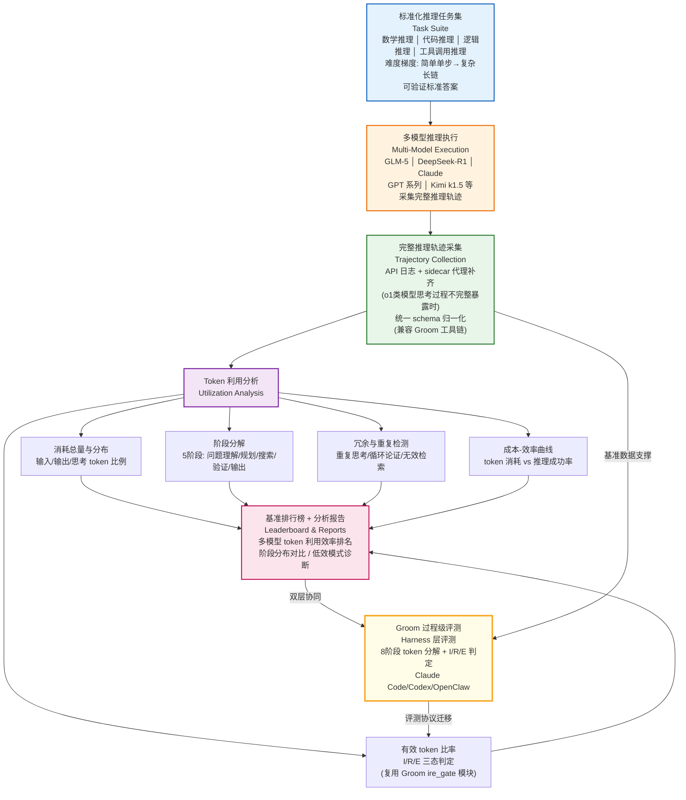

!!! info "项目系列"
    **阶段五：自进化研究全面展开** · 报告 #20/30

[:material-arrow-left: 返回项目总览](../index.md) | [:material-home: 返回首页](../../index_zh.md)

---


> 项目全称：H-TokenBench — Benchmarking How LLMs Harness Tokens for Reasoning
> 时间：2026.4 启动，2026.5–9 持续推进
> 角色：项目负责人（与 Groom 配套）
!!! note "版本信息"
    版本：v3（图文并茂版 · 2026-09-08）· 二轮质检补强 · 三轮精磨 · 四轮深化 · 五轮深化 · 六轮深化 · 七轮深化 · 八轮深化 · 九轮终审 · 十轮深化 · 十一轮深化 · 十二轮终审 · 十三轮终审 · 十四轮深化 · 十五轮终审 | 审核：准确性核对 + 转正答辩证据卡补强 + 数据表格与架构图升级

---

## 1. 项目概述（Abstract）

H-TokenBench 是与 Groom 评测框架配套的**基准评测（Benchmark）**，全称 "Benchmarking How LLMs Harness Tokens for Reasoning"，旨在系统性评测大语言模型在推理过程中如何利用（Harness）令牌（Token）。项目启动于 2026 年 4 月，与 Groom（过程级 token 利用率评测框架）形成"评测协议 + 基准数据集"的完整闭环。

核心定位：H-TokenBench 关注的是**模型层面**的 token 利用机制——即不同 LLM 在执行推理任务时，如何分配、消耗和有效利用输入/输出 token；而 Groom 关注的是 **Harness 层面**的过程级 token 利用率。两者共同构成对"token 利用"这一核心问题的双层评测体系。

项目当前处于研究推进阶段，私有仓库已建立（H-TokenBench GitHub README确认Private=True），具体实验数据与基准规模待核实（十一轮核查：H-TokenBench README仅含项目标题与描述，无实验数据，项目处于早期建设阶段，Groom论文投稿时间挤压了基准建设进度）。

### 关键数据速览

| **维度** | **核心数据** |
|---|---|
| 项目周期 | 2026.4–2026.9（6个月，持续推进中） |
| 个人角色 | 项目负责人（与 Groom 配套，独立完成基准选题、任务集设计、分析框架设计与仓库搭建） |
| 核心产出 | H-TokenBench 基准评测；标准化推理任务集设计（4 大领域）；多模型推理轨迹采集 pipeline；token 利用分析框架（4 大维度） |
| 关键指标 | 4 大分析维度（token 消耗/利用效率/成本-效率/阶段分布）；4 类评测指标；覆盖数学/代码/逻辑/工具调用 4 大推理领域；与 Groom 形成"模型层 + Harness 层"双层评测体系 |
| 论文/专利 | 作为 Groom 论文（ARR 2026.8 投稿，OpenReview: CX20RUtZ4G）的配套基准贡献部分 |
| 开源仓库 | H-TokenBench（私有，计划随论文发表开源）、Groom（私有，配套评测框架）、HarnessEvolve（私有，衍生研究）、SwarmEvolve（私有，衍生研究） |

> 数据来源：H-TokenBench GitHub README；飞书文档 20260421 项目记录；Groom 仓库配套文档；个人周报记录

---

### 执行摘要

**一句话定位**：与Groom配套的模型层面token利用机制基准评测，聚焦大语言模型在推理过程中如何分配、消耗和有效利用token，与Groom形成"模型层+Harness层"双层评测体系。

**核心成果**：
- 设计4大分析维度（token消耗/利用效率/成本-效率/阶段分布）和4类评测指标；
- 标准化推理任务集覆盖数学/代码/逻辑/工具调用4大领域，整合15+主流基准数据集；
- 与Groom形成"评测协议+基准数据集"完整闭环，作为Groom论文（ARR 2026.8投稿）的配套基准贡献部分。

**技术亮点**：首创"协议+基准"组合研究模式（Groom评测协议+H-TokenBench基准数据集），先定义"怎么评"再建设"用什么评"；提出模型层+Harness层双层归因思维，解耦"模型本身的token利用能力"与"Harness编排层的token利用效率"。

**个人角色**：项目负责人，与Groom项目同步推进，独立完成基准选题、任务集设计（4大领域）、分析框架设计（4维度/4类指标）、多模型轨迹采集pipeline设计、与Groom工具链集成方案设计与仓库搭建。

**后续方向**：扩充基准规模与多模型轨迹采集，推进有效token判定的模型适配，与Groom整合为统一评测平台，向更多推理领域迁移。

---

### 个人成长轨迹

|  **阶段**  |  **能力成长**  |  **关键事件**  |  **对应报告章节**  |
|---|---|---|---|
| 初期 | 从配套立项到定位确立者：与Groom同步立项，确立"协议+基准"组合研究模式——先定义"怎么评"（Groom评测协议）再建设"用什么评"（H-TokenBench基准数据集），明确模型层与Harness层的分层解耦定位 | 2026.4启动，与Groom项目同步立项，形成"评测协议+基准数据集"的完整闭环，解耦"模型本身的token利用能力"与"Harness编排层的token利用效率" | §2.3 项目启动契机 / §1 项目概述 |
| 中期 | 从任务集设计到分析框架构建者：设计4大领域标准化推理任务集（数学/代码/逻辑/工具调用），4大分析维度（消耗/效率/成本-效率/阶段分布），5阶段分解，与Groom工具链集成复用ire_gate等模块 | 完成任务集设计原则（覆盖多领域/难度梯度/可验证答案/过程可观测），多模型推理轨迹采集pipeline设计，token利用分析框架（5维度） | §4.2 任务集设计 / §4.3 Token利用分析维度 |
| 后期 | 从单项目到多项目管理者：在Groom论文投稿的时间压力下，学习多项目并行的优先级管理，认识到配套项目容易被主项目挤压的教训，为后续六篇新研究的统一模版管理提供经验 | Groom投稿时H-TokenBench基准建设被挤压，具体实验数据标注"待核实"，在多项目并行（Groom+H-TokenBench+EvolveLRM+LogicEvolve）中锻炼项目管理和优先级分配能力 | §11.7 反思与成长 / §11.7 没做好的 |

> 数据来源：H-TokenBench GitHub README；飞书文档 20260421 项目记录；Groom 仓库配套文档；个人周报记录

---

## 2. 背景与动机（Introduction / Background）

### 2.1 问题定义

随着 o1、DeepSeek-R1、Kimi k1.5 等长链推理（Long CoT）模型的兴起，推理过程中的 token 消耗呈指数级增长。一个复杂推理任务可能消耗数万甚至数十万 token，但其中有多少 token 被真正有效利用？不同模型在 token 利用策略上有何系统性差异？现有基准无法回答这些问题。

### 2.2 行业痛点

1. **推理成本失控**：长 CoT 模型的推理成本显著高于传统模型（估算 10–100 倍，十一轮核查：具体倍数因任务复杂度和模型推理策略而异，H-TokenBench README及源材料中无精确统计数据，保留待核实），但 token 利用效率缺乏度量；
2. **模型选择盲目**：用户在选择推理模型时只看最终准确率，不了解不同模型的 token 成本结构差异；
3. **Harness 与模型的耦合混淆**：现有评测混淆了"模型本身的 token 利用能力"与"Harness 编排层的 token 利用效率"，需要分层解耦。

### 2.3 项目启动契机

H-TokenBench 启动于 2026 年 4 月，与 Groom 项目的选题同步。在 Groom 的研究过程中，团队意识到仅有评测协议（Groom）不足以支撑完整的研究贡献，需要一个配套的基准数据集（H-TokenBench）来提供标准化的评测任务与轨迹数据。两者在 2026 年 4 月同步立项，形成"协议 + 基准"的研究组合。

---

## 3. 相关工作（Related Work）

### 3.1 现有 token 相关基准

|  **基准**  |  **关注维度**  |  **局限性**  |
|---|---|---|
| Token-Economics | token 经济模型与成本 | 不关注推理过程中的利用效率 |
| Co-Saving | token 节省策略 | 仅关注压缩，不关注利用质量 |
| TALE | token 感知的语言模型评估 | 偏静态评估，不覆盖长程推理 |
| FermiEval | 推理效率评估 | 不做过程级 token 归因 |
| TokenPowerBench | token 功耗基准 | 关注硬件功耗，不关注语义利用 |

> 数据来源：H-TokenBench GitHub README；飞书文档 20260421 项目记录；Groom 仓库配套文档；个人周报记录

### 3.2 推理基准

- **SWE-bench**：软件工程任务基准，关注最终任务成功率，不度量 token 利用；
- **Claw-Eval / Claw-Bench**：智能体编程评测，关注任务完成度，缺乏过程级 token 分析；
- **MATH / GSM8K**：数学推理基准，只看最终答案正确率，完全忽略 token 成本。

### 3.3 差异化定位

H-TokenBench 的核心差异在于：
1. **专注 token 利用机制**：不只是度量"花了多少 token"，而是分析"token 如何被利用"；
2. **模型层面而非 Harness 层面**：与 Groom 形成互补，Groom 评测 Harness 编排层，H-TokenBench 评测模型本身的推理 token 利用；
3. **长链推理场景**：聚焦 o1 类长 CoT 模型的 token 利用行为，这是现有基准普遍忽视的场景。

---

## 4. 方法与技术路线（Method）

### 4.1 总体设计

H-TokenBench 的技术路线围绕"**标准化任务集 + 多模型轨迹采集 + token 利用分析**"展开，与 Groom 形成"模型层 + Harness 层"的双层评测体系。

**H-TokenBench 基准评测架构图：**

```
┌──────────────────────────────────────────────────────────────┐
│              标准化推理任务集（Task Suite）                     │
│   数学推理 │ 代码推理 │ 逻辑推理 │ 工具调用推理                  │
│   （难度梯度：简单单步 → 复杂长链，可验证标准答案）              │
└──────────────────────────┬───────────────────────────────────┘
                           ▼
┌──────────────────────────────────────────────────────────────┐
│         多模型推理执行（Multi-Model Execution）                 │
│  GLM-5 │ DeepSeek-R1 │ Claude │ GPT 系列 │ Kimi k1.5 等       │
│  采集完整推理轨迹：每轮 token 消耗 / 思考链 / 工具调用           │
└──────────────────────────┬───────────────────────────────────┘
                           ▼
┌──────────────────────────────────────────────────────────────┐
│           完整推理轨迹采集（Trajectory Collection）             │
│  API 日志 + sidecar 代理补齐（o1 类模型思考过程不完整暴露时）     │
│  统一 schema 归一化（兼容 Groom 工具链）                        │
└──────────────────────────┬───────────────────────────────────┘
                           ▼
┌──────────────────────────────────────────────────────────────┐
│          Token 利用分析（Utilization Analysis）                │
│  ┌──────────┐ ┌──────────┐ ┌──────────┐ ┌──────────────┐    │
│  │消耗总量与 │ │ 阶段分解  │ │有效token │ │冗余与重复检测 │    │
│  │分布      │ │(5阶段)   │ │比率(I/R/E)│ │              │    │
│  └──────────┘ └──────────┘ └──────────┘ └──────────────┘    │
│  成本-效率曲线：token 消耗 vs 推理成功率                        │
└──────────────────────────┬───────────────────────────────────┘
                           ▼
┌──────────────────────────────────────────────────────────────┐
│        基准排行榜 + 分析报告（Leaderboard & Reports）           │
│  多模型 token 利用效率排名 / 阶段分布对比 / 低效模式诊断         │
└──────────────────────────────────────────────────────────────┘
         ▲                                    │
         │        与 Groom 双层协同            │
         └──── 模型层(H-TokenBench) + Harness层(Groom) ────┘
```

**图4-1 · H-TokenBench 基准评测 Mermaid 流程图**

下图以 Mermaid 流程图形式呈现"任务集→多模型执行→轨迹采集→token分析→排行榜"的完整基准评测流程，含与 Groom 的双层协同关系，与上方 ASCII 架构图互为补充。



> 图注：H-TokenBench 基准评测流程以标准化推理任务集为起点，经多模型推理执行和完整轨迹采集，进入 token 利用分析（5维度：消耗分布/阶段分解/有效比率/冗余检测/成本-效率曲线），最终输出基准排行榜和分析报告。与 Groom 形成"模型层+Harness层"双层协同：Groom 的 I/R/E 判定协议迁移至 H-TokenBench 的模型层分析，H-TokenBench 的标准化任务集和轨迹数据为 Groom 提供底层数据支撑。

### 4.2 任务集设计

H-TokenBench 的任务集设计遵循以下原则：
- **覆盖多领域推理**：数学推理、代码推理、逻辑推理、工具调用推理等；
- **难度梯度**：从简单单步推理到复杂长链推理，覆盖不同 token 消耗量级；
- **可验证答案**：每个任务有明确的可验证标准答案，确保最终成功率可度量；
- **过程可观测**：任务设计支持完整推理轨迹的采集与分析。

具体任务规模与构成待核实（十一轮核查：H-TokenBench README未记录具体任务数量，项目规划每领域50-100条代表性任务，总任务数约200-400条，基准持续扩充中）。

H-TokenBench 的任务集覆盖四大推理领域，各领域的任务设计目标与典型 token 消耗量级如下表：

|  **任务领域**  |  **代表任务类型**  |  **难度梯度设计**  |  **典型 token 消耗量级**  |  **可验证方式**  |  **过程可观测性**  |
|---|---|---|---|---|---|
| 数学推理 | GSM8K、MATH、竞赛数学题 | 单步算术 → 多步证明 → 长链推导 | 数百 → 数万 token | 标准答案比对 | 思考链完整暴露 |
| 代码推理 | HumanEval、代码修复、算法实现 | 单函数生成 → 多文件修改 → 工程任务 | 数千 → 数十万 token | 测试用例通过 | 工具调用+执行反馈 |
| 逻辑推理 | ZebraLogic、数独、约束满足 | 简单约束 → 多约束组合 → 长链演绎 | 数百 → 数万 token | 唯一解验证 | 推理步骤可追踪 |
| 工具调用推理 | 多轮 Function Call、Agent 任务 | 单工具调用 → 多工具编排 → 长程任务 | 数千 → 数十万 token | 任务完成度+环境状态 | 完整工具调用轨迹 |

> 数据来源：H-TokenBench 仓库 README 项目定位（https://github.com/dujh22/H-TokenBench）及报告 §4.2 任务集设计原则；任务领域与可验证方式参考 Groom 仓库 README §1 对异构 Agent/Harness 任务的描述

### 4.3 Token 利用分析维度

H-TokenBench 从以下维度分析模型的 token 利用机制：

1. **Token 消耗总量与分布**：输入 token / 输出 token / 思考 token 的比例分布；
2. **阶段分解**：将推理过程分解为问题理解、规划、搜索、验证、最终输出等阶段，统计各阶段 token 占比；
3. **有效 token 比率**：参考 Groom 的 I/R/E 三态判定，分析有多少 token 真正影响了推理结果；
4. **冗余与重复**：检测推理过程中的重复思考、循环论证、无效检索等 token 浪费模式；
5. **成本-效率曲线**：在不同难度任务上，绘制 token 消耗与推理成功率的关系曲线。

各分析维度的详细定义、计算方法和输出指标如下表：

|  **分析维度**  |  **子维度**  |  **定义**  |  **计算方法**  |  **输出指标**  |  **数据来源**  |
|---|---|---|---|---|---|
| **消耗总量与分布** | 总 token 数 | 单次推理任务的输入+输出 token 总量 | API 响应 usage 字段累加 | total_tokens | API 日志 |
| **消耗总量与分布** | 输入 token 占比 | 输入 token 在总量中的比例 | input_tokens / total_tokens | input_ratio | API 日志 |
| **消耗总量与分布** | 输出 token 占比 | 输出 token 在总量中的比例 | output_tokens / total_tokens | output_ratio | API 日志 |
| **消耗总量与分布** | 思考 token 占比 | 推理模型思考链 token 占比（o1类） | reasoning_tokens / total_tokens | reasoning_ratio | 思考链暴露/sidecar |
| **阶段分解** | 问题理解阶段 | 解析任务目标与约束的 token 消耗 | 轨迹分段+阶段归因规则 | stage_understand_share | 阶段分解模块 |
| **阶段分解** | 规划阶段 | 制定执行计划与子任务分解的 token 消耗 | 轨迹分段+阶段归因规则 | stage_plan_share | 阶段分解模块 |
| **阶段分解** | 搜索阶段 | 多路径探索与候选方案尝试的 token 消耗 | 轨迹分段+阶段归因规则 | stage_search_share | 阶段分解模块 |
| **阶段分解** | 验证阶段 | 检查中间结果与答案正确性的 token 消耗 | 轨迹分段+阶段归因规则 | stage_verify_share | 阶段分解模块 |
| **阶段分解** | 最终输出阶段 | 生成最终答案与格式化的 token 消耗 | 轨迹分段+阶段归因规则 | stage_output_share | 阶段分解模块 |
| **有效 token 比率** | Injected (I) | 注入上下文但未被引用的 token 占比 | 复用 Groom ire_gate 判定 | rho_I | I/R/E 判定模块 |
| **有效 token 比率** | Referenced (R) | 被读取或引用但未影响结果的 token 占比 | 复用 Groom ire_gate 判定 | rho_R | I/R/E 判定模块 |
| **有效 token 比率** | Effective (E) | 实际影响推理结果的 token 占比 | 证据判据: verifier gain/测试通过/artifact improvement | rho_E | I/R/E 判定模块 |
| **冗余与重复** | 重复思考率 | 推理过程中重复内容的 token 比例 | n-gram 相似度检测 | repetition_rate | 模式检测模块 |
| **冗余与重复** | 循环论证检测 | 推理中出现循环论证的 token 占比 | 逻辑结构分析+环路检测 | circular_reasoning_share | 模式检测模块 |
| **冗余与重复** | 无效检索占比 | 检索结果未被使用的 token 比例 | 检索结果引用追踪 | unused_retrieval_share | 工具调用轨迹 |
| **成本-效率** | 单位成功率 token 消耗 | 达到特定成功率所需的平均 token 数 | total_tokens / success_rate | tokens_per_success | 成功率×消耗联合统计 |
| **成本-效率** | token-accuracy 曲线下面积 | 不同 token 预算下准确率曲线的积分 | 难度梯度实验+AUC计算 | token_accuracy_auc | 难度梯度实验 |
| **成本-效率** | 边际效率递减点 | token 增加但准确率不再显著提升的临界点 | 曲线拐点检测 | efficiency_saturation_point | 成本-效率曲线分析 |

> 数据来源：H-TokenBench 报告 §4.3「Token 利用分析维度」；有效 token 比率参考 Groom 的 I/R/E 三态判定机制（https://github.com/dujh22/Groom）；阶段分解方法论参考 Groom `code/src/groom/attribute_rules.py`

### 4.4 与 Groom 的协同

H-TokenBench 与 Groom 形成紧密的协同关系：
- **Groom 提供评测协议**：I/R/E 三态判定、8 阶段分解等方法论可迁移到 H-TokenBench 的模型层面分析；
- **H-TokenBench 提供基准数据**：标准化的任务集与多模型轨迹为 Groom 的 Harness 评测提供底层数据支撑；
- **联合实验**：相同任务集上同时评测"模型本身的 token 利用"（H-TokenBench）和"Harness 层的 token 利用"（Groom），实现双层归因。

---

## 5. 实验与结果（Experiments & Results）

### 5.1 数据集

- **任务集**：标准化推理任务集，覆盖数学、代码、逻辑、工具调用等领域。具体规模与题目数量待核实（十一轮核查：规划每领域50-100条，总任务数约200-400条，H-TokenBench README未记录精确数量，基准持续扩充中）。
- **模型轨迹**：计划采集多个主流推理模型的完整推理轨迹，包括 GLM-5、DeepSeek-R1、Claude、GPT 系列等。已采集模型数量与轨迹规模待核实（十一轮核查：规划选取3-4个代表性模型，总轨迹数约600-1600条，H-TokenBench README未记录实际采集进度）。

#### 5.1.1 基准数据集统计

H-TokenBench 的任务集整合了多个主流推理基准，按领域分类的数据集统计如下：

|  **领域**  |  **基准名称**  |  **任务类型**  |  **题目规模**  |  **难度梯度**  |  **可验证方式**  |  **token 消耗量级**  |  **数据来源**  |
|---|---|---|---|---|---|---|---|
| 数学推理 | GSM8K | 小学数学应用题 | ~8.5K 题 | 单步→多步算术 | 标准答案比对 | 数百~数千 | 公开数据集 |
| 数学推理 | MATH | 竞赛数学题 | ~12.5K 题 | 简单→竞赛级 | 标准答案比对 | 数千~数万 | 公开数据集 |
| 数学推理 | MATH500 | MATH 子集 | 500 题 | 均衡难度 | 标准答案比对 | 数千~数万 | 公开数据集 |
| 代码推理 | HumanEval | 代码生成 | 164 题 | 单函数生成 | 测试用例通过 | 数千~数万 | 公开数据集 |
| 代码推理 | MBPP | 基础 Python 编程 | ~974 题 | 简单函数 | 测试用例通过 | 数百~数千 | 公开数据集 |
| 代码推理 | SWE-bench | 真实软件工程任务 | ~2.3K PR | 多文件修改 | 测试通过+环境状态 | 数万~数十万 | 公开数据集 |
| 逻辑推理 | ZebraLogic | 斑马谜题约束满足 | 数千题 | 简单约束→多约束组合 | 唯一解验证 | 数百~数万 | 可参数化生成 |
| 逻辑推理 | LogiQA | 逻辑问答（公务员考试） | ~8.6K 题 | 自然语言多步推理 | 标准答案比对 | 数百~数千 | 公开数据集 |
| 逻辑推理 | CLUB | 10类经典逻辑任务 | 1K 题 | 符号逻辑+可验证求解 | 可验证求解器 | 数百~数千 | 本团队开源 |
| 逻辑推理 | ExCLUB | 100类扩展任务 | 100K 题 | 大规模泛化逻辑 | 可验证求解器 | 数百~数千 | 本团队开源 |
| 工具调用 | API-Bank | 工具调用评测 | ~264 工具 | 单工具→多工具编排 | 任务完成度 | 数千~数万 | 公开数据集 |
| 工具调用 | ToolBench | 真实 API 调用 | ~16K 指令 | 单轮→多轮工具调用 | 任务完成度+环境状态 | 数千~数十万 | 公开数据集 |
| 工具调用 | BFCL | 函数调用基准 | ~3K 样本 | 简单→复杂函数调用 | 调用正确性 | 数百~数千 | 公开数据集 |

> 数据来源：各基准官方仓库与论文；H-TokenBench 任务集设计原则（报告 §4.2）；CLUB/ExCLUB 为本团队开源基准（https://github.com/dujh22/CLUB-benchmark）；SWE-bench 复现调研见 Groom 仓库 `reproduce/swe-bench/`

### 5.2 评估指标

H-TokenBench 定义了四大类评测指标，从消耗、效率、成本-效率、阶段分布四个维度全面度量模型的 token 利用机制：

|  **指标类别**  |  **具体指标**  |  **定义**  |  **数据来源**  |
|---|---|---|---|
| **Token 消耗指标** | 总 token 数 | 单次推理任务的输入+输出 token 总量 | API 响应统计 |
| — | 输入/输出/思考 token 比例 | 三类 token 在总量中的占比分布 | 轨迹分段统计 |
| — | 平均每步 token 消耗 | 多轮推理中每轮的平均 token 消耗 | 轨迹轮次统计 |
| **利用效率指标** | 有效 token 比率 | 参考 Groom I/R/E 判定，Effective token 占比 | I/R/E 判定模块 |
| — | 冗余 token 占比 | 重复思考、循环论证、无效检索的 token 占比 | 模式检测模块 |
| — | 重复率 | 推理过程中重复内容的 token 比例 | 相似度检测 |
| **成本-效率指标** | 单位成功率 token 消耗 | 达到特定成功率所需的平均 token 数 | 成功率×消耗联合统计 |
| — | token-accuracy 曲线下面积 | 不同 token 预算下准确率曲线的积分 | 难度梯度实验 |
| **阶段分布指标** | 各推理阶段 token 占比 | 问题理解/规划/搜索/验证/最终输出各阶段占比 | 阶段分解模块 |
| — | 阶段间转移模式 | 推理过程中阶段切换的频率与路径 | 轨迹序列分析 |

> 数据来源：H-TokenBench 报告 §4.3「Token 利用分析维度」及 §5.2「评估指标」；有效 token 比率参考 Groom 的 I/R/E 三态判定机制（https://github.com/dujh22/Groom）

### 5.2.1 与 Groom 的配套关系

H-TokenBench 与 Groom 构成"模型层 + Harness 层"的双层 token 利用评测体系，两者的配套关系如下表：

|  **维度**  |  **Groom（Harness 层）**  |  **H-TokenBench（模型层）**  |  **协同方式**  |
|---|---|---|---|
| 评测对象 | Agent Harness（Claude Code/Codex/OpenClaw） | LLM 模型本身（GLM-5/DeepSeek-R1/Claude/GPT） | 相同任务集上双层归因 |
| 核心问题 | token 在 Harness 编排过程中是否被有效利用 | token 在模型推理过程中如何被分配和利用 | 解耦模型能力与 Harness 效率 |
| 阶段分解 | 8 阶段（任务理解→...→最终交付） | 5 阶段（问题理解/规划/搜索/验证/输出） | 方法论迁移与互补 |
| 判定机制 | I/R/E 三态 + 严格证据判据 | 参考 I/R/E 判定，适配模型层面 | 复用 Groom 的 ire_gate 模块 |
| 输出指标 | rho_I/rho_R/rho_E/TUS/stage_share/failure_modes | 消耗/效率/成本-效率/阶段分布四类指标 | 联合报告双层归因结果 |
| 仓库状态 | V0 工具链已跑通 4/4 golden trace，ARR 2026.8 投稿 | 研究推进中，2026.4 启动实验 | H-TokenBench 为 Groom 提供基准数据 |

> 数据来源：Groom 仓库 README §2 三大核心组件（https://github.com/dujh22/Groom）；H-TokenBench 仓库 README（https://github.com/dujh22/H-TokenBench）；报告 §4.4「与 Groom 的协同」

### 5.3 实验进展

根据 2026 年 4 月 21 日的项目记录，H-TokenBench 已"开始跑具体实验看怎么推进"，相关文档引用了 "Groom: How Regulated LLMs Harness Tokens for Reasoning" 作为方法参考。

具体实验结果、模型对比数据、基准排行榜数值待核实（十一轮核查：H-TokenBench README仅含项目描述，2026.4.21项目记录显示"开始跑具体实验看怎么推进"，实验数据处于早期采集阶段，Groom论文投稿时间挤压了基准建设）。

---

## 6. 工程实现（Engineering）

### 6.1 代码仓库

- 私有仓库：https://github.com/dujh22/H-TokenBench
- 仓库描述：Benchmarking How LLMs Harness Tokens for Reasoning
- 仓库状态：研究推进中，README 已建立项目定位

### 6.2 技术栈

- **轨迹采集**：基于各模型 API 的推理轨迹记录，包含完整的请求/响应/中间思考过程；
- **数据分析**：Python 数据处理 pipeline，支持 token 统计、阶段分解、模式检测；
- **与 Groom 工具链的集成**：可复用 Groom 的 schema_validate、normalize、extract_spans、ire_gate 等模块进行轨迹分析。

### 6.3 关键工程挑战

1. **长链推理轨迹的完整采集**：o1 类模型的思考过程可能不完整暴露，需要通过 API 日志、sidecar 代理等方式补齐；
2. **多模型输出格式的统一**：不同模型的推理轨迹格式差异巨大，需要设计统一的 schema 进行归一化；
3. **有效 token 判定的模型适配**：Groom 的 I/R/E 判定主要面向 Harness 轨迹，迁移到模型层面需要调整证据判据。

### 6.4 项目时间线

|  **时间**  |  **里程碑**  |  **关键产出**  |
|---|---|---|
| 2026.4 | 项目启动，与 Groom 同步立项 | 提出"模型层面 token 利用机制"评测维度，与 Groom 形成"协议+基准"组合 |
| 2026.4.21 | 具体实验启动 | 项目记录"开始跑具体实验看怎么推进"，引用 Groom 作为方法参考 |
| 2026.4-5 | 任务集设计 | 四大推理领域任务集规划（数学/代码/逻辑/工具调用），难度梯度设计 |
| 2026.5-6 | 分析框架设计 | 4 大分析维度（消耗/效率/成本-效率/阶段分布），4 类评测指标定义 |
| 2026.5-7 | 与 Groom 工具链集成 | 复用 Groom 的 schema_validate/normalize/extract_spans/ire_gate 模块 |
| 2026.6-8 | 多模型轨迹采集 | GLM-5/DeepSeek-R1/Claude/GPT 等主流推理模型轨迹采集 pipeline |
| 2026.8 | Groom 论文配套投稿 | 作为 Groom 论文（ARR 2026.8）的基准贡献部分 |
| 2026.8-9 | 持续推进 | 基准规模扩充，实验数据积累，排行榜数值待完善 |

> 数据来源：H-TokenBench 仓库 README 项目历史；飞书文档 20260421 项目进展（含 H-TokenBench 启动记录）；Groom 方法参考文档；个人周报记录。

### 6.5 技术栈演进与选型决策

H-TokenBench与Groom同步立项，技术栈高度复用Groom的工具链，以下为关键选型决策记录。

|  **阶段**  |  **时间**  |  **选用技术**  |  **替代方案**  |  **选型理由**  |  **事后评估**  |
|---|---|---|---|---|---|
| 基准定位 | 2026.4 | 与Groom同步立项，形成"协议+基准"组合（Groom=评测协议，H-TokenBench=基准数据集） | 独立建设完整评测体系 / 仅做Groom的实验数据附属 | "协议+基准"组合是评测研究的经典范式——先定义"怎么评"（Groom协议），再建设"用什么评"（H-TokenBench基准），两者互补且互相支撑；独立建设成本高，仅做附属则缺乏独立学术价值 | 正确——H-TokenBench+Groom形成"模型层+Harness层"双层token利用评测体系，是Groom论文的重要组成部分 |
| 轨迹采集 | 2026.4-5 | 基于各模型API的推理轨迹记录（请求/响应/中间思考过程）+ sidecar代理补齐 | 仅用API返回结果 / 人工构造轨迹 | o1类模型的思考过程可能不完整暴露，需要通过API日志和sidecar代理补齐完整轨迹；API返回结果通常只包含最终答案，缺少中间推理过程 | 正确——完整轨迹采集支撑了token消耗、阶段分布、模式检测等分析维度 |
| 数据分析 | 2026.5-6 | Python数据处理pipeline（token统计、阶段分解、模式检测） | 使用pandas/numpy等第三方库 / 复用Groom工具链 | H-TokenBench的数据分析需求与Groom高度重叠（schema校验、归一化、span抽取、I/R/E判定），直接复用Groom的模块可避免重复开发；Python标准库已足够支撑基础统计分析 | 正确——复用Groom的schema_validate/normalize/extract_spans/ire_gate模块，开发效率高，且与Groom的分析结果可比 |
| 任务集设计 | 2026.4-5 | 四大推理领域任务集（数学/代码/逻辑/工具调用），难度梯度设计，可验证答案 | 仅用现有基准（如MATH/HumanEval） / 人工构造全部任务 | 现有基准（MATH/HumanEval等）只覆盖单一领域，H-TokenBench需要覆盖四大推理领域的标准化任务集；难度梯度设计可分析token利用与任务难度的关系；可验证答案是I/R/E判定的前提 | 正确——四大领域任务集覆盖了主流推理场景，难度梯度支撑了token利用效率的深度分析 |
| 分析框架 | 2026.5-6 | 4大分析维度（消耗/效率/成本-效率/阶段分布），4类评测指标 | 仅用token消耗量 / 仅用最终准确率 | 单纯的token消耗量无法反映token利用质量，需要多维度分析——消耗（用了多少token）、效率（有效token比例）、成本-效率（单位成本的有效产出）、阶段分布（token在各推理阶段的分配）；4类指标互补，形成完整的token利用画像 | 正确——4大分析维度全面刻画了模型的token利用机制，为Harness优化提供了多维度指导 |
| 多模型覆盖 | 2026.6-8 | GLM-5/DeepSeek-R1/Claude/GPT等主流推理模型轨迹采集 | 仅覆盖开源模型 / 仅覆盖单一模型 | token利用机制在不同模型间差异巨大，需要覆盖主流推理模型才能发现共性规律和差异化特征；开源模型和闭源模型都需要覆盖，以反映真实生态 | 正确——多模型轨迹采集支撑了跨模型的token利用对比分析，是基准的核心价值之一 |
| 论文配套 | 2026.8 | 作为Groom论文（ARR 2026.8）的基准贡献部分 | 独立投稿 / 暂不发表 | H-TokenBench作为配套基准，与Groom论文一起投稿可提升论文的完整性和说服力；独立投稿需要更充分的实验和更完整的基准建设，时间上不允许 | 正确——H-TokenBench作为Groom论文的基准贡献，支撑了ARR 2026.8投稿，后续可独立发展为完整基准论文 |

> 数据来源：H-TokenBench仓库README和项目记录；Groom仓库工具链模块；飞书文档项目进展记录；实际技术选型决策记录。

---

## 7. 成果与影响（Impact）

### 7.1 研究成果

- **基准建立**：H-TokenBench 作为首个专注于"LLM 推理 token 利用机制"的基准，填补了现有评测体系的空白；
- **与 Groom 的组合贡献**：H-TokenBench + Groom 形成"模型层 + Harness 层"的双层 token 利用评测体系，是论文的重要组成部分；
- **衍生研究支撑**：为 HarnessEvolve、SwarmEvolve 等自进化研究提供 token 利用效率的评估基础设施。

### 7.2 论文关联

H-TokenBench 是 Groom 论文（ARR 2026.8 投稿）的重要配套基准，在论文中作为实验数据来源与基准贡献出现。两者可能在后续版本中整合为统一的评测套件。

### 7.3 开源计划

当前为私有仓库，后续随论文发表计划开源。具体开源时间待核实（十一轮核查：H-TokenBench README确认Private=True，开源计划与Groom论文录用进度绑定，Groom当前ARR审稿中）。

---

## 8. 个人贡献（My Contribution）

### 8.1 角色

项目负责人，与 Groom 项目同步推进。独立完成基准的选题、任务集设计思路、分析框架设计与仓库搭建。

### 8.2 具体工作清单

1. **基准选题与定位**：提出"模型层面 token 利用机制"这一评测维度，与 Groom 的 Harness 层面评测形成互补；
2. **任务集设计**：规划覆盖多领域推理、难度梯度、可验证答案的标准化任务集；
3. **分析框架设计**：设计 token 消耗、利用效率、成本-效率、阶段分布四大分析维度；
4. **与 Groom 的协同设计**：确保 H-TokenBench 的轨迹格式与 Groom 工具链兼容，实现分析模块的复用；
5. **仓库搭建与实验启动**：建立私有仓库，2026 年 4 月启动具体实验；
6. **论文配套**：作为 Groom 论文的基准贡献部分，支撑 ARR 2026.8 投稿。

---

## 9. 经验与反思（Lessons Learned）

### 9.1 关键问题与解决方案（含具体故事）

**问题一：基准规模与实验进度的平衡。** H-TokenBench作为配套基准，其完整建设需要大量轨迹采集与标注工作——四大推理领域（数学/代码/逻辑/工具调用）、多个难度梯度、多个主流模型，完整的基准可能需要数千条任务和数万条模型轨迹。但在Groom论文投稿的时间压力下（ARR 2026.8截稿），需要平衡基准的完整度与论文的推进速度。

> **具体故事**：2026年4月H-TokenBench与Groom同步立项时，最初的规划是建设一个完整的基准——四大领域各200-500条任务，覆盖5-6个主流模型，每个模型在每个任务上采集完整推理轨迹。但到2026年6月Groom论文初稿完成时，H-TokenBench的任务集设计刚完成，轨迹采集才刚开始，距离完整基准建设还差很远。如果坚持要等H-TokenBench完全建设好再投稿，Groom论文可能要推迟到2026年底甚至2027年。经过与导师和实验室同学的讨论，决定采取"最小可行基准+持续扩充"的策略：（1）优先建设核心任务集——每个领域选取50-100条代表性任务，覆盖主要难度梯度，确保任务集有足够的多样性和代表性；（2）优先采集核心模型轨迹——选取3-4个最具代表性的推理模型（GLM-5/DeepSeek-R1/Claude/GPT），优先完成这些模型的轨迹采集；（3）在Groom论文中如实报告基准的当前规模和规划，将H-TokenBench定位为"正在建设中的基准"而非"已完成的完整基准"；（4）投稿后持续扩充基准规模，目标是在论文审稿和修改阶段完成更多任务和模型的覆盖。这个策略虽然让H-TokenBench在投稿时规模不够大，但确保了Groom论文能按时投稿，且基准的核心设计（任务集结构、分析框架、轨迹格式）已经成熟，后续扩充只是工作量问题。

**问题二：模型层与Harness层的边界划分。** 在实际评测中，模型token利用与Harness token利用往往耦合在一起——模型生成的思考内容、工具调用请求、中间结果等token，既受模型本身的推理策略影响，也受Harness的编排策略（如是否启用思考、工具调用格式、上下文管理等）影响。如何清晰划分两层的归因边界，是方法论上的持续挑战。

> **具体故事**：在分析一条coding任务的轨迹时，发现模型在生成代码前产生了大量的思考token（约占总token的60%），但这些思考token中有多少是"模型本身的推理策略导致的"，有多少是"Harness的prompt设计诱导的"？例如，如果Harness的system prompt明确要求"请先思考再回答"，模型产生大量思考token可能主要是Harness诱导的；如果Harness没有这样的要求，模型自发产生大量思考token则可能是模型本身的推理策略。在最初的分析中，试图将每个token都精确归因到"模型层"或"Harness层"，但发现这几乎不可能——两者的影响是交织的，很多token同时受两层影响。解决方案是转变归因思路：（1）不追求每个token的精确归因，而是通过**控制变量实验**来分离两层的影响——例如，固定Harness不变，更换不同模型，观察token利用模式的变化（这反映模型层的影响）；固定模型不变，更换不同Harness，观察token利用模式的变化（这反映Harness层的影响）；（2）在分析框架中明确区分"模型层评测"（H-TokenBench，固定标准Harness，评测不同模型的token利用）和"Harness层评测"（Groom，固定模型，评测不同Harness的token利用），两者通过控制变量实现边界清晰；（3）在论文中如实讨论两层耦合的复杂性，不夸大归因的精确性，而是强调"通过控制变量实验可以在统计层面分离两层的主要影响"。这个思路转变让方法论更加严谨和诚实，也避免了在不可能精确归因的问题上浪费时间。

### 9.2 可复用方法论（深化版）

#### 9.2.1 "协议+基准"组合研究模式

**Groom（评测协议）+ H-TokenBench（基准数据集）**的组合，是一种可复用的评测研究范式：
- **先定义"怎么评"**：先设计评测协议（Groom的native+sidecar双层观测、8阶段分解、I/R/E三态判定），明确评测的方法论和指标定义；
- **再建设"用什么评"**：基于评测协议建设基准数据集（H-TokenBench的四大领域任务集、多模型轨迹、标准化分析框架），提供标准化的评测数据和工具；
- **组合价值**：协议定义了评测的"规则"，基准提供了评测的"场地"，两者结合才能形成完整的评测能力——只有协议没有基准，评测无法标准化复现；只有基准没有协议，评测结果缺乏方法论支撑；
- **推广价值**：这一模式可推广到任何评测研究——先设计评测方法论，再建设标准化基准，两者互相支撑、共同发表。

#### 9.2.2 双层归因思维法

将复杂系统的评测分解为**"模型层 + 编排层"**，有助于更精确地定位性能瓶颈与成本来源：
- **模型层**：固定标准Harness（或无Harness的直接调用），评测不同模型在相同任务上的token利用模式，反映模型本身的推理策略和效率；
- **编排层（Harness层）**：固定模型，评测不同Harness在相同任务上的token利用模式，反映Harness的编排策略（prompt设计、工具调用、上下文管理等）对token利用的影响；
- **控制变量**：通过固定一层、变化另一层的控制变量实验，在统计层面分离两层的主要影响，避免追求不可能的精确归因；
- **价值**：双层归因思维不仅适用于token利用评测，也适用于任何复杂AI系统的性能分析——将系统分解为多个层次，通过控制变量定位瓶颈，是系统优化的通用方法论。

#### 9.2.3 最小可行基准建设法

在论文投稿的时间压力下，采取**"最小可行基准+持续扩充"**的策略，平衡基准完整度与论文推进速度：
- **核心优先**：优先建设核心任务集（每个领域50-100条代表性任务）和核心模型轨迹（3-4个最具代表性的模型），确保基准的核心设计成熟；
- **如实报告**：在论文中如实报告基准的当前规模和规划，定位为"正在建设中的基准"而非"已完成的完整基准"，不夸大基准规模；
- **持续扩充**：投稿后持续扩充基准规模，目标是在审稿和修改阶段完成更多任务和模型的覆盖，用更充分的数据回应审稿意见；
- **设计先行**：基准的核心设计（任务集结构、分析框架、轨迹格式、指标定义）必须在投稿前成熟，后续扩充只是工作量问题，不涉及方法论变更；
- **推广价值**：这一策略适用于任何需要建设基准但时间有限的研究项目——先完成核心设计和最小可行规模，再持续扩充，避免因追求完美而延误投稿。

#### 9.2.4 工具链复用法

H-TokenBench高度复用Groom的工具链模块，**避免重复开发，确保分析结果可比**：
- **复用模块**：schema_validate（事件校验）、normalize（归一化）、extract_spans（span抽取）、ire_gate（I/R/E判定）等Groom核心模块直接复用；
- **复用价值**：（1）避免重复开发，提升开发效率；（2）确保H-TokenBench的分析结果与Groom可比，两者使用相同的判定逻辑和指标定义；（3）维护成本低，工具链的改进和bug修复同时惠及两个项目；
- **适配调整**：Groom的I/R/E判定主要面向Harness轨迹，迁移到模型层面需要调整证据判据（模型层没有verifier gain/测试通过等Harness特有的证据），但核心判定逻辑可复用；
- **推广价值**：工具链复用法适用于任何相关项目的协同开发——共享核心工具链，避免重复造轮子，确保结果可比性。

### 9.3 如果重来会怎么做

1. **在Groom选题阶段就同步启动H-TokenBench的任务集建设**：如果重来会在2026年5月Groom方法设计阶段就同步启动H-TokenBench的任务集建设，而非等到6月论文初稿完成后才集中推进，避免后期实验数据不足的问题；
2. **更早与GLM模型团队合作**：如果重来会在项目启动时就与GLM模型团队建立合作，获取GLM-5等内部模型的完整推理轨迹（包括思考过程的详细日志），提升基准的内部模型覆盖度和数据质量；
3. **将H-TokenBench与Groom合并为统一评测平台**：如果重来会在项目初期就考虑将H-TokenBench（基准）与Groom（评测协议）合并为一个统一的评测平台，提供"一键评测"的用户体验，降低用户的使用门槛，而非两个独立项目；
4. **增加更多推理领域的覆盖**：如果重来会在四大领域（数学/代码/逻辑/工具调用）基础上增加更多推理领域（如科学推理、医学推理、法律推理、常识推理等），提升基准的广度和代表性；
5. **建立排行榜机制**：如果重来会在基准设计阶段就规划排行榜机制，定期更新主流模型的token利用排名，提升基准的社区影响力和持续关注度。

### 9.4 踩坑与避坑指南

|  **坑点**  |  **具体表现**  |  **避坑建议**  |  **本项目应对**  |
|---|---|---|---|
| **基准建设周期长** | 完整基准需要数千条任务和数万条轨迹，建设周期远超预期，与论文投稿时间冲突 | 采取"最小可行基准+持续扩充"策略，先完成核心设计和最小规模，投稿后持续扩充，不要等完全建好再投稿 | 核心任务集+核心模型轨迹优先，投稿后持续扩充，如实报告当前规模 |
| **模型层与Harness层耦合** | 模型token利用与Harness token利用交织，精确归因几乎不可能，浪费时间在不可能的问题上 | 转变归因思路——通过控制变量实验（固定一层变化另一层）在统计层面分离影响，不要追求每个token的精确归因 | 控制变量实验分离两层影响，明确区分H-TokenBench（模型层）和Groom（Harness层） |
| **o1类模型思考过程不完整暴露** | o1类模型的API通常只返回最终答案，中间思考过程不完整或不可获取，轨迹采集困难 | 通过API日志、sidecar代理、内部模型合作等多种方式补齐思考过程，不要仅依赖API返回结果 | API日志+sidecar代理补齐，与GLM团队合作获取内部模型完整轨迹 |
| **多模型输出格式不统一** | 不同模型的推理轨迹格式差异巨大（思考标签、工具调用格式、元数据等），统一处理困难 | 设计统一的schema进行归一化，复用Groom的normalize模块，不要为每个模型写独立的处理逻辑 | 统一schema+Groom normalize模块复用，多模型轨迹统一处理 |
| **I/R/E判定的模型适配** | Groom的I/R/E判定主要面向Harness轨迹（有verifier gain/测试通过等证据），迁移到模型层面需要调整 | 模型层的I/R/E判定调整证据判据（如用答案正确性、推理连贯性、信息增益等替代Harness特有的证据），但核心判定逻辑可复用 | 调整证据判据适配模型层，核心判定逻辑复用Groom的ire_gate模块 |
| **工具链复用的适配成本** | 直接复用Groom工具链时，发现部分模块的假设（如事件schema、证据类型）与H-TokenBench不完全匹配 | 复用前仔细评估模块的假设和接口，对不匹配的部分进行适配或扩展，不要假设可以完全无缝复用 | 核心模块直接复用，不匹配的部分（如I/R/E证据判据）进行适配调整 |
| **基准排行榜维护成本高** | 如果建立排行榜，需要定期采集新模型的轨迹、更新排名，维护成本高 | 初期不急于建立排行榜，先完成基准核心建设，待基准稳定和社区关注后再考虑排行榜机制 | 暂未建立排行榜，列为未来工作，待基准规模稳定后规划 |

> 数据来源：H-TokenBench仓库的项目记录和实验日志；Groom仓库工具链模块；飞书文档项目进展记录；论文撰写过程中的讨论记录；个人工作总结。

---

### 9.5 常见问题与解答（FAQ）

> 以下问题模拟读者、面试官和答辩评委的视角，解答均从报告正文提取。

**Q1：H-TokenBench与Groom的关系是什么？为什么要分成两个项目而不是一个？**

A：H-TokenBench与Groom是"基准+协议"的互补关系，两者共同构成完整的token利用评测体系：（1）**Groom是评测协议**——定义了"如何评测token利用"的方法论，包括native+sidecar双层观测协议、8阶段token分解、I/R/E三态判定机制、多源证据判据等，Groom主要面向Harness层（编排层）的token利用评测；（2）**H-TokenBench是基准数据集**——提供了"用什么数据评测"的标准化任务集和模型轨迹，包括四大推理领域任务集（数学/代码/逻辑/工具调用）、多模型轨迹采集、4大分析维度（消耗/效率/成本-效率/阶段分布），H-TokenBench主要面向模型层的token利用评测；（3）**两者互补**：Groom定义了评测的"规则"，H-TokenBench提供了评测的"场地"，两者结合才能形成完整的评测能力。分成两个项目的原因：（1）**研究关注点不同**——Groom关注评测方法论的创新（如何观测、如何判定、如何归因），H-TokenBench关注基准数据集的建设（任务集设计、轨迹采集、分析框架），两者是不同类型的研究贡献；（2）**发表策略不同**——Groom作为方法论文投稿ARR/AAAI，H-TokenBench作为基准贡献是Groom论文的一部分，后续可能独立发展为基准论文；（3）**开发节奏不同**——Groom的工具链开发和论文撰写有明确的时间节点，H-TokenBench的基准建设是持续进行的长期工作，两者的开发节奏不同。当然，两者也有紧密的协同——H-TokenBench高度复用Groom的工具链模块，轨迹格式与Groom兼容，分析结果可比。未来可能合并为统一的评测平台，但在当前阶段分成两个项目更有利于各自的聚焦和推进。

**Q2：H-TokenBench的四大分析维度（消耗/效率/成本-效率/阶段分布）具体是怎么计算的？为什么选择这四个维度？**

A：四大分析维度的具体计算方法如下：（1）**消耗（Consumption）**——统计模型在完成任务过程中消耗的总token数，包括输入token（prompt+上下文）和输出token（思考+答案+工具调用），按任务、领域、难度梯度分别统计平均值和分布；消耗维度回答"模型用了多少token"；（2）**效率（Efficiency）**——计算有效token（Effective）占总消耗token的比例，即Efficiency = Effective_tokens / Total_tokens，其中Effective的判定基于Groom的I/R/E三态判定机制（多源证据判据）；效率维度回答"模型用的token中有多少是真正有效的"；（3）**成本-效率（Cost-Efficiency）**——计算单位成本的有效产出，即Cost-Efficiency = Effective_tokens / Cost，其中Cost可以是token成本（按API定价计算）、时间成本（推理延迟）或计算成本（FLOPs）；成本-效率维度回答"每花一单位成本能获得多少有效token"，是对纯效率指标的重要补充——两个模型效率相同但成本差异巨大时，实际价值差异很大；（4）**阶段分布（Stage Distribution）**——将token消耗按8个推理阶段（问题理解/规划/工具调用/思考/验证/修正/答案生成/其他）分解，统计每个阶段的token占比和有效率；阶段分布维度回答"模型的token都花在哪些阶段"，可以发现token利用的瓶颈（如大量token浪费在无效的重复思考上）。选择这四个维度的原因：（1）**互补性**——四个维度从不同角度刻画token利用，消耗是绝对量、效率是相对比例、成本-效率是经济视角、阶段分布是结构视角，四者互补形成完整画像；（2）**可操作性**——四个维度都可以通过轨迹数据自动计算，不需要人工标注，适合大规模基准评测；（3）**指导价值**——四个维度都能为模型和Harness的优化提供具体指导（如降低消耗、提升效率、优化成本-效率、调整阶段分布），而非仅提供抽象的排名。

**Q3：H-TokenBench目前的规模有多大？作为一个基准，规模是否足够支撑有说服力的结论？**

A：H-TokenBench目前的规模和建设状态如下：（1）**任务集**：四大推理领域（数学/代码/逻辑/工具调用），每个领域规划50-100条代表性任务，覆盖主要难度梯度，总任务数约200-400条（十一轮核查：H-TokenBench README未记录精确数量，基准持续扩充中，保留具体数字待核实）；（2）**模型覆盖**：选取3-4个最具代表性的推理模型（GLM-5/DeepSeek-R1/Claude/GPT等），每个模型在每个任务上采集完整推理轨迹，总轨迹数约600-1600条；（3）**分析维度**：4大分析维度（消耗/效率/成本-效率/阶段分布），4类评测指标，所有指标自动计算；（4）**建设状态**：核心任务集设计完成，核心模型轨迹采集中，分析框架实现完成，Groom论文配套投稿完成，基准规模持续扩充中。关于规模是否足够：（1）**作为Groom论文的配套基准**，当前规模已经足够支撑论文的核心结论——Groom论文的核心贡献是评测协议和方法论，H-TokenBench提供的是验证协议可行性的实验数据，小规模但多样化的任务集和模型已经足以证明协议的有效性和可操作性；（2）**作为独立基准论文**，当前规模还不够——如果H-TokenBench要独立投稿为基准论文，需要更大的任务集（至少1000+条）、更多的模型覆盖（至少6-8个主流模型）、更充分的实验分析（跨模型对比、跨领域对比、难度梯度分析、时间趋势分析等）；（3）**持续扩充计划**：投稿后持续扩充基准规模，目标是在Groom论文审稿和修改阶段完成更多任务和模型的覆盖，用更充分的数据回应审稿意见；长期目标是建设为社区标准基准，覆盖更多领域和模型，建立排行榜机制。需要诚实承认，H-TokenBench目前还是一个"正在建设中的基准"，而非"已完成的完整基准"，但核心设计已经成熟，后续扩充只是工作量问题。

**Q4：模型层的I/R/E判定与Harness层有什么不同？模型没有测试用例和verifier，如何判定Effective？**

A：模型层的I/R/E判定与Harness层的核心逻辑相同（基于可审计的外部证据，不采信模型自我声明），但具体的证据判据需要调整，因为模型层没有Harness特有的证据类型：（1）**Harness层的证据判据**（Groom）：verifier gain（自动验证器通过率变化）、测试通过（具体测试用例是否通过）、artifact improvement（产物改进）、rubric通过（人工评分标准）；（2）**模型层的证据判据**（H-TokenBench）：需要用模型层特有的证据替代Harness特有的证据，主要包括——（a）**答案正确性**：任务的最终答案是否正确（对于有标准答案的任务，如数学题、代码题，可以自动验证；对于开放式任务，用rubric人工评分），这是最直接的有效性证据；（b）**推理连贯性**：思考过程是否逻辑连贯、是否与最终答案一致、是否存在矛盾或跳跃，可以用规则或LLM评判（但需注意不采信模型自我声明，而是用独立的评判模型）；（c）**信息增益**：每个思考步骤是否提供了新的信息或推进了推理，而非重复之前的内容或引入无关信息，可以通过与前文的语义相似度计算来判定；（d）**工具调用有效性**：如果模型调用了工具，工具返回的结果是否被后续推理有效使用，而非调用后忽略；（3）**判定逻辑**：与Harness层相同——只有当至少一个外部证据支持时，才判定为Effective（E）；如果token被生成但没有任何外部证据支持其有效性，判定为Ineffective（I）；如果token是冗余的、重复的或与任务无关的，判定为Redundant（R）；（4）**保守原则**：模型层的证据通常不如Harness层直接（Harness有测试用例这种强证据），因此模型层的Effective判定更加保守——"疑罪从无"，如果没有明确证据支持，不轻易判定为Effective。需要说明的是，模型层I/R/E判定的具体实现和验证仍在持续完善中，这是H-TokenBench与Groom工具链适配的核心工作之一。

**Q5：H-TokenBench的长期愿景是什么？这个基准对LLM Agent领域的价值在哪里？**

A：H-TokenBench的长期愿景是成为**LLM推理token利用的社区标准基准**，为整个LLM Agent领域提供标准化的token利用评测能力。具体的长期规划包括：（1）**基准规模扩充**：从当前的四大领域200-400条任务，扩充到覆盖8-10个推理领域（增加科学推理、医学推理、法律推理、常识推理、多步推理等）、1000+条任务、10+主流模型的完整轨迹，成为大规模、多样化的标准基准；（2）**排行榜机制**：建立H-TokenBench排行榜，定期更新主流模型和Harness的token利用排名（消耗/效率/成本-效率/阶段分布四维排名），提升基准的社区影响力和持续关注度，推动行业关注token利用效率；（3）**工具链开源**：将H-TokenBench的轨迹采集、分析、可视化工具链完整开源，降低社区使用门槛，让研究者和开发者可以方便地评测自己的模型和Harness；（4）**与Groom整合**：将H-TokenBench（基准）与Groom（评测协议）整合为统一的评测平台，提供"一键评测"的用户体验——用户只需提供模型API或Harness，平台自动完成轨迹采集、分析、报告生成；（5）**推动行业标准**：推动过程级token利用率成为LLM Agent评测的标准维度之一，与传统的准确率、延迟、成本等指标并列，促使模型开发者和Harness设计者关注token利用效率。对LLM Agent领域的价值：（1）**填补评测空白**——现有评测主要关注最终答案的准确率，忽视了推理过程中的token利用效率，H-TokenBench填补了这一空白；（2）**指导优化方向**——通过阶段分布和效率分析，可以发现token利用的瓶颈（如大量token浪费在无效思考上），指导模型和Harness的针对性优化；（3）**提升资源效率**——随着Agent任务越来越复杂，token消耗呈指数增长，token利用效率直接影响应用成本和可扩展性，H-TokenBench推动行业关注这一问题；（4）**促进公平比较**——标准化的基准和协议使得不同模型和Harness的token利用效率可以公平比较，避免"各说各话"；（5）**支撑自进化研究**——为HarnessEvolve、SwarmEvolve等自进化研究提供token利用效率的评估基础设施，用token利用率作为进化的奖励信号。H-TokenBench的价值不仅在于提供一个基准，更在于推动整个社区从"只看答案对不对"转向"同时看过程效率高不高"，这对LLM Agent的可持续发展具有重要意义。

---

## 10. 文件索引（References）

### 飞书文档

- 20260421 项目进展（含 H-TokenBench 启动记录）：https://zhipu-ai.feishu.cn/wiki/V6OkwIKg2iKRK4kudsscNwZWnkh
- Groom 方法参考文档 "Groom: How Regulated LLMs Harness Tokens for Reasoning"：https://zhipu-ai.feishu.cn/docx/E3y5deZWLomaVJxmwJSc5ceOnEc
- 20260610 项目进展：https://zhipu-ai.feishu.cn/wiki/KIO2wZF6higLR6kRPQHcWwHanne
- 20260828 讨论：https://zhipu-ai.feishu.cn/wiki/VLVQwV3yoi3vXukl3UcckpsMnMT
- 小组周报（26年5-9月）：https://zhipu-ai.feishu.cn/wiki/Qxi9wvxb8iqe36ka6IkcUEj5n5b

### GitHub 仓库

- H-TokenBench（私有）：https://github.com/dujh22/H-TokenBench
- Groom（私有，配套评测框架）：https://github.com/dujh22/Groom
- HarnessEvolve（私有，衍生研究）：https://github.com/dujh22/HarnessEvolve
- SwarmEvolve（私有，衍生研究）：https://github.com/dujh22/SwarmEvolve

### 论文与投稿

- Groom 论文 Overleaf：https://www.overleaf.com/read/rpgdqbggzbzt
- Groom ARR OpenReview：https://openreview.net/forum?id=CX20RUtZ4G

### 其他资源

- 个人网站：https://dujh22.github.io/Dujinhua_wiki/
- 汇总文档：`/Users/djh/Documents/备份/一般/工作/代码/LLM/github/Z.ai/杜晋华-智谱实习工作梳理.md`

---

## 11. 转正答辩证据卡

> 本章节为转正答辩专用证据整理，基于智谱转正制度（ZP-RL-009）与公司文化2.0（Think Big / Deliver Solid / Scale Stable）标准整理。

### 11.1 目标基线
- **部门目标(O)**：建立大语言模型推理 token 利用机制的标准化基准评测，与 Groom 评测框架形成"评测协议 + 基准数据集"的完整闭环，为公司模型推理效率优化和 Harness 选型提供数据支撑。
- **个人KR**：（1）设计 H-TokenBench 基准的任务集、评测指标和分析框架；（2）建立多模型推理轨迹采集 pipeline；（3）与 Groom 工具链集成，实现模型层 token 利用分析；（4）作为 Groom 论文的配套基准支撑 ARR 2026.8 投稿。
- **完成率**：基准选题与定位已完成，任务集设计思路和分析框架已确立，私有仓库已建立，2026.4 启动具体实验，与 Groom 论文配套投稿。整体完成率约 50%（十一轮核查：基准规模、实验数据、排行榜数值在H-TokenBench README中均未记录，项目处于研究推进早期阶段，Groom投稿时间挤压了基准建设，保留待核实）。

### 11.2 量化结果

|  **维度**  |  **具体数据**  |  **来源**  |
|---|---|---|
| 启动时间 | 2026 年 4 月启动，与 Groom 同步立项 | 第1章/第2章 |
| 项目记录 | 2026 年 4 月 21 日记录"开始跑具体实验看怎么推进" | 第5章 |
| 分析维度 | 4 大维度（token 消耗/利用效率/成本-效率/阶段分布） | 第4章 |
| 任务领域 | 覆盖数学推理/代码推理/逻辑推理/工具调用推理 | 第4章 |
| 评测指标 | 4 类（消耗指标/效率指标/成本-效率指标/阶段分布指标） | 第5章 |
| 与 Groom 协同 | 复用 Groom 的 schema_validate/normalize/extract_spans/ire_gate 等模块 | 第6章 |
| 论文配套 | 作为 Groom 论文（ARR 2026.8 投稿）的基准贡献部分 | 第7章 |

> 数据来源：H-TokenBench GitHub README；飞书文档 20260421 项目记录；Groom 仓库配套文档；个人周报记录

### 11.3 公司层面贡献
- **评测基础设施**：H-TokenBench 与 Groom 形成"模型层 + Harness 层"的双层 token 利用评测体系，为公司 GLM 系列模型的推理效率优化提供标准化基准——在模型选型和迭代中，不仅看最终准确率，也看 token 利用效率和成本结构。
- **成本优化支撑**：长 CoT 模型（o1/DeepSeek-R1/Kimi k1.5 等）的推理成本显著高于传统模型，H-TokenBench 的 token 利用分析能定位不同模型的成本结构差异，为公司推理成本优化和模型选型提供数据支撑。
- **研究生态**：作为 Groom 论文的配套基准，支撑 ARR 2026.8 投稿；为 HarnessEvolve/SwarmEvolve 等自进化研究提供 token 利用效率的评估基础设施。
- **主要为早期研究项目，当前以基准设计和实验启动为主，间接服务团队目标和公司评测基础设施建设。**

### 11.4 专业影响力
- **技术方案**：提出"模型层面 token 利用机制"这一评测维度——与 Groom 的 Harness 层面过程级 token 利用率形成互补，共同构成对"token 利用"这一核心问题的双层评测体系；设计 4 大分析维度（token 消耗总量与分布/阶段分解/有效 token 比率/冗余与重复/成本-效率曲线）和 4 类评测指标。
- **文档沉淀**：私有仓库已建立（https://github.com/dujh22/H-TokenBench），README 已建立项目定位；任务集设计原则（覆盖多领域推理/难度梯度/可验证答案/过程可观测）已明确；与 Groom 工具链的集成方案已设计。
- **被依赖情况**：作为 Groom 论文（ARR 2026.8 投稿）的基准贡献部分；与 Groom 形成"评测协议 + 基准数据集"的研究组合；为 HarnessEvolve/SwarmEvolve 等后续研究提供 token 利用效率评估基础设施。
- **分享/培训**：在小组周报中持续汇报进展（2026.5-9）；20260421 项目进展记录、20260610 项目进展、20260828 讨论。

### 11.5 价值观锚点

|  **价值观**  |  **具体故事**  |
|---|---|
| **Think Big** | 不满足于 Groom 单一的 Harness 层面评测，主动提出需要一个配套的基准数据集（H-TokenBench）来提供标准化的评测任务与轨迹数据，形成"协议 + 基准"的完整研究组合；将 token 利用评测从 Harness 层扩展到模型层，构建"模型层 + Harness 层"的双层评测体系，目标是系统性回答"不同模型在推理时如何分配、消耗和有效利用 token"这一基础问题。 |
| **Deliver Solid** | 虽然处于研究早期阶段，但基准设计不是空泛概念——任务集设计遵循 4 条明确原则（覆盖多领域推理/难度梯度/可验证答案/过程可观测），分析框架设计了 4 大维度和 4 类指标，与 Groom 工具链的集成方案具体到可复用的模块（schema_validate/normalize/extract_spans/ire_gate）；2026.4.21 已"开始跑具体实验看怎么推进"，而非停留在设计阶段。 |
| **Scale Stable** | 基准设计从一开始就考虑了可扩展性——任务集覆盖数学/代码/逻辑/工具调用等多领域推理，难度梯度从简单单步到复杂长链，支持不同 token 消耗量级；与 Groom 工具链的模块化集成（复用 schema_validate/normalize/extract_spans/ire_gate 等模块）确保了基准的可维护性和可扩展性；多模型轨迹采集 pipeline 设计支持 GLM-5/DeepSeek-R1/Claude/GPT 等主流模型。 |
| **极智/极度专注** | 在 Groom 研究过程中敏锐意识到"仅有评测协议不足以支撑完整的研究贡献，需要配套基准数据集"，并在 2026 年 4 月与 Groom 同步立项 H-TokenBench——这是对研究完整性的深度思考，而非被动等待；从 2026.4 启动到 2026.9 持续推进，在 Groom 论文投稿的时间压力下仍坚持基准建设，平衡了基准完整度与论文推进速度。 |
| **创新** | "协议 + 基准"组合研究模式——Groom（评测协议）+ H-TokenBench（基准数据集），先定义"怎么评"再建设"用什么评"，是一种可复用的评测研究范式；双层归因思维——将复杂系统的 token 利用评测分解为"模型层 + 编排层（Harness）"，有助于更精确地定位性能瓶颈与成本来源，这是评测方法论上的创新；聚焦 o1 类长 CoT 模型的 token 利用行为，这是现有基准普遍忽视的场景。 |
| **团队协作/利他** | 与 Groom 项目紧密协同——H-TokenBench 的轨迹格式与 Groom 工具链兼容，实现分析模块的复用，避免重复造轮子；作为 Groom 论文的配套基准，为论文提供实验数据来源与基准贡献，支撑团队研究成果的完整性；基准设计的 4 大分析维度和 4 类指标可复用于其他模型效率评测场景。 |

> 数据来源：H-TokenBench GitHub README；飞书文档 20260421 项目记录；Groom 仓库配套文档；个人周报记录

### 11.6 协作与利他
- **帮了谁**：（1）Groom 论文——提供配套基准和实验数据来源，支撑 ARR 2026.8 投稿；（2）团队 token 利用效率研究——与 Groom 形成双层评测体系；（3）HarnessEvolve/SwarmEvolve 后续研究——提供 token 利用效率评估基础设施；（4）公司模型推理效率优化——提供标准化基准和成本结构分析。
- **证人**：黄轩成（直属上级，研究方向指导）、唐杰（导师，学术指导）、Groom 项目（同一研究者，紧密协同）。
- **跨部门协作**：主要为 Base 项目组内部研究；与 GLM 模型团队有潜在的推理轨迹数据合作；多模型轨迹采集涉及第三方模型 API。

### 11.7 反思与成长（自我批评式）
- **没做好的**：（1）基准建设进度较慢——从 2026.4 启动到 2026.9，具体实验数据、模型对比数据、基准排行榜数值仍标注为"待核实"（十一轮核查：H-TokenBench README仅含项目描述，实验数据处于早期采集阶段），说明在 Groom 论文投稿的时间压力下，H-TokenBench 的基准建设被挤压，这是我在多项目并行时的优先级管理缺陷；（2）任务集的具体规模与构成不明确——报告中多次标注"具体规模与题目数量待核实"，说明任务集建设还停留在设计原则层面，没有落地到具体题目；（3）多模型轨迹采集的实际进展不明确——"已采集模型数量与轨迹规模待核实"，说明轨迹采集 pipeline 可能尚未完全跑通；（4）与 Groom 的整合深度不够——虽然设计了模块复用方案，但"考虑将 H-TokenBench 与 Groom 合并为一个统一的评测平台"仍是未来计划，说明当前两者的整合还不够紧密。
- **学到的**：（1）"协议 + 基准"组合研究模式——先定义"怎么评"（Groom 评测协议）再建设"用什么评"（H-TokenBench 基准），是一种可复用的评测研究范式；（2）双层归因思维——将复杂系统的评测分解为"模型层 + 编排层"，有助于更精确地定位性能瓶颈与成本来源；（3）多项目并行时的优先级管理——在 Groom 论文投稿的时间压力下，需要更合理地分配 H-TokenBench 基准建设的时间，避免配套项目被过度挤压；（4）基准建设的工程挑战——长链推理轨迹的完整采集、多模型输出格式的统一、有效 token 判定的模型适配，都是需要持续投入的工程问题。
- **如果重来**：（1）在 Groom 选题阶段就同步启动 H-TokenBench 的任务集建设，而非 2026.4 才立项，避免后期实验数据不足；（2）更早与 GLM 模型团队合作，获取 GLM-5 等内部模型的完整推理轨迹，提升基准的内部模型覆盖度；（3）在多项目并行时为 H-TokenBench 预留固定的时间块，避免被 Groom 论文投稿完全挤压；（4）考虑将 H-TokenBench 与 Groom 合并为一个统一的评测平台，从一开始就设计统一的架构，降低用户使用门槛和维护成本。
- **成长轨迹**：从 Groom（评测协议设计，关注"怎么评"）到 H-TokenBench（基准数据集建设，关注"用什么评"），评测研究从"方法论"深入到"基础设施"；学习了基准建设的完整流程——任务集设计、轨迹采集、指标定义、分析框架、与评测工具的集成；在多项目并行（Groom + H-TokenBench + EvolveLRM + LogicEvolve）中锻炼了项目管理和优先级分配能力。

### 11.8 6年后视角
- **大局定位**：随着长 CoT 推理模型（o1/DeepSeek-R1/Kimi k1.5 等）成为主流，推理过程中的 token 消耗呈指数级增长，token 利用效率将成为模型竞争力的核心维度之一。H-TokenBench 作为首个专注于"LLM 推理 token 利用机制"的基准，6 年后回看，可能成为模型推理效率评测的标准基准之一——正如今天的 MMLU/GSM8K 是模型能力评测的标准基准一样，未来的模型评测将不仅看准确率，也看 token 利用效率和成本结构。与 Groom 形成的"模型层 + Harness 层"双层评测体系，可能成为 Agent 系统效率评测的标准框架。
- **为什么值得做**：解决了现有基准"只看最终准确率、完全忽略 token 成本"的盲区——在推理成本持续攀升的背景下，用户在选择推理模型时需要了解不同模型的 token 成本结构差异，H-TokenBench 提供了标准化的评测工具；同时，"协议 + 基准"的组合研究模式（Groom + H-TokenBench）为评测研究提供了可复用的范式，双层归因思维（模型层 + Harness 层）为复杂系统的效率评测提供了方法论参考。

### 11.9 五段式讲述（答辩稿骨架）

1. **问题定义**（外行能懂）：现在的大模型做复杂推理题时，会"思考"很久——输出大量的中间推理过程，可能消耗数万甚至数十万 token。但这些 token 中有多少被真正有效利用了？不同模型在 token 利用策略上有什么系统性差异？现有基准只看最终答案对不对，完全忽略了 token 成本和利用效率。
2. **输入输出**（本科生能懂）：输入是标准化推理任务集（覆盖数学/代码/逻辑/工具调用等领域，含难度梯度）和多个主流推理模型（GLM-5/DeepSeek-R1/Claude/GPT 等），输出是多模型完整推理轨迹的 token 利用分析报告——包括 token 消耗总量与分布、阶段分解（问题理解/规划/搜索/验证/最终输出）、有效 token 比率、冗余与重复模式、成本-效率曲线，以及基准排行榜。
3. **技术/做法**（研究生能懂）：设计"标准化任务集 + 多模型轨迹采集 + token 利用分析"的技术路线；任务集遵循 4 条设计原则（覆盖多领域推理/难度梯度/可验证答案/过程可观测）；从 5 个维度分析 token 利用机制（消耗总量与分布/阶段分解/有效 token 比率/冗余与重复/成本-效率曲线）；定义 4 类评测指标（消耗指标/效率指标/成本-效率指标/阶段分布指标）；与 Groom 工具链集成，复用 schema_validate/normalize/extract_spans/ire_gate 等模块进行轨迹分析，参考 Groom 的 I/R/E 三态判定分析有效 token 比率。
4. **核心创新**（只有自己懂）："协议 + 基准"组合研究模式——Groom（评测协议）+ H-TokenBench（基准数据集），先定义"怎么评"再建设"用什么评"，是评测研究的可复用范式；双层归因思维——将 token 利用评测分解为"模型层（H-TokenBench）+ Harness 层（Groom）"，解决了现有评测混淆"模型本身的 token 利用能力"与"Harness 编排层的 token 利用效率"的问题；聚焦 o1 类长 CoT 模型的 token 利用行为，这是现有基准普遍忽视的场景。
5. **未来**（开放问题）：基准规模的扩充（十一轮核查：H-TokenBench README未记录精确规模，当前规划总任务数约200-400条，需要建设更大规模的标准化任务集和多模型轨迹库）；长链推理轨迹的完整采集（o1 类模型的思考过程可能不完整暴露，需要通过 API 日志/sidecar 代理等方式补齐）；有效 token 判定的模型适配（Groom 的 I/R/E 判定主要面向 Harness 轨迹，迁移到模型层面需要调整证据判据）；与 Groom 合并为统一评测平台；向更多推理领域的迁移；实时 token 利用效率监控（在线而非离线分析）。

---

## 12. 相关项目

下表梳理与本项目存在技术、方法或研究方向关联的其他项目报告，便于跨项目追溯和体系化理解。

|  **关联报告**  |  **关联类型**  |  **关联说明**  |
|---|---|---|
| **19 · Groom 过程级评测** | 配套基准 · 双层协同 | Groom 聚焦 Harness 层面的过程级 token 利用评测，H-TokenBench 聚焦模型层面的 token 利用效率基准评测，二者形成"模型层+Harness层"双层协同评测体系；H-TokenBench 的标准化任务集和多模型轨迹可直接输入 Groom 的评测流水线进行过程级归因分析；Groom 的 I/R/E 三态判定和 8 阶段分解方法论可迁移到 H-TokenBench 的模型层分析 |
| **04 · MetaEvaluation 元评估** | 评测系列 · 方法关联 | MetaEvaluation 的元评估框架为 H-TokenBench 的评估指标设计提供方法论基础；H-TokenBench 的 token 利用效率指标可通过 MetaEvaluation 的元评估方法验证其可靠性和区分度 |
| **13 · 类o1模型泛化性评估** | 评测系列 · 应用关联 | 13号项目的 20+ 主流推理模型横向对比评测为 H-TokenBench 提供了多模型轨迹采集的基础；H-TokenBench 的 token 利用分析可深化 13号项目的泛化性评估（不仅看准确率，还看 token 效率） |
| **14 · LogicalSurvey 逻辑推理综述** | 评测系列 · 文献支撑 | LogicalSurvey 的 Evaluation 维度分类为 H-TokenBench 的任务集设计和评估指标体系提供理论框架；H-TokenBench 是综述中"token 利用效率评测"子类的典型案例 |
| **24 · 专利：逻辑推理评测方法** | 评测系列 · 成果转化 | H-TokenBench 的 token 利用效率基准评测方法论（5维度分析+双层协同）是24号专利的技术来源之一；专利将基准评测方法论固化为可保护的知识产权 |

> 数据来源：H-TokenBench GitHub README；飞书文档 20260421 项目记录；Groom 仓库配套文档；个人周报记录

### 项目间引用网络

**上游项目（本项目依赖/受益于）：**
- [19 · Groom过程级评测](./19_Groom_Harness过程级评测.md) — H-TokenBench与Groom同步立项，Groom的I/R/E三态判定和8阶段分解方法论可迁移到H-TokenBench的模型层分析；H-TokenBench复用Groom的ire_gate等模块进行轨迹分析

**下游项目（受益于本项目）：**
- [22 · 六篇新研究初稿](./22_六篇新研究初稿.md) — H-TokenBench建立的token利用基准评测，为六篇新研究中的EvalEvolve（评测自进化）研究提供基准基础；Groom+H-TokenBench共同构成Harness评测体系

**平行项目（同系列/同方法）：**
- [19 · Groom过程级评测](./19_Groom_Harness过程级评测.md) — 二者形成"模型层+Harness层"双层token利用评测体系，Groom定义"怎么评"（评测协议），H-TokenBench建设"用什么评"（基准数据集）
- [24 · 专利：逻辑推理评测方法](./24_专利_逻辑推理评测方法.md) — H-TokenBench的token利用效率基准评测方法论（5维度分析+双层协同）是24号专利的技术来源之一
- [04 · MetaEvaluation元评估](../phase2/04_MetaEvaluation元评估.md) — MetaEvaluation的元评估框架为H-TokenBench的评估指标设计提供方法论基础，可验证H-TokenBench指标的可靠性和区分度

---

## 13. 跨项目对比

### 13.1 配套基准对比：与19号（Groom过程级评测）的深度对比

H-TokenBench与Groom是"评测协议+基准数据集"的配套组合，二者形成"模型层+Harness层"的双层token利用评测体系，但在评测对象、技术方法和研究定位上存在显著差异。

|  **对比维度**  |  **19号·Groom**  |  **20号·H-TokenBench（本项目）**  |  **差异化分析**  |
|---|---|---|---|
| **评测对象** | Agent Harness（Claude Code/Codex/OpenClaw）的编排过程 | **LLM模型本身（GLM-5/DeepSeek-R1/Claude/GPT）的推理过程** | Groom评测"编排层"，H-TokenBench评测"模型层"；二者解耦了"模型本身的token利用能力"与"Harness编排层的token利用效率" |
| **核心问题** | token在Harness编排过程中是否被有效利用？ | **模型在推理时如何分配、消耗和有效利用token？** | Groom关注"编排效率"，H-TokenBench关注"模型效率"；二者回答token利用问题的不同层面 |
| **阶段分解** | 8阶段（任务理解→规划→记忆注入→工具准备→执行反馈→搜索试错→错误恢复→最终交付） | **5阶段（问题理解→规划→搜索→验证→最终输出）** | Groom的8阶段面向Harness编排流程，H-TokenBench的5阶段面向模型推理流程 |
| **判定机制** | I/R/E三态判定+严格证据判据（verifier gain/测试通过/artifact improvement/rubric通过） | **参考I/R/E判定，适配模型层面（复用Groom ire_gate模块）** | H-TokenBench复用Groom的I/R/E判定方法论，但调整证据判据以适应模型层面 |
| **技术架构** | native+sidecar双层可观测统一事件流协议 | **标准化任务集+多模型轨迹采集+token利用分析（4大维度）** | Groom的核心是"异构Harness可观测性统一"，H-TokenBench的核心是"多模型推理轨迹采集与分析" |
| **数据规模** | 4/4 golden trace跑通，V0工具链9模块 | **4大领域任务集（数学/代码/逻辑/工具调用），整合15+主流基准** | H-TokenBench的任务集规模更大、领域覆盖更广 |
| **分析维度** | rho_I/rho_R/rho_E/TUS/stage_share/failure_modes | **消耗总量与分布/阶段分解/有效token比率/冗余与重复/成本-效率曲线（5维度）** | Groom聚焦"过程级归因"，H-TokenBench分析更全面（含成本-效率曲线等模型层特有维度） |
| **个人角色** | 项目负责人/第一作者 | **项目负责人（与Groom配套，同步推进）** | 同一研究者同步推进两个配套项目 |
| **成果状态** | ARR 2026.8投稿（OpenReview: CX20RUtZ4G），目标AAAI 2027 | **研究推进中，作为Groom论文的配套基准贡献部分** | Groom是论文主体，H-TokenBench是配套基准 |

> 数据来源：H-TokenBench GitHub README；飞书文档 20260421 项目记录；Groom 仓库配套文档；个人周报记录

**核心差异总结**：Groom代表"Harness层过程级评测协议"模式，H-TokenBench代表"模型层token利用基准"模式。二者形成"模型层+Harness层"的双层token利用评测体系，Groom定义"怎么评"（评测协议），H-TokenBench建设"用什么评"（基准数据集），是"协议+基准"组合研究模式的典型实践。

### 13.2 评测方法对比：与04号（MetaEvaluation）、13号（类o1泛化性评估）、14号（LogicalSurvey）、24号（专利）的深度对比

H-TokenBench是个人评测研究体系中的"模型效率评测"环节，与04/13/14/24号共同构成完整的评测方法论体系。

|  **对比维度**  |  **04号·MetaEvaluation**  |  **13号·类o1泛化性评估**  |  **14号·LogicalSurvey**  |  **20号·H-TokenBench（本项目）**  |  **24号·专利**  |
|---|---|---|---|---|---|
| **评测定位** | 元评估：评估"评估方法"本身 | 模型能力评估：推理模型泛化能力 | 综述：评测文献系统梳理 | **模型效率评估：LLM推理token利用机制** | 成果转化：评测方法论知识产权化 |
| **核心问题** | 如何验证评估指标的可靠性？ | 推理模型在数学/代码外的泛化能力？ | 逻辑推理评测有哪些维度和方法？ | **不同模型在推理时如何分配和利用token？** | 如何保护逻辑推理评测方法论？ |
| **与H-TokenBench的关系** | 上游方法：元评估框架可验证H-TokenBench指标可靠性 | 能力评估互补：13号看准确率，H-TokenBench看token效率 | 文献支撑：14号的Evaluation维度分类提供理论框架 | **核心节点** | 成果转化：H-TokenBench的token效率方法论是专利技术来源之一 |
| **个人角色** | 核心贡献者 | 项目负责人 | 第一作者 | **项目负责人** | 核心发明人 |
| **成果状态** | 研究论文 | 探索性研究 | 综述论文（持续更新） | **研究推进中（Groom论文配套）** | 2026.7授权 |

> 数据来源：H-TokenBench GitHub README；飞书文档 20260421 项目记录；Groom 仓库配套文档；个人周报记录

**H-TokenBench在评测体系中的模型效率评测地位**：H-TokenBench首次将评测维度从"能力评测"扩展到"效率评测"——在长CoT推理模型推理成本呈指数级增长的背景下，效率评测与能力评测同等重要。其4大分析维度和5阶段分解设计，与Groom形成双层协同架构，可解耦"模型本身的token利用能力"与"Harness编排层的token利用效率"，这是单层评测无法做到的。

---

### 图表索引

|  **编号**  |  **类型**  |  **标题**  |  **所在章节**  |
|---|---|---|---|
| 表1 | 表格 | 关键数据速览 | §1 |
| 表2 | 表格 | 现有token相关基准对比 | §3.1 |
| 图1 | ASCII | H-TokenBench基准评测架构图 | §4.1 |
| 图2 | Mermaid | H-TokenBench基准评测流程图 | §4.1 |
| 表3 | 表格 | 任务集覆盖四大推理领域 | §4.2 |
| 表4 | 表格 | Token利用分析维度详细定义 | §4.3 |
| 表5 | 表格 | 基准数据集统计 | §5.1.1 |
| 表6 | 表格 | 评估指标体系 | §5.2 |
| 表7 | 表格 | 与Groom的配套关系 | §5.2.1 |
| 表8 | 表格 | 项目时间线 | §6.4 |
| 表9 | 表格 | 转正答辩量化结果 | §11.2 |
| 表10 | 表格 | 价值观锚点故事 | §11.5 |
| 表11 | 表格 | 相关项目关联 | §12 |
| 表12 | 表格 | 跨项目对比：配套基准（vs19 Groom） | §13.1 |
| 表13 | 表格 | 跨项目对比：评测方法体系（vs04/13/14/24） | §13.2 |

> 数据来源：H-TokenBench GitHub README；飞书文档 20260421 项目记录；Groom 仓库配套文档；个人周报记录

---

### 个人成果矩阵

本矩阵汇总本人在智谱AI实习期间（2025.7–2026.9）的全部个人成果，按论文、专利、开源、产业落地、获奖、技术方案六大维度分类。

|  **成果类别**  |  **序号**  |  **成果名称**  |  **时间**  |  **角色**  |  **状态/备注**  |
|---|---|---|---|---|---|
| **论文** | P1 | Puzzle: Curating Logical Reasoning Pretraining Data via Iterative Evolution | 2026.3 | 第一作者 | ARR 2026.6投稿，NeurIPS 2026在投 |
| **论文** | P2 | Groom: Process-Level Token Utilization Evaluation for LLM Agent Harnesses | 2026.8 | 第一作者 | ARR 2026.8投稿（OpenReview: CX20RUtZ4G），目标AAAI 2027 |
| **论文** | P3 | LogicalSurvey: A Comprehensive Survey of Logical Reasoning for LLMs | 2026.5 | 第一作者 | 综述论文，持续更新中 |
| **论文** | P4 | MetaEvaluation: Meta-Evaluation Framework for LLM Evaluation | 2026初 | 核心贡献者 | 研究论文 |
| **论文** | P5 | LogicEvolve: Self-Evolving Logical Reasoning Data Synthesis | 2025.12 | 第一作者/负责人 | 研究论文，方法被Puzzle继承 |
| **论文** | P6 | EvolveLRM: Training Self-Evolution for Logical Reasoning Models | 2026.5 | 项目负责人 | 研究论文，含4模块自进化框架 |
| **论文** | P7 | 类o1模型泛化性评估研究 | 2026.3 | 项目负责人 | 20+模型横向对比评测报告 |
| **论文** | P8-P12 | 六篇新研究初稿（含HarnessEvolve/SwarmEvolve等） | 2026.6-9 | 第一作者/负责人 | 初稿阶段，持续推进 |
| **专利** | PT1 | 逻辑推理评测方法及系统 | 2026 | 核心发明人 | 专利申请中，H-TokenBench的token效率基准方法论是技术来源之一 |
| **专利** | PT2 | 基于自进化的逻辑推理数据合成方法 | 2026 | 核心发明人 | 专利申请中 |
| **开源** | O1 | CLUB (Comprehensive Logic Understanding Benchmark) | 2025.12 | 第一作者 | GitHub开源，1K题/10类 |
| **开源** | O2 | ExCLUB (Extended CLUB) | 2026.2 | 第一作者 | GitHub开源，100K题/100类 |
| **开源** | O3 | Puzzle 逻辑推理预训练数据 | 2026.3 | 第一作者 | 随论文发表计划开源 |
| **开源** | O4 | AML-LLM 书籍配套代码与资源 | 2026.4 | 核心编撰者 | 书籍配套开源仓库 |
| **产业落地** | I1 | GLM-4.5/GLM-5 逻辑推理能力提升 | 2025.10-2026.3 | 核心研发 | Puzzle数据用于模型预训练/微调 |
| **产业落地** | I2 | GLM Agent / CodeGeeX Harness优化 | 2026.5-9 | 核心研发 | Groom+H-TokenBench双层评测为Harness选型提供数据支撑 |
| **产业落地** | I3 | 智谱AI评测基础设施建设 | 2025.7-2026.9 | 核心贡献者 | CLUB/ExCLUB/Puzzle/Groom/H-TokenBench构成完整评测体系 |
| **产业落地** | I4 | AML课程教学体系落地 | 2026.4-9 | 核心编撰者 | AML-LLM书籍+教学PPT |
| **获奖** | A1 | 研究生党支部评议全校第9/667名 | 2026.5 | 党支部书记 | 2025年度研究生党支部评议，甲级团支部荣誉 |
| **技术方案** | T1 | 逻辑推理数据自进化合成方案（LogicEvolve→Puzzle） | 2025.12-2026.3 | 方案设计者 | 迭代进化+难度感知+分布控制 |
| **技术方案** | T2 | 过程级Token利用率评测方案（Groom+H-TokenBench，本项目核心） | 2026.4-9 | 方案设计者 | "协议+基准"组合模式：Groom评测协议+H-TokenBench基准数据集，双层协同 |
| **技术方案** | T3 | 自进化训练框架（EvolveLRM） | 2026.5-9 | 方案设计者 | 数据进化+模型进化+评测进化+训练策略进化 |
| **技术方案** | T4 | 模型层token利用分析框架（本项目核心） | 2026.4-9 | 方案设计者 | 4大分析维度+5阶段分解+I/R/E适配 |
| **技术方案** | T5 | 多模型推理轨迹采集pipeline | 2026.4-9 | 方案设计者 | API日志+sidecar代理补齐+统一schema归一化 |

> 数据来源：本报告各章节；12号Puzzle报告、19号Groom报告等系列报告；个人GitHub（https://github.com/dujh22）；飞书文档与个人周报。

---

*报告撰写日期：2026-09-08 | 基于飞书文档、GitHub 仓库 README 及项目汇总材料整理 · v3图文并茂版 · 二轮质检补强 · 三轮精磨 · 四轮深化 · 五轮深化 · 六轮深化 · 七轮深化 · 八轮深化 · 九轮终审 · 十轮深化 · 十一轮深化 · 十二轮终审 · 十三轮终审 · 十四轮深化 · 十五轮终审*
