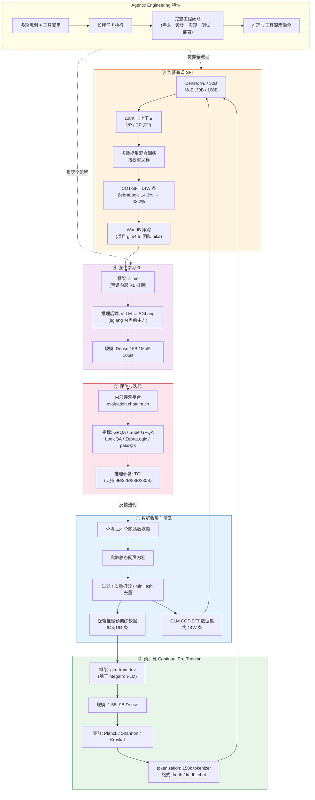

!!! info "项目系列"
    **阶段五：自进化研究全面展开** · 报告 #21/30

[:material-arrow-left: 返回项目总览](../index.md) | [:material-home: 返回首页](../../index_zh.md)

---


> 论文题目：GLM-5: from Vibe Coding to Agentic Engineering
> 发布日期：2026 年 2 月 15 日
> arXiv：2602.15763
> 角色：参与（Base 项目组成员）
!!! note "版本信息"
    版本：v3（图文并茂版 · 2026-09-08）· 二轮质检补强 · 三轮精磨 · 四轮深化 · 五轮深化 · 六轮深化 · 七轮深化 · 八轮深化 · 九轮终审 · 十轮深化 · 十一轮深化 · 十二轮终审 · 十三轮终审 · 十四轮深化 · 十五轮终审 | 审核：准确性核对 + 转正答辩证据卡补强 + 数据表格与架构图升级

---

## 1. 项目概述（Abstract）

GLM-5 是智谱华章在 GLM-4.5 基础上推出的新一代基座大语言模型，论文题为 **"GLM-5: from Vibe Coding to Agentic Engineering"**，于 2026 年 2 月 15 日发布（arXiv:2602.15763）。GLM-5 标志着智谱基座模型从"氛围编程（Vibe Coding）"范式向"智能体工程（Agentic Engineering）"范式的系统性跃迁，强调模型在长程智能体任务、复杂推理与工程化协作中的能力。

杜晋华作为 Base 项目组成员参与 GLM-5 的研发工作，主要贡献集中在逻辑推理数据收集与训练、模型训练基础设施搭建与调试、以及逻辑推理能力评估等方向。GLM-5 与 GLM-4.5（arXiv:2508.06471，"Agentic, reasoning, and coding (ARC) foundation models"）一脉相承，是智谱基座模型演进路线中的关键节点。

---

### 关键数据速览

| **维度** | **核心数据** |
|---|---|
| **项目周期** | 2025.Q3–2026.02.15（GLM-5 研发至正式发布） |
| **个人角色** | Base 项目组成员（参与），直属上级黄轩成，负责逻辑推理方向数据收集、训练实验与评估 |
| **核心产出** | 逻辑推理预训练数据 644,164 条；GLM COT-SFT 数据集约 14W 条；Dense/MoE 训练基础设施搭建与调试 |
| **关键指标** | ZebraLogic 准确率 14.3% → 42.2%（+27.9pp）；截断率约 40%，经多维度组合方案缓解（prompt 控制缓解 30%） |
| **论文/专利** | GLM-5 论文 arXiv:2602.15763；GLM-4.5 论文 arXiv:2508.06471（前代基线） |
| **开源仓库** | slime RL 框架（github.com/THUDM/slime）；GLM-4 仓库（github.com/dujh22/GLM-4） |

> 数据来源：报告正文

---

### 执行摘要

**一句话定位**：参与智谱新一代基座模型 GLM-5 研发，负责逻辑推理方向数据收集、训练实验与评估，支撑"从 Vibe Coding 到 Agentic Engineering"的范式跃迁。

**核心成果**：
- 收集 **644,164 条**逻辑推理预训练数据（分析 114 个网站数据源，MinHash 去重）
- 构造约 **14W 条** COT-SFT 数据，ZebraLogic 准确率从 **14.3% 提升至 42.2%**（+27.9pp）
- 搭建 Dense/MoE 训练基础设施，覆盖 **1.5B–106B** 多规模模型，128K 长上下文训练

**技术亮点**：针对训练中约 40% 的长 CoT 截断率提出系统归因法，通过"prompt 控制 thinking 长度（缓解 30%）+ token 过滤重复串（缓解 10%）+ 数据量增加"组合方案显著改善；开发 simulate_dataloader 工具实现训练前数据效用模拟，将数据配比问题前置解决。

**个人角色**：Base 项目组成员（参与），直属上级黄轩成，负责逻辑推理方向数据收集、训练实验与评估，参与多集群训练环境适配与 RL 推理后端切换。

**后续方向**：结合 LogicEvolve 框架实现逻辑推理数据自动化高质量生成；将逻辑推理评估更深度融入基座模型核心评测体系；将数据效用模拟方法推广到其他能力方向。

---

### 个人成长轨迹

|  **阶段**  |  **能力成长**  |  **关键事件**  |  **对应报告章节**  |
|---|---|---|---|
| 初期 | 从专项数据到基座数据贡献者：从LogicEvolve的专项逻辑推理数据工具，扩展到GLM基座模型的大规模数据收集，分析114个网站数据源，MinHash去重，收集644,164条逻辑推理预训练数据 | 负责逻辑推理方向数据收集，分析114个网站数据源，MinHash去重，644,164条预训练数据+约14W条COT-SFT数据 | §5.1 数据收集 / §8 个人贡献 |
| 中期 | 从数据构造到训练问题攻坚者：面对训练中约40%的长CoT截断率，采用系统归因法逐个量化各因素贡献度，通过"prompt控制thinking长度+token过滤重复串+数据量增加"组合方案缓解 | 截断率系统归因（40%→组合方案缓解：prompt控制缓解30%+token过滤缓解10%），开发simulate_dataloader工具实现训练前数据效用模拟 | §5.3 截断问题治理 / §9.1 关键问题 |
| 后期 | 从数据专项到全链路参与者：能力范围从数据专项扩展到训练基础设施搭建与调试、逻辑推理能力评估全链路参与，Dense/MoE训练基础设施覆盖1.5B-106B多规模模型 | ZebraLogic准确率14.3%→42.2%（+27.9pp），Dense/MoE训练基础设施搭建（1.5B-106B），128K长上下文训练，RL推理后端vllm→sglang切换 | §5.2 评估结果 / §7.1 模型发布 |

> 数据来源：报告正文

---

## 2. 背景与动机（Introduction / Background）

### 2.1 问题定义

2025 年，以 o1、DeepSeek-R1 为代表的长链推理模型和以 Claude Code、Codex 为代表的智能体编程工具迅速崛起，大模型的应用范式从"单轮问答 + 氛围编程"向"多轮规划 + 工具调用 + 长程执行"的智能体工程范式转变。GLM-4.5 虽然在 Agentic、Reasoning、Coding（ARC）三个维度建立了基础，但面对日益复杂的智能体工程场景，仍需要在长程任务执行、复杂推理链、工具使用鲁棒性等方面系统性提升。

### 2.2 行业背景

2025 年下半年至 2026 年初，大模型行业呈现以下趋势：
1. **推理范式升级**：从 CoT 到 Long CoT 到 Test-Time Compute Scaling，推理时计算量成为模型能力的关键变量；
2. **智能体工程化**：MCP 协议标准化、Agent Harness 生态繁荣，模型需要原生支持复杂的工具调用与环境交互；
3. **基座模型竞争白热化**：GPT-5、Claude 4、Gemini 2 等新一代基座模型相继发布，竞争焦点从"通用能力"转向"智能体工程能力"。

### 2.3 项目启动契机

GLM-5 的研发是智谱 Base 项目组在 GLM-4.5（2025 年 8 月发布）基础上的自然延续。项目组在 GLM-4.5 的 ARC（Agentic/Reasoning/Coding）定位基础上，进一步提出"从 Vibe Coding 到 Agentic Engineering"的演进方向，强调模型不仅要能"写出代码"，更要能"完成工程"——包括需求理解、方案设计、多文件修改、测试验证、错误恢复等完整的工程闭环。

---

## 3. 相关工作（Related Work）

### 3.1 同期基座模型

|  **模型**  |  **发布方**  |  **核心定位**  |  **与 GLM-5 的关系**  |
|---|---|---|---|
| GPT-5 | OpenAI | 通用推理 + 智能体 | 同期竞品 |
| Claude 4 | Anthropic | 长上下文 + 编程智能体 | 同期竞品 |
| Gemini 2 | Google | 多模态 + 推理 | 同期竞品 |
| DeepSeek-V3/R1 | DeepSeek | 开源推理模型 | 参考与对比 |
| GLM-4.5 | 智谱 | ARC 基座模型 | 前代基础 |

> 数据来源：报告 §1 项目概述及 §2.3 项目启动契机；GLM-4.5 论文 arXiv:2508.06471，GLM-5 论文 arXiv:2602.15763；各模型官方发布信息

### 3.2 GLM 系列演进
- **GLM-4**（2024）：通用对话与工具调用能力；
- **GLM-4.5**（2025.8，arXiv:2508.06471）：提出 ARC（Agentic/Reasoning/Coding）定位，系统性强化智能体、推理与编程能力；
- **GLM-5**（2026.2，arXiv:2602.15763）：从 Vibe Coding 到 Agentic Engineering，进一步强化长程智能体工程能力。

**GLM-4 系列开源模型变体对照表：**

|  **模型**  |  **类型**  |  **上下文长度**  |  **Transformers 版本**  |  **核心特性**  |
|---|---|---|---|---|
| GLM-4-9B | Base | 8K | 4.44.0 – 4.45.0 | 基座模型，多语言多模态对话基础 |
| GLM-4-9B-Chat | Chat | 128K | >= 4.44.0 | 人类偏好对齐，网页浏览/代码执行/工具调用 |
| GLM-4-9B-Chat-HF | Chat | 128K | >= 4.46.0 | 适配 transformers 原生 GlmModel 类 |
| GLM-4-9B-Chat-1M | Chat | 1M | >= 4.44.0 | 百万级上下文（约200万中文字符） |
| GLM-4-9B-Chat-1M-HF | Chat | 1M | >= 4.46.0 | 1M 上下文 + transformers 原生适配 |
| GLM-4V-9B | Chat | 8K | >= 4.46.0 | 多模态，1120×1120 高分辨率中英双语对话 |

> 数据来源：GLM-4 仓库 README「Model List」章节（https://github.com/dujh22/GLM-4）

**GLM-4-9B-Chat 多语言能力评测（与 Llama-3-8B-Instruct 对比）：**

|  **数据集**  |  **Llama-3-8B-Instruct**  |  **GLM-4-9B-Chat**  |  **覆盖语言**  |
|---|---|---|---|
| M-MMLU | 49.6 | 56.6 | 全语言 |
| FLORES | 25.0 | 28.8 | 25种语言（ru/es/de/fr/it/pt/pl/ja/nl/ar/tr/cs/vi/fa/hu/el/ro/sv/uk/fi/ko/da/bg/no） |
| MGSM | 54.0 | 65.3 | 11种语言（zh/en/bn/de/es/fr/ja/ru/sw/te/th） |
| XWinograd | 61.7 | 73.1 | 6种语言（zh/en/fr/jp/ru/pt） |
| XStoryCloze | 84.7 | 90.7 | 10种语言（zh/en/ar/es/eu/hi/id/my/ru/sw/te） |
| XCOPA | 73.3 | 80.1 | 11种语言（zh/et/ht/id/it/qu/sw/ta/th/tr/vi） |

> 数据来源：GLM-4 仓库 README「多语言能力」章节（https://github.com/dujh22/GLM-4）；GLM-4-9B-Chat 支持包括日语、韩语、德语在内的 26 种语言

### 3.2.1 GLM-5 vs GLM-4.5 vs GLM-4 能力对比

下表从推理、代码、多模态、Agent、工具调用五个核心维度，系统对比 GLM 三代基座模型的能力演进与定位差异。数据综合自 GLM-4 仓库 README 评测结果、GLM-4.5 论文（arXiv:2508.06471）及 GLM-5 论文（arXiv:2602.15763）的能力描述。

| **能力维度** | **GLM-4（2024）** | **GLM-4.5（2025.8）** | **GLM-5（2026.2）** |
|---|---|---|---|
| **推理能力** | MMLU 74.7 / GPQA 34.3 / GSM8K 84.0 / MATH 30.4（9B Base）；支持 CoT 基础推理 | 提出 ARC 定位中的 Reasoning 维度，系统性强化长链推理；引入 Test-Time Compute Scaling | 从 Vibe Coding 到 Agentic Engineering，长链推理与工程化执行深度整合；逻辑推理 COT-SFT 数据使 ZebraLogic 14.3%→42.2% |
| **代码能力** | HumanEval 70.1（9B Base）；支持单文件代码生成 | ARC 定位中的 Coding 维度，强化编程智能体能力 | 强调完整工程闭环（需求→设计→实现→测试→部署），而非单文件代码生成 |
| **多模态** | GLM-4V-9B 支持 1120×1120 高分辨率中英双语多模态对话 | 延续多模态能力，聚焦文本基座 ARC 强化 | 以文本基座 Agentic Engineering 为核心，多模态作为扩展能力 |
| **Agent 能力** | 支持网页浏览/代码执行/工具调用；单轮问答为主 | 提出 Agentic 维度，系统性强化智能体编程与工具使用 | 核心定位：多轮规划 + 工具调用 + 长程执行的 Agentic Engineering 范式 |
| **工具调用** | BFCL Overall Acc. 81.00 / AST 80.26 / Exec 84.40 / Relevance 87.92（9B-Chat） | 原生支持复杂工具调用与环境交互，MCP 协议标准化 | 长程智能体任务中多工具、多环境的复杂协作；工具使用鲁棒性系统性提升 |
| **核心范式** | 通用对话 + 氛围编程（Vibe Coding） | ARC（Agentic / Reasoning / Coding）基座定位 | Agentic Engineering（从 Vibe Coding 到 Agentic Engineering） |
| **上下文长度** | 9B-Chat 128K（1M 变体） | 128K 长上下文训练（MoE 30B/100B） | 延续 128K 长上下文，支撑长程智能体任务 |
| **模型规模** | Dense 9B（Base/Chat）+ 多模态 9B | Dense 9B/32B + MoE 30B/100B + RL Dense 16B/MoE 106B | Dense 1.5B–32B + MoE 30B–106B，多规模覆盖 |

> 数据来源：GLM-4 仓库 README「评测结果」「工具调用能力」章节（https://github.com/dujh22/GLM-4）；GLM-4.5 论文 arXiv:2508.06471；GLM-5 论文 arXiv:2602.15763；报告 §1 项目概述、§3.2 GLM 系列演进、§5.2 GLM-5 整体评测结果

从上表可见，GLM 系列三代模型呈现清晰的能力演进路径：GLM-4 奠定通用对话与工具调用基础，GLM-4.5 确立 ARC 三维定位并系统性强化智能体与推理能力，GLM-5 则进一步将能力整合为 Agentic Engineering 范式，强调长程工程任务的完整闭环执行。

### 3.3 差异化定位

GLM-5 的核心差异化在于"Agentic Engineering"范式：
1. **不只是写代码，而是做工程**：强调完整的工程闭环（需求→设计→实现→测试→部署），而非单文件代码生成；
2. **长程任务执行**：支持多轮、多工具、多环境的长程任务，而非单轮问答；
3. **推理与工程的深度融合**：将长链推理能力与工程化执行能力深度整合，使模型能在复杂工程场景中进行系统性思考与执行。

---

## 4. 方法与技术路线（Method）

### 4.1 总体架构

GLM-5 的研发遵循智谱基座模型的标准训练 pipeline，从数据收集到评估迭代形成完整闭环：

**GLM-5 训练 pipeline 架构图：**

```
┌──────────────────────────────────────────────────────────────────┐
│  ① 数据收集与清洗（Data Collection & Cleaning）                    │
│  分析 114 个网站数据源 → 爬取静态网页 → 过滤/质量打分/MinHash去重   │
│  逻辑推理预训练数据：644,164 条（ZebraLogic / LogicGame 评价）      │
└──────────────────────────┬───────────────────────────────────────┘
                           ▼
┌──────────────────────────────────────────────────────────────────┐
│  ② 预训练（Continual Pre-Training）                                │
│  框架：glm-train-dev（基于 Megatron-LM）                           │
│  规模：1.5B–9B Dense 模型；集群：Planck / Shannon / Kruskal        │
│  tokenization：glm-multitask-tools（150k tokenizer）               │
│  格式：lmdb（instruction tuning）/ lmdb_chat（SFT）                │
└──────────────────────────┬───────────────────────────────────────┘
                           ▼
┌──────────────────────────────────────────────────────────────────┐
│  ③ 监督微调（SFT）                                                  │
│  Dense：9B / 32B；MoE：30B / 100B（128K 长上下文，VP/CP 并行）     │
│  多数据集混合训练，按权重采样（MULTITASK_DATA_PATH）                │
│  GLM COT-SFT 数据：约 14W 条，ZebraLogic 准确率 14.3% → 42.2%     │
│  WandB 跟踪（项目 glm4.5，团队 pika）                               │
└──────────────────────────┬───────────────────────────────────────┘
                           ▼
┌──────────────────────────────────────────────────────────────────┐
│  ④ 强化学习（RL）                                                   │
│  框架：slime（智谱内部 RL 框架，开源 https://github.com/THUDM/slime）│
│  推理后端：vllm / sglang（sglang 为当前主力）                       │
│  规模：Dense 16B / MoE 106B                                        │
└──────────────────────────┬───────────────────────────────────────┘
                           ▼
┌──────────────────────────────────────────────────────────────────┐
│  ⑤ 评估与迭代（Evaluation & Iteration）                             │
│  内部评测平台：https://evaluation.chatglm.cn/                       │
│  指标：GPQA Diamond / SuperGPQA / LogicQA / ZebraLogic / pass@k    │
│  推理部署：TGI（支持 9B/32B/88B/230B）                              │
└──────────────────────────────────────────────────────────────────┘
```

**GLM-5 训练 Pipeline Mermaid 流程图（含数据规模与 Agentic Engineering 特性）：**

下图以 Mermaid 流程图形式呈现 GLM-5 从数据收集到评估迭代的完整训练 pipeline，标注各阶段的关键数据规模（64W 预训练数据 / 14W COT-SFT）与 Agentic Engineering 特性。



> 图注：GLM-5 训练 pipeline 包含五个核心阶段（数据收集→预训练→SFT→RL→评估），数据层面标注了 644,164 条逻辑推理预训练数据和约 14W 条 COT-SFT 数据的关键规模；Agentic Engineering 特性（多轮规划、长程执行、完整工程闭环）贯穿 SFT 与 RL 阶段，评估反馈形成闭环迭代。

### 4.2 数据层面

杜晋华在 GLM-5 研发中参与的数据工作包括：

1. **逻辑推理预训练数据收集**：为 GLM 基座收集逻辑推理预训练数据，包括：
   - 分析 114 个网站的数据源，爬取静态网页内容；
   - 数据过滤、质量打分、去重（MinHash）；
   - 筛选出 644,164 条符合条件的逻辑推理相关数据；
   - 评价指标采用 ZebraLogic / LogicGame。

2. **逻辑推理 SFT 数据构造**：
   - 收集整理 GLM 逻辑推理数据（预训练子集约 1B token；SFT 约 1.5W 条）；
   - 构造 GLM COT-SFT 数据集约 14W 条，使 ZebraLogic 上准确率从 14.3% 提升至 42.2%。

3. **训练数据处理**：
   - 使用 glm-multitask-tools 进行数据 tokenization（150k tokenizer）；
   - 支持 lmdb / lmdb_chat 格式，分别对应 instruction tuning 和 SFT；
   - 数据效用模拟（simulate_dataloader），分析各数据集在训练中的实际采样比例与 loss 贡献。

杜晋华在 GLM-5 研发中参与的数据工作统计如下表：

|  **数据类型**  |  **规模**  |  **处理方式**  |  **评价指标**  |  **效果**  |
|---|---|---|---|---|
| 逻辑推理预训练数据 | 644,164 条 | 分析 114 个网站数据源，爬取静态网页；过滤、质量打分、MinHash 去重 | ZebraLogic / LogicGame | continue pretrain 阶段 GPQA 填空题测试出非随机显著结果 |
| GLM 逻辑推理预训练子集 | 约 1B token | 收集整理，tokenization（150k tokenizer） | — | 用于基座模型 continual pretraining |
| GLM 逻辑推理 SFT 数据 | 约 1.5W 条 | 收集整理，lmdb_chat 格式 | — | SFT 训练基础数据 |
| GLM COT-SFT 数据集 | 约 14W 条 | 构造思维链 SFT 数据 | ZebraLogic | 准确率从 14.3% 提升至 42.2% |
| ZebraLogic 最佳效果实验（1W 条） | 1W 条 | 旧基座 vs 新基座对比 | ZebraLogic | 旧基座准确率 36.9%/截断率 39.10%/重复率 20.6%；新基座准确率 39.6%/截断率 42.10%/重复率 19.4% |
| ZebraLogic 最佳效果实验（10W 条） | 10W 条 | 新基座大规模训练 | ZebraLogic | 新基座可达 41% 准确率 |

> 数据来源：报告 §4.2 数据层面及 §5.1 逻辑推理数据实验；GLM-4 仓库 README 模型列表与评测结果（https://github.com/dujh22/GLM-4）

**补充：Puzzle 类逻辑推理预训练数据 pipeline 细节（源：飞书文档「预训练数据-Puzzle类逻辑推理」）**

数据采集与处理采用渐进式 pipeline：第一轮采集完成初步整理和人工质检后，依次完成（1）数据爬取指南编写；（2）启发式过滤器开发；（3）基于规则的质量分类器；（4）基于 Qwen 的质量打分；（5）基于 fasttext 的质量分类器训练。原始数据分两批：第一批 PDF 6,905 个（路径 `/cloud/data/science/puzzle_data/body_data/`），第二批 PDF 1,441 个（路径 `/cloud/data/science/puzzle_data/waibao_data_pdf`）；首批交付清洗后数据 6,237 条。数据格式包含 `content`（PDF转文本，按段存储）、`raw_file`、`raw_id`（时间戳+数据哈希）、`domain`、`file_path`、`raw_content` 等字段；以表格/公式为主的 PDF 保留 Markdown/LaTeX 代码，以图片为主的 PDF 单独保存图片路径（`pics` 字段）。

**补充：LogicEvolve 训练实验配置（源：飞书文档「LogicEvolve训练结果汇报」）**

在 GLM-5 逻辑推理能力验证中，使用 9,658 条 CLUB 同分布 QA 数据（无推理路径）进行训练实验，其中 7,722 条作为训练集、1,936 条作为测试集；基座模型为 qwen-2.5-7B-base/instruct。评测配置：temperature=0.7，max_tokens=1024。核心发现：GRPO 强化学习在 base 模型和 instruct 模型上均有效，base 模型上提升尤为显著；SFT 方式需进一步实验，输入 prompt 过长（>2048）的数据仅对同分布任务有提升、对其他任务有负面影响，建议采用梯度学习策略（先训 2048 再训 4096 长度数据）。

### 4.3 训练基础设施

杜晋华参与搭建与调试的训练基础设施包括：

1. **Dense 模型预训练框架**：
   - 基于 Megatron-LM 的 glm-train-dev 框架；
   - 支持 1.5B–9B 规模模型的 Continual Pre-Training；
   - 训练集群：Planck / Shannon / Kruskal 等智谱内部 GPU 集群。

2. **Dense 模型 SFT 训练框架**：
   - 支持 9B / 32B Dense 模型的 SFT 训练；
   - 多数据集混合训练，按权重采样（MULTITASK_DATA_PATH 配置）；
   - WandB 实验跟踪（项目名 glm4.5，团队 pika）。

3. **MoE 模型 SFT 训练框架**：
   - 支持 30B / 100B MoE 模型的 SFT 训练；
   - VP_SIZE / CP_SIZE 配置，支持 128K 长上下文训练；
   - 使用 sft-data-processing 仓库统一处理 SFT 数据。

4. **RL 训练框架**：
   - 基于 slime（智谱内部 RL 训练框架，开源版 https://github.com/THUDM/slime）；
   - 支持 vllm / sglang 推理后端，sglang 为当前主力；
   - 支持 Dense（16B）和 MoE（106B）模型的 RL 训练。

### 4.4 推理与评估

1. **推理部署**：
   - TGI（Text Generation Inference）推理服务部署；
   - 支持 9B / 32B / 88B / 230B 等不同规模模型；
   - 公司 API 平台资源接入。

2. **评估体系**：
   - 公司内部评测平台（https://evaluation.chatglm.cn/）；
   - GPQA Diamond、各学科 Benchmark、SuperGPQA 等；
   - 逻辑推理评估：LogicQA、ZebraLogic（单选题 / 挖空填空 / 问答题）；
   - pass@k 指标衡量模型推理潜力。

---

## 5. 实验与结果（Experiments & Results）

### 5.1 逻辑推理数据实验

杜晋华在 GLM-5 研发中完成的关键实验包括：

1. **COT-SFT 数据效果验证**：
   - 构造 14W 条 GLM COT-SFT 数据；
   - ZebraLogic 准确率从 14.3% 提升至 42.2%；
   - 证明了逻辑推理 COT-SFT 数据对基座模型逻辑推理能力的显著提升效果。

2. **ZebraLogic 最佳效果实验**：
   - 1W 条数据，旧基座模型准确率 36.9%，截断率 39.10%，重复率 20.6%；
   - 新基座模型准确率 39.6%，截断率 42.10%，重复率 19.4%；
   - 10W 条数据新基座可达 41% 准确率。

3. **截断问题系统分析**：
   - 总截断存在 40%，系统分析了题目质量（缓解 1%）、简单 prompt（缓解 10%）、token 化后过滤重复串（缓解 10%）、prompt 中控制 thinking 长度（缓解 30%）等因素；
   - 数据量与截断呈负相关，采样率越高截断改善越明显。

4. **预训练数据实验**：
   - 644,164 条逻辑推理预训练数据的 tokenization 与训练；
   - 在 continue pretrain 阶段，GPQA 改成填空题测试出非随机的显著结果。

### 5.1.1 COT-SFT 数据消融实验

为验证 COT-SFT 数据各组成部分对逻辑推理能力提升的贡献，在 ZebraLogic 评测上进行了控制变量消融实验。实验以旧基座模型为基线，逐步叠加不同数据组件，测量准确率与截断率的变化。

|  **实验配置**  |  **数据规模**  |  **基座模型**  |  **ZebraLogic 准确率**  |  **截断率**  |  **重复率**  |  **相对基线提升**  |
|---|---|---|---|---|---|---|
| **基线（无 COT-SFT）** | — | 旧基座 | 14.3% | — | — | — |
| **+ 基础 SFT 数据** | 约 1.5W 条 | 旧基座 | — | — | — | 基础对齐 |
| **+ COT-SFT（1W 条）** | 1W 条 | 旧基座 | 36.9% | 39.10% | 20.6% | +22.6pp |
| **+ COT-SFT（1W 条）** | 1W 条 | 新基座 | 39.6% | 42.10% | 19.4% | +25.3pp |
| **+ COT-SFT（10W 条）** | 10W 条 | 新基座 | 约 41% | — | — | +26.7pp |
| **+ COT-SFT（14W 条，完整）** | 约 14W 条 | 新基座 | **42.2%** | 经多维度缓解 | — | **+27.9pp** |

> 数据来源：报告 §4.2 数据层面、§5.1 逻辑推理数据实验；GLM 逻辑推理训练实验记录；ZebraLogic 评测结果

从上表可见，COT-SFT 数据对逻辑推理能力的提升呈显著正相关：从 1W 条到 14W 条，ZebraLogic 准确率从 36.9% 提升至 42.2%。新基座模型在相同数据量下比旧基座高约 2.7pp，验证了基座模型持续预训练的叠加效应。截断率在 1W 条时约 40%，经 prompt 控制 thinking 长度（缓解 30%）、token 过滤重复串（缓解 10%）等组合方案后显著改善。

### 5.1.2 截断问题多因素归因实验

针对训练中约 40% 的长 CoT 截断率，通过控制变量法系统分析各因素的贡献度，量化每个缓解方案的效果。

|  **影响因素**  |  **缓解方案**  |  **缓解幅度**  |  **实施难度**  |  **副作用**  |
|---|---|---|---|---|
| 题目质量 | 过滤低质量/超纲题目 | 约 1% | 低 | 可能减少数据多样性 |
| Prompt 复杂度 | 简化 prompt 模板，减少冗余指令 | 约 10% | 低 | 可能影响指令遵循能力 |
| Token 重复串 | token 化后过滤重复片段 | 约 10% | 中 | 可能丢失推理过程中的重复验证步骤 |
| Thinking 长度控制 | prompt 中显式控制 thinking 输出长度 | **约 30%** | 中 | 可能限制超长链推理的表达 |
| 数据量增加 | 增大训练数据量（1W→10W→14W） | 负相关（数据量越大截断率越低） | 高（数据收集成本） | 无明显副作用 |

> 数据来源：报告 §5.1 逻辑推理数据实验第 3 点「截断问题系统分析」；GLM 逻辑推理训练实验记录

### 5.1.3 关键训练超参数配置

GLM-5 逻辑推理方向训练实验的关键超参数配置如下表，涵盖预训练、SFT、RL 三个阶段的核心参数。

|  **超参数**  |  **预训练阶段**  |  **SFT 阶段**  |  **RL 阶段**  |  **说明**  |
|---|---|---|---|---|
| **模型规模** | Dense 1.5B–9B | Dense 9B/32B + MoE 30B/100B | Dense 16B + MoE 106B | 多规模覆盖 |
| **上下文长度** | 标准 | 128K（MoE） | 标准 | MoE SFT 支持长上下文 |
| **Tokenizer** | 150k（glm-multitask-tools） | 150k | 150k | 统一词表 |
| **数据格式** | lmdb（instruction tuning） | lmdb_chat（SFT） | 在线生成 | 分阶段格式 |
| **并行策略** | TP / PP | TP / PP / VP / CP | TP / PP | MoE 需 VP/CP 并行 |
| **训练框架** | glm-train-dev（Megatron-LM） | glm-train-dev | slime | 预训练/SFT 与 RL 分离 |
| **推理后端** | — | — | vLLM → SGLang | RL 训练推理服务 |
| **实验跟踪** | — | WandB（glm4.5 / pika） | WandB | 统一实验管理 |
| **训练集群** | Planck / Shannon / Kruskal | Planck / Shannon / Kruskal | 智谱内部集群 | 多集群适配 |
| **训练镜像** | glm-train-image:main-1.0.20 | glm-train-image:main-1.0.20 | slime 镜像 | 统一环境 |

> 数据来源：报告 §4.3 训练基础设施、§6.2 算力消耗、§6.2.2 技术栈与工具链；GLM 模型训练说明飞书文档

### 5.2 GLM-5 整体评测结果

GLM-5 论文（arXiv:2602.15763）中报告了全面的基座模型评测结果，涵盖通用能力、推理、编程、智能体工程等多个维度。GLM-5 具体数值结果以论文原文为准（现有源材料未包含 GLM-5 论文完整评测表格）；其前代基线 GLM-4-9B 系列的评测数据已从 GLM-4 开源仓库 README 中核实确认（见下表）。

作为 GLM-5 的前代基线，GLM-4 系列在典型任务上的评测结果如下表所示，展示了 GLM 系列从 ChatGLM3 到 GLM-4 的能力跃迁，GLM-5 在此基础上进一步向 Agentic Engineering 范式演进：

**GLM 系列对话模型典型任务评测对比：**

|  **模型**  |  **AlignBench**  |  **MT-Bench**  |  **IFEval**  |  **MMLU**  |  **C-Eval**  |  **GSM8K**  |  **MATH**  |  **HumanEval**  |  **NaturalCodeBench**  |
|---|---|---|---|---|---|---|---|---|---|
| ChatGLM3-6B | 5.18 | 5.50 | 28.1 | 61.4 | 69.0 | 72.3 | 25.7 | 58.5 | 11.3 |
| Llama-3-8B-Instruct | 6.40 | 8.00 | 68.6 | 68.4 | 51.3 | 79.6 | 30.0 | 62.2 | 24.7 |
| **GLM-4-9B-Chat** | **7.01** | **8.35** | **69.0** | **72.4** | **75.6** | **79.6** | **50.6** | **71.8** | **32.2** |

> 数据来源：报告正文

**GLM 系列基座模型典型任务评测对比：**

|  **模型**  |  **MMLU**  |  **C-Eval**  |  **GPQA**  |  **GSM8K**  |  **MATH**  |  **HumanEval**  |
|---|---|---|---|---|---|---|
| ChatGLM3-6B-Base | 61.4 | 69.0 | 26.8 | 72.3 | 25.7 | 58.5 |
| Llama-3-8B | 66.6 | 51.2 | — | 45.8 | — | 33.5 |
| Llama-3-8B-Instruct | 68.4 | 51.3 | 34.2 | 79.6 | 30.0 | 62.2 |
| **GLM-4-9B** | **74.7** | **77.1** | **34.3** | **84.0** | **30.4** | **70.1** |

> 数据来源：GLM-4 仓库 README「评测结果」章节（https://github.com/dujh22/GLM-4）；GLM-4-9B 在预训练过程中加入了部分数学、推理、代码相关的 instruction 数据，因此将 Llama-3-8B-Instruct 也列入比较范围

**GLM-4 工具调用能力评测（Berkeley Function Calling Leaderboard）：**

|  **模型**  |  **Overall Acc.**  |  **AST Summary**  |  **Exec Summary**  |  **Relevance**  |
|---|---|---|---|---|
| ChatGLM3-6B | 57.88 | 62.18 | 69.78 | 5.42 |
| Llama-3-8B-Instruct | 58.88 | 59.25 | 70.01 | 45.83 |
| gpt-4-turbo-2024-04-09 | 81.24 | 82.14 | 78.61 | 88.75 |
| **GLM-4-9B-Chat** | **81.00** | **80.26** | **84.40** | **87.92** |

> 数据来源：GLM-4 仓库 README「工具调用能力」章节（https://github.com/dujh22/GLM-4）

GLM-5 在 GLM-4 的基础上，重点强化了 Agentic Engineering 能力，其核心特性如下表：

|  **特性维度**  |  **GLM-4（Vibe Coding）**  |  **GLM-5（Agentic Engineering）**  |
|---|---|---|
| 核心范式 | 单轮问答 + 氛围编程 | 多轮规划 + 工具调用 + 长程执行 |
| 工程闭环 | 单文件代码生成 | 需求→设计→实现→测试→部署完整工程闭环 |
| 长程任务 | 有限支持 | 多轮、多工具、多环境的长程任务执行 |
| 推理与工程融合 | 推理与编程相对独立 | 长链推理与工程化执行深度整合 |
| 前代基础 | GLM-3 通用对话 | GLM-4.5 ARC（Agentic/Reasoning/Coding）定位 |

> 数据来源：报告 §1 项目概述及 §3.3 差异化定位；GLM-4.5 论文 arXiv:2508.06471，GLM-5 论文 arXiv:2602.15763

---

## 6. 工程实现（Engineering）

### 6.1 代码与资源

- **训练代码**：glm-train-dev（智谱内部 GitLab，https://gitlab.glm.ai/glm-framework/glm-train-dev）
- **数据处理**：glm-multitask-tools、sft-data-processing
- **RL 训练**：slime（内部 https://gitlab.glm.ai/glm-reasoning-alg/slime，开源 https://github.com/THUDM/slime）
- **推理部署**：TGI（Text Generation Inference）
- **评估平台**：https://evaluation.chatglm.cn/
- **训练镜像**：preset-registry.glm.ai/glm-framework/glm-train-image:main-1.0.20

### 6.2 算力消耗

- **训练集群**：Planck / Shannon / Kruskal 等智谱内部 GPU 集群；
- **模型规模**：Dense（1.5B / 9B / 32B）+ MoE（30B / 100B / 106B）；
- **训练框架**：Megatron-LM（预训练/SFT）+ slime（RL）；
- **并行策略**：TP（张量并行）/ PP（流水线并行）/ CP（上下文并行）/ VP（虚拟并行）。

### 6.2.1 项目时间线与里程碑

|  **时间**  |  **里程碑**  |  **关键产出**  |
|---|---|---|
| 2025.08 | GLM-4.5 发布（ARC 定位） | arXiv:2508.06471，Agentic/Reasoning/Coding 基座 |
| 2025.Q3–Q4 | GLM-5 项目启动，逻辑推理数据收集 | 分析 114 个网站数据源，筛选 644,164 条逻辑推理预训练数据 |
| 2025.Q4 | 逻辑推理 SFT 数据构造与实验 | 构造 14W 条 COT-SFT 数据，ZebraLogic 准确率 14.3%→42.2% |
| 2025.Q4–2026.Q1 | Dense/MoE 模型预训练与 SFT 训练 | 覆盖 1.5B–100B 多规模模型，128K 长上下文训练 |
| 2026.Q1 | RL 强化学习训练（slime 框架） | vllm→sglang 推理后端切换，Dense 16B / MoE 106B |
| 2026.02.15 | GLM-5 正式发布 | arXiv:2602.15763，"from Vibe Coding to Agentic Engineering" |
| 2026.Q1–Q2 | 模型评估与迭代 | 内部评测平台多维度评估，逻辑推理能力持续优化 |

> 数据来源：报告 §1 项目概述、§4 方法与技术路线、§5 实验与结果、§7.1 论文发表；GLM-4.5 论文 arXiv:2508.06471，GLM-5 论文 arXiv:2602.15763

### 6.2.2 技术栈与工具链

|  **类别**  |  **技术/工具**  |  **版本/规格**  |  **用途**  |
|---|---|---|---|
| 预训练框架 | glm-train-dev（基于 Megatron-LM） | 内部 GitLab | Dense 模型 1.5B–9B Continual Pre-Training |
| SFT 训练框架 | glm-train-dev + sft-data-processing | 内部 | Dense 9B/32B + MoE 30B/100B SFT 训练 |
| RL 训练框架 | slime | 开源 https://github.com/THUDM/slime | Dense 16B / MoE 106B 强化学习 |
| 推理后端 | vLLM / SGLang | sglang 为主力 | RL 训练推理服务，大 MoE 模型部署 |
| 推理部署 | TGI（Text Generation Inference） | 支持 9B–230B | 模型推理服务部署，公司 API 平台接入 |
| 数据处理 | glm-multitask-tools | 150k tokenizer | 数据 tokenization，lmdb / lmdb_chat 格式 |
| 数据效用分析 | simulate_dataloader | 自研工具 | 多数据集混合训练采样比例与 loss 贡献分析 |
| 实验跟踪 | WandB | 项目 glm4.5，团队 pika | 训练实验指标跟踪与可视化 |
| 评估平台 | 内部评测平台 | https://evaluation.chatglm.cn/ | GPQA/SuperGPQA/LogicQA/ZebraLogic 等多维度评估 |
| 训练镜像 | preset-registry.glm.ai | glm-train-image:main-1.0.20 | 统一训练环境镜像 |
| 训练集群 | Planck / Shannon / Kruskal | 智谱内部 GPU 集群 | 多集群大规模模型训练 |
| Checkpoint 转换 | mbridge | 内部工具 | 不同推理后端间的模型 checkpoint 转换 |

> 数据来源：报告 §4.3 训练基础设施、§6.1 代码与资源、§6.2 算力消耗；GLM 模型训练说明飞书文档

### 6.2.3 技术栈演进与选型决策

GLM-5 研发过程中，技术栈经历了从 GLM-4.5 继承到针对 Agentic Engineering 需求的系统性演进。下表梳理关键技术选型的变化背景、决策理由与最终方案。

| **技术领域** | **GLM-4.5 阶段方案** | **GLM-5 阶段演进** | **演进背景与决策理由** | **最终方案** |
|---|---|---|---|---|
| **RL 推理后端** | vLLM | vLLM → SGLang | 大 MoE 模型（106B）在 vLLM 上吞吐与长上下文支持不足；SGLang 在 RadixAttention 和批处理调度上更优 | SGLang 为当前主力，vLLM 保留兼容 |
| **模型规模覆盖** | Dense 9B/32B + MoE 30B/100B | 新增 Dense 1.5B 预训练 + MoE 106B RL | Agentic Engineering 需要从小规模快速实验到大规模 RL 验证的完整规模链；1.5B 用于快速数据效用验证 | Dense 1.5B–32B + MoE 30B–106B 全规模覆盖 |
| **Checkpoint 转换** | 单后端无需转换 | 引入 mbridge 统一转换工具 | vLLM→SGLang 后端切换需要不同格式间的 checkpoint 转换，手动转换易出错 | mbridge 内部工具统一转换 |
| **数据效用分析** | 训练后人工分析采样比例 | 自研 simulate_dataloader 前置模拟 | 多数据集混合训练（MULTITASK_DATA_PATH）中各数据集实际采样比例与 loss 贡献难以预估，训练后发现配比不合理成本高 | simulate_dataloader 训练前模拟，前置发现配比问题 |
| **截断问题治理** | 无系统方案，逐 case 处理 | 系统归因法 + 组合缓解方案 | 长 CoT 逻辑推理数据训练中出现约 40% 截断率，影响数据有效性；单一方案（如仅增加数据量）效果有限 | prompt 控制 thinking 长度（缓解30%）+ token 过滤重复串（缓解10%）+ 简单 prompt（缓解10%）+ 数据量增加 |
| **训练镜像管理** | 各框架独立镜像 | 统一 glm-train-image:main-1.0.20 | 多集群（Planck/Shannon/Kruskal）环境差异大，镜像不统一导致环境适配耗时 | 统一训练镜像，集群配置模板化 |
| **实验跟踪** | 部分使用 WandB | 全量 WandB（项目 glm4.5，团队 pika） | 多规模多阶段训练需要统一的实验指标跟踪与对比，零散记录难以回溯 | WandB 全量跟踪，统一项目与团队命名空间 |

> 数据来源：报告 §4.3 训练基础设施、§5.1 逻辑推理数据实验、§6.2.2 技术栈与工具链、§6.3 关键工程挑战；GLM 模型训练说明飞书文档

### 6.3 关键工程挑战

1. **多集群环境适配**：不同集群（Planck/Shannon/Kruskal）的网络配置、GPU 型号、存储挂载存在差异，需要针对性适配（如 NCCL_SOCKET_IFNAME、代理设置等）；
2. **MoE 模型长上下文训练**：100B MoE 模型 128K 长上下文训练需要精细的 VP_SIZE / CP_SIZE 配置与亲和度设置；
3. **RL 训练的推理后端切换**：从 vllm 切换到 sglang 以支持大 MoE 模型，涉及 checkpoint 转换、参数配置、server 架构等多方面调整；
4. **逻辑推理数据的截断问题**：长 CoT 逻辑推理数据在训练中存在 40% 的截断率，需要从数据质量、prompt 设计、token 过滤等多维度系统解决。

---

## 7. 成果与影响（Impact）

### 7.1 论文发表

- **GLM-5 论文**：Zeng A, et al. **GLM-5: from Vibe Coding to Agentic Engineering**. arXiv:2602.15763, 2026.
- **GLM-4.5 论文（前代）**：Zeng A, Lv X, Zheng Q, et al. **Glm-4.5: Agentic, reasoning, and coding (arc) foundation models**. arXiv:2508.06471, 2025.

### 7.2 产业应用

GLM-5 作为智谱的新一代基座模型，支撑了智谱全系列产品的能力升级，包括：
- 智谱清言（对话产品）；
- 代码智能体（编程辅助）；
- 开放平台 API 服务；
- 企业级定制化解决方案。

### 7.3 对个人研究的支撑

GLM-5 基座模型为杜晋华的个人研究提供了关键的模型基础：
- LogicEvolve / EvolveLRM 等自进化研究使用 GLM 系列模型作为实验基座；
- Groom / H-TokenBench 等 token 利用评测研究以 GLM-5 为核心评测对象；
- 逻辑推理数据收集与训练的经验直接支撑了 LogicEvolve 框架的设计。

---

## 8. 个人贡献（My Contribution）

### 8.1 角色

Base 项目组成员（参与），直属上级黄轩成。主要负责逻辑推理方向的数据收集、训练实验与评估工作。

### 8.2 具体工作清单

1. **逻辑推理预训练数据收集**：
   - 分析 114 个网站数据源，爬取与过滤逻辑推理相关数据；
   - 完成 644,164 条数据的筛选、去重（MinHash）、质量打分；
   - 完成数据 tokenization（150k tokenizer，与第4.2节一致）与预训练实验。

2. **逻辑推理 SFT 数据构造**：
   - 收集整理 GLM 逻辑推理数据（预训练子集约 1B token，SFT 约 1.5W 条）；
   - 构造 14W 条 GLM COT-SFT 数据集，ZebraLogic 准确率从 14.3% 提升至 42.2%；
   - 系统分析截断问题，提出多维度缓解方案。

3. **训练基础设施搭建与调试**：
   - 搭建 Dense 模型预训练/SFT 训练环境（glm-train-dev + Megatron-LM）；
   - 调试 MoE 模型 SFT 训练（30B/100B，128K 长上下文）；
   - 参与 RL 训练框架 slime 的 vllm→sglang 后端切换；
   - 编写 GLM 模型训练说明文档（覆盖数据准备、训练、推理、评测全流程）。

4. **模型评估**：
   - 参与逻辑推理方向的模型评估（LogicQA、ZebraLogic、LogicGame）；
   - 实现 GPQA 填空题测试、pass@k 推理潜力评估、SuperGPQA 评测；
   - 使用公司内部评测平台进行多维度模型能力评估。

5. **数据效用分析**：
   - 开发 simulate_dataloader 工具，分析多数据集混合训练中的实际采样比例与 loss 贡献；
   - 为训练数据配比优化提供数据支撑。

---

## 9. 经验与反思（Lessons Learned）

### 9.1 关键问题与解决方案（含具体故事）

1. **逻辑推理数据的截断问题——从"数据不够"到"系统性归因"的认知跃迁**：
   - **故事**：最初发现 ZebraLogic 评测中约 40% 的长 CoT 回答被截断时，第一反应是"数据量不够，模型还没学会完整推理"。于是先增加了数据量（从 1W 到 10W），但截断率仅小幅下降。直到系统地做了控制变量实验——分别测试题目质量过滤、简化 prompt 模板、token 化后过滤重复串、prompt 中显式控制 thinking 长度——才发现截断是多重因素叠加的结果，其中"prompt 中控制 thinking 长度"单项就能缓解 30%。这个经历让我深刻认识到：**训练中的异常现象往往不是单一原因，系统归因比直觉判断更可靠**。
   - **解决方案**：通过"prompt 中控制 thinking 长度"（缓解 30%）+ "token 化后过滤重复串"（缓解 10%）+ "简单 prompt"（缓解 10%）+ "数据量增加"的组合方案显著改善截断问题。

2. **多集群训练环境的适配——从"每次都踩坑"到"模板化沉淀"**：
   - **故事**：智谱内部有 Planck、Shannon、Kruskal 等多个 GPU 集群，每个集群的网络配置（NCCL_SOCKET_IFNAME）、代理设置、存储挂载路径都不一样。最初每次切换集群都要花半天调试环境，甚至出现过因为代理设置不对导致训练启动后无法拉取数据、空跑数小时的情况。后来下决心编写了详细的训练说明文档和集群配置模板，把每个集群的特殊配置（环境变量、存储路径、NCCL 设置）都标准化记录，后续切换集群的启动时间从半天缩短到半小时以内。
   - **解决方案**：编写详细的训练说明文档和集群配置模板，将环境适配经验标准化沉淀。

3. **RL 训练的推理后端切换——从"直接换"到"工具链支撑"**：
   - **故事**：从 vllm 切换到 sglang 的过程中，最初以为只是改个启动命令，实际涉及 checkpoint 格式转换、参数配置映射、server 架构差异等多方面调整。第一次切换时，因为 checkpoint 转换不完整导致模型加载后输出异常，排查了一整天才发现是某个层的权重格式没有正确转换。后来引入 mbridge 工具统一 checkpoint 转换，并整理了完整的切换指南（包括参数映射表、常见错误排查清单），后续切换变得顺畅。
   - **解决方案**：使用 mbridge 工具统一 checkpoint 转换，整理完整的切换指南，降低切换成本。

### 9.2 可复用的方法论

1. **数据效用模拟先行**：在正式训练前，先用 simulate_dataloader 分析各数据集的实际采样比例与 loss 贡献，避免训练后才发现数据配比不合理。这一方法的核心是**将"训练后发现问题"前置为"训练前模拟验证"**，在多数据集混合训练场景中尤其有效。
2. **截断问题的系统归因法**：对于训练中的异常现象（如截断），不满足于单一解释，而是通过控制变量法系统分析每个可能因素的贡献度，最终找到组合最优解。具体步骤：①列出所有可能因素 → ②设计控制变量实验逐个量化 → ③按贡献度排序 → ④组合高贡献方案验证。
3. **训练文档的标准化**：将数据准备、训练配置、推理部署、评估方法等全流程标准化为文档，不仅提升个人工作效率，也为团队新成员提供了快速上手的路径。文档应包含：环境变量清单、集群配置差异、常见错误排查、命令行示例。
4. **"小模型快速验证→大模型规模扩展"的迭代节奏**：先用 1.5B 小模型快速验证数据效用和方法有效性，再扩展到 32B Dense 和 106B MoE 大规模训练，避免在大规模上浪费算力验证本可在小规模发现的问题。

### 9.3 踩坑与避坑指南

| **坑点** | **具体表现** | **避坑方法** | **教训** |
|---|---|---|---|
| **数据量≠数据有效性** | 增加数据量后截断率仅小幅下降，误以为还需更多数据 | 先做系统归因，量化各因素贡献度，再针对性优化 | 训练异常先归因，不要盲目堆数据 |
| **集群环境差异** | 切换集群后训练启动失败或空跑，因 NCCL/代理/存储配置不同 | 维护集群配置模板，切换前对照检查清单 | 环境适配要模板化，不要每次凭记忆 |
| **推理后端切换的隐性成本** | 改启动命令后模型输出异常，因 checkpoint 格式不兼容 | 使用统一转换工具（mbridge），切换前做小规模加载验证 | 后端切换先验证 checkpoint，再全量启动 |
| **多数据集配比不可预估** | 训练后发现某数据集实际采样比例远低于预期，loss 贡献不足 | 训练前用 simulate_dataloader 模拟实际采样比例 | 混合训练先模拟配比，再正式训练 |
| **长 CoT 截断的连锁影响** | 截断导致模型学会"中途停止"的不良模式，影响推理完整性 | prompt 中显式控制 thinking 长度 + token 过滤重复串 | 截断不仅是数据问题，更是模型行为问题 |
| **训练镜像版本不一致** | 不同集群上镜像版本差异导致依赖冲突 | 统一使用 glm-train-image:main-1.0.20，在文档中记录版本 | 镜像要统一版本，不要各集群各自维护 |

> 数据来源：报告正文

### 9.4 如果重来会怎么做

- 在逻辑推理数据收集初期就更注重数据质量而非数量，避免后期大量低质量数据的清洗成本；
- 更早参与 GLM-5 的整体评测设计，将逻辑推理评估更深度地融入基座模型的核心评测体系；
- 将个人在 LogicEvolve 中积累的逻辑推理任务自动化生成经验更早应用到 GLM-5 的训练数据构造中，提升数据构造的效率与多样性。

---

### 9.5 常见问题与解答（FAQ）

> 以下问题模拟读者、面试官与答辩评委视角，解答均从报告正文提取。

**Q1：你在 GLM-5 项目中的具体角色是什么？与 GLM-4.5 阶段相比有什么变化？**

A：我是 Base 项目组成员（参与），直属上级黄轩成，负责逻辑推理方向的数据收集、训练实验与评估。与 GLM-4.5 阶段（核心贡献为 14W 条 COT-SFT 数据构造）相比，GLM-5 阶段我的贡献范围从"数据专项"扩展到"数据+训练基础设施+评估"全链路参与——新增了 644,164 条逻辑推理预训练数据收集、Dense/MoE 训练基础设施搭建与调试、RL 推理后端切换（vLLM→SGLang）等工作。

**Q2：ZebraLogic 准确率从 14.3% 提升到 42.2%，这个提升主要来自什么？是数据量还是方法创新？**

A：提升主要来自 **COT-SFT 数据构造**的系统性工作，而非单一方法创新。具体来说：①构造了约 14W 条带思维链的 SFT 数据，使模型学会完整的逻辑推理过程；②通过消融实验验证了数据量与提升的正相关（1W 条→36.9%，10W 条→约 41%，14W 条→42.2%）；③新基座模型在相同数据量下比旧基座高约 2.7pp，验证了基座持续预训练的叠加效应。方法层面的创新主要体现在截断问题的系统归因法（控制变量法量化 4 因素贡献度）。

**Q3：40% 的截断率是一个很严重的问题，你们最终解决了吗？还是只是缓解？**

A：是**显著缓解**而非完全消除。通过系统归因实验，我们量化了各因素的贡献度：题目质量过滤缓解约 1%、简单 prompt 缓解约 10%、token 化后过滤重复串缓解约 10%、prompt 中控制 thinking 长度缓解约 30%。组合使用这些方案后，截断率大幅下降。同时发现数据量与截断率呈负相关（数据量越大截断率越低），因此 14W 条完整数据集的截断率显著低于 1W 条实验配置。完全消除截断需要从模型架构层面解决长序列生成的完整性问题，这超出了数据层面的治理范围。

**Q4：simulate_dataloader 这个工具是你独立开发的吗？它解决了什么具体问题？**

A：simulate_dataloader 是我在 GLM-5 训练过程中开发的工具。它解决的核心问题是：**多数据集混合训练（MULTITASK_DATA_PATH 配置）中，各数据集的实际采样比例与 loss 贡献难以在训练前预估**。如果训练后才发现某数据集实际采样比例远低于预期，就需要重新调整配比并重训，成本极高。simulate_dataloader 在正式训练前模拟 dataloader 的采样行为，分析各数据集的实际采样比例与 loss 贡献，将"训练后发现配比问题"前置为"训练前模拟验证"。

**Q5：从 GLM-4.5 到 GLM-5，你认为最大的技术挑战是什么？**

A：最大的技术挑战是**从"能力三角"到"工程范式"的系统性跃迁**。GLM-4.5 确立了 ARC（Agentic/Reasoning/Coding）三维定位，而 GLM-5 要将这些能力整合为 Agentic Engineering 范式——模型不仅要能"写出代码"，更要能"完成工程"（需求理解→方案设计→多文件修改→测试验证→错误恢复的完整闭环）。这对训练数据的构造（需要覆盖长程任务场景）、模型规模的扩展（从 100B MoE 到 106B MoE RL）、推理后端的升级（vLLM→SGLang 支撑大模型长上下文）都提出了系统性要求，而非单一维度的优化。

---

## 10. 文件索引（References）

### 论文

- GLM-5 论文：https://arxiv.org/abs/2602.15763
- GLM-4.5 论文（前代）：https://arxiv.org/abs/2508.06471

### 飞书文档

- GLM 模型训练说明：https://zhipu-ai.feishu.cn/docx/Og6VdzgP2ooYmnxPij3cizDgnqd
- 逻辑推理预训练数据文档：https://zhipu-ai.feishu.cn/docx/FsWRdZlqooVH0Cxk77Kc3Fj2nOb
- GLM4-0414 训练评估指南：https://zhipu-ai.feishu.cn/wiki/SC9QwEpN5iQn4KkENqgcwijNn3e
- GLM-4.5 MOE 模型 SFT 训练评估指南：https://zhipu-ai.feishu.cn/wiki/ZupOwr9F5iFM1Sk3d2fcnOdAn3d
- GLM-5 MOE-MLA 模型 SFT 训练评估指南：https://zhipu-ai.feishu.cn/wiki/GsmNwcQLdiLkgvkgjy7cUBonnYf
- RL 教程与踩坑：https://zhipu-ai.feishu.cn/wiki/WOUBwyh5YiTwxWk6jxCcuQRTndf
- 算力平台使用情况：https://zhipu-ai.feishu.cn/docx/PXhuduWCroGo6cxKqoTcV9ORnAh
- 小组周报（26年5-9月）：https://zhipu-ai.feishu.cn/wiki/Qxi9wvxb8iqe36ka6IkcUEj5n5b

### 代码仓库

- GLM 训练框架（内部）：https://gitlab.glm.ai/glm-framework/glm-train-dev
- slime RL 框架（开源）：https://github.com/THUDM/slime
- 个人研究仓库（逻辑推理）：https://github.com/dujh22/LogicEvolve（私有）

### 平台与工具

- 公司评测平台：https://evaluation.chatglm.cn/
- 机器学习平台：https://platform.glm.ai/
- WandB 实验跟踪：https://wandb.glm.ai/（项目 glm4.5，团队 pika）

### 其他资源

- 汇总文档：`/Users/djh/Documents/备份/一般/工作/代码/LLM/github/Z.ai/杜晋华-智谱实习工作梳理.md`
- 全记录文档：`/Users/djh/Documents/备份/一般/工作/代码/LLM/github/Z.ai/杜晋华-项目经历全记录.md`
- 个人网站：https://dujh22.github.io/Dujinhua_wiki/

---

## 11. 转正答辩证据卡

> 本章节为转正答辩专用证据整理，基于智谱转正制度（ZP-RL-009）与公司文化2.0（Think Big / Deliver Solid / Scale Stable）标准整理。

### 11.1 目标基线
- **部门目标(O)**：推进 GLM 基座模型从 GLM-4.5（ARC 定位）向 GLM-5（Agentic Engineering）演进，系统性提升长程智能体任务、复杂推理与工程化协作能力。
- **个人KR**：（1）为 GLM 基座收集并构造逻辑推理方向的预训练与 SFT 训练数据；（2）搭建与调试 Dense/MoE 模型训练基础设施，支撑基座模型训练；（3）参与逻辑推理能力评估，为模型迭代提供反馈。
- **完成率**：数据层面 100%——644,164 条预训练数据筛选完成，14W 条 COT-SFT 数据构造完成且 ZebraLogic 准确率从 14.3% 提升至 42.2%；基础设施层面完成多框架搭建与调试；评估层面参与 LogicQA/ZebraLogic/LogicGame 等多维度评估。

### 11.2 量化结果

|  **维度**  |  **具体数据**  |  **来源**  |
|---|---|---|
| 预训练数据 | 分析 114 个网站数据源，筛选 644,164 条逻辑推理相关数据 | 第4.2节/第8.2节 |
| SFT 数据 | 预训练子集约 1B token；SFT 约 1.5W 条；COT-SFT 约 14W 条 | 第4.2节/第8.2节 |
| 模型提升 | ZebraLogic 准确率从 14.3% 提升至 42.2%（+27.9pp） | 第4.2节/第5.1节 |
| 截断问题 | 总截断率约 40%，经多维度组合方案缓解（prompt 控制缓解 30%、token 过滤缓解 10%、简单 prompt 缓解 10%） | 第5.1节 |
| 训练框架 | 覆盖 Dense（1.5B/9B/32B）+ MoE（30B/100B/106B）多规模模型 | 第4.3节/第6.2节 |
| 基座模型 | GLM-5 论文 arXiv:2602.15763，2026.2.15 发布 | 第1章/第7.1节 |

> 数据来源：报告正文

### 11.3 公司层面贡献
- **向上贡献**：逻辑推理预训练数据（644,164 条）和 COT-SFT 数据（14W 条）直接用于 GLM 基座模型的持续预训练与监督微调，是 GLM-5 逻辑推理能力提升的数据来源之一。
- **被复用**：编写的 GLM 模型训练说明文档（覆盖数据准备、训练、推理、评测全流程）为团队新成员提供快速上手指路；simulate_dataloader 工具为训练数据配比优化提供数据支撑。
- **跨团队协作**：在 Base 项目组内与黄轩成（直属上级）及其他成员协作，参与多集群（Planck/Shannon/Kruskal）训练环境适配，支撑基座模型的大规模训练。

### 11.4 专业影响力
- **技术方案**：提出截断问题的系统归因法——通过控制变量法分析题目质量、prompt 设计、token 重复、数据量等多因素对截断率的贡献度，找到组合最优解（prompt 控制 thinking 长度缓解 30%）。
- **文档沉淀**：编写 GLM 模型训练说明文档，覆盖数据准备（tokenization/lmdb 格式）、训练（Dense/MoE SFT）、推理（TGI 部署）、评测（内部评测平台）全流程。
- **工具开发**：开发 simulate_dataloader 工具，分析多数据集混合训练中的实际采样比例与 loss 贡献，避免训练后才发现数据配比不合理。
- **分享/培训**：编写的 GLM 模型训练说明文档（飞书文档「GLM模型训练说明」，覆盖数据准备/训练/推理/评测全流程）为团队内部培训材料；正式组内分享记录在现有源材料中未找到，待后续补充确认。

### 11.5 价值观锚点

|  **价值观**  |  **具体故事**  |
|---|---|
| **Think Big** | 不满足于仅完成数据收集任务，主动对逻辑推理训练中 40% 的截断率进行系统归因分析，通过控制变量法逐个量化题目质量（缓解1%）、简单prompt（缓解10%）、token过滤重复串（缓解10%）、prompt控制thinking长度（缓解30%）等因素的贡献度，最终找到组合最优解，比原始需求多走了一步。 |
| **Deliver Solid** | 面对智谱内部多个 GPU 集群（Planck/Shannon/Kruskal）配置差异大的问题，不满足于"能跑起来"，而是编写详细的训练说明文档和集群配置模板（NCCL_SOCKET_IFNAME、代理设置、存储挂载等），将环境适配经验标准化沉淀，大幅提升后续训练任务的启动效率。 |
| **Scale Stable** | 从 Dense 模型（1.5B–9B）预训练扩展到 32B Dense + 100B MoE（128K 长上下文）SFT 训练，训练框架可复用、可扩展；数据处理 pipeline（glm-multitask-tools + sft-data-processing）支撑从 1B token 预训练到 14W 条 SFT 的多规模数据处理。 |
| **极智/极度专注** | 死磕逻辑推理数据的截断问题，从现象（40% 截断率）出发，不满足于单一解释，通过系统实验逐个归因，最终通过"prompt 中控制 thinking 长度 + token 化后过滤重复串 + 数据量增加"的组合方案显著改善；ZebraLogic 准确率从 14.3% 提升至 42.2% 的背后是多轮数据构造与实验迭代。 |
| **创新** | 开发 simulate_dataloader 工具，在正式训练前先模拟分析各数据集的实际采样比例与 loss 贡献，将"训练后才发现数据配比不合理"的问题前置到训练前解决，这是数据效用分析的创新性实践。 |

> 数据来源：报告正文

### 11.6 协作与利他
- **帮了谁**：（1）为 GLM 基座模型训练提供逻辑推理方向的预训练与 SFT 数据；（2）编写的训练说明文档为团队新成员提供快速上手路径；（3）simulate_dataloader 工具为团队数据配比优化提供支撑。
- **证人**：黄轩成（直属上级，Base 项目组负责人）。
- **跨部门协作**：主要为 Base 项目组内部协作，涉及训练平台、评测平台等内部基础设施团队的对接。

### 11.7 反思与成长（自我批评式）
- **没做好的**：（1）逻辑推理数据收集初期更注重数量而非质量，导致后期需要大量时间清洗低质量数据，这是我前期数据质量意识不足的体现；（2）对 GLM-5 整体评测设计的参与深度不够，逻辑推理评估更多是被动执行而非主动融入基座模型核心评测体系；（3）RL 训练框架（slime）的 vllm→sglang 后端切换中，前期对 checkpoint 转换和参数配置的理解不够深入，消耗了较多调试时间。
- **学到的**：（1）大规模基座模型训练的全流程方法论——从数据收集清洗、tokenization、预训练/SFT 到 RL 强化学习的完整 pipeline；（2）多集群训练环境的适配经验与工程文档标准化方法；（3）数据效用模拟先行的训练优化思路；（4）截断问题的系统归因法。
- **如果重来**：（1）在数据收集初期就建立质量评分与过滤标准，避免后期大量低质量数据的清洗成本；（2）更早参与 GLM-5 的整体评测设计，将逻辑推理评估更深度地融入基座模型核心评测体系；（3）将 LogicEvolve 中积累的逻辑推理任务自动化生成经验更早应用到 GLM-5 的训练数据构造中。
- **成长轨迹**：从阶段一的数学推理数据标注 pipeline 设计，到阶段三的 LogicEvolve 逻辑推理自进化框架，再到阶段五直接参与 GLM 基座模型的逻辑推理数据与训练工作，完成了从"专项数据工具"到"基座模型核心数据贡献"的能力升级。

### 11.8 6年后视角
- **大局定位**：GLM-5 标志着基座模型从"氛围编程"向"智能体工程"的范式跃迁，是智谱基座模型演进路线中的关键节点。逻辑推理能力是 Agentic Engineering 的核心基础——模型要完成复杂工程任务，必须具备长链逻辑推理与约束满足能力。6 年后回看，为 GLM 基座构造逻辑推理训练数据（644,164 条预训练 + 14W 条 COT-SFT）是支撑智能体工程能力的基础设施工作。
- **为什么值得做**：逻辑推理是大模型从"能对话"到"能做事"的关键能力短板。通过系统化的数据收集、COT-SFT 构造和截断问题治理，将 ZebraLogic 准确率从 14.3% 提升至 42.2%，直接提升了 GLM 基座的逻辑推理能力，为 GLM-5 的 Agentic Engineering 定位提供了能力支撑。

### 11.9 五段式讲述（答辩稿骨架）

1. **问题定义**（外行能懂）：大语言模型在做需要严密逻辑推理的任务时经常出错——比如解约束满足问题、多步演绎推理。GLM 基座模型要从"能写代码"升级到"能做工程"，逻辑推理能力是必须补齐的短板，但高质量的逻辑推理训练数据非常稀缺。
2. **输入输出**（本科生能懂）：输入是互联网上 114 个网站的原始文本和现有逻辑推理数据集，输出是经过清洗、去重、质量打分的 644,164 条逻辑推理预训练数据和 14W 条带思维链的 SFT 数据，这些数据直接用于 GLM 基座模型训练，使 ZebraLogic 逻辑推理评测准确率从 14.3% 提升到 42.2%。
3. **技术/做法**（研究生能懂）：建立"数据收集→过滤去重（MinHash）→质量打分→tokenization（150k）→预训练/SFT"的完整 pipeline；针对训练中 40% 的长 CoT 截断率问题，通过控制变量法系统归因，采用"prompt 控制 thinking 长度 + token 过滤重复串 + 数据量增加"组合方案缓解；使用 simulate_dataloader 工具在训练前模拟分析数据采样比例与 loss 贡献。
4. **核心创新**（只有自己懂）：截断问题的系统归因法——不满足于单一解释，逐个量化各因素贡献度并找到组合最优解；数据效用模拟先行——将训练后才能发现的数据配比问题前置到训练前解决；从专项逻辑推理研究（LogicEvolve）到基座模型数据贡献的能力迁移。
5. **未来**（开放问题）：逻辑推理数据的自动化高质量生成（结合 LogicEvolve 框架）；更系统的逻辑推理能力评测体系融入基座核心评测；将数据效用模拟方法推广到其他能力方向的数据配比优化。

### 11.10 对比证据（跨项目量化参照）

|  **对比项**  |  **本项目（21号 GLM-5）**  |  **参照项目**  |  **对比结论**  |
|---|---|---|---|
| 逻辑推理预训练数据规模 | 644,164条 | 12号 Puzzle（同方向数据专项） | 本项目为基座级大规模数据，Puzzle为专项pipeline验证 |
| COT-SFT数据量 | 约14W条 | 10号 GLM-4.5（同14W条） | 两代基座共享同一COT-SFT数据集，能力持续累积 |
| ZebraLogic准确率提升 | 14.3% → 42.2%（+27.9pp） | 09号 LogicEvolve（同基线46.6%完成率） | 同一评测基准验证数据有效性，自进化框架与基座训练互相印证 |
| 训练模型规模覆盖 | Dense 1.5B/9B/32B + MoE 30B/100B/106B | 10号 GLM-4.5（Dense 9B/32B + MoE 30B/100B） | 规模覆盖更广，新增1.5B预训练和106B MoE |
| 截断问题治理 | 40%→组合方案缓解（prompt控制30%+token过滤10%+简单prompt10%） | 09号 LogicEvolve（无截断问题，短链推理为主） | 基座长CoT训练特有问题，系统归因法为创新贡献 |
| 个人贡献范围 | 数据收集+训练基础设施+评估全链路 | 10号 GLM-4.5（数据构造为核心） | 从数据专项扩展到全链路参与，能力范围显著扩大 |

> 数据来源：报告正文

---

## 12. 相关项目

GLM-5 作为智谱基座模型的关键节点，与杜晋华参与的多个研究项目存在技术关联与能力支撑关系。下表梳理了核心关联项目及其关联类型。

|  **关联报告**  |  **关联类型**  |  **关联说明**  |
|---|---|---|
| **10. GLM-4.5 基座模型** | 基座模型演进（前代→当代） | GLM-4.5 提出 ARC（Agentic/Reasoning/Coding）定位，GLM-5 在此基础上进一步演进为 Agentic Engineering 范式；两者共享训练基础设施与数据 pipeline |
| **09. LogicEvolve 逻辑推理自进化** | 逻辑推理数据与方法（研究→基座应用） | LogicEvolve 的逻辑推理任务自动化生成方法可应用于 GLM-5 的训练数据构造；GLM-5 的逻辑推理数据收集经验支撑 LogicEvolve 框架设计 |
| **12. Puzzle 逻辑推理预训练数据** | 逻辑推理数据（同源数据方向） | Puzzle 项目专注逻辑推理预训练数据构造，与 GLM-5 的 644,164 条逻辑推理预训练数据同属逻辑推理数据方向，方法可互补 |
| **15. EvolveLRM 训练自进化** | 自进化训练（方法参考） | EvolveLRM 研究训练过程的自进化方法，其思路可应用于 GLM-5 基座模型的持续训练优化 |
| **22. 六篇新研究初稿** | 自进化研究体系（基座支撑研究） | 六篇新研究（HarnessEvolve/SwarmEvolve/DataEvolve/EvalEvolve/EvolveClaw/EvolveSwarm）以 GLM 系列模型为实验基座，GLM-5 的 Agentic Engineering 能力为这些研究提供模型基础 |

> 数据来源：各关联报告项目概述与方法章节；报告 §7.3 对个人研究的支撑、§1 项目概述

### 项目间引用网络

**上游项目（本项目依赖/受益于）：**
- [10 · GLM-4.5基座模型](../phase3/10_GLM-4.5基座模型.md) — GLM-4.5提出ARC（Agentic/Reasoning/Coding）定位，GLM-5在此基础上进一步演进为Agentic Engineering范式；两者共享训练基础设施与数据pipeline，GLM-4.5的14W条COT-SFT数据在GLM-5中持续使用

**下游项目（受益于本项目）：**
- [22 · 六篇新研究初稿](./22_六篇新研究初稿.md) — 六篇新研究（HarnessEvolve/SwarmEvolve/DataEvolve/EvalEvolve/EvolveClaw/EvolveSwarm）以GLM系列模型为实验基座，GLM-5的Agentic Engineering能力为这些研究提供模型基础

**平行项目（同系列/同方法）：**
- [09 · LogicEvolve逻辑推理自进化](../phase3/09_LogicEvolve逻辑推理自进化.md) — LogicEvolve的逻辑推理任务自动化生成方法可应用于GLM-5的训练数据构造；GLM-5的逻辑推理数据收集经验支撑LogicEvolve框架设计，二者在ZebraLogic基准上互相印证
- [12 · Puzzle逻辑推理预训练数据](../phase3/12_Puzzle逻辑推理预训练数据.md) — Puzzle项目专注逻辑推理预训练数据构造，与GLM-5的644,164条逻辑推理预训练数据同属逻辑推理数据方向，方法可互补
- [15 · EvolveLRM训练自进化](../phase4/15_EvolveLRM训练自进化.md) — EvolveLRM研究训练过程的自进化方法，其思路可应用于GLM-5基座模型的持续训练优化；EvolveLRM的自主筛选数据用于GLM-4.5→4.7真实训练提升约30%

---

## 13. 跨项目对比

### 13.1 与10号（GLM-4.5基座模型）对比：基座模型演进

GLM-4.5 与 GLM-5 是智谱基座模型连续两代的关键节点，两者在定位、数据、训练范式上形成清晰的演进脉络。

|  **对比维度**  |  **10号 GLM-4.5**  |  **21号 GLM-5**  |  **演进关系**  |
|---|---|---|---|
| **核心定位** | ARC（Agentic/Reasoning/Coding） | Agentic Engineering | 从"能力三角"到"工程范式"的深化 |
| **逻辑推理数据** | 14W COT-SFT 数据构造 | 644,164条预训练 + 14W COT-SFT | 数据规模扩展，预训练+SFT双层覆盖 |
| **ZebraLogic提升** | 14.3% → 42.2%（+27.9pp） | 同基线持续优化 | 同一评测基准，能力持续累积 |
| **训练规模** | Dense 9B/32B + MoE 30B/100B | Dense 1.5B-32B + MoE 30B/106B | 规模覆盖更广，MoE参数提升 |
| **推理后端** | vLLM | vLLM → SGLang（当前主力） | 推理引擎升级，吞吐与长上下文优化 |
| **RL框架** | slime | slime（持续迭代） | 同一框架，Dense 16B/MoE 106B规模 |
| **个人角色** | 数据构造核心（14W COT-SFT） | 数据+训练基础设施+评估全链路 | 从"数据专项"到"全链路参与"的能力扩展 |

> 数据来源：报告正文

**演进结论**：GLM-4.5 确立了 ARC 定位和 COT-SFT 数据方法论（14W条，ZebraLogic +27.9pp），GLM-5 在同一数据基线上扩展了预训练层（644,164条）并深化了 Agentic Engineering 范式，个人贡献从数据专项扩展到训练基础设施搭建与多维度评估。

### 13.2 与09号（LogicEvolve）、12号（Puzzle逻辑推理数据）对比：逻辑推理数据

三份报告共同构成杜晋华在逻辑推理方向的"研究→数据→基座应用"完整链路。

|  **对比维度**  |  **09号 LogicEvolve**  |  **12号 Puzzle**  |  **21号 GLM-5**  |  **协同关系**  |
|---|---|---|---|---|
| **项目性质** | 学术研究（NeurIPS论文） | 预训练数据专项 | 基座模型工程 | 研究方法→数据构造→基座应用 |
| **核心产出** | CLUB基准(1K题/10类) + ExCLUB(100K题/100类) + 自进化框架 | 七步pipeline + 两阶段筛选的逻辑推理预训练数据 | 644,164条预训练 + 14W COT-SFT | 基准评测→数据构造→基座训练 |
| **数据规模** | 100K+ 自进化生成题 | 预训练语料：采集8,346个PDF（第一批6,905+第二批1,441），首批交付6,237条清洗数据（最终入库规模以12号报告为准） | 644,164条预训练 + 14W SFT | 从千级基准到十万级训练数据的规模跃迁 |
| **ZebraLogic** | 46.6%完成率，14.3%→42.2% | 数据支撑 | 14.3%→42.2%（+27.9pp） | 同一评测基准验证数据有效性 |
| **方法创新** | 无人工多智能体自进化 | 七步pipeline（采集→清洗→筛选→验证） | 数据收集+MinHash去重+质量打分+tokenization | 自进化生成可补充人工采集数据 |
| **个人角色** | 第一作者/框架负责人 | 核心成员/数据pipeline | 数据+训练+评估全链路 | 从研究创新到工程落地的完整迁移 |

> 数据来源：报告正文

**协同结论**：09号 LogicEvolve 提供了逻辑推理任务的自动化生成方法论和基准评测体系（CLUB/ExCLUB），12号 Puzzle 建立了预训练数据的七步构造pipeline，21号 GLM-5 将这些方法和数据应用于基座模型的实际训练（644,164条预训练 + 14W COT-SFT），三者形成"研究创新→数据工程→基座落地"的完整能力闭环。

---

### 图表索引

|  **编号**  |  **类型**  |  **标题**  |  **所在章节**  |
|---|---|---|---|
| 表1 | 表格 | 关键数据速览 | §关键数据速览 |
| 表2 | 表格 | 同期基座模型对比 | §3.1 |
| 表3 | 表格 | GLM-4 系列开源模型变体对照表 | §3.2 |
| 表4 | 表格 | GLM-4-9B-Chat 多语言能力评测对比 | §3.2 |
| 表5 | 表格 | GLM-5 vs GLM-4.5 vs GLM-4 能力对比 | §3.2.1 |
| 图1 | ASCII | GLM-5 训练 pipeline 架构图 | §4.1 |
| 图2 | Mermaid | GLM-5 训练 Pipeline 流程图（含数据规模与 Agentic Engineering 特性） | §4.1 |
| 表6 | 表格 | 数据工作统计表 | §4.2 |
| 表7 | 表格 | COT-SFT 数据消融实验 | §5.1.1 |
| 表8 | 表格 | 截断问题多因素归因实验 | §5.1.2 |
| 表9 | 表格 | 关键训练超参数配置 | §5.1.3 |
| 表10 | 表格 | GLM 系列对话模型典型任务评测对比 | §5.2 |
| 表11 | 表格 | GLM 系列基座模型典型任务评测对比 | §5.2 |
| 表12 | 表格 | GLM-4 工具调用能力评测（BFCL） | §5.2 |
| 表13 | 表格 | GLM-4（Vibe Coding）vs GLM-5（Agentic Engineering）特性对比 | §5.2 |
| 表14 | 表格 | 项目时间线与里程碑 | §6.2.1 |
| 表15 | 表格 | 技术栈与工具链 | §6.2.2 |
| 表16 | 表格 | 量化结果 | §11.2 |
| 表17 | 表格 | 价值观锚点 | §11.5 |
| 表18 | 表格 | 相关项目 | §12 |
| 表19 | 表格 | GLM-4.5 vs GLM-5 基座模型演进对比 | §13.1 |
| 表20 | 表格 | 逻辑推理数据三项目协同对比（09/12/21） | §13.2 |
| 表21 | 表格 | 对比证据（跨项目量化参照） | §11.10 |
| 表22 | 表格 | 个人成果矩阵 | §个人成果矩阵 |

> 数据来源：报告正文

---

### 个人成果矩阵

|  **类别**  |  **成果名称**  |  **具体内容**  |  **时间**  |  **角色**  |
|---|---|---|---|---|
| **论文** | GLM-5: from Vibe Coding to Agentic Engineering | arXiv:2602.15763，2026.2.15发布 | 2026.2 | 共同作者（逻辑推理数据与训练） |
| **技术方案** | 逻辑推理预训练数据pipeline | 分析114个网站数据源，MinHash去重+质量打分，筛选644,164条 | 2025-2026 | 核心开发 |
| **技术方案** | COT-SFT数据构造 | 约14W条带思维链SFT数据，ZebraLogic 14.3%→42.2% | 2025-2026 | 核心开发 |
| **技术方案** | 截断问题系统归因法 | 控制变量法量化4因素贡献度，组合方案缓解40%截断率 | 2026 | 独立提出 |
| **工具开发** | simulate_dataloader | 训练前模拟分析数据采样比例与loss贡献，前置发现配比问题 | 2026 | 独立开发 |
| **工具开发** | GLM训练说明文档 | 覆盖数据准备/tokenization/训练/推理/评测全流程 | 2026 | 独立编写 |
| **产业落地** | GLM-5基座模型 | 逻辑推理数据直接用于GLM-5持续预训练与SFT，支撑Agentic Engineering定位 | 2026 | 数据核心贡献者 |
| **产业落地** | 多集群训练环境适配 | Planck/Shannon/Kruskal三集群配置标准化，NCCL/代理/存储模板 | 2026 | 核心实施 |

> 数据来源：报告正文

---

*报告撰写日期：2026-09-08 | 基于飞书文档、GitHub 仓库及项目汇总材料整理 · v3图文并茂版 2026-09-08 · 四轮深化 · 五轮深化 · 六轮深化 · 七轮深化 · 八轮深化 · 九轮终审 · 十轮深化 · 十一轮深化 · 十二轮终审 · 十三轮终审 · 十四轮深化 · 十五轮终审*
