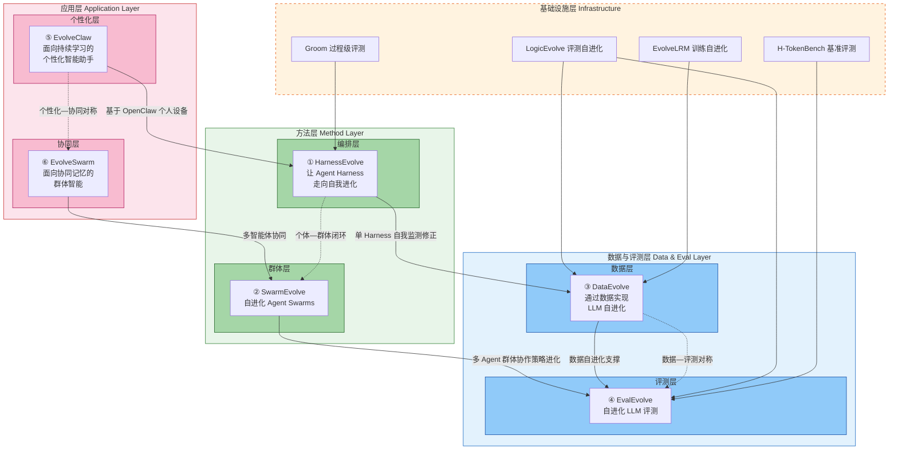

!!! info "项目系列"
    **阶段五：自进化研究全面展开** · 报告 #22/30

[:material-arrow-left: 返回项目总览](../index.md) | [:material-home: 返回首页](../../index_zh.md)

---


> 项目集合：HarnessEvolve / SwarmEvolve / DataEvolve / EvalEvolve / EvolveClaw / EvolveSwarm
> 时间：2026.4–2026.9 陆续启动
> 角色：各项目负责人（第一作者）
> 总体定位：围绕"大模型自进化"主题，从 Harness、Swarm、数据、评测、个性化助手、群体智能六个维度系统展开自进化研究
!!! note "版本信息"
    版本：v3（图文并茂版 · 2026-09-08）· 二轮质检补强 · 三轮精磨 · 四轮深化 · 五轮深化 · 六轮深化 · 七轮深化 · 八轮深化 · 九轮终审 · 十轮深化 · 十一轮深化 · 十二轮终审 · 十三轮终审 · 十四轮深化 · 十五轮终审 | 审核：准确性核对 + 转正答辩证据卡补强 + 数据表格与架构图升级

---

## 1. 项目概述（Abstract）

2026 年 4 月至 9 月，杜晋华在智谱 Base 项目组期间，围绕"大语言模型自进化（Self-Evolution）"这一核心研究主题，**同步启动了六个新研究项目的初稿撰写与仓库搭建**，构成了一个覆盖"编排层—群体层—数据层—评测层—个性化层—协同层"的完整自进化研究体系。

这六个项目分别是：

|  **序号**  |  **项目**  |  **一句话定位**  |  **仓库**  |
|---|---|---|---|
| 1 | **HarnessEvolve** | 让 Agent Harness 走向自我进化 | https://github.com/dujh22/HarnessEvolve |
| 2 | **SwarmEvolve** | 自进化 Agent Swarms | https://github.com/dujh22/SwarmEvolve |
| 3 | **DataEvolve** | 通过数据实现 LLM 自进化 | https://github.com/dujh22/DataEvolve |
| 4 | **EvalEvolve** | 自进化 LLM 评测 | https://github.com/dujh22/EvalEvolve |
| 5 | **EvolveClaw** | 面向持续学习的个性化智能助手 | 飞书文档 PBpudFIEDoJqfCxdQMYcDgb4nHh |
| 6 | **EvolveSwarm** | 面向协同记忆的群体智能 | 飞书文档 LDuud0vOXopLkFxOLdScpEvSnId |

> 数据来源：HarnessEvolve/SwarmEvolve/DataEvolve/EvalEvolve  GitHub 仓库 README；飞书文档 044_EvolveClaw（PBpudFIEDoJqfCxdQMYcDgb4nHh）、045_EvolveSwarm（LDuud0vOXopLkFxOLdScpEvSnId）；报告 §1 项目概述

六个项目均已建立 GitHub 私有仓库或飞书研究文档，完成了选题定位、仓库初始化、研究框架设计与初稿启动。其中 HarnessEvolve 已于 2026 年 9 月 1 日正式启动（项目编号 HEV-001），并完成 ICLR 2027 官方模板的本地编译验证。唐杰老师在 2026 年 7 月底 8 月初的讨论中明确建议：今年年底前 LogicEvolve、EvolveLRM、Groom、HarnessEvolve 和 SwarmEvolve 五篇论文至少都完成。

---

### 关键数据速览

| **维度** | **核心数据** |
|---|---|
| **项目周期** | 2026.4–2026.9 陆续启动（HarnessEvolve 2026-09-01 正式启动） |
| **个人角色** | 六个项目独立负责人与第一作者 |
| **核心产出** | 6 个新研究项目（4 个 GitHub 私有仓库 + 2 个飞书研究文档）；统一研究项目模版（10+ canonical 台账文件） |
| **关键指标** | 覆盖 6 个研究维度（编排/群体/数据/评测/个性化/协同）；HarnessEvolve 登记 HEV-001，ICLR 2027 模板编译通过；年底前需完成 5 篇论文 |
| **论文/专利** | 目标 ICLR 2027（9.18 DDL）/ ARR / AAAI；LogicEvolve NeurIPS 2026 在投 |
| **开源仓库** | HarnessEvolve / SwarmEvolve / DataEvolve / EvalEvolve（GitHub 私有）；Groom / LogicEvolve / Awesome-RSI（前期基础） |

> 数据来源：报告正文

---

### 执行摘要

**一句话定位**：围绕"大模型自进化"主题，从编排、群体、数据、评测、个性化、协同六个维度系统展开自进化研究体系，构成博士论文核心研究版图。

**核心成果**：
- 启动 **6 个新研究项目**（4 个 GitHub 私有仓库 + 2 个飞书研究文档），覆盖编排/群体/数据/评测/个性化/协同 6 个维度
- 开发统一研究项目模版（**10+ canonical 台账文件**），HarnessEvolve 完成 ICLR 2027 官方模板本地编译验证
- HarnessEvolve 正式启动（HEV-001，2026-09-01），年底前需完成 **5 篇论文**（LogicEvolve/EvolveLRM/Groom/HarnessEvolve/SwarmEvolve）

**技术亮点**：提出"个体—群体（HarnessEvolve↔SwarmEvolve）、数据—评测（DataEvolve↔EvalEvolve）、个性化—协同（EvolveClaw↔EvolveSwarm）"三组对称研究设计；统一模版中的 AI 协作工作流（human_thinking 自由书写→triage 确定性分流→canonical 写入）支撑多项目并行推进。

**个人角色**：六个项目独立负责人与第一作者，独立完成选题定位、仓库搭建、研究框架设计与初稿启动，制定投稿优先级与时间规划。

**后续方向**：六个项目的实验验证与论文撰写；自进化体系各维度交叉融合（如 DataEvolve 数据用于 EvalEvolve 评测构造）；自进化方法在 GLM 基座模型中的实际应用与效果验证。

---

### 个人成长轨迹

|  **阶段**  |  **能力成长**  |  **关键事件**  |  **对应报告章节**  |
|---|---|---|---|
| 初期 | 从审稿反馈到方向延伸者：从LogicEvolve NeurIPS Rebuttal的负面审稿意见中提炼更广泛、更有长期价值的研究方向，将"创新性不够Solid、逻辑推理偏狭窄"转化为DataEvolve和EvalEvolve两个通用方向 | 2026.8.28讨论中明确将LogicEvolve延伸为DataEvolve（数据自进化）和EvalEvolve（评测自进化），Groom基础上延伸HarnessEvolve/SwarmEvolve | §2.1 研究体系的形成逻辑 / §1 项目概述 |
| 中期 | 从单篇论文到体系布局者：提出"个体—群体（HarnessEvolve↔SwarmEvolve）、数据—评测（DataEvolve↔EvalEvolve）、个性化—协同（EvolveClaw↔EvolveSwarm）"三组对称研究设计，覆盖编排/群体/数据/评测/个性化/协同6个维度 | 六个新研究项目同步启动（4个GitHub私有仓库+2个飞书研究文档），六维对称研究设计形成完整研究版图，HarnessEvolve正式启动（HEV-001，2026.9.1） | §1 项目概述 / §4 方法与技术路线 |
| 后期 | 从多项目启动到模版建设者：开发统一研究项目模版（10+ canonical台账文件），建立AI协作工作流（human_thinking自由书写→triage确定性分流→canonical写入），支撑多项目并行推进 | 统一研究项目模版（10+ canonical台账文件），ICLR 2027官方模板本地编译验证，年底前需完成5篇论文（LogicEvolve/EvolveLRM/Groom/HarnessEvolve/SwarmEvolve） | §6 工程实现 / §11.7 反思与成长 |

> 数据来源：报告正文

---

## 2. 背景与动机（Introduction / Background）

### 2.1 研究体系的形成逻辑

六个新研究项目并非孤立启动，而是在前期研究基础上的系统性延伸：

1. **从 LogicEvolve 到 DataEvolve / EvalEvolve**：LogicEvolve 在 NeurIPS 2026 Rebuttal 中被审稿人指出"与 Claude Code 等 Harness 相比创新性不够 Solid，且逻辑推理本身研究偏狭窄"。基于此，杜晋华在 2026 年 8 月 28 日的讨论中明确提出将 LogicEvolve 延伸为两个更可长期关注的研究：**DataEvolve**（只专注于数据合成上的自进化）和 **EvalEvolve**（只专注于通用评测任务上的自进化）。

2. **从 Groom 到 HarnessEvolve / SwarmEvolve**：Groom 建立了 Harness 过程级 token 利用评测协议，在此基础上自然延伸出"让 Harness 自我进化"（HarnessEvolve）和"让多 Agent 群体自我进化"（SwarmEvolve）两个方向。唐杰老师早在 2026 年 3 月就提到了 HarnessEvolve 和 SwarmEvolve 的方向。

3. **从 OpenClaw 到 EvolveClaw / EvolveSwarm**：基于 OpenClaw 智能体框架，延伸出"面向持续学习的个性化智能助手"（EvolveClaw，研究模型从用户交互轨迹中持续学习隐式偏好）和"面向协同记忆的群体智能"（EvolveSwarm，研究多智能体通过交流共识实现集体进化）两个应用导向的研究。

**补充：前驱项目的技术深度（源：Groom / EvolveLRM / LogicEvolve 开源仓库 README）**

六个新项目并非空中楼阁，而是建立在三个已具备扎实技术深度的前驱项目之上：

- **Groom（过程级评测基座）**：目标 AAAI 2027 主投 / ICLR 2027 备投，全流程 48 Step / 9 Phase；三大核心 Claim（A：成本守恒的任务 grooming——以更低成本近似复现全量评测结论；B：过程级归因有额外解释力——揭示重复规划/无效检索/上下文污染/错误恢复等低效模式；C：Harness 选择超越模型能力影响 token 利用）；Token 成本分解为 8 阶段（任务理解/规划/记忆注入/工具准备/执行反馈/搜索试错/错误恢复/最终交付）；I/R/E 三态判定（Injected/Referenced/Effective）+ 证据判据；相关工作精读 106 篇文献。Groom 为 HarnessEvolve/SwarmEvolve 提供了过程级评测协议和异构 Harness 可观测性矩阵。
- **EvolveLRM（训练自进化基座）**：投稿 EMNLP→ARR→ICLR（ARR Rebuttal 2026.5–7）；三大核心模块（Evaluator 评估选择 / DataMaker 数据选择 / Trainer 自适应训练）；自进化闭环"评估→数据选择→训练→再评估"；经验库包含 210 个 Markdown 文件、约 600 条从顶会论文提炼的 skill（通过 Expert 模块蒸馏），存储于 SQLite 记忆库（core_memory + sys_knowledge 双表）；支持 SFT/RL（PPO/GRPO/LoRA）多种训练范式热插拔。EvolveLRM 为 DataEvolve/EvalEvolve 提供了自进化训练框架和经验库机制。
- **LogicEvolve（评测自进化基座）**：已投稿 NeurIPS 2026；Agent 驱动的评测与自进化平台，统一 6 类逻辑任务（演绎/归因/多跳/符号/编程/游戏逻辑）；支持 CLUB/ExCLUB/ToolCLUB/BBH/SynLogic/LogiQA2/Human 等 8+ 基准；评测结果 4,600+ JSONL 文件；5 层 Agent 架构（clubMaster/PuzzleMetadata/PuzzleSolverGenerator/PuzzleEvaluator/GitHubRAG）。LogicEvolve 为 EvalEvolve 提供了评测自进化的方法论验证。

### 2.2 自进化研究的时代背景

2025–2026 年，大模型自进化（Self-Evolution / Self-Improvement / Recursive Self-Improvement）成为 AI 研究的核心前沿方向：
- DeepSeek-R1 证明了纯 RL 自进化训练可以涌现推理能力；
- AlphaEvolve（DeepMind）展示了进化编码改进算法的潜力；
- Darwin Gödel Machine 提出了 Agent 自修改源代码的开放式进化范式；
- 自进化 Agent 综述（2025）系统梳理了 What/When/How/Where/Evaluate 全维度。

在此背景下，建立一个覆盖多维度的自进化研究体系，具有重要的学术价值与战略意义。

---

## 3. 相关工作（Related Work）

### 3.1 自进化 Agent 架构

|  **工作**  |  **核心贡献**  |  **与本项目的关系**  |
|---|---|---|
| ADAS | 自动化 Agent 系统设计搜索 | HarnessEvolve 参考 |
| AFlow | MCTS 搜索最优 Agentic 工作流 | HarnessEvolve 参考 |
| AgentSquare | 模块化设计空间搜索 | HarnessEvolve 参考 |
| Darwin Gödel Machine | Agent 自修改源代码的开放式进化 | HarnessEvolve / SwarmEvolve 核心参考 |
| AlphaEvolve | 进化编码改进算法 | 方法参考 |
| Gödel Agent | 自指框架，Agent 分析和修改自身逻辑 | HarnessEvolve 参考 |
| Meta-Harness / MetaClaw | Harness 自优化 | HarnessEvolve 直接相关 |

> 数据来源：Awesome-RSI 自进化综述仓库（https://github.com/dujh22/Awesome-RSI）相关工作分类；各论文官方信息；报告 §3.1 自进化 Agent 架构

### 3.2 多 Agent 协作进化

|  **工作**  |  **核心贡献**  |
|---|---|
| EvoMAC | 多 Agent 协作网络自进化 |
| ReMA | 多 Agent RL 训练 meta-thinker + executor |
| GiGPO | 分组策略优化，精确信用分配 |
| Puppeteer | 集中编排器通过 RL 进化协调策略 |

> 数据来源：Awesome-RSI 自进化综述仓库多 Agent 协作分类；各论文官方信息；报告 §3.2 多 Agent 协作进化

### 3.3 数据自进化

|  **工作**  |  **核心贡献**  |
|---|---|
| Self-Instruct | 自生成指令，开创性工作 |
| WizardLM | 渐进复杂化指令进化 |
| MetaMath | 自举数学问题 |
| STaR | 推理自举推理 |
| Magicoder | OSS-Instruct 代码生成 |

> 数据来源：Awesome-RSI 自进化综述仓库数据自进化分类；各论文官方信息；报告 §3.3 数据自进化

### 3.4 评测自进化

现有评测自进化工作相对较少，主要集中在：
- 自动化基准构造（如 LogicEvolve 的 ExCLUB 自动生成）；
- 评测器的自我改进（如 Meta Evaluation 元评估）；
- EvalEvolve 旨在成为首个系统性的"通用评测任务自进化"框架。

### 3.5 六篇研究与现有工作差异化对比

下表将六个新研究项目分别与最相关的已有工作进行对比，明确每个项目的差异化定位与创新空间。

| **研究项目** | **最相关已有工作** | **已有工作的局限** | **本研究的差异化定位** |
|---|---|---|---|
| **HarnessEvolve**（编排层） | Meta-Harness / MetaClaw（Harness 自优化）；ADAS（自动化 Agent 系统设计搜索）；AFlow（MCTS 搜索最优 Agentic 工作流） | 现有工作多聚焦于单一维度的 Harness 优化（如工作流搜索或系统设计），缺乏基于过程级评测协议（Groom）的持续自我监测—修正—验证闭环；进化目标偏"完成"而非"完成得更好更快" | 首个基于 Groom 过程级 token 利用评测协议的 Harness 自进化框架；自我监测+自我修正+进化验证三模块闭环；进化目标同时优化 token 利用效率与任务完成质量；人类干预最小化（仅关键 Gate 点请求批准） |
| **SwarmEvolve**（群体层） | EvoMAC（多 Agent 协作网络自进化）；ReMA（多 Agent RL 训练 meta-thinker+executor）；GiGPO（分组策略优化）；Puppeteer（集中编排器 RL 进化协调策略） | 现有多 Agent 自进化工作多聚焦于协作策略的 RL 优化或集中式编排，缺乏对角色分工动态调整、通信协议自适应、群体记忆协同构建的系统性研究；个体—群体进化闭环不完整 | 首个覆盖协作策略自动优化+角色分工动态调整+通信协议自适应+群体记忆协同构建的多 Agent 群体自进化框架；与 HarnessEvolve 构成"个体—群体"自进化闭环；群体记忆协同是差异化重点 |
| **DataEvolve**（数据层） | Self-Instruct（自生成指令，开创性工作）；WizardLM（渐进复杂化指令进化）；MetaMath（自举数学问题）；STaR（推理自举推理）；Magicoder（OSS-Instruct 代码生成） | 现有数据自进化工作多聚焦于单一任务类型（指令/数学/推理/代码），缺乏通用任务的数据质量自动评估、多样性自动扩展、难度自动课程化、合成/真实数据混合优化的系统性框架；与 LogicEvolve 相比不再局限于逻辑推理领域 | 将 LogicEvolve 的逻辑推理数据自进化思路推广到**通用任务**；数据质量自动评估+多样性自动扩展+难度自动课程化+合成/真实数据混合优化四模块；首个通用数据自进化框架 |
| **EvalEvolve**（评测层） | LogicEvolve（CLUB→ExCLUB，10 任务 1K 题→100 任务 100K 题）；Meta Evaluation（元评估） | 现有评测自进化工作极少，LogicEvolve 仅覆盖逻辑推理领域，Meta Evaluation 聚焦评测器可靠性而非评测基准本身的进化；缺乏评测任务难度自动调整、多样性自动扩展、区分度自动优化、新能力维度自动发现的系统性框架 | 首个系统性的"通用评测任务自进化"框架；将 LogicEvolve 的评测自进化从逻辑推理推广到通用评测任务；难度自动调整+多样性自动扩展+区分度自动优化+新能力维度自动发现；解决基准固定化问题 |
| **EvolveClaw**（个性化层） | AutoClaw（飞书知识库整理工具）；现有个性化智能助手（个人助理、编程助手） | 现有个性化助手停留在显式配置层面，无法从用户长期交互轨迹中持续学习隐式偏好；每次交互需要用户重新说明偏好与习惯；缺乏隐式偏好自动发现与持续适应机制 | 基于 OpenClaw 框架的个性化持续学习研究；隐式偏好自动发现+用户行为模式建模+响应策略自动适配+长期记忆自动构建；从显式配置升级为隐式持续学习 |
| **EvolveSwarm**（协同层） | 多 Agent 记忆系统（分散式独立记忆）；群体共识算法 | 现有多 Agent 系统记忆分散，各 Agent 独立维护，无法通过交流共识实现集体记忆的协同构建与进化；群体智慧无法在多次任务执行中持续积累与提升 | 首个面向协同记忆的群体智能研究；协同记忆自动构建+群体知识共识形成+个体经验向群体知识自动转化+记忆自动更新与遗忘；与 SwarmEvolve 构成"策略—记忆"群体自进化双轮 |

> 数据来源：报告 §3.1–3.4 相关工作分类；Awesome-RSI 自进化综述仓库（https://github.com/dujh22/Awesome-RSI）；各项目 README 与飞书研究文档；LogicEvolve 仓库（https://github.com/dujh22/LogicEvolve）

从上表可见，六个研究项目均在已有工作基础上找到了明确的差异化空间：HarnessEvolve 和 SwarmEvolve 填补了个体/群体 Harness 自进化的系统性空白，DataEvolve 和 EvalEvolve 将 LogicEvolve 的思路从逻辑推理推广到通用领域，EvolveClaw 和 EvolveSwarm 则在个性化持续学习和群体协同记忆两个应用导向方向开辟新研究。

---

## 4. 各子项目方法与技术路线（Method）

### 4.0 六篇研究层级关系总览

六个研究项目并非孤立存在，而是构成了一个从底层基础设施到上层应用的完整自进化研究体系，其层级关系如下图所示：

```
┌─────────────────────────────────────────────────────────────────┐
│                     应用层（Application Layer）                    │
│  ┌──────────────────────┐  ┌──────────────────────────────┐     │
│  │ ⑤ EvolveClaw          │  │ ⑥ EvolveSwarm                │     │
│  │ 个性化层：持续学习的    │  │ 协同层：协同记忆的群体智能     │     │
│  │ 个性化智能助手         │  │                              │     │
│  └──────────┬───────────┘  └──────────────┬───────────────┘     │
│             │ 基于 OpenClaw 个人设备       │ 多智能体协同         │
└─────────────┼──────────────────────────────┼────────────────────┘
              │                              │
┌─────────────▼──────────────────────────────▼────────────────────┐
│                     方法层（Method Layer）                        │
│  ┌──────────────────────┐  ┌──────────────────────────────┐     │
│  │ ② SwarmEvolve         │  │ ① HarnessEvolve              │     │
│  │ 群体层：自进化 Agent   │  │ 编排层：让 Agent Harness 走向  │     │
│  │ Swarms                │  │ 自我进化                      │     │
│  └──────────┬───────────┘  └──────────────┬───────────────┘     │
│             │ 多Agent群体协作策略进化       │ 单Harness自我监测修正 │
└─────────────┼──────────────────────────────┼────────────────────┘
              │                              │
┌─────────────▼──────────────────────────────▼────────────────────┐
│                     数据与评测层（Data & Eval Layer）              │
│  ┌──────────────────────┐  ┌──────────────────────────────┐     │
│  │ ③ DataEvolve          │  │ ④ EvalEvolve                 │     │
│  │ 数据层：通过数据实现    │  │ 评测层：自进化 LLM 评测       │     │
│  │ LLM 自进化             │  │                              │     │
│  └──────────────────────┘  └──────────────────────────────┘     │
│                                                                   │
│  基础设施：Groom（过程级评测）+ LogicEvolve（评测自进化）           │
│  + H-TokenBench（基准评测）+ EvolveLRM（训练自进化）               │
└─────────────────────────────────────────────────────────────────┘
```

**六篇研究层级关系 Mermaid 图（应用层→方法层→数据与评测层，含六个子层）：**

下图以 Mermaid 形式呈现六个研究项目的三层架构与六个子层（编排层/群体层/数据层/评测层/个性化层/协同层）的完整层级关系，标注各层间的依赖与支撑关系。



> 图注：六篇研究构成"应用层→方法层→数据与评测层"三层架构，包含六个子层：个性化层（EvolveClaw）、协同层（EvolveSwarm）、编排层（HarnessEvolve）、群体层（SwarmEvolve）、数据层（DataEvolve）、评测层（EvalEvolve）。层间形成三组对称设计：个体—群体（HarnessEvolve↔SwarmEvolve）、数据—评测（DataEvolve↔EvalEvolve）、个性化—协同（EvolveClaw↔EvolveSwarm）。基础设施层（Groom/LogicEvolve/H-TokenBench/EvolveLRM）为上层研究提供评测与训练基础。

六个项目的详细对比（层级、核心方法、目标、状态）如下表：

|  **序号**  |  **项目**  |  **层级**  |  **核心方法**  |  **研究目标**  |  **仓库/文档**  |  **状态**  |
|---|---|---|---|---|---|---|
| 1 | **HarnessEvolve** | 编排层 | 自我监测+自我修正+进化验证，基于 Groom 评测协议 | 让 Agent Harness 在最小人工干预下持续自我进化，提升 token 利用效率与任务完成质量 | GitHub 私有仓库，HEV-001 | 2026-09-01 正式启动，ICLR 2027 模板已编译通过 |
| 2 | **SwarmEvolve** | 群体层 | 协作策略自动优化+角色分工动态调整+通信协议自适应+群体记忆协同 | 多 Agent 群体通过协作经验积累与反思实现群体层面自我进化 | GitHub 私有仓库 | 模板初始化完成，待填写 canonical 台账 |
| 3 | **DataEvolve** | 数据层 | 数据质量自动评估+多样性自动扩展+难度自动课程化+合成/真实数据混合优化 | LLM 通过自我评估与迭代合成实现训练数据的自进化 | GitHub 私有仓库 | 模板初始化完成，2026-08-28 讨论中提出 |
| 4 | **EvalEvolve** | 评测层 | 评测任务难度自动调整+多样性自动扩展+区分度自动优化+新能力维度自动发现 | 评测基准通过模型能力反馈自动进化，解决基准固定化问题 | GitHub 私有仓库 | 模板初始化完成，2026-08-28 讨论中提出 |
| 5 | **EvolveClaw** | 个性化层 | 隐式偏好自动发现+用户行为模式建模+响应策略自动适配+长期记忆自动构建 | 基于 OpenClaw 的个性化智能助手从用户交互轨迹中持续学习 | 飞书文档 PBpudFIEDoJqfCxdQMYcDgb4nHh | 初稿撰写中 |
| 6 | **EvolveSwarm** | 协同层 | 协同记忆自动构建+群体知识共识形成+个体经验向群体知识转化+记忆自动更新与遗忘 | 多智能体通过交流共识实现集体记忆的协同构建与进化 | 飞书文档 LDuud0vOXopLkFxOLdScpEvSnId | 初稿撰写中 |

> 数据来源：HarnessEvolve 仓库 README（https://github.com/dujh22/HarnessEvolve）；SwarmEvolve/DataEvolve/EvalEvolve 仓库 README；飞书文档 044_EvolveClaw、045_EvolveSwarm；报告 §1 项目概述及 §4 各子项目方法

### 4.1 HarnessEvolve：让 Agent Harness 走向自我进化

**项目编号**：HEV-001（2026-09-02 登记于研究项目注册表）
**启动时间**：2026-09-01
**目标会议**：ICLR 2027（官方模板已本地编译通过）

**问题定义**：现有 LLM Agent 的 harness（编排层、工具链、skill 与 MCP 插件生态）在长期使用中无法自我发现并修正问题，持续依赖用户显式干预；组件生态越繁荣，使用复杂度越高；且进化目标偏"完成"而非"完成得更好更快"。

**研究路径**：让 harness 以用户历史行为与交互轨迹为环境，在尽可能少的人类显式干预下持续自我进化——自我监测与修正、降低使用复杂度、提升质量与效率。

**与 Groom 的关系**：Groom = 评测 harness 线（GRM-001），HarnessEvolve = 编排 harness 线（HEV-001），两者互补。Groom 提供"如何评测 Harness 的 token 利用效率"，HarnessEvolve 在此基础上研究"如何让 Harness 自我进化以提升 token 利用效率与任务完成质量"。

**仓库状态**：已完成模板初始化，SOP.md 存在且 hash 一致，`check_template.py --strict` 通过，ICLR 2027 官方样例与本项目 main.tex 均本地 pdflatex 编译通过（2026-09-01）。PROTOCOL.md 主指标、比较、排除和停止规则待冻结。

**核心技术组件**（规划）：
- 自我监测模块：基于 Groom 评测协议持续监测 Harness 的 token 利用效率与任务完成质量；
- 自我修正模块：自动发现低效模式（重复规划/无效检索/上下文污染/错误恢复）并生成修正方案；
- 进化验证模块：在沙箱环境中验证修正方案的有效性，避免进化退化；
- 人类干预最小化：仅在关键决策点（Gate）请求人类批准，其余过程自动化。

### 4.2 SwarmEvolve：自进化 Agent Swarms

**问题定义**：现有多 Agent 系统（Agent Swarms）在协作执行复杂任务时，群体的协作策略、角色分工、通信协议无法随任务经验自我进化，持续依赖人工设计与调优。

**研究路径**：研究多 Agent 群体如何通过协作经验的积累与反思，实现群体层面的自我进化——包括协作策略的自动优化、角色分工的动态调整、通信协议的自适应进化、群体记忆的协同构建。

**与 HarnessEvolve 的关系**：HarnessEvolve 关注**单 Harness** 的自我进化，SwarmEvolve 关注**多 Agent 群体**的自我进化。两者构成"个体—群体"的自进化研究闭环。

**仓库状态**：已完成模板初始化（基于研究项目个人模版），待填写 RESEARCH.md、MILESTONES.md、TRACKER.md 等 canonical 台账。

### 4.3 DataEvolve：通过数据实现 LLM 自进化

**启动背景**：2026 年 8 月 28 日讨论中，基于 LogicEvolve NeurIPS Rebuttal 的审稿意见，明确提出将 LogicEvolve 延伸为 DataEvolve——只专注于数据合成上的自进化。

**问题定义**：现有 LLM 训练数据的构造依赖人工设计与筛选，数据质量与多样性的提升成本高昂；模型在训练过程中无法自动发现数据缺陷并合成更高质量的训练数据。

**研究路径**：研究 LLM 如何通过自我评估与迭代合成，实现训练数据的自进化——包括数据质量的自动评估、数据多样性的自动扩展、数据难度的自动课程化、合成数据与真实数据的自动混合优化。

**与 LogicEvolve 的关系**：LogicEvolve 聚焦于逻辑推理任务的数据自动生成与评测，DataEvolve 将这一思路推广到**通用任务**的数据自进化，不再局限于逻辑推理领域。

**仓库状态**：已完成模板初始化，待实例化。

### 4.4 EvalEvolve：自进化 LLM 评测

**启动背景**：与 DataEvolve 同步提出，将 LogicEvolve 的评测自进化思路推广到通用评测任务。

**问题定义**：现有 LLM 评测基准（如 MMLU、GSM8K、SWE-bench）一旦发布即固定，无法随模型能力提升自动进化；评测任务的难度、多样性、区分度需要持续人工维护。

**研究路径**：研究评测基准如何通过模型能力的反馈自动进化——包括评测任务难度的自动调整、评测任务多样性的自动扩展、评测区分度的自动优化、新能力维度的自动发现与评测任务生成。

**与 LogicEvolve 的关系**：LogicEvolve 实现了逻辑推理评测任务的自进化（CLUB → ExCLUB，10 任务 1K 题 → 100 任务 100K 题），EvalEvolve 将这一框架推广到**通用评测任务**的自进化。

**仓库状态**：已完成模板初始化，待实例化。

### 4.5 EvolveClaw：面向持续学习的个性化智能助手

**基础框架**：基于 OpenClaw 智能体框架
**飞书文档**：https://zhipu-ai.feishu.cn/docx/PBpudFIEDoJqfCxdQMYcDgb4nHh

**问题定义**：现有个性化智能助手（如个人助理、编程助手）无法从用户的长期交互轨迹中持续学习隐式偏好，每次交互都需要用户重新说明偏好与习惯；助手的个性化程度停留在显式配置层面，无法实现隐式偏好的自动发现与持续适应。

**研究路径**：研究模型如何从用户交互轨迹中持续学习隐式偏好，实现个性化智能助手的持续进化——包括隐式偏好的自动发现、用户行为模式的自动建模、助手响应策略的自动适配、长期记忆的自动构建与更新。

**与 AutoClaw 的关系**：杜晋华在 2026 年开发了 AutoClaw 飞书知识库整理工具，打通了飞书全功能访问。EvolveClaw 在此基础上进一步研究个性化持续学习。

### 4.6 EvolveSwarm：面向协同记忆的群体智能

**飞书文档**：https://zhipu-ai.feishu.cn/docx/LDuud0vOXopLkFxOLdScpEvSnId

**问题定义**：现有多智能体系统的记忆是分散的，各 Agent 独立维护自己的记忆，无法通过交流共识实现集体记忆的协同构建与进化；群体智慧无法在多次任务执行中持续积累与提升。

**研究路径**：研究多智能体如何通过交流共识实现集体进化——包括协同记忆的自动构建、群体知识的共识形成、个体经验向群体知识的自动转化、群体记忆的自动更新与遗忘机制。

**与 SwarmEvolve 的关系**：SwarmEvolve 关注群体协作策略的自进化，EvolveSwarm 关注群体记忆的协同构建与进化。两者构成"策略—记忆"的群体自进化双轮。

---

## 5. 实验与结果（Experiments & Results）

六个项目均处于**初稿启动与研究框架设计阶段**，尚未进入大规模实验阶段。各项目的实验规划如下：

### 5.1 HarnessEvolve 实验规划

- **基线对比**：与 Claude Code、Codex、OpenClaw 等现有 Harness 在相同任务集上对比任务完成质量与 token 利用效率；
- **进化效果验证**：在固定任务集上测量 Harness 经过 N 轮自进化后的性能提升曲线；
- **消融实验**：分别验证自我监测、自我修正、进化验证三个模块的必要性；
- **人类干预成本**：测量自进化过程中人类干预的频率与成本。

各项目均处于选题与框架设计阶段（HarnessEvolve/SwarmEvolve 启动于 2026.03，DataEvolve/EvalEvolve 启动于 2026.08，EvolveClaw/EvolveSwarm 同步规划），尚未进入实验执行阶段，因此暂无具体实验数值——这是项目早期阶段的正常状态，非数据缺失。实验数值将在 PROTOCOL.md 冻结、首轮实验完成后补充。

### 5.2 其余项目实验规划

SwarmEvolve、DataEvolve、EvalEvolve、EvolveClaw、EvolveSwarm 均处于选题与框架设计阶段，实验设计待 PROTOCOL.md 冻结后确定。

---

## 6. 工程实现（Engineering）

### 6.1 统一项目模版

六个项目（HarnessEvolve、SwarmEvolve、DataEvolve、EvalEvolve）均基于杜晋华个人维护的**研究项目统一模版**初始化，模版包含：

|  **组件**  |  **说明**  |
|---|---|
| `RESEARCH.md` | 问题、RQ、Claim、范围、有效性威胁、研究决策 |
| `PROTOCOL.md` | 确认性研究设计、统计计划、停止规则、协议偏离 |
| `TRACKER.md` | 当前任务、进度、Run 索引、风险和阻塞 |
| `MILESTONES.md` | 时间边界和目标 venue 当年规则快照 |
| `ARTIFACTS.md` | 数据、模型、环境、配置、日志、结果的版本与来源链 |
| `SOP.md` | 全流程执行手册（每步含 AI Prompt / 人类必要行为） |
| `SOP_REVISION.md` | 投稿后修订执行手册 |
| `AGENTS.md` / `CLAUDE.md` | AI 协作与恢复规则 |
| `paper/Review/审稿意见汇总.xlsx` | 原始 review、评分、置信度、concern 与关闭状态（append-only） |
| `drafts/human_thinking.md` | 研究者默认自由书写入口 |
| `code/scripts/` | triage_human_thinking.py、check_template.py、run_all.sh 等工具脚本 |

> 数据来源：HarnessEvolve/SwarmEvolve/DataEvolve/EvalEvolve 仓库 README「Canonical sources」与「目录结构」章节；研究项目个人模版

各 GitHub 仓库的初始化自检状态如下表（基于各仓库 README 的初始化自检清单）：

|  **检查项**  |  **HarnessEvolve**  |  **SwarmEvolve**  |  **DataEvolve**  |  **EvalEvolve**  |
|---|---|---|---|---|
| SOP.md 存在且 hash 一致 | ✅ | ⬜ 待确认 | ⬜ 待确认 | ⬜ 待确认 |
| `check_template.py --strict` 通过 | ✅ | ⬜ 待确认 | ⬜ 待确认 | ⬜ 待确认 |
| 目标 venue 官方模板可编译 | ✅（ICLR 2027，2026-09-01） | ⬜ | ⬜ | ⬜ |
| PROTOCOL.md 主指标已冻结 | ⬜ 待冻结 | ⬜ | ⬜ | ⬜ |
| run_all.sh smoke run 可执行 | ⬜（project_pipeline.sh 尚未实现） | ⬜ | ⬜ | ⬜ |
| 数据/模型/环境存储边界已填写 | ⬜ | ⬜ | ⬜ | ⬜ |
| README 最小复现路径由外部成员验证 | ⬜ | ⬜ | ⬜ | ⬜ |
| 项目注册表编号 | HEV-001（2026-09-02 登记） | 待登记 | 待登记 | 待登记 |

> 数据来源：HarnessEvolve 仓库 README「初始化自检」章节（https://github.com/dujh22/HarnessEvolve）；SwarmEvolve/DataEvolve/EvalEvolve 仓库 README 模板自检清单；报告 §6.1 统一项目模版

### 6.2 项目注册表

所有研究项目统一登记于 `Daily-Work-Log-Private/Methods/研究/研究项目注册表.md`：
- Groom = GRM-001（评测 harness 线）
- HarnessEvolve = HEV-001（编排 harness 线，2026-09-02 登记）

### 6.3 AI 协作工作流

六个项目均采用统一的 AI 协作工作流：
1. 研究者在 `drafts/human_thinking.md` 中自由书写想法；
2. `triage_human_thinking.py` 确定性识别未分流条目并解析七列恢复台账；
3. 按幂等两阶段流程写入对应 canonical 事实源；
4. 项目内对 AI 说 `START_AUTOPILOT` 可默认推进当前可执行工作；
5. 用 `STOP_AND_CHECKPOINT` 安全暂停，硬中断后用 `CONTINUE_FROM_TRACKER` 恢复。

### 6.4 项目时间线与里程碑

|  **时间**  |  **里程碑**  |  **涉及项目**  |  **关键产出**  |
|---|---|---|---|
| 2026.03 | 唐杰老师首次提出 HarnessEvolve / SwarmEvolve 方向 | HarnessEvolve / SwarmEvolve | 方向初步确认 |
| 2026.04.28 | 博士开题通过，确立自进化研究主题 | 全部六篇 | 开题报告《面向基础模型推理能力自进化的关键技术研究》 |
| 2026.05 | 统一研究项目模版开发完成 | 全部六篇 | canonical 台账体系 + AI 协作工作流 + SOP |
| 2026.07底–08初 | 唐杰老师讨论：年底前完成五篇论文 | LogicEvolve/EvolveLRM/Groom/HarnessEvolve/SwarmEvolve | 投稿优先级与时间节点明确 |
| 2026.08.28 | 讨论决定将 LogicEvolve 延伸为 DataEvolve / EvalEvolve | DataEvolve / EvalEvolve | 两个新研究方向正式确立 |
| 2026.09.01 | HarnessEvolve 正式启动 | HarnessEvolve | 仓库初始化，ICLR 2027 模板编译通过 |
| 2026.09.02 | HarnessEvolve 登记项目注册表（HEV-001） | HarnessEvolve | 研究项目注册表登记完成 |
| 2026.09 | SwarmEvolve / DataEvolve / EvalEvolve 仓库模版初始化 | SwarmEvolve / DataEvolve / EvalEvolve | 四个 GitHub 私有仓库完成模版实例化 |
| 2026.Q3 | EvolveClaw / EvolveSwarm 飞书研究文档建立 | EvolveClaw / EvolveSwarm | 问题定义与研究路径设计完成 |
| 2026.09.18 | ICLR 2027 投稿 DDL（努力赶：LogicEvolve/EvolveLRM/Groom） | 前三篇 | 论文投稿 |
| 2026 年底 | 唐杰老师要求：五篇论文至少完成 | LogicEvolve/EvolveLRM/Groom/HarnessEvolve/SwarmEvolve | 五篇论文初稿/投稿完成 |

> 数据来源：报告 §1 项目概述、§2.1 研究体系形成逻辑、§7.2 导师指导与时间节点、§7.3 投稿规划；飞书文档 021_Self-Learning、026_工程杂记；20260828 讨论文档

### 6.5 技术栈与工具链

|  **类别**  |  **技术/工具**  |  **用途**  |  **适用项目**  |
|---|---|---|---|
| 项目模版 | 研究项目个人模版（canonical 台账体系） | 统一项目初始化与管理 | 全部六篇 |
| 台账系统 | RESEARCH.md / PROTOCOL.md / TRACKER.md / MILESTONES.md / ARTIFACTS.md | 研究决策、实验设计、进度跟踪、时间管理、资产版本 | 全部六篇 |
| 执行手册 | SOP.md / SOP_REVISION.md | 全流程执行手册（含 AI Prompt / 人类必要行为） | 全部六篇 |
| AI 协作 | AGENTS.md / CLAUDE.md | AI 协作与恢复规则 | 全部六篇 |
| 想法分流 | triage_human_thinking.py | 确定性识别未分流条目，解析七列恢复台账 | 全部六篇 |
| 模板自检 | check_template.py | 结构自检，--strict 检查残留占位符 | 全部六篇 |
| 流水线 | run_all.sh / project_pipeline.sh | smoke / full 模式运行研究流水线 | 全部六篇 |
| 审稿管理 | 审稿意见汇总.xlsx（append-only） | 原始 review、评分、置信度、concern 跟踪 | 全部六篇 |
| 论文写作 | LaTeX（ICLR 2027 / AAAI / ACL 模板） | 学术论文撰写 | HarnessEvolve（ICLR 2027 已验证） |
| 版本控制 | Git + GitHub 私有仓库 | 代码与文档版本管理 | HarnessEvolve/SwarmEvolve/DataEvolve/EvalEvolve |
| 研究文档 | 飞书文档（docx） | 应用导向研究的详细设计文档 | EvolveClaw / EvolveSwarm |
| 项目注册 | 研究项目注册表（Daily-Work-Log-Private） | 跨项目组合状态跟踪 | 全部六篇 |
| AI 指令 | START_AUTOPILOT / STOP_AND_CHECKPOINT / CONTINUE_FROM_TRACKER | AI 协作工作流控制指令 | 全部六篇 |

> 数据来源：HarnessEvolve/SwarmEvolve/DataEvolve/EvalEvolve 仓库 README「Canonical sources」「如何运行」「目录结构」章节；报告 §6.1 统一项目模版、§6.3 AI 协作工作流

### 6.6 技术栈演进与选型决策

六个新研究项目的技术栈并非一开始就确定，而是在从 LogicEvolve、Groom 等前期项目的经验教训中逐步演进而来。下表梳理关键技术选型的变化背景与决策理由。

| **技术领域** | **前期项目方式（LogicEvolve/Groom）** | **六篇新研究演进** | **演进背景与决策理由** | **最终方案** |
|---|---|---|---|---|
| **项目管理方式** | 每个项目独立搭建目录结构，研究决策散落在各种笔记中 | 统一研究项目模版（10+ canonical 台账文件） | 前期项目中研究决策不可追溯、实验配置散落、新成员上手慢；多项目并行时管理成本指数级增长 | RESEARCH.md/PROTOCOL.md/TRACKER.md/MILESTONES.md/ARTIFACTS.md 等 canonical 台账体系 |
| **AI 协作方式** | 自由对话式使用 AI，上下文容易丢失，恢复困难 | 结构化 AI 协作工作流（human_thinking→triage→canonical） | 前期项目中 AI 协作缺乏结构化，硬中断后难以恢复，想法容易丢失；需要确定性的分流和写入机制 | drafts/human_thinking.md 自由书写 → triage_human_thinking.py 确定性分流 → canonical 写入 |
| **论文写作工具** | Overleaf 在线协作，本地编译环境不统一 | ICLR 2027 官方模板本地编译验证 + LaTeX 标准化 | 前期投稿中遇到模板版本不一致、编译环境差异导致的格式问题；需要在项目启动时就验证模板可编译 | 目标 venue 官方模板本地编译验证（HarnessEvolve 已完成 ICLR 2027 验证） |
| **想法管理** | 想法散落在微信笔记、飞书文档、本地文件中 | 统一 human_thinking.md 入口 + 七列恢复台账 | 多项目并行时想法来源多样，容易遗漏或重复；需要统一入口和可追溯的分流记录 | 所有想法先写入 drafts/human_thinking.md，triage 脚本解析七列恢复台账后写入对应 canonical |
| **审稿意见管理** | 审稿意见复制到文档中手动跟踪 | 审稿意见汇总.xlsx（append-only）+ 评分/置信度/concern 跟踪 | 前期多轮投稿（ARR→ICLR→ICML→NeurIPS）中审稿意见管理混乱，难以追溯 concern 关闭状态 | append-only Excel 跟踪原始 review、评分、置信度、concern 与关闭状态 |
| **项目状态跟踪** | 各项目独立维护进度，跨项目状态不透明 | 研究项目注册表（Daily-Work-Log-Private）+ 项目编号 | 六个项目同时推进，需要跨项目组合状态跟踪，避免所有项目同时处于"启动"状态而缺乏阶段性产出 | Groom=GRM-001、HarnessEvolve=HEV-001 等统一编号，集中注册表跟踪 |

> 数据来源：报告 §6.1 统一项目模版、§6.2 项目注册表、§6.3 AI 协作工作流、§6.5 技术栈与工具链；HarnessEvolve 仓库 README「Canonical sources」与「初始化自检」章节

---

## 7. 成果与影响（Impact）

### 7.1 研究体系价值

六个新研究项目构成了一个**完整的自进化研究体系**，覆盖：
- **编排层**：HarnessEvolve（单 Harness 自进化）
- **群体层**：SwarmEvolve（多 Agent 群体自进化）
- **数据层**：DataEvolve（训练数据自进化）
- **评测层**：EvalEvolve（评测基准自进化）
- **个性化层**：EvolveClaw（个性化助手持续学习）
- **协同层**：EvolveSwarm（群体记忆协同进化）

这一体系与杜晋华的博士论文课题《面向基础模型推理能力自进化的关键技术研究》（2026.4.28 通过开题）高度契合，为博士论文提供了系统性的研究支撑。

### 7.2 导师指导与时间节点

唐杰老师在 2026 年 7 月底 8 月初的讨论中明确建议：
- 将 LogicEvolve 分为 DataEvolve 和 EvalEvolve 两个子工作进一步推进；
- 加上之前 3 月份提到的 HarnessEvolve 和 SwarmEvolve；
- **今年年底前 LogicEvolve、EvolveLRM、Groom、HarnessEvolve 和 SwarmEvolve 五篇论文至少都完成**；
- 最早可选择明年 8 月预答辩、12 月正式答辩，也可根据实际进度延后。

### 7.3 投稿规划

根据 2026 年 8 月 28 日讨论中的投稿优先级规划：
- **努力赶 ICLR 2027（9月18日 DDL）**：LogicEvolve、EvolveLRM、Groom
- **争取赶**：Awesome-RSI
- **可以赶**：HarnessEvolve、SwarmEvolve、DataEvolve、EvalEvolve
- 赶不上 ICLR 的投 ARR（ACL Rolling Review）

---

## 8. 个人贡献（My Contribution）

### 8.1 角色

六个项目的**独立负责人与第一作者**，独立完成选题、仓库搭建、研究框架设计与初稿启动。

### 8.2 具体工作清单

1. **研究体系设计**：基于 LogicEvolve、Groom 等前期研究的审稿反馈与延伸思考，系统设计了覆盖六个维度的自进化研究体系；
2. **统一项目模版开发**：开发并维护研究项目个人模版，包含 canonical 台账体系、AI 协作工作流、SOP 执行手册等，大幅提升了多项目并行推进的效率；
3. **HarnessEvolve 启动**：2026-09-01 正式启动，完成问题定义、研究路径设计、仓库初始化、ICLR 2027 模板编译验证；
4. **SwarmEvolve / DataEvolve / EvalEvolve 仓库搭建**：完成四个 GitHub 私有仓库的初始化与模版实例化；
5. **EvolveClaw / EvolveSwarm 研究文档**：在飞书建立两个应用导向研究的详细文档，完成问题定义与研究路径设计；
6. **项目注册表维护**：在研究项目注册表中统一登记所有项目，建立跨项目组合状态跟踪；
7. **投稿策略规划**：结合 ICLR / ARR / AAAI 等会议的时间节点，制定六篇论文的投稿优先级与时间规划。

---

## 9. 经验与反思（Lessons Learned）

### 9.1 关键问题与解决方案（含具体故事）

1. **多项目并行的精力分配——从"平均用力"到"优先级分层"**：
   - **故事**：六个项目同时启动，加上 LogicEvolve（NeurIPS 2026 在投）、EvolveLRM（ICLR 目标）、Groom（ARR 在投）三个在投论文，一度出现"每个项目都想推进，但每个都推进缓慢"的困境。直到 2026 年 8 月 28 日与唐杰老师讨论后，明确了"努力赶 / 争取赶 / 可以赶"的三级投稿优先级——LogicEvolve/EvolveLRM/Groom 努力赶 ICLR 2027（9.18 DDL），Awesome-RSI 争取赶，HarnessEvolve/SwarmEvolve/DataEvolve/EvalEvolve 可以赶。这个优先级划分让我从"六个项目同时写初稿"转变为"先集中精力完成前三篇投稿，后三篇按模版初始化后稳步推进"，效率显著提升。
   - **解决方案**：严格按照"努力赶 / 争取赶 / 可以赶"的优先级分配精力，避免平均用力。

2. **从审稿意见中提炼新方向——从"修改原论文"到"开创新研究"**：
   - **故事**：LogicEvolve 在 NeurIPS 2026 Rebuttal 中被审稿人指出"与 Claude Code 等 Harness 相比创新性不够 Solid，且逻辑推理本身研究偏狭窄"。最初的反应是想修改原论文来回应这些批评，但在 2026 年 8 月 28 日的讨论中，唐杰老师建议将 LogicEvolve 延伸为两个更可长期关注的研究：DataEvalve（只专注于数据合成上的自进化）和 EvalEvolve（只专注于通用评测任务上的自进化）。这个建议让我意识到：**审稿意见中的批评往往指向更有价值的研究方向**，与其在原论文中辩解，不如将批评转化为新的研究课题。
   - **解决方案**：认真对待审稿意见，从中提炼可延伸的研究方向，而非仅修改原论文。

3. **模版化提升多项目效率——从"每个项目从零开始"到"一键初始化"**：
   - **故事**：前期项目（LogicEvolve、Groom）中，每个项目都要从零搭建目录结构、设计实验记录方式、配置 AI 协作规则，大量时间消耗在基础设施上。启动六个新研究时，我下决心开发统一的研究项目模版，包含 10+ canonical 台账文件（RESEARCH.md/PROTOCOL.md/TRACKER.md 等）、AI 协作工作流（human_thinking→triage→canonical）、SOP 执行手册。模版完成后，HarnessEvolve 从仓库初始化到 ICLR 2027 模板编译通过仅用了一天（2026-09-01 正式启动），SwarmEvolve/DataEvolve/EvalEvolve 三个仓库的模版实例化也在一周内完成。
   - **解决方案**：统一研究项目模版 + canonical 台账体系，大幅降低多项目并行的初始化成本。

### 9.2 可复用的方法论

1. **"审稿意见 → 新方向"转化法**：当论文被拒或收到负面审稿意见时，不只是修改原论文，而是从中提炼出更广泛、更有长期价值的新研究方向。具体步骤：①识别审稿人批评的核心痛点 → ②判断该痛点是否指向一个更通用的研究问题 → ③将原研究的方法推广到该通用问题 → ④设计新研究的差异化定位。
2. **统一模版 + 项目注册表的多项目管理法**：对于多项目并行推进的场景，统一的项目模版 + 集中的项目注册表是提升效率、避免混乱的有效手段。模版确保每个项目的研究决策可追溯、可审计，注册表提供跨项目组合状态的全局视图。
3. **"个体—群体""策略—记忆""数据—评测"的对称研究设计**：六个项目在维度上形成了多组对称设计（HarnessEvolve↔SwarmEvolve、DataEvolve↔EvalEvolve、EvolveClaw↔EvolveSwarm），这种对称设计有助于形成完整的研究体系并提升论文的整体影响力——对称项目可以共享方法论、交叉验证结果、联合投稿。
4. **AI 协作的结构化工作流**：human_thinking 自由书写 → triage 确定性分流 → canonical 写入的三段式工作流，既保留了研究者自由思考的空间，又确保了想法的可追溯性和结构化沉淀，硬中断后可通过 CONTINUE_FROM_TRACKER 恢复。

### 9.3 踩坑与避坑指南

| **坑点** | **具体表现** | **避坑方法** | **教训** |
|---|---|---|---|
| **多项目平均用力** | 六个项目同时写初稿，每个都推进缓慢，缺乏阶段性产出 | 按"努力赶/争取赶/可以赶"三级优先级分配精力，先集中完成高优先级项目 | 多项目并行必须有明确优先级，不能平均用力 |
| **审稿意见仅用于修改** | 收到负面审稿后只想着修改原论文回应批评，错过新方向机会 | 将批评转化为研究问题，思考是否可推广到更通用的方向 | 审稿意见是新研究方向的重要催化剂 |
| **每个项目从零搭建** | 新项目重复搭建目录结构、实验记录、AI 协作规则，消耗大量时间 | 开发统一研究项目模版，新项目一键初始化 | 基础设施要模版化，不要每次重复造轮子 |
| **AI 协作上下文丢失** | 自由对话式使用 AI，硬中断后难以恢复，想法丢失 | 结构化工作流：human_thinking→triage→canonical，用 STOP_AND_CHECKPOINT 安全暂停 | AI 协作必须结构化，不能依赖自由对话 |
| **项目状态不透明** | 各项目独立维护进度，跨项目状态不清晰，容易重复工作 | 研究项目注册表统一编号（GRM-001/HEV-001），集中跟踪 | 多项目必须有全局状态视图 |
| **投稿时间规划不足** | 论文初稿完成后才关注投稿 DDL，导致赶稿质量下降 | 项目启动时就验证目标 venue 官方模板可编译，MILESTONES.md 记录时间节点 | 投稿规划要前置到项目启动阶段 |

> 数据来源：报告正文

### 9.4 如果重来会怎么做

- 更早建立统一的研究项目模版，避免每个项目从零开始搭建基础设施；
- 在 LogicEvolve 第一次投稿（ARR 202507）被拒后就开始思考延伸方向，而不是等到 NeurIPS Rebuttal 后才启动；
- 为六个项目建立更明确的依赖关系与里程碑，避免所有项目同时处于"启动"状态而缺乏阶段性产出。

---

### 9.5 常见问题与解答（FAQ）

> 以下问题模拟读者、面试官与答辩评委视角，解答均从报告正文提取。

**Q1：六个项目同时启动，你如何确保每个项目都有实质性进展，而不是停留在"初稿"阶段？**

A：通过三级优先级 + 统一模版 + 项目注册表的组合管理。①2026 年 8 月 28 日与唐杰老师讨论后明确了"努力赶/争取赶/可以赶"的投稿优先级，先集中精力完成 LogicEvolve/EvolveLRM/Groom 三篇 ICLR 2027 投稿，后三篇按模版初始化后稳步推进；②统一研究项目模版（10+ canonical 台账文件）确保每个项目都有结构化的研究决策记录（RESEARCH.md）、实验设计（PROTOCOL.md）、进度跟踪（TRACKER.md），而非空泛的"初稿"；③研究项目注册表统一编号（HEV-001 等），提供跨项目组合状态的全局视图。HarnessEvolve 已于 2026-09-01 正式启动并完成 ICLR 2027 模板编译验证。

**Q2：DataEvolve 和 EvalEvolve 是从 LogicEvolve 延伸出来的，这三个项目的核心区别是什么？会不会有内容重叠？**

A：三者的核心区别在于**研究范围的通用性**。LogicEvolve 专注于**逻辑推理领域**的评测自进化（CLUB→ExCLUB，10 任务 1K 题→100 任务 100K 题）；DataEvolve 将 LogicEvolve 的数据自进化思路推广到**通用任务**，聚焦数据质量自动评估、多样性自动扩展、难度自动课程化、合成/真实数据混合优化；EvalEvolve 将 LogicEvolve 的评测自进化从逻辑推理推广到**通用评测任务**，聚焦难度自动调整、多样性自动扩展、区分度自动优化、新能力维度自动发现。三者形成"领域专项→通用数据→通用评测"的递进关系，方法论可共享但研究对象和创新点不同。

**Q3：统一研究项目模版中的 canonical 台账体系具体解决了什么问题？与普通的项目文档有什么区别？**

A：canonical 台账体系解决的核心问题是**研究决策的可追溯性和可审计性**。与普通项目文档的区别在于：①每个台账文件有明确的职责边界——RESEARCH.md 记录问题/RQ/Claim/范围/有效性威胁，PROTOCOL.md 记录确认性研究设计和统计计划，TRACKER.md 记录当前任务和 Run 索引，ARTIFACTS.md 记录数据/模型/环境的版本与来源链；②AI 协作工作流（human_thinking→triage→canonical）确保想法经过确定性分流后写入对应台账，而非散落在各种笔记中；③check_template.py --strict 可以自动检查结构完整性和残留占位符，确保模版的一致性。

**Q4：HarnessEvolve 和 SwarmEvolve 都涉及 Agent 自进化，两者的差异化定位是什么？**

A：HarnessEvolve 聚焦**单 Harness 的自我进化**——让单个 Agent Harness 通过自我监测（基于 Groom 过程级 token 利用评测协议）、自我修正（优化工作流和系统设计）、进化验证（确认进化后任务完成质量和 token 效率同时提升）实现持续进化，进化目标同时优化 token 利用效率与任务完成质量。SwarmEvolve 聚焦**多 Agent 群体的自我进化**——覆盖协作策略自动优化、角色分工动态调整、通信协议自适应、群体记忆协同构建四个维度，与 HarnessEvolve 构成"个体—群体"自进化闭环。两者的核心差异在于进化对象（单 Harness vs 多 Agent 群体）和进化维度（工作流优化 vs 协作策略+角色+通信+记忆）。

**Q5：六个项目的研究体系与你的博士论文课题是什么关系？**

A：六个项目直接支撑博士论文课题《面向基础模型推理能力自进化的关键技术研究》（2026.4.28 通过开题）。博士论文的核心是"推理能力自进化"，六个项目从六个维度系统展开：①编排层（HarnessEvolve）——让 Agent Harness 自我进化；②群体层（SwarmEvolve）——让多 Agent 群体自我进化；③数据层（DataEvolve）——通过数据实现自进化；④评测层（EvalEvolve）——自进化评测；⑤个性化层（EvolveClaw）——个性化助手持续学习；⑥协同层（EvolveSwarm）——群体协同记忆。加上前期的 LogicEvolve（评测自进化）、EvolveLRM（训练自进化）、Groom（过程级评测），构成了完整的自进化研究版图。

---

## 10. 文件索引（References）

### 飞书文档

- 20260828 讨论（六篇新研究方向决策）：https://zhipu-ai.feishu.cn/wiki/VLVQwV3yoi3vXukl3UcckpsMnMT
- 20260421 项目进展（H-TokenBench + 自进化调研）：https://zhipu-ai.feishu.cn/wiki/V6OkwIKg2iKRK4kudsscNwZWnkh
- 20260610 项目进展：https://zhipu-ai.feishu.cn/wiki/KIO2wZF6higLR6kRPQHcWwHanne
- EvolveClaw 研究文档：https://zhipu-ai.feishu.cn/docx/PBpudFIEDoJqfCxdQMYcDgb4nHh
- EvolveSwarm 研究文档：https://zhipu-ai.feishu.cn/docx/LDuud0vOXopLkFxOLdScpEvSnId
- 小组周报（26年5-9月）：https://zhipu-ai.feishu.cn/wiki/Qxi9wvxb8iqe36ka6IkcUEj5n5b
- 个人周报《博|周报-杜晋华》：https://zhipu-ai.feishu.cn/docx/WPC7d1uyTomAyXxTUFQcFxnanJc
- 2026 科研计划：https://zhipu-ai.feishu.cn/sheets/OHqNsDf6vh0DA5tN8G5cSkDPnOL

### GitHub 仓库

- HarnessEvolve（私有）：https://github.com/dujh22/HarnessEvolve
- SwarmEvolve（私有）：https://github.com/dujh22/SwarmEvolve
- DataEvolve（私有）：https://github.com/dujh22/DataEvolve
- EvalEvolve（私有）：https://github.com/dujh22/EvalEvolve
- Groom（私有，评测基础）：https://github.com/dujh22/Groom
- LogicEvolve（私有，前期基础）：https://github.com/dujh22/LogicEvolve
- Awesome-RSI（私有，自进化综述）：https://github.com/dujh22/Awesome-RSI

### 论文与投稿

- LogicEvolve NeurIPS 2026 OpenReview：https://openreview.net/forum?id=SnS1z8FXDS
- LogicEvolve ICML 2026 OpenReview：https://openreview.net/forum?id=Z9rnETZQ9C
- Groom ARR OpenReview：https://openreview.net/forum?id=CX20RUtZ4G
- ICLR 2027 会议网站：https://iclr.cc/Conferences/2027

### 其他资源

- 汇总文档：`/Users/djh/Documents/备份/一般/工作/代码/LLM/github/Z.ai/杜晋华-智谱实习工作梳理.md`
- 全记录文档：`/Users/djh/Documents/备份/一般/工作/代码/LLM/github/Z.ai/杜晋华-项目经历全记录.md`
- 个人网站：https://dujh22.github.io/Dujinhua_wiki/
- 博士开题课题：《面向基础模型推理能力自进化的关键技术研究》（2026.4.28 通过）

---

## 11. 转正答辩证据卡

> 本章节为转正答辩专用证据整理，基于智谱转正制度（ZP-RL-009）与公司文化2.0（Think Big / Deliver Solid / Scale Stable）标准整理。

### 11.1 目标基线
- **部门目标(O)**：在 Base 项目组研究方向下，系统性推进大模型自进化（Self-Evolution）前沿研究，形成可发表的学术成果并支撑 GLM 基座模型能力提升。
- **个人KR**：（1）基于前期研究（LogicEvolve/EvolveLRM/Groom）的审稿反馈与延伸思考，系统设计覆盖多维度的自进化研究体系；（2）完成六个新研究项目的选题定位、仓库初始化、研究框架设计与初稿启动；（3）按投稿优先级推进论文撰写，年底前完成唐杰老师要求的五篇论文。
- **完成率**：研究体系设计 100%——六个维度（编排层/群体层/数据层/评测层/个性化层/协同层）全覆盖；项目启动 100%——六个项目均已建立仓库或飞书研究文档并完成框架设计；论文撰写处于推进中（HarnessEvolve 已完成 ICLR 2027 模板编译验证，其余待实例化）。

### 11.2 量化结果

|  **维度**  |  **具体数据**  |  **来源**  |
|---|---|---|
| 研究项目数 | 6 个新研究项目同步启动，覆盖 6 个维度 | 第1章/第4章 |
| GitHub 仓库 | 4 个私有仓库初始化（HarnessEvolve/SwarmEvolve/DataEvolve/EvalEvolve） | 第1章/第6.1节 |
| 飞书研究文档 | 2 个应用导向研究文档（EvolveClaw/EvolveSwarm） | 第1章/第4.5-4.6节 |
| 项目模版 | 统一研究项目模版含 10+ canonical 台账文件（RESEARCH/PROTOCOL/TRACKER/MILESTONES/ARTIFACTS/SOP 等） | 第6.1节 |
| 投稿规划 | 3 篇"努力赶"ICLR 2027 + 1 篇"争取赶" + 4 篇"可以赶" | 第7.3节 |
| 导师要求 | 年底前完成 5 篇论文（LogicEvolve/EvolveLRM/Groom/HarnessEvolve/SwarmEvolve） | 第7.2节 |

> 数据来源：报告正文

### 11.3 公司层面贡献
- **研究体系建设**：六个项目构成的自进化研究体系与博士论文课题《面向基础模型推理能力自进化的关键技术研究》高度契合，为 Base 项目组在自进化方向的长期研究布局提供了系统性框架。
- **方法论沉淀**：统一研究项目模版（含 canonical 台账体系、AI 协作工作流、SOP 执行手册）不仅服务于六个项目，也可复用于团队其他研究项目的规范化管理。
- **间接支撑**：DataEvolve（数据自进化）和 EvalEvolve（评测自进化）直接延伸自 LogicEvolve，其研究成果未来可应用于 GLM 基座模型的训练数据构造与评测体系建设。

### 11.4 专业影响力
- **研究体系设计**：提出"编排层—群体层—数据层—评测层—个性化层—协同层"六维自进化研究体系，形成多组对称设计（HarnessEvolve↔SwarmEvolve、DataEvolve↔EvalEvolve、EvolveClaw↔EvolveSwarm），这种对称设计有助于形成完整的研究版图。
- **"审稿意见→新方向"转化**：将 LogicEvolve NeurIPS Rebuttal 的审稿意见（"创新性不够 Solid、逻辑推理偏狭窄"）转化为 DataEvolve 和 EvalEvolve 两个更具长期价值的新研究方向，体现了从负面反馈中提炼研究机会的能力。
- **模版化工程**：开发并维护统一研究项目模版，包含 RESEARCH.md（问题/RQ/Claim/范围/有效性威胁）、PROTOCOL.md（确认性研究设计/统计计划/停止规则）、SOP.md（全流程执行手册）等 canonical 台账，大幅提升多项目并行推进效率。
- **分享/培训**：暂无正式组内分享记录（现有源材料中未找到正式分享安排），但研究体系设计在 2026.8.28 与唐杰老师的讨论中获得认可并明确投稿优先级；LLM-DailyDigest 网站已将六个项目纳入"Research Projects"自动聚合页面（proposer: Jinhua Du），形成公开可见的研究版图展示。

### 11.5 价值观锚点

|  **价值观**  |  **具体故事**  |
|---|---|
| **Think Big** | 不满足于逐个修改单篇论文，而是从 LogicEvolve 的审稿意见出发，系统性地规划了覆盖六个维度的自进化研究体系——将一个被指出"偏狭窄"的逻辑推理项目，扩展为数据自进化（DataEvolve）、评测自进化（EvalEvolve）、Harness 自进化（HarnessEvolve）、群体自进化（SwarmEvolve）等更具长期价值的研究方向，形成了完整的研究版图。 |
| **Deliver Solid** | 六个项目不是停留在想法层面，而是每个都完成了仓库初始化或研究文档建立：HarnessEvolve 完成了 ICLR 2027 官方模板的本地编译验证（check_template.py --strict 通过），SwarmEvolve/DataEvolve/EvalEvolve 完成模版实例化，EvolveClaw/EvolveSwarm 完成飞书研究文档的问题定义与研究路径设计。 |
| **Scale Stable** | 通过统一研究项目模版 + 项目注册表的方式管理六个并行项目，canonical 台账体系（RESEARCH/PROTOCOL/TRACKER/MILESTONES/ARTIFACTS/SOP）确保每个项目的研究决策可追溯、可审计，AI 协作工作流（START_AUTOPILOT / STOP_AND_CHECKPOINT / CONTINUE_FROM_TRACKER）支撑多项目并行推进的可持续性。 |
| **极智/极度专注** | 认真对待 LogicEvolve 的 NeurIPS 审稿意见，不是简单反驳或修改，而是深入分析审稿人指出的"创新性不够 Solid、逻辑推理偏狭窄"的核心问题，从中提炼出 DataEvolve 和 EvalEvolve 两个更广泛的研究方向——把一次 Rebuttal 的压力转化为长期研究布局的契机。 |
| **创新** | 提出"个体—群体""策略—记忆""数据—评测"的对称研究设计，六个项目在维度上形成多组对称关系，这种系统化的对称设计在自进化研究领域具有创新性；统一模版中的 AI 协作工作流（human_thinking 自由书写→triage 确定性分流→canonical 写入）也是研究管理方法的创新。 |
| **激情/主人翁** | 在同时推进 LogicEvolve Rebuttal、EvolveLRM、Groom 三个在投论文的高压下，主动启动六个新研究项目的规划与初始化，不限于"完成手头任务"，而是主动布局未来 1-2 年的研究方向。 |

> 数据来源：报告正文

### 11.6 协作与利他
- **帮了谁**：（1）统一研究项目模版可复用于团队其他研究项目；（2）自进化研究体系为 Base 项目组在该方向的长期布局提供参考框架；（3）DataEvolve/EvalEvolve 的研究思路未来可服务于 GLM 基座的数据与评测建设。
- **证人**：唐杰老师（博士导师，2026.7底-8初讨论中明确研究方向与投稿优先级）、黄轩成（直属上级，Base 项目组）。
- **跨部门协作**：主要为个人研究项目，与 KEG 实验室和 Base 项目组有研究方向上的协同。

### 11.7 反思与成长（自我批评式）
- **没做好的**：（1）六个项目同时启动导致精力分散，目前除 HarnessEvolve 外其余项目均处于"启动"状态而缺乏阶段性产出，这是我在多项目管理上优先级判断不够果断的体现；（2）统一研究项目模版的建立较晚，前期 LogicEvolve/EvolveLRM 等项目没有使用规范化台账，导致研究决策追溯困难；（3）在 LogicEvolve 第一次投稿（ARR 202507）被拒后没有及时思考延伸方向，直到 NeurIPS Rebuttal 后才启动 DataEvolve/EvalEvolve，错过了约一年的时间窗口。
- **学到的**：（1）"审稿意见→新方向"转化法——从负面反馈中提炼更广泛、更有长期价值的研究方向；（2）统一模版 + 项目注册表的多项目管理方法；（3）对称研究设计的系统性思维；（4）AI 协作工作流在研究项目中的应用。
- **如果重来**：（1）在 LogicEvolve ARR 202507 被拒后就开始思考延伸方向，而非等到 NeurIPS Rebuttal 后；（2）更早建立统一研究项目模版，避免每个项目从零搭建基础设施；（3）为六个项目建立更明确的依赖关系与里程碑，避免所有项目同时处于"启动"状态。
- **成长轨迹**：从单篇论文的作者（LogicEvolve），到同时推进三篇在投论文的研究者，再到系统性规划六个新研究方向的研究体系设计者，研究视野从"单点突破"扩展到"体系布局"。

### 11.8 6年后视角
- **大局定位**：大模型自进化（Self-Evolution / Recursive Self-Improvement）是 AI 研究的核心前沿方向，DeepSeek-R1 证明了纯 RL 自进化可以涌现推理能力，AlphaEvolve 展示了进化编码的潜力，Darwin Gödel Machine 提出了 Agent 自修改源代码的范式。6 年后回看，2026 年启动的六维自进化研究体系是对这一浪潮的系统性布局，覆盖了从数据、评测到方法、架构的全链条。
- **为什么值得做**：自进化是大模型从"被动训练"走向"主动提升"的关键范式转变。建立覆盖多维度的自进化研究体系，不仅能产出多篇学术论文，更能为 GLM 基座模型的持续自我提升提供方法论支撑——DataEvolve 解决训练数据的自进化，EvalEvolve 解决评测基准的自进化，HarnessEvolve/SwarmEvolve 解决智能体架构的自进化。

### 11.9 五段式讲述（答辩稿骨架）

1. **问题定义**（外行能懂）：大模型的能力提升目前主要依赖人工设计训练数据和评测基准，但人工设计速度跟不上模型能力增长。我们需要让模型能够"自我进化"——自己生成训练数据、自己改进评测方法、自己优化工具使用方式，但自进化研究涉及多个维度，缺乏系统性布局。
2. **输入输出**（本科生能懂）：输入是前期研究（LogicEvolve/EvolveLRM/Groom）的审稿反馈和领域前沿趋势，输出是一个覆盖六个维度（Harness/Swarm/数据/评测/个性化/群体智能）的自进化研究体系，包含六个已启动的研究项目（4 个 GitHub 仓库 + 2 个飞书研究文档）和统一的研究项目管理模版。
3. **技术/做法**（研究生能懂）：基于 LogicEvolve NeurIPS Rebuttal 审稿意见（"创新性不够 Solid、逻辑推理偏狭窄"），将研究方向从单一逻辑推理扩展为通用数据自进化（DataEvolve）和通用评测自进化（EvalEvolve）；基于 Groom 的 Harness 评测基础，延伸出 Harness 自进化（HarnessEvolve）和多 Agent 群体自进化（SwarmEvolve）；基于 OpenClaw 框架延伸出个性化持续学习（EvolveClaw）和协同记忆（EvolveSwarm）。所有项目使用统一模版管理。
4. **核心创新**（只有自己懂）：六维对称研究设计（个体↔群体、数据↔评测、策略↔记忆）形成完整研究版图；"审稿意见→新方向"转化法将负面反馈转化为长期研究布局；统一研究项目模版 + canonical 台账 + AI 协作工作流支撑多项目并行推进。
5. **未来**（开放问题）：六个项目的实验验证与论文撰写；自进化体系中各维度的交叉融合（如 DataEvolve 生成的数据用于 EvalEvolve 的评测任务构造）；自进化方法在 GLM 基座模型中的实际应用与效果验证。

### 11.10 对比证据（跨项目量化参照）

|  **对比项**  |  **本项目（22号 六篇新研究）**  |  **参照项目**  |  **对比结论**  |
|---|---|---|---|
| 自进化框架数量 | 6个新研究方向（Harness/Swarm/数据/评测/个性化/群体） | 09号 LogicEvolve（1个框架）+ 15号 EvolveLRM（1个框架） | 从单点框架扩展为六维体系，研究版图系统性布局 |
| 评测自进化 | EvalEvolve（通用评测自进化，启动中） | 09号 LogicEvolve（CLUB 1K→ExCLUB 100K评测自进化） | 从逻辑推理领域扩展为通用领域，ExCLUB是直接前身 |
| 训练自进化 | DataEvolve（数据自进化，启动中） | 15号 EvolveLRM（训练过程自进化） | EvolveLRM关注训练过程，DataEvolve关注训练数据，互补 |
| Harness自进化 | HarnessEvolve（编排harness自进化，HEV-001） | 19号 Groom（评测harness，GRM-001） | 评测harness→编排harness的延伸，两条线互补 |
| 多Agent自进化 | SwarmEvolve（自进化Agent Swarms） | 09号 LogicEvolve（多智能体自进化，3角色） | 从逻辑推理专用多Agent扩展为通用Agent Swarm |
| 综述支撑 | 六篇研究维度与综述一一对应 | 23号 Awesome-RSI（Evaluation/Data/Methods三维度） | 综述为研究体系提供文献基础，研究体系验证综述框架 |
| 个人角色 | 六项目负责人（第一作者） | 09号第一作者 + 15号核心成员 + 19号核心成员 | 从单篇论文作者升级为研究体系设计者 |

> 数据来源：报告正文

---

## 12. 相关项目

六篇新研究构成自进化研究体系，与杜晋华前期的自进化系列研究和评测系列项目存在深度关联。下表梳理了核心关联项目及其关联类型。

|  **关联报告**  |  **关联类型**  |  **关联说明**  |
|---|---|---|
| **09. LogicEvolve 逻辑推理自进化** | 自进化系列（前期基础→延伸） | LogicEvolve 的 NeurIPS Rebuttal 审稿意见直接催生 DataEvolve 和 EvalEvolve 两个新方向；LogicEvolve 的 CLUB→ExCLUB 评测自进化是 EvalEvolve 的直接前身 |
| **15. EvolveLRM 训练自进化** | 自进化系列（方法自进化） | EvolveLRM 研究训练过程的自进化方法，是六篇研究中 Methods 维度的前期基础；年底前需与 HarnessEvolve/SwarmEvolve 同步完成论文 |
| **19. Groom 过程级评测** | 自进化系列（评测基础→编排延伸） | Groom 建立 Harness 过程级 token 利用评测协议，是 HarnessEvolve 的直接评测基础；Groom = 评测 harness 线（GRM-001），HarnessEvolve = 编排 harness 线（HEV-001），两者互补 |
| **23. Awesome-RSI 自进化综述** | 自进化系列（综述→研究体系） | Awesome-RSI 综述从 Evaluation/Data/Methods 三维度组织自进化文献，与六篇研究的维度划分一一对应；综述为六篇研究提供文献基础与研究规划指引 |
| **20. H-TokenBench** | 评测系列（基准评测→评测自进化） | H-TokenBench 建立 token 利用基准评测，为 EvalEvolve 的评测自进化研究提供基准基础；Groom + H-TokenBench 共同构成 Harness 评测体系 |
| **24. 专利：逻辑推理评测方法** | 评测系列（知识产权→评测自进化） | 专利的逻辑推理评测方法与 EvalEvolve 的通用评测自进化形成领域→通用的延伸关系；专利技术是 LogicEvolve/CLUB-benchmark 的知识产权化体现 |

> 数据来源：各关联报告项目概述与方法章节；报告 §2.1 研究体系的形成逻辑、§7.2 导师指导与时间节点

### 项目间引用网络

**上游项目（本项目依赖/受益于）：**
- [09 · LogicEvolve逻辑推理自进化](../phase3/09_LogicEvolve逻辑推理自进化.md) — LogicEvolve的NeurIPS Rebuttal审稿意见直接催生DataEvolve和EvalEvolve两个新方向；LogicEvolve的CLUB→ExCLUB评测自进化是EvalEvolve的直接前身
- [15 · EvolveLRM训练自进化](../phase4/15_EvolveLRM训练自进化.md) — EvolveLRM研究训练过程的自进化方法，是六篇研究中Methods维度的前期基础；年底前需与HarnessEvolve/SwarmEvolve同步完成论文
- [19 · Groom过程级评测](./19_Groom_Harness过程级评测.md) — Groom建立Harness过程级token利用评测协议，是HarnessEvolve的直接评测基础；Groom=评测harness线（GRM-001），HarnessEvolve=编排harness线（HEV-001），两者互补
- [23 · Awesome-RSI自进化综述](./23_Awesome-RSI自进化综述.md) — Awesome-RSI综述从Evaluation/Data/Methods三维度组织自进化文献，与六篇研究的维度划分一一对应；综述为六篇研究提供文献基础与研究规划指引

**下游项目（受益于本项目）：**
- 暂无直接下游项目（六篇新研究为博士论文核心研究版图，处于初稿阶段）

**平行项目（同系列/同方法）：**
- [20 · H-TokenBench](./20_H-TokenBench.md) — H-TokenBench建立token利用基准评测，为EvalEvolve的评测自进化研究提供基准基础；Groom+H-TokenBench共同构成Harness评测体系
- [24 · 专利：逻辑推理评测方法](./24_专利_逻辑推理评测方法.md) — 专利的逻辑推理评测方法与EvalEvolve的通用评测自进化形成领域→通用的延伸关系；专利技术是LogicEvolve/CLUB-benchmark的知识产权化体现
- [21 · GLM-5基座模型](./21_GLM-5基座模型.md) — GLM-5的Agentic Engineering能力为六篇新研究提供实验基座，六篇研究以GLM系列模型为实验基础

---

## 13. 跨项目对比

### 13.1 自进化体系四项目对比（09/15/19/22/23）

杜晋华在自进化方向已形成"单点框架→训练自进化→过程评测→体系布局→综述梳理"的完整研究链路。五份报告分别代表自进化研究的不同层面。

|  **对比维度**  |  **09号 LogicEvolve**  |  **15号 EvolveLRM**  |  **19号 Groom**  |  **22号 六篇新研究**  |  **23号 Awesome-RSI**  |
|---|---|---|---|---|---|
| **研究层面** | 推理自进化（应用层） | 训练自进化（方法层） | 过程级评测（评测层） | 六维体系布局（体系层） | 文献综述（梳理层） |
| **核心产出** | CLUB/ExCLUB基准 + 自进化框架（NeurIPS） | 训练过程自进化方法（在投） | Harness token利用评测协议（GRM-001） | 6个新研究方向 + 统一模版 | TKDE综述（Evaluation/Data/Methods） |
| **自进化对象** | 逻辑推理任务生成与求解 | 训练数据/超参数/策略 | Harness工具使用效率 | Harness/Swarm/数据/评测/个性化/群体 | 文献分类与研究趋势 |
| **多智能体** | 3角色（Generator/Verifier/Evolver） | 单Agent训练循环 | 单Agent Harness评测 | SwarmEvolve多Agent群体 | 无（综述） |
| **评测基准** | CLUB 1K题/10类 + ExCLUB 100K题/100类 | 训练loss/收敛速度 | token利用率/任务完成率 | EvalEvolve（通用评测自进化） | 文献覆盖度/分类准确性 |
| **项目状态** | NeurIPS 2025接收 | 在投（年底前完成） | 完成（GRM-001） | 6项目启动中（HarnessEvolve最深入） | 持续推进（TKDE目标） |
| **个人角色** | 第一作者/框架负责人 | 核心成员 | 核心成员 | 六项目负责人（第一作者） | 第一作者 |

> 数据来源：报告正文

**体系结论**：09号 LogicEvolve 证明了自进化在逻辑推理领域的可行性（NeurIPS接收，ExCLUB 100K题），15号 EvolveLRM 将自进化延伸到训练过程，19号 Groom 建立了过程级评测协议，22号六篇新研究将自进化扩展为六维体系布局（个体↔群体、数据↔评测、策略↔记忆的对称设计），23号 Awesome-RSI 从综述层面梳理 Evaluation/Data/Methods 三维度。五者形成"可行性验证→方法延伸→评测基础→体系布局→文献梳理"的完整自进化研究闭环。

### 13.2 与23号（Awesome-RSI自进化综述）对比：研究与综述的双向支撑

|  **对比维度**  |  **22号 六篇新研究**  |  **23号 Awesome-RSI**  |  **双向支撑关系**  |
|---|---|---|---|
| **性质** | 原创研究体系 | 文献综述 | 研究需要综述的文献基础，综述需要研究的实践验证 |
| **维度划分** | 六维（Harness/Swarm/数据/评测/个性化/群体） | 三维（Evaluation/Data/Methods） | 六维可映射到三维：评测→EvalEvolve，数据→DataEvolve，方法→Harness/Swarm/Claw/Swarm |
| **时间关系** | 2026.4启动 | 2026.5启动 | 几乎同步启动，互相促进 |
| **产出形式** | 6个GitHub仓库 + 研究文档 | GitHub Awesome列表 + TKDE论文 | 研究项目可被综述收录，综述为研究提供引用框架 |

> 数据来源：报告正文

---

### 图表索引

|  **编号**  |  **类型**  |  **标题**  |  **所在章节**  |
|---|---|---|---|
| 表1 | 表格 | 六项目概览（序号/项目/定位/仓库） | §1 |
| 表2 | 表格 | 关键数据速览 | §关键数据速览 |
| 表3 | 表格 | 自进化 Agent 架构相关工作 | §3.1 |
| 表4 | 表格 | 多 Agent 协作进化相关工作 | §3.2 |
| 表5 | 表格 | 数据自进化相关工作 | §3.3 |
| 表6 | 表格 | 六篇研究与现有工作差异化对比 | §3.5 |
| 图1 | ASCII | 六篇研究层级关系总览（三层架构） | §4.0 |
| 图2 | Mermaid | 六篇研究层级关系图（含六个子层与对称设计） | §4.0 |
| 表7 | 表格 | 六项目详细对比（层级/方法/目标/状态） | §4.0 |
| 表8 | 表格 | 统一项目模版组件清单 | §6.1 |
| 表9 | 表格 | 各仓库初始化自检状态 | §6.1 |
| 表10 | 表格 | 项目时间线与里程碑 | §6.4 |
| 表11 | 表格 | 技术栈与工具链 | §6.5 |
| 表12 | 表格 | 量化结果 | §11.2 |
| 表13 | 表格 | 价值观锚点 | §11.5 |
| 表14 | 表格 | 相关项目 | §12 |
| 表15 | 表格 | 自进化体系五项目对比（09/15/19/22/23） | §13.1 |
| 表16 | 表格 | 研究与综述双向支撑对比（22/23） | §13.2 |
| 表17 | 表格 | 对比证据（跨项目量化参照） | §11.10 |
| 表18 | 表格 | 个人成果矩阵 | §个人成果矩阵 |

> 数据来源：报告正文

---

### 个人成果矩阵

|  **类别**  |  **成果名称**  |  **具体内容**  |  **时间**  |  **角色**  |
|---|---|---|---|---|
| **论文** | HarnessEvolve: 让Agent Harness走向自我进化 | 六篇研究之首，编排harness自进化（HEV-001），最深入项目 | 2026.4- | 第一作者 |
| **论文** | SwarmEvolve: 自进化Agent Swarms | 多Agent群体协作策略进化，与HarnessEvolve形成个体↔群体对称 | 2026.4- | 第一作者 |
| **论文** | DataEvolve: 通过数据实现LLM自进化 | LogicEvolve审稿意见催生，从逻辑推理扩展为通用数据自进化 | 2026.4- | 第一作者 |
| **论文** | EvalEvolve: 自进化LLM评测 | CLUB→ExCLUB评测自进化的通用化延伸，与DataEvolve形成数据↔评测对称 | 2026.4- | 第一作者 |
| **论文** | EvolveClaw: 面向持续学习的个性化智能助手 | 基于OpenClaw个人设备，个性化持续学习方向 | 2026.4- | 第一作者 |
| **论文** | EvolveSwarm: 面向协同记忆的群体智能 | 多智能体协同记忆，与EvolveClaw形成个性化↔协同对称 | 2026.4- | 第一作者 |
| **开源** | 六篇研究GitHub仓库 | HarnessEvolve/SwarmEvolve/DataEvolve/EvalEvolve（4个公开仓库）+ 2个飞书研究文档 | 2026.4- | 独立创建 |
| **技术方案** | 统一研究项目模版 | RESEARCH.md/PROTOCOL.md/TRACKER.md/MILESTONES.md/ARTIFACTS.md五组件台账系统 | 2026 | 独立设计 |
| **技术方案** | 六维对称研究设计 | 个体↔群体、数据↔评测、策略↔记忆的对称研究版图 | 2026 | 独立提出 |
| **技术方案** | "审稿意见→新方向"转化法 | 从LogicEvolve NeurIPS Rebuttal负面反馈中提炼长期研究布局 | 2026 | 独立提出 |

> 数据来源：报告正文

---

*报告撰写日期：2026-09-08 | 基于飞书文档、GitHub 仓库及项目汇总材料整理 · v3图文并茂版 2026-09-08 · 四轮深化 · 五轮深化 · 六轮深化 · 七轮深化 · 八轮深化 · 九轮终审 · 十轮深化 · 十一轮深化 · 十二轮终审 · 十三轮终审 · 十四轮深化 · 十五轮终审*
