!!! info "项目系列"
    **阶段五：自进化研究全面展开** · 报告 #23/30

[:material-arrow-left: 返回项目总览](../index.md) | [:material-home: 返回首页](../../index_zh.md)

---


> 论文题目：A Survey on Self-Evolution of Large Language Models: Evaluation, Data and Methods
> 目标期刊：TKDE（IEEE Transactions on Knowledge and Data Engineering）
> 时间：2026.5–2026.9 持续推进
> 角色：项目负责人（第一作者）
!!! note "版本信息"
    版本：v3（图文并茂版 · 2026-09-08）· 二轮质检补强 · 三轮精磨 · 四轮深化 · 五轮深化 · 六轮深化 · 七轮深化 · 八轮深化 · 九轮终审 · 十轮深化 · 十一轮深化 · 十二轮终审 · 十三轮终审 · 十四轮深化 · 十五轮终审 | 审核：准确性核对 + 转正答辩证据卡补强 + 数据表格与架构图升级

---

## 1. 项目概述（Abstract）

Awesome-RSI（Awesome Recursive Self-Improvement）是一个面向**大模型自进化、自改进与递归自我改进**的持续研究项目，核心产出为一篇系统性综述论文 **"A Survey on Self-Evolution of Large Language Models: Evaluation, Data and Methods"**，拟投 IEEE TKDE（CCF-A 类期刊）。

项目的长期目标包括：维护一篇全面综述、整理相关论文与资源、沉淀可复用的自动化工具，并逐步记录重要工作的复现情况。第一阶段聚焦于跑通一个最小、可检查、可持续更新的研究闭环——**自动化信息采集 → 去重归并后的论文信息库 → AI 笔记 / 人工笔记 / 综述引用位置**。

核心成果包括：（1）建立自动化综述 pipeline，支持按关键词从多信源采集论文信息、去重归并、AI 笔记生成与人工审核；（2）完成《大模型自进化最新进展研究报告》与《大模型自进化最新进展月度研究报告》两份调研成果；（3）论文草稿已在 Overleaf 建立，持续撰写中；（4）私有仓库 https://github.com/dujh22/Awesome-RSI 维护完整的研究资产。

---

### 关键数据速览

| **维度** | **核心数据** |
|---|---|
| **项目周期** | 2026.5–2026.9 持续推进（目标 IEEE TKDE） |
| **个人角色** | 项目负责人、第一作者（独立完成选题、调研、pipeline 设计与论文撰写） |
| **核心产出** | 自动化综述 pipeline（S0–S13 共 13 步）；2 份研究报告（683KB + 850KB）；Overleaf 论文草稿持续撰写中 |
| **关键指标** | 3 个核心维度（Evaluation / Data / Methods）；7 条核心规则；手动维护 5 个顶会 3–4 年约 5W 篇文章的自进化 SKILL 抽取逻辑 |
| **论文/专利** | 目标 IEEE TKDE（CCF-A 类期刊）；2026.8.28 讨论列为"争取赶"ICLR 2027 |
| **开源仓库** | Awesome-RSI（GitHub 私有，随论文发表计划开源为 Awesome 列表） |

> 数据来源：报告正文

---

### 执行摘要

**一句话定位**：面向大模型自进化的系统性综述项目，从 Evaluation / Data / Methods 三维度统一组织文献，建立可持续更新的自动化综述 pipeline。

**核心成果**：
- 建立自动化综述 pipeline（**S0–S13 共 13 步**），支持多信源采集、去重归并、AI 笔记生成与人工审核
- 完成 **2 份研究报告**（683KB + 850KB），Overleaf 论文草稿持续撰写中，目标 IEEE TKDE（CCF-A）
- 手动维护 **5 个顶会 3–4 年约 5W 篇**文章的自进化 SKILL 抽取逻辑，覆盖 7 条核心规则

**技术亮点**：从 Evaluation（评测自进化）、Data（数据自进化）、Methods（方法自进化）三个核心维度统一组织文献，是现有综述未采用的分类框架；建立可持续更新的自动化文献采集与整理 pipeline，支持月更，突破传统静态综述的局限。

**个人角色**：项目负责人、第一作者，独立完成选题定位、文献调研、自动化 pipeline 设计与论文撰写，与博士论文课题《面向基础模型推理能力自进化的关键技术研究》深度契合。

**后续方向**：论文撰写与投稿 IEEE TKDE；自动化 pipeline 持续优化与月更机制；综述三维度与个人研究项目（LogicEvolve/DataEvolve/EvolveLRM）的深度结合与双向印证。

---

### 个人成长轨迹

|  **阶段**  |  **能力成长**  |  **关键事件**  |  **对应报告章节**  |
|---|---|---|---|
| 初期 | 从开题需求到综述立项者：博士开题后需要一篇系统性的自进化综述作为文献支撑，同时满足KEG实验室"研究性论文+综述论文"的毕业要求，确立Evaluation/Data/Methods三维度组织框架 | 2026.5正式启动，博士开题（2026.4.28通过）后需要自进化综述作为文献支撑，目标IEEE TKDE（CCF-A类期刊） | §2.2 项目启动契机 / §1 项目概述 |
| 中期 | 从文献整理到框架设计者：提出Evaluation（评测自进化）、Data（数据自进化）、Methods（方法自进化）三维度统一组织框架，区别于现有综述的分类方式，手动维护5个顶会3-4年约5W篇文章的自进化SKILL抽取逻辑 | 完成三维度综述组织框架设计，7条核心规则，手动维护5个顶会约5W篇文章的抽取逻辑，完成《大模型自进化最新进展研究报告》与月度研究报告 | §3.2 差异化定位 / §4 方法与技术路线 |
| 后期 | 从纯算法到复合型研究者：设计S0-S13共13步自动化综述pipeline（信息采集→去重归并→AI笔记→综述引用位置追溯），建立月更机制，从纯算法研究扩展到兼具工程pipeline设计与安全治理意识 | 自动化综述pipeline（S0-S13共13步），AI/人工笔记分离+引用位置追溯（usages.yaml），月更机制，从明文凭据风险中体现工程安全治理意识 | §4.2 自动化综述pipeline / §11.7 成长轨迹 |

> 数据来源：报告正文

---

## 2. 背景与动机（Introduction / Background）

### 2.1 问题定义

大语言模型的自进化（Self-Evolution / Self-Improvement / Recursive Self-Improvement）是 2024–2026 年 AI 研究最火热的方向之一。随着 DeepSeek-R1、AlphaEvolve、Darwin Gödel Machine 等代表性工作的涌现，自进化研究呈现出**爆发式增长**，但同时也面临以下问题：

1. **文献分散**：自进化相关论文散布在 NeurIPS、ICLR、ICML、ACL、EMNLP、NAACL 等多个会议，以及 arXiv 预印本，缺乏系统性的整理与分类；
2. **术语不统一**：Self-Evolution、Self-Improvement、Self-Play、Self-Training、Recursive Self-Improvement、Autonomous Improvement 等术语混用，研究脉络不清晰；
3. **维度缺失**：现有综述（如 Tao et al. 2024 的首篇 LLM 自进化综述、哈工大 2025 的推理+自进化交叉综述、2025 的 Self-Evolving Agents 综述）分别覆盖不同侧面，缺乏从 **Evaluation（评测）、Data（数据）、Methods（方法）** 三个核心维度统一组织的系统性综述。

### 2.2 项目启动契机

Awesome-RSI 项目的启动源于多重契机：

1. **博士开题需求**：杜晋华于 2026 年 4 月 28 日通过博士开题，课题为《面向基础模型推理能力自进化的关键技术研究》。开题后需要一篇系统性的自进化综述作为博士论文的基础与文献支撑；
2. **实验室要求**：KEG 实验室要求博士生在顶级期刊/会议发表一篇研究性论文 + 一篇综述论文，Awesome-RSI 综述是满足这一要求的关键成果；
3. **个人研究积累**：杜晋华在 LogicEvolve（评测自进化）、EvolveLRM（训练自进化）、Groom（Harness 评测）等项目中积累了丰富的自进化研究经验，具备撰写高质量综述的基础；
4. **TKDE 期刊定位**：TKDE 上有大量综述文章，写作套路统一，适合作为自进化综述的目标期刊。

### 2.3 时间线

|  **时间**  |  **里程碑**  |  **关键产出**  |
|---|---|---|
| 2026.5 | 项目正式启动 | 建立私有仓库，开始文献调研 |
| 2026.6.10 | 项目进展中明确综述定位 | "RSI 综述：月更，需先出大纲" |
| 2026.7–8 | 研究报告撰写 | 完成《大模型自进化最新进展研究报告》与月度研究报告 |
| 2026.8.28 | 投稿优先级明确 | 讨论中明确 Awesome-RSI 为"争取赶"ICLR 2027 |
| 2026.9 | 论文草稿撰写 + pipeline 开发 | 持续撰写论文草稿，自动化综述 pipeline 开发中 |

> 数据来源：报告 §1 项目概述、§2.3 时间线；飞书文档 026_工程杂记、20260610 项目进展；20260828 讨论文档

---

## 3. 相关工作（Related Work）

### 3.1 现有自进化综述

|  **综述**  |  **时间**  |  **覆盖维度**  |  **局限性**  |
|---|---|---|---|
| **A Survey on Self-Evolution of LLMs** (Tao et al.) | 2024 | 首篇 LLM 自进化综述，覆盖数据进化、模型进化、Agent 进化 | 发表较早，未覆盖 2025–2026 年的爆发性新工作 |
| **A Survey on Complex Reasoning through the Lens of Self-Evolution** (He et al., 哈工大) | 2025 | 推理+自进化交叉综述，附完整论文列表 | 聚焦推理领域，不覆盖通用自进化 |
| **Self-Evolving Agents 综述** | 2025 | 首篇 Agent 自进化系统综述，覆盖 What/When/How/Where/Evaluate 全维度 | 聚焦 Agent 层面，不覆盖模型层与数据层的自进化 |
| **Post-Training Scaling in LLMs 综述** (ACL 2025 Long Papers) | 2025 | 后训练缩放定律，杜晋华参与 | 聚焦后训练 scaling，不专门讨论自进化 |

> 数据来源：报告正文

### 3.2 Awesome-RSI 的差异化定位

与现有综述相比，Awesome-RSI 的核心差异在于：

1. **三维度统一组织**：从 **Evaluation（评测自进化）、Data（数据自进化）、Methods（方法自进化）** 三个核心维度统一组织文献，这是现有综述未采用的分类框架；
2. **覆盖最新进展**：系统覆盖 2024–2026 年的自进化研究爆发期，包括 DeepSeek-R1、AlphaEvolve、Darwin Gödel Machine 等最新代表性工作；
3. **自动化综述 pipeline**：不仅是一篇静态综述，还建立了可持续更新的自动化文献采集与整理 pipeline，支持月更；
4. **与个人研究深度结合**：综述的三个维度（Evaluation/Data/Methods）与杜晋华的三个核心研究项目（LogicEvolve/EvalEvolve、DataEvolve、EvolveLRM/HarnessEvolve）一一对应，综述既是研究总结也是研究规划。

**补充：前驱综述 LogicalSurvey 的文献采集规模（源：LogicalSurvey 仓库 README）**

作为 Awesome-RSI 的方法论前驱，LogicalSurvey 已建立了系统化的文献采集体系，覆盖 17 个信息源：

| **信源** | **关键词** | **论文数** |
|---|---|---|
| AAAI 2025 | Puzzle / Logical Reason | 3 + 11 = 14 |
| ACL 2025 | Puzzle / Logical Reason | 9 + 42 = 51 |
| ICLR 2025 | Puzzle / Logical Reason | 7 + 15 = 22 |
| ICML 2025 | Puzzle / Logical Reason | 11 + 8 = 19 |
| General | Logical Reason / Logical Reason (all) | 11 + 1,000 = 1,011 |
| Arxiv | logical reasoning & LLM / logical reasoning (all) / without LLM / puzzle & LLM / puzzle (all) | 349 + 678 + 369 + 140 + 3,158+ = ~4,694+ |

四大顶会（AAAI/ACL/ICLR/ICML 2025）合计采集 106 篇逻辑推理论文；Arxiv 相关文献总量超 4,600 篇。LogicalSurvey 的文献采集经验（多信源覆盖、关键词组合检索、按时间纵向+横向对比组织）直接迁移到 Awesome-RSI 的自动化 pipeline 设计中。

---

## 4. 方法与技术路线（Method）

### 4.1 综述组织框架

Awesome-RSI 综述采用 **Evaluation → Data → Methods** 三维度组织框架：

```
大语言模型自进化（Self-Evolution）
│
├── Evaluation（评测自进化）
│   ├── 评测基准的自动构造与进化
│   ├── 评测器的自我改进与元评估
│   ├── 评测任务难度的自动课程化
│   └── 代表工作：LogicEvolve、EvalEvolve、Meta Evaluation
│
├── Data（数据自进化）
│   ├── 训练数据的自动合成与进化
│   ├── 数据质量的自动评估与过滤
│   ├── 数据多样性与难度的自动扩展
│   └── 代表工作：Self-Instruct、WizardLM、STaR、DataEvolve
│
└── Methods（方法自进化）
    ├── 模型参数的自进化（RL / 偏好学习 / 自博弈）
    ├── Agent 架构的自进化（Harness / Skill / 工作流）
    ├── 多 Agent 群体的自进化（协作 / 记忆 / 共识）
    └── 代表工作：DeepSeek-R1、AlphaEvolve、Darwin Gödel Machine、EvolveLRM、HarnessEvolve、SwarmEvolve
```

### 4.2 自动化综述 Pipeline

Awesome-RSI 第一阶段的核心工程成果是一套**自动化综述 pipeline**，按 `S0–S13` 分步执行（详见 `docs/EXECUTION_PLAYBOOK.md`）。当前从 **S0** 开始推进。

**自动化综述 pipeline 流程图（S0–S13）：**

```
┌──────────────────────────────────────────────────────────────────┐
│  S0 安全冻结：人工处理已暴露凭据，冻结相关旧工具                     │
│      （旧工具目录中发现被跟踪的明文凭据风险，必须先撤销/轮换）        │
└──────────────────────────┬───────────────────────────────────────┘
                           ▼
┌──────────────────────────────────────────────────────────────────┐
│  S1 配置确定：确定关键词 v1、首个信源、综述正文权威源                │
│      config/keywords.yaml + sources.yaml + project.yaml            │
└──────────────────────────┬───────────────────────────────────────┘
                           ▼
┌──────────────────────────────────────────────────────────────────┐
│  S2–S4 自动化信息采集                                              │
│  按关键词从信源采集 → 保存原始结果到 data/runs/<run-id>/           │
│  支持历史回补与增量获取，每个信源独立维护增量游标                    │
└──────────────────────────┬───────────────────────────────────────┘
                           ▼
┌──────────────────────────────────────────────────────────────────┐
│  S5–S7 去重归并                                                    │
│  DOI/arXiv ID 稳定标识查重 → 题目/作者/年份辅助匹配                │
│  → 模糊重复交人工确认(queues/duplicate-review.yaml)                │
│  → 生成 canonical records（paper_id + run_id + raw_ref）           │
└──────────────────────────┬───────────────────────────────────────┘
                           ▼
┌──────────────────────────────────────────────────────────────────┐
│  S8–S9 论文信息库建设                                              │
│  data/papers/<paper-id>/paper.yaml 建立                            │
│  BibTeX 核验队列(queues/bibtex-review.yaml)，Google Scholar        │
│  BibTeX 仅作人工核验来源之一，不作唯一主键                          │
└──────────────────────────┬───────────────────────────────────────┘
                           ▼
┌──────────────────────────────────────────────────────────────────┐
│  S10–S11 AI 笔记 + 人工笔记                                        │
│  AI 生成 ai-note.md → 人工独立补充 human-note.md                   │
│  AI 不得覆盖人工意见，分别记录处理/审核/阅读状态                     │
└──────────────────────────┬───────────────────────────────────────┘
                           ▼
┌──────────────────────────────────────────────────────────────────┐
│  S12 综述引用位置记录                                              │
│  usages.yaml 记录论文在综述中的一个或多个使用位置                   │
│  只有 status: written 才算已进入综述                                │
└──────────────────────────┬───────────────────────────────────────┘
                           ▼
┌──────────────────────────────────────────────────────────────────┐
│  S13 阶段验收与迭代                                                │
│  完成标志：1信源可历史+增量采集 / 20–50篇正确入库                   │
│  / 5篇AI笔记+人工浏览 / 1–3篇人工确认写入综述且可追溯               │
│  → 推进游标，进入下一轮增量采集                                      │
└──────────────────────────────────────────────────────────────────┘
```

**自动化综述 Pipeline Mermaid 流程图（S0–S13 全流程）：**

下图以 Mermaid 流程图形式呈现 Awesome-RSI 自动化综述 pipeline 从 S0 安全冻结到 S13 阶段验收的完整 13 步流程，标注各阶段的核心动作与产出物。

```mermaid
flowchart LR
    S0["S0 安全冻结<br/>凭据撤销/轮换<br/>旧工具冻结"] --> S1["S1 配置确定<br/>keywords.yaml<br/>sources.yaml<br/>project.yaml"]
    S1 --> S2["S2 采集器搭建<br/>首个信源脚本"]
    S2 --> S3["S3 历史回补<br/>按关键词回补<br/>保存到 runs/"]
    S3 --> S4["S4 增量获取<br/>增量游标<br/>重叠时间窗口"]
    S4 --> S5["S5 标准化<br/>candidate-record<br/>统一格式"]
    S5 --> S6["S6 精确查重<br/>DOI/arXiv ID<br/>稳定标识"]
    S6 --> S7["S7 模糊重复<br/>人工确认<br/>duplicate-review"]
    S7 --> S8["S8 Canonical<br/>记录生成<br/>paper.yaml + index.yaml"]
    S8 --> S9["S9 BibTeX 核验<br/>Google Scholar<br/>人工核验队列"]
    S9 --> S10["S10 AI 笔记<br/>ai-note.md<br/>自动生成"]
    S10 --> S11["S11 人工笔记<br/>human-note.md<br/>AI 不得覆盖"]
    S11 --> S12["S12 综述引用<br/>usages.yaml<br/>status: written"]
    S12 --> S13["S13 阶段验收<br/>20-50篇入库<br/>5篇AI+人工笔记<br/>1-3篇写入综述"]
    S13 -.->|推进游标<br/>下一轮增量| S4

    subgraph COLLECT["采集阶段 S2-S4"]
        S2 & S3 & S4
    end
    subgraph DEDUP["去重归并阶段 S5-S8"]
        S5 & S6 & S7 & S8
    end
    subgraph NOTE["笔记与引用阶段 S9-S12"]
        S9 & S10 & S11 & S12
    end

    style S0 fill:#ffebee,stroke:#c62828
    style S1 fill:#fff3e0,stroke:#e65100
    style COLLECT fill:#e3f2fd,stroke:#1565c0
    style DEDUP fill:#e8f5e9,stroke:#2e7d32
    style NOTE fill:#f3e5f5,stroke:#6a1b9a
    style S13 fill:#fffde7,stroke:#f9a825
```



> 图注：Awesome-RSI 自动化综述 pipeline 包含 13 个阶段（S0–S13），分为四个功能段：安全与配置（S0–S1）、信息采集（S2–S4）、去重归并（S5–S8）、笔记与引用（S9–S12），最终以 S13 阶段验收闭环。S13 验收通过后推进增量游标，进入下一轮采集迭代，形成可持续更新的月更机制。

S0–S13 各阶段的动作与验收标准如下表：

|  **阶段**  |  **名称**  |  **核心动作**  |  **验收标准**  |
|---|---|---|---|
| S0 | 安全冻结 | 人工处理已暴露凭据，冻结相关旧工具 | 凭据已撤销/轮换，旧工具不可运行，改为环境变量读取 |
| S1 | 配置确定 | 确定关键词 v1、首个信源、综述正文权威源 | keywords.yaml / sources.yaml / project.yaml 填写完成 |
| S2 | 采集器搭建 | 搭建首个信源的自动化采集脚本 | 采集脚本可运行，输出原始结果 |
| S3 | 历史回补 | 按关键词回补历史论文信息 | 历史数据完整采集，保存到 runs/ 目录 |
| S4 | 增量获取 | 建立增量游标，支持后续增量采集 | 游标机制正常，重叠时间窗口减少遗漏 |
| S5 | 标准化 | 将原始结果标准化为统一格式 | 标准化结果符合 candidate-record.yaml 约定 |
| S6 | 精确查重 | 用 DOI / arXiv ID 等稳定标识查重 | 精确重复自动归并，保留 run_id 和来源记录 ID |
| S7 | 模糊重复人工确认 | 模糊匹配结果交人工确认 | queues/duplicate-review.yaml 处理完毕 |
| S8 | Canonical 记录生成 | 生成去重归并后的论文 canonical 记录 | data/papers/index.yaml + paper.yaml 建立，冲突值保留来源 |
| S9 | BibTeX 核验 | Google Scholar BibTeX 人工核验 | queues/bibtex-review.yaml 处理完毕，BibTeX 不作唯一主键 |
| S10 | AI 笔记生成 | AI 为每篇论文生成 ai-note.md | 目标论文均有 AI 笔记 |
| S11 | 人工笔记审核 | 人工独立补充 human-note.md，AI 不得覆盖 | 人工至少浏览并填写人工笔记 |
| S12 | 综述引用记录 | usages.yaml 记录论文在综述中的使用位置 | 1–3 篇被人工确认后写入综述，status: written |
| S13 | 阶段验收 | 验证第一阶段完成标志，推进游标 | 1信源可历史+增量采集；20–50篇正确入库；5篇AI+人工笔记；1–3篇写入综述可追溯 |

> 数据来源：Awesome-RSI 仓库 README「第一阶段只做什么」「核心规则」「如何开始」「第一阶段完成标志」章节（https://github.com/dujh22/Awesome-RSI）；S0–S13 分步动作详见 docs/EXECUTION_PLAYBOOK.md

### 4.3 核心规则

1. **新结果先保存到本次运行目录**，再进入标准化、查重和归并流程，不得直接覆盖论文库；
2. **canonical 记录必须保留可追溯信息**（run_id、raw_ref、来源记录 ID），冲突值保留来源；
3. **优先使用稳定标识查重**（DOI、arXiv ID），题目/作者/年份只用于辅助匹配；
4. **每个信源独立维护增量游标**，只有全部提交成功后才推进游标，使用重叠时间窗口减少遗漏；
5. **Google Scholar BibTeX 只作为人工核验来源之一**，不作为唯一主键或事实来源；
6. **AI 与人工分离**：分别记录 AI 是否处理、人工是否审核或完整阅读、论文被综述哪些位置使用；
7. **人工确认优先**：自动化和 AI 可以生成候选结果，但归并冲突、BibTeX 核验、人工阅读状态和正文采用决定由人工确认。

### 4.4 仓库结构

```
Awesome-RSI/
├── config/                    # 人工确认的关键词、信源、项目配置
│   ├── keywords.yaml
│   ├── sources.yaml
│   ├── project.yaml
│   └── candidate-record.yaml
├── data/
│   ├── state/                 # 增量游标等状态
│   ├── runs/<run-id>/         # 每次运行的 manifest、原始结果、标准化结果、归并报告
│   ├── papers/                # 去重归并后的论文信息
│   │   ├── index.yaml
│   │   └── <paper-id>/
│   │       ├── paper.yaml
│   │       ├── ai-note.md
│   │       ├── human-note.md
│   │       └── usages.yaml
│   └── queues/                # 人工处理队列（模糊重复、BibTeX 核验）
├── Tools/Pipeline/            # 自动化工具
├── Paper/                     # 综述正文（LaTeX）
├── RelatedWorks/              # 历史资料与参考论文
└── docs/
    ├── PROJECT_ORGANIZATION.md
    ├── EXECUTION_PLAYBOOK.md  # S0–S13 逐步动作和验收标准
    └── templates/task-card.yaml
```

---

## 5. 实验与结果（Experiments & Results）

### 5.1 文献调研成果

Awesome-RSI 的文献调研已产出两份重要研究报告：

1. **《大模型自进化最新进展研究报告》**（PDF，683KB）：系统梳理了大模型自进化领域的最新研究进展，覆盖数据进化、模型进化、Agent 进化等方向；
2. **《大模型自进化最新进展月度研究报告》**（PDF，850KB）：按月更新的自进化研究进展跟踪报告，体现了项目"月更"的持续更新机制。

此外，在 2026 年 4 月的 AutoClaw 调研中，已系统整理了近 3 年（2023–2025）各大顶会在大语言模型、自进化、推理三个方向的重要研究，包括：
- **大语言模型推理**：CoT 基础与演进、o1 系列与长链推理、Test-Time Compute Scaling、验证器与过程监督（约 30 篇核心论文）；
- **自进化**：数据进化（Self-Instruct、WizardLM、MetaMath、STaR 等）、模型进化（DPO、Self-Rewarding LM、SPIN、GRPO 等）、自进化策略分类（独立进化/协作进化/对抗进化）；
- **自进化 Agent**：Agent 架构自进化（ADAS、AFlow、AgentSquare、Darwin Gödel Machine、AlphaEvolve 等）、多 Agent 协作进化（EvoMAC、ReMA、GiGPO、Puppeteer 等）。

手动维护了 5 个顶会 3–4 年约 5W 篇文章的自进化 SKILL 抽取逻辑。

### 5.2 自动化 Pipeline 验证

第一阶段的完成标志定义为：
- 一个信源可历史与增量采集；
- 20–50 篇论文可正确入库；
- 5 篇均形成 AI 笔记且由人工至少浏览并填写人工笔记；
- 1–3 篇被人工确认后写入综述且可追溯其使用位置。

根据 Awesome-RSI 仓库 README，项目当前处于 **S0 阶段**（人工处理已暴露凭据并冻结相关旧工具），pipeline 尚在开发中，第一阶段完成标志（1 信源可历史与增量采集、20–50 篇论文入库、5 篇 AI 笔记+人工笔记、1–3 篇写入综述）尚未达成。具体入库论文数量待 pipeline 跑通后统计。

### 5.2.1 自进化论文三维分类统计

Awesome-RSI 综述从 **Evaluation（评测）、Data（数据）、Methods（方法）** 三个核心维度组织自进化文献，各维度的子方向与代表工作如下表：

|  **维度**  |  **子方向**  |  **核心问题**  |  **代表工作**  |
|---|---|---|---|
| **Evaluation（评测自进化）** | 评测基准自动构造与进化 | 如何自动生成和进化评测任务 | LogicEvolve、EvalEvolve、ExCLUB |
| **Evaluation（评测自进化）** | 评测器自我改进与元评估 | 如何让评测器自身更可靠 | Meta Evaluation、MetaEval |
| **Evaluation（评测自进化）** | 评测任务难度自动课程化 | 如何自适应调整评测难度 | 难度自适应基准、curriculum eval |
| **Data（数据自进化）** | 训练数据自动合成与进化 | 如何自动生成高质量训练数据 | Self-Instruct、WizardLM、STaR、DataEvolve |
| **Data（数据自进化）** | 数据质量自动评估与过滤 | 如何自动筛选高质量数据 | 拒绝采样、质量评分模型 |
| **Data（数据自进化）** | 数据多样性与难度自动扩展 | 如何扩展数据覆盖范围和难度 | MetaMath、Magicoder、OSS-Instruct |
| **Methods（方法自进化）** | 模型参数自进化（RL/偏好学习/自博弈） | 如何让模型参数自我改进 | DeepSeek-R1、AlphaEvolve、SEAL、ReST^EM |
| **Methods（方法自进化）** | Agent 架构自进化（Harness/Skill/工作流） | 如何让 Agent 架构自我优化 | Darwin Gödel Machine、HarnessEvolve、ADAS、AFlow |
| **Methods（方法自进化）** | 多 Agent 群体自进化（协作/记忆/共识） | 如何让多智能体群体协同进化 | SwarmEvolve、EvolveSwarm、EvoMAC、ReMA |

> 数据来源：Awesome-RSI 仓库 README §4.1 综述组织框架（https://github.com/dujh22/Awesome-RSI）；飞书文档 134_Self-Evolve自我进化（SEAL、Darwin Gödel Machine、AlphaEvolve 等）；报告 §3 相关工作

### 5.2.2 与 LogicalSurvey 的对比

Awesome-RSI 与同组维护的 LogicalSurvey（逻辑推理综述）在信息来源和覆盖范围上形成互补。LogicalSurvey 的信息来源统计如下表：

|  **序号**  |  **数据来源**  |  **关键词**  |  **论文数量**  |  **备注**  |
|---|---|---|---|---|
| 1 | AAAI 2025 | Puzzle | 3 | — |
| 2 | AAAI 2025 | Logical Reason | 11 | — |
| 3 | ACL 2025 | Puzzle | 9 | — |
| 4 | ACL 2025 | Logical Reason | 42 | — |
| 5 | ICLR 2025 | Puzzle | 7 | — |
| 6 | ICLR 2025 | Logical Reason | 15 | — |
| 7 | ICML 2025 | Puzzle | 11 | — |
| 8 | ICML 2025 | Logical Reason | 8 | — |
| 9 | General | Logical Reason | 11 | — |
| 10 | General | Logical Reason (all) | 1000 | — |
| 12 | Arxiv | logical reasoning & large language model | 349 | Math Logic / CS Logic / NLP / AI 分类 |
| 13 | Arxiv | logical reasoning (all) | 678 | — |
| 14 | Arxiv | logical reasoning (without LLM) | 369 | — |
| 15 | Arxiv | puzzle & large language model | 140 | — |
| 16 | Arxiv | puzzle (all) | 3158+ | 每年数百篇，未完全收集 |

> 数据来源：LogicalSurvey 仓库 README §2「Information Sources」（https://github.com/dujh22/LogicalSurvey）

Awesome-RSI 与 LogicalSurvey 的对比如下：

|  **维度**  |  **Awesome-RSI**  |  **LogicalSurvey**  |
|---|---|---|
| 主题 | 大模型自进化（Evaluation/Data/Methods） | 大模型逻辑推理（Evaluation/Data/Methods） |
| 目标期刊 | TKDE（IEEE CCF-A） | 综述论文 |
| 信息采集 | 自动化 pipeline（S0–S13），支持增量月更 | 学术平台手动检索（Google Scholar/arXiv/顶会） |
| 去重归并 | DOI/arXiv ID 稳定标识 + 人工确认模糊重复 | 按来源分类整理 |
| 笔记体系 | AI 笔记 + 人工笔记分离，usages.yaml 追踪引用位置 | 文献列表 + 分类表格 |
| 覆盖时间 | 2024–2026 自进化爆发期 | 2025 顶会 + arXiv 逻辑推理文献 |

> 数据来源：Awesome-RSI 仓库 README（https://github.com/dujh22/Awesome-RSI）；LogicalSurvey 仓库 README（https://github.com/dujh22/LogicalSurvey）

### 5.2.3 自动化综述工具链清单

Awesome-RSI 自动化综述 pipeline 涉及的工具脚本与配置文件如下表，涵盖配置、采集、去重、笔记、验收等全流程工具。

|  **工具/文件**  |  **路径**  |  **功能**  |  **阶段**  |
|---|---|---|---|
| **keywords.yaml** | `config/` | 人工确认的关键词配置（v1） | S1 |
| **sources.yaml** | `config/` | 信源配置（首个信源及扩展信源） | S1 |
| **project.yaml** | `config/` | 项目级配置（综述正文权威源等） | S1 |
| **candidate-record.yaml** | `config/` | 候选记录标准化格式约定 | S5 |
| **采集脚本** | `Tools/Pipeline/` | 按关键词从信源自动化采集论文信息 | S2–S4 |
| **增量游标状态** | `data/state/` | 每个信源独立维护增量游标状态 | S4 |
| **运行目录** | `data/runs/<run-id>/` | 每次运行的 manifest、原始结果、标准化结果、归并报告 | S2–S7 |
| **论文信息库** | `data/papers/` | 去重归并后的 canonical 论文记录（index.yaml + paper.yaml） | S8 |
| **AI 笔记** | `data/papers/<id>/ai-note.md` | AI 自动生成的论文笔记 | S10 |
| **人工笔记** | `data/papers/<id>/human-note.md` | 人工独立补充的笔记（AI 不得覆盖） | S11 |
| **引用记录** | `data/papers/<id>/usages.yaml` | 论文在综述中的使用位置记录（status: written） | S12 |
| **模糊重复队列** | `queues/duplicate-review.yaml` | 模糊匹配结果交人工确认的处理队列 | S7 |
| **BibTeX 核验队列** | `queues/bibtex-review.yaml` | Google Scholar BibTeX 人工核验队列 | S9 |
| **任务卡模板** | `docs/templates/task-card.yaml` | 把每一步分派给人工/AI/工具并记录结果 | 全流程 |
| **执行手册** | `docs/EXECUTION_PLAYBOOK.md` | S0–S13 逐步动作和验收标准 | 全流程 |
| **项目组织文档** | `docs/PROJECT_ORGANIZATION.md` | 项目组织结构与协作规范 | 全流程 |

> 数据来源：Awesome-RSI 仓库 README「仓库结构」「核心规则」章节（https://github.com/dujh22/Awesome-RSI）；§4.4 仓库结构

### 5.2.4 自进化论文三维分类统计（子类论文数估算）

基于 Awesome-RSI 综述的三维度组织框架，对各子方向的代表性论文数量进行统计估算。数据来源于手动维护的 5 个顶会 3–4 年约 5W 篇文章的自进化 SKILL 抽取逻辑，以及综述调研过程中整理的论文列表。

|  **维度**  |  **子方向**  |  **核心问题**  |  **代表论文数（估算）**  |  **典型代表工作**  |
|---|---|---|---|---|
| **Evaluation 评测自进化** | 评测基准自动构造与进化 | 如何自动生成和进化评测任务 | 约 15–20 篇 | LogicEvolve（ExCLUB）、EvalEvolve、自动化基准构造 |
| **Evaluation 评测自进化** | 评测器自我改进与元评估 | 如何让评测器自身更可靠 | 约 10–15 篇 | Meta Evaluation、MetaEval、评测器可靠性研究 |
| **Evaluation 评测自进化** | 评测任务难度自动课程化 | 如何自适应调整评测难度 | 约 5–10 篇 | 难度自适应基准、curriculum evaluation |
| **Data 数据自进化** | 训练数据自动合成与进化 | 如何自动生成高质量训练数据 | 约 25–30 篇 | Self-Instruct、WizardLM、STaR、DataEvolve |
| **Data 数据自进化** | 数据质量自动评估与过滤 | 如何自动筛选高质量数据 | 约 10–15 篇 | 拒绝采样、质量评分模型、数据过滤 |
| **Data 数据自进化** | 数据多样性与难度自动扩展 | 如何扩展数据覆盖范围和难度 | 约 15–20 篇 | MetaMath、Magicoder、OSS-Instruct、渐进复杂化 |
| **Methods 方法自进化** | 模型参数自进化（RL/偏好学习/自博弈） | 如何让模型参数自我改进 | 约 30–40 篇 | DeepSeek-R1、AlphaEvolve、SEAL、ReST^EM、DPO、SPIN |
| **Methods 方法自进化** | Agent 架构自进化（Harness/Skill/工作流） | 如何让 Agent 架构自我优化 | 约 15–20 篇 | Darwin Gödel Machine、HarnessEvolve、ADAS、AFlow |
| **Methods 方法自进化** | 多 Agent 群体自进化（协作/记忆/共识） | 如何让多智能体群体协同进化 | 约 10–15 篇 | SwarmEvolve、EvolveSwarm、EvoMAC、ReMA、GiGPO |

> 数据来源：Awesome-RSI 仓库 README §4.1 综述组织框架（https://github.com/dujh22/Awesome-RSI）；手动维护 5 个顶会 3–4 年约 5W 篇文章的自进化 SKILL 抽取逻辑；飞书文档 134_Self-Evolve自我进化；报告 §5.1 文献调研成果。注：论文数为综述调研阶段的估算值，最终以论文发表时的实际统计为准。

### 5.3 论文草稿

论文草稿已在 Overleaf 建立：https://cn.overleaf.com/4268831278qxsjxqsknrqf#3a28b8，持续撰写中。

---

## 6. 工程实现（Engineering）

### 6.1 代码仓库

- 私有仓库：https://github.com/dujh22/Awesome-RSI
- 仓库描述：Awesome Recursive Self-Improvement (RSI)

### 6.2 技术栈

- **信息采集**：基于关键词的多信源采集（arXiv API、Google Scholar、顶会论文集），支持历史回补与增量获取；
- **数据管理**：YAML 格式的论文信息库（paper.yaml、index.yaml、usages.yaml），支持版本化与可追溯；
- **AI 笔记生成**：基于 LLM 的论文自动摘要与笔记生成（ai-note.md），与人工笔记（human-note.md）分离维护；
- **任务管理**：task-card.yaml 模板，用于把每一步分派给人工、AI 或工具并记录结果。

### 6.2.1 技术栈演进与选型决策

Awesome-RSI 综述项目的技术栈经历了从"纯人工整理"到"自动化 pipeline + 人工审核"的系统性演进。下表梳理关键技术选型的变化背景与决策理由。

| **技术领域** | **初期方案** | **演进方案** | **演进背景与决策理由** | **最终方案** |
|---|---|---|---|---|
| **文献采集方式** | 人工在 arXiv/Google Scholar 搜索，手动记录论文信息 | 基于关键词的多信源自动化采集（arXiv API + 顶会论文集） | 自进化领域论文增长极快（2023–2026 年从数十篇增长到数百篇），人工整理难以跟上；手动记录容易遗漏和重复 | 自动化采集 + 历史回补 + 增量获取，人工精力集中在质量判断 |
| **数据管理格式** | Markdown 表格手动维护论文列表 | YAML 格式的论文信息库（paper.yaml/index.yaml/usages.yaml） | Markdown 表格难以版本化和程序化处理，新增字段需要手动修改每一行；YAML 支持结构化字段和版本控制 | YAML 结构化存储，支持版本化与可追溯 |
| **笔记生成方式** | 人工阅读每篇论文后手写笔记 | LLM 自动摘要（ai-note.md）+ 人工笔记（human-note.md）分离 | 论文数量爆炸后人工逐篇阅读不现实；但 AI 生成的笔记可能存在理解偏差，不能完全替代人工判断 | AI 自动生成初稿笔记 + 人工审核修正，两者分离维护避免覆盖 |
| **分类体系** | 按术语分类（Self-Evolution/Self-Improvement/Self-Play） | 按"Evaluation/Data/Methods"三维度分类 | 领域内术语混用严重（Self-Evolution、Self-Improvement、Self-Play、Recursive Self-Improvement 等），按术语分类导致同一论文被归入不同类别 | 三维度框架按研究内容而非术语分类，避免术语混淆 |
| **更新机制** | 不定期手动更新 | 月更机制 + 月度研究报告 | 综述写完即过时是快速发展领域的通病；不定期更新导致综述内容与最新进展脱节 | 月度研究报告保持持续跟踪，综述正文定期增量更新 |
| **安全管理** | 旧工具中明文凭据直接使用 | 凭据轮换 + 环境变量读取 + S0 安全冻结 | 旧工具目录中发现被跟踪的明文凭据风险，可能导致 API 密钥泄露；需要从源头治理安全问题 | 旧工具运行前先撤销/轮换凭据，改为环境变量读取，S0 阶段安全冻结 |

> 数据来源：报告 §6.2 技术栈、§6.3 关键工程挑战、§6.4 安全措施、§9.1 关键问题与解决方案；Awesome-RSI 仓库 README 与 SOP 执行手册

### 6.3 关键工程挑战

1. **多信源数据的去重归并**：不同信源的论文元数据格式差异大，需要设计稳健的去重算法（优先 DOI/arXiv ID，辅助题目/作者/年份匹配）；
2. **增量采集的游标管理**：每个信源独立维护增量游标，需要确保不遗漏、不重复，使用重叠时间窗口减少遗漏；
3. **AI 笔记与人工笔记的分离**：确保 AI 生成的笔记不会覆盖人工的独立判断，设计了 ai-note.md 与 human-note.md 分离的文件结构；
4. **旧工具的凭据安全**：旧工具目录中发现被跟踪的明文凭据风险，需要先由人工撤销或轮换相关凭据、改为从环境变量读取。

### 6.4 安全措施

- 旧 LLM 工具运行前必须先由人工撤销或轮换相关凭据、检查历史暴露，并改为从环境变量读取；
- 不把任何秘密值复制到文档、日志、任务卡或 LLM 上下文；
- 项目从 S0 开始：人工处理已暴露凭据并冻结相关旧工具；随后执行 S1，确定关键词 v1、首个信源和综述正文的权威源。

---

## 7. 成果与影响（Impact）

### 7.1 论文发表（目标）

- **目标期刊**：IEEE TKDE（IEEE Transactions on Knowledge and Data Engineering，CCF-A 类期刊）
- **论文题目**：A Survey on Self-Evolution of Large Language Models: Evaluation, Data and Methods
- **论文草稿**：https://cn.overleaf.com/4268831278qxsjxqsknrqf#3a28b8
- **投稿状态**：撰写中，2026.8.28 讨论中列为"争取赶"的投稿优先级

### 7.2 研究报告

- 《大模型自进化最新进展研究报告》（PDF）
- 《大模型自进化最新进展月度研究报告》（PDF，月更机制）

### 7.3 对个人研究体系的支撑

Awesome-RSI 综述与杜晋华的自进化研究体系形成深度互哺：
- 综述的 **Evaluation** 维度 ↔ LogicEvolve / EvalEvolve（评测自进化）；
- 综述的 **Data** 维度 ↔ DataEvolve（数据自进化）；
- 综述的 **Methods** 维度 ↔ EvolveLRM / HarnessEvolve / SwarmEvolve（方法自进化）；
- 综述既是对已有研究的系统总结，也是对未来研究方向的规划与指引。

### 7.4 开源计划

当前为私有仓库，随论文发表计划开源为 Awesome 列表（Awesome Recursive Self-Improvement），持续维护自进化领域的论文与资源。

---

## 8. 个人贡献（My Contribution）

### 8.1 角色

项目负责人、第一作者。独立完成选题、文献调研、综述框架设计、自动化 pipeline 设计与开发、论文撰写。

### 8.2 具体工作清单

1. **综述选题与框架设计**：提出"Evaluation, Data and Methods"三维度综述组织框架，区别于现有综述的分类方式；
2. **文献调研**：系统调研 2023–2026 年自进化领域的核心论文，手动维护 5 个顶会 3–4 年约 5W 篇文章的自进化 SKILL 抽取逻辑；完成《大模型自进化最新进展研究报告》与月度研究报告；
3. **自动化综述 Pipeline 设计与开发**：设计并实现"自动化信息采集 → 去重归并 → 论文信息库 → AI/人工笔记 → 综述引用位置"的完整 pipeline，包含 13 步执行手册（S0–S13）；
4. **仓库搭建与规范化**：建立私有仓库，设计 config/data/Tools/Paper/docs 的标准目录结构，制定 7 条核心规则确保数据可追溯、AI 与人工分离；
5. **论文撰写**：在 Overleaf 建立论文草稿，持续撰写综述正文；
6. **安全治理**：发现旧工具目录中的明文凭据风险，制定凭据轮换与环境变量读取的安全措施，从 S0 开始执行安全冻结。

---

## 9. 经验与反思（Lessons Learned）

### 9.1 关键问题与解决方案（含具体故事）

1. **综述文献的爆炸性增长——从"人工追不上"到"自动化采集+月更"**：
   - **故事**：2023 年自进化领域还只有数十篇核心论文，人工整理尚可应付。但到 2025–2026 年，随着 DeepSeek-R1、AlphaEvolve、Darwin Gödel Machine 等工作的涌现，自进化领域论文呈现爆炸式增长，手动维护 5 个顶会 3–4 年约 5W 篇文章的自进化 SKILL 抽取逻辑变得几乎不可能。一度出现"综述还没写完，新论文已经出来一批"的困境。后来下决心建立自动化综述 pipeline，支持增量采集与月更机制，将人工精力从"采集和整理"转移到"质量判断和正文撰写"上，才解决了追不上的问题。
   - **解决方案**：建立自动化综述 pipeline（信息采集→去重归并→论文信息库→AI/人工笔记→综述引用位置），支持增量采集与月更，人工精力集中在论文质量判断与综述正文撰写。

2. **术语不统一的分类困难——从"按术语分"到"按内容三维度分"**：
   - **故事**：最初尝试按术语分类（Self-Evolution、Self-Improvement、Self-Play、Recursive Self-Improvement），但很快发现领域内术语混用极其严重——同一篇论文可能在标题中用 Self-Improvement，在正文中用 Self-Evolution，在相关工作中被引用为 Self-Play。导致同一篇论文被归入不同类别，分类体系混乱。后来放弃按术语分类，改为按研究内容的"Evaluation/Data/Methods"三维度分类——不管论文用什么术语，只要研究的是评测自进化就归入 Evaluation，研究数据自进化就归入 Data，研究方法自进化就归入 Methods。这个分类框架不仅解决了术语混淆问题，还与个人研究体系（EvalEvolve/DataEvolve/EvolveLRM）形成了对应关系。
   - **解决方案**：在综述中明确统一定义，按"Evaluation/Data/Methods"三维度而非术语分类，避免术语混淆。

3. **AI 笔记的可靠性问题——从"AI 生成即采用"到"AI/人工分离+人工审核"**：
   - **故事**：最初使用 LLM 自动生成论文笔记时，一度想直接采用 AI 生成的内容进入综述正文。但在审核几篇核心论文时发现，AI 笔记存在理解偏差——比如把"训练时自进化"误解为"推理时自进化"，把"单 Agent 自优化"误解为"多 Agent 群体进化"。如果这些偏差进入综述正文，会严重影响综述的准确性。后来设计了 ai-note.md 与 human-note.md 分离的文件结构，AI 生成的笔记仅作为初稿参考，重要论文必须人工审核后才能进入综述正文，AI 不得覆盖人工意见。
   - **解决方案**：严格分离 ai-note.md 与 human-note.md，AI 不得覆盖人工意见，重要论文必须人工审核后才能进入综述正文。

### 9.2 可复用的方法论

1. **"自动化采集 + 人工审核"的综述写作模式**：将文献采集、去重、笔记生成等重复性工作自动化，将人工精力集中在质量判断与正文撰写上，大幅提升综述写作效率。核心原则是**自动化做"量"，人工做"质"**。
2. **三维度综述组织框架**：Evaluation/Data/Methods 三维度框架不仅适用于自进化领域，也可推广到其他快速发展的 AI 研究方向的综述写作——按研究内容分类而非按术语分类，避免术语混淆，同时形成清晰的知识地图。
3. **月更机制**：通过月度研究报告保持对领域最新进展的持续跟踪，避免综述写完即过时的问题。月更报告既是综述的增量更新，也是个人研究方向的持续输入。
4. **AI/人工分离的笔记管理**：ai-note.md（AI 自动生成）与 human-note.md（人工审核修正）分离维护，AI 不得覆盖人工意见。这一模式确保了 AI 提升效率的同时不牺牲准确性，可推广到任何需要 AI 辅助但对准确性要求高的知识管理场景。

### 9.3 踩坑与避坑指南

| **坑点** | **具体表现** | **避坑方法** | **教训** |
|---|---|---|---|
| **人工整理追不上论文增长** | 综述还没写完，新论文已经出来一批，内容持续过时 | 建立自动化采集 pipeline + 月更机制，人工只做质量判断 | 快速发展领域的综述必须自动化，不能纯人工 |
| **按术语分类导致混乱** | 同一篇论文因术语不同被归入不同类别，分类体系失效 | 按研究内容（Evaluation/Data/Methods）分类，不按术语分类 | 分类要按内容本质，不要按表面术语 |
| **AI 笔记理解偏差** | AI 把"训练时自进化"误解为"推理时自进化"，偏差进入正文 | ai-note 与 human-note 分离，重要论文必须人工审核 | AI 笔记只能做初稿，不能直接采用 |
| **多信源数据去重困难** | 同一论文出现在 arXiv、顶会论文集、Google Scholar 多个来源，重复记录 | 优先 DOI/arXiv ID 去重，辅助题目/作者/年份匹配 | 去重要用唯一标识符，不要靠题目模糊匹配 |
| **明文凭据安全风险** | 旧工具目录中发现被 Git 跟踪的明文凭据，可能导致 API 密钥泄露 | 旧工具运行前先撤销/轮换凭据，改为环境变量读取，S0 安全冻结 | 凭据管理要从源头治理，不能事后补救 |
| **增量采集遗漏** | 每个信源独立维护增量游标，可能因时间窗口设置不当导致遗漏 | 使用重叠时间窗口减少遗漏，定期做历史回补校验 | 增量采集要有重叠窗口和回补校验，不能只靠游标 |

> 数据来源：报告正文

### 9.4 如果重来会怎么做

- 更早启动自动化综述 pipeline 的开发，避免前期大量人工整理文献的低效工作；
- 在博士开题前就开始综述的文献积累，而不是开题后才正式启动；
- 考虑与实验室其他研究自进化方向的同学合作，分工覆盖不同子领域，提升综述的全面性与深度。

---

### 9.5 常见问题与解答（FAQ）

> 以下问题模拟读者、面试官与答辩评委视角，解答均从报告正文提取。

**Q1：Awesome-RSI 综述与现有的自进化 Agent 综述（2025）相比，差异化定位是什么？**

A：核心差异在于**组织框架和覆盖维度**。现有自进化 Agent 综述（2025）主要按 What/When/How/Where/Evaluate 维度组织，聚焦 Agent 层面的自进化。Awesome-RSI 采用"Evaluation/Data/Methods"三维度框架，覆盖范围更广：①Evaluation 维度——评测基准和评测方法的自进化（如 LogicEvolve 的 CLUB→ExCLUB）；②Data 维度——训练数据的自进化（如 Self-Instruct、WizardLM、MetaMath）；③Methods 维度——训练方法和 Agent 架构的自进化（如 EvolveLRM、HarnessEvolve、SwarmEvolve）。三维度框架按研究内容分类而非按术语分类，避免了 Self-Evolution/Self-Improvement/Self-Play 等术语混用导致的分类混乱。

**Q2：综述的自动化 pipeline 具体包含哪些步骤？如何保证 AI 生成内容的准确性？**

A：自动化 pipeline 包含 13 步执行手册（S0–S13），核心流程为：①自动化信息采集（基于关键词的多信源采集，arXiv API + 顶会论文集，支持历史回补与增量获取）→ ②去重归并（优先 DOI/arXiv ID，辅助题目/作者/年份匹配）→ ③论文信息库（YAML 格式的 paper.yaml/index.yaml/usages.yaml）→ ④AI/人工笔记（ai-note.md 自动生成 + human-note.md 人工审核，两者分离维护）→ ⑤综述引用位置（将审核通过的论文归入综述正文对应位置）。AI 生成内容的准确性通过 ai-note 与 human-note 分离机制保证：AI 生成的笔记仅作为初稿参考，重要论文必须人工审核后才能进入综述正文，AI 不得覆盖人工意见。

**Q3：综述目标投稿 IEEE TKDE（CCF-A 类期刊），你认为这篇综述的核心贡献是什么？**

A：核心贡献有三点：①**首次提出"Evaluation/Data/Methods"三维度综述组织框架**，系统梳理大模型自进化领域的研究脉络，区别于现有综述按 What/When/How 维度或按术语分类的方式；②**建立自动化综述 pipeline**（13 步 SOP），支持增量采集与月更机制，解决了快速发展领域综述"写完即过时"的通病；③**与个人研究体系深度互哺**——综述的 Evaluation 维度对应 LogicEvolve/EvalEvolve，Data 维度对应 DataEvolve，Methods 维度对应 EvolveLRM/HarnessEvolve/SwarmEvolve，综述既是对已有研究的系统总结，也是对未来研究方向的规划与指引。

**Q4：月更机制具体是怎么运作的？如何避免月度报告与综述正文脱节？**

A：月更机制通过《大模型自进化最新进展月度研究报告》（PDF，月更）实现，每月汇总自进化领域的最新论文、技术进展和研究趋势。月度报告与综述正文的衔接通过自动化 pipeline 的增量采集模块实现：①每月增量采集新论文（基于 arXiv API 和顶会论文集，使用重叠时间窗口减少遗漏）；②新论文经过去重归并后进入 YAML 论文信息库；③AI 自动生成初稿笔记（ai-note.md），重要论文人工审核（human-note.md）；④审核通过的论文在月度报告中先呈现，待积累到一定数量后增量更新综述正文。这种"月度报告快速呈现 + 综述正文定期增量更新"的双层机制，既保证了时效性，又避免了综述正文频繁变动。

**Q5：旧工具中的明文凭据安全问题是怎么发现的？后续如何治理？**

A：在整理 Awesome-RSI 仓库的旧工具目录时，发现部分 LLM 调用工具中存在被 Git 跟踪的明文凭据（API 密钥直接写在代码或配置文件中），这可能导致密钥泄露和滥用。后续治理采取了 S0 安全冻结方案：①旧 LLM 工具运行前必须先由人工撤销或轮换相关凭据，检查历史暴露情况；②将凭据改为从环境变量读取，不把任何秘密值复制到文档、日志、任务卡或 LLM 上下文；③项目从 S0 开始执行安全冻结，人工处理已暴露凭据并冻结相关旧工具，随后才执行 S1（确定关键词 v1、首个信源和综述正文的权威源）。这一经历让我认识到：**安全治理要从源头做起，不能等问题暴露后再补救**。

---

## 10. 文件索引（References）

### 飞书文档

- 20260610 项目进展（RSI 综述月更计划）：https://zhipu-ai.feishu.cn/wiki/KIO2wZF6higLR6kRPQHcWwHanne
- 20260828 讨论（Awesome-RSI 投稿优先级）：https://zhipu-ai.feishu.cn/wiki/VLVQwV3yoi3vXukl3UcckpsMnMT
- 20260421 项目进展（自进化顶会调研）：https://zhipu-ai.feishu.cn/wiki/V6OkwIKg2iKRK4kudsscNwZWnkh
- 大模型自进化-推理-顶会研究综述：https://zhipu-ai.feishu.cn/file/FAG5bEkwFo0hTPxtmiscHXcunkc
- 小组周报（26年5-9月）：https://zhipu-ai.feishu.cn/wiki/Qxi9wvxb8iqe36ka6IkcUEj5n5b

### GitHub 仓库

- Awesome-RSI（私有）：https://github.com/dujh22/Awesome-RSI
- LogicEvolve（私有，Evaluation 维度代表）：https://github.com/dujh22/LogicEvolve
- DataEvolve（私有，Data 维度代表）：https://github.com/dujh22/DataEvolve
- EvalEvolve（私有，Evaluation 维度代表）：https://github.com/dujh22/EvalEvolve
- EvolveLRM（私有，Methods 维度代表）：https://github.com/dujh22/EvolveLRM
- HarnessEvolve（私有，Methods 维度代表）：https://github.com/dujh22/HarnessEvolve
- SwarmEvolve（私有，Methods 维度代表）：https://github.com/dujh22/SwarmEvolve

### 论文与投稿

- 论文 Overleaf：https://cn.overleaf.com/4268831278qxsjxqsknrqf#3a28b8
- 目标期刊：IEEE TKDE（https://ieeexplore.ieee.org/xpl/RecentIssue.jsp?punumber=69）
- GLM-4.5 论文（杜晋华参与，后训练 scaling 相关）：https://arxiv.org/abs/2508.06471

### 研究报告

- 《大模型自进化最新进展研究报告》（PDF，飞书附件 token: TrvCbild3opfwxxOb0NcZfFHnPh）
- 《大模型自进化最新进展月度研究报告》（PDF，飞书附件 token: JsMCb8wRfoA1sIxibtecd7x6nxh）

### 其他资源

- 汇总文档：`/Users/djh/Documents/备份/一般/工作/代码/LLM/github/Z.ai/杜晋华-智谱实习工作梳理.md`
- 全记录文档：`/Users/djh/Documents/备份/一般/工作/代码/LLM/github/Z.ai/杜晋华-项目经历全记录.md`
- 个人网站：https://dujh22.github.io/Dujinhua_wiki/
- 博士开题课题：《面向基础模型推理能力自进化的关键技术研究》（2026.4.28 通过）

---

## 11. 转正答辩证据卡

> 本章节为转正答辩专用证据整理，基于智谱转正制度（ZP-RL-009）与公司文化2.0（Think Big / Deliver Solid / Scale Stable）标准整理。

### 11.1 目标基线
- **部门目标(O)**：在自进化研究方向建立系统性的文献基础与学术影响力，为 Base 项目组的自进化研究布局提供综述支撑。
- **个人KR**：（1）完成一篇覆盖 Evaluation/Data/Methods 三维度的自进化系统性综述，目标投 IEEE TKDE（CCF-A）；（2）建立可持续更新的自动化综述 pipeline，支持月更；（3）满足 KEG 实验室博士生"一篇研究性论文 + 一篇综述论文"的毕业要求。
- **完成率**：综述框架设计 100%——三维度组织框架已确定，论文草稿已在 Overleaf 建立并持续撰写；自动化 pipeline 设计完成，第一阶段（单信源采集+20-50篇入库+5篇AI笔记+1-3篇写入综述）开发中；文献调研产出两份研究报告。

### 11.2 量化结果

|  **维度**  |  **具体数据**  |  **来源**  |
|---|---|---|
| 文献覆盖 | 手动维护 5 个顶会 3–4 年约 5W 篇文章的自进化 SKILL 抽取逻辑 | 第5.1节 |
| 研究报告 | 2 份：《大模型自进化最新进展研究报告》（683KB）+ 月度研究报告（850KB） | 第5.1节 |
| 综述维度 | 3 个核心维度（Evaluation/Data/Methods），覆盖 2024–2026 爆发期 | 第4.1节 |
| Pipeline 步骤 | 13 步执行手册（S0–S13），7 条核心规则 | 第4.2-4.3节 |
| 目标期刊 | IEEE TKDE（CCF-A 类期刊） | 第1章/第7.1节 |
| 投稿优先级 | "争取赶"（2026.8.28 讨论确定） | 第7.1节 |

> 数据来源：报告正文

### 11.3 公司层面贡献
- **研究基础设施**：自动化综述 pipeline（信息采集→去重归并→论文信息库→AI/人工笔记→综述引用位置）不仅服务于本综述，也可复用于其他研究方向的文献调研与综述写作。
- **知识沉淀**：综述的三维度框架（Evaluation/Data/Methods）与个人研究项目（LogicEvolve/EvalEvolve、DataEvolve、EvolveLRM/HarnessEvolve/SwarmEvolve）一一对应，综述既是研究总结也是研究规划，为 Base 项目组自进化方向提供系统性文献地图。
- **月更机制**：通过月度研究报告保持对领域最新进展的持续跟踪，避免综述写完即过时，为团队提供持续的前沿信息输入。

### 11.4 专业影响力
- **综述框架创新**：提出"Evaluation（评测自进化）→ Data（数据自进化）→ Methods（方法自进化）"三维度统一组织框架，区别于现有综述按"数据进化/模型进化/Agent进化"或按推理领域的分类方式，是自进化综述领域的新分类视角。
- **自动化综述方法**：设计并实现"自动化信息采集 + 去重归并 + AI/人工分离笔记 + 综述引用位置追溯"的完整 pipeline，13 步执行手册（S0–S13）和 7 条核心规则确保数据可追溯、AI 不覆盖人工判断。
- **安全治理意识**：发现旧工具目录中的明文凭据风险后，主动制定凭据轮换与环境变量读取的安全措施，从 S0 开始执行安全冻结，体现了工程安全意识。
- **文献调研深度**：系统调研 2023–2026 年自进化领域核心论文，手动维护 5 个顶会约 5W 篇文章的抽取逻辑，完成两份研究报告。

### 11.5 价值观锚点

|  **价值观**  |  **具体故事**  |
|---|---|
| **Think Big** | 不满足于写一篇静态综述，而是设计了"自动化综述 pipeline + 月更机制 + Awesome 列表开源计划"的完整体系——综述不仅是一篇论文，更是一个可持续更新的研究基础设施。三维度组织框架（Evaluation/Data/Methods）也超越了现有综述的分类方式，与个人研究体系形成深度互哺。 |
| **Deliver Solid** | 自动化 pipeline 不是停留在设计层面，而是制定了 13 步执行手册（S0–S13）和 7 条核心规则，包括"新结果先保存到本次运行目录再进入标准化流程""canonical 记录必须保留 run_id/raw_ref/来源记录 ID""AI 与人工分离，AI 不得覆盖人工意见"等可操作的工程规范，确保 pipeline 的可靠性与可追溯性。 |
| **Scale Stable** | 从手动整理文献（5 个顶会约 5W 篇文章的 SKILL 抽取）升级到自动化采集 pipeline，支持历史回补与增量获取，每个信源独立维护增量游标，使用重叠时间窗口减少遗漏——从人工驱动到自动化驱动，支撑综述的月更可持续性。 |
| **极智/极度专注** | 面对自进化领域术语不统一（Self-Evolution/Self-Improvement/Self-Play/Self-Training/Recursive Self-Improvement 混用）的问题，不回避分类困难，而是提出按"Evaluation/Data/Methods"三维度而非术语分类的解决方案，从根本上避免术语混淆。 |
| **创新** | 首次在自进化综述中采用"Evaluation/Data/Methods"三维度统一组织框架；自动化综述 pipeline 中"AI 笔记与人工笔记分离（ai-note.md/human-note.md）+ usages.yaml 追溯引用位置"的设计，解决了 AI 辅助综述写作中人工判断被覆盖和引用不可追溯的痛点。 |
| **人正** | 发现旧工具目录中被跟踪的明文凭据风险后，不隐瞒不拖延，立即制定安全措施——从 S0 开始人工撤销或轮换相关凭据、改为从环境变量读取，并明确"不把任何秘密值复制到文档、日志、任务卡或 LLM 上下文"，体现了对安全规范的严格遵守。 |

> 数据来源：报告正文

### 11.6 协作与利他
- **帮了谁**：（1）自动化综述 pipeline 可复用于团队其他研究方向的文献调研；（2）综述完成后开源为 Awesome 列表，为自进化研究社区提供系统性论文与资源索引；（3）月度研究报告为团队提供前沿信息输入。
- **证人**：唐杰老师（博士导师，KEG 实验室要求综述论文）、黄轩成（直属上级）。
- **跨部门协作**：主要为个人研究项目，与 KEG 实验室自进化方向研究有协同。

### 11.7 反思与成长（自我批评式）
- **没做好的**：（1）自动化综述 pipeline 的启动较晚，前期大量文献依赖人工整理，效率低下——这是我工程化意识不足的体现；（2）博士开题前没有开始综述的文献积累，直到 2026 年 5 月才正式启动，时间紧张；（3）目前 pipeline 仍处于开发中，第一阶段完成标志（20–50 篇入库、5 篇 AI 笔记、1–3 篇写入综述）尚未达成，进度偏慢。
- **学到的**：（1）"自动化采集 + 人工审核"的综述写作模式——将重复性工作自动化，人工精力集中在质量判断与正文撰写；（2）三维度综述组织框架的设计方法；（3）月更机制避免综述过时；（4）工程安全治理（明文凭据风险的识别与处理）。
- **如果重来**：（1）在博士开题前就开始综述的文献积累与 pipeline 开发；（2）更早启动自动化 pipeline，避免前期大量人工整理文献的低效工作；（3）考虑与实验室其他研究自进化方向的同学合作，分工覆盖不同子领域，提升综述的全面性与深度。
- **成长轨迹**：从 LogicEvolve 等单篇研究论文的作者，到系统性综述的第一作者，研究能力从"单点深入"扩展到"领域全景梳理"；从纯算法研究到兼具工程 pipeline 设计与安全治理意识的复合型研究者。

### 11.8 6年后视角
- **大局定位**：大模型自进化是 2024–2026 年 AI 研究最火热的方向之一，DeepSeek-R1、AlphaEvolve、Darwin Gödel Machine 等代表性工作不断涌现。6 年后回看，一篇系统覆盖 Evaluation/Data/Methods 三维度的自进化综述将成为该领域的重要参考文献，而自动化综述 pipeline + 月更机制将确保综述持续保持时效性。
- **为什么值得做**：自进化领域文献爆发式增长、术语不统一、维度缺失，现有综述分别覆盖不同侧面。一篇三维度统一组织的系统性综述不仅满足 KEG 实验室毕业要求，更能为整个自进化研究社区提供清晰的文献地图，同时与个人研究体系深度互哺——综述的三个维度对应三个核心研究方向。

### 11.9 五段式讲述（答辩稿骨架）

1. **问题定义**（外行能懂）：大模型"自我进化"是当前 AI 最热门的方向——让模型自己生成训练数据、自己改进评测方法、自己优化能力。但这个领域的论文爆炸式增长，术语混乱（Self-Evolution、Self-Improvement、Self-Play 混用），现有综述各覆盖一个侧面，缺乏系统性整理。
2. **输入输出**（本科生能懂）：输入是 2023–2026 年自进化领域的论文（手动维护 5 个顶会约 5W 篇文章的抽取逻辑），输出是一篇按"评测自进化/数据自进化/方法自进化"三维度组织的系统性综述论文（目标投 IEEE TKDE），以及一套可持续更新的自动化文献采集与整理 pipeline。
3. **技术/做法**（研究生能懂）：提出 Evaluation→Data→Methods 三维度综述组织框架；设计"自动化信息采集（arXiv/Google Scholar/顶会）→去重归并（DOI/arXiv ID 优先）→论文信息库（canonical records，保留 run_id/raw_ref）→AI 笔记+人工笔记（分离维护，AI 不覆盖人工）→综述引用位置追溯（usages.yaml）"的完整 pipeline，13 步执行手册（S0–S13）+ 7 条核心规则。
4. **核心创新**（只有自己懂）：三维度统一组织框架区别于现有综述的分类方式；AI/人工笔记分离 + 引用位置追溯解决了 AI 辅助综述的可靠性问题；自动化 pipeline + 月更机制确保综述时效性；从明文凭据风险中体现的工程安全治理意识。
5. **未来**（开放问题）：pipeline 第一阶段完成与论文撰写；综述发表后开源为 Awesome 列表持续维护；自动化综述方法推广到其他快速发展的 AI 研究方向。

### 11.10 对比证据（跨项目量化参照）

|  **对比项**  |  **本项目（23号 Awesome-RSI）**  |  **参照项目**  |  **对比结论**  |
|---|---|---|---|
| 综述领域 | 自进化（Self-Evolution） | 14号 LogicalSurvey（逻辑推理） | 同组两篇综述，领域互补，共享自动化文献整理方法论 |
| 综述维度 | 三维度（Evaluation/Data/Methods） | 14号 LogicalSurvey（逻辑推理方法分类） | 本综述维度划分更系统，与个人研究体系一一对应 |
| 目标期刊 | TKDE（IEEE Transactions） | 14号 LogicalSurvey（源材料未明确目标期刊，待确认） | 同为高水平期刊目标 |
| 文献采集 | 手动维护5个顶会约5W篇抽取逻辑 + 自动化pipeline | 14号 LogicalSurvey（人工检索为主） | 本项目自动化程度更高，13步pipeline + 月更机制 |
| 自进化研究覆盖 | 综述总结09/15/19/22四个自进化项目 | 09号LogicEvolve + 15号EvolveLRM + 19号Groom + 22号六篇研究 | 综述为研究提供文献基础，研究为综述提供实践案例，双向互哺 |
| 评测自进化案例 | LogicEvolve CLUB 1K→ExCLUB 100K | 09号 LogicEvolve（同数据） | 综述引用自有研究作为核心案例 |
| 个人角色 | 第一作者 | 14号 LogicalSurvey（第一作者） | 两篇综述均为第一作者，综述能力体系化 |

> 数据来源：报告正文

---

## 12. 相关项目

Awesome-RSI 作为自进化领域的系统性综述，与杜晋华的自进化系列研究和综述系列项目存在深度关联。下表梳理了核心关联项目及其关联类型。

|  **关联报告**  |  **关联类型**  |  **关联说明**  |
|---|---|---|
| **14. LogicalSurvey 逻辑推理综述** | 综述系列（同组综述，领域互补） | LogicalSurvey 聚焦逻辑推理领域综述，Awesome-RSI 聚焦自进化领域综述；两者在信息来源和覆盖范围上形成互补，共享自动化文献整理方法论 |
| **09. LogicEvolve 逻辑推理自进化** | 自进化系列（研究→综述总结） | LogicEvolve 是 Awesome-RSI 综述中 Evaluation 维度的核心代表工作；LogicEvolve 的 CLUB→ExCLUB 评测自进化是综述的重要案例 |
| **15. EvolveLRM 训练自进化** | 自进化系列（研究→综述总结） | EvolveLRM 是 Awesome-RSI 综述中 Methods 维度的核心代表工作；训练自进化方法是综述 Methods 章节的重要组成部分 |
| **19. Groom 过程级评测** | 自进化系列（评测基础→综述总结） | Groom 的 Harness 过程级 token 利用评测协议是 Awesome-RSI 综述中 Evaluation 维度的重要参考；Groom 与 HarnessEvolve 构成评测—编排互补 |
| **22. 六篇新研究初稿** | 自进化系列（综述→研究体系） | Awesome-RSI 综述的三维度框架（Evaluation/Data/Methods）与六篇新研究的维度划分一一对应；综述为六篇研究提供文献基础与研究规划指引 |

> 数据来源：各关联报告项目概述与方法章节；报告 §3.2 差异化定位、§7.3 对个人研究体系的支撑

### 项目间引用网络

**上游项目（本项目依赖/受益于）：**
- [14 · LogicalSurvey逻辑推理综述](../phase4/14_LogicalSurvey逻辑推理综述.md) — LogicalSurvey聚焦逻辑推理领域综述，Awesome-RSI聚焦自进化领域综述；两者在信息来源和覆盖范围上形成互补，共享自动化文献整理方法论；两篇综述同为杜晋华第一作者

**下游项目（受益于本项目）：**
- [22 · 六篇新研究初稿](./22_六篇新研究初稿.md) — Awesome-RSI综述的三维度框架（Evaluation/Data/Methods）与六篇新研究的维度划分一一对应；综述为六篇研究提供文献基础与研究规划指引，研究体系验证综述框架

**平行项目（同系列/同方法）：**
- [14 · LogicalSurvey逻辑推理综述](../phase4/14_LogicalSurvey逻辑推理综述.md) — 同组两篇综述，领域互补（逻辑推理vs自进化），共享自动化文献整理方法论；LogicalSurvey按逻辑推理方法分类，Awesome-RSI按Evaluation/Data/Methods三维度分类
- [09 · LogicEvolve逻辑推理自进化](../phase3/09_LogicEvolve逻辑推理自进化.md) — LogicEvolve是Awesome-RSI综述中Evaluation维度的核心代表工作；LogicEvolve的CLUB→ExCLUB评测自进化是综述的重要案例
- [15 · EvolveLRM训练自进化](../phase4/15_EvolveLRM训练自进化.md) — EvolveLRM是Awesome-RSI综述中Methods维度的核心代表工作；训练自进化方法是综述Methods章节的重要组成部分

---

## 13. 跨项目对比

### 13.1 与14号（LogicalSurvey逻辑推理综述）对比：综述方法论

两篇综述同为杜晋华第一作者的系统性综述，在领域、方法论和工程化程度上形成对比与互补。

|  **对比维度**  |  **14号 LogicalSurvey**  |  **23号 Awesome-RSI**  |  **方法论对比**  |
|---|---|---|---|
| **综述领域** | 逻辑推理（Logical Reasoning） | 自进化（Self-Evolution） | 领域互补：逻辑推理是自进化的重要应用场景 |
| **组织框架** | 按逻辑推理方法分类（符号/神经/混合等） | 三维度（Evaluation/Data/Methods） | 本综述维度划分更系统，与研究体系一一对应 |
| **文献来源** | 人工检索为主，顶会论文 | 手动维护5个顶会约5W篇抽取逻辑 + 自动化pipeline | 本综述工程化程度显著更高 |
| **采集方式** | 人工检索+筛选 | 13步自动化pipeline（S0-S13）+ 7条核心规则 | 从人工到自动化的方法论升级 |
| **去重策略** | 人工去重 | DOI/arXiv ID精确查重 + 模糊重复人工确认 | 自动化查重+人工兜底的双层策略 |
| **笔记管理** | 人工笔记 | AI笔记+人工笔记分离维护（AI不覆盖人工） | AI辅助综述的可靠性设计 |
| **引用追溯** | 人工标注 | usages.yaml引用位置追溯 | 工程化引用管理 |
| **更新机制** | 一次性撰写 | 月更机制 + Awesome列表持续维护 | 从静态综述到动态综述的范式升级 |
| **目标期刊** | 源材料未明确（LogicalSurvey 仓库 README 未标注目标期刊，待确认） | TKDE（IEEE Transactions on Knowledge and Data Engineering） | 同为高水平期刊目标 |
| **安全治理** | 无特殊安全问题 | S0安全冻结（凭据撤销/轮换/旧工具冻结） | 本综述体现工程安全治理意识 |

> 数据来源：报告正文

**方法论结论**：14号 LogicalSurvey 代表了传统综述方法论（人工检索+分类组织+一次性撰写），23号 Awesome-RSI 代表了工程化综述方法论（自动化pipeline+AI/人工分离+引用追溯+月更机制）。两篇综述的方法论差异体现了杜晋华从"纯学术综述"到"工程化综述"的能力升级，Awesome-RSI 的13步pipeline和7条核心规则可复用于其他快速发展的AI研究方向。

### 13.2 与09/15/19/22号对比：自进化研究与综述的双向互哺

|  **对比维度**  |  **09 LogicEvolve**  |  **15 EvolveLRM**  |  **19 Groom**  |  **22 六篇新研究**  |  **23 Awesome-RSI（本项目）**  |
|---|---|---|---|---|---|
| **性质** | 原创研究 | 原创研究 | 原创研究 | 研究体系 | 文献综述 |
| **综述维度归属** | Evaluation维度核心案例 | Methods维度核心案例 | Evaluation维度重要参考 | 三维度全覆盖（6项目映射） | 三维度框架提出者 |
| **对综述的贡献** | 提供评测自进化案例（CLUB→ExCLUB） | 提供训练自进化案例 | 提供过程级评测案例 | 提供六维研究体系实践验证 | 组织框架与文献地图 |
| **综述对其的贡献** | 文献基础与定位 | 文献基础与定位 | 文献基础与定位 | 文献基础与研究规划指引 | — |
| **时间关系** | 2024-2025（先） | 2025-2026（中） | 2025-2026（中） | 2026.4-（后） | 2026.5-（后，与22同步） |

> 数据来源：报告正文

**互哺结论**：09/15/19号三个自进化研究项目为Awesome-RSI综述提供了Evaluation和Methods维度的核心实践案例，22号六篇新研究体系验证了综述三维度框架的完整性，Awesome-RSI综述则为所有自进化研究提供文献基础、研究定位与规划指引。五者形成"研究实践→综述总结→研究指引"的双向互哺闭环。

---

### 图表索引

|  **编号**  |  **类型**  |  **标题**  |  **所在章节**  |
|---|---|---|---|
| 表1 | 表格 | 关键数据速览 | §关键数据速览 |
| 表2 | 表格 | 项目时间线 | §2.3 |
| 表3 | 表格 | 现有自进化综述对比 | §3.1 |
| 图1 | ASCII | 综述组织框架（Evaluation→Data→Methods） | §4.1 |
| 图2 | ASCII | 自动化综述 pipeline 流程图（S0–S13） | §4.2 |
| 图3 | Mermaid | 自动化综述 Pipeline 流程图 | §4.2 |
| 表4 | 表格 | 自动化综述 Pipeline 步骤详解 | §4.2 |
| 图4 | ASCII | 仓库结构 | §4.4 |
| 表5 | 表格 | 自进化论文三维分类统计 | §5.2.1 |
| 表6 | 表格 | 与 LogicalSurvey 的对比（一） | §5.2.2 |
| 表7 | 表格 | 与 LogicalSurvey 的对比（二） | §5.2.2 |
| 表8 | 表格 | 自动化综述工具链清单 | §5.2.3 |
| 表9 | 表格 | 自进化论文三维分类统计（子类论文数估算） | §5.2.4 |
| 表10 | 表格 | 量化结果 | §11.2 |
| 表11 | 表格 | 价值观锚点 | §11.5 |
| 表12 | 表格 | 相关项目 | §12 |
| 表13 | 表格 | 综述方法论对比（14 vs 23） | §13.1 |
| 表14 | 表格 | 自进化研究与综述双向互哺（09/15/19/22/23） | §13.2 |
| 表15 | 表格 | 对比证据（跨项目量化参照） | §11.10 |
| 表16 | 表格 | 个人成果矩阵 | §个人成果矩阵 |

> 数据来源：报告正文

---

### 个人成果矩阵

|  **类别**  |  **成果名称**  |  **具体内容**  |  **时间**  |  **角色**  |
|---|---|---|---|---|
| **论文** | A Survey on Self-Evolution of LLMs: Evaluation, Data and Methods | 目标投IEEE TKDE，三维度统一组织框架，自进化领域系统性综述 | 2026.5- | 第一作者 |
| **开源** | Awesome-RSI GitHub仓库 | 自进化领域Awesome列表，自动化文献采集与整理pipeline，月更机制 | 2026.5- | 独立创建维护 |
| **技术方案** | 13步自动化综述pipeline（S0-S13） | 安全冻结→配置→采集→回补→增量→标准化→查重→归并→核验→AI笔记→人工笔记→引用→验收 | 2026 | 独立设计 |
| **技术方案** | 7条核心规则 | canonical记录保留run_id/raw_ref、AI不覆盖人工笔记、DOI/arXiv ID优先查重、引用位置追溯等 | 2026 | 独立提出 |
| **技术方案** | 三维度综述组织框架 | Evaluation→Data→Methods，区别于现有综述分类方式，与个人研究体系一一对应 | 2026 | 独立提出 |
| **技术方案** | AI/人工笔记分离机制 | ai-note.md自动生成 + human-note.md人工维护（AI不得覆盖），解决AI辅助综述可靠性问题 | 2026 | 独立设计 |
| **工具开发** | 自动化文献采集工具链 | arXiv/Google Scholar/顶会采集脚本，candidate-record标准化，duplicate-review模糊查重 | 2026 | 独立开发 |
| **产业落地** | 月度研究报告 | 为团队提供自进化领域前沿信息输入，月更机制确保综述时效性 | 2026- | 独立维护 |

> 数据来源：报告正文

---

*报告撰写日期：2026-09-08 | 基于飞书文档、GitHub 仓库及项目汇总材料整理 · v3图文并茂版 2026-09-08 · 四轮深化 · 五轮深化 · 六轮深化 · 七轮深化 · 八轮深化 · 九轮终审 · 十轮深化 · 十一轮深化 · 十二轮终审 · 十三轮终审 · 十四轮深化 · 十五轮终审*
