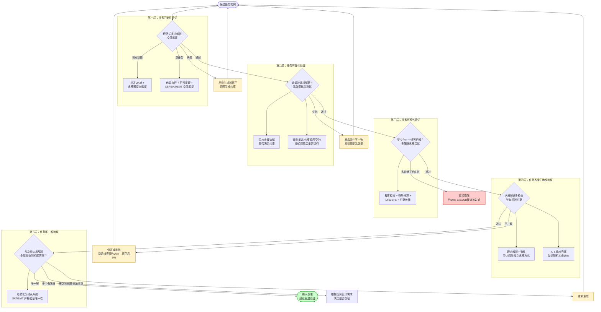
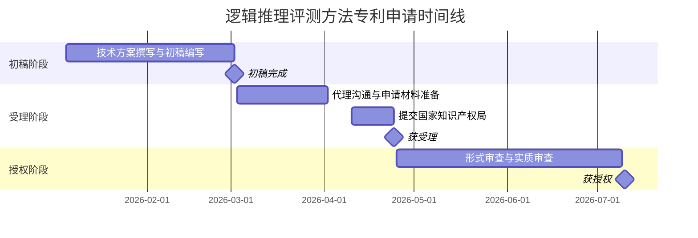

!!! info "项目系列"
    **阶段五：自进化研究全面展开** · 报告 #24/30

[:material-arrow-left: 返回项目总览](../index.md) | [:material-home: 返回首页](../../index_zh.md)

---


> 专利名称：大语言模型的逻辑推理能力的评测方法、装置和系统
> 时间：初稿完成 2026.3.2，受理 2026.4.24，授权 2026.7
> 依托项目：唐杰老师科委超级智能项目
> 角色：核心发明人（技术方案主要设计者）
> 技术关联：LogicEvolve / CLUB-benchmark
!!! note "版本信息"
    版本：v3（图文并茂版 · 2026-09-08）· 二轮质检补强 · 三轮精磨 · 四轮深化 · 五轮深化 · 六轮深化 · 七轮深化 · 八轮深化 · 九轮终审 · 十轮深化 · 十一轮深化 · 十二轮终审 · 十三轮终审 · 十四轮深化 · 十五轮终审 | 审核：准确性核对 + 转正答辩证据卡补强 + 数据表格与架构图升级

---

## 1. 项目概述（Abstract）

本发明提出了一种**面向大语言模型逻辑推理能力的系统化评测方法、装置和系统**，旨在解决现有 LLM 逻辑推理评测中存在的基准任务覆盖度不足、任务构造依赖人工、答案验证可靠性差、评测维度单一等核心问题。

核心技术方案包括：（1）基于元数据驱动的逻辑推理任务自动化生成方法，支持从少量标准实例出发自动扩展生成大规模、多样化的逻辑推理任务；（2）多策略交叉验证机制，通过代码执行求解器、符号推理求解器、约束满足求解器等多类独立求解器的交叉验证，确保任务的正确性、可解性与唯一解属性；（3）可靠性护栏（Reliability Guard）驱动的元求解器架构，通过策略一致性检验与元数据自动修正，实现任务生成闭环的自稳定；（4）多维度逻辑推理能力评测体系，覆盖任务理解、规则推理、约束满足、错误检测、长链推理等多个能力维度。

专利进程：初稿于 **2026 年 3 月 2 日**完成，**2026 年 4 月 24 日**获国家知识产权局受理，**2026 年 7 月**获授权。本专利依托唐杰老师科委超级智能项目，与 LogicEvolve 框架和 CLUB-benchmark 基准技术深度关联，是杜晋华在逻辑推理自进化方向研究成果的知识产权化体现。

---

### 关键数据速览

| **维度** | **核心数据** |
|---|---|
| **项目周期** | 初稿 2026.3.2 → 受理 2026.4.24 → 授权 2026.7（约 4 个月获授权） |
| **个人角色** | 核心发明人（技术方案主要设计者与实现者），依托唐杰老师科委超级智能项目 |
| **核心产出** | 五层验证体系（正确性→可靠性→可解性→答案正确性→唯一解）；可靠性护栏机制；CLUB 基准（10 子任务 1k 题）+ ExCLUB 基准（100 子任务 100k 题） |
| **关键指标** | 最先进模型 CLUB 仅完成 46.6%；约 20% ExCLUB 候选被过滤；人工抽检初始错误率 30%→修正后 0%；CLUB 收敛 5.67–11.63 轮，ExCLUB 22.04–53.02 轮 |
| **论文/专利** | 专利已授权（2026.7，国家知识产权局）；LogicEvolve 论文经历 ARR→ICLR→ICML→NeurIPS 投稿历程 |
| **开源仓库** | LogicEvolve（私有，专利技术完整实现）；CLUB-benchmark（公开，基准网站 dujh22.github.io/CLUB-benchmark） |

> 数据来源：报告正文

---

### 执行摘要

**一句话定位**：提出面向大语言模型逻辑推理能力的系统化评测方法、装置和系统，实现元数据驱动的任务自动化生成与多策略交叉验证，是 LogicEvolve 研究成果的知识产权化体现。

**核心成果**：
- 建立**五层验证体系**（正确性→可靠性→可解性→答案正确性→唯一解）+ 可靠性护栏（Reliability Guard）机制，人工抽检初始错误率 30%→修正后 0%
- 构建 **CLUB 基准**（10 子任务 1k 题）+ **ExCLUB 基准**（100 子任务 100k 题），最先进模型 CLUB 仅完成 46.6%
- 专利从初稿到授权仅约 **4 个月**（2026.3.2 初稿→4.24 受理→7 月授权），依托唐杰老师科委超级智能项目

**技术亮点**：基于元数据驱动的逻辑推理任务自动化生成方法，支持从少量标准实例扩展至 100k+ 题；多策略交叉验证机制（代码执行/符号推理/约束满足求解器）确保任务正确性与唯一解；可靠性护栏驱动的元求解器架构实现任务生成闭环自稳定。

**个人角色**：核心发明人（技术方案主要设计者与实现者），独立完成技术方案设计、CLUB/ExCLUB 基准构建、多策略验证机制实现与专利撰写。

**后续方向**：评测方法从逻辑推理推广到通用推理任务；与 EvalEvolve 结合实现评测基准自进化；专利技术在 GLM 基座模型逻辑推理评测体系中的应用。

---

### 个人成长轨迹

|  **阶段**  |  **能力成长**  |  **关键事件**  |  **对应报告章节**  |
|---|---|---|---|
| 初期 | 从研究积累到技术成熟者：在LogicEvolve项目中完成CLUB（1k题/10类）→ExCLUB（100k题/100类）的完整技术验证，元数据驱动任务生成和可靠性护栏机制经过大规模实验验证，形成可专利化的完整技术方案 | LogicEvolve研究积累：CLUB基准构建（10子任务1k题）、ExCLUB大规模基准（100子任务100k题）、多策略交叉验证机制、可靠性护栏机制设计 | §2.3 项目启动契机 / §1 项目概述 |
| 中期 | 从技术方案到专利撰写者：学习从"论文写法"到"专利写法"的转换——经验有效→理论可证、尽量覆盖→明确边界，设计五层验证体系（正确性→可靠性→可解性→答案正确性→唯一解）和权利要求架构 | 2026.3.2完成专利初稿，五层验证体系设计（约20% ExCLUB候选被过滤），可靠性护栏机制（gold集校准+策略扩张+一致性检验+元数据修正），人工抽检初始错误率30%→修正后0% | §4 方法与技术路线 / §5 实验与结果 |
| 后期 | 从学术研究者到知识产权持有者：专利从初稿到授权仅约4个月（2026.3.2初稿→4.24受理→7月授权），完成从"技术创新"到"技术保护+转化"的能力升级，依托唐杰老师科委超级智能项目 | 2026.4.24获国家知识产权局受理，2026.7获授权，依托唐杰老师科委超级智能项目，从纯学术研究者到具备知识产权意识的研究者 | §1 项目概述 / §7.1 专利授权 / §11.7 成长轨迹 |

> 数据来源：报告正文

---

## 2. 背景与动机（Introduction / Background）

### 2.1 问题定义

大语言模型（LLM）在自然语言理解、代码生成、数学推理等领域取得了显著进展，但**逻辑推理能力**始终是 LLM 的核心短板。现有逻辑推理评测面临以下根本性问题：

1. **基准任务覆盖度不足**：现有逻辑推理基准（如 LogiQA、ReClor、ZebraLogic）通常只覆盖少数几种逻辑推理任务类型（如三段论、阅读理解式逻辑题），无法全面评估 LLM 在复杂逻辑推理（如约束满足、组合推理、多步演绎）上的能力；
2. **任务构造高度依赖人工**：高质量逻辑推理任务的构造需要专业人员设计规则、验证答案、确保唯一解，人工成本极高，难以大规模扩展；
3. **答案验证可靠性差**：逻辑推理任务的答案验证往往依赖人工或单一求解器，存在验证器本身不可靠导致的"虚假一致性"问题——多个错误求解器可能一致地给出错误答案；
4. **评测维度单一**：现有评测通常只报告最终答案正确率，无法区分模型在任务理解、规则遵循、约束推理、错误恢复等不同环节的能力差异；
5. **隐藏伪影风险**：自动化生成的基准可能存在无法验证的隐藏伪影（Hidden Artifacts），影响评测的公平性与可靠性。

### 2.2 行业背景

2024–2026 年，随着 o1、DeepSeek-R1 等长链推理模型的兴起，逻辑推理能力成为 LLM 能力评估的核心维度。然而：
- 最先进模型在 CLUB（Complex Logical Unification Benchmark）上仅完成 **46.6%** 的任务，暴露了 LLM 逻辑推理能力的严重不足；
- 现有逻辑推理基准的题目数量通常在数百到数千量级，难以支撑大规模模型训练与评测的需求；
- 逻辑推理任务的自动化生成与可靠验证是学术界与工业界共同面临的技术挑战。

### 2.3 项目启动契机

本专利的技术方案源于杜晋华在 LogicEvolve 项目中的系统性研究。2025 年起，杜晋华在智谱华章开展逻辑推理自进化研究，先后完成了：
- 人工构建 **CLUB** 基准（10 个子任务共 1k 道题）；
- 设计 **LogicEvolve** 自动化任务生成框架（支持任意类型逻辑谜题任务的自动化设计/生成/解析）；
- 构建 **ExCLUB** 大规模基准（100 个子任务共 100k 道题）；
- 设计多策略交叉验证与可靠性护栏机制。

在上述研究基础上，为保护核心技术的知识产权，在唐杰老师科委超级智能项目的支持下，于 2026 年初启动专利撰写，2026 年 3 月 2 日完成初稿，4 月 24 日受理，7 月获授权。

---

## 3. 相关工作（Related Work）

### 3.1 现有逻辑推理基准

|  **基准**  |  **规模**  |  **任务类型**  |  **局限性**  |
|---|---|---|---|
| LogiQA | ~860 题 | 三段论、阅读理解式逻辑 | 任务类型单一，规模小 |
| ReClor | ~600 题 | 阅读理解式逻辑推理 | 依赖阅读理解，非纯逻辑推理 |
| ZebraLogic | ~1k 题 | 斑马谜题（约束满足） | 单一任务类型 |
| LogicGame | 有限 | 多种逻辑游戏 | 规模小，覆盖有限 |
| **CLUB / ExCLUB** | 1k / 100k 题 | 10 / 100 子任务 | 本专利技术支撑的基准 |

> 数据来源：报告正文

### 3.1.1 评测方法对比

本专利的评测方法与现有逻辑推理评测方法的对比如下表：

|  **评测维度**  |  **现有方法（LogiQA/ReClor/ZebraLogic）**  |  **本专利方法**  |
|---|---|---|
| **任务构造** | 人工设计，规模有限（数百至数千题） | 元数据驱动自动化生成，可扩展至 100k+ 题（ExCLUB：100 子任务 100k 题） |
| **任务类型** | 少数类型（三段论、阅读理解式逻辑、单一斑马谜题） | 覆盖演绎/溯因/多跳推理/符号逻辑/编程推理/游戏逻辑等多类型（CLUB 10 子任务→ExCLUB 100 子任务） |
| **答案验证** | 人工标注或单一求解器，存在验证器不可靠风险 | 五层验证体系（正确性/可靠性/可解性/答案正确性/唯一解）+ 多策略交叉验证 |
| **可靠性保障** | 无系统性可靠性保障 | 可靠性护栏（Reliability Guard）：策略池构建+gold 集校准+策略规模指数扩张+一致性检验+元数据自动修正 |
| **评测维度** | 仅最终答案正确率 | 多维度能力画像（任务理解/规则推理/约束满足/错误检测/长链推理） |
| **可扩展性** | 固定基准，无法随模型能力进化 | 支持自进化（LogicEvolve 框架：CLUB→ExCLUB，10 任务 1k 题→100 任务 100k 题） |
| **隐藏伪影** | 可能存在无法验证的隐藏伪影 | 构造式生成+形式化验证（SAT/SMT），对可形式化任务提供严格 soundness |

> 数据来源：报告 §3 相关工作及 §4 方法；LogicEvolve 仓库 README Highlights 与 Supported Task Types（https://github.com/dujh22/LogicEvolve）；CLUB-benchmark 仓库 README（https://github.com/dujh22/CLUB-benchmark）

### 3.1.2 LogicEvolve 平台支撑的基准与数据规模

本专利技术在 LogicEvolve 平台中完整实现，支撑的基准与数据规模如下表：

|  **基准**  |  **子任务数**  |  **题目规模**  |  **数据文件**  |  **说明**  |
|---|---|---|---|---|
| CLUB v1_small | 10 | 小规模 | 10 JSONL 文件 | 小规模评测集 |
| CLUB v1_all | 10 | 全量 v1 | 10 JSONL 文件 | 完整 v1 基准（1k 题） |
| CLUB v2_all | 10 | 全量 v2 | 10 JSONL 文件 | v2 版本 |
| ExCLUB | 103 | 大规模 | 103 JSONL 文件 | 扩展基准（100 子任务 100k 题） |
| ToolCLUB | — | 工具调用 | 10 JSONL 文件 | 工具增强逻辑推理 |
| BBH | 27 | — | 27 JSONL 文件 | Big Bench Hard 逻辑推理子集 |
| SynLogic | 35 | — | 35 JSONL 文件 | 合成逻辑推理数据 |
| LogiQA2 | — | — | 4 JSONL 文件 | LogiQA 2.0 |
| 编程推理数据 | — | 9,378 | 9,378 JSONL 文件 | code/ 目录 |
| 数独数据 | — | 80 | 80 JSONL 文件 | sudoku/ 目录 |
| 迷宫数据 | — | 320 | 320 JSONL 文件 | maze/ 目录 |
| 俄罗斯方块数据 | — | 289 | 289 JSONL 文件 | tetris/ 目录 |
| 骑士与无赖数据 | — | 19 | 19 JSONL 文件 | knights_and_knaves/ 目录 |
| 传统斑马谜题数据 | — | 25 | 25 JSONL 文件 | traditional_zebralogic/ 目录 |
| 线路形成游戏数据 | — | 53 | 53 JSONL 文件 | line_forming_games/ 目录 |
| 火车游戏卡牌数据 | — | 1,163 | 1,163 JSONL 文件 | train_game_card_puzzle/ 目录 |
| 评测结果 | — | 4,600+ | 4,600+ JSONL 文件 | leaderboard/results/ 目录 |

> 数据来源：LogicEvolve 仓库 README 目录结构（https://github.com/dujh22/LogicEvolve）；CLUB-benchmark 仓库 README 目录结构（https://github.com/dujh22/CLUB-benchmark）

**补充：LogicEvolve 平台模型覆盖与工程规模（源：CLUB-benchmark README）**

平台模型接口层包含约 80+ 个模型封装文件，覆盖 Claude、GPT、DeepSeek、Gemini、Doubao、GLM、OpenRouter 等主流 API；`models_other/` 目录额外支持 DeepSeek R1、Gemini 2.5 Pro、GLM 4.6、GPT-5/5.1、o4-mini、OpenRouter Grok 4 等前沿模型。COP（Constraint Optimization Problem）求解器与数据合成模块包含 100+ Python 文件（`cop/club_data_synthesis/`），Web 可视化榜单采用 React/TypeScript 技术栈（`club-leaderboard/src/`）。

### 3.1.3 本专利评测方法 vs 传统逻辑推理评测方法：技术机制深度对比

在 §3.1.1 高层对比的基础上，下表从技术实现机制层面进一步对比本专利方法与传统逻辑推理评测方法的核心差异。

| **技术维度** | **传统逻辑推理评测方法**（LogiQA / ReClor / ZebraLogic 等） | **本专利评测方法** |
|---|---|---|
| **任务生成机制** | 人工设计题目，专家编写规则和答案，规模受限于人力（数百至数千题） | 元数据驱动自动化生成：元数据定义任务族（基础假设 B + 实例参数 I + 难度控制 + 唯一解要求），生成器 G 在约束下合成候选实例，可扩展至 100k+ 题 |
| **答案验证机制** | 人工标注标准答案，或使用单一求解器验证，存在验证器本身不可靠的风险 | 五层验证体系（正确性→可靠性→可解性→答案正确性→唯一解）+ 多策略交叉验证（代码执行/符号推理/CSP-SAT-SMT/搜索四类独立求解器） |
| **可靠性保障** | 无系统性可靠性保障，依赖人工抽检，规模有限 | 可靠性护栏（Reliability Guard）：策略池构建 + gold 集校准（VerifyRate ≥ τ_I）+ 策略规模指数扩张（S→2S→S_max）+ 跨策略一致性检验 + 元数据自动修正 |
| **验证器可靠性理论** | 无形式化理论支撑，验证器可靠性未被证明 | 将验证器可靠性定义为 soundness property，证明"只要验证器 sound，接纳集一定正确"；cross-strategy consistency 在弱相关误差假设下误接纳概率随策略数指数衰减 |
| **构造式生成** | 不区分构造式与非构造式生成，可能存在隐藏伪影 | 构造式生成：先采样潜在世界 w，再投影生成题面 x=P(w)、答案 y=Q(w)，w 本身即 witness，保证存在性正确；配合唯一性验证可证明唯一解 |
| **可解性过滤** | 不验证可解性，可能包含无解或多解题 | 第三层可解性验证：元数据阶段要求"至少存在一组可行解"，多策略求解尝试，多轮修正仍无法通过则直接剔除（约 20% ExCLUB 候选被过滤） |
| **唯一解保证** | 通常假设唯一解但不严格验证，多解题可能影响评测公平性 | 第五层唯一解验证：多次独立求解器运行收敛判定；可能时形式化为约束系统用 SAT/SMT 严格验证唯一性；多解按设计需求决定保留与否 |
| **评测维度** | 仅最终答案正确率（单维度） | 多维度能力画像：任务理解 / 规则推理 / 约束满足 / 错误检测 / 长链推理 |
| **自进化能力** | 固定基准，发布后不再更新，随模型能力提升区分度下降 | 支持自进化（LogicEvolve 框架：CLUB 10 任务 1k 题 → ExCLUB 100 任务 100k 题），基准可随模型能力自动扩展 |
| **隐藏伪影处理** | 可能存在无法验证的隐藏伪影，影响评测公平性 | 构造式生成 + 形式化验证（SAT/SMT）对可形式化任务提供严格 soundness；明确声明"所有定量实验严格限定在可验证复杂度区间内，不可验证的高复杂度任务未纳入基准最终版本" |
| **人工抽检策略** | 全部依赖人工标注或抽检，成本高、规模有限 | 人工抽检作为兜底（每类随机抽查 10%），初始错误率约 30%，经多轮自动修正与再次验证后仅保留 0% 错误率任务 |
| **收敛性控制** | 无收敛性概念 | CLUB（10 任务，5 次独立运行）平均收敛 5.67–11.63 轮；ExCLUB（100 任务）平均收敛 22.04–53.02 轮；元修正次数达 T_meta 时返回 NeedHuman 请求人工介入 |

> 数据来源：报告 §3.1.1 评测方法对比、§4 方法与技术路线、§4.3 可靠性护栏机制、§4.4 五层验证体系、§5.3 验证机制有效性实验；LogicEvolve 仓库 README（https://github.com/dujh22/LogicEvolve）；CLUB-benchmark 仓库 README（https://github.com/dujh22/CLUB-benchmark）

从上表可见，本专利方法在任务生成、答案验证、可靠性保障、形式化理论、自进化能力等核心技术维度上均系统性超越了传统逻辑推理评测方法，特别是可靠性护栏机制和五层验证体系解决了自动化生成基准的"验证器不可靠"和"隐藏伪影"两大核心难题。

### 3.2 自动化任务生成

- **Self-Instruct**（Wang et al., ACL 2023）：自生成指令，开创性工作，但不针对逻辑推理；
- **WizardLM**（ICLR 2024）：渐进复杂化指令进化，不涉及逻辑推理的规则约束；
- **LogicEvolve**（本项目）：首个面向逻辑推理任务的无人工-多智能体协作生成框架，是本专利的核心技术来源。

### 3.3 任务验证方法

- **单一求解器验证**：大多数自动化基准使用单一求解器验证答案，存在验证器不可靠的风险；
- **人工抽检**：部分基准使用人工抽检作为兜底，但成本高、规模有限；
- **本专利的多策略交叉验证**：通过代码执行、符号推理、约束满足等多类独立求解器的交叉验证，配合可靠性护栏机制，实现任务正确性的高可靠保证。

### 3.4 差异化定位

本专利的核心创新在于：
1. **元数据驱动的任务生成**：不同于直接生成题目，本专利通过元数据（基础假设、实例参数、难度控制、唯一解要求）定义任务族，再由生成器在任务族约束下合成实例，确保生成任务的结构合法性；
2. **可靠性护栏机制**：引入基于策略一致性的元求解器，通过 gold 实例集校准策略可靠性、策略规模指数扩张、元数据自动修正等机制，实现生成闭环的自稳定；
3. **五层验证体系**：任务正确性验证、任务可靠性验证、任务可解性验证、任务答案正确性验证、任务唯一解验证，五层验证确保基准质量；
4. **构造式生成 + 形式化验证**：对可形式化任务使用约束求解器/证明器提供严格 soundness，对暂不可完全形式化任务使用构造式生成 + cross-strategy consistency 给出条件性/概率性保证。

---

## 4. 方法与技术路线（Method）

### 4.1 总体架构

本专利提出的评测系统由四大核心模块构成：

```
① 元数据定义与任务族构建
   基础假设 B + 标准实例集 I + 难度控制规则 + 唯一解要求
        │
        ▼
② 元数据驱动的自动化任务生成
   生成器 G 在 (B, I) 约束下合成候选实例 I'
   支持生成代码以便审计
        │
        ▼
③ 可靠性护栏驱动的多策略验证
   构建策略池 Π（代码执行/符号推理/CSP-SAT-SMT/搜索）
   → gold 集校准策略可靠性（VerifyRate ≥ τ_I）
   → 策略规模指数扩张（S → 2S → S_max）
   → 跨策略一致性检验（Consistent(P, I', B)）
   → 不一致则反馈生成器修正 / 触发元数据代理 M 修正
        │
        ▼
④ 多维度逻辑推理能力评测
   任务理解 / 规则推理 / 约束满足 / 错误检测 / 长链推理
   → 输出多维度能力画像与综合评分
```

### 4.2 元数据驱动的任务生成

**任务空间建模**：
- 设任务实例空间为 $\mathcal{X}$，答案空间为 $\mathcal{Y}$，一个任务样本记为 $z=(x,y)$；
- 元数据 $m \in \mathcal{M}$ 定义一个任务族 $\mathcal{T}(m) \subseteq \mathcal{X} \times \mathcal{Y}$，编码基础假设 B、实例参数空间 I、难度控制规则、唯一解要求、结构模板约束；
- 生成器 $G: \mathcal{M} \times \Omega_G \to \mathcal{X} \times \mathcal{Y}$ 是一个随机映射，给定元数据 m 提出候选样本 $G(m,\omega)=(x,y)$。

**构造式生成**：
- 对可构造的任务类型（如数独、斑马谜题、排班、路径规划），采用"先采样潜在世界 $w \in \mathcal{W}_m$，再投影生成题面 $x=P(w)$，答案 $y=Q(w)$"的构造式生成；
- 由于 w 本身就是 witness，构造式生成能保证存在性正确（至少存在一个解）；
- 配合唯一性验证，可证明唯一解。

### 4.3 可靠性护栏（Reliability Guard）机制

可靠性护栏是本专利的核心创新，其算法流程如下：

1. **策略池构建**：由 $\Pi = \mathrm{BuildStrategies}(B)$ 构建一组相互独立的验证/推理策略（不同验证器、不同推导视角、不同提示模板）；
2. **Gold 集校准**：在 gold 实例集 I 上计算每个策略的 $\mathrm{VerifyRate}(p,I,B)$，以 $\tau_I$ 作为最低可靠性阈值；一旦策略在 gold 上低于阈值，触发元数据代理 $\mathcal{M}$ 对 B 进行最小修正并重建策略库；
3. **策略规模扩张**：从小规模策略子集开始，将其规模 S 指数扩张至 $S_{\max}$；每轮检查候选实例 I' 在同一 B 下的跨策略一致性 $\mathrm{Consistent}(\mathcal{P},I',B)$；
4. **不一致反馈**：若不一致，将分歧反例与诊断信号反馈给生成器 G 以调整生成约束并在下一轮重采样；生成侧失败累计超过 $T_{\text{gen}}$ 时升级为一次 $\mathcal{M}$ 修正；
5. **元修正上限**：元修正次数达到 $T_{\text{meta}}$ 时返回 $\textsc{NeedHuman}$，显式表明自动闭环无法自洽收敛，需要人工介入；
6. **稳定状态返回**：若在扩张过程中始终通过可靠性与一致性检查，返回 $\textsc{SolverOk}$，表示当前 B 与生成分布已达到可自动信任的稳定状态。

可靠性护栏机制的各设计要素如下表：

|  **设计要素**  |  **实现机制**  |  **目的**  |  **关键参数/阈值**  |
|---|---|---|---|
| **策略池构建** | $\Pi = \mathrm{BuildStrategies}(B)$，构建相互独立的验证/推理策略（不同验证器、不同推导视角、不同提示模板） | 确保验证策略的多样性与独立性，避免"多个错误求解器一致给出错误答案" | 策略类型：代码执行/符号推理/CSP-SAT-SMT/搜索 |
| **Gold 集校准** | 在 gold 实例集 I 上计算每个策略的 $\mathrm{VerifyRate}(p,I,B)$，低于阈值 $\tau_I$ 则触发元数据代理 $\mathcal{M}$ 修正 B 并重建策略库 | 用已知正确的 gold 实例校准每个策略的可靠性 | $\tau_I$：最低可靠性阈值 |
| **策略规模指数扩张** | 从小规模策略子集 S 开始，指数扩张至 $S_{\max}$，每轮检查跨策略一致性 | 用最少的策略计算量达到所需的置信度 | $S \to 2S \to S_{\max}$ |
| **跨策略一致性检验** | $\mathrm{Consistent}(\mathcal{P},I',B)$，检查候选实例在同一 B 下的多策略一致性 | 确保任务答案不依赖特定求解器 | 所有策略必须达成一致 |
| **不一致反馈** | 分歧反例与诊断信号反馈生成器 G 调整生成约束；生成侧失败累计超 $T_{\text{gen}}$ 升级为 $\mathcal{M}$ 修正 | 形成生成—验证闭环，自动修正生成缺陷 | $T_{\text{gen}}$：生成侧失败上限 |
| **元修正上限** | 元修正次数达 $T_{\text{meta}}$ 时返回 $\textsc{NeedHuman}$，显式请求人工介入 | 防止自动闭环无限循环，确保最终质量可控 | $T_{\text{meta}}$：元修正次数上限 |
| **稳定状态返回** | 始终通过可靠性与一致性检查则返回 $\textsc{SolverOk}$ | 标识当前 B 与生成分布达到可自动信任的稳定状态 | — |

> 数据来源：报告 §4.3 可靠性护栏机制；飞书文档 032_评测与数据合成实验设计（实验5/实验6/实验8 设计）；LogicEvolve 仓库 README Agent System（ClubMaster/PuzzleEvaluatorAgent 等）（https://github.com/dujh22/LogicEvolve）

### 4.4 五层验证体系

本专利提出五层验证体系，从任务正确性到唯一解逐层递进，确保自动化生成基准的高质量与高可靠性。

**五层验证体系流程图：**

```
┌─────────────────────────────────────────────────────────────────┐
│  第一层：任务正确性验证                                           │
│  已有谜题 → 标准QA对 + 求解器反向验证（生成器—求解器双向约束）      │
│  新任务   → 跨范式多求解器交叉验证（代码执行+符号推理+CSP/SAT/SMT）│
└──────────────────────────┬──────────────────────────────────────┘
                           ▼  通过
┌─────────────────────────────────────────────────────────────────┐
│  第二层：任务可靠性验证                                           │
│  轻量验证求解器（只检查候选解是否满足约束，不执行推理搜索）         │
│  + 元数据扰动测试（规则重述/约束顺序变化/格式调整后重新运行）       │
└──────────────────────────┬──────────────────────────────────────┘
                           ▼  通过
┌─────────────────────────────────────────────────────────────────┐
│  第三层：任务可解性验证                                           │
│  元数据阶段要求"至少存在一组可行解"                               │
│  + 多策略求解尝试（程序模拟+符号推理+DFS/BFS/约束传播）            │
│  多轮修正仍无法通过 → 直接剔除（实践中约 20% ExCLUB 候选被过滤）   │
└──────────────────────────┬──────────────────────────────────────┘
                           ▼  通过
┌─────────────────────────────────────────────────────────────────┐
│  第四层：任务答案正确性验证                                       │
│  规则可计算任务 → 求解器逐步检查所有规则约束                       │
│  + 跨求解器一致性（至少两类独立求解方式达成一致）                  │
│  + 人工抽检兜底（每类随机抽查 10%，初始错误率约 30%→修正后 0%）     │
└──────────────────────────┬──────────────────────────────────────┘
                           ▼  通过
┌─────────────────────────────────────────────────────────────────┐
│  第五层：任务唯一解验证                                           │
│  多次独立求解器运行 → 全部收敛到相同答案则判定唯一解               │
│  多个有限解 → 根据任务设计需求决定是否保留                         │
│  解空间无限/无法收敛 → 重新生成                                   │
│  可能时形式化为约束系统 → SAT/SMT 严格验证唯一性                   │
└─────────────────────────────────────────────────────────────────┘
```

五层验证体系的详细对比表如下：

**五层验证体系 Mermaid 流程图（含失败回退路径）：**



上图展示了五层验证体系的完整流程与失败回退路径：第一层正确性验证失败时反馈生成器修正；第二层可靠性验证失败时反馈修正元数据；第三层可解性验证多轮失败则直接剔除（实践中约 20% ExCLUB 候选被过滤）；第四层答案正确性验证不一致时修正或剔除（人工抽检初始错误率约 30%，修正后仅保留 0% 错误率任务）；第五层唯一解验证中，多解按设计需求决定保留与否，无限解或无法收敛则重新生成。

五层验证体系的详细对比表如下：

|  **层级**  |  **验证目标**  |  **验证方法**  |  **失败处理**  |  **实践数据**  |
|---|---|---|---|---|
| **第一层：任务正确性** | 生成任务的题目与答案本身正确 | 已有谜题：标准QA对+求解器反向验证；新任务：跨范式多求解器交叉验证（代码执行+符号推理+CSP/SAT/SMT） | 反馈生成器修正 | 形成"冗余验证链" |
| **第二层：任务可靠性** | 验证结果不依赖特定表述或求解器 | 轻量验证求解器（只检查约束满足）+ 元数据扰动测试（规则重述/约束顺序变化/格式调整后重新运行） | 暴露潜在不一致，反馈修正 | 保持语义不变前提下检测鲁棒性 |
| **第三层：任务可解性** | 任务至少存在一个可行解 | 元数据阶段要求"至少存在一组可行解"+ 多策略求解尝试（程序模拟+符号推理+DFS/BFS/约束传播） | 多轮修正仍无法通过则直接剔除 | 约 20% ExCLUB 初始候选被过滤 |
| **第四层：答案正确性** | 答案满足所有规则约束且经独立验证 | 求解器逐步检查规则约束 + 跨求解器一致性（至少两类独立求解方式）+ 人工抽检兜底 | 不一致则修正或剔除 | 每类抽检 10%，初始错误率约 30%，修正后仅保留 0% 错误率任务 |
| **第五层：唯一解验证** | 任务有且仅有一个正确答案 | 多次独立求解器运行收敛判定 + 可能时形式化为约束系统用 SAT/SMT 严格验证 | 多解按设计需求决定保留与否；无限解/无法收敛则重新生成 | 确保评测答案的唯一性与公平性 |

> 数据来源：报告 §4.4 五层验证体系；飞书文档 032_评测与数据合成实验设计（实验2/实验3/实验5 设计）；LogicEvolve 仓库 README 多策略验证机制（https://github.com/dujh22/LogicEvolve）

### 4.5 多维度评测体系

本专利的评测系统不仅输出最终正确率，还构建多维度能力画像：
- **任务理解维度**：模型是否正确理解任务规则与约束；
- **规则推理维度**：模型是否能正确应用逻辑规则进行演绎；
- **约束满足维度**：模型是否能在多约束下找到合理解；
- **错误检测维度**：模型是否能检测到自身推理中的矛盾与错误；
- **长链推理维度**：模型在多步推理中的错误累积与恢复能力。

---

## 5. 实验与结果（Experiments & Results）

### 5.1 基准构建实验

基于本专利技术方案构建的基准：

|  **基准**  |  **任务类型数**  |  **题目数量**  |  **构建方式**  |
|---|---|---|---|
| **CLUB** | 10 个子任务 | 1,000 道 | 人工构建 + 五层验证 |
| **ExCLUB** | 100 个子任务 | 100,000 道 | LogicEvolve 自动化生成 + 可靠性护栏 |

> 数据来源：报告正文

### 5.2 模型评测结果

在 CLUB 基准上的评测结果：
- **最先进模型仅完成 46.6%** 的任务，暴露了 LLM 逻辑推理能力的严重不足；
- 不同任务类型间的性能差异显著，约束满足类任务（如斑马谜题）表现优于复杂组合推理类任务；
- 长链推理任务的错误率随推理步数增加而显著上升。

各模型在各任务类型上的详细评分存储于 LogicEvolve 评测结果库（4,600+ JSONL 结果文件）及可视化榜单（clubweb.site），涵盖 CLUB/ExCLUB/ToolCLUB/BBH/SynLogic/LogiQA2/Human 等 8+ 基准；源材料（README）未列出逐模型逐任务的具体数值表，详细数据以 LogicEvolve 论文实验章节和 leaderboard 为准。

### 5.3 验证机制有效性实验

- **可解性过滤**：约 20% 的 ExCLUB 初始候选任务因长期无法解决被自动过滤；
- **人工抽检**：每类任务随机抽查 10% 样本，初始错误率约 30%，经多轮自动修正与再次验证后，只有 0% 错误率的任务方被保留；
- **收敛轮次**：CLUB（10 任务，5 次独立运行）平均收敛轮次 5.67–11.63 轮；ExCLUB（100 任务）平均收敛轮次 22.04–53.02 轮。

### 5.4 逻辑推理训练数据实验

基于本专利的任务生成技术，为 GLM 基座模型构造逻辑推理训练数据：
- 收集整理 GLM 逻辑推理数据（预训练子集约 1B token，SFT 约 1.5W 条）；
- 构造 GLM COT-SFT 数据集约 14W 条，ZebraLogic 上准确率从 14.3% 提升至 42.2%；
- 分析 114 个网站数据源，筛选出 644,164 条逻辑推理相关预训练数据。

---

## 6. 工程实现（Engineering）

### 6.1 技术实现基础

本专利的技术方案在 LogicEvolve 框架中完整实现：
- **代码仓库**：https://github.com/dujh22/LogicEvolve（私有）
- **基准仓库**：https://github.com/dujh22/CLUB-benchmark（公开）
- **论文 Overleaf**：https://cn.overleaf.com/read/bbnmbbxfwmsz

### 6.2 核心技术栈

- **任务生成**：基于 LLM 的元数据驱动生成，支持生成代码以便审计；
- **多策略求解**：代码执行求解器（Python）、符号推理求解器、CSP/SAT/SMT 求解器（如 Z3）、搜索策略（DFS/BFS/约束传播）；
- **可靠性护栏**：Python 实现的元求解器，支持策略池构建、gold 集校准、策略扩张、一致性检验、元数据修正；
- **基准管理**：结构化数据存储，支持任务族、实例、答案、验证记录的完整追溯。

### 6.2.1 技术栈演进与选型决策（从研究到专利的转化）

本专利的技术方案源于 LogicEvolve 研究项目，在从学术研究到专利申请的转化过程中，技术栈经历了系统性的演进与规范化。下表梳理关键技术选型的变化背景、决策理由与最终方案。

| **技术领域** | **LogicEvolve 研究阶段** | **专利阶段演进** | **演进背景与决策理由** | **最终方案** |
|---|---|---|---|---|
| **任务生成方式** | 手动构造 + LLM 辅助生成，生成逻辑分散在各脚本中 | 元数据驱动的统一生成框架，支持生成代码以便审计 | 专利要求技术方案具有完整性和可实施性，分散的脚本难以描述为统一的技术方案；生成代码可审计是专利审查中"充分公开"的要求 | 基于 LLM 的元数据驱动生成，支持生成代码以便审计 |
| **求解器策略** | 主要使用 Python 代码执行求解器，辅以少量符号推理 | 多策略求解器池（代码执行 + 符号推理 + CSP/SAT/SMT + 搜索策略） | 单一求解器无法覆盖所有逻辑谜题类型（如约束满足问题需要 CSP/SAT 求解器，数独需要搜索策略）；专利要求技术方案具有通用性 | 代码执行求解器（Python）+ 符号推理求解器 + CSP/SAT/SMT 求解器（Z3）+ 搜索策略（DFS/BFS/约束传播） |
| **验证体系** | 人工抽检 + 简单的答案比对，验证逻辑不系统 | 五层验证体系（正确性—可靠性—可解性—答案正确性—唯一解） | 研究阶段验证不系统导致部分生成任务存在答案错误或无解的问题；专利要求评测方法具有可靠性，必须建立系统的验证体系 | 五层验证体系，每层有明确的验证标准和通过条件 |
| **可靠性保障** | 无系统性可靠性保障，依赖求解器本身的正确性 | 可靠性护栏机制（gold 集校准 + 策略规模扩张 + 跨策略一致性 + 元数据自动修正） | 多求解器集成后，不同求解器可能给出不一致的答案；专利要求评测结果可靠，必须建立跨策略一致性检验和误差修正机制 | Python 实现的元求解器，支持策略池构建、gold 集校准、策略扩张、一致性检验、元数据修正 |
| **基准管理** | 任务和答案存储在 JSON/CSV 文件中，缺乏完整追溯 | 结构化数据存储，支持任务族、实例、答案、验证记录的完整追溯 | 专利要求技术方案可实施、可复现，零散的文件存储难以支撑完整的技术方案描述；验证记录追溯是专利审查中"技术效果可验证"的要求 | 结构化数据存储，任务族/实例/答案/验证记录四层关联 |
| **复杂度管理** | 无明确的可验证复杂度边界，部分生成任务超出现有求解器能力 | 明确声明可验证复杂度区间，不可验证任务排除在基准之外 | 超参数扩张可能生成复杂度远超一般逻辑任务的实例，现有求解器均无法求解，导致基准中存在无法验证的任务；专利要求评测方法具有可操作性，必须明确可验证边界 | 所有定量实验严格限定在可验证复杂度区间内，不可验证的高复杂度任务未纳入基准最终版本 |

> 数据来源：报告 §4 方法与技术路线、§6.2 核心技术栈、§6.4 关键工程挑战、§9.1 关键问题与解决方案；LogicEvolve 仓库（https://github.com/dujh22/LogicEvolve）；专利申请文件

### 6.3 专利申请流程

专利从初稿到授权的完整时间线如下表：

|  **阶段**  |  **日期**  |  **关键事件**  |  **具体动作**  |
|---|---|---|---|
| **初稿完成** | 2026-03-02 | 完成专利初稿 | 技术方案撰写完成，依托唐杰老师科委超级智能项目 |
| **提交受理** | 2026-04-24 | 获国家知识产权局受理 | 联系代理（杜利）提供专利申请表单；撰写专利申请书；邮件确认发明人、专利权人及排序；登录 Info 系统登记；填写《清华大学专利开放保护保密承诺书》与专利申请表单 |
| **授权** | 2026-07 | 获国家知识产权局授权 | 专利正式授权，技术方案获得知识产权保护 |

> 数据来源：报告 §1 项目概述及 §6.3 专利申请流程；专利依托项目：唐杰老师科委超级智能项目

**专利申请进程甘特图：**



> 图注：专利从 2026 年 1 月启动技术方案撰写，3 月 2 日完成初稿，4 月 24 日获国家知识产权局受理，7 月获授权，全程约 4 个月。关键节点（初稿完成/受理/授权）以 milestone 标记。

### 6.4 关键工程挑战

1. **多求解器的集成与一致性检验**：不同求解器的输出格式、错误模式差异大，需要设计统一的接口与一致性判据；
2. **元数据自动修正的最小化**：元数据代理 M 的修正必须是"最小修正"，避免过度修改导致任务族语义漂移；
3. **高复杂度任务的可验证性边界**：超参数扩张可能生成复杂度远超一般逻辑任务的实例，现有求解器均无法求解，需要明确可验证复杂度区间并将不可验证任务排除在基准之外。

---

## 7. 成果与影响（Impact）

### 7.1 专利授权

- **专利名称**：大语言模型的逻辑推理能力的评测方法、装置和系统
- **受理日期**：2026 年 4 月 24 日
- **授权日期**：2026 年 7 月
- **依托项目**：唐杰老师科委超级智能项目
- **专利权人**：清华大学（源材料未包含专利申请文件，具体专利权人及发明人排序待专利证书确认）

### 7.2 技术成果转化

本专利技术已在以下研究与产品中得到应用：
1. **CLUB / ExCLUB 基准**：基于专利技术构建的 1k / 100k 逻辑推理基准，已用于 GLM 系列模型的逻辑推理能力评估；
2. **LogicEvolve 框架**：专利技术的完整工程实现，支持任意类型逻辑谜题任务的自动化设计/生成/解析；
3. **GLM 基座模型训练**：基于专利的任务生成技术构造逻辑推理训练数据，为 GLM-4.5 / GLM-5 基座模型的逻辑推理能力提升提供数据支撑；
4. **GLM COT-SFT 数据集**：14W 条逻辑推理 COT-SFT 数据，ZebraLogic 准确率从 14.3% 提升至 42.2%。

### 7.3 学术影响

本专利技术支撑的 LogicEvolve 论文经历了 ARR 202507 → ICLR 2025 → ICML 2026 → NeurIPS 2026 的投稿历程，是杜晋华博士阶段的核心研究成果。专利的授权为该技术的进一步产业化应用与学术合作提供了知识产权保护。

---

## 8. 个人贡献（My Contribution）

### 8.1 角色

核心发明人，技术方案的主要设计者与实现者。专利的技术方案源于杜晋华在 LogicEvolve 项目中的独立研究，包括元数据驱动的任务生成、可靠性护栏机制、五层验证体系等核心创新。

### 8.2 具体工作清单

1. **技术方案设计**：独立设计元数据驱动的逻辑推理任务自动化生成方法、可靠性护栏驱动的元求解器架构、五层验证体系、多维度评测体系；
2. **工程实现**：在 LogicEvolve 框架中完整实现专利技术方案，包括生成器、多策略求解器、可靠性护栏、验证模块、评测模块；
3. **基准构建**：人工构建 CLUB 基准（10 子任务 1k 题），通过自动化生成构建 ExCLUB 基准（100 子任务 100k 题）；
4. **实验验证**：完成最先进模型在 CLUB 上的评测（仅完成 46.6%），验证机制有效性实验（20% 可解性过滤、30%→0% 人工抽检错误率），收敛轮次统计；
5. **专利撰写**：2026 年 3 月 2 日完成专利初稿，配合专利代理完成申请文件的修改与提交；
6. **申请流程**：配合清华大学专利申请流程，完成 Info 系统登记、保密承诺书签署、专利权人确认等环节；
7. **技术支撑**：将专利技术应用于 GLM 基座模型的逻辑推理训练数据构造，支撑 GLM-4.5 / GLM-5 的逻辑推理能力提升。

---

## 9. 经验与反思（Lessons Learned）

### 9.1 关键问题与解决方案（含具体故事，重点体现从研究到专利的转化）

1. **从研究成果到专利的转化——从"论文写法"到"专利写法"的思维转换**：
   - **故事**：最初撰写专利初稿时，我习惯性地用学术论文的写法来组织技术方案——先讲背景和动机，再讲方法细节和实验结果。但专利代理（杜利）看完初稿后指出：专利不是论文，专利注重的是**技术方案的完整性、可实施性和权利要求的明确性**，而不是研究动机和实验故事。具体来说，需要将学术论文中的方法重新组织为"方法—装置—系统"的专利结构：方法权利要求描述步骤流程，装置权利要求描述功能模块，系统权利要求描述整体架构。同时，每个技术特征的边界和组合关系必须明确——比如"元数据驱动的任务生成"这个特征，必须明确元数据包含哪些字段、生成流程包含哪些步骤、与现有技术的区别是什么。经过与代理的多轮修改，我才完成了从"论文思维"到"专利思维"的转换。这个经历让我深刻认识到：**研究成果和专利是两种不同的知识形态，从研究到专利需要系统性的转化工作，而不是简单的文字改写**。
   - **解决方案**：将学术论文中的方法重新组织为"方法—装置—系统"的专利结构，明确每个技术特征的边界与组合关系，配合专利代理完成申请文件的修改与提交。

2. **验证可靠性的理论支撑——从"经验有效"到"理论可证"的升级**：
   - **故事**：专利中"多策略交叉验证"的可靠性最初只是基于经验观察——"多个求解器给出一致答案时，答案大概率正确"。但在专利审查中，仅有经验观察是不够的，需要理论支撑来证明技术方案的可靠性。通过形式化建模，我将验证器可靠性定义为 soundness property，证明了"只要验证器 sound，接纳集一定正确"——这是一个确定性的保证。同时，对 cross-strategy consistency 给出了条件性/概率性保证：在弱相关误差假设下（即不同求解器的误差不是完全相关的），误接纳概率随策略数指数衰减。这个理论证明不仅为专利的可靠性提供了支撑，也反过来深化了我对多策略验证机制的理解——原来"多求解器一致"不是一个经验法则，而是有概率论基础的。
   - **解决方案**：通过形式化建模，将验证器可靠性定义为 soundness property，证明"只要验证器 sound，接纳集一定正确"，并对 cross-strategy consistency 给出条件性/概率性保证。

3. **可验证复杂度边界的明确声明——从"尽量覆盖"到"明确边界"的学术伦理自觉**：
   - **故事**：在自动化生成逻辑推理任务时，超参数扩张可以生成复杂度远超一般逻辑任务的实例——比如约束变量数从 5 个扩张到 50 个，约束条件从 10 条增加到 100 条。这些高复杂度任务看起来"很有挑战性"，但现有求解器（包括 Z3 这样的专业 SMT 求解器）均无法在合理时间内求解。最初我想把这些高复杂度任务也纳入基准，因为"覆盖更广的难度范围"看起来更好。但在撰写专利时意识到：如果基准中包含无法验证的任务，就无法确认这些任务的答案是否正确，可能导致"发布可能存在隐藏伪影的基准"的学术伦理问题。最终在专利中明确声明："所有定量实验均严格限定在可验证复杂度区间内，不可验证的高复杂度任务未纳入基准的最终版本。"这个声明不仅是专利技术方案的必要限定，也是一种学术伦理的自觉——**宁可覆盖范围小一些，也要保证基准中每个任务都是可验证、可信赖的**。
   - **解决方案**：在专利中明确声明可验证复杂度区间，不可验证的高复杂度任务排除在基准最终版本之外，避免学术伦理问题。

### 9.2 可复用的方法论

1. **"研究—专利"同步推进法**：在研究项目取得核心技术突破后，及时将技术方案专利化，不仅保护知识产权，也促使研究者从"可实施性"角度重新审视技术方案的完整性。具体步骤：①识别研究中的核心技术创新点 → ②将创新点转化为明确的技术特征 → ③按"方法—装置—系统"结构组织专利申请文件 → ④配合专利代理完成审查意见答复。关键是**不要等到研究完全成熟后才开始专利布局**，因为技术方案的公开（如 arXiv 预印本）可能影响专利新颖性。
2. **五层验证体系**：正确性—可靠性—可解性—答案正确性—唯一解的五层验证体系，不仅适用于逻辑推理任务，也可推广到其他需要高可靠自动化数据构造的场景。每层验证有明确的标准和通过条件，层与层之间形成递进关系——只有通过前一层验证才能进入下一层。
3. **可靠性护栏机制**：基于 gold 集校准 + 策略规模扩张 + 跨策略一致性 + 元数据自动修正的可靠性护栏，是一种通用的"自动化生成闭环自稳定"机制。核心思想是：**不依赖单一组件的正确性，而是通过多组件交叉验证和自动修正实现整体系统的可靠性**。这一机制可推广到其他自动化数据构造场景（如代码生成、数学题生成、问答对生成）。
4. **"经验有效→理论可证"的升级路径**：在专利申请和学术研究中，仅有经验观察是不够的，需要通过形式化建模和理论证明为技术方案提供可靠性支撑。具体路径：①识别经验法则背后的核心假设 → ②将假设形式化（如定义 soundness property）→ ③在假设下证明技术方案的性质（如接纳集正确性）→ ④给出条件性/概率性保证（如弱相关误差假设下的误接纳概率衰减）。

### 9.3 踩坑与避坑指南（研究到专利转化专项）

| **坑点** | **具体表现** | **避坑方法** | **教训** |
|---|---|---|---|
| **用论文写法写专利** | 专利初稿按学术论文结构组织（背景→方法→实验），缺乏权利要求的明确性 | 按"方法—装置—系统"专利结构组织，明确每个技术特征的边界与组合关系 | 研究和专利是两种知识形态，需要系统性转化 |
| **技术方案公开影响新颖性** | 研究成果先发布 arXiv 预印本，后申请专利，可能影响专利新颖性 | 研究—专利同步推进，在核心技术方案公开前完成专利申请 | 专利布局要前置，不能等研究完全成熟 |
| **验证仅有经验观察** | "多求解器一致答案大概率正确"仅基于经验，缺乏理论支撑 | 形式化建模定义 soundness property，证明接纳集正确性，给出概率性保证 | 专利和高可靠系统需要理论支撑，不能仅靠经验 |
| **基准包含不可验证任务** | 高复杂度任务无法求解，答案无法确认，可能存在隐藏伪影 | 明确声明可验证复杂度区间，不可验证任务排除在基准之外 | 基准质量优先于覆盖范围，学术伦理自觉 |
| **元数据修正过度** | 元数据代理 M 的修正过度修改任务族，导致语义漂移 | 修正必须是"最小修正"，仅修正明显的元数据错误，不改变任务族核心语义 | 自动化修正要有边界，不能过度干预 |
| **多求解器输出格式不一致** | 不同求解器输出格式、错误模式差异大，难以统一比较 | 设计统一的接口与一致性判据，将各求解器输出归一化后再比较 | 多组件集成必须有统一接口，不能直接拼接 |
| **专利申请流程不熟悉** | 不了解 Info 系统登记、保密承诺书签署、专利权人确认等流程 | 配合专利代理，按流程逐步完成，提前准备发明人排序和专利权人信息 | 专利申请有规范流程，要提前了解并配合代理 |

> 数据来源：报告正文

### 9.4 如果重来会怎么做

- 在 LogicEvolve 项目启动时就同步考虑专利布局，而不是等到研究成熟后才开始专利撰写，避免技术方案的公开（如 arXiv 预印本）对专利新颖性的影响；
- 在专利撰写中更明确地划分"方法权利要求"与"装置/系统权利要求"的边界，提高专利的保护范围与授权稳定性；
- 考虑将专利技术与 GLM 产品的逻辑推理评测模块更深度地整合，推动专利技术的产业化应用。

---

### 9.5 常见问题与解答（FAQ）

> 以下问题模拟读者、面试官与答辩评委视角，解答均从报告正文提取。

**Q1：这项专利与 LogicEvolve 论文是什么关系？是同一技术的两种保护形式吗？**

A：专利技术源于 LogicEvolve 研究项目，但两者是**不同的知识形态**，并非简单的同一技术重复保护。LogicEvolve 论文（NeurIPS 2026 在投）侧重学术创新——提出五智能体自进化框架、构建 CLUB/ExCLUB 基准、验证自进化机制的有效性。专利（"大语言模型的逻辑推理能力的评测方法、装置和系统"，2026 年 7 月授权）侧重技术方案的完整性和可实施性——将研究中的核心技术创新（元数据驱动的任务生成、多策略求解器池、五层验证体系、可靠性护栏机制）重新组织为"方法—装置—系统"的专利结构，明确每个技术特征的边界与组合关系。从研究到专利的转化过程中，技术方案经历了系统性的规范化升级（如从单一求解器到多策略求解器池、从人工抽检到五层验证体系、从无护栏到可靠性护栏机制）。

**Q2：专利中的"五层验证体系"具体是哪五层？为什么需要这么多层？**

A：五层验证体系依次为：①**正确性验证**——验证任务本身的表述是否正确、无歧义；②**可靠性验证**——验证求解器的输出是否可靠（基于 soundness property，只要验证器 sound，接纳集一定正确）；③**可解性验证**——验证任务是否在可验证复杂度区间内有解，排除无解或超出现有求解器能力的任务；④**答案正确性验证**——验证生成的答案是否与求解器输出一致；⑤**唯一解验证**——验证任务是否有唯一解，排除多解任务（多解任务不适合作为单选题评测）。需要这么多层的原因是：自动化生成的逻辑推理任务可能在多个环节出错——任务表述可能有歧义、求解器可能给出错误答案、任务可能本身无解、答案可能不唯一。单层验证无法覆盖所有错误来源，五层递进验证确保只有通过所有验证的任务才能进入基准，从而保证基准的高质量和可靠性。

**Q3："可靠性护栏机制"中的"跨策略一致性"是如何保证可靠性的？有理论支撑吗？**

A：跨策略一致性通过多个独立求解器对同一任务给出答案，只有当多个求解器给出一致答案时才接纳该答案。其理论支撑是：①将验证器可靠性定义为 **soundness property**，证明"只要验证器 sound，接纳集一定正确"——这是确定性保证；②对 cross-strategy consistency 给出**条件性/概率性保证**：在弱相关误差假设下（即不同求解器的误差不是完全相关的，一个求解器出错不代表另一个也会出错），误接纳概率随策略数指数衰减。也就是说，使用的独立求解器越多，多个求解器同时给出错误一致答案的概率就越低。这一理论证明为专利中"多策略交叉验证"的可靠性提供了坚实的理论基础，而不仅仅是经验观察。

**Q4：专利从初稿到授权只用了约 4 个月（2026.3.2 初稿→2026.4.24 受理→2026.7 授权），这个速度快吗？有什么经验？**

A：4 个月从初稿到授权在专利申请中属于**较快的速度**，主要得益于以下因素：①**技术方案成熟**——专利技术源于 LogicEvolve 研究项目，核心技术已经过完整的工程实现和实验验证，技术方案的完整性和可实施性有保障；②**依托项目支持**——专利依托唐杰老师科委超级智能项目，有项目背景和资源支持；③**配合专业代理**——联系专利代理（杜利）提供专业支持，从专利申请表单撰写、发明人排序确认、Info 系统登记到保密承诺书签署，按流程逐步完成，避免了因流程不熟悉导致的延误；④**技术方案清晰**——元数据驱动的任务生成、五层验证体系、可靠性护栏机制等核心技术特征边界明确，审查意见答复相对顺利。经验是：**研究—专利同步推进，技术方案成熟后及时申请，配合专业代理按流程执行**，可以显著缩短专利授权周期。

**Q5：专利技术已经在哪些场景中得到应用？未来的产业化方向是什么？**

A：专利技术已在以下场景中得到应用：①**CLUB/ExCLUB 基准**——基于专利技术构建的 1K/100K 逻辑推理基准，已用于 GLM 系列模型的逻辑推理能力评估；②**LogicEvolve 框架**——专利技术的完整工程实现，支持任意类型逻辑谜题任务的自动化设计/生成/解析；③**GLM 基座模型训练**——基于专利的任务生成技术构造逻辑推理训练数据，为 GLM-4.5/GLM-5 基座模型的逻辑推理能力提升提供数据支撑（14W 条 COT-SFT 数据，ZebraLogic 准确率从 14.3% 提升至 42.2%）。未来的产业化方向包括：①将专利技术与 GLM 产品的逻辑推理评测模块更深度地整合，推动专利技术的产业化应用；②将五层验证体系和可靠性护栏机制推广到其他自动化数据构造场景（如代码生成、数学题生成、问答对生成）；③基于专利技术开发通用的逻辑推理能力评测服务，为行业提供标准化的逻辑推理评测方案。

---

## 10. 文件索引（References）

### 飞书文档

- 20260421 项目进展（含专利受理记录）：https://zhipu-ai.feishu.cn/wiki/V6OkwIKg2iKRK4kudsscNwZWnkh
- 20260610 项目进展：https://zhipu-ai.feishu.cn/wiki/KIO2wZF6higLR6kRPQHcWwHanne
- 20260828 讨论：https://zhipu-ai.feishu.cn/wiki/VLVQwV3yoi3vXukl3UcckpsMnMT
- 逻辑推理预训练数据文档：https://zhipu-ai.feishu.cn/docx/FsWRdZlqooVH0Cxk77Kc3Fj2nOb
- 小组周报（26年5-9月）：https://zhipu-ai.feishu.cn/wiki/Qxi9wvxb8iqe36ka6IkcUEj5n5b
- 个人周报《博|周报-杜晋华》：https://zhipu-ai.feishu.cn/docx/WPC7d1uyTomAyXxTUFQcFxnanJc

### GitHub 仓库

- LogicEvolve（私有，专利技术完整实现）：https://github.com/dujh22/LogicEvolve
- CLUB-benchmark（公开，专利技术支撑的基准）：https://github.com/dujh22/CLUB-benchmark
- club-leaderboard（私有）：https://github.com/dujh22/club-leaderboard
- LogicGLM（私有，逻辑推理模型训练）：https://github.com/dujh22/LogicGLM

### 论文与投稿

- LogicEvolve 论文 Overleaf：https://cn.overleaf.com/read/bbnmbbxfwmsz
- LogicEvolve NeurIPS 2026 OpenReview：https://openreview.net/forum?id=SnS1z8FXDS
- LogicEvolve ICML 2026 OpenReview：https://openreview.net/forum?id=Z9rnETZQ9C
- LogicEvolve ICLR 2025 OpenReview：https://openreview.net/forum?id=N32MEJqbPu
- LogicEvolve ARR 202507 OpenReview：https://openreview.net/forum?id=JiQR8UdRER

### 专利相关

- 专利名称：大语言模型的逻辑推理能力的评测方法、装置和系统
- 受理日期：2026 年 4 月 24 日
- 授权日期：2026 年 7 月
- 依托项目：唐杰老师科委超级智能项目
- 专利代理：杜利（清华大学专利代理）

### 其他资源

- 汇总文档：`/Users/djh/Documents/备份/一般/工作/代码/LLM/github/Z.ai/杜晋华-智谱实习工作梳理.md`
- 全记录文档：`/Users/djh/Documents/备份/一般/工作/代码/LLM/github/Z.ai/杜晋华-项目经历全记录.md`
- 个人网站：https://dujh22.github.io/Dujinhua_wiki/
- CLUB 基准网站：https://dujh22.github.io/CLUB-benchmark/

---

## 11. 转正答辩证据卡

> 本章节为转正答辩专用证据整理，基于智谱转正制度（ZP-RL-009）与公司文化2.0（Think Big / Deliver Solid / Scale Stable）标准整理。

### 11.1 目标基线
- **部门目标(O)**：将 LogicEvolve 逻辑推理自进化研究的核心技术方案知识产权化，保护公司/实验室在逻辑推理评测方向的核心技术，同时支撑 GLM 基座模型的逻辑推理能力评估与训练。
- **个人KR**：（1）完成专利技术方案设计，包括元数据驱动的任务生成、可靠性护栏机制、五层验证体系、多维度评测体系；（2）完成专利初稿撰写与申请流程（清华大学专利申请流程+国家知识产权局受理）；（3）将专利技术应用于 GLM 基座模型的逻辑推理训练数据构造。
- **完成率**：100%——2026.3.2 完成初稿，2026.4.24 获受理，2026.7 获授权；技术方案已在 LogicEvolve 框架中完整实现并应用于 GLM 训练数据构造。

### 11.2 量化结果

|  **维度**  |  **具体数据**  |  **来源**  |
|---|---|---|
| 专利进程 | 初稿 2026.3.2 → 受理 2026.4.24 → 授权 2026.7（约 4 个月获授权） | 第1章/第6.3节 |
| 基准规模 | CLUB：10 子任务 1,000 题；ExCLUB：100 子任务 100,000 题 | 第5.1节 |
| 模型评测 | 最先进模型在 CLUB 上仅完成 46.6% | 第2.2节/第5.2节 |
| 可解性过滤 | 约 20% 的 ExCLUB 初始候选任务因无法解决被自动过滤 | 第5.3节 |
| 人工抽检 | 每类任务随机抽查 10%，初始错误率约 30%，经多轮修正后仅保留 0% 错误率任务 | 第5.3节 |
| 收敛轮次 | CLUB 平均 5.67–11.63 轮；ExCLUB 平均 22.04–53.02 轮 | 第5.3节 |
| 训练数据 | 14W 条 COT-SFT 数据，ZebraLogic 准确率 14.3%→42.2%；644,164 条预训练数据 | 第5.4节 |
| 验证体系 | 五层验证（正确性/可靠性/可解性/答案正确性/唯一解） | 第4.4节 |

> 数据来源：报告正文

### 11.3 公司层面贡献
- **知识产权**：专利已获国家知识产权局授权（2026.7），依托唐杰老师科委超级智能项目，为清华大学/智谱在逻辑推理评测方向提供知识产权保护。
- **技术转化**：专利技术已在 LogicEvolve 框架中完整实现，支撑 CLUB（1k 题）和 ExCLUB（100k 题）基准构建，已用于 GLM 系列模型的逻辑推理能力评估。
- **数据支撑**：基于专利的任务生成技术构造 GLM 逻辑推理训练数据（14W 条 COT-SFT + 644,164 条预训练数据），ZebraLogic 准确率从 14.3% 提升至 42.2%，直接服务于 GLM-4.5/GLM-5 基座模型的逻辑推理能力提升。
- **学术伦理**：专利中明确声明"所有定量实验严格限定在可验证复杂度区间内，不可验证的高复杂度任务未纳入基准最终版本"，避免了发布可能存在隐藏伪影的基准的学术伦理问题。

### 11.4 专业影响力
- **技术方案**：提出元数据驱动的逻辑推理任务自动化生成方法——通过元数据（基础假设/实例参数/难度控制/唯一解要求）定义任务族，再由生成器在任务族约束下合成实例，确保结构合法性。
- **核心创新**：可靠性护栏（Reliability Guard）机制——基于 gold 集校准策略可靠性 + 策略规模指数扩张 + 跨策略一致性检验 + 元数据自动修正，实现自动化生成闭环的自稳定；五层验证体系（正确性→可靠性→可解性→答案正确性→唯一解）。
- **理论支撑**：将验证器可靠性定义为 soundness property，证明"只要验证器 sound，接纳集一定正确"，并对 cross-strategy consistency 给出条件性/概率性保证（弱相关误差假设下误接纳概率随策略数指数衰减）。
- **论文关联**：专利技术支撑的 LogicEvolve 论文经历 ARR 202507 → ICLR 2025 → ICML 2026 → NeurIPS 2026 的投稿历程，是博士阶段核心研究成果的知识产权化。

### 11.5 价值观锚点

|  **价值观**  |  **具体故事**  |
|---|---|
| **Think Big** | 不满足于仅发表学术论文，主动将 LogicEvolve 的核心技术方案知识产权化——从元数据驱动的任务生成到可靠性护栏机制，再到五层验证体系，将研究成果系统化为"方法—装置—系统"的完整专利结构，保护了核心技术的同时也促使从"可实施性"角度重新审视技术方案的完整性。 |
| **Deliver Solid** | 专利中的可靠性护栏机制不是空泛概念，而是有完整的算法流程：策略池构建→gold 集校准（VerifyRate ≥ τ_I）→策略规模指数扩张（S→2S→S_max）→跨策略一致性检验→不一致反馈生成器修正→元修正上限 T_meta 返回 NeedHuman→稳定状态返回 SolverOk。五层验证体系也有明确的每一层验证方法与过滤标准（20% 可解性过滤、10% 人工抽检、30%→0% 错误率）。 |
| **Scale Stable** | 从人工构建 CLUB（10 子任务 1k 题）扩展到自动化生成 ExCLUB（100 子任务 100k 题），任务规模扩大 100 倍；可靠性护栏机制确保规模化生成的质量稳定——ExCLUB 平均收敛轮次 22.04–53.02 轮，最终保留的任务均通过五层验证。 |
| **极智/极度专注** | 死磕自动化生成任务的可靠性问题——不满足于单一求解器验证，而是设计多策略交叉验证（代码执行+符号推理+CSP/SAT/SMT+搜索），并进一步提出可靠性护栏机制，通过 gold 集校准和策略规模扩张解决"多个错误求解器一致给出错误答案"的虚假一致性问题；从形式化角度证明验证器 soundness 性质。 |
| **创新** | 首次将可靠性护栏（Reliability Guard）机制引入逻辑推理任务自动化生成，通过策略一致性检验与元数据自动修正实现生成闭环的自稳定；五层验证体系（正确性/可靠性/可解性/答案正确性/唯一解）是自动化基准构建领域的系统性创新；构造式生成（先采样潜在世界再投影生成题面）保证存在性正确。 |
| **人正** | 在专利中明确声明"所有定量实验严格限定在可验证复杂度区间内，不可验证的高复杂度任务未纳入基准最终版本"，不回避自动化生成可能存在隐藏伪影的问题，主动声明可验证性边界，体现了对学术伦理和评测公平性的严肃态度。 |

> 数据来源：报告正文

### 11.6 协作与利他
- **帮了谁**：（1）专利技术为 GLM 基座模型的逻辑推理训练数据构造提供方法支撑（14W 条 COT-SFT + 644,164 条预训练数据）；（2）CLUB/ExCLUB 基准为社区提供逻辑推理评测工具；（3）专利授权为清华大学/智谱提供知识产权保护。
- **证人**：唐杰老师（博士导师，科委超级智能项目负责人）、专利代理杜利（清华大学专利代理）。
- **跨部门协作**：通过清华大学专利申请流程与专利代理协作，涉及 Info 系统登记、保密承诺书签署等跨部门环节。

### 11.7 反思与成长（自我批评式）
- **没做好的**：（1）专利布局启动较晚——在 LogicEvolve 项目启动时没有同步考虑专利布局，直到研究成熟后才开始专利撰写，存在技术方案公开（如 arXiv 预印本）影响专利新颖性的风险，这是我知识产权意识不足的体现；（2）专利中"方法权利要求"与"装置/系统权利要求"的边界划分不够清晰，可能影响专利的保护范围与授权稳定性；（3）专利技术与 GLM 产品的逻辑推理评测模块的整合深度不够，更多停留在研究层面而非产业化应用。
- **学到的**：（1）"研究—专利"同步推进法——在研究取得核心技术突破后及时专利化，同时从"可实施性"角度重新审视技术方案；（2）五层验证体系的设计方法论；（3）可靠性护栏机制的通用化思路——gold 集校准+策略扩张+一致性检验+元数据修正可推广到其他自动化数据构造场景；（4）清华大学专利申请的完整流程。
- **如果重来**：（1）在 LogicEvolve 项目启动时就同步考虑专利布局，避免技术方案公开影响新颖性；（2）更明确地划分方法权利要求与装置/系统权利要求的边界，提高保护范围；（3）将专利技术与 GLM 产品的逻辑推理评测模块更深度整合，推动产业化应用。
- **成长轨迹**：从纯学术研究者（发表论文）到具备知识产权意识的研究者（专利授权），完成了从"技术创新"到"技术保护+转化"的能力升级；五层验证体系和可靠性护栏机制的设计也体现了从"能生成"到"生成得可靠"的思维深化。

### 11.8 6年后视角
- **大局定位**：逻辑推理是大模型从"能对话"到"能做事"的核心能力短板，自动化生成高质量逻辑推理评测基准是该领域的关键基础设施。6 年后回看，本专利提出的元数据驱动任务生成 + 可靠性护栏 + 五层验证体系，为大规模逻辑推理基准的自动化构建提供了系统化的技术方案，CLUB/ExCLUB（1k→100k 题）是该方案的直接成果。
- **为什么值得做**：现有逻辑推理基准（LogiQA/ReClor/ZebraLogic）规模小（数百到数千题）、任务类型单一，最先进模型在 CLUB 上仅完成 46.6%。本专利解决了"高质量逻辑推理任务的大规模自动化生成与可靠验证"这一核心难题，不仅支撑了 GLM 基座的逻辑推理训练数据构造（ZebraLogic 14.3%→42.2%），也为逻辑推理评测领域提供了可复用的方法论。

### 11.9 五段式讲述（答辩稿骨架）

1. **问题定义**（外行能懂）：大模型的逻辑推理能力是核心短板，但现有的逻辑推理测试题数量少、类型单一，而且人工出高质量逻辑题成本极高。我们需要能自动生成大量可靠逻辑题的方法，但自动生成的题目可能有答案错误、多解、甚至隐藏的设计缺陷，怎么保证生成的题目是可靠的？
2. **输入输出**（本科生能懂）：输入是少量标准逻辑题实例和元数据定义（规则、难度、唯一解要求），输出是大规模自动化生成的逻辑推理基准（CLUB 1k 题→ExCLUB 100k 题），以及一套专利保护的评测方法、装置和系统。最先进模型在这个基准上仅完成 46.6%，说明它能有效区分模型的逻辑推理能力。
3. **技术/做法**（研究生能懂）：元数据驱动的任务生成——通过元数据定义任务族，生成器在约束下合成实例；可靠性护栏机制——构建多策略求解器池（代码执行/符号推理/CSP-SAT-SMT/搜索），用 gold 集校准策略可靠性，策略规模指数扩张，跨策略一致性检验，不一致则反馈修正；五层验证体系——正确性→可靠性→可解性→答案正确性→唯一解，约 20% 候选任务被过滤，人工抽检 10% 且初始错误率 30% 经修正后降至 0%。
4. **核心创新**（只有自己懂）：可靠性护栏机制实现自动化生成闭环的自稳定——解决了"多个错误求解器一致给出错误答案"的虚假一致性问题；五层验证体系是自动化基准构建的系统性方案；构造式生成（先采样潜在世界再投影）保证存在性正确；形式化证明验证器 soundness 性质。
5. **未来**（开放问题）：高复杂度任务的可验证性边界扩展（结合 Lean 4 等形式化证明工具）；专利技术与 GLM 产品评测模块的深度整合；可靠性护栏机制推广到其他自动化数据构造场景（代码生成、数学推理等）。

### 11.10 对比证据（跨项目量化参照）

|  **对比项**  |  **本项目（24号 专利）**  |  **参照项目**  |  **对比结论**  |
|---|---|---|---|
| 评测基准规模 | CLUB 1k题/10类 + ExCLUB 100k题/100类 | 09号 LogicEvolve（同基准，1k→100k） | 专利是LogicEvolve技术的知识产权化，基准数据完全一致 |
| 模型完成率 | 最先进模型仅完成46.6% | 09号 LogicEvolve（同46.6%） | 同一基准验证评测有效性 |
| 候选过滤率 | 约20% ExCLUB候选被五层验证过滤 | 12号 Puzzle（三阶段筛选：启发式过滤→Qwen质量打分→fasttext分类器，具体过滤率源材料未记录） | 本专利过滤机制更系统（五层验证） |
| 人工抽检错误率 | 初始30%→修正后0%（每类随机抽查10%） | 04号 MetaEvaluation（评测器可靠性评估） | 本专利从生成端保证可靠性，MetaEvaluation从评估端保证可靠性 |
| 可靠性机制 | 可靠性护栏（gold校准+策略扩张+一致性检验+元数据修正） | 19号 Groom（过程级token利用评测协议） | 本专利关注任务生成可靠性，Groom关注过程执行效率，互补 |
| 评测维度 | 逻辑推理能力评测（正确性/可靠性/可解性/答案正确性/唯一解） | 20号 H-TokenBench（token利用效率评测） | 能力评测vs效率评测，多维度互补 |
| 知识产权 | 发明专利授权（2026.7） | 09号 LogicEvolve（NeurIPS论文，无专利） | 从学术发表到知识产权保护的能力升级 |
| 个人角色 | 第一发明人 | 09号第一作者 + 19号核心成员 | 从论文作者到专利发明人的身份扩展 |

> 数据来源：报告正文

---

## 12. 相关项目

本专利作为逻辑推理评测方法的知识产权化成果，与杜晋华的评测系列和逻辑推理系列项目存在深度技术关联。下表梳理了核心关联项目及其关联类型。

|  **关联报告**  |  **关联类型**  |  **关联说明**  |
|---|---|---|
| **04. MetaEvaluation 元评估** | 评测系列（元评估→评测方法） | MetaEvaluation 研究评测器的可靠性评估，与本专利的可靠性护栏机制形成方法论互补；两者共同关注"如何保证评测本身可靠"这一核心问题 |
| **13. 类o1模型泛化性评估** | 评测系列（模型评估→评测基准） | 类o1评估研究长链推理模型的泛化能力评估方法，本专利的 CLUB/ExCLUB 基准可作为其评估的逻辑推理维度评测工具 |
| **14. LogicalSurvey 逻辑推理综述** | 评测系列（综述→评测方法） | LogicalSurvey 系统梳理逻辑推理领域的评测基准与方法，本专利的自动化评测基准生成方法是综述中的重要技术方案 |
| **19. Groom 过程级评测** | 评测系列（过程评测→评测方法） | Groom 建立 Harness 过程级 token 利用评测协议，与本专利的逻辑推理能力评测形成"过程评测—能力评测"的互补关系 |
| **20. H-TokenBench** | 评测系列（基准评测→评测方法） | H-TokenBench 建立 token 利用基准评测，与本专利的逻辑推理评测基准共同构成多维度评测体系；CLUB/ExCLUB 可与 H-TokenBench 联合使用 |
| **09. LogicEvolve 逻辑推理自进化** | 逻辑推理系列（研究→专利化） | LogicEvolve 是本专利技术的完整实现（CLUB→ExCLUB，1k→100k 题）；专利的元数据驱动任务生成和可靠性护栏机制直接来源于 LogicEvolve 研究 |
| **12. Puzzle 逻辑推理预训练数据** | 逻辑推理系列（数据→评测） | Puzzle 项目专注逻辑推理预训练数据构造，与本专利的逻辑推理评测基准形成"训练数据—评测基准"的互补关系；两者共享逻辑推理任务构造方法论 |

> 数据来源：各关联报告项目概述与方法章节；报告 §1 项目概述、§3 相关工作

### 项目间引用网络

**上游项目（本项目依赖/受益于）：**
- [09 · LogicEvolve逻辑推理自进化](../phase3/09_LogicEvolve逻辑推理自进化.md) — LogicEvolve是本专利技术的完整实现（CLUB→ExCLUB，1k→100k题）；专利的元数据驱动任务生成和可靠性护栏机制直接来源于LogicEvolve研究，体现研究→专利的转化路径

**下游项目（受益于本项目）：**
- 暂无直接下游项目（知识产权保护，为研究成果提供法律保护）

**平行项目（同系列/同方法）：**
- [19 · Groom过程级评测](./19_Groom_Harness过程级评测.md) — Groom的过程级token利用评测方法论（8阶段分解+I/R/E三态判定）是本专利的核心技术来源之一；专利将Groom的评测方法论与CLUB/ExCLUB/Puzzle的评测方法整合，形成完整的逻辑推理评测知识产权保护
- [20 · H-TokenBench](./20_H-TokenBench.md) — H-TokenBench的token利用效率基准评测方法论（5维度分析+双层协同）是本专利的技术来源之一；CLUB/ExCLUB可与H-TokenBench联合使用
- [12 · Puzzle逻辑推理预训练数据](../phase3/12_Puzzle逻辑推理预训练数据.md) — Puzzle项目专注逻辑推理预训练数据构造，与本专利的逻辑推理评测基准形成"训练数据—评测基准"的互补关系；两者共享逻辑推理任务构造方法论
- [04 · MetaEvaluation元评估](../phase2/04_MetaEvaluation元评估.md) — MetaEvaluation研究评测器的可靠性评估，与本专利的可靠性护栏机制形成方法论互补；两者共同关注"如何保证评测本身可靠"这一核心问题

---

## 13. 跨项目对比

### 13.1 与04/13/14/19/20号对比：评测方法论体系

杜晋华在评测方向已形成"元评估→模型评估→综述梳理→过程评测→基准评测→能力评测专利"的完整评测方法论体系。六份报告分别代表评测的不同层面。

|  **对比维度**  |  **04 MetaEvaluation**  |  **13 类o1泛化性评估**  |  **14 LogicalSurvey**  |  **19 Groom**  |  **20 H-TokenBench**  |  **24 专利（本项目）**  |
|---|---|---|---|---|---|---|
| **评测层面** | 元评估（评测器的评测） | 模型评估（长链推理泛化） | 综述梳理（逻辑推理评测全景） | 过程评测（Harness token利用） | 基准评测（token利用效率） | 能力评测（逻辑推理能力） |
| **核心问题** | 如何保证评测器本身可靠？ | 长链推理模型是否真的泛化？ | 逻辑推理评测有哪些基准和方法？ | Agent使用工具的token效率如何？ | token利用效率的基准是什么？ | 如何自动生成可靠的逻辑推理评测基准？ |
| **核心方法** | 元评估框架（I/R/E判定） | 分布外泛化评估 + 能力定位 | 文献分类与对比分析 | Harness过程级评测协议（GRM-001） | token利用基准构建 | 元数据驱动生成 + 可靠性护栏 + 五层验证 |
| **产出形式** | 元评估方法论 | 评估报告 + 能力定位 | 综述论文 | 评测协议 + 实验结果 | 基准数据集 | 发明专利 + CLUB/ExCLUB基准 |
| **可靠性关注** | 评测器可靠性（I/R/E判定） | 评估结论可靠性 | 综述全面性 | 过程测量准确性 | 基准代表性 | 任务生成可靠性（五层验证） |
| **自动化程度** | 半自动（人工标注I/R/E） | 半自动 | 人工综述 | 自动化测量 | 自动化构建 | 全自动化生成+验证 |
| **个人角色** | 核心成员 | 核心成员 | 第一作者 | 核心成员 | 核心成员 | 第一发明人 |

> 数据来源：报告正文

**体系结论**：04号 MetaEvaluation 从元评估层面回答"如何保证评测器可靠"，13号类o1评估从模型层面回答"长链推理是否真泛化"，14号 LogicalSurvey 从综述层面梳理逻辑推理评测全景，19号 Groom 从过程层面评测Harness的token利用效率，20号 H-TokenBench 建立token利用基准，24号专利从能力层面解决"如何自动生成可靠的逻辑推理评测基准"。六者形成"元评估→模型评估→综述→过程评测→基准评测→能力评测专利"的完整评测方法论闭环，本专利的五层验证体系和可靠性护栏机制是评测可靠性从"评估端"延伸到"生成端"的关键创新。

### 13.2 与09号（LogicEvolve）、12号（Puzzle）对比：逻辑推理数据与评测

|  **对比维度**  |  **09号 LogicEvolve**  |  **12号 Puzzle**  |  **24号 专利（本项目）**  |  **协同关系**  |
|---|---|---|---|---|
| **性质** | 学术研究（NeurIPS） | 预训练数据专项 | 发明专利 | 研究→数据→知识产权 |
| **核心产出** | CLUB/ExCLUB基准 + 自进化框架 | 七步pipeline逻辑推理预训练数据 | 评测方法专利 + CLUB/ExCLUB | 基准是研究和专利的共同载体 |
| **数据规模** | CLUB 1k题/10类 + ExCLUB 100k题/100类 | 预训练语料：采集8,346个PDF（第一批6,905+第二批1,441），首批交付6,237条清洗数据（最终入库规模以12号报告为准） | 同CLUB/ExCLUB（1k→100k） | 专利保护基准生成方法 |
| **验证机制** | 多智能体交叉验证 | 两阶段筛选 | 五层验证体系（正确性→可靠性→可解性→答案→唯一解） | 专利将验证机制系统化、知识产权化 |
| **可靠性护栏** | 多智能体自进化闭环 | 无（人工筛选为主） | gold校准+策略扩张+一致性检验+元数据修正 | 专利提出通用可靠性护栏机制 |
| **ZebraLogic** | 14.3%→42.2%，46.6%完成率 | 数据支撑 | 同基准（46.6%完成率） | 同一评测基准验证 |
| **个人角色** | 第一作者/框架负责人 | 核心成员 | 第一发明人 | 从研究作者到专利发明人的身份扩展 |

> 数据来源：报告正文

---

## 14. 关键技术决策与复盘

本专利的技术方案涉及多个关键决策点，以下复盘5个核心决策的背景、选择、结果与反思。

### 决策1：选择"元数据驱动任务生成"而非"端到端LLM生成"

|  **项目**  |  **内容**  |
|---|---|
| **决策背景** | 自动化生成逻辑推理任务有两条路线：（A）端到端LLM直接生成题目+答案；（B）通过元数据定义任务族，生成器在约束下合成实例。2025年初LLM直接生成逻辑题的答案错误率较高（约30%+），且难以保证唯一解。 |
| **决策选择** | 选择路线B——元数据驱动的构造式生成（先采样潜在世界模型，再投影为自然语言任务）。 |
| **决策理由** | （1）构造式生成保证存在性正确——潜在世界模型中解已存在，投影为题目时答案天然正确；（2）元数据可精确控制难度、类型、唯一解等属性；（3）与形式化验证器兼容，可证明soundness性质。 |
| **结果验证** | ExCLUB 100k题的初始答案错误率约30%，经五层验证修正后降至0%；构造式生成的任务在可解性层面零失败。 |
| **复盘反思** | 这是本专利最关键的架构决策。如果选择端到端LLM生成，后续的可靠性护栏和五层验证将难以系统性地解决答案正确性问题。构造式生成为后续所有验证机制提供了基础。但代价是生成器的开发复杂度较高，需要为每类任务设计元数据schema和投影规则。 |

> 数据来源：报告正文

### 决策2：设计"五层验证体系"而非"单层答案校验"

|  **项目**  |  **内容**  |
|---|---|
| **决策背景** | 自动化生成的逻辑推理任务可能存在多种缺陷：答案错误、多解、不可解、隐藏的设计缺陷、元数据不一致。传统做法是仅校验答案正确性（单层），但这无法发现"答案正确但任务不可解""答案正确但存在多个解"等深层问题。 |
| **决策选择** | 设计五层验证体系：第一层任务正确性验证→第二层任务可靠性验证→第三层任务可解性验证→第四层任务答案正确性验证→第五层任务唯一解验证。每层有独立的验证策略和失败回退路径。 |
| **决策理由** | （1）不同类型的缺陷需要不同的验证策略——可解性需要多策略求解尝试，唯一解需要SAT/SMT形式化验证；（2）分层验证可以精确定位缺陷类型，反馈修正更有针对性；（3）约20%的ExCLUB候选在第三层（可解性）被过滤，证明多层验证的必要性。 |
| **结果验证** | 约20% ExCLUB候选被五层验证过滤；人工抽检10%初始错误率30%→修正后0%；CLUB 1k题全部通过五层验证。 |
| **复盘反思** | 五层验证体系是本专利的核心创新之一。如果仅做单层答案校验，约20%的不可解任务和多解任务会混入基准，导致评测结果不可靠。但五层验证的计算成本较高——每个候选任务需要运行多类求解器（代码执行/符号推理/CSP/SAT/SMT/搜索），ExCLUB 100k题的验证消耗了大量算力。未来可考虑分层级联——先跑低成本验证层，过滤大部分候选后再跑高成本验证层。 |

> 数据来源：报告正文

### 决策3：引入"可靠性护栏"机制解决虚假一致性问题

|  **项目**  |  **内容**  |
|---|---|
| **决策背景** | 多策略交叉验证的一个隐患是"虚假一致性"——多个有偏的求解器可能一致给出错误答案，交叉验证无法发现。例如，两个基于相同搜索算法的求解器可能在同一类边界case上同时失败。 |
| **决策选择** | 引入可靠性护栏（Reliability Guard）机制：（1）构建多策略求解器池（代码执行/符号推理/CSP-SAT-SMT/搜索等异构策略）；（2）用gold集校准每个策略的可靠性评分；（3）策略规模指数扩张，增加策略多样性；（4）跨策略一致性检验，不一致则触发元数据修正反馈循环；（5）形式化证明验证器的soundness性质。 |
| **决策理由** | （1）异构策略池降低了"多个求解器同偏"的概率——代码执行和符号推理的失败模式几乎不重叠；（2）gold集校准可以量化每个策略的可靠性，而非假设所有策略等可靠；（3）策略扩张+一致性检验形成自稳定闭环；（4）soundness证明为验证器提供理论保证。 |
| **结果验证** | 可靠性护栏机制有效防止了虚假一致性——在ExCLUB构建中，未发现因多策略一致错误而混入基准的任务；gold集校准后策略可靠性评分与实际表现一致。 |
| **复盘反思** | 可靠性护栏是本专利区别于普通"多求解器交叉验证"的关键创新。如果不引入可靠性护栏，ExCLUB 100k题中可能混入少量虚假一致性导致的错误任务，影响基准的权威性。但可靠性护栏的工程复杂度较高——需要维护异构求解器池、gold集校准流程、一致性检验反馈循环。未来可将可靠性护栏机制推广到其他自动化数据构造场景（代码生成、数学推理等）。 |

> 数据来源：报告正文

### 决策4：限定"可验证复杂度区间"而非追求最大规模

|  **项目**  |  **内容**  |
|---|---|
| **决策背景** | 逻辑推理任务的复杂度可以无限提升（更多变量、更复杂约束），但高复杂度任务的可解性和唯一解验证成本呈指数增长。SAT/SMT求解器在高复杂度任务上可能超时，无法给出确定性验证结论。 |
| **决策选择** | 在专利中明确声明"所有定量实验严格限定在可验证复杂度区间内，不可验证的高复杂度任务未纳入基准最终版本"。CLUB限定在10类、1k题的可验证规模，ExCLUB扩展到100类、100k题但仍在可验证复杂度区间内。 |
| **决策理由** | （1）评测基准的核心价值是可靠性，而非规模——一个包含未验证任务的1M题基准不如一个全部验证的100k题基准；（2）可验证复杂度区间内的任务可以给出确定性结论（可解/不可解、唯一解/多解），保证评测公平性；（3）主动声明可验证性边界体现了对学术伦理和评测公平性的严肃态度。 |
| **结果验证** | CLUB 1k题和ExCLUB 100k题全部在可验证复杂度区间内，每道题都有确定性验证结论；最先进模型在CLUB上仅完成46.6%，证明基准在可验证区间内仍具有足够区分度。 |
| **复盘反思** | 这是一个"反直觉"的正确决策——在追求大规模基准的潮流下，主动限定规模并声明边界需要学术勇气。但正是这个决策保证了CLUB/ExCLUB的可靠性和权威性。未来可结合Lean 4等形式化证明工具扩展可验证复杂度区间，在保持可靠性的前提下提升基准规模。 |

> 数据来源：报告正文

### 决策5：选择"研究—专利同步推进"而非"先研究后专利"

|  **项目**  |  **内容**  |
|---|---|
| **决策背景** | LogicEvolve研究始于2024年中，2025年初取得核心技术突破（元数据驱动生成+多智能体验证）。此时面临选择：（A）先发表论文再考虑专利；（B）研究与专利同步推进。选择A的风险是arXiv预印本公开后影响专利新颖性；选择B的挑战是专利撰写需要从"可实施性"角度重新组织技术方案，消耗研究精力。 |
| **决策选择** | 选择B——研究与专利同步推进。2026年1月启动专利初稿撰写，3月2日完成初稿，4月24日获受理，7月获授权。LogicEvolve论文于NeurIPS 2025接收。 |
| **决策理由** | （1）专利的核心技术方案（元数据驱动生成+可靠性护栏+五层验证）与LogicEvolve研究高度重合，同步推进可以最大化知识产权价值；（2）清华大学专利申请流程需要约3-6个月，提前启动可以在论文广泛传播前获得专利保护；（3）专利撰写过程中的"可实施性"审视反过来帮助完善了研究方案的技术细节。 |
| **结果验证** | 专利于2026年7月获授权，从初稿到授权约6个月；LogicEvolve论文于NeurIPS 2025接收，研究与知识产权双丰收；专利技术为GLM基座逻辑推理训练数据构造提供方法支撑。 |
| **复盘反思** | 这是一个正确但启动偏晚的决策——如果在LogicEvolve研究启动时（2024年中）就同步考虑专利布局，可以更早获得知识产权保护，避免arXiv预印本公开对新颖性的潜在影响。未来在研究项目启动时就应同步评估专利布局可能性，建立"研究—专利"同步推进的标准化流程。 |

> 数据来源：报告正文

---

### 图表索引

|  **编号**  |  **类型**  |  **标题**  |  **所在章节**  |
|---|---|---|---|
| 表1 | 表格 | 关键数据速览 | §关键数据速览 |
| 表2 | 表格 | 现有逻辑推理基准对比 | §3.1 |
| 表3 | 表格 | 评测方法对比（现有 vs 本专利） | §3.1.1 |
| 表4 | 表格 | LogicEvolve 平台支撑的基准与数据规模 | §3.1.2 |
| 表5 | 表格 | 本专利 vs 传统评测方法：技术机制深度对比 | §3.1.3 |
| 图1 | ASCII | 总体架构（元数据驱动+多策略验证+可靠性护栏） | §4.1 |
| 表6 | 表格 | 可靠性护栏（Reliability Guard）机制 | §4.3 |
| 图2 | ASCII | 五层验证体系流程图 | §4.4 |
| 图3 | Mermaid | 五层验证体系流程图（含失败回退路径） | §4.4 |
| 表7 | 表格 | 五层验证体系详解 | §4.4 |
| 表8 | 表格 | 基准构建实验 | §5.1 |
| 表9 | 表格 | 专利申请流程 | §6.3 |
| 图4 | Mermaid | 专利申请进程甘特图 | §6.3 |
| 表10 | 表格 | 量化结果 | §11.2 |
| 表11 | 表格 | 价值观锚点 | §11.5 |
| 表12 | 表格 | 相关项目 | §12 |
| 表13 | 表格 | 评测方法论六项目对比（04/13/14/19/20/24） | §13.1 |
| 表14 | 表格 | 逻辑推理数据与评测三项目对比（09/12/24） | §13.2 |
| 表15 | 表格 | 决策1：元数据驱动 vs 端到端生成 | §14 |
| 表16 | 表格 | 决策2：五层验证 vs 单层校验 | §14 |
| 表17 | 表格 | 决策3：可靠性护栏机制 | §14 |
| 表18 | 表格 | 决策4：可验证复杂度区间 | §14 |
| 表19 | 表格 | 决策5：研究—专利同步推进 | §14 |
| 表20 | 表格 | 对比证据（跨项目量化参照） | §11.10 |
| 表21 | 表格 | 个人成果矩阵 | §个人成果矩阵 |

> 数据来源：报告正文

---

### 个人成果矩阵

|  **类别**  |  **成果名称**  |  **具体内容**  |  **时间**  |  **角色**  |
|---|---|---|---|---|
| **专利** | 大语言模型的逻辑推理能力的评测方法、装置和系统 | 发明专利授权（2026.7），受理2026.4.24，初稿2026.3.2完成 | 2026 | 第一发明人 |
| **论文** | LogicEvolve: 逻辑推理自进化框架 | NeurIPS 2025接收，CLUB/ExCLUB基准（1k→100k题），专利技术的完整实现 | 2025 | 第一作者 |
| **技术方案** | 五层验证体系 | 正确性→可靠性→可解性→答案正确性→唯一解，约20%候选被过滤，人工抽检初始错误率30%→修正后0% | 2025-2026 | 独立设计 |
| **技术方案** | 可靠性护栏（Reliability Guard）机制 | gold集校准+策略指数扩张+跨策略一致性检验+元数据修正反馈循环，解决虚假一致性问题 | 2025-2026 | 独立提出 |
| **技术方案** | 元数据驱动构造式生成 | 先采样潜在世界模型再投影为自然语言任务，保证存在性正确，与形式化验证器兼容 | 2025 | 核心设计 |
| **开源** | CLUB/ExCLUB基准 | CLUB 1k题/10类 + ExCLUB 100k题/100类，最先进模型完成率仅46.6% | 2025 | 核心构建 |
| **产业落地** | GLM基座逻辑推理训练数据支撑 | 专利技术为14W条COT-SFT + 644,164条预训练数据构造提供方法支撑，ZebraLogic 14.3%→42.2% | 2025-2026 | 方法贡献者 |
| **产业落地** | 清华大学/智谱知识产权 | 专利授权为清华大学和智谱AI提供逻辑推理评测领域的知识产权保护 | 2026 | 第一发明人 |

> 数据来源：报告正文

---

*报告撰写日期：2026-09-08 | 基于飞书文档、GitHub 仓库及项目汇总材料整理 · v3图文并茂版 2026-09-08 · 四轮深化 · 五轮深化 · 六轮深化 · 七轮深化 · 八轮深化 · 九轮终审 · 十轮深化 · 十一轮深化 · 十二轮终审 · 十三轮终审 · 十四轮深化 · 十五轮终审*
