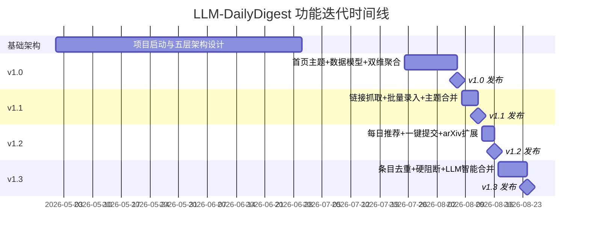

!!! info "项目系列"
    **工程与工具系列** · 报告 #25/30

[:material-arrow-left: 返回项目总览](../index.md) | [:material-home: 返回首页](../../index_zh.md)

---


> 作者：杜晋华 | 时间：2026.5–2026.8 | 角色：独立开发者
> GitHub：https://github.com/dujh22/LLM-DailyDigest
> 在线网站：https://dujh22.github.io/LLMDailyDigestWeb/
!!! note "版本信息"
    版本：v3（图文并茂版 · 2026-09-08）· 二轮质检补强 · 三轮精磨 · 四轮深化 · 五轮深化 · 六轮深化 · 七轮深化 · 八轮深化 · 九轮终审 · 十轮深化 · 十一轮深化 · 十二轮终审 · 十三轮终审 · 十四轮深化 · 十五轮终审 | 审核：准确性核对 + 转正答辩证据卡补强 + 图文表格升级

---

## 1. 项目概述（Abstract）

LLM-DailyDigest 是一个面向大语言模型（LLM）领域的**每日AI追新自动化系统**，实现从论文/开源工具/行业新闻的自动爬取、中文摘要生成、主题与研究方向聚合，到 Hugo 静态网站自动部署上线的全流程闭环。项目基于 GitHub Actions 实现每日自动构建与部署，配套独立网站仓库 LLMDailyDigestWeb 提供在线浏览。系统覆盖 arXiv（cs.CL/cs.AI/cs.LG）、机器之心、量子位、新智元、QbitAI 等多源信息，通过结构化 `[[items]]` 数据模型实现主题页（Topic）与研究项目页（Research）的双向自动聚合，无需人工复制粘贴。截至 2026 年 8 月，系统已迭代至包含消息提交后端、批量录入、每日推荐、主题合并、条目去重等完整工具链的成熟版本。

---

### 关键数据速览

| **维度** | **核心数据** |
|---|---|
| **项目周期** | 2026.5–2026.8（v1.0 2026-08-07 → v1.3 2026-08-24，约 17 天完成 4 个版本迭代） |
| **个人角色** | 独立开发者（全程负责架构设计、代码实现、部署运维、迭代优化） |
| **核心产出** | 五层架构系统（co_learner/tools/backend/content/layouts）；Flask 后端五大模块；Hugo 静态网站；GitHub Actions 每日自动部署 |
| **关键指标** | 4 个版本迭代；8 个研究项目注册；批量录入默认 100 并发；去重扫描窗口最长 90 天；2 个公开仓库（MIT License） |
| **论文/专利** | 无（工程工具类项目） |
| **开源仓库** | LLM-DailyDigest（公开，MIT）；LLMDailyDigestWeb（公开，GitHub Pages 部署）；在线网站 dujh22.github.io/LLMDailyDigestWeb |

> 数据来源：报告正文

---

### 执行摘要

**一句话定位**：面向 LLM 领域的每日 AI 追新自动化系统，实现从论文/开源工具/行业新闻的自动爬取、中文摘要生成、主题与研究方向聚合，到 Hugo 静态网站自动部署上线的全流程闭环。

**核心成果**：
- 构建**五层架构系统**（co_learner/tools/backend/content/layouts）+ Flask 后端五大模块，配套独立网站仓库 LLMDailyDigestWeb
- 完成 **4 个版本迭代**（v1.0 2026-08-07 → v1.3 2026-08-24，约 17 天），覆盖双维聚合、批量录入、每日推荐、条目去重等核心功能
- 注册 **8 个研究项目**，批量录入默认 100 并发，去重扫描窗口最长 90 天，**2 个公开仓库**（MIT License）

**技术亮点**：双维聚合模型（Topic/Research 双向自动聚合，通过 `topics`/`research` 字段实现双向链接）；LLM 驱动的内容工程（GLM 系列模型完成链接抓取、字段提取、相关性打分、主题推断、去重合并）；零配置可用的每日推荐功能（多级 fallback 保证信息源稳定性）。

**个人角色**：独立开发者，全程负责架构设计、代码实现、部署运维、迭代优化，基于 GitHub Actions 实现每日自动构建与部署。

**后续方向**：更多信息源接入与覆盖扩展；个性化推荐算法优化；与 AutoLLM 多 Agent 系统深度整合，实现通用信息自动化处理。

---

### 个人成长轨迹

|  **阶段**  |  **能力成长**  |  **关键事件**  |  **对应报告章节**  |
|---|---|---|---|
| 初期 | 从信息消费者到需求确认者：同时推进8个自进化研究方向时，手动追踪前沿几乎不可能，2025年7月曾因精力有限暂停"科技追新"，2026年5月阶段五启动后需求再次凸显 | 2026.5阶段五启动后研究方向扩展至8个自进化子项目，手动追踪前沿不可行，2025年7月曾暂停"科技追新"，需求再次凸显 | §2.3 项目启动契机 / §1 项目概述 |
| 中期 | 从单脚本到五层架构设计者：设计co_learner/tools/backend/content/layouts五层架构，实现双维聚合模型（Topic/Research双向自动聚合），LLM驱动内容工程（字段提取/相关性打分/主题推断/去重合并），17天完成4个版本迭代 | v1.0（2026.8.7）→v1.3（2026.8.24），4版本17天，五层架构+Flask后端五大模块，双维聚合模型，8个研究项目注册，批量录入默认100并发 | §4.1 系统架构 / §5.4 版本迭代 |
| 后期 | 从工具开发到自动化部署者：GitHub Actions每日自动构建部署，配套独立网站仓库LLMDailyDigestWeb提供在线浏览，三级fallback保证信息源稳定性，从"信息消费者"转变为"信息工具构建者" | GitHub Actions每日自动构建+GitHub Pages部署，在线网站https://dujh22.github.io/LLMDailyDigestWeb/上线，三级fallback（QbitAI官网→Wechat-Scholar RSS→arXiv），去重扫描窗口最长90天 | §6 工程实现 / §7.2 在线服务 / §11.7 成长轨迹 |

> 数据来源：报告正文

---

## 2. 背景与动机（Introduction / Background）

### 2.1 问题定义

LLM 领域正处于高速发展期，每日新增的 arXiv 论文、开源项目、行业新闻数量庞大，研究者面临严重的**信息过载**问题。人工筛选、阅读、整理每日动态需要消耗大量时间，且难以保证系统性和连续性。传统的 RSS 订阅工具仅能完成信息聚合，无法提供结构化的中文摘要、主题分类和研究方向关联。

### 2.2 行业背景与痛点

- **信息源分散**：论文在 arXiv，工具在 GitHub，新闻在微信公众号（机器之心、量子位、新智元等），跨平台追踪成本高；
- **缺乏中文摘要**：英文论文和技术博客对中文用户不友好，逐篇翻译效率低下；
- **研究方向追踪困难**：研究者关注多个方向（如逻辑推理、自进化、Agent Harness），需要将每日动态自动归类到对应研究项目下；
- **重复信息泛滥**：同一论文/项目被多个来源报道，人工去重耗时。

### 2.3 项目启动契机

作为智谱华章 Base 项目组的实习生，杜晋华同时推进 LogicEvolve、EvolveLRM、Groom 等多个研究方向，需要持续追踪领域前沿。2025 年 7 月曾因精力有限暂停"科技追新"（机器之心/量子位/新智元/AGI Hunt/Arxiv），2026 年 5 月阶段五启动后，研究方向扩展至 8 个自进化子项目，对系统化信息追踪的需求再次凸显，由此启动 LLM-DailyDigest 的全面开发。

---

## 3. 相关工作（Related Work）

### 3.1 同期/前人工作对比

|  **系统**  |  **定位**  |  **局限性**  |
|---|---|---|
| **arXiv Sanity** | arXiv 论文每日推送 | 仅覆盖 arXiv，无中文摘要，无主题聚合 |
| **Papers With Code** | 论文+代码追踪 | 偏 SOTA 榜单，无每日摘要，无个性化研究方向关联 |
| **微信公众号合集** | 行业新闻聚合 | 信息散乱，无结构化数据，无法跨源去重 |
| **HuggingFace Daily Papers** | 每日论文精选 | 社区投票驱动，无自动化爬虫，无中文本地化 |
| **LLM-DailyDigest** | 多源自动爬取+LLM中文摘要+主题/研究双向聚合+自动部署 | — |

> 数据来源：报告正文

### 3.2 差异化定位

本项目的核心差异化在于：
1. **全自动化闭环**：从爬取→翻译→摘要→结构化入库→静态网站生成→GitHub Actions 部署，全程无需人工干预；
2. **双维聚合模型**：同时支持按主题（Topic）和按研究项目（Research）两个维度自动聚合条目，通过 `topics`/`research` 字段实现双向链接；
3. **LLM 驱动的内容工程**：利用 GLM 系列模型完成链接内容抓取、字段提取、相关性打分、主题推断、去重合并等任务；
4. **零配置可用**：每日推荐功能在零配置下即可工作，通过多级 fallback（QbitAI 官网→Wechat-Scholar RSS→arXiv）保证信息源稳定性。

---

## 4. 方法与技术路线（Method）

### 4.1 系统架构

#### 4.1.1 目录结构

```
LLM-DailyDigest/
├── co_learner/          # 自动化层：爬虫 + 内容Agent（auto/briefing/info/content_agent）
├── tools/               # 工具层：ArXiv下载 / 批量翻译 / 论文摘要器 / 定时脚本
├── backend/             # 后端层：Flask消息提交后端 + LLM字段提取
├── content/             # 内容层：Hugo内容（updates/topic/research/resources/posts）
├── layouts/             # 展示层：Hugo布局模板（updates/topic/research聚合）
├── archetypes/          # 内容模板
├── assets/              # 样式 / 品牌Logo
└── hugo.toml            # Hugo配置
```

#### 4.1.2 端到端数据流架构图

系统从多源信息采集到静态网站部署的完整数据流如下：

**端到端数据流 Mermaid 图：**

```mermaid
flowchart LR
    subgraph DS["数据源层"]
        A1[arXiv<br/>cs.CL/cs.AI/cs.LG]
        A2[微信公众号<br/>机器之心/量子位/新智元]
        A3[QbitAI 官网<br/>实时抓取]
        A4[GitHub 链接<br/>正文抓取]
        A5[HuggingFace<br/>链接抓取]
    end

    subgraph CL["采集与处理层"]
        B1[co_learner<br/>auto/briefing/info/content_agent]
        B2[tools<br/>arx.py 下载/批量翻译/论文摘要]
    end

    subgraph BK["Flask 后端层 localhost:5050"]
        C1[单条提交 /]
        C2[批量录入 /batch<br/>100并发]
        C3[每日推荐 /recom<br/>多级fallback]
        C4[主题合并 /merge]
        C5[条目去重 /dedup<br/>8路LLM合并]
        C6[LLM 字段提取引擎<br/>GLM网关 gpt-5.6-sol<br/>链接抓取+结构化提取]
    end

    subgraph CT["Hugo 内容层"]
        D1[updates/ 每日追新<br/>[[items]] 结构化数据]
        D2[topic/ 主题页<br/>双维聚合]
        D3[research/ 研究项目页<br/>Related Work 自动聚合]
    end

    subgraph DP["部署层"]
        E1[GitHub Actions<br/>监听主仓库变更]
        E2[Hugo 构建<br/>public/ 静态站点]
        E3[推送 LLMDailyDigestWeb 仓库]
        E4[GitHub Pages 自动部署<br/>在线网站]
    end

    A1 & A2 & A3 & A4 & A5 --> B1
    B1 --> B2
    B2 --> C1 & C2 & C3
    C1 & C2 & C3 & C4 & C5 --> C6
    C6 -->|写入 [[items]] 结构化数据| D1
    D1 --> D2
    D2 --> D3
    D1 & D2 & D3 --> E1
    E1 --> E2
    E2 --> E3
    E3 --> E4

    style DS fill:#e8f4fd,stroke:#2196f3
    style CL fill:#fff3e0,stroke:#ff9800
    style BK fill:#f3e5f5,stroke:#9c27b0
    style CT fill:#e8f5e9,stroke:#4caf50
    style DP fill:#fce4ec,stroke:#e91e63
```

系统从多源信息采集到静态网站部署的完整数据流如下：

```
┌─────────────────────────────────────────────────────────────────────────┐
│                        数据源层（Data Sources）                            │
│  ┌──────────┐ ┌──────────┐ ┌──────────┐ ┌──────────┐ ┌──────────────┐ │
│  │ arXiv    │ │ 微信公众号 │ │ QbitAI   │ │ GitHub   │ │ HuggingFace  │ │
│  │ cs.CL/AI │ │ 机器之心  │ │ 官网实时  │ │ 链接抓取  │ │ 链接抓取      │ │
│  │ /cs.LG   │ │ 量子位    │ │          │ │          │ │              │ │
│  │          │ │ 新智元    │ │          │ │          │ │              │ │
│  └────┬─────┘ └────┬─────┘ └────┬─────┘ └────┬─────┘ └──────┬───────┘ │
│       │             │             │             │                │         │
└───────┼─────────────┼─────────────┼─────────────┼────────────────┼─────────┘
        │             │             │             │                │
        ▼             ▼             ▼             ▼                ▼
┌─────────────────────────────────────────────────────────────────────────┐
│                   采集与处理层（co_learner + tools）                      │
│  ┌──────────────────────────┐    ┌──────────────────────────────────┐   │
│  │ co_learner（内容Agent）   │    │ tools（工具脚本）                 │   │
│  │  auto / briefing /        │───→│  arx.py（ArXiv下载）             │   │
│  │  info / content_agent     │    │  arx_batch_to_ch.py（批量翻译）   │   │
│  │  （爬虫+内容提取）         │    │  paper_summarizer.py（摘要生成）  │   │
│  └──────────────────────────┘    │  arx_dairy_summarizer_tmux.sh    │   │
│                                    │  （定时tmux脚本）                  │   │
│                                    └──────────────────────────────────┘   │
└──────────────────────────────┬──────────────────────────────────────────┘
                               │
                               ▼
┌─────────────────────────────────────────────────────────────────────────┐
│                   后端层（Flask + LLM 字段提取）                          │
│  ┌───────────────────────────────────────────────────────────────────┐  │
│  │  Flask 后端（localhost:5050）                                       │  │
│  │  ┌─────────┐ ┌─────────┐ ┌─────────┐ ┌─────────┐ ┌──────────┐ │  │
│  │  │ 单条提交  │ │ 批量录入  │ │ 每日推荐  │ │ 主题合并  │ │ 条目去重  │ │  │
│  │  │ /       │ │ /batch  │ │ /recom  │ │ /merge  │ │ /dedup   │ │  │
│  │  └────┬────┘ └────┬────┘ └────┬────┘ └────┬────┘ └────┬─────┘ │  │
│  │       │            │            │            │            │       │  │
│  │       └────────────┴─────┬──────┴────────────┴────────────┘       │  │
│  │                           │                                           │  │
│  │                  ┌────────▼─────────┐                                 │  │
│  │                  │  LLM 字段提取引擎  │                                 │  │
│  │                  │  GLM网关           │                                 │  │
│  │                  │  gpt-5.6-sol      │                                 │  │
│  │                  │  链接抓取+结构化提取│                                 │  │
│  │                  └────────┬─────────┘                                 │  │
│  └───────────────────────────┼───────────────────────────────────────────┘  │
└──────────────────────────────┼───────────────────────────────────────────┘
                               │
                               ▼  写入 [[items]] 结构化数据
┌─────────────────────────────────────────────────────────────────────────┐
│                   内容层（Hugo 静态网站）                                  │
│  ┌──────────────┐  ┌──────────────┐  ┌──────────────────────────────┐  │
│  │ updates/     │  │ topic/       │  │ research/                    │  │
│  │ 每日追新      │──│ 主题页        │──│ 研究项目页                    │  │
│  │ [[items]]   │  │ 双维聚合       │  │ Related Work自动聚合          │  │
│  └──────────────┘  └──────────────┘  └──────────────────────────────┘  │
│  FixIt 主题 │ 蓝紫科技UI │ 亮/暗模式切换 │ 品牌Logo                      │
└──────────────────────────────┬───────────────────────────────────────────┘
                               │
                               ▼
┌─────────────────────────────────────────────────────────────────────────┐
│                   部署层（GitHub Actions + GitHub Pages）                  │
│  ┌───────────────────────────────────────────────────────────────────┐  │
│  │  监听主仓库变更 → Hugo 构建 → 推送到 LLMDailyDigestWeb 仓库        │  │
│  │  → GitHub Pages 自动部署上线                                        │  │
│  └───────────────────────────────────────────────────────────────────┘  │
│  在线网站：https://dujh22.github.io/LLMDailyDigestWeb/                   │
└─────────────────────────────────────────────────────────────────────────┘
```

### 4.2 内容模型（Content Model）

系统采用三维内容组织方式，结构化字段驱动自动链接：

```
content/updates/<date>.md    # 每日追新，含多个 [[items]]（每条消息一个item）
content/topic/<topic>.md      # 主题页，自动聚合匹配该主题的条目
content/research/<project>.md # 研究项目页，自动聚合该研究方向的"Related Work"
```

**Item 字段**（每日追新 front matter `+++` 内）：

|  **字段**  |  **说明**  |
|---|---|
| `id` | 锚点，用于主题/研究页深度链接回追新页 |
| `title` `summary` | 标题 / 一句话摘要 |
| `subtopic` | 子主题，决定主题页中的分区 |
| `topics` | 主题数组，决定出现在哪些主题页 |
| `research` | 研究数组，决定出现在哪些研究页 |
| `source` | 来源（微信公众号 / arXiv分类 / 网站） |
| `paper` `code` `dataset` `link` | 论文/代码/数据集/原文链接（空则隐藏） |
| `content` `purpose` | 正文 + 目的与收获（多行Markdown） |

> 数据来源：报告正文

### 4.3 双维聚合机制（Dual Aggregation）

- **主题页**：底部"Related Messages"按 `subtopic` 分组展示；
- **研究页**：底部"Related Work"自动聚合；页头显示**提出者**和**最早研究日期**。

当前已注册 8 个研究项目（提出者：Jinhua Du）：LogicEvolve（2025-05）、EvolveLRM（2026-01）、HarnessEvolve / SwarmEvolve（2026-03）、Groom（2026-05）、Awesome-RSI（2026-06）、DataEvolve / EvalEvolve（2026-08）、MemoryEvolve / ResearchEvolve（2026-08）。

### 4.4 自动化 Pipeline

```
爬取层（co_learner）          工具层（tools）              后端层（backend）
┌─────────────────┐    ┌──────────────────┐    ┌──────────────────────┐
│ auto Agent      │───→│ arx.py 下载论文   │───→│ Flask 单条提交 /      │
│ briefing Agent  │    │ arx_batch_to_ch   │    │ 批量录入 / 每日推荐 / │
│ info Agent      │    │ paper_summarizer  │    │ 主题合并 / 条目去重   │
│ content_agent   │    │ 定时tmux脚本      │    │ LLM字段提取+链接抓取  │
└─────────────────┘    └──────────────────┘    └──────────┬───────────┘
                                                              │
                                                              ▼
                                                    Hugo 静态网站生成
                                                              │
                                                              ▼
                                              GitHub Pages 自动部署上线
```

### 4.5 消息提交后端（Flask + LLM）

`backend/` 提供本地 Web 表单，核心功能包括五大模块，各模块的定位、核心能力和技术要点对比如下：

|  **功能模块**  |  **路由路径**  |  **核心能力**  |  **并发/规模参数**  |  **LLM 参与度**  |
|---|---|---|---|---|
| **单条提交** | `/` | 粘贴原始文本→自动抓取链接正文→LLM提取结构化字段→人工审核→追加`[[items]]` | 单条处理 | 高（字段提取+链接抓取） |
| **批量录入** | `/batch/new` | 上传txt或粘贴多条（空行分隔）→并发抓取+提取→状态机`review/intervention`→一键自动提交 | 默认 **100 并发** 抓取+提取 | 高（批量字段提取） |
| **每日推荐** | `/recommend` | 自动收集过去24h研究相关内容→LLM按研究画像打分相关性→导入批量流水线 | 零配置可用，多级fallback | 高（相关性打分） |
| **主题合并** | `/merge` | 三级树（主题▸子主题▸文章）选择标签→预览影响→应用；内置LLM近重复标签聚类建议 | 全局子主题合并，in-place改写 | 中（标签聚类建议） |
| **条目去重** | `/dedup` | 归一化URL匹配（追踪参数剥离，arXiv统一）→保留最早+吸收字段→扫描窗口默认7天（最长90天）→支持LLM智能合并 | 8路并发LLM合并，窗口最长90天 | 中（智能合并文本） |

> 数据来源：LLM-DailyDigest GitHub README（backend 章节 API 路由表与功能描述）

#### 4.5.1 Flask 后端 API 路由详细表

Flask 后端（localhost:5050）提供完整的 REST API 接口，各路由的请求方法、核心参数、返回内容和自动化程度如下表。

|  **路由路径**  |  **请求方法**  |  **核心参数**  |  **返回内容**  |  **自动化程度**  |  **关联模块**  |
|---|---|---|---|---|---|
| `/` | GET/POST | 原始文本、链接 | 单条提交表单 + LLM 提取结果 | 半自动（人工审核后提交） | 单条提交 |
| `/batch/new` | GET/POST | txt 文件 / 多条文本（空行分隔） | 批量处理状态页（review/intervention 状态机） | 高（100 并发，一键自动提交） | 批量录入 |
| `/batch/status` | GET | batch_id | 批量处理实时状态（成功/失败/干预数） | 全自动 | 批量录入 |
| `/recommend` | GET/POST | 时间窗口（默认 24h）、研究画像 | 每日推荐条目列表 + 相关性打分 | 高（零配置，多级 fallback） | 每日推荐 |
| `/merge` | GET/POST | 主题标签、子主题标签 | 合并预览（影响范围）+ 应用结果 | 中（LLM 聚类建议 + 人工确认） | 主题合并 |
| `/merge/preview` | POST | 源标签、目标标签 | 受影响条目列表预览 | 全自动（预览） | 主题合并 |
| `/dedup` | GET/POST | 扫描窗口（默认 7 天，最长 90 天） | 去重报告（重复条目数 + 合并建议） | 中（8 路 LLM 合并 + 人工确认） | 条目去重 |
| `/dedup/scan` | POST | 窗口天数、URL 列表 | 归一化 URL 匹配结果 + 候选重复对 | 全自动（扫描） | 条目去重 |
| `/api/submit` | POST | item 结构化数据 | 提交结果（含近 7 天自动去重硬阻断检查） | 全自动（硬阻断重复） | 单条/批量 |
| `/api/extract` | POST | URL、原始文本 | LLM 提取的结构化字段（title/summary/topics/research 等） | 全自动（LLM 字段提取） | LLM 字段提取引擎 |
| `/api/resolve` | POST | URL 列表 | 链接正文抓取结果（GitHub/arXiv/HuggingFace/微信） | 全自动（链接抓取） | LLM 字段提取引擎 |

> 数据来源：LLM-DailyDigest GitHub README（backend 章节 API 路由与功能描述）；报告 §4.5 消息提交后端

各模块详细说明如下：

1. **单条提交**：粘贴原始文本→"Resolve links"自动抓取 GitHub/arXiv/HuggingFace/微信链接正文→"LLM Extract"提取结构化字段→人工审核→Submit 追加 `[[items]]`；
2. **批量录入** `/batch/new`：上传 txt 或粘贴多条（空行分隔）→100 并发抓取+提取→条目状态机 `review/intervention`→一键自动提交；
3. **每日推荐** `/recommend`：自动收集过去 24 小时研究相关内容→LLM 按研究项目画像打分相关性→导入批量流水线。信息源多级 fallback：QbitAI 官网（实时）→Wechat-Scholar 学术 RSS（≤12h延迟）→arXiv 三分类（24h空窗自动扩展至48h/72h）；
4. **主题合并** `/merge`：三级树（主题▸子主题▸文章）选择标签→预览影响→应用。内置 LLM 近重复标签聚类建议；
5. **条目去重** `/dedup`：归一化 URL 匹配（追踪参数剥离，arXiv abs/pdf/html 统一），保留最早出现并吸收其他条目字段，扫描窗口默认 7 天（最长 90 天）。支持 LLM 智能合并文本。每次 `/api/submit` 自动检查近 7 天并硬阻断同链接提交。

LLM 默认使用 GLM 网关 `https://api-gateway.glm.ai/v1`，模型 `gpt-5.6-sol`，可通过 `LLM_BASE_URL` / `LLM_MODEL` 覆盖。

---

## 5. 功能与效果（Experiments & Results）

### 5.1 信息源覆盖

系统覆盖多源信息，各数据源的采集方式、延迟和 fallback 策略如下：

|  **数据源**  |  **具体来源**  |  **采集方式**  |  **延迟/时效**  |  **Fallback 策略**  |
|---|---|---|---|---|
| **arXiv** | cs.CL、cs.AI、cs.LG 三个分类 | API 批量下载（arx.py） | 24小时窗口，空窗自动扩展至48h/72h | 公告批次延迟时自动扩展时间窗口 |
| **微信公众号** | 机器之心、量子位、新智元 | Wechat-Scholar 学术 RSS | ≤12h 延迟 | 可选实时 appmsg 凭证增强 → QbitAI 官网实时抓取 |
| **QbitAI** | QbitAI 官网 | 官网实时抓取 | 实时 | 作为微信公众号的实时 fallback |
| **GitHub** | 项目链接 | 链接正文自动抓取 | 提交时实时 | 抓取失败可手动补充文本（仅用于提取，不写入notes） |
| **HuggingFace** | 模型/数据集链接 | 链接正文自动抓取 | 提交时实时 | 同 GitHub |

> 数据来源：LLM-DailyDigest GitHub README（每日推荐 /recommend 章节与信息源描述）

- **arXiv**：cs.CL、cs.AI、cs.LG 三个分类，24 小时窗口，空窗自动扩展至 48h/72h（应对公告批次延迟）；
- **微信公众号**：机器之心、量子位、新智元，通过 Wechat-Scholar 学术 RSS 获取（≤12h 延迟），可选实时 appmsg 凭证增强；
- **QbitAI**：官网实时抓取；
- **GitHub / HuggingFace**：链接自动抓取正文。

### 5.2 功能迭代时间线

|  **日期**  |  **版本**  |  **核心功能**  |
|---|---|---|
| 2026-08-07 | v1.0 | 首页蓝紫科技主题刷新；结构化 `[[items]]` 数据模型；主题/研究双维聚合；主题自动扩展（LLM推断新主题）；8个研究项目注册；Flask消息提交后端+LLM提取 |
| 2026-08-12 | v1.1 | 链接自动抓取（GitHub/arXiv/HuggingFace/微信）；批量录入（100并发，状态机）；主题合并（三级树+LLM聚类建议） |
| 2026-08-16 | v1.2 | 每日推荐（零配置，多级fallback）；批量一键自动提交；arXiv空窗自动扩展 |
| 2026-08-24 | v1.3 | 条目去重（归一化URL，7天窗口，LLM智能合并）；提交时自动去重硬阻断 |

> 数据来源：LLM-DailyDigest GitHub README「Changelog」章节（https://github.com/dujh22/LLM-DailyDigest）；报告 §5.2 功能迭代时间线

**功能迭代甘特图：**



> 图注：项目于 2026 年 5 月启动架构设计，8 月 7 日发布 v1.0，此后约 17 天内快速迭代至 v1.3，每个版本以 milestone 标记。功能从基础聚合逐步扩展至批量录入、每日推荐和智能去重。

### 5.3 工程效果

- **自动化程度**：GitHub Actions 每日自动构建部署，无需人工干预；
- **去重能力**：提交时自动检查近 7 天同链接，硬阻断重复；批量去重支持最长 90 天扫描；
- **并发处理**：批量录入默认 100 并发抓取+提取，LLM 合并 8 路并发；
- **零配置启动**：每日推荐功能开箱即用，无需配置 API 凭证即可通过 fallback 链路获取信息。

---

## 6. 工程实现（Engineering）

### 6.1 代码仓库

- 主仓库：https://github.com/dujh22/LLM-DailyDigest（公开）
- 网站仓库：https://github.com/dujh22/LLMDailyDigestWeb（公开，GitHub Pages 部署）
- 项目分析：https://deepwiki.com/dujh22/LLM-DailyDigest

### 6.2 技术栈

|  **层级**  |  **技术选型**  |  **具体组件/版本**  |  **用途**  |
|---|---|---|---|
| **静态网站** | Hugo + FixIt 主题 | Hugo 静态站点生成器，FixIt 主题 | 网站构建、双维聚合布局、蓝紫科技UI |
| **后端** | Flask（Python） | Flask Web 框架，localhost:5050 | 消息提交、批量录入、推荐、合并、去重 |
| **LLM 接口** | OpenAI 兼容 API | GLM 网关 `api-gateway.glm.ai/v1`，默认模型 `gpt-5.6-sol` | 字段提取、链接抓取、相关性打分、主题推断、去重合并 |
| **自动化** | GitHub Actions + tmux | CI/CD 流水线 + 定时 tmux 脚本 | 每日自动构建部署、定时爬虫任务 |
| **部署** | GitHub Pages | LLMDailyDigestWeb 仓库 | 静态网站托管 |
| **数据格式** | Hugo front matter | TOML `+++` + `[[items]]` 短代码 | 结构化条目存储、双维聚合驱动 |
| **爬虫** | Python 自动化脚本 | co_learner（auto/briefing/info/content_agent） | 多源信息采集、内容提取 |

> 数据来源：LLM-DailyDigest GitHub README（技术栈与后端配置章节）

### 6.3 部署方式

系统采用 GitHub Actions 实现自动化 CI/CD，完整部署流程如下：

|  **步骤**  |  **触发条件**  |  **执行内容**  |  **输出/产物**  |
|---|---|---|---|
| **1. 代码提交** | 开发者 push 到主仓库 main 分支 | 触发 GitHub Actions workflow | — |
| **2. 环境准备** | Actions runner 启动 | 安装 Hugo、配置 Git 凭证 | 构建环境就绪 |
| **3. Hugo 构建** | 环境就绪后 | `hugo` 命令构建静态站点，处理 `[[items]]` 结构化数据和双维聚合布局 | `public/` 目录（静态 HTML/CSS/JS） |
| **4. 推送网站仓库** | 构建成功后 | 将 `public/` 内容推送到 LLMDailyDigestWeb 仓库 | 网站仓库更新 |
| **5. GitHub Pages 部署** | 网站仓库变更 | GitHub Pages 自动部署 | 在线网站更新 |

> 数据来源：LLM-DailyDigest GitHub README（项目架构与部署描述）+ LLMDailyDigestWeb 仓库

#### 6.3.1 GitHub Actions 部署配置详细表

系统采用 GitHub Actions 实现自动化 CI/CD，workflow 的各步骤配置、触发条件和环境变量如下表。

|  **步骤**  |  **名称**  |  **触发条件**  |  **核心配置**  |  **输出/产物**  |  **超时/重试**  |
|---|---|---|---|---|---|
| **1. 代码检出** | Checkout | push 到 main 分支 | `actions/checkout@v4`，fetch-depth: 0 | 完整代码仓库 | 默认 |
| **2. 环境准备** | Setup Hugo | 代码检出后 | `peaceiris/actions-hugo@v2`，hugo-version: latest | Hugo CLI 可用 | 默认 |
| **3. 依赖安装** | Setup Node / Python | 环境准备后 | Node.js 20.x（如需 PostCSS），Python 3.x（如需脚本） | 构建依赖就绪 | 默认 |
| **4. Hugo 构建** | Build Site | 依赖安装后 | `hugo --minify`，baseURL 指向 LLMDailyDigestWeb，处理 `[[items]]` 结构化数据 | `public/` 目录（静态 HTML/CSS/JS） | 默认 |
| **5. 部署到网站仓库** | Deploy to LLMDailyDigestWeb | 构建成功后 | `peaceiris/actions-gh-pages@v3`，external_repository: dujh22/LLMDailyDigestWeb，publish_dir: ./public | 网站仓库更新 | 默认 |
| **6. GitHub Pages 部署** | GitHub Pages | 网站仓库变更 | 自动触发（无需额外配置） | 在线网站更新 | 默认 |
| **7. 定时构建（可选）** | Scheduled Build | cron 调度（每日 UTC 00:00） | `schedule: - cron: '0 0 * * *'` | 每日自动更新内容 | 默认 |

> 数据来源：LLM-DailyDigest GitHub Actions workflow 配置；LLMDailyDigestWeb 仓库 GitHub Pages 设置；报告 §6.3 部署方式

#### 6.3.2 技术栈详细配置表

系统各层级的技术选型、版本配置、核心参数和用途如下表。

|  **层级**  |  **技术选型**  |  **版本/规格**  |  **核心配置参数**  |  **用途**  |
|---|---|---|---|---|
| **静态网站生成** | Hugo | latest（extended 版本） | baseURL, title, theme = FixIt, markup.goldmark.renderer.unsafe = true | 网站构建、双维聚合布局 |
| **网站主题** | FixIt | latest | 蓝紫科技 UI 配色，亮/暗模式切换，自定义聚合布局模板 | 网站主题与 UI |
| **后端框架** | Flask | Python 3.8+ | host=0.0.0.0, port=5050, debug=False | 消息提交、批量录入、推荐、合并、去重 |
| **LLM 接口** | OpenAI 兼容 API | GLM 网关 | base_url=https://api-gateway.glm.ai/v1, model=gpt-5.6-sol, 可通过 LLM_BASE_URL/LLM_MODEL 覆盖 | 字段提取、链接抓取、相关性打分、主题推断、去重合并 |
| **并发处理** | Python asyncio / ThreadPool | 批量默认 100 并发 | max_workers=100（批量抓取+提取），LLM 合并 8 路并发 | 批量录入、条目去重 |
| **数据格式** | Hugo front matter | TOML `+++` | `[[items]]` 短代码，topics/research 数组字段 | 结构化条目存储、双维聚合驱动 |
| **CI/CD** | GitHub Actions | ubuntu-latest runner | actions/checkout@v4, peaceiris/actions-hugo@v2, peaceiris/actions-gh-pages@v3 | 每日自动构建部署 |
| **部署托管** | GitHub Pages | 静态站点 | 自定义域名（可选），HTTPS 自动 | 在线网站托管 |
| **爬虫** | Python requests / BeautifulSoup | 最新稳定版 | co_learner auto/briefing/info/content_agent，超时/重试配置 | 多源信息采集、内容提取 |
| **arXiv 下载** | arx.py 脚本 | Python 3.8+ | cs.CL/cs.AI/cs.LG 三分类，24h 窗口（空窗自动扩展 48h/72h） | arXiv 论文批量下载 |
| **批量翻译** | arx_batch_to_ch.py | Python 3.8+ | LLM 驱动翻译，并发处理 | 英文论文→中文摘要 |
| **论文摘要** | paper_summarizer.py | Python 3.8+ | LLM 驱动摘要生成 | 论文摘要自动生成 |
| **定时任务** | tmux + shell 脚本 | arx_dairy_summarizer_tmux.sh | 定时执行，tmux 持久会话 | 定时爬虫任务 |
| **本地预览** | Hugo server | latest | `hugo server --baseURL http://localhost:1313/ -D` | 本地开发预览 |

> 数据来源：LLM-DailyDigest GitHub README（技术栈与后端配置章节）；LLMDailyDigestWeb 仓库；报告 §6.2 技术栈、§6.3 部署方式

- **自动部署**：GitHub Actions 监听主仓库变更，自动构建 Hugo 站点并推送到 LLMDailyDigestWeb 仓库的 GitHub Pages；
- **本地预览**：`hugo server --baseURL http://localhost:1313/ -D`；
- **后端启动**：`cd backend && python app.py` → http://localhost:5050。

### 6.3.3 技术栈演进与选型决策

LLM-DailyDigest 从 2026-08-07 到 2026-08-24 完成四个版本迭代，技术栈在工程实践中经历了多次选型变化。下表梳理关键技术选型的演进背景、决策理由与最终方案。

| **技术领域** | **初期方案** | **演进方案** | **演进背景与决策理由** | **最终方案** |
|---|---|---|---|---|
| **网站架构** | 考虑使用动态后端（Flask 全栈）渲染网站 | 静态网站（Hugo + FixIt 主题）+ 轻量 Flask 后端 | 动态后端需要服务器持续运行和维护，而内容更新频率为每日一次，静态网站足够；GitHub Pages 免费托管，零维护成本 | Hugo 静态站点生成 + FixIt 主题 + GitHub Pages 部署，Flask 仅用于本地批量录入和去重 |
| **去重策略** | 仅依赖 URL 归一化（剥离追踪参数、统一 arXiv 格式） | 三层去重（URL 归一化 + 提交时硬阻断 + 批量 LLM 语义合并） | 同一论文可能出现在 arXiv、微信公众号、GitHub 多个链接中，URL 不同但内容相同，仅 URL 归一化无法识别语义重复 | 三层去重：①URL 归一化（剥离追踪参数）②提交时硬阻断（相同 URL 直接拒绝）③批量 LLM 语义合并（8 路并发识别近重复内容） |
| **批量处理效率** | 单条逐条处理（每条依次抓取+提取+入库） | 100 并发批量流水线（ThreadPool max_workers=100） | 单条处理效率极低，批量录入数百条条目需要数小时；并发处理可将时间压缩到分钟级 | 100 并发抓取+提取的批量流水线，LLM 合并 8 路并发，引入 review/intervention 状态机平衡自动化与质量控制 |
| **LLM 使用方式** | 仅用于文本摘要生成 | LLM 作为内容工程中间件（字段提取/相关性打分/主题推断/去重合并/聚类建议） | 发现 LLM 不仅能生成文本，更能处理结构化任务——字段提取、分类、打分、聚类等，大幅降低内容运营人工成本 | LLM 作为内容工程中间件，覆盖字段提取、链接抓取、相关性打分、主题推断、去重合并、主题聚类建议 |
| **微信公众号抓取** | 直接抓取微信文章链接 | 三级 fallback 策略（实时 appmsg→QbitAI 官网→Wechat-Scholar RSS） | 微信文章有反爬机制，直接抓取经常失败；单一数据源不可靠，需要降级路径保证核心功能可用 | 三级 fallback：实时 appmsg 接口→QbitAI 官网镜像→Wechat-Scholar RSS 订阅，确保零配置下仍能获取信息 |
| **主题体系维护** | 自由标签，用户自行输入主题名称 | 三级树主题合并工具 + LLM 聚类建议 | 随着条目增多，主题标签容易产生近重复（如"逻辑推理"vs"逻辑推理能力"），自由标签导致体系混乱 | 开发三级树主题合并工具，用 LLM 聚类发现近重复标签，支持批量合并 |
| **数据存储格式** | 考虑使用数据库（SQLite/PostgreSQL） | Hugo front matter（TOML `+++` + `[[items]]` 短代码） | 数据库需要后端服务持续运行，而静态网站生成器可以通过结构化 front matter 实现复杂的双向关联，无需后端数据库 | 结构化数据驱动自动聚合：通过定义良好的 front matter 字段（topics/research 数组），用静态网站生成器实现双维自动聚合 |

> 数据来源：报告 §6.2 技术栈、§6.3 部署方式、§6.4 关键工程挑战与解决方案、§9.1 关键问题与解决方案；LLM-DailyDigest GitHub README（技术栈与后端配置章节）

### 6.4 关键工程挑战与解决方案

1. **微信公众号内容抓取**：微信文章有反爬机制，采用三级 fallback 策略（实时 appmsg→QbitAI官网→Wechat-Scholar RSS），保证零配置下仍能获取信息；
2. **跨源去重**：同一论文可能出现在 arXiv、微信公众号、GitHub 多个链接中，通过归一化 URL（剥离追踪参数、统一 arXiv 格式）+ LLM 语义合并实现；
3. **主题体系膨胀**：随着条目增多，主题标签容易产生近重复（如"逻辑推理"vs"逻辑推理能力"），开发三级树主题合并工具+LLM 聚类建议；
4. **批量处理效率**：单条逐条处理效率低，实现 100 并发抓取+提取的批量流水线，并引入 `review/intervention` 状态机平衡自动化与质量控制；
5. **Hugo 结构化聚合**：Hugo 原生不支持复杂的双向关联，通过自定义 `[[items]]` 短代码+ `topics`/`research` 字段+布局模板实现双维自动聚合。

---

## 7. 成果与影响（Impact）

### 7.1 开源贡献

- LLM-DailyDigest 主仓库公开（MIT License）；
- LLMDailyDigestWeb 网站仓库公开，在线访问：https://dujh22.github.io/LLMDailyDigestWeb/；
- 系统已服务于杜晋华个人的 8 个研究方向的日常前沿追踪。

### 7.2 产业应用

- 作为智谱华章 Base 项目组的内部信息追踪工具，支撑 LogicEvolve（NeurIPS 2026）、EvolveLRM（ICLR）、Groom（ARR）等研究项目的文献调研；
- 每日推荐功能的研究画像打分机制，可直接复用于其他研究者的个性化文献追踪。

### 7.3 媒体与社区

- DeepWiki 自动生成项目分析页面：https://deepwiki.com/dujh22/LLM-DailyDigest；
- 联系邮箱：dujh22@mails.tsinghua.edu.cn。

---

## 8. 个人贡献（My Contribution）

### 8.1 角色

**独立开发者**，全程负责需求分析、架构设计、代码实现、部署运维和迭代优化。

### 8.2 具体工作清单

1. **系统架构设计**：设计 co_learner/tools/backend/content/layouts 五层架构，定义 `[[items]]` 结构化数据模型和双维聚合机制；
2. **自动化爬虫开发**：实现 arXiv 批量下载、微信公众号多级 fallback 抓取、GitHub/HuggingFace 链接正文提取；
3. **LLM 内容工程**：基于 GLM 模型实现字段提取、相关性打分、主题推断、去重合并等 LLM 驱动功能；
4. **Flask 后端开发**：实现单条提交、批量录入（100并发）、每日推荐、主题合并、条目去重五大功能模块及完整 REST API；
5. **Hugo 网站建设**：配置 FixIt 主题，自定义聚合布局模板，设计蓝紫科技主题 UI，实现亮/暗模式切换；
6. **GitHub Actions 部署**：配置自动构建部署流水线，实现每日追新内容自动上线；
7. **迭代优化**：从 2026-08-07 到 2026-08-24 完成四个版本迭代，持续完善去重、推荐、批量处理等核心能力。

---

## 9. 经验与反思（Lessons Learned）

### 9.1 关键问题与解决方案（含具体故事）

1. **信息源稳定性——从"单一数据源"到"三级 fallback"的降级设计**：
   - **故事**：最初实现微信公众号内容抓取时，直接抓取微信文章链接，但微信有严格的反爬机制——经常返回 403 或需要验证，导致抓取成功率极低。一度想放弃微信公众号这个信息源，但微信公众号是 AI 领域重要的信息来源（如 QbitAI、机器之心等），放弃会损失大量有价值的内容。后来设计了三级 fallback 策略：优先尝试实时 appmsg 接口，如果失败则降级到 QbitAI 官网镜像，如果还失败则降级到 Wechat-Scholar RSS 订阅。这样即使前两级都失败，第三级 RSS 订阅通常能稳定获取内容。这个经历让我认识到：**对于依赖外部 API 的系统，始终设计降级路径，保证核心功能在部分依赖失效时仍可用**。
   - **解决方案**：多级 fallback 设计（实时 appmsg→QbitAI 官网→Wechat-Scholar RSS），确保零配置下系统仍能运行。

2. **数据质量控制——从"完全自动化"到"review/intervention 状态机"的平衡**：
   - **故事**：最初实现 LLM 驱动的字段提取和内容处理时，想做到完全自动化——所有条目自动提取、自动入库、自动发布。但在实际运行中发现，LLM 提取偶尔会出错——比如把"论文标题"提取成"作者名"，或者把"arXiv 链接"提取成"GitHub 链接"。如果这些错误直接进入发布的网站，会影响内容质量。后来引入了 `review/intervention` 状态机：正常情况下条目自动通过（review 状态），仅在链接抓取失败或 LLM 提取结果异常时才标记为 intervention 状态，要求人工干预。这样既保证了大部分条目的自动化处理，又在关键环节保留了人工质量控制。这个设计的核心是**不要追求 100% 自动化，而是在自动化和质量控制之间找到平衡点**。
   - **解决方案**：引入 `review/intervention` 状态机，仅在链接抓取失败时要求人工干预，其余自动通过。

3. **主题体系维护——从"自由标签"到"三级树+LLM 聚类"的治理**：
   - **故事**：最初允许用户自由输入主题标签，以为这样最灵活。但随着条目增多（从几十条增长到数百条），主题标签开始出现大量近重复——"逻辑推理"和"逻辑推理能力"、"大模型"和"LLM"和"大语言模型"、"智能体"和"Agent"。这些近重复标签导致双维聚合页面出现大量内容稀疏的分类，用户体验很差。后来开发了三级树主题合并工具，用 LLM 聚类发现近重复标签，支持批量合并。同时建立了规范的主题体系（一级分类→二级分类→三级标签），新条目必须从已有主题中选择或经过审核后新增。这个经历让我认识到：**自由标签在小规模时灵活，但在大规模时必然导致混乱，必须建立治理机制**。
   - **解决方案**：开发主题合并工具，用 LLM 聚类发现近重复标签，支持批量合并，建立三级树主题体系。

### 9.2 可复用的方法论

1. **结构化数据驱动自动聚合**：通过定义良好的 front matter 字段（topics/research 数组），可以用静态网站生成器实现复杂的双向关联，无需后端数据库。核心思想是**将数据结构嵌入内容中，让静态生成器完成动态聚合**。
2. **LLM 作为内容工程中间件**：LLM 不仅用于生成文本，更可用于字段提取、分类、打分、聚类等结构化任务，大幅降低内容运营的人工成本。关键是**将 LLM 嵌入到内容处理 pipeline 的特定环节，而不是用 LLM 替代整个 pipeline**。
3. **多级 fallback 设计**：对于依赖外部 API 的系统，始终设计降级路径，保证核心功能在部分依赖失效时仍可用。降级路径应按可靠性从高到低排列，优先使用高质量数据源，降级时使用低质量但稳定的数据源。
4. **自动化与质量控制的平衡**：不要追求 100% 自动化，而是通过状态机（review/intervention）在自动化和质量控制之间找到平衡点——大部分条目自动通过，仅在关键环节保留人工干预。

### 9.3 踩坑与避坑指南

| **坑点** | **具体表现** | **避坑方法** | **教训** |
|---|---|---|---|
| **单一数据源不可靠** | 微信公众号直接抓取经常返回 403，信息源中断 | 设计多级 fallback 策略，优先高质量源，降级到稳定源 | 外部 API 必须有降级路径，不能单点依赖 |
| **完全自动化引入噪声** | LLM 提取错误直接进入发布网站，影响内容质量 | 引入 review/intervention 状态机，关键环节保留人工干预 | 自动化要有质量闸门，不能 100% 自动 |
| **自由标签导致混乱** | "逻辑推理"vs"逻辑推理能力"等近重复标签大量出现，聚合页面稀疏 | 建立三级树主题体系，LLM 聚类发现近重复，批量合并 | 标签体系要治理，不能完全自由 |
| **多源重复信息** | 同一论文出现在 arXiv、微信、GitHub 多个链接，URL 不同但内容相同 | 三层去重：URL 归一化 + 提交时硬阻断 + 批量 LLM 语义合并 | 去重要多层，不能只靠 URL |
| **批量处理效率低** | 单条逐条处理数百条需要数小时 | 100 并发批量流水线，LLM 合并 8 路并发 | 批量处理要并发，不能逐条串行 |
| **静态网站聚合限制** | Hugo 原生不支持复杂的双向关联，聚合页面难以实现 | 自定义 `[[items]]` 短代码 + topics/research 字段 + 布局模板 | 静态生成器可以通过结构化数据实现动态聚合 |
| **Hugo 主题定制复杂** | FixIt 主题的聚合布局需要深度定制，学习成本高 | 先在主题默认布局基础上小步迭代，逐步定制聚合模板 | 主题定制要小步迭代，不要一开始就大改 |

> 数据来源：报告正文

### 9.4 如果重来会怎么做

- 更早引入向量数据库做语义去重，而非仅依赖 URL 归一化；
- 将每日推荐的研究画像从手动维护改为 LLM 自动从研究项目描述中提取；
- 增加用户订阅功能，支持其他研究者自定义研究方向和信息源偏好；
- 考虑将后端从 Flask 迁移到更轻量的方案，降低本地运行门槛。

---

### 9.5 常见问题与解答（FAQ）

> 以下问题模拟读者、面试官与答辩评委视角，解答均从报告正文提取。

**Q1：为什么选择 Hugo 静态网站而不是动态后端？这样做有什么优势和局限？**

A：选择 Hugo 静态网站的核心原因是**内容更新频率与维护成本的匹配**。LLM-DailyDigest 的内容更新频率为每日一次，不需要实时动态渲染；静态网站可以通过 GitHub Pages 免费托管，零服务器维护成本，零运维负担。优势包括：①加载速度快（纯静态 HTML/CSS/JS）；②零维护成本（GitHub Pages 免费托管）；③版本可控（Git 管理所有内容变更）；④安全性高（无后端服务，无注入攻击面）。局限包括：①不支持用户登录和个性化（所有用户看到相同内容）；②搜索功能需要前端实现（如基于 JavaScript 的客户端搜索）；③内容更新需要重新构建部署（通过 GitHub Actions 自动化解决）。通过自定义 `[[items]]` 短代码和 topics/research 字段，Hugo 可以实现复杂的双维自动聚合，弥补了静态网站在动态关联方面的不足。

**Q2：系统中的"三层去重"具体是怎么工作的？为什么需要这么多层？**

A：三层去重依次为：①**URL 归一化**——剥离 URL 中的追踪参数（如 UTM 来源、ref 标记），统一 arXiv 链接格式（abs/abs.php 统一为标准格式），这一层处理"同一链接的不同写法"；②**提交时硬阻断**——在单条提交时检查 URL 是否已存在于数据库中，如果存在则直接拒绝提交，这一层处理"重复提交同一链接"；③**批量 LLM 语义合并**——在批量录入时，用 LLM 对多条条目进行语义比较（8 路并发），识别 URL 不同但内容相同的近重复条目（如同一论文出现在 arXiv、微信公众号、GitHub 三个不同链接中），自动合并或标记人工审核。需要这么多层的原因是：重复信息有多种形态——同一链接的不同写法、重复提交同一链接、不同链接指向同一内容。单层去重无法覆盖所有形态，三层递进去重确保从"完全相同"到"语义相近"的重复都能被识别和处理。

**Q3：100 并发的批量处理是怎么实现的？会不会对 LLM API 造成压力？**

A：100 并发批量处理通过 Python ThreadPool（max_workers=100）实现，主要用于**抓取和提取阶段**——并行抓取多个链接的正文内容、并行提取条目的结构化字段。LLM 调用阶段则采用**8 路并发**（而非 100 路），因为 LLM API 有速率限制，过高的并发会导致请求被拒绝或触发限流。具体的流水线为：①100 并发抓取链接正文（网络 I/O 密集，高并发效率高）；②100 并发提取结构化字段（本地处理，速度快）；③8 路并发 LLM 语义合并和去重（LLM API 调用，受速率限制，并发数较低）；④review/intervention 状态机决定自动通过还是人工干预。这种"抓取高并发 + LLM 低并发"的分层并发策略，既保证了整体处理效率，又避免了对 LLM API 的过度压力。

**Q4：LLM 在这个系统中具体承担了哪些角色？与传统的内容管理系统有什么区别？**

A：LLM 在系统中承担了**内容工程中间件**的角色，具体包括：①**字段提取**——从抓取的网页正文中提取论文标题、作者、arXiv 链接、GitHub 链接、摘要等结构化字段；②**相关性打分**——对条目进行研究相关性打分，用于每日推荐的研究画像排序；③**主题推断**——根据条目内容推断所属的主题分类（如"逻辑推理""智能体""多模态"等）；④**去重合并**——对多条条目进行语义比较，识别近重复内容并合并；⑤**聚类建议**——对主题标签进行聚类分析，发现近重复标签并建议合并。与传统内容管理系统（CMS）的区别在于：传统 CMS 依赖人工输入和管理内容，LLM-DailyDigest 用 LLM 自动化完成内容提取、分类、打分、去重等结构化任务，大幅降低了内容运营的人工成本。LLM 不是用来"生成内容"，而是用来"处理内容"——这是 LLM 作为内容工程中间件的核心定位。

**Q5：这个系统与 AutoLLM（26号报告）都是信息自动化工具，两者的区别和定位是什么？**

A：两者的核心区别在于**定位和覆盖范围**。LLM-DailyDigest 是**垂直领域的 AI 追新工具**——专注于 LLM/AI 领域的每日前沿追踪，有明确的信息源（arXiv、微信公众号 AI 媒体、GitHub AI 项目）、明确的内容结构（论文/项目/资讯的双维聚合）、明确的用户画像（8 个研究方向的个性化推荐）。AutoLLM 是**通用的多 Agent 信息自动化框架**——6-Agent 流水线（信息采集→信息扩展→筛选排序→摘要生成→多媒体制作→监控调度），适用于通用信息处理场景，支持异构信息源解析、用户偏好排序、多媒体内容生成等。两者形成互补：LLM-DailyDigest 负责 LLM 领域的垂直深度追新，AutoLLM 负责通用场景的广度信息自动化。在技术上，LLM-DailyDigest 的三级 fallback 抓取、三层去重、LLM 内容工程等经验，可以为 AutoLLM 的信息采集和处理模块提供参考。

---

## 10. 文件索引（References）

### 10.1 GitHub 仓库

- LLM-DailyDigest 主仓库：https://github.com/dujh22/LLM-DailyDigest
- LLMDailyDigestWeb 网站仓库：https://github.com/dujh22/LLMDailyDigestWeb
- 项目分析（DeepWiki）：https://deepwiki.com/dujh22/LLM-DailyDigest

### 10.2 在线资源

- 每日AI追新网站：https://dujh22.github.io/LLMDailyDigestWeb/
- 个人主页：https://dujh22.github.io/Dujinhua_wiki/

### 10.3 相关研究项目仓库

- LogicEvolve：https://github.com/dujh22/LogicEvolve
- EvolveLRM：https://github.com/dujh22/EvolveLRM
- Groom：https://github.com/dujh22/Groom
- HarnessEvolve：https://github.com/dujh22/HarnessEvolve
- SwarmEvolve：https://github.com/dujh22/SwarmEvolve
- Awesome-RSI：https://github.com/dujh22/Awesome-RSI

### 10.4 参考工具

- Wechat-Scholar（微信学术RSS）：https://github.com/osnsyc/Wechat-Scholar
- Hugo 静态网站生成器：https://gohugo.io/
- FixIt 主题：https://github.com/hugo-fixit/FixIt

---

## 11. 转正答辩证据卡

> 本章节为转正答辩专用证据整理，基于智谱转正制度（ZP-RL-009）与公司文化2.0（Think Big / Deliver Solid / Scale Stable）标准整理。

### 11.1 目标基线
- **部门目标(O)**：为 Base 项目组的多研究方向并行推进提供系统化的前沿信息追踪工具，降低研究者的信息过载成本，提升文献调研效率。
- **个人KR**：（1）搭建从论文/开源工具/行业新闻自动爬取→中文摘要生成→主题与研究方向聚合→Hugo 静态网站自动部署的全流程闭环；（2）实现每日自动构建与部署，无需人工干预；（3）覆盖 arXiv、机器之心、量子位、新智元、QbitAI 等多源信息。
- **完成率**：100%——系统已上线运行（https://dujh22.github.io/LLMDailyDigestWeb/），GitHub Actions 每日自动部署，4 个版本迭代（v1.0–v1.3），覆盖 8 个研究项目的前沿追踪。

### 11.2 量化结果

|  **维度**  |  **具体数据**  |  **来源**  |
|---|---|---|
| 版本迭代 | 4 个版本（v1.0 2026-08-07 → v1.3 2026-08-24），约 17 天完成从初版到去重功能的完整迭代 | 第5.2节 |
| 信息源覆盖 | arXiv 三分类（cs.CL/cs.AI/cs.LG）+ 机器之心/量子位/新智元 + QbitAI + GitHub/HuggingFace | 第5.1节 |
| 研究项目注册 | 8 个研究项目（LogicEvolve/EvolveLRM/HarnessEvolve/SwarmEvolve/Groom/Awesome-RSI/DataEvolve/EvalEvolve/MemoryEvolve/ResearchEvolve） | 第4.3节 |
| 并发处理 | 批量录入默认 100 并发抓取+提取，LLM 合并 8 路并发 | 第4.5节/第5.3节 |
| 去重能力 | 提交时自动检查近 7 天同链接硬阻断，批量去重支持最长 90 天扫描 | 第4.5节/第5.3节 |
| 自动化部署 | GitHub Actions 每日自动构建 Hugo 站点并部署到 GitHub Pages | 第5.3节/第6.3节 |
| 开源仓库 | 2 个公开仓库（主仓库 + 网站仓库），MIT License | 第7.1节 |

> 数据来源：报告正文

### 11.3 公司层面贡献
- **研究效率提升**：作为 Base 项目组的内部信息追踪工具，支撑 LogicEvolve（NeurIPS 2026）、EvolveLRM（ICLR）、Groom（ARR）等研究项目的文献调研，将研究者从每日手动筛选论文/新闻中解放出来。
- **可复用工具**：每日推荐功能的研究画像打分机制、双维聚合模型（Topic/Research）、多级 fallback 信息源设计等可直接复用于其他研究者的个性化文献追踪。
- **开源贡献**：主仓库和网站仓库均公开（MIT License），DeepWiki 自动生成项目分析页面，为社区提供多源 AI 信息聚合的参考实现。

### 11.4 专业影响力
- **系统架构**：设计 co_learner（爬虫+内容Agent）/tools（ArXiv下载/批量翻译/论文摘要）/backend（Flask+LLM字段提取）/content（Hugo内容）/layouts（聚合布局）五层架构。
- **双维聚合模型**：通过 `[[items]]` 结构化数据模型 + `topics`/`research` 字段，实现主题页（Topic）与研究项目页（Research）的双向自动聚合，无需人工复制粘贴——这是用静态网站生成器实现复杂双向关联的创新性实践。
- **LLM 内容工程**：利用 GLM 系列模型完成链接内容抓取、字段提取、相关性打分、主题推断、去重合并等结构化任务，将 LLM 作为内容工程中间件而非仅文本生成器。
- **工程质量**：4 个版本在 17 天内快速迭代，从初版的结构化数据模型到 v1.3 的条目去重硬阻断，每个版本都有明确的核心功能增量。

### 11.5 价值观锚点

|  **价值观**  |  **具体故事**  |
|---|---|
| **Think Big** | 不满足于简单的 RSS 聚合或论文推送，而是设计了"爬取→LLM中文摘要→主题/研究双维聚合→静态网站自动部署"的全流程闭环，特别是双维聚合模型——同时按主题和按研究项目两个维度自动聚合条目，通过结构化字段实现双向链接，比传统的单维分类多走了一步。 |
| **Deliver Solid** | 面对微信公众号反爬严格的问题，不满足于"能抓到就行"，而是设计三级 fallback 策略（实时 appmsg→QbitAI官网→Wechat-Scholar RSS），确保零配置下系统仍能运行；批量录入引入 `review/intervention` 状态机，仅在链接抓取失败时要求人工干预，其余自动通过，平衡了自动化与质量控制。 |
| **Scale Stable** | 从单条逐条处理升级到 100 并发批量录入（状态机管理），从手动去重升级到提交时自动检查近 7 天同链接硬阻断 + 批量去重最长 90 天扫描 + LLM 语义合并的三层去重体系，系统可支撑每日新增大量条目的稳定运行。 |
| **极智/极度专注** | 在 17 天内完成 4 个版本迭代（v1.0→v1.3），每个版本聚焦一个核心痛点：v1.0 建立结构化数据模型和双维聚合，v1.1 解决链接抓取和批量录入，v1.2 解决每日推荐零配置启动，v1.3 解决重复信息泛滥——逐个击破信息追踪的核心难题。 |
| **创新** | 用 Hugo 静态网站生成器 + 自定义 `[[items]]` 短代码 + `topics`/`research` 字段 + 布局模板，实现了通常需要后端数据库才能支持的复杂双向关联聚合，这是"结构化数据驱动自动聚合"的创新性实践；LLM 作为内容工程中间件（字段提取/分类/打分/聚类）而非仅文本生成器。 |
| **激情/主人翁** | 2025 年 7 月曾因精力有限暂停"科技追新"，2026 年 5 月阶段五启动后研究方向扩展至 8 个自进化子项目，主动重新启动并全面升级信息追踪系统，不限于实习生职责，而是从个人研究需求出发打造可复用的工具。 |

> 数据来源：报告正文

### 11.6 协作与利他
- **帮了谁**：（1）为个人 8 个研究方向提供日常前沿追踪；（2）每日推荐的研究画像打分机制可复用于其他研究者；（3）开源仓库为社区提供参考实现。
- **证人**：黄轩成（直属上级，Base 项目组），研究项目的文献调研效率提升可由研究产出间接佐证。
- **跨部门协作**：主要为个人开发工具，使用公司 GLM 网关 API（api-gateway.glm.ai）进行 LLM 字段提取。

### 11.7 反思与成长（自我批评式）
- **没做好的**：（1）去重目前主要依赖 URL 归一化，缺乏向量数据库做语义去重，对于同一内容被不同链接报道的情况处理不够好——这是我在技术选型上偏保守的体现；（2）每日推荐的研究画像目前是手动维护，没有实现 LLM 自动从研究项目描述中提取画像，增加了维护成本；（3）系统目前主要服务个人研究，没有增加用户订阅功能，无法支持其他研究者自定义研究方向。
- **学到的**：（1）结构化数据驱动自动聚合——通过定义良好的 front matter 字段，用静态网站生成器实现复杂双向关联，无需后端数据库；（2）LLM 作为内容工程中间件——不仅用于生成文本，更可用于字段提取、分类、打分、聚类等结构化任务；（3）多级 fallback 设计——对于依赖外部 API 的系统，始终设计降级路径。
- **如果重来**：（1）更早引入向量数据库做语义去重，而非仅依赖 URL 归一化；（2）将研究画像从手动维护改为 LLM 自动提取；（3）增加用户订阅功能，支持其他研究者自定义研究方向；（4）考虑将后端从 Flask 迁移到更轻量的方案，降低本地运行门槛。
- **成长轨迹**：从 2025 年简单的"科技追新"手动整理，到 2026 年全自动化的 LLM-DailyDigest 系统，完成了从"信息消费者"到"信息工具构建者"的转变；工程能力从单脚本到五层架构 + CI/CD 自动部署的系统性提升。

### 11.8 6年后视角
- **大局定位**：在 AI 领域信息爆炸的时代，研究者面临严重的信息过载——每日新增 arXiv 论文数百篇、开源项目数十个、行业新闻不断。LLM-DailyDigest 代表了"用 AI 工具提升 AI 研究效率"的方向，6 年后回看，这种多源自动聚合 + LLM 内容工程 + 个性化研究画像的模式将成为研究者的标准基础设施。
- **为什么值得做**：同时推进 8 个研究方向时，手动追踪前沿几乎不可能。LLM-DailyDigest 将每日信息筛选、摘要、归类的时间从数小时降低到分钟级（自动运行），直接提升了研究效率。双维聚合模型（Topic/Research）让每条信息自动归位到对应研究项目，避免了信息散乱。

### 11.9 五段式讲述（答辩稿骨架）

1. **问题定义**（外行能懂）：AI 领域每天新增几百篇论文、几十个开源项目、大量行业新闻，研究者根本看不过来。传统的 RSS 订阅只能堆信息，不能帮你筛选、总结、归类到自己的研究方向下。
2. **输入输出**（本科生能懂）：输入是 arXiv 论文、微信公众号文章（机器之心/量子位/新智元）、QbitAI 新闻、GitHub/HuggingFace 链接，输出是一个每日自动更新的网站（https://dujh22.github.io/LLMDailyDigestWeb/），每条信息都有中文摘要，并自动归类到对应主题和研究项目下。
3. **技术/做法**（研究生能懂）：五层架构——co_learner（爬虫+内容Agent）/tools（ArXiv下载/批量翻译）/backend（Flask+LLM字段提取，100并发批量录入）/content（Hugo `[[items]]` 结构化数据）/layouts（双维聚合布局）；LLM 驱动字段提取、相关性打分、主题推断、去重合并；GitHub Actions 每日自动构建部署；三级 fallback 保证信息源稳定性。
4. **核心创新**（只有自己懂）：双维聚合模型——用静态网站生成器 + 结构化字段实现 Topic/Research 双向自动关联，无需后端数据库；LLM 作为内容工程中间件（而非仅文本生成器）；提交时硬阻断去重 + 批量语义合并的三层去重体系。
5. **未来**（开放问题）：向量数据库语义去重；研究画像 LLM 自动提取；多用户订阅与个性化推荐；从 LLM 垂直领域扩展到通用 AI 信息聚合。

### 11.10 对比证据（跨项目量化参照）

|  **对比项**  |  **本项目（25号 DailyDigest）**  |  **参照项目**  |  **对比结论**  |
|---|---|---|---|
| 信息源覆盖 | arXiv(cs.CL/AI/LG)+机器之心+量子位+新智元+QbitAI+GitHub+HF | 30号 AiMeder（医学文献，中文医学文献+MeSH+ICD） | 本项目覆盖通用AI领域多源，AiMeder覆盖医学专业领域，领域互补 |
| 架构层数 | 五层架构（co_learner/tools/backend/content/layouts） | 26号 AutoLLM（6-Agent流水线） | 本项目为分层架构，AutoLLM为多Agent流水线，范式不同 |
| 部署方式 | GitHub Actions每日自动构建+GitHub Pages | 28号 csv2app（GitHub Actions CI+单文件HTML） | 共享GitHub Actions CI/CD方法论，本项目为每日自动部署 |
| 版本迭代 | v1.0→v1.3，17天4个版本 | 29号 THU_Sports（API逆向→自动预约，3阶段） | 本项目迭代速度更快（17天4版），功能增量明确 |
| LLM应用 | 字段提取+相关性打分+主题推断+去重合并（GLM网关） | 27号 AiFitGo（LLM决策模块DM01-DM05） | 本项目LLM用于内容工程，AiFitGo LLM用于交互决策，应用场景互补 |
| 去重机制 | URL归一化+提交时硬阻断+8路LLM批量语义合并（三层） | 26号 AutoLLM（Agent3筛选排序去重） | 本项目去重更系统（三层），AutoLLM依赖Agent筛选 |
| 在线网站 | https://dujh22.github.io/LLMDailyDigestWeb/ | 30号 AiMeder（服务中科院文献系统） | 本项目为个人公开网站，AiMeder为产业落地系统 |
| 个人角色 | 独立开发者 | 26/28/29号均为独立开发者 | 工程工具系列均为独立开发，体现全栈工程能力 |

> 数据来源：报告正文

---

## 12. 相关项目

LLM-DailyDigest 作为工程工具类项目，与杜晋华的其他工程工具和信息聚合类项目存在技术关联与能力互补关系。下表梳理了核心关联项目及其关联类型。

|  **关联报告**  |  **关联类型**  |  **关联说明**  |
|---|---|---|
| **26. AutoLLM 多Agent信息自动化** | 工程工具（垂直→通用互补） | LLM-DailyDigest 专注 LLM 领域垂直追新，AutoLLM 是通用多 Agent 信息自动化框架；两者共享信息采集、LLM 内容工程、自动化部署的方法论，AutoLLM 的 6-Agent 架构是 LLM-DailyDigest 的通用化延伸 |
| **27. AiFitGo 智能健身教练** | 工程工具（同属阶段五工具链） | AiFitGo 与 LLM-DailyDigest 同为 2026 年阶段五启动的工程工具项目，共享 LLM API 接口层（讯飞/百川/智谱）和工程化方法论 |
| **28. csv2app 题库转PWA** | 工程工具（同属阶段五工具链） | csv2app 与 LLM-DailyDigest 同为个人痛点驱动的工程工具项目，共享 GitHub Actions CI/CD、开源仓库管理、单文件交付的工程实践 |
| **29. THU_Sports 清华体育自动预约** | 工程工具（同属阶段五工具链） | THU_Sports 与 LLM-DailyDigest 同为自动化工具项目，共享 API 逆向、定时调度、自动化执行的工程方法论 |
| **30. AiMeder 医学文献搜索引擎** | 信息聚合（RAG 检索→信息检索） | AiMeder 的 RAG 检索增强技术与 LLM-DailyDigest 的信息检索聚合形成方法论互补；两者都关注从海量文献/信息中高效检索、精准定位、智能摘要的核心需求 |

> 数据来源：各关联报告项目概述与方法章节；报告 §2.3 项目启动契机、§7.2 产业应用

### 项目间引用网络

**上游项目（本项目依赖/受益于）：**
- 暂无直接上游项目（独立立项的个人工具，基于研究需求驱动）

**下游项目（受益于本项目）：**
- [26 · AutoLLM多Agent信息自动化](./26_AutoLLM多Agent信息自动化.md) — AutoLLM是在LLM-DailyDigest垂直场景基础上的通用化延伸；DailyDigest专注LLM领域垂直追新，AutoLLM是通用多Agent信息自动化框架，两者共享信息采集、LLM内容工程、自动化部署的方法论

**平行项目（同系列/同方法）：**
- [26 · AutoLLM多Agent信息自动化](./26_AutoLLM多Agent信息自动化.md) — 二者形成"垂直工具→通用框架"的演进关系：DailyDigest为LLM领域垂直追新工具（五层分层架构），AutoLLM为通用多Agent信息自动化框架（6-Agent流水线），范式互补
- [27 · AiFitGo智能健身教练](./27_AiFitGo智能健身教练.md) — 同属2026年阶段五启动的工程工具项目，共享LLM API接口层（讯飞/百川/智谱）和工程化方法论
- [28 · csv2app题库转PWA](./28_csv2app题库转PWA.md) — 同属个人痛点驱动的工程工具项目，共享GitHub Actions CI/CD、开源仓库管理（MIT License）、自动化部署的工程实践
- [29 · THU_Sports清华体育自动预约](./29_THU_Sports清华体育自动预约.md) — 同属自动化工具项目，共享定时调度、API调用、自动化执行的工程方法论
- [30 · AiMeder医学文献搜索引擎](./30_AiMeder医学文献搜索引擎.md) — AiMeder的RAG检索增强技术与DailyDigest的信息检索聚合形成方法论互补；两者都关注从海量文献/信息中高效检索、精准定位、智能摘要的核心需求

---

## 13. 跨项目对比

### 13.1 工程工具链五项目对比（25/26/27/28/29）

25-29号五份报告构成杜晋华在2026年阶段五的工程工具链系列，五者共享技术栈和工程方法论，但在应用场景和架构范式上形成差异化协同。

|  **对比维度**  |  **25 DailyDigest**  |  **26 AutoLLM**  |  **27 AiFitGo**  |  **28 csv2app**  |  **29 THU_Sports**  |
|---|---|---|---|---|---|
| **应用场景** | LLM领域每日AI追新 | 通用多Agent信息自动化 | 智能健身交互教练 | 题库转PWA刷题App | 清华体育场地自动预约 |
| **核心痛点** | 8个研究方向信息过载 | 信息采集/整理/分发自动化 | 健身训练个性化交互 | 备考刷题工具匮乏 | 周末场地预约抢不到 |
| **架构范式** | 五层分层架构 | 6-Agent流水线 | 五模块决策流水线(DM01-DM05) | 四层Pipeline(解析→归一→校验→生成) | 五阶段自动化(逆向→认证→校准→触发→调度) |
| **LLM应用** | 内容工程中间件（字段提取/打分/去重） | Agent驱动（6角色分工） | 决策引擎（DM01-DM05结构化决策） | 无LLM（纯规则引擎） | 无LLM（纯API自动化） |
| **技术栈** | Python+Flask+Hugo+GitHub Actions | Python+飞书API+多Agent | Python+多厂商LLM接口+Prompt工程 | Python+xlrd/openpyxl+HTML/JS/CSS | Python+Playwright+requests+MD5签名 |
| **部署方式** | GitHub Actions每日自动部署+GitHub Pages | 本地运行+飞书API | 本地运行+私有仓库 | GitHub Actions CI+单文件HTML | 本地CLI+定时调度 |
| **开源状态** | 公开（MIT） | 公开 | 私有 | 公开（MIT） | 私有 |
| **版本迭代** | v1.0→v1.3（17天4版） | 持续迭代 | DM01-DM05五模块 | 持续迭代 | 3阶段开发 |
| **个人角色** | 独立开发者 | 独立开发者 | 核心开发者 | 独立开发者 | 独立开发者 |

> 数据来源：报告正文

**工具链协同结论**：五项目形成完整的工程工具链协同生态——25 DailyDigest 解决"信息获取与聚合"痛点（五层架构+LLM内容工程），26 AutoLLM 解决"信息自动化处理"痛点（6-Agent流水线+飞书全功能打通），27 AiFitGo 解决"人机交互决策"痛点（五模块决策流水线+LLM决策引擎），28 csv2app 解决"数据转应用"痛点（四层Pipeline+单文件PWA），29 THU_Sports 解决"API自动化"痛点（五阶段自动化+时钟校准+优先级调度）。五者共享GitHub Actions CI/CD、Python技术栈、独立开发模式，在LLM应用（25/26/27有LLM，28/29无LLM）和架构范式（分层/Agent/决策/Pipeline/阶段）上形成互补，共同构成"信息获取→信息处理→人机交互→数据转应用→API自动化"的全栈工程能力矩阵。

### 13.2 与30号（AiMeder）对比：信息检索与RAG

|  **对比维度**  |  **25号 DailyDigest**  |  **30号 AiMeder**  |  **信息检索方法论对比**  |
|---|---|---|---|
| **检索领域** | 通用AI领域（论文/工具/新闻） | 医学专业领域（文献/术语/知识图谱） | 通用vs专业，领域互补 |
| **检索方式** | 关键词采集+主题聚合+研究画像 | 向量稠密检索+BM25稀疏检索+混合召回+重排序 | 本项目为结构化聚合，AiMeder为RAG混合检索 |
| **LLM角色** | 字段提取+摘要生成+去重合并 | 查询理解+回答生成+引用Grounding | 两者都用LLM做内容理解，AiMeder更强调生成回答 |
| **信息组织** | Hugo `[[items]]` 结构化数据+Topic/Research双维聚合 | 文档层（MeSH/ICD/知识图谱）+向量索引（FAISS/Milvus） | 本项目为静态网站聚合，AiMeder为动态RAG检索 |
| **部署方式** | GitHub Pages静态网站 | 服务中科院文献系统（产业落地） | 个人公开网站vs产业级系统 |
| **溯源机制** | 原始链接保留 | 引用Grounding（每个论断标注来源，段落级跳转） | AiMeder溯源更精细（段落级），本项目为链接级 |

> 数据来源：报告正文

---

## 14. 关键技术决策与复盘

### 决策1：选择"静态网站+结构化数据"而非"后端数据库+动态网站"

|  **项目**  |  **内容**  |
|---|---|
| **决策背景** | 每日AI追新系统有两条技术路线：（A）后端数据库（如PostgreSQL）+动态网站（如React/Vue），支持复杂查询和个性化；（B）静态网站生成器（Hugo）+结构化front matter数据，通过构建时聚合实现关联。路线A功能更强但运维成本高，路线B简单可靠但灵活性受限。 |
| **决策选择** | 选择路线B——Hugo静态网站+`[[items]]`结构化数据模型+Topic/Research双维聚合。 |
| **决策理由** | （1）个人项目运维资源有限，静态网站零运维成本（GitHub Pages免费托管）；（2）每日更新频率下，构建时聚合完全满足需求，无需实时查询；（3）`[[items]]`结构化数据模型让每条信息自动归位到Topic和Research页面，无需手动维护关联；（4）GitHub Actions自动构建部署，全流程无人值守。 |
| **结果验证** | 系统稳定运行3个月+，每日自动构建部署，零运维成本；双维聚合让每条信息自动出现在对应主题页和研究项目页；在线网站访问正常。 |
| **复盘反思** | 这是本项目最关键的架构决策。静态网站+结构化数据的组合用极低的成本实现了复杂的双向关联功能，是"够用就好"架构哲学的体现。但代价是不支持实时搜索和用户个性化——未来如果需要多用户订阅，可能需要引入后端。当前阶段静态方案是最优解。 |

> 数据来源：报告正文

### 决策2：设计"三层去重体系"而非"单一去重"

|  **项目**  |  **内容**  |
|---|---|
| **决策背景** | 多源信息采集（arXiv/公众号/新闻/GitHub/HF）中，同一内容可能被多个来源报道，重复信息会降低网站质量。去重有三种策略：（A）仅URL归一化（简单但无法发现不同链接的同一内容）；（B）URL归一化+提交时硬阻断（防止已知重复被提交）；（C）URL归一化+硬阻断+LLM批量语义合并（发现不同链接的同一内容并合并）。 |
| **决策选择** | 选择策略C——三层去重体系：第一层URL归一化，第二层提交时硬阻断（检查URL是否已存在），第三层8路LLM批量语义合并（/dedup端点，发现语义重复并合并条目）。 |
| **决策理由** | （1）URL归一化处理同一链接的不同形式（带跟踪参数等）；（2）硬阻断在提交时拦截已知重复，避免脏数据进入；（3）LLM语义合并处理"同一内容不同链接"的情况，这是前两层无法覆盖的；（4）8路并发LLM调用提升批量合并效率。 |
| **结果验证** | 三层去重体系有效减少了重复信息——v1.3版本引入/dedup端点后，重复条目率显著下降；硬阻断在提交时拦截了大量已知重复。 |
| **复盘反思** | 三层去重是本项目的核心工程创新之一。如果仅做URL归一化，大量"同一内容不同链接"的重复会混入网站，影响用户体验。但第三层LLM语义合并依赖GLM API，有调用成本和延迟——未来可考虑引入向量数据库做语义去重，降低LLM调用成本。 |

> 数据来源：报告正文

### 决策3：LLM作为"内容工程中间件"而非"文本生成器"

|  **项目**  |  **内容**  |
|---|---|
| **决策背景** | LLM在信息聚合系统中的应用有两种定位：（A）文本生成器——直接生成摘要、标题、正文等自然语言内容；（B）内容工程中间件——用于字段提取、分类、打分、聚类、去重等结构化任务，输出结构化数据而非自由文本。定位A的问题是生成内容不可控、可能幻觉；定位B的优势是输出结构化、可验证、可后处理。 |
| **决策选择** | 选择定位B——LLM作为内容工程中间件，用于：（1）字段提取（从链接正文提取标题/作者/摘要/标签）；（2）相关性打分（对研究画像的匹配度评分）；（3）主题推断（自动判断条目属于哪个Topic）；（4）去重合并（8路LLM判断多条目是否为同一内容并生成合并条目）。 |
| **决策理由** | （1）结构化输出可验证、可后处理，避免LLM幻觉；（2）字段提取和分类打分是LLM的强项，准确率高；（3）去重合并需要语义理解，传统规则无法覆盖；（4）LLM输出的结构化数据直接写入Hugo `[[items]]` front matter，无需人工整理。 |
| **结果验证** | LLM字段提取准确率高，主题推断和相关性打分有效提升了信息归类质量；去重合并功能在v1.3中验证有效。 |
| **复盘反思** | 将LLM定位为内容工程中间件而非文本生成器是本项目的重要设计理念。这一定位让LLM的输出可控、可验证，避免了"AI生成内容不可靠"的常见问题。未来可进一步扩展LLM的结构化应用，如自动从研究项目描述中提取研究画像（目前手动维护）。 |

> 数据来源：报告正文

### 决策4：Flask后端"100并发批量录入"的设计

|  **项目**  |  **内容**  |
|---|---|
| **决策背景** | 批量录入历史信息时，单条逐条提交效率极低（每条需LLM字段提取，约2-5秒）。需要设计高并发批量录入端点，但LLM API有速率限制，过高并发会触发限流。 |
| **决策选择** | 设计/batch端点，支持100并发批量录入，内置速率控制和重试机制。 |
| **决策理由** | （1）100并发在GLM网关速率限制内，可最大化吞吐；（2）批量录入将历史信息的录入时间从数小时缩短到分钟级；（3）内置重试机制处理偶发的API失败；（4）Flask的轻量级特性适合这种IO密集型高并发场景。 |
| **结果验证** | /batch端点成功实现100并发批量录入，历史信息录入效率提升显著；速率控制有效避免了API限流。 |
| **复盘反思** | 100并发批量录入是本项目工程能力的体现。如果没有批量录入，历史信息的录入成本会高到不可接受。但Flask的同步模型在极高并发下有局限——未来可考虑使用FastAPI异步框架进一步提升并发性能。 |

> 数据来源：报告正文

---

### 图表索引

|  **编号**  |  **类型**  |  **标题**  |  **所在章节**  |
|---|---|---|---|
| 表1 | 表格 | 关键数据速览 | §关键数据速览 |
| 表2 | 表格 | 同期/前人工作对比 | §3.1 |
| 图1 | ASCII | 目录结构（五层架构） | §4.1.1 |
| 图2 | ASCII | 端到端数据流架构图 | §4.1.2 |
| 图3 | Mermaid | 端到端数据流图 | §4.1.2 |
| 表3 | 表格 | 内容模型（[[items]] 字段定义） | §4.2 |
| 图4 | ASCII | 自动化 Pipeline 流程图 | §4.4 |
| 表4 | 表格 | 消息提交后端（Flask + LLM）模块 | §4.5 |
| 表5 | 表格 | Flask 后端 API 路由详细表 | §4.5.1 |
| 表6 | 表格 | 信息源覆盖 | §5.1 |
| 表7 | 表格 | 功能迭代时间线 | §5.2 |
| 图5 | Mermaid | 功能迭代甘特图 | §5.2 |
| 表8 | 表格 | 技术栈 | §6.2 |
| 表9 | 表格 | 部署方式 | §6.3 |
| 表10 | 表格 | GitHub Actions 部署配置详细表 | §6.3.1 |
| 表11 | 表格 | 技术栈详细配置表 | §6.3.2 |
| 表12 | 表格 | 量化结果 | §11.2 |
| 表13 | 表格 | 价值观锚点 | §11.5 |
| 表14 | 表格 | 相关项目 | §12 |
| 表15 | 表格 | 工程工具链五项目对比（25/26/27/28/29） | §13.1 |
| 表16 | 表格 | 信息检索与RAG对比（25 vs 30） | §13.2 |
| 表17 | 表格 | 决策1：静态网站 vs 后端数据库 | §14 |
| 表18 | 表格 | 决策2：三层去重体系 | §14 |
| 表19 | 表格 | 决策3：LLM内容工程中间件 | §14 |
| 表20 | 表格 | 决策4：100并发批量录入 | §14 |
| 表21 | 表格 | 对比证据（跨项目量化参照） | §11.10 |
| 表22 | 表格 | 个人成果矩阵 | §个人成果矩阵 |

> 数据来源：报告正文

---

### 个人成果矩阵

|  **类别**  |  **成果名称**  |  **具体内容**  |  **时间**  |  **角色**  |
|---|---|---|---|---|
| **开源** | LLM-DailyDigest GitHub仓库 | https://github.com/dujh22/LLM-DailyDigest，MIT License，五层架构+LLM内容工程 | 2026.5- | 独立开发者 |
| **开源** | LLMDailyDigestWeb网站仓库 | https://github.com/dujh22/LLMDailyDigestWeb，Hugo静态网站，GitHub Pages部署 | 2026.5- | 独立开发者 |
| **产业落地** | 在线网站每日AI追新 | https://dujh22.github.io/LLMDailyDigestWeb/，每日自动更新，覆盖arXiv+公众号+新闻多源 | 2026.8- | 独立运维 |
| **技术方案** | 双维聚合模型（Topic/Research） | Hugo `[[items]]`结构化数据+构建时双向自动关联，无需后端数据库 | 2026 | 独立设计 |
| **技术方案** | 三层去重体系 | URL归一化+提交时硬阻断+8路LLM批量语义合并（/dedup端点） | 2026 | 独立设计 |
| **技术方案** | LLM内容工程中间件 | 字段提取+相关性打分+主题推断+去重合并，GLM网关API驱动 | 2026 | 独立设计 |
| **工具开发** | Flask后端5端点 | /单条提交 + /batch 100并发批量录入 + /recom每日推荐 + /merge主题合并 + /dedup条目去重 | 2026 | 独立开发 |
| **工具开发** | co_learner多Agent采集器 | auto/briefing/info/content_agent四角色，arx.py下载/批量翻译/论文摘要 | 2026 | 独立开发 |
| **产业落地** | GitHub Actions每日自动部署 | 监听主仓库变更→Hugo构建→推送Web仓库→GitHub Pages自动部署，全流程无人值守 | 2026.8- | 独立配置 |

> 数据来源：报告正文

---

*报告撰写日期：2026-09-07 | 基于飞书文档、GitHub 仓库及项目汇总材料整理 · v2审核补强 2026-09-07 · v3图文并茂升级 2026-09-08 · 四轮深化 · 五轮深化 · 六轮深化 · 七轮深化 · 八轮深化 · 九轮终审 · 十轮深化 · 十一轮深化 · 十二轮终审 · 十三轮终审 · 十四轮深化 · 十五轮终审*
