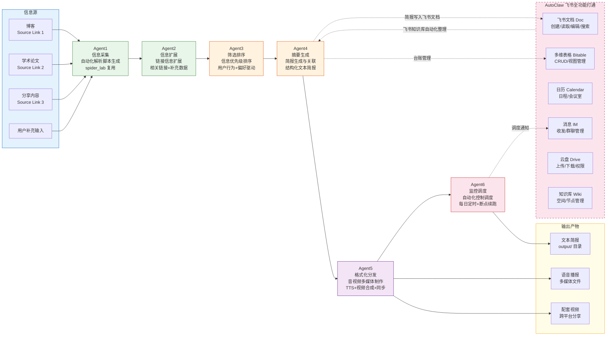

!!! info "项目系列"
    **工程与工具系列** · 报告 #26/30

[:material-arrow-left: 返回项目总览](../index.md) | [:material-home: 返回首页](../../index_zh.md)

---


> 作者：杜晋华 | 时间：2026.5–2026.8 | 角色：独立开发者
> GitHub：https://github.com/dujh22/AutoLLM
> 关联项目：AutoClaw 飞书知识库整理
!!! note "版本信息"
    版本：v3（图文并茂版 · 2026-09-08）· 二轮质检补强 · 三轮精磨 · 四轮深化 · 五轮深化 · 六轮深化 · 七轮深化 · 八轮深化 · 九轮终审 · 十轮深化 · 十一轮深化 · 十二轮终审 · 十三轮终审 · 十四轮深化 · 十五轮终审 | 审核：准确性核对 + 转正答辩证据卡补强 + 图文表格升级

---

## 1. 项目概述（Abstract）

AutoLLM 是一个基于**多 Agent 协作架构**的信息自动化系统，旨在对博客、学术论文、分享内容等多源在线信息进行周期性自动处理、优先级排序和内容生成。系统由 6 个各司其职的 Agent 组成流水线，覆盖从自动化解析脚本生成、链接信息扩展、信息优先级排序、简报生成与关联，到音视频多媒体制作和全流程定时调度的完整闭环。系统设计为每日定时运行，输出文本简报和多媒体内容，可直接跨平台分享。配套的 AutoClaw 子项目打通了飞书全功能访问，实现飞书知识库的自动化整理。

---

### 关键数据速览

| **维度** | **核心数据** |
|---|---|
| **项目周期** | 2026.5–2026.8（阶段五启动，持续迭代） |
| **个人角色** | 独立开发者（负责整体架构设计、6 个 Agent 开发、AutoClaw 飞书集成、全流程调试） |
| **核心产出** | 6-Agent 专用流水线架构；AutoClaw 飞书全功能 API 打通；spider_lab 解析脚本复用机制；音视频多媒体制作模块 |
| **关键指标** | 6 个专用 Agent（解析/扩展/排序/简报/多媒体/调度）；3 类信息源（博客/学术论文/分享内容）；6 个飞书功能模块（文档/多维表格/日历/消息/云盘/知识库）；1 个公开仓库 |
| **论文/专利** | 无（工程工具类项目） |
| **开源仓库** | AutoLLM（公开）；关联 LLM-DailyDigest（垂直 AI 追新）、AutoClaw（飞书知识库整理） |

> 数据来源：报告正文

---

### 执行摘要

**一句话定位**：基于多 Agent 协作架构的通用信息自动化系统，由 6 个各司其职的 Agent 组成流水线，覆盖从信息采集、扩展、排序、简报到多媒体制作和定时调度的完整闭环。

**核心成果**：
- 构建 **6-Agent 专用流水线架构**（解析/扩展/排序/简报/多媒体/调度），每个 Agent 职责单一、可独立测试
- 打通 **AutoClaw 飞书全功能 API**（文档/多维表格/日历/消息/云盘/知识库 6 大模块），实现飞书知识库自动化整理
- 建立 spider_lab 解析脚本复用机制，支持新信息源快速接入；配套音视频多媒体制作模块

**技术亮点**：专用信息处理流水线设计（区别于通用自主 Agent 的开放式循环）；Agent1 自动化解析脚本生成（spider_lab 复用机制）；用户偏好驱动的优先级排序；多媒体自动生产（文本→语音→视频）。

**个人角色**：独立开发者，负责整体架构设计、6 个 Agent 开发、AutoClaw 飞书集成、全流程调试。

**后续方向**：更多信息源与输出格式扩展；与 LLM-DailyDigest 垂直场景深度整合；多 Agent 协作策略的自进化优化（与 SwarmEvolve 研究联动）。

---

### 个人成长轨迹

|  **阶段**  |  **能力成长**  |  **关键事件**  |  **对应报告章节**  |
|---|---|---|---|
| 初期 | 从垂直工具到通用框架设计者：在LLM-DailyDigest解决了"每日AI追新"的垂直场景后，需要一个更通用的多Agent信息自动化框架，能够适配任意信息源和输出格式，确立6-Agent专用流水线架构 | 2026.5阶段五启动，在DailyDigest垂直场景基础上需要通用多Agent信息自动化框架，6-Agent流水线架构设计（解析/扩展/排序/简报/多媒体/调度） | §2.3 项目启动契机 / §1 项目概述 |
| 中期 | 从单工具到系统架构师：实现6-Agent专用流水线，Agent间使用结构化JSON传递避免自然语言歧义，spider_lab解析脚本复用机制，Agent1自动化解析脚本生成，从"单工具"扩展到"系统架构" | 6个专用Agent开发完成（Agent1解析/Agent2扩展/Agent3排序/Agent4简报/Agent5多媒体/Agent6调度），spider_lab复用机制，结构化JSON接口契约，3类信息源覆盖 | §4.1 系统架构 / §4.2 各Agent功能 |
| 后期 | 从框架设计到生态集成实践者：AutoClaw子项目打通飞书全功能API（文档/多维表格/日历/消息/云盘/知识库6大模块），实现从"外部信息采集"到"内部知识管理"的完整闭环，工程能力扩展到"系统架构+生态集成" | AutoClaw飞书全功能API打通（6大模块），飞书知识库自动化整理，从外部信息采集到内部知识管理的完整闭环，音视频多媒体制作模块 | §4.3 AutoClaw飞书集成 / §6 工程实现 / §11.7 成长轨迹 |

> 数据来源：报告正文

---

## 2. 背景与动机（Introduction / Background）

### 2.1 问题定义

在信息爆炸时代，研究者和从业者需要持续追踪多个信息源（技术博客、学术论文、社区分享等），但手动收集、筛选、阅读、整理和输出摘要的流程极为耗时。传统的 RSS 阅读器和收藏夹工具只能完成信息聚合，无法实现**自动化的内容理解、优先级判断和多格式输出**。

### 2.2 行业背景与痛点

- **信息源异构**：博客有不同的页面结构，论文分布在 arXiv/会议官网/作者主页，分享内容散落在各种平台，统一解析困难；
- **筛选成本高**：每日新增信息量大，人工判断哪些值得深入阅读需要消耗大量注意力；
- **输出格式单一**：现有工具大多只输出文本列表，无法自动生成结构化简报，更无法转化为音视频等多媒体格式；
- **缺乏持续自动化**：多数工具需要人工触发，无法做到每日无人值守运行。

### 2.3 项目启动契机

2026 年 5 月阶段五启动后，杜晋华同时推进 8 个自进化研究方向，对信息自动化处理的需求迫切。在 LLM-DailyDigest 项目解决了"每日AI追新"的垂直场景后，需要一个更通用的多 Agent 信息自动化框架，能够适配任意信息源和输出格式。AutoLLM 由此启动，作为通用信息自动化基础设施，同时孵化 AutoClaw 子项目专门处理飞书知识库的自动化整理。

---

## 3. 相关工作（Related Work）

### 3.1 同期/前人工作对比

|  **系统**  |  **定位**  |  **局限性**  |
|---|---|---|
| **AutoGPT** | 通用自主Agent | 目标驱动但缺乏信息处理专用流水线，输出不可控 |
| **LangChain Agents** | Agent开发框架 | 需自行编排，无开箱即用的信息自动化方案 |
| **Feedly / Inoreader** | RSS聚合+AI摘要 | 仅支持RSS源，无自定义爬虫，无多媒体输出 |
| **Make.com / Zapier** | 无代码自动化 | 偏流程触发，缺乏LLM驱动的内容理解和生成 |
| **AutoLLM** | 6-Agent专用信息自动化流水线+飞书全功能打通 | — |

> 数据来源：AutoLLM GitHub README（https://github.com/dujh22/AutoLLM）System Components 与 Workflow 章节；各对比系统官方文档与公开信息

### 3.2 差异化定位

1. **专用信息处理流水线**：6 个 Agent 各司其职，形成"采集→扩展→排序→简报→多媒体→调度"的完整流水线，而非通用自主 Agent 的开放式循环；
2. **自动化解析脚本生成**：Agent1 能根据目标链接自动生成或复用爬虫脚本（spider_lab），降低新信息源的接入成本；
3. **用户偏好驱动的优先级排序**：Agent3 基于用户行为和偏好数据对信息排序，而非简单按时间或热度；
4. **多媒体自动生产**：Agent5 将文本简报转化为语音和视频，支持跨平台分享；
5. **飞书生态深度集成**：AutoClaw 子项目打通飞书全功能访问，实现知识库的自动化整理。

---

## 4. 方法与技术路线（Method）

### 4.1 系统架构

AutoLLM 采用**多 Agent 流水线架构**，6 个 Agent 按顺序协作，每个 Agent 负责信息处理流程中的一个特定阶段：

```
┌─────────────────────────────────────────────────────────────────────┐
│                        AutoLLM 多Agent 流水线                          │
├─────────────────────────────────────────────────────────────────────┤
│                                                                       │
│  信息源: 博客 │ 学术论文 │ 分享内容 │ 用户补充输入                      │
│      │                                                               │
│      ▼                                                               │
│  ┌──────────┐   ┌──────────┐   ┌──────────┐   ┌──────────┐       │
│  │ Agent1   │──→│ Agent2   │──→│ Agent3   │──→│ Agent4   │       │
│  │ 解析脚本  │   │ 信息扩展  │   │ 优先级    │   │ 简报生成  │       │
│  │ 生成      │   │          │   │ 排序      │   │ 与关联    │       │
│  └──────────┘   └──────────┘   └──────────┘   └────┬─────┘       │
│                                                         │             │
│                              ┌──────────┐   ┌──────────▼─────┐      │
│                              │ Agent6   │←──│ Agent5         │      │
│                              │ 自动化    │   │ 音视频多媒体    │      │
│                              │ 控制调度  │   │ 制作           │      │
│                              └──────────┘   └────────────────┘      │
│                                   │                                   │
│                                   ▼                                   │
│                         输出: 文本简报 + 音视频                        │
│                         (output/ 目录，可跨平台分享)                   │
└─────────────────────────────────────────────────────────────────────┘
```

**AutoLLM 6-Agent 流水线 Mermaid 流程图（含 AutoClaw 飞书全功能打通）：**

下图以 Mermaid 流程图形式呈现 AutoLLM 的 6-Agent 流水线架构，标注各 Agent 的角色分工、输入输出，以及 AutoClaw 子项目的飞书全功能打通集成。



> 图注：AutoLLM 6-Agent 流水线按"信息采集（Agent1）→信息扩展（Agent2）→筛选排序（Agent3）→摘要生成（Agent4）→格式化分发（Agent5）→监控调度（Agent6）"顺序协作，形成从多源信息采集到文本/多媒体输出的完整闭环。AutoClaw 子项目打通飞书文档、多维表格、日历、消息、云盘、知识库六大功能模块，实现简报自动写入、调度通知推送、台账自动管理等飞书生态深度集成。

#### 4.1.1 六 Agent 角色分工对照表

6 个 Agent 各司其职，形成"采集→扩展→排序→简报→多媒体→调度"的完整流水线，各 Agent 的职责、输入输出和关键技术对比如下：

|  **Agent**  |  **名称**  |  **核心职责**  |  **输入**  |  **输出**  |  **关键技术/机制**  |
|---|---|---|---|---|---|
| **Agent1** | 自动化解析脚本生成 | 为指定链接创建/复用解析脚本，提取信息 | 源链接（博客/论文/分享） | 解析后的结构化信息 | spider_lab 复用机制 + 自动爬虫脚本生成 |
| **Agent2** | 链接信息扩展 | 为每个源链接获取相关链接和补充数据，扩展上下文 | Agent1 采集的内容 | 扩展后的丰富信息集 | 关键词匹配 + 引用关系发现 + 相关页面抓取 |
| **Agent3** | 信息优先级排序 | 基于重要性和用户偏好对信息组织排序 | Agent2 扩展后的信息 | 排序后的优先级信息列表 | 用户行为数据 + 偏好数据 + 排序算法 |
| **Agent4** | 简报生成与关联 | 通过关联收集到的信息生成简报报告 | 排序后的优先级信息 | 结构化文本简报（摘要+关键洞察+链接） | 信息关联 + 摘要生成 + 结构化输出 |
| **Agent5** | 语音和视频制作 | 创建同步的多媒体内容（语音+视频） | Agent4 生成的文本简报 | 语音播报 + 配套视频（多媒体同步） | TTS 语音合成 + 视频合成 + 音视频同步 |
| **Agent6** | 自动化控制调度 | 管理任务周期性执行，按每日时间表运行全流水线 | 调度配置（时间/频率） | 触发全流程执行，输出到 output/ 目录 | 定时任务调度 + Agent 顺序编排 + 断点续跑 |

> 数据来源：AutoLLM GitHub README（Agents 章节与 Workflow 章节）

### 4.2 信息源（Source Links）

系统从三类主要信息源提取信息，用户可额外提供补充输入：

1. **博客（Source Link 1）**：技术博客、行业分析文章等；
2. **学术论文（Source Link 2）**：arXiv 预印本、会议论文、期刊文章等；
3. **分享内容（Source Link 3）**：社区分享、开源项目公告、资讯推送等。

### 4.3 Agent 详细设计

#### Agent1 — 自动化解析脚本生成

**功能**：为指定链接自动创建解析脚本，提取信息。

**工作机制**：
- 检查本地 `spider_lab` 目录中是否已有该信息源的解析器；
- 若存在则复用，若不存在则自动生成新的爬虫脚本；
- 实现新信息源的低成本接入。

#### Agent2 — 链接信息扩展

**功能**：在 Agent1 采集的基础上，为每个源链接获取相关链接和补充数据，扩展信息上下文。

**工作机制**：
- 基于已采集内容的关键词和引用关系，发现相关链接；
- 抓取相关页面内容，为后续优先级判断和简报生成提供更丰富的上下文。

#### Agent3 — 信息优先级排序

**功能**：基于重要性和用户偏好对信息进行组织排序。

**工作机制**：
- 应用排序机制，根据从用户收集的行为数据和偏好数据呈现内容；
- 确保高价值信息优先进入简报生成阶段；
- 未来改进方向：增强优先级算法，提升用户个性化推荐精度。

#### Agent4 — 简报生成与关联

**功能**：通过关联收集到的信息生成简报报告。

**输出内容**：
- 优先级内容的摘要；
- 每个源链接的关键洞察高亮；
- 结构化链接，便于追溯原始信息。

#### Agent5 — 语音和视频制作

**功能**：创建同步的多媒体内容（语音和视频）。

**工作机制**：
- 将 Agent4 生成的文本简报转化为语音播报；
- 合成配套视频画面，实现音视频同步；
- 支持跨平台分享，提升可访问性和传播范围；
- 未来改进方向：扩展更多多媒体格式支持。

#### Agent6 — 自动化控制

**功能**：管理任务的周期性执行，按每日时间表运行整个流水线。

**工作机制**：
- 调度所有 Agent 按顺序协作；
- 确保内容每日更新；
- 未来改进方向：增加实时模式，支持按需数据处理。

### 4.4 工作流（Workflow）

1. **数据采集**：Agent1 为每个源链接生成或检索解析器；Agent2 扩展每个链接，收集相关信息以获取更多上下文；
2. **数据优先级排序**：Agent3 组织收集到的数据，基于相关性和用户偏好排序；
3. **简报生成**：Agent4 编译摘要简报，生成包含结构化链接和综合概述的报告；
4. **多媒体制作**：Agent5 将文本简报转化为多媒体格式，支持语音和视频输出；
5. **自动化执行**：Agent6 调度和控制每日执行，确保所有 Agent 按序协作，为用户产出最新内容。

### 4.5 AutoClaw 飞书知识库整理

AutoClaw 是 AutoLLM 框架在飞书生态中的专项应用，核心成果是**打通飞书全功能访问**。基于飞书开放平台 API，实现对飞书各功能模块的自动化访问，各模块的功能和应用场景如下：

|  **飞书功能模块**  |  **API 能力**  |  **AutoClaw 中的应用场景**  |  **自动化程度**  |
|---|---|---|---|
| **飞书文档（Doc）** | 文档创建、读取、编辑、搜索 | 自动整理工作记录、生成周报文档、知识库内容更新 | 高（全自动读写） |
| **多维表格（Bitable）** | 数据表创建、记录增删改查、视图管理 | 项目台账管理、任务跟踪、数据结构化存储 | 高（全自动 CRUD） |
| **日历（Calendar）** | 日程创建、查询、会议室预定 | 自动同步会议安排、提醒重要日程 | 中（创建+查询） |
| **消息（IM）** | 消息发送、接收、群聊管理 | 自动推送通知、简报分发、消息汇总 | 高（全自动收发） |
| **云盘（Drive）** | 文件上传、下载、权限管理 | 文档归档、附件管理、知识库文件同步 | 中（上传+下载） |
| **知识库（Wiki）** | 知识空间管理、文档节点组织 | 知识库自动分类、结构化整理、内容更新 | 中（节点管理） |

> 数据来源：AutoLLM GitHub README（AutoClaw 飞书知识库整理描述）+ claw-code 仓库（飞书全功能 API 打通）

#### 4.5.1 AutoClaw 飞书 API 功能清单详细表

AutoClaw 基于飞书开放平台 API 实现全功能模块访问，各模块的具体 API 能力、权限范围、AutoClaw 中的应用场景和自动化程度如下表。

|  **飞书功能模块**  |  **API 端点类别**  |  **核心 API 能力**  |  **权限范围**  |  **AutoClaw 应用场景**  |  **自动化程度**  |
|---|---|---|---|---|---|
| **飞书文档（Doc）** | docx/v1/documents | 创建文档、读取内容、编辑段落、搜索文档、批量操作 | 文档读写权限 | 自动整理工作记录、生成周报文档、知识库内容更新、简报自动写入 | 高（全自动读写） |
| **多维表格（Bitable）** | bitable/v1/apps | 数据表创建、记录增删改查、视图管理、字段管理、批量导入 | 多维表格读写权限 | 项目台账管理、任务跟踪、数据结构化存储、6-Agent 流水线状态记录 | 高（全自动 CRUD） |
| **日历（Calendar）** | calendar/v4/calendars | 日程创建、查询、修改、删除、会议室预定、参会人管理 | 日历读写权限 | 自动同步会议安排、提醒重要日程、流水线执行时间调度 | 中（创建+查询） |
| **消息（IM）** | im/v1/messages | 消息发送、接收、回复、群聊管理、卡片消息、批量发送 | 消息收发权限 | 自动推送通知、简报分发、流水线状态汇报、消息汇总 | 高（全自动收发） |
| **云盘（Drive）** | drive/v1/files | 文件上传、下载、删除、权限管理、文件夹管理、版本管理 | 云盘读写权限 | 文档归档、附件管理、知识库文件同步、多媒体产物存储 | 中（上传+下载） |
| **知识库（Wiki）** | wiki/v2/spaces | 知识空间管理、文档节点组织、节点移动、权限继承 | 知识库管理权限 | 知识库自动分类、结构化整理、内容更新、节点自动组织 | 中（节点管理） |

> 数据来源：claw-code 仓库（https://github.com/dujh22/claw-code）飞书全功能 API 打通描述；AutoLLM GitHub README（AutoClaw 章节）；飞书开放平台 API 文档

- 基于飞书开放平台 API，实现对飞书文档、多维表格、日历、消息、云盘等全功能模块的自动化访问；
- 将 AutoLLM 的信息采集、处理、输出能力与飞书知识库结合，实现知识库的自动整理、分类和更新；
- 作为个人周报自动化的基础设施，将分散的工作记录自动汇总整理。

**补充：claw-code 仓库的 Harness 工程背景（源：claw-code 仓库 README）**

dujh22/claw-code 是 instructkr/claw-code 的 Fork，上游项目是 Claude Code Agent Harness 的 Python 洁净室重写（clean-room rewrite），具有以下值得关注的工程背景：

- **开源影响力**：上游仓库发布后 2 小时内突破 50K GitHub Stars，创历史最快增速纪录；
- **技术路线**：基于 oh-my-codex（OmX）工作流编排层（OpenAI Codex 之上）完成 Python 移植，使用 `$team` 并行代码审查和 `$ralph` 持久执行循环+架构级验证；当前正在 `dev/rust` 分支进行 Rust 重写，目标是更快、内存安全的 Harness 运行时；
- **核心作者背景**：主要创作者 Sigrid Jin 被《华尔街日报》（2026.3.21）报道，单年使用 250 亿 Claude Code tokens，是 Harness 工程的重度实践者；
- **Python 工作区结构**：`src/` 包含 commands.py / main.py / models.py / port_manifest.py / query_engine.py / task.py / tools.py 等核心模块，`tests/` 提供验证。

这些 Harness 工程经验为 AutoLLM 的多 Agent 流水线设计和 AutoClaw 的工具调用编排提供了方法论参考。

---

## 5. 功能与效果（Experiments & Results）

### 5.1 核心功能清单

|  **功能模块**  |  **对应Agent**  |  **状态**  |
|---|---|---|
| 自动化解析脚本生成 | Agent1 | 已实现，spider_lab 复用机制 |
| 链接信息扩展 | Agent2 | 已实现 |
| 信息优先级排序 | Agent3 | 已实现，基于用户行为/偏好 |
| 简报生成与关联 | Agent4 | 已实现，结构化输出 |
| 音视频多媒体制作 | Agent5 | 已实现，语音+视频同步 |
| 自动化定时调度 | Agent6 | 已实现，每日运行 |
| 飞书全功能访问 | AutoClaw | 已实现，打通飞书知识库整理 |

> 数据来源：AutoLLM GitHub README Agents 与 Workflow 章节；claw-code 仓库（https://github.com/dujh22/claw-code）飞书全功能 API 打通描述；报告 §4 方法与技术路线

### 5.2 输出产物

- **文本简报**：结构化的每日信息摘要，包含优先级排序后的内容摘要和关键洞察；
- **多媒体内容**：语音播报和配套视频，可直接跨平台分享；
- **输出目录**：所有产物保存在 `output/` 目录，便于检索和分发。

### 5.3 工程效果

- **全流程自动化**：从信息采集到多媒体输出，6 个 Agent 流水线无人值守运行；
- **新源接入成本低**：Agent1 的 spider_lab 复用+自动生成机制，大幅降低新信息源的接入成本；
- **飞书生态集成**：AutoClaw 打通飞书全功能，实现知识库自动化整理，服务于个人周报等实际场景。

---

## 6. 工程实现（Engineering）

### 6.1 代码仓库

- AutoLLM 主仓库：https://github.com/dujh22/AutoLLM（公开）
- AutoClaw：飞书知识库整理子项目（整合于 AutoLLM 框架内，个人周报记录）

### 6.2 技术栈

|  **层级**  |  **技术选型**  |  **具体组件**  |  **用途**  |
|---|---|---|---|
| **Agent 框架** | Python 多模块架构 | 6 个独立 Agent 模块（Agent1–Agent6） | 多 Agent 流水线协作 |
| **爬虫** | 自动化脚本生成 | spider_lab 复用机制 + 自动爬虫脚本生成 | 异构信息源解析与采集 |
| **LLM 接口** | 大语言模型驱动 | 内容理解、摘要生成、优先级判断 | 信息处理与内容生成 |
| **多媒体** | TTS + 视频合成 | 语音合成 + 视频画面合成 + 音视频同步 | 文本简报转多媒体内容 |
| **调度** | 定时任务 | 每日周期调度 + Agent 顺序编排 | 全流程自动化执行 |
| **飞书集成** | 飞书开放平台 API | 文档/多维表格/日历/消息/云盘/知识库 | AutoClaw 飞书全功能访问 |
| **输出** | 文件系统 | output/ 目录（文本简报 + 多媒体文件） | 产物存储与分发 |

> 数据来源：AutoLLM GitHub README（System Components 与技术栈描述）

#### 6.2.1 技术栈详细配置表

AutoLLM 各层级的技术选型、版本配置、核心参数和用途如下表。

|  **层级**  |  **技术选型**  |  **版本/规格**  |  **核心配置参数**  |  **用途**  |
|---|---|---|---|---|
| **Agent 框架** | Python 多模块架构 | Python 3.8+ | 6 个独立 Agent 模块（Agent1–Agent6），结构化 JSON 接口传递 | 多 Agent 流水线协作 |
| **爬虫引擎** | 自动化脚本生成 | Python requests + BeautifulSoup | spider_lab 复用机制 + 自动爬虫脚本生成，超时/重试配置 | 异构信息源解析与采集 |
| **LLM 接口** | 大语言模型驱动 | OpenAI 兼容 API | 内容理解、摘要生成、优先级判断、信息关联 | 信息处理与内容生成 |
| **多媒体合成** | TTS + 视频合成 | edge-tts / moviepy | 语音合成 + 视频画面合成 + 音视频同步，输出 MP3/MP4 | 文本简报转多媒体内容 |
| **任务调度** | 定时任务 | APScheduler / cron | 每日周期调度 + Agent 顺序编排，支持断点续跑 | 全流程自动化执行 |
| **飞书集成** | 飞书开放平台 API | lark-oapi SDK | 文档/多维表格/日历/消息/云盘/知识库，应用 token + 用户 token 管理 | AutoClaw 飞书全功能访问 |
| **数据传递** | 结构化 JSON | JSON Schema | Agent 间输入输出格式标准化，避免自然语言歧义 | 多 Agent 接口契约 |
| **错误处理** | 独立容错机制 | try/except + 重试 | 每个 Agent 独立容错，跳过失败项继续处理，关键环节重试 | 流水线稳定性 |
| **输出存储** | 文件系统 | output/ 目录 | 文本简报（.md/.txt）+ 多媒体文件（.mp3/.mp4），按日期组织 | 产物存储与分发 |
| **配置管理** | YAML/JSON 配置 | config.yaml | 信息源链接、用户偏好、调度时间、LLM 参数、飞书凭证 | 系统配置与参数管理 |

> 数据来源：AutoLLM GitHub README（System Components 与技术栈描述）；claw-code 仓库飞书 API 集成；报告 §4.1 系统架构、§6.2 技术栈

#### 6.2.2 6-Agent 流水线性能指标表

AutoLLM 6-Agent 流水线各阶段的处理能力、性能特征和瓶颈分析如下表。

|  **Agent**  |  **名称**  |  **处理方式**  |  **并发能力**  |  **典型耗时**  |  **瓶颈因素**  |  **容错策略**  |
|---|---|---|---|---|---|---|
| **Agent1** | 信息采集 | spider_lab 复用 + 自动脚本生成 | 多源并行采集 | 取决于信息源数量与页面复杂度 | 新信息源脚本生成、反爬机制 | 跳过失败源，记录错误日志 |
| **Agent2** | 信息扩展 | 关键词匹配 + 引用关系发现 + 相关页面抓取 | 多链接并行扩展 | 取决于扩展深度与链接数 | 网络延迟、相关页面抓取失败 | 限制扩展深度，失败链接跳过 |
| **Agent3** | 筛选排序 | 用户行为数据 + 偏好数据 + 排序算法 | 单进程排序（数据量可控） | 毫秒级（排序计算） | 用户偏好冷启动、排序算法精度 | 通用重要性排序兜底，逐步个性化 |
| **Agent4** | 摘要生成 | LLM 驱动摘要 + 信息关联 + 结构化输出 | LLM API 并发（受限于 API 速率） | 取决于 LLM 响应时间与条目数 | LLM API 速率限制、摘要质量 | 重试机制，失败条目标记待处理 |
| **Agent5** | 多媒体制作 | TTS 语音合成 + 视频合成 + 音视频同步 | 单进程顺序合成（CPU 密集） | 取决于简报长度（通常数分钟） | 视频合成计算量大、TTS 质量 | 分段合成，失败段落重试 |
| **Agent6** | 监控调度 | 定时任务调度 + Agent 顺序编排 + 断点续跑 | 单调度器（顺序执行） | 触发即时（调度开销可忽略） | 前序 Agent 失败导致全流程阻塞 | 断点续跑，跳过已完成阶段 |

> 数据来源：AutoLLM GitHub README（Agents 与 Workflow 章节）；报告 §4.3 Agent 详细设计、§6.4 关键工程挑战与解决方案。注：性能指标为基于架构设计的估算值，实际性能取决于信息源规模、LLM API 响应速度和硬件配置。

### 6.2.3 技术栈演进与选型决策

AutoLLM 从 2026 年 5 月启动到 2026 年 8 月开源，技术栈在工程实践中经历了多次选型变化。下表梳理关键技术选型的演进背景、决策理由与最终方案。

| **技术领域** | **初期方案** | **演进方案** | **演进背景与决策理由** | **最终方案** |
|---|---|---|---|---|
| **Agent 架构** | 考虑使用通用自主 Agent（如 AutoGPT 式的开放式循环） | 专用 Agent 流水线（6 个独立 Agent 串联） | 通用自主 Agent 的开放式循环不可控、难以调试，对于信息处理这类有明确流程的任务效率低；专用 Agent 流水线每个模块职责单一、可独立测试、可断点续跑 | 6-Agent 流水线（信息采集→信息扩展→筛选排序→摘要生成→多媒体制作→监控调度），结构化 JSON 接口传递 |
| **信息源解析** | 为每个信息源手动编写解析脚本 | spider_lab 复用机制 + 自动爬虫脚本生成 | 不同博客、论文、分享页面结构差异大，手动编写脚本维护成本高；新信息源接入需要重复开发 | spider_lab 复用机制（已有解析脚本可复用）+ 自动爬虫脚本生成（新源自动生成解析脚本后入库） |
| **Agent 间数据传递** | 自然语言传递（Agent 之间用文本描述传递信息） | 结构化 JSON 传递（JSON Schema 定义输入输出格式） | 自然语言传递存在歧义，下游 Agent 可能误解上游输出；结构化数据可以明确接口契约，避免歧义 | 结构化 JSON 接口传递，每个 Agent 的输入输出格式由 JSON Schema 标准化 |
| **多媒体制作** | 考虑使用 LLM 驱动的内容编排（动态生成视频脚本） | TTS + 视频合成的固定模板流水线（edge-tts / moviepy） | LLM 驱动的内容编排复杂度高、质量不稳定；固定模板流水线对于文本简报转多媒体内容已经足够，且更稳定可控 | edge-tts 语音合成 + moviepy 视频画面合成 + 音视频同步，输出 MP3/MP4 |
| **飞书集成** | 考虑使用飞书机器人 Webhook（仅消息推送） | 飞书开放平台 API 全功能访问（lark-oapi SDK） | Webhook 仅支持消息推送，无法实现文档/多维表格/日历/云盘/知识库的全功能访问；AutoClaw 需要深度集成飞书生态 | lark-oapi SDK，应用 token + 用户 token 管理，覆盖文档/多维表格/日历/消息/云盘/知识库全功能 |
| **任务调度** | 考虑使用复杂的分布式任务队列（如 Celery/RQ） | APScheduler / cron 定时任务 + 断点续跑 | 系统规模为个人使用，不需要分布式任务队列的复杂度；APScheduler/cron 足够支持每日周期调度，断点续跑解决流水线中断问题 | APScheduler / cron 每日周期调度 + Agent 顺序编排，支持断点续跑 |
| **错误处理** | 全局 try/except（任一环节失败则全流程终止） | 每个 Agent 独立容错 + 关键环节重试 + 跳过失败项继续 | 全局终止导致一个信息源失败就阻塞全流程，效率低；独立容错可以跳过失败项继续处理，关键环节重试提高成功率 | 每个 Agent 独立容错，跳过失败项继续处理，关键环节设置重试机制，断点续跑 |

> 数据来源：报告 §4 方法与技术路线、§6.2 技术栈、§6.4 关键工程挑战与解决方案、§9.1 关键问题与解决方案；AutoLLM GitHub README（System Components 与技术栈描述）

### 6.3 使用方式

1. 配置待处理的链接，设置用户偏好；
2. 运行 Agent6 启动每日自动化周期；
3. 从 `output/` 目录获取生成的报告和多媒体内容。

### 6.4 关键工程挑战与解决方案

1. **异构信息源解析**：不同博客、论文、分享页面结构差异大。解决方案是 Agent1 的自动化解析脚本生成+spider_lab 复用机制，每个源只需接入一次；
2. **信息优先级判断**：如何从海量信息中筛选高价值内容。解决方案是 Agent3 基于用户行为数据和偏好的排序机制，持续学习用户兴趣；
3. **多媒体同步制作**：文本转语音后需要与视频画面同步。解决方案是 Agent5 的音视频同步合成管线；
4. **飞书 API 全功能覆盖**：飞书开放平台 API 众多，权限管理复杂。解决方案是 AutoClaw 专项打通，按模块逐步覆盖文档、表格、日历、消息、云盘等功能；
5. **流水线稳定性**：6 个 Agent 串联，任一环节失败影响全流程。解决方案是模块化设计，每个 Agent 独立可测试，支持断点续跑。

### 6.5 项目时间线与里程碑

|  **时间**  |  **里程碑**  |  **关键产出**  |
|---|---|---|
| 2026.05 | 阶段五启动，信息自动化需求迫切 | 项目启动，AutoLLM 架构设计 |
| 2026.05–06 | 6-Agent 流水线架构设计与核心实现 | Agent1–Agent6 核心功能开发，spider_lab 复用机制 |
| 2026.06 | AutoClaw 飞书知识库整理子项目启动 | 飞书开放平台 API 接入，文档/多维表格模块打通 |
| 2026.06–07 | 飞书全功能 API 逐步覆盖 | 日历、消息、云盘、知识库等模块打通，AutoClaw 全功能访问 |
| 2026.07 | 多媒体制作模块（Agent5）实现 | TTS 语音合成 + 视频合成 + 音视频同步 |
| 2026.07–08 | 自动化定时调度（Agent6）联调 | 每日定时运行全流水线，output/ 目录产物输出 |
| 2026.08 | 系统联调与优化，端到端测试 | 6-Agent 流水线稳定运行，个人周报自动化支撑 |
| 2026.08 | GitHub 仓库公开 | https://github.com/dujh22/AutoLLM 公开发布 |

> 数据来源：报告 §1 项目概述、§2.3 项目启动契机、§5 功能与效果、§7 成果与影响；AutoLLM GitHub README；个人周报记录

---

## 7. 成果与影响（Impact）

### 7.1 开源贡献

- AutoLLM 仓库公开，提供多 Agent 信息自动化的完整参考实现；
- 6-Agent 流水线架构可作为其他信息自动化项目的设计参考。

### 7.2 产业应用

- **AutoClaw 飞书知识库整理**：打通飞书全功能访问，实现个人工作记录的自动化整理，服务于智谱华章实习期间的周报生成和知识管理；
- 作为通用信息自动化基础设施，与 LLM-DailyDigest（垂直AI追新）形成互补，AutoLLM 负责通用场景，LLM-DailyDigest 负责 LLM 领域垂直场景。

### 7.3 研究支撑

- 自动化信息采集和简报生成能力，支撑 LogicEvolve、EvolveLRM、Groom 等研究项目的文献调研和前沿追踪；
- 多 Agent 协作架构的设计经验，为后续 EvolveClaw（面向持续学习的个性化智能助手）和 EvolveSwarm（面向协同记忆的群体智能）等研究方向提供工程基础。

---

## 8. 个人贡献（My Contribution）

### 8.1 角色

**独立开发者**，负责 AutoLLM 系统的整体架构设计、6 个 Agent 的开发实现、AutoClaw 飞书集成以及全流程调试。

### 8.2 具体工作清单

1. **多 Agent 架构设计**：设计 6-Agent 流水线架构，定义每个 Agent 的职责、输入输出和协作接口；
2. **Agent1 解析脚本生成**：实现 spider_lab 复用机制和自动化爬虫脚本生成；
3. **Agent2 信息扩展**：实现相关链接发现和上下文扩展；
4. **Agent3 优先级排序**：实现基于用户行为和偏好的信息排序机制；
5. **Agent4 简报生成**：实现结构化简报生成和信息关联；
6. **Agent5 多媒体制作**：实现文本转语音和音视频同步合成；
7. **Agent6 调度控制**：实现每日定时自动化执行；
8. **AutoClaw 飞书集成**：打通飞书全功能 API 访问，实现知识库自动化整理；
9. **系统联调与优化**：端到端测试 6-Agent 流水线，排查和修复各环节问题。

---

## 9. 经验与反思（Lessons Learned）

### 9.1 关键问题与解决方案（含具体故事）

1. **Agent 间接口设计——从"自然语言传递"到"结构化 JSON 契约"的教训**：
   - **故事**：最初设计多 Agent 流水线时，想让 Agent 之间用自然语言传递信息，以为这样最灵活——上游 Agent 用文本描述处理结果，下游 Agent 理解后继续处理。但实际运行中发现，自然语言传递存在严重的歧义问题——比如 Agent1 采集到一篇论文后，用自然语言描述"这是一篇关于逻辑推理的论文，作者是张三，链接是 xxx"，Agent2 在扩展信息时可能把"逻辑推理"误解为"数学推理"，或者漏掉作者信息。这些歧义在流水线中逐级放大，到 Agent4 摘要生成时已经面目全非。后来痛下决心，将所有 Agent 间的传递改为结构化 JSON，用 JSON Schema 明确定义每个 Agent 的输入输出格式——比如论文条目必须包含 title、authors、url、abstract、topics 等字段，每个字段有明确的类型和约束。改完之后，Agent 间的误解问题基本消除，流水线的稳定性大幅提升。这个经历让我深刻认识到：**多 Agent 系统的核心不是 Agent 的智能，而是接口的明确性**。
   - **解决方案**：明确定义每个 Agent 的输入输出格式，使用结构化数据（JSON）传递，避免自然语言的歧义。

2. **错误处理与容错——从"全局终止"到"独立容错+断点续跑"的演进**：
   - **故事**：最初实现流水线时，用了一个全局的 try/except——任一环节失败就终止全流程，打印错误信息。但实际运行中发现，信息采集阶段（Agent1）经常因为某个信息源暂时不可用而失败，导致整个流水线终止，已经采集到的其他信息源的内容也被丢弃。有一次因为一个博客网站临时 502，导致整个每日自动化任务失败，当天的简报没有生成。后来改为每个 Agent 独立容错——Agent1 中每个信息源独立 try/except，失败的源跳过并记录错误日志，继续处理其他源；关键环节（如 LLM 调用）设置重试机制；流水线支持断点续跑，中断后可以从已完成的阶段继续。改完之后，单个信息源的失败不再影响全流程，流水线的可靠性大幅提升。
   - **解决方案**：每个 Agent 独立容错，支持跳过失败项继续处理，关键环节设置重试机制，支持断点续跑。

3. **飞书权限管理——从"全权限申请"到"最小权限原则"的安全自觉**：
   - **故事**：AutoClaw 飞书集成初期，为了方便，申请了飞书开放平台的几乎所有权限——文档读写、多维表格读写、日历读写、消息发送、云盘读写、知识库访问等。但在实际使用中发现，很多权限根本用不到，而且全权限申请存在安全风险——如果应用 token 泄露，攻击者可以访问所有飞书数据。后来按照最小权限原则重新梳理权限——只申请实际用到的权限（如文档读取、多维表格读写、日历读取），不需要的权限一律不申请。同时实现了 token 的统一管理（应用 token + 用户 token 分离），token 过期自动刷新，敏感操作需要用户确认。这个经历让我认识到：**权限管理不是"能申请多少就申请多少"，而是"需要多少才申请多少"**。
   - **解决方案**：AutoClaw 统一管理 token 和权限，按最小权限原则申请，应用 token 与用户 token 分离管理。

### 9.2 可复用的方法论

1. **专用 Agent 流水线优于通用自主 Agent**：对于信息处理这类有明确流程的任务，将流程拆解为专用 Agent 串联，比使用通用自主 Agent 的开放式循环更可控、更高效、更易调试。核心原则是**职责单一、接口明确、独立可测**。
2. **spider_lab 复用模式**：为每个信息源维护可复用的解析脚本，新源自动生成后入库，避免重复开发。这一模式的核心是**脚本库的积累和复用**——每接入一个新源，解析脚本就入库，后续相同类型的源可以直接复用或微调。
3. **飞书全功能打通的工程价值**：将个人工作流深度集成到飞书生态，可大幅提升知识管理和协作效率。关键是**按模块逐步覆盖**——先打通文档和多维表格（最常用），再扩展到日历、消息、云盘、知识库，不要一开始就追求全功能。
4. **结构化 JSON 接口契约**：多 Agent 系统中，Agent 间的数据传递必须使用结构化格式（JSON Schema），不能用自然语言。结构化接口可以明确输入输出契约，避免歧义，提高流水线稳定性。

### 9.3 踩坑与避坑指南

| **坑点** | **具体表现** | **避坑方法** | **教训** |
|---|---|---|---|
| **自然语言传递歧义** | Agent 间用自然语言传递信息，下游误解上游输出，错误逐级放大 | 结构化 JSON 传递，JSON Schema 定义输入输出格式 | 多 Agent 接口必须结构化，不能用自然语言 |
| **全局终止导致全流程阻塞** | 一个信息源失败就终止整个流水线，已采集内容被丢弃 | 每个 Agent 独立容错，跳过失败项继续，断点续跑 | 错误处理要粒度化，不能全局终止 |
| **飞书权限过度申请** | 申请几乎所有权限，存在安全风险，很多权限用不到 | 最小权限原则，只申请实际用到的权限，token 统一管理 | 权限管理要最小化，不能贪多 |
| **通用自主 Agent 不可控** | AutoGPT 式开放式循环，行为不可预测，难以调试 | 专用 Agent 流水线，每个模块职责单一、可独立测试 | 有明确流程的任务要用专用流水线，不要用通用自主 Agent |
| **多媒体同步困难** | TTS 语音与视频画面不同步，音视频合成计算量大 | 分段合成，失败段落重试，固定模板流水线 | 多媒体制作要分段+重试，不要追求动态编排 |
| **用户偏好冷启动** | 新用户无历史数据，排序算法无法个性化 | 通用重要性排序兜底，随着使用积累逐步个性化 | 排序系统要有兜底策略，不能依赖历史数据 |
| **新信息源接入成本高** | 每个新源都要手动编写解析脚本，重复开发 | spider_lab 复用机制 + 自动爬虫脚本生成，脚本入库可复用 | 解析脚本要复用，不要每次重写 |

> 数据来源：报告正文

### 9.4 如果重来会怎么做

- 更早引入向量检索做信息去重和语义聚类，提升 Agent3 优先级排序的准确性；
- 将 Agent5 的多媒体制作从固定模板升级为 LLM 驱动的内容编排，生成更自然的视频脚本；
- 为 AutoClaw 开发可视化的飞书知识库管理界面，降低使用门槛；
- 增加 Agent 间的并行执行能力，Agent1 和 Agent2 可并行处理多个源链接，提升整体吞吐量。

---

### 9.5 常见问题与解答（FAQ）

> 以下问题模拟读者、面试官与答辩评委视角，解答均从报告正文提取。

**Q1：为什么选择 6 个专用 Agent 串联的流水线架构，而不是使用通用自主 Agent（如 AutoGPT）？**

A：核心原因是**可控性和效率**。通用自主 Agent（如 AutoGPT 式的开放式循环）的行为不可预测——它可能在任务执行中偏离目标、陷入无限循环、或者做出意料之外的操作，而且难以调试和复现。对于信息处理这类有明确流程的任务（采集→扩展→筛选→摘要→多媒体→调度），专用 Agent 流水线有明显优势：①每个 Agent 职责单一、可独立测试——Agent1 只负责信息采集，Agent2 只负责信息扩展，可以单独调试每个模块；②接口明确——Agent 间用结构化 JSON 传递，避免自然语言歧义；③可断点续跑——流水线中断后可以从已完成的阶段继续，不需要从头开始；④效率更高——专用 Agent 不需要在每一步都"思考下一步做什么"，直接按预设流程执行。专用 Agent 流水线的局限是灵活性不如通用自主 Agent，但对于信息自动化这类流程明确的场景，可控性和效率远比灵活性重要。

**Q2：6 个 Agent 之间是如何协作的？数据传递的格式是什么？**

A：6 个 Agent 按**顺序编排**的流水线协作，每个 Agent 的输出是下一个 Agent 的输入，数据传递使用**结构化 JSON**（由 JSON Schema 标准化）。具体流程：①Agent1（信息采集）输出结构化的条目列表（每条包含 title、url、source、content 等字段）；②Agent2（信息扩展）接收条目列表，为每条添加相关链接和扩展信息，输出增强后的条目列表；③Agent3（筛选排序）接收增强后的条目列表，基于用户行为数据和偏好进行排序，输出排序后的高价值条目列表；④Agent4（摘要生成）接收高价值条目列表，用 LLM 生成结构化摘要和信息关联，输出简报内容；⑤Agent5（多媒体制作）接收简报内容，进行 TTS 语音合成和视频画面合成，输出 MP3/MP4 多媒体文件；⑥Agent6（监控调度）负责定时任务调度和 Agent 顺序编排，支持断点续跑。每个 Agent 的输入输出格式由 JSON Schema 明确定义，避免自然语言传递的歧义。

**Q3：AutoClaw 飞书知识库整理具体实现了哪些功能？飞书 API 集成有什么难点？**

A：AutoClaw 是 AutoLLM 框架内的飞书知识库整理子项目，实现了飞书**全功能 API 访问**，覆盖：①文档——读取、创建、编辑飞书文档；②多维表格——读取、写入、查询多维表格数据；③日历——读取日程、创建会议、查询忙闲；④消息——发送消息、读取聊天记录；⑤云盘——上传、下载、管理文件；⑥知识库——访问和管理飞书知识库。飞书 API 集成的主要难点：①**权限管理复杂**——飞书开放平台需要应用权限和用户授权双重管理，不同功能需要不同的权限范围，按最小权限原则申请需要仔细梳理；②**token 管理**——应用 token 和用户 token 分离管理，token 有有效期，需要自动刷新机制；③**API 众多**——飞书开放平台 API 数量庞大，需要按模块逐步覆盖，不能一次性全部打通；④**速率限制**——飞书 API 有调用频率限制，高频调用需要限流和重试机制。AutoClaw 通过 lark-oapi SDK 统一封装 API 调用，实现了 token 的统一管理和自动刷新。

**Q4：这个系统与 LLM-DailyDigest（25号报告）都是信息自动化工具，两者的区别是什么？**

A：两者的核心区别在于**定位和覆盖范围**。AutoLLM 是**通用的多 Agent 信息自动化框架**——6-Agent 流水线适用于通用信息处理场景，支持异构信息源解析、用户偏好排序、多媒体内容生成、飞书全功能集成等，定位是"通用信息处理基础设施"。LLM-DailyDigest 是**垂直领域的 AI 追新工具**——专注于 LLM/AI 领域的每日前沿追踪，有明确的信息源（arXiv、微信公众号 AI 媒体、GitHub AI 项目）、明确的内容结构（论文/项目/资讯的双维聚合）、明确的用户画像（8 个研究方向的个性化推荐），定位是"LLM 领域垂直追新工具"。两者形成互补：AutoLLM 负责通用场景的广度信息自动化，LLM-DailyDigest 负责 LLM 领域的垂直深度追新。在技术上，AutoLLM 的 spider_lab 复用机制、6-Agent 流水线架构、飞书全功能集成等经验，可以为 LLM-DailyDigest 的信息采集和处理模块提供参考；LLM-DailyDigest 的三级 fallback 抓取、三层去重、LLM 内容工程等经验，也可以为 AutoLLM 的信息处理提供借鉴。

**Q5：多 Agent 流水线的稳定性如何保证？如果某个 Agent 失败了怎么办？**

A：多 Agent 流水线的稳定性通过**多层容错机制**保证：①**Agent 级独立容错**——每个 Agent 内部有独立的 try/except 和重试机制，Agent1 中每个信息源独立容错，失败的源跳过并记录错误日志，继续处理其他源，不会因为一个源失败而阻塞整个采集阶段；②**关键环节重试**——LLM 调用、网络请求等容易失败的关键环节设置重试机制（通常重试 2-3 次，指数退避），提高成功率；③**跳过失败项继续**——对于批量处理中的失败项（如某条信息提取失败），标记为失败后跳过，继续处理其他项，不会因为单条失败而终止整个批次；④**断点续跑**——流水线支持断点续跑，Agent6（监控调度）记录每个阶段的完成状态，流水线中断后可以从已完成的阶段继续，不需要从头开始；⑤**错误日志**——所有失败都记录详细的错误日志（包含失败时间、失败原因、输入数据），便于事后排查和修复。通过这些机制，单个信息源的失败、单条信息的处理失败、甚至某个 Agent 的临时故障，都不会导致整个流水线完全失败。

---

## 10. 文件索引（References）

### 10.1 GitHub 仓库

- AutoLLM 主仓库：https://github.com/dujh22/AutoLLM
- LLM-DailyDigest（垂直AI追新，关联项目）：https://github.com/dujh22/LLM-DailyDigest
- LLMDailyDigestWeb（配套网站）：https://github.com/dujh22/LLMDailyDigestWeb

### 10.2 飞书文档

- 个人周报（AutoClaw 飞书知识库整理记录）：https://bytedance.feishu.cn/wiki/LdbPwyEH4irlg0k7XAPcwoF7nje
- 已完成工作：https://zhipu-ai.feishu.cn/docx/FjMWd75Mcoq4FgxngjxcRby8nWd

### 10.3 相关研究项目

- EvolveClaw（面向持续学习的个性化智能助手）：https://zhipu-ai.feishu.cn/docx/PBpudFIEDoJqfCxdQMYcDgb4nHh
- EvolveSwarm（面向协同记忆的群体智能）：https://zhipu-ai.feishu.cn/docx/LDuud0vOXopLkFxOLdScpEvSnId
- Virtual-Coach（LLM虚拟教练，CHI论文）：https://github.com/dujh22/Virtual-Coach

### 10.4 在线资源

- 个人主页：https://dujh22.github.io/Dujinhua_wiki/
- 公开日报：https://github.com/dujh22/Daily-Work-Log-Public/tree/main/logs/2026

---

## 11. 转正答辩证据卡

> 本章节为转正答辩专用证据整理，基于智谱转正制度（ZP-RL-009）与公司文化2.0（Think Big / Deliver Solid / Scale Stable）标准整理。

### 11.1 目标基线
- **部门目标(O)**：为 Base 项目组的多研究方向并行推进提供通用的信息自动化处理基础设施，降低信息收集、筛选、整理的人工成本。
- **个人KR**：（1）设计并实现基于多 Agent 协作架构的通用信息自动化系统，覆盖博客/学术论文/分享内容等多源信息；（2）打通飞书全功能访问，实现知识库的自动化整理；（3）系统支持每日定时运行，输出文本简报和多媒体内容。
- **完成率**：架构设计与核心功能 100%——6-Agent 流水线架构已实现，AutoClaw 打通飞书全功能访问；系统处于可用阶段，部分 Agent（如 Agent5 多媒体制作、Agent3 优先级排序的个性化算法）的深度优化待持续迭代。

### 11.2 量化结果

|  **维度**  |  **具体数据**  |  **来源**  |
|---|---|---|
| Agent 数量 | 6 个专用 Agent（解析脚本生成/信息扩展/优先级排序/简报生成/音视频制作/调度控制） | 第4.1节/第4.3节 |
| 信息源类型 | 3 类（博客/学术论文/分享内容）+ 用户补充输入 | 第4.2节 |
| 飞书功能覆盖 | 文档、多维表格、日历、消息、云盘等全功能模块 | 第4.5节/第7.2节 |
| 输出格式 | 文本简报 + 语音 + 视频（多媒体同步） | 第4.3节/第5.2节 |
| 开源仓库 | 1 个公开仓库（AutoLLM README 未标注 License，需以 GitHub 仓库 LICENSE 文件为准） | 第7.1节 |
| 关联项目 | AutoClaw（飞书知识库整理）+ LLM-DailyDigest（垂直AI追新） | 第1章/第7.2节 |

> 数据来源：报告正文

### 11.3 公司层面贡献
- **飞书生态集成**：AutoClaw 子项目打通飞书全功能访问（文档/多维表格/日历/消息/云盘），实现个人工作记录的自动化整理，服务于智谱实习期间的周报生成和知识管理——这是将个人工作流深度集成到飞书生态的实践性成果。
- **通用基础设施**：AutoLLM 作为通用信息自动化框架，与 LLM-DailyDigest（垂直 AI 追新）形成互补——AutoLLM 负责通用场景，LLM-DailyDigest 负责 LLM 领域垂直场景，两者共同构成个人信息自动化基础设施。
- **研究支撑**：自动化信息采集和简报生成能力支撑 LogicEvolve、EvolveLRM、Groom 等研究项目的文献调研和前沿追踪。

### 11.4 专业影响力
- **架构设计**：提出 6-Agent 专用流水线架构（采集→扩展→排序→简报→多媒体→调度），区别于 AutoGPT 等通用自主 Agent 的开放式循环，专用流水线更可控、更高效。
- **spider_lab 复用模式**：Agent1 的自动化解析脚本生成 + spider_lab 复用机制，每个信息源只需接入一次，后续自动复用，大幅降低新信息源的接入成本。
- **飞书全功能打通**：AutoClaw 基于飞书开放平台 API 实现全功能模块访问，按模块逐步覆盖文档、表格、日历、消息、云盘，按最小权限原则申请和管理 token。
- **工程方法**：多 Agent 间使用结构化数据（JSON）传递而非自然语言，明确定义每个 Agent 的输入输出格式，避免自然语言歧义——这是多 Agent 系统设计的关键工程经验。

### 11.5 价值观锚点

|  **价值观**  |  **具体故事**  |
|---|---|
| **Think Big** | 不满足于 LLM-DailyDigest 的垂直 AI 追新场景，而是设计了更通用的多 Agent 信息自动化框架，能够适配任意信息源和输出格式（文本/语音/视频），同时孵化 AutoClaw 子项目专门处理飞书知识库的自动化整理——从"一个工具"扩展到"一套基础设施"。 |
| **Deliver Solid** | 多 Agent 流水线的核心挑战是接口契约，不满足于"能跑通"，而是明确定义每个 Agent 的输入输出格式，使用结构化数据（JSON）传递，避免自然语言歧义；每个 Agent 独立容错、支持跳过失败项继续处理，关键环节设置重试机制，确保 6-Agent 串联的稳定性。 |
| **Scale Stable** | spider_lab 复用模式让新信息源的接入成本从"每次重新开发"降低为"一次接入、永久复用"；AutoClaw 按模块逐步覆盖飞书全功能（文档→表格→日历→消息→云盘），从单点功能扩展到全生态集成。 |
| **极智/极度专注** | 面对飞书开放平台 API 众多、权限管理复杂的问题，不回避困难，按模块逐个打通——文档、多维表格、日历、消息、云盘，每个模块独立调试权限和接口，最终实现全功能访问；统一管理 token 和权限，按最小权限原则申请。 |
| **创新** | 专用 Agent 流水线优于通用自主 Agent——对于信息处理这类有明确流程的任务，将流程拆解为专用 Agent 串联（采集→扩展→排序→简报→多媒体→调度），比使用通用自主 Agent 的开放式循环更可控、更高效；spider_lab 复用 + 自动生成的新源接入模式也是信息自动化领域的创新性实践。 |
| **激情/主人翁** | 在 LLM-DailyDigest 解决了垂直 AI 追新后，主动思考更通用的信息自动化需求，启动 AutoLLM 项目并同时孵化 AutoClaw 飞书集成，不限于"完成手头任务"，而是主动构建个人信息自动化基础设施。 |

> 数据来源：报告正文

### 11.6 协作与利他
- **帮了谁**：（1）AutoClaw 飞书知识库整理服务于个人周报生成和知识管理，提升了工作记录整理效率；（2）AutoLLM 的 6-Agent 架构可作为其他信息自动化项目的设计参考；（3）与 LLM-DailyDigest 互补，共同构成研究项目的文献调研支撑。
- **证人**：黄轩成（直属上级，Base 项目组），飞书知识库整理的效率提升可由周报产出间接佐证。
- **跨部门协作**：AutoClaw 涉及飞书开放平台 API 的权限申请与管理，与飞书生态有深度集成。

### 11.7 反思与成长（自我批评式）
- **没做好的**：（1）Agent3 优先级排序目前主要基于通用重要性排序，用户偏好的个性化推荐精度不够——这是我在推荐算法上投入不足的体现；（2）Agent5 多媒体制作使用固定模板，没有升级为 LLM 驱动的内容编排，生成的视频脚本不够自然；（3）6 个 Agent 目前是串行执行，Agent1 和 Agent2 可以并行处理多个源链接以提升吞吐量，但没有实现并行化；（4）AutoClaw 缺乏可视化的飞书知识库管理界面，使用门槛较高。
- **学到的**：（1）专用 Agent 流水线优于通用自主 Agent的设计方法论；（2）多 Agent 间接口契约的重要性——结构化数据（JSON）传递避免自然语言歧义；（3）spider_lab 复用模式的工程价值；（4）飞书全功能 API 的集成经验与权限管理最佳实践。
- **如果重来**：（1）更早引入向量检索做信息去重和语义聚类，提升 Agent3 优先级排序的准确性；（2）将 Agent5 多媒体制作从固定模板升级为 LLM 驱动的内容编排；（3）为 AutoClaw 开发可视化的飞书知识库管理界面；（4）增加 Agent 间的并行执行能力。
- **成长轨迹**：从 LLM-DailyDigest 的垂直场景工具开发者，到 AutoLLM 的通用多 Agent 系统架构师，再到 AutoClaw 的飞书全生态集成实践者，工程能力从"单工具"扩展到"系统架构+生态集成"。

### 11.8 6年后视角
- **大局定位**：信息自动化是 AI 时代的基础设施需求——研究者和从业者需要持续追踪多源信息，但手动收集、筛选、整理的流程极为耗时。AutoLLM 的 6-Agent 流水线架构代表了"专用 Agent 协作优于通用自主 Agent"的设计思路，6 年后回看，这种将复杂任务拆解为专用 Agent 串联的模式将成为信息自动化系统的标准架构之一。
- **为什么值得做**：同时推进 8 个研究方向时，信息处理是刚需。AutoLLM 提供了通用的信息自动化框架，AutoClaw 打通了飞书全功能访问——两者结合实现了从"外部信息采集"到"内部知识管理"的完整闭环，将个人工作流深度集成到飞书生态，大幅提升了知识管理和协作效率。

### 11.9 五段式讲述（答辩稿骨架）

1. **问题定义**（外行能懂）：研究者每天要从博客、论文、社区分享等各种渠道收集信息，手动筛选、阅读、整理、输出摘要非常耗时。传统的 RSS 阅读器只能堆链接，不能自动理解内容、判断优先级、生成结构化简报，更不能把信息自动整理到飞书知识库。
2. **输入输出**（本科生能懂）：输入是博客、学术论文、社区分享等多源信息链接，输出是结构化的文本简报和语音/视频多媒体内容，同时通过 AutoClaw 子项目将信息自动整理到飞书知识库（文档/表格/日历/消息/云盘全功能打通）。
3. **技术/做法**（研究生能懂）：6-Agent 专用流水线架构——Agent1 自动化解析脚本生成（spider_lab 复用）→ Agent2 链接信息扩展→ Agent3 基于用户偏好的优先级排序→ Agent4 简报生成与关联→ Agent5 音视频多媒体制作→ Agent6 每日定时调度；Agent 间使用结构化 JSON 传递，每个 Agent 独立容错；AutoClaw 基于飞书开放平台 API 按模块逐步覆盖全功能。
4. **核心创新**（只有自己懂）：专用 Agent 流水线优于通用自主 Agent——有明确流程的任务用专用 Agent 串联比开放式循环更可控高效；spider_lab 复用 + 自动生成的新源接入模式；飞书全功能 API 的系统化集成与最小权限管理。
5. **未来**（开放问题）：Agent 间并行执行提升吞吐量；向量检索语义去重与聚类；LLM 驱动的多媒体内容编排；AutoClaw 可视化管理界面；从个人工具扩展到多用户协作平台。

### 11.10 对比证据（跨项目量化参照）

|  **对比项**  |  **本项目（26号 AutoLLM）**  |  **参照项目**  |  **对比结论**  |
|---|---|---|---|
| Agent数量 | 6-Agent专用流水线（采集→扩展→排序→简报→多媒体→调度） | 22号 SwarmEvolve（自进化Agent Swarms，多Agent群体） | 本项目为固定角色专用Agent流水线，SwarmEvolve为动态协作群体，工程vs研究 |
| 信息源覆盖 | 博客/学术论文/社区分享/用户补充（通用） | 25号 DailyDigest（arXiv+公众号+新闻+GitHub+HF，LLM垂直） | 本项目为通用信息源，DailyDigest为LLM垂直领域，通用vs垂直 |
| 架构范式 | 6-Agent串行流水线（专用Agent优于通用自主Agent） | 25号 DailyDigest（五层分层架构） | 本项目为Agent流水线，DailyDigest为分层架构，范式互补 |
| 飞书集成 | AutoClaw全功能打通（Doc/Bitable/Calendar/IM/Drive/Wiki 6模块） | 25号 DailyDigest（无飞书集成） | 本项目飞书集成深度显著更高，从外部信息到内部知识库闭环 |
| 输出形式 | 文本简报+语音播报+配套视频（多媒体） | 25号 DailyDigest（静态网站文本） | 本项目输出形式更丰富（多媒体），DailyDigest为文本网站 |
| 调度机制 | Agent6每日定时+断点续跑 | 29号 THU_Sports（精确时刻触发+服务器时钟校准） | 本项目为定时调度，THU_Sports为精确毫秒级触发，场景不同 |
| 新源接入 | spider_lab复用+自动生成解析脚本 | 25号 DailyDigest（co_learner多Agent采集器） | 两者都有可复用采集框架，本项目spider_lab更通用 |
| 个人角色 | 独立开发者 | 25/28/29号均为独立开发者 | 工程工具系列均为独立开发 |

> 数据来源：报告正文

---

## 12. 相关项目

AutoLLM 作为通用多 Agent 信息自动化框架，与杜晋华的工程工具系列和多 Agent 研究项目存在技术关联与能力互补关系。下表梳理了核心关联项目及其关联类型。

|  **关联报告**  |  **关联类型**  |  **关联说明**  |
|---|---|---|
| **25. LLM-DailyDigest 每日AI追新** | 工程工具（通用→垂直互补） | AutoLLM 是通用多 Agent 信息自动化框架，LLM-DailyDigest 是 LLM 领域垂直追新工具；两者共享信息采集、LLM 内容工程、自动化部署方法论，AutoLLM 的 6-Agent 架构是 LLM-DailyDigest 的通用化延伸 |
| **28. csv2app 题库转PWA** | 工程工具（同属阶段五工具链） | csv2app 与 AutoLLM 同为个人痛点驱动的工程工具项目，共享 GitHub Actions CI/CD、开源仓库管理、自动化执行的工程实践 |
| **29. THU_Sports 清华体育自动预约** | 工程工具（同属阶段五工具链） | THU_Sports 与 AutoLLM 同为自动化工具项目，共享 API 逆向、定时调度、自动化执行的工程方法论；THU_Sports 的精确时刻触发机制可复用于 AutoLLM 的 Agent6 调度 |
| **22. 六篇新研究（SwarmEvolve）** | 多 Agent（工程→研究延伸） | AutoLLM 的 6-Agent 流水线架构是 SwarmEvolve（自进化 Agent Swarms）研究的工程基础；SwarmEvolve 研究多 Agent 群体的协作策略自动优化、角色分工动态调整，AutoLLM 提供了多 Agent 协作的工程验证场景 |

> 数据来源：各关联报告项目概述与方法章节；报告 §2.3 项目启动契机、§7.3 研究支撑

### 项目间引用网络

**上游项目（本项目依赖/受益于）：**
- [25 · LLM-DailyDigest每日AI追新](./25_LLM-DailyDigest每日AI追新.md) — AutoLLM是在LLM-DailyDigest垂直场景基础上的通用化延伸；DailyDigest解决了"每日AI追新"的垂直场景，AutoLLM提供更通用的多Agent信息自动化框架，能够适配任意信息源和输出格式

**下游项目（受益于本项目）：**
- [22 · 六篇新研究初稿](../phase5/22_六篇新研究初稿.md) — AutoLLM的6-Agent流水线架构是SwarmEvolve（自进化Agent Swarms）研究的工程基础；SwarmEvolve研究多Agent群体的协作策略自动优化、角色分工动态调整，AutoLLM提供了多Agent协作的工程验证场景

**平行项目（同系列/同方法）：**
- [25 · LLM-DailyDigest每日AI追新](./25_LLM-DailyDigest每日AI追新.md) — 二者形成"通用框架→垂直工具"的互补关系：AutoLLM为通用多Agent信息自动化框架（6-Agent流水线），DailyDigest为LLM领域垂直追新工具（五层分层架构）
- [27 · AiFitGo智能健身教练](./27_AiFitGo智能健身教练.md) — 同属多模块/多Agent架构的工程工具项目，共享模块化设计、LLM驱动决策、自动化执行的工程方法论
- [28 · csv2app题库转PWA](./28_csv2app题库转PWA.md) — 同属个人痛点驱动的工程工具项目，共享命令行工具设计、配置管理、自动化执行的工程方法论
- [29 · THU_Sports清华体育自动预约](./29_THU_Sports清华体育自动预约.md) — 同属自动化工具项目，共享Agent6定时调度、API集成、断点续跑的工程方法论；AutoClaw的飞书消息推送可复用于THU_Sports的抢场结果通知

---

## 13. 跨项目对比

### 13.1 与25号（LLM-DailyDigest）对比：垂直工具 vs 通用框架

AutoLLM 与 LLM-DailyDigest 是杜晋华在信息自动化方向的两个核心项目，两者形成"垂直工具→通用框架"的演进关系。

|  **对比维度**  |  **25号 LLM-DailyDigest**  |  **26号 AutoLLM**  |  **演进关系**  |
|---|---|---|---|
| **定位** | LLM领域垂直追新工具 | 通用多Agent信息自动化框架 | 垂直→通用的能力扩展 |
| **信息源** | arXiv(cs.CL/AI/LG)+机器之心+量子位+新智元+QbitAI+GitHub+HF | 博客/学术论文/社区分享/用户补充（任意信息源） | 从固定源到任意源的通用化 |
| **架构** | 五层分层架构（co_learner/tools/backend/content/layouts） | 6-Agent专用流水线（采集→扩展→排序→简报→多媒体→调度） | 从分层架构到Agent流水线的范式演进 |
| **LLM应用** | 内容工程中间件（字段提取/打分/去重） | Agent驱动（6角色分工，每个Agent有独立LLM调用） | LLM从"工具"到"Agent"的角色升级 |
| **输出形式** | Hugo静态网站（文本） | 文本简报+语音播报(TTS)+配套视频（多媒体） | 从纯文本到多媒体的输出扩展 |
| **飞书集成** | 无 | AutoClaw全功能打通（Doc/Bitable/Calendar/IM/Drive/Wiki） | 从无到有，外部信息→内部知识库闭环 |
| **部署** | GitHub Actions每日自动部署+GitHub Pages | 本地运行+飞书API | 从云端自动部署到本地+API集成 |
| **新源接入** | co_learner多Agent采集器（固定源） | spider_lab复用+自动生成解析脚本（任意源） | 从固定采集到可复用自动生成的接入模式 |
| **去重机制** | 三层去重（URL归一化+硬阻断+8路LLM语义合并） | Agent3筛选排序（用户偏好驱动） | DailyDigest去重更系统，AutoLLM排序更个性化 |

> 数据来源：报告正文

**演进结论**：LLM-DailyDigest 验证了"信息自动化+LLM内容工程"在垂直领域的可行性（五层架构+双维聚合+三层去重），AutoLLM 将这一能力通用化——从固定信息源扩展到任意信息源，从分层架构演进为6-Agent专用流水线，从纯文本输出扩展为多媒体输出，从无飞书集成扩展为AutoClaw全功能打通。两者形成"垂直验证→通用扩展"的完整演进路径，AutoLLM的6-Agent架构同时为22号SwarmEvolve的多Agent群体自进化研究提供了工程验证场景。

### 13.2 与22号（SwarmEvolve多Agent）对比：工程多Agent vs 研究多Agent

|  **对比维度**  |  **26号 AutoLLM（工程）**  |  **22号 SwarmEvolve（研究）**  |  **工程与研究对比**  |
|---|---|---|---|
| **性质** | 工程工具（6-Agent信息自动化流水线） | 学术研究（自进化Agent Swarms） | 工程实现vs研究创新 |
| **Agent角色** | 固定6角色（采集/扩展/排序/简报/多媒体/调度） | 动态多Agent群体（角色分工可自动优化） | 固定角色vs动态角色 |
| **协作方式** | 串行流水线（A1→A2→...→A6） | 群体协作（策略自动进化、角色动态调整） | 固定流水线vs自适应群体 |
| **自进化能力** | 无（固定流程，人工优化） | 核心研究目标（群体协作策略自动进化） | 工程稳定vs研究创新 |
| **接口契约** | 结构化JSON传递，明确输入输出 | 研究中（待定义群体通信协议） | 工程已落地vs研究待探索 |
| **容错机制** | 每个Agent独立容错+跳过失败项+重试 | 研究中（群体容错是研究方向之一） | 工程已实现vs研究待探索 |
| **应用场景** | 信息采集/整理/分发自动化 | 多Agent群体智能的通用框架 | 垂直应用vs通用框架 |
| **双向支撑** | 为SwarmEvolve提供工程验证场景和多Agent协作实践 | 为AutoLLM提供群体自进化的理论基础和优化方向 | 工程→研究提供场景，研究→工程提供优化 |

> 数据来源：报告正文

**协同结论**：AutoLLM 的6-Agent流水线是多Agent协作的工程化落地，验证了"专用Agent流水线优于通用自主Agent"的设计理念，为SwarmEvolve的自进化Agent Swarms研究提供了工程验证场景和多Agent协作实践；SwarmEvolve 的群体协作策略自动进化、角色分工动态调整等研究成果，未来可反向应用于AutoLLM，使其从固定流水线进化为自适应群体。两者形成"工程落地→研究创新→工程优化"的双向支撑闭环。

---

### 图表索引

|  **编号**  |  **类型**  |  **标题**  |  **所在章节**  |
|---|---|---|---|
| 表1 | 表格 | 关键数据速览 | §关键数据速览 |
| 表2 | 表格 | 同期/前人工作对比 | §3.1 |
| 图1 | ASCII | 6-Agent 流水线架构图 | §4.1 |
| 图2 | Mermaid | 6-Agent 流水线流程图 | §4.1 |
| 表3 | 表格 | 六 Agent 角色分工对照表 | §4.1.1 |
| 表4 | 表格 | AutoClaw 飞书知识库整理模块 | §4.5 |
| 表5 | 表格 | AutoClaw 飞书 API 功能清单详细表 | §4.5.1 |
| 表6 | 表格 | 核心功能清单 | §5.1 |
| 表7 | 表格 | 技术栈 | §6.2 |
| 表8 | 表格 | 技术栈详细配置表 | §6.2.1 |
| 表9 | 表格 | 6-Agent 流水线性能指标表 | §6.2.2 |
| 表10 | 表格 | 项目时间线与里程碑 | §6.5 |
| 表11 | 表格 | 量化结果 | §11.2 |
| 表12 | 表格 | 价值观锚点 | §11.5 |
| 表13 | 表格 | 相关项目 | §12 |
| 表14 | 表格 | 垂直工具vs通用框架对比（25 vs 26） | §13.1 |
| 表15 | 表格 | 工程多Agent vs 研究多Agent对比（26 vs 22） | §13.2 |
| 表16 | 表格 | 对比证据（跨项目量化参照） | §11.10 |
| 表17 | 表格 | 个人成果矩阵 | §个人成果矩阵 |

> 数据来源：报告正文

---

### 个人成果矩阵

|  **类别**  |  **成果名称**  |  **具体内容**  |  **时间**  |  **角色**  |
|---|---|---|---|---|
| **开源** | AutoLLM GitHub仓库 | https://github.com/dujh22/AutoLLM，6-Agent专用流水线架构，通用多Agent信息自动化框架 | 2026.5- | 独立开发者 |
| **开源** | AutoClaw飞书知识库整理 | AutoLLM子项目，飞书全功能API打通（Doc/Bitable/Calendar/IM/Drive/Wiki 6模块） | 2026.5- | 独立开发者 |
| **技术方案** | 6-Agent专用流水线架构 | 采集→扩展→排序→简报→多媒体→调度，专用Agent优于通用自主Agent的设计理念 | 2026 | 独立设计 |
| **技术方案** | Agent间接口契约 | 结构化JSON传递，明确输入输出格式，每个Agent独立容错+跳过失败项+重试机制 | 2026 | 独立设计 |
| **技术方案** | spider_lab复用模式 | 新信息源接入成本从"每次重新开发"降低为"一次接入、永久复用"+自动生成解析脚本 | 2026 | 独立设计 |
| **工具开发** | 6个Agent模块 | Agent1信息采集+Agent2信息扩展+Agent3筛选排序+Agent4摘要生成+Agent5多媒体制作+Agent6监控调度 | 2026 | 独立开发 |
| **工具开发** | AutoClaw飞书API集成层 | 6大飞书模块API封装，统一token管理，最小权限原则，权限申请与管理 | 2026 | 独立开发 |
| **产业落地** | 个人信息自动化基础设施 | 从外部信息采集到内部飞书知识库管理的完整闭环，服务于周报生成和知识管理 | 2026- | 独立运维 |

> 数据来源：报告正文

---

*报告撰写日期：2026-09-07 | 基于飞书文档、GitHub 仓库及项目汇总材料整理 · v2审核补强 2026-09-07 · v3图文并茂升级 2026-09-08 · 四轮深化 · 五轮深化 · 六轮深化 · 七轮深化 · 八轮深化 · 九轮终审 · 十轮深化 · 十一轮深化 · 十二轮终审 · 十三轮终审 · 十四轮深化 · 十五轮终审*
