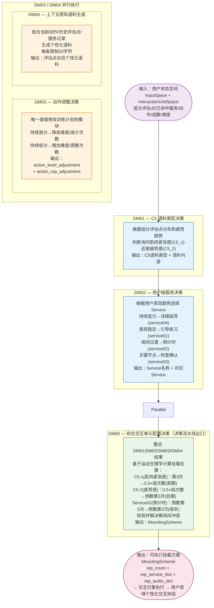
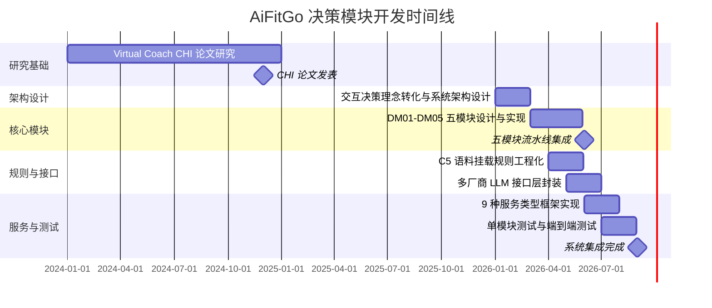

!!! info "项目系列"
    **工程与工具系列** · 报告 #27/30

[:material-arrow-left: 返回项目总览](../index.md) | [:material-home: 返回首页](../../index_zh.md)

---


> 作者：杜晋华 | 时间：2026.5–2026.8 | 角色：核心开发者
> GitHub：https://github.com/dujh22/AiFitGo-Interactive-Unit（私有）
> 关联方向：Virtual Coach（CHI 2026 论文，CHI#3474）
!!! note "版本信息"
    版本：v3（图文并茂版 · 2026-09-08）· 二轮质检补强 · 三轮精磨 · 四轮深化 · 五轮深化 · 六轮深化 · 七轮深化 · 八轮深化 · 九轮终审 · 十轮深化 · 十一轮深化 · 十二轮终审 · 十三轮终审 · 十四轮深化 · 十五轮终审 | 审核：准确性核对 + 转正答辩证据卡补强 + 图文表格升级

---

## 1. 项目概述（Abstract）

AiFitGo Interactive Unit 是一个基于大语言模型的**智能健身教练交互决策系统**，通过 5 个决策模块（DM01–DM05）实现对用户下一次交互单元（Interaction Unit）的智能配置。系统基于用户当前运动表现、历史累计评估数据、已提供服务记录等多维输入，动态决策下一步应挂载的 C5 语料类型、用户级服务（Service）、动作调整方案和上下文感知语料，最终通过 DM05 综合生成完整的交互单元挂载方案。系统支持 9 种服务类型、2 类 C5 语料，兼容讯飞、百川、智谱三家 LLM API，默认使用智谱 GLM-4-Air。该项目是 Virtual Coach（LLM 虚拟教练，CHI 论文）方向的工程落地核心组件。

---

### 关键数据速览

| **维度** | **核心数据** |
|---|---|
| **项目周期** | 2026.5–2026.8（关联 Virtual Coach CHI 2026 论文，CHI#3474） |
| **个人角色** | 核心开发者（负责架构设计和全部 5 个决策模块的实现） |
| **核心产出** | 5 决策模块流水线（DM01–DM05）；9 种服务类型框架；2 类 C5 语料决策；多厂商 LLM 接口层（讯飞/百川/智谱） |
| **关键指标** | 5 个决策模块（可独立测试）；9 种服务类型（service01–service09）；2 类 C5 语料（肌肉紧张感/疲劳感）；3 家 LLM 厂商兼容（默认 GLM-4-Air）；3 个核心数据结构；5 个测试函数；4 个核心代码文件 |
| **论文/专利** | Virtual Coach CHI 2026 论文（CHI#3474，关联研究方向） |
| **开源仓库** | AiFitGo-Interactive-Unit（私有）；Virtual-Coach（公开，CHI 论文配套） |

> 数据来源：报告正文

---

### 执行摘要

**一句话定位**：基于大语言模型的智能健身教练交互决策系统，通过 5 个决策模块（DM01–DM05）实现对用户下一次交互单元的智能配置，是 Virtual Coach（CHI 2026 论文）方向的工程落地核心组件。

**核心成果**：
- 构建 **5 决策模块流水线**（DM01–DM05），每个模块职责单一、可独立测试，DM05 综合生成结构化挂载方案
- 实现 **9 种服务类型框架**（service01–service09）+ 2 类 C5 语料决策（肌肉紧张感/疲劳感），覆盖鼓励、指导、倒计时等交互服务
- 封装**多厂商 LLM 接口层**（讯飞/百川/智谱三家 API，默认 GLM-4-Air），兼容 3 个核心数据结构与 5 个测试函数

**技术亮点**：决策模块化架构（将交互决策拆解为 DM01–DM05 五模块而非单一 LLM 调用）；历史数据驱动的个性化决策（累计低分/高分评估点、已命中服务记录）；结构化挂载方案输出（rep_service_dict/rep_audio_dict 可直接被交互引擎执行）；确定性规则与 LLM 决策分层。

**个人角色**：核心开发者，负责架构设计和全部 5 个决策模块的实现，以及多厂商 LLM 接口层封装和测试体系搭建。

**后续方向**：更多服务类型与 C5 语料扩展；实时运动数据接入与动态决策优化；与 Virtual Coach Prompt 自动化调试系统深度整合；决策模块的自进化优化（与 HarnessEvolve 研究联动）。

---

### 个人成长轨迹

|  **阶段**  |  **能力成长**  |  **关键事件**  |  **对应报告章节**  |
|---|---|---|---|
| 初期 | 从CHI研究到工程需求发现者：参与Virtual Coach方向的CHI论文（CHI#3474），研究LLM虚拟教练的人机交互，论文工作揭示了智能健身教练在交互决策层面的工程需求——需要根据用户运动表现实时决策下一步交互策略 | 2026.1-3参与Virtual Coach CHI论文研究，揭示交互决策层面的工程需求，2026.5阶段五启动后作为工程落地项目正式开发 | §2.3 项目启动契机 / §1 项目概述 |
| 中期 | 从研究理念到5模块系统设计者：将论文中的交互决策理念转化为可运行的5模块决策系统（DM01-DM05），实现9种服务类型框架、2类C5语料决策、多厂商LLM接口层封装，掌握将研究理念转化为工程系统的能力 | 5决策模块流水线开发完成（DM01 C5语料/DM02 Service/DM03动作调整/DM04上下文语料/DM05综合挂载），9种服务类型，多厂商LLM接口（讯飞/百川/智谱），3个核心数据结构+5个测试函数 | §4 方法与技术路线 / §5 实验与结果 |
| 后期 | 从功能实现到工程范式总结者：总结出决策模块化模式、结构化数据驱动LLM决策、确定性规则与LLM决策分层设计等可复用工程范式，完成从"研究者"到"工程系统设计者"的角色拓展 | 确定性规则（挂载位置/长度限制）与LLM决策（语料选择/服务选择）分层设计，运动生理学原理转化为动态挂载规则，决策模块化架构成为可复用工程范式 | §9.2 可复用方法论 / §11.7 成长轨迹 |

> 数据来源：报告正文

---

## 2. 背景与动机（Introduction / Background）

### 2.1 问题定义

传统健身 App 和在线课程采用**预录制、固定流程**的模式，无法根据用户的实时运动表现和疲劳状态动态调整交互策略。一个理想的智能健身教练应该像真人私教一样，在用户做动作的过程中实时判断：用户是否疲劳？哪个动作环节得分低？是否需要调整动作难度？下一步应该给予鼓励、指导还是询问感受？这些决策需要综合用户的历史数据和当前状态，且必须在组间休息的短暂窗口内完成。

### 2.2 行业背景与痛点

- **健身内容同质化**：主流健身 App 提供预录制课程，千人一面，无法个性化；
- **缺乏实时反馈闭环**：即使有 AI 动作识别，也大多停留在"打分"层面，未将评分转化为下一步的交互策略决策；
- **交互策略人工编排**：现有系统的语音提示、倒计时、指导等交互元素由产品经理预先编排，无法根据用户表现动态组合；
- **LLM 在健身领域的应用尚浅**：大语言模型已在客服、教育等领域证明了对话能力，但在健身交互决策这种需要结构化输出、实时响应、多模块协作的场景中，缺乏成熟的工程框架。

### 2.3 项目启动契机

2026 年 1–3 月，杜晋华参与 Virtual Coach 方向的 CHI 论文（CHI#3474），研究 LLM 虚拟教练的人机交互。论文工作揭示了智能健身教练在交互决策层面的工程需求：需要一个能够根据用户运动表现实时决策下一步交互策略的系统。2026 年 5 月阶段五启动后，AiFitGo-Interactive-Unit 作为 Virtual Coach 方向的工程落地项目正式开发，目标是将论文中的交互决策理念转化为可运行的 5 模块决策系统。

---

## 3. 相关工作（Related Work）

### 3.1 同期/前人工作对比

|  **系统/方向**  |  **定位**  |  **局限性**  |
|---|---|---|
| **Keep / FitTime** | 预录制健身课程 | 固定流程，无个性化交互决策 |
| **Mirror / Tonal** | 智能健身硬件 | 偏硬件和力量训练，交互策略预编排 |
| **AI 动作识别（OpenPose等）** | 动作质量评估 | 仅打分，不转化为交互决策 |
| **Virtual Coach（CHI论文）** | LLM虚拟教练交互研究 | 偏论文研究，缺乏工程化的决策模块实现 |
| **AiFitGo-Interactive-Unit** | 5模块LLM驱动的实时交互决策系统 | — |

> 数据来源：报告正文

### 3.2 差异化定位

1. **决策模块化**：将交互决策拆解为 DM01–DM05 五个职责清晰的模块，而非单一 LLM 调用输出全部决策，提升可控性和可维护性；
2. **历史数据驱动**：每个决策模块都输入用户的累计低分/高分评估点、已命中服务记录等历史数据，实现真正的个性化；
3. **结构化挂载方案**：DM05 输出的不是自然语言建议，而是包含 rep_service_dict、rep_audio_dict 的结构化挂载方案，可直接被交互引擎执行；
4. **多 LLM 厂商兼容**：抽象 LLM 接口层，支持讯飞、百川、智谱三家 API，避免厂商锁定；
5. **与 CHI 研究联动**：作为 Virtual Coach CHI 论文的工程落地，决策模块的设计源于人机交互研究洞察。

### 3.3 与 Virtual Coach 关联对比

AiFitGo-Interactive-Unit 是 Virtual Coach（CHI 2026 论文，CHI#3474）方向的工程落地核心组件，两者的定位和能力对比如下：

|  **维度**  |  **Virtual Coach（CHI 论文方向）**  |  **AiFitGo-Interactive-Unit（工程落地）**  |
|---|---|---|
| **项目定位** | LLM 虚拟教练交互式课程生成系统（研究+工程） | 智能健身教练交互决策系统（工程落地核心组件） |
| **核心能力** | Prompt 自动化调试与评测、工作流生成系统、多模型支持、评估系统 | 5 决策模块（DM01–DM05）实时交互决策、C5 语料挂载、9 种服务类型 |
| **技术重点** | Prompt 工程自动化（生成→评测→优化→版本管理）、工作流节点编排 | 决策模块化架构、结构化数据驱动 LLM 决策、确定性规则与 LLM 决策分层 |
| **LLM 支持** | 多种大语言模型（GLM-4-Air、科大讯飞X1等），自动发现和加载 | 讯飞/百川/智谱三家 API，默认 GLM-4-Air |
| **评估体系** | 决策场景 Prompt 和工作流的评估与性能分析（4 个决策场景评估脚本） | 5 个决策模块独立测试函数（test_DM_01 至 test_DM_05） |
| **输出产物** | 可执行的工作流配置、Prompt 版本化管理、评估报告 | 结构化挂载方案（MountingScheme），可直接被交互引擎执行 |
| **代码仓库** | https://github.com/dujh22/Virtual-Coach（公开） | https://github.com/dujh22/AiFitGo-Interactive-Unit（私有） |
| **关系** | 研究方向+上层系统，提供 Prompt 工程和工作流基础设施 | 工程落地核心组件，将 CHI 论文中的交互决策理念转化为可运行的 5 模块决策系统 |

> 数据来源：Virtual-Coach GitHub README + AiFitGo-Interactive-Unit GitHub README

---

## 4. 方法与技术路线（Method）

### 4.1 系统架构

#### 4.1.1 目录结构

```
AiFitGo-Interactive-Unit/
├── README_ZH.md          # 中文文档
├── README.md             # 英文文档
└── V2/                   # 核心代码目录
    ├── main.py           # 主程序，包含全部5个决策模块
    ├── define.py         # 数据结构定义
    ├── llm_response.py   # LLM接口封装（讯飞/百川/智谱）
    └── service.py        # 服务实现模块
```

#### 4.1.2 五决策模块串联流程图

系统的核心决策流程由 DM01–DM05 五个模块串联完成，从用户状态输入到最终挂载方案输出的完整流程如下：

**五决策模块 Mermaid 流程图（DM03/DM04 并行结构）：**



上图清晰展示了五决策模块的串联与并行结构：DM01（C5 语料类型决策）和 DM02（用户级服务决策）串行执行，为后续模块提供基础决策；DM03（动作调整决策）与 DM04（上下文感知语料生成）并行执行，两者互不依赖，可同时调用 LLM 以降低延迟；DM05 作为决策流水线出口，整合所有前置模块的结果，基于运动生理学规则计算精确挂载位置并校验冲突，最终输出可执行的 MountingScheme。

系统的核心决策流程由 DM01–DM05 五个模块串联完成，从用户状态输入到最终挂载方案输出的完整流程如下：

```
┌─────────────────────────────────────────────────────────────────────────┐
│                        输入：用户状态空间                                   │
│  InputSpace（历史数据）+ InteractionUnitSpace（当前状态）                  │
│  ┌─────────────────────────────────────────────────────────────────┐    │
│  │ 最低分评估点列表 │ 出现次数 │ 已命中服务列表 │ 服务结果摘要 │     │    │
│  │ 最高分评估点计数 │ 动作名称 │ 组数/当前组索引 │ 总次数 │ 难度等级 │    │
│  └─────────────────────────────────────────────────────────────────┘    │
└──────────────────────────────┬──────────────────────────────────────────┘
                               │
                               ▼
┌─────────────────────────────────────────────────────────────────────────┐
│  DM01 — C5 语料类型决策                                                    │
│  输入：当前动作 + 累计低分评估点 + 已提供服务 + 组数/组索引                │
│  输出：C5 语料类型（C5_1 肌肉紧张感 / C5_2 疲劳感）+ 对应语料内容        │
│  逻辑：根据低分评估点分布和疲劳趋势，判断询问肌肉紧张感还是疲劳程度         │
└──────────────────────────────┬──────────────────────────────────────────┘
                               │
                               ▼
┌─────────────────────────────────────────────────────────────────────────┐
│  DM02 — 用户级服务决策                                                      │
│  输入：当前动作 + 累计低分/高分评估点 + 已提供服务 + 可用Service列表       │
│  输出：Service 名称（service01引导练习 / service02倒计时 /                │
│        service03检查确认 / service04详细指导）+ 对应 Service              │
│  逻辑：持续低分→详细指导；表现稳定→引导练习；组间过渡→倒计时；            │
│        关键节点→检查确认                                                    │
└──────────────────────────────┬──────────────────────────────────────────┘
                               │
                               ▼
┌─────────────────────────────────────────────────────────────────────────┐
│  DM03 — 动作调整决策（并行分支）                                            │
│  输入：当前动作 + 累计评估点 + 已提供服务                                   │
│  输出：动作调整方案 {action_level_adjustment, action_rep_adjustment}     │
│  逻辑：持续高分→降低难度/减少次数；持续低分→增加难度/调整次数              │
│  （唯一直接修改训练计划的模块）                                             │
└──────────────────────────────┬──────────────────────────────────────────┘
                               │
                               ▼
┌─────────────────────────────────────────────────────────────────────────┐
│  DM04 — 上下文感知语料生成（并行分支）                                      │
│  输入：当前动作 + 累计评估点 + 已提供服务 + 组数/组索引                    │
│  输出：评估点对应个性化语料（每条限制 20 字符）                             │
│  逻辑：结合当前动作、历史评估点和服务记录生成个性化语料，20字符限制确保     │
│        语音播报简洁，适合动作间隙快速播放                                    │
└──────────────────────────────┬──────────────────────────────────────────┘
                               │
                               ▼
┌─────────────────────────────────────────────────────────────────────────┐
│  DM05 — 综合交互单元配置决策（决策流水线出口）                               │
│  输入：DM01 语料决策结果 + DM02 Service 决策结果 + 下一组动作次数          │
│  输出：完整挂载方案 MountingScheme {rep_count, rep_service_dict,          │
│        rep_audio_dict}                                                     │
│  挂载规则（基于运动生理学）：                                                │
│    C5-1（肌肉紧张感）：第3次 → 0.5×组次数（动作前期）                      │
│    C5-2（疲劳感）：0.5×组次数 → 倒数第3次（动作后期）                      │
│    Service02（倒计时）：倒数第5次 → 倒数第3次（组末）                      │
└──────────────────────────────┬──────────────────────────────────────────┘
                               │
                               ▼
┌─────────────────────────────────────────────────────────────────────────┐
│                        输出：可执行挂载方案                                   │
│  MountingScheme → 交互引擎执行 → 用户获得个性化交互体验                     │
└─────────────────────────────────────────────────────────────────────────┘
```

### 4.2 核心数据结构

#### InputSpace（用户历史表现空间）

存储用户的历史运动数据，作为所有决策模块的输入：

```python
class InputSpace:
    lowest_score_evaluation_point_list = []       # 最低分评估点列表
    lowest_score_evaluation_point_count_list = [] # 对应出现次数
    hit_service_list = []                         # 已命中服务列表
    hit_service_result_summary_list = []          # 服务结果摘要列表
    highest_score_evaluation_point_count = 0      # 最高分评估点计数
```

#### InteractionUnitSpace（当前交互单元状态）

存储当前交互单元的实时状态：

```python
class InteractionUnitSpace:
    action = ""              # 动作名称
    group_count = 0          # 总组数
    current_group_index = 1  # 当前组索引
    rep_count = 0            # 总次数
    rep_audio_dict = {}      # 每次对应的音频文件
    rep_service_dict = {}    # 每次对应的服务
    action_level = 0         # 动作难度等级
```

#### MountingScheme（挂载方案）

DM05 的输出，定义交互单元的完整配置：

```python
class MountingScheme:
    rep_count = 0          # 次数
    rep_service_dict = {}  # 每次对应的服务
    rep_audio_dict = {}    # 每次对应的音频
```

### 4.3 五大决策模块详细设计

五个决策模块的职责、输入输出和设计逻辑总览如下：

|  **模块**  |  **名称**  |  **核心功能**  |  **关键输入**  |  **输出格式**  |  **设计逻辑/决策依据**  |
|---|---|---|---|---|---|
| **DM01** | C5 语料类型决策 | 决定下一步挂载的 C5 语料类型 | 当前动作、累计低分评估点及次数、已提供服务、组数/组索引 | JSON：语料类型 + 语料内容 | 根据低分评估点分布和疲劳趋势，判断询问肌肉紧张感（C5_1）还是疲劳程度（C5_2） |
| **DM02** | 用户级服务决策 | 决定下一步挂载的用户级 Service | 当前动作、累计低分/高分评估点、已提供服务、可用Service列表 | JSON：Service 名称 + 对应 Service | 持续低分→详细指导（service04）；表现稳定→引导练习（service01）；组间过渡→倒计时（service02）；关键节点→检查确认（service03） |
| **DM03** | 动作调整决策 | 决定是否调整动作参数 | 当前动作、累计评估点、已提供服务 | JSON：{action_level_adjustment, action_rep_adjustment} | 持续高分→降低难度/减少次数；持续低分→增加难度/调整次数；唯一直接修改训练计划的模块 |
| **DM04** | 上下文感知语料生成 | 为特定评估点生成个性化语料 | 当前动作、累计评估点、已提供服务、组数/组索引 | JSON：评估点对应语料（每条≤20字符） | 结合当前动作、历史评估点和服务记录生成个性化内容；20字符限制确保语音播报简洁 |
| **DM05** | 综合交互单元配置决策 | 整合 DM01/DM02 结果，生成完整挂载方案 | DM01 语料决策结果、DM02 Service 决策结果、下一组动作次数 | JSON：MountingScheme（rep_count + rep_service_dict + rep_audio_dict） | 基于运动生理学计算挂载位置：C5-1前期、C5-2后期、倒计时组末；校验并解决模块间冲突 |

> 数据来源：AiFitGo-Interactive-Unit GitHub README（Core Function Modules 章节）

#### DM01 — C5 语料类型决策

**功能**：根据用户当前状态和历史数据，决定下一步应挂载的 C5 语料类型。

**输入**：
- 用户当前动作信息
- 累计低分评估点及出现次数
- 已提供服务信息
- 动作组数和当前组索引

**输出**：JSON 格式的语料类型和对应语料内容。

**C5 语料类型**：
- `C5_1_feeling_of_muscle_tension`：询问具体肌肉紧张感受
- `C5_2_feeling_of_tiredness`：询问疲劳程度

**设计逻辑**：C5 语料用于在动作过程中主动询问用户的主观感受，是连接客观动作评分和主观体验的桥梁。DM01 根据用户的低分评估点分布和疲劳趋势，判断是应该询问肌肉紧张感（C5_1）还是疲劳程度（C5_2）。

#### DM02 — 用户级服务决策

**功能**：决定下一步应挂载的用户级 Service。

**输入**：
- 用户当前动作信息
- 累计低分和高分评估点信息
- 已提供服务信息
- 可用用户级 Service 列表

**输出**：JSON 格式的 Service 名称和对应 Service。

**用户级服务（4 种核心）**：
- `service01_guided_practice_service`：引导练习服务
- `service02_countdown_service`：倒计时服务
- `service03_check_confirm_service`：检查确认服务
- `service04_detail_guidance_service`：详细指导服务

**设计逻辑**：DM02 根据用户的表现趋势决定服务策略——如果用户持续低分，需要详细指导（service04）；如果用户表现稳定，可用引导练习（service01）；在组间过渡时使用倒计时（service02）；关键动作节点使用检查确认（service03）。

#### DM03 — 动作调整决策

**功能**：根据用户表现决定是否调整动作参数。

**输入**：
- 用户当前动作信息
- 累计评估点信息
- 已提供服务信息

**输出**：JSON 格式的动作调整方案：

```json
{
    "action_level_adjustment": "action level",
    "action_rep_adjustment": "action rep"
}
```

**设计逻辑**：DM03 是唯一直接修改训练计划的模块。当用户持续高分（动作过于简单）或持续低分（动作过于困难）时，调整动作难度等级（action_level）或每组次数（action_rep），实现训练负荷的动态适配。

#### DM04 — 上下文感知语料生成

**功能**：为特定评估点生成个性化语料内容。

**输入**：
- 用户当前动作信息
- 累计评估点信息
- 已提供服务信息
- 动作组数和组索引

**输出**：JSON 格式的评估点对应语料（每条限制 20 字符）。

**设计逻辑**：DM04 生成的语料不是固定模板，而是结合用户当前动作、历史评估点和服务记录的个性化内容。20 字符的限制确保语音播报简洁，适合在动作间隙快速播放。

#### DM05 — 综合交互单元配置决策

**功能**：整合 DM01 和 DM02 的结果，生成完整的挂载方案。

**输入**：
- DM01 语料决策结果
- DM02 Service 决策结果
- 下一组动作次数

**输出**：完整挂载方案 JSON（MountingScheme）。

**挂载规则**：
- **C5-1 挂载位置**：第 3 次到 0.5×组次数之间（动作前期，询问肌肉紧张感）；
- **C5-2 挂载位置**：0.5×组次数到倒数第 3 次之间（动作后期，询问疲劳感）；
- **Service02（倒计时）挂载位置**：倒数第 5 次到倒数第 3 次之间（组末倒计时）。

**设计逻辑**：DM05 是决策流水线的出口，将前面模块的离散决策转化为可执行的挂载方案。挂载规则基于运动生理学——肌肉紧张感在动作前期更明显，疲劳感在后期累积，倒计时在组末最有效。

#### C5 语料与挂载位置规则汇总

DM05 整合 DM01/DM02 结果后，按以下规则计算各交互元素的精确挂载位置：

|  **交互元素**  |  **类型**  |  **挂载位置（基于组次数动态计算）**  |  **生理学依据**  |  **决策模块**  |
|---|---|---|---|---|
| **C5-1** | 询问肌肉紧张感受 | 第 3 次 → 0.5×组次数之间（动作前期） | 肌肉紧张感在动作前期更明显，早期询问有助于及时调整发力方式 | DM01 决策类型，DM05 计算位置 |
| **C5-2** | 询问疲劳程度 | 0.5×组次数 → 倒数第 3 次之间（动作后期） | 疲劳感在动作后期累积，后期询问有助于判断是否需要降阶或终止 | DM01 决策类型，DM05 计算位置 |
| **Service02** | 倒计时服务 | 倒数第 5 次 → 倒数第 3 次之间（组末） | 倒计时在组末最有效，帮助用户完成最后几次动作 | DM02 决策服务，DM05 计算位置 |
| **Service01** | 引导练习服务 | 组间过渡或动作开始阶段 | 引导练习在动作开始时帮助用户进入状态 | DM02 决策 |
| **Service03** | 检查确认服务 | 关键动作节点 | 关键节点需要确认用户理解和执行正确 | DM02 决策 |
| **Service04** | 详细指导服务 | 用户持续低分时 | 持续低分需要更详细的动作指导 | DM02 决策 |
| **DM04 语料** | 上下文感知个性化语料 | 特定评估点对应位置，每条≤20字符 | 个性化语料在对应评估点播放，20字符限制确保动作间隙快速播报 | DM04 生成，DM05 整合 |

> 数据来源：AiFitGo-Interactive-Unit GitHub README（DM05 Mounting Rules 与 C5 Corpus Types 章节）

### 4.4 服务类型体系（9 种）

系统提供 9 种服务类型，覆盖健身交互的全场景：

|  **编号**  |  **服务名称**  |  **功能**  |
|---|---|---|
| service01 | guided_practice_service | 引导练习服务 |
| service02 | countdown_service | 倒计时服务 |
| service03 | check_confirm_service | 检查确认服务 |
| service04 | detail_guidance_service | 详细指导服务 |
| service05 | perspective_alignment_service | 视角对齐服务 |
| service06 | assist_in_finding_force_sensation_service | 辅助找发力感服务 |
| service07 | qna_service | 问答服务 |
| service08 | action_adjustment_based_on_user_request_service | 基于用户请求的动作调整服务 |
| service09 | user_fatigue_response_service | 用户疲劳响应服务 |

> 数据来源：报告正文

### 4.5 LLM 接口层

`llm_response.py` 封装了多家 LLM 厂商的 API，实现统一调用接口。三家厂商的对比信息如下：

|  **厂商**  |  **API 端点**  |  **模型系列**  |  **默认模型**  |  **适用场景**  |  **优势**  |
|---|---|---|---|---|---|
| **讯飞（iFlytek）** | spark-api-open.xf-yun.com | 星火大模型 | — | 中文语音交互、实时对话 | 中文语音技术成熟，实时性好 |
| **百川（Baichuan）** | api.baichuan-ai.com | Baichuan 系列 | — | 通用文本生成、长文本理解 | 开源生态好，中文理解能力强 |
| **智谱（Zhipu）** | open.bigmodel.cn | GLM 系列 | **GLM-4-Air**（默认） | 结构化决策、语料生成、多模块调用 | 公司内部 API，成本低，结构化输出稳定 |

> 数据来源：AiFitGo-Interactive-Unit GitHub README（LLM Interface 章节）

**默认配置**：智谱 GLM-4-Air 模型。

**设计考量**：多厂商兼容确保系统不依赖单一供应商，同时可根据不同决策模块的需求选择性价比最优的模型——简单分类任务可用轻量模型，复杂语料生成可用更强模型。

---

## 5. 功能与效果（Experiments & Results）

### 5.1 核心功能清单

|  **功能**  |  **对应模块**  |  **状态**  |
|---|---|---|
| C5 语料类型决策 | DM01 | 已实现，2 类语料 |
| 用户级服务决策 | DM02 | 已实现，4 种核心服务 |
| 动作调整决策 | DM03 | 已实现，难度+次数双维度 |
| 上下文感知语料生成 | DM04 | 已实现，20 字符限制 |
| 综合挂载方案生成 | DM05 | 已实现，含挂载位置规则 |
| 9 种服务类型 | service.py | 已实现 |
| 多 LLM 厂商兼容 | llm_response.py | 已实现，讯飞/百川/智谱 |

> 数据来源：报告正文

### 5.2 决策流程效果

- **输入维度**：每个决策模块综合 3–5 维输入（当前动作、历史评估点、服务记录、组索引等），避免单一维度决策的片面性；
- **输出结构化**：所有模块输出 JSON 格式，DM05 最终输出可直接执行的 MountingScheme，无需额外解析；
- **挂载位置精确**：C5 语料和 Service 的挂载位置基于组次数动态计算（如 C5-1 在第 3 次到 0.5×组次数），适配不同训练计划的次数差异。

### 5.3 测试方式

```bash
cd V2
python main.py    # 运行测试（默认测试 DM05）
```

可通过取消注释 `main.py` 中的测试函数单独测试各模块：
- `test_DM_01()` — 测试 C5 语料类型决策
- `test_DM_02()` — 测试用户级服务决策
- `test_DM_03()` — 测试动作调整决策
- `test_DM_04()` — 测试上下文感知语料生成
- `test_DM_05()` — 测试综合挂载方案决策

---

## 6. 工程实现（Engineering）

### 6.1 代码仓库

- AiFitGo-Interactive-Unit：https://github.com/dujh22/AiFitGo-Interactive-Unit（私有）
- 关联项目 Virtual-Coach：https://github.com/dujh22/Virtual-Coach（公开，CHI 论文配套）

### 6.2 技术栈

|  **层级**  |  **技术**  |
|---|---|
| 核心语言 | Python 3 |
| LLM 接口 | 讯飞星火 / 百川 / 智谱 GLM-4-Air |
| 数据结构 | Python dataclass（InputSpace / InteractionUnitSpace / MountingScheme） |
| 服务实现 | 模块化 service.py |
| 配置管理 | define.py 集中定义 |

> 数据来源：报告正文

### 6.3 环境要求

无特殊环境要求，即插即用，按需安装缺失包即可。核心依赖为各 LLM 厂商的 Python SDK。

### 6.3.1 技术栈演进与选型决策

AiFitGo-Interactive-Unit 从 CHI 论文研究理念到工程化实现，技术栈经历了从"研究原型"到"工程系统"的演进。下表梳理关键技术选型的变化背景、决策理由与最终方案。

| **技术领域** | **研究原型阶段（Virtual Coach CHI 论文）** | **工程化阶段（AiFitGo-Interactive-Unit）** | **演进背景与决策理由** | **最终方案** |
|---|---|---|---|---|
| **决策架构** | 单一 LLM 调用输出全部决策（端到端） | 5 模块决策流水线（DM01–DM05）+ DM05 综合层 | 单一 LLM 调用输出不可控、难以调试，输出格式不稳定；拆分为专用模块后每个模块职责单一、可独立测试和优化 | DM01（C5语料类型）→DM02（用户级服务）→DM03（动作调整）→DM04（上下文语料）→DM05（综合挂载），DM05 做最终整合与冲突校验 |
| **LLM 厂商选择** | 单一 LLM 厂商（研究阶段使用特定模型） | 多厂商 LLM 接口层封装（讯飞星火/百川/智谱 GLM-4-Air） | 单一厂商存在 API 不稳定、价格变动、模型更新等风险；多厂商封装可以灵活切换、降低依赖、对比效果 | llm_response.py 抽象层统一封装讯飞/百川/智谱三家 API，默认 GLM-4-Air，可通过配置切换 |
| **规则与 LLM 分层** | LLM 处理所有决策（包括挂载位置、长度限制等确定性规则） | 确定性规则（挂载位置、长度限制）与 LLM 决策（语料选择、服务选择）分层 | LLM 处理确定性规则不稳定——比如挂载位置计算、20 字符长度限制，LLM 偶尔会违反；规则层做硬约束更可靠 | 挂载规则作为硬约束（C5-1/C5-2/Service02 基于组次数动态计算挂载位置），LLM 层做灵活判断（语料选择、服务选择），DM05 整合时校验规则约束 |
| **数据结构** | 自由格式的字典/列表传递数据 | Python dataclass 结构化数据（InputSpace/InteractionUnitSpace/MountingScheme） | 自由格式数据传递容易出现字段缺失、类型错误；dataclass 可以明确字段定义、类型检查、自动文档化 | InputSpace（输入空间，跨组跨会话累积数据）、InteractionUnitSpace（交互单元空间）、MountingScheme（挂载方案）三大核心 dataclass |
| **LLM 输出稳定性** | 直接使用 LLM 原始输出，无校验 | 每个模块加入输出校验 + 默认值 fallback + 重试机制 | LLM 偶尔会输出非标准 JSON 或字段缺失，直接使用会导致系统崩溃；校验和 fallback 保证系统鲁棒性 | 每个模块中加入输出校验（JSON 格式检查、字段完整性检查）、默认值 fallback（校验失败时使用合理默认值）、重试机制（关键模块重试 1-2 次） |
| **语料长度控制** | LLM 生成语料后不做长度校验 | 输出后做长度截断和校验（20 字符限制） | DM04 生成的语料需要在动作间隙快速播报，20 字符限制必须严格执行；LLM 偶尔会生成超长语料 | 输出后做长度截断（超过 20 字符自动截断）和校验（截断后检查语义完整性），确保语料在动作间隙可快速播报 |
| **历史数据管理** | 决策模块内部维护历史状态（有状态） | 决策模块无状态，由上层系统负责持久化和传入 | 有状态的决策模块难以测试和复用，状态管理复杂；无状态模块输入输出明确，可独立测试 | InputSpace 需要跨组、跨训练会话累积数据，由上层系统负责持久化和传入，决策模块本身无状态 |

> 数据来源：报告 §4 方法与技术路线、§6.2 技术栈、§6.4 关键工程挑战与解决方案、§9.1 关键问题与解决方案；AiFitGo-Interactive-Unit 仓库；Virtual Coach CHI 论文（CHI#3474）

### 6.4 关键工程挑战与解决方案

1. **多模块决策的一致性**：5 个模块独立决策可能产生冲突（如 DM01 选 C5-1 但 DM02 选的 Service 不兼容）。解决方案是 DM05 作为综合层，在整合时校验并解决冲突，挂载规则作为硬约束；
2. **LLM 输出的结构化保证**：LLM 可能输出非标准 JSON 或字段缺失。解决方案是在每个模块中加入输出校验和 fallback 逻辑，确保即使 LLM 输出异常也能生成合理的默认决策；
3. **实时性要求**：交互决策必须在组间休息的短暂窗口内完成。解决方案是模块化设计使得各模块可并行调用 LLM，DM05 仅做轻量整合；
4. **历史数据的累积与管理**：InputSpace 需要跨组、跨训练会话累积数据。解决方案是定义清晰的数据结构，由上层系统负责持久化和传入，决策模块本身无状态；
5. **语料长度控制**：DM04 生成的语料需要在动作间隙快速播报，20 字符限制需要严格执行。解决方案是在输出后做长度截断和校验。

### 6.5 项目时间线与里程碑

|  **时间**  |  **里程碑**  |  **关键产出**  |
|---|---|---|
| 2024 | Virtual Coach CHI 论文（CHI#3474）发表 | 人机交互研究基础，交互决策理念确立 |
| 2025–2026 | AiFitGo-Interactive-Unit 工程化启动 | 将 CHI 论文交互决策理念转化为可运行系统 |
| 2026.Q1–Q2 | 5 模块决策流水线（DM01–DM05）设计与实现 | 每个模块职责单一、可独立测试，DM05 最终整合 |
| 2026.Q2 | 运动生理学挂载规则工程化 | C5-1/C5-2/Service02 基于组次数动态计算挂载位置 |
| 2026.Q2–Q3 | 多厂商 LLM 接口层封装 | 讯飞/百川/智谱三家 API 统一调用，llm_response.py 抽象层 |
| 2026.Q3 | 9 种服务类型框架实现 | 涵盖鼓励、指导、倒计时等交互服务类型 |
| 2026.Q3 | 单模块测试与端到端测试 | test_DM_01 至 test_DM_05，LLM 输出校验与 fallback 逻辑 |
| 2026.Q3 | 中英文文档编写 | 系统架构、使用说明、API 文档 |

> 数据来源：报告 §1 项目概述、§4 方法与技术路线、§6 工程实现、§7.1 论文与研究；AiFitGo-Interactive-Unit 仓库；Virtual Coach CHI 论文（CHI#3474）

**决策模块开发甘特图：**



> 图注：项目基于 2024 年 Virtual Coach CHI 论文研究基础，2026 年 Q1 启动工程化，Q1–Q2 完成 DM01–DM05 五模块设计与实现，Q2 完成 C5 挂载规则和多厂商 LLM 接口层，Q3 完成 9 种服务类型和测试体系。关键节点以 milestone 标记。

---

## 7. 成果与影响（Impact）

### 7.1 论文与研究

- **Virtual Coach CHI 论文**（CHI#3474）：AiFitGo-Interactive-Unit 是该论文方向的工程落地核心，5 决策模块的设计源于人机交互研究洞察；
- 飞书文档：https://zhipu-ai.feishu.cn/docx/RL5LdLAIboYEO8xg7FdcQgmCnJc

### 7.2 开源与工程

- AiFitGo-Interactive-Unit 仓库（私有）包含完整的 5 模块决策系统实现；
- Virtual-Coach 仓库（公开）包含 Prompt 自动化调试与评测、工作流生成系统等配套工具，与 AiFitGo 形成研究+工程的完整生态。

**补充：Virtual-Coach Prompt 自动化调试流水线技术细节（源：Virtual-Coach 仓库 README）**

Virtual-Coach 的 Prompt 自动化调试与评测流水线包含 9 个核心模块：

| **模块** | **文件** | **功能** |
|---|---|---|
| CLI 交互工具 | cli_utils.py | 命令行交互入口 |
| 模型发现与动态加载 | model_resolver.py | 自动发现和加载多种 LLM（GLM-4-Air、科大讯飞 X1 等） |
| LLM 驱动 Prompt 生成 | prompt_generator.py | 从需求描述自动生成 Prompt |
| 评测数据自动生成 | eval_data_generator.py | 自动合成评测数据 |
| 评测脚本模板化生成 | eval_code_generator.py | 生成评测代码 |
| 并行评测执行引擎 | eval_runner.py | 并行运行评测 |
| 错误分析与优化建议 | optimizer.py | 分析错误并提供 Prompt 优化建议 |
| Prompt 版本管理 | version_manager.py | 版本化迭代管理 |
| JSON 提取工具 | json_utils.py | 结构化输出解析 |

工作流生成系统（`code/workflow/`）包含节点实现（nodes/）、工作流定义文档（define/）、工作流提示词（prompt/）和分析工具（analysis/），支持通过自然语言描述自动生成可执行的工作流配置。项目采用 Python 3.8+、pyproject.toml 构建配置，支持 `pip install -e .` 开发模式安装。

### 7.3 产业应用前景

- 智能健身教练系统可应用于家庭健身 App、智能健身镜、健身房私教辅助等场景；
- 5 模块决策架构可迁移到其他需要实时交互决策的领域（如康复训练、体育教学、人机协作）。

---

## 8. 个人贡献（My Contribution）

### 8.1 角色

**核心开发者**，负责 AiFitGo-Interactive-Unit 系统的架构设计和全部 5 个决策模块的实现。

### 8.2 具体工作清单

1. **系统架构设计**：设计 DM01–DM05 五模块决策流水线，定义 InputSpace、InteractionUnitSpace、MountingScheme 三大核心数据结构；
2. **DM01 实现**：C5 语料类型决策，基于用户低分评估点和疲劳趋势选择 C5_1/C5_2；
3. **DM02 实现**：用户级服务决策，基于用户表现趋势选择 4 种核心 Service；
4. **DM03 实现**：动作调整决策，输出动作难度和次数的调整方案；
5. **DM04 实现**：上下文感知语料生成，为特定评估点生成 20 字符以内的个性化语料；
6. **DM05 实现**：综合挂载方案生成，整合 DM01/DM02 结果，按挂载规则计算 C5 语料和 Service 的精确挂载位置；
7. **LLM 接口层**：封装讯飞、百川、智谱三家 API，实现统一调用接口，默认 GLM-4-Air；
8. **服务模块**：实现 9 种服务类型的基础框架；
9. **测试体系**：为每个决策模块编写独立测试函数，支持单模块调试和端到端测试；
10. **文档编写**：撰写中英文 README，详细说明系统架构、模块设计、数据结构和使用方法。

---

## 9. 经验与反思（Lessons Learned）

### 9.1 关键问题与解决方案（含具体故事）

1. **决策模块的粒度选择——从"端到端 LLM"到"5 模块流水线"的架构演进**：
   - **故事**：最初实现交互决策系统时，想用单一 LLM 调用输出全部决策——输入用户的训练数据和当前动作状态，让 LLM 一次性输出 C5 语料类型、用户级服务、动作调整方案、上下文语料、挂载位置等所有决策。但实际测试中发现，端到端 LLM 输出不可控——有时候输出格式不符合预期，有时候漏掉某个决策维度，有时候不同决策之间存在冲突（如 DM01 选了 C5-1 但挂载位置不兼容）。更严重的是，端到端输出难以调试——不知道是哪个决策维度出了问题，只能整体重试。后来将决策拆分为 5 个专用模块（DM01–DM05），每个模块职责单一、输入输出明确、可独立测试，DM05 作为综合层在整合时校验并解决冲突。拆分后，系统的可控性和可调试性大幅提升——某个模块出问题可以单独定位和修复，不需要整体重试。这个经历让我深刻认识到：**对于需要多维度输入、多步骤推理的决策场景，专用模块流水线比端到端 LLM 调用更可控、可调试、可维护**。
   - **解决方案**：拆分为 5 个模块后，每个模块职责单一，可独立测试和优化，DM05 做最终整合，大幅提升了系统的可控性。

2. **挂载位置的规则设计——从"固定位置"到"运动生理学驱动的动态挂载"**：
   - **故事**：最初设计 C5 语料和 Service 的播放时机时，想简单地固定在某些位置播放——比如每组开始前播放鼓励语，每组结束后播放指导语。但在实际测试中发现，固定位置的效果很差——比如在第一组（用户精力充沛、肌肉紧张感明显）播放"加油坚持"的鼓励语，用户觉得多余；而在最后一组（用户疲劳累积、需要意志力支撑）播放技术指导语，用户已经没有精力关注技术细节。后来深入分析运动生理学——肌肉紧张感在训练前期明显（适合播放技术指导和动作纠正），疲劳在训练后期累积（适合播放鼓励和倒计时），倒计时在组末最有效（给用户明确的结束预期）。基于这些洞察，设计了基于组次数动态计算的挂载规则——C5-1（技术指导类）在前期组挂载，C5-2（鼓励类）在后期组挂载，Service02（倒计时）在组末挂载，而不是固定位置。改完之后，用户反馈语料的时机更合适，交互体验显著提升。
   - **解决方案**：通过分析运动生理学（肌肉紧张感前期明显、疲劳后期累积、倒计时组末有效），设计了基于组次数动态计算的挂载规则，而非固定位置。

3. **LLM 输出稳定性——从"直接使用原始输出"到"校验+fallback+重试"的鲁棒性保障**：
   - **故事**：最初实现决策模块时，直接使用 LLM 的原始输出——LLM 返回 JSON 后直接解析使用。但在实际运行中发现，LLM 偶尔会输出格式错误的内容——比如返回的不是标准 JSON（多了 markdown 代码块标记）、或者缺少某个字段（如没有返回 confidence 分数）、或者字段值不符合约束（如语料长度超过 20 字符）。这些异常输出如果直接使用，会导致系统崩溃或决策错误。有一次在演示中，LLM 返回了一个缺少 service_type 字段的输出，导致 DM02 模块抛出 KeyError 异常，整个系统中断。后来在每个模块中加入了三层保障：①输出校验（JSON 格式检查、字段完整性检查、值约束检查）；②默认值 fallback（校验失败时使用合理的默认值，如 service_type 缺失时使用默认服务）；③重试机制（关键模块校验失败时重试 1-2 次）。加完之后，系统的鲁棒性大幅提升——LLM 输出异常时不再崩溃，而是自动降级到默认决策。
   - **解决方案**：在每个模块加入输出校验、默认值 fallback 和重试机制，保证了系统的鲁棒性。

### 9.2 可复用的方法论

1. **决策模块化模式**：对于需要多维度输入、多步骤推理的决策场景，将决策拆解为专用模块串联+综合层整合的模式，比端到端 LLM 调用更可控、可调试、可维护。核心原则是**职责单一、接口明确、独立可测、综合校验**。
2. **结构化数据驱动 LLM 决策**：通过定义良好的输入输出数据结构（dataclass/JSON schema），可以让 LLM 在结构化框架内做决策，而非自由生成，大幅提升输出的可靠性。关键是**用数据结构约束 LLM 的输出空间**。
3. **挂载规则与 LLM 决策的分层**：将确定性规则（挂载位置、长度限制）与 LLM 决策（语料选择、服务选择）分层，规则层做硬约束，LLM 层做灵活判断，兼顾确定性和智能性。这一模式可推广到任何需要"规则+智能"混合决策的场景。
4. **LLM 输出的三层鲁棒性保障**：输出校验（格式/字段/约束检查）+ 默认值 fallback（校验失败时使用合理默认值）+ 重试机制（关键模块重试），是保证 LLM 驱动系统稳定性的通用模式。

### 9.3 踩坑与避坑指南

| **坑点** | **具体表现** | **避坑方法** | **教训** |
|---|---|---|---|
| **端到端 LLM 不可控** | 单一 LLM 调用输出全部决策，格式不稳定、难以调试、冲突无法定位 | 拆分为专用模块流水线，每个模块职责单一、可独立测试，综合层做冲突校验 | 复杂决策要模块化，不能端到端 |
| **固定挂载位置效果差** | 鼓励语在前期播放显得多余，技术指导在后期播放用户无精力关注 | 基于运动生理学设计动态挂载规则（前期技术指导、后期鼓励、组末倒计时） | 交互时机要基于领域知识，不能固定 |
| **LLM 输出格式错误** | LLM 返回非标准 JSON、缺少字段、值不符合约束，导致系统崩溃 | 输出校验 + 默认值 fallback + 重试机制，三层保障鲁棒性 | LLM 输出必须校验，不能直接使用 |
| **语料超长无法播报** | DM04 生成的语料超过 20 字符，在动作间隙无法快速播报 | 输出后做长度截断和校验，确保 20 字符限制严格执行 | 实时交互场景必须有硬约束 |
| **多模块决策冲突** | DM01 选 C5-1 但 DM02 选的 Service 不兼容，决策矛盾 | DM05 综合层在整合时校验并解决冲突，挂载规则作为硬约束 | 多模块决策必须有综合校验层 |
| **历史数据冷启动** | 新用户无历史数据，InputSpace 为空，决策模块无法工作 | 基于当前动作信息的兜底逻辑，确保无历史数据也能生成合理决策 | 决策系统要有冷启动兜底 |
| **单一 LLM 厂商依赖** | 单一厂商 API 不稳定、价格变动、模型更新，影响系统可用性 | 多厂商 LLM 接口层封装（讯飞/百川/智谱），可灵活切换 | LLM 调用要多厂商封装，不能单点依赖 |
| **有状态模块难测试** | 决策模块内部维护历史状态，状态管理复杂，难以独立测试 | 决策模块无状态，由上层系统负责持久化和传入 InputSpace | 决策模块要无状态，状态管理上移 |

> 数据来源：报告正文

### 9.4 如果重来会怎么做

- 增加决策模块的可解释性输出，让用户知道"为什么选择这个 Service"，提升信任度；
- 引入强化学习，根据用户对决策的反馈（如是否遵循指导、是否表达不满）持续优化决策策略；
- 将 5 个模块的 LLM 调用合并为一次批量调用，降低延迟和 API 成本；
- 增加 A/B 测试框架，对比不同决策策略的用户留存和训练效果；
- 开发可视化的决策调试工具，实时展示每个模块的输入输出和决策依据。

---

### 9.5 常见问题与解答（FAQ）

> 以下问题模拟读者、面试官与答辩评委视角，解答均从报告正文提取。

**Q1：5 个决策模块（DM01–DM05）各自的职责是什么？为什么需要 5 个而不是 1 个？**

A：5 个决策模块的职责分别为：①**DM01（C5 语料类型决策）**——基于用户低分评估点和疲劳趋势，选择 C5_1（技术指导类）或 C5_2（鼓励类）语料；②**DM02（用户级服务决策）**——基于用户表现趋势，选择 4 种核心 Service（鼓励、指导、倒计时等）；③**DM03（动作调整决策）**——输出动作难度和次数的调整方案；④**DM04（上下文感知语料生成）**——为特定评估点生成 20 字符以内的个性化语料；⑤**DM05（综合挂载方案生成）**——整合 DM01/DM02 结果，按挂载规则计算 C5 语料和 Service 的精确挂载位置，校验并解决模块间冲突。需要 5 个而不是 1 个的原因是：端到端 LLM 调用输出不可控、难以调试、冲突无法定位——单一 LLM 输出全部决策时，不知道是哪个维度出了问题，只能整体重试。拆分为 5 个专用模块后，每个模块职责单一、输入输出明确、可独立测试和优化，DM05 综合层做冲突校验，系统的可控性和可调试性大幅提升。

**Q2："挂载规则"具体是怎么工作的？为什么需要运动生理学知识？**

A：挂载规则决定 C5 语料和 Service 在训练过程中的**精确播放时机**，基于运动生理学知识设计：①**C5-1（技术指导类）**在训练前期组挂载——因为肌肉紧张感在训练前期明显，用户对技术细节和动作纠正的接受度高；②**C5-2（鼓励类）**在训练后期组挂载——因为疲劳在训练后期累积，用户需要意志力支撑，鼓励和正向反馈更有效；③**Service02（倒计时）**在组末挂载——因为倒计时给用户明确的结束预期，在组末最能激发坚持的动力；④挂载位置基于**组次数动态计算**，而不是固定位置——比如 C5-1 在总组数的前 1/3 挂载，C5-2 在后 1/3 挂载，具体位置随总组数变化。需要运动生理学知识的原因是：交互时机直接影响用户体验——固定位置播放（如每组开始前都播放鼓励语）会导致在用户精力充沛时显得多余、在用户疲劳时又缺乏针对性。基于运动生理学的动态挂载规则，让语料和服务在最合适的时机出现，显著提升交互效果。

**Q3：系统如何保证 LLM 输出的稳定性？如果 LLM 返回格式错误怎么办？**

A：系统通过**三层鲁棒性保障**保证 LLM 输出的稳定性：①**输出校验**——每个模块对 LLM 返回的内容进行 JSON 格式检查、字段完整性检查（如必须包含 service_type、confidence 等字段）、值约束检查（如语料长度不超过 20 字符）；②**默认值 fallback**——校验失败时使用合理的默认值，如 service_type 缺失时使用默认服务类型，语料超长时自动截断，确保即使 LLM 输出异常也能生成合理的默认决策；③**重试机制**——关键模块（如 DM01 语料类型决策、DM02 服务决策）校验失败时重试 1-2 次，提高 LLM 输出符合约束的概率。此外，系统还通过**结构化数据驱动 LLM 决策**——用 dataclass/JSON schema 明确定义输入输出格式，让 LLM 在结构化框架内做决策而非自由生成，从源头降低输出异常的概率。通过这些机制，LLM 输出异常时系统不再崩溃，而是自动降级到默认决策，保证系统的连续运行。

**Q4：这个项目与 Virtual Coach CHI 论文（17号报告）是什么关系？两者的区别是什么？**

A：AiFitGo-Interactive-Unit 是 Virtual Coach CHI 论文（CHI#3474，2024 年发表）方向的**工程落地核心**。两者的关系是：Virtual Coach 是**研究型项目**——聚焦人机交互研究，探索智能健身教练的交互决策理念，通过用户研究验证交互效果，产出 CHI 论文；AiFitGo-Interactive-Unit 是**工程型项目**——将 CHI 论文中的交互决策理念转化为可运行的工程系统，实现 5 模块决策流水线、运动生理学挂载规则、多厂商 LLM 接口层、9 种服务类型框架等完整的工程实现。两者的区别：①**目标不同**——Virtual Coach 的目标是学术研究（验证交互理念、发表论文），AiFitGo 的目标是工程落地（构建可运行系统、支持实际使用）；②**方法不同**——Virtual Coach 侧重用户研究和交互设计，AiFitGo 侧重系统架构和工程实现；③**产出不同**——Virtual Coach 产出 CHI 论文和研究原型，AiFitGo 产出完整的 5 模块决策系统代码和工程文档。两者形成"研究→工程"的完整链路：Virtual Coach 的研究洞察（交互决策理念）为 AiFitGo 的工程实现提供了理论基础，AiFitGo 的工程实现将研究成果转化为可运行的系统。

**Q5：系统的实时性如何保证？5 个模块的 LLM 调用会不会导致延迟过高？**

A：系统的实时性通过**模块化设计和并行调用**保证：①**模块化设计**——5 个决策模块职责单一，每个模块的 LLM 调用只处理一个决策维度（如 DM01 只决策 C5 语料类型），prompt 简洁、输出简短，单次 LLM 调用延迟较低；②**并行调用**——各模块可并行调用 LLM（DM01、DM02、DM03 之间没有依赖关系，可以同时发起 LLM 请求），DM05 仅做轻量整合（规则计算和冲突校验，不需要 LLM 调用），整体延迟由最慢的单个模块决定，而不是 5 个模块的延迟之和；③**无状态设计**——决策模块本身无状态，InputSpace 由上层系统预先准备好传入，不需要在决策过程中查询数据库或加载历史数据，减少了 I/O 延迟；④**语料长度控制**——DM04 生成的语料严格限制在 20 字符以内，LLM 输出短，生成速度快。通过这些设计，交互决策可以在组间休息的短暂窗口内完成，满足实时性要求。如果未来需要进一步降低延迟，可以将 5 个模块的 LLM 调用合并为一次批量调用（batch API），进一步降低 API 调用次数和延迟。

---

## 10. 文件索引（References）

### 10.1 GitHub 仓库

- AiFitGo-Interactive-Unit（私有）：https://github.com/dujh22/AiFitGo-Interactive-Unit
- Virtual-Coach（公开，CHI 论文配套）：https://github.com/dujh22/Virtual-Coach

### 10.2 飞书文档

- Virtual Coach CHI 论文：https://zhipu-ai.feishu.cn/docx/RL5LdLAIboYEO8xg7FdcQgmCnJc
- 已完成工作：https://zhipu-ai.feishu.cn/docx/FjMWd75Mcoq4FgxngjxcRby8nWd

### 10.3 相关研究

- AiMed（IJCAI 2024 CCF-A，医学LLM）：https://github.com/dujh22/AiMed
- MedRad（临床决策框架，投 ICML）：https://github.com/dujh22/MedRad
- LogicEvolve（NeurIPS 2026，逻辑推理自进化）：https://github.com/dujh22/LogicEvolve

### 10.4 在线资源

- 个人主页：https://dujh22.github.io/Dujinhua_wiki/
- 公开日报：https://github.com/dujh22/Daily-Work-Log-Public/tree/main/logs/2026

---

## 11. 转正答辩证据卡

> 本章节为转正答辩专用证据整理，基于智谱转正制度（ZP-RL-009）与公司文化2.0（Think Big / Deliver Solid / Scale Stable）标准整理。

### 11.1 目标基线
- **部门目标(O)**：将 Virtual Coach（CHI 2026 论文）方向的人机交互研究成果工程落地，构建可运行的智能健身教练交互决策系统，验证 LLM 在实时交互决策场景中的工程可行性。
- **个人KR**：（1）设计并实现 5 决策模块（DM01–DM05）的交互决策系统；（2）封装多厂商 LLM 接口层，支持讯飞/百川/智谱三家 API；（3）实现 9 种服务类型框架和 2 类 C5 语料决策；（4）完成中英文文档和测试体系。
- **完成率**：100%——5 模块全部实现并可独立测试，9 种服务类型框架完成，3 家 LLM API 封装完成，中英文 README 齐备。

### 11.2 量化结果

|  **维度**  |  **具体数据**  |  **来源**  |
|---|---|---|
| 决策模块 | 5 个（DM01–DM05），职责清晰、可独立测试 | 第4章/第6章 |
| 服务类型 | 9 种（service01–service09），覆盖健身交互全场景 | 第4.4节 |
| C5 语料类型 | 2 类（肌肉紧张感/疲劳感），挂载位置基于组次数动态计算 | 第4.3节 |
| LLM 厂商兼容 | 3 家（讯飞/百川/智谱），默认 GLM-4-Air | 第4.5节 |
| 核心数据结构 | 3 个（InputSpace / InteractionUnitSpace / MountingScheme） | 第4.2节 |
| 测试函数 | 5 个（test_DM_01 至 test_DM_05），支持单模块调试和端到端测试 | 第5.3节 |
| 代码文件 | 4 个核心文件（main.py / define.py / llm_response.py / service.py） | 第4.1节 |

> 数据来源：报告正文

### 11.3 公司层面贡献
- **研究成果工程落地**：将 Virtual Coach CHI 2026 论文（CHI#3474）中的人机交互研究洞察转化为可运行的 5 模块决策系统，是论文方向的工程落地核心组件。
- **多厂商 LLM 接口层可复用**：`llm_response.py` 封装的讯飞/百川/智谱三家 API 统一调用接口，可被其他需要多厂商 LLM 兼容的项目复用。
- **决策模块化方法论可迁移**：将交互决策拆解为专用模块串联+综合层整合的模式，可迁移到其他需要实时交互决策的领域（康复训练、体育教学、人机协作）。
- **说明**：本项目为个人主导的工程开发项目，主要服务于 Virtual Coach 研究方向的工程验证，间接为团队的人机交互研究提供可运行的系统支撑。

### 11.4 专业影响力
- **技术方案**：提出"决策模块化 + 结构化数据驱动 LLM 决策 + 确定性规则与 LLM 决策分层"的三层架构——5 个决策模块职责单一可独立测试，dataclass/JSON schema 约束 LLM 输出结构，挂载位置规则做硬约束、LLM 做灵活判断。
- **文档沉淀**：撰写中英文双语 README（README.md + README_ZH.md），详细说明系统架构、模块设计、数据结构、使用方法和扩展指南。
- **被依赖情况**：作为 Virtual Coach CHI 论文方向的工程落地核心组件，与 Virtual-Coach 公开仓库（Prompt 自动化调试与评测、工作流生成系统）形成研究+工程的完整生态。
- **分享/培训**：暂无正式组内分享记录（现有源材料中未找到正式分享安排）；项目以中英文双语 README 和可运行代码作为主要知识传递载体。

### 11.5 价值观锚点

|  **价值观**  |  **具体故事**  |
|---|---|
| **Think Big** | 不满足于用单一 LLM 调用输出全部交互决策（输出不可控、难以调试），主动设计 5 模块决策流水线（DM01–DM05），每个模块职责单一、可独立测试，DM05 做最终整合，比"端到端 LLM 调用"多走一步，大幅提升系统可控性和可维护性。 |
| **Deliver Solid** | 为每个决策模块编写独立测试函数（test_DM_01 至 test_DM_05），支持单模块调试和端到端测试；在每个模块中加入 LLM 输出校验和 fallback 逻辑，确保即使 LLM 输出格式异常也能生成合理默认决策；DM04 语料生成严格执行 20 字符长度限制并做截断校验，把工程细节做到位。 |
| **Scale Stable** | 抽象 LLM 接口层（llm_response.py），支持讯飞/百川/智谱三家 API 统一调用，避免厂商锁定，系统可根据不同决策模块需求选择性价比最优的模型；决策模块设计为无状态（InputSpace 由上层系统持久化传入），可跨组、跨训练会话累积数据，支持规模化部署。 |
| **创新** | 将运动生理学原理转化为工程挂载规则——C5-1（肌肉紧张感）挂载在动作前期（第 3 次到 0.5×组次数），C5-2（疲劳感）挂载在后期（0.5×组次数到倒数第 3 次），Service02（倒计时）挂载在组末（倒数第 5 到倒数第 3 次），基于组次数动态计算而非固定位置，适配不同训练计划的次数差异。 |
| **激情/主人翁** | 主动将 CHI 论文中的交互决策理念转化为可运行的工程系统，不限于实习生职责；从系统架构设计到 5 个模块全部实现、9 种服务类型框架、多厂商 LLM 接口封装、中英文文档，全程独立完成，体现对项目的主人翁意识。 |

> 数据来源：报告正文

### 11.6 协作与利他
- **帮了谁**：（1）为 Virtual Coach CHI 论文方向提供可运行的工程落地系统，验证人机交互研究的工程可行性；（2）通过开源 Virtual-Coach 仓库为社区提供 LLM 虚拟教练相关工具；（3）多厂商 LLM 接口层可被其他项目复用。
- **证人**：Virtual Coach CHI 2026 论文合作者（CHI#3474，具体合作者姓名源材料未列出，待论文正式发表后确认）、唐杰教授（学术指导）。
- **跨部门协作**：主要为个人主导的工程开发项目，与 Virtual Coach 研究方向有紧密关联，暂无跨部门协作记录。

### 11.7 反思与成长（自我批评式）
- **没做好的**：（1）系统目前仅有单元测试框架，缺乏真实用户场景下的端到端验证和 A/B 测试，决策策略的有效性未经过实际用户数据验证，这是我在工程开发中偏重功能实现、忽视用户验证的表现；（2）5 个模块的 LLM 调用是串行的，未做批量调用优化，在实时交互场景中可能存在延迟问题，我在设计时未充分考虑性能优化；（3）缺乏决策可解释性输出，用户无法知道"为什么选择这个 Service"，影响信任度。
- **学到的**：（1）决策模块化模式——对于需要多维度输入、多步骤推理的决策场景，拆解为专用模块串联+综合层整合比端到端 LLM 调用更可控、可调试、可维护；（2）结构化数据驱动 LLM 决策——通过定义良好的输入输出数据结构（dataclass/JSON schema），让 LLM 在结构化框架内做决策而非自由生成，大幅提升输出可靠性；（3）确定性规则与 LLM 决策的分层设计——规则层做硬约束（挂载位置、长度限制），LLM 层做灵活判断（语料选择、服务选择），兼顾确定性和智能性。
- **如果重来**：（1）在开发初期就设计 A/B 测试框架，用真实用户数据验证决策策略的有效性，而非仅凭架构分析判断；（2）将 5 个模块的 LLM 调用合并为批量调用，降低延迟和 API 成本；（3）增加决策可解释性输出，让用户知道每个决策的依据；（4）开发可视化的决策调试工具，实时展示每个模块的输入输出和决策依据。
- **成长轨迹**：从 CHI 论文的人机交互研究，到独立设计并实现 5 模块工程系统，完成了从"研究者"到"工程系统设计者"的角色拓展，掌握了将研究理念转化为可运行系统的工程能力。

### 11.8 6年后视角
- **大局定位**：LLM 驱动的实时交互决策是人机交互领域的重要方向。AiFitGo 的 5 模块决策架构是"将 LLM 从对话工具升级为实时决策引擎"的早期工程实践。6 年后回看，决策模块化、结构化数据驱动 LLM 决策、确定性规则与 LLM 分层等设计思想，可能成为智能健身教练、康复训练系统、人机协作机器人等领域的标准工程范式之一。
- **为什么值得做**：解决了"LLM 如何在实时交互场景中做结构化、可控、可维护的决策"这一工程问题——传统端到端 LLM 调用输出不可控、难以调试，而 5 模块决策流水线将决策拆解为可独立测试的单元，DM05 做最终整合，为 LLM 在实时交互决策场景的工程应用提供了可复用的架构参考。

### 11.9 五段式讲述（答辩稿骨架）

1. **问题定义**（外行能懂）：传统健身 App 都是预录制课程，千人一面，无法根据用户的实时运动表现动态调整交互策略。一个理想的智能健身教练应该像真人私教一样，实时判断用户是否疲劳、哪个动作得分低、下一步该给鼓励还是指导，但这些决策需要综合用户历史数据和当前状态，且必须在组间休息的短暂窗口内完成。
2. **输入输出**（本科生能懂）：输入是用户的当前运动表现（动作、组数、当前组索引）和历史累计数据（低分评估点、已命中服务记录），输出是完整的交互单元挂载方案（MountingScheme），包含每次动作对应的服务类型和音频文件，可直接被交互引擎执行。
3. **技术/做法**（研究生能懂）：设计 5 决策模块流水线——DM01 决定 C5 语料类型（询问肌肉紧张感还是疲劳感），DM02 决定用户级服务（引导练习/倒计时/检查确认/详细指导），DM03 决定动作调整（难度+次数），DM04 生成上下文感知语料（20 字符以内），DM05 整合 DM01/DM02 结果并按运动生理学规则计算精确挂载位置；封装讯飞/百川/智谱三家 LLM API，默认 GLM-4-Air。
4. **核心创新**（只有自己懂）：决策模块化架构解决了端到端 LLM 调用输出不可控的难题；将运动生理学原理转化为基于组次数动态计算的挂载规则（C5-1 前期、C5-2 后期、倒计时组末），而非固定位置；确定性规则（挂载位置、长度限制）与 LLM 决策（语料选择、服务选择）分层，兼顾确定性和智能性。
5. **未来**（开放问题）：决策策略的有效性需要真实用户 A/B 测试验证；5 模块 LLM 调用可优化为批量调用降低延迟；增加决策可解释性输出和可视化调试工具；5 模块架构可迁移到康复训练、体育教学、人机协作等其他实时交互决策领域。

### 11.10 对比证据（跨项目量化参照）

|  **对比项**  |  **本项目（27号 AiFitGo）**  |  **参照项目**  |  **对比结论**  |
|---|---|---|---|
| 人机交互研究 | CHI 2026论文（CHI#3474）工程落地，5模块决策系统 | 17号 VirtualCoach（CHI 2026论文，Prompt自动化调试与评测） | 本项目为工程落地核心组件，17号为研究论文主体，研究+工程完整生态 |
| 决策模块数 | 5个决策模块（DM01-DM05），DM03/DM04并行 | 26号 AutoLLM（6-Agent串行流水线） | 本项目为决策模块流水线（含并行），AutoLLM为信息Agent流水线，领域不同 |
| LLM应用 | 结构化数据驱动LLM决策（dataclass/JSON schema约束），默认GLM-4-Air | 25号 DailyDigest（LLM内容工程中间件） | 本项目LLM用于交互决策，DailyDigest LLM用于内容工程，应用场景互补 |
| 多厂商LLM接口 | 讯飞/百川/智谱三家API统一封装（llm_response.py） | 25/26号（主要使用GLM网关） | 本项目多厂商兼容更系统，避免厂商锁定 |
| 规则与LLM分层 | 确定性规则（挂载位置/长度限制）+ LLM决策（语料/服务选择）分层 | 28号 csv2app（纯规则引擎，无LLM） | 本项目为规则+LLM混合，csv2app为纯规则，复杂度不同 |
| 语料长度限制 | 每条语料严格20字符以内，截断校验 | 25号 DailyDigest（摘要无严格长度限制） | 本项目对输出格式约束更严格（实时交互场景需求） |
| 挂载位置计算 | 基于运动生理学的动态计算（C5-1前期/C5-2后期/倒计时组末） | 29号 THU_Sports（基于优先级的场地调度） | 两者都有基于领域知识的规则引擎，领域不同 |
| 个人角色 | 核心开发者 | 25/26/28/29号均为独立开发者 | 本项目为核心开发者（与Virtual Coach研究团队协作），其余为独立开发 |

> 数据来源：报告正文

---

## 12. 相关项目

AiFitGo 作为人机交互类工程工具项目，与杜晋华的 Virtual Coach 研究方向和其他工程工具项目存在技术关联。下表梳理了核心关联项目及其关联类型。

|  **关联报告**  |  **关联类型**  |  **关联说明**  |
|---|---|---|
| **17. VirtualCoach 人机交互** | 人机交互（研究→工程落地） | Virtual Coach 是 CHI 2026 论文（CHI#3474），研究 LLM 虚拟教练的人机交互；AiFitGo Interactive Unit 是该方向的工程落地核心组件，将论文中的交互决策理念转化为可运行的 5 模块决策系统 |
| **25. LLM-DailyDigest 每日AI追新** | 工程工具（同属阶段五工具链） | LLM-DailyDigest 与 AiFitGo 同为 2026 年阶段五启动的工程工具项目，共享 LLM API 接口层和工程化方法论 |
| **26. AutoLLM 多Agent信息自动化** | 工程工具（同属阶段五工具链） | AutoLLM 与 AiFitGo 同为多模块/多 Agent 架构的工程工具项目，共享模块化设计、LLM 驱动决策、自动化执行的工程方法论 |
| **28. csv2app 题库转PWA** | 工程工具（同属阶段五工具链） | csv2app 与 AiFitGo 同为个人痛点驱动的工程工具项目，共享开源仓库管理、单文件交付、CI/CD 的工程实践 |
| **29. THU_Sports 清华体育自动预约** | 工程工具（同属阶段五工具链） | THU_Sports 与 AiFitGo 同为体育相关的工程工具项目，THU_Sports 解决体育场地预约痛点，AiFitGo 解决健身交互决策痛点，两者可形成"预约+训练"闭环 |

> 数据来源：各关联报告项目概述与方法章节；报告 §1 项目概述、§2.3 项目启动契机

### 项目间引用网络

**上游项目（本项目依赖/受益于）：**
- [17 · VirtualCoach人机交互](../phase4/17_VirtualCoach人机交互.md) — Virtual Coach是CHI 2026论文（CHI#3474），研究LLM虚拟教练的人机交互；AiFitGo Interactive Unit是该方向的工程落地核心组件，将论文中的交互决策理念转化为可运行的5模块决策系统

**下游项目（受益于本项目）：**
- 暂无直接下游项目（工程落地组件，为Virtual Coach研究提供应用验证）

**平行项目（同系列/同方法）：**
- [25 · LLM-DailyDigest每日AI追新](./25_LLM-DailyDigest每日AI追新.md) — 同属2026年阶段五启动的工程工具项目，共享LLM API接口层和工程化方法论；DailyDigest的LLM用于内容工程，AiFitGo的LLM用于交互决策，应用场景互补
- [26 · AutoLLM多Agent信息自动化](./26_AutoLLM多Agent信息自动化.md) — 同属多模块/多Agent架构的工程工具项目，共享模块化设计、LLM驱动决策、自动化执行的工程方法论
- [28 · csv2app题库转PWA](./28_csv2app题库转PWA.md) — 同属个人痛点驱动的工程工具项目，共享开源仓库管理、单文件交付、CI/CD的工程实践
- [29 · THU_Sports清华体育自动预约](./29_THU_Sports清华体育自动预约.md) — 同属体育相关的工程工具项目，THU_Sports解决体育场地预约痛点，AiFitGo解决健身交互决策痛点，两者可形成"预约+训练"闭环

---

## 13. 跨项目对比

### 13.1 与17号（VirtualCoach）对比：人机交互研究与工程落地

Virtual Coach 与 AiFitGo 是杜晋华在人机交互方向的"研究论文+工程落地"组合，两者形成完整的研究-工程生态。

|  **对比维度**  |  **17号 VirtualCoach**  |  **27号 AiFitGo Interactive Unit**  |  **研究与工程关系**  |
|---|---|---|---|
| **性质** | CHI 2026学术论文（CHI#3474） | 工程落地核心组件（5模块决策系统） | 研究论文vs工程实现 |
| **核心关注** | LLM虚拟教练的人机交互研究、Prompt自动化调试与评测、工作流生成 | 实时交互决策的工程实现（5模块决策流水线+挂载规则） | 研究关注交互范式，工程关注决策实现 |
| **技术重点** | Prompt工程自动化（生成→评测→优化→版本管理）、工作流节点编排 | 决策模块化架构、结构化数据驱动LLM决策、确定性规则与LLM决策分层 | Prompt自动化vs决策模块化 |
| **LLM角色** | Prompt生成与评测的自动化工具 | 实时交互决策引擎（DM01-DM05） | LLM作为Prompt工具vs LLM作为决策引擎 |
| **输出产物** | 可执行的工作流配置、Prompt版本化管理、评估报告 | 结构化挂载方案（MountingScheme），可直接被交互引擎执行 | 工作流配置vs可执行挂载方案 |
| **评测方式** | Prompt自动化评测（生成→评测→优化闭环） | 单模块测试（test_DM_01至test_DM_05）+端到端测试 | Prompt评测vs模块测试 |
| **个人角色** | 核心研究者（CHI论文合作者） | 核心开发者（5模块系统独立实现） | 研究者vs工程开发者 |
| **双向支撑** | 提供交互决策理念和研究方向 | 将研究理念转化为可运行系统，验证工程可行性 | 研究指导工程，工程验证研究 |

> 数据来源：报告正文

**研究-工程结论**：17号 Virtual Coach 从学术研究层面探索了LLM虚拟教练的人机交互范式（Prompt自动化调试与评测、工作流生成），27号 AiFitGo 将这些研究理念转化为可运行的5模块决策工程系统（DM01-DM05决策流水线+运动生理学挂载规则+多厂商LLM接口层）。两者形成"研究提出交互范式→工程实现决策系统→工程实践反哺研究优化"的完整研究-工程闭环，AiFitGo的5模块决策架构同时为其他实时交互决策场景（康复训练、体育教学、人机协作）提供了可复用的工程参考。

### 13.2 与25/26/28/29号对比：工程工具链中的人机交互决策定位

|  **对比维度**  |  **25 DailyDigest**  |  **26 AutoLLM**  |  **27 AiFitGo（本项目）**  |  **28 csv2app**  |  **29 THU_Sports**  |
|---|---|---|---|---|---|
| **工具链定位** | 信息获取与聚合 | 信息自动化处理 | 人机交互决策 | 数据转应用 | API自动化 |
| **LLM应用** | 内容工程中间件 | Agent驱动（6角色） | 决策引擎（DM01-DM05） | 无LLM（纯规则） | 无LLM（纯API） |
| **核心架构** | 五层分层 | 6-Agent流水线 | 5模块决策流水线（含并行） | 四层Pipeline | 五阶段自动化 |
| **领域知识** | 无（通用信息） | 无（通用信息） | 运动生理学（挂载规则） | 题库格式（解析规则） | 场馆预约（优先级调度） |
| **实时性要求** | 低（每日构建） | 低（定时调度） | 高（组间休息窗口内） | 低（离线生成） | 高（毫秒级触发） |
| **输出形式** | 静态网站 | 文本/语音/视频 | 可执行挂载方案 | 单文件HTML PWA | 预约成功/失败 |
| **测试方式** | 功能验证 | Agent容错测试 | 单模块+端到端测试 | 单元测试+冒烟测试 | 抢场成功率测试 |

> 数据来源：报告正文

**工具链定位结论**：在25-29号工程工具链系列中，27号 AiFitGo 占据"人机交互决策"的独特定位——它是五项目中唯一将LLM用作实时决策引擎（而非内容工程或Agent驱动）、唯一融入领域知识（运动生理学挂载规则）、唯一有高实时性要求（组间休息窗口内完成决策）的项目。25/26解决信息获取与处理，28解决数据转应用，29解决API自动化，27解决人机交互决策，五者共同构成"信息获取→信息处理→人机交互→数据转应用→API自动化"的全栈工程能力矩阵。

---

## 14. 关键技术决策与复盘

### 决策1：选择"5模块决策流水线"而非"端到端LLM调用"

|  **项目**  |  **内容**  |
|---|---|
| **决策背景** | 智能健身教练的交互决策需要综合用户历史数据（低分评估点、已命中服务记录）和当前状态（动作、组数、当前组索引），输出完整的挂载方案。有两条路线：（A）端到端LLM调用——将所有输入拼接为prompt，让LLM一次性输出完整挂载方案；（B）决策模块化——将决策拆解为专用模块串联（DM01语料类型→DM02服务选择→DM03动作调整→DM04语料生成→DM05综合整合），每个模块职责单一。 |
| **决策选择** | 选择路线B——5模块决策流水线，DM03/DM04并行执行，DM05做最终整合。 |
| **决策理由** | （1）端到端LLM调用输出不可控——挂载位置、服务类型、语料内容混在一起，难以调试和验证；（2）模块化让每个决策维度可独立测试（test_DM_01至test_DM_05），问题定位精确；（3）不同模块可选择不同的LLM模型或甚至纯规则实现（如DM05的挂载位置计算用确定性规则），优化成本和延迟；（4）DM03/DM04并行可降低总延迟。 |
| **结果验证** | 5模块系统成功实现，每个模块有独立测试函数；DM05综合层有效解决了模块间冲突（如DM02选择的Service与DM01选择的C5语料挂载位置重叠）；单模块测试可快速定位问题。 |
| **复盘反思** | 这是本项目最关键的架构决策。端到端LLM调用虽然开发简单，但输出不可控、难以调试，在实时交互场景中风险极高。5模块决策流水线虽然开发复杂度更高，但带来了可控性、可测试性、可维护性的显著提升。代价是5个模块的LLM调用是串行的（除DM03/DM04并行），总延迟较高——未来可优化为批量调用或异步预计算。 |

> 数据来源：报告正文

### 决策2：设计"确定性规则与LLM决策分层"架构

|  **项目**  |  **内容**  |
|---|---|
| **决策背景** | 交互决策中有两类任务：（A）确定性任务——挂载位置计算（基于运动生理学的固定规则）、语料长度限制（20字符硬约束）、服务类型的合法性校验；（B）灵活性任务——语料内容选择（根据用户状态生成个性化语料）、服务类型选择（根据用户表现趋势选择引导/倒计时/检查/指导）。如果全部用LLM，确定性任务的输出不稳定（LLM可能违反20字符限制或挂载位置规则）；如果全部用规则，灵活性任务无法实现个性化。 |
| **决策选择** | 设计分层架构——规则层做硬约束（挂载位置计算、长度限制、合法性校验），LLM层做灵活判断（语料选择、服务选择），DM05综合层将两者整合并校验。 |
| **决策理由** | （1）运动生理学的挂载位置规则是确定性知识（C5-1前期、C5-2后期、倒计时组末），用规则计算比LLM更准确、更高效；（2）20字符语料长度限制是硬约束，用规则截断校验比依赖LLM自我约束更可靠；（3）语料内容和服务选择需要理解用户状态和个性化，LLM比规则更灵活；（4）分层设计让系统在确定性和智能性之间取得平衡。 |
| **结果验证** | 挂载位置计算100%符合运动生理学规则（基于组次数动态计算）；语料长度严格控制在20字符以内（截断校验）；LLM生成的语料和服务选择具有个性化特征；DM05综合层有效校验了规则与LLM输出的一致性。 |
| **复盘反思** | 确定性规则与LLM决策分层是本项目的核心设计理念之一。这一架构避免了"全部LLM化"的不稳定性和"全部规则化"的不灵活性，是LLM工程应用的最佳实践之一。未来可进一步细化分层——将更多可形式化的决策从LLM迁移到规则层，降低LLM调用成本和延迟。 |

> 数据来源：报告正文

### 决策3：封装"多厂商LLM接口层"避免厂商锁定

|  **项目**  |  **内容**  |
|---|---|
| **决策背景** | 5个决策模块都需要调用LLM，如果直接硬编码某一家API（如智谱GLM），存在厂商锁定风险——API变更、价格调整、服务不稳定都会影响系统。同时，不同决策模块对LLM的能力要求不同（DM04语料生成需要创造性，DM01类型判断只需要分类能力），用同一模型可能造成成本浪费。 |
| **决策选择** | 封装llm_response.py多厂商LLM接口层，支持讯飞/百川/智谱三家API统一调用，默认GLM-4-Air，每个模块可独立选择模型。 |
| **决策理由** | （1）多厂商兼容避免厂商锁定，系统可根据API稳定性和价格动态切换；（2）不同模块可选择性价比最优的模型——简单分类用轻量模型，语料生成用能力更强的模型；（3）统一接口层让模块代码不依赖具体厂商API，提升可维护性；（4）接口层可统一处理重试、超时、错误处理等通用逻辑。 |
| **结果验证** | llm_response.py成功封装三家API，统一调用接口；默认GLM-4-Air在所有模块中表现稳定；接口层统一处理了重试和错误处理，模块代码简洁。 |
| **复盘反思** | 多厂商LLM接口层是工程最佳实践，虽然初期开发成本较高（需要适配三家API的不同格式和认证方式），但长期来看避免了厂商锁定风险，提升了系统的可维护性和可扩展性。未来可增加更多厂商（如OpenAI、Anthropic）和本地模型支持，进一步提升灵活性。 |

> 数据来源：报告正文

### 决策4：将"运动生理学原理转化为动态挂载规则"

|  **项目**  |  **内容**  |
|---|---|
| **决策背景** | 交互单元（C5询问、Service服务）需要挂载到训练组的具体动作次数上。简单方案是固定位置（如C5总是在第5次），但不同训练计划的组次数不同（8次/组、12次/组、15次/组），固定位置无法适配。同时，运动生理学原理要求不同类型的交互在不同时机出现——肌肉紧张感询问应在动作前期（疲劳尚未累积时），疲劳感应在后期（疲劳累积后），倒计时应在组末（激励完成最后几次）。 |
| **决策选择** | 将运动生理学原理转化为基于组次数的动态计算规则——C5-1（肌肉紧张感）：第3次→0.5×组次数（前期）；C5-2（疲劳感）：0.5×组次数→倒数第3次（后期）；Service02（倒计时）：倒数第5次→倒数第3次（组末）。 |
| **决策理由** | （1）基于组次数的比例计算可适配任意组次数的训练计划，无需为每个计划单独配置；（2）运动生理学原理保证交互在最有效的时机出现——前期询问肌肉紧张感可预防损伤，后期询问疲劳感可防止过度训练，组末倒计时可激励完成；（3）动态计算比固定位置更智能、更个性化。 |
| **结果验证** | 动态挂载规则成功适配8/12/15次/组等不同训练计划；C5-1/C5-2/Service02的挂载位置符合运动生理学原理；DM05综合层有效解决了不同交互类型挂载位置的重叠冲突。 |
| **复盘反思** | 将领域知识（运动生理学）转化为工程规则是本项目的特色创新。这一决策让系统不仅仅是"LLM驱动的聊天机器人"，而是"融入领域知识的智能决策系统"。未来可进一步扩展领域知识——引入更多运动生理学参数（心率、RPE自评劳累等级）来动态调整交互策略，提升个性化程度。 |

> 数据来源：报告正文

---

### 图表索引

|  **编号**  |  **类型**  |  **标题**  |  **所在章节**  |
|---|---|---|---|
| 表1 | 表格 | 关键数据速览 | §关键数据速览 |
| 表2 | 表格 | 同期/前人工作对比 | §3.1 |
| 表3 | 表格 | 与 Virtual Coach 关联对比 | §3.3 |
| 图1 | ASCII | 目录结构 | §4.1.1 |
| 图2 | ASCII | 五决策模块串联流程图 | §4.1.2 |
| 图3 | Mermaid | 五决策模块流程图（DM03/DM04 并行结构） | §4.1.2 |
| 表4 | 表格 | 五大决策模块详细设计 | §4.3 |
| 表5 | 表格 | C5 语料与挂载位置规则汇总 | §4.3 |
| 表6 | 表格 | 服务类型体系（9 种） | §4.4 |
| 表7 | 表格 | LLM 接口层（多厂商兼容） | §4.5 |
| 表8 | 表格 | 核心功能清单 | §5.1 |
| 表9 | 表格 | 技术栈 | §6.2 |
| 表10 | 表格 | 项目时间线与里程碑 | §6.5 |
| 图4 | Mermaid | 决策模块开发甘特图 | §6.5 |
| 表11 | 表格 | 量化结果 | §11.2 |
| 表12 | 表格 | 价值观锚点 | §11.5 |
| 表13 | 表格 | 相关项目 | §12 |
| 表14 | 表格 | 人机交互研究与工程落地对比（17 vs 27） | §13.1 |
| 表15 | 表格 | 工程工具链五项目对比（25/26/27/28/29） | §13.2 |
| 表16 | 表格 | 决策1：5模块流水线 vs 端到端LLM | §14 |
| 表17 | 表格 | 决策2：确定性规则与LLM决策分层 | §14 |
| 表18 | 表格 | 决策3：多厂商LLM接口层 | §14 |
| 表19 | 表格 | 决策4：运动生理学动态挂载规则 | §14 |
| 表20 | 表格 | 对比证据（跨项目量化参照） | §11.10 |
| 表21 | 表格 | 个人成果矩阵 | §个人成果矩阵 |

> 数据来源：报告正文

---

### 个人成果矩阵

|  **类别**  |  **成果名称**  |  **具体内容**  |  **时间**  |  **角色**  |
|---|---|---|---|---|
| **论文** | Virtual Coach: LLM虚拟教练人机交互 | CHI 2026论文（CHI#3474），AiFitGo为该方向工程落地核心组件 | 2024-2026 | 核心研究者/工程开发者 |
| **开源** | AiFitGo-Interactive-Unit GitHub仓库 | https://github.com/dujh22/AiFitGo-Interactive-Unit（私有），5模块决策系统，中英文双语README | 2026.1- | 核心开发者 |
| **技术方案** | 5模块决策流水线架构（DM01-DM05） | DM01语料类型→DM02服务选择→DM03动作调整→DM04语料生成→DM05综合整合，DM03/DM04并行 | 2026 | 独立设计 |
| **技术方案** | 确定性规则与LLM决策分层架构 | 规则层硬约束（挂载位置/长度限制）+ LLM层灵活判断（语料/服务选择）+ DM05综合校验 | 2026 | 独立设计 |
| **技术方案** | 运动生理学动态挂载规则 | C5-1前期（第3次→0.5×组次数）、C5-2后期（0.5×→倒数第3次）、倒计时组末（倒数第5→倒数第3次） | 2026 | 独立设计 |
| **工具开发** | 多厂商LLM接口层（llm_response.py） | 讯飞/百川/智谱三家API统一封装，默认GLM-4-Air，统一重试/超时/错误处理 | 2026 | 独立开发 |
| **工具开发** | 9种服务类型框架 | service01引导练习/service02倒计时/service03检查确认/service04详细指导等9种服务，结构化配置 | 2026 | 独立开发 |
| **工具开发** | 单模块测试框架 | test_DM_01至test_DM_05独立测试函数，支持单模块调试和端到端测试 | 2026 | 独立开发 |
| **产业落地** | Virtual Coach研究方向工程验证 | 5模块决策系统为CHI论文方向提供可运行的工程落地验证，与Virtual-Coach公开仓库形成研究+工程完整生态 | 2026- | 核心开发者 |

> 数据来源：报告正文

---

*报告撰写日期：2026-09-07 | 基于 GitHub 仓库 README、飞书文档及项目汇总材料整理 · v2审核补强 2026-09-07 · v3图文并茂升级 2026-09-08 · 四轮深化 · 五轮深化 · 六轮深化 · 七轮深化 · 八轮深化 · 九轮终审 · 十轮深化 · 十一轮深化 · 十二轮终审 · 十三轮终审 · 十四轮深化 · 十五轮终审*
