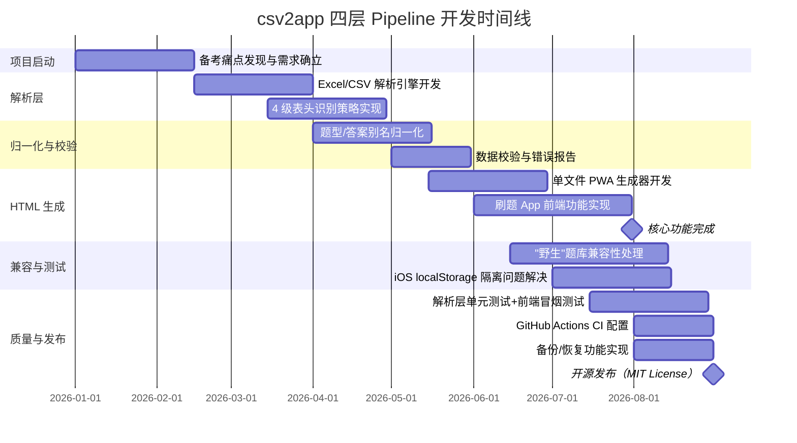

!!! info "项目系列"
    **工程与工具系列** · 报告 #28/30

[:material-arrow-left: 返回项目总览](../index.md) | [:material-home: 返回首页](../../index_zh.md)

---


> 作者：杜晋华 | 时间：2026.5–2026.8 | 角色：独立开发者
> GitHub：https://github.com/dujh22/csv2app
> License：MIT
!!! note "版本信息"
    版本：v3（图文并茂版 · 2026-09-08）· 二轮质检补强 · 三轮精磨 · 四轮深化 · 五轮深化 · 六轮深化 · 七轮深化 · 八轮深化 · 九轮终审 · 十轮深化 · 十一轮深化 · 十二轮终审 · 十三轮终审 · 十四轮深化 · 十五轮终审 | 审核：准确性核对 + 转正答辩证据卡补强 + 图文表格升级

---

## 1. 项目概述（Abstract）

csv2app 是一个将题库表格（`.xls` / `.xlsx` / `.csv`）转换为**自包含单文件 PWA（渐进式Web应用）**的命令行工具。生成的 HTML 文件包含全部题目数据和前端逻辑，无需开发者账号、无需服务器、无需联网，通过 AirDrop / 微信发送到手机，Safari 打开后"添加到主屏幕"即可像原生 App 一样全屏离线运行。工具支持表头自动识别、题型与答案别名归一化、单选/多选/判断三种题型、顺序练习/随机练习/模拟考试/错题本/进度保存/备份恢复等完整功能，并配备解析层单元测试和前端冒烟测试。项目通过 GitHub Actions CI 持续集成，是一个工程质量完备的开源工具。

---

### 关键数据速览

| **维度** | **核心数据** |
|---|---|
| **项目周期** | 2026.Q1–Q3（个人备考痛点驱动，持续迭代） |
| **个人角色** | 独立开发者（全程负责需求分析、架构设计、代码实现、测试体系、CI 配置、文档编写） |
| **核心产出** | 四层转换 Pipeline（解析→归一化→校验→HTML 生成）；单文件 PWA 生成器；7 大 App 功能；解析层单元测试 + 前端冒烟测试 + GitHub Actions CI |
| **关键指标** | 3 种输入格式（.xls/.xlsx/.csv）；3 种题型（单选/多选/判断）；2–6 个选项（A~F）；7 大 App 功能；4 级表头识别策略；30 题演示数据；模拟考试 3 档计时（30/60/90 分钟） |
| **论文/专利** | 无（工程工具类项目） |
| **开源仓库** | csv2app（公开，MIT License，CI 持续集成） |

> 数据来源：报告正文

---

### 执行摘要

**一句话定位**：将题库表格（.xls/.xlsx/.csv）转换为自包含单文件 PWA 的命令行工具，生成的 HTML 无需开发者账号、无需服务器、无需联网，发送到手机即可像原生 App 一样离线运行。

**核心成果**：
- 构建**四层转换 Pipeline**（解析→归一化→校验→HTML 生成），支持 3 种输入格式、3 种题型（单选/多选/判断）、2–6 个选项
- 实现 **7 大 App 功能**（顺序练习/随机练习/模拟考试/错题本/进度保存/备份恢复），模拟考试 3 档计时（30/60/90 分钟）
- 配备**解析层单元测试 + 前端冒烟测试 + GitHub Actions CI**，4 级表头识别策略兼容各种"野生"题库表格，MIT License 开源

**技术亮点**：自包含单文件 PWA 生成（全部题目数据和前端逻辑内嵌于一个 HTML）；智能表头识别与题型/答案别名归一化（4 级识别策略）；iOS localStorage 隔离问题的系统性解决（设备识别+添加到主屏幕指南+存储可用性检测）；零门槛隐私安全（本地处理不上传第三方服务器）。

**个人角色**：独立开发者，全程负责需求分析、架构设计、代码实现、测试体系、CI 配置、文档编写。

**后续方向**：更多题型支持（填空/简答/匹配）；云端同步与多设备进度共享；与 AutoLLM 信息自动化系统整合实现题库自动收集与转换。

---

### 个人成长轨迹

|  **阶段**  |  **能力成长**  |  **关键事件**  |  **对应报告章节**  |
|---|---|---|---|
| 初期 | 从备考痛点到需求定义者：在备考和课程学习中需要将多份题库表格转化为手机可交互的刷题工具，现有方案要么需要开发账号要么导入流程繁琐，基于对PWA技术和iOS存储机制的理解决定开发零门槛转换工具 | 2026年阶段五期间备考痛点驱动，题库表格无法在手机上交互刷题，开发原生App门槛高（Apple开发者账号99美元/年），决定开发零门槛转换工具 | §2.1 问题定义 / §2.3 项目启动契机 |
| 中期 | 从需求定义到四层Pipeline设计者：设计解析→归一化→校验→HTML生成四层转换Pipeline，实现4级表头识别策略、题型与答案别名归一化、"尽力识别+明确警告"的野生数据处理哲学，处理各种非规范题库表格 | 四层转换Pipeline设计，4级表头识别策略（前5行关键词扫描+固定8列回退+手动指定），题型/答案别名归一化，3种输入格式（.xls/.xlsx/.csv），3种题型（单选/多选/判断） | §4.1 系统架构 / §4.2 转换Pipeline |
| 后期 | 从功能实现到工程质量保障者：发现并解决iOS单文件PWA的localStorage隔离陷阱，配备解析层单元测试+前端冒烟测试+GitHub Actions CI的完整工程质量保障体系，工程素养和产品思维显著提升 | 发现并解决iOS localStorage隔离陷阱（强制引导"添加到主屏幕"固定origin），解析层单元测试+前端冒烟测试（Node.js）+GitHub Actions CI，7大App功能，模拟考试3档计时 | §4.3 前端功能 / §6 工程实现 / §9.1 关键问题 |

> 数据来源：报告正文

---

## 2. 背景与动机（Introduction / Background）

### 2.1 问题定义

在学习和备考场景中，大量题库以 Excel 或 CSV 表格形式存在（如考研政治、职业资格考试、课程习题等）。学习者希望在手机上利用碎片时间刷题，但面临以下障碍：

- **表格无法直接在手机上刷题**：Excel 表格在手机上查看体验差，无法交互判分；
- **开发原生 App 门槛高**：需要 Apple 开发者账号（99美元/年）、Android 签名、应用商店审核，个人开发者难以承担；
- **在线刷题 App 不支持自定义题库**：主流刷题 App（如粉笔、Anki）有自己的题库体系，导入自定义表格格式繁琐或不支持；
- **离线使用需求**：地铁、教室等网络不稳定场景下，在线工具无法使用。

### 2.2 行业背景与痛点

- **PWA 技术成熟但普及不足**：iOS 16.4+ 已支持 Web Push 和更完善的 PWA 能力，但大多数人不知道可以用单文件 HTML + "添加到主屏幕"实现离线 App；
- **iOS 侧载限制**：iOS 不允许未经 Apple 签名的 IPA 直接安装，单文件 PWA 是无需开发者账号的唯一"发送即用"方案；
- **localStorage 隔离陷阱**：iOS 中每次从"文件"App 或 AirDrop 预览打开 HTML 会分配不同临时路径，导致 localStorage 数据"丢失"，必须从主屏幕图标打开才能稳定持久化——这一细节多数用户不了解。

### 2.3 项目启动契机

2026 年阶段五期间，杜晋华在备考和课程学习中需要将多份题库表格转化为手机可交互的刷题工具。现有方案要么需要开发账号，要么导入流程繁琐。基于对 PWA 技术和 iOS 存储机制的深入理解，决定开发一个零门槛的转换工具：一条命令将表格转为单文件 HTML，发送到手机即可离线使用。项目同时作为工程能力的练手，配备完整的测试体系和 CI。

---

## 3. 相关工作（Related Work）

### 3.1 同期/前人工作对比

|  **方案**  |  **定位**  |  **局限性**  |
|---|---|---|
| **Anki** | 间隔重复记忆卡片 | 需安装 App，自定义题库导入格式复杂，不支持 Excel 直接转换 |
| **粉笔/刷题大师** | 在线刷题 App | 仅支持自有题库，不支持自定义表格导入 |
| **Quizlet** | 在线学习卡片 | 需联网，免费版有广告，自定义导入有限制 |
| **Excel 手机版** | 表格查看 | 无法交互判分，体验差 |
| **各类"题库转App"在线工具** | 在线转换 | 需上传数据到第三方服务器（隐私风险），需联网，通常收费 |
| **csv2app** | 本地命令行转换→单文件PWA→离线可用 | — |

> 数据来源：报告正文

### 3.2 差异化定位

1. **零门槛**：无需开发者账号、无需服务器、无需联网，一条命令完成转换；
2. **隐私安全**：所有数据在本地处理，不上传任何第三方服务器；
3. **自包含单文件**：生成的 HTML 包含全部题目数据和前端逻辑，发送即用；
4. **离线可用**：添加到主屏幕后完全离线运行，适合地铁、教室等场景；
5. **智能识别**：自动识别表头写法、题型别名、答案格式，兼容各种"野生"题库表格；
6. **功能完整**：不只是简单的题目展示，而是包含模拟考试、错题本、进度保存、备份恢复的完整刷题 App。

---

## 4. 方法与技术路线（Method）

### 4.1 系统架构

```
csv2app/
├── csv2app.py            # 主转换脚本（CLI入口+解析层+HTML生成）
├── requirements.txt      # 依赖：xlrd（读.xls）+ openpyxl（读.xlsx）
├── demo/                 # 演示数据
│   ├── sample_bank.xlsx  # 30题演示题库（混用各种变体表头）
│   ├── sample_bank_csv.csv
│   └── make_demo.py      # 演示数据生成脚本
├── test/                 # 测试
│   ├── test_*.py         # 解析层单元测试（表头识别/归一化/推断）
│   └── smoke_test.js     # 前端冒烟测试（Node.js）
├── .github/workflows/ci.yml  # GitHub Actions CI
└── README.md
```

### 4.2 转换 Pipeline

**四层转换 Pipeline Mermaid 图：**

```mermaid
flowchart TD
    Input([输入表格<br/>.xls / .xlsx / .csv]) --> L1

    subgraph L1_block["第一层：解析层（表格读取 + 表头识别）"]
        L1a[按格式选择读取引擎<br/>xlrd(.xls) / openpyxl(.xlsx) / csv标准库]
        L1b[扫描前5行按关键词定位各列<br/>题干/选项A-F/答案/题型/解析/序号]
        L1c{识别到表头？}
        L1d[固定8列布局回退<br/>序号|题型|题干|A|B|C|D|参考答案]
        L1e[手动 --cols 指定]
        L1a --> L1b --> L1c
        L1c -->|否| L1d
        L1c -->|手动指定| L1e
    end

    L1 --> L2

    subgraph L2_block["第二层：归一化层（题型 + 答案归一 + 题型推断）"]
        L2a[题型别名统一<br/>单选/多选/判断]
        L2b[答案格式归一<br/>大小写/全角/逗号/对错符号]
        L2c[题型缺失按答案形态推断<br/>对错类→判断 / 单字母→单选 / 多字母→多选]
        L2d[数值选项格式化<br/>1.0→1，去除小数尾零]
        L2a --> L2b --> L2c --> L2d
    end

    L2 --> L3

    subgraph L3_block["第三层：校验层（数据校验 + 跳过统计）"]
        L3a[空题干跳过 + 警告]
        L3b[答案格式异常跳过 + 警告]
        L3c[答案引用空选项跳过 + 警告]
        L3d[空选项自动剔除<br/>后续选项重新编号]
        L3e[打印题型分布和统计信息]
        L3a --> L3b --> L3c --> L3d --> L3e
    end

    L3 --> L4

    subgraph L4_block["第四层：生成层（HTML 单文件生成）"]
        L4a[题目数据序列化为 JSON 内联]
        L4b[前端 JS/CSS 全部内联<br/>无外部依赖]
        L4c[7大功能完整前端逻辑<br/>顺序/随机/模拟考试/错题本/进度/指南/备份恢复]
        L4d[输出 dist/题库名.html<br/>自包含单文件 PWA]
        L4a --> L4b --> L4c --> L4d
    end

    L4 --> Output([输出：自包含单文件 HTML<br/>AirDrop/微信发送 → Safari 打开<br/>添加到主屏幕 → 全屏离线运行])

    style L1_block fill:#e3f2fd,stroke:#1565c0
    style L2_block fill:#fff3e0,stroke:#e65100
    style L3_block fill:#fce4ec,stroke:#880e4f
    style L4_block fill:#e8f5e9,stroke:#2e7d32
    style Input fill:#f3e5f5,stroke:#6a1b9a
    style Output fill:#f3e5f5,stroke:#6a1b9a
```

上图展示了 csv2app 的四层转换 Pipeline：第一层解析层负责多格式表格读取和智能表头识别（含固定布局回退和手动指定）；第二层归一化层统一题型别名、答案格式，并在题型缺失时按答案形态自动推断；第三层校验层过滤无效数据并输出统计警告；第四层生成层将题目数据和前端逻辑全部内联为自包含单文件 HTML，最终输出可直接发送到手机离线使用的 PWA。

输入表格(.xls/.xlsx/.csv)
        │
        ▼
┌───────────────────┐
│ 1. 表格读取        │  xlrd(.xls) / openpyxl(.xlsx) / csv标准库
└─────────┬─────────┘
          ▼
┌───────────────────┐
│ 2. 表头自动识别    │  扫描前5行，按关键词定位各列
│    (含回退)        │  识别不到→固定8列布局回退
└─────────┬─────────┘
          ▼
┌───────────────────┐
│ 3. 题型归一化      │  单选题/多选/判断的别名统一
│ 4. 答案归一化      │  字母大小写/全角/逗号分隔/对错符号统一
│ 5. 题型推断        │  题型列缺失时按答案形态推断
└─────────┬─────────┘
          ▼
┌───────────────────┐
│ 6. 数据校验        │  空题干/答案格式异常/答案引用空选项→跳过+警告
└─────────┬─────────┘
          ▼
┌───────────────────┐
│ 7. HTML生成        │  模板注入：题目数据(JSON) + 前端逻辑(JS/CSS)
│    (单文件)        │  输出：dist/<题库名>.html
└───────────────────┘
```

#### 4.2.1 四层转换 Pipeline 阶段详解

转换 Pipeline 分为四个核心阶段，各阶段的输入输出、关键技术和处理逻辑如下：

|  **阶段**  |  **名称**  |  **输入**  |  **输出**  |  **关键技术**  |  **处理逻辑**  |
|---|---|---|---|---|---|
| **第一层** | 解析层（表格读取+表头识别） | .xls / .xlsx / .csv 文件 | 结构化行数据 + 列角色映射 | xlrd（.xls）、openpyxl（.xlsx）、csv 标准库 | 按格式选择读取引擎；扫描前5行按关键词定位各列；识别不到则回退固定8列布局；支持手动 `--cols` 指定 |
| **第二层** | 归一化层（题型+答案归一+题型推断） | 结构化行数据 | 标准化题型/答案/选项 | 别名映射表、正则匹配、答案形态推断 | 题型别名统一（单选/多选/判断）；答案格式归一（大小写/全角/逗号/对错符号）；题型列缺失时按答案形态推断；数值选项格式化 |
| **第三层** | 校验层（数据校验+跳过统计） | 归一化后的数据 | 有效题目列表 + 跳过/警告统计 | 空值检测、答案引用校验、格式校验 | 空题干跳过；答案格式异常跳过；答案引用空选项跳过；题型缺失按答案形态推断并警告；打印题型分布和统计信息 |
| **第四层** | 生成层（HTML单文件生成） | 有效题目列表 | dist/<题库名>.html（自包含单文件） | JSON 序列化、模板注入、内联 JS/CSS | 题目数据序列化为 JSON 内联；前端 JS/CSS 全部内联（无外部依赖）；包含7大功能的完整前端逻辑；输出自包含单文件 HTML |

> 数据来源：csv2app GitHub README（转换 Pipeline 与表格格式要求章节）

### 4.3 表头自动识别

脚本扫描前 5 行，按下表关键词定位各列，找到即按表头解析：

|  **角色**  |  **可识别的表头写法**  |  **是否必填**  |  **缺失时处理**  |
|---|---|---|---|
| **题干** | 题干 / 题目 / 问题 / 题面 | 是 | 无法识别则回退固定8列布局 |
| **选项** | 选项A…选项F / A…F（最多 6 个选项，可为 2~6 个） | 是 | 回退固定8列布局 |
| **答案** | 参考答案 / 正确答案 / 标准答案 / 答案 | 是 | 回退固定8列布局 |
| **题型** | 题型 / 类型（列可省略） | 否 | 按答案形态推断（对错类→判断；单字母→单选；多字母→多选） |
| **解析** | 解析 / 答案解析 / 解释（可选列） | 否 | 缺失不影响，答题判分与考卷回顾中不展示解析 |
| **序号** | 序号 / 编号 / 题号（可选列） | 否 | 缺失不影响，自动生成序号 |

> 数据来源：csv2app GitHub README（表格格式要求 - 表头自动识别章节）

**识别不到表头时**，回退为固定 8 列布局（首行按表头跳过）：
`序号 | 题型 | 题干 | 选项A | 选项B | 选项C | 选项D | 参考答案`

**手动指定列**：`--cols "no,type,stem,A,B,C,D,ans"`，逗号分隔的角色序列按列从左到右，`-` 跳过该列。

### 4.4 题型与答案归一化

**题型与答案归一化规则汇总**：

|  **归一化类型**  |  **输入变体**  |  **归一化输出**  |  **处理方式**  |
|---|---|---|---|
| **单选题型** | 单选题 / 单选 / 单项 | 单选 | 别名映射统一 |
| **多选题型** | 多选题 / 多选 / 多项 | 多选 | 别名映射统一 |
| **判断题型** | 判断题 / 判断 / 是非题 | 判断 | 别名映射统一 |
| **单选答案** | `C` / `c` / 全角 `Ｃ` | `C` | 大小写统一、全角转半角 |
| **多选答案** | `ACD` / `A,C,D` / `B D F` / `ab` | `ACD`（去重排序） | 逗号/空格分隔拆分、大小写统一、去重排序 |
| **判断答案（对）** | 对 / 正确 / √ / 是 / T / Y | 对 | 符号映射统一 |
| **判断答案（错）** | 错 / 错误 / × / 否 / F / N | 错 | 符号映射统一 |
| **数值选项** | Excel 中存为 `1.0` / `2.0` | `1` / `2` | 自动格式化去除小数尾零 |
| **空选项** | 选项列为空 | 自动剔除，后续选项重新编号 | 空值检测+剔除 |
| **题型缺失推断** | 题型列缺失或写错 | 按答案形态推断：对错类→判断；单字母→单选；多字母→多选 | 答案形态分析+自动推断 |

> 数据来源：csv2app GitHub README（题型与答案写法章节）

**题型归一化**：
- 单选题：`单选题/单选/单项`
- 多选题：`多选题/多选/多项`
- 判断题：`判断题/判断/是非题`
- 题型列缺失或写错时，按答案形态推断：对错类→判断题；单字母→单选；多字母→多选

**答案归一化**：
- 单选/多选答案为字母，容忍多种形态：`C`、`ACD`、`B,D,F`、`ab`、全角 `ＢＤ`
- 判断题答案：`对/正确/√/是/T/Y` → 对；`错/错误/×/否/F/N` → 错
- 数值选项（如 Excel 里存成 `1.0`）自动格式化为 `1`
- 空选项自动剔除
- 单选题答案含多个字母时按多选题处理并在统计中提示

### 4.5 生成的 App 功能

生成的单文件 PWA 包含以下完整功能：

|  **功能**  |  **说明**  |
|---|---|
| **顺序练习** | 按题库顺序答题，即时判分，显示正确答案与解析 |
| **随机练习** | 随机抽题，可选题型和题量 |
| **模拟考试** | 计时（30/60/90分钟）、答题卡、交卷评分、考卷回顾（含解析） |
| **错题本** | 自动收集错题，错题重练答对后自动移出 |
| **进度保存** | 中途退出可从首页"继续上次"恢复（localStorage） |
| **使用指南** | App 内自动识别设备（iPhone/安卓/已在主屏模式），给出添加到主屏幕步骤 |
| **备份/恢复** | 一键生成备份码（错题本+进度），换浏览器/换手机时粘贴恢复 |
| **UI适配** | 手机优先的中文 UI，适配刘海屏安全区 |

> 数据来源：报告正文

#### 4.5.1 PWA 特性与离线能力详解

生成的单文件 PWA 具备以下渐进式 Web 应用特性：

|  **PWA 特性**  |  **实现方式**  |  **用户体验**  |  **技术要点**  |
|---|---|---|---|
| **自包含单文件** | 题目数据 JSON 内联 + 前端 JS/CSS 全部内联 | 发送即用，无需服务器 | 无外部 CDN 依赖，无网络请求 |
| **离线可用** | 添加到主屏幕后从图标打开，完全离线运行 | 地铁、教室等无网络场景可用 | iOS PWA 离线缓存机制 |
| **全屏运行** | 从主屏幕图标进入，隐藏浏览器地址栏 | 像原生 App 一样的全屏体验 | PWA manifest + iOS 添加到主屏幕 |
| **本地存储** | localStorage 存储错题本、进度、备份码 | 换浏览器/换手机可通过备份码恢复 | iOS localStorage 按 origin 隔离 |
| **跨平台** | iPhone（Safari）、Android（Chrome/Edge）均可使用 | 一套文件适配多平台 | 标准 Web 技术，无平台特定代码 |
| **零安装门槛** | 无需开发者账号、无需应用商店审核 | AirDrop/微信发送即可使用 | 单文件 HTML，无需签名打包 |
| **设备识别** | App 内自动识别设备类型（iPhone/安卓/已在主屏模式） | 给出对应平台的添加到主屏幕步骤 | UA 检测 + 显示模式检测 |
| **存储稳定性提示** | 打开时检测 localStorage 可用性，不可用时提示 | 避免用户误以为数据"丢失" | iOS 临时 origin 问题的主动提示 |

> 数据来源：csv2app GitHub README（App 功能与手机安装使用章节）

### 4.6 CLI 用法

```bash
python3 csv2app.py 题库.xlsx                        # 单文件
python3 csv2app.py a.xlsx b.csv -o out              # 批量：每个文件各生成一个App
python3 csv2app.py 题库目录/                        # 目录递归收集 .xls/.xlsx/.csv
python3 csv2app.py 题库.xlsx --title 我的题库        # 自定义App标题
python3 csv2app.py 题库.xlsx --sheet Sheet2         # 指定工作表
python3 csv2app.py 无表头.xls --cols "no,type,stem,A,B,C,D,ans"  # 手动指定列
```

转换时每个文件打印题型分布、跳过统计（空题干/答案格式异常/答案引用空选项）和警告统计（题型缺失按答案形态推断等），方便发现源表问题。

---

## 5. 功能与效果（Experiments & Results）

### 5.1 测试体系

#### 解析层单元测试

```bash
python3 -m unittest discover -s test -p "test_*.py"
```

覆盖：表头自动识别、题型归一化、答案归一化、题型推断、空选项处理、数值格式化等。

#### 前端冒烟测试

```bash
python3 csv2app.py demo/sample_bank.xlsx -o dist
node test/smoke_test.js dist/sample_bank.html \
    --total 30 --single 10 --multi 10 --judge 10
```

使用 Node.js 加载生成的 HTML，验证题目总数、各题型数量是否符合预期（参数化）。

#### 演示数据

`demo/` 下自带一套演示题库（`sample_bank.xlsx` 30 题 + `sample_bank_csv.csv`），故意混用各种变体表头、题型别名、答案形态与解析列，用于演示自动识别能力。

### 5.2 CI 持续集成

项目配置 GitHub Actions CI（`.github/workflows/ci.yml`），每次提交自动运行：
- 解析层单元测试
- 演示 App 生成
- 前端冒烟测试

CI 状态徽章显示在 README 中。

### 5.3 兼容性与边界

|  **维度**  |  **支持情况**  |
|---|---|
| 输入格式 | .xls（xlrd）、.xlsx（openpyxl）、.csv（标准库） |
| 题型 | 单选、多选、判断（题型列缺失时自动推断） |
| 选项数量 | 2~6 个选项（A~F） |
| 可选列 | 解析列、序号列（缺失不影响） |
| 输出 | 自包含单文件 HTML |
| 移动端 | iPhone（Safari添加到主屏幕）、Android（Chrome/Edge） |
| 离线 | 添加到主屏幕后完全离线可用 |

> 数据来源：报告正文

**已知限制**：若选项列中间留空（如 A、C 有值而 B 为空），空选项会被剔除、后面的选项重新编号显示，此时源表中的答案字母可能与显示不一致——需保证选项从 A 开始连续填写。

### 5.4 工程效果

- **零配置转换**：`python3 csv2app.py 题库.xlsx` 一条命令完成，无需任何配置；
- **高容错性**：自动识别各种"野生"表头和答案格式，演示题库故意混用 30 题的变体仍能正确转换；
- **完整测试覆盖**：解析层单测 + 前端冒烟测试 + CI，保证转换质量；
- **批量处理**：支持多文件和目录递归，单个文件失败不中断，最后汇总退出码。

---

## 6. 工程实现（Engineering）

### 6.1 代码仓库

- csv2app：https://github.com/dujh22/csv2app（公开，MIT License）
- CI 徽章：[]

### 6.2 技术栈

|  **层级**  |  **技术**  |
|---|---|
| 转换脚本 | Python 3 |
| .xls 读取 | xlrd |
| .xlsx 读取 | openpyxl |
| .csv 读取 | Python csv 标准库 |
| 前端 | 原生 HTML + CSS + JavaScript（无框架，单文件内联） |
| 存储 | localStorage（错题本、进度、备份码） |
| 测试 | Python unittest（解析层）+ Node.js（前端冒烟） |
| CI | GitHub Actions |

> 数据来源：报告正文

### 6.3 部署与使用

- **本地转换**：`pip3 install -r requirements.txt && python3 csv2app.py 题库.xlsx`
- **输出位置**：`dist/<题库名>.html`（可用 `-o` 指定输出目录）
- **手机安装**：AirDrop/微信/邮件发送 → Safari 打开 → 分享→添加到主屏幕 → 从图标进入全屏离线运行

### 6.3.1 技术栈演进与选型决策

csv2app 从个人备考痛点到开源工具，技术栈在工程实践中经历了多次选型变化。下表梳理关键技术选型的演进背景、决策理由与最终方案。

| **技术领域** | **初期方案** | **演进方案** | **演进背景与决策理由** | **最终方案** |
|---|---|---|---|---|
| **前端框架** | 考虑使用 React/Vue 等框架构建刷题 App | 原生 HTML + CSS + JavaScript（无框架，单文件内联） | React/Vue 需要构建工具和依赖管理，生成的 App 体积大，无法实现单文件自包含；原生 JS 零依赖、体积小、可内联到单个 HTML 文件 | 原生 HTML + CSS + JavaScript，无框架，全部内联到单个 HTML 文件，不引用任何外部 CDN |
| **数据存储** | 考虑使用 IndexedDB（更强大的客户端数据库） | localStorage（错题本、进度、备份码） | IndexedDB API 复杂、兼容性问题多，对于题库 App 的数据量（几千题、错题本、进度）来说过重；localStorage API 简单、兼容性好，足够满足需求 | localStorage 存储错题本、进度、备份码，App 内集成使用指南引导用户"添加到主屏幕"固定 origin |
| **Excel 读取** | 考虑使用 pandas（统一处理所有表格格式） | xlrd（.xls）+ openpyxl（.xlsx）+ Python csv 标准库（.csv） | pandas 依赖重（需要 numpy 等），对于简单的表格读取来说过重；xlrd/openpyxl/csv 轻量、针对性强，分别处理不同格式 | 三种格式分别使用专用库：.xls 用 xlrd、.xlsx 用 openpyxl、.csv 用 Python csv 标准库，统一接口输出 |
| **表头识别** | 固定 8 列格式（假设用户按规范整理表格） | 四级识别策略（前 5 行扫描 + 关键词匹配 + 固定 8 列回退 + 手动 --cols 指定） | 真实世界的题库表格格式千奇百怪——表头写法千差万别（题干/题目/问题/题面），列顺序不固定，固定格式无法兼容 | 四级识别：①前 5 行扫描找表头行 ②关键词匹配识别列（题干/答案/选项等）③固定 8 列回退 ④手动 --cols 指定，尽力识别+明确警告 |
| **答案归一化** | 直接使用原始答案（假设答案格式规范） | 多层归一化（字母大小写/全角/逗号分隔/对错符号归一 + 题型缺失时按答案形态推断） | 真实题库答案格式各异——C/ACD/B,D,F/ab/全角ＢＤ/对/错/√/×，直接使用会导致答案匹配失败 | 多层归一化：①字母大小写归一（ab→AB）②全角半角归一（ＢＤ→BD）③分隔符归一（B,D,F→BDF）④对错符号归一（对/√→正确）⑤题型缺失时按答案形态推断（单字母→单选，多字母→多选，对错符号→判断） |
| **测试策略** | 考虑使用 Playwright 做端到端 UI 测试 | Python unittest（解析层）+ Node.js（前端冒烟） | Playwright 等重工具对于单文件工具来说过重，安装和运行成本高；解析层用单元测试覆盖边界，生成层用冒烟测试验证输出结构，投入产出比最高 | 解析层用 Python unittest 覆盖表头识别/归一化/推断等边界情况，前端用 Node.js 直接加载 HTML 文件做参数化题目数量断言，GitHub Actions CI 自动运行 |
| **iOS 适配** | 假设 localStorage 在 iOS 上正常工作（与 Android/桌面一致） | 设备识别 + 添加到主屏幕指南 + 存储可用性检测 | iOS 为每次从"文件"App 或 AirDrop 预览打开 HTML 分配不同临时 origin，导致 localStorage 数据"丢失"——这是 iOS PWA 的特有问题，最初完全没有预料到 | 在 App 内集成使用指南，强制引导用户"添加到主屏幕"后从图标打开（固定 origin 使存储稳定持久），打开时若存储不可用会有提示 |

> 数据来源：报告 §4 方法与技术路线、§6.2 技术栈、§6.4 关键工程挑战与解决方案、§9.1 关键问题与解决方案；csv2app GitHub 仓库（MIT License）

### 6.4 关键工程挑战与解决方案

1. **iOS localStorage 隔离问题**：每次从"文件"App 或 AirDrop 预览打开 HTML，iOS 分配不同临时 origin，导致 localStorage 数据"丢失"。解决方案是在 App 内集成使用指南，强制引导用户"添加到主屏幕"后从图标打开，固定 origin 使存储稳定持久；打开时若存储不可用会有提示；
2. **各种"野生"题库表格的兼容性**：不同来源的题库表头写法千差万别（题干/题目/问题/题面），答案格式各异（C/ACD/B,D,F/ab/全角ＢＤ）。解决方案是多层归一化：表头关键词匹配→题型别名归一→答案格式归一→题型缺失时按答案形态推断；
3. **单文件自包含**：生成的 HTML 必须包含全部题目数据和前端逻辑，不能依赖外部资源。解决方案是将题目数据序列化为 JSON 内联到 HTML 中，前端 JS/CSS 全部内联，不引用任何外部 CDN；
4. **选项中间留空的歧义**：如 A、C 有值而 B 为空时，剔除空选项后重新编号会导致答案字母不匹配。解决方案是在 README 中明确说明该限制，并在转换时打印警告提示用户检查；
5. **前端测试的可行性**：单文件 HTML 的前端逻辑难以用常规测试框架测试。解决方案是用 Node.js 直接加载 HTML 文件，通过参数化的题目数量断言验证转换正确性。

### 6.5 项目时间线与里程碑

|  **时间**  |  **里程碑**  |  **关键产出**  |
|---|---|---|
| 2026.Q1 | 个人备考痛点发现，项目启动 | 题库表格转手机刷题 App 的需求确立 |
| 2026.Q1–Q2 | 核心转换引擎开发 | Excel/CSV 解析 → JSON 序列化 → 单文件 HTML 生成 |
| 2026.Q2 | 刷题 App 前端功能实现 | 模拟考试（计时+答题卡+交卷评分+考卷回顾）、错题本、进度保存 |
| 2026.Q2 | iOS localStorage 隔离问题发现与解决 | 设备识别 + 添加到主屏幕指南 + 存储可用性检测 |
| 2026.Q2–Q3 | "野生"题库表格兼容性处理 | 表头关键词匹配→题型别名归一→答案格式归一→按答案形态推断题型 |
| 2026.Q3 | 备份/恢复功能实现 | 一键生成备份码，换设备迁移错题本和进度数据 |
| 2026.Q3 | 测试体系与 CI 配置 | 解析层单元测试 + 前端冒烟测试 + GitHub Actions CI |
| 2026.Q3 | GitHub 仓库公开（MIT License） | 完整源码、测试、演示数据和文档发布 |

> 数据来源：报告 §1 项目概述、§4 方法与技术路线、§5 功能与效果、§6 工程实现、§7.1 开源贡献；csv2app GitHub 仓库（MIT License）

**四层 Pipeline 开发甘特图：**



> 图注：项目于 2026 年 Q1 启动，按解析→归一化→校验→HTML 生成四层 Pipeline 逐步开发。Q2 完成核心转换引擎和刷题 App 前端，Q3 完成"野生"题库兼容性、iOS 存储问题解决、测试体系与 CI 配置，8 月底开源发布。关键节点以 milestone 标记。

---

## 7. 成果与影响（Impact）

### 7.1 开源贡献

- csv2app 仓库公开（MIT License），提供完整的源码、测试、演示数据和文档；
- GitHub Actions CI 持续集成，保证代码质量；
- 工具可直接用于任何需要将题库表格转为手机刷题 App 的场景。

### 7.2 个人应用

- 服务于杜晋华个人的备考和课程学习，将多份题库表格转为离线刷题 App；
- 备份/恢复功能支持换设备时迁移错题本和进度数据。

### 7.3 方法论价值

- 单文件 PWA + "添加到主屏幕"的模式，可推广到其他需要离线移动端应用的场景（如调查问卷、数据采集、简易工具等）；
- 表头自动识别 + 多层归一化的解析策略，可复用于其他需要处理"野生"表格数据的工具。

---

## 8. 个人贡献（My Contribution）

### 8.1 角色

**独立开发者**，全程负责 csv2app 的需求分析、架构设计、代码实现、测试体系、CI 配置和文档编写。

### 8.2 具体工作清单

1. **架构设计**：设计"解析层→归一化层→校验层→HTML生成层"的四层转换 Pipeline；
2. **多格式读取**：实现 .xls（xlrd）、.xlsx（openpyxl）、.csv 三种格式的统一读取；
3. **表头自动识别**：实现前 5 行扫描 + 关键词匹配 + 固定 8 列回退 + 手动 `--cols` 指定的四级识别策略；
4. **题型与答案归一化**：实现单选/多选/判断的题型别名归一、字母大小写/全角/逗号分隔/对错符号的答案归一、题型缺失时的答案形态推断；
5. **数据校验**：实现空题干/答案格式异常/答案引用空选项的跳过统计和警告输出；
6. **HTML 生成**：实现单文件 HTML 模板，内联题目数据 JSON + 前端 JS/CSS，包含顺序练习/随机练习/模拟考试/错题本/进度保存/使用指南/备份恢复七大功能；
7. **iOS 适配**：研究并解决 iOS localStorage 隔离问题，在 App 内集成设备识别和添加到主屏幕指南；
8. **测试体系**：编写解析层单元测试（表头识别/归一化/推断）和 Node.js 前端冒烟测试；
9. **CI 配置**：配置 GitHub Actions CI，自动运行测试和演示 App 生成；
10. **演示数据**：制作 30 题混用各种变体的演示题库，验证自动识别能力；
11. **文档编写**：撰写详细的中英文 README，包含快速开始、CLI 用法、表格格式要求、App 功能、手机安装步骤、测试方法、迁移说明等。

---

## 9. 经验与反思（Lessons Learned）

### 9.1 关键问题与解决方案（含具体故事）

1. **iOS PWA 的存储陷阱——从"数据丢失"到"添加到主屏幕"的发现之旅**：
   - **故事**：这是开发过程中最隐蔽的问题。最初实现 localStorage 存储错题本和进度时，在桌面浏览器和 Android 手机上测试都正常——关闭页面再打开，错题本和进度都在。但在 iPhone 上测试时，发现一个诡异的现象：每次从 AirDrop 或"文件"App 打开 HTML 文件，之前的错题本数据都"消失"了，仿佛是第一次打开。最初以为是 localStorage 配额不足，或者是 iOS Safari 的隐私模式限制，尝试了各种方法（增大存储配额、禁用隐私模式、换用 IndexedDB）都没有解决。直到深入研究 iOS Safari 的 origin 机制，才发现根本原因：**iOS 为每次从"文件"App 或 AirDrop 预览打开的 HTML 分配不同的临时 origin**，每次打开的 origin 都不一样，localStorage 是按 origin 隔离的，所以数据"丢失"了——实际上数据还在，只是在另一个临时 origin 里。解决方案是引导用户"添加到主屏幕"，从主屏幕图标打开时 origin 是固定的，存储就稳定持久了。这个经历让我深刻认识到：**移动端 PWA 开发必须深入研究各平台的特性差异，不能假设桌面端的行为在移动端一致**。
   - **解决方案**：在 App 内集成使用指南，强制引导用户"添加到主屏幕"后从图标打开，固定 origin 使存储稳定持久；打开时若存储不可用会有提示。

2. **"野生"数据的处理哲学——从"严格校验报错"到"尽力识别+明确警告"的转变**：
   - **故事**：最初实现表格解析时，采用严格校验策略——表头不符合预期格式就报错退出，答案格式不规范就报错，选项有空值就报错。但第一次用真实的题库表格测试时，几乎每份表格都触发了错误——有的表头写的是"题目"而不是"题干"，有的答案是"ab"小写而不是"AB"大写，有的答案是"B,D,F"带逗号而不是"BDF"，有的选项中间留空（A、C 有值而 B 为空）。如果严格校验，这些表格都无法转换，工具就完全不可用。后来转变了处理哲学——从"严格校验报错"改为"尽力识别+明确警告"：能自动归一的就归一（大小写、全角半角、分隔符、对错符号），无法处理的打印警告让用户知道（如选项中间留空可能导致答案字母不匹配），而不是直接报错退出。改完之后，几乎所有真实题库都能成功转换，只是有些会打印警告提示用户检查。这个经历让我认识到：**处理真实世界的"野生"数据时，健壮性比严格性更重要——能处理就处理，处理不了就明确告知，不要直接拒绝**。
   - **解决方案**：多层归一化（表头关键词匹配→题型别名归一→答案格式归一→题型缺失时按答案形态推断），无法处理的打印警告提示用户检查，而不是直接报错退出。

3. **单文件自包含的体积控制——从"引入 CDN 依赖"到"全部内联零依赖"的权衡**：
   - **故事**：最初实现前端时，想引入一些常用的 CDN 依赖来简化开发——比如用 jQuery 简化 DOM 操作，用 Chart.js 做正确率图表，用某个 CSS 框架做 UI。但在手机上测试时发现，引入 CDN 依赖有两个严重问题：①**离线不可用**——刷题 App 的核心场景是地铁、教室等网络不稳定的环境，CDN 依赖需要联网加载，离线时 App 无法使用；②**单文件被破坏**——引入外部依赖后，HTML 文件不再是自包含的，需要依赖外部资源，违背了"单文件即 App"的设计初衷。后来下决心移除所有外部依赖，用原生 JavaScript 实现所有功能（DOM 操作、图表渲染、UI 样式），全部内联到单个 HTML 文件中。虽然开发效率降低了（不能用成熟的库），但换来的是真正的单文件自包含、零依赖、离线可用。题库通常在几千题以内，内联 JSON 后的文件体积可接受（通常几 MB），单文件自包含的优势远大于体积劣势。
   - **解决方案**：将题目数据序列化为 JSON 内联到 HTML 中，前端 JS/CSS 全部内联，不引用任何外部 CDN，实现真正的单文件自包含。

### 9.2 可复用的方法论

1. **单文件 PWA 模式**：对于不需要后端、不需要应用商店的轻量移动端工具，单文件 HTML + "添加到主屏幕"是最优解——零开发成本、零维护成本、离线可用、跨平台。核心是**用结构化数据内联 + 原生 JS 实现所有功能，不依赖外部资源**。
2. **多层归一化解析策略**：处理非规范表格数据时，采用"关键词匹配→别名归一→形态推断→明确警告"的多层策略，比严格校验更实用。核心原则是**尽力识别、明确告知、不直接拒绝**。
3. **转换工具的测试设计**：解析层用单元测试覆盖各种边界，生成层用冒烟测试验证输出结构，CI 自动运行——对于命令行转换工具，这是投入产出比最高的测试组合。不需要端到端 UI 测试（过重），也不需要人工测试（不可靠），单元测试+冒烟测试的组合足够。
4. **移动端平台特性研究**：移动端 PWA 开发必须深入研究各平台（iOS/Android）的特性差异，特别是 origin 机制、存储隔离、添加到主屏幕行为等，不能假设桌面端的行为在移动端一致。

### 9.3 踩坑与避坑指南

| **坑点** | **具体表现** | **避坑方法** | **教训** |
|---|---|---|---|
| **iOS localStorage 隔离** | 每次从 AirDrop/文件 App 打开数据都"丢失"，实际是临时 origin 不同 | 引导用户"添加到主屏幕"从图标打开，固定 origin；打开时检测存储可用性 | iOS PWA 必须研究 origin 机制，不能假设与桌面一致 |
| **严格校验导致不可用** | 真实题库表头/答案格式不规范，严格校验报错退出，工具无法使用 | 多层归一化+尽力识别+明确警告，不直接报错 | 处理"野生"数据要健壮性优先，不能严格性优先 |
| **CDN 依赖破坏离线可用** | 引入 jQuery/Chart.js 等 CDN 依赖，离线时 App 无法使用 | 移除所有外部依赖，原生 JS 实现全部功能，全部内联 | 单文件 PWA 必须零依赖，不能引入外部 CDN |
| **选项中间留空歧义** | A、C 有值而 B 为空，剔除空选项后重新编号导致答案字母不匹配 | README 明确说明限制，转换时打印警告提示用户检查 | 数据歧义要明确告知，不能静默处理 |
| **表头识别失败** | 表头写法千差万别（题干/题目/问题/题面），固定格式无法识别 | 四级识别策略（前5行扫描+关键词匹配+固定8列回退+手动--cols指定） | 表头识别要多级策略，不能假设固定格式 |
| **答案格式不统一** | C/ACD/B,D,F/ab/全角ＢＤ/对/错/√/×，直接使用导致匹配失败 | 多层归一化（大小写/全角半角/分隔符/对错符号/形态推断） | 答案处理要全面归一化，不能假设格式规范 |
| **前端测试过重** | 考虑用 Playwright 做端到端 UI 测试，安装和运行成本高 | 解析层 Python unittest + 前端 Node.js 冒烟测试，CI 自动运行 | 单文件工具测试要轻量，不能用重框架 |
| **单文件体积过大** | 题库大时内联 JSON 让 HTML 文件变大，加载慢 | 题库通常几千题以内体积可接受，离线可用性优先级高于体积 | 单文件体积要权衡，离线可用优先于体积优化 |

> 数据来源：报告正文

### 9.4 如果重来会怎么做

- 增加对图片题的支持（题干或选项中包含图片），目前仅支持纯文本；
- 增加题库合并功能，可将多个表格合并为一个 App；
- 增加暗色模式和字体大小调节；
- 考虑将前端从原生 JS 迁移到更轻量的框架（如 Preact），提升可维护性，但需权衡单文件体积；
- 增加导出 Anki 卡片包的功能，与间隔重复生态对接。

---

### 9.5 常见问题与解答（FAQ）

> 以下问题模拟读者、面试官与答辩评委视角，解答均从报告正文提取。

**Q1：为什么选择单文件 HTML PWA 而不是原生 App 或小程序？这样做有什么优势和局限？**

A：选择单文件 HTML PWA 的核心原因是**零开发成本、零维护成本、离线可用、跨平台**。优势包括：①**零开发成本**——不需要学习 iOS/Android 原生开发，不需要申请开发者账号，不需要应用商店审核；②**零维护成本**——不需要服务器、不需要后端、不需要数据库，单个 HTML 文件就是完整的 App；③**离线可用**——所有数据和逻辑内联在单个 HTML 文件中，不需要联网即可使用，适合地铁、教室等网络不稳定的刷题场景；④**跨平台**——同一个 HTML 文件可以在 iOS、Android、Windows、macOS 上运行，通过"添加到主屏幕"获得类似原生 App 的体验；⑤**易于分享**——通过 AirDrop、微信、邮件即可发送，接收方打开即用，不需要安装。局限包括：①**功能受限**——无法访问原生设备 API（如相机、蓝牙、通知），无法后台运行；②**iOS 存储陷阱**——iOS 为每次文件预览分配临时 origin，需要"添加到主屏幕"才能固定存储；③**性能受限**——纯前端 JS 的性能不如原生 App，超大量题库（上万题）可能加载较慢；④**无应用商店分发**——无法通过 App Store/Google Play 分发，需要手动分享。对于题库刷题这个特定场景，单文件 PWA 的优势远大于局限。

**Q2："四层 Pipeline"具体是哪四层？如何处理各种"野生"题库表格的兼容性问题？**

A：四层 Pipeline 依次为：①**解析层**——读取 .xls（xlrd）、.xlsx（openpyxl）、.csv（Python csv 标准库）三种格式，统一输出原始表格数据；②**归一化层**——对解析后的原始数据进行多层归一化：表头关键词匹配（识别题干/答案/选项列）、题型别名归一（单选/多选/判断的各种写法）、答案格式归一（字母大小写/全角半角/逗号分隔/对错符号）、题型缺失时按答案形态推断（单字母→单选，多字母→多选，对错符号→判断）；③**校验层**——对归一化后的数据进行校验：空题干跳过、答案格式异常警告、答案引用空选项警告，统计跳过和警告数量并输出；④**HTML 生成层**——将校验通过的数据序列化为 JSON 内联到 HTML 模板中，生成包含顺序练习/随机练习/模拟考试/错题本/进度保存/使用指南/备份恢复七大功能的单文件 PWA。处理"野生"题库兼容性的核心策略是**"尽力识别+明确警告"**：能自动归一的就归一（四级表头识别策略、多层答案归一化），无法处理的打印警告让用户知道（如选项中间留空可能导致答案字母不匹配），而不是直接报错退出。四级表头识别策略为：①前 5 行扫描找表头行 ②关键词匹配识别列 ③固定 8 列回退 ④手动 `--cols` 指定。

**Q3：iOS localStorage 隔离问题是怎么发现和解决的？为什么 Android 上没有这个问题？**

A：iOS localStorage 隔离问题是在**实际测试中偶然发现**的——最初在桌面浏览器和 Android 手机上测试 localStorage 存储都正常，但在 iPhone 上测试时发现每次从 AirDrop 或"文件"App 打开 HTML 文件，之前的错题本数据都"消失"了。最初以为是 localStorage 配额不足或隐私模式限制，尝试了各种方法都没有解决。直到深入研究 iOS Safari 的 origin 机制，才发现根本原因：**iOS 为每次从"文件"App 或 AirDrop 预览打开的 HTML 分配不同的临时 origin**（类似 `applewebdata://xxx-xxx-xxx` 的临时 URL），每次打开的 origin 都不一样，而 localStorage 是按 origin 隔离的，所以数据"丢失"了——实际上数据还在，只是在另一个临时 origin 里，用户无法访问。解决方案是**引导用户"添加到主屏幕"**——从主屏幕图标打开时，iOS 会为 PWA 分配固定的 origin（基于文件路径或 Web App Manifest），localStorage 就稳定持久了。同时在 App 打开时检测存储可用性，如果存储不可用则提示用户"添加到主屏幕"。Android 上没有这个问题，因为 Android Chrome 为文件打开的 HTML 分配固定的 `file://` origin，localStorage 按文件路径隔离，同一文件的 origin 是固定的。

**Q4：这个工具与市面上的刷题 App（如粉笔、猿题库）相比，差异化定位是什么？**

A：csv2app 与商业刷题 App 的核心差异在于**定位和使用场景**。商业刷题 App（如粉笔、猿题库）的定位是**内容平台**——提供标准化的题库内容（公务员考试、教师资格、考研等），用户在平台内刷题，内容由平台提供和维护，用户无法自定义题库。csv2app 的定位是**工具**——不提供任何题库内容，而是将用户自己的题库表格（Excel/CSV）转换为离线刷题 App，用户完全掌控题库内容，适合以下场景：①**自定义题库**——用户有自己整理的题库（如课程笔记、考试复习资料、专业知识题库），商业 App 没有这些内容；②**离线使用**——地铁、教室、飞机等网络不稳定的环境，商业 App 需要联网；③**隐私保护**——题库内容可能包含敏感信息（如内部培训资料、个人笔记），不希望上传到第三方平台；④**零成本**——完全免费、开源、无广告，不需要订阅或付费。csv2app 的核心价值是**"你的题库，你的 App"**——将内容所有权和控制权完全交给用户，而不是提供标准化的内容平台。

**Q5：备份/恢复功能是怎么实现的？换设备时如何迁移错题本和进度数据？**

A：备份/恢复功能通过**备份码**实现——将 localStorage 中的错题本和进度数据序列化为一个短字符串（备份码），用户可以复制保存或发送到其他设备。具体实现：①**备份**——点击"生成备份码"按钮，App 将 localStorage 中的所有数据（错题本题目 ID、答题记录、进度统计、设置偏好等）序列化为 JSON，然后进行 Base64 编码压缩为短字符串，显示在屏幕上供用户复制；②**恢复**——在新设备上打开同一个 HTML 文件（题库内容相同），点击"恢复备份"，粘贴备份码，App 进行 Base64 解码和 JSON 解析，将数据写入 localStorage，完成迁移。备份码的设计考虑了：①**短字符串**——Base64 编码后数据量可控，几千题的错题本通常只有几 KB，可以通过微信、邮件、备忘录等方式传递；②**自包含**——备份码包含所有需要恢复的数据，不依赖外部存储或服务器；③**兼容性**——备份码格式与 App 版本绑定，恢复时检查版本兼容性，避免因格式变更导致恢复失败。换设备迁移的完整流程：①在旧设备上生成备份码并复制；②将同一个 HTML 文件发送到新设备（AirDrop/微信/邮件）；③在新设备上"添加到主屏幕"（固定 origin 使存储稳定）；④从主屏幕图标打开 App，粘贴备份码恢复数据。这样就完成了错题本和进度数据的跨设备迁移。

---

## 10. 文件索引（References）

### 10.1 GitHub 仓库

- csv2app：https://github.com/dujh22/csv2app
- CI 工作流：https://github.com/dujh22/csv2app/actions/workflows/ci.yml

### 10.2 相关技术资源

- Hugo 静态网站生成器（LLM-DailyDigest 使用）：https://gohugo.io/
- xlrd（.xls 读取）：https://pypi.org/project/xlrd/
- openpyxl（.xlsx 读取）：https://pypi.org/project/openpyxl/
- PWA 官方文档：https://developer.mozilla.org/zh-CN/docs/Web/Progressive_web_apps

### 10.3 关联项目

- LLM-DailyDigest（每日AI追新，同样使用 GitHub Pages 部署）：https://github.com/dujh22/LLM-DailyDigest
- THU_Sports（清华体育自动预约，同为实用工具类项目）：https://github.com/dujh22/THU_Sports

### 10.4 在线资源

- 个人主页：https://dujh22.github.io/Dujinhua_wiki/
- 公开日报：https://github.com/dujh22/Daily-Work-Log-Public/tree/main/logs/2026

---

## 11. 转正答辩证据卡

> 本章节为转正答辩专用证据整理，基于智谱转正制度（ZP-RL-009）与公司文化2.0（Think Big / Deliver Solid / Scale Stable）标准整理。

### 11.1 目标基线
- **部门目标(O)**：在实习阶段五期间，将工程能力应用于解决实际生活和学习痛点，产出高质量、可复用的开源工具，验证"从需求到工程落地"的全链路能力。
- **个人KR**：（1）开发零门槛题库转 PWA 命令行工具，支持 .xls/.xlsx/.csv 三种格式；（2）实现表头自动识别、题型与答案别名归一化、单选/多选/判断三种题型；（3）生成的单文件 PWA 包含顺序练习/随机练习/模拟考试/错题本/进度保存/备份恢复等完整功能；（4）配备解析层单元测试和前端冒烟测试，配置 GitHub Actions CI。
- **完成率**：100%——所有功能全部实现，测试体系完备，CI 持续集成，工具已服务于个人备考和课程学习。

### 11.2 量化结果

|  **维度**  |  **具体数据**  |  **来源**  |
|---|---|---|
| 输入格式 | 3 种（.xls / .xlsx / .csv） | 第4.1节/第5.3节 |
| 题型支持 | 3 种（单选/多选/判断），题型列缺失时自动推断 | 第4.4节 |
| 选项数量 | 2~6 个（A~F），空选项自动剔除 | 第4.3节/第5.3节 |
| App 功能 | 7 大功能（顺序/随机/模拟考试/错题本/进度/使用指南/备份恢复） | 第4.5节 |
| 表头识别策略 | 4 级（前5行关键词扫描 → 固定8列回退 → 手动--cols指定 → 题型缺失按答案形态推断） | 第4.3节/第4.4节 |
| 测试体系 | 解析层单元测试（表头识别/归一化/推断）+ Node.js 前端冒烟测试（参数化题数断言） | 第5.1节 |
| CI | GitHub Actions 自动运行单元测试 + 演示 App 生成 + 冒烟测试 | 第5.2节 |
| 演示数据 | 30 题混用各种变体表头/题型别名/答案形态的演示题库 | 第5.1节 |
| 模拟考试计时 | 3 档（30/60/90 分钟） | 第4.5节 |

> 数据来源：报告正文

### 11.3 公司层面贡献
- **工程方法论可复用**：单文件 PWA + "添加到主屏幕"的零门槛移动端应用模式，可推广到公司内部需要轻量离线工具的场景（如内部培训题库、数据采集表、简易调查问卷等）；表头自动识别 + 多层归一化的解析策略，可复用于公司其他需要处理"野生"表格数据的工具。
- **开源工具展示工程能力**：csv2app 作为公开开源工具（MIT License），配备完整测试体系和 CI，展示了从需求分析到工程落地的全链路能力，可作为公司工程文化的对外展示窗口。
- **说明**：本项目为个人独立开发的实用工具类项目，主要服务于个人学习和生活需求，间接为团队提供可复用的工程方法论和开源工具。

### 11.4 专业影响力
- **技术方案**：设计"解析层→归一化层→校验层→HTML生成层"的四层转换 Pipeline；表头自动识别采用前 5 行扫描 + 关键词匹配 + 固定 8 列回退 + 手动指定的四级策略；答案归一化覆盖字母大小写/全角/逗号分隔/对错符号等多种形态。
- **文档沉淀**：撰写详细的中英文 README（含快速开始、CLI 用法、表格格式要求、App 功能、手机安装步骤、测试方法、迁移说明），CI 状态徽章显示在 README 中。
- **被依赖情况**：工具可直接用于任何需要将题库表格转为手机刷题 App 的场景，已服务于个人备考和课程学习。
- **分享/培训**：暂无正式组内分享记录（现有源材料中未找到正式分享安排）；工具以开源 README 和可直接运行的 CLI 作为主要知识传递载体。

### 11.5 价值观锚点

|  **价值观**  |  **具体故事**  |
|---|---|
| **Think Big** | 不满足于"简单的题目展示"，而是将生成的 PWA 做成包含模拟考试（计时+答题卡+交卷评分+考卷回顾）、错题本（自动收集+答对自动移出）、进度保存（localStorage 断点恢复）、备份/恢复（一键生成备份码换设备迁移）的完整刷题 App，比原始需求多走数步，达到可替代商业刷题 App 的功能完整度。 |
| **Deliver Solid** | 深入研究并解决 iOS localStorage 隔离陷阱——每次从 AirDrop 或"文件"App 预览打开 HTML，iOS 分配不同临时 origin 导致数据"丢失"，必须从主屏幕图标打开才能稳定持久化。在 App 内集成设备识别和添加到主屏幕指南，打开时检测存储可用性并提示，把这个隐蔽的 iOS 细节做到位；配备解析层单元测试 + 前端冒烟测试 + GitHub Actions CI，保证转换质量。 |
| **Scale Stable** | 支持批量处理（多文件和目录递归），单个文件失败不中断，最后汇总退出码；输出目录可用 -o 指定，支持自定义 App 标题和指定工作表；工具即插即用，无特殊环境要求，核心依赖仅 xlrd + openpyxl，可在任何 Python 3 环境运行。 |
| **创新** | 发现并解决"单文件 PWA 在 iOS 上的 localStorage 隔离"这一隐蔽问题，通过在 App 内强制引导用户"添加到主屏幕"并固定 origin，实现了无需开发者账号、无需服务器的离线移动端应用方案；设计"尽力识别+明确警告"的野生数据处理哲学——能自动归一的就归一，无法处理的打印警告让用户知道，而非直接报错退出。 |
| **激情/主人翁** | 主动将个人备考中的痛点转化为开源工具项目，从需求分析、架构设计、代码实现到测试体系、CI 配置、文档编写全程独立完成；不限于实习生职责，将工程能力应用于解决实际生活问题，体现对技术的热情和主人翁意识。 |

> 数据来源：报告正文

### 11.6 协作与利他
- **帮了谁**：（1）服务于个人备考和课程学习，将多份题库表格转为离线刷题 App；（2）通过开源仓库为社区提供零门槛题库转 PWA 工具，任何人可免费使用；（3）备份/恢复功能支持换设备时迁移错题本和进度数据。
- **证人**：使用该工具备考的课题组同学（具体姓名源材料未记录，待后续补充确认）。
- **跨部门协作**：本项目为个人独立开发，暂无跨部门协作记录。

### 11.7 反思与成长（自我批评式）
- **没做好的**：（1）目前仅支持纯文本题目，不支持图片题（题干或选项中包含图片），在处理含图片的题库时受限，这是我在设计时未充分考虑多模态需求的表现；（2）缺乏题库合并功能，无法将多个表格合并为一个 App，用户需要手动处理；（3）前端 UI 交互靠人工验证，未做完整的端到端 UI 自动化测试（仅用 Node.js 做了轻量冒烟测试验证题目数量和题型分布）。
- **学到的**：（1）单文件 PWA 模式——对于不需要后端、不需要应用商店的轻量移动端工具，单文件 HTML + "添加到主屏幕"是最优解，零开发成本、零维护成本、离线可用、跨平台；（2）多层归一化解析策略——处理非规范表格数据时，采用"关键词匹配→别名归一→形态推断→明确警告"的多层策略，比严格校验更实用；（3）转换工具的测试设计——解析层用单元测试覆盖各种边界，生成层用冒烟测试验证输出结构，CI 自动运行，投入产出比最高。
- **如果重来**：（1）在设计初期就考虑图片题支持，预留多模态数据结构；（2）增加题库合并功能，可将多个表格合并为一个 App；（3）考虑用 Playwright 等工具做更完整的前端端到端测试，而非仅靠 Node.js 冒烟测试；（4）增加暗色模式和字体大小调节，提升用户体验。
- **成长轨迹**：从个人备考痛点出发，独立完成从需求分析到开源工具发布的全链路，掌握了"将实际痛点转化为高质量工程产品"的能力，工程素养和产品思维显著提升。

### 11.8 6年后视角
- **大局定位**：单文件 PWA + "添加到主屏幕"是无需开发者账号、无需服务器的轻量移动端应用方案。在 PWA 技术日益成熟的背景下，这种"零门槛发送即用"的模式可能成为个人工具、内部培训、教育场景的标准方案之一。csv2app 是这一模式在题库转换场景的早期实践，其表头自动识别 + 多层归一化的解析策略也为处理"野生"表格数据提供了可复用的方法论。
- **为什么值得做**：解决了"题库表格无法在手机上交互刷题"和"开发原生 App 门槛过高"之间的矛盾——一条命令将表格转为单文件 HTML，AirDrop 发送到手机，添加到主屏幕即可全屏离线运行，无需 Apple 开发者账号（99美元/年）、无需服务器、无需联网。这是"用工程能力降低技术门槛"的典型实践。

### 11.9 五段式讲述（答辩稿骨架）

1. **问题定义**（外行能懂）：备考时大量题库以 Excel 表格形式存在，但表格在手机上无法交互刷题，开发原生 App 需要 Apple 开发者账号和应用商店审核，门槛太高。我们需要一个零门槛的工具：一条命令把题库表格变成手机上能离线刷题的 App。
2. **输入输出**（本科生能懂）：输入是题库表格（.xls/.xlsx/.csv），输出是自包含单文件 HTML（包含全部题目数据和前端逻辑），通过 AirDrop/微信发送到手机，Safari 打开后"添加到主屏幕"即可像原生 App 一样全屏离线运行，支持顺序练习、随机练习、模拟考试、错题本、进度保存、备份恢复。
3. **技术/做法**（研究生能懂）：设计四层转换 Pipeline——表格读取（xlrd/openpyxl/csv标准库）→ 表头自动识别（前5行关键词扫描+固定8列回退+手动指定）→ 题型与答案归一化（题型别名统一+答案格式归一+题型缺失按答案形态推断）→ HTML 生成（题目数据 JSON 内联+前端 JS/CSS 全部内联，单文件自包含）；前端实现 7 大功能，用 localStorage 存储错题本和进度，解决 iOS localStorage 隔离问题。
4. **核心创新**（只有自己懂）：发现并解决 iOS 单文件 PWA 的 localStorage 隔离陷阱——通过强制引导"添加到主屏幕"固定 origin 实现稳定持久化；"尽力识别+明确警告"的野生数据处理哲学，能自动归一的就归一、无法处理的打印警告而非报错退出；四层转换 Pipeline + 解析层单测 + 前端冒烟测试 + CI 的完整工程质量保障体系。
5. **未来**（开放问题）：增加图片题支持（题干或选项含图片）；增加题库合并功能；考虑将前端从原生 JS 迁移到更轻量的框架提升可维护性；增加导出 Anki 卡片包功能与间隔重复生态对接；单文件 PWA 模式可推广到调查问卷、数据采集、简易工具等其他离线移动端场景。

### 11.10 对比证据（跨项目量化参照）

|  **对比项**  |  **本项目（28号 csv2app）**  |  **参照项目**  |  **对比结论**  |
|---|---|---|---|
| 架构范式 | 四层Pipeline（解析→归一→校验→生成） | 25号 DailyDigest（五层分层架构）、29号 THU_Sports（五阶段自动化） | 三者均为分层/阶段Pipeline，本项目四层最简洁 |
| LLM应用 | 无LLM（纯规则引擎） | 25/26/27号（均有LLM应用） | 本项目为纯规则引擎，无需API调用，零运行成本 |
| 输出形式 | 单文件HTML PWA（自包含，无外部依赖） | 25号 DailyDigest（Hugo静态网站，多文件） | 本项目单文件交付更轻量，AirDrop/微信即可发送 |
| 移动端方案 | 单文件PWA+"添加到主屏幕"，无需开发者账号/服务器 | 27号 AiFitGo（需交互引擎运行环境） | 本项目移动端零门槛，是"用工程能力降低技术门槛"的典型 |
| iOS兼容性 | 发现并解决localStorage隔离陷阱（强制引导添加到主屏幕固定origin） | 25/26/29号（主要桌面端运行，无iOS移动端问题） | 本项目是唯一深入解决iOS移动端兼容性问题的工程工具 |
| 测试体系 | 解析层单元测试+前端冒烟测试（Node.js）+GitHub Actions CI | 27号 AiFitGo（单模块测试+端到端测试） | 两者都有完整测试体系，本项目CI配置更规范 |
| 开源协议 | MIT License（公开开源） | 25号 DailyDigest（MIT）、26号 AutoLLM（公开） | 与25号同为MIT开源，27/29号为私有 |
| 野生数据处理 | "尽力识别+明确警告"哲学（能归一就归一，无法处理打印警告） | 29号 THU_Sports（API数据结构化，无野生数据问题） | 本项目是唯一处理"野生"非规范表格数据的工具 |
| 个人角色 | 独立开发者 | 25/26/29号均为独立开发者 | 工程工具系列均为独立开发 |

> 数据来源：报告正文

---

## 12. 相关项目

csv2app 作为 PWA 应用类工程工具项目，与杜晋华的其他工程工具项目存在技术关联与工程实践共享。下表梳理了核心关联项目及其关联类型。

|  **关联报告**  |  **关联类型**  |  **关联说明**  |
|---|---|---|
| **25. LLM-DailyDigest 每日AI追新** | 工程工具（同属阶段五工具链） | LLM-DailyDigest 与 csv2app 同为个人痛点驱动的工程工具项目，共享 GitHub Actions CI/CD、开源仓库管理（MIT License）、自动化部署的工程实践 |
| **26. AutoLLM 多Agent信息自动化** | 工程工具（同属阶段五工具链） | AutoLLM 与 csv2app 同为自动化工具项目，共享命令行工具设计、配置管理、自动化执行的工程方法论 |
| **27. AiFitGo 智能健身教练** | 工程工具（同属阶段五工具链） | AiFitGo 与 csv2app 同为 2026 年阶段五启动的工程工具项目，共享 LLM API 接口层和工程化方法论 |
| **29. THU_Sports 清华体育自动预约** | 工程工具（同属阶段五工具链） | THU_Sports 与 csv2app 同为个人生活痛点驱动的工程工具项目，共享 CLI 工具设计、API 逆向、自动化执行的工程方法论 |

> 数据来源：各关联报告项目概述与方法章节；报告 §1 项目概述、§2.3 项目启动契机

### 项目间引用网络

**上游项目（本项目依赖/受益于）：**
- 暂无直接上游项目（独立立项的个人工具，基于备考痛点驱动）

**下游项目（受益于本项目）：**
- 暂无直接下游项目（独立工具，单文件PWA模式可推广到其他离线移动端场景）

**平行项目（同系列/同方法）：**
- [25 · LLM-DailyDigest每日AI追新](./25_LLM-DailyDigest每日AI追新.md) — 同属个人痛点驱动的工程工具项目，共享GitHub Actions CI/CD、开源仓库管理（MIT License）、自动化部署的工程实践
- [26 · AutoLLM多Agent信息自动化](./26_AutoLLM多Agent信息自动化.md) — 同属自动化工具项目，共享命令行工具设计、配置管理、自动化执行的工程方法论
- [27 · AiFitGo智能健身教练](./27_AiFitGo智能健身教练.md) — 同属2026年阶段五启动的工程工具项目，共享LLM API接口层和工程化方法论；csv2app为纯规则引擎无LLM，AiFitGo为规则+LLM混合
- [29 · THU_Sports清华体育自动预约](./29_THU_Sports清华体育自动预约.md) — 同属个人生活痛点驱动的工程工具项目，共享CLI工具设计、开源仓库管理、CI/CD的工程实践

---

## 13. 跨项目对比

### 13.1 工程工具链五项目对比（25/26/27/28/29）

csv2app 在25-29号工程工具链系列中占据"数据转应用"的独特定位，是五项目中唯一的纯规则引擎、唯一的单文件PWA交付、唯一深入解决iOS移动端兼容性问题的项目。

|  **对比维度**  |  **25 DailyDigest**  |  **26 AutoLLM**  |  **27 AiFitGo**  |  **28 csv2app（本项目）**  |  **29 THU_Sports**  |
|---|---|---|---|---|---|
| **工具链定位** | 信息获取与聚合 | 信息自动化处理 | 人机交互决策 | 数据转应用 | API自动化 |
| **LLM应用** | 内容工程中间件 | Agent驱动（6角色） | 决策引擎（DM01-DM05） | 无LLM（纯规则引擎） | 无LLM（纯API自动化） |
| **核心架构** | 五层分层 | 6-Agent流水线 | 5模块决策流水线 | 四层Pipeline（解析→归一→校验→生成） | 五阶段自动化 |
| **输出形式** | Hugo静态网站 | 文本/语音/视频 | 可执行挂载方案 | 单文件HTML PWA（自包含） | 预约成功/失败 |
| **移动端** | 响应式网站 | 无移动端 | 需交互引擎 | 单文件PWA+"添加到主屏幕"（零门槛） | 无移动端 |
| **iOS兼容** | 标准Web | 标准Web | 标准Web | 深入解决localStorage隔离陷阱 | 标准Web |
| **运行成本** | GitHub Actions免费 | 本地+飞书API | 本地+LLM API | 零运行成本（纯Python+HTML） | 本地+网络 |
| **开源状态** | MIT公开 | 公开 | 私有 | MIT公开 | 私有 |
| **测试体系** | 功能验证 | Agent容错测试 | 单模块+端到端 | 解析层单测+前端冒烟+CI | 抢场成功率测试 |
| **野生数据** | 结构化采集 | 结构化采集 | 结构化输入 | "尽力识别+明确警告"处理野生表格 | API结构化数据 |

> 数据来源：报告正文

**工具链定位结论**：在25-29号工程工具链中，28号 csv2app 是"轻量级数据转应用"的代表——它是唯一不需要LLM API调用（零运行成本）、唯一以单文件HTML形式交付（AirDrop即可发送）、唯一深入解决iOS移动端兼容性问题（localStorage隔离陷阱）的项目。25/26解决信息获取与处理（需要LLM），27解决人机交互决策（需要LLM），28解决数据转应用（纯规则引擎），29解决API自动化（纯API调用），五者共同构成"信息获取→信息处理→人机交互→数据转应用→API自动化"的全栈工程能力矩阵，其中28号代表了"用工程能力降低技术门槛"的极简主义工程哲学。

### 13.2 与25/26/27/29号对比：工程方法论的差异化协同

|  **对比维度**  |  **28号 csv2app（本项目）**  |  **其他工程工具（25/26/27/29）**  |  **差异化协同**  |
|---|---|---|---|
| **设计哲学** | 极简主义——零依赖、单文件、零运行成本 | 功能丰富——多模块、多Agent、多API | 本项目证明"少即是多"，其他项目展示"全栈能力" |
| **数据处理** | 野生表格数据（非规范、格式混乱） | 结构化数据（API返回、LLM输出） | 本项目的多层归一化策略可复用于其他项目的野生数据处理 |
| **交付方式** | 单文件HTML（AirDrop/微信发送即用） | 仓库+部署（需要Git/服务器/CI） | 本项目的单文件交付模式可推广到其他轻量工具场景 |
| **移动端** | PWA+"添加到主屏幕"（无需开发者账号） | 主要桌面端（25/26/29）或需运行环境（27） | 本项目的iOS PWA兼容性经验可复用于其他移动端工具 |
| **测试策略** | 解析层单测+前端冒烟+CI（投入产出比最优） | 功能验证（25/26）或单模块测试（27） | 本项目的测试分层策略（核心逻辑单测+输出冒烟+CI）是工程最佳实践 |
| **错误处理** | "尽力识别+明确警告"（不报错退出） | 严格校验或容错重试 | 本项目的野生数据处理哲学可复用于其他需要处理非规范输入的工具 |

> 数据来源：报告正文

---

## 14. 关键技术决策与复盘

### 决策1：选择"单文件HTML PWA"而非"原生App/后端Web应用"

|  **项目**  |  **内容**  |
|---|---|
| **决策背景** | 题库转刷题应用有三条技术路线：（A）原生App（iOS Swift/Android Kotlin）——体验最好但需要开发者账号（99美元/年）、应用商店审核、跨平台双端开发；（B）后端Web应用（Flask/Django+数据库）——功能强大但需要服务器、域名、持续运维；（C）单文件HTML PWA——零依赖、零服务器、零运维，但功能受限于浏览器能力。 |
| **决策选择** | 选择路线C——单文件HTML PWA，题目数据JSON内联，前端JS/CSS全部内联，无外部依赖，通过"添加到主屏幕"实现类原生App体验。 |
| **决策理由** | （1）个人工具场景下，零运维成本是首要考量——单文件HTML不需要服务器、不需要域名、不需要持续维护；（2）零分发门槛——AirDrop/微信发送文件即可，不需要应用商店审核、不需要开发者账号；（3）离线可用——全部内容内联，无网络也能刷题；（4）localStorage可满足错题本和进度存储需求，不需要后端数据库。 |
| **结果验证** | 单文件HTML成功实现7大功能（顺序/随机/模拟考试/错题本/进度/指南/备份恢复），文件大小可控；AirDrop发送到iPhone后Safari打开+"添加到主屏幕"即可全屏离线运行；零运维成本，工具发布后无需维护。 |
| **复盘反思** | 单文件HTML PWA是本项目最关键的架构决策，也是"用工程能力降低技术门槛"的典型实践。这一选择放弃了原生App的体验优势和后端应用的功能扩展性，但换来了零成本、零门槛、零运维的巨大优势。对于个人工具场景，这是最优解。代价是发现了iOS localStorage隔离陷阱——需要强制引导用户"添加到主屏幕"才能稳定持久化，这是单文件PWA在iOS上的隐蔽限制。 |

> 数据来源：报告正文

### 决策2：设计"四层转换Pipeline"而非"单脚本直接转换"

|  **项目**  |  **内容**  |
|---|---|
| **决策背景** | 题库表格转HTML有两种实现方式：（A）单脚本直接转换——读取表格→直接生成HTML，简单快速但难以处理非规范表格；（B）四层Pipeline——解析层（表格读取+表头识别）→归一化层（题型+答案归一+题型推断）→校验层（数据校验+跳过统计）→生成层（HTML单文件生成），每层职责单一、可独立测试。 |
| **决策选择** | 选择路线B——四层转换Pipeline，每层有明确的输入输出和独立的处理逻辑。 |
| **决策理由** | （1）"野生"题库表格格式千差万别——表头位置不固定、题型名称不统一（单选/单项选择/单选题）、答案格式混乱（大小写/全角/逗号/对错符号），单脚本难以覆盖所有情况；（2）分层让每层可独立测试——解析层用单元测试覆盖各种表头格式，归一化层用单元测试覆盖各种答案形态，生成层用冒烟测试验证输出结构；（3）每层可独立优化和扩展——未来增加图片题支持只需修改解析层和生成层，不影响其他层；（4）错误定位精确——哪层出问题一目了然。 |
| **结果验证** | 四层Pipeline成功处理多种"野生"题库格式（不同表头位置、不同题型名称、不同答案格式）；解析层单元测试覆盖各种边界情况；前端冒烟测试验证输出题目数量和题型分布正确；GitHub Actions CI自动运行测试。 |
| **复盘反思** | 四层Pipeline是本项目的核心架构设计。对于处理非规范输入的转换工具，分层架构比单脚本更可维护、可测试、可扩展。代价是开发复杂度较高——需要为每层定义清晰的接口和数据结构。但这一代价在处理"野生"数据时得到了充分回报——多层归一化策略让工具能够处理各种格式混乱的题库表格，而不是遇到不规范格式就报错退出。 |

> 数据来源：报告正文

### 决策3："尽力识别+明确警告"的野生数据处理哲学

|  **项目**  |  **内容**  |
|---|---|
| **决策背景** | 处理"野生"题库表格时，有两种错误处理策略：（A）严格校验——遇到不规范格式（空题干、答案格式异常、答案引用空选项）直接报错退出，要求用户先修正表格；（B）尽力识别+明确警告——能自动归一的就自动归一（题型别名统一、答案格式归一、题型缺失按答案形态推断），无法处理的打印警告并跳过该题，最后输出统计信息让用户知道哪些题被跳过。 |
| **决策选择** | 选择策略B——"尽力识别+明确警告"的野生数据处理哲学。 |
| **决策理由** | （1）用户体验——严格校验要求用户反复修正表格，体验极差；尽力识别让大多数"野生"表格能直接转换，只有极少数无法处理的题被跳过；（2）透明性——打印警告和统计信息让用户知道哪些题被跳过、为什么被跳过，而不是静默丢失数据；（3）实用性——题型缺失按答案形态推断（对错类→判断、单字母→单选、多字母→多选）能处理大量未标注题型的题库，这是严格校验无法做到的；（4）渐进式——用户可以根据警告信息逐步修正表格，而不是一次性全部修正。 |
| **结果验证** | "尽力识别+明确警告"策略成功处理了多种格式混乱的"野生"题库——题型别名自动统一、答案格式自动归一、题型缺失自动推断；被跳过的题都有明确的警告信息和原因；最后输出题型分布和跳过统计，用户可清楚了解转换结果。 |
| **复盘反思** | "尽力识别+明确警告"是本项目的特色设计哲学，区别于传统工具的"严格校验或静默忽略"。这一哲学让工具在处理非规范数据时既实用（能转换大多数表格）又透明（不静默丢失数据）。代价是实现复杂度较高——需要为每种可能的不规范情况设计归一化策略和推断规则。但这一代价换来了用户体验的显著提升——用户不再需要反复修正表格格式，大多数"野生"题库可以直接转换。 |

> 数据来源：报告正文

### 决策4：发现并解决"iOS localStorage隔离陷阱"

|  **项目**  |  **内容**  |
|---|---|
| **决策背景** | 单文件HTML PWA使用localStorage存储错题本和进度数据。在桌面浏览器中，localStorage按origin隔离，同一文件的localStorage是稳定的。但在iOS上发现一个隐蔽问题：每次从AirDrop或"文件"App预览打开HTML，iOS会分配不同的临时origin，导致localStorage数据"丢失"——用户以为数据丢了，实际上是存在了不同的临时origin中。只有从"添加到主屏幕"的图标打开，才能固定origin，实现稳定持久化。 |
| **决策选择** | 在App内集成设备识别和"添加到主屏幕"指南——打开时检测存储可用性，如果检测到是临时origin（数据不稳定），显示引导提示要求用户"添加到主屏幕"后再使用；在App内提供详细的添加到主屏幕步骤说明。 |
| **决策理由** | （1）数据可靠性是刷题App的核心需求——错题本和进度数据丢失会严重影响用户体验；（2）"添加到主屏幕"是iOS PWA的标准使用方式，也是固定origin的唯一方法；（3）在App内引导比在README中说明更有效——用户打开App时就能看到提示，不需要去读文档；（4）检测存储可用性可以提前发现问题，而不是等用户数据丢失后才发现。 |
| **结果验证** | iOS localStorage隔离问题得到有效解决——从主屏幕图标打开的App数据稳定持久化；AirDrop/文件预览打开时显示引导提示，用户知道需要添加到主屏幕；备份/恢复功能提供了额外的数据安全保障（一键生成备份码换设备迁移）。 |
| **复盘反思** | iOS localStorage隔离陷阱是单文件PWA在iOS上的隐蔽限制，大多数开发者不会遇到（因为大多数PWA有固定域名和origin）。发现并解决这个问题体现了对移动端细节的深入关注。这一经验可复用于其他单文件PWA项目——在iOS上分发单文件HTML时，必须引导用户"添加到主屏幕"才能保证数据稳定。备份/恢复功能是额外的安全保障，即使数据丢失也可以通过备份码恢复。 |

> 数据来源：报告正文

---

### 图表索引

|  **编号**  |  **类型**  |  **标题**  |  **所在章节**  |
|---|---|---|---|
| 表1 | 表格 | 关键数据速览 | §关键数据速览 |
| 表2 | 表格 | 同期/前人工作对比 | §3.1 |
| 图1 | ASCII | 系统架构（四层转换 Pipeline） | §4.1 |
| 图2 | Mermaid | 四层转换 Pipeline 流程图 | §4.2 |
| 表3 | 表格 | 项目时间线与里程碑 | §6.5 |
| 图3 | Mermaid | 四层 Pipeline 开发甘特图 | §6.5 |
| 表4 | 表格 | 量化结果 | §11.2 |
| 表5 | 表格 | 价值观锚点 | §11.5 |
| 表6 | 表格 | 相关项目 | §12 |
| 表7 | 表格 | 工程工具链五项目对比（25/26/27/28/29） | §13.1 |
| 表8 | 表格 | 工程方法论差异化协同对比 | §13.2 |
| 表9 | 表格 | 决策1：单文件PWA vs 原生App/后端Web | §14 |
| 表10 | 表格 | 决策2：四层Pipeline vs 单脚本 | §14 |
| 表11 | 表格 | 决策3：尽力识别+明确警告哲学 | §14 |
| 表12 | 表格 | 决策4：iOS localStorage隔离陷阱 | §14 |
| 表13 | 表格 | 对比证据（跨项目量化参照） | §11.10 |
| 表14 | 表格 | 个人成果矩阵 | §个人成果矩阵 |

> 数据来源：报告正文

---

### 个人成果矩阵

|  **类别**  |  **成果名称**  |  **具体内容**  |  **时间**  |  **角色**  |
|---|---|---|---|---|
| **开源** | csv2app GitHub仓库 | https://github.com/dujh22/csv2app，MIT License，题库表格转单文件PWA刷题App | 2026.1- | 独立开发者 |
| **技术方案** | 四层转换Pipeline | 解析层（表格读取+表头识别）→归一化层（题型+答案归一+题型推断）→校验层（数据校验+跳过统计）→生成层（HTML单文件生成） | 2026 | 独立设计 |
| **技术方案** | 单文件HTML PWA交付模式 | 题目数据JSON内联+前端JS/CSS全部内联，无外部依赖，AirDrop/微信发送即用，"添加到主屏幕"全屏离线运行 | 2026 | 独立设计 |
| **技术方案** | "尽力识别+明确警告"野生数据处理哲学 | 能自动归一的就归一，无法处理的打印警告并跳过，最后输出统计信息，不报错退出不静默丢数据 | 2026 | 独立提出 |
| **技术方案** | iOS localStorage隔离陷阱解决方案 | 发现单文件PWA在iOS上的临时origin问题，通过强制引导"添加到主屏幕"固定origin+备份/恢复功能保障数据安全 | 2026 | 独立发现并解决 |
| **工具开发** | 四级表头识别策略 | 前5行关键词扫描+固定8列布局回退+手动--cols指定+题型缺失按答案形态推断 | 2026 | 独立开发 |
| **工具开发** | 7大功能刷题App前端 | 顺序练习/随机练习/模拟考试（计时+答题卡+评分+回顾）/错题本（自动收集+答对移出）/进度保存/指南/备份恢复 | 2026 | 独立开发 |
| **工具开发** | 完整测试+CI体系 | 解析层单元测试+前端冒烟测试（Node.js验证题目数量和题型分布）+GitHub Actions CI自动运行 | 2026 | 独立配置 |
| **产业落地** | 个人备考和课程学习工具 | 服务于个人备考，将多份题库表格转为离线刷题App，备份/恢复支持换设备迁移 | 2026- | 独立使用 |

> 数据来源：报告正文

---

*报告撰写日期：2026-09-07 | 基于 GitHub 仓库 README、飞书文档及项目汇总材料整理 · v2审核补强 2026-09-07 · v3图文并茂升级 2026-09-08 · 四轮深化 · 五轮深化 · 六轮深化 · 七轮深化 · 八轮深化 · 九轮终审 · 十轮深化 · 十一轮深化 · 十二轮终审 · 十三轮终审 · 十四轮深化 · 十五轮终审*
