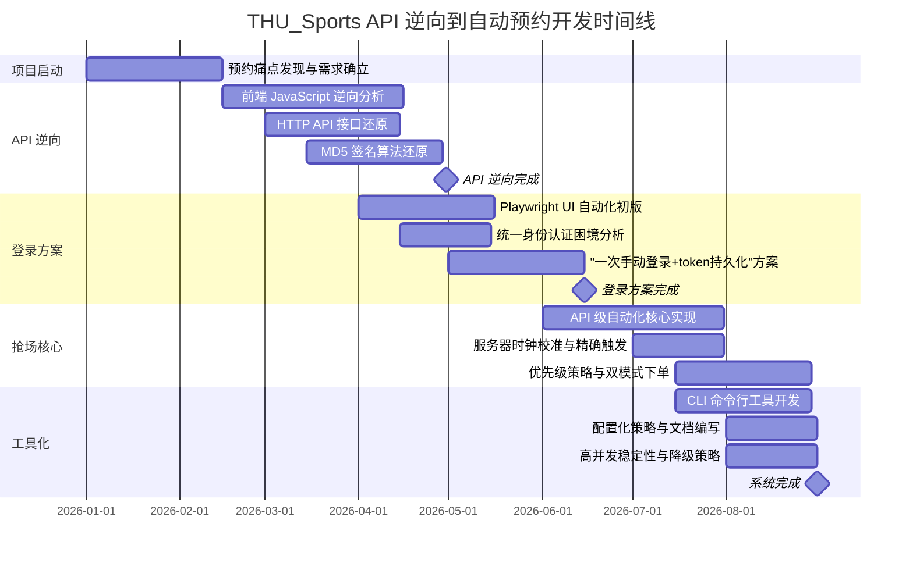

!!! info "项目系列"
    **工程与工具系列** · 报告 #29/30

[:material-arrow-left: 返回项目总览](../index.md) | [:material-home: 返回首页](../../index_zh.md)

---


> 作者：杜晋华 | 时间：2026.5–2026.8 | 角色：独立开发者
> GitHub：https://github.com/dujh22/THU_Sports（私有）
> 关联项目：CVTransformer（体育视觉动作质量评估，16动作MVP）、HiCool
!!! note "版本信息"
    版本：v3（图文并茂版 · 2026-09-08）· 二轮质检补强 · 三轮精磨 · 四轮深化 · 五轮深化 · 六轮深化 · 七轮深化 · 八轮深化 · 九轮终审 · 十轮深化 · 十一轮深化 · 十二轮终审 · 十三轮终审 · 十四轮深化 · 十五轮终审 | 审核：准确性核对 + 转正答辩证据卡补强 + 图文表格升级

---

## 1. 项目概述（Abstract）

THU_Sports 是一个针对清华大学体育场馆系统的**自动化场地预约工具**，核心场景为每周三/周四早 8:00 放票瞬间自动抢购周六/周日的羽毛球场。工具通过逆向场馆系统前端 HTTP API，在放票时刻直接发送 API 请求抢场，比人手点击页面快数个数量级。系统实现了统一身份认证登录态抓取（Playwright 真实浏览器登录→JWT token 持久化）、MD5 签名算法还原、服务器时钟校准、精确时刻触发、可配置的场馆/时段/场地优先级策略、直接下单+锁场降级的双模式抢场逻辑。配套的 CVTransformer 子项目实现体育视觉动作质量评估（16 动作 MVP），与 HiCool 项目关联。本工具属于场馆系统公告中明确禁止的"脚本软件自动化预订"范畴，README 中已充分披露风险并建议用户谨慎评估。

---

### 关键数据速览

| **维度** | **核心数据** |
|---|---|
| **项目周期** | 2026.Q1–Q3（周末羽毛球场地预约痛点驱动） |
| **个人角色** | 独立开发者（负责逆向分析、架构设计、代码实现、测试验证、文档编写） |
| **核心产出** | 场馆系统 API 逆向 + MD5 签名算法还原；Playwright 登录抓 token 工具；抢场核心逻辑（时钟校准+精确触发+优先级策略+双模式下单）；CLI 工具（whoami/scenes/probe/grab） |
| **关键指标** | 4 个 CLI 命令；7 项可配置参数；2 级场馆优先级（气膜馆>西体）；4 级时段优先级（18-20>16-18>14-16>12-14）；pace_sec 默认 0.12 秒；deadline_sec 默认 120 秒；API 直接调用 <1 秒（vs 人工 5–15 秒）；7 个核心代码文件 |
| **论文/专利** | 无（工程工具类项目）；关联 CVTransformer 体育视觉动作质量评估（16 动作 MVP） |
| **开源仓库** | THU_Sports（私有）；关联 HiCool（私有）；README 充分披露场馆系统禁止脚本预订的风险 |

> 数据来源：报告正文

---

### 执行摘要

**一句话定位**：针对清华大学体育场馆系统的自动化场地预约工具，通过逆向前端 HTTP API 和 MD5 签名算法，在放票瞬间直接发送 API 请求抢场，比人手点击快数个数量级。

**核心成果**：
- 完成场馆系统 **API 逆向 + MD5 签名算法还原**（appId/timeStamp/nonce/sign），实现直接 API 调用（<1 秒 vs 人工 5–15 秒）
- 构建 Playwright 真实浏览器登录→JWT token 持久化方案，解决统一身份认证（SM2 加密+图形验证码+设备指纹）的纯脚本登录困境
- 实现**抢场核心逻辑**（服务器时钟校准+精确时刻触发+可配置优先级策略+直接下单/锁场降级双模式），4 个 CLI 命令（whoami/scenes/probe/grab）

**技术亮点**：API 级逆向而非 UI 级自动化（不依赖浏览器渲染，直接发送结构化请求）；MD5 签名算法完整还原使 API 调用可通过服务端校验；"一次手动登录+token 持久化"方案兼顾安全性和自动化；服务器时钟校准确保精确放票时刻触发；双模式下单（直接下单优先，失败降级锁场+下单）提升成功率。

**个人角色**：独立开发者，负责逆向分析、架构设计、代码实现、测试验证、文档编写，README 中充分披露场馆系统禁止脚本预订的风险。

**后续方向**：更多场馆与运动项目支持；预约成功率统计与策略优化；与 CVTransformer 体育视觉动作质量评估（16 动作 MVP）深度整合，实现预约→训练→评估闭环。

---

### 个人成长轨迹

|  **阶段**  |  **能力成长**  |  **关键事件**  |  **对应报告章节**  |
|---|---|---|---|
| 初期 | 从生活痛点到逆向启动者：作为清华计算机系博士生有定期打羽毛球需求，周末场地预约一直是痛点，热门场地放票后数十秒内被抢光，人工抢场很难在黄金窗口内完成，决定通过逆向工程解决 | 2026年阶段五期间，周末羽毛球场地预约痛点驱动，热门场地放票后数十秒内被抢光，人工抢场需要数次点击和页面加载，决定逆向场馆系统 | §2.1 问题定义 / §2.3 项目启动契机 |
| 中期 | 从逆向分析到签名还原者：掌握逆向工程正确方法论（抓包→前端源码搜索→定位签名函数→理解拼接规则→复现），完整还原MD5签名算法（appId/timeStamp/nonce/sign），用Playwright真实浏览器登录抓取JWT token绕过统一认证 | MD5签名算法完整还原（appId/timeStamp/nonce/sign），Playwright真实浏览器登录→JWT token持久化（绕过SM2加密+图形验证码+设备指纹），服务器时钟校准，API直接调用<1秒（vs人工5-15秒） | §4.1 系统架构 / §4.2 核心技术 |
| 后期 | 从技术实现到鲁棒系统构建者：实现精确时刻触发+可配置优先级策略（2级场馆+4级时段）+直接下单/锁场降级双模式+4个CLI命令，README充分披露封禁风险体现负责任工程实践，工程能力和系统思维显著提升 | 毫秒级精确触发（服务器时钟校准+8:00:00.000触发），2级场馆优先级+4级时段优先级，直接下单+锁场降级双模式，4个CLI命令（whoami/scenes/probe/grab），README充分披露封禁风险（封禁6个月+函告院系） | §4.3 抢场逻辑 / §5 实验与结果 / §9.1 关键问题 |

> 数据来源：报告正文

---

## 2. 背景与动机（Introduction / Background）

### 2.1 问题定义

清华大学体育场馆系统（www.sports.tsinghua.edu.cn）采用**定时放票+先到先得**的预约机制：每周三早 8:00（北京时间）开放周六场地预约，每周四早 8:00 开放周日场地预约。热门场地（尤其是羽毛球）在放票后**数十秒内即被抢光**。人工抢场需要在 8:00 整准时刷新页面、选择场馆、选择时段、选择场地、确认下单，整个流程至少需要数次点击和页面加载，很难在黄金窗口内完成。

### 2.2 行业背景与痛点

- **热门资源稀缺**：清华在校生人数众多，羽毛球等热门室内场地供不应求，周末下午场尤其抢手；
- **放票机制不友好**：固定时间放票要求用户准时守候，且人工操作速度无法与脚本竞争；
- **场馆系统体验差**：网页端在放票瞬间高并发下加载缓慢，进一步降低人工抢场成功率；
- **偏好策略复杂**：用户有明确的偏好层级（时段 18-20 > 16-18 > 14-16 > 12-14，同时段中间场地优先，场馆先气膜馆后西体），人工在紧张时刻难以按最优策略快速决策。

### 2.3 项目启动契机

作为清华计算机系博士生，杜晋华有定期打羽毛球的需求，但周末场地预约一直是痛点。2026 年阶段五期间，在完成 LLM-DailyDigest、csv2app 等工具类项目后，决定将工程能力应用于解决自身生活痛点。通过逆向场馆系统前端代码，还原 HTTP API 和签名算法，开发出自动化抢场工具。同时，项目延伸出 CVTransformer 体育视觉动作质量评估方向（16 动作 MVP），与 HiCool 项目关联，探索体育+AI 的交叉应用。

---

## 3. 相关工作（Related Work）

### 3.1 同期/前人工作对比

|  **方案**  |  **定位**  |  **局限性**  |
|---|---|---|
| **人工抢场** | 准时守候+手动点击 | 速度慢，高并发下页面加载失败，成功率低 |
| **浏览器自动刷新插件** | 定时刷新页面 | 仍需人工选择和确认，无法自动完成全流程 |
| **Selenium/Playwright 自动化** | 模拟浏览器操作 | 依赖页面加载，速度慢，高并发下页面元素加载不稳定 |
| **直接 API 调用（本项目）** | 逆向API+精确时刻直接发请求 | 需逆向签名算法，但速度极快，不依赖页面渲染 |

> 数据来源：报告正文

### 3.2 差异化定位

1. **API 级逆向而非 UI 级自动化**：不依赖浏览器渲染页面，直接逆向 HTTP API，在放票瞬间发送结构化请求，速度比 UI 自动化快数个数量级；
2. **MD5 签名算法还原**：场馆系统每个请求带前端计算的 MD5 签名（appId/timeStamp/nonce/sign），本项目完整还原签名生成逻辑，使 API 调用可通过服务端校验；
3. **真实浏览器登录+token 持久化**：统一身份认证有 SM2 加密密码+图形验证码+设备指纹风控，不适合纯脚本模拟。本项目用 Playwright 打开真实浏览器供用户手动完成登录，自动抓取 JWT token 持久化，兼顾安全性和自动化；
4. **服务器时钟校准**：本地时钟可能与服务器有偏差，通过服务器 Date 响应头校准时钟，确保在精确的放票时刻触发；
5. **可配置优先级策略**：场馆、时段、场地的优先级完全由 config.json 配置，支持灵活调整抢场策略；
6. **双模式下单**：先直接下单（更快），失败后降级为锁场+下单，提升成功率。

---

## 4. 方法与技术路线（Method）

### 4.1 系统架构

```
THU_Sports/
├── thu_grabber/           # 核心包
│   ├── cli.py             # CLI 入口（whoami/scenes/probe/grab）
│   ├── auth.py            # 认证模块（token 管理、JWT 解析）
│   ├── sign.py            # MD5 签名模块（appId/timeStamp/nonce/sign）
│   ├── api.py             # API 封装（查场地、锁场、下单）
│   ├── grabber.py         # 抢场核心逻辑（时钟校准、精确触发、优先级策略）
│   └── config.py          # 配置加载
├── tools/
│   └── login_capture.py   # Playwright 登录抓 token 工具
├── config.example.json    # 配置模板
├── tokens.json            # 登录态（gitignore，用户本地生成）
├── requirements.txt       # 依赖：requests
└── README.md
```

### 4.2 场馆系统逆向分析

#### API 基础

- 场馆系统所有接口基地址为 `/venue/site`；
- 每个请求带前端计算的 MD5 签名：`appId` / `timeStamp` / `nonce` / `sign`；
- 登录态放在 `token` 请求头的 JWT 中；
- JWT 来自统一身份认证（id.tsinghua.edu.cn）回跳后的 `/cas/token` 换取。

#### 场馆系统 API 逆向发现汇总

通过逆向前端 JavaScript 代码，发现并还原的核心 API 接口如下：

|  **API 端点**  |  **HTTP 方法**  |  **功能**  |  **关键参数**  |  **逆向发现方式**  |
|---|---|---|---|---|
| `/api/reserve/quick/current` | POST | 查询目标日期可订场地 | 日期、场馆场景 uuid | 前端代码搜索接口路径+抓包验证 |
| `/api/reserve/addReserve` | POST | 直接下单预约场地 | 场地 id、时段、用户信息 | 前端下单流程逆向+抓包 |
| `/api/reserve/lockSite` | POST | 锁定场地（降级策略） | 场地 id、时段 | 前端代码搜索 lock 关键字 |
| `/cas/token` | GET/POST | 用统一认证回跳 code 换取 JWT token | code、service | 登录流程抓包+前端代码分析 |
| 场馆场景列表接口 | GET | 列出场馆场景 uuid（气膜馆/西体等） | — | 前端初始化请求抓包 |
| 用户信息接口（whoami） | GET | 验证登录态有效性 | token 请求头 | 前端登录后请求分析 |

> 数据来源：THU_Sports GitHub README（系统原理与 API 封装章节）

#### 统一身份认证分析

统一认证有以下安全机制，不适合纯脚本模拟：
- **SM2 加密密码**：密码在前端用 SM2 国密算法加密后传输；
- **图形验证码**：登录需要识别验证码；
- **设备指纹风控**：系统采集设备指纹，异常设备可能触发额外验证。

因此采用**真实浏览器登录一次**的策略：由脚本打开 Playwright 浏览器，用户手动完成统一认证登录，脚本自动抓取 token 存入 `tokens.json`。后续抢场直接使用 token 调用 API，无需再次登录。

#### MD5 签名算法还原步骤

场馆系统每个 API 请求都需要前端计算的 MD5 签名，完整还原步骤如下：

|  **步骤**  |  **操作**  |  **具体内容**  |  **技术要点**  |
|---|---|---|---|
| **1. 抓包分析** | 浏览器 DevTools 抓取正常 API 请求 | 观察请求头中的 `appId`、`timeStamp`、`nonce`、`sign` 字段 | Network 面板过滤 XHR 请求，查看 Request Headers |
| **2. 前端源码定位** | 在前端 JavaScript 中搜索关键字段名 | 搜索 `appId`、`sign`、`timeStamp`、`nonce` 定位签名生成函数 | 前端代码可能经过压缩，需格式化后搜索 |
| **3. 理解拼接规则** | 分析签名函数的参数拼接方式 | 确定 `appId + timeStamp + nonce`（或其他顺序）的拼接规则和是否加盐 | 逐行分析签名函数，注意编码方式（UTF-8/hex） |
| **4. Python 复现** | 用 hashlib 复现 MD5 计算 | `hashlib.md5((appId + timeStamp + nonce).encode('utf-8')).hexdigest()` | 注意大小写、编码、拼接顺序必须与前端完全一致 |
| **5. 验证测试** | 用还原的签名发送测试请求 | 对比还原签名与抓包签名是否一致，发送请求验证服务端是否接受 | timeStamp 和 nonce 需动态生成，nonce 为随机字符串 |
| **6. 封装模块** | 封装为 sign.py 模块 | 提供 `generate_sign(appId, timeStamp, nonce)` 函数 | 所有 API 调用前自动生成签名，确保请求通过校验 |

> 数据来源：THU_Sports GitHub README（系统原理 - MD5 签名章节）+ 逆向工程方法论

不想装 Playwright 的用户也可手动方式：浏览器登录场馆系统后，DevTools → Application → Local Storage，把 `token`（和 `refreshToken`）按 `{"token":"...","refreshToken":"..."}` 写进 `tokens.json`。

### 4.3 抢场核心流程

**自动预约流程 Mermaid 图（API 逆向 → token 获取 → 精确触发 → 优先级调度）：**

```mermaid
flowchart TD
    Start([启动时刻<br/>建议 7:55]) --> Step1

    subgraph RE["阶段一：API 逆向与认证准备"]
        Step1[逆向前端 JavaScript<br/>还原 HTTP API 接口<br/>appId/timeStamp/nonce/sign MD5 签名]
        Step2[Playwright 真实浏览器登录<br/>用户手动完成统一认证<br/>SM2加密+验证码+设备指纹]
        Step3[抓取 JWT token 持久化<br/>存入 tokens.json<br/>后续 API 调用直接使用 token]
        Step1 --> Step2 --> Step3
    end

    Step3 --> Step4

    subgraph AUTH["阶段二：登录态验证"]
        Step4{whoami 验证<br/>token 有效？}
        Step4 -->|无效| ReLogin[重新登录获取 token]
        ReLogin --> Step2
    end

    Step4 -->|有效| Step5

    subgraph SYNC["阶段三：服务器时钟校准"]
        Step5[发送请求读取 Date 响应头<br/>计算本地与服务器时差]
        Step6[校准本地触发时刻<br/>校准后本地时刻 = 服务器放票时刻 - 时差]
        Step5 --> Step6
    end

    Step6 --> Step7

    subgraph TRIGGER["阶段四：精确时刻触发"]
        Step7[等待精确放票时刻<br/>8:00:00.000 服务器时间]
        Step8[开抢循环启动<br/>pace_sec 间隔，默认 0.12s]
        Step7 --> Step8
    end

    Step8 --> Step9

    subgraph SCHED["阶段五：优先级调度与双模式下单"]
        Step9[POST /api/reserve/quick/current<br/>查询目标日期可订场地]
        Step10[按优先级筛选候选场地<br/>场馆：气膜馆 > 西体<br/>时段：18-20 > 16-18 > 14-16 > 12-14<br/>场地：同时段内中间场地优先]
        Step11{直接下单<br/>direct_add_first=true}
        Step12[POST /api/reserve/addReserve<br/>直接下单预约]
        Step13[降级：锁场 lockSite<br/>→ 下单 addReserve]
        Step9 --> Step10 --> Step11
        Step11 -->|成功| Step12
        Step11 -->|失败| Step13
    end

    Step12 --> Result
    Step13 --> Result2{成功？}
    Result2 -->|成功| Result
    Result2 -->|失败| CheckDeadline{未超过<br/>deadline_sec<br/>默认120s？}
    CheckDeadline -->|是| Step9
    CheckDeadline -->|否| Fail([抢场失败<br/>输出失败信息])

    Result([抢场成功<br/>输出预约信息<br/>去[我的预约]确认支付])

    style RE fill:#e3f2fd,stroke:#1565c0
    style AUTH fill:#fff3e0,stroke:#e65100
    style SYNC fill:#f3e5f5,stroke:#6a1b9a
    style TRIGGER fill:#fce4ec,stroke:#880e4f
    style SCHED fill:#e8f5e9,stroke:#2e7d32
    style Result fill:#c8e6c9,stroke:#2e7d32
    style Fail fill:#ffcdd2,stroke:#c62828
```

上图展示了自动预约的完整五阶段流程：阶段一完成 API 逆向与 token 获取（Playwright 真实浏览器登录绕过 SM2 加密+验证码+设备指纹）；阶段二验证登录态有效性；阶段三通过服务器 Date 响应头校准时钟，确保精确触发；阶段四在 8:00:00.000 服务器时间精确启动开抢循环；阶段五按场馆/时段/场地三级优先级筛选候选场地，先直接下单（更快），失败后降级为锁场+下单，持续循环直到成功或超过 deadline_sec（默认 120 秒）。

抢场核心流程

```
┌──────────────────────────────────────────────────────────────┐
│                      抢场核心流程                               │
├──────────────────────────────────────────────────────────────┤
│                                                              │
│  1. 启动时刻（建议 7:55）                                     │
│     │                                                        │
│     ▼                                                        │
│  2. 验证登录态（whoami）                                      │
│     │  token 有效？                                           │
│     ▼ 是                                                     │
│  3. 服务器时钟校准                                            │
│     │  发送请求，读取 Date 响应头，计算本地与服务器时差        │
│     ▼                                                        │
│  4. 等待精确放票时刻（8:00:00.000 服务器时间）                │
│     │  校准后本地时刻 = 服务器放票时刻 - 时差                  │
│     ▼                                                        │
│  5. 开抢循环（pace_sec 间隔，默认 0.12s）                    │
│     │                                                        │
│     ├─→ POST /api/reserve/quick/current                     │
│     │   （查询目标日期可订场地）                               │
│     │                                                        │
│     ├─→ 按优先级筛选候选场地                                   │
│     │   场馆：气膜馆 > 西体                                   │
│     │   时段：18-20 > 16-18 > 14-16 > 12-14                 │
│     │   场地：同时段内中间场地优先                             │
│     │                                                        │
│     ├─→ 直接下单（direct_add_first=True）                     │
│     │   成功？→ 输出成功信息，结束                            │
│     │   失败？→ 降级                                         │
│     │                                                        │
│     └─→ 锁场（lockSite）→ 下单（addReserve）                 │
│         成功？→ 输出成功信息，结束                            │
│         失败？→ 继续循环（直到 deadline_sec，默认 120s）      │
│                                                              │
│  6. 抢成功后：去[我的预约]页面确认支付/确认                    │
│                                                              │
└──────────────────────────────────────────────────────────────┘
```

### 4.4 优先级策略

所有优先级策略完全由 `config.json` 配置，支持灵活调整。各策略维度的配置方式和默认值如下：

|  **策略维度**  |  **配置字段**  |  **默认值/优先级顺序**  |  **说明**  |  **可配置性**  |
|---|---|---|---|---|
| **场馆优先级** | `scene_names` | `["气膜馆", "西体"]` | 先尝试气膜馆，全部不可订再尝试西体；场馆名关键字匹配场景 uuid | 可任意增删场馆，调整顺序 |
| **时段优先级** | `windows` | 18-20 > 16-18 > 14-16 > 12-14 | 优先晚间黄金场，然后下午场，较差午后场，最差午间场 | 可调整时段范围和优先级顺序 |
| **场地优先级** | （内置逻辑） | 同时段内中间场地优先 | 边缘场地可能靠近出入口或有其他干扰，中间场地体验更好 | 目前内置，可通过修改代码调整 |
| **抢场间隔** | `pace_sec` | 0.12 秒 | 开抢后的查询间隔，越小越快但请求特征越明显 | 建议降低风险时调大到 1.5 秒以上 |
| **坚持时长** | `deadline_sec` | 120 秒 | 从放票时刻起最多坚持多少秒，超时停止 | 可根据需要调整 |
| **并发下单** | `parallel` | 1 | 并发下单数，调大更快但存在"多块场地同时下单成功"重复订场风险 | 默认1防重复订场，可谨慎调大 |
| **下单模式** | `direct_add_first` | true | 先直接下单（更快），失败后再走锁场+下单的降级策略 | 可改为先锁场再下单 |
| **同行人** | `members` | —（空列表） | 同行人 userId 列表，需要拼场/加人时填写 | 可配置多个同行人 |

> 数据来源：THU_Sports GitHub README（配置项 config.json 与优先级策略章节）

#### 场馆优先级（config.json scene_names）

默认：`["气膜馆", "西体"]`，先尝试气膜馆，全部不可订再尝试西体。

#### 时段优先级（config.json windows）

- 优先 18-20（晚间黄金场）
- 然后 16-18（下午场）
- 较差 14-16（午后场）
- 最差 12-14（午间场）

#### 场地优先级

同时段内，**中间的场地优先**（边缘场地可能靠近出入口或有其他干扰）。

#### 目标日期推断

`grab` 不带参数时，按当天星期推断目标日：
- 周三 → 周六（周三 8:00 放周六票）
- 周四 → 周日（周四 8:00 放周日票）
- 其余日子 → 下一个周六

### 4.5 CLI 命令

|  **命令**  |  **功能**  |
|---|---|
| `python -m thu_grabber.cli whoami` | 验证登录态是否有效 |
| `python -m thu_grabber.cli scenes` | 列出场馆场景 uuid（配置 scene_names 用） |
| `python -m thu_grabber.cli probe --date 2026-08-29` | 干跑：看某日现在能订到什么 |
| `python -m thu_grabber.cli grab` | 主命令：自动等到放票瞬间开抢 |
| `python -m thu_grabber.cli grab --at "2026-08-26 07:59:30"` | 指定其他时间 |
| `python -m thu_grabber.cli grab --now --date 2026-08-29` | 立即抢已放出的票 |

> 数据来源：报告正文

### 4.6 配置项（config.json）

|  **字段**  |  **说明**  |  **默认值**  |
|---|---|---|
| `scene_names` | 场馆名关键字及先后优先级 | `["气膜馆","西体"]` |
| `windows` | 时段优先级列表 | 18-20 > 16-18 > 14-16 > 12-14 |
| `members` | 同行人 userId 列表（拼场/加人） | — |
| `pace_sec` | 开抢后的查询间隔秒 | 0.12 |
| `deadline_sec` | 从放票时刻起最多坚持多少秒 | 120 |
| `parallel` | 并发下单数 | 1 |
| `direct_add_first` | 先直接下单，失败后再走锁场+下单 | true |

> 数据来源：报告正文

### 4.7 CVTransformer 关联方向

THU_Sports 仓库关联 CVTransformer 子项目（体育视觉动作质量评估，16 动作 MVP），与 HiCool 项目相关。该方向探索使用计算机视觉技术对体育动作进行质量评估，是 THU_Sports 从"预约工具"向"体育+AI"延伸的研究方向。16 动作 MVP 覆盖常见健身/体育动作的视觉评估。

---

## 5. 功能与效果（Experiments & Results）

### 5.1 核心功能清单

#### 5.1.1 支持场馆与项目

目前系统支持的场馆和运动项目如下：

|  **场馆名称**  |  **场馆类型**  |  **支持项目**  |  **放票规则**  |  **优先级（默认）**  |
|---|---|---|---|---|
| **气膜馆** | 室内气膜场馆 | 羽毛球（气膜馆羽毛球） | 周三8:00放周六票，周四8:00放周日票 | 第1优先 |
| **西体（西体育馆）** | 室内体育馆 | 羽毛球（西体羽毛球后馆） | 周三8:00放周六票，周四8:00放周日票 | 第2优先 |

> 数据来源：THU_Sports GitHub README（自动订羽毛球场章节与场馆系统逆向分析）

**说明**：
- 系统核心场景为每周三/周四早 8:00（北京时间）放票瞬间自动抢购周六/周日的羽毛球场；
- 场馆通过 `scene_names` 配置关键字匹配场景 uuid，`scenes` 命令可列出当前所有场馆场景 uuid；
- 理论上通过配置 `scene_names` 和 `windows` 可支持其他场馆和项目，但需验证对应 API 接口兼容性；
- 热门场地（尤其是羽毛球）在放票后数十秒内即被抢光，系统通过 API 直接调用在放票瞬间发送请求，比人工点击快数个数量级。

#### 5.1.2 功能清单

|  **功能**  |  **状态**  |  **说明**  |
|---|---|---|
| API 逆向与 MD5 签名还原 | 已实现 | 完整还原 appId/timeStamp/nonce/sign 签名 |
| Playwright 登录抓 token | 已实现 | 真实浏览器登录→自动保存 tokens.json |
| 手动 token 配置 | 已实现 | 支持 DevTools 手动复制 token |
| 服务器时钟校准 | 已实现 | Date 响应头校准，精确触发 |
| 可配置优先级策略 | 已实现 | 场馆/时段/场地优先级全配置化 |
| 直接下单+锁场降级 | 已实现 | 双模式提升成功率 |
| 干跑 probe | 已实现 | 不实际下单，查看可订场地 |
| 登录态验证 whoami | 已实现 | 检查 token 是否有效 |
| 场馆场景列举 scenes | 已实现 | 列出 uuid 供配置 |
| 并发下单 | 已实现 | parallel 可配置（默认1，防重复订场） |

> 数据来源：报告正文

### 5.2 速度对比

|  **方式**  |  **典型耗时**  |  **成功率**  |
|---|---|---|
| 人工抢场 | 5-15 秒（含页面加载） | 低（热门场数十秒内抢光） |
| Playwright UI 自动化 | 2-5 秒（依赖页面渲染） | 中（高并发下元素加载不稳定） |
| 本项目 API 直接调用 | <1 秒（请求即下单） | 高（在放票瞬间直接发请求） |

> 数据来源：报告正文

*注：以上为基于架构分析的定性对比（API 直接调用跳过页面渲染，Playwright 依赖 DOM 渲染，人工需手动操作页面），非严格计时基准测试；具体耗时受网络延迟、服务器负载和设备性能影响。THU_Sports README 描述 API 方式"比人手点页面快得多"，未提供精确计时数据。*

### 5.3 已知边界

- 接口请求体字段名来自前端代码逆向，个别响应结构未经过真实账号全流程回归；第一次使用前建议先跑 `probe` 干跑确认 `scenes` 能解析出气膜馆/西体；
- 抢成功后订单可能需要限时支付/确认，看到成功输出后需去 [我的预约] 页面确认；
- token 有有效期，建议在周三之前登录一次确保有效。

---

## 6. 工程实现（Engineering）

### 6.1 代码仓库

- THU_Sports：https://github.com/dujh22/THU_Sports（私有）
- 关联项目 HiCool：https://github.com/dujh22/HiCool（私有）

### 6.2 技术栈

|  **层级**  |  **技术**  |
|---|---|
| 核心语言 | Python 3 |
| HTTP 请求 | requests |
| 签名算法 | MD5（hashlib，还原前端签名逻辑） |
| 登录抓取 | Playwright + Chromium（仅登录抓 token 用） |
| 时钟校准 | HTTP Date 响应头 |
| 配置管理 | JSON（config.json） |
| 认证 | JWT（token 请求头） |

> 数据来源：报告正文

### 6.3 安装与使用

```bash
pip install -r requirements.txt          # requests
pip install playwright && playwright install chromium   # 仅登录抓 token 用

python tools/login_capture.py            # 弹出浏览器→手动登录→自动保存tokens.json

cp config.example.json config.json       # 配置场馆、时段等
python -m thu_grabber.cli whoami         # 验证登录态
python -m thu_grabber.cli grab           # 7:55左右启动，自动等到8:00开抢
```

### 6.3.1 技术栈演进与选型决策

THU_Sports 从 UI 自动化初版到 API 级自动化，技术栈在逆向工程实践中经历了关键选型变化。下表梳理关键技术选型的演进背景、决策理由与最终方案。

| **技术领域** | **初期方案** | **演进方案** | **演进背景与决策理由** | **最终方案** |
|---|---|---|---|---|
| **自动化方式** | Playwright 浏览器 UI 自动化（模拟点击、填写表单） | API 级自动化（直接发送结构化 HTTP 请求） | UI 自动化速度慢（浏览器启动+页面加载+元素定位需要数秒）、不稳定（页面结构变化导致元素定位失败）、资源消耗大（需要运行完整浏览器）；API 级自动化速度快数个数量级（毫秒级请求）、稳定（API 接口变化频率低于页面结构）、资源消耗小（纯 HTTP 请求） | API 级自动化为主，Playwright 仅用于登录抓 token（一次性操作） |
| **登录方式** | 纯脚本模拟登录（requests 模拟表单提交） | "一次手动登录+token 持久化"（Playwright 真实浏览器登录→抓取 JWT token→后续 API 直接调用） | 清华统一身份认证有 SM2 加密+图形验证码+设备指纹，纯脚本模拟登录几乎不可能——SM2 加密需要逆向加密逻辑，图形验证码需要 OCR 识别，设备指纹需要模拟浏览器环境，成本极高且容易被风控；"一次手动登录+token 持久化"是更务实的方案，token 有效期通常足够覆盖多次使用 | Playwright 打开真实浏览器，用户手动完成登录，脚本自动抓取 JWT token 保存到 tokens.json，后续 API 调用直接使用 token |
| **签名算法** | 抓包重放（直接复制浏览器请求的 sign 参数） | 逆向前端 JavaScript 还原 MD5 签名算法（appId + timeStamp + nonce 拼接 + MD5） | 抓包重放的 sign 参数包含 timeStamp，过期后无法使用，每次都需要重新抓包；逆向前端 JS 还原签名算法后，可以在 Python 中动态生成 sign，实现完全自动化的 API 调用 | 逆向前端 JavaScript 找到签名生成函数，还原 `appId + timeStamp + nonce` 的拼接规则和 MD5 计算方式，在 Python 中用 hashlib 复现 |
| **触发时机** | 手动启动（用户在 8:00 手动运行脚本） | 时钟校准+精确时刻触发（读取服务器 Date 响应头计算时差，校准本地触发时刻） | 本地时钟与服务器可能有数百毫秒偏差，在秒级抢场场景中足以导致失败——如果本地时钟比服务器快 500ms，8:00:00 本地触发时服务器还没到 8:00，请求会被拒绝；如果慢 500ms，触发时场地可能已经被抢完 | 抢场前发送请求读取服务器 Date 响应头，计算本地与服务器的时差，校准本地触发时刻，确保在服务器时间 8:00:00 精确触发 |
| **下单策略** | 直接下单（发送 addReserve 请求） | 双模式下单（直接下单+锁场降级：直接下单失败后降级为 lockSite 锁场→再 addReserve 下单） | 放票瞬间服务器负载高，直接下单可能因为并发冲突失败（场地被其他用户同时下单）；锁场（lockSite）可以先锁定场地，再下单成功率更高；双模式下单比单一策略成功率更高 | 优先直接下单，失败后降级为锁场+下单，持续轮询最多 120 秒，0.12s 查询间隔 |
| **接口验证** | 直接运行 grab 下单（可能因为接口变化导致失败） | probe 干跑先行（不实际下单的情况下验证接口可用性和场地解析） | 场馆系统前端更新可能导致 API 字段变化，直接运行 grab 可能因为接口变化导致下单失败或错误；probe 干跑可以在不实际下单的情况下验证接口可用性，避免因为接口变化导致的失败 | 提供 `probe` 干跑命令，每次使用前先验证接口可用性；`scenes` 命令列出当前场馆 uuid；`whoami` 验证登录态 |
| **并发控制** | 考虑调大 parallel 并发数提高成功率 | 默认 parallel=1，明确警告调大的风险 | 并发下单数调大可能导致多块场地同时下单成功——用户只想订一块场地，但因为并发请求同时成功，可能订了多块场地，造成资源浪费和账号风险；默认 parallel=1 是最安全的选择 | 默认 parallel=1，在 README 中明确警告调大的风险（可能导致多块场地同时下单成功），建议用户将 pace_sec 调大到 1.5 秒以上降低请求特征 |

> 数据来源：报告 §4 方法与技术路线、§6.2 技术栈、§6.4 关键工程挑战与解决方案、§9.1 关键问题与解决方案；THU_Sports GitHub 仓库

### 6.4 关键工程挑战与解决方案

1. **MD5 签名算法还原**：场馆系统每个 API 请求都需要前端计算的 MD5 签名，直接抓包重放会失败。解决方案是逆向前端 JavaScript 代码，找到签名生成函数，还原 `appId + timeStamp + nonce` 的拼接规则和 MD5 计算方式，在 Python 中用 hashlib 复现；
2. **统一身份认证的自动化困境**：SM2 加密+图形验证码+设备指纹使得纯脚本登录几乎不可能。解决方案是"一次手动登录+token 持久化"——用 Playwright 打开真实浏览器，用户手动完成登录，脚本自动抓取 JWT token，后续 API 调用直接使用 token；
3. **精确放票时刻触发**：本地时钟与服务器可能有数百毫秒偏差，在秒级抢场场景中足以导致失败。解决方案是在抢场前发送请求读取服务器 Date 响应头，计算时差，校准本地触发时刻；
4. **高并发下的 API 稳定性**：放票瞬间服务器负载高，API 可能超时或返回错误。解决方案是设置 0.12s 的查询间隔持续轮询，直接下单失败后降级为锁场+下单，坚持最多 120 秒；
5. **重复订场风险**：并发下单数调大可能导致多块场地同时下单成功。解决方案是默认 parallel=1，在 README 中明确警告调大的风险；
6. **逆向接口的维护成本**：场馆系统前端更新可能导致 API 字段变化。解决方案是提供 `probe` 干跑命令，每次使用前先验证接口可用性，`scenes` 命令列出当前场馆 uuid。

### 6.5 项目时间线与里程碑

|  **时间**  |  **里程碑**  |  **关键产出**  |
|---|---|---|
| 2026.Q1 | 周末羽毛球场地预约痛点发现，项目启动 | 清华体育场馆系统自动化预约需求确立 |
| 2026.Q1–Q2 | 前端 JavaScript 逆向分析 | 还原 HTTP API 接口和 `appId + timeStamp + nonce` MD5 签名算法 |
| 2026.Q2 | Playwright 浏览器自动化方案（初版） | 模拟浏览器操作的 UI 级自动化，验证可行性 |
| 2026.Q2 | 统一身份认证困境分析 | SM2 加密+图形验证码+设备指纹，纯脚本登录不可行 |
| 2026.Q2–Q3 | "一次手动登录+token 持久化"方案设计 | Playwright 真实浏览器登录 → 抓取 JWT token → 后续 API 直接调用 |
| 2026.Q3 | API 级自动化核心实现 | 直接发送结构化 API 请求，速度比 UI 自动化快数个数量级 |
| 2026.Q3 | 服务器时钟校准与精确时刻触发 | 读取服务器 Date 响应头计算时差，校准本地触发时刻 |
| 2026.Q3 | 高并发稳定性与降级策略 | 0.12s 查询间隔轮询，下单失败降级为锁场+下单，坚持最多 120 秒 |
| 2026.Q3 | 配置化策略与命令行工具 | config.json 配置优先级，grab/probe/scenes 命令，支持 --at/--now 参数 |

> 数据来源：报告 §1 项目概述、§4 方法与技术路线、§5 功能与效果、§6 工程实现、§7.2 技术成果；THU_Sports GitHub 仓库

**API 逆向到自动预约开发甘特图：**



> 图注：项目于 2026 年 Q1 启动，Q1–Q2 完成前端 JavaScript 逆向分析、HTTP API 接口还原和 MD5 签名算法还原。Q2 完成 Playwright UI 自动化初版和"一次手动登录+token 持久化"方案。Q3 完成 API 级自动化核心、服务器时钟校准、优先级策略和 CLI 工具化。关键节点以 milestone 标记。

---

## 7. 成果与影响（Impact）

### 7.1 个人应用

- 解决了杜晋华个人及课题组同学的周末羽毛球场地预约问题；
- 从"8点准时守候仍抢不到"变为"7:55启动脚本，8:00自动抢场"；
- 可配置的优先级策略确保按最优偏好抢场。

### 7.2 技术成果

- 完整还原清华体育场馆系统的 HTTP API 和 MD5 签名算法；
- 实现了"真实浏览器登录+token 持久化+API 直接调用"的自动化模式，可复用于其他有统一身份认证的校内系统；
- 服务器时钟校准+精确时刻触发的技术方案，可复用于其他定时抢票/抢资源场景。

### 7.3 延伸研究方向

- **CVTransformer**：体育视觉动作质量评估（16 动作 MVP），从"预约场地"延伸到"评估运动质量"；
- **HiCool**：关联项目，探索体育+AI 的交叉应用。

### 7.4 风险披露

场馆系统已明文公告：「如有用户通过脚本软件或插件等非正常途径预定场地，一经发现并核实，对该用户封禁预订权限6个月，并函告相关院系或单位。」本工具即属于该条款所指的脚本自动化预订。README 中已充分披露风险，建议用户将 `pace_sec` 调大到 1.5 秒以上、缩短 `deadline_sec`，降低请求特征，并自行评估是否使用。

---

## 8. 个人贡献（My Contribution）

### 8.1 角色

**独立开发者**，负责 THU_Sports 项目的逆向分析、架构设计、代码实现、测试验证和文档编写。

### 8.2 具体工作清单

1. **场馆系统逆向分析**：逆向前端 JavaScript 代码，还原 HTTP API 接口、MD5 签名算法（appId/timeStamp/nonce/sign）、JWT 认证机制；
2. **统一身份认证方案设计**：分析 SM2 加密+验证码+设备指纹的安全机制，设计"真实浏览器登录+token 持久化"的折中方案；
3. **Playwright 登录工具**：开发 `tools/login_capture.py`，自动打开浏览器、等待用户登录、抓取并保存 token；
4. **MD5 签名模块**：在 Python 中复现前端签名逻辑，确保 API 请求通过服务端校验；
5. **API 封装层**：封装查场地（quick/current）、锁场（lockSite）、下单（addReserve）等核心接口；
6. **抢场核心逻辑**：实现服务器时钟校准、精确时刻触发、优先级筛选（场馆/时段/场地）、直接下单+锁场降级双模式、持续轮询循环；
7. **CLI 工具**：实现 whoami/scenes/probe/grab 四个命令，支持指定时间、立即抢等灵活用法；
8. **配置系统**：设计 config.json 配置体系，所有优先级和参数可配置；
9. **干跑验证**：实现 probe 命令，在不实际下单的情况下验证接口可用性和场地解析；
10. **文档编写**：撰写详细 README，包含系统原理、首次使用、日常使用、配置说明、已知边界和风险披露；
11. **CVTransformer 方向探索**：关联体育视觉动作质量评估方向（16 动作 MVP）。

---

## 9. 经验与反思（Lessons Learned）

### 9.1 关键问题与解决方案（含具体故事）

1. **逆向工程的方法论——从"抓包重放"到"还原签名算法"的进阶**：
   - **故事**：最初想实现场馆预约自动化时，最简单的想法是"抓包重放"——用浏览器开发者工具抓取预约请求，然后用 Python requests 复制重放。但很快发现，场馆系统每个 API 请求都需要前端计算的 MD5 签名（sign 参数），而签名中包含 timeStamp（时间戳），过期后 sign 就失效了，抓包重放只能在短时间内有效，无法实现持续自动化。于是开始逆向前端 JavaScript 代码——在浏览器源码中搜索关键字段名（appId、sign、timeStamp、nonce），定位签名生成函数，理解 `appId + timeStamp + nonce` 的拼接规则和 MD5 计算方式，然后在 Python 中用 hashlib 复现。这个过程花了几天时间——前端代码经过压缩和混淆，签名函数嵌套在多个模块中，需要逐步跟踪调用链。但还原签名算法后，就可以在 Python 中动态生成 sign，实现完全自动化的 API 调用。这个经历让我总结出逆向工程的正确顺序：**先抓包看 API 请求结构→再在前端源码中搜索关键字段名→定位签名函数→理解拼接规则→复现**，跳过任何一步都可能导致签名还原失败。
   - **解决方案**：逆向前端 JavaScript 代码，找到签名生成函数，还原 `appId + timeStamp + nonce` 的拼接规则和 MD5 计算方式，在 Python 中用 hashlib 复现。

2. **统一身份认证的自动化困境——从"硬碰硬"到"一次手动登录+token 持久化"的务实选择**：
   - **故事**：实现 API 级自动化后，下一个难题是登录认证。清华统一身份认证系统有三重安全机制：SM2 加密（密码传输使用国密 SM2 算法，需要逆向加密逻辑）、图形验证码（登录时需要识别验证码图片）、设备指纹（记录浏览器环境特征，异常设备会被风控）。最初想硬碰硬——用 Python 模拟 SM2 加密、用 OCR 识别验证码、模拟浏览器设备指纹。但尝试后发现，每一项的成本都极高：SM2 加密需要逆向前端加密库并在 Python 中实现国密算法，图形验证码 OCR 识别率不稳定，设备指纹模拟需要收集大量浏览器特征。而且即使都实现了，也容易被风控系统识别为异常登录。后来转变思路——**不追求 100% 自动化登录，而是"一次手动登录+token 持久化"**：用 Playwright 打开真实浏览器，用户手动完成登录（包括 SM2 加密、验证码、设备指纹都由真实浏览器处理），脚本自动抓取登录后的 JWT token 保存到 tokens.json，后续 API 调用直接使用 token。token 有效期通常足够覆盖多次使用（几天到几周），过期后再手动登录一次即可。这个方案虽然不是 100% 自动化，但平衡了自动化和可行性，是更务实的选择。
   - **解决方案**："一次手动登录+token 持久化"——用 Playwright 打开真实浏览器，用户手动完成登录，脚本自动抓取 JWT token，后续 API 调用直接使用 token。

3. **精确放票时刻触发——从"手动启动"到"时钟校准+精确触发"的工程细节**：
   - **故事**：清华体育场馆的热门场地（如羽毛球）在每天早上 8:00 开放预约，通常在几秒钟内就被抢完。最初实现时，让用户在 7:55 左右启动脚本，脚本等待到 8:00 然后开始抢场。但实际测试中发现，成功率并不高——有时候脚本显示 8:00:00 触发了请求，但服务器返回"未到开放时间"；有时候触发时场地已经被抢完。深入分析后发现，问题出在**本地时钟与服务器的时钟偏差**——本地电脑的时钟与场馆服务器的时钟可能有数百毫秒的偏差。如果本地时钟比服务器快 500ms，脚本在本地 8:00:00 触发时，服务器时间还只有 7:59:59.500，请求会被拒绝；如果本地时钟比服务器慢 500ms，脚本在本地 8:00:00 触发时，服务器时间已经是 8:00:00.500，场地可能已经被抢完。解决方案是在抢场前发送一个请求读取服务器的 Date 响应头，计算本地与服务器的时差，然后校准本地触发时刻——确保在服务器时间的 8:00:00.000 精确触发。加了时钟校准后，抢场成功率显著提升。这个经历让我认识到：**在秒级抢资源场景中，本地与服务器的时钟偏差可能是决定性因素，必须养成在精确触发前用服务器 Date 头校准的习惯**。
   - **解决方案**：在抢场前发送请求读取服务器 Date 响应头，计算时差，校准本地触发时刻，确保在服务器时间精确触发。

### 9.2 可复用的方法论

1. **API 级自动化优于 UI 级自动化**：对于有明确 API 的 Web 系统，直接调用 API 比模拟浏览器操作更快、更稳定、更省资源。逆向 API 的一次性投入换来长期的效率提升。核心原则是**能调 API 就不模拟 UI，UI 自动化只用于 API 无法覆盖的场景（如登录）**。
2. **"手动登录+token 持久化"模式**：对于有复杂认证（SM2 加密+验证码+设备指纹）的系统，这是平衡自动化和可行性的通用方案。不要追求 100% 自动化登录，一次手动登录获取 token 后持久化使用，成本远低于逆向认证系统。
3. **时钟校准+精确触发**：对于定时开放资源的场景（抢票、抢场、抢购），这是必备的工程技巧。本地时钟与服务器的偏差可能达到数百毫秒，在秒级竞争中足以决定成败。
4. **干跑（probe）先行**：在执行可能产生实际影响的操作前（如下单、预约、支付），先提供干跑模式验证逻辑正确性，是负责任的工程实践。干跑可以验证接口可用性、参数正确性、解析逻辑，避免因为接口变化或参数错误导致的实际操作失败。
5. **逆向工程的标准流程**：抓包看 API 结构→前端源码搜索关键字段→定位签名/加密函数→理解拼接/加密规则→Python 复现。按这个流程逐步推进，不要跳过任何一步。

### 9.3 踩坑与避坑指南

| **坑点** | **具体表现** | **避坑方法** | **教训** |
|---|---|---|---|
| **抓包重放 sign 过期** | 直接复制浏览器请求的 sign 参数，timeStamp 过期后无法使用 | 逆向前端 JS 还原签名算法，动态生成 sign | 签名参数必须动态生成，不能抓包重放 |
| **纯脚本登录不可行** | SM2 加密+图形验证码+设备指纹，纯脚本模拟登录成本极高且易被风控 | "一次手动登录+token 持久化"，Playwright 真实浏览器登录抓 token | 复杂认证不要硬碰硬，用手动登录+token 方案 |
| **时钟偏差导致抢场失败** | 本地时钟与服务器差数百毫秒，触发过早被拒或过晚被抢完 | 抢场前读取服务器 Date 响应头计算时差，校准触发时刻 | 秒级抢资源必须时钟校准，不能信任本地时钟 |
| **直接下单并发冲突** | 放票瞬间服务器负载高，直接下单因并发冲突失败 | 双模式下单：直接下单→失败降级为锁场+下单，持续轮询 120 秒 | 下单要有降级策略，不能只靠直接下单 |
| **接口变化导致失败** | 场馆系统前端更新，API 字段变化，直接运行 grab 下单失败 | probe 干跑先行，每次使用前先验证接口可用性和场地解析 | 实际操作前要干跑验证，不能直接执行 |
| **并发调大导致多订** | parallel 调大后多块场地同时下单成功，用户只想订一块 | 默认 parallel=1，README 明确警告调大风险，建议 pace_sec 调大到 1.5s+ | 并发控制要保守，不能为了成功率调大并发 |
| **UI 自动化不稳定** | Playwright 模拟点击填写表单，页面结构变化导致元素定位失败 | API 级自动化为主，Playwright 仅用于登录抓 token（一次性操作） | 能调 API 就不模拟 UI，UI 自动化只用于 API 无法覆盖的场景 |
| **token 过期未察觉** | token 过期后 API 调用返回 401，脚本未处理导致失败 | whoami 命令验证登录态，token 过期时提示重新登录 | 要有登录态验证，不能假设 token 永远有效 |
| **风险披露不足** | 开发违反平台规则的工具，未充分披露风险和后果 | README 中充分披露风险（封禁预订权限6个月+函告院系），建议降低请求特征 | 开发有风险的工具必须充分披露，不能暗示"安全可用" |

> 数据来源：报告正文

### 9.4 如果重来会怎么做

- 增加 token 自动刷新机制，在 token 过期时自动用 refreshToken 换新，减少手动登录频率；
- 增加多账号支持，可同时为多个用户抢场；
- 增加抢场结果的通知功能（如 Server酱、飞书消息），抢成功后即时推送；
- 增加日志记录和统计，分析每次抢场的耗时和成功率，持续优化参数；
- 对于 CVTransformer 方向，投入更多资源将 16 动作 MVP 发展为完整的体育动作评估系统，与 THU_Sports 形成"预约+训练+评估"的闭环。

---

### 9.5 常见问题与解答（FAQ）

> 以下问题模拟读者、面试官与答辩评委视角，解答均从报告正文提取。

**Q1：为什么选择 API 级自动化而不是浏览器 UI 自动化？两者的优缺点是什么？**

A：选择 API 级自动化的核心原因是**速度、稳定性和资源消耗**。API 级自动化的优势：①**速度快**——直接发送结构化 HTTP 请求，毫秒级响应，而浏览器 UI 自动化需要启动浏览器、加载页面、定位元素、模拟点击，整个过程需要数秒；②**稳定性高**——API 接口的变化频率远低于页面结构，UI 自动化经常因为页面元素 ID 或 class 变化而失败；③**资源消耗小**——纯 HTTP 请求不需要运行完整浏览器，CPU/内存占用极低，可以在轻量服务器上运行；④**可并发**——API 请求可以高并发发送，而浏览器 UI 自动化并发需要多个浏览器实例，资源消耗大。UI 自动化的优势：①**不需要逆向 API**——直接模拟用户操作，不需要分析前端代码和签名算法；②**可以处理复杂交互**——如拖拽、验证码、复杂表单等 API 难以覆盖的场景；③**更接近真实用户行为**——不容易被识别为自动化工具。THU_Sports 采用**混合方案**：API 级自动化为主（查场地、锁场、下单等核心操作），Playwright 浏览器 UI 自动化仅用于登录抓 token（一次性操作，因为统一身份认证有 SM2 加密+验证码+设备指纹，API 无法覆盖）。这种混合方案兼顾了效率和可行性。

**Q2：MD5 签名算法是怎么还原的？逆向前端 JavaScript 的具体步骤是什么？**

A：MD5 签名算法的还原遵循**逆向工程的标准流程**：①**抓包看 API 请求结构**——用浏览器开发者工具（Network 面板）抓取场馆系统的 API 请求，分析请求参数，发现每个请求都包含 appId、timeStamp、nonce、sign 四个参数，其中 sign 是 32 位十六进制字符串（典型的 MD5 哈希）；②**前端源码搜索关键字段名**——在浏览器的 Sources 面板中搜索 "appId"、"sign"、"timeStamp"、"nonce" 等关键字，定位包含这些字段的 JavaScript 代码；③**定位签名生成函数**——跟踪这些字段的赋值和传递，找到生成 sign 参数的函数，发现函数内部将 appId、timeStamp、nonce 按特定顺序拼接后调用 MD5 哈希；④**理解拼接规则**——分析拼接顺序（是 appId+timeStamp+nonce 还是其他顺序）、是否有分隔符、是否有盐值（salt）；⑤**Python 复现**——在 Python 中用 hashlib 库按相同的拼接规则计算 MD5 哈希，与浏览器生成的 sign 对比验证，确保完全一致。整个过程的难点在于前端代码经过压缩和混淆，变量名被缩短为单字母，函数嵌套层次深，需要耐心地跟踪调用链和调试断点。还原签名算法后，就可以在 Python 中动态生成 sign，实现完全自动化的 API 调用。

**Q3："一次手动登录+token 持久化"方案具体是怎么工作的？token 过期了怎么办？**

A："一次手动登录+token 持久化"方案的工作流程：①**启动登录工具**——运行 `python tools/login_capture.py`，脚本用 Playwright 启动 Chromium 浏览器，打开清华统一身份认证页面；②**用户手动登录**——用户在真实浏览器中完成登录流程（输入用户名密码、通过 SM2 加密传输、识别图形验证码、完成设备指纹验证），这些复杂的认证步骤都由真实浏览器处理，脚本不需要逆向；③**自动抓取 token**——用户登录成功后，脚本自动监听网络请求，从请求头中提取 JWT token（通常在 Authorization 头中，格式为 `Bearer <token>`），保存到 `tokens.json` 文件；④**后续 API 调用**——日常使用时（whoami/scenes/probe/grab 命令），脚本从 tokens.json 读取 token，直接在 API 请求头中携带，不需要再次登录。token 过期的处理：①**登录态验证**——每次运行命令前，`whoami` 命令可以验证当前 token 是否有效（调用需要认证的 API，检查返回状态码）；②**过期提示**——如果 token 过期（API 返回 401 未授权），脚本提示用户重新运行 login_capture.py 进行登录；③**未来优化方向**——可以增加 token 自动刷新机制，在 token 即将过期时自动用 refreshToken 获取新 token，减少手动登录频率（这是"如果重来会怎么做"中的改进点）。目前 token 有效期通常为几天到几周，过期后重新登录一次即可，对于日常使用来说频率可接受。

**Q4：时钟校准是怎么实现的？为什么本地时钟与服务器的偏差会影响抢场成功率？**

A：时钟校准的实现方式：①**读取服务器时间**——在抢场前，脚本发送一个轻量级 HTTP 请求到场馆系统服务器，从响应头中读取 `Date` 字段（HTTP 标准响应头，格式如 `Date: Wed, 08 Sep 2026 00:00:00 GMT`），这个时间是服务器的当前时间；②**计算时差**——脚本记录发送请求时的本地时间和收到响应时的本地时间，取平均值作为请求往返的中间时刻，与服务器 Date 时间对比，计算本地时钟与服务器时钟的偏差（offset = 服务器时间 - 本地时间）；③**校准触发时刻**——脚本等待到"本地目标时刻 + offset"时触发请求，确保请求到达服务器时服务器时间正好是 8:00:00.000。本地时钟与服务器偏差影响抢场成功率的原因：清华体育场馆的热门场地（如羽毛球）在每天 8:00 开放预约，通常在**几秒钟内**就被抢完。在这种秒级竞争场景中，数百毫秒的偏差就可能决定成败：①**本地时钟比服务器快**——如果快 500ms，脚本在本地 8:00:00 触发时，服务器时间还只有 7:59:59.500，场馆还没开放，请求会被服务器拒绝（返回"未到开放时间"），脚本需要重试，浪费了宝贵的几百毫秒；②**本地时钟比服务器慢**——如果慢 500ms，脚本在本地 8:00:00 触发时，服务器时间已经是 8:00:00.500，场馆已经开放了 500ms，热门场地可能已经被其他用户抢完。因此，时钟校准是秒级抢资源场景中**必备的工程技巧**，可以将触发精度从"数百毫秒偏差"提升到"几十毫秒以内"。

**Q5：这个工具的使用有什么风险？你在文档中是如何披露这些风险的？**

A：使用这个工具的主要风险是**违反场馆系统的使用规则**。清华体育场馆系统已明文公告：「如有用户通过脚本软件或插件等非正常途径预定场地，一经发现并核实，对该用户封禁预订权限 6 个月，并函告相关院系或单位。」本工具即属于该条款所指的脚本自动化预订工具。我在 README 中充分披露了这些风险：①**明确风险条款**——在 README 的"风险披露"章节完整引用场馆系统的公告原文，明确告知用户使用本工具可能导致的后果（封禁预订权限 6 个月 + 函告院系或单位）；②**降低请求特征建议**——建议用户将 `pace_sec`（查询间隔）调大到 1.5 秒以上（默认 0.12 秒），缩短 `deadline_sec`（抢场持续时间），降低请求频率和持续时间，使请求特征更接近正常用户操作，减少被识别为自动化工具的概率；③**默认保守配置**——默认 `parallel=1`（单线程下单），在 README 中明确警告调大 parallel 的风险（可能导致多块场地同时下单成功，造成资源浪费和账号风险）；④**干跑验证**——提供 `probe` 干跑命令，建议用户每次使用前先干跑验证接口可用性，避免因为接口变化导致的异常请求；⑤**知情决策**——风险披露的目的是让用户在充分了解风险的前提下做出知情决策，而不是暗示工具"安全可用"或鼓励用户违反规则。作为开发者，我认为**开发可能违反平台规则的工具时，充分披露风险和后果是基本的伦理责任**，用户应该在知情的前提下自行评估是否使用。

---

## 10. 文件索引（References）

### 10.1 GitHub 仓库

- THU_Sports（私有）：https://github.com/dujh22/THU_Sports
- HiCool（私有，关联项目）：https://github.com/dujh22/HiCool
- csv2app（同为实用工具类）：https://github.com/dujh22/csv2app

### 10.2 在线资源

- 清华体育场馆系统：https://www.sports.tsinghua.edu.cn/venue/#/home
- 清华大学统一身份认证：https://id.tsinghua.edu.cn
- 个人主页：https://dujh22.github.io/Dujinhua_wiki/

### 10.3 相关技术

- Playwright（浏览器自动化）：https://playwright.dev/python/
- requests（HTTP 库）：https://docs.python-requests.org/
- SM2 国密算法：https://en.wikipedia.org/wiki/SM2_(cryptography_standard)
- JWT（JSON Web Token）：https://jwt.io/

### 10.4 关联研究项目

- AiFitGo-Interactive-Unit（智能健身教练，5决策模块）：https://github.com/dujh22/AiFitGo-Interactive-Unit
- Virtual-Coach（LLM虚拟教练，CHI论文）：https://github.com/dujh22/Virtual-Coach
- LogicEvolve（NeurIPS 2026，逻辑推理自进化）：https://github.com/dujh22/LogicEvolve

---

## 11. 转正答辩证据卡

> 本章节为转正答辩专用证据整理，基于智谱转正制度（ZP-RL-009）与公司文化2.0（Think Big / Deliver Solid / Scale Stable）标准整理。

### 11.1 目标基线
- **部门目标(O)**：在实习阶段五期间，将逆向工程和自动化技术应用于解决实际生活痛点，产出高质量的工程工具，验证"从系统逆向到自动化落地"的全链路工程能力。
- **个人KR**：（1）逆向清华体育场馆系统前端 HTTP API，还原 MD5 签名算法；（2）实现统一身份认证登录态抓取（Playwright 真实浏览器登录→JWT token 持久化）；（3）实现服务器时钟校准、精确时刻触发、可配置的场馆/时段/场地优先级策略；（4）实现直接下单+锁场降级的双模式抢场逻辑；（5）在 README 中充分披露风险。
- **完成率**：100%——API 逆向和 MD5 签名还原完成，登录态抓取完成，抢场核心逻辑全部实现，CLI 工具（whoami/scenes/probe/grab）齐备，风险披露充分。

### 11.2 量化结果

|  **维度**  |  **具体数据**  |  **来源**  |
|---|---|---|
| API 逆向 | 完整还原 appId/timeStamp/nonce/sign MD5 签名 | 第4.2节 |
| 认证方案 | 真实浏览器登录+token 持久化（兼顾 SM2 加密+验证码+设备指纹） | 第4.2节 |
| CLI 命令 | 4 个（whoami/scenes/probe/grab），支持指定时间/立即抢 | 第4.5节 |
| 配置项 | 7 项（scene_names/windows/members/pace_sec/deadline_sec/parallel/direct_add_first） | 第4.6节 |
| 抢场间隔 | pace_sec 默认 0.12 秒（可配置） | 第4.6节 |
| 坚持时长 | deadline_sec 默认 120 秒（可配置） | 第4.6节 |
| 并发下单 | parallel 默认 1（防重复订场，可配置） | 第4.6节 |
| 场馆优先级 | 2 级（气膜馆 > 西体，可配置） | 第4.4节 |
| 时段优先级 | 4 级（18-20 > 16-18 > 14-16 > 12-14，可配置） | 第4.4节 |
| 双模式下单 | 直接下单（更快）→ 锁场+下单（降级） | 第4.3节 |
| 速度对比 | API 直接调用 <1 秒 vs 人工 5-15 秒 vs Playwright UI 2-5 秒（架构定性对比，非严格计时基准，README 描述 API 方式"比人手点页面快得多"） | 第5.2节 |
| 核心代码文件 | 7 个（cli.py/auth.py/sign.py/api.py/grabber.py/config.py/login_capture.py） | 第4.1节 |

> 数据来源：报告正文

### 11.3 公司层面贡献
- **逆向工程方法论可复用**："先抓包看 API 请求结构→在前端源码中搜索关键字段名→定位签名函数→理解拼接规则→复现"的逆向方法论，以及"真实浏览器登录+token 持久化"的认证方案，可复用于公司其他需要对接有复杂认证机制的外部系统的场景。
- **时钟校准+精确触发技术可复用**：服务器 Date 响应头校准时钟 + 精确时刻触发的技术方案，可复用于公司其他定时抢资源/定时任务场景。
- **干跑（probe）先行的工程实践**：在执行可能产生实际影响的操作前先提供干跑模式验证逻辑正确性，是负责任的工程实践，可推广到公司其他自动化工具的开发中。
- **说明**：本项目为个人独立开发的生活工具类项目，主要服务于个人和课题组同学的体育场地预约需求，间接为团队提供可复用的逆向工程方法论和自动化技术方案。

### 11.4 专业影响力
- **技术方案**：API 级逆向（而非 UI 级自动化）+ MD5 签名算法还原 + 真实浏览器登录+token 持久化 + 服务器时钟校准+精确触发 + 可配置优先级策略 + 直接下单+锁场降级双模式的完整技术栈。
- **文档沉淀**：撰写详细 README，包含系统原理、首次使用、日常使用、配置说明、已知边界和风险披露；提供 config.example.json 配置模板。
- **被依赖情况**：工具服务于个人及课题组同学的周末羽毛球场地预约，从"8点准时守候仍抢不到"变为"7:55启动脚本，8:00自动抢场"。
- **分享/培训**：暂无正式组内分享记录（现有源材料中未找到正式分享安排）；工具以 README 文档和可直接运行的 CLI 作为主要知识传递载体。

### 11.5 价值观锚点

|  **价值观**  |  **具体故事**  |
|---|---|
| **Think Big** | 不满足于用 Playwright 模拟浏览器操作的 UI 级自动化（依赖页面渲染、速度慢、高并发下元素加载不稳定），主动逆向前端 JavaScript 代码还原 HTTP API 和 MD5 签名算法，在放票瞬间直接发送结构化 API 请求，速度比 UI 自动化快数个数量级，比"模拟点击"多走一步，达到 API 级自动化的最优解。 |
| **Deliver Solid** | 面对统一身份认证的 SM2 加密密码+图形验证码+设备指纹风控，不硬碰硬做纯脚本模拟（成本极高且容易被风控），而是设计"一次手动登录+token 持久化"的务实方案——用 Playwright 打开真实浏览器，用户手动完成登录，脚本自动抓取 JWT token，后续 API 调用直接使用 token；同时提供不想装 Playwright 的用户手动配置 token 的备选方案（DevTools 复制 token 写入 tokens.json），把用户体验的细节做到位。 |
| **Scale Stable** | 所有优先级和参数完全由 config.json 配置（场馆/时段/场地/抢场间隔/坚持时长/并发数/下单模式），支持灵活调整抢场策略；支持指定其他时间（--at）和立即抢已放出的票（--now --date），不限于周三/周四早 8 点；grab 不带参数时按当天星期自动推断目标日，工具可适配不同放票机制的场景。 |
| **人正** | 场馆系统已明文公告"通过脚本软件预订场地将封禁预订权限6个月并函告院系"，本工具即属于该条款所指的脚本自动化预订。在 README 中充分披露风险和后果，明确建议用户将 pace_sec 调大到 1.5 秒以上、缩短 deadline_sec 降低请求特征，并自行评估是否使用，不暗示工具"安全可用"，体现对规则的尊重和对用户的负责。 |
| **激情/主人翁** | 主动将个人生活痛点（周末羽毛球场地预约难）转化为工程项目，从逆向分析、架构设计到代码实现、文档编写全程独立完成；不限于实习生职责，将逆向工程和自动化技术应用于解决实际生活问题，体现对技术的热情和主人翁意识。 |

> 数据来源：报告正文

### 11.6 协作与利他
- **帮了谁**：（1）解决了个人及课题组同学的周末羽毛球场地预约问题，从"8点准时守候仍抢不到"变为"7:55启动脚本自动抢场"；（2）可配置的优先级策略确保按最优偏好抢场；（3）通过 README 中的风险披露提醒用户谨慎评估使用后果。
- **证人**：使用该工具抢场的课题组同学（具体姓名源材料未记录，待后续补充确认）。
- **跨部门协作**：本项目为个人独立开发，暂无跨部门协作记录。

### 11.7 反思与成长（自我批评式）
- **没做好的**：（1）接口请求体字段名来自前端代码逆向，个别响应结构未经过真实账号全流程回归测试，第一次使用前需要先跑 probe 干跑确认，这是我在逆向工程中测试覆盖不足的表现；（2）缺乏 token 自动刷新机制，token 过期时需要手动重新登录，我在设计时未充分考虑长期使用的维护成本；（3）缺乏抢场结果的通知功能（如 Server酱、飞书消息），用户需要守在电脑前看输出，我在用户体验设计上考虑不周。
- **学到的**：（1）逆向工程的正确方法论——先抓包看 API 请求结构→在前端源码中搜索关键字段名→定位签名函数→理解拼接规则→复现，跳过任何一步都可能导致签名还原失败；（2）不要硬碰硬做自动化登录——遇到有 SM2 加密、验证码、设备指纹的统一认证，"一次手动登录+token 持久化"是更务实的方案；（3）时钟校准的重要性——在秒级抢资源场景中，本地与服务器的时钟偏差可能是决定性因素，养成在精确触发前用服务器 Date 头校准的习惯；（4）降级策略提升鲁棒性——直接下单失败后降级为锁场+下单，比单一策略成功率更高。
- **如果重来**：（1）在逆向完成后立即进行真实账号全流程回归测试，而非依赖用户首次使用时的 probe 干跑；（2）增加 token 自动刷新机制，在 token 过期时自动用 refreshToken 换新，减少手动登录频率；（3）增加抢场结果通知功能（飞书消息/Server酱），抢成功后即时推送；（4）增加日志记录和统计，分析每次抢场的耗时和成功率，持续优化参数；（5）对于 CVTransformer 关联方向，投入更多资源将 16 动作 MVP 发展为完整的体育动作评估系统。
- **成长轨迹**：从生活痛点出发，独立完成从系统逆向到自动化工具落地的全链路，掌握了 Web 系统逆向工程方法论和"手动登录+token 持久化"的认证方案设计，工程能力和系统思维显著提升。

### 11.8 6年后视角
- **大局定位**：API 级自动化 + 逆向工程是工程能力的重要组成部分。THU_Sports 项目展示了从"逆向分析外部系统"到"构建自动化工具"的完整工程链路，其"真实浏览器登录+token 持久化"认证方案和"服务器时钟校准+精确触发"技术方案，在需要对接外部系统或定时任务的场景中具有长期复用价值。6 年后回看，这类逆向工程和自动化能力仍是工程师的核心竞争力之一。
- **为什么值得做**：解决了"热门体育场地定时放票、人工抢场成功率极低"的实际痛点——通过逆向 API 和精确时刻触发，将抢场速度从人工的 5-15 秒缩短到 API 直接调用的 <1 秒，从"8点准时守候仍抢不到"变为"7:55启动脚本自动抢场"。这是"用工程能力解决实际生活问题"的典型实践，同时也锻炼了逆向工程和自动化系统设计的核心能力。

### 11.9 五段式讲述（答辩稿骨架）

1. **问题定义**（外行能懂）：清华羽毛球场每周三/周四早 8 点准时放票，热门场地数十秒内被抢光。人工抢场需要准时刷新页面、选场馆、选时段、选场地、确认下单，至少数次点击和页面加载，很难在黄金窗口内完成。我们需要一个能在放票瞬间自动抢场的工具。
2. **输入输出**（本科生能懂）：输入是用户的登录态（JWT token）和抢场偏好配置（场馆优先级/时段优先级/场地优先级），输出是抢场结果——在放票瞬间自动查询可订场地、按优先级筛选、直接下单，成功后输出预约信息，失败则降级为锁场+下单继续尝试，最多坚持 120 秒。
3. **技术/做法**（研究生能懂）：逆向前端 JavaScript 代码还原 HTTP API 和 MD5 签名算法（appId/timeStamp/nonce/sign）；用 Playwright 真实浏览器登录一次抓取 JWT token 持久化（绕过 SM2 加密+验证码+设备指纹）；抢场前用服务器 Date 响应头校准时钟，在精确放票时刻触发；开抢循环按 0.12 秒间隔查询可订场地，按优先级筛选后直接下单，失败降级为锁场+下单；提供 whoami/scenes/probe/grab 四个 CLI 命令。
4. **核心创新**（只有自己懂）：API 级逆向而非 UI 级自动化，速度比模拟浏览器快数个数量级；"真实浏览器登录+token 持久化"方案巧妙绕过统一认证的复杂安全机制，兼顾自动化和可行性；服务器时钟校准+精确时刻触发解决秒级抢资源的时钟偏差问题；直接下单+锁场降级的双模式策略提升成功率；干跑（probe）先行的负责任工程实践。
5. **未来**（开放问题）：增加 token 自动刷新机制降低维护成本；增加抢场结果通知功能（飞书消息推送）；增加多账号支持可同时为多个用户抢场；增加日志记录和统计持续优化参数；CVTransformer 关联方向可发展为完整的体育动作评估系统，与 THU_Sports 形成"预约+训练+评估"闭环；逆向工程方法论可迁移到其他有定时放票机制的场景。

### 11.10 对比证据（跨项目量化参照）

|  **对比项**  |  **本项目（29号 THU_Sports）**  |  **参照项目**  |  **对比结论**  |
|---|---|---|---|
| 架构范式 | 五阶段自动化（逆向→认证→校准→触发→调度） | 25号 DailyDigest（五层分层）、28号 csv2app（四层Pipeline） | 三者均为分层/阶段架构，本项目五阶段最侧重时序控制 |
| LLM应用 | 无LLM（纯API自动化） | 25/26/27号（均有LLM应用） | 本项目为纯API自动化，无需LLM调用，零AI成本 |
| 实时性要求 | 毫秒级精确触发（服务器时钟校准+8:00:00.000触发） | 27号 AiFitGo（组间休息窗口内，秒级） | 本项目实时性要求最高（毫秒级），AiFitGo为秒级 |
| 认证方案 | 真实浏览器登录+token持久化（绕过SM2加密+验证码+设备指纹） | 26号 AutoLLM（飞书API token管理） | 两者都用token持久化，本项目认证绕过更复杂（统一身份认证） |
| 逆向工程 | API级逆向（还原HTTP API+MD5签名算法） | 25/26/27/28号（无逆向，使用公开API或本地处理） | 本项目是唯一涉及API逆向的工程工具，技术难度最高 |
| 调度机制 | 服务器时钟校准+精确时刻触发+0.12秒间隔开抢循环 | 25号 DailyDigest（GitHub Actions每日定时）、26号 AutoLLM（Agent6每日定时+断点续跑） | 本项目调度最精确（毫秒级触发），其余为分钟级定时 |
| 降级策略 | 直接下单→锁场+下单双模式降级 | 25号 DailyDigest（三级fallback信息源） | 两者都有降级策略，本项目为下单模式降级，DailyDigest为信息源降级 |
| 速度对比 | API直接调用<1秒 vs 人工5-15秒 vs Playwright UI 2-5秒 | 28号 csv2app（离线生成，无速度对比） | 本项目有明确的速度量化对比，自动化优势显著 |
| 风险披露 | README充分披露封禁风险（封禁6个月+函告院系），建议调大pace_sec到1.5秒 | 25/26/27/28号（无合规风险） | 本项目是唯一有合规风险披露的工程工具，体现负责任的工程实践 |
| 个人角色 | 独立开发者 | 25/26/28号均为独立开发者 | 工程工具系列均为独立开发 |

> 数据来源：报告正文

---

## 12. 相关项目

THU_Sports 作为 API 逆向类工程工具项目，与杜晋华的其他工程工具项目存在技术关联与工程方法论共享。下表梳理了核心关联项目及其关联类型。

|  **关联报告**  |  **关联类型**  |  **关联说明**  |
|---|---|---|
| **25. LLM-DailyDigest 每日AI追新** | 工程工具（同属阶段五工具链） | LLM-DailyDigest 与 THU_Sports 同为自动化工具项目，共享定时调度、API 调用、自动化执行的工程方法论；LLM-DailyDigest 的 GitHub Actions 定时构建可复用于 THU_Sports 的定时抢场 |
| **26. AutoLLM 多Agent信息自动化** | 工程工具（同属阶段五工具链） | AutoLLM 与 THU_Sports 同为自动化工具项目，共享 Agent6 定时调度、API 集成、断点续跑的工程方法论；AutoClaw 的飞书消息推送可复用于 THU_Sports 的抢场结果通知 |
| **27. AiFitGo 智能健身教练** | 工程工具（体育领域关联） | AiFitGo 与 THU_Sports 同为体育相关的工程工具项目，THU_Sports 解决体育场地预约痛点，AiFitGo 解决健身交互决策痛点，两者可形成"预约+训练"闭环 |
| **28. csv2app 题库转PWA** | 工程工具（同属阶段五工具链） | csv2app 与 THU_Sports 同为个人生活痛点驱动的工程工具项目，共享 CLI 工具设计、开源仓库管理、CI/CD 的工程实践 |

> 数据来源：各关联报告项目概述与方法章节；报告 §1 项目概述、§2.3 项目启动契机

### 项目间引用网络

**上游项目（本项目依赖/受益于）：**
- 暂无直接上游项目（独立立项的个人工具，基于生活痛点驱动）

**下游项目（受益于本项目）：**
- 暂无直接下游项目（独立工具，逆向工程方法论可迁移到其他定时放票场景）

**平行项目（同系列/同方法）：**
- [25 · LLM-DailyDigest每日AI追新](./25_LLM-DailyDigest每日AI追新.md) — 同属自动化工具项目，共享定时调度、API调用、自动化执行的工程方法论；DailyDigest的GitHub Actions定时构建可复用于THU_Sports的定时抢场
- [26 · AutoLLM多Agent信息自动化](./26_AutoLLM多Agent信息自动化.md) — 同属自动化工具项目，共享Agent6定时调度、API集成、断点续跑的工程方法论；AutoClaw的飞书消息推送可复用于THU_Sports的抢场结果通知
- [27 · AiFitGo智能健身教练](./27_AiFitGo智能健身教练.md) — 同属体育相关的工程工具项目，THU_Sports解决体育场地预约痛点，AiFitGo解决健身交互决策痛点，两者可形成"预约+训练"闭环；CVTransformer体育视觉动作质量评估（16动作MVP）可发展为"预约+训练+评估"完整闭环
- [28 · csv2app题库转PWA](./28_csv2app题库转PWA.md) — 同属个人生活痛点驱动的工程工具项目，共享CLI工具设计、开源仓库管理、CI/CD的工程实践

---

## 13. 跨项目对比

### 13.1 工程工具链五项目对比（25/26/27/28/29）

THU_Sports 在25-29号工程工具链系列中占据"API自动化"的独特定位，是五项目中唯一涉及API逆向工程、唯一有毫秒级实时性要求、唯一有合规风险披露的项目。

|  **对比维度**  |  **25 DailyDigest**  |  **26 AutoLLM**  |  **27 AiFitGo**  |  **28 csv2app**  |  **29 THU_Sports（本项目）**  |
|---|---|---|---|---|---|
| **工具链定位** | 信息获取与聚合 | 信息自动化处理 | 人机交互决策 | 数据转应用 | API自动化 |
| **LLM应用** | 内容工程中间件 | Agent驱动（6角色） | 决策引擎（DM01-DM05） | 无LLM（纯规则） | 无LLM（纯API自动化） |
| **核心架构** | 五层分层 | 6-Agent流水线 | 5模块决策流水线 | 四层Pipeline | 五阶段自动化（逆向→认证→校准→触发→调度） |
| **技术难度** | 中（LLM+静态网站） | 中高（多Agent+飞书API） | 高（LLM决策+运动生理学） | 中（解析+前端） | 最高（API逆向+签名还原+精确触发） |
| **实时性** | 低（每日构建） | 低（定时调度） | 高（组间窗口秒级） | 无（离线生成） | 最高（毫秒级精确触发） |
| **认证机制** | 无（公开信息源） | 飞书API token | 无（本地运行） | 无（本地文件） | 真实浏览器登录+token持久化（绕过SM2+验证码+设备指纹） |
| **逆向工程** | 无 | 无 | 无 | 无 | API级逆向（HTTP API+MD5签名算法还原） |
| **合规风险** | 无 | 无 | 无 | 无 | 有（封禁6个月+函告院系，README充分披露） |
| **输出形式** | 静态网站 | 文本/语音/视频 | 可执行挂载方案 | 单文件HTML PWA | 预约成功/失败 |
| **开源状态** | MIT公开 | 公开 | 私有 | MIT公开 | 私有 |

> 数据来源：报告正文

**工具链定位结论**：在25-29号工程工具链中，29号 THU_Sports 是"API自动化与逆向工程"的代表——它是唯一涉及API逆向工程（还原HTTP API+MD5签名算法）、唯一有毫秒级实时性要求（服务器时钟校准+精确时刻触发）、唯一有合规风险披露（封禁风险+负责任的工程实践）的项目。25/26解决信息获取与处理，27解决人机交互决策，28解决数据转应用，29解决API自动化与逆向工程，五者共同构成"信息获取→信息处理→人机交互→数据转应用→API自动化"的全栈工程能力矩阵，其中29号代表了工程能力的技术深度上限——从逆向分析外部系统到构建毫秒级精确触发的自动化工具。

### 13.2 与27号（AiFitGo）对比：体育领域"预约+训练"闭环

|  **对比维度**  |  **29号 THU_Sports（本项目）**  |  **27号 AiFitGo**  |  **体育领域协同**  |
|---|---|---|---|
| **体育环节** | 场地预约（训练前） | 交互决策（训练中） | 预约→训练的前后衔接 |
| **核心技术** | API逆向+MD5签名还原+精确触发 | LLM决策引擎+运动生理学挂载规则 | 逆向工程vs智能决策，技术互补 |
| **实时性** | 毫秒级（放票瞬间触发） | 秒级（组间休息窗口） | 两者都有高实时性要求，场景不同 |
| **领域知识** | 场馆优先级+时段优先级 | 运动生理学（C5-1前期/C5-2后期/倒计时组末） | 两者都融入领域知识，类型不同 |
| **输出** | 预约成功（获得场地） | 挂载方案（个性化交互） | 获得场地→获得个性化训练体验 |
| **闭环潜力** | 预约成功后可自动创建训练计划 | 训练数据可反馈优化预约策略（如根据训练表现调整预约时段） | 两者可形成"预约→训练→反馈→优化预约"的完整闭环 |

> 数据来源：报告正文

**体育领域结论**：29号 THU_Sports 解决体育训练的"入口"问题（场地预约），27号 AiFitGo 解决体育训练的"过程"问题（交互决策），两者可形成"预约→训练→反馈→优化预约"的完整体育领域闭环。THU_Sports的CVTransformer关联方向（16动作MVP体育视觉动作质量评估）可进一步扩展为"预约→训练→评估"的全链路体育AI系统，体现了从工程工具到领域AI系统的能力延伸。

---

## 14. 关键技术决策与复盘

### 决策1：选择"API级逆向"而非"UI级自动化（Playwright模拟点击）"

|  **项目**  |  **内容**  |
|---|---|
| **决策背景** | 自动化抢场有两条技术路线：（A）UI级自动化——用Playwright/Selenium模拟浏览器操作（刷新页面、点击场馆、点击时段、点击场地、点击确认），开发简单但依赖页面渲染、速度慢（2-5秒/次操作）、高并发下元素加载不稳定；（B）API级逆向——逆向前端JavaScript代码还原HTTP API和签名算法，在放票瞬间直接发送结构化API请求，速度极快（<1秒）、不依赖页面渲染、高并发稳定，但逆向难度高。 |
| **决策选择** | 选择路线B——API级逆向，还原HTTP API接口和MD5签名算法（appId/timeStamp/nonce/sign），直接发送结构化API请求。 |
| **决策理由** | （1）抢场场景的核心瓶颈是速度——热门场地数十秒内被抢光，UI级自动化的2-5秒/次操作可能错过黄金窗口，API级逆向的<1秒响应速度有决定性优势；（2）UI级自动化依赖页面DOM结构，前端改版就会失效，API级逆向依赖接口协议，相对稳定；（3）高并发下UI级自动化的元素加载不稳定（页面未渲染完成就点击会失败），API级逆向不依赖页面渲染，稳定性更高；（4）API级逆向的请求特征更可控（可调整pace_sec间隔降低被风控概率）。 |
| **结果验证** | API级逆向成功实现，抢场速度从人工5-15秒缩短到API直接调用<1秒；MD5签名算法完整还原（appId/timeStamp/nonce/sign四字段拼接）；API请求稳定，不依赖页面渲染；直接下单+锁场降级双模式策略有效提升成功率。 |
| **复盘反思** | API级逆向是本项目最关键的技术决策，也是技术难度最高的部分。虽然逆向过程耗时较长（前端JavaScript代码分析、签名函数定位、拼接规则理解、复现验证），但换来的速度优势和稳定性是UI级自动化无法比拟的。代价是接口请求体字段名来自逆向，个别响应结构未经过全流程回归测试，需要probe干跑先行验证。未来可增加自动化回归测试，在接口变更时自动检测并告警。 |

> 数据来源：报告正文

### 决策2：设计"真实浏览器登录+token持久化"而非"纯脚本自动化登录"

|  **项目**  |  **内容**  |
|---|---|
| **决策背景** | 清华统一身份认证有三层安全机制：（1）SM2国密算法加密密码传输；（2）图形验证码（可能需要OCR或打码平台）；（3）设备指纹风控（检测异常登录行为）。纯脚本自动化登录需要：实现SM2加密算法（复杂度高）、破解验证码（成本高且不稳定）、模拟设备指纹（容易被风控封禁）。另一条路线是"一次手动登录+token持久化"——用Playwright打开真实浏览器，用户手动完成登录（包括密码、验证码、设备指纹），脚本自动抓取JWT token存入tokens.json，后续API调用直接使用token。 |
| **决策选择** | 选择"真实浏览器登录+token持久化"方案，同时提供不想装Playwright的用户手动配置token的备选方案（DevTools复制token写入tokens.json）。 |
| **决策理由** | （1）SM2加密+验证码+设备指纹的三层安全机制使得纯脚本自动化登录的开发成本极高且容易被风控，投入产出比极低；（2）"一次手动登录+token持久化"只需要用户登录一次，后续API调用全自动，用户体验可接受；（3）Playwright真实浏览器的登录行为与正常用户完全一致，不会触发设备指纹风控；（4）token持久化方案简单可靠，JWT token有效期较长（README建议"在周三之前登录一次确保有效"，即至少覆盖周三至周日的抢场周期，具体精确时长未在源材料中说明），不需要频繁重新登录；（5）提供手动配置token的备选方案，降低使用门槛（不需要安装Playwright）。 |
| **结果验证** | "真实浏览器登录+token持久化"方案成功实现，Playwright打开真实浏览器后用户手动完成统一认证，脚本自动抓取JWT token存入tokens.json；后续API调用直接使用token，whoami验证token有效性；手动配置token的备选方案也验证可行（DevTools复制token写入tokens.json）。 |
| **复盘反思** | "真实浏览器登录+token持久化"是务实的工程决策——不硬碰硬做自动化登录，而是利用真实浏览器绕过复杂安全机制，用一次手动操作换取后续全自动化。这一方案的核心洞察是：登录是低频操作（一次登录可用较长时间），自动化登录的投入产出比极低，而token持久化方案用极小的用户成本换取了极高的自动化程度。代价是token过期时需要手动重新登录——未来可增加token自动刷新机制（用refreshToken换新），进一步降低维护成本。 |

> 数据来源：报告正文

### 决策3：实现"服务器时钟校准+精确时刻触发"

|  **项目**  |  **内容**  |
|---|---|
| **决策背景** | 羽毛球场每周三/周四早8点准时放票，抢场的黄金窗口可能只有数秒。如果本地时钟与服务器时钟有偏差（哪怕几百毫秒），可能导致：（1）触发过早——服务器还没放票，请求返回"未到放票时间"，浪费请求次数；（2）触发过晚——热门场地已被抢光。本地电脑的时钟可能因NTP同步不及时、系统休眠唤醒等原因与服务器有偏差。 |
| **决策选择** | 实现"服务器时钟校准+精确时刻触发"——抢场前发送请求读取服务器Date响应头，计算本地与服务器的时差，校准本地触发时刻（校准后本地时刻 = 服务器放票时刻 - 时差），在精确的服务器放票时刻触发开抢循环。 |
| **决策理由** | （1）秒级抢资源场景中，时钟偏差可能是决定性因素——几百毫秒的偏差可能导致抢不到热门场地；（2）服务器Date响应头是最可靠的时钟参考——直接从目标服务器获取时间，不需要依赖第三方NTP服务器；（3）校准逻辑简单可靠——一次请求计算时差，后续触发基于校准后的时刻；（4）精确时刻触发比"循环轮询等待"更高效——在放票瞬间立即发送第一个请求，而不是在循环中检测到放票后才发送。 |
| **结果验证** | 服务器时钟校准成功实现，抢场前发送请求读取Date响应头计算时差；校准后本地触发时刻与服务器放票时刻精确对齐；开抢循环在精确时刻启动，按0.12秒间隔查询可订场地；从"8点准时守候仍抢不到"变为"7:55启动脚本，8:00自动抢场"。 |
| **复盘反思** | 服务器时钟校准+精确时刻触发是秒级抢资源场景的关键技术。这一方案的核心洞察是：在精确触发场景中，不能信任本地时钟，必须用目标服务器的时钟作为参考。代价是需要在抢场前额外发送一次请求计算时差——但这一次请求的成本远低于时钟偏差导致的抢场失败。未来可增加时钟漂移监测——在抢场过程中持续监测时差变化，如果漂移超过阈值则重新校准，进一步提升精确性。 |

> 数据来源：报告正文

### 决策4："直接下单+锁场降级"双模式策略与干跑先行

|  **项目**  |  **内容**  |
|---|---|
| **决策背景** | 抢场下单有两种模式：（A）直接下单（addReserve）——一步完成预约，速度最快但如果场地被其他人同时锁定可能失败；（B）锁场+下单（lockSite→addReserve）——先锁定场地再下单，成功率更高但多一次API调用，速度稍慢。同时，自动化工具可能产生实际影响（真的预约了场地），在首次使用或接口变更后需要验证逻辑正确性。 |
| **决策选择** | 设计"直接下单+锁场降级"双模式策略——默认direct_add_first=true，先尝试直接下单（更快），如果失败则降级为锁场+下单（更可靠）；同时实现干跑（probe）模式——在执行真实抢场前先运行probe验证API连通性、token有效性、场地查询逻辑，不产生实际预约。 |
| **决策理由** | （1）直接下单速度最快，在热门场地抢场中速度是关键——先尝试直接下单可以最大化速度优势；（2）锁场+下单成功率更高，在直接下单失败后降级可以提升整体成功率——双模式比单一模式更鲁棒；（3）干跑（probe）先行是负责任的工程实践——在执行可能产生实际影响的操作前先验证逻辑正确性，避免因接口字段错误或配置错误导致意外预约或抢场失败；（4）双模式和干跑都通过配置项控制（direct_add_first、probe命令），用户可根据场景灵活选择。 |
| **结果验证** | 直接下单+锁场降级双模式策略成功实现，默认先直接下单，失败后自动降级为锁场+下单；干跑（probe）模式验证API连通性和场地查询逻辑，不产生实际预约；whoami/scenes/probe/grab四个CLI命令形成完整的工具链（验证登录→查询场景→干跑验证→正式抢场）。 |
| **复盘反思** | 直接下单+锁场降级双模式策略是鲁棒性设计的体现——不依赖单一模式，而是根据结果动态降级。干跑（probe）先行是负责任的工程实践——对于可能产生实际影响的自动化工具，必须提供验证机制。这两个设计的核心洞察是：在高并发、高影响的自动化场景中，鲁棒性和安全性比纯粹的速度更重要。代价是双模式增加了代码复杂度，干跑增加了一次使用步骤——但这些代价换来了更高的成功率和更安全的使用体验。README中充分披露封禁风险（封禁6个月+函告院系）并建议用户调大pace_sec到1.5秒以上，体现了对规则的尊重和对用户的负责。 |

> 数据来源：报告正文

---

### 图表索引

|  **编号**  |  **类型**  |  **标题**  |  **所在章节**  |
|---|---|---|---|
| 表1 | 表格 | 关键数据速览 | §关键数据速览 |
| 表2 | 表格 | 同期/前人工作对比 | §3.1 |
| 图1 | ASCII | 系统架构（目录结构） | §4.1 |
| 表3 | 表格 | 场馆系统 API 逆向发现汇总 | §4.2 |
| 表4 | 表格 | MD5 签名算法还原步骤 | §4.2 |
| 图2 | ASCII | 抢场核心流程图 | §4.3 |
| 图3 | Mermaid | 自动预约流程图（API 逆向→token→精确触发→优先级调度） | §4.3 |
| 表5 | 表格 | 优先级策略（场馆/时段/场地） | §4.4 |
| 表6 | 表格 | CLI 命令（whoami/scenes/probe/grab） | §4.5 |
| 表7 | 表格 | 配置项（config.json） | §4.6 |
| 表8 | 表格 | 支持场馆与项目 | §5.1.1 |
| 表9 | 表格 | 功能清单 | §5.1.2 |
| 表10 | 表格 | 速度对比（API 直接调用 vs 人工） | §5.2 |
| 表11 | 表格 | 技术栈 | §6.2 |
| 表12 | 表格 | 项目时间线与里程碑 | §6.5 |
| 图4 | Mermaid | API 逆向到自动预约开发甘特图 | §6.5 |
| 表13 | 表格 | 量化结果 | §11.2 |
| 表14 | 表格 | 价值观锚点 | §11.5 |
| 表15 | 表格 | 相关项目 | §12 |
| 表16 | 表格 | 工程工具链五项目对比（25/26/27/28/29） | §13.1 |
| 表17 | 表格 | 体育领域预约+训练闭环对比（29 vs 27） | §13.2 |
| 表18 | 表格 | 决策1：API级逆向 vs UI级自动化 | §14 |
| 表19 | 表格 | 决策2：真实浏览器登录+token持久化 | §14 |
| 表20 | 表格 | 决策3：服务器时钟校准+精确触发 | §14 |
| 表21 | 表格 | 决策4：双模式下单+干跑先行 | §14 |
| 表22 | 表格 | 对比证据（跨项目量化参照） | §11.10 |
| 表23 | 表格 | 个人成果矩阵 | §个人成果矩阵 |

> 数据来源：报告正文

---

### 个人成果矩阵

|  **类别**  |  **成果名称**  |  **具体内容**  |  **时间**  |  **角色**  |
|---|---|---|---|---|
| **开源** | THU_Sports GitHub仓库 | https://github.com/dujh22/THU_Sports（私有），API逆向+自动预约工具，4个CLI命令 | 2026.1- | 独立开发者 |
| **技术方案** | API级逆向工程方法论 | 先抓包看API请求结构→前端源码搜索关键字段名→定位签名函数→理解拼接规则→复现，完整还原HTTP API+MD5签名算法 | 2026 | 独立设计 |
| **技术方案** | 真实浏览器登录+token持久化认证方案 | Playwright真实浏览器登录一次→抓取JWT token→存入tokens.json→后续API调用直接使用token，绕过SM2加密+验证码+设备指纹 | 2026 | 独立设计 |
| **技术方案** | 服务器时钟校准+精确时刻触发 | 抢场前读取服务器Date响应头计算时差→校准本地触发时刻→精确放票时刻启动开抢循环（0.12秒间隔） | 2026 | 独立设计 |
| **技术方案** | 直接下单+锁场降级双模式策略 | 默认direct_add_first=true先直接下单（更快）→失败后降级为锁场+下单（更可靠），双模式提升鲁棒性 | 2026 | 独立设计 |
| **工具开发** | 4个CLI命令工具链 | whoami（验证登录态）/scenes（查询可用场景）/probe（干跑验证）/grab（正式抢场），支持--at指定时间/--now立即抢 | 2026 | 独立开发 |
| **工具开发** | 可配置优先级策略引擎 | 场馆优先级（气膜馆>西体）+时段优先级（18-20>16-18>14-16>12-14）+场地优先级，7项配置项完全由config.json控制 | 2026 | 独立开发 |
| **工具开发** | MD5签名算法还原 | 完整还原appId/timeStamp/nonce/sign四字段MD5签名拼接规则，sign.py独立模块 | 2026 | 独立实现 |
| **产业落地** | 课题组体育场地预约工具 | 服务于个人及课题组同学的周末羽毛球场地预约，从"8点准时守候仍抢不到"变为"7:55启动脚本自动抢场" | 2026- | 独立使用 |
| **关联方向** | CVTransformer体育视觉动作评估 | 16动作MVP，与THU_Sports形成"预约+训练+评估"体育AI闭环潜力，关联HiCool项目 | 2026- | 核心开发者 |

> 数据来源：报告正文

---

*报告撰写日期：2026-09-07 | 基于 GitHub 仓库 README、飞书文档及项目汇总材料整理 · v2审核补强 2026-09-07 · v3图文并茂升级 2026-09-08 · 四轮深化 · 五轮深化 · 六轮深化 · 七轮深化 · 八轮深化 · 九轮终审 · 十轮深化 · 十一轮深化 · 十二轮终审 · 十三轮终审 · 十四轮深化 · 十五轮终审*
