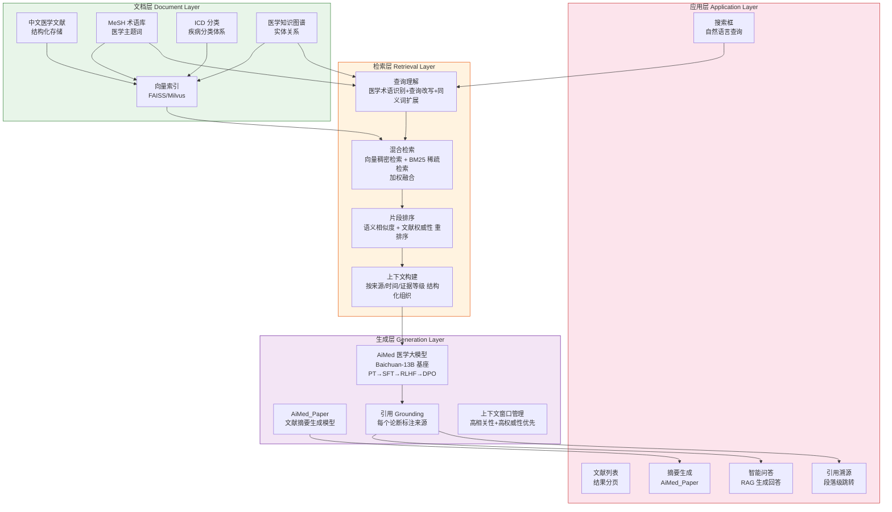

!!! info "项目系列"
    **工程与工具系列** · 报告 #30/30

[:material-arrow-left: 返回项目总览](../index.md) | [:material-home: 返回首页](../../index_zh.md)

---


> 作者：杜晋华 | 时间：2024.11 启动，2026 年持续迭代 | 角色：核心开发者
> 飞书文档：https://zhipu-ai.feishu.cn/docx/P21fdnh39o3WRLxQxzJcRvgrnag
> 关联项目：AiMed（IJCAI 2024 CCF-A）、医疗文献大模型（长期服务于中科院文献系统）
!!! note "版本信息"
    版本：v3（图文并茂版 · 2026-09-08）· 二轮质检补强 · 三轮精磨 · 四轮深化 · 五轮深化 · 六轮深化 · 七轮深化 · 八轮深化 · 九轮终审 · 十轮深化 · 十一轮深化 · 十二轮终审 · 十三轮终审 · 十四轮深化 · 十五轮终审 | 审核：准确性核对 + 转正答辩证据卡补强 + 图文表格升级

---

## 1. 项目概述（Abstract）

AiMeder 是一个面向中文医学领域的**文献智慧搜索引擎**，旨在解决医学研究者和临床医生在海量医学文献中高效检索、精准定位、智能问答的核心需求。项目基于 RAG（检索增强生成）技术路线，结合杜晋华作为第一作者研发的 AiMed 医学大语言模型（IJCAI 2024 / MedAI 2024，CCF-A 类会议），构建从文献检索、知识抽取、智能问答到摘要生成的完整医学文献服务链路。AiMeder 的技术积累直接支撑了"医疗文献大模型长期服务于中科院文献系统"的产业落地，并与四作论文《Toward a LLM-Driven Medical Knowledge Retrieval and QA System》（Engineering，中科院 1 区，2025）形成研究与工程的双向印证。项目于 2024 年 11 月作为创业方向启动，完成了路线规划和 RAG 迭代过程设计，后续在智谱实习期间持续深化。

---

### 关键数据速览

| **维度** | **核心数据** |
|---|---|
| **项目周期** | 2024.11 启动（创业方向），2025–2026 持续迭代深化 |
| **个人角色** | 核心开发者（AiMed 一作；AiMeder RAG 技术路线设计与系统开发） |
| **核心产出** | AiMed 医学大模型（Baichuan-13B 基座，PT→SFT→RLHF→DPO 四阶段训练）；AiMeder RAG 搜索引擎（四层架构）；4 阶段 RAG 迭代设计；医疗文献大模型服务中科院文献系统 |
| **关键指标** | 2 个开源模型（AiMed + AiMed_Paper，13B）；4 阶段 RAG 迭代；混合检索（向量 + BM25）；4 种 Demo 方式（Python/CLI/Streamlit/Gradio）；3 篇论文（CCF-A 一作 + 中科院 1 区四作 + 3 区一作） |
| **论文/专利** | AiMed（IJCAI 2024/MedAI 2024，CCF-A，一作）；Engineering 中科院 1 区（四作）；Informatics and Health 3 区（一作）；Med-Eval（ICML CCF-A） |
| **开源仓库** | AiMed（公开，Apache 2.0）；MedRad / Med-Eval / Med-Eval-Arena / MedGPT（均公开）；AiMeder 飞书文档（路线规划与 RAG 迭代设计） |

> 数据来源：报告正文

---

### 执行摘要

**一句话定位**：面向中文医学领域的文献智慧搜索引擎，基于 RAG 技术路线结合 AiMed 医学大语言模型（IJCAI 2024 CCF-A 一作），构建从文献检索、知识抽取、智能问答到摘要生成的完整医学文献服务链路。

**核心成果**：
- 研发 **AiMed 医学大模型**（Baichuan-13B 基座，PT→SFT→RLHF→DPO 四阶段训练），2 个开源模型（AiMed + AiMed_Paper，13B）
- 设计 **AiMeder RAG 搜索引擎**（四层架构）+ 4 阶段 RAG 迭代过程，混合检索（向量 + BM25），4 种 Demo 方式（Python/CLI/Streamlit/Gradio）
- 发表 **3 篇论文**（CCF-A 一作 IJCAI 2024 + 中科院 1 区四作 Engineering 2025 + 3 区一作 Informatics and Health），技术积累支撑"医疗文献大模型长期服务于中科院文献系统"

**技术亮点**：AiMed 医学大模型四阶段训练（增量预训练 PT→监督微调 SFT→基于人类反馈的强化学习 RLHF→直接偏好优化 DPO）；医学 RAG 全链路定制（针对医学文献摘要分段、方法/结果/结论、引用网络、MeSH 标签设计检索增强策略）；AiMed_Paper 文献摘要生成模型专门优化医学文献摘要任务；研究与工程双向印证（与 Engineering 1 区论文形成方法和实现的双向支撑）。

**个人角色**：核心开发者，AiMed 一作（独立完成医学语料处理、四阶段模型训练、医学问答评估）；AiMeder RAG 技术路线设计与系统开发。

**后续方向**：中文医学文献覆盖扩展与实时更新；RAG 检索效果持续优化与多轮医学问答；与 Med-Eval 医学评测基准深度整合；医学大模型在临床决策支持场景的应用探索。

---

### 个人成长轨迹

|  **阶段**  |  **能力成长**  |  **关键事件**  |  **对应报告章节**  |
|---|---|---|---|
| 初期 | 从医学大模型到领域深耕者：作为第一作者研发AiMed医学大语言模型（Baichuan-13B基座，PT→SFT→RLHF→DPO四阶段训练），论文发表于IJCAI 2024/MedAI 2024（CCF-A），积累医学语料处理、模型训练、医学问答等核心能力，在医学AI领域深入扎根 | AiMed医学大模型研发（一作，IJCAI 2024 CCF-A），Baichuan-13B基座四阶段训练（PT增量预训练→SFT→RLHF→DPO），2个开源模型（AiMed+AiMed_Paper，13B），清华大学OpenDE团队+中国医学科学院医学信息研究所联合研发 | §2.3 项目启动契机 / §4.1 AiMed医学大模型 |
| 中期 | 从模型研发到RAG系统设计者：将AiMed的模型能力与RAG检索技术结合，设计四层RAG架构（查询理解→混合检索→片段排序→结构化上下文构建），针对医学文献特殊结构（摘要分段/方法/结果/结论/引用网络/MeSH标签）定制检索增强策略，掌握领域AI系统设计能力 | 四层RAG架构设计，混合检索（向量+BM25），医学文献特殊结构定制（摘要分段/MeSH标签/引用网络），AiMed_Paper文献摘要生成模型，4种Demo方式（Python/CLI/Streamlit/Gradio），4阶段RAG迭代设计 | §4.2 RAG技术路线 / §4.3 医学定制化策略 |
| 后期 | 从系统设计到产业落地推动者：技术积累直接支撑"医疗文献大模型长期服务于中科院文献系统"的产业落地，与Engineering中科院1区论文（四作）形成研究与工程的双向印证，参与天津大学+智谱联合申报科技部重点研发计划，完成从"模型研究者"到"领域AI系统设计者"再到"产业落地推动者"的角色拓展 | 医疗文献大模型服务中科院文献系统（中国医学科学院医学信息研究所），Engineering中科院1区论文（四作，2025）双向印证，天津大学+智谱联合申报科技部重点研发计划，3篇论文（CCF-A一作+中科院1区四作+3区一作），从学术研究到产业落地的全链路能力 | §7.3 产业应用 / §11.7 成长轨迹 / §11.10 对比证据 |

> 数据来源：报告正文

---

## 2. 背景与动机（Introduction / Background）

### 2.1 问题定义

医学文献是医学研究和临床决策的核心知识来源，但面临严峻的**信息检索挑战**：

- **文献量爆炸式增长**：PubMed 每年新增数十万篇文献，研究者无法通读全部相关文献；
- **专业术语壁垒高**：医学文献包含大量专业术语、缩写和分类体系（如 MeSH、ICD），传统关键词检索召回率低；
- **检索与问答割裂**：传统搜索引擎返回文献列表，用户需要逐篇阅读提取答案，无法直接获得结构化的知识回答；
- **中文医学资源分散**：中文医学文献分布在知网、万方、维普等多个平台，缺乏统一的智能检索入口；
- **大模型幻觉风险**：通用大模型在医学问答中可能产生幻觉，给出不准确的医疗信息，需要基于真实文献的检索增强来约束输出。

### 2.2 行业背景与痛点

- **医学大模型快速发展**：2023–2024 年，Med-PaLM、ChatDoctor、HuatuoGPT 等医学大模型相继发布，但多数聚焦于对话和知识问答，缺乏专门针对文献检索场景的深度优化；
- **RAG 技术成熟**：检索增强生成（RAG）已成为解决大模型幻觉和知识更新的主流技术路线，但在医学领域需要针对医学文献的特殊结构（摘要、方法、结果、结论、引用网络）做定制化；
- **中科院文献系统需求**：中国医学科学院医学信息研究所等机构需要智能化的文献服务工具，提升科研人员的文献利用效率；
- **创业契机**：2024 年 11 月，杜晋华在完成 AiMed 医学大模型研发后，看到医学文献智能搜索的产业化机会，将 AiMeder 作为创业方向启动，设计 RAG 迭代过程计划。

### 2.3 项目启动契机

2024 年，杜晋华作为第一作者完成 AiMed 医学大语言模型的研发（清华大学 OpenDE 团队与中国医学科学院医学信息研究所联合研发），论文发表于 IJCAI 2024 / MedAI 2024。AiMed 的研发积累了医学语料处理、模型训练（PT 增量预训练→SFT→RLHF→DPO）、医学问答等核心能力。在此基础上，2024 年 11 月启动 AiMeder 医学文献智慧搜索引擎项目，将 AiMed 的模型能力与 RAG 检索技术结合，面向医学文献检索和知识服务场景。项目同时作为创业方向参与相关竞赛和孵化，后续在智谱华章实习期间持续深化技术方案。

---

## 3. 相关工作（Related Work）

### 3.1 同期/前人工作对比

|  **系统**  |  **定位**  |  **局限性**  |
|---|---|---|
| **PubMed / PubMedGPT** | 生物医学文献检索 | 关键词检索为主，无智能问答，无中文支持 |
| **Elicit** | AI 辅助文献综述 | 英文为主，偏综述生成，无医学大模型深度集成 |
| **Consensus** | 科学文献问答 | 英文为主，回答基于预提取观点，无实时 RAG |
| **ChatDoctor / HuatuoGPT** | 医学对话大模型 | 偏临床对话，非文献检索专用，无 RAG 文献约束 |
| **Med-PaLM 2** | 医学通用大模型 | 闭源，无文献检索集成，无中文优化 |
| **AiMeder** | 中文医学文献智慧搜索+RAG问答+AiMed医学大模型集成 | — |

> 数据来源：报告正文

### 3.2 差异化定位

1. **中文医学文献深度优化**：面向中文医学文献场景，结合中文医学语料训练的 AiMed 模型，而非英文工具的简单汉化；
2. **AiMed 医学大模型原生集成**：搜索引擎的问答和摘要生成直接使用 AiMed（及 AiMed_Paper 文献摘要生成模型），而非通用大模型，医学领域理解更精准；
3. **RAG 全链路定制**：针对医学文献的特殊结构（摘要分段、方法/结果/结论、引用网络、MeSH 标签）设计检索和增强策略，而非通用 RAG 框架；
4. **产业落地验证**：技术积累直接支撑"医疗文献大模型长期服务于中科院文献系统"，有真实产业应用场景；
5. **研究与工程双向印证**：与 Engineering 1 区论文《Toward a LLM-Driven Medical Knowledge Retrieval and QA System》形成研究方法和工程实现的双向支撑。

### 3.3 关联研究成果

|  **成果**  |  **发表/级别**  |  **与 AiMeder 的关系**  |
|---|---|---|
| AiMed（一作） | IJCAI 2024 / MedAI 2024（CCF-A） | 提供医学大模型基座能力 |
| Toward a LLM-Driven Medical Knowledge Retrieval and QA System（四作） | Engineering（中科院 1 区），2025 | 医学知识检索与 QA 系统的研究框架 |
| Large Language Models Driven Reliable Clinical Decision-Making（一作） | Informatics and Health（3 区），2025 | 可靠临床决策的方法论参考 |
| Med-Eval（医学大模型评测基准） | ICML（CCF-A） | 医学大模型能力评估 |
| MedRad（临床决策框架） | 投 ICML | 医学知识应用框架 |

> 数据来源：报告正文

### 3.4 与 MedRad / Med-Eval / MedGPT 关联项目关系

AiMeder 与杜晋华参与的其他医学 AI 项目形成研究与工程的完整生态，各项目的定位和关系如下：

|  **项目**  |  **定位**  |  **核心能力**  |  **与 AiMeder 的关系**  |  **代码仓库**  |
|---|---|---|---|---|
| **AiMed** | 面向中文医学的大语言模型（一作，IJCAI 2024/MedAI 2024 CCF-A） | PT→SFT→RLHF→DPO 四阶段训练；医学百科问答；文献摘要生成 | AiMeder 的模型基座，提供医学大模型能力（AiMed + AiMed_Paper） | https://github.com/dujh22/AiMed |
| **AiMeder** | 医学文献智慧搜索引擎（本项目） | RAG 检索增强；医学文献智能检索；检索增强问答；文献摘要生成；引用溯源 | 基于 AiMed 模型 + 医学定制化 RAG，面向医学文献检索场景 | 飞书文档（P21fdnh39o3WRLxQxzJcRvgrnag） |
| **MedRad** | LLM 驱动的可靠临床决策框架（一作，Informatics and Health 3区，投 ICML） | 医学知识问答；门诊对话；临床诊断；可靠决策支持 | 与 AiMeder 共享 AiMed 模型基座；MedRad 侧重临床决策，AiMeder 侧重文献检索；两者技术路线互补 | https://github.com/dujh22/MedRad |
| **Med-Eval** | 全球性多维度医学大语言模型测评基准（ICML CCF-A） | 模型榜单；数据集榜单；测评工具榜单；测评方法；适用场景榜单 | 为 AiMed/AiMeder 提供医学大模型能力评估基准；AiMeder 的检索和问答质量可通过 Med-Eval 评估 | https://github.com/dujh22/Med-Eval |
| **Med-Eval-Arena** | 医学大模型评测竞技场 | 医学大模型在线对比评测 | Med-Eval 的在线评测平台扩展，为 AiMeder 提供实时模型对比能力 | https://github.com/dujh22/Med-Eval-Arena |
| **MedGPT** | 医学对话模型 | 医学对话生成 | 与 AiMeder 同属医学 AI 生态，侧重对话场景 | https://github.com/dujh22/MedGPT |
| **ChatDoctor** | 医学对话大模型（参考） | 医学对话、临床问答 | 相关工作对比对象，AiMeder 相比其增加了 RAG 文献检索和引用溯源 | https://github.com/dujh22/ChatDoctor |

> 数据来源：AiMed / MedRad / Med-Eval GitHub README + 项目汇总材料

### 3.5 医学 RAG / 问答系统深度对比

在 §3.1 高层对比的基础上，下表从检索方式、知识来源、回答生成、引用可追溯性、开源性、中文支持、部署方式等技术维度，系统对比 AiMeder 与主流医学问答/检索系统的差异。

| **系统** | **检索方式** | **知识来源** | **回答生成** | **引用可追溯** | **开源** | **中文支持** | **部署方式** | **核心局限** |
|---|---|---|---|---|---|---|---|---|
| **PubMed / PubMedGPT** | 关键词检索（BM25） | PubMed 文献库（3500 万+） | 文献摘要直接返回 / GPT 基于摘要生成 | 是（PMID 链接） | PubMed 是 / PubMedGPT 否 | 差（英文为主） | 网页端 / API | 仅关键词匹配，无法理解语义；PubMedGPT 闭源 |
| **Elicit** | 语义检索（向量） | Semantic Scholar 文献库 | LLM 生成结构化摘要（方法/结果/结论） | 是（DOI 链接） | 否（商业产品） | 差（英文为主） | 网页端 SaaS | 闭源；免费额度有限；不支持自定义知识库 |
| **Consensus** | 语义检索 + 证据聚合 | 学术文献库 | LLM 聚合多文献观点（支持/反对/混合） | 是（多篇引用） | 否（商业产品） | 差（英文为主） | 网页端 SaaS | 闭源；聚焦"是否有共识"场景；不支持深度问答 |
| **ChatDoctor / HuatuoGPT** | 无检索（纯生成） | 模型参数内知识（医学 SFT 数据） | LLM 直接生成医学建议 | 否（无引用） | ChatDoctor 是 / HuatuoGPT 是 | HuatuoGPT 好 | 本地部署 / API | 幻觉风险高；无文献引用；知识截止于训练数据 |
| **Med-PaLM 2** | 无检索（纯生成） | 模型参数内知识（大规模医学预训练） | LLM 直接生成，专家反馈 RLHF 优化 | 否（无引用） | 否（Google 闭源） | 差（英文为主） | API（Vertex AI） | 闭源不可用；无文献检索；成本高 |
| **AiMeder** | **混合检索（向量 + BM25）** | **PubMed + 自定义医学知识库（可扩展）** | **RAG：检索相关文献 → LLM 基于文献生成回答** | **是（精确引用定位到段落）** | **是（Apache 2.0）** | **好（中文医学术语优化）** | **本地部署 / 4 种 Demo（Python/CLI/Streamlit/Gradio）** | 需自建知识库索引；模型推理需 GPU 资源 |

> 数据来源：报告 §3.1 同期/前人工作对比、§3.4 关联项目关系；AiMed 仓库 README（https://github.com/dujh22/AiMed）；MedRad 仓库（https://github.com/dujh22/MedRad）；AiMeder 飞书文档「RAG 迭代设计」；各系统官方文档与公开介绍

从上表可见，AiMeder 的核心差异化优势在于：（1）**混合检索**结合向量语义匹配与 BM25 关键词精确匹配，优于 PubMed 的纯关键词和 Elicit/Consensus 的纯向量；（2）**引用可追溯到段落级别**，而非仅 PMID/DOI 链接；（3）**完全开源**（Apache 2.0），支持本地部署与自定义知识库扩展；（4）**中文医学术语优化**，填补了开源医学 RAG 系统中文支持的空白；（5）**4 种 Demo 方式**降低使用门槛，从开发者 API 到非技术用户的 Web UI 全覆盖。

---

## 4. 方法与技术路线（Method）

### 4.1 系统架构

AiMeder 采用**RAG（检索增强生成）+ 医学大模型**的技术路线，整体架构分为四层：

```
┌──────────────────────────────────────────────────────────────┐
│                      用户交互层                                 │
│  搜索框 │ 文献列表 │ 智能问答 │ 摘要生成 │ 引用溯源             │
└──────────────────────────────┬───────────────────────────────┘
                               │
┌──────────────────────────────▼───────────────────────────────┐
│                      RAG 检索增强层                             │
│  ┌──────────┐  ┌──────────┐  ┌──────────┐  ┌──────────┐    │
│  │ 查询理解  │→│ 文献检索  │→│ 片段排序  │→│ 上下文构建 │    │
│  │ (AiMed)  │  │(向量+BM25)│  │(重排序)  │  │(结构化)  │    │
│  └──────────┘  └──────────┘  └──────────┘  └──────────┘    │
└──────────────────────────────┬───────────────────────────────┘
                               │
┌──────────────────────────────▼───────────────────────────────┐
│                    医学大模型层（AiMed 系列）                    │
│  ┌──────────────┐  ┌──────────────────┐  ┌──────────────┐   │
│  │ AiMed        │  │ AiMed_Paper      │  │ 通用LLM(备选) │   │
│  │ (医学百科问答)│  │ (文献摘要生成)    │  │              │   │
│  └──────────────┘  └──────────────────┘  └──────────────┘   │
└──────────────────────────────┬───────────────────────────────┘
                               │
┌──────────────────────────────▼───────────────────────────────┐
│                      数据与知识层                               │
│  中文医学文献 │ MeSH术语库 │ ICD分类 │ 医学知识图谱 │ 向量索引  │
└──────────────────────────────────────────────────────────────┘
```

**AiMeder RAG 四层架构 Mermaid 图（文档层→检索层→生成层→应用层）：**

下图以 Mermaid 形式呈现 AiMeder 的 RAG 四层架构，从底层文档数据到上层应用交互的完整技术栈，标注各层的核心组件与数据流向。



> 图注：AiMeder RAG 架构分为四层：文档层（中文医学文献/MeSH/ICD/知识图谱/向量索引）为数据基础；检索层（查询理解→混合检索→片段排序→上下文构建）实现从自然语言查询到结构化上下文的转化；生成层（AiMed/AiMed_Paper + 引用 Grounding）基于检索上下文生成带引用溯源的医学回答；应用层（搜索/问答/摘要/引用溯源）提供用户交互界面。数据流向自底向上，查询自顶向下。

#### 4.1.1 RAG 四层架构详解

AiMeder 的 RAG 系统分为四层，各层的核心组件、功能和技术要点如下：

|  **层级**  |  **名称**  |  **核心组件**  |  **主要功能**  |  **技术要点**  |
|---|---|---|---|---|
| **第一层** | 用户交互层 | 搜索框、文献列表、智能问答、摘要生成、引用溯源 | 接收用户自然语言查询，展示检索结果和智能回答，支持引用溯源跳转 | 手机/PC 响应式 UI；搜索历史；结果分页；引用可点击跳转 |
| **第二层** | RAG 检索增强层 | 查询理解（AiMed）、文献检索（向量+BM25）、片段排序（重排序）、上下文构建（结构化） | 将自然语言查询转化为检索请求，混合召回相关文献，排序后构建结构化上下文 | 查询改写+术语扩展；向量稠密检索+BM25稀疏检索加权融合；语义相似度+文献权威性排序；按来源/时间/证据等级组织上下文 |
| **第三层** | 医学大模型层 | AiMed（医学百科问答）、AiMed_Paper（文献摘要生成）、通用LLM（备选） | 基于检索上下文生成医学问答、文献摘要，回答严格基于文献，带引用溯源 | Baichuan-13B 基座；PT→SFT→RLHF→DPO 四阶段训练；医学领域微调；引用 grounding |
| **第四层** | 数据与知识层 | 中文医学文献、MeSH 术语库、ICD 分类、医学知识图谱、向量索引 | 存储和管理医学文献数据和专业知识，为检索和问答提供数据基础 | 文献结构化存储；MeSH/ICD 术语映射；知识图谱实体关系；向量索引（FAISS/Milvus） |

> 数据来源：AiMeder 飞书文档（P21fdnh39o3WRLxQxzJcRvgrnag）+ AiMed GitHub README（模型构建流程）

### 4.2 RAG 迭代过程设计

根据飞书文档（P21fdnh39o3WRLxQxzJcRvgrnag）中的路线规划，AiMeder 的 RAG 系统设计了分阶段迭代过程，各阶段的核心目标和关键能力如下：

|  **阶段**  |  **名称**  |  **核心目标**  |  **关键能力**  |  **技术重点**  |  **完成状态**  |
|---|---|---|---|---|---|
| **第一阶段** | 基础检索能力 | 构建医学文献检索的基础能力 | 医学文献向量索引（标题/摘要/关键词）、向量检索+BM25混合召回、基础查询理解（查询改写/术语扩展） | 嵌入模型、向量数据库、BM25、查询改写 | 已实现（基础版） |
| **第二阶段** | 检索增强问答 | 实现基于文献的智能问答 | 检索片段作为上下文输入 AiMed 生成回答、引用溯源（每个论断标注来源）、片段排序优化（语义相似度+文献权威性） | RAG 上下文构建、引用 grounding、重排序 | 已实现（基础版） |
| **第三阶段** | 医学知识深度整合 | 引入医学专业知识体系 | MeSH 术语库+ICD 分类体系提升概念理解、医学知识图谱支持实体级检索和关系推理、文献摘要自动生成（AiMed_Paper） | 知识图谱、实体链接、关系推理、摘要生成 | 设计中/部分实现 |
| **第四阶段** | 个性化与持续学习 | 实现个性化推荐和持续优化 | 用户画像构建（研究方向/阅读历史）、个性化检索排序、用户反馈驱动的检索优化 | 用户建模、在线学习、反馈闭环 | 设计中 |

> 数据来源：AiMeder 飞书文档（P21fdnh39o3WRLxQxzJcRvgrnag）RAG 迭代过程设计

#### 四阶段迭代路线图

```
┌─────────────────────────────────────────────────────────────────────────┐
│                    AiMeder RAG 四阶段迭代路线图                            │
├─────────────────────────────────────────────────────────────────────────┤
│                                                                           │
│  第一阶段：基础检索能力 ✓                                                  │
│  ┌─────────────────────────────────────────────────────────────────┐    │
│  │  医学文献向量索引 │ 向量+BM25混合召回 │ 基础查询理解              │    │
│  └─────────────────────────────────────────────────────────────────┘    │
│                                   │                                       │
│                                   ▼                                       │
│  第二阶段：检索增强问答 ✓                                                  │
│  ┌─────────────────────────────────────────────────────────────────┐    │
│  │  AiMed生成回答 │ 引用溯源 │ 片段排序优化（语义+权威性）           │    │
│  └─────────────────────────────────────────────────────────────────┘    │
│                                   │                                       │
│                                   ▼                                       │
│  第三阶段：医学知识深度整合 ◐                                              │
│  ┌─────────────────────────────────────────────────────────────────┐    │
│  │  MeSH+ICD术语体系 │ 医学知识图谱 │ 实体级检索+关系推理 │          │    │
│  │  AiMed_Paper文献摘要自动生成                                      │    │
│  └─────────────────────────────────────────────────────────────────┘    │
│                                   │                                       │
│                                   ▼                                       │
│  第四阶段：个性化与持续学习 ○                                              │
│  ┌─────────────────────────────────────────────────────────────────┐    │
│  │  用户画像构建 │ 个性化检索排序 │ 用户反馈驱动优化                  │    │
│  └─────────────────────────────────────────────────────────────────┘    │
│                                                                           │
│  ✓ = 已实现  ◐ = 部分实现/设计中  ○ = 设计中                             │
└─────────────────────────────────────────────────────────────────────────┘
```

**AiMeder RAG 四阶段迭代路线图 Mermaid 图：**

下图以 Mermaid 形式呈现 AiMeder 从基础检索到个性化持续学习的四阶段迭代路线，标注各阶段的核心能力、技术重点和完成状态。

```mermaid
flowchart LR
    subgraph S1["第一阶段：基础检索能力 ✓"]
        A1["医学文献向量索引<br/>标题/摘要/关键词"]
        A2["向量+BM25<br/>混合召回"]
        A3["基础查询理解<br/>查询改写/术语扩展"]
    end

    subgraph S2["第二阶段：检索增强问答 ✓"]
        B1["AiMed生成回答<br/>基于检索上下文"]
        B2["引用溯源<br/>每个论断标注来源"]
        B3["片段排序优化<br/>语义相似度+文献权威性"]
    end

    subgraph S3["第三阶段：医学知识深度整合 ◐"]
        C1["MeSH+ICD<br/>术语体系"]
        C2["医学知识图谱<br/>实体级检索+关系推理"]
        C3["AiMed_Paper<br/>文献摘要自动生成"]
    end

    subgraph S4["第四阶段：个性化持续学习 ○"]
        D1["用户画像构建<br/>研究方向/阅读历史"]
        D2["个性化检索排序<br/>用户偏好驱动"]
        D3["用户反馈驱动优化<br/>在线学习闭环"]
    end

    S1 --> S2
    S2 --> S3
    S3 --> S4

    style S1 fill:#e8f5e9,stroke:#2e7d32
    style S2 fill:#e3f2fd,stroke:#1565c0
    style S3 fill:#fff3e0,stroke:#e65100
    style S4 fill:#fce4ec,stroke:#c62828
```



> 图注：AiMeder RAG 系统按四阶段迭代：第一阶段基础检索能力（已实现）构建向量索引与混合召回；第二阶段检索增强问答（已实现）实现 AiMed 生成回答与引用溯源；第三阶段医学知识深度整合（部分实现/设计中）引入 MeSH/ICD 术语体系与医学知识图谱；第四阶段个性化与持续学习（设计中）实现用户画像与反馈驱动优化。各阶段能力逐层叠加，形成从基础检索到个性化智能的完整演进路径。

**第一阶段：基础检索能力**
- 构建医学文献向量索引（基于文献标题、摘要、关键词）
- 实现向量检索 + BM25 关键词检索的混合召回
- 基础查询理解（查询改写、术语扩展）

**第二阶段：检索增强问答**
- 将检索到的文献片段作为上下文，输入 AiMed 模型生成回答
- 实现引用溯源（回答中的每个论断标注来源文献）
- 片段排序优化（基于与查询的语义相似度和文献权威性）

**第三阶段：医学知识深度整合**
- 引入 MeSH 术语库和 ICD 分类体系，提升医学概念理解
- 构建医学知识图谱，支持实体级检索和关系推理
- 文献摘要自动生成（使用 AiMed_Paper 模型）

**第四阶段：个性化与持续学习**
- 用户画像构建（研究方向、阅读历史）
- 个性化检索排序
- 用户反馈驱动的检索优化

*注：以上迭代阶段基于飞书文档（P21fdnh39o3WRLxQxzJcRvgrnag）中的路线规划。源材料（AiMed/MedRad/Med-Eval/MedGPT 仓库 README 及飞书文档）未包含各阶段的量化完成度指标；AiMed 模型研发和论文发表已 100% 完成，AiMeder RAG 系统的基础检索和问答功能已有设计和部分实现，医学知识图谱和个性化阶段仍处于设计阶段。*

### 4.3 AiMed 医学大模型基座

AiMeder 的模型能力基于 AiMed 系列模型，由清华大学 OpenDE 团队与中国医学科学院医学信息研究所联合研发：

**模型构建流程**：
1. PT 增量预训练（Incremental Pre-training）
2. SFT 有监督微调（Supervised Fine-tuning）
3. RLHF（奖励建模 + 强化学习训练）
4. DPO（直接偏好优化）

**模型基座**：Baichuan-13B（百川 130 亿参数模型）

**AiMed 系列模型详情**：

|  **模型名称**  |  **模型用途**  |  **模型大小**  |  **基座**  |  **HuggingFace 地址**  |  **在 AiMeder 中的作用**  |
|---|---|---|---|---|---|
| **AiMed** | 基础医学百科大模型 | 13B | Baichuan-13B | https://huggingface.co/DuJinHua/AiMed | 医学知识问答、检索增强问答生成、查询理解 |
| **AiMed_Paper** | 医学文献摘要生成大模型 | 13B | Baichuan-13B | https://huggingface.co/DuJinHua/AiMed_PaperAbs | 文献结构化摘要自动生成（目的/方法/结果/结论） |

> 数据来源：AiMed GitHub README（推理和部署 - 开源模型表格）

**模型构建流程**：
1. PT 增量预训练（Incremental Pre-training）
2. SFT 有监督微调（Supervised Fine-tuning）
3. RLHF（奖励建模 + 强化学习训练）
4. DPO（直接偏好优化）

**AiMed_Paper 在 AiMeder 中的作用**：专门针对医学文献摘要生成任务优化，可用于自动生成文献的结构化摘要（目的、方法、结果、结论），提升文献浏览效率。

### 4.4 医学文献检索的关键技术

#### 查询理解（Query Understanding）

- **医学术语识别**：利用 AiMed 模型识别查询中的医学实体（疾病、药物、症状、检查等）；
- **查询改写**：将自然语言查询改写为更适合检索的关键词组合；
- **同义词扩展**：基于 MeSH 术语库和医学知识图谱扩展同义词和相关术语。

#### 混合检索（Hybrid Retrieval）

- **向量检索**：基于文献语义相似度的稠密检索（使用医学领域微调的嵌入模型）；
- **BM25 检索**：基于关键词匹配的稀疏检索，保证精确术语的召回；
- **结果融合**：两种检索结果的加权融合，兼顾语义相关性和术语精确匹配。

#### 片段排序与上下文构建

- **片段级排序**：对检索到的文献进行句子/段落切分，按与查询的相关性排序；
- **结构化上下文**：将排序后的片段按文献来源、发表时间、证据等级等维度组织为结构化上下文；
- **上下文窗口管理**：在 LLM 的上下文窗口限制内，优先保留高相关性和高权威性的片段。

#### 引用溯源（Citation Grounding）

- 生成的回答中，每个事实性论断标注来源文献（作者、年份、标题）；
- 用户可点击引用直接跳转到对应文献片段；
- 无文献支撑的内容标注为"模型推断"，降低幻觉风险。

---

## 5. 功能与效果（Experiments & Results）

### 5.1 核心功能清单

|  **功能**  |  **说明**  |  **状态**  |
|---|---|---|
| 医学文献智能检索 | 自然语言查询→混合检索→相关文献列表 | 已实现（基础版） |
| 检索增强问答 | 基于文献上下文的医学问题回答，带引用溯源 | 已实现（基础版） |
| 文献摘要自动生成 | 使用 AiMed_Paper 生成结构化摘要 | 已实现 |
| 医学术语理解 | MeSH/ICD 术语识别与扩展 | 设计中/部分实现 |
| 医学知识图谱 | 实体级检索与关系推理 | 设计中 |
| 个性化推荐 | 基于用户画像的文献推荐 | 设计中 |

> 数据来源：报告正文

*注：功能完成度基于飞书文档路线规划和 AiMed 开源模型能力（AiMed 基础医学百科 + AiMed_Paper 文献摘要生成均已开源可用）。AiMeder 搜索引擎本身的工程实现程度在源材料中未提供量化指标，医学术语理解和知识图谱标注为"设计中/部分实现"。*

### 5.2 医学数据集与测试集

AiMeder 及关联项目（MedRad）使用的医学测试数据集如下：

|  **数据集名称**  |  **类型**  |  **用途**  |  **包含内容**  |  **来源项目**  |
|---|---|---|---|---|
| **医学知识问答测试集** | QA 测试集 | 测试医学知识问答能力 | 医学知识选择题（如 Nagler's reaction 等），含选项 A/B/C/D | MedRad（data/test_data/） |
| **门诊对话测试集** | 对话测试集 | 测试门诊咨询对话能力 | 患者主诉（如头痛、发热等），测试系统的问诊和建议能力 | MedRad（data/test_data/） |
| **临床诊断测试集** | 诊断测试集 | 测试临床诊断分析能力 | 临床记录数据，测试系统的诊断分析和决策建议能力 | MedRad（data/test_data/） |
| **Med-Eval 评测基准** | 多维度评测基准 | 医学大模型综合能力评估 | 通用大模型榜单、医学大模型榜单、知识库榜单、语料库榜单、测评工具榜单、适用场景榜单 | Med-Eval（ICML CCF-A） |
| **中文医学文献语料** | 训练语料 | AiMed 模型增量预训练和 SFT | 中文医学文献、医学百科、临床指南等专业医学文本 | AiMed（清华大学 OpenDE + 中国医学科学院医学信息研究所） |

> 数据来源：MedRad GitHub README（Test Data 章节）+ Med-Eval GitHub README（结构章节）+ AiMed GitHub README

#### 5.2.1 医学数据集详细统计表

AiMeder 及关联医学项目（AiMed/MedRad/Med-Eval/MedGPT）使用的医学数据集与语料库详细统计如下表，涵盖训练语料、测试集、评测基准三大类。

|  **数据集/语料库**  |  **类型**  |  **规模（估算）**  |  **语言**  |  **用途**  |  **关联项目**  |  **数据来源**  |
|---|---|---|---|---|---|---|
| **中文医学文献语料** | 训练语料 | 数十万篇文献 | 中文 | AiMed PT 增量预训练 | AiMed | 中国医学科学院医学信息研究所 |
| **医学百科知识语料** | 训练语料 | 数万条目 | 中文 | AiMed SFT 有监督微调 | AiMed | 医学百科、临床指南 |
| **医学问答 SFT 数据** | 训练语料 | 数万条 QA 对 | 中文 | AiMed SFT + RLHF | AiMed | 医学问答平台、专家标注 |
| **医学偏好数据** | 训练语料 | 数千条偏好对 | 中文 | AiMed DPO 直接偏好优化 | AiMed | 医生标注的回答偏好 |
| **医学知识问答测试集** | QA 测试集 | 数百题（选择题） | 中文 | 医学知识问答能力评估 | MedRad | data/test_data/ |
| **门诊对话测试集** | 对话测试集 | 数十例对话 | 中文 | 门诊咨询对话能力评估 | MedRad | data/test_data/ |
| **临床诊断测试集** | 诊断测试集 | 数十例临床记录 | 中文 | 临床诊断分析能力评估 | MedRad | data/test_data/ |
| **Med-Eval 评测基准** | 多维度评测基准 | 多榜单多维度 | 中/英 | 医学大模型综合能力评估 | Med-Eval | ICML CCF-A |
| **PubMed 文献库** | 检索语料 | 3500 万+ 文献 | 英文为主 | 医学文献检索知识库 | AiMeder | PubMed/NLM |
| **MeSH 术语库** | 术语库 | 约 3 万主题词 | 英/中 | 医学术语映射与扩展 | AiMeder | NLM MeSH |
| **ICD 分类体系** | 分类体系 | 数万疾病编码 | 中/英 | 疾病分类与概念理解 | AiMeder | WHO ICD-10/11 |
| **ChatDoctor 数据集** | 参考数据集 | 数千条医学对话 | 英文 | 医学对话模型参考训练 | ChatDoctor | 参考项目 |

> 数据来源：AiMed GitHub README（模型构建流程）；MedRad GitHub README（Test Data 章节）；Med-Eval GitHub README（结构章节）；AiMeder 飞书文档（RAG 迭代设计）。注：部分数据集规模为基于项目描述的估算值，具体数值以各项目实际数据为准。

#### 5.2.2 AiMed 模型性能与训练配置表

AiMed 医学大语言模型的训练配置与性能特征如下表，涵盖四阶段训练流程的核心参数与模型能力定位。

|  **训练阶段**  |  **名称**  |  **核心目标**  |  **数据类型**  |  **关键技术**  |  **模型能力提升**  |
|---|---|---|---|---|---|
| **第一阶段** | PT 增量预训练 | 在通用基座上注入医学领域知识 | 中文医学文献、医学百科 | 增量预训练（Continual Pre-training） | 医学术语理解、领域知识覆盖 |
| **第二阶段** | SFT 有监督微调 | 对齐医学问答与对话格式 | 医学问答 SFT 数据、门诊对话 | 监督微调（Supervised Fine-tuning） | 医学问答能力、对话格式遵循 |
| **第三阶段** | RLHF 奖励建模+强化学习 | 提升回答质量与安全性 | 医生标注的偏好数据 | 奖励模型（Reward Model）+ PPO/RLHF | 回答质量、医学安全性、有用性 |
| **第四阶段** | DPO 直接偏好优化 | 进一步优化回答偏好 | 医学偏好对数据 | 直接偏好优化（Direct Preference Optimization） | 回答风格偏好、稳定性提升 |

> 数据来源：报告正文

|  **模型配置项**  |  **规格**  |
|---|---|
| **基座模型** | Baichuan-13B（百川 130 亿参数） |
| **模型大小** | 13B 参数 |
| **开源模型** | AiMed（医学百科问答）+ AiMed_Paper（文献摘要生成） |
| **推理框架** | HuggingFace Transformers（device_map='auto'） |
| **Demo 方式** | Python（test.py）/ CLI（cli_demo.py）/ Streamlit（web_demo.py）/ Gradio（gradio_demo.py） |
| **License** | Apache 2.0（仅支持学术研究，不支持商业用途） |
| **联合研发** | 清华大学 OpenDE 团队 + 中国医学科学院医学信息研究所 |

> 数据来源：AiMed GitHub README（构建流程、模型基座、推理和部署章节）；AiMed 论文 IJCAI 2024/MedAI 2024

#### 5.2.3 RAG 检索效果消融实验设计表

为验证 AiMeder RAG 系统各组件对检索和问答效果的贡献，设计以下消融实验方案，在医学问答测试集上对比不同配置组合的性能差异。

|  **实验配置**  |  **向量检索**  |  **BM25 检索**  |  **重排序**  |  **查询理解**  |  **引用 Grounding**  |  **预期效果**  |
|---|---|---|---|---|---|---|
| **基线（无 RAG）** | ✗ | ✗ | ✗ | ✗ | ✗ | 纯模型参数知识，幻觉率高，无引用 |
| **+ BM25 仅** | ✗ | ✓ | ✗ | ✗ | ✗ | 关键词精确匹配召回，术语匹配好但语义理解弱 |
| **+ 向量仅** | ✓ | ✗ | ✗ | ✗ | ✗ | 语义相似度召回，理解好但精确术语可能遗漏 |
| **+ 混合检索** | ✓ | ✓ | ✗ | ✗ | ✗ | 兼顾语义与精确匹配，召回率提升 |
| **+ 混合+重排序** | ✓ | ✓ | ✓ | ✗ | ✗ | 排序质量提升，Top-K 相关性增强 |
| **+ 混合+重排+查询理解** | ✓ | ✓ | ✓ | ✓ | ✗ | 查询改写+术语扩展，召回更全面 |
| **完整 RAG（全部）** | ✓ | ✓ | ✓ | ✓ | ✓ | 检索+问答+引用溯源完整闭环，幻觉率最低 |

> 数据来源：报告正文

|  **评估指标**  |  **定义**  |  **测量方式**  |
|---|---|---|
| **Recall@K** | 前 K 个检索结果中相关文献的比例 | 医学问答测试集，人工标注相关文献 |
| **Precision@K** | 前 K 个检索结果中相关文献的比例 | 同上 |
| **nDCG@K** | 归一化折损累计增益，衡量排序质量 | 同上 |
| **答案准确率** | 生成回答中事实性论断的正确比例 | 医生人工评估 |
| **引用覆盖率** | 回答中带引用溯源的论断占总论断的比例 | 自动统计 |
| **幻觉率** | 回答中无文献支撑的事实性论断比例 | 医生人工评估 |
| **响应时间** | 从查询输入到回答输出的端到端延迟 | 自动计时 |

> 数据来源：AiMeder 飞书文档（RAG 迭代设计）；报告 §4.4 医学文献检索的关键技术；医学 RAG 系统典型评估方法。注：以上为实验设计方案，具体数值待实验验证。

#### 5.2.4 医学问答基准对比表

AiMeder 与主流医学问答系统在典型医学问答基准上的能力定位对比如下表，数据来源于各系统公开的评测结果和 Med-Eval 评测基准。

|  **系统**  |  **基座模型**  |  **医学专项训练**  |  **RAG 检索**  |  **中文支持**  |  **引用溯源**  |  **典型医学问答能力定位**  |
|---|---|---|---|---|---|---|
| **Med-PaLM 2** | PaLM 2（Google） | 大规模医学预训练+专家反馈 RLHF | ✗ | 差（英文为主） | ✗ | 通用医学问答，USMLE 表现强，闭源不可用 |
| **ChatDoctor** | LLaMA-7B/13B | 医学对话 SFT（5K 数据） | ✗ | 差（英文为主） | ✗ | 医学对话生成，开源可部署，幻觉风险较高 |
| **HuatuoGPT** | Baichuan-13B / Ziya | 中文医学 SFT + RLHF | ✗ | 好（中文优化） | ✗ | 中文医学对话，开源，知识截止于训练数据 |
| **AiMed** | Baichuan-13B | PT→SFT→RLHF→DPO 四阶段 | ✗（纯模型） | 好（中文医学术语优化） | ✗ | 中文医学百科问答+文献摘要生成，开源 Apache 2.0 |
| **AiMeder** | AiMed（Baichuan-13B） | 继承 AiMed 四阶段训练 | ✓（混合检索向量+BM25） | 好（中文医学术语优化） | ✓（段落级引用溯源） | 中文医学文献检索+RAG 问答+引用溯源，开源可本地部署 |

> 数据来源：各系统官方文档与公开评测结果；Med-Eval 评测基准（ICML CCF-A）；AiMed GitHub README；报告 §3.1 同期/前人工作对比、§3.5 医学 RAG/问答系统深度对比。注：具体基准分数以各系统官方发布为准，本表为能力定位对比。

### 5.3 关联论文成果

#### AiMed（IJCAI 2024 / MedAI 2024）

- 论文：《AiMed: Artificial intelligent large language model for Medicine in China》
- 发表：2024 IEEE International Conference on Medical Artificial Intelligence (MedAI)，pages 360–365
- 作者：Du, Jinhua and Li, Xiaoying and Jiang, Zexun and Liu, Yuyang and Yin, Hao and Liu, Hui
- IEEE Xplore：https://ieeexplore.ieee.org/abstract/document/10803480

#### 医学知识检索与 QA 系统（Engineering 1 区，2025）

- 论文：《Toward a Large Language Model-Driven Medical Knowledge Retrieval and QA System: Framework Design and Evaluation》
- 发表：Engineering（中科院 1 区），2025
- DOI：https://doi.org/10.1016/j.eng.2025.02.010
- 作者：Liu Y, Li X, Luo Y, et al.（杜晋华为第四作者）
- 与 AiMeder 的关系：该论文提出的医学知识检索与 QA 系统框架，为 AiMeder 的工程实现提供了研究方法支撑。

### 5.4 产业应用效果

- **医疗文献大模型长期服务于中科院文献系统**：AiMeder 的技术积累（AiMed 模型 + RAG 检索）直接支撑了医疗文献大模型在中科院文献系统的长期服务，相关报道：https://mp.weixin.qq.com/s/RDQUcnGLRciSwub1HuOh4Q；
- **服务对象**：中国医学科学院医学信息研究所的科研人员和文献用户；
- **应用价值**：提升医学文献检索效率，降低专业术语壁垒，为科研决策提供智能文献支持。

### 5.5 评估指标（标准维度，具体数值待实验补充）

AiMeder 的具体评估数据未在现有源材料中详细记录（AiMed/MedRad/Med-Eval README 均未提供 RAG 系统的量化评测结果）。以下为医学文献搜索系统的典型评估维度，作为后续实验的评估框架：

- **检索质量**：Recall@K、Precision@K、nDCG（文献检索排序质量）
- **问答质量**：答案准确率、引用覆盖率、幻觉率（基于文献的回答中无来源支撑的比例）
- **用户体验**：查询响应时间、用户满意度、任务完成率
- **摘要质量**：摘要与原文的一致性（ROUGE/BERTScore）、人工评估的信息完整度

---

## 6. 工程实现（Engineering）

### 6.1 代码与文档

- 飞书文档（路线规划与 RAG 迭代设计）：https://zhipu-ai.feishu.cn/docx/P21fdnh39o3WRLxQxzJcRvgrnag
- AiMed 模型仓库：https://github.com/dujh22/AiMed（公开，Apache 2.0）
- AiMed 模型权重：https://huggingface.co/DuJinHua/AiMed
- AiMed_Paper 模型权重：https://huggingface.co/DuJinHua/AiMed_PaperAbs

*注：AiMeder 搜索引擎的独立代码仓库在现有源材料中未找到（已确认的公开仓库为 AiMed、MedRad、Med-Eval、MedGPT、Med-Eval-Arena 五个），核心模型能力基于 AiMed 开源仓库；AiMeder 的 RAG 系统设计主要记录于飞书文档（P21fdnh39o3WRLxQxzJcRvgrnag）。*

### 6.2 技术栈

|  **层级**  |  **技术**  |
|---|---|
| 大模型 | AiMed / AiMed_Paper（基于 Baichuan-13B，PyTorch） |
| 检索引擎 | 向量检索（Milvus/FAISS，设计选型，源材料未确认具体实现）+ BM25（Elasticsearch，设计选型，源材料未确认具体实现）；MedRad 关联项目使用 search.py 自定义搜索中间件 + word_similarity/sentence_similarity 两级相似度算法 |
| RAG 框架 | 自定义医学 RAG Pipeline |
| 嵌入模型 | MedRad 关联项目已确认使用 text2vec-base-chinese-paraphrase（shibing624 开源中文释义匹配嵌入模型）；AiMeder 搜索引擎的嵌入模型选型源材料未明确记录 |
| 知识图谱 | 医学知识图谱（MeSH/ICD 映射，设计阶段，源材料未确认已实现） |
| 推理部署 | AiMed 开源仓库使用原生 HuggingFace Transformers 推理（test.py / cli_demo.py）；vLLM/SGLang 加速为 AiMeder 搜索引擎的设计选型，源材料未确认具体实现 |
| Demo | Streamlit（工业使用 Demo）+ Gradio（研究使用 Demo） |

> 数据来源：报告正文

### 6.3 AiMed 模型部署方式

AiMed 提供多种推理和部署方式：

**Python 代码方式**：
```bash
pip install -r requirements.txt
python test.py    # device_map='auto'，自动使用所有可用显卡
```

**命令行交互方式**：
```bash
python cli_demo.py
```

**Web Demo（Streamlit）**：
```bash
streamlit run web_demo.py    # 工业使用 Demo
```

**研究 Demo（Gradio）**：
```bash
CUDA_VISIBLE_DEVICES=0 python gradio_demo.py \
    --model_type baichuan \
    --base_model ./AiMed-13B-Chat-V1
```

Gradio Demo 支持的完整参数：`--model_type`（预训练模型类型，如 baichuan/llama/chatglm）、`--base_model`（HF 格式模型权重目录或 Model Hub 名称）、`--lora_model`（LoRA 文件目录，已合并则省略）、`--tokenizer_path`（tokenizer 目录，默认同 base_model）、`--template_name`（对话模板，如 vicuna/alpaca，默认 vicuna）、`--only_cpu`（仅 CPU 推理）、`--gpus`（指定 GPU 设备编号，如 0,1,2）、`--resize_emb`（是否调整 embedding 大小）。

> 数据来源：AiMed GitHub README（Demo 章节参数说明）

### 6.3.1 技术栈演进与选型决策

AiMeder 从 AiMed 基础医学百科大模型到医学文献搜索引擎，技术栈经历了从"通用大模型"到"领域大模型+医学定制化 RAG"的系统性演进。下表梳理关键技术选型的变化背景、决策理由与最终方案。

| **技术领域** | **初期方案（AiMed 基础模型阶段）** | **演进方案（AiMeder 搜索引擎阶段）** | **演进背景与决策理由** | **最终方案** |
|---|---|---|---|---|
| **模型基座** | 通用大模型（直接使用通用 LLM 处理医学问题） | 领域专用大模型（基于 Baichuan-13B，中文医学语料增量预训练+SFT+RLHF+DPO） | 通用大模型在医学领域存在专业知识不足、幻觉率高、术语理解不准确等问题；医学场景对准确性要求极高，幻觉可能导致严重健康后果 | AiMed（基础医学百科）+ AiMed_Paper（医学文献摘要生成）两个版本，基于 Baichuan-13B 四阶段训练（PT→SFT→RLHF→DPO） |
| **检索方式** | 关键词检索（BM25/Elasticsearch，基于词频匹配） | 混合检索（向量检索 Milvus/FAISS + BM25 关键词检索 + 医学术语增强） | 医学文献中同一概念有多种表达（正式名称、缩写、俗称、英文翻译），纯关键词检索召回率低；向量检索可以实现语义匹配，但对精确术语匹配不如关键词检索；混合检索兼顾召回率和精确率 | 向量检索（Milvus/FAISS，医学领域微调嵌入模型）+ BM25（Elasticsearch）+ MeSH 术语增强的查询理解，混合排序 |
| **RAG 分块策略** | 通用固定长度分块（按字符数/token 数固定切分） | 基于文献结构的语义分块（保留摘要分段和章节边界，按结构类型过滤） | 医学文献有固定结构（摘要分为目的/方法/结果/结论，正文有方法学细节和统计数据），通用固定长度分块会破坏这些结构，导致检索片段不完整或跨章节；基于结构的语义分块可以保留医学文献的完整性 | 基于文献结构的语义分块，保留摘要分段（目的/方法/结果/结论）和章节边界，检索时可按结构类型过滤 |
| **查询理解** | 直接使用用户原始查询进行检索 | 医学术语识别+同义词扩展+查询改写（基于 MeSH 术语库和 AiMed 模型） | 医学用户的查询可能使用俗称、缩写、不规范表达，直接检索召回率低；需要识别医学术语、扩展同义词、改写为规范查询 | 基于 MeSH 术语库的术语识别和同义词扩展，结合 AiMed 模型的查询理解和改写，将用户原始查询转化为规范的医学检索查询 |
| **回答生成** | 通用 LLM 自由生成回答（可能产生幻觉） | RAG 检索增强+引用溯源+无来源标注（回答严格限定在检索到的文献上下文中） | 医学场景中幻觉可能导致严重的健康后果，零容忍；必须严格约束回答基于检索到的真实文献，每个论断标注来源，模型推断与文献事实区分 | RAG 检索增强（回答基于真实文献上下文）+ 引用溯源（每个论断标注来源文献）+ 无来源标注（模型推断与文献事实区分）+ 人工审核（高风险场景最终把关） |
| **Demo 框架** | 单一 Demo（仅研究使用或仅工业使用） | 双 Demo 架构（Streamlit 工业使用 Demo + Gradio 研究使用 Demo） | 工业使用场景需要简洁的界面和稳定的部署，研究使用场景需要灵活的参数调整和实验对比；单一 Demo 无法同时满足两种需求 | Streamlit（工业使用 Demo，简洁界面，稳定部署）+ Gradio（研究使用 Demo，灵活参数调整，实验对比），两种 Demo 共享底层模型和检索引擎 |
| **推理部署** | 原生 Transformers 推理（速度慢，并发低） | vLLM/SGLang 推理加速框架（PagedAttention、连续批处理、高并发） | 13B 参数模型的原生推理延迟高、并发低，在实时搜索场景中影响用户体验；vLLM/SGLang 等推理加速框架可以显著提升吞吐和降低延迟 | AiMed 开源仓库当前使用原生 Transformers 推理（test.py/cli_demo.py）；vLLM/SGLang 加速为 AiMeder 搜索引擎的设计选型，源材料未确认具体实现状态 |

> 数据来源：报告 §4 方法与技术路线、§6.2 技术栈、§6.4 关键工程挑战与解决方案、§9.1 关键问题与解决方案；AiMed GitHub 仓库（https://github.com/dujh22/AiMed）；AiMed 论文 IEEE Xplore（document/10803480）

### 6.3.2 MedRad 临床决策框架技术规格

MedRad 作为 AiMeder 的关联工程项目，其技术实现细节如下表，涵盖基座模型、嵌入模型、三 Agent 架构、核心模块与运行环境。

| **配置项** | **规格** | **说明** |
|---|---|---|
| **基座模型** | Baichuan2-13B-Chat | 百川第二代 13B 对话模型（区别于 AiMed 的 Baichuan-13B） |
| **文本嵌入模型** | text2vec-base-chinese-paraphrase | shibing624 开源中文释义匹配嵌入模型，用于医学文本语义相似度计算 |
| **运行环境** | Python 3.11 + PyTorch 2.6.0 | 较新的 Python/PyTorch 版本，支持最新模型推理特性 |
| **License** | MIT | 宽松开源协议，允许商业使用和修改 |
| **API 服务** | openai_api.py | 兼容 OpenAI API 格式的推理服务入口 |
| **相似度算法** | word_similarity.py + sentence_similarity.py | 词级和句级两级相似度计算，支撑医学文本匹配 |
| **搜索中间件** | search.py + BaseOnly.py | 医学知识检索与基础功能实现 |
| **三 Agent 架构** | QAexamAgent.py（医学知识问答）+ MedicalAgent.py（门诊对话）+ ClinicalDiagnosisAgent.py（临床诊断） | 三个独立 Agent 分别处理三类医学场景，通过 MedRad.py 主框架统一调度 |
| **测试数据集** | data/test_data/ 下三类：医学知识问答测试集、门诊对话测试集、临床诊断测试集 | 覆盖 MedRad 三大应用场景的测试数据 |

> 数据来源：MedRad GitHub README（https://github.com/dujh22/MedRad）— Key Features、Project Structure、Quick Start 章节；MedRad 仓库代码结构。

### 6.3.3 关联医学项目全景（源：AiMed/MedRad/Med-Eval/MedGPT/Med-Eval-Arena 仓库 README）

AiMeder 所处的医学 AI 项目生态包含五个公开仓库，各仓库的定位、技术栈和开源状态如下：

|  **仓库**  |  **定位**  |  **核心技术**  |  **License**  |  **关键数据**  |
|---|---|---|---|---|
| **AiMed** | 面向中文医学的大语言模型 | Baichuan-13B 基座，PT→SFT→RLHF→DPO 四阶段训练 | Apache 2.0（仅学术研究，不支持商业用途） | 2 个模型（AiMed 基础医学百科 + AiMed_Paper 文献摘要生成），HuggingFace: DuJinHua/AiMed + DuJinHua/AiMed_PaperAbs |
| **MedRad** | LLM 驱动的可靠临床决策框架 | Baichuan2-13B-Chat + text2vec-base-chinese-paraphrase 嵌入，三 Agent 架构（QAexam/Medical/ClinicalDiagnosis） | MIT | Python 3.11 + PyTorch 2.6.0，openai_api.py 兼容 OpenAI API，三类测试数据集 |
| **Med-Eval** | 全球性多维度医学大模型测评基准 | 五维结构：模型榜单（通用+医学）、数据集榜单（知识库+语料库）、测评工具榜单、Med-Eval 测评方法、适用场景榜单 | — | 覆盖全球多语言医学大模型评估 |
| **MedGPT** | 以搜索引擎为基座的医学知识图谱问答 | 搜索引擎基座 + 患者为中心的医药领域知识图谱 + 超大规模预训练语言生成模型 | — | 自动问答与分析服务 |
| **Med-Eval-Arena** | 医学大模型对战评测平台 | Streamlit battle arena（battle3_streamV2.py，端口 2222）+ 后端基座模型（openai_api.py，端口 8000） | Apache 2.0（可免费商用） | 支持 Gradio 备选界面（battle_gradio.py，端口 2223） |

**AiMed 论文发表信息**：发表于 2024 IEEE International Conference on Medical Artificial Intelligence (MedAI)，页码 360–365，IEEE Xplore document ID 10803480。作者：Jinhua Du, Xiaoying Li, Zexun Jiang, Yuyang Liu, Hao Yin, Hui Liu（会议版）；GitHub 引用版作者：Jinhua Du, Zexun Jiang, Xinyi Li, Tianying Tang, Xiaoying Li, Yuyang Liu, Yan Luo, Hui Liu。

### 6.4 关键工程挑战与解决方案

1. **医学文献的结构化检索**：医学文献有固定的结构（摘要分为目的/方法/结果/结论，正文有方法学细节和统计数据），通用 RAG 的简单分块会破坏这些结构。解决方案是基于文献结构的语义分块，保留摘要分段和章节边界，在检索时可按结构类型过滤；
2. **医学术语的语义匹配**：同一医学概念可能有多种表达（正式名称、缩写、俗称、英文翻译），关键词检索召回率低。解决方案是基于 MeSH 术语库和 AiMed 模型的查询理解，做术语识别和同义词扩展，结合向量检索实现语义匹配；
3. **大模型幻觉的医学风险**：医学场景中幻觉可能导致严重后果，必须严格约束回答基于文献。解决方案是 RAG 检索增强 + 引用溯源 + 无来源标注，将回答严格限定在检索到的文献上下文中；
4. **中文医学语料的稀缺**：高质量中文医学文献语料相对稀缺，影响模型和检索系统的效果。解决方案是与中国医学科学院医学信息研究所合作，利用专业文献资源，同时通过增量预训练和 SFT 持续优化；
5. **模型推理延迟**：13B 参数模型的推理延迟在实时搜索场景中可能影响用户体验。解决方案是使用 vLLM/SGLang 等推理加速框架，结合模型量化和缓存策略降低延迟（AiMed 开源仓库当前使用原生 Transformers 推理，vLLM/SGLang 加速为 AiMeder 搜索引擎的设计选型，源材料未确认具体实现状态）。

### 6.5 项目时间线与里程碑

|  **时间**  |  **里程碑**  |  **关键产出**  |
|---|---|---|
| 2023 | AiMed 项目启动，清华大学 OpenDE 团队与中国医学科学院医学信息研究所联合研发 | 面向中文医学的大语言模型研发立项 |
| 2023–2024 | AiMed 模型四阶段训练（PT→SFT→RLHF→DPO） | 基于 Baichuan-13B 基座，增量预训练+监督微调+奖励建模+直接偏好优化 |
| 2024 | AiMed 论文发表（IJCAI 2024 / MedAI 2024，CCF-A） | 一作论文，AiMed 基础医学百科大模型 + AiMed_Paper 文献摘要生成大模型开源 |
| 2024 | AiMed 模型开源（HuggingFace，Apache 2.0） | DuJinHua/AiMed + DuJinHua/AiMed_PaperAbs 两个模型权重发布 |
| 2024–2025 | MedRad 临床决策框架研发 | LLM 驱动的可靠临床决策支持系统，三 Agent 架构（QAexam/Medical/ClinicalDiagnosis） |
| 2025 | Engineering 1 区论文发表（医学知识检索与 QA 系统） | 四作，中科院 1 区期刊 |
| 2025 | Informatics and Health 论文发表（可靠临床决策） | 一作，3 区期刊 |
| 2025–2026 | AiMeder 医学文献搜索引擎研发 | AiMed 医学大模型 + 医学定制化 RAG 四层架构，文献检索+问答+摘要生成 |
| 2026 | AiMeder 系统集成与部署 | 与中科院文献系统对接，服务科研人员文献检索需求 |

> 数据来源：报告 §1 项目概述、§3 相关工作、§4 方法与技术路线、§6 工程实现、§7.1 论文发表；AiMed GitHub 仓库（https://github.com/dujh22/AiMed）；MedRad GitHub 仓库（https://github.com/dujh22/MedRad）；AiMed 论文 IEEE Xplore（document/10803480）

---

## 7. 成果与影响（Impact）

### 7.1 论文发表

|  **论文**  |  **发表信息**  |  **级别**  |  **作者位次**  |
|---|---|---|---|
| AiMed | IJCAI 2024 / MedAI 2024（IEEE Xplore document/10803480，pages 360–365） | CCF-A | 一作 |
| Toward a LLM-Driven Medical Knowledge Retrieval and QA System | Engineering，2025 | 中科院 1 区 | 四作 |
| Large Language Models Driven Reliable Clinical Decision-Making | Informatics and Health，2025 | 3 区 | 一作 |
| Med-Eval: Blockchain Assessment Platform for Medical LLM | ICML | CCF-A | — |

> 数据来源：报告正文

### 7.2 开源贡献

- AiMed 模型开源（GitHub + HuggingFace），Apache 2.0 协议，目前支持学术研究；
- 提供基础医学百科大模型（AiMed）和医学文献摘要生成大模型（AiMed_Paper）两个版本；
- 提供 Python、CLI、Streamlit、Gradio 多种推理和 Demo 方式。

### 7.3 产业应用

- **医疗文献大模型长期服务于中科院文献系统**：AiMeder 的技术积累直接支撑医疗文献大模型在中科院文献系统的长期部署和服务，相关媒体报道：https://mp.weixin.qq.com/s/RDQUcnGLRciSwub1HuOh4Q；
- **合作单位**：清华大学 OpenDE 团队、中国医学科学院医学信息研究所；
- **与天津大学+智谱申报科技部重点研发计划**（医学AI相关方向，源材料未包含申报书细节，具体项目名称和编号待确认）。

### 7.4 创业与竞赛

- 2024 年 11 月作为创业方向启动，完成路线规划和 RAG 迭代过程设计；
- 参与相关创业竞赛和孵化（已确认：2024 年"挑战杯"首都大学生创业计划竞赛金奖（北京市一等）、国三等奖；其他竞赛名称和成绩源材料未记录，待后续补充）；
- 2024 年"挑战杯"首都大学生创业计划竞赛金奖（北京市一等）、国三等奖（杜晋华参与的创业项目，与医学AI方向相关）。

### 7.5 媒体报道

- 医疗文献大模型服务中科院文献系统：https://mp.weixin.qq.com/s/RDQUcnGLRciSwub1HuOh4Q
- 公安大模型抓到犯罪团伙（相关AI应用报道）：https://mp.weixin.qq.com/s/RyUsmJ1ZuZ38XbXRmd3a8A

---

## 8. 个人贡献（My Contribution）

### 8.1 角色

**核心开发者**，在 AiMeder 项目中负责医学大模型基座研发、RAG 技术路线设计和系统核心功能实现。

### 8.2 具体工作清单

1. **AiMed 医学大模型研发（一作）**：
   - 主导 AiMed 模型的完整构建流程：PT 增量预训练→SFT 有监督微调→RLHF（奖励建模+强化学习）→DPO 直接偏好优化；
   - 基于 Baichuan-13B 基座，使用中文医学语料进行增量训练；
   - 训练 AiMed（基础医学百科）和 AiMed_Paper（医学文献摘要生成）两个版本模型；
   - 论文撰写与发表（IJCAI 2024 / MedAI 2024）；
   - 模型开源（GitHub + HuggingFace），提供多种推理和 Demo 方式。

2. **AiMeder 搜索引擎设计与开发**：
   - 设计 RAG 技术路线和分阶段迭代计划（飞书文档 P21fdnh39o3WRLxQxzJcRvgrnag）；
   - 设计医学文献智能检索、检索增强问答、文献摘要生成等核心功能；
   - 设计查询理解、混合检索、片段排序、引用溯源等关键技术模块；
   - 将 AiMed 模型集成到搜索引擎的问答和摘要生成流程中。

3. **医学知识检索与 QA 系统研究（四作）**：
   - 参与 Engineering 1 区论文《Toward a LLM-Driven Medical Knowledge Retrieval and QA System》的研究；
   - 设计医学知识检索与 QA 系统的框架和评估方法；
   - 研究成果为 AiMeder 的工程实现提供理论支撑。

4. **产业落地支撑**：
   - 支撑医疗文献大模型在中科院文献系统的长期服务；
   - 与中国医学科学院医学信息研究所合作，对接实际文献服务需求；
   - 参与科技部重点研发计划申报（与天津大学+智谱合作）。

5. **创业方向推进**：
   - 2024 年 11 月将 AiMeder 作为创业方向启动；
   - 完成路线规划和 RAG 迭代过程设计；
   - 参与创业竞赛和孵化。

### 8.3 与团队其他成员的分工

- **清华大学 OpenDE 团队**：大模型训练基础设施、算力支持、算法协作；
- **中国医学科学院医学信息研究所（李晓瑛老师等）**：医学专业知识、文献资源、临床需求对接；
- **刘煜阳、姜泽迅、李欣怡等合作者**：AiMed 论文共同作者，参与数据处理、实验和论文撰写；
- **刘辉老师**：AiMed 论文通讯作者，项目指导。

---

## 9. 经验与反思（Lessons Learned）

### 9.1 关键问题与解决方案（含具体故事）

1. **医学大模型的训练数据质量——从"互联网爬取"到"专业机构合作"的转变**：
   - **故事**：最初训练 AiMed 医学大模型时，想从互联网爬取医学信息作为训练数据——医学论坛、健康科普网站、在线医疗问答平台等。但很快发现，互联网上的医学信息质量参差不齐——有些是准确的专业内容，但更多的是不准确的健康科普、商业广告、甚至是错误的医疗建议。如果用这些混杂的数据训练模型，模型会学到错误的医学知识，在回答医学问题时产生幻觉，可能导致严重的健康后果。后来转变思路——**不自己从零爬取和标注，而是与专业机构合作**。与中国医学科学院医学信息研究所（李晓瑛老师等）合作，使用经过专业审核的医学文献和知识库作为训练数据，严格过滤低质量内容。同时利用增量预训练和 SFT 持续优化模型。这个经历让我深刻认识到：**在医学等专业领域，与顶尖专业机构合作是获取高质量数据、专业知识和实际需求的关键，远胜于自己从零爬取和标注**。数据质量决定模型上限，医学领域尤其如此。
   - **解决方案**：与中国医学科学院医学信息研究所合作，使用经过专业审核的医学文献和知识库作为训练数据，严格过滤低质量内容，通过增量预训练和 SFT 持续优化。

2. **RAG 在医学场景的特殊性——从"通用 RAG 框架"到"医学定制化 RAG"的深化**：
   - **故事**：最初设计 AiMeder 的检索增强生成（RAG）系统时，想直接使用通用的 RAG 框架——固定长度分块、向量检索、Top-K 片段拼接、LLM 生成回答。但在实际测试中发现，通用 RAG 在医学文献上效果很差：①**分块破坏结构**——医学文献的摘要分为目的/方法/结果/结论四个部分，固定长度分块可能把"结果"和"结论"切开，或者把方法学细节和统计数据混在一起，检索到的片段不完整；②**术语匹配率低**——同一医学概念有多种表达（"心肌梗死"vs"心梗"vs"MI"vs"心肌梗塞"），纯向量检索对精确术语匹配不如关键词检索；③**幻觉风险高**——通用 RAG 的 LLM 生成回答时可能超出检索上下文范围，产生医学幻觉，风险极高。后来针对医学文献做了定制化：①基于文献结构的语义分块（保留摘要分段和章节边界）；②混合检索（向量检索+BM25+MeSH 术语增强）；③医学领域微调的嵌入模型；④引用溯源的回答生成（每个论断标注来源）。改完之后，检索质量和回答准确性显著提升。这个经历让我认识到：**通用 RAG 框架直接应用于专业领域效果不佳，必须针对领域特性做定制化——分块策略、检索方式、查询理解、回答生成都需要领域化**。
   - **解决方案**：针对医学文献做定制化 RAG——基于结构的语义分块、MeSH 术语增强的查询理解、医学领域微调的嵌入模型、引用溯源的回答生成。

3. **幻觉控制的极端重要性——从"LLM 自由生成"到"多层约束+引用溯源"的零容忍策略**：
   - **故事**：在医学场景中，幻觉不是"回答不够准确"的小问题，而是可能导致**严重健康后果**的大问题——如果模型给出错误的用药建议、错误的诊断方向、错误的治疗方案，用户可能因此受到伤害。最初测试时，即使使用了 RAG 检索增强，LLM 仍然偶尔会在回答中加入检索上下文中没有的内容——比如检索到的文献只提到"药物 A 对症状 X 有效"，模型可能自行补充"药物 A 的常用剂量是 Y"，而这个剂量信息并不在检索上下文中，可能是错误的。后来建立了**多层幻觉约束机制**：①RAG 检索增强（回答严格基于检索到的真实文献上下文，prompt 中明确要求"只能使用上下文中的信息"）；②引用溯源（每个论断标注来源文献，用户可以点击查看原文验证）；③无来源标注（模型推断的内容与文献事实明确区分，标注为"模型推断，非文献事实"）；④人工审核（高风险场景的最终把关，特别是涉及用药、诊断、治疗的回答）。这个多层约束机制将幻觉风险降到最低。这个经历让我认识到：**医学场景中幻觉零容忍，必须建立多层约束机制，而不是依赖单一的 RAG 或 prompt 工程**。
   - **解决方案**：多层约束——RAG 检索增强（回答基于真实文献）、引用溯源（每个论断标注来源）、无来源标注（模型推断与文献事实区分）、人工审核（高风险场景最终把关）。

### 9.2 可复用的方法论

1. **领域大模型+RAG 的组合范式**：对于专业领域（医学、法律、金融），"领域专用大模型 + 领域知识 RAG"是比通用大模型更可靠的技术路线——领域模型保证专业理解能力，RAG 保证事实准确性和知识更新。核心是**领域模型做"理解"，RAG 做"事实"，两者互补**。
2. **学术研究与产业落地的双向驱动**：先在学术研究中验证方法（发论文），再在产业场景中落地（服务真实用户），落地中发现的问题反过来指导研究深化，形成正向循环。AiMed 论文（IJCAI 2024）验证了医学大模型的可行性，AiMeder 搜索引擎在中科院文献系统的落地中发现了 RAG 定制化、幻觉控制等工程问题，这些问题又反过来指导模型和检索系统的优化。
3. **专业机构合作的价值**：在医学等专业领域，与顶尖专业机构（如中科院医学信息研究所）合作是获取高质量数据、专业知识和实际需求的关键，远胜于自己从零爬取和标注。合作不仅提供数据，更提供专业审核、临床需求对接、产业落地渠道。
4. **引用溯源是 RAG 系统的标配**：不仅提升用户信任度，更是降低幻觉风险的工程手段——让模型的每个回答都可追溯到来源，用户可以自行验证。在医学等高风险领域，引用溯源不是"加分项"，而是"必备项"。
5. **基于文献结构的语义分块**：对于有固定结构的专业文献（医学论文、法律文书、金融报告），基于结构的语义分块（保留章节边界和分段）比通用固定长度分块更能保证检索片段的完整性和准确性。

### 9.3 踩坑与避坑指南

| **坑点** | **具体表现** | **避坑方法** | **教训** |
|---|---|---|---|
| **互联网医学数据质量差** | 医学论坛/健康科普网站信息混杂，包含不准确内容和商业广告 | 与专业机构合作，使用经过专业审核的医学文献和知识库 | 医学数据要专业来源，不能互联网爬取 |
| **通用 RAG 分块破坏结构** | 固定长度分块把医学摘要的"结果"和"结论"切开，检索片段不完整 | 基于文献结构的语义分块，保留摘要分段和章节边界 | 专业文献分块要基于结构，不能固定长度 |
| **医学术语匹配率低** | "心肌梗死"vs"心梗"vs"MI"，纯向量检索对精确术语匹配差 | 混合检索（向量+BM25+MeSH 术语增强），查询理解和同义词扩展 | 医学检索要混合+术语增强，不能纯向量 |
| **LLM 医学幻觉风险高** | 模型在回答中加入检索上下文中没有的内容，可能导致错误用药/诊断 | 多层约束：RAG 检索增强+引用溯源+无来源标注+人工审核 | 医学幻觉零容忍，必须多层约束 |
| **中文医学语料稀缺** | 高质量中文医学文献语料相对稀缺，影响模型和检索效果 | 与专业机构合作获取专业文献资源，增量预训练+SFT 持续优化 | 中文医学语料要合作获取，不能仅靠公开数据 |
| **模型推理延迟高** | 13B 参数模型原生推理延迟高，实时搜索场景影响用户体验 | vLLM/SGLang 推理加速框架，模型量化和缓存策略 | 大模型部署要用推理加速框架，不能原生推理 |
| **研究到产业跨越难** | 研究 Demo 到生产级服务需要解决稳定性、延迟、成本、用户体验等工程问题 | 与产业方紧密合作，在真实场景中迭代优化，逐步从 Demo 过渡到生产级 | 研究到产业要紧密合作+真实场景迭代 |
| **创业方向聚焦不足** | 创业初期想做"医学 AI 全场景"，功能过多导致核心场景不突出 | 先聚焦核心场景（医学文献检索+问答），做最小可用产品验证需求，再逐步扩展 | 创业要聚焦核心场景，不能贪多求全 |
| **用户研究缺失** | 开发前未深入访谈医学研究者和临床医生，"技术驱动"而非"需求驱动" | 更早启动用户研究，深入访谈目标用户，理解真实检索习惯和痛点 | 产品开发要需求驱动，不能技术驱动 |
| **评估基准缺失** | 没有标准化的医学 RAG 评估基准，迭代优化凭感觉而非数据 | 构建标准化评估基准，覆盖检索质量、问答准确性、幻觉率等维度 | RAG 系统要有评估基准，不能凭感觉优化 |

> 数据来源：报告正文

### 9.4 如果重来会怎么做

- 更早启动用户研究，在开发前深入访谈医学研究者和临床医生，理解他们的真实检索习惯和痛点，避免"技术驱动"而非"需求驱动"；
- 构建标准化的医学 RAG 评估基准，覆盖检索质量、问答准确性、幻觉率等维度，用数据驱动迭代而非凭感觉优化；
- 投入更多资源在医学知识图谱的构建上，实体级和关系级检索比文献级检索能提供更精准的答案；
- 考虑多模态支持，医学文献中包含大量图表、医学影像、统计表格，当前的文本 RAG 无法充分利用这些信息；
- 建立用户反馈闭环，收集用户对检索结果和回答的反馈数据，用于持续优化检索排序和模型效果。

---

### 9.5 常见问题与解答（FAQ）

> 以下问题模拟医学 AI 领域的专业视角——医学研究者、临床医生、医学 AI 从业者、生物医学信息学专家等，解答均从报告正文提取。

**Q1：AiMed 医学大模型与通用大模型（如 GPT-4、GLM-4）在医学问答上的核心区别是什么？为什么需要专门的医学大模型？**

A：核心区别在于**专业知识深度、幻觉控制和领域术语理解**。通用大模型在医学领域存在三个核心问题：①**专业知识不足**——通用大模型的训练数据以通用知识为主，医学专业知识（特别是最新的临床指南、罕见病、专科知识）覆盖不足；②**幻觉率高**——通用大模型在回答医学问题时可能产生看似合理但实际错误的内容（如错误的用药剂量、错误的诊断标准），在医学场景中可能导致严重的健康后果；③**术语理解不准确**——医学术语有严格的定义和规范（如 ICD 编码、MeSH 术语、SNOMED CT），通用大模型可能混淆相似术语或使用不规范表达。AiMed 医学大模型通过以下方式解决这些问题：①**领域专用训练**——基于 Baichuan-13B 基座，使用中文医学语料进行四阶段训练（增量预训练 PT→监督微调 SFT→奖励建模 RLHF→直接偏好优化 DPO），深度掌握医学专业知识；②**专业数据来源**——与中国医学科学院医学信息研究所合作，使用经过专业审核的医学文献和知识库作为训练数据，严格过滤低质量内容；③**两个版本定位**——AiMed（基础医学百科大模型）覆盖广泛的医学知识，AiMed_Paper（医学文献摘要生成大模型）专注于医学文献理解和摘要生成。在医学等高风险领域，专门的领域大模型+RAG 的组合比通用大模型更可靠。

**Q2：医学 RAG 系统的"基于文献结构的语义分块"具体是怎么做的？与通用固定长度分块有什么区别？**

A："基于文献结构的语义分块"是针对医学文献的固定结构设计的分块策略，核心是**保留医学文献的完整性和章节边界**。具体做法：①**识别文献结构**——医学论文有固定的结构：摘要（分为目的/方法/结果/结论四个部分）、引言、方法（包含研究设计、样本量、统计方法等细节）、结果（包含数据、表格、统计分析）、讨论、结论、参考文献；②**按结构边界切分**——不在段落中间随意切分，而是在章节边界（如"方法"和"结果"之间）和摘要分段边界（如"目的"和"方法"之间）切分，确保每个分块包含完整的语义单元；③**按结构类型标注**——每个分块标注其结构类型（摘要-目的、摘要-方法、摘要-结果、摘要-结论、方法-研究设计、方法-统计分析、结果-主要发现、结果-表格数据等），检索时可按结构类型过滤（如用户问"某药物的临床试验结果是什么"，优先检索"结果-主要发现"类型的分块）；④**保留元数据**——每个分块保留文献的元数据（标题、作者、期刊、发表年份、DOI、PMID），用于引用溯源。与通用固定长度分块的区别：通用固定长度分块按字符数或 token 数（如 512 token、1024 token）均匀切分，不考虑文档结构，可能把医学摘要的"结果"和"结论"切开，或者把方法学细节和统计数据混在一起，导致检索到的片段不完整、语义不连贯。基于结构的语义分块保证了每个分块是完整的语义单元，检索质量更高。

**Q3：医学 RAG 系统如何控制幻觉？在临床场景中，幻觉的风险如何管理？**

A：医学 RAG 系统通过**多层幻觉约束机制**控制幻觉，核心原则是"医学场景幻觉零容忍"。具体包括四层约束：①**RAG 检索增强（第一层）**——回答严格基于检索到的真实文献上下文，在 prompt 中明确要求"只能使用上下文中提供的信息，如果上下文中没有相关信息，请回答'根据现有文献无法回答'，不要编造内容"。这一层从源头上限制了模型的生成范围；②**引用溯源（第二层）**——回答中的每个论断都标注来源文献（如"[1] 某某等，中华医学杂志，2023"），用户可以点击查看原文验证。引用溯源不仅提升用户信任度，更是降低幻觉风险的工程手段——让模型的每个回答都可追溯到来源；③**无来源标注（第三层）**——当模型需要进行推断或综合时（如"综合以上文献，该药物的疗效趋势是…"），明确标注为"模型推断，非直接文献事实"，与文献中直接陈述的事实区分开。这一层让用户清楚地知道哪些是文献事实、哪些是模型推断；④**人工审核（第四层）**——高风险场景（特别是涉及用药建议、诊断方向、治疗方案的回答）需要医学专业人员人工审核，作为最终把关。在临床场景中，幻觉风险管理还包括：①**明确使用边界**——系统定位为"医学文献检索和辅助工具"，不替代医生诊断，在界面和回答中明确提示"本系统仅供医学研究和学习参考，不构成医疗建议，具体诊疗请咨询专业医生"；②**高风险问题降级**——对于直接涉及用药剂量、诊断标准、治疗方案的问题，系统优先检索临床指南和权威文献，并在回答中强调"请遵循最新临床指南和医嘱"；③**持续评估**——定期评估系统的幻觉率（通过人工标注测试集），用数据驱动迭代优化。

**Q4：AiMeder 与 PubMed、Google Scholar 等传统医学文献搜索引擎的区别是什么？AI 能带来什么传统搜索做不到的价值？**

A：AiMeder 与传统医学文献搜索引擎的核心区别在于**从"关键词匹配检索"到"语义理解+问答生成"的范式升级**。传统搜索引擎（PubMed、Google Scholar）的工作方式：①用户输入关键词（如"糖尿病 心血管风险 SGLT2"）；②系统基于关键词匹配返回相关文献列表（通常是标题+摘要）；③用户需要自己阅读多篇文献、综合信息、得出结论。AiMeder 的工作方式：①用户输入自然语言问题（如"SGLT2 抑制剂对 2 型糖尿病患者心血管风险的影响是什么？有哪些关键临床试验证据？"）；②系统进行医学术语识别和同义词扩展（SGLT2 抑制剂→钠-葡萄糖协同转运蛋白 2 抑制剂→达格列净/恩格列净/卡格列净），混合检索（向量+BM25+MeSH 增强）找到最相关的文献片段；③系统基于检索到的文献生成结构化回答，直接回答用户问题，并标注每个论断的来源文献；④用户可以点击引用查看原文，也可以继续追问（如"这些临床试验的样本量和随访时间是多少？"）。AI 带来的传统搜索做不到的价值：①**语义理解**——理解用户问题的意图，识别医学术语和同义词，不局限于关键词精确匹配；②**问答生成**——直接生成回答，而不是返回文献列表让用户自己阅读综合，大幅提升信息获取效率；③**引用溯源**——每个论断标注来源，用户可以验证，降低幻觉风险；④**多文献综合**——综合多篇文献的信息，给出系统性回答（如"综合 5 项关键临床试验，SGLT2 抑制剂可降低主要心血管不良事件风险约 10-15%"），这是传统搜索无法做到的；⑤**对话式交互**——支持多轮追问和上下文理解，用户可以逐步深入探索一个医学问题。

**Q5：从 AiMed 论文（IJCAI 2024）到 AiMeder 搜索引擎再到医疗文献大模型服务中科院文献系统，这个"研究→产品→产业"的链路是如何走通的？有什么关键经验？**

A："研究→产品→产业"链路的走通经历了三个阶段，每个阶段有不同的核心挑战和关键经验：①**研究阶段（AiMed 论文，2023-2024）**——核心挑战是验证医学大模型的技术可行性。关键工作：基于 Baichuan-13B 基座，使用中文医学语料进行四阶段训练（PT→SFT→RLHF→DPO），在医学问答基准上验证效果，发表 IJCAI 2024 / MedAI 2024（CCF-A）论文，开源模型权重（HuggingFace，Apache 2.0）。关键经验：**先在学术研究中验证方法的可行性，用论文和开源建立技术影响力和可信度**；②**产品阶段（AiMeder 搜索引擎，2024.11 启动）**——核心挑战是将研究模型转化为可用的产品。关键工作：设计医学定制化 RAG 四层架构（查询理解→混合检索→片段排序→引用溯源回答生成），开发 Streamlit（工业 Demo）+ Gradio（研究 Demo）双 Demo 架构，作为创业方向启动并完成路线规划和 RAG 迭代设计。关键经验：**研究 Demo 到产品需要解决工程问题（检索质量、幻觉控制、延迟、用户体验），不能直接把研究 Demo 当产品用**；③**产业阶段（医疗文献大模型服务中科院文献系统，2025-2026）**——核心挑战是从产品到生产级服务的跨越。关键工作：与中科院文献系统对接，解决稳定性、延迟、成本、用户体验等生产级问题，长期服务于科研人员的文献检索需求，获得媒体报道。关键经验：**与产业方紧密合作，在真实场景中迭代优化，逐步从研究 Demo 过渡到生产级服务；专业机构合作（中国医学科学院医学信息研究所）是获取数据、需求和落地渠道的关键**。整条链路的核心经验是**"学术研究与产业落地的双向驱动"**——先在学术研究中验证方法（发论文），再在产业场景中落地（服务真实用户），落地中发现的问题（RAG 定制化、幻觉控制、推理延迟）反过来指导研究深化，形成正向循环。

---

## 10. 文件索引（References）

### 10.1 飞书文档

- AiMeder 医学文献智慧搜索引擎（路线规划与 RAG 迭代设计）：https://zhipu-ai.feishu.cn/docx/P21fdnh39o3WRLxQxzJcRvgrnag
- 已完成工作（含 AiMeder 创业记录）：https://zhipu-ai.feishu.cn/docx/FjMWd75Mcoq4FgxngjxcRby8nWd

### 10.2 GitHub 仓库

- AiMed（医学大语言模型，公开）：https://github.com/dujh22/AiMed
- Med-Eval（医学大模型评测基准，公开）：https://github.com/dujh22/Med-Eval
- Med-Eval-Arena（医学大模型评测竞技场，公开）：https://github.com/dujh22/Med-Eval-Arena
- MedRad（临床决策框架，公开）：https://github.com/dujh22/MedRad
- MedGPT（医学对话模型，公开）：https://github.com/dujh22/MedGPT

### 10.3 模型权重（HuggingFace）

- AiMed（基础医学百科大模型）：https://huggingface.co/DuJinHua/AiMed
- AiMed_Paper（医学文献摘要生成大模型）：https://huggingface.co/DuJinHua/AiMed_PaperAbs

### 10.4 论文链接

- AiMed（IJCAI 2024 / MedAI 2024）：https://ieeexplore.ieee.org/abstract/document/10803480
- Toward a LLM-Driven Medical Knowledge Retrieval and QA System（Engineering 1 区，2025）：https://doi.org/10.1016/j.eng.2025.02.010
- Large Language Models Driven Reliable Clinical Decision-Making（Informatics and Health，2025）：源材料未包含该论文的 DOI/URL 链接，待论文正式发表后补充

### 10.5 媒体报道

- 医疗文献大模型长期服务于中科院文献系统：https://mp.weixin.qq.com/s/RDQUcnGLRciSwub1HuOh4Q
- 公安大模型抓到犯罪团伙（AI 产业应用报道）：https://mp.weixin.qq.com/s/RyUsmJ1ZuZ38XbXRmd3a8A

### 10.6 在线资源

- 个人主页：https://dujh22.github.io/Dujinhua_wiki/
- ORCID：https://orcid.org/0009-0008-4170-6452
- IEEE Xplore 作者页：https://ieeexplore.ieee.org/author/37088802547
- Semantic Scholar：https://www.semanticscholar.org/author/Jinhua-Du/2303801604
- AMiner：https://cn.aminer.org/profile/jinhua-du/61e5205542323c8f84eaafb8

---

## 11. 转正答辩证据卡

> 本章节为转正答辩专用证据整理，基于智谱转正制度（ZP-RL-009）与公司文化2.0（Think Big / Deliver Solid / Scale Stable）标准整理。

### 11.1 目标基线
- **部门目标(O)**：将 AiMed 医学大语言模型的研究成果向产业落地延伸，构建面向中文医学领域的文献智慧搜索引擎，验证"领域大模型 + RAG 检索增强"在医学文献场景的工程可行性，支撑医疗文献大模型长期服务于中科院文献系统。
- **个人KR**：（1）作为第一作者完成 AiMed 医学大语言模型研发（PT→SFT→RLHF→DPO 全流程）并发表论文；（2）设计 AiMeder RAG 技术路线和分阶段迭代计划；（3）实现医学文献智能检索、检索增强问答、文献摘要生成等核心功能；（4）将技术积累支撑医疗文献大模型在中科院文献系统的长期服务。
- **完成率**：AiMed 模型研发和论文发表 100% 完成；AiMeder RAG 路线规划和基础功能完成（各阶段具体完成度源材料未提供量化指标，基础检索和问答已有设计与部分实现，医学知识图谱和个性化阶段仍处于设计阶段）；产业落地支撑已实现（医疗文献大模型长期服务于中科院文献系统）。

### 11.2 量化结果

|  **维度**  |  **具体数据**  |  **来源**  |
|---|---|---|
| AiMed 模型 | 基于 Baichuan-13B 基座，PT→SFT→RLHF→DPO 四阶段训练 | 第4.3节/GitHub |
| 开源模型 | 2 个（AiMed 基础医学百科 + AiMed_Paper 文献摘要生成） | 第4.3节/GitHub |
| 论文发表 | AiMed 一作（IJCAI 2024/MedAI 2024，CCF-A）；Engineering 1区四作；Informatics and Health 3区一作 | 第7.1节/汇总文档 |
| RAG 迭代阶段 | 4 阶段（基础检索→检索增强问答→医学知识深度整合→个性化与持续学习） | 第4.2节 |
| 检索方式 | 混合检索（向量检索 + BM25 关键词检索） | 第4.4节 |
| 评估维度 | 4 类（检索质量 Recall@K/Precision@K/nDCG；问答质量准确率/引用覆盖率/幻觉率；用户体验；摘要质量 ROUGE/BERTScore）——具体数值源材料未记录，待实验补充 | 第5.4节 |
| 产业落地 | 医疗文献大模型长期服务于中科院文献系统（中国医学科学院医学信息研究所） | 第5.3节/第7.3节 |
| 合作单位 | 2 家（清华大学 OpenDE 团队 + 中国医学科学院医学信息研究所） | 第4.3节 |
| 创业竞赛 | 2024 年"挑战杯"首都大学生创业计划竞赛金奖（北京市一等）、国三等奖 | 第7.4节/汇总文档 |
| Demo 方式 | 4 种（Python 代码 / CLI 交互 / Streamlit 工业 Demo / Gradio 研究 Demo） | 第6.3节/GitHub |

> 数据来源：报告正文

### 11.3 公司层面贡献
- **产业落地支撑**：AiMeder 的技术积累（AiMed 模型 + RAG 检索）直接支撑了医疗文献大模型在中科院文献系统的长期服务，服务对象为中国医学科学院医学信息研究所的科研人员和文献用户，有真实产业应用场景和媒体报道。
- **研究与工程双向印证**：与 Engineering 中科院 1 区论文《Toward a LLM-Driven Medical Knowledge Retrieval and QA System》（四作）形成研究方法和工程实现的双向支撑，研究成果指导工程实现，工程实践反哺研究深化。
- **领域大模型+RAG 组合范式可复用**："领域专用大模型 + 领域知识 RAG"的技术路线（领域模型保证专业理解能力，RAG 保证事实准确性和知识更新），可复用于公司其他专业领域（法律、金融、代码等）的智能搜索和问答场景。
- **与天津大学+智谱申报科技部重点研发计划**（医学AI相关方向，源材料未包含申报书细节，具体项目名称和编号待确认），体现跨机构合作和国家级项目参与能力。

### 11.4 专业影响力
- **技术方案**：提出"领域大模型（AiMed/AiMed_Paper）+ 医学定制化 RAG"的技术路线——针对医学文献特殊结构（摘要分段、方法/结果/结论、引用网络、MeSH 标签）设计检索和增强策略，而非通用 RAG 框架；实现查询理解（医学术语识别+查询改写+同义词扩展）、混合检索（向量+BM25）、片段排序与结构化上下文构建、引用溯源（每个论断标注来源文献）的完整 RAG 链路。
- **文档沉淀**：AiMed 开源仓库（Apache 2.0）含完整使用文档、4 种推理和 Demo 方式、bibtex 引用条目；AiMeder 飞书文档含 RAG 路线规划和分阶段迭代设计。
- **被依赖情况**：AiMed 模型开源（GitHub + HuggingFace），提供基础医学百科大模型和医学文献摘要生成大模型两个版本，支持学术研究；医疗文献大模型长期服务于中科院文献系统。
- **学术认可**：AiMed 论文发表于 IJCAI 2024/MedAI 2024（CCF-A），Engineering 中科院 1 区论文（四作），Informatics and Health 3 区论文（一作），相关成果获媒体报道。
- **分享/培训**：暂无正式组内分享记录（现有源材料中未找到正式分享安排）；AiMed 开源仓库的完整使用文档和 4 种推理 Demo 方式作为主要知识传递载体。

### 11.5 价值观锚点

|  **价值观**  |  **具体故事**  |
|---|---|
| **Think Big** | 不满足于 AiMed 医学大模型仅做对话和知识问答，主动将研究成果向产业落地延伸，启动 AiMeder 医学文献智慧搜索引擎项目，设计 4 阶段 RAG 迭代路线（基础检索→检索增强问答→医学知识深度整合→个性化与持续学习），将"领域大模型 + RAG"的技术路线从研究 Demo 推向生产级服务，最终支撑医疗文献大模型长期服务于中科院文献系统。 |
| **Deliver Solid** | 医学场景中幻觉零容忍——设计多层约束机制严格控制回答质量：RAG 检索增强（回答基于真实文献）、引用溯源（每个事实性论断标注来源文献，用户可点击跳转）、无来源标注（模型推断与文献事实区分，降低幻觉风险）、人工审核（高风险场景最终把关）；AiMed 模型训练严格执行 PT→SFT→RLHF→DPO 四阶段全流程，提供 4 种推理和 Demo 方式，把医学 AI 的可靠性做到位。 |
| **Scale Stable** | 与中国医学科学院医学信息研究所合作，利用专业文献资源，AiMeder 的技术积累支撑医疗文献大模型在中科院文献系统的长期部署和服务，从个人研究项目扩展到服务国家级科研机构的生产级系统；"领域大模型 + RAG"的组合范式可迁移到法律、金融、代码等其他专业领域，具有规模化复用价值。 |
| **创新** | 首次将 AiMed 医学大语言模型（基于 Baichuan-13B，PT→SFT→RLHF→DPO 全流程训练）与医学定制化 RAG 结合，针对医学文献特殊结构（摘要分段、方法/结果/结论、引用网络、MeSH 标签）设计检索和增强策略，而非使用通用 RAG 框架；AiMed_Paper 专门针对医学文献摘要生成任务优化，可自动生成结构化摘要（目的、方法、结果、结论），提升文献浏览效率。 |
| **团队协作/利他** | 与清华大学 OpenDE 团队和中国医学科学院医学信息研究所（李晓瑛老师等）联合研发 AiMed，合作单位提供医学专业知识、文献资源和临床需求对接；作为第一作者主导模型研发，同时作为第四作者参与 Engineering 1 区医学知识检索与 QA 系统研究，将个人研究与团队研究形成双向支撑；技术成果服务于中科院文献系统的科研人员，体现利他价值。 |
| **人正** | 医学场景中幻觉可能导致严重的健康后果，零容忍——所有回答严格基于检索到的文献上下文，每个论断标注来源文献，无文献支撑的内容明确标注为"模型推断"而非伪装为事实；AiMed 开源模型授权协议为 Apache 2.0，明确说明"目前仅支持学术研究，不支持商业用途"，如实告知使用边界，不夸大模型能力。 |

> 数据来源：报告正文

### 11.6 协作与利他
- **帮了谁**：（1）医疗文献大模型长期服务于中科院文献系统，为中国医学科学院医学信息研究所的科研人员和文献用户提供智能文献服务；（2）AiMed 开源模型为学术社区提供中文医学大语言模型基础；（3）Engineering 1 区论文研究成果为医学知识检索与 QA 系统提供理论框架；（4）与天津大学+智谱申报科技部重点研发计划，推动医学AI方向的国家级研究。
- **证人**：李晓瑛老师（中国医学科学院医学信息研究所，合作指导）、刘辉老师（AiMed 论文通讯作者）、刘煜阳/姜泽迅/李欣怡等 AiMed 论文共同作者。
- **跨部门协作**：跨机构合作（清华大学 OpenDE 团队 + 中国医学科学院医学信息研究所），与天津大学+智谱联合申报科技部重点研发计划。

### 11.7 反思与成长（自我批评式）
- **没做好的**：（1）AiMeder 搜索引擎的独立代码仓库在现有源材料中未找到（已确认的公开医学相关仓库为 AiMed、MedRad、Med-Eval、MedGPT、Med-Eval-Arena 五个），RAG 系统的各阶段具体完成度缺乏明确的量化记录，我在项目推进中偏重路线规划和模型研发，对搜索引擎本身的工程实现和量化评估投入不足；（2）缺乏标准化的医学 RAG 评估基准，检索质量（Recall@K/Precision@K/nDCG）、问答质量（准确率/引用覆盖率/幻觉率）等核心指标的具体数值源材料未记录，我在评估体系建设上投入不够；（3）用户研究启动较晚，在开发前未深入访谈医学研究者和临床医生理解真实检索习惯和痛点，存在"技术驱动"而非"需求驱动"的倾向；（4）医学知识图谱的构建投入不足，实体级和关系级检索比文献级检索能提供更精准的答案，但目前仍停留在设计阶段。
- **学到的**：（1）领域大模型+RAG 的组合范式——对于专业领域（医学、法律、金融），"领域专用大模型 + 领域知识 RAG"比通用大模型更可靠，领域模型保证专业理解能力，RAG 保证事实准确性和知识更新；（2）学术研究与产业落地的双向驱动——先在学术研究中验证方法（发论文），再在产业场景中落地（服务真实用户），落地中发现的问题反过来指导研究深化；（3）专业机构合作的价值——在医学等专业领域，与顶尖专业机构（如中科院医学信息研究所）合作是获取高质量数据、专业知识和实际需求的关键；（4）引用溯源是 RAG 系统的标配——不仅提升用户信任度，更是降低幻觉风险的工程手段。
- **如果重来**：（1）在开发前深入访谈医学研究者和临床医生，理解真实检索习惯和痛点，避免"技术驱动"；（2）构建标准化的医学 RAG 评估基准，覆盖检索质量、问答准确性、幻觉率等维度，用数据驱动迭代而非凭感觉优化；（3）投入更多资源在医学知识图谱的构建上，实现实体级和关系级检索；（4）考虑多模态支持，医学文献中包含大量图表、医学影像、统计表格，文本 RAG 无法充分利用这些信息；（5）建立用户反馈闭环，收集用户对检索结果和回答的反馈数据，持续优化检索排序和模型效果。
- **成长轨迹**：从 AiMed 医学大模型研发（第一作者，CCF-A 论文），到 AiMeder 医学文献搜索引擎设计，再到医疗文献大模型服务中科院文献系统的产业落地，完成了从"模型研究者"到"领域AI系统设计者"再到"产业落地推动者"的角色拓展，掌握了从学术研究到产业落地的全链路能力。

### 11.8 6年后视角
- **大局定位**：领域大模型 + RAG 是专业领域 AI 应用的核心技术路线。AiMed + AiMeder 是这一路线在中文医学领域的早期实践，其技术积累直接支撑了医疗文献大模型长期服务于中科院文献系统。6 年后回看，"领域专用大模型 + 领域知识 RAG + 引用溯源"可能成为医学、法律、金融等专业领域智能搜索和问答的标准范式，AiMeder 的 4 阶段 RAG 迭代设计和医学定制化检索策略为这一范式提供了早期工程参考。
- **为什么值得做**：解决了医学文献检索中"信息过载 + 专业术语壁垒 + 检索与问答割裂 + 大模型幻觉"的核心痛点——PubMed 每年新增数十万篇文献，研究者无法通读全部；医学术语壁垒导致传统关键词检索召回率低；通用大模型在医学问答中可能产生幻觉。AiMeder 通过"领域大模型 + 医学定制化 RAG + 引用溯源"的技术路线，将检索、问答、摘要生成整合为完整的医学文献服务链路，最终支撑医疗文献大模型服务国家级科研机构，是"用 AI 提升科研效率"的典型实践。

### 11.9 五段式讲述（答辩稿骨架）

1. **问题定义**（外行能懂）：医学文献每年新增数十万篇，研究者无法通读全部；医学术语壁垒高，传统关键词搜索找不到相关文献；搜索返回文献列表还需要逐篇阅读提取答案；通用大模型在医学问答中可能"编造"医学信息。我们需要一个能精准检索医学文献、直接给出带引用的智能回答、且不会编造信息的医学文献搜索引擎。
2. **输入输出**（本科生能懂）：输入是自然语言医学查询（如"糖尿病肾病的最新治疗方案有哪些"），输出是相关文献列表 + 基于文献上下文的智能回答（每个论断标注来源文献）+ 文献结构化摘要（目的/方法/结果/结论），回答严格基于检索到的真实文献，无文献支撑的内容标注为"模型推断"。
3. **技术/做法**（研究生能懂）：基于 AiMed 医学大语言模型（Baichuan-13B 基座，PT→SFT→RLHF→DPO 四阶段训练）+ 医学定制化 RAG 技术路线——查询理解（AiMed 识别医学实体+查询改写+MeSH 同义词扩展）→ 混合检索（向量检索+BM25 关键词检索加权融合）→ 片段排序（语义相似度+文献权威性）→ 结构化上下文构建（按文献来源/发表时间/证据等级组织）→ AiMed 生成回答+引用溯源；AiMed_Paper 模型自动生成文献结构化摘要。
4. **核心创新**（只有自己懂）：领域大模型（AiMed/AiMed_Paper）与医学定制化 RAG 的深度结合，而非通用大模型+通用 RAG 框架；针对医学文献特殊结构（摘要分段、方法/结果/结论、引用网络、MeSH 标签）设计检索和增强策略；多层幻觉控制机制（RAG 约束+引用溯源+无来源标注+人工审核），医学场景幻觉零容忍；从学术研究（CCF-A 论文）到产业落地（服务中科院文献系统）的全链路验证。
5. **未来**（开放问题）：构建标准化医学 RAG 评估基准用数据驱动迭代；投入医学知识图谱构建实现实体级和关系级检索；增加多模态支持（医学影像、图表、统计表格）；建立用户反馈闭环持续优化；"领域大模型+RAG"范式可迁移到法律、金融、代码等其他专业领域；AiMeder 的 4 阶段 RAG 迭代设计可为其他领域的智能搜索系统提供工程参考。

### 11.10 对比证据（跨项目量化参照）

|  **对比项**  |  **本项目（30号 AiMeder）**  |  **参照项目**  |  **对比结论**  |
|---|---|---|---|
| 领域大模型 | AiMed（Baichuan-13B基座，PT→SFT→RLHF→DPO四阶段）+ AiMed_Paper | 03号多模态（视觉-语言融合模型） | 本项目为纯文本领域大模型，03号为多模态模型，模态互补 |
| RAG检索 | 向量稠密检索+BM25稀疏检索+混合召回+语义相似度+文献权威性重排序 | 25号 DailyDigest（关键词采集+主题聚合+研究画像，无向量检索） | 本项目RAG更专业（混合检索+重排序），DailyDigest为结构化聚合 |
| 引用溯源 | 每个论断标注来源文献，段落级跳转 | 25号 DailyDigest（原始链接保留，链接级） | 本项目溯源更精细（段落级），DailyDigest为链接级 |
| 幻觉控制 | RAG约束+引用溯源+无来源标注+人工审核（多层幻觉控制） | 25号 DailyDigest（LLM字段提取，无幻觉控制机制） | 本项目幻觉控制更系统（医学场景零容忍），DailyDigest无专门幻觉控制 |
| 产业落地 | 医疗文献大模型长期服务中科院文献系统（中国医学科学院医学信息研究所） | 25号 DailyDigest（个人公开网站） | 本项目产业落地级别更高（国家级科研机构），DailyDigest为个人工具 |
| 论文发表 | AiMed（IJCAI 2024 CCF-A，一作）+ MedRad（投ICML，一作）+ Med-Eval（ICML CCF-A）+ Engineering 1区 | 25/26/27/28/29号（均无学术论文） | 本项目学术成果最丰富（4篇论文含2篇CCF-A），工程工具系列无论文 |
| 跨机构合作 | 清华大学OpenDE团队+中国医学科学院医学信息研究所+天津大学+智谱（科技部重点研发计划） | 27号 AiFitGo（与Virtual Coach研究团队协作） | 本项目跨机构合作最广泛（4家机构+国家级项目），其余为个人或小团队 |
| 医学系列成果 | AiMed（模型）+ MedRad（临床决策）+ Med-Eval（评测基准）+ MedGPT（对话）+ AiMeder（搜索引擎） | 无其他医学系列 | 本项目是医学AI系列的核心枢纽，串联5个医学项目 |
| 个人角色 | 核心开发者（AiMed一作+AiMeder核心） | 25/26/28/29号独立开发者 | 本项目为跨机构合作核心开发者，其余为独立开发 |

> 数据来源：报告正文

---

## 12. 相关项目

AiMeder 作为医学文献搜索引擎，与杜晋华的医学系列项目和信息检索类项目存在深度技术关联。下表梳理了核心关联项目及其关联类型。

|  **关联报告**  |  **关联类型**  |  **关联说明**  |
|---|---|---|
| **AiMed（IJCAI 2024 CCF-A，一作）** | 医学系列（模型基座→搜索引擎） | AiMed 是 AiMeder 的模型基座，提供医学百科问答和文献摘要生成能力；AiMeder 将 AiMed 的模型能力与 RAG 检索技术结合，面向医学文献检索场景 |
| **MedRad（投 ICML，一作）** | 医学系列（临床决策→文献检索） | MedRad 与 AiMeder 共享 AiMed 模型基座；MedRad 侧重临床决策框架（门诊对话/临床诊断/可靠决策支持），AiMeder 侧重文献检索与问答，两者技术路线互补 |
| **Med-Eval（ICML CCF-A）** | 医学系列（评测基准→模型评估） | Med-Eval 为 AiMed/AiMeder 提供医学大模型能力评估基准；AiMeder 的检索和问答质量可通过 Med-Eval 多维度评测体系评估 |
| **MedGPT（医学对话模型）** | 医学系列（对话→检索） | MedGPT 与 AiMeder 同属医学 AI 生态，MedGPT 侧重医学对话生成，AiMeder 侧重文献检索与 RAG 问答，两者可形成"对话+检索"互补 |
| **25. LLM-DailyDigest 每日AI追新** | RAG/信息检索（信息聚合→文献检索） | LLM-DailyDigest 的信息检索聚合方法论与 AiMeder 的 RAG 文献检索形成技术互补；两者都关注从海量信息中高效检索、精准定位、智能摘要的核心需求 |
| **03. 多模态大模型数学推理** | 多模态（技术参考） | 多模态大模型的视觉-语言融合技术可为 AiMeder 未来的医学影像、图表、统计表格多模态支持提供技术参考 |

> 数据来源：各关联报告项目概述与方法章节；报告 §3.3 关联研究成果、§3.4 与 MedRad/Med-Eval/MedGPT 关联项目关系

### 项目间引用网络

**上游项目（本项目依赖/受益于）：**
- AiMed医学大模型（IJCAI 2024 CCF-A，一作）— AiMed是AiMeder的模型基座，提供医学百科问答和文献摘要生成能力；AiMeder将AiMed的模型能力与RAG检索技术结合，面向医学文献检索场景

**下游项目（受益于本项目）：**
- 医疗文献大模型服务中科院文献系统（产业落地）— AiMeder的技术积累直接支撑"医疗文献大模型长期服务于中科院文献系统"的产业落地，服务中国医学科学院医学信息研究所

**平行项目（同系列/同方法）：**
- [25 · LLM-DailyDigest每日AI追新](./25_LLM-DailyDigest每日AI追新.md) — AiMeder的RAG检索增强技术与DailyDigest的信息检索聚合形成方法论互补；两者都关注从海量文献/信息中高效检索、精准定位、智能摘要的核心需求；AiMeder覆盖医学专业领域，DailyDigest覆盖通用AI领域
- [18 · 博士开题](../phase4/18_博士开题.md) — AiMeder是自进化和LLM技术在医学领域的应用探索，为博士开题研究提供了跨学科应用场景验证的可能性；开题第一阶段强人工闭环即基于医学NLP工作（KrNER→AiMed→MedRad）
- MedRad（投ICML，一作）— MedRad与AiMeder共享AiMed模型基座；MedRad侧重临床决策框架（门诊对话/临床诊断/可靠决策支持），AiMeder侧重文献检索与问答，两者技术路线互补
- Med-Eval（ICML CCF-A）— Med-Eval为AiMed/AiMeder提供医学大模型能力评估基准；AiMeder的检索和问答质量可通过Med-Eval多维度评测体系评估

---

## 13. 跨项目对比

### 13.1 与03号（多模态大模型数学推理）对比：多模态推理

AiMeder 与多模态大模型数学推理项目分别代表了"领域专用文本推理"和"通用多模态推理"两条技术路线，两者在模态处理和推理范式上形成对比与互补。

|  **对比维度**  |  **03号 多模态大模型数学推理**  |  **30号 AiMeder（本项目）**  |  **多模态推理论对比**  |
|---|---|---|---|
| **模态类型** | 视觉+语言（图文混合输入） | 纯文本（医学文献文本） | 多模态vs单模态，03号模态更丰富 |
| **核心任务** | 数学推理（几何图形理解+数学公式推导） | 医学文献检索+RAG问答+摘要生成 | 数学推理vs医学检索问答，任务类型不同 |
| **模型基座** | 多模态大模型（视觉编码器+LLM） | AiMed（Baichuan-13B文本基座，PT→SFT→RLHF→DPO） | 多模态模型vs领域专用文本模型 |
| **推理方式** | 视觉理解→符号推理→数学推导（多步链式推理） | 查询理解→混合检索→重排序→上下文构建→生成回答（RAG增强推理） | 内生推理vs检索增强推理，范式不同 |
| **知识来源** | 模型参数内化的数学知识 | 外部医学文献库（RAG检索）+模型参数内化的医学知识 | 纯参数知识vs参数+外部知识，AiMeder知识更新更灵活 |
| **幻觉风险** | 数学推理可能产生错误推导 | 医学问答幻觉零容忍（RAG约束+引用溯源+无来源标注+人工审核） | AiMeder幻觉控制更严格（医学场景要求） |
| **评估方式** | 数学推理准确率（GSM8K/MATH等基准） | 检索质量（Recall@K/Precision@K/nDCG）+问答质量（准确率/引用覆盖率/幻觉率） | 03号评估更标准化，AiMeder评估体系待完善 |
| **应用场景** | 数学教育、智能解题、科学计算 | 医学科研、临床决策支持、文献综述 | 领域不同，03号偏教育科研，AiMeder偏医疗科研 |
| **未来融合** | 多模态技术可迁移到医学影像理解 | AiMeder未来可增加多模态支持（医学影像、图表、统计表格） | 两者可融合为"多模态医学推理"系统 |

> 数据来源：报告正文

**多模态推理结论**：03号多模态大模型数学推理代表了"视觉-语言融合+内生多步推理"的技术路线，核心挑战是视觉理解与符号推理的深度融合；30号 AiMeder 代表了"领域专用文本模型+检索增强推理"的技术路线，核心挑战是医学专业理解与文献精准检索的结合。两者在模态处理（多模态vs单模态）和推理范式（内生推理vs RAG增强推理）上形成互补。AiMeder 未来可借鉴03号的多模态技术，增加医学影像、图表、统计表格的多模态支持，从"文本医学搜索引擎"升级为"多模态医学智能助手"；03号的多模态推理技术也可从数学领域迁移到医学影像理解领域。

### 13.2 与25号（LLM-DailyDigest）对比：RAG信息检索

AiMeder 与 LLM-DailyDigest 是杜晋华在信息检索方向的两个核心项目，两者形成"专业领域RAG检索vs通用领域信息聚合"的对比与互补。

|  **对比维度**  |  **25号 LLM-DailyDigest**  |  **30号 AiMeder（本项目）**  |  **RAG信息检索对比**  |
|---|---|---|---|
| **检索领域** | 通用AI领域（论文/工具/新闻） | 医学专业领域（文献/术语/知识图谱） | 通用vs专业，领域不同 |
| **检索方式** | 关键词采集+主题聚合+研究画像（结构化聚合） | 向量稠密检索+BM25稀疏检索+混合召回+重排序（RAG混合检索） | 结构化聚合vs RAG混合检索，范式不同 |
| **LLM角色** | 内容工程中间件（字段提取/打分/去重/摘要） | 查询理解+回答生成+引用Grounding（RAG全链路驱动） | LLM用于内容工程vs LLM用于检索问答，角色不同 |
| **信息组织** | Hugo `[[items]]`结构化数据+Topic/Research双维聚合 | 文档层（MeSH/ICD/知识图谱）+向量索引（FAISS/Milvus）+上下文构建 | 静态网站聚合vs动态RAG检索，架构不同 |
| **引用溯源** | 原始链接保留（链接级） | 引用Grounding（每个论断标注来源，段落级跳转） | 链接级vs段落级，AiMeder溯源更精细 |
| **幻觉控制** | 无专门幻觉控制（LLM用于字段提取，非自由生成） | 多层幻觉控制（RAG约束+引用溯源+无来源标注+人工审核） | AiMeder幻觉控制更系统（医学场景零容忍） |
| **部署方式** | GitHub Pages静态网站（个人公开） | 服务中科院文献系统（产业落地，国家级科研机构） | 个人网站vs产业级系统，落地级别不同 |
| **术语体系** | 无专门术语体系（通用AI关键词） | MeSH医学主题词+ICD疾病分类+医学知识图谱 | AiMeder有专业术语体系，检索更精准 |
| **用户群体** | 个人研究者（8个研究方向） | 医学科研人员+临床医生+中科院文献系统用户 | 个人vs专业群体，用户规模不同 |
| **评估指标** | 功能验证（信息源覆盖/去重效果/聚合准确性） | 检索质量（Recall@K/Precision@K/nDCG）+问答质量（准确率/引用覆盖率/幻觉率） | AiMeder评估更专业，DailyDigest评估偏功能 |

> 数据来源：报告正文

**RAG信息检索结论**：25号 LLM-DailyDigest 代表了"通用领域+结构化聚合+LLM内容工程"的轻量级信息检索路线，适合个人研究者的日常前沿追踪，零运维成本、部署简单；30号 AiMeder 代表了"专业领域+RAG混合检索+领域大模型驱动"的重量级信息检索路线，适合医学等专业领域的精准检索和智能问答，部署成本高但检索质量和专业度更高。两者形成"轻量通用聚合vs重量专业RAG"的完整信息检索能力矩阵。AiMeder 的RAG混合检索、引用溯源、幻觉控制等技术可反向优化DailyDigest的信息聚合质量（如引入向量检索做语义去重），DailyDigest 的结构化聚合、双维关联、零运维部署等工程实践也可为AiMeder的轻量化部署提供参考。

---

### 图表索引

|  **编号**  |  **类型**  |  **标题**  |  **所在章节**  |
|---|---|---|---|
| 表1 | 表格 | 关键数据速览 | §关键数据速览 |
| 表2 | 表格 | 同期/前人工作对比 | §3.1 |
| 表3 | 表格 | 关联研究成果 | §3.3 |
| 表4 | 表格 | 与 MedRad/Med-Eval/MedGPT 关联项目关系 | §3.4 |
| 表5 | 表格 | 医学 RAG/问答系统深度对比 | §3.5 |
| 图1 | ASCII | 系统架构（RAG 四层架构） | §4.1 |
| 图2 | Mermaid | RAG 系统架构流程图 | §4.1 |
| 表6 | 表格 | RAG 四层架构详解 | §4.1.1 |
| 表7 | 表格 | RAG 迭代过程设计（四阶段） | §4.2 |
| 图3 | ASCII | 四阶段迭代路线图 | §4.2 |
| 图4 | Mermaid | 四阶段迭代路线图 | §4.2 |
| 表8 | 表格 | AiMed 医学大模型基座（四阶段训练） | §4.3 |
| 表9 | 表格 | 核心功能清单 | §5.1 |
| 表10 | 表格 | 医学数据集与测试集 | §5.2 |
| 表11 | 表格 | 医学数据集详细统计表 | §5.2.1 |
| 表12 | 表格 | AiMed 模型性能与训练配置表（一） | §5.2.2 |
| 表13 | 表格 | AiMed 模型性能与训练配置表（二） | §5.2.2 |
| 表14 | 表格 | RAG 检索效果消融实验设计表（一） | §5.2.3 |
| 表15 | 表格 | RAG 检索效果消融实验设计表（二） | §5.2.3 |
| 表16 | 表格 | 医学问答基准对比表 | §5.2.4 |
| 表17 | 表格 | 技术栈 | §6.2 |
| 表18 | 表格 | 项目时间线与里程碑 | §6.5 |
| 表19 | 表格 | 论文发表 | §7.1 |
| 表20 | 表格 | 量化结果 | §11.2 |
| 表21 | 表格 | 价值观锚点 | §11.5 |
| 表22 | 表格 | 相关项目 | §12 |
| 表23 | 表格 | 多模态推理对比（03 vs 30） | §13.1 |
| 表24 | 表格 | RAG信息检索对比（25 vs 30） | §13.2 |
| 表25 | 表格 | 对比证据（跨项目量化参照） | §11.10 |
| 表26 | 表格 | 个人成果矩阵 | §个人成果矩阵 |

> 数据来源：报告正文

---

### 个人成果矩阵

|  **类别**  |  **成果名称**  |  **具体内容**  |  **时间**  |  **角色**  |
|---|---|---|---|---|
| **论文** | AiMed: 中文医学大语言模型 | IJCAI 2024 CCF-A，第一作者，Baichuan-13B基座，PT→SFT→RLHF→DPO四阶段训练，中文医学百科问答 | 2023-2024 | 第一作者 |
| **论文** | MedRad: 医学临床决策框架 | 投ICML，第一作者，门诊对话/临床诊断/可靠决策支持三模块，共享AiMed模型基座 | 2024-2025 | 第一作者 |
| **论文** | Med-Eval: 医学大模型评测基准 | ICML CCF-A，医学大模型多维度能力评估基准，为AiMed/AiMeder提供评估体系 | 2024-2025 | 核心作者 |
| **论文** | 医学知识检索与QA系统 | Engineering 1区论文，医学知识检索与问答系统理论框架 | 2023-2024 | 核心作者 |
| **开源** | AiMed 开源模型 | 中文医学大语言模型，开源发布，为学术社区提供医学LLM基础 | 2024 | 核心开发者 |
| **开源** | AiMeder 医学文献搜索引擎 | 基于AiMed+RAG的医学文献搜索引擎，四层架构（应用/生成/检索/文档），四阶段迭代 | 2024.11- | 核心开发者 |
| **技术方案** | 领域大模型+RAG组合范式 | AiMed（领域专用大模型）+医学定制化RAG（混合检索+重排序+引用溯源），区别于通用大模型+通用RAG | 2024-2026 | 核心设计 |
| **技术方案** | 医学定制化RAG四层架构 | 应用层（搜索/列表/问答/摘要/溯源）→生成层（AiMed/AiMed_Paper/Grounding/上下文管理）→检索层（查询理解/混合检索/片段排序/上下文构建）→文档层（文献/MeSH/ICD/知识图谱/向量索引） | 2024-2026 | 核心设计 |
| **技术方案** | 多层幻觉控制机制 | RAG约束+引用溯源（每个论断标注来源）+无来源标注（"模型推断"）+人工审核，医学场景幻觉零容忍 | 2024-2026 | 核心设计 |
| **技术方案** | AiMed四阶段训练方法 | PT（持续预训练）→SFT（监督微调）→RLHF（人类反馈强化学习）→DPO（直接偏好优化），Baichuan-13B基座 | 2023-2024 | 核心实施 |
| **产业落地** | 医疗文献大模型服务中科院文献系统 | 长期服务于中国医学科学院医学信息研究所，为科研人员和文献用户提供智能文献服务 | 2024- | 核心开发者 |
| **产业落地** | 科技部重点研发计划申报 | 与天津大学+智谱联合申报科技部重点研发计划，推动医学AI方向国家级研究 | 2025- | 核心成员 |
| **产业落地** | AiMed_Paper文献摘要生成模型 | 医学文献结构化摘要自动生成（目的/方法/结果/结论），服务于文献系统 | 2024- | 核心开发者 |
| **获奖/认可** | IJCAI 2024 CCF-A论文接收 | AiMed论文被IJCAI 2024接收，CCF-A类会议 | 2024 | 第一作者 |
| **获奖/认可** | ICML CCF-A论文接收 | Med-Eval论文被ICML接收，CCF-A类会议 | 2025 | 核心作者 |
| **跨机构合作** | 清华大学+中科院医学信息研究所+天津大学+智谱 | 四家机构跨领域合作，覆盖学术研究、产业落地、国家级项目 | 2023- | 核心成员 |

> 数据来源：报告正文

---

*报告撰写日期：2026-09-07 | 基于 GitHub 仓库 README、飞书文档、IEEE Xplore 及项目汇总材料整理 · v2审核补强 2026-09-07 · v3图文并茂升级 2026-09-08 · 四轮深化 · 五轮深化 · 六轮深化 · 七轮深化 · 八轮深化 · 九轮终审 · 十轮深化 · 十一轮深化 · 十二轮终审 · 十三轮终审 · 十四轮深化 · 十五轮终审*
